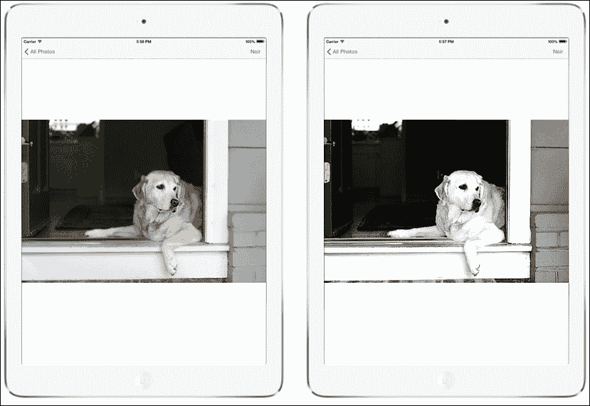

# 第五章。iOS 8 中引入的框架

在本章中，我们将涵盖以下主题：

+   使用 PhotoKit 的工作

+   在所有设备之间无缝恢复活动的 Handoff 功能

# 使用 PhotoKit 的工作

iOS 8 中的一项新功能已被揭晓；它被称为 **PhotoKit**，也称为照片框架。这是一个新的扩展，允许开发者更有效地与设备中存储的照片和视频工作。

PhotoKit 由以下两个新的框架组成：

+   **照片框架**：这将允许开发者检索和编辑照片和视频。它负责处理来自外部应用所做的更改，并提供构建完整应用（如 iOS 默认提供的照片应用）的工具。

+   **照片用户界面**：这负责提供创建编辑扩展的能力——换句话说，就是可以直接从 iOS 相册中用我们的自定义应用编辑照片。

## 照片框架

照片框架提供了访问、添加、编辑和删除模型对象（图像、视频、相册和时刻）的工具。

这些模型实例有一个关键特性——那就是它们是只读的。所以，例如，我们可以编辑一个图像，它不会修改原始内容；然而，它将创建一个新的。

不同的模型对象如下：

+   **资产**：它们指的是图像和视频，由 `PHAsset` 类表示。它提供了指定媒体内容类型（照片或视频）、创建日期、位置以及是否为收藏夹的能力。

+   **资产集合**：它们也被称为时刻，指的是有序的资产集合，例如相册和智能相册。这些对象由 `PHAssetCollection` 表示，其属性包括标题、类型以及开始和结束日期。

+   **集合列表**：它们是有序的集合集合，通常代表文件夹或年份时刻。管理它们的类 `PHCollectionList` 存储列表的类型、标题以及开始和结束日期。

照片框架还引入了 **瞬态集合**，它们引用一组由搜索或用户选择产生的资产，并且可以与普通集合进行交换。在使用此框架时，还需要注意的一点是，我们将需要使用以下类方法等来处理资产：

```swift
[PHAsset fetchAssetsWithMediaType: options:];
[PHAssetCollection fetchMomentsWithOptions:];
[PHAssetCollection transientAssetCollectionWithAssets:title:];
```

## 照片用户界面

照片用户界面是一个非常有趣的框架，它允许我们在应用中创建照片编辑扩展，这些扩展将在内置的照片应用中可用。

这意味着，当在相册中编辑图片时，我们可以选择我们想要使用的应用程序；此编辑的结果将通过 iCloud 对其他应用程序和设备可用，而不会修改原始内容，因为它只读。为了实现这一点，我们需要创建一个应用程序扩展目标，该目标将提供一个视图控制器，该控制器将采用 `PHContentEditingController` 协议。这很简单，因为 Xcode 的新版本提供了一个创建照片编辑扩展的模板；我们只需要关注以下协议方法的实现：

```swift
[startContentEditingWithInput:]
[finishContentEditingWithCompletionHandler:]
[canHandleAdjustmentData:]
[cancelContentEditing]
```

我们可以使用照片框架来处理照片应用管理的照片和视频资产，包括 **iCloud 照片库**。使用此框架检索用于显示和播放的资产，编辑它们的图像或视频内容，或者处理资产集合，例如相册、时刻和 iCloud 共享相册。

## PhotoKit 的功能

PhotoKit 的功能如下：

+   **获取实体和请求更改**：Photos 框架模型类的实例（`PHAsset`、`PHAssetCollection` 和 `PHCollectionList`）代表了用户在照片应用中工作的实体。这些实体是资产（图像或视频）、资产的集合（例如相册或时刻），以及集合的列表（例如相册文件夹或时刻集群）。这些对象也称为照片实体，是只读的、不可变的，并且只包含诸如资产的媒体类型和创建日期之类的元数据。

    我们通过获取我们感兴趣的图片实体，然后使用这些对象来获取我们处理所需的数据来处理资产和集合。要更改照片实体，我们创建更改请求对象，并明确地将它们提交到共享的 `PHPhotoLibrary` 对象。这种架构使得从多个线程或多个应用程序和应用程序扩展中处理相同的资产变得容易、安全且高效。

+   **观察变化**：使用共享的 `PHPhotoLibrary` 对象为获取的图片实体注册一个变化处理器。PhotoKit 会通知您的应用程序，当其他应用程序或设备更改了资产的内容或元数据，或者更改了集合中资产的列表时。`PHChange` 对象提供了关于每个变化前后对象状态的信息，这些语义使得更新集合视图或类似界面变得容易。

+   **支持照片应用功能**：使用 `PHCollectionList` 类来查找与照片应用中时刻层次结构对应的资产。使用 `PHAsset` 类来识别连拍照片、全景照片和高帧率视频。当启用 iCloud 照片库时，Photos 框架中的资产和集合反映了同一 iCloud 账户下所有设备上的内容。

+   **资产和缩略图加载和缓存**：使用 `PHImageManager` 类请求指定大小的资产图像或使用 AV Foundation 对象处理视频资产。Photos 框架会根据您的指定自动下载或生成图像，并将它们缓存以供快速重用。对于大量资产（例如，当用缩略图填充集合视图时）的更快性能，`PHCachingImageManager` 子类添加了批量预加载功能。

+   **资产内容编辑**：`PHAsset` 和 `PHAssetChangeRequest` 类定义了请求编辑照片或视频内容的方法，并将您的编辑提交到照片库。为了支持在不同应用程序和扩展之间保持编辑的连续性，Photos 会保留每个资产的当前版本和上一个版本，以及描述最后编辑的 `PHAdjusmentData` 对象。如果您的应用程序支持来自先前编辑的调整数据，您可以允许用户撤销或更改编辑。

有许多 PhotoKit 类；我们将在下表中讨论它们：

| 类别 | 描述 |
| --- | --- |
| `PHAdjustmentData` | 当用户编辑资产时，Photos 会保存此对象以及修改后的图像或视频数据 |
| `PHAssetChangeRequest` | 您可以在照片库中创建和使用此对象，并更改块以创建、删除或修改 `PHAsset` 对象 |
| `PHAssetCollectionChangeRequest` | 您可以在照片库中创建和使用此对象，并更改块以创建、删除或修改 `PHAssetCollection` 对象 |
| `PHChange` | Photos 提供此对象以通知您的应用程序 Photos 应用程序管理的资产和集合的任何更改 |
| `PHCollectionListChangeRequest` | 您可以在照片库中创建和使用此对象，并更改块以创建、删除或修改 `PHCollectionList` 对象 |
| `PHContentEditingInput` | 此对象描述了用于编辑的资产 |
| `PHContentEditingInputRequestOptions` | 您可以使用此对象在请求编辑 `PHAsset` 对象的图像或视频内容时指定选项 |
| `PHContentEditingOutput` | 此对象表示编辑 Photos 资产的照片或视频内容的结果 |
| `PHFetchOptions` | 您可以使用此对象在调用 `PHAsset`、`PHCollection`、`PHAssetCollection` 和 `PHCollectionList` 类的方法时指定选项，以检索照片实体 |
| `PHFetchResult` | 此对象是一个有序照片实体对象的容器 |
| `PHFetchResultChangeDetails` | 此对象提供了有关两个检索结果之间差异的详细信息——您之前获得的那个和您再次执行相同检索将得到的更新后的那个 |
| `PHImageManager` | 这是一个共享对象，它提供了加载与 `PHAsset` 对象关联的图像或视频数据的方法 |
| `PHCachingImageManager` | 此对象用于获取或生成照片或视频资产的图像数据 |
| `PHImageRequestOptions` | 您可以使用此对象在从 `PHImageManager` 对象请求照片资源的图像表示时指定选项 |
| `PHObject` | 此类是照片实体对象的抽象基类 |
| `PHAsset` | 此对象表示在照片应用中出现的图像或视频文件，包括 iCloud 照片内容 |
| `PHCollection` | 此类是一个抽象类，定义了照片集合类之间共享的行为 |
| `PHAssetCollection` | 此对象表示一组照片或视频资源 |
| `PHCollectionList` | 此对象表示一组资产集合 |
| `PHObjectPlaceholder` | 此对象是一个只读代理，表示尚未创建的对象 |
| `PHObjectChangeDetails` | 此对象提供了关于照片实体两个状态之间差异的详细信息——一个是您之前获取的状态，另一个是您再次获取此实体时的更新状态 |
| `PHPhotoLibrary` | 这是一个共享对象，表示用户的照片库——由照片应用管理的整个资产和集合集，包括存储在本地设备上的对象以及（如果启用）在 iCloud 照片中存储的对象 |
| `PHVideoRequestOptions`  | 您可以使用此对象在从 `PHImageManager` 对象请求视频资源时指定选项 |

PhotoKit 通过多种获取方法使查询模型数据变得简单。例如，要检索所有图像，您可以调用 `PFAsset.Fetch`，传递 `PHAssetMediaType.Image` 媒体类型：

```swift
PHFetchResult fetchResults = PHAsset.FetchAssets (PHAssetMediaType.Image, null);
```

`PHFetchResult` 实例将包含所有代表图像的 `PFAsset` 实例。要获取图像本身，您可以使用 `PHImageManager`（或缓存版本，`PHCachingImageManager`）通过调用 `requestImageForAsset` 来请求图像。例如，以下代码为 `PHFetchResult` 中的每个资产检索图像，以在集合视图单元格中显示。此示例使用 Swift 语言，因此我们需要了解 Swift。为了更好地开始 Swift，您可以访问 [`www.raywenderlich.com/tutorials`](http://www.raywenderlich.com/tutorials)。

```swift
public override UICollectionViewCell GetCell (UICollectionView collectionView, NSIndexPath indexPath)
{
  var imageCell = (ImageCell)collectionView.DequeueReusableCell(cellId, indexPath);
  imageMgr.RequestImageForAsset ((PHAsset)fetchResults[(uint)indexPath.Item], 
    thumbnaillSize,
    PHImageContentMode.AspectFill, new PHImageRequestOptions (),(img, info) => {
        imageCell.ImageView.Image = img;
    });
  return imageCell;
}
```

这就是处理查询和读取数据的方式。您还可以将更改写回库中。由于多个感兴趣的应用程序能够与系统的照片库交互，您可以使用 `PhotoLibraryObserver` 注册观察者以通知任何更改。然后，当有更改发生时，您的应用程序可以相应地更新。例如，以下是一个简单的实现，用于重新加载集合视图：

```swift
class PhotoLibraryObserver : PHPhotoLibraryChangeObserver
{
  readonly PhotosViewController controller;
  public PhotoLibraryObserver (PhotosViewController controller)
  {
    this.controller = controller;
  }
  public override void PhotoLibraryDidChange (PHChange changeInstance)
  {
    DispatchQueue.MainQueue.DispatchAsync (() => {
      var changes = changeInstance.GetFetchResultChangeDetails (controller.fetchResults);
      controller.fetchResults = changes.FetchResultAfterChanges;
      controller.CollectionView.ReloadData ();
    });
  }
}
```

要实际将更改从您的应用程序写回，您可以创建一个更改请求。每个模型类都有一个相关的更改请求类。例如，要更改 `PHAsset`，您可以创建 `PHAssetChangeRequest`。执行写回照片库并发送到观察者的更改的步骤如下：

1.  执行编辑操作。

1.  将过滤后的图像数据保存到`PHContentEditingOutput`实例。

1.  提出更改请求以发布从编辑输出中更改的内容。

这里有一个示例，将更改写回应用核心图像 noir 滤镜的图像。您还可以参考[`blog.xamarin.com/build-great-photo-experiences-in-ios-8-with-photokit/`](http://blog.xamarin.com/build-great-photo-experiences-in-ios-8-with-photokit/)以更详细地了解：

```swift
void ApplyNoirFilter (object sender, EventArgs e)
{
  Asset.RequestContentEditingInput (new PHContentEditingInputRequestOptions (), (input, options) => {
    //
    // perform the editing operation, which applies a noir filter in this case
    var image = CIImage.FromUrl (input.FullSizeImageUrl);
    image = image.CreateWithOrientation ((CIImageOrientation)input.FullSizeImageOrientation);
    var noir = new CIPhotoEffectNoir {
      Image = image
    };
    var ciContext = CIContext.FromOptions (null);
    var output = noir.OutputImage;
    var uiImage = UIImage.FromImage (ciContext.CreateCGImage (output, output.Extent));
    imageView.Image = uiImage;
    //
    // save the filtered image data to a PHContentEditingOutput instance
    var editingOutput = new PHContentEditingOutput(input);
    var adjustmentData = new PHAdjustmentData();
    var data = uiImage.AsJPEG();
    NSError error;
    data.Save(editingOutput.RenderedContentUrl, false, out error);
    editingOutput.AdjustmentData = adjustmentData;
    //
    // make a change request to publish the changes form the editing output
    PHPhotoLibrary.GetSharedPhotoLibrary.PerformChanges (
      () => {
        PHAssetChangeRequest request = PHAssetChangeRequest.ChangeRequest(Asset);
        request.ContentEditingOutput = editingOutput;
      },
    (ok, err) => Console.WriteLine ("photo updated successfully: {0}", ok));
  });
}
```

当用户选择按钮时，应用过滤器，如下面的截图所示：



多亏了`PHPhotoLibraryChangeObserver`，当用户导航回照片库时，更改会在集合视图中反映出来。

您可以从[`github.com/mikebluestein/PhotoKitDemo`](https://github.com/mikebluestein/PhotoKitDemo)下载示例项目。

# 无缝恢复活动的 Handoff

Handoff 是 OS X 和 iOS 中的一个功能，它扩展了跨设备的用户体验的连续性。Handoff 允许用户在一个设备上开始一项活动，然后切换到另一个设备并继续在同一设备上完成该活动。例如，一个在 Safari 中浏览长篇文章的用户移动到已登录相同 Apple ID 的 iOS 设备；现在相同的网页在 iOS 的 Safari 中自动打开，滚动位置与原始设备相同。Handoff 使这种体验尽可能无缝。

要参与 Handoff，一个应用采用基础库中的一个小 API。应用中的每个持续活动都由一个包含恢复活动所需数据的用户活动对象表示。当用户选择恢复此活动时，该对象被发送到恢复设备。每个用户活动对象都有一个委托对象，在适当的时候被调用以刷新活动状态，例如在用户活动对象在设备之间发送之前。

如果继续活动需要比用户活动对象容易传输的数据更多，恢复应用有选项打开到原始应用的流。基于文档的应用自动支持使用 iCloud 文档的用户的活动继续。Apple 应用使用公共 API 实现 iOS 8 和 OS X v10.10 的 Handoff。第三方开发者可以使用相同的 API 在共享开发者团队 ID 的应用中实现 Handoff。此类应用必须通过 App Store 分发或由注册的开发者签名。

## Handoff 的兼容性

首先，让我们看看什么与 Handoff 兼容：

+   配备 Lightning 连接器的 iOS 设备和 2012 年或更新的 Mac 型号支持 Handoff。两者都有支持蓝牙低功耗和 Wi-Fi Direct 的无线电芯片。

+   如果您的设备兼容，您可以在 Mac 的**通用**系统偏好设置中以及 iOS 的**设置**应用下的**通用**面板中启用 Handoff；在两种情况下，寻找包含**Handoff**一词的选项。

+   所有设备都必须登录到相同的 iCloud 账户。Handoff 不与其他用户一起工作（这是 AirDrop 的作用）。

+   最后，确保所有设备都打开了蓝牙和 Wi-Fi。

到目前为止，苹果公司宣布 Handoff 将与以下应用一起工作：

+   邮件

+   Safari

+   页面

+   数字

+   演示文稿

+   地图

+   消息

+   提醒

+   日历

+   联系人

使用它们，我们可以开始撰写或阅读电子邮件或网站；编辑文档、电子表格或演示文稿；查找位置；输入文本；选择提醒；输入约会；或在您的 Mac 上查找地址，然后在 iPhone（iPad 或反之亦然）上继续或完成。

### 应用框架支持

**UIKit**和**AppKit**在文档、响应者和应用代理类中提供了对 Handoff 的支持。尽管在不同平台之间存在一些行为上的细微差异，但使应用能够保存和恢复用户活动的根本机制是相同的，并且 API 也是相同的。

### Handoff 交互

传递用户活动涉及以下三个步骤：

1.  为用户参与的每个活动创建一个用户活动对象。

1.  定期更新用户活动对象，以包含用户正在执行的信息。

1.  当用户请求时，在另一台设备上继续用户活动。

## 直接实现 Handoff

在您的应用中采用 Handoff 需要您编写使用 UIKit 和 AppKit 中的 API 创建用户活动对象、更新对象状态以跟踪活动，并在另一台设备上继续活动的代码。

### 创建用户活动对象

每个可以被传递给继续使用的设备用户活动都由从`NSUserActivity`类实例化的用户活动对象表示。这个类为它支持的每个用户活动创建一个用户活动对象。这些用户活动的类型取决于应用。例如，Safari 允许用户在相同网站上继续使用浏览器。

以下代码创建了`NSUserActivity`实例。`myactivity.userinfo`对象存储了当前的 URL 和滚动位置。`becomeCurrent`对象包含我们项目的当前状态，并且每秒更新一次。创建当前状态的对象是必要的；否则，其他设备将无法理解从哪里开始。

```swift
NSUserActivity* myActivity = [[NSUserActivity alloc]
   initWithActivityType: @"com.myCompany.myBrowser.browsing"];
myActivity.userInfo = @{ ... };
myActivity.title = @"Browsing";
[myActivity becomeCurrent];
```

在终止或完成应用后，用户活动对象将自动释放。然后该对象将从所有设备中删除。

### 指定活动类型

活动类型标识符是一个短字符串，它出现在你的应用的`Info.plist`属性列表文件中的`NSUserActivityTypes`数组中，该数组列出了你的应用支持的所有活动类型。当你创建活动时，传递相同的字符串，此时活动对象以`com.myCompany.myBrowser.browsing`的活动类型创建，这是一种反向 DNS 风格的表示法，旨在避免冲突。当用户选择继续活动时，活动类型（以及应用的团队 ID）确定在接收设备上启动哪个应用以继续活动。

### 注意

你可以在创建实例时指定`NSUserActivity`对象的活动类型。创建后，你不能更改对象的活动类型。

例如，一个类似提醒事项的应用序列化用户正在查看的提醒列表。当用户点击新的提醒列表时，应用在`NSUserActivityDelegate`中跟踪该活动。以下代码显示了在用户切换到不同的提醒列表时被调用的方法的可能实现。此应用将活动名称追加到应用的捆绑标识符中，以创建在创建其`NSUserActivity`对象时使用的活动类型。

```swift
    // UIResponder and NSResponder have a userActivity property
    NSUserActivity *currentActivity = [self userActivity];

   // Build an activity type using the app's bundle identifier
    NSString *bundleName = [[NSBundle mainBundle] bundleIdentifier];
    NSString *myActivityType = [bundleName stringByAppendingString:@".selected-list"];

    if(![[currentActivity activityType] isEqualToString:myActivityType]) {
        [currentActivity invalidate];

        currentActivity = [[NSUserActivity alloc]
          initWithActivityType:myActivityType];
        [currentActivity setDelegate:self];
        [currentActivity setNeedsSave:YES];

        [self setUserActivity:currentActivity];

    } else {

      // Already tracking user activity of this type
      [currentActivity setNeedsSave:YES];
    }
```

之前的代码使用了`setNeedsSave`访问器方法来标记用户活动对象，当它需要更新时。这使系统能够合并更新并延迟执行。

### 填充活动对象的用户信息字典

活动对象有一个包含所需数据的用户信息字典，以便将活动传递给继续应用。用户信息字典可以包含`NSArray`、`NSDate`、`NSDictionary`、`NSNull`、`NSNumber`、`NSSet`、`NSString`和`NSUrl`对象。系统修改使用`file:`方案的`NSUrl`对象，并指向指向接收设备上相应容器中相同项的 iCloud 文档：

```swift
NSUserActivity* myActivity = [[NSUserActivity alloc]
                      initWithActivityType: @"com.myCompany.myReader.reading"];

// Initialize userInfo
NSURL* webpageURL = [NSURL URLWithString:@"http://www.myCompany.com"];
myActivity.userInfo = @{
             @"docName" : currentDoc,
             @"pageNumber" : self.pageNumber,
             @"scrollPosition" : self.scrollPosition
};
```

### 在响应者中采用手势传递

如果你将活动设置为响应者的`userActivity`属性，你可以将响应者对象（在 OS X 上继承自`NSResponder`或在 iOS 上继承自`UIResponder`）与给定的用户活动关联。系统会在适当的时候自动保存`NSUserActivity`对象，调用响应者的`updateUserActivityState:`重写方法，使用活动对象的`userInfoEntriesFromDictionary:`方法将当前数据添加到用户活动对象中：

```swift
- (void)updateUserActivityState:(NSUserActivity *)userActivity {
    . . .
  [userActivity setTitle: self.activityTitle];
  [userActivity addUserInfoEntriesFromDictionary: self.activityUserInfo];
}
```

### 继续活动

手势传递自动宣传可在 iOS 和 OS X 设备上继续的活动，这些设备与原始设备物理邻近，并登录到与原始设备相同的 iCloud 账户。当用户选择继续某个活动时，手势传递启动相应的应用，并通过`AppDelegate`发送消息来确定如何使用`AppDelegate`恢复活动。

实现方法 `application:willContinueUserActivityWithType:` 以让用户知道活动将很快继续。使用 `application:continueUserActivity:restorationHandler:` 方法来配置应用以继续活动。当活动对象及其 `userInfo` 字典中的活动状态数据对继续应用可用时，系统会调用此方法。

### 注意

对于在 `NSUserActivity` 对象的 `userinfo` 字典中传输的 URL，我们必须调用 `startAccessingSecurityScopedResource`，并且它必须在我们可以访问 URL 之前返回 `YES`。在完成文件使用后，调用 `stopAccessingSecurityScopedResource`。

此要求的例外是 `UIDocument` 文档的 URL 和为 `specifyingNSUbiquitousDocumentUserActivityType` 应用自动创建的 `NSDocument` 的 URL，这些 URL 从 `:continueUserActivity:restorationHandler:` 应用返回 NO（或者留空不实现）。请参阅 [`developer.apple.com/library/mac/documentation/UserExperience/Conceptual/Handoff/AdoptingHandoff/AdoptingHandoff.html#//apple_ref/doc/uid/TP40014338-CH2-SW17`](https://developer.apple.com/library/mac/documentation/UserExperience/Conceptual/Handoff/AdoptingHandoff/AdoptingHandoff.html#//apple_ref/doc/uid/TP40014338-CH2-SW17) 中的 *在基于文档的应用中采用 Handoff*。

您可以通过将对象传递给与 `application:continueUserActivity:restorationHandler:` 消息一起传递的恢复处理程序块来选择性地执行应用以继续活动的额外配置。以下代码展示了此方法的简单实现：

```swift
- (BOOL)application:(NSApplication *)application
             continueUserActivity: (NSUserActivity *)userActivity
               restorationHandler: (void (^)(NSArray*))restorationHandler {
    BOOL handled = NO;
    // Extract the payload
    NSString *type = [userActivity activityType];
    NSString *title = [userActivity title];
    NSDictionary *userInfo = [userActivity userInfo];
    // Assume the app delegate has a text field to display the activity information
    [appDelegateTextField setStringValue: [NSString stringWithFormat:
        @"User activity is of type %@, has title %@, and user info %@",
        type, title, userInfo]];

    restorationHandler(self.windowControllers);
    handled = YES;

    return handled;
}
```

在这种情况下，应用代理有一个 `NSWindowController` 对象数组 `windowControllers`。这些窗口控制器知道如何配置应用的所有窗口以恢复活动。在将此数组传递给 `restorationHandler` 块之后，Handoff 会向这些对象中的每一个发送一个 `restoreUserActivityState:` 消息，传递恢复活动的 `NSUserActivity` 对象。窗口控制器从 `NSResponder` 继承了 `restoreUserActivityState:` 方法；每个控制器对象都重写此方法以配置其窗口，使用活动对象 `userInfo` 字典中的信息。

为了支持优雅的失败，应用代理应该实现 `application:didFailToContinueUserActivityWithType:error:` 方法。如果您不实现此方法，应用框架仍然会显示包含在传入的 `NSError` 对象中的诊断信息。

### 注意

本节中描述的用于 Handoff 的 `UIApplicationDelegate` 方法，当任一应用代理方法 `application:willFinishLaunchingWithOptions:` 或 `application:didFinishLaunchingWithOptions:` 返回 NO 时，不会被调用。

## 原生应用到网页浏览器 Handoff

当在原始设备上使用原生应用时，用户可能希望在相应的原生应用中继续活动。如果有与活动相对应的网页，它仍然可以被传递。例如，视频库应用允许用户浏览可观看的电影，而邮件应用允许用户阅读和撰写电子邮件。在许多情况下，用户可以通过网页界面执行相同的活动。在这种情况下，原生应用知道网页界面的 URL，可能包括指定正在浏览的视频或正在阅读的消息的语法。因此，当原生应用创建`NSUserActivity`对象时，它会设置`webpageURL`属性。如果接收设备没有支持用户活动`activityType`属性的应用，它可以在继续平台的默认网络浏览器中恢复活动。

想以这种方式继续活动的 OS X 网络浏览器应声明`NSUserActivityTypeBrowsingWeb`活动类型（通过在应用的`Info.plist`属性列表文件中的`NSUserActivityTypes`数组中输入此字符串）。这确保了，如果用户选择任何其他浏览器作为他们的默认浏览器，它将接收活动对象而不是 Safari。

## 网络浏览器到原生应用的手动传递

在相反的情况下，如果用户在原始设备上使用网络浏览器，而接收设备是一个具有声明`webpageURL`属性域名部分的原生应用（iOS 设备），那么 iOS 将启动原生应用并向其发送一个`activityType`值为`NSUserActivityTypeBrowsingWeb`的`NSUserActivity`对象。`webpageURL`属性包含用户正在访问的 URL，而`userInfo`字典为空。

接收设备上的原生应用必须通过在`com.apple.developer.associated-domains`权限中声明一个域名来适应这种行为。此权限的值具有`<service>:<fully qualified domain name>`格式，例如，`activitycontinuation:example.com`。在这种情况下，服务必须是`activitycontinuation`。在 Xcode 中，在**Target**设置的**Capabilities**标签下的**Associated Domains**部分添加`com.apple.developer.associated-domains`权限的值。

如果此域名与`webpageURL`属性匹配，手动传递将下载来自域的批准应用 ID 列表。域批准的应用有权继续活动。在您的网站上，您可以在名为`apple-app-site-association`的签名 JSON 文件中列出批准的应用；例如，网页地址变为`https://example.com/apple-app-site-association`（您必须使用实际设备而不是模拟器来测试下载 JSON 文件）。

JSON 文件包含一个字典，该字典指定了在 **目标** 设置的 **常规** 选项卡中 `<team identifier>.<bundle identifier>` 格式的应用程序标识符列表，例如 `YWBN8XTPBJ.com.example.myApp`。以下代码显示了一个格式化的 JSON 文件示例，用于读取：

```swift
{
    "activitycontinuation": {
    "apps": [ "YWBN8XTPBJ.com.example.myApp",
              "YWBN8XTPBJ.com.example.myOtherApp" ]
    }
}
```

要对 JSON 文件进行签名（以便它从服务器返回时带有正确的 `application/pkcs7-mime` 内容类型），请将内容放入一个文本文件并对其进行签名。您可以使用以下代码中显示的终端命令等执行此任务，通过删除文本中的空白字符以方便操作。使用 `openssl` 命令和由受 iOS 信任的证书颁发机构签发的身份证书和密钥（在 [`support.apple.com/kb/ht5012`](http://support.apple.com/kb/ht5012) 中列出）。它不必是托管 Web 凭证的同一身份（例如示例代码中的 `https://example.com`），但它必须是针对所涉及域名的有效 TLS 证书：

```swift
echo '{"activitycontinuation":{"apps":["YWBN8XTPBJ.com.example.myApp",
"YWBN8XTPBJ.com.example.myOtherApp"]}}' > json.txt
 cat json.txt | openssl smime -sign -inkey example.com.key
 -signer example.com.pem
 -certfile intermediate.pem
 -noattr -nodetach
 -outform DER > apple-app-site-association

```

`openssl` 命令的输出是您放在网站上的签名 JSON 文件，位于 `apple-app-site-association` URL 上——在本例中为 `https://example.com/apple-app-site-association`。

应用程序可以将 `webpageURL` 属性设置为任何 Web URL，但它只能接收 `webpageURL` 域在 `com.apple.developer.associated-domains` 权限中的活动对象。此外，`webpageURL` 的方案必须是 `http` 或 `https`。任何其他方案都会抛出异常。

## 使用延续流

如果恢复活动需要比初始 Handoff 有效载荷能够有效传输的数据更多，则延续应用程序可以回调到原始应用程序的活动对象以在应用程序之间打开流并传输更多数据。在这种情况下，原始应用程序将其 `NSUserActivity` 对象的布尔属性 `supportsContinuationStreams` 设置为 `YES`，设置用户活动代理，然后调用 `becomeCurrent`，如下面的代码所示：

```swift
NSUserActivity* activity = [[NSUserActivity alloc] init];
activity.title = @"Editing Mail";
activity.supportsContinuationStreams = YES;
activity.delegate = self;
[activity becomeCurrent];
```

在继续使用的设备上，在用户表示他们想要恢复活动后，系统将启动相应的应用程序并开始向应用程序代理发送消息。然后应用程序代理可以通过向其用户活动对象发送 `getContinuationStreamsWithCompletionHandler` 消息来请求将流返回到原始应用程序，如下面的代码覆盖实现所示：

```swift
- (BOOL)application:(UIApplication *)application
        continueUserActivity: (NSUserActivity *)userActivity
        restorationHandler: (void(^)(NSArray *restorableObjects))restorationHandler
{
    [userActivity getContinuationStreamsWithCompletionHandler:^(
                  NSInputStream *inputStream,
                  NSOutputStream *outputStream, NSError *error) {

        // Do something with the streams

    }];

  return YES;
}
```

在原始设备上，用户活动代理在其 `userActivity:didReceiveInputStream:outputStream` 方法的回调中接收流，它实现了该方法以提供在恢复设备上使用流继续用户活动所需的数据。

`NSInputStream` 提供了对流数据的只读访问，而 `NSOutputStream` 提供了只写访问。因此，在原始端写入输出流的数据，将在继续端从输入流中读取；反之亦然。流设计用于请求-响应模式，也就是说，继续端使用流从原始端请求更多续传数据，然后原始端使用流提供所需数据。

续传流是 Handoff 的一个可选功能；大多数用户活动不需要它们来实现成功的续传。即使需要流，在大多数情况下，应用之间应该有最少的来回交互。一个简单的请求来自继续应用，并伴随来自原始应用的响应，对于大多数续传事件来说应该就足够了。你可以从 [`github.com/dokterdok/Continuity-Activation-Tool`](https://github.com/dokterdok/Continuity-Activation-Tool) 下载示例项目。

# 摘要

在本章中，我们讨论了新的 iOS 8 API 和 Swift 的简短代码片段。你学习了 PhotoKit 框架和 Handoff，并附带了一些代码片段。在下一章中，我们将讨论 iOS 中的 iCloud 和安全服务，以及它们的实现。
