# 第六章。使用 iCloud 和安全服务

在本章中，您将学习如何将数据存储在云端，即 iCloud 和 iOS 的安全服务中，通过这些服务我们可以保护我们的数据、密码等。

在本章中，我们将涵盖以下主题：

+   与 iCloud 一起工作

+   使用密钥链过程保存数据

+   iOS Touch ID 验证

# 与 iCloud 一起工作

基本上，**iCloud** 是一种帮助用户在不同设备间同步数据的云服务。其主要目的是让用户能够轻松存储文件或文档等数据，以便在任何 iOS 设备上访问。虽然您可以使用其他云服务来保存文件或数据，但 iCloud 的核心思想是消除设备之间的显式或有线连接。苹果公司不希望用户将云服务器和同步过程联系起来。一切工作都简单无缝地完成。

同样的设计理念也适用于开发者。当我们采用 iCloud 时，我们不需要知道如何与云服务器交互或上传数据到 iCloud。iOS 会处理所有繁重的工作。我们的重点是内容，例如管理数据的变化或开发云与设备之间的连接。

iCloud 提供三种类型的存储：

+   **键值存储**：用于存储设置、偏好设置和应用程序状态等内容。

+   **文档存储**：用于存储文件类型内容，如 WordPress 文档、绘图和复杂的应用程序状态。

+   **核心数据存储**：用于结构化内容的跨设备数据库解决方案。iCloud 核心数据存储建立在文档存储之上，并使用相同的 iCloud API。

让我们了解 iCloud 实际上是如何工作的。要使用 iCloud，我们需要一个 iOS 开发者账户。假设我们有一个 iOS 开发者账户，请按照以下步骤操作：

1.  访问 [`idmsa.apple.com/IDMSWebAuth/login?&appIdKey=891bd3417a7776362562d2197f89480a8547b108fd934911bcbea0110d07f757&path=%2F%2Faccount%2Findex.action`](https://idmsa.apple.com/IDMSWebAuth/login?&appIdKey=891bd3417a7776362562d2197f89480a8547b108fd934911bcbea0110d07f757&path=%2F%2Faccount%2Findex.action)。我们首先创建具有可用 iCloud 功能的应用程序 ID。

1.  登录到 iOS 配置文件门户，选择应用程序 ID，然后创建一个新的应用程序 ID。

1.  通过选择 **iCloud** 选项为您的应用程序启用 iCloud 服务。选择您正在使用的 Xcode（如果您正在使用 Xcode 5，则选择 Xcode 5）并点击 **继续**，如图所示：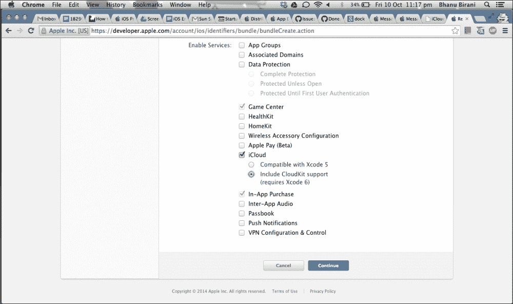

1.  现在，在 **名称** 文本框中输入我们项目的名称，在 **包 ID** 文本框中写入包 ID，然后点击 **继续**，如图所示：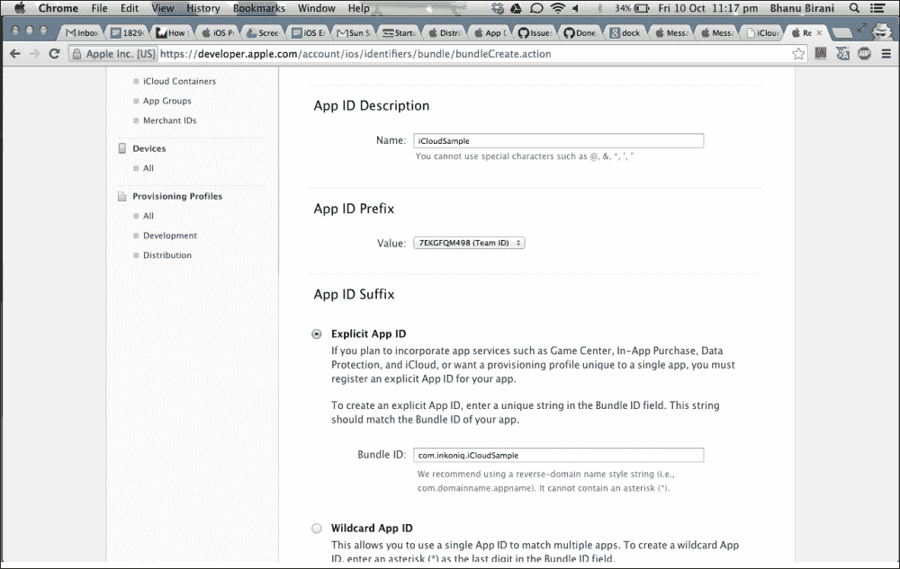

1.  现在，它将显示我们应用程序启用的服务。确保 **iCloud** 已启用或可配置，如图所示：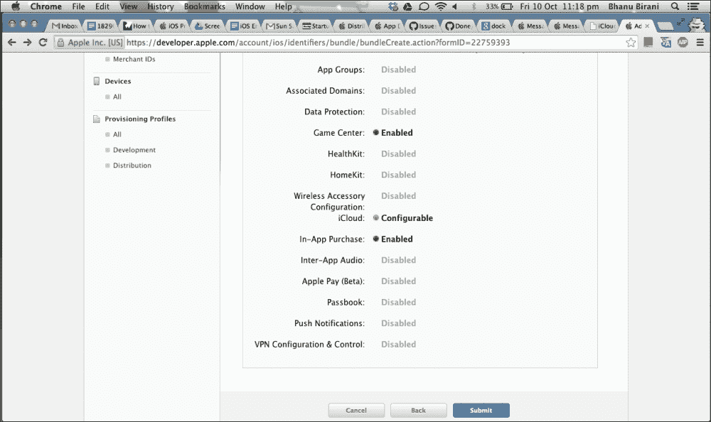

1.  然后，进入**Xcode**并构建一个新的单视图应用程序。之后，进入**Xcode**中的**功能**并开启**iCloud**；这将包括 iCloud 权限、iCloud 容器以及到 Cloud 框架的链接，如图下所示：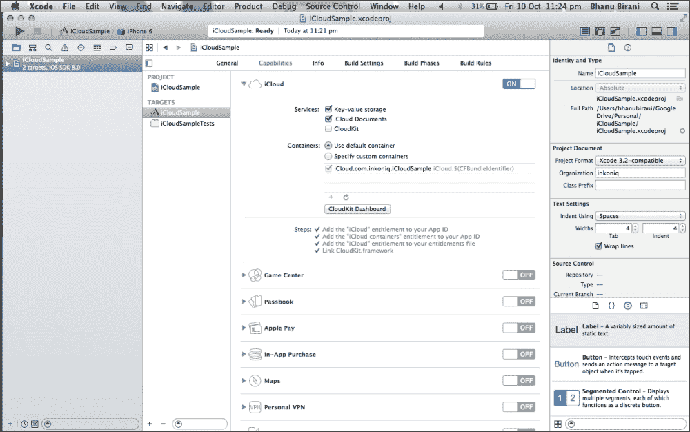

1.  确保权限是自动创建的。以下截图显示了创建的权限：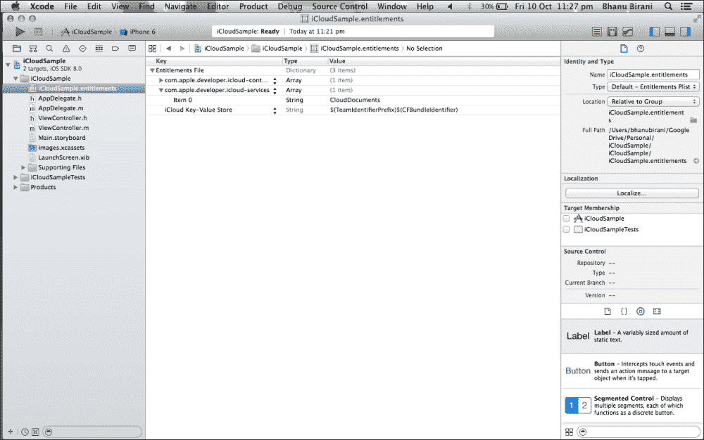

1.  删除故事板中的`ViewController`类和现有视图。

1.  现在，我们将清空故事板并创建一个新的 Objective-C 类，它是`tableViewController`的子类，并将其命名为（例如，`NoteListViewController`）。

1.  将一个表格视图控制器拖到故事板中，并将其嵌入到导航控制器中。现在，从属性检查器为这个表格视图控制器命名；它应该与类名相同。为一个新的类重复此操作一次，并将其命名为（例如，`AddNoteViewController`）。

1.  现在，我们在故事板中有两个表格视图。对于`NoteListViewController`，将一个按钮拖到导航栏的右上角，并将标识符设置为`add`。这将自动将按钮更改为**+**按钮，如图下所示。接下来，选择原型单元格并将其样式更改为**Basic**。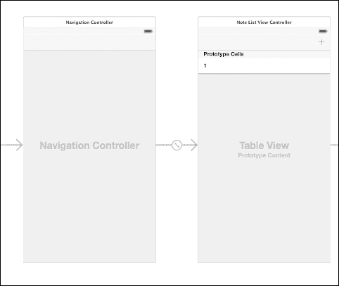

    导航控制器和笔记列表视图控制器

1.  对于`AddNoteViewController`，将栏按钮拖到导航栏中。将一个命名为`Cancel`，另一个命名为`Save`。

1.  然后，选择表格视图并将其内容设置为**静态单元格**。最后，向表格视图中添加一个静态行并添加一个文本字段，如图所示：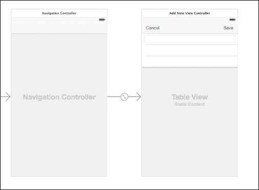

    导航控制器和笔记列表视图控制器

1.  当用户点击**+**按钮时，将显示`AddNoteViewController`。因此，按住*Ctrl*键，点击**+**按钮，并将其拖到**添加笔记视图控制器**。选择**模态**作为过渡动作。现在，我们的故事板应该看起来像这样：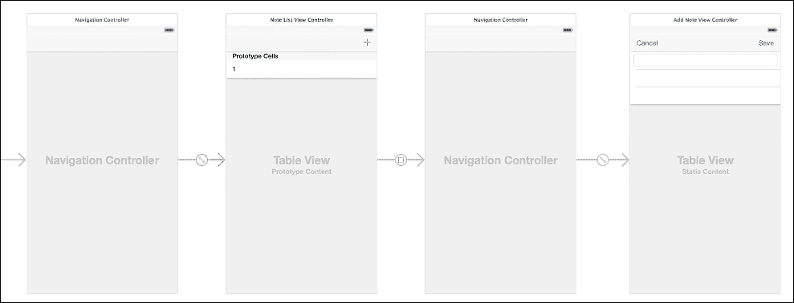

    显示添加笔记视图控制器的表格视图

1.  最后，将文本字段链接到`AddNoteViewController`并创建两个动作方法：`Cancel`和`Save`。我们的`AddNoteViewController.h`中的代码应该如下所示：

    ```swift
    #import <UIKit/UIKit.h>
    @interface AddNoteViewController : UITableViewController
    - (IBAction)cancel:(id)sender;
    - (IBAction)save:(id)sender;
    @property (weak, nonatomic) IBOutlet UITextField *noteTextField;
    ```

1.  我们需要实现`NoteListViewController`类，以便我们可以在表格视图中显示云上可用的笔记。打开`NoteListViewController.h`并将此属性添加到其中：

    ```swift
    @property (strong, nonatomic) NSMutableArray *notes;
    ```

1.  该属性的目的是在本地保存笔记。当需要时，我们将在表格视图中显示笔记。接下来，我们需要对此属性进行懒加载实例化。如果有一个只需要配置一次且涉及一些我们不想在`init`方法中混淆的配置的对象，懒加载实例化是一个很好的技术。在`NoteListViewController.m`中添加以下代码：

    ```swift
    - (NSArray *)notes
    {
      if(!_notes){
        _notes = [NSMutableArray array];
        _notes = [[[NSUbiquitousKeyValueStore defaultStore] arrayForKey:@"AVAILABLE_NOTES"] mutableCopy];
      }
      return _notes;
    }
    ```

1.  在 `viewDidLoad` 方法中，我们需要创建如下通知方法：

    ```swift
    - (void)viewDidLoad
    {
      [super viewDidLoad];
      self.navigationItem.leftBarButtonItem = self.editButtonItem;
      //  Observer to catch changes from iCloud
      NSUbiquitousKeyValueStore *store = [NSUbiquitousKeyValueStore defaultStore];
      [[NSNotificationCenter defaultCenter] addObserver:selfselector:@selector(storeDidChange:)name: NSUbiquitousKeyValueStoreDidChangeExternallyNotificationobject:store]; [[NSUbiquitousKeyValueStore defaultStore] synchronize]; // Observer to catch the local changes 
      [[NSNotificationCenter defaultCenter] addObserver:selfselector:@selector(didAddNewNote:)name:@"New Note"object:nil]; }
    ```

    使用 `NSUbiquitousKeyValueStore` 类实现 iCloud 数据同步。`NSUbiquitousKeyValueStore` 是 `NSObject` 的子类，并在 iOS 5.0 及以后的版本中可用。`NSNotificationCenter` 对象提供了一种在程序内部广播信息或消息的机制。它也是一个 `NSObject` 的子类，并在 iOS 2.0 及以后的版本中可用。

    我们的 `viewDidLoad` 方法可能看起来像这样：

    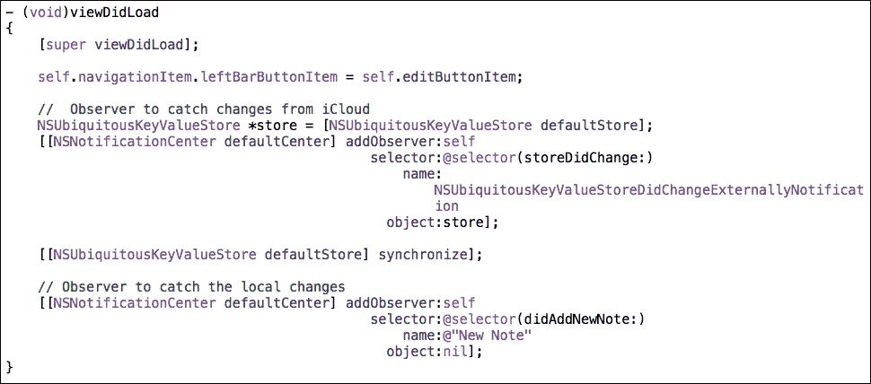

1.  现在，我们必须实现当调用前面的通知时执行的方法。当用户保存新笔记时，将调用 `didAddNewNote` 方法：

    ```swift
    #pragma mark - Observer New Note
    - (void)didAddNewNote:(NSNotification *)notification{
        NSDictionary *userInfo = [notification userInfo];
        NSString *noteStr = [userInfo valueForKey:@"Note"];
        [self.notes addObject:noteStr];
        // Update data on the iCloud
        [[NSUbiquitousKeyValueStore defaultStore] setArray:self.notes forKey:@"AVAILABLE_NOTES"];
        // Reload the table view to show changes
        [self.tableView reloadData];
    }

    #pragma mark - Observer

    - (void)storeDidChange:(NSNotification *)notification{
        // Retrieve the changes from iCloud
        _notes = [[[NSUbiquitousKeyValueStore defaultStore] arrayForKey:@"AVAILABLE_NOTES"] mutableCopy];
        // Reload the table view to show changes
        [self.tableView reloadData];
    }
    ```

1.  我们需要在表格视图中显示笔记。我们已经检索了保存在 iCloud 中的笔记；其余的实现是在表格视图中显示笔记。在 `NoteListViewController.m` 中添加以下代码：

    ```swift
    - (NSInteger)numberOfSectionsInTableView:(UITableView *)tableView
      {
        return 1;
      }
    - (NSInteger)tableView:(UITableView *)tableView numberOfRowsInSection:(NSInteger)section
    {
      return [self.notes count];
    }

    - (UITableViewCell *)tableView:(UITableView *)tableView cellForRowAtIndexPath:(NSIndexPath *)indexPath
    {
      static NSString *CellIdentifier = @"Cell";
      UITableViewCell *cell = [tableView dequeueReusableCellWithIdentifier:CellIdentifier forIndexPath:indexPath];
      NSString *note = [self.notes objectAtIndex:indexPath.row];
      [cell.textLabel setText:note];
      return cell;
    }
    ```

1.  我们现在已经到达了过程的最后部分：实现 `AddNoteViewController` 以将笔记添加到云端。转到 `AddNoteViewController` 的实现文件，并添加以下代码：

    ```swift
    - (IBAction)cancel:(id)sender {
        [self dismissViewControllerAnimated:YES completion:nil];
    }
    - (IBAction)save:(id)sender {
        // Notify the previous view to save the changes locally
        [[NSNotificationCenter defaultCenter] postNotificationName:@"New Note" object:selfuserInfo:[NSDictionary dictionaryWithObject:self.noteTextField.text forKey:@"Note"]];
        [self dismissViewControllerAnimated:YES completion:nil];
    }
    ```

1.  为了测试笔记应用程序，我们必须编译并将其部署到实际设备上。如果您使用的是支持 iOS 7.1 或更高版本的模拟器，那么您将能够使用模拟器进行测试。确保您在两个设备上都启用了 iCloud。启动应用程序，在一台设备上添加笔记，您将在另一台设备上看到笔记出现。

# 密钥链服务

**密钥链服务** 是一个编程接口，允许开发者添加、查找、修改和删除密钥链项。在 iOS 和 OS X 中，密钥链是一个加密容器，用于存储需要安全保护的秘密数据，如密码和其他私人数据。在 iOS 中，每个应用程序都有自己的密钥链，它可以访问。这确保了我们的数据由第三方和其他用户得到保护。

密钥链提供了一个小空间，我们只能在其中存储特定的数据，如密码、账户号码、私人号码等。通过这篇文章，我希望说服你使用 iOS 和 OS X 中的密钥链而不是，例如，应用程序的用户默认数据库的价值，该数据库以纯文本形式存储其数据，没有任何安全形式。在密钥链中保存我们的数据比默认数据库更好，因为密钥链更加安全和健壮。

在 iOS 中，应用程序可以通过密钥链服务 API 使用密钥链。此 API 提供了多种功能来操作应用程序密钥链中存储的数据。API 如下：

+   `SecItemAdd`：此 API 用于在密钥链中添加数据

+   `SecItemCopyMatching`：此 API 用于在密钥链中查找现有数据

+   `SecItemDelete`：此 API 用于从应用程序的密钥链中删除数据

+   `SecItemUpdate`：此 API 用于更新应用程序密钥链中的数据

Keychain Services API 是一个基于 C 的 API，但这并不妨碍我们使用它。前面提到的每个函数都接受一个字典（`CFDictionaryRef`）。

## 加密和解密

我们大多数人知道两种加密类型：对称加密和非对称加密。对称加密一方面使用一个共享密钥来加密和解密数据。另一方面，非对称加密使用一个密钥来加密数据，并使用另一个单独但相关的密钥来解密数据。

在 iOS 中，为了加密和解密数据，有一个安全框架可用。这个过程在幕后进行，因此我们不会直接与这个框架交互。在我们的示例应用中，我们将使用对称加密。

安全框架提供了一些其他服务，例如随机化服务来生成加密安全的随机数；证书、密钥和信任服务来管理证书；公钥和私钥；以及信任策略。安全框架是一个在 iOS 和 OS X 中都可用且基于 C 的 API 的低级框架。

## iOS 密钥链概念和结构

密钥链是一种安全且加密的方式来存储我们的宝贵数据。确保你的应用及其所有后续版本都由相同的移动配置文件签名非常重要。如果不是这样，你以后会遇到很多麻烦。

密钥链是在你的应用中存储的敏感数据单元。密钥链项附带一个或多个属性。属性描述了密钥链项，我们可以使用哪些属性取决于密钥链项的类。项类指的是我们打算存储的数据类型。这可以是一个用户名/密码组合、一个证书、一个通用密码等等。

## 理解应用流程

在我们开始构建应用之前，我们需要了解应用流程，这在此处解释：

1.  当用户启动应用时，它会向用户展示一个用于登录的视图。

1.  如果它还没有创建账户，其凭证将被添加到密钥链并登录。如果它有账户但输入了错误的密码，会显示错误消息。

1.  一旦登录，它就可以访问应用收集的数据。应用会安全地存储这些数据。

1.  每次它使用文本字段获取数据时，这些数据都会被加密并存储在应用中的`Documents`目录下。

1.  每次它切换到另一个应用或设备被锁定时，它会自动登出。

让我们在密钥链上开始一个活动。只需遵循以下步骤来完成活动：

1.  打开 Xcode，创建一个单视图应用。然后，转到**KeyChainSample** | **Capabilities**并开启**Keychain Sharing**选项，如图所示：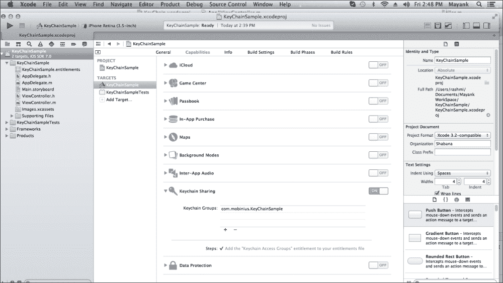

1.  打开**钥匙串共享**选项后，它将自动为我们创建**权限文件**，如下截图所示：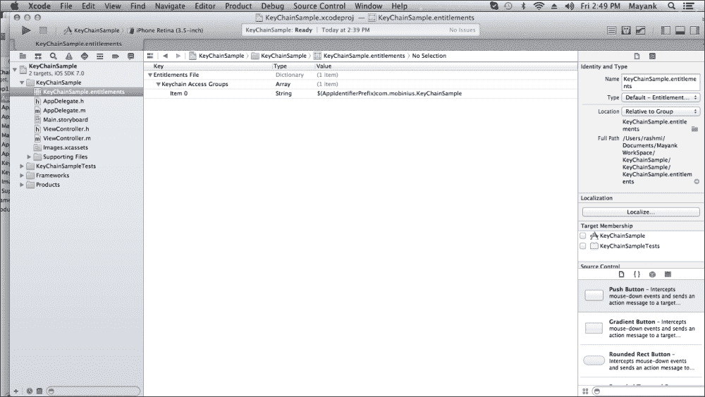

1.  不要忘记添加**安全框架**（如下截图所示）；没有它，钥匙串将无法工作：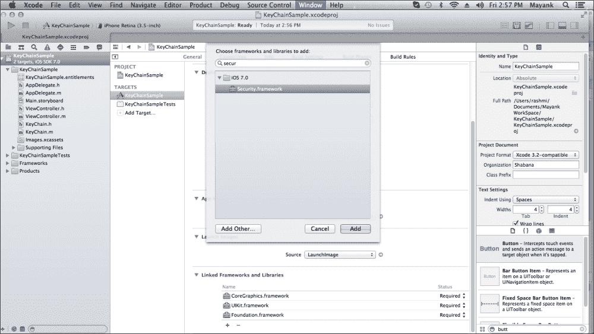

1.  现在，在故事板中创建一个如下所示的用户界面：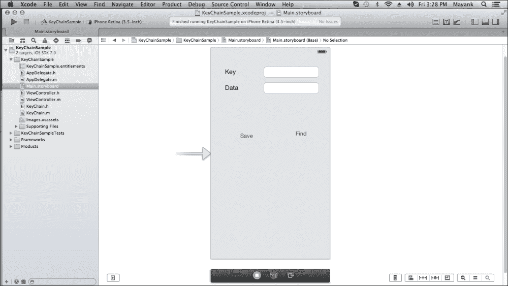

1.  将一个新的 Objective-C 文件添加到项目的`NSObject`子类中。然后，在新文件的接口文件中写下以下代码。同时，在文件顶部导入`security.h`：

    ```swift
    #import <security.h>
    @interface KeyChain : NSObject
    {
      NSString * service;
      NSString * group;
    }
    -(id) initWithService:(NSString *) service_ withGroup:(NSString*)group_;

    -(BOOL) insert:(NSString *)key : (NSData *)data;
    -(NSData*) find:(NSString*)key;
    ```

    我们的用户界面文件将看起来像这样：

    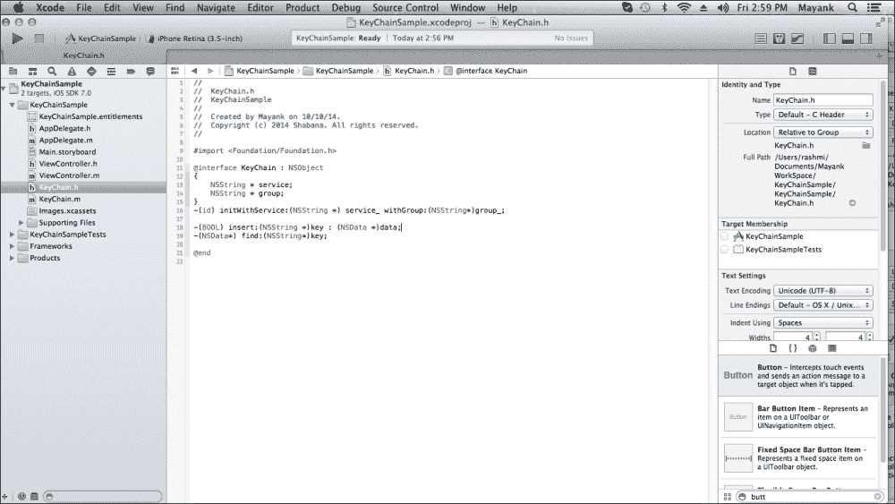

1.  在我们添加的新文件的实现文件中写下以下代码：

    ```swift
    @implementation KeyChain
    -(id) initWithService:(NSString *) service_ withGroup:(NSString*)group_
    {   self =[super init];
        if(self)
        {
          service = [NSString stringWithString:service_];
          if(group_)
            group = [NSString stringWithString:group_];
        }
        return  self;
    }
    -(NSMutableDictionary*) prepareDict:(NSString *) key
    {
        NSMutableDictionary *dict = [[NSMutableDictionary alloc] init];
        [dict setObject:(__bridge id)kSecClassGenericPassword forKey:(__bridge id)kSecClass];
        NSData *encodedKey = [key dataUsingEncoding:NSUTF8StringEncoding];
        [dict setObject:encodedKey forKey:(__bridge id)kSecAttrGeneric];
        [dict setObject:encodedKey forKey:(__bridge id)kSecAttrAccount];
        [dict setObject:service forKey:(__bridge id)kSecAttrService];
        [dict setObject:(__bridge id)kSecAttrAccessibleAlwaysThisDeviceOnly forKey:(__bridge id)kSecAttrAccessible];
        if(group != nil)
          [dict setObject:group forKey:(__bridge id)kSecAttrAccessGroup];
        return  dict;

    }
    -(BOOL) insert:(NSString *)key : (NSData *)data
    {
        NSMutableDictionary * dict =[self prepareDict:key];
        [dict setObject:data forKey:(__bridge id)kSecValueData];
        OSStatus status = SecItemAdd((__bridge CFDictionaryRef)dict, NULL);
        if(errSecSuccess != status) {
          NSLog(@"Unable add item with key =%@ error:%ld",key,status);
        }
        return (errSecSuccess == status);
    }
    -(NSData*) find:(NSString*)key
    {
        NSMutableDictionary *dict = [self prepareDict:key];
        [dict setObject:(__bridge id)kSecMatchLimitOne forKey:(__bridge id)kSecMatchLimit];
        [dict setObject:(id)kCFBooleanTrue forKey:(__bridge id)kSecReturnData];
        CFTypeRef result = NULL;
        OSStatus status = SecItemCopyMatching((__bridge CFDictionaryRef)dict,&result);

        if( status != errSecSuccess) {
          NSLog(@"Unable to fetch item for key %@ with error:%ld",key,status);
        return nil;
        }
        return (__bridge NSData *)result;
    }
    ```

    `_bridge`对象用于在 Objective-C 和核心基金会之间传递指针，不涉及所有权的转移。我们的接口文件可能看起来像这样：

    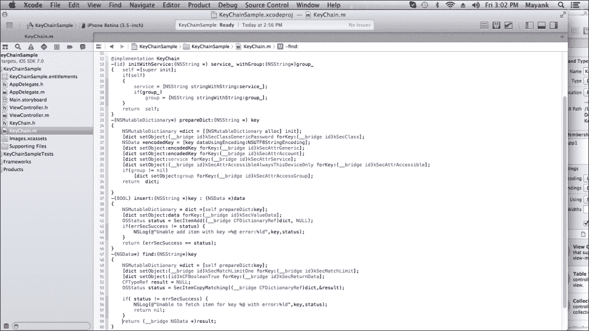

1.  将 UI 组件连接到我们的`viewController.h`文件。在文件顶部导入`KeyChain`（新添加的 Objective-C 文件），并在接口中创建`KeyChain`类的对象，如下所示：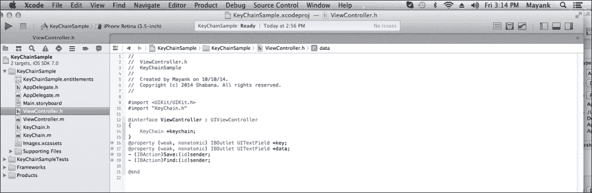

1.  在`viewController.m`文件中按钮的`IBAction`方法中添加一些代码，如下所示：

    ```swift
    #define SERVICE_NAME @"ANY_NAME_FOR_YOU"
    #define GROUP_NAME @"iOS"
    @interface ViewController ()
    @end
    @implementation ViewController
    - (void)viewDidLoad
    {
        [super viewDidLoad];
        keychain = [[KeyChain alloc]initWithService:SERVICE_NAME withGroup:nil];
    }

    -(void) showMessage:(NSString*)text
    {
      UIAlertView * alert =[[UIAlertView alloc ] initWithTitle:@"Info"message:text delegate:nil cancelButtonTitle:@"Cancel" otherButtonTitles: nil];
      [alert show];
    }
    - (IBAction)save:(id)sender {
        NSString *keyString =self.keyTextField.text;
        NSData *data = [self.dataTextField.text dataUsingEncoding:NSUTF8StringEncoding];
        if([keychain insert:keyString :data])
        {
          [self showMessage:@"Successfully added data"];
        }
        else
          [self showMessage:@"Failed to  add data"];
        self.dataTextField.text =@"";
        self.keyTextField.text =@"";
    }
    - (IBAction)find:(id)sender {
        NSString *keyString =self.keyTextField.text;
        NSData * data =[keychain find:keyString];
        if(data)
        {
          [self showMessage:[[NSString alloc] initWithData:data encoding:NSUTF8StringEncoding]];
        }
        else
        {
            [self showMessage:@"Failed to get Data"];
        }
    }

    - (BOOL)textFieldShouldReturn:(UITextField *)textField
    {
        [textField resignFirstResponder];
        return YES;
    }
    ```

    我们的接口文件可能看起来像这样：

    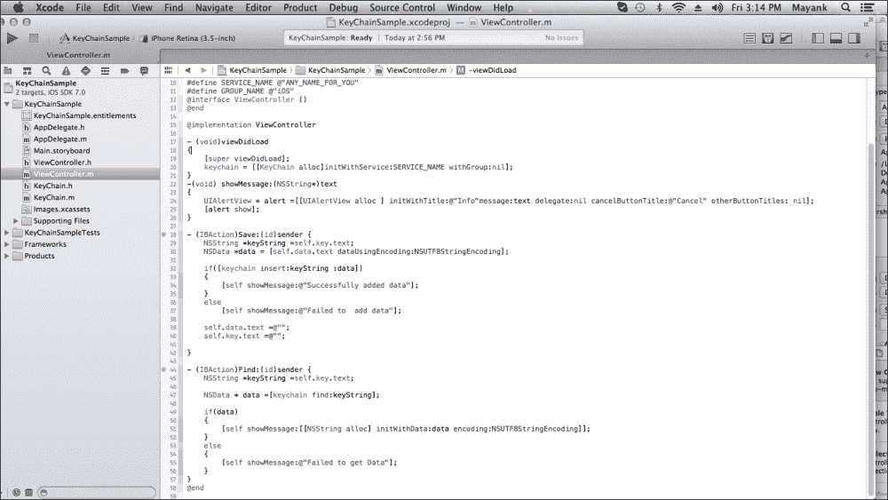

1.  编译并运行项目；我们的模拟器看起来如下截图所示。输入值并点击**保存**按钮：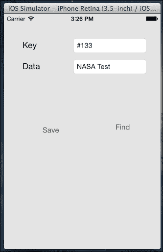

1.  点击**保存**按钮后，将出现一个弹出窗口（如下截图所示），显示我们的数据已安全保存在钥匙串中。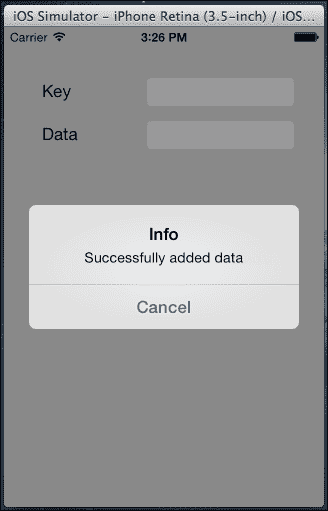

1.  现在请在钥匙串存储中存在的文本字段中写入**Key**值，然后点击**查找**按钮。它将以如下弹出消息显示数据：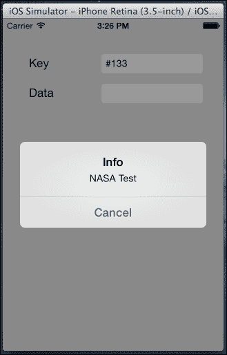

# Touch ID API

苹果在 iOS 7 中引入了一个名为**Touch ID 身份验证**的新功能。之前，iPhone 中只有四位数密码安全；现在，苹果扩展了安全性，并在 iPhone 中引入了一种新的安全模式。在 Touch ID 身份验证中，我们的指纹充当密码。去年，苹果在 iPhone 5S 上启动了 Touch ID 指纹识别技术后，现在它通过 iOS 8 为开发者提供这项技术。现在，第三方应用将能够在新的 iPhone 和 iPad OS 中利用 Touch ID 进行身份验证。会计应用和其他包含个人和重要数据的应用将受到 Touch ID 的保护。现在，你可以用你的指纹密码保护所有应用。

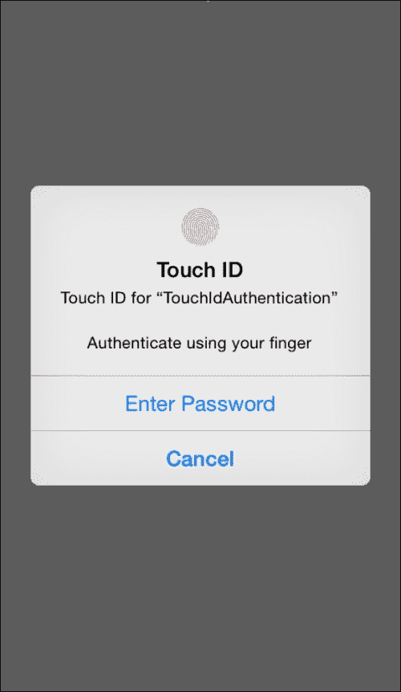

在我们的 iOS 8 应用中将 Touch ID 用作身份验证机制有两种方法。它们将在以下章节中解释。

## 通过触摸身份验证使用 Touch ID

本地身份验证 API 是一个返回布尔值的 API，用于接受和拒绝指纹。如果有错误，则执行错误代码并告诉我们问题所在。

使用本地身份验证时必须满足某些条件。它们如下：

+   应用程序必须在前台（此功能不适用于后台进程）

+   如果你使用的是直接的本地身份验证方法，你将负责处理所有错误，并使用你的 UI 正确响应，以确保有其他登录应用的方法

## 通过 Keychain Access 使用 Touch ID

Keychain Access 在 iOS 8 中包含了新的 Touch ID 集成。在 Keychain Access 中，我们不需要处理实现细节；它将自动使用用户的密码处理密码实现。可以通过使用新的**访问控制列表**（**ACLs**）选择多个密钥链项，通过代码请求使用 Touch ID 解锁项。ACL 是 iOS 8 的一个特性。如果 Touch ID 已被锁定，则允许用户输入设备的密码，无需任何中断地继续操作。

Keychain Access 有一些特性使其成为我们的最佳选择。它们在此列出：

+   Keychain Access 使用 Touch ID，并且其属性不会被任何云服务同步。因此，这些功能使其非常安全使用。

+   如果用户叠加了多个查询，则系统会混淆正确的用户，并会弹出包含多个触摸问题的对话框。

## 使用本地身份验证框架

苹果提供了一个名为**本地身份验证**的框架，用于在我们的应用中使用 Touch ID。此框架是为 iOS 8 引入的。为了创建一个包含 Touch ID 身份验证的应用，我们需要在我们的代码中导入此框架。它存在于苹果的框架库中。让我们看看如何使用本地身份验证框架：

1.  按以下方式导入本地身份验证框架：

    ```swift
    #import<localAuthentication/localAuthentication.h>
    ```

    此框架将在 Xcode 6 及以上版本中工作。

1.  要使用此 API，我们必须创建一个本地身份验证上下文，如下所示：

    ```swift
    LAContext *passcode = [[LAContext alloc] init];
    ```

1.  现在，检查 Touch ID 是否可用以及是否可用于身份验证：

    ```swift
    - (BOOL)canEvaluatePolicy:(LAPolicy)policy error:(NSError * __autoreleasing *)error;
    ```

1.  要显示 Touch ID，请使用以下代码：

    ```swift
    - (void)evaluatePolicy:(LAPolicy)policy localizedReason:(NSString *)localizedReason 
        reply:(void(^)(BOOL success, NSError *error))reply;
    ```

1.  查看以下 Touch ID 的示例：

    ```swift
    LAContext *passcode = [[LAContext alloc] init];
    NSError *error = nil;
    NSString *Reason = <#String explaining why our app needs authentication#>;
    if ([passcode canEvaluatePolicy:LAPolicyDeviceOwnerAuthenticationWithBiometrics error:&error])
    {
      [passcode evaluatePolicy:LAPolicyDeviceOwnerAuthenticationWithBiometrics
        localizedReason:Reason reply:^(BOOL success, NSError *error) {
            if (success) 
            {
              // User authenticated successfully
            } else 
            {
              // User did not authenticate successfully,go through the error
            }
        }];
    }
    else
    {
        // could not go through policy look at error and show an appropriate message to user
    }
    ```

# 摘要

在本章中，你学习了如何将你的数据推送到 iCloud 以及如何将你的私人数据，如密码、账户号码、ATM 密码等，保存到 Keychain。我们还重点介绍了 iOS 8 中引入的 Touch ID API。在下一章中，你将学习如何将你的应用推送到 App Store。
