# 第四章. SpriteKit 基础

在一整章的理论之后，我们终于到达了将创建游戏的一章。我相信这是你一直期待的时刻，你的手指都渴望编写一些代码并制作一个游戏。

在本章中，你将使用 SpriteKit 创建一个小型且基本的游戏。我们将看到如何创建游戏的主菜单，你将学习如何从主菜单场景切换到游戏玩法场景，所有游戏玩法代码都将在此场景中编写。

在游戏玩法场景中，我们首先添加精灵，如背景和英雄。然后，我们将创建一个小的物理引擎来让英雄移动。接着，我们将添加敌人，并移动它们。接下来，我们将让英雄和敌人互相射击。我们将检测英雄的火箭与敌人之间的碰撞，以及敌人的子弹与英雄之间的碰撞。对于英雄射出的每一个敌人，我们将得到一分，但如果任何敌人穿过屏幕的左侧，游戏将结束。如果当前最高分高于之前保存的分数，那么你的当前分数将被保存为新的最高分。一旦游戏结束，玩家可以点击按钮返回主菜单以开始游戏。我希望你很兴奋！让我们最终跳进去。

本章涵盖的主题如下：

+   SpriteKit 和 SKScene 简介

+   添加主菜单场景和游戏玩法场景

+   添加并移动英雄精灵

+   通过触摸创建交互性

+   一个简单的物理引擎

+   生成敌人

+   发射英雄火箭和敌人子弹

+   碰撞检测

+   得分和游戏结束条件

+   显示、保存和检索分数

# SpriteKit 和 SKScene 简介

我们已经在 第一章，*入门* 中看到，如何创建 SpriteKit 项目。为了唤醒你的记忆，我将再次向你展示如何创建项目。点击 **Xcode**，然后点击 **创建一个新的 Xcode 项目**。然后，在左侧面板下，导航到 **iOS**，然后到 **应用程序** 并选择 **游戏**。然后点击 **下一步**。为新项目命名。选择语言为 **Swift**，游戏技术为 **SpriteKit**，设备为 **iPad**，然后点击 **下一步**。选择你想要创建项目文件夹的位置，然后点击 **创建**。

你会看到，项目结构的大部分与我们在上一章中看到的 SingleView 项目相似。我们有 `GameScene.sks`、`GameScene.swift` 和 `GameViewController.swift` 文件：

+   `GameScene.sks`: 这是一个序列化的 `SpriteKitScene` 文件。这个文件用于在无需编写代码的情况下可视地创建 SKScenes。例如，你可以拖放图片并将它们设计成按钮，点击它们时，你可以让它们执行不同的功能。但由于我们将全部使用代码编写，我们不会使用这个文件来创建游戏的界面。

+   `GameScene.swift`：这个类继承自 SKScene。SKScenes 是游戏的构建块。这个类在应用程序视图加载后调用。你可以创建 SKScene 文件来创建主菜单场景、游戏玩法场景、选项场景等等。实际上，我们稍后会重命名`GameScene.swift`文件为`MainMenuScene.swift`，并创建一个新的场景`GamePlayScene`，我们将在这里编写我们的游戏玩法代码。

+   `GameViewController.swift`：这个类与我们之前章节中看到的`ViewController.swift`文件类似。在`Main.Storyboard`文件中，你会看到有一个`GameViewControllerScene`文件而不是`ViewController`，但结构非常相似。如果你点击**GameViewController**，你可以在**Identity**检查器的**Utility**面板下看到它调用了`GameViewController`类。参考前面的图示。

现在，打开`GameViewController.swift`文件。你会看到一些新函数和一些我们在`ViewController.swift`中看到的旧函数。你还会注意到已经导入了 SpriteKit。我们需要在所有想要使用其功能的类中导入 SpriteKit。所有属于 SpriteKit 的类和对象都以前缀`SK`开头，所以 SpriteKit 场景是`SKScene`，精灵是`SKSpriteNode`等等。

`SpriteKitNode`或`SKNode`是创建 SpriteKit 中任何内容所需的基本构建块，但与`SKScene`或`SKSpriteNode`不同，它不绘制任何可视内容。然而，`SKScene`和`SKSpriteNode`都是`SKNode`的子类。因此，如果`SKScene`是任何游戏的构建块，那么`SKNode`就是 SpriteKit 本身的基本构建块。详细的解释可以在第一章的 SpriteKit 部分找到，*入门*。

导入 SpriteKit 后，我们看到创建了一个名为`unarchivedFromFile`的类函数的 SKNode 扩展，它接受一个字符串并返回一个 SKNode。以下函数用于加载我们之前看到的`.sks`文件：

```swift
extension SKNode {
    class func unarchiveFromFile(file : NSString) -> SKNode? {
        if let path = NSBundle.mainBundle().pathForResource(file, ofType: "sks") {
            var sceneData = NSData(contentsOfFile: path, options: .DataReadingMappedIfSafe, error: nil)!
            var archiver = NSKeyedUnarchiver(forReadingWithData: sceneData)

            archiver.setClass(self.classForKeyedUnarchiver(), forClassName: "SKScene")
            let scene = archiver.decodeObjectForKey(NSKeyedArchiveRootObjectKey) as GameScene
            archiver.finishDecoding()
            return scene
        } else {
            return nil
        }
    }
}
```

扩展后，我们看到实际的`GameViewController`类。它仍然继承自`UIViewController`。类似于`ViewController.swift`文件，这里首先调用的函数是`viewDidLoad`，这是视图加载后立即调用的函数。调用了`super.viewDidLoad`函数，该函数调用父类的`viewDidLoad`。然后，使用之前创建的扩展加载了`GameScene.sks`文件。`if let`语句检查对象场景是否为空。如果不为空，则执行`if`块中的代码。

### 注意

`extension`：在 Swift 中，你可以向现有类添加功能。在前面的例子中，我们向 `SKNode` 类添加了一个名为 `unarchivedFromFile` 的新函数，该函数解档文件并返回一个 SKScene。这个函数用于在以下代码的 `viewDidLoad` 函数中解档 `SKS` 文件。

`if let`：这检查对象场景是否为空。如果不为空，则执行 `if` 块中的代码。

`as`：这个运算符用于向下转换 SKView，因为它实际上是 `UIView` 的子类。

```swift
    override func viewDidLoad() {
        super.viewDidLoad()

        if let scene = GameScene.unarchiveFromFile("GameScene") as? GameScene {
            // Configure the view.

            let skView = self.view as SKView
            skView.showsFPS = true
            skView.showsNodeCount = true

            /* Sprite Kit applies additional optimizations to improve rendering performance */
            skView.ignoresSiblingOrder = true

            /* Set the scale mode to scale to fit the window */
            scene.scaleMode = .AspectFill

            skView.presentScene(scene)
        }
    }
```

创建了一个新变量 `skView`，并将当前视图通过类型转换赋值给它，因为 `GameViewController` 的根视图是一个 SKView。

然后，场景的 `showsFPS` 和 `showsNodeCount` 属性被设置为 `true`，这将显示屏幕右下角的 **FPS** 和 **节点计数**。

将 `ignoreSiblingOrder` 属性设置为 `true`，意味着如果一个或多个对象处于相同的深度，则不会在它们之间进行优先级排序，所有对象将以相同的深度绘制。

**Z 坐标**，或深度顺序的值决定了哪个对象在屏幕的前面，哪个对象在后面。具有最小 **Z** 值的对象保持在屏幕后面，而具有最高值的对象是最接近屏幕的。如果一个对象没有分配 Z 坐标值，SpriteKit 将假设该对象位于之前添加的对象之上。这就是为什么在所有游戏中，背景总是首先添加，以便它位于最低的 Z 顺序，然后添加其他对象，如英雄。如果你首先添加英雄然后添加背景，英雄将位于最低的 Z 顺序，而覆盖整个屏幕的背景图像将位于其上方。你可能认为代码或 SpriteKit 出了问题，因为英雄没有显示，只有背景。事实是英雄确实在那里，但他位于背景之后。所以，要注意 Z 顺序，因为这可能导致游戏中的错误或意外结果。

设置顺序后，我们可以设置场景的 `scaleMode` 属性。在这里，默认情况下它已被设置为 `AspectFill`。有四种模式：`AspectFill`、`Fill`、`AspectFit` 和 `ResizeFill`。

+   `AspectFill`：这是创建新项目时的默认模式。在这个比例中，计算了 *x* 和 *y* 缩放因子，并选择较大的缩放因子来填充视图并保持图像的宽高比。这将导致场景裁剪。

    让我们创建一个项目，并将角色放置在右上角和左下角，观察当我们从横屏模式切换到竖屏模式时会发生什么。

    在横屏模式下，两个角色都按照应有的方式显示。一个位于屏幕左下角，另一个位于右上角，如下面的截图所示：

    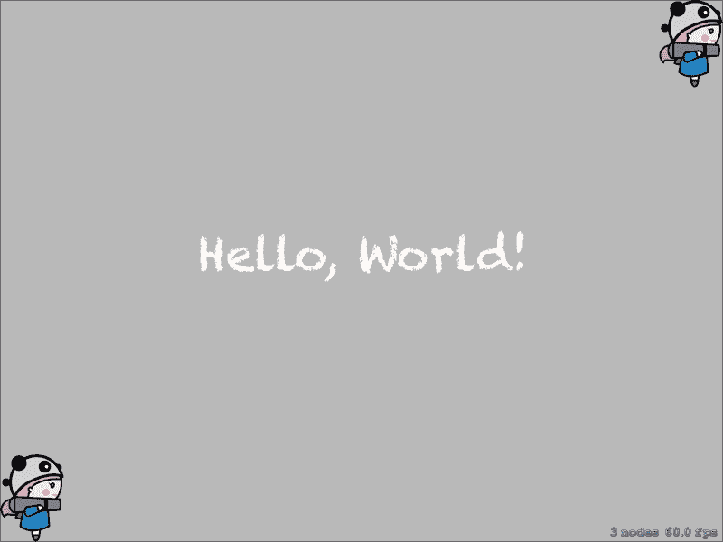

    但在纵向模式下，它们已经超出了屏幕范围，如下面的截图所示：

    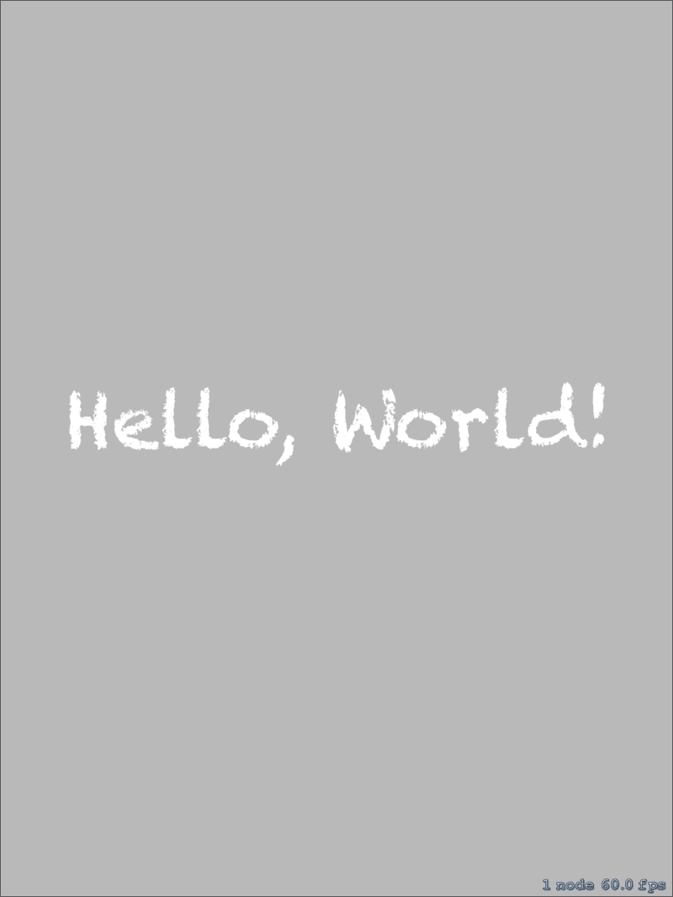

+   `Fill`: 无论是*x*轴还是*y*轴，都会缩放以填充视图。视图是在你点击`Main.Storyboard`文件中的视图后显示的区域。图像的宽度和高度都会改变，以填充视图。

    如果我们在横屏模式下再次使用`.Fill`进行相同的测试，图像看起来似乎是正常的，但在纵向模式下，两个图像分别位于它们的位置，但被压扁以适应，如下面的截图所示：

    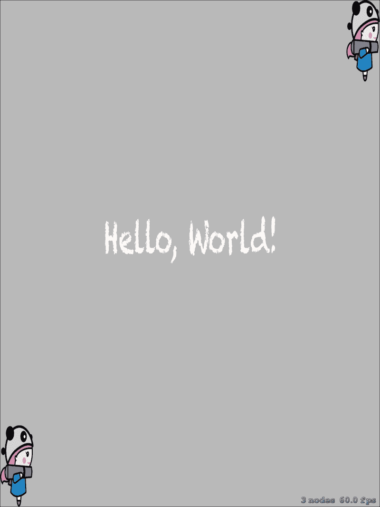

+   `AspectFit`: 不是选择上缩放因子，而是选择下缩放因子以保持场景的宽高比。这可能会导致场景出现信封式显示，但场景中的所有内容都将显示，并且将在视图中可见。

    使用这种模式，在横屏模式下，一切看起来都很正常，但在纵向模式下，图像根本不是正方形的；整个场景被缩小以适应屏幕宽度。这将在屏幕的顶部和底部造成信封式显示，如下面的截图所示：

    

+   `ResizeFill`: 场景不会进行任何缩放。它只是调整大小以适应视图。图像将保持原始大小和宽高比。

    这里，由于宽高比和缩放保持不变，左下角的图像显示在正确的位置，但右上角的图像超出了屏幕范围，如下面的截图所示：

    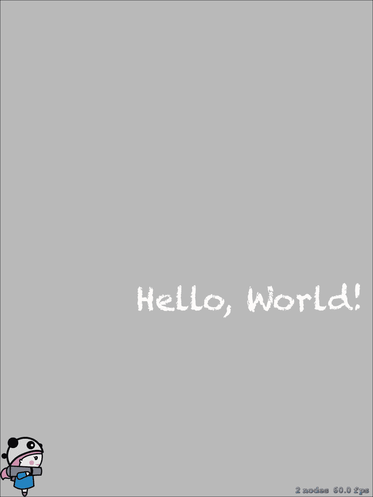

观察前面四种模式的截图，我们可以看到并非所有尺寸都适合。你需要调整缩放模式以最好地满足你游戏的需求。由于我们的游戏主要是为横屏模式设计的，所以我们只禁用纵向模式。因此，在主项目节点中，通过在**通用**选项卡中取消选中来禁用**纵向**模式和**颠倒**，如下面的截图所示：

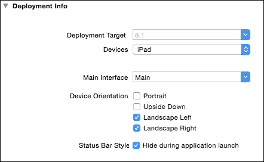

我们还将使用`ResizeFill`，因为我们将为设备的 Retina 和非 Retina 资产提供单独的图像，这样就不会影响宽高比，从而得到完整的全屏图像，而不是裁剪或缩放的图像。因此，在`GameViewController`类中，将缩放模式更改为以下内容：

```swift
            /* Set the scale mode to scale to fit the window */
            scene.scaleMode = .ResizeFill
```

最后，使用`skView`对象的`presentScene`函数加载并呈现场景。

当`GameScene.swift`文件呈现时，会调用`didMoveToView`函数，正如我们在第一章中看到的，*入门*，显示显示**Hello, World!**文本的`SKLabelNode`标签，并且每次点击屏幕时，都会调用`touchesBegan`函数，并在触摸位置创建一个`SKSpriteNode`并对其运行动作。

有三个新函数：`shouldAutoRotate`函数，设置为`true`，当设备旋转时将旋转视图；`supportedInterfaceOrientation`函数，检查方向并相应地对齐视图；以及`prefersStatusBarHidden`函数，隐藏状态栏元素，例如屏幕顶部的网络和电池指示器。您可以根据需要启用或禁用它们。

现在我们将更改`GameScene`以开始制作我们的游戏。

# 添加主菜单场景

让我们对`GameScene`类进行一些修改，使其成为我们的主菜单场景：

1.  通过在项目导航器中选择项目层次结构中的文件来将文件重命名为`MainMenuScene.swift`。

1.  将文件中的类名更改为`MainMenuScene`。

1.  删除`didMoveToView`中的所有代码行。

1.  在`touchesBegan`函数中，删除与添加精灵及其上运行动作相关的代码。

1.  删除`update`函数，因为它对于主菜单场景不是必需的。如果需要，我们将在稍后添加它。

`MainMenuScene.swift`文件应如下代码片段所示，因为我们已从`didMoveToView`函数中删除所有代码并修改了`touchedBegan`函数：

```swift
import SpriteKit

class MainMenuScene: SKScene {

    override func didMoveToView(view: SKView) {

    }

    override func touchesBegan(touches: NSSet, withEvent event: UIEvent) {
        /* Called when a touch begins */

        for touch: AnyObject in touches {
            let location = touch.locationInNode(self)

        }
    }
}
```

通过将其移动到**回收站**来从项目层次结构中删除`GameScene.sks`文件。

我们还需要对`GameViewController.swift`文件进行一些修改。

1.  删除为 SKNode 创建的扩展。

1.  删除`if let`场景行以及开闭括号，因为我们将通过代码直接调用`MainMenuScene`类。

1.  将上述行替换为`let scene = MainMenuScene(size: view.bounds.size)`。SKScene 构造函数接受屏幕大小，因此我们在这里从视图的`bounds.size`属性中获取它。

1.  将`.AspectFill`更改为`.ResizeFill`。

文件的其他部分可以保持不变。现在`viewDidLoad`函数应如下所示：

```swift
    override func viewDidLoad() {

        super.viewDidLoad()

            let scene = MainMenuScene(size: view.bounds.size)

            // Configure the view.

            let skView = self.view as SKView
            skView.showsFPS = true
            skView.showsNodeCount = true

            /* Sprite Kit applies additional optimizations to improve rendering performance */
            skView.ignoresSiblingOrder = true

            /* Set the scale mode to scale to fit the window */
            scene.scaleMode = .ResizeFill

            skView.presentScene(scene)        
    }
```

让我们开始向主菜单场景添加内容。

在`MainMenuScene.swift`文件中的`didMoveToView`函数中，我们首先添加背景图片，然后添加一个标签，用于显示游戏名称，最后添加播放按钮，点击后将启动`GamePlayScene`并开始游戏。

要添加背景图片，请添加以下代码：

```swift
let BG = SKSpriteNode(imageNamed: "BG")
BG.position = CGPoint(x: viewSize.width/2, y: viewSize.height/2)
self.addChild(BG)
```

我们创建了一个名为`BG`的常量变量，并将其分配给一个名为`BG`的图像集。然后，我们定位这个图像。为了定位图像，我们需要视图的大小。获取视图的宽度和高度非常简单。我们创建了一个名为`viewSize`的新常量，其类型为`CGView`，并将其分配给`view.bounds.size`。因此，在`didMoveToView`函数的开始处添加以下代码：

```swift
let viewSize:CGSize = view.bounds.size
```

我们现在可以设置`BG`的位置。要设置位置，我们将`BG.position`设置为视图宽度和高度的一半。每次我们需要分配或创建一个新的`CGPoint`变量时，我们必须调用 CGPoint，并在括号内提供用逗号分隔的`x`和`y`值。`x`值需要以`x`开头，然后是一个冒号，同样，`y`值需要以`y`开头，然后是一个冒号。

为了使背景显示出来，我们将在 self 上调用`addChild`函数，并传入创建的背景。

如果您现在运行游戏，它将产生错误，因为我们还没有为项目分配实际的图像。为此，转到本章的`Resources`文件夹，并将所有资产复制到桌面。这将包含本章将使用的所有资产。

现在，转到项目导航器中的`Images.xcassets`文件，右键单击面板并选择**New Image Set**，如下面的截图所示。将创建一个名为`Image`的新文件。选择并重命名它为`BG`。当我们创建背景精灵时调用`BG`，我们实际上是在引用这个文件。因此，如果您命名错误，代码将产生错误。

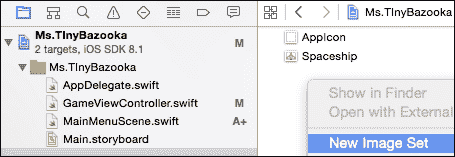

文件中有**1x**、**2x**和**3x**图像的占位符。由于我们正在为 iPad 制作游戏，我们只需要担心两种分辨率；1024 x 768 和 2048 x 1536 分辨率。我们的背景也是这两种分辨率之一。在`Resources`文件夹中，查找名为`Bg.png`和`Bg2.png`的图像文件。将`Bg.png`拖到**1x**框中，将`Bg2.png`拖到**2x**框中，如下面的截图所示：


现在您可以运行应用程序，屏幕将显示背景图像的全貌。在模拟器中，您可以选择**iPad2**或**iPadAir**，您将看到图像将填充整个屏幕，如下面的截图所示。请确保您正在横屏模式下运行。

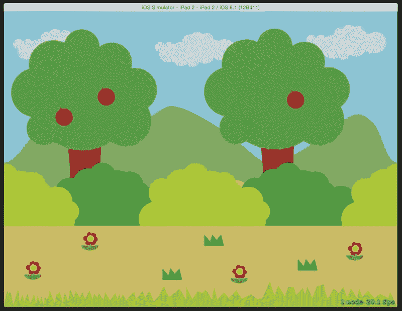

接下来我们将添加标签以显示游戏名称。标签用于在屏幕上显示文本。在我们将背景添加到场景之后，添加以下代码以显示标签：

```swift
let myLabel = SKLabelNode(fontNamed:"Chalkduster")

myLabel.text = "Ms.TinyBazooka"

myLabel.fontSize = 65

myLabel.position = CGPoint(x: viewSize.width/2, y: viewSize.height * 0.8)

self.addChild(myLabel)
```

我们创建一个新的常量`myLabel`并调用`SKLabelNode`的构造函数。它需要我们想要用来创建文本的字体名称，所以我们传递`Chalkduster`，这是 Mac 中默认字体之一。在`myLabel.text`中，我们传递我们想要显示的实际文本。接下来我们分配字体的大小、位置，并将其作为子节点添加到当前类中。要创建文本，我们不需要创建图像集，但我们必须在系统中拥有该字体，因为它会自动从系统的字体目录中获取。

让我们接下来创建播放按钮。在`Resources`文件夹中，你可以找到`playBtn.png`和`playBtn2.png`。类似于我们为`BG`创建图像集的方式，通过命名文件为`playBtn`来为播放按钮创建一个图像集。将`playBtn.png`图像拖到**1x**，将`playBtn2.png`图像拖到**2x**。

对于`Resources`文件夹中的所有资产，你将找到每个文件的两个副本，一个以文件名开头，另一个以文件名结尾的`2`。因此，确保从现在起，常规文件名的资产分配给**1x**，以`2`结尾的文件分配给**2x**。

现在，适当的图像已经分配给了`playBtn`图像集。在添加标签代码的下方添加以下代码：

```swift
let playBtn = SKSpriteNode(imageNamed: "playBtn")

playBtn.position = CGPoint(x: viewSize.width/2, y: viewSize.height/2)

self.addChild(playBtn)

playBtn.name = "playBtn"
```

`playBtn`图像集也是一个常规的`SKSpriteNode`，所以类似于我们添加`BG`的方式，我们将`playBtn`图像集分配给`playBtn`常量。将其放置在视图的中心，然后将其添加到视图中。

除了我们通常做的事情之外，我还为`playBtn`常量分配了一个名称，以便在需要时可以引用它。不一定非得分配一个字符串；如果你愿意，甚至可以分配一个整数值。应该给它起一个容易记住并且能够与常量相关联的名字。

现在，如果你构建并运行项目，它应该看起来像以下截图：


接下来，我们将在`touchesbegan`函数中添加代码以检查是否按下了播放按钮。在`touchesbegan`函数中，我们首先检查屏幕上是否被触摸了任何对象，然后，如果被触摸，我们获取触摸的位置。获取位置后，我们添加以下代码：

```swift
   let _node:SKNode = self.nodeAtPoint(location)

   if(_node.name == "playBtn"){

      let scene = GamePlayScene(size: self.size)
      self.view?.presentScene(scene)
}
```

我们创建一个新的常量`_node`，其类型为`SKNode`，并获取触摸位置处的节点。然后我们检查被按下的节点名称是否为`playBtn`，如果是，则创建一个名为`scene`的常量，并将其分配给`GameplayScene`，然后像在`GameViewController`类中展示`MainMenuScene`一样展示场景。由于我们尚未创建`GamePlayScene`，你将得到一个错误。别担心，我们将在下一节中创建它。

`self.view`后面的问号检查视图是否为空。如果为空，它将给出错误，但由于视图存在，它不会给出错误。让我们创建游戏场景，这样我们就不会得到说它不存在的错误。

# 添加游戏场景

在此期间，我们一直在修改基础项目中已包含的文件。现在我们将在项目中创建一个新文件。在基础项目文件夹上右键单击，然后单击**新建文件**：


在左侧面板中，选择**iOS**，选择 Swift 文件，然后单击**下一步**。它将要求输入文件名，命名为`GamePlayScene`，然后单击**创建**。这将创建一个空的 Swift 文件。

在其中添加以下代码。这是每次创建新的场景文件时所需的基本结构：

```swift
import SpriteKit

class GamePlayScene: SKScene {

   required init?(coder aDecoder: NSCoder) {
        fatalError("init(coder:) has not been implemented")

} // required init

    override init(size: CGSize){

        super.init(size: size)

    } //init function

} //class end
```

我们首先导入 SpriteKit，然后使用`class`关键字创建类，并使用类的名称继承自`SKScene`。

然后我们有`required init`函数。由于超类`SKScene`实现了它，所以它必须包含在所有子类中。这是一个要求，所以无法避免，但我们不会用它做任何事情，因为我们将使用常规的`init`函数。

SKScene 的常规`init`函数接受视图的大小。然后我们必须确保调用`super.init`函数，并在其中传递视图的大小。

就这样，我们就准备好在这个类中添加一些游戏代码了。你可以在`MainMenuScene.swift`文件中检查是否有错误，并且代码正在正确构建。

在`GamePlayScene.swift`文件中，首先我们必须为`viewSize`创建一个全局变量。因此，在类和必需的`init`函数之间，添加`let viewSize:CGSize!`以使`viewSize`成为全局变量。此外，我们使用`let`而不是`var`，因为我们知道在游戏过程中视图的大小不会改变。

由于我们在这里没有初始化这个常量，我们必须在末尾使用感叹号来告诉 Swift 我们将初始化它，并且我们知道我们将初始化的类型将是`CGSize`。

将`viewSize`初始化为通过`init`函数传入的大小。在调用`super.init`之后添加以下行：

```swift
viewSize = size
```

# 添加背景和英雄

我们将首先添加背景，因此我们可以将`MainMenuScene`中的相同代码复制并粘贴到初始化`viewSize`之后的`init`函数中：

```swift
let BG = SKSpriteNode(imageNamed: "BG")
BG.position = CGPoint(x: viewSize.width/2, y: viewSize.height/2)
self.addChild(BG)
```

接下来我们将添加英雄精灵。类似于我们创建`BG`图像资源的方式，创建一个新的资源名为`hero`，并将`hero.png`和`hero2.png`分配给**1x**和**2x**槽位。

接下来，我们希望英雄也是一个全局变量，因为我们将在`init`函数之外引用她。所以，在创建`viewSize`属性之后，在类的顶部添加以下代码行：

```swift
let hero:SKSpriteNode! 
```

接下来，在添加了`BG`之后的`init`函数中，添加以下代码：

```swift
hero = SKSpriteNode(imageNamed: "hero")
hero.position = CGPoint(x: viewSize.width/4, y: viewSize.height/2)
self.addChild(hero)
```

在这里，像往常一样，我们将图像集`hero`分配给常量，分配位置，并将其添加到场景中。

与我们定位背景的方式类似，我们定位英雄，但不是将英雄添加到屏幕中心，而是将其放置在屏幕左侧距离`viewSize`的四分之一处。

## 更新英雄的位置

接下来，让我们更新英雄的位置。让我们在场景中添加重力，这样游戏开始后她就会开始下落。为了更新她的位置，我们将使用`update`函数。`update`函数在类创建时立即被调用，并且每秒被调用 60 次。因此，将`update`函数添加到类中，如下所示。在它里面调用一个`updateHero()`函数，我们将在稍后定义这个函数：

```swift
override func update(currentTime: CFTimeInterval) {

  updateHero()
}
```

在`let hero`行之后创建一个新的全局常量，称为`gravity`，类型为`CGPoint`，并将其初始化为`x`值为`0`和`y`值为`-1`，因为重力只影响负`y`方向：

```swift
let gravity = CGPoint(x:0.0, y: -1.0)
```

我们还将创建一个新的函数，称为`updateHero`，我们将在这个函数中编写所有更新英雄位置的代码。在`update`函数下创建这个函数，并且不要忘记在`update`函数中调用这个函数，否则英雄的位置将不会更新。

```swift
    func updateHero(){

        hero.position.y += gravity.y

    }
```

在`updateHero`函数中，我们在每次更新中递减英雄的`y`位置。最终，她将穿过屏幕底部。为了让她保持在边界内，我们检查她是否即将超出屏幕，并将她放回屏幕底部的边缘。为此，在`heroUpdate`函数中递减她的位置下方添加以下代码：

```swift
if(hero.position.y - hero.size.height/2 <= 0){

        hero.position.y = hero.size.height/2

}else if (hero.position.y + hero.size.height/2  >= viewSize.height){

        hero.position.y = viewSize.height - hero.size.height/2            
}
```

在第一个`if`块中，我们检查英雄的底部是否已经超过了屏幕的底部。如果是这样，那么我们将英雄的原点放置在屏幕底部距离她高度的一半处。

在`else if`块中，我们检查英雄的顶部是否已经超过了屏幕的顶部。如果是这样，那么我们将她放置在屏幕顶部距离她高度的一半处。

现在，如果你构建并运行游戏并按下播放，英雄将位于屏幕左侧距离的四分之一处，并且当她到达屏幕底部时将停止。

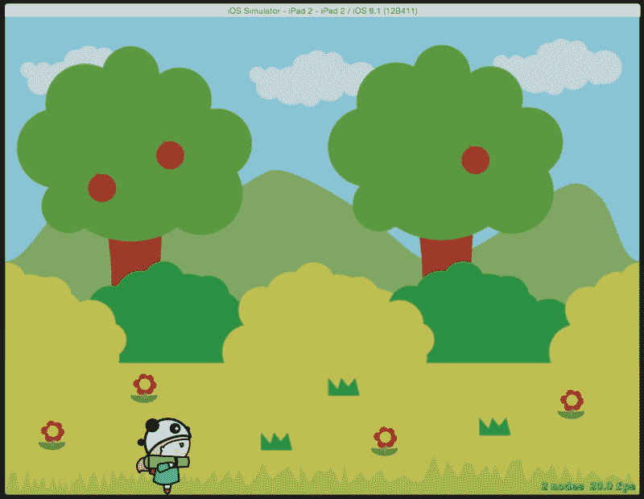

## 添加玩家控制

我们现在将通过使用`touchesbegan`函数来添加玩家控制。如果玩家点击屏幕的左侧，英雄将被推向上方，然后由于重力作用将再次开始下落，如果玩家点击屏幕的右侧，英雄将发射火箭。

为了检测触摸，在`update`函数下添加`touchesBegan`函数，如下所示：

```swift
override func touchesBegan(touches: NSSet, withEvent event: UIEvent) {
  /* Called when a touch begins */

  for touch: AnyObject in touches {
       let location = touch.locationInNode(self)            

  }

}//touchesBegan 
```

这显然是我们之前在`MainMenuScene`中用来检测播放按钮触摸的相同函数。由于我们只是将要检查触摸的位置，所以我们现在不需要我们触摸的对象。

为了检测屏幕被点击的哪一侧，在`for in`循环中获取触摸位置的地方添加以下代码：

```swift
  if(location.x < viewSize.width/2){

        println("[GamePlayScene] touchedLeftSide ")

   }else if(location.x > viewSize.width/2){

         println("[GamePlayScene] touchedRightSide ")

   }
```

我们检查触摸位置的`x`值是否小于屏幕宽度的一半。如果是这样，那么我们将打印出屏幕的左侧被触摸了；否则，我们检查触摸位置的`x`值是否大于屏幕宽度的一半，在这种情况下，我们可以确认屏幕的右侧被触摸了。

现在，为了将英雄推向空中，每当玩家触摸屏幕的左侧时，我们给她一个小的推力。添加一个全局变量`thrust`，其类型为`CGPoint`，并将`x`和`y`的值初始化为零，如下所示：

```swift
var thrust = CGPointZero
```

注意，我们使用`var`而不是`let`，因为`thrust`的值将在一段时间内发生变化。此外，`CGPointZero`只是`CGPoint(x:0, y:0)`的简写。它们都将做同样的事情，所以这只是方便和偏好的问题。

在`touchesBegan`函数中，在我们检查屏幕左侧被触摸后，立即添加以下行：

```swift
thrust.y = 15.0
```

在`updateHero`函数中，将`hero.position.y += gravity.y`这一行改为以下内容：

```swift
thrust.y += gravity.y
hero.position.y += thrust.y

println("Thrust Y Value: \(thrust.y)")
```

现在，每当触摸屏幕的左侧时，英雄将向上推 15 点，然后当她达到最高位置后，她将开始下落。按照以下方式记录`thrust.y`的值，以查看其工作原理：

```swift
[GamePlayScene] touchedLeftSide 
Thrust Y Value: 14.0
Thrust Y Value: 13.0
Thrust Y Value: 12.0
Thrust Y Value: 11.0
Thrust Y Value: 10.0
```

一旦屏幕被轻触，`thrust`的`y`值，最初设置为`0`，将被设置为`14`。它不是`15`，因为我们由于重力而从中减去了`1`。然后，在每次更新时，英雄的`y`位置会逐渐降低，直到变为零，重力将再次开始作用并开始将英雄向下拉。

你会注意到，当英雄在屏幕底部并且你施加向上的推力时，英雄不会立即开始向上移动。为什么这一点在`thrust.y`的控制台输出中也是可见的。由于重力被添加到`thrust.y`，其值变得非常大，15 点的小推力必须克服这个值才能使英雄再次向上移动。为了解决这个问题，我们必须在英雄触摸屏幕顶部或底部时将`thrust`的值重置为零。因此，在`updateHero`函数中，在检查她是否触摸了屏幕顶部或底部之后，在设置英雄位置的`if`和`if else`块之后添加以下行：

```swift
thrust.y = 0   
```

接下来，我们将添加当屏幕右侧被轻触时发射的火箭。为此，我们将创建一个新的泛型类，以便我们可以在以后创建敌人和敌人子弹时使用。

由于我们创建了`GamePlayScene.swift`文件，因此创建一个名为`MovingSprite`的文件，并在该文件中添加以下代码：

```swift
import SpriteKit

class MovingSprite{

    let _sprite: SKSpriteNode!
    let _speed : CGPoint!

    init(sprite: SKSpriteNode, speed: CGPoint){

        _sprite = sprite
        _speed = speed

    }//init

    func moveSprite(){

        _sprite.position.x += _speed.x
    }

}//class
```

在这个类中，我们导入 SpriteKit 并创建类的定义。我们创建了两个全局常量来保存我们将传递给构造函数的 `SKSpriteNode` 和 `CGPoint` 对象的引用。`SKSpriteNode` 将保存我们将传递的精灵，而 `CGPoint` 将保存我们想要精灵移动的速度。

在 `init` 函数中，我们将传递的对象分配给本地创建的对象。我们添加了一个名为 `moveSprite` 的额外函数。这个函数将使用分配给它的速度移动精灵。现在这个类就到这里为止。当我们添加敌人和子弹类时，我们将重新访问并修改这个类。

为了创建火箭，在 `GamePlayScene` 文件中创建一个名为 `addRockets` 的新函数。在其中，我们添加以下代码来创建火箭：

```swift
func addRockets(){

let rocketNode: SKSpriteNode = SKSpriteNode(imageNamed: "rocket")
rocketNode.position = CGPoint(x: hero.position.x + hero.size.width/2 + rocketNode.size.width/2,y: hero.position.y - rocketNode.size.height/2)

   self.addChild(rocketNode)

      let speed: CGPoint = CGPoint(x: 10.0, y: 0.0)
      let rocket: MovingSprite = MovingSprite(sprite: rocketNode, speed: speed)

}
```

在 `addRockets` 函数中，我们首先创建一个名为 `rocketNode` 的常量，其类型为 `SKSpriteNode`，并从 `imageset` 中分配一个火箭。因此，创建一个新的图像集并命名为 `rocket`。在 `Resources` 文件夹中，你可以找到 `rocket.png` 和 `rocket2.png`，你可以分别将它们分配给文件的 **1x** 和 **2x** 位置。

接下来，我们设置火箭的位置。由于我们想让火箭看起来是从火箭筒中发射出来的，而不是在玩家的位置生成，所以我们将其放置在火箭筒的前端。因此，对于 `x` 位置，我们获取玩家的位置，然后加上玩家宽度的一半，并加上火箭本身宽度的一半。对于 `y` 位置，我们获取英雄的 `y` 位置，并从它减去火箭高度的一半。然后我们将它添加到场景的显示列表中。

接下来，我们创建一个名为 `rocket` 的对象，其类型为 `MovingSprite`，并分配我们想要移动精灵的速度，并将我们之前创建的 `rocketNode` 传递进去。为了分配速度，我们创建一个新的常量 `speed`，其类型为 `CGPoint`，并将 `10` 和 `0` 分别分配给 `x` 和 `y` 的值，这样每次我们调用类的 `moveSprite` 函数时，位置将根据提供的值在 *x* 方向上更新。

在 `touchedBegan` 函数中，我们检查屏幕的右侧是否被点击，添加 `addRocket` 函数以在每次点击屏幕的右侧时创建火箭：

```swift
    override func touchesBegan(touches: NSSet, withEvent event: UIEvent) {
        /* Called when a touch begins */

        for touch: AnyObject in touches {
            let location = touch.locationInNode(self)

                if(location.x < viewSize.width/2){

                    println("[GamePlayScene] touchedLeftSide ")

                    thrust.y = 15.0

                }else if(location.x > viewSize.width/2){

                    println("[GamePlayScene] touchedRightSide ")

                    addRockets()
                }

            }
        }//touchesBegan
```

现在，如果你构建并运行，然后点击屏幕的右侧，火箭将被创建，但它们没有移动。为了移动火箭，我们必须将我们创建的每个火箭添加到一个数组中，并且在每个火箭上调用 `moveSprite` 函数来实际移动精灵。

为了更新火箭的位置，我们首先需要创建一个数组来存储所有的火箭。这个数组需要是一个全局变量，这样我们就可以轻松地访问它。因此，在类开始处添加`var thrust = CGPointZero`的下面，紧接着添加以下代码行。我们创建一个名为`rockets`的数组来存储`MovingSprite`类型的对象，我们使用`var`，因为它是一个可变数组，这意味着我们将在游戏过程中向其中添加和删除对象。

```swift
var rockets:[MovingSprite] = []
```

接下来，在创建更新英雄函数的下面创建一个新的函数`updateGameObjects`，并添加以下代码：

```swift
func updateGameObjects(){

for(var i:Int = 0; i < rockets.count; i++){

      rockets[i].moveSprite()            
      var sprite: SKSpriteNode = rockets[i]._sprite
if((sprite.position.x - sprite.size.width/2) > 
                              viewSize.width){

              sprite.removeFromParent()
              rockets.removeAtIndex(i)
        }
}
}
```

你可能正在想，为什么我们使用`for`循环而不是`for in`循环呢？嗯，这是因为一旦火箭飞出屏幕，我们就必须删除该对象，而在 Swift 中从数组中删除对象时，我们需要被删除对象的索引，而`for in`循环没有这个功能。

因此，我们创建一个从`0`开始的常规`for`循环，每次通过将索引增加 1 遍历`rockets`数组中的每个对象。我们调用数组中的第 i 个对象的`moveSprite`函数。接下来，为了方便起见，我们从索引中获取`spritenode`，这样我们就可以对其进行一些检查。我们检查火箭精灵的左侧边缘是否超出了屏幕的宽度，如果是这样，那么我们就从其父节点中删除该精灵，即`GamePlayScene`，因为这是我们将在`addRockets`函数中添加`addChild`的地方。然后，我们通过调用数组的`removeAtIndex`函数并传入当前索引来从火箭数组中删除当前索引的对象。

最后，我们还需要将对象添加到数组中以便删除它。因此，在`addRocket`函数中，在函数末尾添加`rockets.append(rocket)`以将火箭添加到`rockets`数组中：

```swift
    func addRockets(){

        let rocketNode: SKSpriteNode = 
SKSpriteNode(imageNamed: "rocket")
        rocketNode.position = CGPoint(
                    x: hero.position.x + hero.size.width/2 +
               rocketNode.size.width/2,
                    y: hero.position.y - rocketNode.size.height/2)
                    self.addChild(rocketNode)

        let speed: CGPoint = CGPoint(x: 10.0, y: 0.0)
        let rocket: MovingSprite = 
   MovingSprite(sprite: rocketNode, speed: speed)

        rockets.append(rocket)
    }
```

最后，别忘了在调用`updateHero`函数的下面调用`updateGameObjects`函数。

现在，当你构建并运行游戏时，你将能够点击屏幕的左侧来提升玩家的速度，然后点击屏幕的右侧来发射火箭。

此外，请查看屏幕右下角的节点计数。每次创建一个新的火箭时，节点计数都会增加，由于火箭一旦飞出屏幕就会被删除，因此每次从场景中删除火箭时，计数也会减少。

你还可以在`update`函数中添加以下代码来记录`rockets.count`，以检查火箭数组中有多少个火箭：

```swift
println(" rockets count: \(rockets.count)")
```


## 添加敌人

要让英雄成为英雄，我们需要反派。因此，我们现在将添加敌人。类似于我们创建`addRocket`函数的方式，创建一个新的函数`addEnemy`。

此外，在`GamePlayScene`类的全局变量中`rocket`数组之后创建一个新的数组名为`enemies`。这添加了一个新的数组，将管理敌人，如下所示：

```swift
var enemies:[MovingSprite] = []
```

现在，在你的变量声明中应该有类似以下的内容：

```swift

  let viewSize:CGSize!
  let hero:SKSpriteNode!
  let gravity = CGPoint(x:0.0, y: -1.0)
  var thrust = CGPointZero
  var rockets:[MovingSprite] = []
  var enemies:[MovingSprite] = []
```

现在，我们可以更新所有敌人，更新它们的位置并在它们离开屏幕时移除它们。

创建一个新的图像集名为`enemy`，并将`enemy.png`和`enemy2.png`添加到文件中。

与在火箭筒喷嘴处生成的火箭不同，敌人将从屏幕右侧生成并向屏幕左侧移动。它们也会在屏幕的不同高度生成。如果所有敌人都是从同一位置生成的，这对玩家来说不会构成挑战。因此，我们将创建一个随机数，根据这个随机数我们将决定敌人将在什么高度生成。

按照以下方式创建`addEnemy`函数：

```swift
func addEnemy(){

   var factor = arc4random_uniform(4) + 1
   var fraction = CGFloat(factor) * 0.20
   var height = fraction * viewSize.height

   println("enemy height: \(factor), \(fraction), \(height)")    

   var enemyNode:SKSpriteNode = SKSpriteNode(imageNamed: "enemy")

enemyNode.position = CGPoint(x: viewSize.width +   enemyNode.size.width/2, y: height)

self.addChild(enemyNode)

enemyNode.name = "enemy"

   let speed: CGPoint = CGPoint(x: -5.0, y: 0.0)

var enemy:MovingSprite = MovingSprite(sprite: enemyNode, speed: speed)

enemies.append(enemy)
}
```

对于创建随机数，我们使用内置函数`arc4random_uniform`。这个函数接受一个值并生成一个从`0`到小于该值的随机数。所以，在这种情况下，因为我们传递了`4`，它将创建一个从`0`到`3`的数字。由于我们想要一个从`1`到`4`的随机数，我们在最后将其加`1`。我们将这个值分配给一个名为`factor`的变量。

然后，我们将这个变量转换为`CGFloat`类型，这样我们就可以得到一个分数值。然后，将这个值乘以 0.20 并存储在一个名为`fraction`的新变量中。为了最终得到敌人需要生成的随机高度，我们将分数乘以视图的高度，并将其分配给一个名为`height`的变量。

这样，敌人将在屏幕高度的 20%、40%、60%或 80%处生成。我们不能在 0%或 100%的高度生成敌人，因为那样的话，敌人的顶部或底部部分将不可见，因为精灵的锚点位于精灵的中心。

现在，类似于我们创建火箭的方式，我们创建一个新的名为`enemyNode`的`SKSpriteNode`类型，并将敌人图像集分配给它。我们必须将敌人放置在屏幕右侧之外，因此我们获取屏幕宽度并加上敌人宽度的一半。对于高度，我们给出敌人需要生成的随机高度，并将敌人精灵添加到场景中。最后，我们将`enemyNode`精灵命名为`enemy`，因为我们稍后会用到它。

接下来，由于我们需要创建`MovingSprite`类的实例，并提供`enemySprite`节点和速度，我们将创建一个新的`speed`对象。由于这次我们希望敌人向负的*x*方向移动，我们在`x`方向上提供`-5`的值作为速度，将`y`值保持为`0`，因为我们不希望敌人向*y*方向移动。然后，我们创建一个新的`MovingSprite`对象，命名为`enemy`，并向其提供`enemySprite`和`speed`。最后，我们将新创建的敌人对象追加到`enemies`数组中，这样我们就在顶部创建了一个名为`enemies`的数组，类似于我们为英雄创建火箭的方式。

现在我们必须更新数组中的敌人对象，并对敌人调用`moveSprite`使其向负的*x*方向移动。我们还需要确保从父类中移除敌人精灵，然后从`enemies`数组中移除敌人对象。为此，我们在`updateGameObjects`函数中更新玩家火箭的地方添加以下代码：

```swift
    for(var i:Int = 0; i < enemies.count; i++){

       enemies[i].moveSprite()

       var sprite: SKSpriteNode = enemies[i]._sprite

       if((sprite.position.x + sprite.size.width/2) < 0){

           sprite.removeFromParent()
           enemies.removeAtIndex(i)
       }
    }//update enemies 
```

与我们更新英雄火箭的方式类似，我们创建一个`for`循环，然后对所有的对象调用`moveSprite`函数。为了方便起见，创建一个`sprite`节点。现在，我们不再检查对象是否从屏幕的右侧离开，因为敌人正在移动，向负的*x*方向，而是检查敌人的右边缘是否超出了屏幕的左侧，如果是这样，我们就从父节点中移除精灵，然后从`enemies`数组中的当前索引移除对象。

由于我们已经在`update`函数中调用了`updateGameObjects`，因此不需要再次添加。但是，我们应该每隔几秒钟调用一次`addEnemy`函数来生成敌人。

对于实际生成敌人，我们可以使用一个动作在想要持续的时间后调用`addEnemy`函数。为此，在`init`函数中，在将英雄添加到场景的地方添加以下内容：

```swift
//spawn enemies after delay
let callFunc = SKAction.runBlock(addEnemy)
let delay = SKAction.waitForDuration(3.0)
let sequence = SKAction.sequence([callFunc,delay])
let addEnemyActiom = SKAction.repeatActionForever(sequence)

self.runAction(addEnemyActiom)
```

首先，我们创建一些动作。所有动作都是`SKAction`类型。第一个动作是`runBlock`，我们提供想要调用的函数，即`addEnemy`。我们将此动作分配给名为`callFunc`的`let`。接下来，我们创建另一个名为`waitDuration`的动作，将其分配为`3.0`，即 3 秒，并将其分配给`delay`。第三个动作是一个`sequence`。`sequence`动作允许你依次执行动作。因此，在这里我们首先提供`callFunc`，然后是`delay`。方括号表示序列是一个数组，因此我们可以创建一个包含我们想要调用的任意多个动作的序列，通过将其添加到数组中，然后传递给序列。在这个序列中，`callEnemy`函数将首先被调用，然后动作将等待 3 秒。

最后的操作是`repeatActionForever`动作，在这里我们传入序列动作，以便序列被反复调用。

最后，我们在当前场景上运行动作，并提供`addEnemyAction`，这将最终调用`addEnemy`函数，直到我们告诉它停止运行动作。

现在构建并运行程序，可以看到敌人从屏幕右侧出现，更新状态，然后一旦他们离开场景，就会从场景中删除。

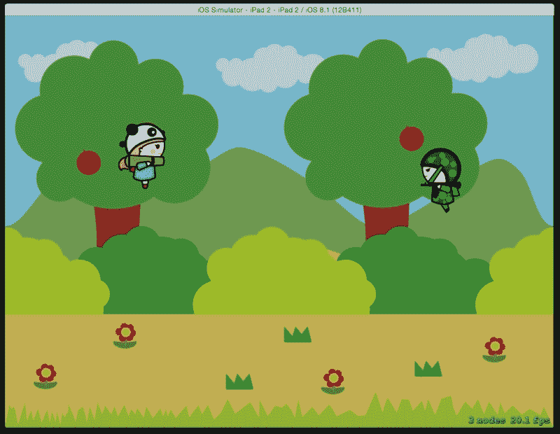

## 添加敌人子弹

好的。敌人似乎携带一种卡通风格的步枪，但他似乎没有用它做任何事情。让我们让他使用它。我们将让敌人射击子弹。

创建一个名为`bullet`的图像集，并将`bullet.png`和`bullet2.png`分别分配给`Images.xcassets`中的**1x**和**2x**槽位。此外，在`GamePlayScene`类的顶部创建一个名为`bullets`的新的全局变量，类型为`array`，如下所示：

```swift
var bullets:[MovingSprite] = []  
```

对于生成子弹，我们将使用`movingSprite`类。但我们必须对其进行一些修改，以便敌人一被创建就开始用步枪射击。

因此，打开`movingSprite`类，并在初始化全局变量后立即在`init`函数中添加以下内容。记住，我们在创建敌人精灵时给它添加了一个名称。这将在以下内容中使用：

```swift
if(_sprite.name == "enemy"){

let shootActiom = SKAction.repeatActionForever(SKAction.sequence([SKAction.runBlock(shootBullet),SKAction.waitForDuration(3.0)]))

_sprite.runAction(shootActiom)
}  
```

在这里，我们首先检查传入的精灵名称，如果是敌人，则创建一个类似于我们在`GameplayScene`类中创建敌人生成的动作。区别在于，我们在这里不是为每个动作创建一个单独的变量，而是创建一个名为`shootAction`的单个动作，并调用其中的所有动作。

因此，基本上，我们正在调用一个名为`shootBullet`的函数，我们将在同一个类中创建它，该函数将每 3 秒被调用一次。

在我们创建`shootAction`之后，我们调用精灵上的动作，以便它能够开始调用`shootAction`。

我们将定义`shootBullet`函数如下。这可以添加在我们添加`moveSprite`函数的下方。

```swift
func shootBullet(){

   let _gameplayScene = _sprite.parent as GamePlayScene
   _gameplayScene.addBullets(_sprite.position, size: _sprite.size)

} 
```

这个函数反过来会调用`GameplayScene`中的`addBullets`函数。由于我们在游戏场景中添加了英雄、火箭和敌人，如果我们也将子弹添加到同一个场景中会更好，因为这样在检查碰撞时更容易遍历对象。

要获取`GameplayScene`的实例，我们将创建一个名为`_gameplayScene`的局部常量，并使用`SKSpriteNode`的`.parent`属性来获取精灵被添加到的父类。由于我们在`GameplayScene`中添加了敌人，它将返回`GameplayScene`。我们仍然需要将其类型转换为`GamePlayScene`，所以我们使用`as`运算符并将其类型转换为`GamePlayScene`。

现在，由于我们需要正确地定位子弹，就像我们为英雄定位火箭一样，我们需要在创建子弹时提供敌人对象的位置和大小。假设如此，我们将创建一个名为 `addBullets` 的函数，我们将通过提供敌人精灵的位置和大小来在 `GamePlayScene` 中调用此函数。

现在，让我们转到 `GameplayScene` 并创建一个名为 `addBullets` 的函数，如下所示：

```swift
func addBullets(pos:CGPoint, size: CGSize){

   let bulletNode: SKSpriteNode = SKSpriteNode(imageNamed: " bullet")

var newPos = CGPoint(x: pos.x - size.width/2 -     
                                    bulletNode.size.width/2,
                        y: pos.y - bulletNode.size.height)

   bulletNode.position = newPos
   self.addChild(bulletNode)

   let speed: CGPoint = CGPoint(x: -10.0, y: 0.0)
   let bullet: MovingSprite = MovingSprite(sprite: bulletNode, speed: speed)
   bullets.append(bullet)

}  
```

你现在应该相当熟悉在 SpriteKit 中添加对象了。就像火箭一样，我们创建一个名为 `bulletNode` 的 `SKSpriteNode`，并分配子弹图像。你知道该怎么做。

然后，我们创建一个新的位置，它将在敌人精灵的左侧端点。因此，我们取敌人的当前位置，从 `x` 位置减去敌人宽度的一半和 `bulletNode` 的一半。对于 `y` 位置，我们从位置 `y` 位置减去子弹的全高。在下一步中，我们将此位置分配给 `bulletNode` 的位置，然后将其添加到当前场景中。

我们创建一个新的速度变量，并分配我们想要子弹移动的速度。我们创建一个新的常量 `bullet`，并将 `bulletNode` 和速度提供给它。

需要创建一个子弹数组来追加所有创建的子弹。因此，创建一个新的名为 `bullets` 的数组，它接受 `MovingSprite` 并将其添加到类的顶部。

子弹创建后，将其追加到 `bullets` 数组中。

我们还需要更新子弹的位置并检查，以便在它们离开屏幕后删除它们。因此，类似于更新敌人，我们需要在 `updateGameObjects` 函数中添加以下代码来更新子弹：

```swift
for(var i:Int = 0; i < bullets.count; i++){

    bullets[i].moveSprite()

    var sprite: SKSpriteNode = bullets[i]._sprite

    if((sprite.position.x + sprite.size.width/2) < 0){

        sprite.removeFromParent()
        bullets.removeAtIndex(i)
    }
}     
```

因此，我们遍历数组中的子弹，调用 `moveSprite` 函数，如果精灵已经超出屏幕的左侧，我们就从父节点中移除它，并在当前索引中移除对象。

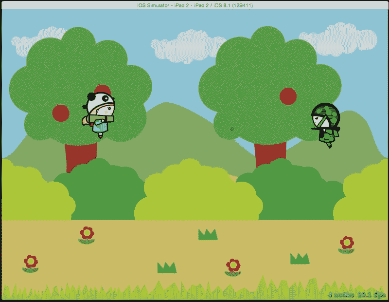

现在我们已经拥有了进入下一阶段开发所需的所有元素，即检查英雄火箭与敌人之间的碰撞，以及敌人子弹与英雄之间的碰撞。基于碰撞，我们将进行计分和检查游戏结束条件。

# 碰撞检测

在二维游戏中，碰撞检测是通过精灵类的 `intersectsNode` 函数来完成的。我们可以检查当前精灵是否与其他精灵重叠。在当前节点的 `intersectsNode` 函数中，我们传入一个节点，我们想要检查它与当前节点是否发生碰撞。如果有交集，函数将返回 `true`，如果没有，则返回 `false`。

对于碰撞检查，我们首先检查敌人子弹与英雄之间的碰撞。如果发生碰撞，则游戏结束。然后我们将检查英雄火箭与敌人之间的碰撞。如果我们检测到碰撞，则必须更新分数。

此外，如果敌人超出屏幕的左侧，游戏即结束，因此在这种情况下也会调用 `GameOver` 函数。

对于检查碰撞，在 `GameplayScene` 中创建一个新的函数 `checkCollision` 并添加以下代码：

```swift
//Hero and Bullets

for bullet in bullets{

    var sprite = bullet._sprite

    if(sprite.intersectsNode(hero)){

        GameOver()
    }
}
```

由于我们不需要知道索引号，我们将仅使用 `for in` 循环来检查碰撞。

在这里，我们遍历 `bullets` 数组中的所有子弹对象。首先，我们将子弹对象的精灵分配给一个局部精灵变量。然后，我们将对该精灵调用 `intersectsNode` 函数以检查它是否与英雄精灵相交。如果相交，则调用 `GameOver` 函数。

`intersectsNode` 函数仅接受节点的精灵，并检查围绕该精灵的矩形是否与提供的精灵的边界框相交。如果存在重叠，则如果发生碰撞，将返回 `true`，否则返回 `false`。

在更新英雄和游戏对象之后，立即在 `update` 函数中调用 `checkCollision` 函数，如下所示：

```swift
    override func update(currentTime: CFTimeInterval) {
        /* Called before each frame is rendered */

            updateGameObjects()
            updateHero()
            checkCollision()

    }
```

接下来，让我们创建 `GameOver` 函数。一旦游戏结束，我们希望停止更新英雄和游戏对象，并停止检查碰撞。

此外，在类的顶部创建一个全局布尔变量 `gameOver` 并将其设置为 `false`。它应该是一个 `var` 而不是 `let`，因为我们将在 `GameOver` 函数中更改它：

```swift
var enemies:[MovingSprite] = []
    var bullets:[MovingSprite] = []
    var gameOver = false

```

将 `GameOver` 函数添加到 `GamePlayScene` 类中，紧接在 `update` 函数之后，如下所示：

```swift
func GameOver(){

   gameOver = true

   self.removeAllActions()

   for enemy in enemies{

       enemy._sprite.removeAllActions()
   }
}
```

一旦游戏结束，我们将 `gameOver` 布尔值设置为 `false`。接下来，我们调用当前类上的 `removeAllActions` 以停止敌人生成，然后我们也调用屏幕上所有当前存在的敌人的函数，这样子弹就不会生成。

我们还需要在敌人超出屏幕左侧时调用 `GameOver` 函数，因此为了更新敌人的位置，在循环中的 `if` 条件中调用 `GameOver` 函数，如下所示：

```swift
for(var i:Int = 0; i < enemies.count; i++){

       enemies[i].moveSprite()

       var sprite: SKSpriteNode = enemies[i]._sprite

       if((sprite.position.x + sprite.size.width/2) < 0){

           sprite.removeFromParent()
           enemies.removeAtIndex(i)

           GameOver()
       }
}//update enemies
```

为了在游戏结束后停止更新英雄和游戏对象，并停止检查碰撞，一旦游戏结束，将三个函数包裹在一个 `if` 条件语句中，如下所示，其中我们检查 `gameOver` 布尔值是否为 `false`。如果是 `false`，则函数将被调用，否则将跳过并不会调用函数。

```swift
override func update(currentTime: CFTimeInterval) {
   /* Called before each frame is rendered */
        
   if(!gameOver){

       updateGameObjects()
       updateHero()
       checkCollision()

   }
}
```

接下来，如果游戏结束，玩家不应能够发射火箭或使英雄向上推。所以，基本上，我们必须在游戏结束后禁用玩家控制。因此，在 `touchesBegan` 函数中，将检查屏幕被点击哪一侧的部分包裹在 `if` 条件中，检查是否满足游戏结束条件，如下所示：

```swift
override func touchesBegan(touches: NSSet, withEvent event: UIEvent) {

/* Called when a touch begins */

   for touch: AnyObject in touches {

       let location = touch.locationInNode(self)

       let _node:SKNode = self.nodeAtPoint(location)        

       if(!gameOver){ //if game is not over check for touches

           if(location.x < viewSize.width/2){

               println("[GamePlayScene] touchedLeftSide ")

               thrust.y = 15.0

           }else if(location.x > viewSize.width/2){

               println("[GamePlayScene] touchedRightSide ")

               addRockets()                
           }
        }
    }      
 }
```

# 记分

我们还没有完成`checkCollision`函数。我们仍然需要跟踪分数。为此，我们必须检查英雄的火箭与敌人的碰撞。因此，在`checkCollision`函数中，添加以下代码：

```swift
for(var i:Int = 0; i < rockets.count; i++){

    var rocketSprite = rockets[i]._sprite

    for(var j:Int = 0 ; j < enemies.count; j++){

        var enemySprite = enemies[j]._sprite

          if(rocketSprite.intersectsNode(enemySprite)){

            enemySprite.removeFromParent()
            rocketSprite.removeFromParent()

            rockets.removeAtIndex(i)
            enemies.removeAtIndex(j)

            score++

        }
    }
}
```

我们使用`for`循环，因为我们在这里需要循环中对象的索引。我们遍历场景中的所有火箭，并通过遍历`enemies`数组来检查场景中所有敌人的碰撞。如果任何火箭与敌人发生碰撞，则从场景中移除火箭和敌人精灵节点，并从数组中移除火箭和敌人。

最后，在类的顶部创建一个新的全局变量`var`，命名为`score`，类型为`int`，并将其初始化为 0，如下所示。在检查碰撞后，我们增加分数 1，以跟踪分数。

```swift
    var bullets:[MovingSprite] = []
    var gameOver = false
    var score:Int = 0

```

我们可以在控制台中记录分数以检查分数变量是否实际上在增加。但是，玩家如何知道他们已经获得了多少分数？

## 显示分数

为了显示分数，我们将使用`SKLabelNode`，并在分数每次更改时分配分数值。由于我们将在`checkCollision`函数中访问此变量，它必须是一个全局变量。因此，在顶部创建一个名为`scoreLabel`的变量，类型为`SKLabelNode`，与其他全局变量一起：

```swift
var scoreLabel: SKLabelNode!
```

在`init`函数中，在我们添加英雄后，可以添加以下行来初始化`scoreLabel`变量：

```swift
scoreLabel = SKLabelNode(fontNamed:"Chalkduster")
scoreLabel.text = "Score: 0"
scoreLabel.fontSize = 45
scoreLabel.position = CGPoint(x: viewSize.width/2, y: viewSize.height * 0.9)
self.addChild(scoreLabel)
```

我们为要使用的字体指定一个名称，即`Chalkdust`。然后我们分配要显示的实际文本。稍后，在`checkCollision`函数中，我们将根据分数变量的值更改此文本的值。我们将大小设置为`45`，并将`scoreLabel`放置在显示高度的 90%，以便它在屏幕顶部，并将其放置在屏幕宽度的中心。最后，我们将`scoreLabel`添加到当前场景中。

如果你现在运行游戏，我们将分配的文本将会显示，但分数不会更新。为了更新分数，我们必须更改文本并分配我们之前创建的分数变量的实际值。

因此，在我们通过`checkCollision`函数增加分数后，立即添加以下代码来增加标签的分数文本：

```swift
rockets.removeAtIndex(i)
enemies.removeAtIndex(j)

score++

scoreLabel.text = "Score: \(score)" 

```

与我们将变量记录到控制台的方式类似，我们将分数值分配给字符串，然后将其传递给`scoreLabel`的文本属性。现在，如果我们构建并运行游戏，它应该显示当前分数，如下面的截图所示：

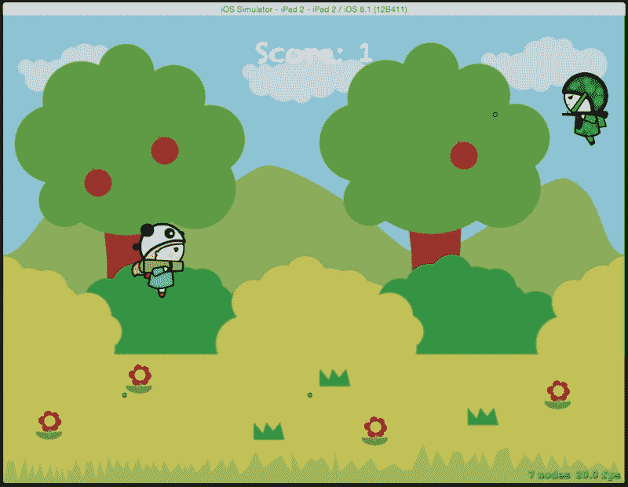

# 显示游戏结束屏幕

游戏结束后，我们必须向玩家显示**GameOver!**，并添加一个按钮，以便玩家可以返回主菜单。

在`GameOver`函数中，在调用停止所有动作的函数后添加一个名为`myLabel`的标签：

```swift
let myLabel = SKLabelNode(fontNamed:"Chalkduster")
myLabel.text = "GameOver!"
myLabel.fontSize = 65
myLabel.position = CGPoint(x: viewSize.width * 0.5, y: viewSize.height * 0.65)
self.addChild(myLabel)
```

我们添加了字体大小为`65`的**GameOver!**文本，以便玩家可以轻松看到，并将其放置在屏幕中央稍上方，为即将添加的主菜单按钮腾出空间。

# 添加主菜单按钮

接下来，在`GameOver`函数中，创建一个名为`menuBtn`的 SKSpriteNode，并将`menuBtn`的图像集传递给它。为了在`images.xcassets`中创建图像集，`homeBtn.png`和`homeBtn2.png`被包含在`Resources`文件夹中。我们将它放置在屏幕中央。我们还给它起了一个名字，以便我们可以在`touchesBegan`函数中引用它，以便如果它被按下，我们可以调用它的一些函数：

```swift
let menuBtn = SKSpriteNode(imageNamed: "menuBtn")
menuBtn.position = CGPoint(x: viewSize.width/2, y: viewSize.height/2)
self.addChild(menuBtn)
menuBtn.name = "menuBtn"
```

接下来，在`touchesBegan`函数中，在我们检查游戏是否结束之后，添加一个`else`块，并添加以下代码以替换当前场景为`MainMenuScene`：

```swift
else{ // else check whether main menu button is clicked

     let _node:SKNode = self.nodeAtPoint(location)

     if(_node.name == "menuBtn"){

            let scene = MainMenuScene(size: self.size)
            self.view?.presentScene(scene)                    
      }
}
```

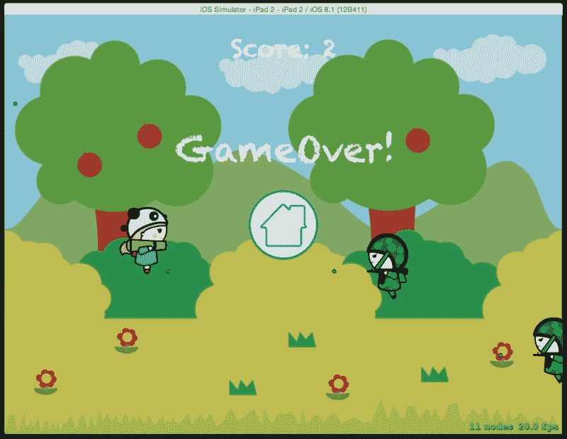

与我们制作播放按钮交互的方式类似，如果游戏结束，我们检查玩家是否触摸了屏幕。如果他点击的位置包含节点名称`menuBtn`，我们创建一个名为`scene`的本地对象，并分配`MainMenuScene`，然后替换当前场景为`MainMenuScene`。

就游戏玩法而言，我们已经完成了。现在让我们添加一个功能，允许我们保存最高分，这样我们就可以挑战玩家打破它，以增加游戏的可玩性。

# 保存最高分

对于保存最高分，我们可以使用`NSUserDefaults`属性。在这里，我们可以使用一个键并为其分配一个特定的值，设备将将其存储在其内存中，以便我们稍后可以检索。最好的事情是，我们可以检索并重写它当前存储的值，到另一个文件中。因此，这里我们将最高分存储在`GamePlayScene`中，稍后，在`MainMenuScene`中存储的键的值。

由于它是一个字典，你可以存储整数、浮点数和字符串。在这种情况下，由于最高分始终是整数，我们将为键获取并存储一个整数。这里的键是一个字符串，存储的值是一个整数。

对于检索最高分值，在`GameOver`函数中添加`menuBtn`之后添加以下代码：

```swift
var currentHighScore = NSUserDefaults.standardUserDefaults().integerForKey("tinyBazooka_highscore")
```

由于当前没有在键中存储值，它将返回零。

为了祝贺玩家获得新的最高分，创建一个新的`SKLabelNode`，在我们添加了`currentHighScore`之后，并称它为`highScoreLabel`，如下面的代码所示：

```swift
var highScoreLabel = SKLabelNode(fontNamed:"Chalkduster")
highScoreLabel.text = ""
highScoreLabel.fontSize = 45
highScoreLabel.position = CGPoint(x: viewSize.width * 0.5, y: viewSize.height * 0.30)
self.addChild(highScoreLabel)
```

我们创建了一个带有`Chalkduster`字体的标签。我们将初始文本值设置为空白，以便我们可以根据玩家是否打破最高分来稍后更改它。我们将文本高度设置为`45`，并将其放置在按钮下方，然后将其添加到场景中。

接下来，我们检查存储在`currentHighScore`中的值与当前`score`的值，看看`currentHighScore`的值是否大于当前`score`，如下所示：

```swift
if (score > currentHighScore) {

NSUserDefaults.standardUserDefaults().setInteger(score, 
                       forKey: "tinyBazooka_highscore")

NSUserDefaults.standardUserDefaults().synchronize()

highScoreLabel.text = "New High Score: \(score) !"

} else {

    highScoreLabel.text = "You can Do Better than \(score)"

}
```

如果分数高于当前最高分，那么我们调用`standardUserDefaults`的`setInteger`函数，并将新的最高分（即当前分数）和键分配给它存储。在分配键时，请确保它是唯一的。

要将数据保存到设备，我们必须调用`synchronize`函数。如果我们未能调用此函数，一旦关闭应用程序，数据将会丢失，所以请确保每次存储值时都调用此函数。

然后，我们通过更改文本属性来祝贺玩家获得新的高分，显示当前分数，即新的最高分。

如果玩家没有打破他当前的最高分，那么在`else`语句中，我们更改`highScoreLabel`的文本属性，显示他可以比当前分数做得更好，这样就会激励他再次玩游戏并打破之前的最高分。

在下面的屏幕截图中，我得了**7**分，我认为这还不错。经过一点练习，我认为我会做得更好。这也只是为了证明代码运行正常，如果当前分数高于最高分，那么它将显示新的最高分。

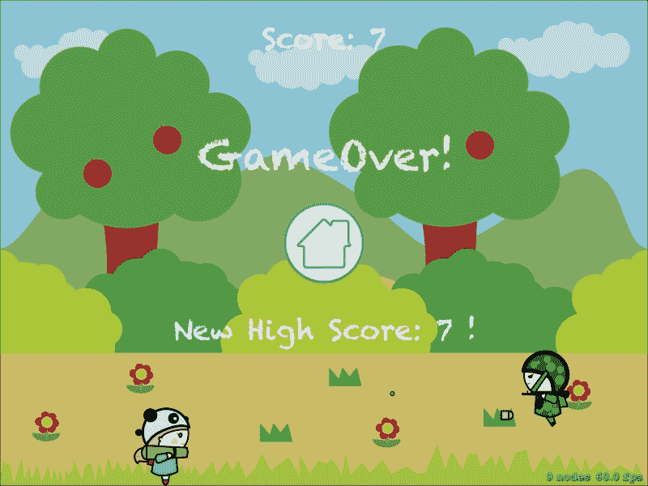

如果当前分数低于当前最高分，那么你会看到以下屏幕。这里我得了**4**分，低于保存在内存中的当前最高分**7**。

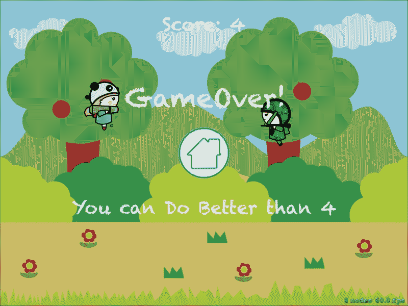

# 重置最高分计数

如果玩家想要将他们的最高分重置为零呢？我们可以通过在主菜单中添加一个按钮并重置键的值为零来实现这一点。

打开`MainMenuScene.swift`文件，在创建播放按钮的`didMoveToView`函数中，创建一个名为`resetBtn`的`SKSpriteNode`。将此按钮放置在屏幕宽度的四分之三处，并命名为`resetBtn`。我们将使用此名称来检查玩家是否点击了播放按钮或重置按钮。

重置按钮的资产位于`Resources`文件夹中，因此创建一个新的图像集`resetBtn`，并将`resetBtn.png`和`resetBtn2.png`分别拖放到**1x**和**2x**占位符中，如下所示：

```swift
let resetBtn = SKSpriteNode(imageNamed: "resetBtn")

resetBtn.position = CGPoint(x: viewSize.width * 0.75, y: viewSize.height/2)

self.addChild(resetBtn)

resetBtn.name = "resetBtn"
```

现在，在`touchesBegan`函数中，我们在检查`playBtn`时添加一个`else if`块，并检查是否按下了`resetBtn`，如下所示：

```swift
else if (_node.name == "resetBtn"){

NSUserDefaults.standardUserDefaults().setInteger(0, forKey: "tinyBazooka_highscore")

NSUserDefaults.standardUserDefaults().synchronize()

}
```

如果按下重置按钮，我们将通过我们获取值的键的值设置为零，并再次调用`synchronize`函数，以便将此值存储在系统中。

现在，作为最后一件事，当应用程序打开时，让我们向玩家展示当前的最高分，因此，在`MainMenuScene`类的顶部创建一个新的全局变量`currentHighScoreLabel`，类型为`SKLabel`，如下面的代码所示：

```swift
class MainMenuScene: SKScene {

 var currentHighScoreLabel: SKLabelNode!

```

接下来，在`didMoveToView`函数中添加以下内容，紧接在添加重置按钮之后：

```swift
var currentHighScore = NSUserDefaults.standardUserDefaults().integerForKey("tinyBazooka_highscore")

currentHighScoreLabel = SKLabelNode(fontNamed:"Chalkduster")

currentHighScoreLabel.text = "Current High Score: \(currentHighScore)"

currentHighScoreLabel.fontSize = 45
currentHighScoreLabel.position = CGPoint(x: viewSize.width * 0.5, y: viewSize.height * 0.20)

self.addChild(currentHighScoreLabel)
```

我们首先获取存储的当前最高分，然后将这个值赋给文本。其余的代码与之前的代码类似，只是位置`y`的值乘以 0.2 而不是 0.3，因为播放按钮相当大。

我们还需要在重置最高分后更改文本，所以在我们检查是否按下重置按钮的`else if`块中，在添加代码重置键的值的地方，添加这里显示的突出显示的行：

```swift
else if (_node.name == "resetBtn"){

     NSUserDefaults.standardUserDefaults().setInteger(0, forKey: "tinyBazooka_highscore")

NSUserDefaults.standardUserDefaults().synchronize()

 var currentHighScore = NSUserDefaults.standardUserDefaults().integerForKey("tinyBazooka_highscore")
 currentHighScoreLabel.text = "Current High Score: \(currentHighScore)"

}
```

在这里，我们再次获取存储的值，只是为了检查我们之前存储的值是否确实得到了反映。然后我们将`currentHighScoreLabel`的文本设置为这个值。

我们本可以将文本设置为`当前最高分：0`，这样它仍然可以正常工作，但这样我们就不确定键的值是否实际上被设置为零。

现在，如果你运行代码，你可以在游戏开始时看到主菜单屏幕上显示的当前最高分。你还可以验证一旦重置，最高分的值实际上被设置为零。

因此，在下面的屏幕截图中，主菜单场景再次显示了当前最高分，尽管这段代码是在达到新最高分之后添加的：

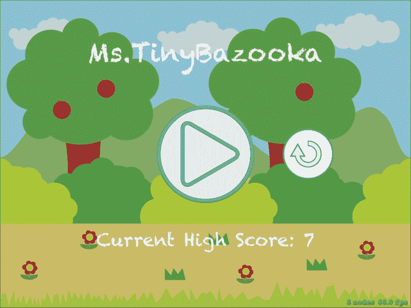

在下一张屏幕截图中，我们可以确定一旦按下重置按钮，当前最高分的值就会改变：


所以这就是这一章的全部内容。保存这个文件并保留它，因为我们在下一章还需要它。

# 摘要

这是一章相当长的内容，我们实际上在其中制作了一个完整的游戏。我们使用 SKScenes 创建了主菜单和游戏场景，并添加了交互式按钮来在场景之间切换。

你学习了如何将资源导入项目，将它们添加到屏幕上，并使它们移动并相互交互。你还看到了如何从屏幕上移除对象以及添加和更新分数。

最后，你看到了如何在设备上存储和检索当前最高分。然而，我们还没有完成游戏。我们还需要添加动画、粒子效果和背景音乐及音效，让游戏变得生动起来。希望你们都在期待它。

同时，你可以练习并尝试打破我的最高分。
