# 第七章. 高级 SpriteKit

在本章中，我们将介绍 SpriteKit 中的一些高级功能，例如灯光和物理，这将使游戏开发过程更加容易，并使我们的游戏看起来更漂亮。通过灯光，我们可以创建光源，并使场景中的某些对象产生阴影并受到光的影响。使用物理引擎，我们可以使游戏对象自动受到重力和外部施加的力的作用。

我们还将探讨如何导入用 Objective-C 编写的类，这样如果你已经为 SpriteKit Objective-C 编写了一些类，我们可以轻松地将它们带入 Swift，而无需再次重写代码。

使用导入 Objective-C 类的新知识，我们将探讨诸如 Glyph Designer 和 Spine 等工具。使用 Glyph Designer，我们可以拥有比常规标签占用更少空间和处理能力的自定义字体，而使用 Spine，我们可以创建基于骨骼的动画，这是一种创建动画的更好优化方式。

本章涵盖的主题如下：

+   灯光和阴影

+   Sprite Illuminator

+   物理

+   Objective-C 在 Swift 中

+   Glyph Designer

+   骨骼动画

# 灯光和阴影

我们可以使用 **LightNode** 在 SpriteKit 中创建光源。LightNode 可以像精灵节点一样放置在场景中，通过将其添加到场景中。

要创建光源，打开 `MainMenuScene` 类，并在我们添加背景到场景之后添加以下内容：

```swift
let lightNode = SKLightNode()
lightNode.position = CGPoint(x: viewSize.width * 0.5, y: viewSize.height * 0.75)
lightNode.categoryBitMask = 1
lightNode.falloff = 0.25
lightNode.ambientColor = UIColor.whiteColor()
lightNode.lightColor = UIColor(red: 1.0, green: 1.0, blue: 0.0, alpha: 0.5)
lightNode.shadowColor = UIColor(red: 0.0, green: 0.0, blue: 0.0, alpha: 0.3)
addChild(lightNode)
```

与我们创建 SKSpriteNode 类似，我们在 Swift 中创建 SKLightNode 来创建灯光。我们通过在宽度上居中并放置在屏幕高度的四分之三处来定位它。

如果你现在构建并运行游戏，你会看到场景没有任何变化。这是因为我们必须明确告诉场景哪些对象应该受到光源的影响。这是通过将类别掩码位赋给光源来完成的，这样我们就可以稍后去对象那里告诉它受到特定掩码位的光源的影响。在这里，我们赋值掩码为 `1`。由于掩码位使用 UINT32，因此一个场景中一次可以有总共 32 个光源，因为整数中有 32 位或 4 个字节。

通过将 LightNode 的掩码类别设置为 `1`，我们表示这个光源的第一个位是开启的。所以，在分配类别时，你不会使用一般的整数数字来定义一个类别。因此，灯光的类别应该是 1、2、4、8、16 等等。在这里，`1` 表示第一个位是开启的，`2` 表示第二个位是开启的，`4` 表示第三个位是开启的，以此类推。不要使用像 1、2、3、4 等一般的数字来定义类别，因为这会导致意外的结果。

在创建光源时，我们还需要提供有关光源的其他信息，例如衰减。像所有光源一样，它在源头具有最大强度，并且你离源头越远，强度就越弱。衰减决定了光源强度下降的速度。`1`的值表示它永远不会失去其强度值，而`0`表示它会立即失去。

除了掩码和衰减之外，我们还需要提供光源的颜色、环境光和阴影的颜色。对于光和阴影的颜色，我们给出白色和黑色。注意，在阴影颜色中，我们降低了不透明度的值，否则阴影将完全黑色。对于环境光，我们将蓝色变量降低到零，因为背景中已经有足够的蓝色。然后，我们将光源添加到场景中。

要使对象实际上受到光源的影响，我们必须将该对象的`lightBitMask`属性分配给之前分配的光源的分类掩码。

因此，要使背景受到光源的影响，在将背景添加到场景后并在代码中添加以下内容，然后运行游戏以查看结果，如下所示图像：

```swift
BG.lightingBitMask = 1
```

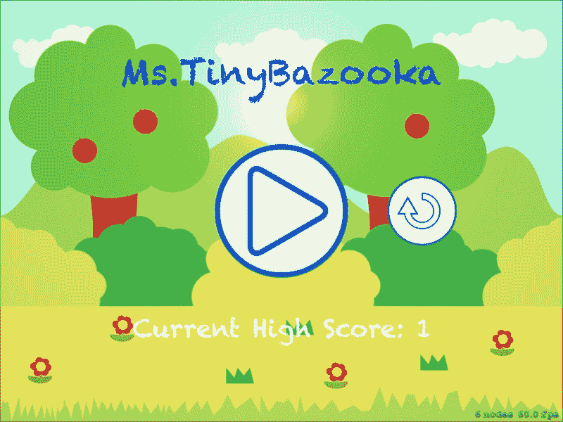

哇！这不是很漂亮吗？这里我将字体颜色改为蓝色，以便更容易看到光源。这可以通过在`myLabel`中添加以下高亮行来完成：

```swift
let myLabel = SKLabelNode(fontNamed:"Chalkduster")
myLabel.text = "Ms.TinyBazooka"
myLabel.fontSize = 65
myLabel.position = CGPoint(x: viewSize.width/2, y: viewSize.height * 0.8)
myLabel.fontColor = UIColor.blueColor()
self.addChild(myLabel)
```

现在要投射阴影，我们只需要在你想投射阴影的对象上调用`shadowCastBitMask`。将光源的分类掩码分配给它，以便可以投射阴影。

我们将要求播放按钮精灵图像投射阴影，因此，在将播放按钮添加到场景后，添加以下代码：

```swift
self.addChild(playBtn) 
playBtn.name = "playBtn"

playBtn.shadowCastBitMask = 1

```

现在，播放按钮会根据光源的位置投射阴影。

在场景中创建光源和阴影时，有一些事情需要记住。只有精灵可以在 SpriteKit 场景中投射阴影。我尝试将其应用于标签，但它无法从文本中创建阴影。

如果你正在制作一个受光源影响的对象，确保它永远不会被删除并重新添加到场景中。如果对象被移除，光源必须重新计算场景中的照明，这个过程在对象被重新添加到场景中时再次执行。这将在场景中重新计算光和阴影时引起闪烁。

### 注意

最好将阴影添加到你知道将来不会删除的对象上。

此外，在`GameViewController`中，将`ignoreSiblingOrder`更改为`false`：

```swift
skView.ignoresSiblingOrder = false

```

说到这里，让我们运行场景，看看阴影的效果，如下所示图像：

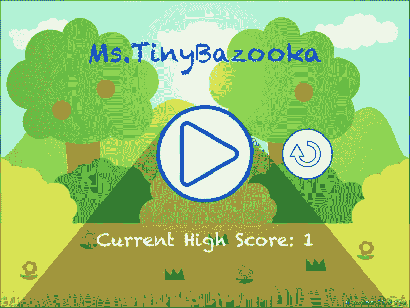

这很棒。但如果我们能在场景中添加一些投射阴影的移动云层，那就太好了。此外，由于云层在移动，我们可以使用视差精灵类使背景像我们在上一章中做的那样滚动。我们还可以添加一个太阳精灵并使其旋转。

为了完成本章的内容，我们将为天空创建一个单独的精灵，并将背景精灵的云层移除，因为我们将会添加一个新的云层精灵，并使用移动精灵类将其移动，使其在场景中循环。因此，前往本章的资源文件夹，进入照明目录，获取天空、太阳、云层和新的背景图像。创建名为天空、太阳和云层的图像资源。用新的背景精灵替换旧的背景精灵。

在`MainMenuScene`类中，首先添加天空精灵，如下所示：

```swift
let sky = SKSpriteNode(imageNamed: "sky", normalMapped: true)
sky.position = CGPoint(x: viewSize.width/2, y: viewSize.height/2)
self.addChild(sky)
```

然后，按照以下方式将太阳精灵添加到场景中：

```swift
let sun = SKSpriteNode(imageNamed: "sun")
sun.position = CGPoint(x: viewSize.width * 0.5,y: viewSize.height * 0.75)
addChild(sun)
sun.lightingBitMask = 1

sun.runAction(SKAction.repeatActionForever(SKAction.rotateByAngle(1, duration: 1)))
```

在将太阳添加到场景后，使其受到光线的影响。然后，我们在其上创建一个新的`repeatActionForever`变量，使其每秒旋转太阳精灵一度，永远旋转。

接下来，在`MainMenuScene`类的顶部添加以下全局变量：

```swift
var scrollingBg:ParallaxSprite!
var cloud:MovingSprite!
var cloudNode:SKSpriteNode!
```

由于我们希望在`update`函数中调用`scrollingBg`、`cloudNode`和云对象的更新方法，因此我们希望它们是全局变量。

现在，在`didMoveToView`方法中初始化类和变量。

首先按照以下方式创建`cloudNode`：

```swift
cloudNode = SKSpriteNode(imageNamed:"cloud");
cloudNode.position = CGPoint(x: viewSize.width/2, y: viewSize.height * 0.9)
addChild(cloudNode)
```

接下来，在`cloudNode`上初始化`shadowcaste`属性，并将其添加到云移动精灵变量中，以便我们稍后更新其位置：

```swift
cloudNode.shadowCastBitMask = 1
cloud = MovingSprite(sprite: cloudNode, speed: CGPointMake(-3.0, 0.0))
```

与背景相比，我们使云层移动得较慢，因为背景以`-5.0`的速度移动。如果我们让两者以相同的速度移动，那么它们将看起来像是一张图片，并且一起移动。

在此之下，添加光源。

在此之后，通过创建两个名为`BG1`和`BG2`的精灵图像来初始化`scrollingBg`类。将它们添加到场景中，并在两个背景精灵上初始化`lightingBitMask`。

接下来，通过传递背景精灵、`viewsize`和速度来初始化`scrollingBg`类，如下所示：

```swift
let BG1 = SKSpriteNode(imageNamed: "BG")
self.addChild(BG1)

let BG2 = SKSpriteNode(imageNamed: "BG")
self.addChild(BG2)

BG1.lightingBitMask = 1        
BG2.lightingBitMask = 1

scrollingBg = ParallaxSprite(sprite1: BG1, sprite2: BG2, viewSize: viewSize, speed: -5.0)
```

接下来，我们必须更新`scrollingBg`、云层和云节点对象的位置。因此，添加一个更新函数并添加以下内容：

```swift
override func update(currentTime: CFTimeInterval) {
   /* Called before each frame is rendered */

   scrollingBg.update()
   cloud.moveSprite()

   if((cloudNode.position.x + cloudNode.size.width/2) < 0){

       cloudNode.position.x = viewSize.width + cloudNode.size.width/2
   }
}
```

在这里，我们调用`scrollingBg`和云对象的`update`和`moveSprite`函数。我们还通过将`cloudNode`精灵的`X`位置设置为屏幕右侧，一旦图像超过左侧，来更新`cloudNode`精灵的位置，如图所示：

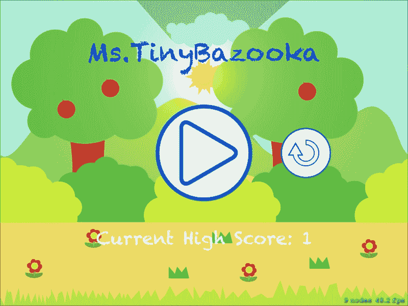

我们必须注意对象添加到场景中的顺序，以确保阴影正确投射。顺序如下：

+   `sky`

+   `sun`

+   云（`cloudNode`）

+   `lightNode`

+   `scrollingBg` (`BG1`和`BG2`)

这很重要，因为阴影是在光源的深度投射，而不是在对象的深度。

### 小贴士

在前面的图像中，尽管我们要求光线照在播放按钮上，但由于背景层在上面，我们没有看到像早期截图中的阴影。如果你将`lightNode`移到最顶层，你会看到播放按钮投下阴影，但即使云层在背景层后面，它们的阴影也会在背景层的树木上显现，这看起来很奇怪。因此，在哪个层添加光源是很重要的。

你还必须注意你想要光线影响的图像的大小。你会发现我没有在天空图像上启用`lightBitMask`属性，因为它将游戏的 FPS 降低到 45，我的 iPadMini Retina 上的一切都运行得很慢。所以我禁用了天空层的照明，只保留了运行和背景精灵的照明。但即使在 iPad3 上，这仍然会导致卡顿和减速，所以我不得不完全禁用所有图像的照明，以保持一致的 60 FPS。

添加光照和阴影非常依赖于硬件和处理器，所以在你的游戏中实现它们时，请确保在所有设备上进行足够的测试，以确保无论游戏在哪个设备上运行，都能以平滑的 FPS 运行。

这就是关于光照的所有内容；我们将转到`GameplayScene`类，看看物理，并了解如何实现它。当我们在本章后面查看 Glyph Designer 和 Spine 时，我们将返回到`MainMenuScene`。

在下一节中，我们将看到如何通过替换我们之前创建的小型物理引擎来添加物理，该引擎用于创建重力以拉下玩家或推起玩家。

# Sprite Illuminator

虽然 SpriteKit 会自动添加法线图，但你也可以指定自己的法线图以获得更好的效果。要下载 Sprite Illuminator，请访问[`www.codeandweb.com/spriteilluminator`](https://www.codeandweb.com/spriteilluminator)并下载 DMG 文件。

下载 Sprite Illuminator 后，双击 DMG 文件，并将应用程序复制到**应用程序**文件夹。转到启动盘，启动应用程序。一旦应用程序启动，你应该会看到以下截图中的窗口：

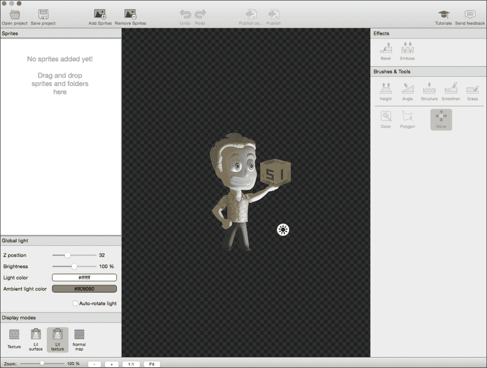

让我们详细看看界面。

在左侧，我们有**精灵**面板。中间面板是**预览**面板，其中你可以看到你所做的所有更改的预览。右侧的面板称为**工具**面板。我们将进一步深入了解这些面板中的每一个。

## **精灵面板**

在**精灵**面板中，你可以按如下方式修改精灵、全局光和显示模式：

+   **精灵**：在这里，我们可以添加或移除需要创建法线图的精灵。

+   **全局光照**：我们可以通过影响其`Z`位置、亮度、光照颜色和环境颜色来改变全局光源的属性。这只是为了可视化目的，在游戏中，我们将在 SpriteKit 中添加光源并改变其属性。

+   **显示模式**：默认情况下，**光照纹理**模式是开启的。这会显示图像在启用光照和法线贴图时的预览。纹理模式将仅显示纹理而不显示光照和法线贴图。光照表面将显示带有光源的图像但不显示法线贴图。**法线贴图**模式将仅显示为图像创建的法线贴图。

## 预览面板

**预览**面板将根据你在**显示模式**部分选择的模式显示图像预览。

## 工具面板

我们将在工具面板上花费大部分时间。这是我们将为任何图像创建高度图的地方。**工具**面板包括**效果**和**画笔和工具**：

在**效果**类别下，使用**斜面**和**浮雕**工具我们可以给地图添加高度或深度。这正好与 Photoshop 中的相同工具的工作方式相同。

在**画笔**类别下，包含五种画笔。这些画笔包括**高度**、**角度**、**结构**、**平滑**和**擦除**：

+   **高度**：这可以添加到一个你希望看起来从图像中凸出的区域。你可以为它指定**画笔大小**、**高度**、**硬度**、**轮廓**和**方向**的值。

+   **角度**：这可以添加到一个可能以特定角度相对于光源方向的区域。这在开发等距瓦片地图时非常有用。除了指定**画笔大小**、**不透明度**和**硬度**的值外，我们还可以通过选择球体周围的区域来指定表面的方向。

+   **结构**：这个画笔用于在某个区域添加一些粗糙的纹理。你可以修改画笔的大小、密度、高度和方向。

+   **平滑度**：这个画笔用于平滑某个区域。可以通过滑块控制画笔大小和平滑度。

+   **擦除**：如果我们想擦除效果或画笔，可以使用擦除画笔。

提供了一些**选择工具**，可以使选择过程变得简单一些。所以，如果你想在一个特定区域应用画笔或效果，你可以使用选择工具隔离该区域，并在该区域应用效果：

+   ** wand/颜色**：这个工具类似于 Photoshop 中的 wand 工具。你还可以调整容差级别。

+   **多边形**：你可以使用这个工具在图像的某个区域周围创建一个闭合的多边形环路。

+   **移动**：你可以使用这个工具移动图像。

一旦你对你的创作满意，你可以点击**发布**按钮，并为你的图像创建一个法线贴图。法线贴图将是一个 PNG 文件，文件名与原始文件相同，后缀为 `_n`。

使用精灵照明器，我为英雄精灵创建了一个法线贴图（如下截图所示）。文件和资源包含在本章的`Resources`文件夹中。


在`Resources`目录的`Sprite Illuminator`文件夹中，我为两种尺寸的常规图像和法线贴图创建了两个版本。我还重命名了文件以避免任何名称冲突。将这些四个文件拖入项目中。

要在`GamePlayScene.swift`文件中使用这些资源，注释掉添加和动画英雄精灵的旧代码，并添加以下突出显示的代码。

在这里，我们不是在图像集中加载英雄文件，而是将`heroSI`和`heroSI_n`纹理分配给英雄变量。

此外，我们将英雄的`lightBitmask`属性设置为`1`，以便光源影响它。

```swift
//hero = SKSpriteNode(imageNamed: "hero");
//hero.position = CGPoint(x: viewSize.width/4, y: viewSize.height/2)
//self.addChild(hero)

hero = SKSpriteNode(texture: SKTexture(imageNamed: "heroSI"), normalMap: SKTexture(imageNamed: "heroSI_n"));
hero.position = CGPoint(x: viewSize.width/4, y: viewSize.height/2)
self.addChild(hero)

hero.lightingBitMask = 1

/*
let heroAtlas = heroAnim()
let heroIdleAnimArray = heroAtlas.hero_Idle_()
let animaiton = SKAction.animateWithTextures(heroIdleAnimArray, timePerFrame: 0.2)
let animate = SKAction.repeatActionForever(animaiton)
hero.runAction(animate)
*/ 
```

# 物理

在其他框架中，你很可能会需要导入你选择的物理引擎库，例如 Box2d 或 chipmunk，并配置它以使其正常工作。你还需要编写自定义代码以使碰撞检测工作。在 SpriteKit 中，一旦创建场景，每个场景都会在后台运行物理效果。你不需要做任何事情来使其工作。因此，在游戏场景中，我们将禁用我们创建的物理引擎，并用 SpriteKit 的内置物理引擎替换它。

打开`gameplayScene.swift`文件，在`update`函数中注释掉`updateHero`函数。如您所记得，`updateHero`函数负责让英雄受到重力影响，确保英雄始终在屏幕内，并在玩家点击屏幕左侧时应用推力。使用内置的物理引擎，我们将看到我们如何让它为我们完成所有工作。

如我之前所说，物理效果已经激活，这意味着场景中已经存在一些正在作用的引力。因此，让我们让英雄受到重力的影响。

在`init`函数中，在我们将英雄精灵添加到场景之后，添加以下行：

```swift
hero.physicsBody = SKPhysicsBody(rectangleOfSize: hero.size)
```

这就是我们告诉英雄受到物理影响所需做的所有事情。任何精灵的`physicsBody`属性都会将一个物体分配给精灵，使其表现得像一个固体物体，这意味着现在这个精灵将具有与现实生活中任何物体相同的物理属性。它将具有密度，对摩擦力做出反应，具有弹性，并受到其他物体的作用。现在我们可以施加力或以一定的速度移动它。如果移动的物体撞击这个物体，正如牛顿所说，它会对此撞击做出反应并移动。

当我们分配一个物体时，我们可以选择给物体赋予形状。在这里，我们给物体赋予了一个与精灵相同尺寸的矩形。如果我们愿意，我们也可以给物体赋予圆形的形状，或者我们可以使用自定义形状。

如果我们现在构建并运行游戏，我们会看到英雄会直接穿过屏幕底部。这是因为没有任何东西阻止英雄通过。为了对抗这种向下运动，我们必须在场景周围创建一个物理体，以防止英雄掉落。

在`init`函数中，添加以下代码：

```swift
self.physicsBody = SKPhysicsBody(
                           edgeLoopFromRect: CGRect(x: 0,
                                                    y: 0,
                                         width: viewSize.width,
                                         height: viewSize.height))
```

之前，我们给英雄添加了一个物理体，而现在我们正在初始化场景本身的物理体属性。这里的区别在于它是一个`edgeLoop`类型的物理体。边环体与常规物理体不同，因为前者没有体积。所以，它没有质量、密度、摩擦等，你不能施加力或使其以速度移动。但其他物体将会受到它的影响，这意味着如果一个常规物体在移动并被`edgeLoop`阻挡，那么常规物体将停止移动。

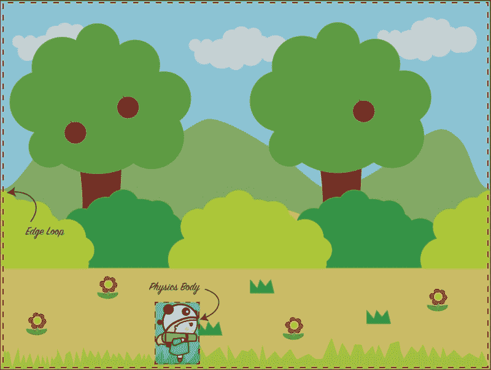

在创建边环时，我们必须传递环的形状，因此这里我们提供了从屏幕左下角的原点开始的矩形形状，即(0, 0)，并通过传递屏幕的宽度和高度来获取视图的大小。

现在，如果你构建并运行，你会看到英雄停止了。事实上，英雄不仅停止了，而且一旦她碰到屏幕底部，还会弹跳一下。你可以根据需要让角色有多重或弹跳，通过改变以下所示的价值来设置质量、密度、摩擦和恢复值。所有这些值范围从`0`到`1`：`0`表示更不弹跳、更密集、受摩擦影响等，而`1`则是光谱的另一端。

```swift
hero.physicsBody?.restitution = 0
hero.physicsBody?.friction = 0
hero.physicsBody?.density = 0
hero.physicsBody?.mass = 0  
```

你也可以更改场景中的引力值，如果你想制作一个在月球上的关卡，你可以将默认引力更改为原始值的 1/6，以产生那种效果。

关于物理引擎的一个重要注意事项是它不是以像素为单位，而是以真实世界值为单位。例如，重力的默认值实际上是 9.8 米/(秒 * 秒)。实际上所有以像素为单位的值都被转换为米，SpriteKit 内部进行像素到米的转换。

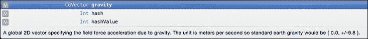

### 注意

要有类似月球的引力，访问场景物理世界属性的引力属性，并将引力更改为 9.8 的 1/6，如下所示：

*self.physicsWorld.gravity = CGVector(dx: 0, dy: -1.64)*

`gravity`属性期望一个`CGVector`值，因为我们希望引力施加向下的力，所以`x`的值为零，`y`保持为从默认值`-9.8`的`-1.64`，这是月球上的引力。你可以将其改回`-9.8`以获得更地球的感觉。

现在，我们可以对英雄施加一个力，这样我们就可以将她推到空中。因此，在 `touchesBegan` 函数中，我们可以移除之前添加的将英雄推到空中的代码，并施加一个向上的物理力。但在我们施加力之前，我们必须将英雄的速度设置为零，因为英雄必须克服向下的速度才能向上移动。如果负 *y* 方向的速度太大，那么，无论你向上施加多少力，都会被作用在英雄身上的向下重力力所抵消。首先将英雄的向下速度设置为零，然后向上施加力。以下是一个推力代码示例：

```swift
//thrust.y = 15.0
```

将其替换为以下代码：

```swift
hero.physicsBody?.velocity = CGVectorMake(0, 0)
hero.physicsBody?.applyImpulse(CGVectorMake(0, 300))
```

在这里，我们将英雄的速度设置为 `0`。由于没有在 *x* 方向上作用的力，所以设置 `Y` 值为 `0` 或同时将 `X` 和 `Y` 值都设置为 `0` 都没有关系。

接下来，我们在 *y* 方向上施加一个 `X` 值为 `0`、`Y` 值为 `300` 的冲量。但等等！

### 注意

**什么是这个冲量？**

所有这些时间我们都在谈论施加力，而现在我们实际上是在施加一个冲量。在物理引擎中，有一个单独的属性称为力，其工作原理是，一旦你对一个物体施加力，这个力就会持续作用于物体。我们只想在点击屏幕左半部分后一次性施加力。因此，我们施加的是冲量而不是力。如果我们想在点击屏幕后让玩家继续向上移动，我们应该使用力属性而不是冲量。所以，确保你想要你的对象如何表现，并相应地对你的物理对象施加力或冲量。

就这样。现在玩家表现与我们之前使用自己的物理引擎时完全一样。运行游戏并测试它。

# Objective-C 在 Swift 中

让我们看看如何将 Objective-C 类导入 Swift 并使用它们。然后我们将使用这些工具，如具有 Objective-C 实现但 Swift 中没有特定类的 Glyph Designer 和 Spine。

为了让 Objective-C 类与 Swift 兼容，你需要创建一个桥接头文件。该文件通常按照约定命名为 `<ProjectName>-Bridging-Header.h`，然后你需要在项目的 `Build Settings` 下的 **Swift Compiler – Code Generation** 中添加文件位置到 **Objective-C Bridging Header**。

### 注意

如果你使用这本书附带提供的代码，你可能需要修改路径以避免编译错误。

通常，如果你在 Swift 项目中创建一个新的头文件，你会看到一个窗口询问是否将当前创建的文件作为桥接头文件处理，Xcode 将自动将文件位置添加到 **Build Settings** 中。如果它没有弹出，我们将必须按照以下步骤进行操作，以确保 Xcode 知道在哪里查找桥接头文件，手动进行操作。

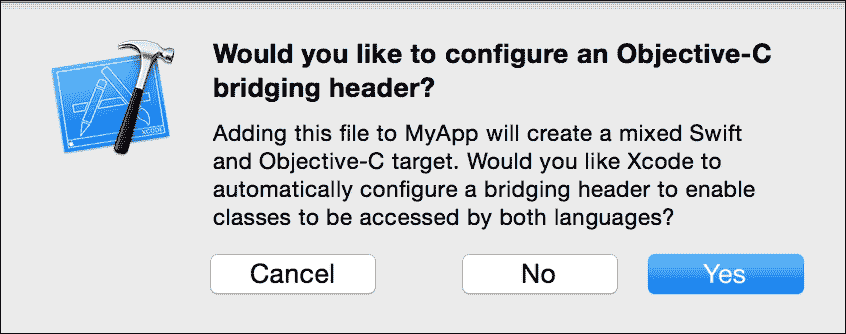

要为当前项目创建桥接头文件，请转到**文件** | **新建** | **文件**，然后在**iOS**下选择**源**，并选择带有“H”的头文件。将文件命名为**skGame-Bridging-Header**，然后点击**创建**。

现在，转到**构建设置**，在搜索框中输入`bridging`，如图所示。双击**Objective-C 桥接头**右侧，并将我们刚刚创建的项目中的桥接头文件拖放到框中。按*Enter*键。现在，项目知道了桥接头文件的位置。我们可以使用这个文件来调用 Objective-C 类的头文件，以便它们可以被 Swift 共享。

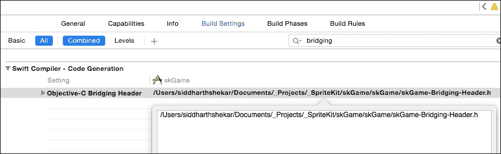

# Glyph Designer

Glyph Designer 是一个可以用来制作游戏字体应用程序。但我们不是已经有了 SKLabel 吗？这是真的。但 SKLabel 从系统中获取字体，并在运行时将字体文件转换为图像，然后将其显示在屏幕上。所以，每当分数需要增加时，系统都需要将字体转换为图像，然后将其显示在屏幕上。这与我们之前遇到的精灵问题非常相似，我们使用了 Texture Packer 来解决这个问题。

虽然你可以使用系统字体来制作大型游戏，但使用位图字体会更好，位图字体中字母和数字已经转换为图像，而不是每次都进行转换。因此，使用 Glyph Designer，我们可以创建位图字体，并使用它来更好地优化游戏。

位图字体类似于精灵图，其中包含所有字母、数字和符号的图像，并且这个图像文件将附带一个包含符号和字母位置和大小的数据文件。每当需要在屏幕上显示字母时，数据文件将检查字母的位置，然后检索并显示在屏幕上。

可以从[`71squared.com/glyphdesigner`](https://71squared.com/glyphdesigner)下载应用程序的试用版。

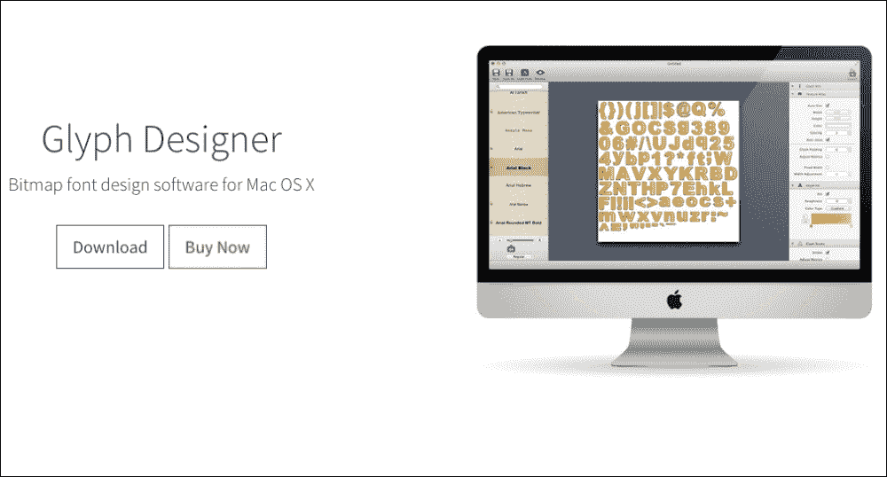

下载应用程序后，你可以打开它，它将创建一个新的未命名项目。在左侧面板中，你会看到系统中所有字体列表。中心视图显示了将要创建的文件精灵图。这是一个预览窗口，会根据你做的更改动态变化。

在选择左侧要修改的字体后，你将在右侧面板中进行大部分更改。在右侧面板中，你会找到以下标题（如图所示）：

+   **符号信息**

+   **纹理图集**

+   **符号填充**

+   **符号笔画**

+   **符号阴影**

+   **包含的符号**

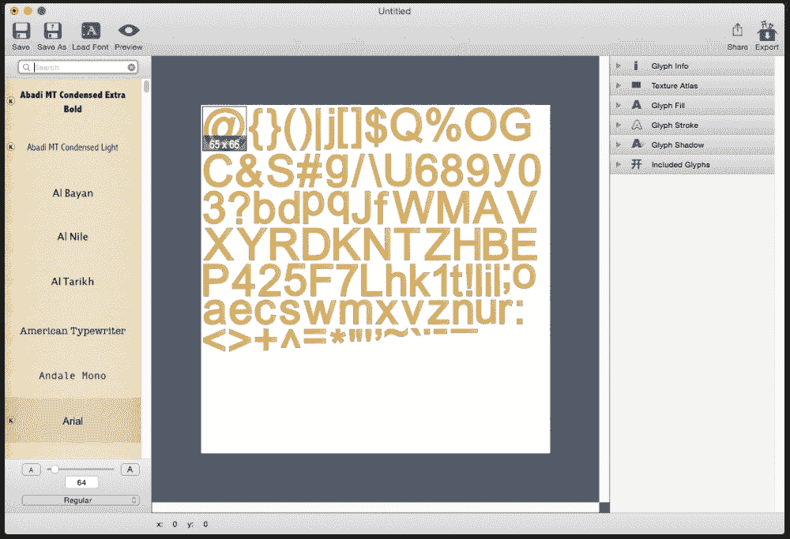

你应该主要关注**符号填充**、**笔画**和**阴影**：

+   **Glyph Fill**：我们可以选择填充类型，即**实心**、**渐变**或**图像**。所以，基本上我们在这里可以选择字体的颜色。

+   **Glyph Stroke**：这将围绕字母创建一个新的描边效果。在这里，你可以选择描边的颜色和大小。

+   **Glyph Shadow**：在这里，我们可以选择阴影的颜色和方向。有两种类型的阴影：内阴影和外阴影。这种效果会给字母带来一些深度感。

一旦你对更改满意，点击 **导出** 按钮并选择格式。你可以选择 `skf @2` 版本或正常的 `skf` 版本来生成 **2x** 和 **1x** 分辨率的文件。

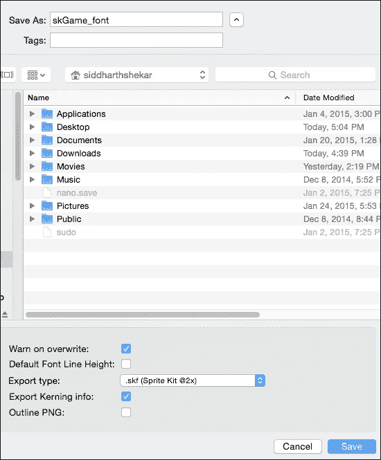

## 实现位图字体

确保选择 `.skf` 作为导出类型。这将创建一个以 `.atlas` 结尾的文件夹，其中包含所有字符和符号，以及与字体相关联的数据文件 `.skf`。

将 `.atlas` 文件夹和 `.skf` 文件拖入项目。

现在我们已经准备好在游戏中实现位图字体：

1.  为了让 Glyph Designer 与 SpriteKit 兼容，我们需要使用 71Squared 创建的通用静态库。请访问 [`71squared.zendesk.com/hc/en-us/articles/200037472-Using-Glyph-Designer-1-8-with-Sprite-Kit`](https://71squared.zendesk.com/hc/en-us/articles/200037472-Using-Glyph-Designer-1-8-with-Sprite-Kit)，并从页面底部下载 `libSSBitmapFont.zip` 文件。

1.  文件下载完成后，解压并将 `SSBitmapFont.h` 和 `SSBitmapFontLableNode.h` 文件拖入项目。不要拖动包含文件的文件夹，只需拖动单个文件。同时，将 `libSSBitmapFont.a` 文件拖入项目。

1.  前往我们之前创建的桥接头文件，并在桥接头文件中导入两个头文件 `SSBitmapFont.h` 和 `SSBitmapFontLabelNode.h`，如下所示：

    ```swift
    #ifndef skGame_skGame_Bridging_Header_h
    #define skGame_skGame_Bridging_Header_h

    #endif

    #import "SSBitmapFont.h"
    #import "SSBitmapFontlabelNode.h"

    ```

    现在，我们可以在 Swift 项目的任何地方访问这些文件。

1.  为了确保一切正常工作，只需构建项目以确保没有错误弹出。

1.  在 `MainMenuScene` 类中，我们将使用位图字体来显示游戏名称，而不是使用 `SKLabelNode`。打开 `MainMenuScene` 类。在类的顶部添加以下代码。这与我们在 `GameViewController` 类中获取 `bgMusic.mp3` 文件的方式类似。但在这里，我们将从项目的主包位置获取 SKF 文件。

    ```swift
    var bmFontFile = SSBitmapFont(file: NSBundle.mainBundle().URLForResource("skGame_font", withExtension: "skf"), error: nil)
    ```

1.  在这里，我们创建了一个名为 `bmFontFile` 的新变量，并使用从 Objective-C 导入的 `SSBitmapFont` 类，从项目位置获取 `skGame_font` 字体文件的名称。除了名称外，我们还需要提供 `skf` 文件的扩展名。

1.  由于我们已经保存了`bmFont`文件，我们可以通过传入文本并指定位置，然后将它添加到场景中，来使用此文件创建新的文本或标签。因此，我们用以下代码替换了我们之前添加的`SKLabelNode`代码，以查看位图字体的实际效果：

    ```swift
    let bmFontText = bmFontFile.nodeFromString("Ms.TinyBazooka")
    bmFontText.position  = CGPoint(x: viewSize.width/2,
       y: viewSize.height * 0.8)
    addChild(bmFontText)
    ```

1.  我们创建了一个新的常量`bmFontText`，并使用`bmFontFile`的`nodeFromString`属性将`Ms.TinyBazooka`文本分配给它。我们像往常一样设置位置，并将`bmFontText`添加到场景中：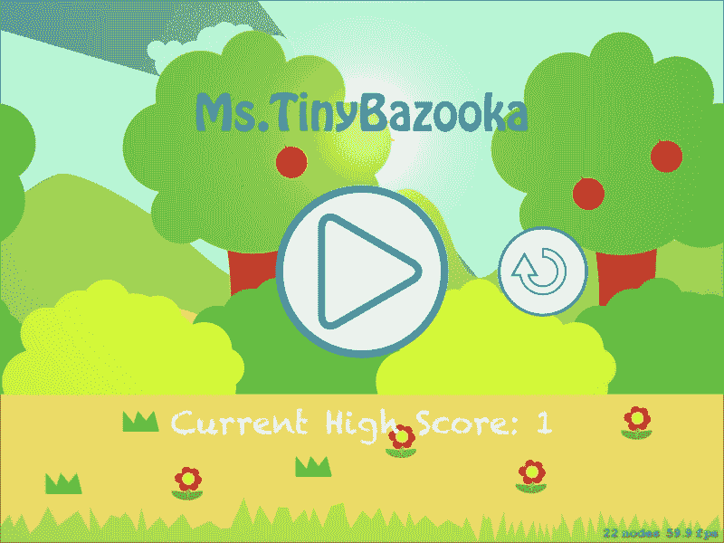

您可以立即看到，位图字体比使用`SKLableNode`创建的文本要清晰得多。因此，毫不奇怪，如今，无论是专业公司还是独立开发者，都使用位图字体。

# 骨骼动画

在前面的章节中，我们看到了如何使用基于帧的动画在游戏中制作动画，其中我们导入了一系列图像，并通过循环帧来创建动画。尽管基于帧的动画很好，但制作起来可能会很繁琐。艺术家必须绘制每一帧，如果您想保持包的大小低，则不能有太多的帧。因此，动画看起来不太流畅。此外，如果您想对角色进行一些修改，那么艺术家就必须回到画板前，因为他必须通过动画的所有帧并重新绘制它们。

使用骨骼动画技术而不是为动画制作单独的帧，我们导入角色的各个部分并制作一个精灵图集，如下所示：


使用应用程序，我们定位角色的各个部分，然后创建动画。这样，我们可以从身体部分创建不同的动画，如行走、跑步、跳跃、攻击等，所有动画都导出为数据文件。

当数据文件和角色部分被带入游戏中时，数据文件将被用来放置角色的各个部分以形成角色的姿势。稍后，当我们调用动画在角色上播放时，数据文件将再次被用来动态地创建运动。让我们看看如何创建骨骼动画。

为了创建动画，我们将使用 Esoteric Software 公司的一个名为**Spine**的应用程序。您可以从他们的网站[`esotericsoftware.com/`](http://esotericsoftware.com/)下载试用版。

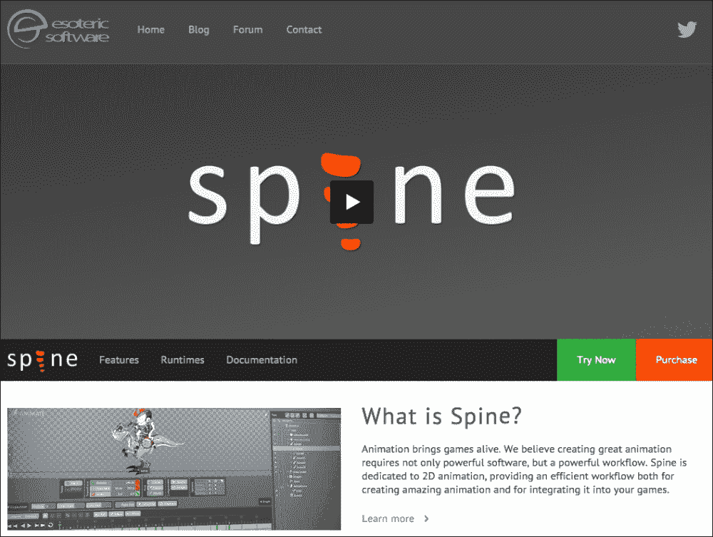

试用版不允许您保存项目，但我已经包含了本章的资源项目文件，以便您可以在试用版中打开它并对其进行操作。

从网站上下载 DMG 文件后，双击它进行安装。安装完成后，点击屏幕左上角的 spine 标志创建一个新项目，如下面的截图所示。

接下来，我们必须引入角色的各个部分，以便我们可以为动画正确地摆姿势。这个阶段被称为角色设置。

在脊柱文件夹中本章的资源中，你会找到一个名为`heroParts`的文件夹，将此文件夹复制到桌面上。

当你打开 Spine 时，默认项目将被加载。要创建一个新项目，请点击屏幕左上角的 Spine 图标，然后选择**新建项目**。


在右侧的**树**面板上，在**层次**面板中，选择**图像**文件夹，如图所示。在底部，你现在可以选中`heroParts`文件夹的路径。点击**浏览**并指向桌面上的另一个`heroParts`文件夹。

所有部分都将出现在**图像**选项卡下。接下来，将所有部分拖动到选中的视图面板中。你可以点击单个部分，并在屏幕底部的**变换**面板中使用旋转和平移按钮来放置英雄的部分。如果某些部分需要放在其他部分之前，那么在**层次**面板中点击**绘制顺序**旁边的三角形，并将一个图像拖动以使其出现在任何其他对象之上或之下。

视图面板中心的加号是根节点。通过在屏幕底部的**补偿**面板中点击**图像**按钮锁定图像，将此节点移动到角色的中间。你可以通过点击它来重命名根节点。为了方便起见，将其重命名为`hip`。

一旦角色设置正确，它应该看起来像以下图像。参考以下截图以检查**绘制顺序**：

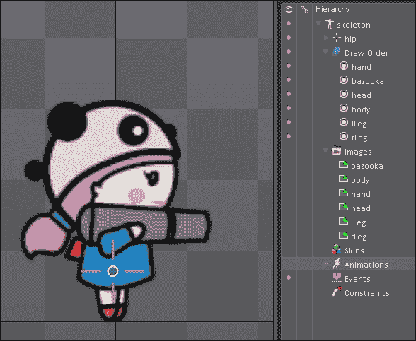

接下来我们将绘制骨骼。骨骼的工作方式与人类骨骼非常相似。你可以将角色的一个或多个部分附着到骨骼上，然后当你移动或旋转骨骼时，角色部分将相应地移动或旋转。

首先，我们将为腿部创建骨骼。要创建骨骼，请点击屏幕底部**工具**面板上带有骨骼图标的**创建**按钮。现在我们将从臀部创建一个到左脚的骨骼。左键点击**臀部**开始创建骨骼。在仍然按住左鼠标按钮的同时，将鼠标移动到左脚图像上。在左脚上方按下键盘上的*Shift*键。一旦左脚被高亮显示，释放鼠标按钮和*Shift*键。

现在为另一只脚重复此过程。从臀部开始，并按下*Shift*键，当另一只脚被高亮显示时，释放鼠标和*Shift*键。如果骨骼没有与脚完美对齐，这是可以的。

再次，从臀部创建一个骨骼到身体，使其更接近手的起始位置，但确保身体被突出显示，而不是手。在**层次结构**面板中将这个骨骼命名为`body`。现在，从这个新创建的骨骼的末端创建一个用于手的骨骼和另一个用于角色头部的骨骼。

你会注意到火箭筒仍然连接在臀部或根骨骼上。在**层次结构**面板中，将火箭筒节点移动到手骨骼下。这样，火箭筒就会随着手骨骼移动。以下截图显示了完成后的骨骼层次结构：

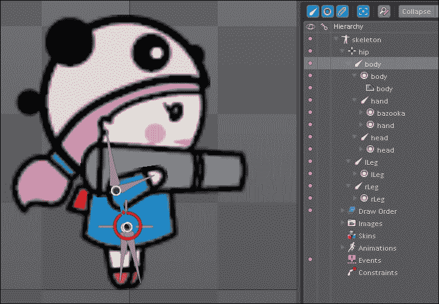

现在你可以点击单个骨骼，旋转它们，当你旋转骨骼时，身体部分也会随之旋转。这里展示了角色的不同姿势。

### 注意

确保在**转置**面板中点击了旋转按钮，并且图像没有被锁定。


现在，角色已经设置好，准备进行动画制作。点击**视图**面板上的**设置**按钮。你现在处于**动画**模式。一个新面板将在下面打开，称为**Dopesheet**。在**层次结构**面板下点击**动画**标题，然后在屏幕底部点击**新动画**。将打开一个新窗口，要求输入名称，在这里输入`walk`并点击**确定**。

除了新的**Dopesheet**面板外，你还会看到**变换**面板也略有变化。如果你点击任何骨骼，**旋转**、**平移**和**缩放**按钮旁边会出现一个绿色键符号，如下面的截图所示：

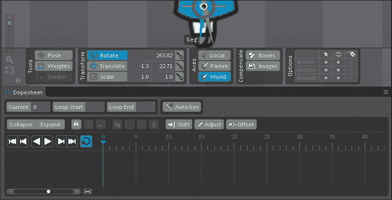

这些键记录了该骨骼**旋转**、**平移**和**缩放**按钮所做的更改。绿色表示没有记录任何更改。在 0 帧的**变换**面板中点击三个绿色按钮。现在，值已经被记录，因为键已经从绿色变为红色。现在，将蓝色的时间线滑块从 dopesheet 中的 0 帧移动到 5 帧。再次，键是绿色的。稍微旋转腿部，然后再次点击所有三个键使它们变为红色。

如果你将时间轴滑块在 0 帧和 5 帧之间移动，你会看到腿部来回旋转。点击播放按钮查看动画效果。点击播放按钮右侧的循环按钮以循环动画。这就是创建动画的方法。

我们将创建一个简单的行走循环动画，稍后将其导入游戏并播放动画。撤销所有操作以回到原始姿势。

为了创建行走循环，我们在第 0 帧、第 6 帧、第 12 帧、第 18 帧和第 24 帧记录了所有骨骼的位置、旋转和缩放。第 0 帧和第 24 帧的姿势相同。第 12 帧的姿势与第 0 帧相反，因为脚的位置将会互换，这意味着在第 0 帧中原本在后面的脚将移到前面，反之亦然。在第 6 帧和第 18 帧，将脚重新放在一起，并通过移动臀部/根骨来提升角色。

以下截图显示了不同帧的姿势。从左到右，第一个姿势是第 0 帧和第 24 帧的。因此，旋转腿骨分开，选择所有骨骼，并通过点击所有三个绿色关键按钮来创建关键。保持相同的姿势，将时间滑块移动到第 24 帧，然后再次点击关键按钮。

中间的图像显示了第 12 帧的姿势，此时腿已经交换。因此，再次旋转腿，并将时间滑块移动到第 12 帧，然后点击关键按钮。

右侧的图像显示了第 6 帧和第 18 帧的姿势。在这里，将腿靠近，并通过向上移动臀部骨骼来提升角色。将时间滑块移动到第 6 帧并创建关键帧。为了创建第 18 帧的关键帧，对姿势不做任何更改。只需将时间滑块移动到第 18 帧并创建一个新的关键帧即可。就这样；你的行走循环就准备好了。点击播放按钮并享受吧！

确保在点击绿色按钮记录帧时选择了所有骨骼。

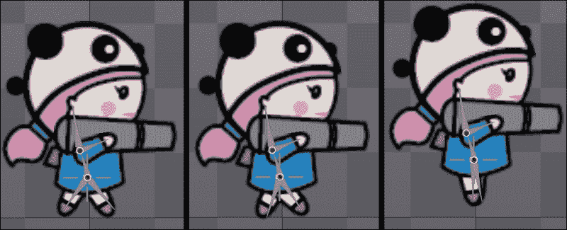

现在，如果你拥有 Spine 的精华版或专业版，你可以通过点击左上角的 Spine 图标，然后点击**导出**来导出数据文件。

导出的数据类型将是`.json`类型。选择你想要导出数据文件的位置，并将其他值保留为默认值。点击**导出**按钮来导出 JSON 数据文件。

当你导出文件时，你会注意到数据文件被命名为 skeleton。请手动将文件重命名为`player`，因为每次文件默认命名为 skeleton，我们不希望这个文件在为其他角色创建 JSON 文件时被覆盖。

要为脊动画创建图像的图集，创建一个名为`player.atlas`的文件夹，并将`heroParts`文件夹中的所有角色部分复制到其中。

现在将`player.atlas`和`player.json`文件拖入项目。

为了对角色进行动画处理，我们需要 Spine 运行时。与 Glyph Designer 类似，它是用 Objective-C 编写的，但正如我们之前所做的那样，我们将导入头文件到桥接头文件中，并使 Objective-C 类在 Swift 中可访问。

要获取头文件，请访问[`github.com/mredig/SGG_SKSpineImport`](https://github.com/mredig/SGG_SKSpineImport)，下载 ZIP 文件并解压。从解压的文件夹中，转到`SpineImporter`文件夹，并将文件夹中的所有文件拖到 Swift 项目中。

在`Bridging Header`文件中，添加`SpineImport.h`文件，如下所示：

```swift
#import "SSBitmapFont.h"
#import "SSBitmapFontlabelNode.h"
#import "SpineImport.h"

```

在`MainMenuScene`类中，我们将添加玩家动画。在类的顶部，创建一个全局变量 hero，并将其分配给`SGG_Spine`类，如下所示：

```swift
  var hero = SGG_Spine()
```

现在，在将`BG1`和`BG2`添加到场景之后，添加以下代码：

```swift
hero.skeletonFromFileNamed("player",
                            andAtlasNamed: "player",
                            andUseSkinNamed: nil)

hero.position = CGPoint(x: viewSize.width/4, y: viewSize.height * 0.25)
hero.xScale = 1.25; hero.yScale = 1.25;        
hero.runAnimation("walk", andCount: -1)
addChild(hero)
```

我们在英雄的`skeletonFromFile`属性中提供了 JSON 数据文件的名称和图集的名称。由于我们在游戏中没有使用任何皮肤，第三个参数保持为`nill`。

然后，我们将英雄变量定位并稍微增加其缩放比例。

为了告诉要播放哪个动画，我们使用英雄的`runAnimation`属性，并分配我们在 spine 中创建的行走动画。

最后，我们将英雄添加到场景中。构建并运行游戏，查看以下截图所示的最终结果：

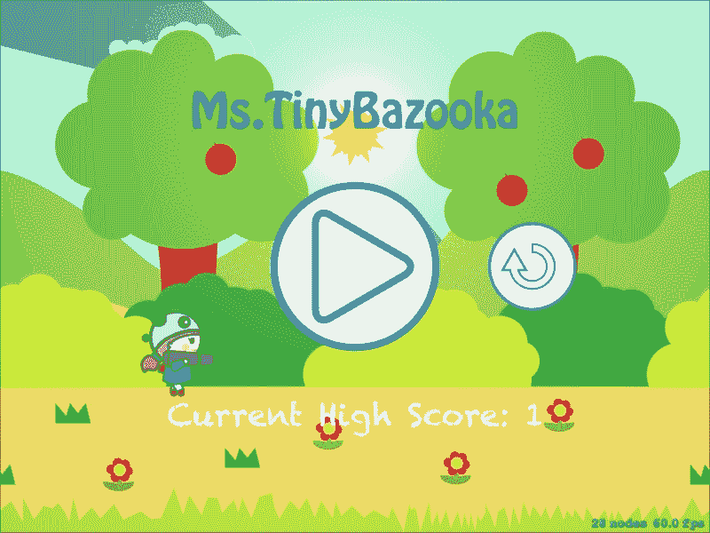

# 摘要

在本章中，您看到了如何不费吹灰之力地为我们的游戏添加光照和阴影。由于 Apple 将其包含在 SpriteKit 中，您可以确信创建效果的代码已经得到了很好的优化。在其他框架中，这个效果需要由开发者编写，并且开发者需要有良好的经验才能制作出优化的光照和阴影效果。

我们还简要介绍了 SpriteKit 的物理引擎，并用它替换了我们自制的物理引擎。在这里，我们对物理引擎的可能性几乎只是触及了皮毛。有了良好的知识和经验，我们可以制作出自己的愤怒的小鸟克隆版。

除了 SpriteKit 的光照和物理引擎之外，我们还看到了如何将 Objective-C 代码引入 Swift，并利用它实现如 Glyph Designer 和 Spine 等工具。Glyph Designer 和 Spine 都是专业工具，对于游戏开发者和设计师来说是绝对必须的。它们真的在很大程度上帮助优化和简化了游戏开发过程。

是时候向 TinyBazooka 小姐说再见了，因为在接下来的两个章节中，我们将进入 3D 游戏开发的世界。但我们在第十章（Chapter 10. 发布和分发）中会回到 SpriteKit，我们将看到如何将这款游戏发布到 App Store。
