# 第一章：关于环境

本书标题提到了两个最大的平台名称——Spring，可能是 Java 最好的框架，以及 Android，它是任何操作系统中拥有最多用户的系统。本书将帮助您自学并开发一个轻量级、安全、强大且响应迅速的产品级应用程序。

在开始学习 Spring 和 Android 之前，我们将使用 Kotlin 演示示例和代码，因为这种编程语言对开发者来说非常新颖。如今，Kotlin 如此受欢迎，以至于谷歌已将其宣布为 Android 的官方语言。此外，Spring 语言也支持 Kotlin。在本书中，我们将探讨如何使用 Kotlin 语言构建一个健壮、安全且强大的基于 Spring 的服务器，并在 Android 应用程序中作为客户端使用该服务器的内容和功能。

在本章中，您将学习如何设置环境以创建 Spring 和 Android 项目，包括所需的工具和应用程序。这包括通过伴随图像进行可视化步骤。当时知道 Java 的开发者将有一些灵活性，因为它是 Spring 和 Kotlin 之间的通用平台。我们将使用在 JVM 上运行的 Kotlin 演示代码和模型。Kotlin 是由 JetBrains 设计的。如果您对 Kotlin 和 Spring 是新手，熟悉 Java 将使您能够轻松地用 Kotlin 编写代码。

本章将涵盖以下主题：

+   设置环境

+   Spring

+   Java

+   Kotlin

+   Apache Tomcat

+   集成开发环境

+   Android

# 技术要求

要运行这些框架，我们需要一些工具和特定的操作系统。以下是这些工具的列表：

+   **操作系统**：推荐使用 Linux 和 macOS 进行开发，因为我们可以找到这些操作系统所需的所有软件包，并且它们比 Windows 轻量。

+   **IDE**：我推荐的 IDE 是 IntelliJ IDEA（终极版本）。这是 Java 最好的 IDE，但您必须购买才能使用。您也可以使用 Eclipse 和 Netbeans；其中之一对于开发 Spring 应用程序就足够了。我们将展示所有项目在 IntelliJ 中，但也会学习在 IntelliJ IDEA 和 Eclipse 中设置 Spring 环境的步骤。

您可以在 GitHub 上找到本章的所有示例：[`github.com/PacktPublishing/Learn-Spring-for-Android-Application-Development/`](https://github.com/PacktPublishing/Learn-Spring-for-Android-Application-Development/)。

# 设置环境

环境设置是开发应用程序前的关键部分之一。对于目前正在使用 Spring 工作的开发者，请自由跳过这部分。本节是为新开发者准备的，他们需要建立基础和工具以开始开发。

以下是伴随段落中设置环境的步骤。

# Spring

Spring 是最强大的 Java 应用程序框架；它目前在企业界中最为流行。它有助于创建易于测试和重用的代码，从而创建高性能的应用程序。这是一个开源项目，由 Rod Johnson 编写，于 2003 年 6 月首次以 Apache 2.0 许可证发布。

要创建和运行 Spring 应用程序，您需要一些工具和语言支持。您还需要一个服务器来在您的操作系统上测试和运行您的项目。我们将向您展示如何设置 Spring 的环境。

当前版本需要以下软件和工具：

+   Java (版本 1.8)

+   Kotlin (版本 1.3)

+   Apache Tomcat (版本 9.0.11)

+   IntelliJ Ultimate (版本 2018.2.2) 或 Eclipse Photon

+   Spring 框架库 (版本 5.0.8.RELEASE)

# Java

Java 有两个版本：

+   标准版 (J2SE)

+   企业版 (J2EE)

在这里，我们将选择标准版。Java 对所有操作系统都是免费下载和使用的。

您可以从 [`www.oracle.com/technetwork/java/javase/downloads/index.html`](http://www.oracle.com/technetwork/java/javase/downloads/index.html) 下载 Java 10.0.2。

下载适用于您的操作系统。

安装后，请检查 Java 是否已安装。检查方法是在终端中输入 `java --version`。如果 Java 安装成功，您将看到以下 Java 版本：

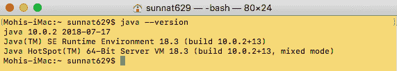

检查 Java 版本

或者，你可能会看到一个错误。如果发生这种情况，请尝试重新安装以解决问题。

# Kotlin

由 JetBrains 开发，Kotlin 是一个开源的静态类型编程语言。它运行在 **Java 虚拟机** (**JVM**) 上，可以编译成 JavaScript 源代码或使用 LLVM 编译器基础设施。Kotlin 容易学习，尤其是对于 Java 开发者来说。

要使用 Kotlin，您不需要像 Java 那样单独下载或设置它。它包含在 IDE 中。Kotlin 是 Android Studio、IntelliJ Ultimate 或 IntelliJ Community 的内置功能。要在 Eclipse 中使用 Kotlin，您需要遵循以下步骤：

1.  从 Eclipse 工具栏中选择帮助 -> **Eclipse Marketplace**。

1.  在搜索框中输入 `Kotlin`，在那里您将找到 **Kotlin** 插件。

1.  安装它后，您就可以使用 **Kotlin** 编写代码：

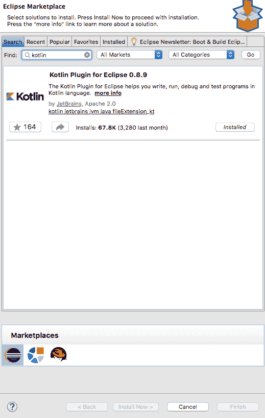

Eclipse Marketplace

我们强烈推荐使用 IntelliJ IDE 来实现 Kotlin 的最新版本。Eclipse 插件没有 Kotlin 的最新版本。

# Apache Tomcat

我们需要一个稳定、免费和开源的 Web 服务器，我们可以用它来创建和运行基于 Spring 框架的企业项目。我们将使用 Apache Tomcat，这对于所有 Java 开发者来说都很容易理解。您也可以使用 Jetty 或 Undertow 在 Spring 中进行开发。

Tomcat 是一个开源的 Web 服务器。这允许使用 Java Servlets 和 **JavaServer Pages** (**JSP**) 来构建 Java 服务器。Tomcat 的核心部分是 Catalina。

Apache Tomcat 是一个 Web 服务器，而不是应用程序服务器。

您可以从 [`tomcat.apache.org/download-90.cgi`](https://tomcat.apache.org/download-90.cgi) 下载 Tomcat 9.0.11。

如果您使用的是 Tomcat 版本 9，则必须使用 Java 版本 8 或更高版本。根据 Apache Tomcat 源代码，此版本基于 Tomcat 8.0.x 和 8.5.x，并实现了 Servlet 4.0、JSP 2.3、EL 3.0、WebSocket 1.1 和 JASPIC 1.1 规范（Java EE 8 平台所需的版本）。

让我们看看如何配置和验证 Tomcat 服务器。

# 配置 Tomcat

您可以通过两种方式配置 Tomcat 服务器——要么使用终端，要么从 IDE 中进行。为了设置服务器，您必须从 [`tomcat.apache.org/download-90.cgi`](https://tomcat.apache.org/download-90.cgi) 下载 Tomcat 服务器的内容。

按照以下步骤配置 Tomcat：

1.  从链接下载核心模块的二进制发行版。

1.  解压文件。这将创建一个名为 `apache-tomcat-9.0.11` 的文件夹（版本号可能不同）。

1.  为了方便访问，请将文件夹 `Tomcat` 重命名并移动到 `/usr/local`（适用于 Linux）或 `/Library`（适用于 macOS）：

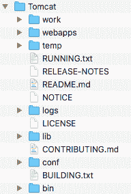

项目文件

+   对于 Linux，请按照以下步骤操作：

```java
// If you have an older version of Tomcat, then remove it before using the newer one
sudo rm -rf /usr/local/Tomcat // To remove exist TomCat

sudo mv ~/Download/Tomcat /usr/local // To move TomCat from the download directory to your desire direction
```

+   对于 macOS，请按照以下步骤操作：

```java
// If you have an older version of Tomcat, then remove it before using the newer one
sudo rm -rf /Library/Tomcat // To remove exist TomCat
sudo mv Downloads/Tomcat /Library/     // To move TomCat from the download directory to your desire direction
```

要检查当前目录，请输入以下命令：

+   **对于 Linux 系统：** `cd /usr/local/Tomcat/`

+   **对于 macOS 系统：** `cd /Library/Tomcat/`

1.  输入 `ls` 以查看该目录的列表：

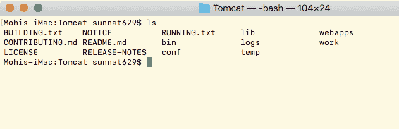

在终端检查 tomcat 文件

1.  更改 `/usr/local/Tomcat` 或 `/Library/Tomcat` 文件夹结构的所有权：

+   **对于 Linux 系统：** `sudo chown -R <your_username> /usr/local/Tomcat/`

+   **对于 macOS 系统：** `sudo chown -R <your_username> /Library/Tomcat/`

1.  使所有脚本可执行：

+   **对于 Linux 系统：** `sudo chmod +x /usr/local/Tomcat/bin/*.sh`

+   **对于 macOS 系统：** `sudo chmod +x /Library/Tomcat/bin/*.sh`

1.  要检查 Tomcat 的内容，请使用以下命令：

+   **对于 Linux 系统：** `ls -al /usr/local/Tomcat/bin/*.sh`

+   **对于 macOS 系统：** `ls -al /Library/Tomcat/bin/*.sh`

1.  您可以看到每个文件都列出了 `-rwxr-xr-x@`，其中 `-x` 表示可执行。可执行权限向我们展示了访问文件的授权状态：

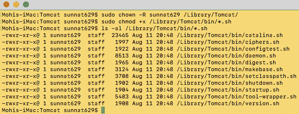

在终端检查 tomcat 可执行文件

1.  要启动和停止，请输入以下命令：

+   **对于 macOS 系统：**

```java
/Library/Tomcat/bin/startup.sh
/Library/Tomcat/bin/shutdown.sh
```

+   **对于 Linux：**

```java
/usr/local/Tomcat/bin/startup.sh
/usr/local/Tomcat/bin/shutdown.sh
```

1.  要开启和关闭 Tomcat 服务器，请使用以下命令：

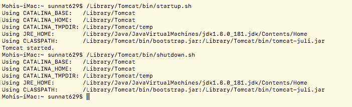

# 验证 Tomcat

1.  启动服务器后，打开浏览器并输入 `http://localhost:8080`，这将显示默认页面：

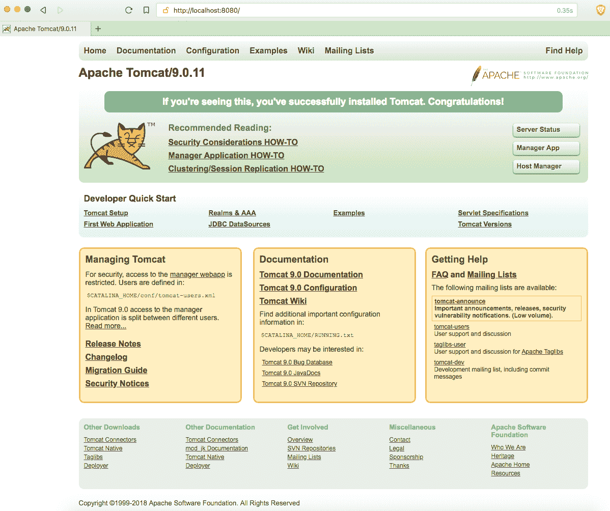

默认 tomcat 本地托管

这就是我们如何在终端配置 Tomcat 的方法。

# 集成开发环境

当涉及到编写 Java 程序时，您可以使用任何文本编辑器。然而，我们鼓励您使用 **集成开发环境**（**IDE**），因为它们提供了许多功能。IntelliJ IDEA 是付费 IDE，但您可以使用免费提供的 Eclipse 或 NetBeans。

我们可以使用 IDE 执行以下操作：

+   管理 Tomcat

+   在不需要记住方法和方法签名完整名称的地方开发应用程序和 Web 应用程序。

+   突出显示编译错误

在本书中，我们将使用 Eclipse 和 IntelliJ IDEA。

您可以从 [`www.jetbrains.com/idea/download/`](https://www.jetbrains.com/idea/download/) 下载 Ultimate 版本，该版本提供 30 天免费试用。

要下载 Eclipse，请访问 [`www.eclipse.org/downloads/packages/`](http://www.eclipse.org/downloads/packages/)。

对于 Spring，您应该下载 Java EE 开发者版本的 Eclipse IDE。

对于两者，一旦启动 IDE，它将要求选择工作区。您可以选择一个文件夹并给出该文件夹的路径。

# IntelliJ IDEA

IntelliJ IDEA 是一种用于开发计算机软件的 Java 协同开发环境。它由 JetBrains 开发，可以作为 Apache 2 许可的社区版和商业版提供。两者均可用于商业开发。

IntelliJ IDEA ultimate 和 IntelliJ IDEA community 内置了 Kotlin 的最新版本。

# Eclipse

Eclipse 是一种用于计算机编程的集成开发环境，是最常用的 Java IDE。它包含一个基本工作空间和一个可扩展的模块框架，用于调整环境。Eclipse 主要用 Java 编写，其主要用途是开发 Java 应用程序，但也可以通过模块使用其他编程语言开发应用程序，包括 Ada、ABAP、C、C++、C#、Clojure、COBOL、D、Erlang、Fortran、Groovy、Haskell、JavaScript、Julia、Lasso、Lua、NATURAL、Perl、PHP、Prolog、Python、R、Ruby（包括 Ruby on Rails 框架）、Rust、Scala 和 Scheme。

要在 Eclipse 中使用 Kotlin，您需要安装 Kotlin 插件。

Eclipse 没有最新的 Kotlin 版本。

创建项目后，您需要手动集成 Tomcat 服务器。但是，如果您使用 Spring Boot，则无需执行任何操作，因为其中已包含 Tomcat 服务器。

按照以下步骤创建 Web 项目并将 Tomcat 服务器集成到您的项目中：

1.  访问“新建”>“新建动态 Web 项目”。

1.  提供项目名称。

1.  要集成 Tomcat，请点击“新建运行时”：

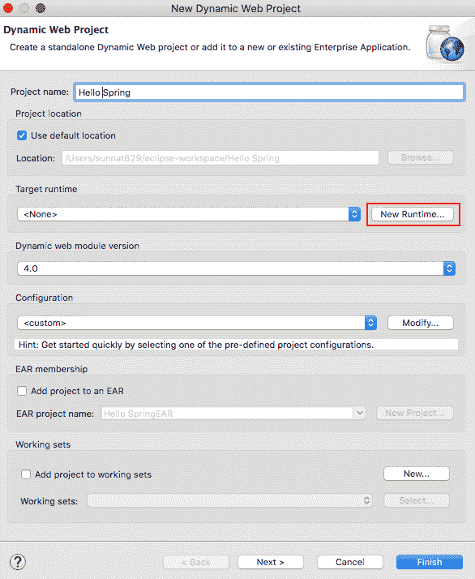

新建项目创建

1.  下载版本 9+，选择 Apache Tomcat v9.0，然后点击完成：

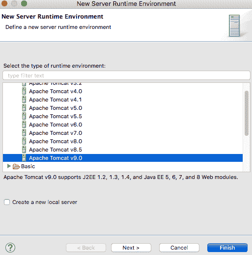

tomcat 版本选择

1.  选择最新的动态 Web 模块版本。

1.  点击完成。

创建项目后，您将找到以下文件：

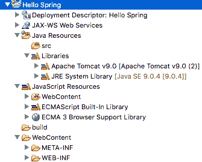

项目文件

1.  前往位于左下角的窗口中的“服务器”选项卡：

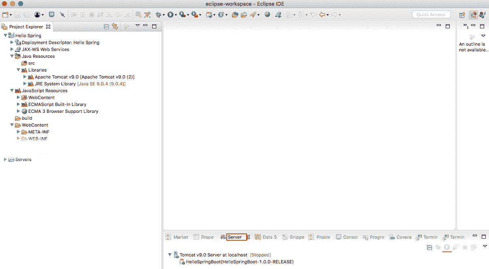

项目 IDE 界面

1.  选择 localhost 上的 Tomcat v9.0 服务器。

1.  点击开始按钮。

1.  服务器启动后，通过在浏览器中访问 `http://localhost:8080` 来验证它。

1.  如果一切正常，您可以从这里启动和停止 Tomcat 服务器。

# Android

Android 是由 Google 开发的一种移动操作系统，基于修改后的 Linux 内核和其他开源软件，主要用于触摸屏移动设备，例如手机和平板电脑。此外，Google 还开发了 Android TV 用于电视，Android Auto 用于车辆，以及 Wear OS 用于手表，每个都有特定的用户界面。Android 的变体也用于物联网、高级相机、个人电脑和各种硬件。它最初由 Android Inc. 开发，Google 于 2005 年收购了该公司，Android 于 2007 年发布。第一台商业 Android 设备于 2008 年 9 月推出。自那时起，当前版本已经经历了多次重大发布，当前版本为 9 *Pie*，于 2018 年 8 月发布。Android 的核心源代码被称为 **Android 开源项目** (**AOSP**)，并采用 Apache 许可证授权。

在本书中，我们将了解如何在服务器上的 Spring 平台上创建 REST API、安全和数据库。我们还将学习如何创建 Android 应用程序并从服务器检索数据，以及作为客户端的使用。

Android Studio 是众多 IDE 中用于创建 Android 应用的主要 IDE。这是 Android 的官方 IDE。它基于 JetBrains 的 IntelliJ IDEA，专门为 Android 应用开发构建。

要下载 Android Studio，请访问 [`developer.android.com/studio/`](https://developer.android.com/studio/)。在这里，您可以找到最新版本的 Android Studio 下载。最好的部分是，它包括 JRE、最新 SDK 以及其他重要的插件，用于开发。

下载 Android Studio 应用程序后安装。这个工具非常易于使用。

不要忘记更新并下载 SDK 平台的最新版本。要更新或安装新的 SDK 平台，请转到 SDK 管理器。在 SDK 平台中，您可以查看所有 Android 版本平台的列表。

如果您没有遇到任何麻烦就阅读并安装了环境，您就可以开始学习本书中的信息了。我们已经在 GitHub 上提交了代码，并在 *技术要求* 部分分享了链接，因此您可以使用该示例代码。

# 摘要

本章主要面向那些刚开始接触这个平台的新开发者。我们已经展示了使用一些特定工具和应用程序的设置过程，你也可以使用不同的工具和应用程序来开发你的项目。我们探讨了如何设置开发 Spring 和 Android 的环境。你现在已经熟悉了所有必需的工具和软件。现在你能配置你操作系统中的 Tomcat 服务器，并熟悉如何启动和停止服务器。你可以决定你需要哪个 IDE 来进行开发。我们还学习了无需任何麻烦即可安装 Android Studio 的过程。最后，没有使用工具或软件最新版本的特定标准。

在下一章中，我们将探讨 Kotlin，这是一种静态类型编程语言，也是 Android 的官方语言。

# 问题

1.  Spring 框架是基于 Java SE 还是 Java EE 构建的？

1.  开发 Spring 时，Eclipse 和 IntelliJ IDEA 的替代 IDE 是什么？

1.  Tomcat 是一个 Web 服务器还是应用服务器？

1.  运行 Spring 时，Tomcat 服务器的替代方案有哪些？

1.  Android Studio 是开发 Android 的 IDE 吗？

# 进一步阅读

+   *精通 Spring 5.0* ([`www.packtpub.com/application-development/mastering-spring-50`](https://www.packtpub.com/application-development/mastering-spring-50)) 由 Ranga Karanam 编著
