# 第三章：Spring 框架概述

Spring 是一个强大、轻量级的应用程序框架，为各种框架提供支持，如 Hibernate、Struts 和 JSF。Spring 框架是构建最复杂、最安全和最健壮产品的顶级企业框架之一。这个框架在 Java 开发者中非常受欢迎，因为大多数在 Java 企业中工作的开发者都在使用 Spring。如今，Spring 支持 Kotlin 语言，因此它越来越受到其他语言用户的欢迎。在这本书中，我们将使用 Kotlin 开发 Spring 项目。

在本章中，我们将学习 Spring 框架的基础知识。我们将讨论 Spring 的基础知识，并查看一些使用 Spring MVC 和 SpringBoot 实现它们的示例。

本章涵盖以下主题：

+   Spring 简介

+   Spring 的优势

+   Spring 架构

+   配置 Bean

+   Spring MVC

+   SpringBoot

# 技术要求

在 第一章，*关于环境*，我们展示了如何设置环境以及开发 Spring 所需的工具、软件和 IDE。首先，访问 [`start.spring.io/`](https://start.spring.io/) 创建您的第一个项目。以下选项将可供选择：

+   Maven 项目或 Gradle 项目（我们选择了 Maven）

+   **语言**：Java 或 Kotlin（我们选择了 Kotlin）

+   **Spring Boot 版本**：2.1.1 (SNAPSHOT)

一旦点击创建，您需要提供信息，例如 **组**、**工件**、**名称**、**描述**、**包名**、**打包**和 **Java 版本**。

对于这个阶段，无需添加任何依赖。最后，生成项目并将其导入到您的 IDE 中。

本章的示例源代码可在 GitHub 上找到：[`github.com/PacktPublishing/Learn-Spring-for-Android-Application-Development/tree/master/Chapter03`](https://github.com/PacktPublishing/Learn-Spring-for-Android-Application-Development/tree/master/Chapter03)。

# Spring 简介

Spring 框架是一个开源框架。这是一个用 Java 编写的框架，由 Pivotal 软件开发。任何基于 Java 的企业应用程序都可以使用该框架的核心。Spring 框架使用 **普通 Java 对象（POJO**），这使得构建企业应用程序更加容易。

POJO 是不受任何限制（除了由 Java 语言规范强制实施的限制）的 Java 对象。POJO 用于提高应用程序的可读性和可重用性。

让我们在接下来的章节中学习 Spring 的优势和架构。

# Spring 的优势

Spring 框架是一个组件丰富的框架，具有以下优势：

+   Spring 可用于独立应用程序、Web 应用程序和移动应用程序。

+   Spring 通过创建 **依赖注入（DI**）来提供免费耦合的解决方案。这提供了一个配置文件（或注解）来重新排列条件。

+   它使用 **面向切面编程** (**AOP**) 并使得隔离跨切面关注点，如日志记录、事务管理和安全性成为可能。

+   它限制了样板代码。Spring 有大量的包和类，减少了编码并避免了样板代码。

+   它支持不同的框架，例如 *ORM*、*Hibernate*、*Logging* 和 *JEE*。

+   Spring 提供了一种简单且安全的方法来处理登录框架、表单等。

+   它处理 *自动装配*，这在构建复杂网络应用时可能是一个噩梦。

+   Spring Web 框架有一个 Web *MVC 框架*，它提供了比传统的 Web 框架更多的优势。

+   它有能力移除单例和工厂类的创建。

+   Spring 框架包含了对监控业务对象并将它们的操作提供给引入层段的支持。

+   它支持 *XML* 和 *注解* 配置。

# Spring 架构

Spring 框架是一个分层架构，由几个模块组成。所有模块都基于其核心容器的最高点。这些模块为开发者提供了在企业应用开发中可能需要的所有功能。无论如何，开发者可以选择他们需要的特性，并丢弃无用的模块。

**模块化编程** 是一种软件设计技术。它将程序的功能分离成独立的模块，以便每个模块包含一个特定的功能。

这里是 Spring 架构的图示：

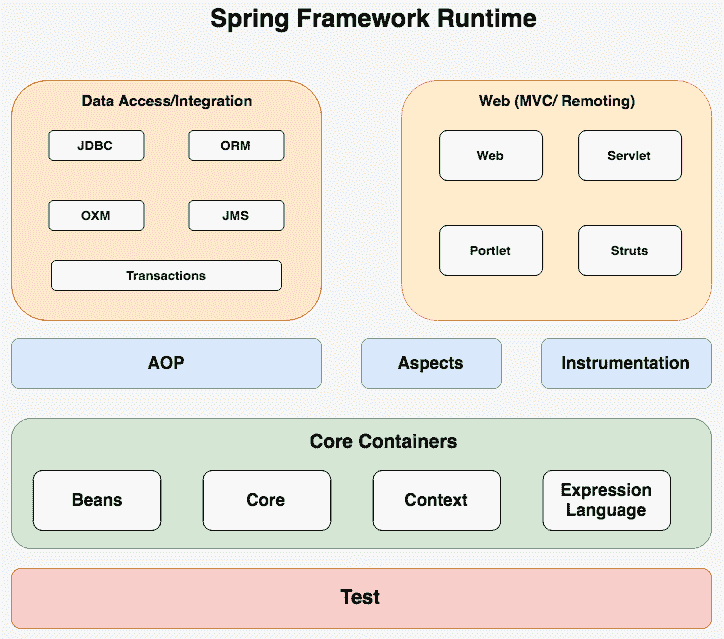

Spring 框架大约有 20 个模块，它们被分为 **核心容器**、**数据访问/集成**、**Web**、**AOP**、**Instrumentation** 和 **测试**。

让我们了解 Spring 架构的组件。

# 核心容器

本节包括 **核心**、**Beans**、**Context** 和 **表达式语言** 模块。

**核心** 模块是 Spring 架构的中心。这提供了诸如 **控制反转** (**IoC**) 和 **依赖注入** (**DI**) 等特性的实现。IoC 是 Spring 核心中的一个中心容器。DI 是 IoC 的另一个名称。这个容器负责创建对象形式并控制其完整生命周期。在这个过程中，系统创建依赖，容器在创建 Bean 时注入这些依赖。DI 的这个逆过程基本上被称为 IoC。

`org.springframework.beans`和`org.springframework.context`是 Spring 框架 IoC 的两大容器。IoC 有一个根接口，称为`BeanFactory`，由这些项目执行并持有各种 bean 定义，每个 bean 都有一个字符串名称识别。该接口提供了一个推动配置组件来处理项目。`ApplicationContext`是`BeanFactory`的子接口，它包括更多应用层设置。例如，它包括`WebApplicationContext`，用于 Web 应用程序。`ApplicationContext`负责实例化、设计和收集 bean。

容器在配置元数据中指定了对象实例化、配置和对象组装的任务。配置元数据有三种配置方式：通过 XML、注解或代码。尽管我们使用 Kotlin 进行工作，但我们将以 Kotlin 语言编写代码和元数据。

下面是**核心**容器的简单流程图：

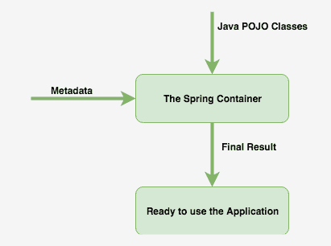

核心容器是使 Spring 项目准备就绪以查看输出的过程。在**Java POJO 类**（主要是业务对象和**元数据**，即配置元数据）的帮助下，**Spring 容器**将准备好的应用程序作为输出表示。

**Bean**模块代表一个 bean，这是一个由 IoC 容器组装、管理和实例化的对象。

**上下文**模块支持 EJB、JMS、基本远程通信等。`ApplicationContext`接口是**上下文**模块的并发点。

**表达式语言**模块通常用于在应用程序中执行逻辑，如数据查询、求和、除法和取模。为此，该模块提供了以下强大的表达式：

| **算术** | `+`, `-`, `*`, `/`, `%`, `^` |
| --- | --- |
| **关系** | `<=`, `>=`,`<`, `>`, `==`, `!=` |
| **逻辑** | `&&`, `&#124;&#124;`, `!` |
| **条件** | `?`, `:` |
| **正则表达式** | `matches` |

# 数据访问/集成

**数据访问/集成**负责设置和获取公共或私有数据。它作为数据访问层和业务层之间的桥梁。以下是一些数据模块的名称：

+   **JDBC**: **Java 数据库连接**（**JDBC**）帮助应用程序连接到数据库。

+   **对象关系映射**: 这用作**对象关系映射**（**ORM**）API 的集成层。

+   **对象/XML 映射**: 这用作**对象/XML 映射**（**OXM**）实现的集成层。

+   **Java 消息服务**: 这用于在 Spring 中为**Java 消息服务**（**JMS**）提供支持。

+   **事务**: 这用于为 POJO 类提供程序性和声明性事务管理。

# Web

**Web**是 Spring MVC 框架的中心。我们还可以集成其他技术，如 JSF 和 Spring MVC。Web 提供了一些基本的集成功能，例如登录、注销、上传或下载文件。Web 层有四个模块：

+   **Web**: 这提供了基本的面向 Web 的集成功能。

+   **Web-servlet**: 此模块包含 Spring 对 Web 应用程序的 MVC 实现。

+   **Web-struts**: 此模块提供了一个增强和改进的框架，以使 Web 开发更加容易。

+   **Web-portlet**: 此模块是 Web MVC 框架的相同表示。

# 面向切面编程

**面向切面编程**（**AOP**）是 Spring 框架的关键组件。这提供了一种新的思考程序结构的方法。AOP 可以在 Java 和 Kotlin 中实现。它可以在 bean 中进行配置。

AOP 将程序逻辑分割成某些部分，称为**确认关注点**。在任何企业应用程序中，都存在横切关注点，这些关注点应与基本业务逻辑分开。日志记录、事务处理、性能监控和安全被认为是应用程序中的横切关注点。

# 仪器化

仪器化是评估项目性能水平、分析错误和编写跟踪信息的能力。仪器化是 Spring 框架审计应用程序性能的关键亮点之一。Spring 通过 AOP 和日志记录支持仪器化。

# 测试

企业软件开发的一个基本部分是**测试**。JUnit 或 TestNG 可以用来测试 Spring 组件。这支持 Spring 元素的单元和集成测试。

# 配置 Bean

Bean 是由 Spring IoC 实例化和组装的对象。这些 Bean 是通过配置 Spring 的元数据创建的。以下是一组表示每个 Bean 定义的属性：

+   类

+   名称

+   作用域

+   构造函数参数

让我们在以下章节中了解配置元数据的用途。

# Spring 配置元数据

提供配置元数据的三个主要功能如下：

+   基于 XML 的配置

+   基于 Kotlin/Java 注解的配置

+   基于 Kotlin/Java 代码的配置

# 基于 XML 的配置

基于 XML 的配置在 Spring 2.0 中引入，并在 Spring 2.5 和 3.0 中增强和扩展。转向基于 XML 的配置文件的主要原因是为了使 Spring XML 配置更容易。基于`<bean/>`的*经典*方法很好，但也增加了一些可能在大项目中变得复杂的配置。

让我们看看一个基于 XML 的配置文件示例，其中包含各种 Bean 定义，包括作用域、初始化技术和销毁策略，然后我们将讨论这个问题。以下是`bean.xml`的代码片段：

```kt
<!-- A simple bean definition -->
<bean id = "..." class = "...">
<!-- collaborators and configuration-->
</bean>

<!-- A bean example with prototype scope -->
<bean id = "..." class = "..." scope = "prototype"> <!-- collaborators and configuration-->
</bean>

<!-- A bean definition with initialization function -->
<bean id = "..." class = "..." init-function = "...">
<!-- collaborators and configuration-->
</bean>

<!-- A bean definition with destruction function -->
<bean id = "..." class = "..." destroy-function = "...">
<!-- collaborators and configuration for this bean go here -->
</bean>
```

# Bean 作用域

在定义一个 Bean 时，我们可以选择声明其作用域为扩展。例如，如果我们限制 Spring 每次都提供另一个 Bean 实例，我们可以将原型作用域初始化为 Bean 的一个属性。此外，如果我们需要 Spring 恢复一个类似的 Bean 实例，我们应该声明 Bean 的作用域属性为*单例*。

Spring 框架支持以下五个作用域，其中三个在如果我们使用一个感知 Web 的`ApplicationContext`时是可用的。以下是一些常见的作用域：

+   **单例**：每次都返回默认使用的相同实例

+   **原型**：每次都返回不同的实例

+   **请求**：定义一个在应用程序的单个 JSP 页面中可见的 HTTP 请求

+   **会话**：定义一个在应用程序的所有 JSP 页面中可见的 HTTP 会话

# 单例作用域

默认作用域始终是`单例`。这是 Spring IoC 容器的一个 Bean 定义，它在每次对象初始化时返回一个单一的对象实例。以下是一个单例作用域的代码示例：

```kt
<!-- A bean example with singleton scope -->
<bean id = "..." class = "..." scope = "singleton"/>
<!-- You can remove the scope for the singleton -->
<bean id = "..." class = "..."/>
```

让我们看看一个`单例`作用域的示例。

在 IDE 中创建一个 Spring 项目。为此，在`src`文件夹下创建两个`kt`文件和一个 Bean XML 配置文件。

以下是一个`CreateUserGreeting.kt`的代码片段：

```kt
class UserGreeting {
    private var globalGreeting: String? = "Sasuke Uchiha"

    fun setGreeting(greeting: String) {
        globalGreeting = greeting
    }

    fun getGreeting() {
        println("Welcome, " + globalGreeting!! + "!!")
    }
}
```

`BeansScopeApplication.kt`的内容如下：

```kt
fun main(args: Array<String>) {
    val context = ClassPathXmlApplicationContext("Beans.xml")

// first object
    val objectA = context.getBean("userGreeting", UserGreeting::class.java)

// set a value for greeting
    objectA.setGreeting("Naruto Uzumaki")

    objectA.getGreeting()

    val objectB = context.getBean("userGreeting", UserGreeting::class.java)
    objectB.getGreeting()
}
```

以下是一个`beans.xml`配置文件：

```kt
<?xml version = "1.0" encoding = "UTF-8"?>
<beans xmlns = "http://www.springframework.org/schema/beans"
       xmlns:xsi = "http://www.w3.org/2001/XMLSchema-instance"
       xsi:schemaLocation = "http://www.springframework.org/schema/beans
   http://www.springframework.org/schema/beans/spring-beans-3.0.xsd">

    <bean id="userGreeting" class ="ktPackage.UserGreeting" scope="singleton"/>

</beans>
```

运行此项目后，您将看到以下输出：

```kt
Welcome, Naruto Uzumaki!!  <--- value of objectA 
Welcome, Naruto Uzumaki!!  <--- value of objectB 
```

# 原型作用域

`原型`作用域在每次对象初始化时都会创建一个 Bean 的新实例。这个作用域更适合有状态的 Bean。容器不管理这个`原型`作用域的完整生命周期。以下是一个`原型`作用域的代码示例：

```kt
<!-- A bean example with prototype scope -->
<bean id = "..." class = "..." scope = "prototype"/>
```

让我们看看一个`原型`作用域的示例。

重新使用之前的工程，并修改 Bean XML 配置文件，如下所示：

```kt
<?xml version = "1.0" encoding = "UTF-8"?>
<beans xmlns = "http://www.springframework.org/schema/beans"
       xmlns:xsi = "http://www.w3.org/2001/XMLSchema-instance"
       xsi:schemaLocation = "http://www.springframework.org/schema/beans
   http://www.springframework.org/schema/beans/spring-beans-3.0.xsd">

    <bean id="userGreeting" class ="ktPackage.UserGreeting" scope="prototype"/>

</beans>
```

一旦我们完成创建源文件和 Bean 配置文件，我们就可以运行应用程序。如果没有错误，我们将得到以下消息：

```kt
Welcome, Naruto Uzumaki!!  <--- value of objectA 
Welcome, Sasuke Uchiha!!  <--- value of objectB 
```

# Bean 生命周期

有时，我们需要在 Bean 类中实例化资源。例如，这可以通过在初始化阶段（在处理任何客户请求之前）建立数据库连接或批准第三方服务来实现。Spring 框架提供了不同的方法，通过这些方法我们可以在 Spring Bean 的生命周期中提供介绍和销毁技术。

它们如下所示：

+   通过实现 `InitializingBean` 和 `DisposableBean` 接口——这两个接口都宣布了一个单一策略，我们可以在这个策略中实例化/关闭资源。对于 `post-instatement`，我们可以执行 `InitializingBean` 接口并提供 `afterPropertiesSet()` 函数的实现。对于 `pre-destroy`，我们可以实现 `DisposableBean` 接口并提供 `destroy()` 函数的实现。这些函数是回调技术，类似于 servlet 监听器实现。这个功能易于使用，但并不推荐，因为它会使我们的 bean 实现与 Spring 框架紧密耦合。

+   在 Spring 的 bean 配置文件中为 bean 提供初始化函数 `init-function` 和销毁函数 `destroy-function` 的质量值。这是规定的功能，因为没有立即依赖 Spring 框架。我们也可以创建自己的函数。

`post-init` 和 `pre-destroy` 函数不应有任何冲突，但它们可以抛出异常。我们还需要从 Spring 应用程序设置中获取这些函数的 bean 事件。

让我们看看一个 bean 生命周期的例子。在这里，我们将看看如何初始化和销毁 bean 函数。重新使用之前的工程，并按如下修改 bean XML 配置文件：

```kt
<?xml version = "1.0" encoding = "UTF-8"?>
<beans xmlns = "http://www.springframework.org/schema/beans"
       xmlns:xsi = "http://www.w3.org/2001/XMLSchema-instance"
       xsi:schemaLocation = "http://www.springframework.org/schema/beans
   http://www.springframework.org/schema/beans/spring-beans-3.0.xsd">

    <bean id="userGreeting" class ="ktPackage.UserGreeting" init-function = "afterPropertiesSet" 
 destroy-function = "destroy"/>

</beans>
```

现在在 `UserGreeting.kt` 中添加两个函数：

```kt
class UserGreeting {
    private var globalGreeting: String? = "Sasuke Uchiha"

    fun setGreeting(greeting: String) {
        globalGreeting = greeting
    }

    fun getGreeting() {
        println("Welcome, " + globalGreeting!! + "!!")
    }

 fun afterPropertiesSet(){
 println("Bean is going to start.")
 }

 fun destroy(){
 println("Bean is going to destroy.")
 }
}
```

在类的 `main` 函数任务完成后调用 `registerShutdownHook()`：

```kt
fun main(args: Array<String>) {
    val context = ClassPathXmlApplicationContext("Beans.xml")
    val objectA = context.getBean("userGreeting", UserGreeting::class.java)

    objectA.setGreeting("Naruto Uzumaki")
    objectA.getGreeting()
    context.registerShutdownHook()
}
```

输出将如下所示：

```kt
Bean is going to start.
Welcome, Naruto Uzumaki!!
Bean is going to destroy.
```

# 依赖注入

DI 是一个系统，其中对象的依赖由外部容器提供。Spring DI 帮助将类与其依赖项连接起来，并保持它们解耦，以便我们可以在运行时注入这些依赖项。

依赖项在 bean 配置中定义。使用 XML 注入对象的最常见两种方法是 *构造函数注入* 和 *setter 注入*，我们现在将探讨它们：*构造函数注入*

构造函数注入将依赖项注入到类构造函数中。让我们看看构造函数注入的一个例子。重新使用之前的工程，并修改 `beans.xml` 的内容：

```kt
<?xml version = "1.0" encoding = "UTF-8"?>
<beans xmlns="http://www.springframework.org/schema/beans"
       xmlns:xsi="http://www.w3.org/2001/XMLSchema-instance"
       xsi:schemaLocation="http://www.springframework.org/schema/beans
   http://www.springframework.org/schema/beans/spring-beans-3.0.xsd">

    <!--Constructor-based Dependency Injection Example Start-->
    <bean id="userGreeting" class="ktPackage.UserGreeting">
 <constructor-arg ref="userSurname" />
    </bean>
 <bean id="userSurname" class="ktPackage.UserSurname"/>
    <!--Constructor-based Dependency Injection Example End-->
</beans>
```

`constructor-arg` 用于注入依赖项。`constructor-arg` 的引用是构造函数的对象。

创建一个 `UserSurname.kt` 类来查看构造函数注入的使用**。**我们将从这个类中获取姓氏，如下所示：

```kt
class UserSurname {
 init {
 println("This is init of UserSurname")
 }

 fun getSurname(){
 println("This is the surname of user")
 }
}
```

初始化 `UserSurname` 并将 `getUserSurname()` 函数添加到 `CreateUserGreeting.kt`：

```kt
// added a constractor of UserSurname
class UserGreeting(surname: UserSurname) {
    private var userSurname: UserSurname ?= surname
 init {
 println("It is a constructor for user's surname")
 }

    private var globalGreeting: String? = "Sasuke Uchiha"

    fun setGreeting(greeting: String) {
        globalGreeting = greeting
    }

    fun getGreeting() {
        println("Welcome, " + globalGreeting!! + "!!")
    }

    fun afterPropertiesSet(){
        println("Bean is going to start.")
    }

    fun destroy(){
        println("Bean is going to destroy.")
    }

    fun getUserSurname(){
 userSurname?.getSurname()
 }
}
```

现在，如果我们调用 `BeansScopeApplication` 中的 `getUserSurname()` 函数，我们将得到 `UserSurname` 类。

下面是 `BeansScopeApplication.kt` 的示例代码**：**

```kt
fun main(args: Array<String>) {
    val context = ClassPathXmlApplicationContext("Beans.xml")
    val objectA = context.getBean("userGreeting", UserGreeting::class.java)
 objectA.getUserSurname()

//    objectA.setGreeting("Naruto Uzumaki")
//    objectA.getGreeting()
//    context.registerShutdownHook()
}
```

输出将如下所示：

```kt
This is init of UserSurname                <------ init from UserSurname.kt
It is a constructor for user's surname     <------ init from UserGreeting.kt
This is the surname of user                <------ getUserSurname() of UserGreeting.kt
```

**setter 注入**

在 Spring 中，setter 注入是一种 DI，其中框架使用`setter`函数将依赖于另一个对象的`对象`注入到客户中。容器首先调用无参构造函数，然后调用 setter。基于 setter 的注入将无论是否使用构造函数注入了一些依赖项都能正常工作。

让我们看看`setter`注入的一个示例。这里，重用之前的工程并修改`beans.xml`的内容：

```kt
<?xml version = "1.0" encoding = "UTF-8"?>
<beans xmlns="http://www.springframework.org/schema/beans"
       xmlns:xsi="http://www.w3.org/2001/XMLSchema-instance"
       xsi:schemaLocation="http://www.springframework.org/schema/beans
   http://www.springframework.org/schema/beans/spring-beans-3.0.xsd">
<!--Setter Injection Example Start-->
    <bean id="userGreeting" class="ktPackage.UserGreeting">
        <property name="userSurnameClass" ref="userSurname"/>
    </bean>
    <bean id="userSurname" class="ktPackage.UserSurname"/>
    <!--Setter Injection Example End-->
</beans>
```

修改 bean 文件后，将`UserSurname`的 setter 和 getter 添加到`CreateUserGreeting.kt`文件中：

```kt
class UserGreeting {
    private var userSurname: UserSurname? = null

    fun setUserSurnameClass(surname: UserSurname) {
 userSurname = surname
 }

 fun getUserSurnameClass(): UserSurname? {
 return userSurname
    }

    private var globalGreeting: String? = "Sasuke Uchiha"

    fun setGreeting(greeting: String) {
        globalGreeting = greeting
    }

    fun getGreeting() {
        println("Welcome, " + globalGreeting!! + "!!")
    }

    fun afterPropertiesSet() {
        println("Bean is going to start.")
    }

    fun destroy() {
        println("Bean is going to destroy.")
    }

    fun getUserSurname() {
        userSurname?.getSurname()
    }
}
```

结果将如下所示：

```kt
This is init of UserSurname
Setting User Surname in UserGreeting
This is the surname of user
```

空字符串或`null`值的示例如下：

```kt
<bean id="app" class="App">
<property name="name" value=""/>
</bean>
<!-- If we need to pass an empty string or null as a value -->
<bean id="app" class="App">
<property name="name"><null/></property>
</bean>
```

# 自动装配 bean

我们一直使用`<constructor-arg>`和`<property>`来注入依赖项。相反，我们可以自动装配依赖项，这有助于减少需要组成的配置量。

自动装配有多种选择，这些选择管理 Spring 容器以最有效的方式注入条件。默认情况下，bean 没有自动装配。

这里列出了两种主要的自动装配类型：

+   `byName`：要`自动装配`一个 bean，Spring 容器通过类名选择 bean。下面是`byName`使用的一个示例：

```kt
<bean id="app" class="App" autowire="byName"/>
```

+   `byType`：要自动装配一个 bean，Spring 容器根据类类型选择 bean。下面是`byType`使用的一个示例：

```kt
<bean id="app" class="App" autowire="byType"/>
```

如果一个`Service`接口有多个实现类，你会遇到两种情况。

在`services`（一组`services`执行`Service`接口）的情况下，bean 不允许我们执行`byName`的自动装配。如果没有`byName`的发生，它将注入所有执行对象。

在**`mainService`**（一个对象实现了`Service`接口）的情况下，对于`byType`/构造函数，在所有执行类的`<bean>`标签中将自动装配申请属性设置为`false`，保持其中一个为`true`。

下面是如何在`beans.xml`中处理`Service`接口多个实现类的一个示例：

```kt
<?xml version = "1.0" encoding = "UTF-8"?>
<beans xmlns="http://www.springframework.org/schema/beans"
       xmlns:xsi="http://www.w3.org/2001/XMLSchema-instance"
       xsi:schemaLocation="http://www.springframework.org/schema/beans
   http://www.springframework.org/schema/beans/spring-beans-3.0.xsd">

    <!--Beans Auto-Wiring Example Start-->
    <bean id="userGreeting" class="ktPackage.UserGreeting" autowire="byType"/>
    <bean id="userSurname" class="ktPackage.UserSurname" autowire-candidate="true"/>
    <bean id="xxxxx" class="ktPackage.XXXX" autowire-candidate="false"/> <!--demoClass-->
    <bean id="yyyyy" class="ktPackage.YYYY" autowire-candidate="false"/> <!--demoClass-->
    <!--SBeans Auto-Wiring Example End-->
</beans>
```

对于`byName`，可以在应用程序类中将`mainService`重命名为实际化类之一（即`userSurname`），或者在该类的 XML 配置中将 bean 的`id`重命名为`mainService`：

```kt
<?xml version = "1.0" encoding = "UTF-8"?>
<beans xmlns="http://www.springframework.org/schema/beans"
       xmlns:xsi="http://www.w3.org/2001/XMLSchema-instance"
       xsi:schemaLocation="http://www.springframework.org/schema/beans
   http://www.springframework.org/schema/beans/spring-beans-3.0.xsd">

    <!--Beans Auto-Wiring Example Start-->
    <bean id="userGreeting" class="ktPackage.UserGreeting" autowire="byName"/>
    <bean id="mainService" class="ktPackage.UserSurname"/>
    <bean id="xxxxx" class="ktPackage.XXXX"/> <!--demoClass-->
    <bean id="yyyyy" class="ktPackage.YYYY"/> <!--demoClass-->
    <!--SBeans Auto-Wiring Example End-->
</beans>
```

这里列出了自动装配的一些限制：

+   **覆盖可能性**：要指定依赖项，可以使用`<constructor-arg>`和`<property>`设置，这将覆盖自动装配。

+   **原始数据类型**：原始数据类型、字符串和类不能被调用。

+   **混淆性**：自动装配不如明确装配准确。

# 基于注解的配置

注解是 DI 的新技术**。**它从 Spring 2.5 开始被使用。不需要任何 XML 文件来维护配置。要使用基于注解的配置，你需要创建一个组件类，在其中你可以实现 bean 配置。注解是在相关的类、函数或字段上独特的名称或标记。

假设你已经熟悉`@Override`，这是一个告诉编译器此注解是一个废弃函数的注解。

在前面的注解中，Spring 框架的行为在很大程度上是通过 XML 配置控制的。今天，通过我们设计 Spring 框架实践的方式，注解的使用给我们带来了许多优势。

下面是一段`bean.xml`代码：

```kt
<?xml version = "1.0" encoding = "UTF-8"?>
<beans 

       xsi:schemaLocation="http://www.springframework.org/schema/beans
   http://www.springframework.org/schema/beans/spring-beans-3.0.xsd
   http://www.springframework.org/schema/context
   http://www.springframework.org/schema/context/spring-context.xsd">

     <context:annotation-config/>
   <!-- bean definitions will be from here -->
</beans>
```

如果我们在`bean.xml`中使用`<context:annotation-config/>`，我们就可以开始注解代码，将值连接到属性、函数或构造函数中。在接下来的几节中，我们将学习一些基本注解。

# `@Required`注解

`@Required`注解应用于 bean 的属性 setter 函数。bean 属性必须在配置时在 XML 配置文件中填充。此注解本质上表明 setter 函数必须安排在配置时使用值进行依赖注入。

添加一个用户模型和`Main`类，并使用`bean.xml`配置文件。

`bean.xml`配置文件的内容如下：

```kt
<?xml version = "1.0" encoding = "UTF-8"?>
<beans xmlns="http://www.springframework.org/schema/beans"
       xmlns:xsi="http://www.w3.org/2001/XMLSchema-instance"
       xmlns:context="http://www.springframework.org/schema/context"
       xsi:schemaLocation="http://www.springframework.org/schema/beans
   http://www.springframework.org/schema/beans/spring-beans-3.0.xsd
   http://www.springframework.org/schema/context
   http://www.springframework.org/schema/context/spring-context.xsd">

    <context:annotation-config/>  <!--after this tag, we have to write the beans-->

    <bean id="users" class="requiredAnnotation.UsersForReq">
 <property name="name" value="Naruto Uzumaki"/>
        <property name="village" value="Konohagakure"/>
    </bean>
</beans>
```

`UsersForReq.kt`的内容如下：

```kt
class Users{
    private var village: String? = null
    private var name: String? = null

 @Required    fun setVillage(village: String?) {
        this.village = village
    }

    fun getVillage(): String? {
        return village
    }

 @Required    fun setName(name: String) {
        this.name = name
    }

    fun getName(): String? {
        return name
    }
}
```

`AnnotationBasedReqApp.kt`的内容如下：

```kt
fun main(args: Array<String>) {
    val context = ClassPathXmlApplicationContext("requiredAnnotation/beans_for_req.xml")
    val users = context.getBean("users") as UsersForReq

    println("Name: "+users.getName())
    println("Village: "+users.getVillage())
}
```

此项目的输出将如下所示：

```kt
Name: Naruto Uzumaki
Village: Konohagakure
```

# `@Autowired`注解

`@Autowired`注解帮助我们连接构造函数、字段和 setter 函数。此注解注入对象依赖项。

下面是使用`@Autowired`注解在属性上的示例代码：

```kt
class User(val name: String,
            val id: String)

class Users{
    @Autowired
    val user:User ?= null
}
```

下面是使用`@Autowired`注解在属性上的示例代码：

```kt
class UsersForAutowired{
    private lateinit var userDetails: UserDetails

    @Autowired
    fun setUserDetails(userDetails: UserDetails){
        this.userDetails = userDetails
    }

    fun getUserDetails(){
        this.userDetails.getDetails()
    }
}
```

`UserDetails.kt`的内容如下：

```kt
class UserDetails{
    init {
        println("This class has all the details of the user")
    }

    fun getDetails(){
        println("Name: Naruto Uzumaki")
        println("Village: Konohagakure")
    }
}
```

项目的输出将如下所示：

```kt
This class has all the details of the user
Name: Naruto Uzumaki
Village: Konohagakure

```

我们可以利用`@Autowired`注解在属性上，以消除 setter 函数。当我们使用`<property>`传递自动装配属性的值时，Spring 将使用传递的值或引用分配这些属性。因此，使用属性上的`@Autowired`，`UsersForAutowired.kt`文件将如下所示：

```kt
class UsersForAutowired{
    init {
 println("UsersForAutowired constructor." )
 }

 @Autowired
    private lateinit var userDetails: UserDetails

    fun getUserDetails(){
        this.userDetails.getDetails()
    }
}
```

结果将如下所示：

```kt
UsersForAutowired constructor.
This class has all the details of the user
Name: Naruto Uzumaki
Village: Konohagakure
```

你也可以将`@Autowired`应用于构造函数。`@Autowired`构造函数注解表明在创建 bean 时应该自动装配构造函数。这应该是在 XML 文件中配置 bean 时，无论是否使用了`<constructor-arg>`组件的情况下。

下面是`UsersForAutowired.kt`修改后的内容：

```kt
class UsersForAutowired @Autowired constructor(private var userDetails: UserDetails) {
    init {
        println("UsersForAutowired constructor.")
    }

    fun getUserDetails() {
        this.userDetails.getDetails()
    }
}
```

结果将如下所示：

```kt
This class has all the details of the user
UsersForAutowired constructor.
Name: Naruto Uzumaki
Village: Konohagakure
```

# `@Qualifier`注解

您可能创建了多个相同类型的 bean，但只需要通过属性连接其中一个。在这种情况下，您可以使用`@Qualifier`注解与`@Autowired`一起使用，通过确定哪个正确的 bean 将被连接来消除混乱。在本节中，我们将通过一个示例来展示`@Qualifier`注解的使用。

`bean.xml`配置文件的内容如下：

```kt
<?xml version = "1.0" encoding = "UTF-8"?>
<beans xmlns="http://www.springframework.org/schema/beans"
       xmlns:xsi="http://www.w3.org/2001/XMLSchema-instance"
       xmlns:context="http://www.springframework.org/schema/context"
       xsi:schemaLocation="http://www.springframework.org/schema/beans
   http://www.springframework.org/schema/beans/spring-beans-3.0.xsd
   http://www.springframework.org/schema/context
   http://www.springframework.org/schema/context/spring-context.xsd">

    <context:annotation-config/>  <!--after this tag, you have to write the beans-->

    <!-- Definition for Fighters bean without constructor-arg  -->
    <bean id="fighters" class="qualifierAnnotation.Fighters"/>

    <!--fighter 1-->
    <bean id="fighter1" class="qualifierAnnotation.UsersForQualifier">
        <property name="name" value="Naruto Uzumaki"/>
        <property name="village" value="Konohagakure"/>
    </bean>

 <!--fighter 2-->
    <bean id="fighter2" class="qualifierAnnotation.UsersForQualifier">
        <property name="name" value="Gaara"/>
        <property name="village" value="Sunagakure"/>
    </bean>
</beans>
```

下面是`AnnotationBasedQualifierApp.kt`的内容：

```kt
fun main(args: Array<String>) {
    val context = ClassPathXmlApplicationContext("qualifierAnnotation/beans_for_qualifier.xml")
    val fighters = context.getBean("fighters") as Fighters
    fighters.getName()
    fighters.getVillage()
}
```

现在，添加另一个类。以下是`UsersForQualifier.kt`的内容：

```kt
class UsersForQualifier{
    private var village: String? = null
    private var name: String? = null

    fun setVillage(village: String?) {
        this.village = village
    }

    fun getVillage(): String? {
        return village
    }

    fun setName(name: String) {
        this.name = name
    }

    fun getName(): String? {
        return name
    }
}
```

最后，添加`Fighters.kt`类。以下是该类的内容：

```kt
class Fighters {
    @Autowired
 @Qualifier("fighter1")
    lateinit var usersForQualifier: UsersForQualifier

    init {
        println("Fighters constructor.")
    }

    fun getName() {
        println("Name: " + usersForQualifier.getName())
    }

    fun getVillage() {
        println("Village: " + usersForQualifier.getVillage())
    }
}
```

如果您运行输出，它将是以下内容：

```kt
Fighters constructor.
Name: Naruto Uzumaki
Village: Konohagakure
```

修改限定符值如下：

```kt
 @Qualifier("fighter2")
```

它将创建以下输出：

```kt
Fighters constructor.
Name: Gaara
Village: Sunagakure
```

# 基于代码的配置

我们看到了如何通过使用 XML 配置文件来设计 Spring beans。如果您习惯于 XML 配置，您可以忽略这个主题。

基于代码的配置选项使您能够在不使用 XML 的情况下编写大部分 Spring 配置。

# `@Configuration`和`@Bean`注解

在一个类上使用`@Configuration`注解意味着这个类将被 Spring IoC 容器使用，并被视为 bean 定义的来源。

在一个函数上使用`@Bean`注解意味着该函数将返回一个对象，该对象将被注册为 Spring 应用程序上下文中的一个 bean。

下面是`@Configuration`和`@Bean`的示例代码：

```kt
@Configuration
open class CodeBasedConfiguration{
 @Bean
  open fun mainApp(): MainApp{
      return MainApp()
  }
}
```

之前的代码将与以下 XML 配置等效：

```kt
<beans>
  <bean id = "mainApp" class = "MainApp"/>
</beans>
```

在这里，函数名通过`@Bean`注解进行注释，这创建了并返回了 bean 定义。您的配置类可以有多个`@Bean`。

`GreetingConfigurationConfBean.kt`的内容如下：

```kt
@Configuration
open class GreetingConfigurationConfBean{
 @Bean
  open fun greeting(): GreetingConfBean{
      return GreetingConfBean()
  }
}
```

`GreetingConfBean.kt`的内容如下：

```kt
class GreetingConfBean{
    private var users: String? = null
    fun setUsers(users: String) {
        this.users = users
    }
    fun getUsers() {
        println("Welcome, $users!!")
    }
}
```

`MainAppConfBean.kt`的内容如下：

```kt
fun main(args: Array<String>) {
    val applicationContext = AnnotationConfigApplicationContext(GreetingConfigurationConfBean::class.java)

    val greeting = applicationContext.getBean(GreetingConfBean::class.java)
 greeting.setUsers("Naruto Uzumaki")
    greeting.getUsers()
}
```

结果将是以下内容：

```kt
Welcome, Naruto Uzumaki!!
```

# 依赖注入 bean

注释`@Bean`注解以注入依赖项。以下是`GreetingConfigurationDIBean.kt`的内容**：**

```kt
@Configuration
open class GreetingConfigurationDIBean{
    @Bean
    open fun greeting(): GreetingDIBean {
        return GreetingDIBean(getUserDetails())
    }

 @Bean
    open fun getUserDetails(): GreetingDetailsDIBean {
        return GreetingDetailsDIBean()
    }
}
```

当两个`@Beans`相互依赖时，这种依赖关系就像一个 bean 方法调用另一个 bean 一样简单。

`GreetingDIBean.kt`的内容如下：

```kt
class GreetingDIBean (private val userDetails: GreetingDetailsDIBean){
    init {
        println("Inside DependenciesInjectBean.GreetingDIBean constructor.")
    }

    fun getGreeting() {
        userDetails.getGreetingDetails()
    }
}
```

`GreetingDetailsDIBean.kt`的内容如下：

```kt
class GreetingDetailsDIBean{
    init {
        println("This class has all the details of the user")
    }

    fun getGreetingDetails(){
        println("Welcome, Naruto Uzumaki!!")
    }
}
```

`MainApp.kt`的内容如下：

```kt
fun main(args: Array<String>) {
    val applicationContext = AnnotationConfigApplicationContext(GreetingConfigurationDIBean::class.java)

    val greeting = applicationContext.getBean(GreetingDIBean::class.java)
    greeting.getGreeting()
}
```

结果将是以下内容：

```kt
This class has all the details of the user
Inside Greeting constructor.
Welcome, Naruto Uzumaki!!
```

# `@Import`注解

Spring 的`@Import`注解提供了类似于 Spring XML 中的`<import/>`元素的功能。通过使用`@Import`注解，您可以导入至少一个`@Configuration`类。它还可以导入包含至少一个`@Bean`函数的类。

`Boo.kt`的内容如下：

```kt
class Foo{
    init {
        println("This is class Foo")
    }
}
class Boo{
    init {
        println("This is class Boo")
    }
}
```

`ConfigBoo.kt`的内容如下：

```kt
@Configuration class ConfigFoo {
 @Bean    fun foo(): Foo{
        return Foo()
    }
}

@Configuration
@Import(ConfigFoo::class)
class ConfigBoo {
 @Bean    fun foo(): Boo {
        return Boo()
    }
}
```

在实例化上下文时，您不需要指定`ConfigFoo.class`和`ConfigBoo.class`，因此当您初始化`AnnotationConfigApplicationContext`时，以下代码是不必要的：

```kt
val applicationContext = AnnotationConfigApplicationContext(ConfigBoo::class.java, ConfigFoo::class.java)
```

由于`ConfigFoo`的 bean 定义已经通过使用带有`ConfigBoo` bean 的`@Import`注解加载，因此只需显式指定`ConfigBoo`：

```kt
val applicationContext = AnnotationConfigApplicationContext(ConfigBoo::class.java)
```

这里是`MainAppImport.kt`的`main`函数修改后的完整代码：

```kt
fun main(args: Array<String>) {
    val applicationContext = AnnotationConfigApplicationContext(ConfigBoo::class.java)

    //both beans Boo and Foo will be available...
    val boo: Boo = applicationContext.getBean(Boo::class.java)
    val foo: Foo = applicationContext.getBean(Foo::class.java)
}
```

结果将如下所示：

```kt
This is class Boo
This is class Foo
```

# 生命周期回调

`@Bean`注解支持确定可选的引入和销毁回调函数。如果您注意到了`XMLBasedSpringConfiguration`项目中的`beans.xml`，您可以在其中找到`init-method`和`destroy-method`属性。以下是如何初始化`init-method`和`destroy-method`属性的示例：

```kt
<bean id="userGreeting" class="ktPackage.UserGreeting" init-method="afterPropertiesSet" destroy-method="destroy"/>
```

这里是`MainAppLifeCall.kt`的修改代码：

```kt
fun main(args: Array<String>) {
    val applicationContext = AnnotationConfigApplicationContext(ConfigFoo::class.java)

    val foo: Foo = applicationContext.getBean(Foo::class.java)
    applicationContext.registerShutdownHook()
}
```

`Foo.kt`的修改代码如下：

```kt
class Foo{
    fun init(){
        println("Foo is initializing...")
    }

    fun destroy(){
        println("Foo is destroying...")
    }
}
```

现在为`Foo`创建一个配置类。`ConfigFoo.kt`的修改代码如下：

```kt
@Configuration
open class ConfigFoo {
    @Bean(initMethod = "init", destroyMethod = "destroy")
    open fun foo(): Foo {
        return Foo()
    }
}
```

此项目的输出将如下所示：

```kt
Foo is initializing...
Foo is destroying...
```

# 创建一个作用域 bean

使用`@Configuration`创建一个`@Scope` bean 以创建原型作用域。`@Configuration`代表 SpringBoot 项目的配置文件。以下是一段展示如何使用`@Scope`原型注解的代码：

```kt
@Configuration public class ConfigFoo {
   @Bean @Scope("prototype") public Foo foo() {
      return new Foo();
   }
}
```

# Spring MVC

Spring Web MVC 框架使用**模型-视图-控制器**（**MVC**）架构来管理 Web 应用程序。这为开发者提供了一个现成的组件，可以用来开发强大且松散耦合的 Web 应用程序。随着 Spring 3.0 的推出，`@Controller`组件还通过`@PathVariable`注解和其他特性，使您能够创建和平的 Web 区域和应用程序。MVC 模式将应用程序的不同方面分开，如输入、业务和 UI 逻辑。

MVC 有三个部分：

+   **模型**是 MVC 应用程序的核心。这是产生构成应用程序核心有用性的主要逻辑和信息对象的地方。

+   **视图**是模型提供的信息被引入客户端的地方。视图调节视觉（或其他）界面组件——它选择、过滤和安排模型提供的数据。

+   **控制器**负责准备客户端请求，构建适当的模型，并将其传递给视图进行渲染。

以下是 Spring MVC 框架的一些优点：

+   Spring MVC 有助于分离每个角色，如模型对象和控制器。

+   在开发和部署应用程序时，它帮助开发者使用轻量级 servlet 容器。

+   它为项目提供了一个强大且灵活的配置。

+   您可以非常快速且并行地开发一个项目。

+   测试非常简单，您可以使用 setter 函数注入测试数据。

# DispatcherServlet

`DispatcherServlet` 是 Spring MVC 的核心组件之一。它在应用程序中充当前端控制器。前端控制器意味着 Spring MVC 接收所有传入的请求并将它们转发到 Spring MVC 控制器进行处理。这与 Spring IoC 容器完全协调，因此您可以使用 Spring 的每个元素。

`DispatcherServlet` 处理所有在 Spring MVC 下设计的 HTTP 请求和响应。

下面是一个用于说明 `DispatcherServlet` 的图示：

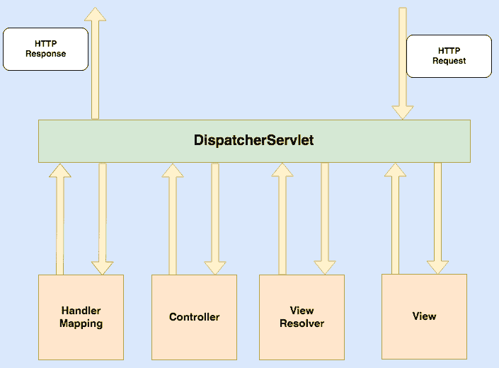

与即将到来的 HTTP 请求到 `DispatcherServlet` 相关的事件顺序如下：

1.  应用程序（作为客户端）向 `DispatcherServlet` 发送请求。

1.  `DispatcherServlet` 会请求相关的 `Handler Mapping` 来调用 `Controller`。

1.  `Controller` 从 `DispatcherServlet` 接收请求，并根据 `GET` 或 `POST` 方法调用相关的服务函数。服务函数根据业务逻辑设置模型数据。

1.  `ViewResolver` 选择定义好的 `View`。

1.  定义好的 `View` 在应用程序中执行。

# 创建项目

现在，我们将学习如何使用 Kotlin 了解 MVC 框架。尽管这个项目是一个 Web 应用程序，我们需要使用 Maven 进行依赖管理，但我们首先需要创建一个动态 Web 应用程序，然后将其转换为 Maven 项目。以下截图展示了如何准备我们的任务骨架结构：

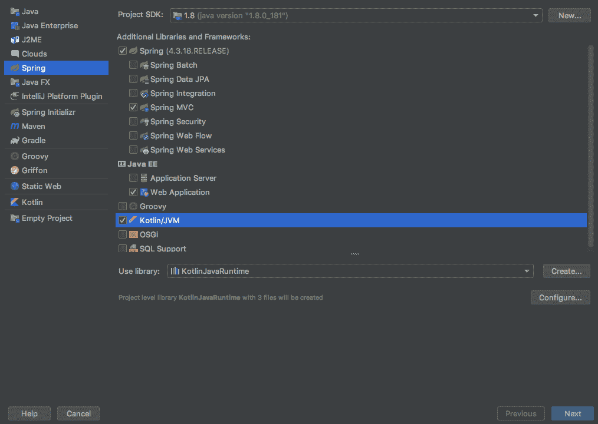

现在我们将学习如何将此项目转换为 Maven 项目。

# 转换为 Maven 项目

现在我们已经准备好了我们的 Maven Web 应用程序项目的骨架代码，我们可以开始对其进行改进，同时创建我们的 Spring MVC HELLO WORLD 应用程序。

创建的项目是一个非 Maven 项目。我们需要将项目转换为 Maven 项目。

要将此项目转换为 Maven 项目，打开现有项目。在项目工具窗口中，右键单击您的项目并选择添加框架支持。

在打开的对话框中，从左侧选项中选择 Maven 并点击确定：

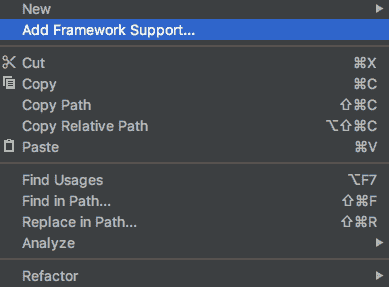

# 将 Spring MVC 依赖项添加到 pom.xml

我们必须在 `pom.xml` 中包含 `spring-web` 和 `spring**-**webmvc` 依赖项，以及包括一个 servlet 编程接口、JSP 编程接口和 JSTL 依赖项。以下是我们的项目 `pom.xml` 文件的部分内容（完整版本在 GitHub 上），其中包含 `Spring Core`、`Kotlin` 和 `Web` 依赖项：

```kt
<?xml version="1.0" encoding="UTF-8"?>
<project xmlns="http://maven.apache.org/POM/4.0.0"
         xmlns:xsi="http://www.w3.org/2001/XMLSchema-instance"
         xsi:schemaLocation="http://maven.apache.org/POM/4.0.0 http://maven.apache.org/xsd/maven-4.0.0.xsd">
    <modelVersion>4.0.0</modelVersion>
     ----
     ----
    <properties>
 <springframework.version>5.0.8.RELEASE</springframework.version>
        <kotlin.version>1.3.0</kotlin.version>
        <jstl.version>1.2</jstl.version>
    </properties>

    <dependencies>
 <!--Spring dependencies-->
        <dependency>
            <groupId>org.springframework</groupId>
            <artifactId>spring-core</artifactId>
        </dependency>
        ----
        ----
        ----

 <!--We need to add the following Kotlin dependencies-->
        <dependency>
            <groupId>org.jetbrains.kotlin</groupId>
            <artifactId>kotlin-stdlib-jdk8</artifactId>
        </dependency>
    </dependencies>

    <build>
    <plugins>
        ----
        ----
    </plugins>
    </build>
</project>
```

# 创建 Spring 配置 Bean

前往 `/WebContent/WEB-INF/` 目录并创建一个名为 `spring-mvc-kotlin-servlet.xml` 的 XML 文件：

```kt
<?xml version="1.0" encoding="UTF-8"?>
<beans xmlns="http://www.springframework.org/schema/beans"
       xmlns:mvc="http://www.springframework.org/schema/mvc"
       xmlns:context="http://www.springframework.org/schema/context"
       xmlns:xsi="http://www.w3.org/2001/XMLSchema-instance"
       xsi:schemaLocation="
        http://www.springframework.org/schema/beans
        http://www.springframework.org/schema/beans/spring-beans.xsd
        http://www.springframework.org/schema/mvc
        http://www.springframework.org/schema/mvc/spring-mvc.xsd
        http://www.springframework.org/schema/context
        http://www.springframework.org/schema/context/spring-context.xsd">

    <mvc:annotation-driven />
 <context:component-scan
            base-package="mvckotlin" />
    <mvc:default-servlet-handler />

    <bean id="viewResolver"
          class="org.springframework.web.servlet.view.UrlBasedViewResolver">
        <property name="viewClass"
                  value="org.springframework.web.servlet.view.JstlView" />
        <property name="prefix" value="/WEB-INF/jsp/" />
        <property name="suffix" value=".jsp" />
    </bean>
</beans>
```

在 `spring-mvc-kotlin-servlet.xml` 配置文件中，我们提到了 `<context:component-scan>` 标签。现在，Spring 将加载来自 `mvckotlin` 包及其所有子包的所有组件：

+   这将加载我们的 `MVCKotlinApp.class` 并分配一个 `viewResolver` 实例。

+   `<property name="prefix" value="/WEB-INF/jsp/" />` 将解析视图并添加一个名为 `/WEB-INF/jsp/` 的前缀字符串。

+   注意，我们在 `MVCKotlinApp` 类中返回了一个名为 `welcome` 的视图 `ModelAndView` 对象。

+   这将被解析为 `/WEB-INF/jsp/greeting.jsp` 路径。

+   在 `/WebContent/WEB-INF/` 目录下有一个 `web.xml` 文件。如果您找不到它，请在 `/WebContent/WEB-INF/` 目录中创建它。以下是 `web.xml` 的一部分代码：

```kt
<?xml version="1.0" encoding="UTF-8"?>
<web-app xmlns:xsi="http://www.w3.org/2001/XMLSchema-instance"
         xmlns="http://xmlns.jcp.org/xml/ns/javaee"
         xsi:schemaLocation="http://xmlns.jcp.org/xml/ns/javaee http://xmlns.jcp.org/xml/ns/javaee/web-app_4_0.xsd"
         version="4.0">
    <display-name>spring-mvc-kotlin</display-name>
    <welcome-file-list>
        <welcome-file>index.jsp</welcome-file>
        <welcome-file>default.jsp</welcome-file>
        <welcome-file>default.html</welcome-file>
        <welcome-file>index.html</welcome-file>

    </welcome-file-list>
    <servlet>
 <servlet-name>spring-mvc-kotlin</servlet-name>        <servlet-class>org.springframework.web.servlet.DispatcherServlet</servlet-class>
        <load-on-startup>1</load-on-startup>
    </servlet>
    <servlet-mapping>
 <servlet-name>spring-mvc-kotlin</servlet-name>        <url-pattern>/index.jsp</url-pattern>
        <url-pattern>/greeting.jsp</url-pattern>
    </servlet-mapping>
</web-app>
```

`web.xml` 将将 `DispatcherServlet` 映射到 `/greeting.jsp` URL 模式。此外，请注意，我们已将 `index.jsp` 作为问候文件提及。

初始化后，`DispatcherServlet` 将在 `WEB-INF` 文件夹中查找名为 `[servlet-name]-servlet.xml` 的文件。Servlet XML 文件的前缀名称和 `web.xml` 中 `<servlet-name>` 标签的值必须相同。在我们的示例中，servlet 的名称是 `spring-mvc-kotlin-servlet.xml`。

# 创建控制器类

在项目中转到 `src` | `main` | `java`，创建我们在 `spring-mvc-kotlin-servlet.xml` 中提到的包名。假设我们的包名是 `mvckotlin`：

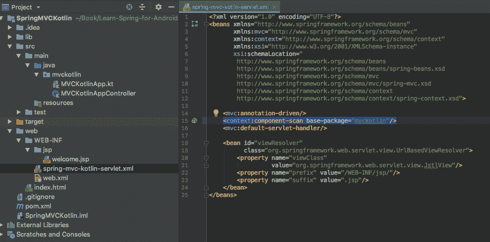

创建一个控制器 `.kt` 文件。我们称这个为 `MVCKotlinAppController.kt`：

```kt
@Controller class MVCKotlinAppController {
    @RequestMapping("/greeting")
    fun greetingMessage(): ModelAndView {
        val message =
            "<div style='text-align:center;'>" +
                "<h3>Welcome to Learn Spring for Android Application Development</h3>" +
            "</div>"
        return ModelAndView("greeting", "message", message)
    }
}
```

我们有一个名为 `MVCKotlinAppController.kt` 的类，并使用 `@Controller` 注解，这意味着这个类是一个控制器类。在初始化项目后，Spring 从这里开始搜索包。

`@RequestMapping("/greeting")` 注解将映射一个网络请求，`/greeting` 将创建一个基本 URI。

我们创建了一个名为 `greetingMessage()` 的函数，它将返回一个 `ModelAndView` 对象。在这里，我们只是创建了一个用于问候的示例 `HTML` 代码。如果我们访问 `http://localhost:8080/greeting`，这将基于 `greetingMessage()` 返回一个视图。

# 视图

创建一个名为 `/WebContent/index.jsp` 的新文件，内容如下：

```kt
<%@ page contentType="text/html;charset=UTF-8" language="kotlin" %>
<html>
<head>
    <title>Spring MVC Kotlin</title>
</head>
<body>
<br>
<div style="text-align: center">
    <h2>
        Hey You..!! This is your 1st Spring MCV Tutorial..<br> <br>
    </h2>
    <h3>
        <a href="greeting.html">Click here to See Welcome Message... </a>(to
        check Spring MVC Controller... @RequestMapping("/greeting"))
    </h3>
</div>
</body>
</html>
```

然后创建另一个名为 `/WebContent/WEB-INF/jsp/greeting.jsp` 的文件，内容如下：

```kt
<html>
<head>
    <title>Spring MVC Kotlin</title>
</head>
<body>
${message}
</body>
</html>
```

# IntelliJ Ultimate

要运行项目，您需要设置运行配置。按照以下步骤操作：

1.  从工具栏中点击 Run... 按钮，然后添加带有 **`clean` `install`** 注释的 Maven：

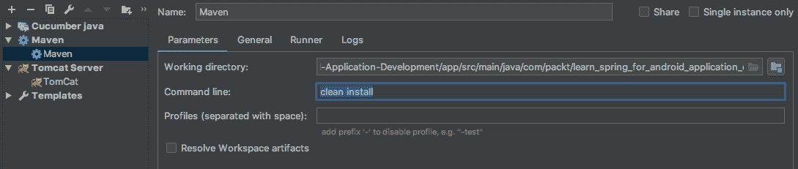

1.  添加 `TomCat Server` --> `Local` 并将 `SpringMVCKotlin:war` 构建从部署添加：

**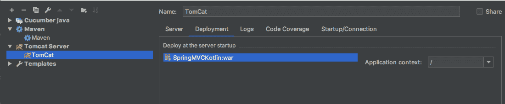**

1.  点击菜单栏上的运行按钮以启动项目。

# Eclipse

构建项目的步骤如下：

1.  要运行项目，请右键单击项目 | 运行 As | Maven Build....

1.  添加目标—**干净安装**。***

1.  点击应用并运行。

如果没有错误，您将看到以下 **BUILD SUCCESS** 消息：

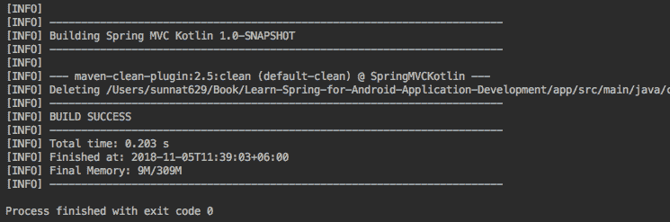

访问 `http://localhost:8080/SpringMVCKotlin/`，您将看到以下演示代码的输出：

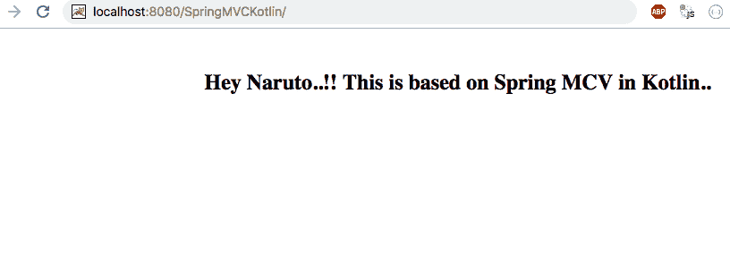

# SpringBoot

**SpringBoot**是 Spring 框架的一个模块，它具有一些帮助开发者创建生产级应用程序的功能。SpringBoot 由两个词组成——**BOOT**来自 bootstrap，而**SPRING**是用于构建 Java 企业应用程序的框架。这是一个大型框架，也受到许多其他框架的支持。SpringBoot 与之相似，因为它允许您从头开始引导 Spring 应用程序，这就是它得名 SpringBoot 的原因。根据`spring.io`，以下是 SpringBoot 的定义——“Spring Boot 使创建独立、生产级、基于 Spring 的应用程序变得容易，您可以直接运行。”这意味着它帮助您在没有他人帮助的情况下创建可运行的项目。此外，我们在这里展示了一个**生产级**的项目，这是一个成品应用程序。SpringBoot 最小化了设置应用程序的痛苦。

SpringBoot 的功能如下：

+   它有助于创建独立的 Spring 应用程序。

+   它自带 Tomcat、Jetty 或 Undertow，因此无需担心设置服务器环境。

+   使用 SpringBoot，您不需要部署 WAR 文件。

+   可以自动导入第三方框架及其配置。

+   如果您使用 SpringBoot，则不需要 XML 配置。

SpringBoot 不会生成代码或更改您的文件。相反，当您启动应用程序时，SpringBoot 会动态连接 beans 和设置，并将它们应用到应用程序上下文中。

让我们创建一个 SpringBoot 项目来了解其依赖项和功能。

# 创建项目

要创建一个 Spring Boot 项目，让我们从[`start.spring.io/`](https://start.spring.io/)生成一个示例项目。在这里，您可以添加所需的依赖项，例如`Web`、`Thymeleaf`、`JPA`和`DevTools`。可以按照以下步骤操作：

1.  在顶部的下拉菜单中，选择**Maven Project**，带有**Kotlin**和 Spring Boot **2.1.1 (SNAPSHOT)**：

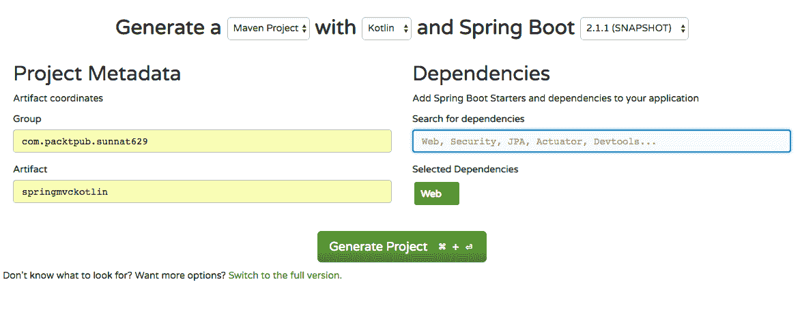

1.  输入**组**、**工件**、**包名**，并添加**依赖项**。然后点击生成项目。

1.  下载并解压项目。

1.  将下载的项目导入到您的 IDE 中。

按照这些步骤操作后，您就可以使用和修改项目了。让我们看看这个项目里面有什么。您将在`src/main/kotlin/{packageName}/AppController.kt`下找到一个控制器文件。

这里是`controller`文件中的一段代码：

```kt
@RestController
class HtmlController {
 @GetMapping("/")
    fun blog(model: Model): String {
        model["title"] = "Greeting"
        return "index"
    }
}
```

创建一个名为`HtmlController.kt`的类，并用`@RestController`注解使其成为一个控制器类，我们将处理网络请求。`@RestController`是`@Controller`和`@ResponseBody`的组合。

创建一个名为`blog(model: Model)`的函数，并用`@GetMappingmaps("/")`注解它。这将返回`index.xml`作为输出。

# 创建应用程序类

在 `**`src/main/kotlin/{packageName}`**` 下创建一个名为 `SpringBootKotlinApplication.kt` 的应用程序类：

```kt
@SpringBootApplication class SpringBootKotlinApplication

fun main(args: Array<String>) {
   runApplication<SpringBootKotlinApplication>(*args)
}
```

`@SpringBootApplication` 用于启用以下三个功能：

+   `@Configuration` 启用了基于 Java 的配置。

+   `@EnableAutoConfiguration` 启用了 SpringBoot 的自动配置功能。

+   `@ComponentScan` 启用了组件扫描。

`main()` 函数使用 SpringBoot 的 `SpringApplication.run()` 方法来分发应用程序。这个网络应用程序是 100% 纯 Kotlin，这里不需要安排任何管道或基础结构。

同样，有一个作为 `@Bean` 设置的 `CommandLineRunner` 函数，它在启动时持续运行。它恢复由你的应用程序创建的或由 SpringBoot 自动添加的所有 bean。然后它对这些进行排序并打印出来。

在 `SpringBootKotlinApplication` 类的代码中，与 Java 相比，你可以看到没有分号，空类中没有部分（如果你需要通过 `@Bean` 注解声明 beans，可以添加一些），以及使用 `runApplication` 顶级函数。`runApplication<SpringBootKotlinApplication>(*args)` 是 Kotlin 的非正式选项，与 `SpringApplication.run(SpringBootKotlinApplication::class.java, *args)` 相比，并且可以用来自定义应用程序。

现在，在 `src/main/resources/templates/` 下的文件夹中创建一个 HTML 文件。

`index.html` 的内容如下：

```kt
<!DOCTYPE html>
<html lang="en">
<head>
    <meta charset="UTF-8"/>
    <title>Spring Boot Kotlin</title>
</head>
<body>
   <p>Welcome, Naruto. This project is based on Spring Boot in Kotlin</p>
</body>
</html>
```

通过运行 `SpringBootKotlinApplication.kt` 中的 `main` 函数来启动网络应用程序。如果一切正常，你将在日志中看到以下内容：

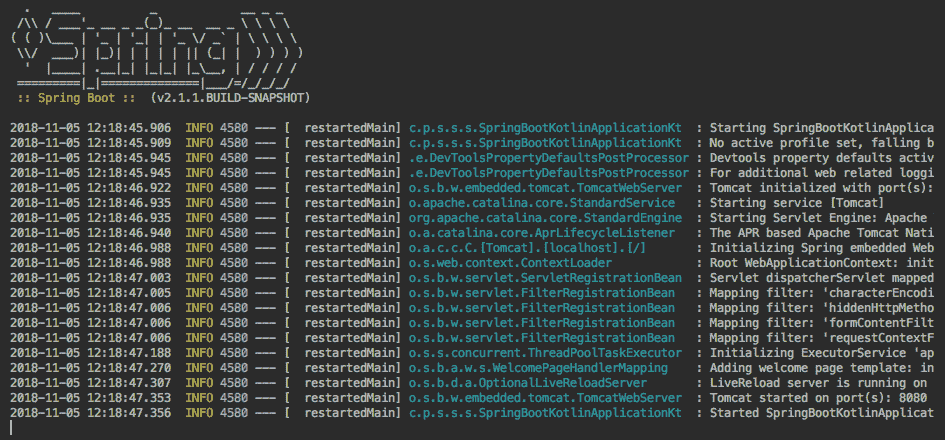

接下来，访问 `http://localhost:8080/`。在这里，你应该看到一个带有 SpringBoot Kotlin 应用程序标题的网页：

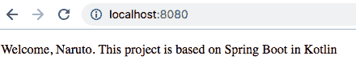

我们已经涵盖了 SpringBoot 的基础知识。稍后，我们将通过更多的依赖项对其进行更深入的探讨。

# 摘要

在本章中，我们探讨了 Spring 及其模块、依赖项和函数的使用。我们试图涵盖本书其余部分所需的所有基本信息。我们研究了 Spring 框架的稳定和坚固的架构，包括核心、信息访问、Web、AOP、仪器和测试。此外，我们了解了 bean 的生命周期以及如何以三种不同的方式设计 bean。我们发现了 bean 配置的深度，并学习了在 XML、注解和代码中使用 bean。现在我们知道了如何将依赖项注入到任务中。

我们探讨了两个值得注意的框架：Spring MVC 和 SpringBoot。现在，我们将能够创建一个基于 MVC 的项目，包括其依赖项和模块。此外，我们还学习了 SpringBoot 的使用，并创建了一个使用 Boot 的 Web 应用程序，使我们能够在没有 HTML 文件的情况下制作网页。我们还探讨了 Spring MVC 和 SpringBoot 之间的区别。现在，您可以使用 Kotlin 语言创建 Spring 项目。

在下一章中，我们将学习构建 Android 平台上的客户端应用程序所需的 Android 和 Spring 模块。

# 问题

1.  什么是 Spring 框架？

1.  什么是依赖注入？

1.  什么是面向方面的编程？

1.  什么是 Spring IoC 容器？

1.  什么是 Spring Bean？

1.  在 Spring MVC 中，控制器是什么？

1.  什么是`DispatcherServlet`？

1.  什么是`ContextLoaderListener`？

1.  什么是样板代码？

# 进一步阅读

+   *《学习 Spring 应用程序开发》* ([`www.packtpub.com/application-development/learning-spring-application-development`](https://www.packtpub.com/application-development/learning-spring-application-development))

+   *《Spring MVC：入门指南 - 第二版》* ([`www.packtpub.com/application-development/spring-mvc-beginners-guide-second-edition`](https://www.packtpub.com/application-development/spring-mvc-beginners-guide-second-edition))

+   *《Spring：使用 Spring Boot 构建微服务》* ([`www.packtpub.com/application-development/spring-microservices-spring-boot`](https://www.packtpub.com/application-development/spring-microservices-spring-boot))
