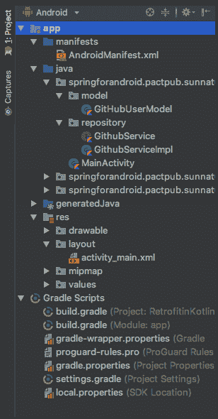
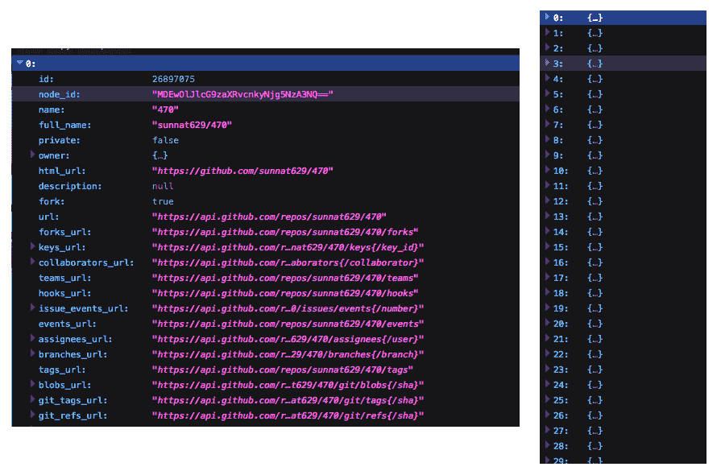
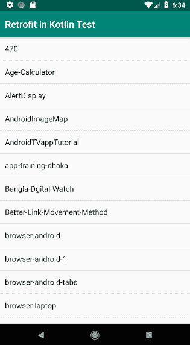

# Android 的 Spring 模块

本章节将涵盖支持 Spring for Android 的模块和功能，以及在 Android 中使用 REST 作为客户端。有一些模块有助于请求和检索 REST API。它们还提供安全功能，如*基本认证*和*OAuth2*。由于这些安全措施，服务器资源得到保护，因此难以被黑客攻击。即使客户端也需要从资源所有者那里获得权限才能使用受保护服务器的资源。这些模块还集成了强大的基于 OAuth 的授权客户端和主流社交网站（如 Google、Twitter、Facebook 等）的实现。

本章节涵盖了以下主题：

+   The `RestTemplate` module.

+   The Gradle and Maven repository

+   `RestTemplate`模块

+   Retrofit

+   创建一个 Android 应用

# 技术要求

开发 Android 应用需要 Android SDK。开发者最初使用 Eclipse 和 Android 插件来开发 Android 应用。但后来，Google 宣布 Android Studio 是 Android 应用开发的官方工具。它包含所有必要的模块，如 Gradle、Maven、Android SDK、NDK、Java JDK 等，因此我们不需要使用终端命令行。在第一章，*关于环境*中，我们展示了如何使用 Android Studio 下载和创建一个示例 Android 应用。

本章节的示例源代码可在 GitHub 上通过以下链接获取：[`github.com/PacktPublishing/Learn-Spring-for-Android-Application-Development/tree/master/Chapter04`](https://github.com/PacktPublishing/Learn-Spring-for-Android-Application-Development/tree/master/Chapter04)

# REST 客户端模块

**表示状态转移**（**REST**）旨在利用现有协议的优势。REST 的一致性系统通常被称为**RESTful 系统**。它几乎可以在任何协议上使用，但在使用 Web API 时通常利用 HTTP。这使得系统之间的通信更加简单。这些系统通过它们无状态和分离客户端和服务器关注点的方式被描述。我们将深入探讨这些术语的含义以及为什么它们是 Web 服务有利的特性。

A RESTful web service is responded to with a payload formatted in either HTML, XML, JSON, or some other format. The response can affirm that a change has been made to the requested response, and the reaction can give hypertext links that are related to other resources, or a bundle of resources. At the point in which HTTP is utilized, as is normal, the tasks that are accessible are `GET`, `POST`, `PUT`, `DELETE`, and other predefined HTTP functions.

要使用 Spring for Android，您可以使用不同的 HTTP 库。Spring 建议使用`RestTemplate`用于 Android。这现在已经过时，可能不会支持较新的 Android 版本。然而，现在您可以找到一些更简单、更强大且功能丰富的库。您可以使用不同的 HTTP 库，例如以下之一：

+   `RestTemplate`

+   Retrofit

+   Volley

我们将在本章中探讨所有这些库的使用。在我们的后续章节中，我们将使用 Retrofit，因为它更简单、更新、健壮，并且需要编写的代码更少。然而，您可以在项目中使用任何这些库。

# RestTemplate 模块

`RestTemplate`是一个健壮的基于 Java 的 REST 客户端。在 Android 应用程序开发中，我们可以使用`RestTemplate`模块，它将提供一个模板来请求和检索 REST API。`RestTemplate`是 Spring 的同步客户端 HTTP 访问的核心类。它的目的是解开与 HTTP 服务器的通信并授权 RESTful 标准。

`RestTemplate`是同步 RESTful HTTP 请求的主要类。使用一个本地的 Android HTTP 客户端库来检索请求。默认的**`ClientHttpRequestFactory`**，在您创建另一个`RestTemplate`示例时使用，取决于您的应用程序运行的 Android 版本。

# Gradle 和 Maven 仓库

要开发 Android 应用程序，我们必须实现或编译一些依赖项。Android 官方支持 Gradle 来实现或编译依赖项。Android 也支持 Maven，因此如果您想使用 Maven，则需要修改`pom.xml`。

您可以在[`mvnrepository.com/artifact/org.springframework.android/spring-android-core`](https://mvnrepository.com/artifact/org.springframework.android/spring-android-core)检查实现`spring-android-core`的依赖项的最新版本，该依赖项包含了 Android 的核心模块。

您可以在[`mvnrepository.com/artifact/org.springframework.android/spring-android-rest-template`](https://mvnrepository.com/artifact/org.springframework.android/spring-android-rest-template)检查实现`spring-android-rest-template`的依赖项的最新版本，该依赖项包含了所有用于`RestTemplate`的模块。

现在，我们将探讨在 Android 项目中使用 Gradle 和 Maven 的方法。

# Gradle

Gradle 是一个构建系统，用于通过监控条件和提供自定义构建逻辑来构建 Android 包（APK 文件）。它是一个基于 JVM 的框架，这意味着您可以使用 Java 编写自己的内容，Android Studio 正是利用了这一点。

在 Android Studio 中，Gradle 是一个自定义的构建工具，用于通过监控依赖项和提供自定义构建逻辑来构建 Android 包（APK 文件）。APK 文件（Android 应用程序包）是一个特殊格式的压缩文件，包含字节码、资源（图片、UI、XML 等）和清单文件。

实现这些依赖项的依赖命令如下所示：

```kt
dependencies {
    // https://mvnrepository.com/artifact/org.springframework.android/spring-android-rest-template
 implementation 'org.springframework.android:spring-android-rest-template:2.0.0.M3' // https://mvnrepository.com/artifact/org.springframework.android/spring-android-core
 implementation 'org.springframework.android:spring-android-core:2.0.0.M3'
}

repositories {
    maven {
        url 'https://repo.spring.io/libs-snapshot'
    }
}
```

# Maven

Android Maven 模块用于构建 Android OS 的应用程序和构建库。这些用于创建 **Android Archive Library**（**AAR**）和继承 APKLIB 格式，从而使用 Apache Maven。

这里是一个如何在 `pom.xml` 中添加 Android 依赖项的代码示例：

```kt
<dependencies>
    <!-- https://mvnrepository.com/artifact/org.springframework.android/spring-android-rest-template -->
 <dependency>
 <groupId>org.springframework.android</groupId>
 <artifactId>spring-android-rest-template</artifactId>
 <version>2.0.0.BUILD-SNAPSHOT</version>
 </dependency> <!-- https://mvnrepository.com/artifact/org.springframework.android/spring-android-core -->
 <dependency>
         <groupId>org.springframework.android</groupId>
         <artifactId>spring-android-core</artifactId>
         <version>1.0.1.RELEASE</version>
     </dependency>
</dependencies>
<repositories>
    <repository>
        <id>spring-snapshots</id>
        <name>Spring Snapshots</name>
        <url>https://repo.spring.io/libs-snapshot</url>
        <snapshots>
            <enabled>true</enabled>
        </snapshots>
    </repository>
</repositories>
```

# RestTemplate 构造函数

以下代码列出了四个 `RestTemplate` 构造函数：

```kt
RestTemplate();
RestTemplate(boolean includeDefaultConverters);
RestTemplate(ClientHttpRequestFactory requestFactory);
RestTemplate(boolean includeDefaultConverters, ClientHttpRequestFactory requestFactory);
```

此构造函数默认没有参数。如果您想使用另一个 `RestTemplate` 示例中的默认消息转换器集，可以将 `TRUE` 作为参数传递。如果您想使用另一个 `ClientHttpRequestFactory`，则需要将其作为参数传递。

# RestTemplate 函数

`RestTemplate` 提供了大量的函数。它有六个主要的 HTTP 函数，这使得构建多个 RESTful 服务和授权 REST 最佳实践变得简单。`RestTemplate` 的策略名称遵循一个命名传统；前缀部分展示了 HTTP 策略是什么，第二部分展示了将返回什么。在 `RestTemplate` 中有一个名为 `ResponseErrorHandler` 的接口，用于确定特定响应是否有错误。以下是六个 HTTP 函数的描述。

# HTTP GET

HTTP 定义了一组请求函数，以展示针对给定资源的期望执行的活动。`GET` 函数请求预定资源的描述，并要求使用 `GET` 仅检索数据。`GET` 是最著名的 HTTP 函数之一。

这里是 HTTP `GET` 的常见函数：

```kt
@Throws(RestClientException::class)
fun <T> getForObject(url: String, responseType: Class<T>, vararg urlVariables: Any): T

@Throws(RestClientException::class)
fun <T> getForObject(url: String, responseType: Class<T>, urlVariables: Map<String, *>): T

@Throws(RestClientException::class)
fun <T> getForObject(url: URI, responseType: Class<T>): T

fun <T> getForEntity(url: String, responseType: Class<T>, vararg urlVariables: Any): ResponseEntity<T>

fun <T> getForEntity(url: String, responseType: Class<T>, urlVariables: Map<String, *>): ResponseEntity<T>

@Throws(RestClientException::class)
fun <T> getForEntity(url: URI, responseType: Class<T>): ResponseEntity<T>
```

这里是一个如何调用这些函数的示例：

```kt

val restTemplate = RestTemplate()

val baseUrl: String ?= "YOUR_URL" // API URL as String
val response = restTemplate.getForEntity(baseUrl, String::class.java)

val uri = URI(baseUrl) // API URL as URL format
val responseURI = restTemplate.getForEntity(uri, String::class.java)Auth Module
```

# HTTP POST

HTTP `POST` 请求 URI 上的资产执行给定的操作。`POST` 通常用于创建新内容；然而，它也可以用于更新元素。

这里是 HTTP `POST` 的常见函数：

```kt
@Throws(RestClientException::class)
fun postForLocation(url: String, request: Any, vararg urlVariables: Any): URI

fun postForLocation(url: String, request: Any, urlVariables: Map<String, *>): URI

@Throws(RestClientException::class)
fun postForLocation(url: URI, request: Any): URI

fun <T> postForObject(url: String, request: Any, responseType: Class<T>, vararg uriVariables: Any): T

fun <T> postForObject(url: String, request: Any, responseType: Class<T>, uriVariables: Map<String, *>): T

@Throws(RestClientException::class)
fun <T> postForObject(url: URI, request: Any, responseType: Class<T>): T

fun <T> postForEntity(url: String, request: Any, responseType: Class<T>, vararg uriVariables: Any): ResponseEntity<T>

@Throws(RestClientException::class)
fun <T> postForEntity(url: String, request: Any, responseType: Class<T>, uriVariables: Map<String, *>): ResponseEntity<T>

@Throws(RestClientException::class)
fun <T> postForEntity(url: URI, request: Any, responseType: Class<T>): ResponseEntity<T>
```

这里是一个如何调用这些函数的示例：

```kt
/** POST **/

val restTemplate = RestTemplate()

val baseUrl: String ?= "YOUR_URL"
val uri = URI(baseUrl)
val body = "The Body"

val response = restTemplate.postForEntity(baseUrl, body, String::class.java)

val request = HttpEntity(body)
val responseExchange = restTemplate.exchange(baseUrl, HttpMethod.POST, request, String::class.java)

val responseURI = restTemplate.postForEntity(uri, body, String::class.java)
val responseExchangeURI = restTemplate.exchange(uri, HttpMethod.POST, request, String::class.java)
```

# HTTP PUT

要在 URI 中存储一个元素，`PUT` 函数可以创建一个新的元素或更新现有的一个。`PUT` 请求是幂等的。幂等性是 `PUT` 请求与 `POST` 请求的基本区别。

这里是 HTTP `PUT` 的常见函数：

```kt
Here are the common functions -
@Throws(RestClientException::class)
fun put(url: String, request: Any, vararg urlVariables: Any)

@Throws(RestClientException::class)
fun put(url: String, request: Any, urlVariables: Map<String, *>)

@Throws(RestClientException::class)
fun put(url: String, request: Any, urlVariables: Map<String, *>)
```

这里是一个如何调用 HTTP `PUT` 函数的示例：

```kt
val baseUrl: String ?= "YOUR_URL"
val restTemplate = RestTemplate()
val uri = URI(baseUrl)

val body = "The Body"

restTemplate.put(baseUrl, body)
restTemplate.put(uri, body)
```

# HTTP DELETE

HTTP `DELETE` 是一个用于删除资源的请求函数。然而，资源不必立即删除。`DELETE` 可以是异步的或长时间运行的请求。

这里是 HTTP `DELETE` 的常见函数：

```kt
@Throws(RestClientException::class)
fun delete(url: String, vararg urlVariables: Any)

@Throws(RestClientException::class)
fun delete(url: String, urlVariables: Map<String, *>)

@Throws(RestClientException::class)
fun delete(url: URI) 
```

这里是一个如何调用这些函数的示例：

```kt
val baseUrl: String ?= "YOUR_URL"
val restTemplate = RestTemplate()
val uri = URI(baseUrl)

restTemplate.delete(baseUrl)
restTemplate.delete(uri)
```

# HTTP OPTIONS

HTTP `OPTIONS` 函数用于描述目标资源的通信选项。客户端可以指定 `OPTIONS` 方法的 URL，或者使用参考标记 `(*)` 来引用整个服务器。

这里是 HTTP `OPTIONS` 的常见功能：

```kt
@Throws(RestClientException::class)
fun optionsForAllow(url: String, vararg urlVariables: Any): Set<HttpMethod>

@Throws(RestClientException::class)
fun optionsForAllow(url: String, urlVariables: Map<String, *>): Set<HttpMethod>

@Throws(RestClientException::class)
fun optionsForAllow(url: URI): Set<HttpMethod>
```

这里是如何调用函数的示例：

```kt
val baseUrl: String ?= "YOUR_URL"
val restTemplate = RestTemplate()
val allowHeaders = restTemplate.optionsForAllow(baseUrl)

val uri = URI(baseUrl)
val allowHeadersURI = restTemplate.optionsForAllow(uri)
```

# HTTP `HEAD`

在当前版本的 Spring（4.3.10）中，`HEAD` 被自动支持。

映射到 `GET` 的 `@RequestMapping` 函数也隐式映射到 `HEAD`，这意味着不需要显式声明 `HEAD`。HTTP `HEAD` 请求的处理方式就像 HTTP `GET` 一样，但不同的是，不写入主体，只计算字节数以及 Content-Length 头。

这里是 HTTP `HEAD` 的常见功能：

```kt
@Throws(RestClientException::class)
fun headForHeaders(url: String, vararg urlVariables: Any): HttpHeaders

@Throws(RestClientException::class)
fun headForHeaders(url: String, urlVariables: Map<String, *>): HttpHeaders

@Throws(RestClientException::class)
fun headForHeaders(url: URI): HttpHeaders
```

# Retrofit

**Retrofit** 是一个库，它使解析 API 响应变得简单且易于在应用程序中使用。Retrofit 是一个 Java 和 Android 的 REST 客户端，它通过基于 REST 的网络服务使恢复和传输 JSON 变得相对简单。在 Retrofit 中，你可以安排使用哪个转换器进行数据序列化。通常，对于 JSON，你使用 Gson，但你可以添加自定义转换器来处理 XML 或其他格式。Retrofit 使用 `OkHttp` 库进行 HTTP 请求。

# Retrofit 的使用

要与 Retrofit 一起使用，你需要以下三个类：

+   一个模型类，用作 JSON 模型

+   定义可能 HTTP 请求的接口

+   `Retrofit.Builder` 类，它使用接口和开发者编程接口来允许指定 HTTP 请求的 URL 端点。

接口中的每个函数代表一个可能的编程接口调用。它必须有一个 HTTP 注解（`GET`、`POST`、`DELETE` 等）来指定请求类型和相对 URL。

# Retrofit 的优势

Retrofit 非常容易使用。它基本上给你一个机会将编程接口调用视为简单的 Java 方法调用，因此你只需指定要访问的 URL 和请求/响应参数作为 Java 类。

整个系统调用，加上 JSON/XML 解析，完全由 Retrofit（在 Gson 的帮助下进行 JSON 解析）处理，同时支持可插拔的序列化和反序列化格式。

# 配置 Retrofit

当然，Retrofit 可以将 HTTP 主体反序列化为 `OkHttp` 的 `ResponseBody` 类型，并且它可以接受其 `RequestBody` 类型用于 `@Body`。

可以添加转换器以支持不同的类型。七种模块调整主流序列化库以供您使用。以下是一些库：

+   **Gson**: `com.squareup.retrofit2:converter-gson`

+   **Jackson**: `com.squareup.retrofit2:converter-jackson`

+   **Moshi**: `com.squareup.retrofit2:converter-moshi`

+   **Protobuf**: `com.squareup.retrofit2:converter-protobuf`

+   **Wire**: `com.squareup.retrofit2:converter-wire`

+   **Simple XML**: `com.squareup.retrofit2:converter-simplexml`

+   **Scalars (primitives, boxed, and String)**: `com.squareup.retrofit2:converter-scalars`

# 下载 Retrofit

从 [`search.maven.org/remote_content?g=com.squareup.retrofit2&a=retrofit&v=LATEST`](https://search.maven.org/remote_content?g=com.squareup.retrofit2&a=retrofit&v=LATEST) 下载最新的 JAR 文件。

或者，您可以使用以下代码通过 Maven 注入依赖项：

```kt
<dependency>
    <groupId>com.squareup.retrofit2</groupId>
    <artifactId>retrofit</artifactId>
    <version>2.4.0</version>
</dependency>
```

或者，您可以使用以下代码使用 Gradle：

```kt
implementation 'com.squareup.retrofit2:retrofit:2.4.0'
implementation 'com.squareup.retrofit2:converter-gson:2.3.0'
compile 'com.jakewharton.picasso:picasso2-okhttp3-downloader:1.1.0'

```

# HTTP 请求函数

每个函数都必须有一个 HTTP 注解，该注解指定请求函数和相对 URL。有五个内置注解——`GET`、`POST`、`PUT`、`DELETE` 和 `HEAD`。资产的总体 URL 由注解指示。

让我们看看这些注解的使用。我们考虑的是基于 GitHub API v3 的所有 URL ([`developer.github.com/v3/`](https://developer.github.com/v3/))。

# GET

假设您想从您的 GitHub 账户获取详细信息响应。您需要使用以下端点以及 `@GET` 函数来获取用户信息：

```kt
@GET("group/{id}/users") Call<List<Users>> groupList(@Path("id") int id);
```

假设您想在您的 GitHub 账户中创建一个新的仓库。在这里，您需要使用以下端点以及 `@POST` 函数：

```kt
@POST("user/repos")
fun createRepo(@Body repo:Repository, 
               @Header("Authorization") accessToken: String,
               @Header("Accept") apiVersionSpec: String,
               @Header("Content-Type") contentType: String): Call<Repository>
```

# PUT

假设您想更新 GitHub `Gist` 对象。您需要使用以下端点以及 `@PUT` 函数：

```kt
@PUT("gists/{id}")
fun updateGist(@Path("id") id: String, 
               @Body gist: Gist): Call<ResponseBody>
```

# DELETE

假设您想从您的 GitHub 账户删除一个仓库。在这种情况下，您需要使用以下端点以及 `@DELETE` 函数：

```kt
@DELETE("repos/{owner}/{repo}")
    fun deleteRepo(@Header("Authorization") accessToken: String,
 @Header("Accept") apiVersionSpec: String,
 @Path("repo") repo: String,
 @Path("owner") owner: String): Call<DeleteRepos>
```

# HEAD

可以使用 `@Header` 注解逐步刷新请求头。如果值无效，则忽略该头：

```kt
// example one
@GET("user")
Call<User> getUser(@Header("Authorization") String authorization)

// example two
@Headers("Accept: application/vnd.github.v3.full+json", "User-Agent: Spring for Android")
@GET("users/{username}")
fun getUser(@Path("username") username: String): Call<Users>

```

# 创建 Android 应用

让我们创建一个简单的 Android 应用程序作为客户端，该客户端将使用 GitHub API 获取 REST API。首先，我们需要在 Android Studio 中创建一个应用程序，并写下我们的项目和公司域名。别忘了勾选**包含 Kotlin 支持**。这将包括 Kotlin 的所有支持。以下截图显示了**创建 Android 项目**窗口：


然后，从**手机和平板电脑**选项中选择最低 API 版本。对于此项目，无需添加其他选项。点击下一步后，在**添加到移动**部分，您可以选择**空活动**，然后重命名**活动名称**和布局，点击完成。构建完成后，您就可以开始创建 Android 应用了。

以下截图显示了此项目的最终文件：



# Gradle 信息

这里是我的 Android Studio 的 Gradle 文件详情：

```kt
buildscript {
 ext.kotlin_version = '1.3.10'    repositories {
        google()
        jcenter()
    }
    dependencies {
        classpath 'com.android.tools.build:gradle:3.2.1'
        classpath "org.jetbrains.kotlin:kotlin-gradle-plugin:$kotlin_version"

        // NOTE: Do not place your application dependencies here; they belong
        // in the individual module build.gradle files
    }
}

allprojects {
    repositories {
        google()
        jcenter()
    }
}

task clean(type: Delete) {
    delete rootProject.buildDir
}
```

# Gradle 依赖项

我们将使用 Retrofit 及其功能，因此需要实现所有依赖项，如下代码所示：

```kt
    implementation 'com.squareup.retrofit2:retrofit:2.4.0'
    implementation 'com.squareup.retrofit2:converter-gson:2.4.0'

    implementation 'com.squareup.retrofit2:retrofit-converters:2.5.0'
    implementation 'com.squareup.retrofit2:retrofit-adapters:2.5.0'
    implementation 'com.squareup.okhttp3:logging-interceptor:3.12.0'
    implementation 'com.google.code.gson:gson:2.8.5'
```

# 创建模型

我们将使用 GitHub API。你可以检查所有 REST API URL 在[`api.github.com/`](https://api.github.com/)。我们将使用最简单的 API，它没有安全问题。我们将显示用户仓库的列表。API 是[`api.github.com/users/{user}/repos`](https://api.github.com/users/%7Buser%7D/repos)。你需要一个带有用户名的`GET`HTTP 函数。

以下截图显示了 REST API 的输出：



上一张截图的左侧显示了仓库内容的一部分，右侧是折叠的仓库总列表。

因此，根据 API，我们将为客户端创建一个用户模型。这里是一个名为`GitHubUserModel.kt`的模型类，我们将只显示所有仓库列表的名称：

```kt
class GitHubUserModel {
 val name: String? = null }
```

创建一个将包含 HTTP 请求函数的接口。在这个项目中，我们只会使用一个`GET`函数来检索所有用户的详细信息。在这里，我们使用`GET`Retrofit 注解来编码有关参数和请求函数的详细信息。对于这个函数，我们的端点是`/users/{user}/repos`，你需要添加一个`userName`参数，它将提供一个`UserModel`列表。

这里是`GithubService`接口的代码：

```kt
interface GithubService {
 @GET("/users/{user}/repos")
    fun reposOfUser(@Path("user") user: String): Call<List<GitHubUserModel>>
}
```

# 实现服务

这个类负责主要任务。它将负责使用`Retrofit.builder`类控制所有任务，并将其配置为给定 URL 的基础。

这里是`**UserServiceImpl.kt**`的代码：

```kt
class GithubServiceImpl{
   fun getGithubServiceFactory(): GithubService {
        val retrofit = Retrofit.Builder()
                .baseUrl("https://api.github.com/")
                .addConverterFactory(GsonConverterFactory.create())
                .build()
        return retrofit.create(GithubService::class.java)
    }
}
```

在这里，我们的`baseUrl()`是`https://api.github.com/`。

# 调用回调

这里，我们是从`MainActivity`调用`CallBack<>`。这个回调将包含 REST API 请求的响应。

让我们检查`MainActivity.kt`代码：

```kt
class MainActivity : AppCompatActivity() {
    override fun onCreate(savedInstanceState: Bundle?) {
        super.onCreate(savedInstanceState)
        setContentView(R.layout.activity_main)

        val githubService: GithubService = GithubServiceImpl().getGithubServiceFactory()

        val call: Call<List<GitHubUserModel>> = githubService.reposOfUser("sunnat629")
        call.enqueue(object: Callback<List<GitHubUserModel>>{
            override fun onFailure(call: Call<List<GitHubUserModel>>, t: Throwable) {
                Log.wtf("PACKTPUB", t.message)
            }

            override fun onResponse(call: Call<List<GitHubUserModel>>, response: Response<List<GitHubUserModel>>) {
                val listItems = arrayOfNulls<String>( response.body()!!.size)
                for (i in 0 until response.body()!!.size) {
                    val recipe = response.body()!![i]
                    listItems[i] = recipe.name
                }
                val adapter = ArrayAdapter<String>(this@MainActivity, android.R.layout.simple_list_item_1, listItems)
                displayList.adapter = adapter
            }
        })
    }
}
```

首先，我们需要初始化`GithubServiceImpl().getGithubServiceImpl(username,password)`以便我们可以从`UserService`调用`reposOfUser()`。在这里，我在参数中添加了我的 GitHub 用户名。然后，我们将调用`enqueue(retrofit2.Callback<T>)`，这将异步执行并发送请求以获取响应。它有两个函数——`onResponse()`和`onFailure()`。如果有任何与服务器相关的错误，它将调用`onFailure()`，如果它收到响应和资源，它将调用`onResponse()`。我们可以使用`onResponse()`函数的资源。

这里，我们将获取`UserModel`列表的响应。因此，我们可以使用这个列表在我们的应用程序 UI 中显示 REST 输出。

# 创建一个接口

我们将显示用户的详细信息以及所有仓库的名称。在这里，我们将使用`ListView`。

这里是`acitivity_main.xml`文件的代码：

```kt
<?xml version="1.0" encoding="utf-8"?>
<android.support.constraint.ConstraintLayout xmlns:android="http://schemas.android.com/apk/res/android"
    xmlns:app="http://schemas.android.com/apk/res-auto"
    xmlns:tools="http://schemas.android.com/tools"
    android:layout_width="match_parent"
    android:layout_height="match_parent"
    tools:context=".MainActivity">

    <ListView
        android:id="@+id/displayList"
        android:layout_width="wrap_content"
        android:layout_height="wrap_content"
        app:layout_constraintBottom_toBottomOf="parent"
        app:layout_constraintLeft_toLeftOf="parent"
        app:layout_constraintRight_toRightOf="parent"
        app:layout_constraintTop_toTopOf="parent" />

</android.support.constraint.ConstraintLayout>
```

我们将在`MainActivity`的`onResponse()`函数中使用这个`listview`。

我们将获取列表并创建一个自定义适配器来显示用户列表，如下面的代码所示：

```kt
val listItems = arrayOfNulls<String>( response.body()!!.size)
for (i in 0 until response.body()!!.size) {
    val recipe = response.body()!![i]
    listItems[i] = recipe.name
}
val adapter = ArrayAdapter<String>(this@MainActivity, android.R.layout.simple_list_item_1, listItems)
displayList.adapter = adapter
```

在这里，我们获取仓库列表并将它们转换为数组。然后，我们使用`val adapter = ArrayAdapter<String>(this@MainActivity, android.R.layout.simple_list_item_1, listItems)`创建列表的原生适配器，并在我们的列表中使用`displayList.adapter = adapter`设置适配器。

你永远不应该在主线程上执行长时间运行的任务。这将导致出现**应用程序无响应**（**ANR**）消息。

# 移动应用

所以，在一切完成后，运行你的服务器。然后，运行你的应用。以下截图显示了我们的应用输出：



你可以随意修改，但要注意端点和模型。

# 摘要

在本章中，我们简要介绍了驱动 REST 和 REST 客户端模块的思想。RESTful HTTP 处理未公开功能的方式是独特的。我们看到了不同的 REST 客户端函数库。首先，我们看到了 RestTemplate 是什么以及它在 Android 应用中的实现。现在，我们了解了 RestTemplate 的构造函数及其功能。此外，我们还学习了 Retrofit，使我们能够在 Android 应用中实现 Retrofit。我们还看到了其功能的利用。最后，我们探讨了如何实现 Retrofit 以从 REST API 获取数据。

在接下来的章节中，我们将开发一个完整的项目，包括安全、授权/身份验证、数据库和自定义 REST API，使用 Spring 和 Android 应用作为客户端来处理 API。在这些章节中，你将探索 API 的完整使用，并准备了解如何为服务器创建 API 并从客户端恢复它。

# 问题

1.  REST 和 RESTful 有什么区别？

1.  创建 Web API 的架构风格是什么？

1.  测试你的 Web API 需要哪些工具？

1.  什么是 RESTful Web 服务？

1.  什么是 URI？URI 在基于 REST 的 Web 服务中有什么作用？

1.  HTTP 状态码`200`表示什么？

1.  HTTP 状态码`404`表示什么？

# 进一步阅读

+   *《动手实践 RESTful API 设计模式和最佳实践》* ([`www.packtpub.com/application-development/hands-restful-api-design-patterns-and-best-practices`](https://www.packtpub.com/application-development/hands-restful-api-design-patterns-and-best-practices))，作者：Pethuru Raj, Anupama Raman, 和 Harihara Subramanian

+   *《使用 Spring 构建 RESTful Web 服务》* ([`www.packtpub.com/web-development/building-restful-web-service-spring`](https://www.packtpub.com/web-development/building-restful-web-service-spring))，作者：Ludovic Dewailly
