# 访问数据库

在本章中，我们将学习 Spring 框架中的数据库。数据库是一个以有组织的方式存储在服务器上的数据集合，以便应用程序可以以用户请求的方式检索数据。在本章中，您将学习如何在客户端和服务器端使用数据库。此外，我们将从服务器端探索 JDBC、JPA、Hibernate 和 MySQL 的使用，并从客户端端查看 room 持久库。

本章涵盖以下主题：

+   什么是数据库？

+   什么是数据库管理系统？

+   Spring 中的数据访问。

+   Spring 中的 JDBC 数据访问。

+   使用 JDBC 创建示例项目。

+   在 Spring 中使用 JPA 和 Hibernate 进行数据访问。

+   使用 JPA + Hibernate 创建示例项目。

+   什么是 room 持久库？

+   使用 room 持久库创建 Android 应用程序。

# 技术要求

我们之前已经演示了如何设置环境以及开发 Spring 所需的工具、软件和 IDE。要创建您的项目，请访问此链接：[`start.spring.io/`](https://start.spring.io/)。这里将提供以下选项：

+   Maven 项目

+   语言 – Kotlin

+   Spring Boot 版本 – 2.1.1 (SNAPSHOT)

+   当您创建项目时，您需要提供一些信息，例如——**组别**、**工件**、**名称**、**描述**、**包名**、**打包方式**和**Java 版本**。

我们将在即将到来的项目中使用 MySQL。因此，您需要从 [`dev.mysql.com/downloads/workbench/`](https://dev.mysql.com/downloads/workbench/) 下载 MySQL 工具并安装它。请尝试使用给定信息配置 MySQL 数据库，以便使您的项目更容易：

```kt
Host -- localhost
Port -- 3306
Username -- root
Password -- 12345678
```

本章的示例源代码可在 GitHub 上的以下链接找到：[`github.com/PacktPublishing/Learn-Spring-for-Android-Application-Development/tree/master/Chapter06`](https://github.com/PacktPublishing/Learn-Spring-for-Android-Application-Development/tree/master/Chapter06)。

# 数据库

**数据库**是一个以有组织的方式存储在服务器上的信息集合。用户可以从服务器在各种系统中检索和使用这些数据。在数据库中，用户可以添加、删除、更新、获取或管理数据。通常，数据被组装成表格、列和行，这使得查找相关数据变得更容易。计算机数据库包含数据记录或文件的聚合。公司的数据可以包括他们的统计数据或客户信息，或者可能是绝密文件。数据库管理员为客户提供或用户控制读写访问、分析数据等的能力。现在我们将探讨各种数据库类型及其用途。

# 数据库类型

数据库用于各种目的，例如存储个人或公司信息。市场上有几种数据库，如下文所述。

# 个人数据库

个人数据库是为存储在个人计算机上的数据设计的。这个数据库很小，非常易于管理，通常由一小群人或一个小组织使用。

# 关系型数据库

关系型数据库是在一组适合预定义类别的表中创建的。这些数据库通过表格的排列进行排序，其中信息适合预定义的类别。表由行和列组成。列有一个信息传递的通道，用于明确的分类。另一方面，行包含一个信息案例，该信息由分类所表征。关系型数据库有一个名为**结构化查询语言**（**SQL**）的标准用户和应用程序程序接口。

# 分布式数据库

分布式数据库存储在多个物理位置，并在组织的各个地点进行分布。这些地点通过通信链路连接，因此用户可以轻松访问分布式数据。分布式数据库有两种类型——同构和异构。在同构分布式数据库中，物理位置具有相同的硬件，运行在相同的操作系统和数据库应用程序中。然而，在异构分布式数据库中，硬件、操作系统或数据库应用程序可能位于不同的位置。

# 面向对象数据库

在面向对象的数据库中，项目是通过使用面向对象编程（如 Java 和 C++）创建的，这些项目存储在关系型数据库中。但对于这些项目，面向对象的数据库非常适合。面向对象的数据库是围绕对象而不是活动，以及信息而不是理由来排序的。 

# NoSQL 数据库

NoSQL 数据库通常用于大量分布式数据。这种数据库在处理大数据方面非常有效，其中组织分析存储在云中多个虚拟服务器上的大量未组织数据。

# 图数据库

图数据库是一种使用图论来存储、映射和查询数据关系的 NoSQL 数据库。它是由许多节点和边组成的集合。节点代表实体，边代表节点之间的连接。这种数据库在社交媒体平台如 Facebook 上使用得很多。

# 云数据库

云数据库主要是为虚拟化环境构建的。虚拟化环境可以是混合云、公有云或私有云。这些数据库提供了各种好处，例如按存储容量和按用户基础带宽付费的能力。作为一个软件即服务（SaaS），它为企业的业务应用提供支持。

# 数据库管理系统

**数据库管理系统（DBMS**）是一种系统软件，用于创建和管理数据库。借助 **DBMS**，用户或开发者可以以系统化的方式创建、获取、更新和管理数据。这个系统在用户和数据库之间充当一种接口。它还确保数据得到一致的组织并易于访问。

下面是关于使用 **DBMS** 的图示：

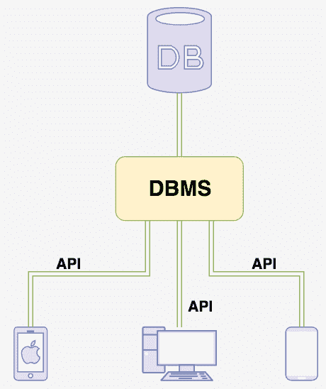

**数据库管理系统（DBMS**）有三个重要特性，这些特性包括数据、数据库引擎和数据库模式。数据是一系列信息的集合，数据库引擎允许数据被锁定、访问和修改，而数据库模式定义了数据库的逻辑结构。

**DBMS** 提供了一个通用的视图，说明多个用户可以从多个位置以受控的方式访问数据。它还限制了用户对用户数据的访问。数据库模式提供了用户如何查看数据的逻辑。**DBMS** 处理所有请求并在数据库上执行它们。

**DBMS** 提供了逻辑和物理数据独立性。这意味着应用程序可以使用 API 来利用数据库中的数据。此外，客户端和应用程序无需担心存储数据的地点以及数据物理结构的更改，如存储和硬件。

流行数据库模型及其管理系统包括以下内容：

+   **关系数据库管理系统（RDBMS**）

+   NoSQL DBMS

+   **内存数据库管理系统（IMDBMS**）

+   **列式数据库管理系统（CDBMS**）

+   基于云的数据管理系统

# Spring 中的数据访问

数据访问负责授权访问数据存储库。它有助于区分 *角色* 能力，如应用程序中的用户或管理员。它维护数据访问系统，如基于角色的插入、检索、更新或删除。在 第三章，*Spring 框架概述* 中，我们学习了 Spring 的架构。

下面是 Spring 架构的图示，其中 **数据访问** 是其中一层：


如您所见，**数据访问** 是 Spring 架构的层之一。这部分关注数据访问。**JDBC**、**ORM**、**OXM**、**JMS** 和 **事务** 模块是 Spring 中使用的模块。我们已在 第三章，*Spring 框架概述* 下的 Spring 架构主题中提到了这些细节。在本章中，我们将看到 **JDBC** 和 **ORM**（**JPA**、**Hibernate**）的使用。

# Spring 中的 Java 数据库连接

**Java 数据库连接**（**JDBC**）是一个连接和从前端到后端移动数据的 API 规范。类和接口是用 Java 编写的。如今，它也支持 Kotlin。我们将在本章中用 Kotlin 编写。这基本上充当了基于 Java 的应用程序和数据库之间的接口或桥梁。JDBC 与 **开放数据库连接**（**ODBC**）非常相似。像 ODBC 一样，JDBC 允许 JDBC 应用程序访问数据集合。

在 Spring 框架中，JDBC 被分为以下四个独立的包：

+   **核心**：这是 JDBC 的核心功能，`JdbcTemplate`、`SimpleJdbcInsert` 和 `SimpleJdbcCall` 是这个核心部分的重要类

+   **数据源**：用于访问数据源

+   **对象**：JDBC 可以以面向对象的方式访问。作为一个业务对象，它执行查询并返回结果

+   **支持**：支持类在核心和对象包下工作

# 使用 JDBC 创建示例项目

让我们通过一个项目来学习 JDBC，在这个项目中，我们将为用户创建 REST API 并显示用户详情列表。在这个项目中，我们将使用 JDBC、MySQL 和 Spring Boot。

要创建一个项目，请访问此链接：[`start.spring.io`](https://start.spring.io) 并创建一个基于 Kotlin 的项目。以下是 JDBC 的依赖项：

+   **JDBC**：这将实现与 JDBC 相关的所有功能

+   **MySQL**：这将实现 MySQL 数据库的所有功能

# Maven 依赖项

如果您转到 `pom.xml` 文件，您将看到 JDBC 的依赖项，我们使用 MySQL 作为数据源。以下是 `pom.xml` 文件的代码片段：

```kt
-----
-----
<!-- This is for JDBC use -->
<dependency>
   <groupId>org.springframework.boot</groupId>
   <artifactId>spring-boot-starter-jdbc</artifactId>
</dependency>
-----
-----

<!-- This is for use the MySQL -->
<dependency>
   <groupId>mysql</groupId>
   <artifactId>mysql-connector-java</artifactId>
   <scope>runtime</scope>
</dependency>
-----
-----
```

# 创建数据源

我们在 `application.properties` 中配置了 DataSource 和连接池。Spring Boot 使用 `spring.datasource` 接口作为前缀来配置 DataSource。我们的数据库模式名称是 `packtpub_dbtest_schema`。您可以自己创建它并重命名。以下是 `application.properties` 的详情：

```kt
# Database Configuration

spring.datasource.url=jdbc:mysql://localhost:3306/packtpub_dbtest_schema
spring.datasource.username=root
spring.datasource.password=12345678
```

根据前面的代码，`spring.datasource.url=jdbc:mysql://localhost:3306/packtpub_dbtest_schema` 表示访问项目中的数据时，名为 `packtpub_dbtest_schema` 的数据库模式的 URL。`spring.datasource.username=root` 表示数据库的用户名为 `root`，而 `spring.datasource.password=12345678` 表示数据库的密码为 `12345678`。

在我们的系统中，MySQL 的详情如下：

```kt
Host -- localhost                                    // the host URL
Port -- 3306                                         // the host POST number
Username -- root                                     // the username of the database
Password -- 12345678                                 // the password of the database
Database Name - packtpub_dbtest                      // the Database name
Database Schema Name - packtpub_dbtest_schema        // the Database Schema name
```

# 在数据库中创建表

前往 MySQL Workbench 并选择数据库。

我们为 `USERS` 表包含了一些用户详情。您可以将以下代码复制并粘贴以创建一个 `USERS` 表并插入一些示例数据：

```kt
create table users (id int not null auto_increment, name varchar(255), email varchar(255), contact_number varchar(255)
, primary key (id)) engine=MyISAM;
INSERT INTO user (id, name, email, contact_number) values (1, 'Sunnat', 'sunnat629@gmail.com', '1234567890');
INSERT INTO user (id, name, email, contact_number) values (2, 'Chaity', 'chaity123@gmail.com', '9876543210');
INSERT INTO user (id, name, email, contact_number) values (3, 'Mirza', 'mirza123@gmail.com', '1234567800');
INSERT INTO user (id, name, email, contact_number) values (4, 'Hasib', 'hasib123@gmail.com', '1234500800');
INSERT INTO user (id, name, email, contact_number) values (4, 'Jisan', 'jisan123@gmail.com', '1004500800');

```

在用户表中插入用户详情后，您可以在您的 `users` 表中看到内容，如下面的截图所示：

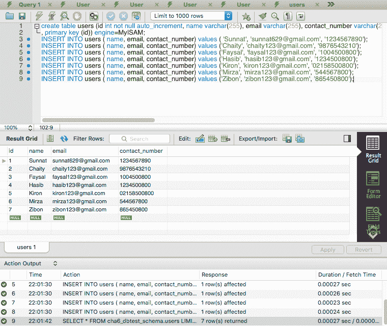

# 创建模型

在这个项目中，我们将创建一个 REST API 来查看用户详情列表，我们可以获取用户名、电子邮件 ID 和联系电话。因此，让我们创建一个用户模型；类的名称是 `UserModel.kt`。

下面是模型类的代码：

```kt
data class UserModel(val id: Int,
                     val name: String,
                     val email: String,
                     val contact_number: String)
```

我们已经创建了一个名为 `UserModel` 的类，其中我们初始化了 `id`、`name`、`email` 和 `contact_number`。

# 创建行映射器

`RowMapper` 是由 Spring JDBC 提供的一个接口。这个接口用于将一行数据映射到一个 Java 对象，并从数据库中获取数据。它使用 `JdbcTemplate` 类的 `query()` 函数。让我们创建一个名为 `UserRowMapper.kt` 的 `RowMapper` 接口。

下面是这个接口的代码：

```kt
class UserRowMapper : RowMapper<UserModel> {

    @Throws(SQLException::class)
    override fun mapRow(row: ResultSet, rowNumber: Int): UserModel? {
        return UserModel(row.getInt("id"),
                row.getString("name"),
                row.getString("email"),
                row.getString("contact_number"))
    }
}
```

在这段代码中，我们扩展了 `RowMapper<UserModel>` 并覆盖了 `mapRow` 方法，其中我们返回 `UserModel`。

# 创建 API 接口

为了获取 REST API 的响应，我们需要创建一个接口，在其中我们将说明我们想要对数据进行什么操作，例如获取用户列表、创建新用户或删除或更新用户详情。让我们创建一个名为 `UserInterface.kt` 的接口。

下面是这个接口的代码：

```kt
interface UserInterface {
    fun getAllUserList(): List<UserModel>
    fun getUserByID(id: Int): UserModel?
    fun addNewUser(userModel: UserModel)
    fun updateUser(userModel: UserModel)
    fun deleteUser(id: Int)
}
```

我们使用了五个函数，下面将逐一解释：

+   `getAllUserList()`: 这将返回所有用户详情的列表

+   `getUserByID(id: Int)`: 这将返回特定用户的详情

+   `addNewUser(userModel: UserModel)`: 这将添加新的用户详情

+   `updateUser(userModel: UserModel)`: 这将更新现有用户的详情

+   `deleteUser(id: Int)`: 这将删除特定用户

# 创建用户仓库

我们将在这个类中与数据库进行通信。这是一个仓库类，因此我们使用 `@Repository` 注解来标记这个类。让我们创建一个名为 `UserRepository.kt` 的仓库类，它实现了 `UsersInterface`。

下面是这个仓库类的代码：

```kt
@Repository
class UserRepository: UsersInterface {

    override fun getAllUserList(): List<UserModel> {
    }

    override fun getUserByID(id: Int): UserModel? {
    }

    override fun addNewUser(userModel: UserModel) {
    }

    override fun updateUser(userModel: UserModel) {
    }

    override fun deleteUser(id: Int) {
    }
}
```

我们已经创建了一个名为 `UserRepository` 的仓库类，其中我们实现了 `UsersInterface` 并覆盖了接口中的所有函数。我们使用 `@Repository` 注解使其成为一个仓库类。

我们将在下一节逐步完成这个类的创建。

# JdbcTemplate 实现

`JdbcTemplate` 是 JDBC 的核心。这是 JDBC 的中心类。SQL 查询由 `JdbcTemplate` 执行，它也获取结果。要使用这个 `JdbcTemplate`，我们需要在这个仓库类中自动装配 `JdbcTemplate`。下面是这个仓库类的代码片段：

```kt
@Repository
class UserRepository: UserInterface {

    @Autowired
    private lateinit var jdbcTemplate: JdbcTemplate
    ----
    ----
  }
```

# 创建 RESTful API 的 HTTP 方法

对于这个项目，我们将创建 **创建、读取、更新和删除** （**CRUD**） 操作。

# 创建

查找与创建操作相关的代码片段，其中我们将插入用户详情：

```kt
override fun addNewUser(userModel: UserModel) {
    val addQuery = "INSERT INTO users (name, email, contact_number) values (?,?,?)"
    jdbcTemplate.update(addQuery,userModel.name,userModel.email,userModel.contact_number)
}
```

`addQuery = "INSERT INTO users (name, email, contact_number) values (?,?,?)"` 是将用户插入 USER 表的查询。

`jdbcTemplate.update()` 是一个函数，我们使用查询和用户详情作为参数将其插入数据库。

# 读取

查找与读取操作相关的代码片段。以下函数将返回所有用户详情的列表：

```kt
override fun getAllUserList(): List<UserModel> {
    val selectAllSql = "SELECT * FROM users"
    return jdbcTemplate.query(selectAllSql, UserRowMapper())
}
```

`selectAllSql = "SELECT * FROM users"`是查询从用户表中获取所有用户的查询。`jdbcTemplate.query()`将执行查询并获取数据。

以下函数将根据`id`获取用户的详细信息：

```kt
override fun getUserByID(id: Int): UserModel? {
    val selectAllSql = "SELECT * FROM users WHERE id = ?"
    return jdbcTemplate.queryForObject(selectAllSql, UserRowMapper(), id)
}
```

`selectAllSql = "SELECT * FROM users WHERE id = ?"`是使用 ID 从用户表中获取用户的查询。`jdbcTemplate.queryForObject()`将执行查询并获取数据。

# 更新

查找更新操作的代码片段：

```kt
override fun updateUser(userModel: UserModel) {
    val updateQuery = "UPDATE users SET name=?,email=?, contact_number=? WHERE id=?"
    jdbcTemplate.update(updateQuery, userModel.name, userModel.email, userModel.contact_number, userModel.id)
}
```

`updateQuery = "UPDATE users SET name=?,email=?, contact_number=? WHERE id=?"`是使用 ID 从用户表中更新用户的查询。`jdbcTemplate.update()`将执行查询并更新数据。

# 删除

查找删除操作的代码片段：

```kt
override fun deleteUser(id: Int) {
    val deleteQuery = "DELETE FROM users WHERE id=?"
    jdbcTemplate.update(deleteQuery, id)
}
```

`deleteQuery = "DELETE FROM users WHERE id=?"`是使用 ID 从用户表中更新用户的查询。`jdbcTemplate.update()`将执行查询并删除特定数据。

通过这些函数，我们已经完成了我们的仓库类。

# 创建服务

在创建仓库类之后，让我们创建一个服务类，在这个类中我们将使用`@autowired`注解来自动装配仓库类。让我们创建一个名为`UserService.kt`的服务类，并使用`@Service`注解，它实现了`UserInterface`并覆盖了所有函数。

这是`UserService.kt`的代码片段**：

```kt
@Service
class UserService: UsersInterface {

    @Autowired
 private lateinit var userRepository: UserRepository

    ------
    ------
}
```

让我们借助`UserRepository`来覆盖和修改函数。以下是`UserService`类的完整代码：

```kt
@Service
class UserService: UsersInterface {
    @Autowired
    private lateinit var userRepository: UserRepository

    override fun getAllUserList(): List<UserModel> {
        return userRepository.getAllUserList()
    }

    override fun getUserByID(id: Int): UserModel? {
        return userRepository.getUserByID(id)
    }

    override fun addNewUser(userModel: UserModel) {
        userRepository.addNewUser(userModel)
    }

    override fun updateUser(userModel: UserModel, id: Int) {
        userRepository.updateUser(userModel, id)
    }

    override fun deleteUser(id: Int) {
        userRepository.deleteUser(id)
    }
}
```

+   `getAllUserList()`: 这个函数将获取所有用户

+   `getUserByID(id: Int)`: 这个函数将根据 ID 获取用户

+   `addNewUser(userModel: UserModel)`: 这个函数将插入一个新用户

+   `updateUser(userModel: UserModel, id: Int)`: 这个函数将根据 ID 更新用户

+   `deleteUser(id: Int)`: 这个函数将根据 ID 删除用户

# 创建控制器

如果你的模型、仓库和服务类都已完成，那么你就可以创建控制器类了，在这个类中我们将创建`GetMapping`、`PostMapping`、`PutMapping`和`DeleteMapping`来创建 RESTful API URL 路径。让我们使用`@RestController`注解创建一个名为`UserController.kt`的控制器类：

```kt
@RestController
class UserController {
    ----
    ----
}
```

# 自动装配服务

让我们使用`@Autowired`注解来自动装配`UserService`。以下是`UserController`类的代码片段：

```kt
 @Autowired
 private lateinit var userService: UserService
```

# 获取用户列表

查找`getAllUsers()`操作的代码片段：

```kt
//    Getting the User List
@GetMapping(path = ["/users"])
fun getAllUsers(): ResponseEntity<List<UserModel>> {
    return ResponseEntity(userService.getAllUserList(),
            HttpStatus.OK)
}
```

`@GetMapping(path = ["/users"])`注解是`/users`的 URL 路径，它是一个`GET`请求函数。在这里，我们将从数据库中获取用户列表。

# 根据 ID 获取一个用户

查找`getAllUserByID()`操作的代码片段：

```kt
//    Getting one User by ID
@GetMapping(path = ["/user/{id}"])
fun getAllUserByID(@PathVariable("id") id: Int): ResponseEntity<UserModel> {
    return ResponseEntity(userService.getUserByID(id),
            HttpStatus.OK)
}
```

`@GetMapping(path = ["/user/{id}"])`注解是`"/user/{id}"`的 URL 路径，它是一个带有特定 ID 的`GET`请求。在这里，我们将从数据库中获取特定用户的详细信息。

# 插入新用户

查找`addNewUser()`操作的代码片段：

```kt
//    Inserting new User
@PostMapping(path = ["/user/new"])
fun addNewUser(@RequestBody userModel: UserModel): String {
    ResponseEntity(userService.addNewUser(userModel), HttpStatus.CREATED)
    return "${userModel.name} has been added to database"
}
```

`@PostMapping(path = ["/user/new"])`注解是`"/user/new"`的 URL 路径，它是一个`POST`请求。在这里，我们可以将用户详细信息插入到数据库中。

这里，`@RequestBody`是 Spring MVC 框架的一个注解。它在控制器中用于实现对象序列化和反序列化。它通过提取逻辑来帮助您避免样板代码。`@RequestBody`注解的函数返回一个与 HTTP 网络响应体绑定的值。这里的对象是`UserModel`。

# 更新用户

查找`updateUser()`操作的代码片段：

```kt
//    Updating a User
@PutMapping(path = ["/user/{id}"])
fun updateUser(@RequestBody userModel: UserModel, @PathVariable("id") id: Int): ResponseEntity<UserModel> {
    userService.updateUser(userModel, id)
    return ResponseEntity(userModel, HttpStatus.OK)
}
```

`@PutMapping(path = ["/user/{id}"])`注解是`"/user/{id}"`的 URL 路径，它是一个具有特定 ID 的`PUT`请求。在这里，我们将更新数据库中的特定用户详细信息。

# 删除用户

查找`deleteUser()`操作的代码片段：

```kt
//    Deleting a User
@DeleteMapping(path = ["/user/{id}"])
fun deleteUser(@PathVariable("id") id: Int): String {
    userService.deleteUser(id)
    return "$id User has been deleted."
}
```

`@DeleteMapping(path = ["/user/{id}"])`注解是`"/user/{id}"`的 URL 路径，它是一个具有特定 ID 的删除请求。在这里，我们将从数据库中删除特定的用户详细信息。

如果您完成这个控制器类，那么您就可以运行这个应用程序并使用 Insomnia 测试 REST API 了。

# 测试输出

让我们*运行*项目。如果项目没有遇到错误，那么您将能够在 IDE 中看到 RUN 标签，如下截图所示：

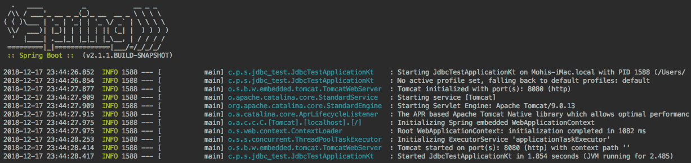

现在，打开 Insomnia 应用程序。让我们在这个应用程序中应用 REST API 请求。

# 获取用户列表

使用此`GET`请求与此 URL：`http://localhost:8080/users`，然后点击发送。用户详细信息将从数据库中检索，您可以看到返回的 JSON 值，如下截图所示：

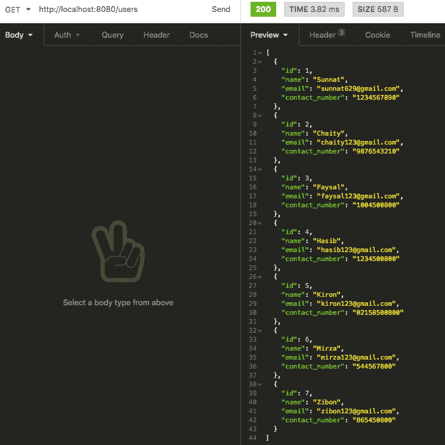

# 通过 ID 获取一个用户

使用此 URL：`http://localhost:8080/user/1`创建一个`GET`函数并点击发送。用户详细信息将从数据库中检索，您可以看到具有`id`为`1`的用户返回的 JSON 值，如下截图所示：

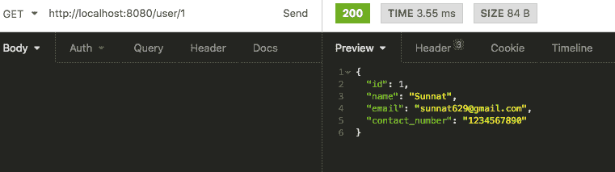

# 插入新用户

使用此 URL：`http://localhost:8080/user/new`创建一个`POST`函数并点击发送。这将向数据库中插入一个用户并显示新的用户详细信息，如下截图所示：

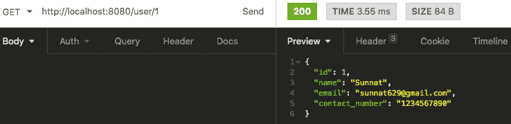

如果您使用`/users`的`GET`请求 URL 路径，您可以检查包含新用户的用户列表：

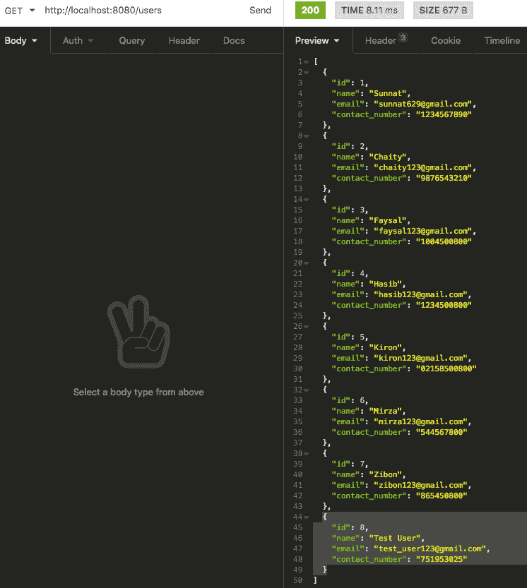

# 更新用户

使用此 URL：`http://localhost:8080/user/8`创建一个`UPDATE`函数并点击发送。它将更新数据库中具有编号八的用户，并显示更新的用户信息，如下截图所示：

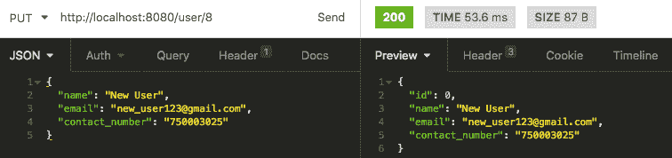

如果您使用`http://localhost:8080/user/8`的`GET`请求 URL 路径，您可以检查具有新详细信息的新的用户，如下截图所示：

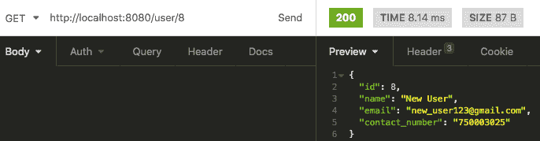

# 删除用户

使用此 URL 创建一个`DELETE`函数：`http://localhost:8080/users`，然后点击发送。这将从数据库中删除特定的用户，如下面的截图所示：

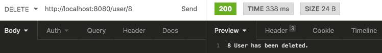

如果你检查所有用户，那么你会看到只有七个。

最后，我们已经创建了一个使用 JDBC 的应用程序，我们还创建了一个 REST API。如果您有任何更新，可以查看我们的 GitHub 项目。我还添加了一个包含 MySQL 代码的 SQL 文件。

# Java 持久化 API

**Java 持久化 API**（**JPA**）是**对象关系映射**（**ORM**）的一种方法。ORM 是一个将 Java 对象映射到数据库、表以及反向映射的系统。JPA 可以用于基于 Java 企业版和标准版的两种应用。Hibernate、TopLink、EclipseLink 和 Apache OpenJPA 是 JPA 的实现。在这些实现中，Hibernate 是最先进且最广泛使用的。

JPA 帮助开发者直接与对象工作，因此无需担心 SQL 语句。借助 JPA，他们可以将数据从关系数据库映射、存储、更新和检索到 Java 对象或反之亦然。

JPA 元数据主要由类中的注解定义。然而，它也支持 XML，这意味着它可以通过 XML 定义。在这本书中，我们将使用注解来定义 JPA 元数据。现在，我们将看到 JPA 的架构及其用途。

# JPA 架构

以下图表显示了 JPA 的类级别架构：

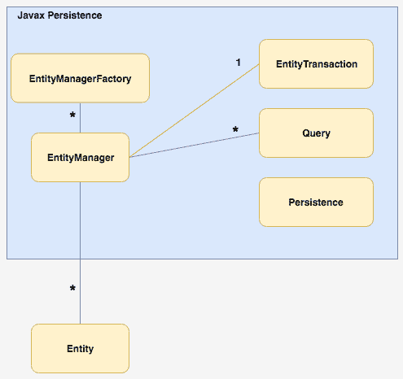

让我们描述一下这个图表：

+   `EntityManagerFactory`：`EntityManager`的工厂类，用于创建和管理多个`EntityManager`实例。

+   `EntityManager`：这是一个接口，用于管理对象上的持久化操作。

+   `Entity`：这是一个以记录形式存储在数据库中的持久化对象

+   `EntityTransaction`：它与`EntityManager`有一个一对一的关系。对于每个`EntityManager`，操作都由`EntityTransaction`类维护。

+   `Query`：这是一个接口，每个 JPA 供应商都通过它来实现使用标准来获取关系对象。

+   `Persistence`：这是一个类。要获取`EntityManagerFactory`实例，它包含静态方法。

如果你再次查看图表，可能会注意到属于`javax.presistence`包的类和接口之间存在某种关系：

+   在`EntityManagerFactory`和`EntityManager`之间有一个一对多关系

+   在`EntityManager`和`EntityTransaction`之间有一个一对一关系

+   在`EntityManager`和`Query`之间有一个一对多关系

+   在`EntityManager`和`Entity`之间有一个一对多关系

# 使用 JPA 创建项目

让我们使用 Spring Boot 和 JPA，以及 Hibernate 和 MySQL 创建一个简单的项目。我们将构建一个用户列表的 RESTful CRUD API。

要创建一个项目，请访问此链接：[`start.spring.io`](https://start.spring.io)并创建一个基于 Kotlin 的项目。

# Maven 依赖

如果你访问`pom.xml`文件，你可以在那里看到 JDBC 的依赖项。我们正在使用 MySQL 作为数据库：

```kt
-----
-----
<dependency>
    <groupId>org.springframework.boot</groupId>
    <artifactId>spring-boot-starter-data-jpa</artifactId>
</dependency>

<dependency>
    <groupId>org.springframework.boot</groupId>
    <artifactId>spring-boot-starter-web</artifactId>
</dependency>

<dependency>
    <groupId>com.h2database</groupId>
    <artifactId>h2</artifactId>
    <scope>runtime</scope>
</dependency>

<dependency>
    <groupId>mysql</groupId>
    <artifactId>mysql-connector-java</artifactId>
    <scope>runtime</scope>
</dependency>
-----
-----
```

根据这段代码，以下是依赖项：

+   Web

+   JPA

+   MySQL

+   H2

在这里，我们看到了一个新的依赖项名称`h2`。这是众所周知的一种内存数据库。Spring Boot 和 H2 之间有着很好的组合。

# 创建数据源

我们在`application.properties`中配置了`DataSource`和`connection pool`。Spring Boot 使用`spring.datasource`接口作为前缀来配置 DataSource。我们的数据库模式名称是`cha6_dbtest_schema`。你可以自己创建它并重命名。以下是`application.properties`的详细信息：

```kt
## Spring DATASOURCE (DataSourceAutoConfiguration & DataSourceProperties)
spring.datasource.url = jdbc:mysql://localhost:3306/cha6_dbtest_schema?useSSL=false
spring.datasource.username = root
spring.datasource.password = 12345678

## Hibernate Properties
# The SQL dialect makes Hibernate generate better SQL for the chosen database spring.jpa.properties.hibernate.dialect = org.hibernate.dialect.MySQL5Dialect

# Hibernate ddl auto (create, create-drop, validate, update) spring.jpa.hibernate.ddl-auto = update
```

在我们的系统中，MySQL 的详细信息如下：

+   `Host -- localhost`

+   `Port -- 3306`

+   `Username -- rootPassword -- 12345678`

+   `Database Name - packtpub_dbtest`

+   `Database Schema Name - packtpub_dbtest_schema`

# 创建一个模型

在这个项目中，我们将创建一个 REST API 来查看用户详情列表，我们可以获取用户名、电子邮件 ID 和联系电话。所以让我们创建一个用户模型，类名为`UserModel.kt`。

这里是模型类的代码：

```kt
@Entity
@Table(name="user_jpa")
@EntityListeners(AuditingEntityListener::class)
data class UserModel(
    @Id
    @GeneratedValue(strategy = GenerationType.IDENTITY)
    @Column(name = "id")
    var id: Long = 0,

    @NotBlank
    @Column(name = "name")
    var name: String ?= null,

    @NotBlank
    @Column(name = "email")
    var email: String ?= null,

    @NotBlank
    @Column(name = "contact_number")
    var contact_number: String ?= null
)
```

在这里，我们的`UserModel`类有以下字段：

+   `id`：具有自增的主键

+   `name`:  (非空字段)

+   `email`: (非空字段)

+   `contact_number`: (非空字段)

与 JDBC 不同，你不需要在数据库中手动创建任何表。JPA 将使用`UserModel`创建一个表。让我们看看如何使用这个`UserModel`对象在我们的数据库中创建一个表：

+   `@Entity`：所有你的领域模型都必须使用这个注解。这个注解用于标记类为一个持久的 Java 类。

+   `@Table`：这个注解用于提供表的详细信息。实体将通过它进行映射。

+   `@Id`：这个注解用于定义主键。

+   `@GeneratedValue`：这个注解用于定义主键生成策略。在前面的例子中，我们已经声明主键为一个自增字段。

+   `@NotBlank`：这个注解用于验证被注解的字段不为空或为空字符串。

+   `@Column`：这个注解用于验证将被映射到被注解字段上的列的属性。

# 创建用户仓库

我们将在这个仓库类中与数据库进行通信。这是一个`Repository`类，因此我们使用`@Repository`注解它。让我们创建一个名为`UserRepository.kt`的`Repository`类，它扩展了`JpaRepository`。通过扩展`JpaRepository`，这个接口将获得一组通用的 CRUD 函数来创建、更新、删除和获取数据。

这里是`Repository`类的代码：

```kt
@Repository
interface UserRepository: JpaRepository<UserModel, Long>
```

从这个`JPARepository`中，我们将获得以下一些函数：

+   `List<T> findAll()`: 获取所有数据

+   `List<T> findAll(Sort var1)`：用于获取排序后的所有数据。

+   `List<T> findAllById(Iterable<ID> var1)`: 通过 ID 获取数据

+   `<S extends T> List<S> saveAll(Iterable<S> var1)`: 使用数据列表插入数据

# 创建控制器

如果您的模型和仓库类已经完整，那么您就可以创建控制器类了，我们将创建 `GetMapping`、`PostMapping`、`PutMapping` 和 `DeleteMapping` 来创建 *RESTful API URL* 路径。让我们使用 `@RestController` 注解创建一个名为 `UserController.kt` 的控制器类：

```kt
@RestController
class UserController {
    ----
    ----
}
```

# 自动装配仓库

让我们使用 `@Autowired` 注解自动装配 `UserRepository`。以下是这个类的代码片段：

```kt
@RestController
class UserController {

    @Autowired
 private lateinit var userRepository: UserRepository

    ----
    ----
}
```

# 获取用户列表

查找 `getAllUsers()` 操作的代码片段：

```kt
// to get all the users details
 @GetMapping("/users")
    fun getAllUsers(): List<UserModel>{
        return userRepository.findAll()
    }
```

`@GetMapping(path = ["/users"])` 注解表示它用于 `GET` 请求。在这里，我们将使用 `UserRepository` 接口的 `findAll()` 方法从数据库获取用户列表，该接口实现了 `JpaRepository`。因此，我们不需要创建一个 *自定义接口*，与 *JDBC* 不同。

# 通过 ID 获取一个用户

查找 `getAllUserByID()` 操作的代码片段如下：

```kt
 // to get one specific user details
 @GetMapping("/user/{id}")
    fun getUser(@PathVariable(name = "id") id: Long): UserModel {
        return userRepository.findById(id).get()
    }
```

`@GetMapping(path = ["/user/{id}"])` 注解是 URL 路径 `"/user/{id}"`，它是一个具有特定 ID 的 `GET` 请求。在这里，我们返回 `findById(id).get()` 以从数据库获取特定用户详细信息。

# 插入新用户

查找 `addNewUser()` 操作的代码片段如下：

```kt
// to add a user
@PostMapping("/users")
fun addUser(@Valid @RequestBody userModel: UserModel): UserModel {
    return userRepository.save(userModel)
}
```

`@PostMapping(path = ["/user/"])` 注解是 URL 路径 `"/user/"`，它是一个 `POST` 请求。在这里，我们输入用户详细信息以将用户数据插入数据库。

为了将请求体绑定到方法参数，我们使用 `@RequestBody` 注解。

`@Valid` 注解确保请求体有效且非空。

在这里，我们返回 `save(userModel)` 以将新用户详细信息插入数据库。

# 更新用户

查找 `updateUser()` 操作的代码片段：

```kt
 // to update a user
    @PutMapping("/user/{id}")
    fun updateUser(@PathVariable(name = "id")id: Long, @Valid @RequestBody userDetails: UserModel): UserModel {
        val currentUser: UserModel = userRepository.findById(id).get()

        currentUser.name = userDetails.name
        currentUser.email = userDetails.email
        currentUser.contact_number = userDetails.contact_number

        return userRepository.save(currentUser)
    }
```

`@PutMapping("/user/{id}")` 注解是 URL 路径 `"/user/{id}"`，它是一个具有特定 ID 的 `PUT` 请求。在这里，我们将更新数据库中的特定用户详细信息。

# 删除用户

查找 `deleteUser()` 操作的代码片段如下：

```kt
// to delete a user
 @DeleteMapping("/user/{id}")
    fun deleteUser(@PathVariable(name = "id")id: Long): ResponseEntity<*>{
        userRepository.delete(userRepository.findById(id).get())
        return ResponseEntity.ok().build<Any>()
    }
```

`@DeleteMapping("/user/{id}")` 注解是 URL 路径 `"/user/{id}"`，它是一个具有特定 ID 的 `DELETE` 请求。在这里，我们将从数据库中删除特定用户详细信息。

如果您完成了这个控制器类，那么您就可以运行这个应用程序并使用 *Insomnia* 测试 *REST API*。

# 查看输出

在运行项目之前，请转到 MySQL Workbench 应用程序，`cha6_dbtest` 表和 `cha6_dbtest_schema`。在那里，您将注意到将没有名为 `user_jpa` 的表，正如在 `UserModel` 类中提到的表名。

这是没有表的架构截图：

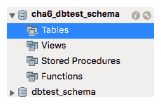

让我们运行应用程序，再次检查数据库，并*刷新*模式。注意现在有一个表格，正如我们在`UserModel`的`@Table`注解中提到的。这个表格包含该对象的所有列，包括`id`、`name`、`email`和`contact_number`。

这是更新后的数据库截图：

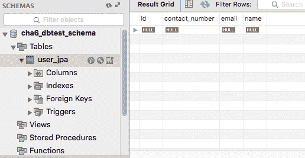

测试系统与 JDBC 相同。请自行检查，如果您感到困惑，请访问`Testing the Output of JDBC`项目。

这是本项目的 REST API URL：

+   `GET http://localhost:8080/users`: 获取所有用户的列表

+   `GET http://localhost:8080/user/1`: 获取特定用户详细信息

+   `POST http://localhost:8080/user/new`: 插入新用户

+   `PUT http://localhost:8080/user/1`: 更新特定用户详细信息

+   `DELETE http://localhost:8080/user/2`: 删除特定用户详细信息

# 客户端应用程序数据库

到目前为止，你已经了解了服务器端数据库。现在我们将了解客户端数据库。Android 应用程序将是我们的客户端应用程序。Android 的需求现在正在迅速增长，并且已经超过了基于 PC 的操作系统。即使在当今，硬件也比 PC 或笔记本电脑更强大。

数据库是智能设备的核心部分，它是存储和管理设备上数据的最佳方式。这些数据可以有两种处理方式。一种方式是基于在线的，这意味着所有数据都由服务器端或云处理，而移动设备通过网络与他们通信。没有互联网连接，这个系统几乎毫无用处。第二种选择是将所有数据存储在本地数据库中。这意味着它可以在离线状态下使用，并且对互联网的依赖性也更小。

移动数据库有一些标准：

+   轻量级和快速

+   安全

+   独立于在线服务器

+   使用代码易于处理

+   可以公开或私下共享

+   低功耗和低内存

市场上有很多移动数据库，但满足这些标准的数据库却很少。*SQLite*、*Realm* DB 和*ORMLite*是其中的一些。

在这本书的整个过程中，我们将使用 SQLite 数据库。然而，我们不会使用原始的 SQLite。相反，我们将使用一个名为**room 持久化库**的库，它是架构组件的一部分。它为 SQLite 提供了一个抽象层。这允许更健壮的数据库访问，并有助于编写更少的代码。

# 架构组件

**架构组件**是 Android Jetpack 的组件之一。这是一份关于应用程序架构的指南。该组件基于一些库以更简单的方式执行常见任务。借助该组件，开发者可以开发他们的项目，这些项目可以更健壮、可维护和可测试。

今天我们将创建一个 Android 离线应用程序，我们将使用 Android 组件。

这是此架构的图示：

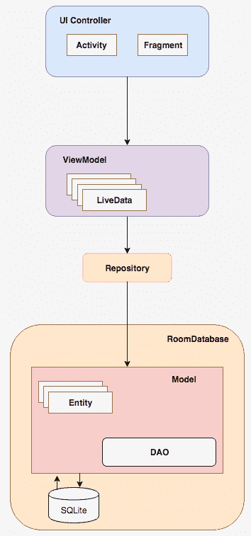

以下是对所有组件的简要描述：

+   `UI 控制器`：活动、片段等 UI 组件位于此组件下。

+   `ViewModel`：这个通过模型获取数据，并将其提供给 UI。

+   `LiveData`：这个类持有可观察的数据。这是生命周期感知的，与常规的可观察数据不同。

+   `Repository`：这个用于管理多个数据源。

+   `Room 数据库`：这是顶层数据库层，来自 SQLite 数据库。

+   `Entity`：这描述了一个数据库表。

+   `DAO`：全称是**数据访问对象**（**DAO**），它映射 SQL 查询。

+   `SQLite 数据库`：数据使用此在设备中存储。它由 room 创建和维护。

# 创建 Android 应用

让我们创建一个简单的具有数据库的 Android 应用。这将存储用户的详细信息（包括姓名、联系电话和电子邮件 ID），并使用`RecyclerView`在列表中显示这些详细信息：

首先，我们需要使用 Android Studio 创建一个应用，写下你的项目名称和公司域名。别忘了勾选“包含 Kotlin 支持”，使其成为一个基于 Kotlin 的应用。以下截图显示了“创建 Android 项目”窗口：

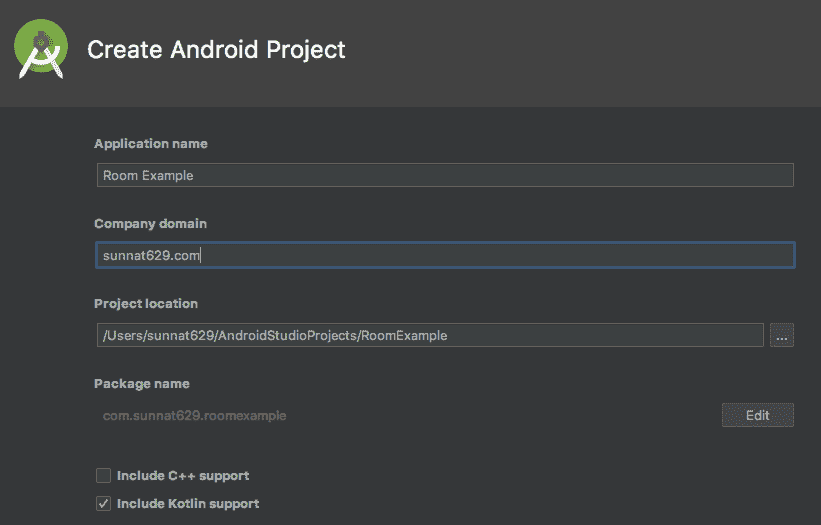

现在从“手机和平板”选项中选择最低 API 版本。此项目不需要添加其他选项。在点击“添加活动到移动”中的“下一步”后，你可以选择“基本活动”，然后重命名**活动名称**和**布局**，点击“完成”。在构建项目后，你将准备好开始创建 Android 应用。

这是“添加活动到移动”窗口的截图，我们选择基本活动模板，如下截图所示：

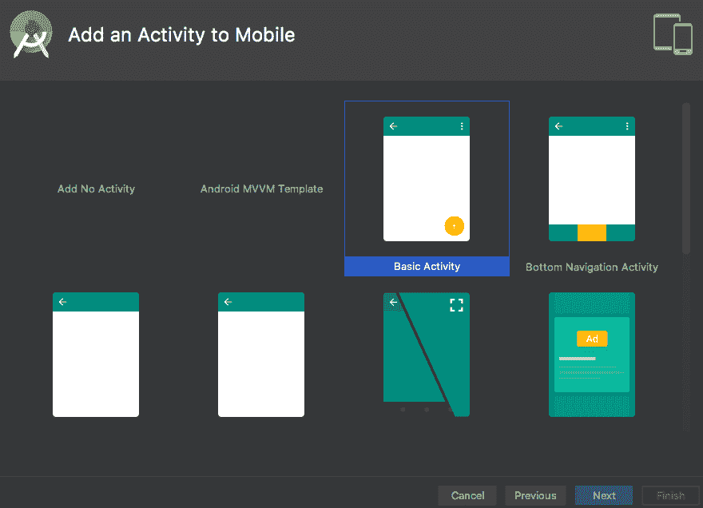

此项目的最终文件如下截图所示，其中显示了完成此项目后所有文件和资源：

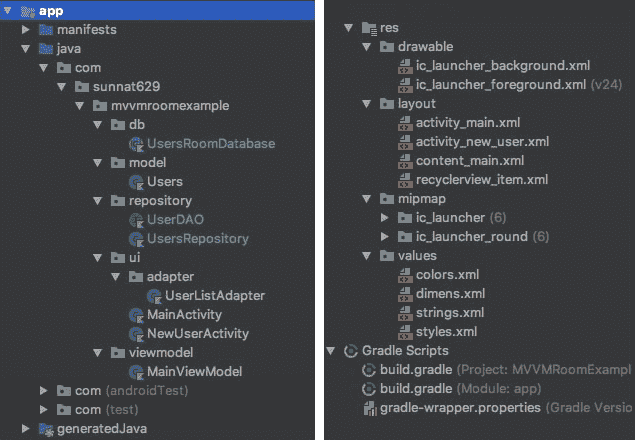

# Gradle 信息

这里是我的 Android Studio 的 Gradle 文件详情：

```kt
buildscript {
   -----
-----
    dependencies {
 classpath 'com.android.tools.build:gradle:3.2.1'
 classpath "org.jetbrains.kotlin:kotlin-gradle-plugin:1.3.10"

    }
}
-----
-----
```

此文件注入了 Gradle 和 Kotlin 的依赖项。在此项目中，Gradle 版本是 3.2.1，Kotlin 版本是 1.3.10

# Gradle 依赖项

此 Gradle 文件是用于应用的。它包含所有依赖项和其他 Android SDK 版本。

在以下代码块中的依赖项中是以下代码：

```kt
      // Room components
    implementation "android.arch.persistence.room:runtime:$rootProject.roomVersion"
    kapt "android.arch.persistence.room:compiler:$rootProject.roomVersion"
    androidTestImplementation "android.arch.persistence.room:testing:$rootProject.roomVersion"

    // Lifecycle components
    implementation "android.arch.lifecycle:extensions:$rootProject.archLifecycleVersion"
    kapt "android.arch.lifecycle:compiler:$rootProject.archLifecycleVersion"

    // Coroutines
    api "org.jetbrains.kotlinx:kotlinx-coroutines-core:$rootProject.coroutines"
    api "org.jetbrains.kotlinx:kotlinx-coroutines-android:$rootProject.coroutines"
```

要启用协程功能，请在应用的 `build.gradle` 文件末尾添加以下代码：

```kt
kotlin {
    experimental {
 coroutines "enable"    }
}
```

# 创建实体

让我们创建一个名为`UserModel.kt`的用户类，并使用`@Entity`注解，以便每个用户都是一个实体。所有变量列不应是私有的，这样`Room`就能实例化你的对象：

```kt
@Entity(tableName = "users")
class Users(): Parcelable {
    @PrimaryKey(autoGenerate = true)
    @NonNull
    @ColumnInfo(name = "userId")
    var userId: Int = 0

    @NonNull
    @ColumnInfo(name = "username")
    lateinit var username: String

    @NonNull
    @ColumnInfo(name = "email")
    lateinit var email: String

    @NonNull
    @ColumnInfo(name = "contactNumber")
    lateinit var contactNumber: String

   @NonNull
    @ColumnInfo(name = "address")
    lateinit var address: String

    constructor(username: String, email: String, contactNumber: String, address: String):this(){
        this.username = username
        this.email = email
        this.contactNumber = contactNumber
        this.address = address
    }

    override fun toString(): String {
        return "Users(username='$username', email='$email', contactNumber='$contactNumber', address='$address')"
    }
}
```

让我们看看这个类中有什么：

+   `@Entity(tableName = "users")`：一个实体类代表一个表，我们的表名是`users`

+   `@ColumnInfo(name = "**")`：这指定了表中的名称

+   `@PrimaryKey(autoGenerate = true)`: 这意味着`ID`是我们的主键，并且它的值将自动增加。

+   `@NonNull`: 这意味着列中不会有 null 或空值。

为了将此对象从一个活动传递到另一个活动，我们需要将此类转换为`Parcelable`类。所以让我们扩展这个类。按照传统方式，它将需要像以下这样的大量代码：

```kt
@Entity(tableName = "users")
class Users(): Parcelable {
    ----
    ----
    constructor(parcel: Parcel) : this() {
        userId = parcel.readInt()
        username = parcel.readString()!!
        email = parcel.readString()!!
        contactNumber = parcel.readString()!!
        address = parcel.readString()!!
    }
    ----
    ----
    override fun writeToParcel(parcel: Parcel, flags: Int) {
        parcel.writeInt(userId)
        parcel.writeString(username)
        parcel.writeString(email)
        parcel.writeString(contactNumber)
        parcel.writeString(address)
    }

    override fun describeContents(): Int {
        return 0
    }

    companion object CREATOR : Parcelable.Creator<Users> {
        override fun createFromParcel(parcel: Parcel): Users {
            return Users(parcel)
        }

 override fun newArray(size: Int): Array<Users?> {
            return arrayOfNulls(size)
        }
    }
}
```

因此，虽然我们不需要修改重写的函数和构造函数，但理解和处理它确实很复杂。然而，如果你省略这些行，当然你会很高兴，你的代码看起来也会很漂亮。为此，我们需要应用懒人编码者的方式。

我们只需要在模型类顶部添加一个名为`@Parcelize`的注解。以下是完整的代码：

```kt
@Parcelize
@Entity(tableName = "users")
class Users(): Parcelable {
    @PrimaryKey(autoGenerate = true)
    @NonNull
    @ColumnInfo(name = "userId")
    var userId: Int = 0

    @NonNull
    @ColumnInfo(name = "username")
    lateinit var username: String

    @NonNull
    @ColumnInfo(name = "email")
    lateinit var email: String

    @NonNull
    @ColumnInfo(name = "contactNumber")
    lateinit var contactNumber: String

   @NonNull
    @ColumnInfo(name = "address")
    lateinit var address: String

    constructor(username: String, email: String, contactNumber: String, address: String):this(){
        this.username = username
        this.email = email
        this.contactNumber = contactNumber
        this.address = address
    }

    override fun toString(): String {
        return "Users(username='$username', email='$email', contactNumber='$contactNumber', address='$address')"
    }
}
```

因此，没有更多的额外代码。为了启用此功能，你需要在`build.gradle (Module: app)`文件的`android`块中添加以下代码：

```kt
android {
    ----
    ----
    androidExtensions {
        experimental = true
    }
}
dependencies {
    ----
    ----
}
```

# 创建 DAO

让我们创建一个名为`UserDAO.kt`的接口，并使用`@DAO`注解。这将帮助`Room`识别`DAO`类。以下是`DAO`接口的代码：

```kt
@Dao
interface UserDAO
```

在此接口中，我们将创建负责插入、删除和获取用户详情的函数：

```kt
@Insert
fun addNewUser(users: Users)
```

在前面的代码中，`@Insert`用于插入一个用户：

```kt
@Query("DELETE FROM USERS")
fun deleteAllUsers()
```

在前面的代码中，`@Query("DELETE FROM USERS")`用于从`USERS`表中删除所有用户：

```kt
@Query("SELECT * FROM USERS")
fun getAllUsers():  List<Users>
```

在此代码中，`@Query("SELECT * FROM USERS")`用于从`USERS`表中获取所有用户作为列表。

# 创建 LiveData 类

数据总是动态变化的，因此我们必须保持其更新并显示最新的结果给用户。为此，我们需要观察数据。`LiveData`是一个生命周期库类，可以观察数据并做出反应。

让我们将`UserDao.kt`中的`getAllUsers()`函数用`LiveData`包装：

```kt
@Query("SELECT * FROM USERS")
fun getAllUsers():  LiveData<List<Users>>
```

`@Query("SELECT * FROM USERS")`用于从`USERS`表中获取所有信息。

因此，这里是 DAO 接口的完整代码：

```kt
@Dao
interface UserDAO {

    @Insert(onConflict = OnConflictStrategy.REPLACE)
    fun addNewUser(users: Users)

    @Query("DELETE FROM USERS")
    fun deleteAllUsers()

    @Query("SELECT * FROM USERS")
    fun getAllUsers():  LiveData<List<Users>>
}
```

在`MainActivity`中，我们将看到如何创建数据的`Observer`并重写观察者的`onChanged()`函数。

# 创建 Room 数据库

`Room`不是一个数据库，而是`SQLite`数据库的一层。它主要使用`DAO`和查询来简化客户端对数据库的获取。它不在主线程上使用，而是在后台线程上异步运行，因此 UI 性能不会下降。

让我们创建一个名为`UsersRoomDatabase`的抽象类并扩展`RoomDatabase`。使用`@Database`注解并指定`Users`类作为实体，并添加版本号。最后，初始化`UserDao`类的抽象函数：

```kt
@Database(entities = [Users::class], version = 1)
abstract class UsersRoomDatabase : RoomDatabase() {
    abstract fun userDAO(): UserDAO
----
----
}
```

让我们创建一个单例。这将处理在同时打开时数据库的多个实例。

初始化`UsersRoomDatabase`对象。

`UsersRoomDatabase`的名称是`"user_database"`。

这是这个对象的代码片段：

```kt
// static members
companion object {
    @Volatile
    private var INSTANCE: UsersRoomDatabase? = null

    fun getDatabase(context: Context, scope: CoroutineScope): UsersRoomDatabase {
        val tempInstance = INSTANCE
        if (tempInstance != null) {
            return tempInstance
        }
        synchronized(this) {
            val instance = Room.databaseBuilder(
                context.applicationContext,
                UsersRoomDatabase::class.java,
                "user_database"
            ).addCallback(UserDatabaseCallback(scope))
                .build()
            INSTANCE = instance
            return instance
        }
    }
}
```

# 填充数据库

要在数据库中存储数据，我们可以通过使用用户的代码输入一些示例数据。其余的数据将通过使用`NewUserActivity.kt`类来存储。

对于示例数据，我们创建了一个简单的函数，其中插入两个示例用户详情，并在运行应用程序后显示。

要做到这一点，让我们创建一个带有`CoroutineScope`参数的内部回调`UserDatabaseCallback()`并扩展`RoomDatabase.Callback()`。最后，我们将重写`onOpen(db: SupportSQLiteDatabase)`，在那里我们可以添加两个随机的用户对象：

```kt
fun populateDatabase(userDao: UserDAO) {
            userDao.addNewUser(
                Users(
                    "Sunnat", "sunnat629@gmail.com",
                    "1234567890", "Dhaka"
                )
            )
            userDao.addNewUser(
                Users(
                    "Chaity", "chaity123@gmail.com",
                    "54321987", "Dhaka"
                )
            )
        }
```

这里我们使用`userDao.addNewUser()`创建了用户详情。如果运行应用程序，这些用户详情将显示在列表视图中。

最后，我们需要将回调函数添加到数据库中，并调用`build()`来完成这个回调，就像以下代码所示：

```kt
fun getDatabase(context: Context, scope: CoroutineScope): UsersRoomDatabase {
    val tempInstance = INSTANCE
    if (tempInstance != null) {
        return tempInstance
    }
    synchronized(this) {
        val instance = Room.databaseBuilder(
            context.applicationContext,
            UsersRoomDatabase::class.java,
            "user_database"
        ).addCallback(UserDatabaseCallback(scope))
 .build()
        INSTANCE = instance
        return instance
    }
}

private class UserDatabaseCallback(
 private val scope: CoroutineScope
) : RoomDatabase.Callback() {

 override fun onOpen(db: SupportSQLiteDatabase) {
 super.onOpen(db)
 INSTANCE?.let { database ->
 scope.launch(Dispatchers.IO) {
 populateDatabase(database.userDAO())
 }
 }
 }
----
----
}
```

在前面的代码中，我们创建了一个名为`UserDatabaseCallback`的回调类，我们使用名为`userDAO()`的`DAO`函数来填充数据库。

然后我们使用`addCallback()`将这个回调添加到`getDatabase()`函数的`instance`中。

# 实现仓库

仓库类是`Room`数据库和`ViewModel`之间的桥梁。这提供了来自多个数据源的数据，并隔离了数据层。

我们可以将这个仓库分为两个部分；一个是 DAO，主要用于本地数据库以及将本地数据库与应用程序连接起来。另一个部分是网络，主要用于处理和云与应用程序之间的通信。

现在创建一个名为`UsersRepository.kt`的仓库类，并将`UserDAO`声明为这个类的构造函数。

这里是`UsersRepository.kt`的代码：

```kt
class UsersRepository(private val mUserDAO: UserDAO) {

    val mAllUsers: LiveData<List<Users>> = mUserDAO.getAllUsers()

    @WorkerThread
    suspend fun insert(user: Users){
        mUserDAO.addNewUser(user)
    }
}
```

这里，我们已经初始化了用户列表。现在`Room`将执行所有查询。查询将在不同的线程上完成。

`LiveData`会在数据库有任何变化时通知回调函数。`insert(user: Users)`是用于包装`addNewUser()`的函数。这个插入函数必须在非 UI 线程上运行，否则应用程序会崩溃。为了避免这种情况，我们需要使用`@WorkerThread`注解，这有助于在非 UI 线程上执行这个函数。

# 创建 ViewModel

现在创建一个名为`MainViewModel.kt`的`ViewModel`类。

这里是`MainViewModel.kt`类：

```kt
open class MainViewModel(application: Application) : AndroidViewModel(application) {
    private val mRepository: UsersRepository
    private val mAllUsers: LiveData<List<Users>>

    private var  parentJob = Job()
    private val coroutineContext: CoroutineContext
        get() = parentJob + Dispatchers.Main

    private val scope = CoroutineScope(coroutineContext)

    init {
        val userDao = UsersRoomDatabase.getDatabase(application, scope).userDAO()
        mRepository = UsersRepository(userDao)
        mAllUsers = mRepository.mAllUsers
    }

    fun getAllUsers(): LiveData<List<Users>>{
        return mAllUsers
    }

    fun insert(users: Users) = scope.launch(Dispatchers.IO){
        mRepository.insert(users)
    }

    override fun onCleared() {
        super.onCleared()
        parentJob.cancel()
    }
}
```

这个类将`Application`作为参数获取并扩展了`AndroidViewModel`。

初始化一个`WordRepository`的私有变量和一个`LiveData`，这将缓存用户列表。

在`init`块中，从`UsersRoomDatabase`添加一个`UserDAO`引用，并将`mAllUsers`初始化为`mRepository.mAllUsers`。

# 创建新的活动

现在我们需要一个活动，我们将在这里创建一个函数来插入用户详情并将其保存到数据库中。在 app 文件夹上右键单击，创建一个名为`NewUserActivity.kt`的空活动，如下截图所示：

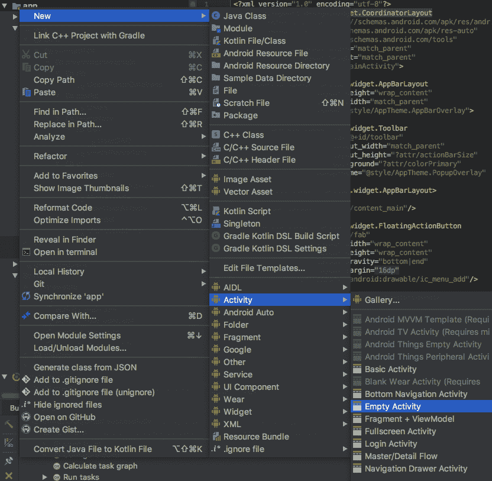

下面是这个名为`activity_new_user.xml`的布局类的代码。（完整代码可以在 GitHub 链接中找到）：

```kt
----
----
    <EditText
            android:id="@+id/editEmail"
            android:layout_width="match_parent"
            android:layout_height="wrap_content"
            android:hint="@string/hint_email"
            android:inputType="textEmailAddress"
            android:padding="5dp"
            android:textSize="18sp" android:layout_marginTop="8dp"
            app:layout_constraintTop_toBottomOf="@+id/editUsername" app:layout_constraintStart_toStartOf="parent"
            app:layout_constraintEnd_toEndOf="parent"/>

    <EditText
            android:id="@+id/editContactID"
            android:layout_width="match_parent"
            android:layout_height="wrap_content"
            android:hint="@string/hint_contact"
            android:inputType="phone"
            android:padding="5dp"
            android:textSize="18sp" android:layout_marginTop="8dp"
            app:layout_constraintTop_toBottomOf="@+id/editEmail" app:layout_constraintStart_toStartOf="parent"
            app:layout_constraintEnd_toEndOf="parent"
    />
----
---
    <Button
            android:id="@+id/buttonSave"
            android:layout_width="match_parent"
            android:layout_height="wrap_content"
            android:background="@color/colorPrimary"
            android:text="@string/button_save"
            android:textColor="@android:color/white"
            android:layout_marginBottom="8dp"
            app:layout_constraintBottom_toBottomOf="parent" app:layout_constraintStart_toStartOf="parent"
            app:layout_constraintEnd_toEndOf="parent" android:layout_marginTop="8dp"
            app:layout_constraintTop_toBottomOf="@+id/editAddress" app:layout_constraintVertical_bias="1.0"/>
</android.support.constraint.ConstraintLayout>

```

在这里，我们添加了四个`EditText`输入框，可以输入`用户名`、`联系电话`、`电子邮件`、`地址`，以及一个名为`buttonSave`的按钮来将此信息保存到数据库中。

下面是`NewUserActivity.kt`类的代码：

```kt
class NewUserActivity : AppCompatActivity(), View.OnClickListener {

    override fun onCreate(savedInstanceState: Bundle?) {
        super.onCreate(savedInstanceState)
        setContentView(R.layout.activity_new_user)
        buttonSave.setOnClickListener(this)
    }

    override fun onClick(view: View?) {
        if (view!!.id == R.id.buttonSave){
            val intent = Intent()
            if (isTextFieldEmpty()){
                Snackbar.make(view, "Empty Field", Snackbar.LENGTH_LONG)
                    .setAction("Action", null).show()
                setResult(Activity.RESULT_CANCELED, intent)
            } else {
                val users = Users(editUsername.text.toString(),
                    editEmail.text.toString(),
                    editContactID.text.toString(),
                    editAddress.text.toString())

                Log.wtf("CRAY", editUsername.text.toString()+" "+
                        editEmail.text.toString()+" "+
                        editContactID.text.toString()+" "+
                        editAddress.text.toString())

                Log.wtf("CRAY", users.toString())
                // If an instance of this Activity already exists, then it will be moved to the front.
                // If an instance does NOT exist, a new instance will be created.
                intent.addFlags(Intent.FLAG_ACTIVITY_REORDER_TO_FRONT)
                intent.putExtra(getString(R.string.result_replay), users)
                setResult(Activity.RESULT_OK, intent)
            }
            finish()
        }
    }

    private fun isTextFieldEmpty(): Boolean {
        return TextUtils.isEmpty(editUsername.text) ||
                TextUtils.isEmpty(editEmail.text) ||
                TextUtils.isEmpty(editContactID.text) ||
                TextUtils.isEmpty(editAddress.text)
    }
}
```

根据前面的代码：

+   实现`View.OnClickListener`并重写`onClick(view: View?)`。

+   在`onCreate()`方法中，为`buttonSave`按钮设置`setOnClickListener()`，并重写我们想要与按钮一起执行的`onClick(view: View?)`方法。最后，我们调用一个`Intent`，这将使活动从`**UserModel**`切换到`MainActivity`类。

+   `isTextFieldEmpty()`函数用于检查`EditText`字段是否为空。

+   然后我们获取所有文本，创建一个`UserObject`，并使用`intent.putExtra(getString(R.string.result_replay), users)`将这个可序列化的用户对象传递给`MainActivity`。

# 创建自定义 RecyclerView 适配器

为了显示所有用户列表，我们将使用`RecyclerView`。对于我们的项目，我们需要以我们自己的方式自定义`RecyclerView`适配器。在这个适配器中，我们主要传递用户模型。这将显示用户名、电子邮件和联系电话。让我们创建一个名为`UserListAdapter.kt`的适配器并扩展`RecyclerView.Adapter<UserListAdapter.UserViewHolder>()`。以下是`UserListAdapter.kt`的代码：

```kt
class UserListAdapter internal constructor(context: Context) :
    RecyclerView.Adapter<UserListAdapter.UserViewHolder>() {

    private val mLayoutInflater: LayoutInflater = LayoutInflater.from(context)!!
    private var mUsers: List<Users> = emptyList() // Cached copy of users

    inner class UserViewHolder(itemView: View) : RecyclerView.ViewHolder(itemView) {
        val rowName: TextView = itemView.name
        val rowEmail: TextView = itemView.email
        val rowContactNumber: TextView = itemView.contactNumber
        val rowAddress: TextView = itemView.contactNumber
    }

    override fun onCreateViewHolder(parent: ViewGroup, viewType: Int): UserViewHolder {
        val itemView: View = mLayoutInflater.inflate(R.layout.recyclerview_item, parent, false)
        return UserViewHolder(itemView)
    }

    override fun onBindViewHolder(holder: UserViewHolder, position: Int) {
        holder.rowName.text = mUsers[position].username
        holder.rowEmail.text = mUsers[position].email
        holder.rowContactNumber.text = mUsers[position].contactNumber
        holder.rowAddress.text = mUsers[position].address
    }

    override fun getItemCount(): Int {
        return mUsers.size
    }

    internal fun setNewUser(users: List<Users>) {
        mUsers = users
        notifyDataSetChanged()
    }
}
```

根据代码：

```kt
onCreateViewHolder()
onBindViewHolder()
UserViewHolder()
```

在这里，我们在`UserViewHolder`内部类中初始化了`activity_new_user.xml`的四个属性：

```kt
val rowName: TextView = itemView.name
val rowEmail: TextView = itemView.email
val rowContactNumber: TextView = itemView.contactNumber
val rowAddress: TextView = itemView.contactNumber
```

我们在`onBindViewHolder()`函数中设置了`userModel`的这四个属性值，如下所示：

```kt
holder.rowName.text = mUsers[position].username
holder.rowEmail.text = mUsers[position].email
holder.rowContactNumber.text = mUsers[position].contactNumber
holder.rowAddress.text = mUsers[position].address

```

# 实现 RecyclerView

`RecyclerView`是一个列表，我们可以看到所有用户列表。`RecyclerView`是设计材料的一部分，有助于使列表更加平滑且快速加载数据。

在`MainActivity`中，我们在`onCreate()`函数中设置`RecycleView`，如下所示：

```kt
val userListAdapter = UserListAdapter(this)
recyclerview.adapter = userListAdapter
recyclerview.layoutManager =  LinearLayoutManager(this)
```

# 修改主活动

让我们修改这个`MainActivity`类来完成我们的项目。让我们首先将 UI 连接到数据库。我们将使用`RecyclerView`来显示数据库中的数据列表。

让我们创建一个`ViewModel`变量，如下所示：

```kt
private lateinit var mMainViewModel: MainViewModel
```

使用`ViewModelProviders`将`MainViewModel`与`MainActivity`连接。在`onCreate()`中，我们将从`ViewModelProvider`获取`ViewModel`，如下所示：

```kt
mMainViewModel = ViewModelProviders.of(this).get(MainViewModel::class.java)
```

要添加`LiveData`观察者，让我们添加以下`observe()`来观察`getAllUsers()`，如下所示：

```kt
mMainViewModel.getAllUsers().observe(this,
    Observer {
            userList -> userListAdapter.setNewUser(userList!!)
    })
```

# 从另一个活动获取数据

在*创建新活动*部分中，我们提到已经将可序列化的用户对象传递给了`MainActivity`。为了获取这个对象，我们需要创建一个请求码。让我们创建一个如下所示的请求码：

```kt
private val requestCode: Int = 1

```

现在，重写`onActivityResult()`函数，我们将从中检索传递的`NewUserActivity`对象。

下面是`onActivityResult()`函数的代码：

```kt
override fun onActivityResult(requestCode: Int, resultCode: Int, data: Intent?) {
    super.onActivityResult(requestCode, resultCode, data)
    if (requestCode == this.requestCode && resultCode == Activity.RESULT_OK){
        data?.let {
        val users: Users = it.getParcelableExtra(getString(R.string.result_replay)) as Users
        mMainViewModel.insert(users)
        }
    }
}
```

`getParcelableExtra()`用于检索`Parcelable`对象。然后我们调用`mMainViewModel.insert(users)`将返回的`User`插入到数据库中。

# 添加 XML 布局

在`content_main.xml`中，我们添加了`RecyclerView`。这是这个布局的代码：

```kt
<?xml version="1.0" encoding="utf-8"?>
<android.support.constraint.ConstraintLayout
        xmlns:android="http://schemas.android.com/apk/res/android"
        xmlns:tools="http://schemas.android.com/tools"
        xmlns:app="http://schemas.android.com/apk/res-auto"
        android:layout_width="match_parent"
        android:layout_height="match_parent"
        app:layout_behavior="@string/appbar_scrolling_view_behavior"
        tools:showIn="@layout/activity_main"
        tools:context=".ui.MainActivity">
    <android.support.v7.widget.RecyclerView
            android:id="@+id/recyclerview"
            android:background="@android:color/darker_gray"
            tools:listitem="@layout/recyclerview_item"
            app:layout_constraintBottom_toBottomOf="parent"
            app:layout_constraintStart_toStartOf="parent"
            app:layout_constraintEnd_toEndOf="parent"
            app:layout_constraintTop_toTopOf="parent"
            android:layout_height="0dp" android:layout_width="0dp"/>
</android.support.constraint.ConstraintLayout>
```

# 切换到另一个活动

在`activity_main.xml`中，我们添加了一个`FloatingActionButton`，我们将使用它来进入**`NewUserActivity`**。为了完成这个任务，在`onCreate()`中使用以下代码，并指定提到的请求代码：

```kt
fab.setOnClickListener {
    val intent = Intent(this@MainActivity, NewUserActivity::class.java)
    startActivityForResult(intent, requestCode)

    /*Snackbar.make(view, "Replace with your own action", Snackbar.LENGTH_LONG)
        .setAction("Action", null).show()*/
}
```

因此，这是`MainAcivity.kt`的完整代码：

```kt
class MainActivity : AppCompatActivity() {

    private val requestCode: Int = 1

    private lateinit var mMainViewModel: MainViewModel

    override fun onCreate(savedInstanceState: Bundle?) {
        super.onCreate(savedInstanceState)
        setContentView(R.layout.activity_main)
        setSupportActionBar(toolbar)

        val userListAdapter = UserListAdapter(this)
        recyclerview.adapter = userListAdapter
        recyclerview.layoutManager =  LinearLayoutManager(this)

        mMainViewModel = ViewModelProviders.of(this).get(MainViewModel::class.java)
        mMainViewModel.getAllUsers().observe(this,
            Observer {
                    userList -> userListAdapter.setNewUser(userList!!)
            })

        fab.setOnClickListener {
            val intent = Intent(this@MainActivity, NewUserActivity::class.java)
            startActivityForResult(intent, requestCode)
        }
    }

    override fun onActivityResult(requestCode: Int, resultCode: Int, data: Intent?) {
        super.onActivityResult(requestCode, resultCode, data)
        if (requestCode == this.requestCode && resultCode == Activity.RESULT_OK){
            data?.let {
            val users: Users = it.getParcelableExtra(getString(R.string.result_replay)) as Users
            mMainViewModel.insert(users)
            }
        }
    }
}
```

现在我们已经完成了项目，*运行*应用程序。我们将在下一节中探讨这一点。

# 运行应用

在你的 Android 设备或模拟器上运行应用后，你会看到这个屏幕：

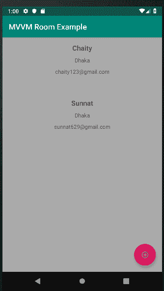

我们可以在这里看到我们预先添加的用户详细信息。现在点击浮动按钮，进入新用户活动页面，在那里你可以写下用户信息，如图所示：

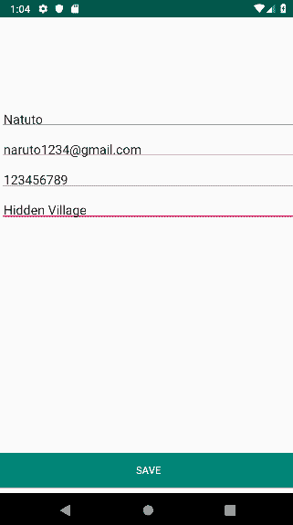

最后，点击保存按钮。你现在可以看到新的用户名，如图中所示为**Naruto**：

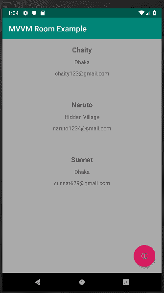

因此，这样我们就学会了如何使用`Room`进行本地数据库。在下一章中，你将看到这个库在 Android 应用程序中的更多使用。

# 摘要

数据库本身是一个大型平台，我们已经涵盖了与我们的 Spring 和 Android 项目及内容相关的部分。在本章中，我们学习了数据库是什么，以及查看其各种类型。我们看到了 DBMs 的简要描述。之后，我们学习了 JDBC，它是一个连接和从前端到后端移动数据的 API 规范。然后我们使用 JDBC 开发了一个项目，在该项目中，我们从数据库中创建、读取、更新和删除数据。在这个主题之后，我们学习了另一个名为 JPA 的 API，它是一种 ORM 方法，以及一个将 Java 对象映射到数据库表并反之亦然的系统。然后我们通过一个项目学习了更多关于 JPA 及其使用的内容。在那里，我们还学习了基于 CRUD 的 REST API。最后，我们学习了 Android 的最新技术，称为架构组件。我们还查看了一个名为`Room`的组件，它是 SQLite 数据库顶级封装。最后，我想重申，这一章并没有解释所有内容。如果你想了解更多关于数据库的信息，你可以阅读我们推荐的书籍，我们已经在*进一步阅读*部分提到了书籍和作者的名字。在下一章中，你可以了解并发性，这意味着程序、算法或问题的不同单元的能力。

# 问题

1.  Spring Boot 中的 H2 是什么？

1.  REST API 中的资源是什么？

1.  CRUD 的全称是什么？

1.  DAO 和仓库之间的区别是什么？

1.  什么是 SQLite？

1.  SQLite 支持哪些数据类型？

1.  标准的 SQLite 命令有哪些？

1.  SQLite 的缺点是什么？

# 进一步阅读

+   *《使用 Hibernate 进行 Spring 持久化》* ([`www.packtpub.com/application-development/spring-persistence-hibernate`](https://www.packtpub.com/application-development/spring-persistence-hibernate)) 由 Ahmad Seddighi 著

+   *《使用 Spring Boot 2.0 和 React 进行全栈开发实践》* ([`www.packtpub.com/application-development/hands-full-stack-development-spring-boot-20-and-react`](https://www.packtpub.com/application-development/hands-full-stack-development-spring-boot-20-and-react)) 由 Juha Hinkula 著

+   *《在 Spring 5.0 中处理数据和云 [视频]》* ([`www.packtpub.com/application-development/working-data-and-cloud-spring-50-video`](https://www.packtpub.com/application-development/working-data-and-cloud-spring-50-video)) 由 Ranga Rao Karanam 著](https://www.packtpub.com/application-development/working-data-and-cloud-spring-50-video)

+   *《Android 数据库编程》* ([`www.packtpub.com/application-development/android-database-programming`](https://www.packtpub.com/application-development/android-database-programming)) 由 Jason Wei 著
