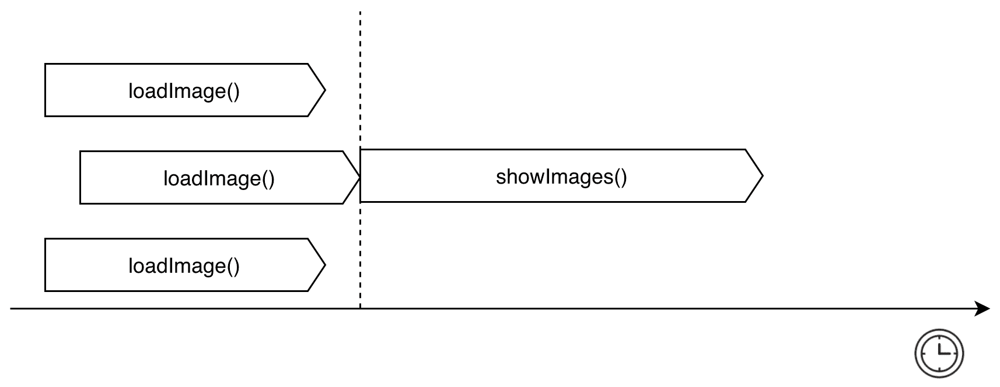
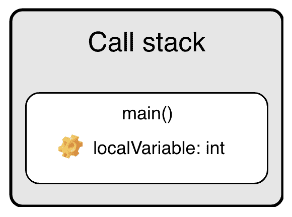
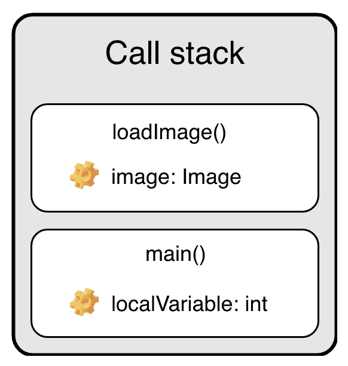
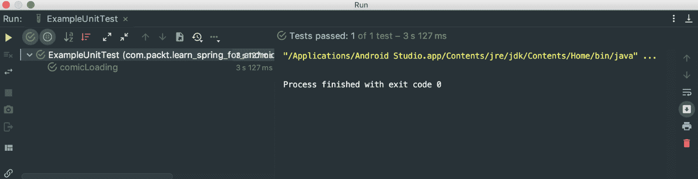
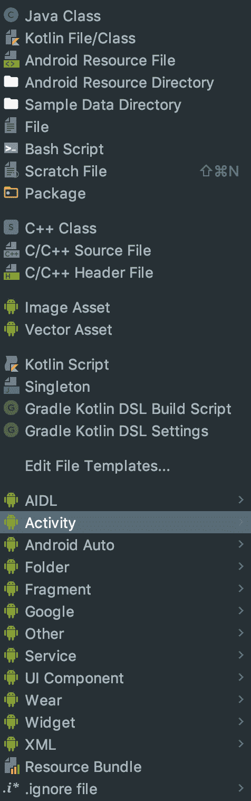
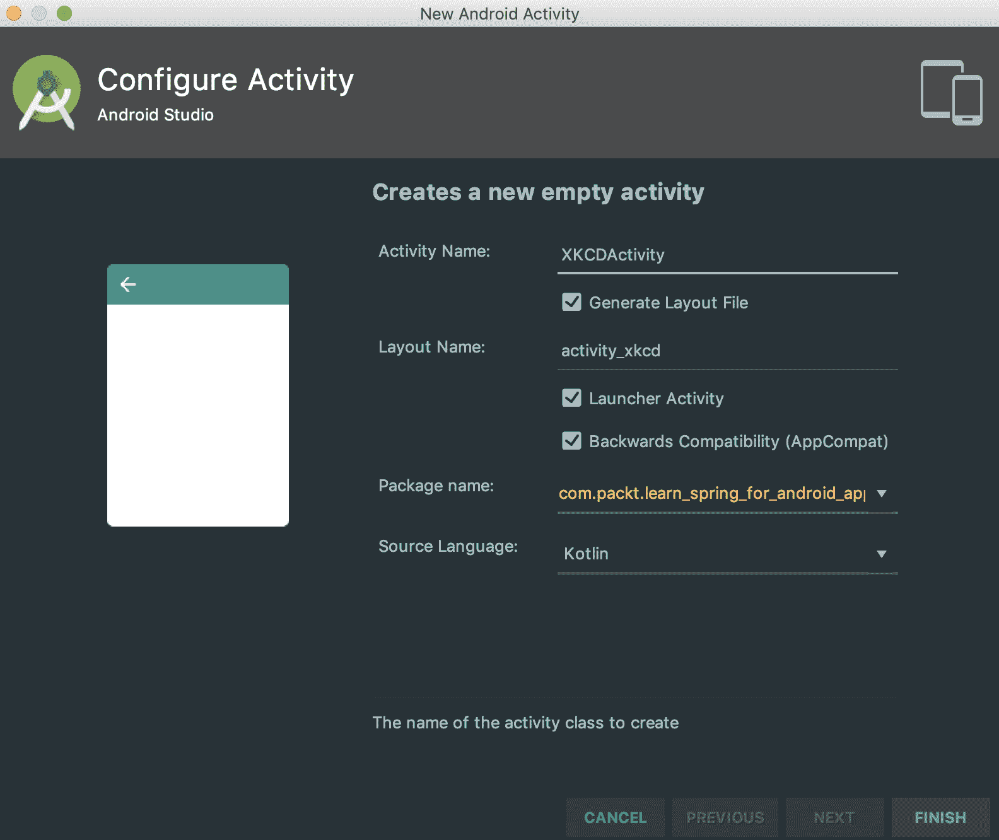
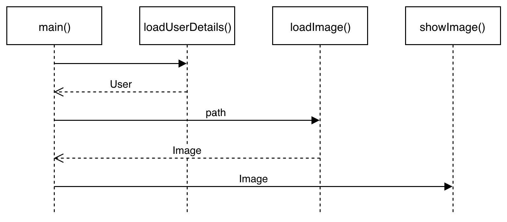
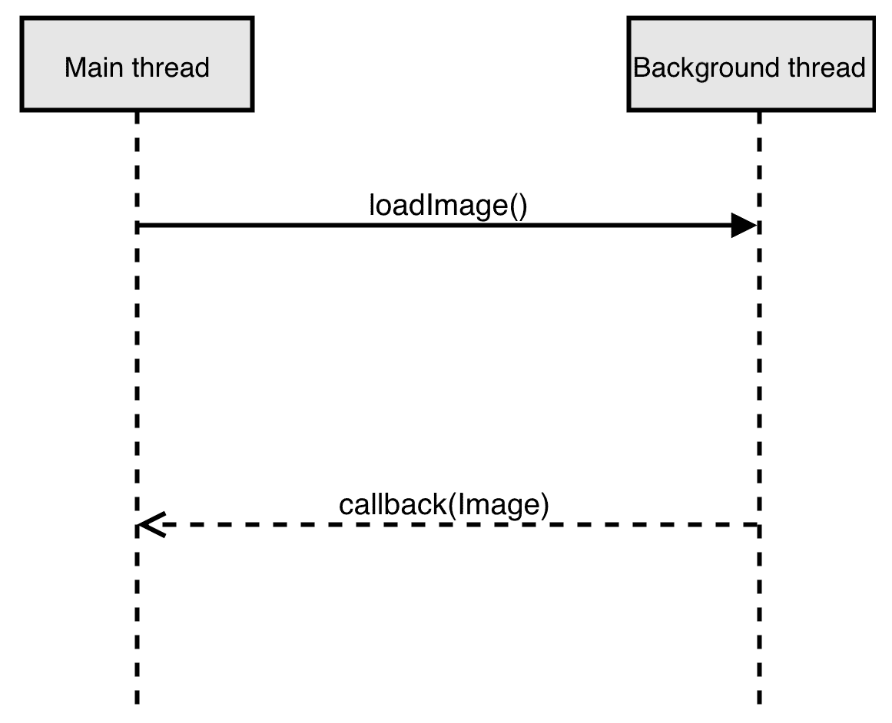
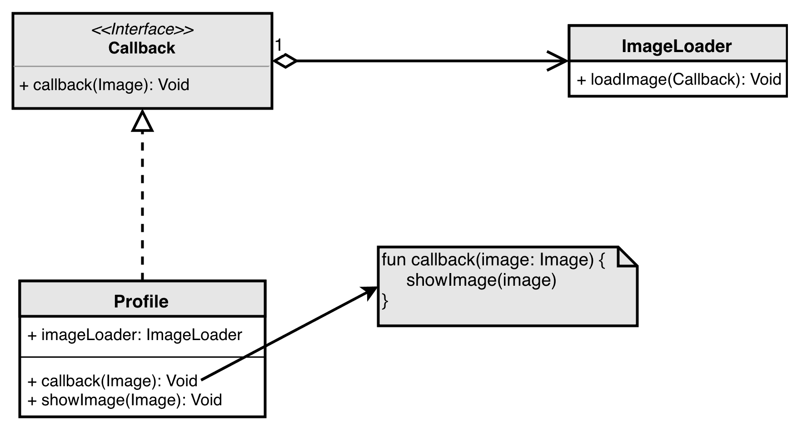
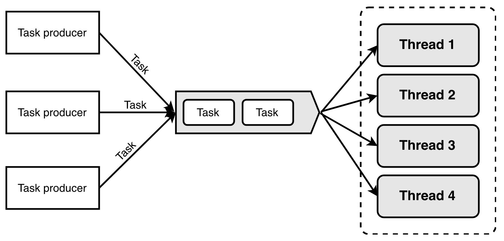

# 第七章：并发

**并发**是程序或算法能够被划分为可以无序执行而不影响结果的部分的能力。这种方法允许在多核环境中进行并行执行，这可以显著提高性能。理解并发与并行之间的区别很重要。并行假设程序是以并发方式实现的，但并发并不意味着程序是并行执行的。

本章将涵盖以下主题：

+   协程

+   顺序操作

+   回调地狱

+   线程池

# 技术要求

要运行本章中的代码，你需要集成`coroutines-core`库。为此，你应该将以下行添加到`build.gradle`文件的`repositories`块中：

```java
jcenter()
```

你还应该在`dependencies`块中添加以下行：

```java
implementation 'org.jetbrains.kotlinx:kotlinx-coroutines-core:0.30.2'
```

添加以下行以集成`kotlinx-coroutines-android`库：

```java
implementation 'org.jetbrains.kotlinx:kotlinx-coroutines-android:0.30.2'
```

如果你使用的是低于 1.3 的 Kotlin 版本，你还应该在`build.gradle`文件中添加以下行：

```java
kotlin {
    experimental {
        coroutines "enable"
    }
}
```

要集成 Spring Android 库，你应该添加以下行：

```java
implementation 'org.springframework.android:spring-android-rest-template:2.0.0.M3'
implementation group: 'com.fasterxml.jackson.core', name: 'jackson-databind', version: '2.8.6'
```

你还应该添加`repositories`块，如下所示：

```java
repositories {
    maven {
        url 'https://repo.spring.io/libs-milestone'
    }
}
```

本章还将与[JSON to Kotlin Class](https://plugins.jetbrains.com/plugin/9960-json-to-kotlin-class-jsontokotlinclass-)插件一起工作。要安装此插件，请打开首选项窗口并选择插件部分。

点击安装按钮并重新启动 Android Studio。

本章的源代码，包括示例，可在以下链接的 GitHub 上找到：[`github.com/PacktPublishing/Learn-Spring-for-Android-Application-Development/tree/master/Chapter07`](https://github.com/PacktPublishing/Learn-Spring-for-Android-Application-Development/tree/master/Chapter07)。

# 协程

**协程**是 Kotlin 编程语言的一个强大功能。其主要目标是允许在等待另一个函数调用的长期操作结果时挂起函数。这个功能允许我们以顺序方式编写异步代码，而不需要回调。

本节将涵盖以下主题：

+   协程基础

+   调用栈

+   协程测试

+   协程作用域

# 协程基础

如果你熟悉线程的概念，你会知道每个线程都有自己的调用栈。我们将在下一节中介绍线程的调用栈。创建新线程是一个复杂的操作，大约需要两兆内存。协程在底层使用线程池，并且只需要创建几个额外的方法和类。这就是为什么你可以将协程视为轻量级线程。

让我们想象一下，我们有一个长期操作，如下面的代码所示：

```java
class Image

fun loadImage() : Image {
    Thread.sleep(3000)
    return Image()
}
```

`loadImage` 函数需要三秒钟并返回 `Image` 类的实例。我们还有一个 `showImages` 函数，它接受三个 `Image` 类的实例，如下所示：

```java
fun showImages(image1: Image, image2: Image, image3: Image) {
    // .......
}
```

因此，我们有三个可以并行执行的独立任务。我们在这里可以创建三个协程，每个协程将执行 `loadImage` 函数。要创建一个新的协程，我们可以使用称为**协程构建器**的函数之一，例如 `async` 或 `launch`：

```java
val subTask1 = GlobalScope.async { loadImage() }
val subTask2 = GlobalScope.async { loadImage() }
val subTask3 = GlobalScope.async { loadImage() }
```

`async` 函数返回一个 `Deferred` 类型的实例。这个类封装了一个将在未来返回结果的任务。当调用 `Deferred` 类实例的 `await` 函数时，`caller` 函数会暂停。这意味着具有此函数调用栈的线程不会被阻塞，只是被挂起。以下代码片段显示了这可能看起来像什么：

```java
showImages(subTask1.await(), subTask2.await(), subTask3.await())
```

当我们调用 `await` 函数时，我们挂起当前函数的调用。此外，当所有子任务返回结果时，将调用 `showImages` 函数。

以下图显示了这些函数的执行方式：



此图显示，根据核心之间的负载分配以及是否在所有三张图片都加载完毕时调用 `showImages` 函数，三个任务可以几乎并行执行。

# 调用栈

每个协程和线程都有自己的调用栈。这意味着协程或线程创建时，会同时创建其调用栈。**调用栈**包含每个使用此线程或协程的上下文调用的函数的类似块。这个块代表一个包含元数据、原始局部变量和堆中对象的局部引用的内存空间。您可以将调用栈视为为线程或协程分配的内存的一部分。

以下图显示了线程或协程创建时**调用栈**的外观：



如果 `main()` 函数调用另一个函数，则会在调用栈中添加一个新的块。这看起来如下：



当 `loadImage` 函数向 `main` 函数返回一个值时，`loadImage` 函数的块将从栈中移除。

# 协程测试

`runBlocking` 协程构建器可用于测试。它创建一个使用当前线程的协程。JUnit 框架中的测试可能如下所示：

```java
class ExampleUnitTest {

    @Test
    fun comicLoading() = runBlocking {
        val image = async { loadImage() }.await()
        assertNotNull(image)
    }
}
```

此代码片段使用 `async` 协程构建器加载图像，并检查 `image` 是否不为空。`runBlocking` 函数的源代码如下所示：

```java
@Throws(InterruptedException::class)
public fun <T> runBlocking(context: CoroutineContext = EmptyCoroutineContext, block: suspend CoroutineScope.() -> T): T {
    val currentThread = Thread.currentThread()
    val contextInterceptor = context[ContinuationInterceptor]
    val privateEventLoop = contextInterceptor == null // create private event loop if no dispatcher is specified
    val eventLoop = if (privateEventLoop) BlockingEventLoop(currentThread) else contextInterceptor as? EventLoop
    val newContext = GlobalScope.newCoroutineContext(
        if (privateEventLoop) context + (eventLoop as ContinuationInterceptor) else context
    )
    val coroutine = BlockingCoroutine<T>(newContext, currentThread, eventLoop, privateEventLoop)
    coroutine.start(CoroutineStart.DEFAULT, coroutine, block)
    return coroutine.joinBlocking()
}
```

如您所见，`runBlocking` 协程构建器使用 `currentThread` 函数来获取 `Thread` 类的实例。当您运行此测试时，您将看到以下窗口：



此窗口显示测试已成功通过。

# 协程作用域

在协程版本 0.26.0 的发布中，引入了一个新的、重要的功能——协程作用域。`coroutines-core` 库中的所有协程构建器都是 `CoroutineScope` 接口的扩展函数。

`CoroutineScope` 接口如下所示：

```java
public interface CoroutineScope {

    @Deprecated(level = DeprecationLevel.HIDDEN, message = "Deprecated in favor of top-level extension property")
    public val isActive: Boolean
        get() = coroutineContext[Job]?.isActive ?: true

    public val coroutineContext: CoroutineContext
}
```

我们需要协程作用域为我们启动的应用程序中的协程提供适当的取消机制。现代框架，如 Android SDK 或 React Native，都是这样构建的，即所有组件以及应用程序本身都有生命周期。在 Android SDK 中，这可以是活动或片段，在 React Native 中，这可以是组件。

协程作用域代表一个具有生命周期的对象的作用域，例如活动或组件。`coroutines-core` 库为整个应用程序提供了一个作用域，如果我们想启动一个与应用程序运行时间一样长的协程，我们可以使用它。整个应用程序的作用域由 `GlobalScope` 对象表示，如下所示：

```java
object GlobalScope : CoroutineScope {

    @Deprecated(level = DeprecationLevel.HIDDEN, message = "Deprecated in favor of top-level extension property")
    override val isActive: Boolean
        get() = true

    override val coroutineContext: CoroutineContext
        get() = EmptyCoroutineContext
}
```

让我们创建一个新的活动，并为其创建一个自己的协程作用域。最简单的方法是调用包的上下文菜单并选择“新建”部分，如下所示：



然后，在“活动”子部分中选择“空活动”选项，如下所示：


Android Studio 将打开“配置活动”窗口，您可以在其中更改活动配置并按下“完成”按钮：



新创建的 `XKCDActivity` 类将如下所示：

```java
class XKCDActivity : AppCompatActivity() {

    override fun onCreate(savedInstanceState: Bundle?) {
        super.onCreate(savedInstanceState)
        setContentView(R.layout.activity_xkcd)
    }
}
```

如果我们想从这个类中启动一个生命周期感知的协程，我们应该实现 `CoroutineScope` 接口，如下所示：

```java
class XKCDActivity : AppCompatActivity(), CoroutineScope {
    override val coroutineContext: CoroutineContext
        get() = Dispatchers.Main

    override fun onCreate(savedInstanceState: Bundle?) {
        super.onCreate(savedInstanceState)
        setContentView(R.layout.activity_xkcd)
    }
}
```

`CoroutineScope` 接口如下所示：

```java
public interface CoroutineScope {

    @Deprecated(level = DeprecationLevel.HIDDEN, message = "Deprecated in favor of top-level extension property")
    public val isActive: Boolean
        get() = coroutineContext[Job]?.isActive ?: true

    public val coroutineContext: CoroutineContext
}
```

`XKCDActivity` 类实现了 `CoroutineScope` 接口并重写了 `coroutineContext` 属性。重写的 `coroutineContext` 属性包含一个返回 `Dispatchers.Main` 的获取器。

`Dispatchers` 是来自 `coroutines-core` 库的对象，其中包含以下调度器：

+   `Default` 被所有标准协程构建器使用，例如 `launch` 或 `async`

+   `Main` 用于在主线程上运行协程

+   `Unconfident` 立即在一个可用的线程上调用协程

+   `IO` 用于运行执行输入/输出操作的协程

由于重写的 `coroutineContext` 属性的获取器返回 `Main` 调度器，因此从这个类中所有协程构建器启动的协程都将运行在主线程上。

`XKCDActivity` 有自己的协程作用域，但它不是生命周期感知的。这意味着如果在活动的作用域中启动了一个协程，当活动被销毁时，该协程不会被销毁。我们可以通过以下方式修复这个问题：

```java
class XKCDActivity : AppCompatActivity(), CoroutineScope {
    private lateinit var lifecycleAwareJob: Job
    override val coroutineContext: CoroutineContext
        get() = Dispatchers.Main + lifecycleAwareJob

    override fun onCreate(savedInstanceState: Bundle?) {
        super.onCreate(savedInstanceState)
        setContentView(R.layout.activity_xkcd)
        lifecycleAwareJob = Job()
    }

    override fun onDestroy() {
        super.onDestroy()
        lifecycleAwareJob.cancel()
    }
}
```

`lifecycleAwareJob`将被用作所有协程的父级，并在活动被销毁时取消所有子协程。以下示例代码显示了如何使用这种方法：

```java
override fun onCreate(savedInstanceState: Bundle?) {
    super.onCreate(savedInstanceState)
    setContentView(R.layout.activity_xkcd)
    lifecycleAwareJob = Job()
    launch {
        val image = async(Dispatchers.IO) { loadImage() }.await()
        showImage(image)
    }
}
```

协程启动构建器创建一个在主线程上工作的协程，而异步协程构建器创建一个在输入/输出线程上工作的协程。当`image`准备好时，它将在应用程序的主线程上显示。如果我们按下返回按钮，协程将被销毁，包括`XKCDActivity`。

# 通道

`async`函数返回一个`Deferred`类的实例，允许我们计算单个值。如果我们需要在协程之间传输一系列值，我们可以使用通道。

通道是一个如下所示的接口：

```java
public interface Channel<E> : SendChannel<E>, ReceiveChannel<E> {
    //.....
}
```

`SendChannel`接口如下所示：

```java
public interface SendChannel<in E> {

    @ExperimentalCoroutinesApi
    public val isClosedForSend: Boolean

    @ExperimentalCoroutinesApi
    public val isFull: Boolean

    public suspend fun send(element: E)

    public val onSend: SelectClause2<E, SendChannel<E>>

    public fun offer(element: E): Boolean

    public fun close(cause: Throwable? = null): Boolean

    @ExperimentalCoroutinesApi
    public fun invokeOnClose(handler: (cause: Throwable?) -> Unit)
}
```

`SendChannel`接口包含一个接受参数并将其添加到该通道的`send`方法。如果此通道已经包含一个值，则`isFull`属性为`true`。在这种情况下，`send`函数会暂停调用者，直到包含的值被消费。

一个通道可以通过调用`close`方法来关闭。在这种情况下，`isClosedForSend`属性为`true`，而`send`方法会抛出一个异常。

虽然`SendChannel`接口允许我们将一个值放入通道中，但`ReceiveChannel`接口允许我们从通道中获取值。`ReceiveChannel`接口如下所示：

```java
public interface ReceiveChannel<out E> {

    @ExperimentalCoroutinesApi
    public val isClosedForReceive: Boolean

    @ExperimentalCoroutinesApi
    public val isEmpty: Boolean

    public suspend fun receive(): E

    public val onReceive: SelectClause1<E>

    @ExperimentalCoroutinesApi
    public suspend fun receiveOrNull(): E?

    @ExperimentalCoroutinesApi
    public val onReceiveOrNull: SelectClause1<E?>

    public fun poll(): E?

    public operator fun iterator(): ChannelIterator<E>

    public fun cancel(): Boolean

    @ExperimentalCoroutinesApi
    public fun cancel(cause: Throwable? = null): Boolean
}
```

`receiveOrNull()`方法从该通道返回并移除一个元素，或者如果`isClosedForReceive`属性为`true`，则返回 null。`ReceiveChannel`包含`iterator`方法，可以在`for`循环中使用。

让我们看看以下示例代码：

```java
fun channelBasics() = runBlocking<Unit> {
    val channel = Channel<Int>()
    launch {
        println("send 0 ${Date().toGMTString()}")
        channel.send(0)
        delay(1000)
        println("send 1 ${Date().toGMTString()}")
        channel.send(1)
    }
    delay(3000)
    val theFirstElement = channel.receive()
    println("receive $theFirstElement ${Date().toGMTString()}")
    delay(4000)
    val theSecondElement = channel.receive()
    println("receive $theSecondElement ${Date().toGMTString()}")
}
```

在前面的示例中，我们通过通道发送了两个值并接收了这些值。我们还使用了`delay`函数来显示操作需要一些时间。

输出如下所示：

```java
send 0 21 Oct 2018 13:30:12 GMT
 receive 0 21 Oct 2018 13:30:15 GMT
 send 1 21 Oct 2018 13:30:16 GMT
 receive 1 21 Oct 2018 13:30:19 GMT
```

此输出显示`send`函数会暂停协程，直到值被消费。

我们可以使用`for`循环从通道接收值，如下所示：

```java
fun channelIterator() = runBlocking<Unit> {
    val channel = Channel<Int>()
    launch {
        (0..5).forEach {
            channel.send(it)
        }
    }
    for (value in channel) {
        println(value)
    }
}
```

输出如下所示：

```java
 0
 1
 2
 3
 4
 5
```

# 生成函数

`producer`函数被称为**通道构建器**，它返回一个`ReceiveChannel`类的实例。此函数如下所示：

```java
@ExperimentalCoroutinesApi
public fun <E> CoroutineScope.produce(
    context: CoroutineContext = EmptyCoroutineContext,
    capacity: Int = 0,
    block: suspend ProducerScope<E>.() -> Unit
): ReceiveChannel<E> {
    val channel = Channel<E>(capacity)
    val newContext = newCoroutineContext(context)
    val coroutine = ProducerCoroutine(newContext, channel)
    coroutine.start(CoroutineStart.DEFAULT, coroutine, block)
    return coroutine
}
```

如前所述的代码片段所示，`produce`函数包含一个`ProducerScope`类型的接收参数。`ProducerScope`接口如下所示：

```java
public interface ProducerScope<in E> : CoroutineScope, SendChannel<E> {
    val channel: SendChannel<E>
}
```

如您所见，`ProducerScope`接口扩展了`SendChannel`接口。这意味着我们可以在传递给`producer`函数的 lambda 表达式中使用`send`方法。

使用`producer`函数的一个示例可能如下所示：

```java
suspend fun numbersProduce(): ReceiveChannel<Int> = GlobalScope.produce {
    launch {
        (0..10).forEach {
            send(it)
        }
    }
}
```

我们可以这样使用`numbersProduce`函数：

```java
fun producerExample() = runBlocking<Unit> {
    val numbers = numbersProduce()
    for (value in numbers) {
        println(value)
    }
}

```

# 演员（actor）函数

`actor`函数包含一个`ActorScope`类型的接收参数。`actor`函数的源代码如下所示：

```java
public fun <E> CoroutineScope.actor(
    context: CoroutineContext = EmptyCoroutineContext,
    capacity: Int = 0,
    start: CoroutineStart = CoroutineStart.DEFAULT,
    onCompletion: CompletionHandler? = null,
    block: suspend ActorScope<E>.() -> Unit
): SendChannel<E> {
    val newContext = newCoroutineContext(context)
    val channel = Channel<E>(capacity)
    val coroutine = if (start.isLazy)
        LazyActorCoroutine(newContext, channel, block) else
        ActorCoroutine(newContext, channel, active = true)
    if (onCompletion != null) coroutine.invokeOnCompletion(handler = onCompletion)
    coroutine.start(start, coroutine, block)
    return coroutine
}
```

`ActorScope`接口看起来与`ProducerScope`接口相似，但它实现了`ReceiveChannel`接口：

```java
public interface ActorScope<E> : CoroutineScope, ReceiveChannel<E> {
    val channel: Channel<E>
}
```

如你所知，从不同的协程中访问可变数据并不是一个好主意。为了处理这个问题，我们可以使用通道和`actor`函数，如下所示：

```java
suspend fun numberConsumer() = GlobalScope.actor<Int> {
    var counter = 0
    for (value in channel) {
        counter += value
        println(counter)
    }
}
```

前面的代码片段包含一个名为`counter`的可变变量。我们在通道接收到新值时更改`counter`变量的值。由于通道会挂起调用者直到消费者完成当前值的处理，我们可以确保`counter`变量将以正确的方式被修改。

可以这样使用`numbersCounter`函数：

```java
@Test
fun actorExample() = runBlocking<Unit> {
    val actor = numberConsumer()
    (0..10).forEach {
        launch {
            actor.send(it)
        }
    }
}
```

前面的代码片段启动了十个协程，它们并行地向一个 actor 发送一个值。

输出如下所示：

```java
 0
 1
 3
 6
 10
 15
 21
 28
 36
 45
 55
```

输出显示`counter`变量被正确修改。

# 顺序操作

协程方法最重要的好处之一是保证函数的调用顺序与它们编写的顺序相同。在多线程环境中执行并发代码时，操作顺序是一个非常重要的细节。

让我们假设我们必须使用以下函数来加载用户的详细信息：

```java
suspend fun loadUserDetails(): User {
    delay(3000)
    return User(0, "avatar")
}
```

`loadUserDetails`函数从`coroutines-core`库调用`delay`函数，并返回`User`类的一个实例。`delay`函数挂起当前协程的调用。当用户准备好时，我们必须将`avatar`属性的值传递给`loadImage`函数：

```java
suspend fun loadImage(avatar: String): Image {
    delay(3000)
    return Image()
}
```

`loadImage`函数还调用了`delay`函数，并返回`Image`类的一个实例。然后我们应该将接收到的`Image`类实例传递给`showImage`函数。

以下代码展示了如何使用协程依次执行这些函数：

```java
fun main(args: Array<String>) = runBlocking {
    val user = async { loadUserDetails() }.await()
    val image = async { loadImage(user.avatar) }.await()
    showImage(image)
}
```

前面的代码片段依次调用了使用不同协程的三个函数。以下图显示了函数调用的顺序：



# 回调地狱

你应该使用协程的主要原因之一是避免回调地狱。

本节将涵盖以下主题：

+   什么是回调？

+   包装回调

# 什么是回调？

**回调**是一种用于检索异步任务结果的模式。这种方法假设我们传递一个函数的引用，当异步操作完成时应该调用该函数。

我们所说的**同步操作**是指任务一个接一个地执行。异步方法假设可以并行执行多个任务。

在以下示例代码中，`loadImage`函数使用回调来返回结果：

```java
fun loadImage(callback: (Image) -> Unit) {
    executor.submit {
        Thread.sleep(3000)
        callback(Image())
    }
}
```

前面的代码片段展示了如何创建一个异步函数的最简单示例，该函数使用回调返回结果。在我们的情况下，回调是一个接受`Image`类实例并返回`Unit`的 lambda。以下图显示了这一序列是如何工作的：



此函数可以这样使用：

```java
fun main(args: Array<String>) {
    loadImage { image ->
        showImage(image)
    }
}
```

前面的代码片段显示，使用回调处理异步代码非常简单。我们只需实现并传递一个在图像准备就绪时被调用的 lambda。

以下图显示了如何实现这种方法：



让我们假设我们正在从服务器请求用户列表。之后，我们发送另一个请求以获取关于用户的详细信息，然后加载一个头像。在代码中，这可能看起来如下：

```java
fun loadListOfFriends(callback: (List<ShortUser>) -> Unit) {
    executor.submit {
        Thread.sleep(3000)
        callback(listOf(ShortUser(0), ShortUser(1)))
    }
}
```

`loadListOfFriends`函数接受一个 lambda，该 lambda 接受`ShortUser`类实例的列表，如下所示：

```java
fun loadUserDetails(id: Int, callback: (User) -> Unit) {
    executor.submit {
        Thread.sleep(3000)
        callback(User(id, "avatar"))
    }
}
```

`loadUserDetails`函数接受一个 lambda 和一个用户的标识符，如下所示：

```java
fun loadImage(avatar: String, callback: (Image) -> Unit) {
    executor.submit {
        Thread.sleep(3000)
        callback(Image())
    }
}

```

`loadImage`函数接受头像的路径和 lambda。以下示例代码演示了当我们使用带有回调的方法时最常见的常见问题。当并发任务需要相互传递数据时，我们遇到了代码复杂性和可读性的问题：

```java
fun main(args: Array<String>) {
    loadListOfFriends {users ->
        loadUserDetails(users.first().id) {user ->
            loadImage(user.avatar) {image ->
                showImage(image)
            }
        }
    }
}
```

前面的代码片段演示了回调地狱。我们有很多嵌套的函数，维护这样的代码很困难。

# 线程池

创建新线程是一个复杂的操作，需要占用大量资源。在*调用栈*部分，我们介绍了为新线程分配内存的方法。当函数的较低部分从栈中移除时，线程将被销毁。为了避免不断创建新线程，我们可以使用线程池。为每个短期操作创建新线程没有逻辑，因为这种操作和将程序流程切换到创建的上下文可能比执行任务本身花费更多时间。线程池模式假设一个包含一组等待新任务的线程的类，以及一个包含任务的队列。

以下图显示了这是如何工作的：



前面的图显示，池包含一个队列，该队列保存由生产者提交的任务。池中的线程从队列中取出任务并执行它们。

协程在底层使用线程池。`java.util.concurrent`包提供了创建自己的线程池的功能。`Executors`类包含许多静态工厂函数来创建一个池，如下面的截图所示：


以下示例代码演示了如何创建和使用单线程执行器：

```java
fun main(args: Array<String>) {
    val executor = Executors.newSingleThreadExecutor()
    executor.submit { loadImage() }
    executor.submit { loadImage() }
}
```

在前面的代码片段中，我们实例化了`executor`变量，并使用`submit`方法将任务添加到队列中。

# 摘要

在本章中，我们探讨了并发以及多线程环境中可能出现的问题。我们介绍了协程的常见用法示例。我们还熟悉了诸如线程池和回调等模式，以及如何使用它们。此外，我们还涵盖了同步和异步编程，以及与这些主题相关的问题。

在下一章中，我们将概述响应式编程，这在我们需要处理异步操作时非常有用。

# 问题

+   什么是调用栈？

+   什么是线程池？

+   什么是回调？

+   为什么协程被称为轻量级线程？

# 进一步阅读

由 Igor Kucherenko 所著，Packt Publishing 出版的《*掌握 Kotlin 高性能编程*》([`www.packtpub.com/application-development/mastering-high-performance-kotlin`](https://www.packtpub.com/application-development/mastering-high-performance-kotlin))。
