# 第八章：响应式编程

响应式编程是一种处理异步事件的异步方法。我们经常遇到异步事件，例如用户与界面的交互或长期操作结果的交付。还有一些库，如 [RxJava](https://github.com/ReactiveX/RxJava) 和 [Reactor](https://github.com/reactor/reactor-core)[,](https://github.com/reactor/reactor-core) [允许我们在 Kotlin 或 Java 中编写响应式代码。](https://github.com/reactor/reactor-core)

在本章中，你将了解观察者模式，以及如何将异步事件从一种类型转换为另一种类型。你还将学习如何使用实现响应式编程概念的 Mono、Single、Observable 和 Flux 类。

本章将涵盖以下主题：

+   使用 Spring Reactor 进行响应式编程

+   阻塞和非阻塞

+   RxJava

+   Android 中的 RxJava

到本章结束时，你将能够使用 RxJava 和 Reactor 库将响应式编程应用于你的应用程序。

# 技术要求

你可以在 GitHub 上找到本章的示例，链接如下：[`github.com/PacktPublishing/Learn-Spring-for-Android-Application-Development/tree/master/app/src/main/java/com/packt/learn_spring_for_android_application_development/chapter8`](https://github.com/PacktPublishing/Learn-Spring-for-Android-Application-Development/tree/master/app/src/main/java/com/packt/learn_spring_for_android_application_development/chapter8)。

要将 Reactor 库集成到你的项目中，请在 `build.gradle` 文件的仓库部分添加以下行：

```java
maven { url 'https://repo.spring.io/libs-milestone' }
```

请在依赖项部分添加以下行：

```java
implementation "io.projectreactor:reactor-core:3.2.2.RELEASE"
```

Reactor 库与 Java 开发工具包（**JDK**）的 8 或更高版本兼容。因此，我们应该在 Android 部分添加以下行：

```java
compileOptions {
    sourceCompatibility JavaVersion.VERSION_1_8
    targetCompatibility JavaVersion.VERSION_1_8
}
```

要集成 RxJava 库，请在依赖项部分添加以下行：

```java
implementation "io.reactivex.rxjava2:rxjava:2.2.3"
```

要集成 RxAndroid 库，请在依赖项部分添加以下行：

```java
implementation 'io.reactivex.rxjava2:rxandroid:2.1.0'
```

要集成 RxBinding 库，你应该在依赖项部分添加以下行：

```java
implementation 'com.jakewharton.rxbinding3:rxbinding:3.0.0-alpha1'
```

# 使用 Spring Reactor 进行响应式编程

**Reactor** 是一个为 JVM 实现响应式编程概念的库。这种方法基于观察者模式，并提供可以发出 *零*、*一个* 或一系列值的类型。

在本节中，你将学习以下内容：

+   如何实现观察者模式

+   如何使用 Flux 发布者

+   如何使用 Mono 发布者

# 观察者模式

*观察者模式* 假设存在一个发送消息的对象，以及另一个接收消息的对象。以下图表展示了如何组织类层次结构以实现此方法：

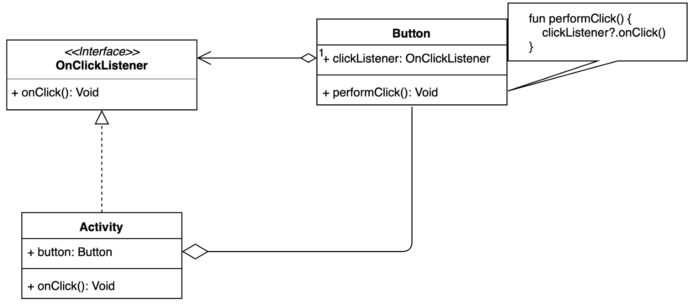

`Activity`类实现了`OnClickListener`接口并包含一个`Button`类的实例，而`Button`类包含调用`OnClickListener`类实例的`onClick`方法的`performClick`方法，如果它不为空。然后活动中的`onClick`方法将被调用。这样，当用户点击按钮时，`Activity`类的实例将得到通知。

以下示例代码展示了这种方法是如何工作的。

`ObserverActivity`包含一个`Button`类的实例并调用`setOnClickListener`方法：

```java
class ObserverActivity : AppCompatActivity() {

    override fun onCreate(savedInstanceState: Bundle?) {
        super.onCreate(savedInstanceState)
        setContentView(R.layout.activity_observer)
        findViewById<Button>(R.id.button).setOnClickListener {
            Toast.makeText(this, "Clicked!", Toast.LENGTH_LONG).show()
        }
    }
}
```

`setOnClickListener`方法如下所示：

```java
public void setOnClickListener(@Nullable OnClickListener l) {
    if (!isClickable()) {
        setClickable(true);
    }
    getListenerInfo().mOnClickListener = l;
}
```

`performClick`方法调用`onClick`函数，如下所示：

```java
public boolean performClick() {
    ////......
    final boolean result;
    final ObserverInfo li = mObserverInfo;
 if (li != null && li.mOnClickObserver != null) {
 playSoundEffect(SoundEffectConstants.CLICK);
 li.mOnClickObserver.onClick(this);
 result = true;
 } else {
 result = false;
 }
 ///........
 return result;
}
```

这表明如果`OnClickObserver`类型的引用不为`null`，则`performClick`方法将调用`onClick`方法。

# Flux 发布者

`Flux`类代表一个值流。这意味着 Flux 类型的实例可以发出值，订阅者可以接收它们。此类包含许多函数，可以分为两组：

+   静态工厂允许我们从不同的来源创建 Flux 类型的新实例，例如回调或数组。

+   允许我们处理发出值的操作符

以下示例代码展示了这是如何工作的：

```java
fun fluxTest() {
    Flux.fromArray(arrayOf(1, 2, 3))
            .map { it * it }
            .subscribe { println(it) }
}
```

`fromArray`函数创建了一个新的 Flux 类型实例，该实例从传递的数组中逐个发出值。`map`方法允许我们修改上游的值，而`subscribe`方法需要传递一个 Observer 来接收结果值。

此示例的输出如下所示：

```java
 1
 4
 9
```

`Flux`提供了许多可以用来处理发出值的操作符。以下示例代码演示了这一点：

```java
Flux.fromArray(arrayOf(1, 2, 3))
        .filter { it % 2 == 1 }
        .map { it * it }
        .reduce { sum, item -> sum + item }
        .subscribe { println(it) }
```

`.filter`、`.map`、`.reduce`和`.subscribe`操作符由 Flux 提供。我们将在稍后详细查看每一个。

从操作符的角度来看，流被分为**上游**和**下游**。一个**操作符**从**上游**获取一个值，修改它，并将结果传递到**下游**。以下图表展示了操作符是如何工作的：

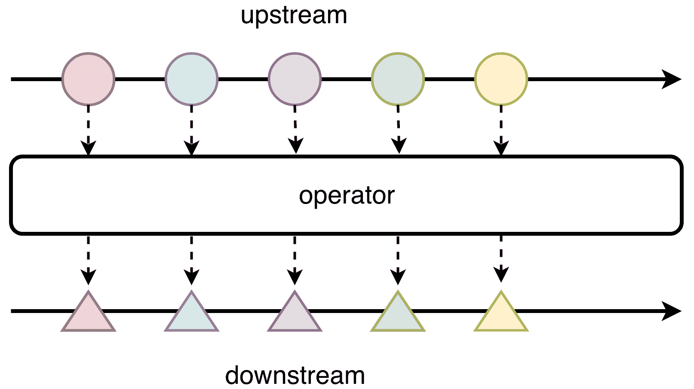

从`map`操作符的角度来看，`filter`函数发出的值属于**上游**，而`reduce`方法获取的项目属于**下游**。

前一个示例的结果如下所示：

```java
1
9
```

输出显示，在所有转换之后，`Flux`类的实例只发出两个数字。

# 过滤操作符

`filter`方法接受一个谓词，如果上游的值不满足谓词的条件，则不会将其传递到下游。

*谓词*是一个接受参数并返回布尔值的函数。

以下图表展示了在前一个示例中`filter`方法的工作原理：

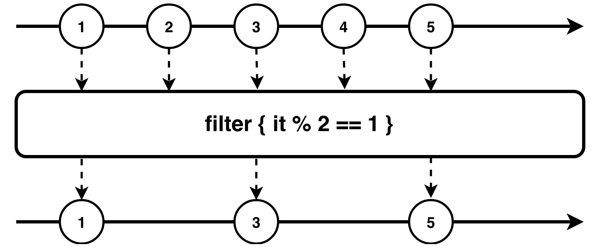

在这个例子中，`filter`操作符仅用于接收奇数。

# `map`操作符

`map`操作符接受一个 lambda，它为上游的每个值应用一个转换。`map`函数可以用来更改原始值的值，或者将一个实例从一种类型转换到另一种类型。

下面的图示展示了它是如何工作的：

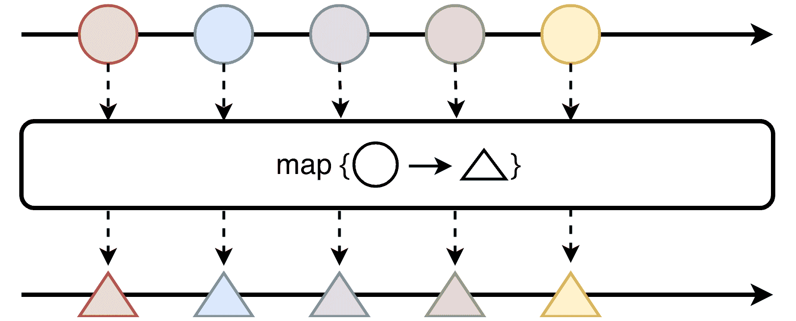

`map`函数接受另一个函数，该函数描述了上游元素应该如何转换。

# `flatMap`操作符

`flatMap`操作符与`map`类似，但它是**异步**的。这意味着它应该返回一个可以在未来返回值的实例，例如`Flux`或`Mono`。以下示例代码展示了如何使用它：

```java
Flux.fromArray(arrayOf(1, 2, 3))
        .flatMap { Mono.just(it).delayElement(Duration.ofSeconds(1)) }
        .subscribe { println(it) }
```

此示例的输出如下所示：

```java
 1
 2
 3
```

**Mono**与`Flux`类似，但它可以发出一个或零个元素。在这个例子中，我们使用了`delayElement`函数，这就是为什么每个元素都是通过一个订阅者以一秒的延迟接收到的。

下面的图示展示了它是如何工作的：

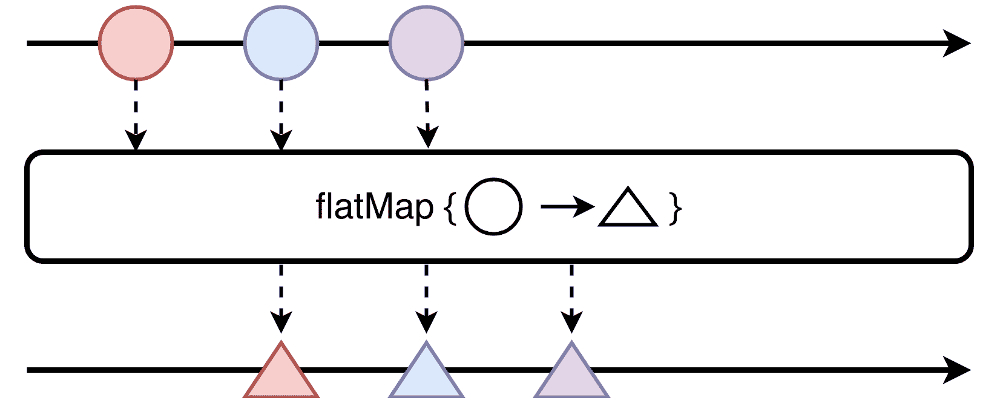

这表明每个`flatMap`操作符都会异步地将每个值传递到下游，并延迟一秒钟。

# `reduce`操作符

`reduce`函数接受`BiFunction`类型的实例，该实例包含`apply`函数，它接受两个值并返回一个。可以使用`this`操作符将上游的所有项目组合成一个单一值，如下所示：

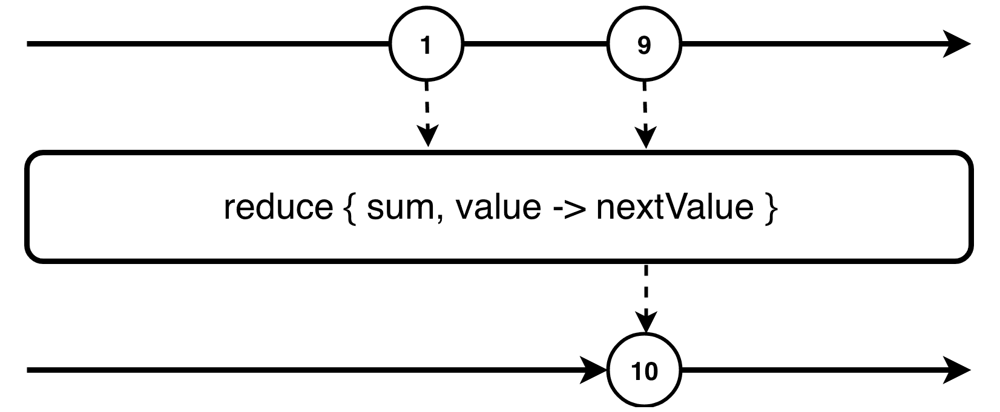

前面的图示显示上游包含两个值，`reduce`函数将它们的和传递到下游。

# `from`静态方法

`fromArray`函数是`Flux`类提供的许多静态工厂方法之一。如果我们想创建自己的事件源，我们可以使用`from`函数。让我们创建一个当用户点击按钮时发出`Unit`对象的`Flux`类实例。

我们可以按如下方式实现这个案例：

```java
Flux.from<Unit> { subscriber ->
    findViewById<Button>(R.id.button).setOnClickListener {
        subscriber.onNext(Unit)
    }
}.subscribe {
    Toast.makeText(this, "Clicked!", Toast.LENGTH_LONG).show()
}
```

前面的代码片段展示了如何将观察者包装成`Flux`类的实例。这个例子说明了如何使用`from`函数创建`Flux`类的新实例。

让我们运行一个应用程序并按下“THE OBSERVER PATTERN”按钮：

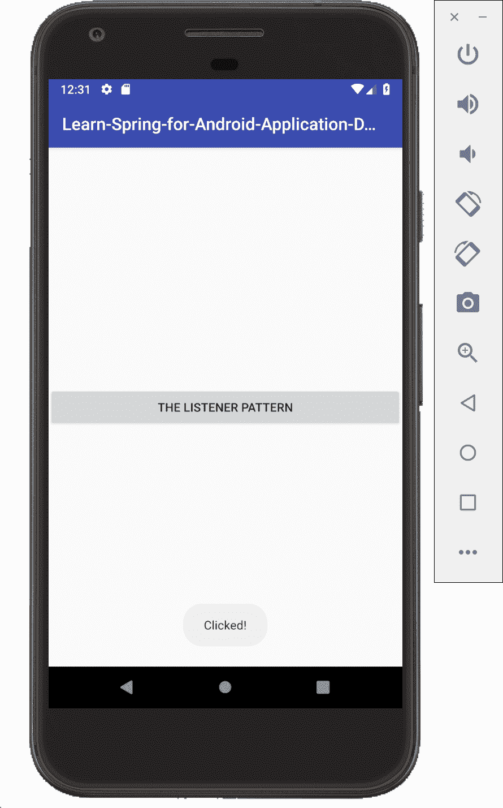

前面的截图显示了示例的工作方式。当用户点击按钮时，`onNext`方法被调用，并且`Observable`发出一个值。我们传递给`subscribe`方法的 lambda 被调用，并显示一条消息。

# 取消

`Activity`或`Fragment`类的实例具有由方法表示的生命周期，例如`onCreate`和`onDestroy`。我们应该使用`onDestroy`方法清理所有资源，以避免内存泄漏。

`subscribe`方法返回一个`Disposable`类型的实例，如下所示：

```java
public final Disposable subscribe(Consumer<? super T> consumer) {
   Objects.requireNonNull(consumer, "consumer");
   return subscribe(consumer, null, null);
}
```

`Disposable`接口包含两个方法，如下所示：

+   `dispose` 取消发布者

+   `isDisposed` 如果发布者已经被取消返回 `true`

以下示例代码展示了在调用 `onDestroy` 方法时如何取消发布者：

```java
class ObserverActivity : AppCompatActivity() {

    private var disposable: Disposable? = null

    override fun onCreate(savedInstanceState: Bundle?) {
        super.onCreate(savedInstanceState)
        setContentView(R.layout.activity_observer)
        disposable = Flux.from<Unit> { subscriber ->
            findViewById<Button>(R.id.button).setOnClickListener {
                subscriber.onNext(Unit)
            }
        }.subscribe {
            Toast.makeText(this, "Clicked!", Toast.LENGTH_LONG).show()
        }
    }

    override fun onDestroy() {
        super.onDestroy()
        disposable?.dispose()
    }
}

```

如您所见，`onDestroy` 方法调用 `dispose` 方法来取消对 `Flux` 类实例的订阅。

# Mono 发布者

*Mono* 发布者与 Flux 的工作方式类似，但只能发出没有值或单个值。我们可以使用这个来向服务器发起请求并返回结果。

以下示例代码发起请求并接收 `Comic` 类的实例，加载 `Bitmap` 类的实例并显示检索到的图像：

```java
Mono.fromDirect<Comic> { subscriber -> subscriber.onNext(loadComic()) }
        .map { comic -> comic.img }
        .flatMap { path -> Mono.fromDirect<Bitmap> { subscriber -> subscriber.onNext(loadBitmap(path)) } }
        .subscribeOn(Schedulers.single())
        .subscribe { bitmap ->
            Handler(Looper.getMainLooper()).post {
                findViewById<ImageView>(R.id.imageView).setImageBitmap(bitmap)
            }
        }
```

`subscribeOn` 方法用于指定长期任务的调度器。让我们按照以下方式运行此示例：


前面的代码片段检索 `Comic` 类的实例，将其转换为图像路径，加载图像，然后显示下载的图像。

# 阻塞和非阻塞

当我们与 Android 一起工作时，我们应该记住我们有一个负责用户界面的主线程。首先，在主线程中调用长期操作不是一个好主意，因为在这种情况下，用户界面会冻结。其次，当我们调用同步方法时，它会阻塞一个线程。我们的用户界面在主线程调用的函数返回结果之前不会响应。这就是为什么我们应该异步调用长期操作，响应式编程可以帮助我们做到这一点。

`Mono` 和 `Flux` 类包含 `publishOn` 和 `subscribeOn` 方法，可以在调用操作符时切换线程。`subscribeOn` 方法用于指定产生发出值的调度器，而 `publishOn` 用于指定 `observable` 的下游的线程调度器。

调度器是对线程池的抽象。以下示例代码创建了一个使用主线程的自己的调度器：

```java
val UIScheduler = Schedulers.fromExecutor { runnable ->     Handler(Looper.getMainLooper()).post(runnable) 
}
```

现在，我们可以以以下方式重写 Mono 发布者部分的一个示例：

```java
Mono.fromDirect<Comic> { subscriber -> subscriber.onNext(loadComic()) }
        .map { comic -> comic.img }
        .flatMap { path -> Mono.fromDirect<Bitmap> { subscriber -> subscriber.onNext(loadBitmap(path)) } }
        .subscribeOn(Schedulers.single())
        .publishOn(UIScheduler)
        .subscribe { bitmap -> findViewById<ImageView>(R.id.imageView).setImageBitmap(bitmap) }
```

`Schedulers` 类的单个函数返回一个 `Scheduler` 类型的实例，该实例在底层创建和使用单个线程。`subscribeOn` 方法指定上游的所有操作符都必须使用由 `single()` 函数返回的调度器。

我们传递一个使用 **主线程** 的自己的调度器。因此，传递给 `subscribe` 方法的 lambda 表达式在 **主线程** 上执行。

以下图表显示了这是如何工作的：

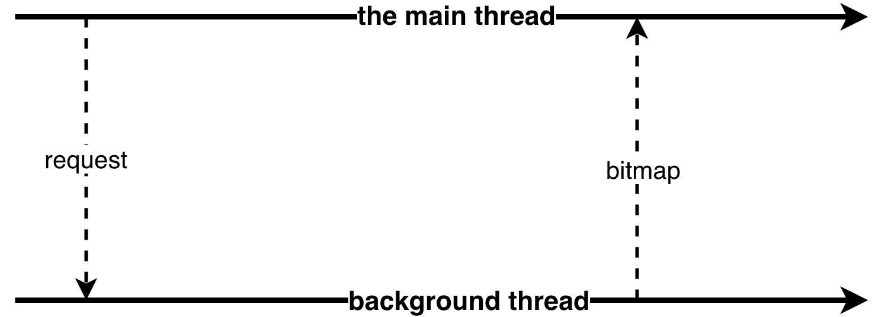

图表显示 **主线程** 没有被阻塞，并且以后台并行运行。

# RxJava

**RxJava** 是另一个流行的库，它实现了响应式编程的概念。它还提供了类型，如 Observable 或 Single，可以发出值。所有这些类也提供了静态工厂和操作符。

在本节中，我们将涵盖以下内容：

+   如何使用 Flowable 类

+   如何使用 Observable 类

+   如何使用 Single 类

+   如何使用 Maybe 类

+   如何使用 Completable 类

# Flowable

`Flowable` 类是在 RxJava 库的第二版中引入的。此类表示事件流，如 Reactor 中的 Flux。

当您从文件、数据库或网络读取数据时，应考虑使用 `Flowable`。以下示例代码展示了如何创建和使用 `Flowable`：

```java
Flowable.fromIterable(listOf(1, 2, 3))
        .subscribe { println(it) }

```

这显示了如何创建一个发出值的 `Flowable` 类的实例。

# 可观察性

`Observable` 类类似于 `Flowable`，但它可以抛出 `MissingBackpressureException`。

**背压**是指可观察性产生的值比订阅者消耗得快的情形。在这种情况下，会抛出 `MissingBackpressureException`。

一个示例用例如下：

```java
Observable.fromIterable(listOf(1, 2, 3))
        .subscribe { println(it) }
```

前面的代码片段显示了如何创建一个发出值的 `Observable` 类的实例。

值得注意的是，`Observable` 的开销低于 `Flowable`。当您处理用户界面事件时，应考虑使用 `Observable`。

有一些操作符可以帮助您处理背压，例如 *debounce* 或 *throttle*。让我们来看看每一个。

# `debounce` 操作符

`debounce` 方法接受一个持续时间，并返回一个 `Observable` 类的实例，该实例仅在从上次发出值的时间点开始的时间段等于传递的时间时才发出值。以下图表解释了这是如何工作的：

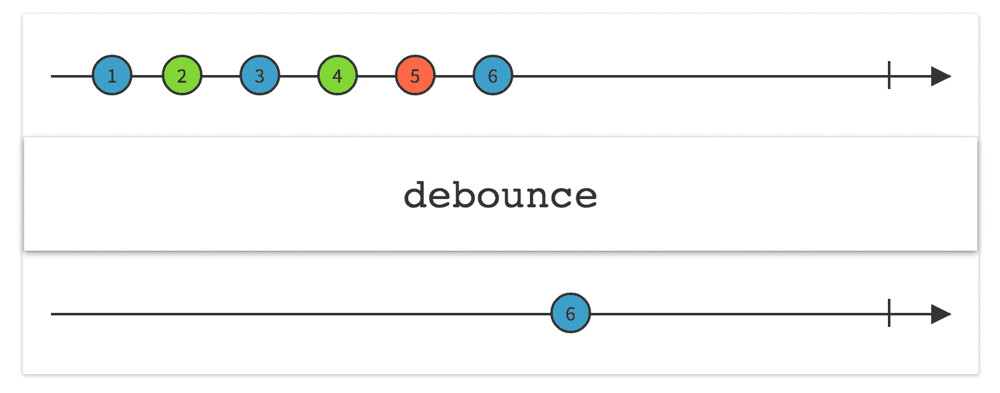

前面的图表显示了 `debounce` 方法如何减少事件。`debounce` 方法接受一个时间框架，并返回一个新的 `Observable` 类型的实例，该实例仅在当前时间框架内发出在此期间产生的最后一个值。

# 节流操作符

`throttle` 操作符返回一个 `Observable` 实例，该实例在上游的顺序时间窗口内只发出一个项目。节流是一系列方法，如 `throttleFirst` 或 `throttleLast`。

以下图表显示了 `throttleFirst` 方法的工作方式：

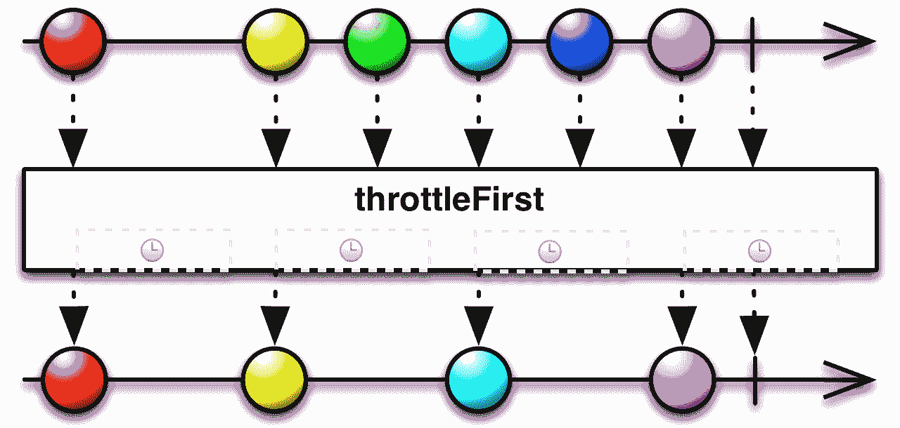

`throttleLast` 方法的工作方式如下：

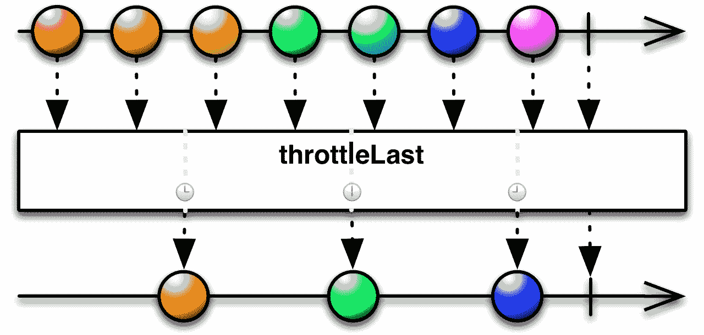

前面的图表显示，`throttleFirst` 和 `throttleLast` 方法可以用来减少发出的值。

# Single

`Single` 类的工作方式与 Reactor 库中的 `Mono` 类似。这也可以用来向服务器发起请求。当源只返回一个项目时，我们应该考虑使用 `Flowable`。

以下示例代码展示了如何使用 `Single`：

```java
Single.just(1).subscribe(Consumer<Int> { println(it) })
```

此代码片段包含一个发出单个值的 `Single` 类的实例。

# Maybe

`Maybe` 类型的实例可以不发出值，或者发出单个值。以下示例代码展示了如何使用 `Maybe` 和 `test` 方法：

```java
Maybe.just(1)
        .map { item -> item + 1 }
        .filter { item -> item == 1 }
        .defaultIfEmpty(4)
        .test()
        .assertResult(4)
```

`test` 方法返回一个用于测试的 `TestObservable` 类的实例，其中包含 `assertResult` 等方法。`Maybe` 类的 `defaultIfEmpty` 方法允许我们指定一个默认值，当 `Maybe` 类的实例为空时可以发出。

# Completable

`Completable` 类的实例根本不发出任何值。它可以用来通知用户任务完成。此外，当我们从数据库中删除项时，也可以使用它。

以下示例代码展示了从数据库中删除项的情况：

```java
Completable.fromAction { Database.delete() }
        .test()
        .assertComplete()
```

`test` 方法返回 `TestObservable` 类的实例。

# RxJava in Android

RxJava 是 Android 开发中非常流行的库，还有许多基于 RxJava 的其他库，例如 RxAndroid 和 RxBinding。

本节将涵盖以下主题：

+   The RxAndroid library

+   The RxBinding library

# The RxAndroid library

RxAndroid 库提供了一个使用主线程的调度器。以下示例代码展示了如何使用此调度器：

```java
Flowable.fromIterable(listOf(1, 2, 3))
        .subscribeOn(Schedulers.computation())
        .observeOn(AndroidSchedulers.mainThread())
        .subscribe { println(it) }
```

前面的代码片段展示了如何使用 `observeOn` 方法在主线程上处理发出的值。

# The RxBinding library

RxBinding 库提供了一个响应式应用程序编程接口。让我们想象一下，我们想要观察 `EditText` 的输入并显示此文本在 `TextView` 中。

RxBinding 库为用户界面组件提供了扩展函数，例如 `textChanges`：

```java
fun TextView.textChanges(): InitialValueObservable<CharSequence> {
    return TextViewTextChangesObservable(this)
}
```

我们可以通过使用 `textChanges` 函数来实现我们的示例，如下所示：

```java
class RxActivity : AppCompatActivity() {

    private val editText by lazy(LazyThreadSafetyMode.NONE) {
        findViewById<EditText>(R.id.editText)
    }

    private val textView by lazy(LazyThreadSafetyMode.NONE) {
        findViewById<TextView>(R.id.textView)
    }

    override fun onCreate(savedInstanceState: Bundle?) {
        super.onCreate(savedInstanceState)
        setContentView(R.layout.activity_rx)
        editText
                .textChanges()
                .subscribe { textView.text = it }

    }
}
```

在前面的代码片段中，我们调用了 `textChanges` 函数并订阅了一个检索到的订阅者。`textChanges` 方法返回一个发出输入文本的 `Observable` 类的实例。

结果如下所示，显示输入文本立即出现在屏幕上：

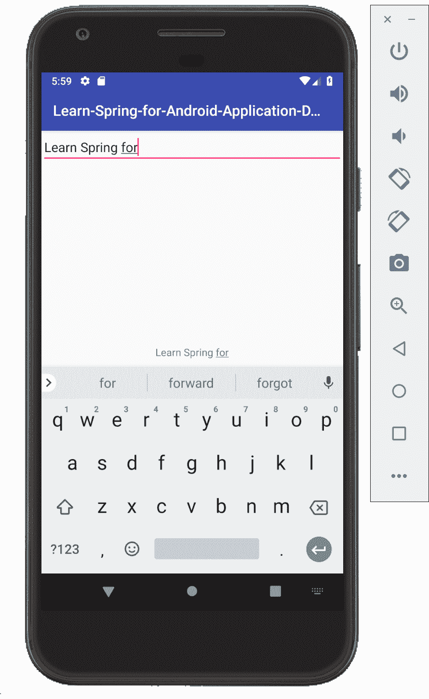

RxBinding 库还包含 `clicks` 扩展函数，如下所示：

```java
fun View.clicks(): Observable<Unit> {
    return ViewClickObservable(this)
}
```

`clicks` 扩展函数返回一个 `ViewClickObservable` 类的实例。

此外，`ViewClickObservable` 看起来如下：

```java
private class ViewClickObservable(
        private val view: View
) : Observable<Unit>() {

    override fun subscribeActual(observer: Observer<in Unit>) {
        if (!checkMainThread(observer)) {
            return
        }
        val observer = Observer(view, observer)
        observer.onSubscribe(observer)
        view.setOnClickListener(observer)
    }
  }
```

它使用 `subscribeActual` 方法将 `Observer` 类的实例传递给 `View` 类实例的 `setOnClickListener`。

`ViewClickObservable` 类继承自 `Observable` 类并重写了 `subscribeActual` 方法。

最后，`Observer` 类看起来如下：

```java
 private class Observer(
            private val view: View,
            private val observer: Observer<in Unit>
    ) : MainThreadDisposable(), OnClickObserver {

       override fun onClick(v: View) {
           if (!isDisposed) {
               observer.onNext(Unit)
           }
       }

       override fun onDispose() {
           view.setOnClickListerner(null)
       }
}
```

前面的代码片段在 `onClick` 方法被调用时调用 `onNext` 方法。

# 摘要

在本章中，我们探讨了响应式编程以及它是如何帮助我们处理异步事件的。我们还介绍了 React 和 RxJava 库，它们提供了遵循响应式编程概念的类，如 `Mono`、`Flux`、`Single` 和 `Observable`。

响应式编程允许我们使用不同的线程调度器以多线程方式处理和转换事件。阻塞和非阻塞部分向我们展示了如何与线程调度器协同工作。你也了解到响应式编程基于观察者模式。

现代安卓应用程序处理许多不同的异步事件，例如用户交互和推送通知。了解响应式编程非常重要，因为它可以帮助我们通过异步处理更好地管理资源，使我们能够构建能够进行多任务处理的应用程序。

在下一章中，你将学习如何创建 `Application` 类。

# 问题

+   什么是响应式编程？

+   什么是 Mono 类？

+   什么是 Observable 类？

+   什么是调度器？

# 进一步阅读

+   为了更全面地了解如何使用 Reactor 进行响应式编程，我推荐阅读 *《Reactors 响应式编程实战》* ([`www.packtpub.com/application-development/hands-reactive-programming-reactor`](https://www.packtpub.com/application-development/hands-reactive-programming-reactor))，作者：Rahul Sharma。
