# 第九章：创建应用程序

到目前为止，我们已经为您准备好成为一名专业的基于 Spring 的开发者。您已经学习了 Spring 是什么，以及其架构、组件、安全特性、数据库等功能。我们还向您展示了如何开发 Android 应用程序、处理 HTTP 请求以及使用数据库。

正如您所知，我们使用 Kotlin 语言开发了所有示例项目，而如今，这种语言因其简洁性和互操作性而在开发者中非常受欢迎。在本章中，我们将实现前几章的所有功能，以开发一个具有服务器和客户端的项目。

本章涵盖了以下主题：

+   项目想法

+   创建设计

+   服务器端：

    +   开发数据库模型

    +   创建项目和 Maven 依赖项

    +   创建实体、仓库和控制器

    +   实现安全性

    +   修改后的 application.properties

+   客户端：

    +   创建模型

    +   创建 HTTP 请求

    +   创建 API 服务

    +   修改活动

    +   获取 REST API

    +   创建适配器和 XML 布局

    +   检查输出

# 技术要求

你将需要几乎所有来自前几章的依赖项，例如安全、MySQL、JPA、Hibernate 和 JDBC。

本章的示例源代码可在 GitHub 上的以下链接找到：[`github.com/PacktPublishing/Learn-Spring-for-Android-Application-Development/tree/master/Chapter09`](https://github.com/PacktPublishing/Learn-Spring-for-Android-Application-Development/tree/master/Chapter09)

您将找到两个项目——`social_network`是服务器端，它是在 Spring 框架的帮助下开发的，而`ClientSide`是客户端，它是为 Android 平台开发的。

# 项目想法

项目想法是最重要的部分。您需要非常仔细地生成这个想法，并必须识别您项目背后的事实。您需要记住这个项目如何在市场上有效，用户将如何接受您的项目，为什么他们会使用它，为什么他们应该选择您的应用程序而不是其他应用程序，哪些功能将使其与其他现有类似项目不同，等等。在生成想法后，您需要在脑海中构思一个草稿，然后将其写在纸上，设计项目的流程，然后开发项目的代码。最后，您需要测试项目以确保其流畅性，检查是否存在错误或漏洞，并为其上市做准备。

在本章中，我们将创建一个类似社交网络的小型项目。我们将将其命名为`Packt Network`。该项目将有两个部分：一个是服务器，另一个是客户端，这两部分都将使用 Kotlin 编写。首先，我们创建一个 Spring 项目，我们将在这里构建我们的服务器和 REST API。数据将存储在 MySQL 数据库中，我们将使用 JDBC、JPA 和 Hibernate 来处理数据库。这些数据将通过 Spring Security 的基本身份验证得到保护。

在我们的第二个项目中，我们将创建一个 Android 应用程序，并处理服务器创建的 REST API。我们将使用 Retrofit 来处理 REST API 和网络。然后我们将创建一个注册和登录页面，使用用户名和密码创建和登录用户。之后，用户可以发布状态并查看其他所有用户的状态列表。也可以在状态中发布评论。

现在我们将开始设计和开发我们的服务器端项目，使用 Spring 框架。

# 服务器端

在服务器端，我们使用 Spring 框架。我们将使用 MySQL 数据库处理所有数据，并使用基本认证保护资源。

首先，我们将设计项目的后端逻辑。然后我们将规划 REST API。我们将使用 MySQL Workbench 创建数据模型。然后我们将使用 [`start.spring.io`](http://start.spring.io) 创建项目。然后我们将使用 JPA 和 Hibernate 创建数据库实体，并检查 REST API 是否工作。为此，我们将使用名为 Insomnia 的 HTTP 客户端软件工具。然后我们将使用 Spring Security 实现基本认证以保护我们的资源。最后，我们将给你一个任务来完成，即升级项目，并成为 GitHub 上这个项目的贡献者。

# 创建设计

正如我们之前提到的，这个项目将类似于一个社交媒体平台；用户可以发布他们的状态，其他人可以在时间轴中看到它们，并可以点赞、添加评论等等。对于这个项目，服务器端不会有 UI。我们将创建一个后端服务器。为了创建这个服务器，我们需要创建一个客户端应用程序可以使用的 REST API。为此，我们需要基于我们的 REST API 创建一个数据库。

首先，我们将数据库表名、HTTP 函数请求和 URL 路径分开。

将有四个表：

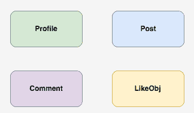

让我们逐一查看它们：

+   其中一个是用于用户的。所有用户的信息都将存储在一个名为 `Profile` 的表中。

+   还将有一个名为 `Post` 的表，其中将存储所有用户的发布状态。

+   另一个名为 `Comment` 的表将存储所有发布状态的评论。

+   另一个名为 `LikeObj` 的表将存储所有发布状态的点赞，但我们不会为评论提供此功能。

现在我们将使用 HTTP 函数请求创建 REST API 的 URL 路径，并且所有输出都将设计为 JSON。我们使用 JSON，因为它非常容易为所有开发者处理和理解。

关于 `Profile` 表，以下是 HTTP 请求的 URL 路径：

+   `POST http://localhost:8080/user/new`: 这个请求将创建一个包含用户在个人资料中发布的所有信息的用户资料

+   `GET http://localhost:8080/user/{id}`: 这个请求将获取给定 `id` 持有者的详细信息

+   `PUT http://localhost:8080/user/{id}`: 这个请求将更新给定`id`持有者的用户详细信息

+   `DELETE http://localhost:8080/user/{id}`: 这个请求将删除给定`id`持有者的用户详细信息，包括此用户的所有帖子、评论和点赞

关于`Post`表，以下是 HTTP 请求的 URL 路径：

+   `POST http://localhost:8080/post/{id}/new`: 这个请求将从`id`持有者创建一个帖子

+   `GET http://localhost:8080/posts`: 这个请求将获取所有帖子的详细信息

+   `GET http://localhost:8080/post/{id}`: 这个请求将获取给定`id`持有者的帖子详细信息

+   `DELETE http://localhost:8080/post/{id}`: 这个请求将删除给定`id`持有者的帖子详细信息，包括所有评论

关于`Comment`表，以下是 HTTP 请求的 URL 路径：

+   `POST http://localhost:8080/comment/{post_id}`: 这个请求将在`post_id`持有者上创建一个评论

+   `DELETE http://localhost:8080/comment/{post_id}`: 这个请求将删除给定`post_id`持有者的评论

关于`LikeObj`表，以下是 HTTP 请求的 URL 路径：

+   `POST http://localhost:8080/like/new`: 这个请求将点赞`post_id`持有者的帖子

+   `DELETE http://localhost:8080/like/new`: 这个请求将取消点赞`post_id`持有者的帖子

# 开发数据库模型

我们将使用 JPA，最明显的点之一是不建议创建数据库，因为众所周知，JPA 将自动使用项目的实体类创建数据库表和字段。但仍然，我们需要创建一个演示数据库并绘制一个 EER 图。您可以在纸上创建 EER，或者您可以使用 MySQL Workbench 在数字上创建一个。这里，我们将使用 MySQL Workbench，它有一个免费版本。这是开发数据库或为数据库创建模型的最佳工具之一：

1.  您需要从[这里](https://dev.mysql.com/downloads/workbench/)下载此软件，如果您还没有的话。然后安装并运行它。正如我们之前提到的，我们有一些默认值：

```kt
Host -- localhost // our hosting URL
Port -- 3306 // our hosting port
Username -- root // username of the MySQL
Password -- 12345678 // password of the MySQL
```

1.  打开此应用程序并选择模型选项，如下面的截图所示：

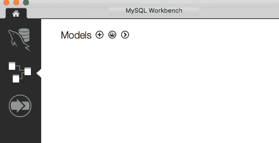

1.  点击加号（+）为我们的应用程序创建一个新的模型。在新窗口中，您将找到创建模型所需的所有必要功能。将此模型保存为`my_app`：

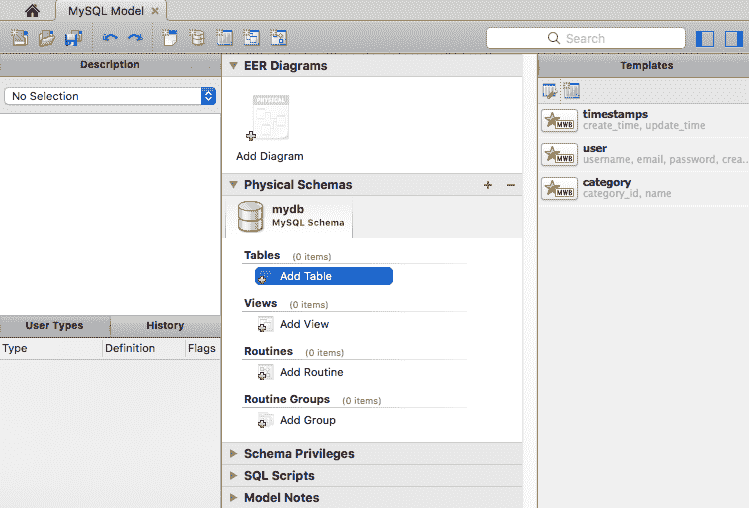

1.  创建一个名为`Profile`的表。列将是`id（主键）`、`username`、`password`、`email`、`first_name`、`last_name`、`acc_created_time`、`contact_number`、`dob`、`city`和`country`。

1.  创建一个名为`Post`的表。列将是`id（主键）`和`text`。

1.  创建另一个名为`Comment`的表。列将是`id（主键）`和`text`。

1.  最后，创建一个名为`Like`的表。列将是`id（主键）`。

但是，表之间有一些关系：

+   在 `Profile` 和 `Post` 之间：`Post` 存在多对一关系，因为一个用户可以发布多条状态，而每条状态只有一个用户。

+   在 `Profile` 和 `Comment` 之间：`Comment` 存在多对一关系，因为一个用户可以发表多条评论，而每条评论只有一个用户。

+   在 `Profile` 和 `Like` 之间：`Like` 存在多对一关系，因为一个用户可以点赞多个帖子，而每个点赞只有一个用户。

+   在 `Post` 和 `Comment` 之间：`Post` 存在一对多关系，因为一篇文章可能有多个评论，但评论只针对一篇文章。

+   在 `Post` 和 `Like` 之间：`Post` 存在一对多关系，因为一篇文章可能有多个点赞，但每个点赞只针对一篇文章：

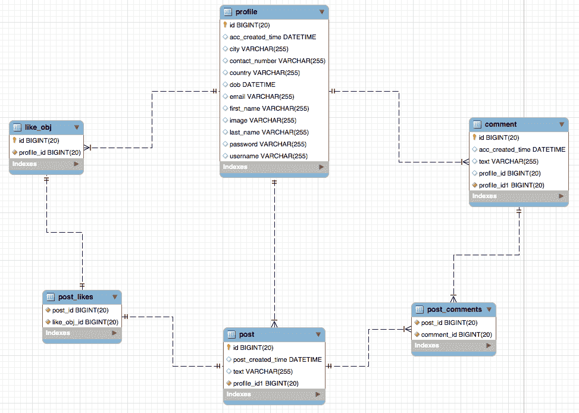

因此，在所有关系确定之后，我们可以看到数据库的表名，如下面的截图所示：

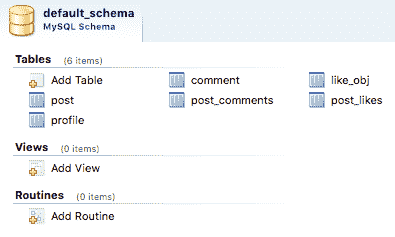

最后，你可以通过点击 EER 图标创建 EER 图，如下面的截图所示：

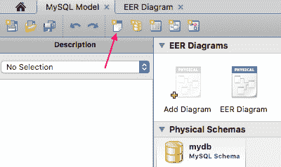

这是我们的项目的 EER 图模型。你可能还会发现两个额外的表，名为 `post_likes` 和 `post_comments`。这些表是通过 JPA 和 Hibernate 生成的。我们将在稍后讨论这个问题。

因此，我们的数据库建模已经完成。现在你可以将其导出为 SQL 并为项目创建数据库。但我们建议你不要这样做，因为我们需要进行一些修改。

现在创建项目。

# 创建项目

要创建一个项目，请访问 [`start.spring.io`](https://start.spring.io) 并创建一个基于 Kotlin 的项目。以下是项目的依赖项：

+   Web

+   JDBC

+   MySQL

+   DevTools

+   JPA

+   H2

你可以在 `pom.xml` 文件中找到这些依赖项。在那里你可以更新、添加或删除依赖项。

要启用 JPA 审计，你需要在 `SocialNetworkApplication.kt` 类上添加 `@EnableJpaAuditing` 注解。这将启用 JPA 功能的使用。

这是这个类的代码：

```kt
@SpringBootApplication
@EnableJpaAuditing class SocialNetworkApplication

fun main(args: Array<String>) {
   runApplication<SocialNetworkApplication>(*args)
}
```

# 创建实体

首先，我们需要创建四个数据库表细节。这四个实体是 `Profile`、`Post`、`Comment` 和 `LikeObj`。在接下来的章节中，你将学习如何创建实体类。

# 创建 `Profile` 实体

使用 `@Entity` 注解创建一个名为 `Profile.kt` 的 `Profile` 实体，将其转换为实体类。以下是这个模型类的代码（完整代码可以在提供的 GitHub 链接中找到）：

```kt
@Entity
class Profile : Serializable {

    constructor(id: Long) {
        this.id = id
    }

    constructor(name: String) {
        this.username = name
    }
    -----
    -----
 @JsonProperty("contactNumber")
 var contactNumber: String? = null

 @JsonProperty("dob")
 var dOB: Date? = null

 @JsonProperty("city")
 var city: String? = null

 @JsonProperty("country")
 var country: String? = null
}
```

在这个类中，我们有 `11` 个元素，包含所有用户详情。我们有四个构造函数，可以根据我们的任务使用这个模型。以下是构造函数：

```kt
constructor(id: Long) {
  ----
  ----
}

constructor(name: String) {
  ----
  ----
}

constructor(id: Long, name: String, password: String) {
  ----
  ----
}

constructor(username: String, password: String, email: String, accCreatedTime: Instant,
 firstName: String?, lastName: String?, contactNumber: String?, dOB: Date?,
 city: String?, country: String?) {
  ----
  ----
}
```

现在我们来讨论这个类中使用的注解：

```kt
@Id
@GeneratedValue
var id: Long? = 0
```

根据前面的代码，我们在 `id` 上使用了 `@Id` 注解，这意味着 `id` 是 `Profile` 实体的主键。`@GeneratedValue` 注解表示它会增加 `id` 的值。

这是 `password` 对象的代码片段：

```kt
@JsonIgnore
@JsonProperty("password")
var password: String = ""
```

根据这段代码，`@JsonIgnore` 使用变量或函数。如果你使用它，那么请求的 JSON 不会显示这个变量。在这里，我们用它来处理 `password`，这意味着没有人可以获取密码。

`@JsonProperty` 定义了在 JSON 的序列化和反序列化过程中，它改变了其元素逻辑属性的可见性。

# 创建一个帖子实体

创建一个名为 `Post.kt` 的帖子实体，并使用 `@Entity` 注解将其转换为实体类。以下是这个模型类的代码：

```kt
@Entity
class Post(text: String, postedBy: Profile) : Serializable {

    @Id
    @GeneratedValue
    var id: Long? = 0

    var text: String? = text

    @ManyToOne(fetch = FetchType.LAZY)
    @JoinColumn(name = "profile_id")
    @JsonIgnoreProperties("username","password", "email","accCreatedTime","firstName","lastName",
            "contactNumber","dob","city","country")
    var postedBy: Profile? = postedBy

    @JsonIgnore
    @JsonProperty("postCreatedTime")
    var postCreatedTime: Instant? = Instant.now()

    @OneToMany(cascade = [CascadeType.ALL], fetch = FetchType.LAZY, orphanRemoval=true)
    val comments = mutableListOf<Comment>()

    @OneToMany(cascade = [CascadeType.ALL], orphanRemoval = true)
    var likes: List<LikeObj>? = mutableListOf<Comment>()
}
```

这里有两个元素和一个构造函数。以下是构造函数：

```kt
@Entity
class Post(text: String, postedBy: Profile) : Serializable {
   -----
   -----
}
```

现在是时候讨论一些在这个类中使用的新注解了：

```kt
@ManyToOne(fetch = FetchType.LAZY)
@JoinColumn(name = "profile_id")
@JsonIgnoreProperties("username","password", "email","accCreatedTime","firstName","lastName",
            "contactNumber","dob","city","country")
    var postedBy: Profile? = postedBy
```

`@ManyToOne` 在 `Profile` 变量上表示这将指示哪个用户发布了那个特定的状态。

`@JoinColumn` 表示其访问元素 `Profile` 通过 `profile_id` 与外键连接。

`@JsonIgnoreProperties(......)` 注解在反序列化过程中忽略 JSON 属性。在这个项目中，当你获取帖子的 JSON 时，在 `profile` 属性中你只会找到 `id`。以下是一个简单的 JSON 示例：

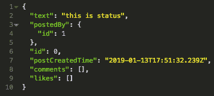

你可以看到 `"id":0`，这是帖子的`id`。

现在创建一个 `Comment` 的可变列表，并用 `@OneToMany` 注解它，如下所示：

```kt
 @OneToMany(cascade = [CascadeType.ALL], fetch = FetchType.LAZY, orphanRemoval=true)
    val comments = mutableListOf<Comment>()
```

`@OneToMany(....)` 表示一个帖子可以有多个评论和点赞。

`cascade = [CascadeType.ALL]` 属性是 Hibernate 的一个特性。这意味着你可以应用所有主要级联类型。

`fetch = FetchType.LAZY` 表示在第一次访问时它会懒加载数据。

`orphanRemoval=true` 表示如果帖子被删除，那么这个帖子上的所有评论和点赞也会自动删除。

# 创建评论实体

创建一个名为 `Comment.kt` 的 `Comment` 实体，并使用 `@Entity` 注解将其转换为实体类。以下是这个模型类的代码：

```kt
@Entity
class Comment(text: String, postedBy: Profile) : Serializable {

    @Id
    @GeneratedValue
    var id: Long? = 0

    var text: String? = text

    @JsonIgnore
    @JsonProperty("accCreatedTime")
    var accCreatedTime: Instant? = Instant.now()

    @ManyToOne
    @JoinColumn(name = "profile_id")
        @JsonIgnoreProperties("username","password","email","accCreatedTime","firstName","lastName"       , "contactNumber","dob","city","country")
    var postedBy: Profile? = postedBy
}
```

这里有三个元素和一个构造函数。以下是构造函数：

```kt
@Entity
class Comment(text: String, postedBy: Profile) : Serializable {
   -----
   -----
}
```

# 创建点赞实体

创建一个名为 `LikeObj.kt` 的点赞实体，并使用 `@Entity` 注解将其转换为实体类。以下是这个模型类的代码：

```kt
@Entity
class LikeObj(mProfile: Profile) : Serializable {

    @Id
    @GeneratedValue
    var id: Long? = 0

    @ManyToOne
    @JoinColumn(name = "profile_id")
    @JsonIgnoreProperties("username","password","email","accCreatedTime","firstName","lastName",
            "contactNumber","dob","city","country")
    var profile: Profile? = mProfile
}
```

这里有一个元素和一个构造函数。以下是构造函数：

```kt
@Entity
class LikeObj(profile: Profile) : Serializable {
   -----
   -----
}
```

# 创建仓库

创建一个名为 `ProfileRepository.kt` 的用户资料仓库，并实现具有所有必要的 CRUD 请求方法的 `JpaRepository` 仓库以获取数据库。以下是这个类的代码：

```kt
@Repository
interface ProfileRepository : JpaRepository<Profile, Long>
```

现在创建一个名为 `PostRepository.kt` 的帖子仓库，并实现具有所有必要的 CRUD 请求方法的 `JpaRepository` 仓库以获取数据库。以下是这个类的代码：

```kt
@Repository
interface PostRepository : JpaRepository<Post, Long>
```

然后创建一个名为 `CommentRepository.kt` 的评论仓库，并实现具有所有必要的 CRUD 请求方法的 `JpaRepository<>` 仓库以获取数据库。以下是这个类的代码：

```kt
@Repository
interface CommentRepository : JpaRepository<Comment, Long>
```

最后，创建一个名为 `LikeRepository.kt` 的 `like` 模型存储库，并实现具有所有必要 CRUD 请求方法的 `JpaRepository<>` 存储库以获取数据库。以下是该类的代码：

```kt
@Repository
interface LikeRepository : JpaRepository<LikeObj, Long>
```

要删除与已删除帖子相关的所有数据，我们需要为名为 `DeletePCLRepository.kt` 的 `profile` 创建一个存储库，并实现一个名为 `DeletePCLByIDInterface.kt` 的接口，该接口有一个函数，用于删除与已删除用户相关的所有数据。以下是该接口的代码：

```kt
interface DeletePCLByIDInterface {
    fun deleteAllUsersInfoByUserID(userID: Long): Any
}
```

这里是 `DeletePCLRepository.kt` 类的代码：

```kt
@Repository
class DeletePCLRepository : DeletePCLByIDInterface {

    @Autowired
    private lateinit var jdbcTemplate: JdbcTemplate

    override fun deleteAllUsersInfoByUserID(userID: Long): Any {

        val deletePosts = "DELETE FROM post, comment WHERE profile_id = ?;"
        val deleteComments = "DELETE FROM comment WHERE profile_id = ?"
        val deleteLikes = "DELETE FROM like_obj WHERE profile_id = ?"

        jdbcTemplate.update(deletePosts, userID)
        jdbcTemplate.update(deleteComments, userID)
        jdbcTemplate.update(deleteLikes, userID)

        return "DONE"
    }
}
```

要检查注册用户，创建一个名为 `UserExistRepository.kt` 的存储库，并实现一个名为 `UserExistInterface.kt` 的接口，该接口有两个函数。

这里是接口的代码：

```kt
interface UserExistInterface{
    fun isUserExist(name: String): Boolean
}
```

在这个接口中，`isUserExist(username: String)` 将搜索数据库的 `Profile` 表并基于用户的存在返回一个 `Boolean`。

这里是 `UserExistRepository.kt` 类的代码：

```kt
@Repository
class UserExistRepository: UserExistInterface {
    @Autowired
    private lateinit var jdbcTemplate: JdbcTemplate

    override fun isUserExist(name: String): Boolean {
        val sql = "SELECT count(*) FROM PROFILE WHERE username = ?"
        val count = jdbcTemplate.queryForObject(sql, Int::class.java, name)
        return count != 0
    }
}
```

在这个类中，我们添加了 `@Autowired` 注解来自动装配 `JdbcTemplate` 以利用 JDBC 数据库。我们 `重写` 了 `issue exist(name: String)` 函数。

`"SELECT count(*) FROM PROFILE WHERE username = ?"` 是一个用于从数据库的 `Profile` 表中搜索现有用户的 SQL 查询。如果存在用户，则它将返回 `true`。

# 创建控制器

现在，创建一个名为 `AppController.kt` 的控制器类，并使用 `@RestController` 注解将其转换为控制器类：

```kt
@RestController class AppController {
    -----
    -----
}
```

现在按照以下代码自动装配存储库。

```kt
@Autowired
private lateinit var profileRepository: ProfileRepository

@Autowired
private lateinit var userExist: UserExistRepository

@Autowired
private lateinit var postRepository: PostRepository

@Autowired
private lateinit var commentRepository: CommentRepository

@Autowired
private lateinit var likeRepository: LikeRepository

@Autowired
private lateinit var deletePCLRepository : DeletePCLRepository
```

然后创建 HTTP 函数请求。我们在这里不讨论这个问题，因为我们已经在 第四章，*Spring Modules for Android* 中描述了 HTTP 请求的使用。

# 创建个人资料的 HTTP 请求

现在为个人资料创建 HTTP 请求函数。

这里是创建个人资料 `POST` 请求的函数：

```kt
// New Profile registration
@PostMapping("/profile/new")
fun registerUser(@RequestBody profile: Profile): Any {
    if (!userExist.isUserExist(profile.username)) {
        profile.password = passwordEncoder.encode(profile.password)
        profileRepository.save(profile)
        return profile
    }
    return "{\"duplicate\": \"${profile.username} is taken. Try another\"}"
}
```

这里是创建个人资料 `GET` 请求的函数：

```kt
// Get Profile by ID
@GetMapping("/profile/{id}")
fun getUserById(@PathVariable("id") id: Long): Any {
    return profileRepository.findById(id)
}
```

这里是创建个人资料 `PUT` 请求的函数：

```kt
//     Update Profile by ID
@PutMapping("/profile/{id}")
fun updateUserById(@PathVariable("id") id: Long, @RequestBody mUser: Profile): Any {
    val profile = profileRepository.getOne(id)
    if (mUser.firstName != null) profile.firstName = mUser.firstName
    if (mUser.lastName != null) profile.lastName = mUser.lastName
    if (mUser.contactNumber != null) profile.contactNumber = mUser.contactNumber
    if (mUser.city != null) profile.city = mUser.city
    if (mUser.country != null) profile.country = mUser.country
    return profileRepository.save(profile)
}
```

这里是创建个人资料 `DELETE` 请求的函数：

```kt
// Delete Profile by ID
@DeleteMapping("/profile/{userId}")
fun deleteUserById(@PathVariable("userId") userId: Long): Any {
    deletePCLRepository.deleteAllUsersInfoByUserID(userId)
    return profileRepository.deleteById(userId)
}
```

# 创建帖子的 HTTP 请求

现在为 `Post` 创建 HTTP 请求函数。

这里是创建帖子 `POST` 请求的函数：

```kt
// Post status by Profile ID
@PostMapping("/post/{profile_id}/new")
fun submitPost(@PathVariable("profile_id") profile_id: Long, @RequestParam text: String): Any {
        val mPost = Post(text, Profile(profile_id))
        postRepository.save(mPost)

        return mPost
    }
```

这里是创建帖子 `GET` 请求以获取所有帖子的函数：

```kt
// Get all posted status
@GetMapping("/posts")
fun getPostList(): Any {
    return postRepository.findAll()
}
```

这里是创建帖子 `GET` 请求以获取单个帖子的函数：

```kt
// Get all posted status by Profile ID
@GetMapping("/post/{id}")
fun getPostById(@PathVariable("id") id: Long): Any {
    return postRepository.findById(id)
}
```

这里是创建帖子 `PUT` 请求以更新单个帖子的函数：

```kt
// Update all posted status by Profile ID
 @PutMapping("/post/{profile_id}")
    fun updatePostById(@PathVariable("profile_id") id: Long, @RequestParam text: String): Any {
        val modifiedPost = postRepository.getOne(id)
        modifiedPost.text = text
        return postRepository.save(modifiedPost)
    }
```

这里是创建帖子 `DELETE` 请求的函数：

```kt
// Delete a posted status by Profile ID
@DeleteMapping("/post/{id}")
fun deletePostByUserId(@PathVariable("id") id: Long): Any {
    return postRepository.deleteById(id)
}
```

# 创建评论的 HTTP 请求

现在创建 `Comment` 的 HTTP 请求函数。

这里是创建评论 `POST` 请求的函数：

```kt
// Post comment in a post by Profile ID and Post ID
    @PostMapping("/comment/{post_id}")
    fun postCommentByPostId(@PathVariable("post_id") postId: Long, @RequestParam id: Long, @RequestParam commentText: String): Any {
        val optionalPost: Optional<Post> = postRepository.findById(postId)
        return if (optionalPost.isPresent) {
            val myComment = Comment(commentText, Profile(id))
            val post = optionalPost.get()
            post.comments.add(myComment)
            postRepository.save(post)
            return post
        } else {
            "There is no post.."
        }
    }
```

首先，我们需要通过查找现有帖子来初始化一个 `optionalPost` 对象。然后，如果帖子存在，我们创建一个名为 `myComment` 的 `Comment` 模型，然后添加可变列表的 `Comment`，然后使用 `postRepository` 保存帖子。

这里是创建评论 `GET` 请求的函数：

```kt
// get comment List of a post
@GetMapping("/comment/{id}")
fun getCommentListByPostId(@PathVariable("id") id: Long): Any {
    return commentRepository.findById(id)
}
```

这里是创建评论 `PUT` 请求的函数：

```kt
// get comment List of a post
@GetMapping("/comment/{id}")
fun getCommentListByPostId(@PathVariable("id") id: Long, @RequestParam text: String): Any {
    val modifiedComment = commentRepository.getOne(id)
    modifiedComment.text = text
    return commentRepository.save(modifiedComment)
}
```

这里是创建评论 `DELETE` 请求的函数：

```kt
// delete comment List of a status
@DeleteMapping("/comment/{id}")
fun deleteCommentByPostId(@PathVariable("id") id: Long): Any {
    return commentRepository.findById(id)
}
```

# 实现安全

我们正在实现基本认证安全。它将类似于我们在*第五章，使用 Spring Security 保护应用程序*中讨论的内容。但我们在那里使用了 **`inMemoryAuthentication()`**，而在这里我们将从数据库中获取用户名和密码，并使用 `UserDetailsService` 为项目实现它们：

1.  创建一个名为 `CustomUserDetailsService.kt` 的服务类。

1.  实现 `UserDetailsService` 并用 `@Service` 注解，使其成为一个服务类。以下是这个服务类的代码：

```kt
@Service
class CustomUserDetailsService: UserDetailsService {

 @Autowired
 private lateinit var userByNameRepository: UserByNameRepository

 @Throws(UsernameNotFoundException::class)
 override fun loadUserByUsername(username: String): User {
 val profile = userByNameRepository.getUserByName(username)

 return org.springframework.security.core.userdetails.User(username, profile.password,
 AuthorityUtils.createAuthorityList("USER"))
 }
}
```

1.  在这里，我们自动装配了 `UserByNameRepository.kt` 存储库并覆盖了 `loadUserByUsername(username: String)`。我们将从存储库中获取 `username` 和 `password` 并与客户端提供的 `username` 和 `password` 进行匹配。以下是 `UserByNameRepository.kt` 的代码：

```kt
@Repository
class UserByNameRepository: UserByNameInterface {
 @Autowired
 private lateinit var jdbcTemplate: JdbcTemplate

 override fun getUserByName(username: String): Profile {
 val sql = "SELECT * FROM PROFILE WHERE username = ?"
 val profile = jdbcTemplate.queryForObject(sql, UserRowMapper(), username)

 return profile!!
 }

 override fun getUserByNamePassword(username: String, password: String): Boolean {
 val sql = "SELECT * FROM PROFILE WHERE username = ?, password = ?"
 val profile = jdbcTemplate.queryForObject(sql, UserRowMapper(), username, password)
 return profile != null
 }
}

interface UserByNameInterface {
 fun getUserByName(username: String): Profile
 fun getUserByNamePassword(username: String, password: String): Boolean
}
```

1.  现在创建名为 `UserRowMapper.kt` 的用户 `RowMapper` 类的代码，以获取用户详细信息。以下是这个类中的一段代码：

```kt
class UserRowMapper : RowMapper<Profile> {

    @Throws(SQLException::class)
    override fun mapRow(row: ResultSet, rowNumber: Int): Profile? {
        val profile = Profile(row.getLong("id"),
                row.getString("username"),
                row.getString("password"))
        return profile
    }
}
```

1.  让我们创建一个名为 `SecurityConfigurer.kt` 的 `WebSecurityConfigurerAdapter` 类，并用 `@Configuration` 和 `@EnableWebSecurity` 注解它，以创建一个配置文件并启用网络安全。以下是 `SecurityConfigurer.kt` 类的代码：

```kt
@Configuration
@EnableWebSecurity
class SecurityConfigurer : WebSecurityConfigurerAdapter() {

 @Autowired
 private lateinit var authEntryPoint: AuthenticationEntryPoint

 @Autowired
 private lateinit var customUserDetailsService: CustomUserDetailsService

 @Throws(Exception::class)
 override fun configure(http: HttpSecurity) {
 http.csrf().disable().authorizeRequests()
 .antMatchers("/profile/new").permitAll()
 .anyRequest()
 .authenticated()
 .and()
 .formLogin()
 .and()
 .httpBasic()
 .authenticationEntryPoint(authEntryPoint)
 }

 @Autowired
 @Throws(Exception::class)
 fun configureGlobal(auth: AuthenticationManagerBuilder) {
 auth
 .userDetailsService(customUserDetailsService)
 .passwordEncoder(getPasswordEncoder())
 }

 @Bean
 fun getPasswordEncoder(): PasswordEncoder {
 return object : PasswordEncoder {
 override fun encode(charSequence: CharSequence): String {
 return charSequence.toString()
 }

 override fun matches(charSequence: CharSequence, s: String): Boolean {
 return true
 }
 }
 }
}
```

在前面的代码中，我们做了以下操作：

+   要使用此注册 URL 路径 `"/profile/new"`，任何用户都可以访问。它不需要 `username` 和 `password`。

+   我们使用 `PasswordEncoder` 对密码进行编码。

+   我们自动装配了 `configureGlobal(auth: AuthenticationManagerBuilder)` 并通过 `auth.userDetailsService(customUserDetailsService)` 传递 `CustomUserDetailsService` 来检查和匹配用户名。

# 修改后的 `application.properties`

`application.properties` 文件用于将数据库与应用程序连接，并定义数据库将如何行为。以下是 `application.properties` 的代码：

```kt
# ===============================
# DATABASE
# ===============================

spring.datasource.url=jdbc:mysql://localhost:3306/my_app_schema?useSSL=false&allowPublicKeyRetrieval=true
spring.datasource.username=root
spring.datasource.password=12345678

# ===============================
# JPA / HIBERNATE
# ===============================
spring.jpa.show-sql=true

# Hibernate ddl auto (create, create-drop, validate, update)
spring.jpa.hibernate.ddl-auto = update

## Hibernate Properties
# The SQL dialect makes Hibernate generate better SQL for the chosen database
spring.jpa.properties.hibernate.dialect=org.hibernate.dialect.MySQL5Dialect
```

在这里，我们使用了名为 `my_app` 的数据库，模式为 `my_app_schema`。我们通过 `useSSL=false` 禁用 `useSSL`，并且为了检索公钥，我们使用 `allowPublicKeyRetrieval=true`。

这里，我们使用 `spring.jpa.hibernate.ddl-auto = update`，这意味着在重启服务器后数据不会丢失。

# 客户端

在创建我们的后端之后，我们需要创建一个基于客户端的应用程序来利用服务器。在这一部分，我们将创建一个 Android 应用程序作为基于客户端的前端应用程序。为了创建应用程序，我们需要在开始编码之前进行设计。我们将创建一个 Android 应用程序，并使用 Retrofit 处理 HTTP 请求。

首先，我们将设计应用程序的工作流程。

# 创建设计

为了设计我们的应用程序，我们必须牢记项目的内容以及后端是如何设计的。正如我们所知，这是一个类似微型社交网络的程序。因此，我们必须创建一些与服务器模型对象完全相同的模型对象。在应用程序的工作流程中，我们将有一些布局来表示我们的应用程序。

工作流程如图所示：

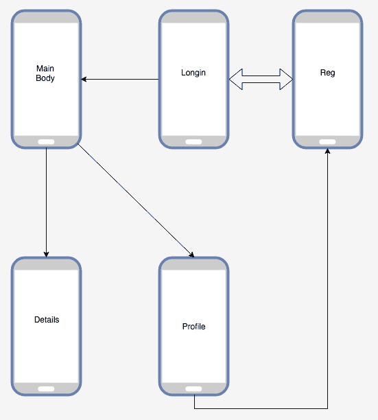

根据以下图表，以下是工作流程的简要说明：

+   **登录页面**：如果您有注册账户，您可以输入用户名和密码进入应用程序的主页。或者，如果您是新手，您需要转到注册页面并注册一个账户。

+   **注册页面**：这是用于注册账户的。

+   **主页活动**：这是您应用程序的主要部分。

+   **个人资料**：您可以在这里查看您的详细信息。

+   **状态详情**：您可以查看您点击的任何帖子的详细信息。

到目前为止，该项目基于这些布局。现在我们需要创建一个 Android 应用程序。

# 创建项目

要创建一个新项目，请转到 Android Studio 并点击新建项目。这次，选择 Android for Mobile**，然后选择 Basic Activity，如图所示：

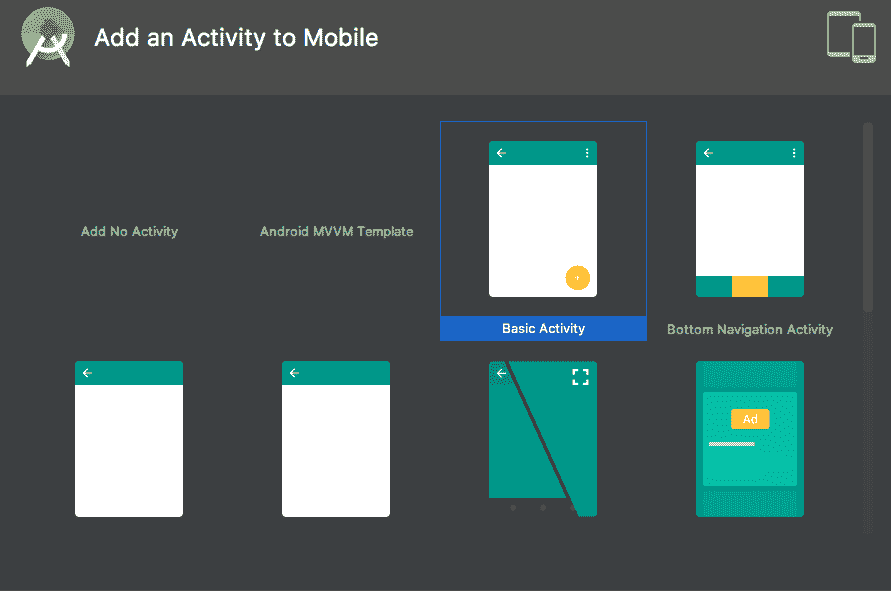

# 实现依赖项

在构建项目后，在 `build.gradle (Module:app)` 的 `dependencies{}` 块中添加以下依赖项：这些是用于 Material Design、Retrofit 和 RxJava 的：

```kt
// Design
implementation 'com.android.support:design:28.0.0'
implementation 'com.android.support:recyclerview-v7:28.0.0'
implementation 'com.android.support:cardview-v7:28.0.0'

// Retrofit
implementation "com.squareup.retrofit2:retrofit:$retrofit_version"
implementation "com.squareup.retrofit2:converter-gson:$retrofit_version"
implementation "com.squareup.retrofit2:adapter-rxjava2:$retrofit_version"
implementation "com.squareup.retrofit2:retrofit-converters:$retrofit_version"
implementation "com.squareup.retrofit2:retrofit-adapters:$retrofit_version"
implementation "com.squareup.okhttp3:logging-interceptor:$okhttp3_version"
implementation "com.google.code.gson:gson:$gson_version"

// Rx
implementation 'io.reactivex.rxjava2:rxandroid:2.0.2'
implementation 'io.reactivex.rxjava2:rxjava:2.2.0'
```

# 创建主页活动

创建项目后，你会找到 `MainActivity`，但在这里我们将其重命名为 `HomeActivity.kt`，布局名称为 `activity_home`。

现在转到活动，以下是此类的默认代码：

```kt
class HomeActivity : AppCompatActivity() {

 override fun onCreate(savedInstanceState: Bundle?) {
        super.onCreate(savedInstanceState)
        setContentView(R.layout.activity_main2)
        setSupportActionBar(toolbar)

        fab.setOnClickListener { view ->
            Snackbar.make(view, "Replace with your own action", Snackbar.LENGTH_LONG)
                .setAction("Action", null).show()
        }
    }
}
```

# 修改布局

首先，创建一个名为 `home_content.xml` 的布局，添加 `FrameLayout` 并添加一个 `id` 名称。以下是此 XML 文件的代码（您可以在 GitHub 上查看完整版本）：

```kt
<?xml version="1.0" encoding="utf-8"?>
<android.support.design.widget.CoordinatorLayout
        xmlns:android="http://schemas.android.com/apk/res/android"
        xmlns:app="http://schemas.android.com/apk/res-auto"
        xmlns:tools="http://schemas.android.com/tools"
        android:layout_width="match_parent"
        android:layout_height="match_parent"
        tools:context=".ui.MainActivity">
    <android.support.constraint.ConstraintLayout xmlns:android="http://schemas.android.com/apk/res/android"
                                                 xmlns:app="http://schemas.android.com/apk/res-auto"
                                                 xmlns:tools="http://schemas.android.com/tools"
                                                 android:layout_width="match_parent"
                                                 android:layout_height="match_parent"
                                                 tools:context=".ui.MainActivity">

      ----
----

        <android.support.v7.widget.RecyclerView
                android:id="@+id/displayList"
                android:layout_width="0dp"
                android:layout_height="0dp"
                app:layout_constraintEnd_toEndOf="parent"
                app:layout_constraintStart_toStartOf="parent"
                tools:listitem="@layout/post_item"
                app:layout_constraintBottom_toBottomOf="parent"
                app:layout_constraintHorizontal_bias="0.0" android:layout_marginTop="8dp"
                app:layout_constraintTop_toBottomOf="@+id/appBarLayout"/>

    </android.support.constraint.ConstraintLayout>

    <android.support.design.widget.FloatingActionButton
            android:id="@+id/fabMain"
            android:layout_width="wrap_content"
            android:layout_height="wrap_content"
            android:layout_gravity="bottom|end"
            android:layout_margin="@dimen/fab_margin"
            app:srcCompat="@android:drawable/ic_dialog_email"/>
</android.support.design.widget.CoordinatorLayout>
```

# 创建模型

为了创建模型，我们需要保持与后端相同的模型项。但我们将包括 `Gson` 注解，`@SerializedName`。`@SerializedName` 注解的值用于对象的序列化和反序列化。在这里，`@SerializedName("username")` 表示这是 JSON 中的 `Username` 名称。尽管我们实现了 Gson，但你可以将这些模型类作为 API 的响应来调用。这意味着当这个应用程序请求服务器并获取内容时，这些内容将通过这些模型类返回。

# 创建个人资料模型

创建一个名为 `Profile.kt` 的 `Profile` 数据类，以下是一个示例代码：

```kt
data class Profile(
    @SerializedName("id") var userID: String,
    @SerializedName("username") var username: String,
    @SerializedName("password") var password: String,
    @SerializedName("email") var email: String,
    @SerializedName("accCreatedTime") var accCreatedTime: String,
    @SerializedName("firstName") var firstName: String,
    @SerializedName("lastName") var lastName: String,
    @SerializedName("contactNumber") var contactNumber: String,
    @SerializedName("country") var country: String
    )
```

# 创建帖子模型

创建一个名为 `Post.kt` 的 `Post` 数据类，以下是一个示例代码：

```kt
data class Post(
    @SerializedName("id") var postId: Long?,
    @SerializedName("text") var text: String?,
    @SerializedName("postedBy") var profile: Profile?,
    @SerializedName("accCreatedTime") var accCreatedTime: String?,
    @SerializedName("comments") var comment: ArrayList<Comment>?,
    @SerializedName("likes") var likes: ArrayList<Like>?
)
```

# 创建评论模型

创建一个名为 `Comment.kt` 的注释数据类，以下是一个示例代码：

```kt
data class Comment (
    @SerializedName("id") var comment: Long?,
    @SerializedName("text") var text: String?,
    @SerializedName("postedBy") var profile: Profile?,
    @SerializedName("accCreatedTime") var accCreatedTime: String?
    )
```

# 创建服务

这是最重要的部分。这将向服务器发送 `GET` 请求以获取数据。首先，我们将创建模型类的服务。我们将使用 Retrofit 注解创建 HTTP 请求函数，这些函数在 第四章 中称为 *HTTP 请求函数* 的部分中进行了解释，*Android 的 Spring 模块*。

# 创建个人资料服务

根据我们的服务器，我们有四个针对个人资料的 `HTTP` 请求。因此，我们将使用 Retrofit 注解创建三个 `HTTP` 请求。现在创建一个名为 `ProfileService.kt` 的接口，以下是代码：

```kt
interface ProfileService {

    // New Profile registration
    @Headers("Content-Type: application/json")
    @POST("/profile/new")
    fun registerProfile(@Body profile: Profile): Observable<Profile>

    @Headers("Content-Type: application/json")
    @GET("/profile/login")
    fun loginProfile(@Query("username") username: String, @Query("password") password: String): Observable<Profile>

    // Get All Profiles
    @Headers("Content-Type: application/json")
    @GET("/profiles")
    fun getUserList(): Observable<List<Profile>>

   // Get Profile by ID
    @GET("/profile/{userId}")
    fun getUserById(@Path("userId") userId: Long): Observable<Profile>
}
```

根据前面的代码，以下是函数的简要细节：

+   `registerProfile(@Body profile: Profile)` 注册一个新的个人资料。你需要传递一个项目对象。

+   `getUserList()` 获取所有个人资料。

+   `getUserById(@Query("userId") userId: Long)` 获取一个个人资料。你需要传递用户 ID。

# 创建帖子服务

根据我们的服务器，我们有三个针对个人资料的 `HTTP` 请求。因此，我们将使用 Retrofit 注解创建三个 `HTTP` 请求。现在创建一个名为 `ProfileService.kt` 的接口，以下是代码：

```kt
interface PostService {
    @Headers("Content-Type: application/json")
    @POST("/post/{profile_id}/new")
    fun submitNewPost(@Path("profile_id") id: Long, @Query("text") text: String): Observable<List<Post>>

    // Get all posted status
    @Headers("Content-Type: application/json")
    @GET("/posts")
    fun getPostList(): Single<List<Post>>

    // Get all posted status by Profile ID
    @Headers("Content-Type: application/json")
    @GET("/post/{id}")
    fun getPostById(@Path("id") id: Long): Observable<Post>

}
```

根据前面的代码，以下是函数的简要描述：

+   `submitNewPost(@Query("id") id: Long, @Field("text") text: String)` 提交一个新的帖子，提交新帖子时，你需要传递用户 ID 和文本。

+   `getPostList()` 获取所有帖子。

+   `getPostById(@Query("id") id: Long)` 获取一个帖子。你需要传递帖子 ID。

# 创建评论服务

为了处理评论 REST API，我们将创建两个 `HTTP` 请求。因此，我们将使用 Retrofit 注解创建两个 `POST` 和 `DELETE` 请求。现在创建一个名为 `PostService.kt` 的接口，以下是代码：

```kt
interface CommentService {
    // Post comment in a post by Profile ID and Post ID
    @POST("/comment/{user_id}/{post_id}")
    fun postCommentByPostId(@Path("post_id") postId: Long, @Path("user_id") userId: Long,
                            @Query("commentText") commentText: String): Observable<Post>

    // Delete comment in a post by Profile ID and Post ID
    @DELETE("/comment/{user_id}/{post_id}")
    fun deleteCommentByPostId(@Path("post_id") postId: Long, @Path("user_id") userId: Long,
                              @Query("commentText") commentText: String): Observable<Post>
}

```

`postCommentByPostId(@Path("post_id") postId: Long, @Path("user_id") userId: Long,`

`@Query("commentText") commentText: String)` 是一个 `POST` 请求函数，用于提交一个新的评论。你需要传递 `user_id`、`post_id` 和文本。

`deleteCommentByPostId(@Path("post_id") postId: Long, @Path("user_id") userId: Long,`

`@Query("commentText") commentText: String)` 是一个 `DELETE` 请求函数，用于删除评论。你需要传递 `user_id` 和 `post_id`。

到目前为止，所有请求都已创建，现在我们需要创建一个 API 服务，该服务将击中服务器并获取 JSON。

# 创建 API 服务

我们在 第四章 中解释了此过程，*Android 的 Spring 模块*。因此，我们只需向您展示代码并解释新功能。创建一个名为 `APIService.kt` 的对象，并添加 `gsonConverter()` 和 `getOkhttpClient(username, password)`：

```kt
object APIService{
   fun getRetrofitBuilder(username:String, password:String): Retrofit {
       return Retrofit.Builder()
           .client(getOkhttpClient(username, password))
           .baseUrl(Constants.API_BASE_PATH)
           .addCallAdapterFactory(RxJava2CallAdapterFactory.create())
           .addConverterFactory(gsonConverter())
           .build()
    }

    fun gsonConverter(): GsonConverterFactory {
        return GsonConverterFactory
            .create(
                GsonBuilder()
                    .setLenient()
                    .disableHtmlEscaping()
                    .create()
            )
    }

    fun getOkhttpClient(profileName: String, password: String): OkHttpClient {
        return OkHttpClient.Builder()
            .addInterceptor(BasicAuthInterceptor(profileName, password))
            .connectTimeout(30, TimeUnit.SECONDS)
            .readTimeout(60, TimeUnit.SECONDS)
            .build()
    }
}
```

如果您对`addInterceptor(BasicAuthInterceptor(profileName, password))`感到困惑，请前往*第五章*，*使用 Spring Security 保护应用程序*，并查看名为*使用 OkHttp 拦截器进行身份验证*的部分。

现在，我们需要初始化服务的`RetrofitBuilder`函数。我们有四个服务接口，现在我们将为它们创建四个`RetrofitBuilder`函数。在`APIService.kt`文件中添加以下代码：

```kt
// get profile request builder
fun profileAPICall(username:String, password:String) = getRetrofitBuilder(username, password)
    .create(ProfileService::class.java)

// get post request builder
fun postAPICall(username:String, password:String) = getRetrofitBuilder(username, password)
    .create(PostService::class.java)

// get comment request builder
fun commentAPICall(username:String, password:String) = getRetrofitBuilder(username, password)
    .create(CommentService::class.java)
```

现在，我们将专注于前端，这意味着活动和布局。

# 创建登录活动

这是应用程序的第一个活动。当用户进入应用程序时，它将是他们看到的第一件事。对于用户来说，他们需要转到注册活动来注册新配置文件。注册后，他们将能够访问应用程序。

# 修改布局

创建一个名为`LoginActivity.kt`的空活动和一个名为`activity_login.xml`的布局。以下是`xml`中的代码（您可以在 GitHub 上找到该布局的完整版本）：

```kt
------
------
<android.support.v7.widget.CardView
        android:layout_width="match_parent"
        android:layout_height="wrap_content"
        android:layout_alignParentEnd="true"
        android:layout_alignParentStart="true"
        android:layout_centerHorizontal="true"
        android:background="@color/reg_body"
        app:layout_constraintTop_toTopOf="parent" app:layout_constraintStart_toStartOf="parent"
        android:layout_marginBottom="64dp" app:layout_constraintBottom_toBottomOf="parent"
        android:layout_marginStart="32dp" app:layout_constraintEnd_toEndOf="parent" android:layout_marginEnd="32dp"
        android:id="@+id/cardView">

    <android.support.constraint.ConstraintLayout
            android:layout_width="match_parent"
            android:layout_height="match_parent"
            app:layout_constraintEnd_toEndOf="parent"
            app:layout_constraintBottom_toBottomOf="parent"
            app:layout_constraintStart_toStartOf="parent"
            app:layout_constraintTop_toTopOf="parent"
            app:layout_constraintHorizontal_bias="0.0"
            app:layout_constraintVertical_bias="1.0" android:layout_marginEnd="24dp"
            android:layout_marginTop="32dp"
            android:layout_marginStart="24dp" android:layout_marginBottom="32dp">
        <TextView
                android:id="@+id/LogIn"
                android:layout_width="wrap_content"
                android:layout_height="wrap_content"
                android:layout_alignParentTop="true"
                android:layout_centerHorizontal="true"
                android:text="@string/title_login"
                android:textSize="30sp"
                android:textStyle="bold"
                android:typeface="monospace" app:layout_constraintEnd_toEndOf="parent"
                android:layout_marginEnd="8dp" app:layout_constraintStart_toStartOf="parent"
                app:layout_constraintTop_toTopOf="parent" android:layout_marginStart="8dp"
                android:layout_marginTop="8dp"/>
------
------
 <Button android:layout_width="match_parent" android:layout_height="wrap_content"
                    android:text="@string/title_login"
                    android:id="@+id/reg_submit"

                    app:layout_constraintTop_toBottomOf="@+id/password_title_reg"
                    app:layout_constraintStart_toStartOf="parent" app:layout_constraintEnd_toEndOf="parent"
                    android:layout_marginEnd="32dp" android:layout_marginStart="32dp"
                    android:layout_marginTop="64dp"/>
------
------ 
```

在这里，我们有用户输入的`Username`和`Password`。在这个布局中，我们还有一个登录按钮和一个`TextView`，用于转到`RegistrationActivity`。

这里是这个布局的图片预览：

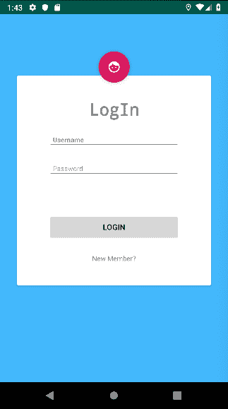

# 修改活动

前往`LogInActivity.kt`文件，我们将在这里输入登录信息。用户需要提供一个`username`和`password`。然后这些信息将在服务器数据库的`Profile`表中进行搜索。如果在这个`Profile`表中存在相同的`username`和`password`，您将能够进入`MainActivity`，或者您将收到错误消息。如果您是新用户，您可以点击“New Member?”来注册新配置文件。

首先，我们将检查`SharedPreferences`以查看我们是否保存了`username`和`password`。它将显示在用户名和密码字段中，或者它将保持空白，以便您可以输入值。以下是这个逻辑的功能：

```kt
override fun onCreate(savedInstanceState: Bundle?) {
    super.onCreate(savedInstanceState)
    setContentView(R.layout.activity_login)

   setUsernamePassword()
 }

private fun setUsernamePassword() {
 if (PrefUtils.getUsername(this) != null
 || PrefUtils.getPassword(this) != null) {
 username_input_login.setText(PrefUtils.getUsername(this))
 password_input_login.setText(PrefUtils.getPassword(this))
 }
}
```

现在，在名为`need_reg`的`TextView`上设置`OnClickListener()`监听器函数，它将带我们到`RegistrationActivity`。以下是该函数的代码：

```kt
need_reg.setOnClickListener {
    val intent = Intent(this, RegistrationActivity::class.java)
    startActivity(intent)
}
```

# 登录请求

现在，我们将创建一个名为`logInUser()`的函数，该函数将向服务器发送`POST`请求并匹配`username`和`password`。如果失败，它将获取错误并显示错误消息，或者它将带您到`MainActivity`。以下是该函数的代码：

```kt
private fun logInUser(){

    APIClient.profileAPICall(username_input_login.text.toString(), password_input_login.text.toString())
        .loginProfile(username_input_login.text.toString(),password_input_login.text.toString() )
        .subscribeOn(Schedulers.io())
        .observeOn(AndroidSchedulers.mainThread())
        .subscribe({
                newUser ->
            if(newUser.error != null){
                Toast.makeText(applicationContext,newUser.error!!, Toast.LENGTH_SHORT).show()
            }else {
                PrefUtils.storeUsernameID(this, newUser.userID!!)
                PrefUtils.storeUsername(this, newUser.username!!)
                PrefUtils.storePassword(this, newUser.password!!)
                username_input_login.setText(PrefUtils.getUsername(this))
                password_input_login.setText(PrefUtils.getPassword(this))
                val intent = Intent(this, MainActivity::class.java)
                startActivity(intent)
            }
        },{
                error ->
            Toast.makeText(applicationContext,R.string.err_login_msg, Toast.LENGTH_SHORT).show()
            Log.wtf("******", error.message.toString())
        })
}
```

在这里，如果我们得到正确的响应，我们将存储`username`、`password`和`userID`。

# 创建注册活动

创建一个名为`RegistrationActivity.kt`的注册活动，我们将在这里注册新账户。在修改代码之前，我们需要修改布局。

# 修改布局

为`RegistrationActivity.kt`创建一个名为`activity_registration.xml`的布局。在这里，我添加了 UI，请查看 GitHub 上的完整版本文件。以下是该文件中的一段代码：

```kt
 <Button android:layout_width="match_parent" android:layout_height="wrap_content"
                        android:text="@string/title_reg"
                        android:id="@+id/reg_submit" android:layout_marginTop="32dp"
                        app:layout_constraintTop_toBottomOf="@+id/country_title_reg"
                        app:layout_constraintStart_toStartOf="parent" android:layout_marginStart="32dp"
                        app:layout_constraintEnd_toEndOf="parent" android:layout_marginEnd="32dp"/>

          -----
          -----

            </android.support.constraint.ConstraintLayout>
        </ScrollView>
    </android.support.v7.widget.CardView>

</android.support.constraint.ConstraintLayout>
```

这是此布局的图像预览：

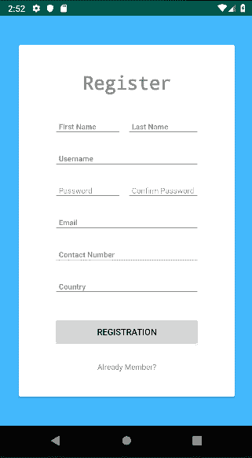

# 修改活动

这是`RegistrationActivity`的代码：

```kt
class RegistrationActivity : AppCompatActivity() {

    override fun onCreate(savedInstanceState: Bundle?) {
        super.onCreate(savedInstanceState)
        setContentView(R.layout.activity_registration)

    }
}
```

现在添加一些逻辑来验证`用户名`、`密码`和`电子邮件 ID`。以下是代码：

```kt

private fun validateName(): Boolean {
    if (username_input_reg.text.toString().trim().isEmpty()) {
        username_title_reg.error = getString(R.string.err_msg_name)
        requestFocus(username_input_reg)
        return false
    } else {
        username_title_reg.isErrorEnabled = false
    }

    return true
}

private fun validateEmail(): Boolean {
    if (email_input_reg.text.toString().trim().isEmpty() || !isValidEmail(email_input_reg.text.toString().trim())) {
        email_title_reg.error = getString(R.string.err_msg_email)
        requestFocus(email_input_reg)
        return false
    } else {
        email_title_reg.isErrorEnabled = false
    }

    return true
}

private fun validatePassword(): Boolean {
    if (password_input_reg.text.toString().trim().isEmpty()
    || con_password_input_reg.text.toString().trim().isEmpty()) {

        if (password_input_reg.text.toString().trim()
            == con_password_input_reg.text.toString().trim()){
            password_title_reg.error = getString(R.string.err_match_password)
            requestFocus(password_title_reg)
        }

        password_title_reg.error = getString(R.string.err_msg_password)
        requestFocus(password_title_reg)
        return false
    } else {
        password_title_reg.isErrorEnabled = false
    }

    return true
}
```

添加一个`TextWatcher`内部类，如果输入有任何无效内容，它将发送一个警报：

```kt
private inner class MyTextWatcher (private val view: View) : TextWatcher {

    override fun beforeTextChanged(charSequence: CharSequence, i: Int, i1: Int, i2: Int) {}

    override fun onTextChanged(charSequence: CharSequence, i: Int, i1: Int, i2: Int) {}

    override fun afterTextChanged(editable: Editable) {
        when (view.id) {
            R.id.username_input_reg -> validateName()
            R.id.email_input_reg -> validateEmail()
            R.id.input_password -> validatePassword()
        }
    }
}
```

当`用户名`、`密码`或`电子邮件 ID`无效时，它会显示一个警报。

# 注册新资料

现在我们将创建一个名为`registerUser()`的函数，该函数将帮助你向服务器发送请求并从服务器获取输出。我们将在第八章反应式编程和第四章 Android 的 Spring 模块中展示如何使用 RxJava。以下是`registerUser()`的代码：

```kt
private fun registerUser(){
    val newProfile = Profile(null,
        username_input_reg.text.toString(),
        password_input_reg.text.toString(),
        email_input_reg.text.toString(),
        null,
        first_name_input_reg.text.toString(),
        last_name_input_reg.text.toString(),
        contact_input_reg.text.toString(),
        country_input_reg.text.toString())

        APIClient.profileAPICall("","")
        .registerProfile(newProfile)
        .subscribeOn(Schedulers.io())
        .observeOn(AndroidSchedulers.mainThread())
        .subscribe({
                newUser ->
           if(newUser.duplicate != null){
                    Toast.makeText(applicationContext,newUser.duplicate!!, Toast.LENGTH_SHORT).show()
                }else {
                    PrefUtils.storeUsernameID(this, 1)
                    PrefUtils.storeUsername(this, username)
                    PrefUtils.storePassword(this, password)
                    val intent = Intent(this, LoginActivity::class.java)
                    startActivity(intent)
                }

        },{
                error ->
                            Toast.makeText(applicationContext,error.message.toString(), Toast.LENGTH_SHORT).show()

        })
}
```

在这里，我们将从`EditText`获取内容并创建一个`Profile`对象。然后我们获取一个观察者，它将作为 JSON 类型获取配置文件列表，并在`subscribe()`函数中处理更新的列表。如果结果是完整的，它将在第一个参数中返回，然后我们将使用`SharedPreferences`本地保存`用户名`、`密码`和`userID`并返回到`LoginActivity`。如果抛出错误，它将进入第二个参数。

# 修改主活动

这是我们的主页。在这里，你可以看到所有帖子。我们需要修改我们的布局和活动类。

# 修改布局

`MainActivity`的布局在`activity_main.xml`文件中。在这里，我们添加了`RecyclerView`以显示列表，一个`FabButton`用于提交帖子，以及一个`TextView`以显示如果没有帖子可用。以下是代码片段：

```kt
<?xml version="1.0" encoding="utf-8"?>
<android.support.design.widget.CoordinatorLayout
        xmlns:android="http://schemas.android.com/apk/res/android"
        xmlns:app="http://schemas.android.com/apk/res-auto"
        xmlns:tools="http://schemas.android.com/tools"
        android:layout_width="match_parent"
        android:layout_height="match_parent"
        tools:context=".ui.MainActivity">
-----
-----

<android.support.v7.widget.RecyclerView
 android:id="@+id/displayList"
 android:layout_width="0dp"
 android:layout_height="0dp"
 app:layout_constraintEnd_toEndOf="parent"
 app:layout_constraintStart_toStartOf="parent"
 tools:listitem="@layout/post_item"
 app:layout_constraintBottom_toBottomOf="parent"
 app:layout_constraintHorizontal_bias="0.0" android:layout_marginTop="8dp"
 app:layout_constraintTop_toBottomOf="@+id/appBarLayout"/>
 </android.support.constraint.ConstraintLayout>
     <android.support.design.widget.FloatingActionButton
     android:id="@+id/fabMain"
     android:layout_width="wrap_content"
     android:layout_height="wrap_content"
     android:layout_gravity="bottom|end"
     android:layout_margin="@dimen/fab_margin"
     app:srcCompat="@android:drawable/ic_dialog_email"/>
</android.support.design.widget.CoordinatorLayout>
```

# 修改活动

前往`MainAcitivty.kt`。在这里，我们有`RecycleView`和帖子适配器。我们将在`onCreate()`函数中添加一个全局的`List<Post>`并将`recycleView`设置如下：

```kt
private var postList: List<Post> = listOf()

override fun onCreate(savedInstanceState: Bundle?) {
    super.onCreate(savedInstanceState)
    setContentView(R.layout.activity_main)
        displayList.layoutManager = LinearLayoutManager(this)
        displayList.setHasFixedSize(true)
        postRecycleViewAdapter = PostRecycleViewAdapter(this, postList)
        displayList.adapter = postRecycleViewAdapter
}
```

在这里，我们已初始化名为`postRecycleViewAdapter`的`PostRecycleViewAdapter`，并将适配器设置到名为`displayList`的列表中。

# 获取帖子

我们将使用`getAllPosts()`函数获取所有帖子。此函数将向服务器发送请求以获取所有帖子列表。作为回报，我们将得到名为`newPostList`的更新列表，并使用`setItems(newPostList)`传递给`PostRecycleViewAdapter`，并使用`notifyDataSetChanged()`通知。对于错误处理，我们使用了 toast。以下是`getAllPosts()`函数的代码：

```kt
private fun getAllPosts() {
        APIClient.postAPICall(PrefUtils.getUsername(this)!!, PrefUtils.getPassword(this)!!)
        .getPostList()
            .subscribeOn(Schedulers.io())
        .observeOn(AndroidSchedulers.mainThread())
        .subscribe({
            newPostList ->
            postRecycleViewAdapter.setItems(newPostList)
 postRecycleViewAdapter.notifyDataSetChanged()
        },{
                error ->
       Toast.makeText(applicationContext, error.message.toString(), Toast.LENGTH_SHORT).show()
        })
}
```

# 提交帖子

当你按下 fab 按钮时，我们会看到一个输入状态的警报框，你可以使用`submitPost()`输入你的状态。作为回报，我们得到名为`newPostList`的帖子列表，并将其传递给`PostRecycleViewAdapter`的`setItems(newPostList)`以替换旧的帖子列表。最后，使用`notifyDataSetChanged()`通知，`RecycleView`列表将被更新。

这是`submitPost()`函数的代码：

```kt
private fun submitPost(id: Long, text: String){
    APIClient.postAPICall(PrefUtils.getUsername(this)!!, PrefUtils.getPassword(this)!!)
        .submitNewPost(id, text)
        .subscribeOn(Schedulers.io())
        .observeOn(AndroidSchedulers.mainThread())
        .subscribe({
                newPostList ->
            postRecycleViewAdapter.setItems(newPostList)
            postRecycleViewAdapter.notifyDataSetChanged()
        },{
                error ->
      Toast.makeText(applicationContext, error.message.toString(), Toast.LENGTH_SHORT).show()
        })
}
```

# 实现菜单

要显示配置文件详情和更新帖子，我们将在 `Toolbar` 上添加两个图标。为此，我们需要创建一个工具栏文件。在 `res > menu` 中创建一个名为 `menu_main.xml` 的菜单文件。在那里我们将添加两个项目，一个用于配置文件，一个用于更新帖子。

下面是 `menu_main.xml` 的代码：

```kt
<?xml version="1.0" encoding="utf-8"?>
<menu xmlns:android="http://schemas.android.com/apk/res/android" xmlns:app="http://schemas.android.com/apk/res-auto">
    <item
            android:id="@+id/profileMenu"
            android:icon="@drawable/ic_face_white_24dp"
 app:showAsAction="always"            android:title="@string/title_profile">
    </item>
    <item
            android:id="@+id/postUpdate"
            android:icon="@drawable/ic_autorenew_white_24dp"
 app:showAsAction="always"            android:title="@string/title_update">
    </item>
</menu>
```

我们使用了 `app:showAsAction="always"`，这意味着项目将始终显示在工具栏上。

现在在 `MainAcitivy.kt` 中实现它。为此，我们需要重写两个函数，这两个函数是 `onCreateOptionsMenu()` 和 `onOptionsItemSelected()`。

我们将在 `onCreateOptionsMenu()` 中使用 `menuInflater.inflate()` 绑定 `menu_main` 菜单 XML 文件，并在 `onOptionsItemSelected()` 中写下每个菜单项的逻辑：

```kt
    override fun onCreateOptionsMenu(menu: Menu): Boolean {
        menuInflater.inflate(R.menu.menu_main, menu)
        return true
    }

    override fun onOptionsItemSelected(item: MenuItem?): Boolean {
        when (item!!.itemId) {
            R.id.profileMenu -> {
                val intent = Intent(this, ProfileActivity::class.java)
                startActivity(intent)
            }
            R.id.postUpdate -> {
                getAllPosts()
            }
        }
        return true
    }
```

`R.id.profileMenu` 将带您进入 `ProfileActivity` 类。

`R.id.postUpdate` 将使用 `getAllPosts()` 更新帖子。

# 修改帖子适配器

现在我们需要修改我们的帖子适配器类。它将帮助我们以良好的结构显示帖子。我们的帖子适配器名称是 `PostRecycleViewAdapter`，布局名称是 `post_item`。

# 修改帖子适配器布局

要利用帖子适配器，我们需要创建一个名为 `post_item.xml` 的 `xml` 文件，在这里我们将实现 UI。下面是一段代码（完整代码可以在 GitHub 上找到）：

```kt
----
----
        <TextView android:layout_width="wrap_content" android:layout_height="wrap_content"
                  tools:text="@tools:sample/date/ddmmyy"
                  android:id="@+id/postedDate"
                  android:textAppearance="?android:textAppearanceSmall"
                  app:layout_constraintTop_toBottomOf="@+id/profileName"
                  app:layout_constraintStart_toStartOf="@+id/profileName"
                  android:layout_marginTop="4dp"
                  app:layout_constraintBottom_toBottomOf="parent" android:layout_marginBottom="4dp"/>
    </android.support.constraint.ConstraintLayout>

    <TextView android:layout_width="0dp" android:layout_height="wrap_content"
              tools:text="@tools:sample/lorem"
              android:id="@+id/postText"
              android:padding="4dp"
              android:textAppearance="?android:textAppearanceSmall"
              app:layout_constraintStart_toStartOf="parent"
              app:layout_constraintEnd_toEndOf="parent" android:layout_marginTop="4dp"
              app:layout_constraintTop_toBottomOf="@+id/constraintLayout"/>
----
----
```

我们有四个 `TextView` 用于用户全名、用户名、发布时间和帖子文本。

下面是布局预览选项的一个示例图像：

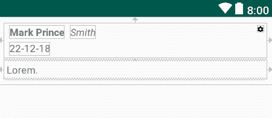

# 创建帖子适配器

让我们创建一个名为 `PostRecycleViewAdapter.kt` 的自定义 `RecycleView` 适配器来显示帖子列表。我们已经展示了如何在 第四章，*Spring Modules for Android* 中创建自定义适配器，所以我们将不再重复。以下是 `PostRecycleViewAdapter` 类：

```kt
class PostRecycleViewAdapter(private var context: Context,
                       private val postList: List<Post>):
RecyclerView.Adapter<PostRecycleViewAdapter.ViewHolder>() {
-----
-----
}
```

现在在 `PostRecycleViewAdapter.kt` 中创建 `ViewHolder` 类，并初始化 `post_item` 布局的所有内容，如下面的代码所示：

```kt
class ViewHolder(view: View): RecyclerView.ViewHolder(view){
    val postRoot = view.findViewById(R.id.postRoot) as ConstraintLayout

    val profileFullName = view.findViewById(R.id.profileFullNamePost) as TextView
    val username = view.findViewById(R.id.usernamePost) as TextView
    val postedDate = view.findViewById(R.id.postedDate) as TextView
    val postText = view.findViewById(R.id.postText) as TextView
}
```

现在重写 `onCreateViewHolder()` 并返回 `ViewHolder` 类：

```kt
override fun onCreateViewHolder(viewGroup: ViewGroup, p1: Int): ViewHolder {
    val layoutInflater = LayoutInflater.from(context).inflate(R.layout.post_item, viewGroup, false)
    return ViewHolder(layoutInflater)
}
```

现在，我们需要根据其位置设置列表中每一行的值。为此，重写 `onBindViewHolder()` 函数并添加以下代码：

```kt
override fun onBindViewHolder(viewHolder: ViewHolder, position: Int) {

    val userDetails = postList[position]

    viewHolder.profileFullName.text = "${userDetails.profile!!.firstName} ${userDetails.profile!!.lastName} "
    viewHolder.username.text = userDetails.profile!!.username
    viewHolder.postedDate.text = userDetails.postCreatedTime
    viewHolder.postText.text = userDetails.text

}
```

# 修改配置文件布局

这个布局将帮助从用户那里获取配置文件详情。打开 `activity_profile.xml` 并按以下方式修改（请检查 GitHub 上的完整布局代码）：

```kt
<?xml version="1.0" encoding="utf-8"?>

    <!--full name-->

    <TextView android:layout_width="wrap_content" android:layout_height="wrap_content"
              android:id="@+id/profileFullNameTitlePro"
              android:textStyle="bold"
              android:text="@string/title_full_names"
              android:textAppearance="?android:textAppearanceSmall"
              android:layout_marginStart="8dp"
              app:layout_constraintStart_toStartOf="parent" android:layout_marginTop="32dp"
              app:layout_constraintTop_toBottomOf="@+id/usernamePro" android:layout_marginEnd="8dp"
              app:layout_constraintEnd_toEndOf="parent" app:layout_constraintHorizontal_bias="0.0"/>

    <TextView android:layout_width="wrap_content" android:layout_height="wrap_content"
              tools:text="@tools:sample/full_names"
              android:id="@+id/profileFullNamePro"
              android:textAppearance="?android:textAppearanceSmall"
              app:layout_constraintTop_toTopOf="@+id/profileFullNameTitlePro"
              app:layout_constraintBottom_toBottomOf="@+id/profileFullNameTitlePro"
              app:layout_constraintEnd_toEndOf="parent"
              android:layout_marginEnd="160dp"
              app:layout_constraintVertical_bias="1.0"/>

------
------
</android.support.constraint.ConstraintLayout>
```

这里有一个用于用户名的 `TextView`，每个配置文件项标签名称的 `TextView`，以及用于 `Full Name`、`Email`、`Contact Number` 和 `Country` 的配置文件内容的四个 `TextView`。

下面是 **配置文件** 详情的预览：

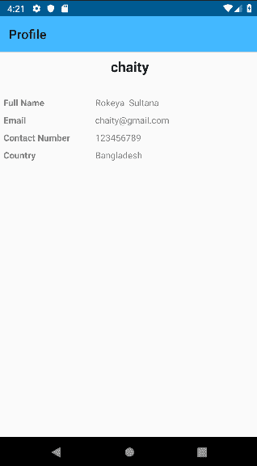

# 修改配置文件活动

创建一个新的活动名为 `ProfileActivity.kt`，以下是代码：

```kt
class ProfileActivity : AppCompatActivity() {

        private var username: String = ""
    private var password: String = ""

    override fun onCreate(savedInstanceState: Bundle?) {
        super.onCreate(savedInstanceState)
        setContentView(R.layout.activity_profile)
        setTitleName() 

        username = PrefUtils.getUsername(this)!!
        password = PrefUtils.getPassword(this)!!
    }
}
```

# 获取配置文件详情

要获取个人资料详情，我们需要创建一个名为 `getUser()` 的函数，在其中我们将从 `Profile` 服务中调用 `getUserById()`。作为回报，它将提供用户详情，或者如果有错误，它将显示错误消息。以下是 `getUserById()` 函数的代码：

```kt
private fun getUser(){
        APIClient.profileAPICall(username,password)
            .getUserById(PrefUtils.getUsernameID(this)!!)
            .subscribeOn(Schedulers.io())
            .observeOn(AndroidSchedulers.mainThread())
            .subscribe({
                    myUser ->

                usernamePro.text = myUser.username
                profileFullNamePro.text = "${myUser.firstName} ${myUser.lastName}"
                emailPro.text = myUser.email
                contactNumberPro.text = myUser.contactNumber
                countryPro.text = myUser.country
            },{
                    error ->
                UtilMethods.hideLoading()
                Log.wtf("******", error.message.toString())
            })
    }
```

# 帖子详情活动

现在我们需要我们的最后一个活动，`PostDetailsActivity.kt`，布局在 `activity_post_details.xml` 中。在这个活动中，你将看到一个特定的帖子及其评论。你也可以发表评论。

# 修改帖子详情布局

这个视图将显示具体的帖子详情。以下是 `activity_post_details.xml` 中的一个代码片段：

```kt
-----
----
<android.support.v7.widget.RecyclerView
        android:id="@+id/displayList_com"
        android:layout_width="0dp"
        android:layout_height="0dp"
        tools:listitem="@layout/post_item"
        app:layout_constraintStart_toStartOf="parent"
        app:layout_constraintEnd_toEndOf="parent" app:layout_constraintTop_toBottomOf="@+id/postRoot_pd"
        android:layout_marginBottom="8dp" app:layout_constraintBottom_toBottomOf="parent"
        android:layout_marginStart="16dp" android:layout_marginEnd="16dp" android:layout_marginTop="8dp"/>

<android.support.constraint.ConstraintLayout
        android:layout_width="match_parent"
        android:id="@+id/postRoot_pd"
        android:layout_height="wrap_content"
        android:layout_marginTop="8dp"
        app:layout_constraintTop_toBottomOf="@+id/appBarLayout_pd" app:layout_constraintEnd_toEndOf="parent"
        app:layout_constraintStart_toStartOf="parent" android:layout_marginEnd="8dp"
        android:layout_marginStart="8dp">
-----
----
```

这里有一个帖子的详情及其评论列表。

这个布局的预览如下：

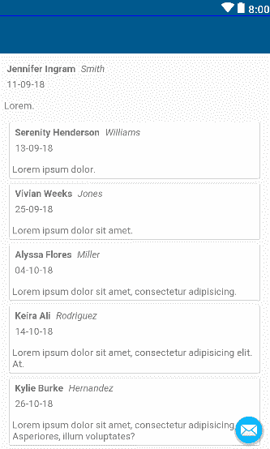

# 修改帖子详情活动

这是一个处理特定帖子的活动。这个帖子将通过 `postId` 获取，我们将通过从 `PostRecycleViewAdapter` 发送的 intent 获取它。要获取 intent 视图，我们需要使用 `intent.extras`。我们使用 `Long` 与 `"postId"` 的 *键名*，如下面的代码所示：

```kt
private var postId:Long = -1

if(intent.extras!=null){
    postId = intent.extras.getLong("postId")
}
```

# 获取帖子详情

现在创建一个名为 `getPostById(id: Long)` 的函数，我们将从 `MainActivity` 传递给定的 `postId`。我们将处理特定的 `TextView` 中的所有值，例如 `MainActivity`：

```kt
@SuppressLint("CheckResult")
private fun getPostById(id: Long){
    UtilMethods.showLoading(this)
    APIClient.postAPICall(PrefUtils.getUsername(this)!!, PrefUtils.getPassword(this)!!)
        .getPostById(id)
        .subscribeOn(Schedulers.io())
        .observeOn(AndroidSchedulers.mainThread())
        .subscribe({
                post ->
            postText_pd.text = post.text
            profileFullNamePost_pd.text = "${post.profile!!.firstName} ${post.profile!!.lastName}"
            usernamePost_pd.text = post.profile!!.username
            postedDate_pd.text = SimpleDateFormat(Constants.TIME_FORMAT).format(post.postCreatedTime!!)

            commentList = post.comment!!

            Log.wtf("******", commentList.toString())
            commentRecycleViewAdapter.setItems(commentList)
            commentRecycleViewAdapter.notifyDataSetChanged()

            UtilMethods.hideLoading()
        },{
                error ->
            UtilMethods.hideLoading()
            Log.wtf("******", error.message.toString())
            Toast.makeText(applicationContext, error.message.toString(), Toast.LENGTH_SHORT).show()
        })
}
```

# 提交评论

要提交评论，点击 `fabButton` 并输入评论。评论提交系统与帖子提交系统类似。我们创建一个名为 `submitComment(id: Long, text: String)` 的函数，并使用它来提交评论。以下是 `submitComment()` 函数：

```kt
@SuppressLint("CheckResult")
private fun submitComment(id: Long, text: String){
    UtilMethods.showLoading(this)
    APIClient.commentAPICall(PrefUtils.getUsername(this)!!, PrefUtils.getPassword(this)!!)
        .postCommentByPostId(id, PrefUtils.getUsernameID(this)!!,text)
        .subscribeOn(Schedulers.io())
        .observeOn(AndroidSchedulers.mainThread())
        .subscribe({
                newPostList ->
            commentList = newPostList.comment!!

            Log.wtf("******", commentList.toString())
            commentRecycleViewAdapter.setItems(commentList)
            commentRecycleViewAdapter.notifyDataSetChanged()
            UtilMethods.hideLoading()
        },{
                error ->
            UtilMethods.hideLoading()
            Log.wtf("******", error.message.toString())
            Toast.makeText(applicationContext, error.message.toString(), Toast.LENGTH_SHORT).show()
        })
}
```

# 修改评论适配器

这个适配器与帖子适配器相同。检查 修改帖子适配器， 修改帖子适配器布局 以修改这个评论适配器。这个适配器的名称是 `CommentRecycleViewAdapter.kt`，布局是 `comment_item.xml`。

我们的项目完成了！现在，是时候检查服务器和客户端的输出了。

# 检查输出

要检查我们的输出，首先，从 `Social_Network` Spring 项目运行服务器。然后你可以运行两个不同的模拟器或 Android 设备作为客户端用户。

现在打开 Android 应用。点击“新成员？”按钮创建新账户。填写所有必要的详细信息并点击“注册”按钮：

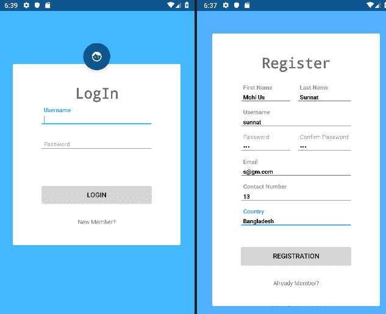

如果用户名已被占用，系统将像这样提醒你：

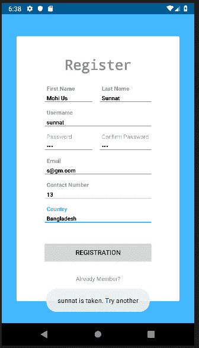

现在如果你按下工具栏上的第二个左边的“Profile”按钮，你将看到个人资料详情。如果你按下顶部的“Update”按钮，即工具栏左上角的图标，你的帖子将更新，如下面的截图所示：

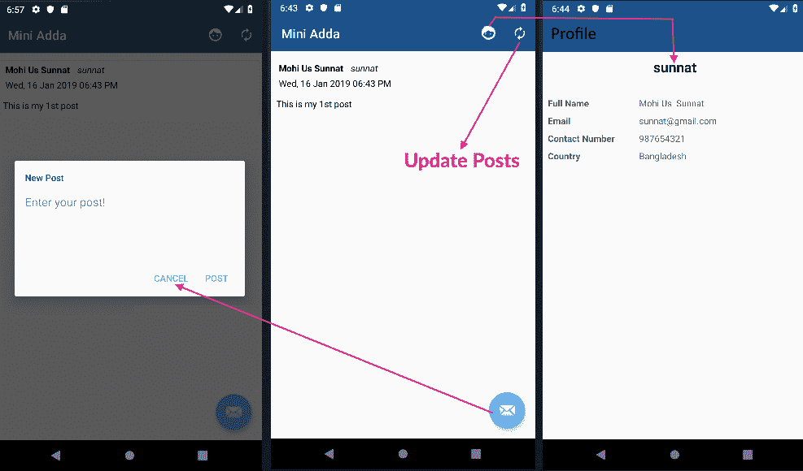

点击任何帖子，你将看到具体的帖子，并且你可以使用 Fab 按钮添加评论：

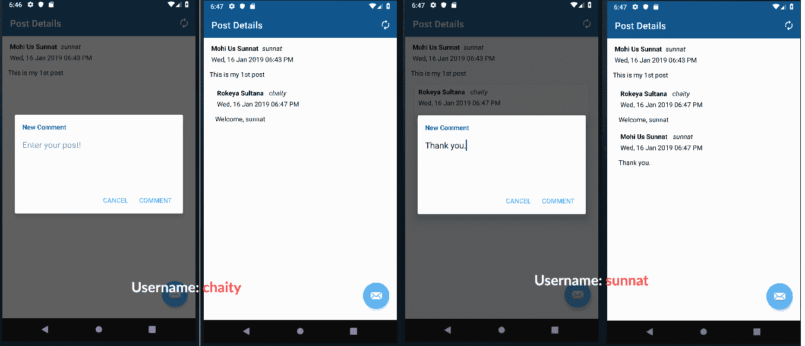

我们已经到达了这段漫长旅程的终点。现在，您的客户端应用程序已经准备好使用。在这里，您可以发布状态，查看发布的状态，检查帖子的详细信息，并在该帖子上发表评论。我们已经向您展示了如何在 Android 应用程序中使用服务器和处理来自服务器的资源。您可以在 GitHub 上找到一些可能有助于此应用程序的次要功能和布局。我们建议您发挥自己的想象力创建另一个应用程序并部署它。这将更加有效，您还可以学习更多您想学的内容。处理 HTTP 请求有众多替代方法，因此您可以学习更多。如果您想了解更多，请查看*进一步阅读*部分。

# 摘要

经过漫长的旅程，我们已经完成了这一章。在这里，我们看到了如何使用前几章的所有模块（如 Spring Security 和数据库）创建一个服务器端和客户端的完整应用程序。您可以根据自己的风格修改这个项目。您可以实现新的架构和实现新的框架。在本章中，首先，我们学习了项目的架构设计。然后，我们为我们的项目创建了数据库模型。在创建数据库模型之后，我们创建了我们的服务器端项目并实现了依赖关系。然后，我们根据数据库模型创建了模型。然后，我们创建了存储库和控制器。在控制器中，我们创建了 HTTP 请求函数。然后，我们实现了安全性。我们使用了 Spring Security 中的基本身份验证。然后，我们修改了 application.properties 以连接到 MySQL 数据库。在完成服务器端之后，我们开始创建 Android 应用程序。我们创建了应用程序的工作流程。然后，我们创建了用户、帖子评论的模型。然后，我们创建了 API 服务和请求。在后台开发之后，我们开发了布局和活动。在活动中，我们使用 Retrofit 和 RxJava 调用了 HTTP 请求。然后，我们修改了应用程序的 UI 类和布局。最后，我们测试了项目的输出。

在第十章“测试应用程序”中，您将学习如何使用 JUnit 框架对 Spring 项目进行单元测试，以及在 Android 应用程序中使用 Espresso 进行 UI 测试。

# 问题

1.  什么是 EER 图？

1.  CRUD 操作是什么？

1.  哪种类型的工具可以用作 HTTP 客户端？

1.  目前，Android 的最小、最大和目标 API 版本是什么？

1.  Android 架构的常见名称是什么？

1.  开发 Android 应用程序时，有哪些模拟器的名称？

# 进一步阅读

+   *使用 Spring 5 和 Kotlin 构建应用程序* ([`www.packtpub.com/application-development/building-applications-spring-5-and-kotlin`](https://www.packtpub.com/application-development/building-applications-spring-5-and-kotlin)) —— 作者 Miloš Vasić

+   *Spring MVC 初学者指南 - 第二版* ([`www.packtpub.com/application-development/spring-mvc-beginners-guide-second-edition`](https://www.packtpub.com/application-development/spring-mvc-beginners-guide-second-edition)) —— 作者：Amuthan Ganeshan

+   *使用 Kotlin 进行 Android 开发* ([`www.packtpub.com/application-development/android-development-kotlin`](https://www.packtpub.com/application-development/android-development-kotlin)) —— 作者：Marcin Moskala, Igor Wojda

+   *面向 Android 开发者的 Kotlin [视频]* ([`www.packtpub.com/application-development/kotlin-android-developers-video`](https://www.packtpub.com/application-development/kotlin-android-developers-video)) —— 作者：Yusuf Saber
