# 第十章：测试应用程序

要使应用程序更易于使用和吸引人，我们总是专注于标志、内容、UI、体验等方面，此外，我们还注意代码风格。我们使用最新的架构和框架来减少代码行数和样板代码，以创建一个健壮、简单和快速的应用程序。然而，许多开发者忘记了测试阶段。有些人可能直到应用程序使用过程中生成崩溃报告时才意识到有问题，因为他们没有在项目中进行充分的测试。通常，一些开发者会跳过测试，因为他们不想花费额外的时间编写在项目中没有直接使用的测试用例。这是一个常见的错误，会导致质量下降。

随机崩溃的应用程序总是不受用户欢迎，这就是为什么最成功的 Android 应用程序总是经过彻底的测试。深入测试可以消除应用程序的缺陷，优化内存使用，同时还能让你改善应用程序的功能行为、可用性和正确性。

在本章中，我们将介绍测试及其在 Spring 和 Android 中的应用。本章涵盖了以下主题：

+   +   软件测试

    +   测试基础

    +   Spring Boot 的单元测试

    +   创建项目

    +   JUnit

    +   Android 的 UI 测试

    +   Espresso

# 技术要求

你将需要导入 Spring 和 Android 的依赖项。以下是依赖项。

+   **Spring**

要实现测试的依赖，你需要在 `pom.xml` 文件中添加测试依赖：

```kt
<!-- This is to implement the testing functions for the spring project -->
<dependency>
   <groupId>org.springframework.boot</groupId>
   <artifactId>spring-boot-starter-test</artifactId>
   <scope>test</scope>
</dependency>
```

+   **Android**

为了测试 Android 项目，我们需要在 `gradle` 文件中实现测试依赖。要添加依赖，我们需要在 `build.gradle` (app 模块) 文件的 `dependencies {...}` 中实现。以下是这个 `build.gradle` 文件的代码片段：

```kt
// Dependencies for local unit tests
dependencies{
testImplementation "junit:junit:$rootProject.ext.junitVersion"

// Espresso UI Testing dependencies.
androidTestImplementation "com.android.support.test.espresso:espresso-core:$rootProject.ext.espressoVersion"
androidTestImplementation "com.android.support.test.espresso:espresso-contrib:$rootProject.ext.espressoVersion"
androidTestImplementation "com.android.support.test.espresso:espresso-intents:$rootProject.ext.espressoVersion"
}
```

本章的示例源代码可在 GitHub 上找到，链接如下：[`github.com/PacktPublishing/Learn-Spring-for-Android-Application-Development/tree/master/Chapter10`](https://github.com/PacktPublishing/Learn-Spring-for-Android-Application-Development/tree/master/Chapter10)。

# 软件测试

软件测试是任何项目中最基本的部分之一。测试评估稳定性、可用性、质量保证、组件的功能，并确保软件可以发布到市场。它还有助于找出项目的错误、缺失的需求等。测试使用技术来执行应用程序或程序中的某些过程，目的是找出错误。

在第六章“访问数据库”和第九章“创建应用”中，我们创建了 Spring 应用并实现了 REST API。然后我们使用一个名为 Insomnia 的第三方工具进行测试。之后，我们提到了使用 HTTP CRUD 请求函数的 URL 路径并检查了输出。这个系统运行良好，我们可以直接看到输出。然而，通常很难找到错误和 bug，因为它不能显示错误或任何异常行为。尽管这个项目正在运行，但并不一定安全地发布到市场上。因此，我们需要进一步测试其稳定性。让我们运行两个流行的测试工具和框架，JUnit 和 Espresso。

# JUnit

JUnit 是最受欢迎的 Java 测试框架，它是开源的，几乎拥有测试基于 Java 的应用程序所需的全部功能和模块，适用于测试驱动开发环境。JUnit 主要关注编写针对特定类或函数的自动化测试。它有助于调用函数并检查预期的输出。在看到 JUnit 的一些使用示例之前，让我们了解一下它的优势。

# JUnit 的优势

JUnit 因其用户友好的功能而广泛用于测试 Java 应用。它具有一些强大的优势，如下所示：

+   JUnit 框架是开源的

+   它提供基于文本的命令行以及基于 AWT 和 Swing 的图形测试机制

+   它有一些注解来利用测试函数

+   它有一个测试运行器来测试运行中的应用

+   它允许你编写代码

+   它可以自动测试并提供反馈

# JUnit 的基本注解

JUnit 有一些基本且重要的注解，如下所示：

+   `@BeforeClass`: 这个方法在类中的任何测试函数之前运行一次。在这个函数中，你可以连接数据库或连接池。这个方法必须是静态方法。

+   `@AfterClass`: 这个方法在类中的任何测试函数之后运行一次。在这个函数中，你可以关闭数据库连接并进行清理。

+   `@Before`: 这个方法可以在`@Test`注解的函数之前运行。在这里，你可以创建一些对象，并将它们共享给所有`@Test`注解的测试函数。

+   `@After`: 这个方法可以在`@Test`注解的函数之后运行。在这里，你可以修改或清理对象，并将它们共享给所有`@Test`注解的测试函数。

+   `@Test`: 这个被注解的函数是测试函数。

现在我们将看看如何使用 JUnit 测试一个项目的示例。在这里，你可以了解测试注解的生命周期以及这些注解的使用。

# 创建一个项目

让我们创建一个项目，在这个项目中，我们将使用数据库创建 REST API，并展示用户详情列表。在这个项目中，我们将使用 JDBC、MySQL 和 Spring Boot。

要创建项目，请访问 [`start.spring.io`](https://start.spring.io) 并创建一个基于 Kotlin 的项目，包含以下给定的依赖项：

+   Web

+   JDBC

+   MySQL

+   DevTools

现在我们将创建一些示例代码，并可以测试它们。

# 使用 JUnit 测试项目

打开我们之前生成的项目，按照以下步骤操作：

1.  前往测试 | kotlin | com.packtpub.sunnat629.testing_application，如下截图所示：

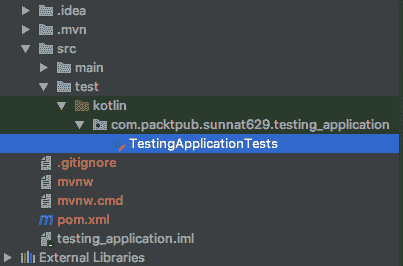

1.  现在创建一个名为 `JUnitTestClass.kt` 的类，我们将使用注解创建一些测试用例。以下是一个示例代码：

```kt
class JUnitTestClass {

    companion object {
        @BeforeClass
        @JvmStatic
        fun runBeforeClass(){
            println("============ @BeforeClass ============\n")
        }

        @AfterClass
        @JvmStatic
        fun runAfterClass(){
            println("============ @AfterClass ============")
        }
    }

    @Before
    fun runBefore(){
        println("============ @Before ============")
    }

    @After
    fun runAfter(){
        println("============ @After ============\n")
    }

    @Test
    fun runTest1(){
        println("============ @TEST One ============")
    }

    @Test
    fun runTest2(){
        println("============ @TEST Two ============")
    }
}
```

你可以看到我们在 `companion object {}` 中编写了 `@BeforeClass` 和 `@AfterClass` 注解的函数，这意味着这些函数是静态的。在 Kotlin 中，你必须将静态变量和函数写入 `companion object {}`。

我们使用了 `@JvmStatic` 注解。这在 Kotlin 中特别用于指定这个函数是静态的，并且需要在这个函数的元素中生成。

1.  现在通过点击函数名旁边的运行测试图标来运行这个测试，如下截图所示：

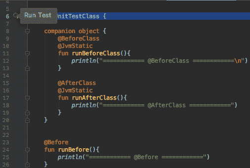

在运行所有测试用例后，它将显示结果；即，通过或失败。以下是输出：

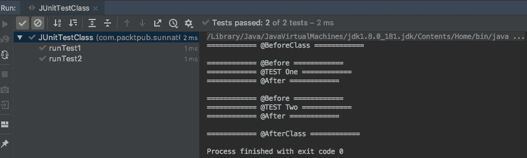

这里你可以看到我们有两个测试用例名为 `runTest1` 和 `runTest2` 已经通过了测试。

1.  现在修改我们的 `runTest1` 函数并编写逻辑：

```kt
@Test
fun runTest1(){
    println("============ @TEST One Start ============")
    assertEquals(6, doSum(3,2))
    println("============ @TEST One End ============")
}

private fun doSum(num1: Int, num2: Int): Int{
        return num1 + num2
    }
```

在这里，我们做了一个非常简单的方程来检查测试函数。我们使用了 `Assert` 类的方法。`assertEquals()` 是断言的一个方法，主要检查两个输入的相等性。在这里，例如，我们提供了 `6` 和 (*2+3*)，这不是真的，它将显示一个错误。

如果方程式正确，那么你将看到测试通过，或者它将显示一个带有预期结果的错误。以下是结果的样子：

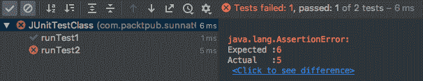

有很多断言方法。以下是一些例子：

+   `assertArrayEquals`：这将返回两个数组类型输入的相等性

+   `assertEquals`：这将返回两个相同类型输入（如 `int`、`long`、`double`、`String` 等）的相等性

+   `assertTrue`：这将断言给定的条件为 `true`

+   `assertFalse`：这将断言给定的条件为 `false`

+   `assertNotNull`：这将断言给定的对象不为空

+   `assertNull`：这将断言给定的对象为空

# 为 Rest API 创建测试用例

现在我们将看到如何使用 Spring 项目的 JPA 和 Hibernate 测试数据库。以下是使用 JPA 测试数据库的步骤：

1.  打开`social_network`项目。链接在这里：[`github.com/PacktPublishing/Learn-Spring-for-Android-Application-Development/tree/master/Chapter09/social_network`](https://github.com/PacktPublishing/Learn-Spring-for-Android-Application-Development/tree/master/Chapter09/social_network)。

1.  现在转到`test | kotlin | com.packtpub.sunnat629.social_network`包，并创建一个名为`ProfileRepositoryTest.kt`的文件，带有名为`@RunWith(SpringRunner::class)`和`@DataJpaTest`的两个注解。

这里是`ProfileRepositoryTest.kt`的代码：

```kt
@RunWith(SpringRunner::class)
@DataJpaTest
class ProfileRepositoryTest {

    @Autowired
    private lateinit var entityManager: TestEntityManager

    @Autowired
    private lateinit var profileRepository: ProfileRepository

    @Test
    fun getUserTesting(){
        val newProfile = getNewProfile()
        val saveProfile = entityManager.merge(newProfile)

        val foundProfile = profileRepository.getOne(saveProfile.id!!)

        assertThat(foundProfile.username)
                .isEqualTo(saveProfile.username)
    }

    private fun getNewProfile(): Profile {
        return Profile( "naruto",
                "12345",
                "naruto123@gmail.com",
                "Naruto",
                "Uzumak")
    }
  }
```

以下是对前面代码的解释：

+   `@RunWith(SpringRunner::class)`是 Spring 和 JUnit 之间的连接器中的注解。它使用 Spring 的测试支持来运行 JUnit。

+   `@DataJpaTest`启用了 JPA 测试功能。

+   我们自动装配了`TestEntityManager`，它主要是为 JPA 测试和 JPA EntityManager 的替代品设计的。

+   `getUserTesting()`，它带有`@Test`注解，是主要的测试函数。

现在，我们将插入一个演示`Profile`对象并检查插入是否正常工作。首先，我们必须使用`getNewProfile()`函数创建一个配置文件对象。

在此之后，我们将此配置文件保存为一个新的变量，例如这样：

```kt
val saveProfile = entityManager.merge(newProfile)
```

这里，我们使用了`entityManager.merge()`，这将把配置文件插入到数据库中。

我们还自动装配了`profileRepository`，现在使用此行通过 ID 获取插入的配置文件：

```kt
val foundProfile = profileRepository.getOne(saveProfile.id!!)
```

现在我们使用了`assertThat()`来检查给定的逻辑是否正确。在这个函数中，我们检查了创建的配置文件和获取的配置文件：

```kt
 assertThat(foundProfile.username).isEqualTo(saveProfile.username)
```

现在，如果有关插入或与数据库通信的错误，它将返回一个错误。

这里是我们测试的输出：

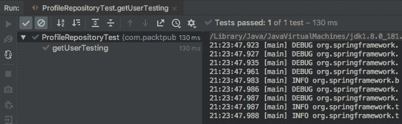

如果你提供一个错误的值，或者测试遇到错误，它将输出以下内容：

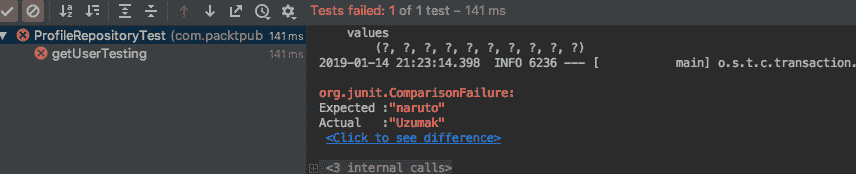

我们输入了一个配置文件名称为`naruto`，但我们测试了名称`Uzumak`，这就是为什么它不匹配。结果随后失败。

# Android 上的 UI 测试

现在，人们比桌面更依赖手机。如果我们考虑 Android，数百万个应用程序都在 Play Store 和其他应用商店中。因此，测试 UI 以在应用商店中制作无 UI 错误且稳定的产品的非常重要。在测试过程中需要非常小心，因为存在各种显示尺寸的无数设备。对于后端，你可以使用 JUnit 进行测试，系统相同。但现在我们的测试将是基于 UI 的，因此我们将使用 Espresso。这是最流行的 UI 测试框架。

# Espresso

Espresso 是一个开源框架，也是一个基于工具的 API，由 Google 设计。创建项目各种场景的测试用例是一种良好的实践。它有助于发现 UI 的意外结果或错误，以及用例。它自动同步测试动作与应用程序的 UI。它允许你在真实设备和模拟器上测试。但由于测试各种尺寸的显示和制造商的成本较高，因此在真实设备上的使用存在缺点。因此，模拟器是降低测试成本和时间的最佳解决方案。根据 Espresso 测试人员，几乎 99%的 Android 应用程序错误都可以通过这个框架检测到。Espresso 的 API 非常小，可预测，易于学习。如果你愿意，也可以自定义这些 API。

让我们创建一个项目并使用 Espresso 进行测试。

# 创建应用程序

让我们创建一个简单的 Android 应用程序作为客户端，该客户端将使用 GitHub API 检索 REST API：

1.  首先，我们需要从 Android Studio 创建一个应用程序，并写下你的项目和公司域名。别忘了勾选“包含 Kotlin 支持”。以下截图显示了“创建 Android 项目”窗口：

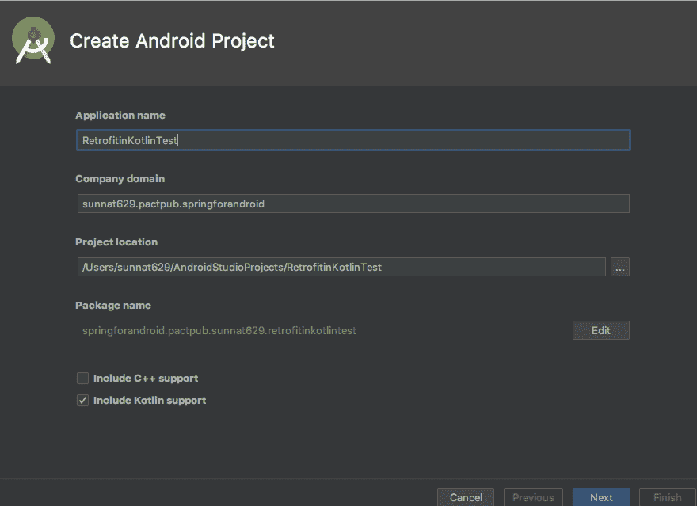

1.  然后从“手机和平板”选项中选择最小 API 版本。对于这个项目，不需要添加其他选项。点击“下一步”后，在“添加活动到移动”字段中，你可以选择“空活动”，然后重命名活动名称和布局，点击“完成”。构建完成后，你就可以开始创建 Android 应用程序了。

创建项目后，我们需要实现测试的依赖项。

# 注入依赖项

此项目主要是为了测试 UI 应用程序，因此我们需要实现 Espresso。在`build.gradle`（模块—app）的`dependencies{}`块中写下以下行以实现 Espresso：

```kt
testImplementation 'junit:junit:4.12'
androidTestImplementation 'com.android.support.test:runner:1.0.2'

// Espresso UI Testing dependencies.
androidTestImplementation "com.android.support.test.espresso:espresso-core:3.0.2"
androidTestImplementation "com.android.support.test.espresso:espresso-contrib:3.0.2"
androidTestImplementation "com.android.support.test.espresso:espresso-intents:3.0.2"
```

然后在同一文件中，在`android{}`块中添加代码以实现针对 Android 包的 JUnit3 和 JUnit4 测试：

```kt
testInstrumentationRunner "android.support.test.runner.AndroidJUnitRunner"
```

`AndroidJUnitRunner`是工具运行器。它主要控制测试 APK、环境和所有测试启动。

现在同步项目以下载并将依赖项添加到项目中。

# 修改应用程序

我们已经在第九章“创建应用程序”中学习了如何基于`RecyclerView`创建应用程序，因此我们可以简单地回顾一下这个应用程序的概念。我们有一个包含 ID 和用户名的用户数据类。我们将向数据库中插入 100 个用户并在自定义的`RecyclerView`中显示。我们还使用`UserItemAdapter`来自定义`RecyclerView`。

如果你想克隆此项目，请访问：[`github.com/PacktPublishing/Learn-Spring-for-Android-Application-Development/tree/master/Chapter10/TestingWithEspresso`](https://github.com/PacktPublishing/Learn-Spring-for-Android-Application-Development/tree/master/Chapter10/TestingWithEspresso)。

在这个项目中，你可以找到`MainActivity.kt`，在那里你可以找到一个列表视图。这里是这个类中的一段代码：

```kt
----
----
 userLists.adapter = UserItemAdapter(this, userList)
----
----
```

这里，`userLists`是 RecyclerView，我们有一个`UserItemAdapter`自定义适配器，它是`UserModel`的适配器。在这里，`UserModel`代码是我们获取用户 ID 和名称的地方：

```kt
data class User(var userID: Int, var username: String)
```

现在，我们将使用 Espresso 测试这个列表视图，并使用我们在项目中经常使用的几个主要功能。

# 创建测试文件

让我们编写一些测试用例。要编写此代码，我们需要在 androidTest 包中创建新文件。为此，请按照以下步骤操作：

1.  现在转到 src | androidTest | java | 项目的`module_name`。这是这个目录的截图：

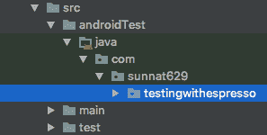

1.  创建一个名为`MainActivityTest.kt`的类，并带有`@RunWith(AndroidJUnit4::class)`注解。这个注解将测试与应用程序功能链接。

让我们创建我们的第一个 Espresso 测试：

首先，我们需要连接我们的`MainActivity`类。为此，我们将初始化一个`ActivityTestRule<MainActivity>`变量的实例，它将为`MainActivity`提供所有功能。它有一个`@Rule`注解，这意味着对单个活动的测试，这里是指`MainActivity`。

这个`getCountUser()`函数是用来检查你的列表中用户数量的：

```kt
// User count Matching
@Test
fun getCountUser(){
    onView(withId(R.id.userLists))
        .check(matches(itemCount(20)))
}
```

在前面的代码中，我们做了以下操作：

+   `ViewMatchers.onView()`意味着它将采用匹配器逻辑。

+   `ViewMatchers.withId()`用于连接你的活动布局的组件。在我们的`main_activity.xml`中，`RecyclerView`的 ID 名称是`userLists`，所以我们在这里连接它。

+   `check(..)`将返回一个布尔值。

+   `matches(itemCount(20)`意味着它将匹配给定的数字与你的用户列表数量。

我们需要手动创建`itemCount()`。为此，创建一个名为`CustomUserMatchers.kt`的类。在这里，是这个类的代码：

```kt
class CustomUserMatchers {
    companion object {
        fun itemCount(count: Int): Matcher<View>{
            return object : BoundedMatcher<View, RecyclerView>(RecyclerView::class.java){
                override fun describeTo(description: Description?) {
                    description!!.appendText("Total User = $count")
                }

                override fun matchesSafely(item: RecyclerView?): Boolean {
                    return item?.adapter?.itemCount == count
                }
            }
        }
    }
}
```

这里，我们创建了一个`CustomUserMatchers.kt`类，在其中创建了一个静态函数并返回一个`Matcher<View>`。

`BoundedMatcher<View, RecyclerView>(RecyclerView::class.java)`有两个函数名为`describeTo(description: Description?)`和`matchesSafely(item: RecyclerView?)`，并且我们已经重写了这些类。

在`matchesSafely`中，我们将检查列表数量与给定数量的相等性。

在我们的输出列表中，我们有`100`个用户，但这里给出的数字是`20`。所以当你运行测试时，它将失败，就像这个截图所示：

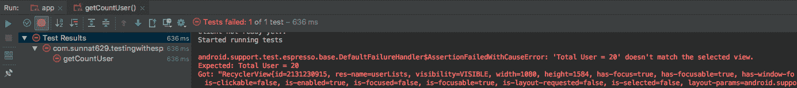

如果你提供`100`并运行，你可以看到测试通过了，就像这个截图所示：

``

现在创建一个名为`getUserPosition()`的测试用例来获取特定位置并点击它：

```kt
// User Click with a position number
@Test
fun getUserPosition(){
    onView(withId(R.id.userLists))
        .perform(actionOnItemAtPosition
        <RecyclerView.ViewHolder>(34, click()))
}
```

`actionOnItemAtPosition<RecyclerView.ViewHolder>` 的作用是使用 `RecyclerView` 和 `ViewHolder` 选择 `RecyclerView` 列表中的某个位置，然后我们使用列表的第 34 行的 `click()`。这意味着这个测试将会跳转到指定的位置并点击那个项目。你可以在下面的屏幕截图看到它已经点击并显示了一个 Toast，表明测试用例已经点击了列表的第 34 行：

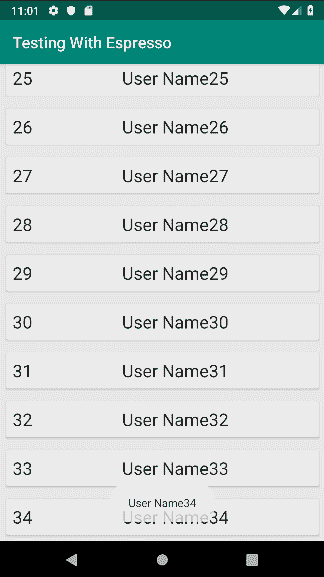

如果你查看日志输出，你也会注意到测试已经通过。以下是 Android Studio 的日志输出：

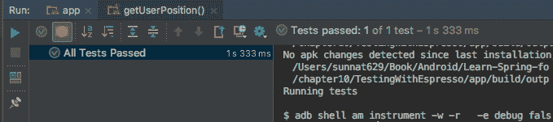

+   创建一个 `getIsDisplayed()` 函数来测试给定的列表是否正在显示。

+   `withId(R.id.userLists)` 将获取 `MainActivity` 的列表视图。

+   `check(matches(isDisplayed()))` 检查列表是否在设备上显示：

```kt
// User list display test
@Test
fun getIsDisplayed(){
    onView(withId(R.id.userLists))
        .check(matches(isDisplayed()))
}
```

创建一个 `getIsClickable()` 函数来测试给定的列表是否正在显示。`withId(R.id.userRoot)` 将获取 `ConstraintLayout`，而 `check(matches(isClickable()))` 将匹配列表的点击状态：

```kt
// User list display test
@Test
fun getIsClickable(){
    onView(withId(R.id.userRoot))
        .check(matches(isClickable()))
}
```

创建一个 `getScrollToBottom()` 函数来检查如何滚动到特定位置。`withId(R.id.userLists)` 将获取列表视图，`perform(scrollToPosition<RecyclerView.ViewHolder>(activityTestRule.activity.userLists.adapter!!.itemCount - 1))` 将滚动到列表底部。使用这个测试用例，你可以看到列表是否滚动顺畅：

```kt
// User list scroll to bottom
@Test
fun getScrollToBottom(){
    onView(withId(R.id.userLists))
        .perform(scrollToPosition<RecyclerView.ViewHolder>(activityTestRule.activity.userLists.adapter!!.itemCount - 1))
}
```

Espresso 还有很多其他功能。你可以查看这个作弊表（[`developer.android.com/training/testing/espresso/cheat-sheet`](https://developer.android.com/training/testing/espresso/cheat-sheet)），这是由 Google 提供的。

# 摘要

测试是发现 UI、后端代码或逻辑中错误的好方法。它有助于理解崩溃的原因。在这里，我们学习了两个强大的框架。一个是 JUnit，另一个是 Espresso。在本章中，我们看到了如何添加测试的依赖项。我们学习了如何将 JUnit 实现到项目中。我们看到了如何在测试用例中使用逻辑，以及如何检查测试用例的通过或失败结果。此外，我们还看到了如何连接数据库进行测试。然后，我们看到了如何将演示对象插入数据库，并随后从数据库中检索它，之后我们进行了对象匹配。

在 Android 测试中，我们使用了 Espresso 框架来测试 UI。最后，我们看到了一些 Espresso API 的用法以及如何处理和将它们与特定的活动连接。本章为你提供了一个关于测试的简要概述，以便你可以使用测试用例来完善你的项目。如果你想要了解更多，请参阅 *进一步阅读* 部分下的参考书籍。

如果你正在阅读这个段落，这意味着你已经完成了这本书，并准备好独立构建基于服务器和客户端的项目。现在你是一支孤胆英雄，能够创建具有安全性、数据库和测试的服务器和移动应用程序。我希望你喜欢阅读这本书，并且它将成为你即将到来的项目的参考点。

# 问题

1.  JUnit 支持哪些类型的代码？

1.  谁设计了 Espresso？

1.  JUnit 在哪个平台上使用？

1.  为什么在 Android 应用中使用 Espresso？

1.  Android 测试策略是什么？

1.  测试的标准比例是多少？

1.  你如何在设备上测试不同的屏幕尺寸？

# 进一步阅读

+   *《Android 应用测试指南》* ([`www.packtpub.com/application-development/android-application-testing-guide`](https://www.packtpub.com/application-development/android-application-testing-guide)) 由 Diego Torres Milano 著

+   *《学习 Android 应用测试》* ([`www.packtpub.com/application-development/learning-android-application-testing`](https://www.packtpub.com/application-development/learning-android-application-testing)) 由 Paul Blundell 和 Diego Torres Milano 著

+   *《Spring 框架大师课 - 从入门到精通 [视频]》* ([`www.packtpub.com/application-development/spring-framework-master-class-beginner-expert-video`](https://www.packtpub.com/application-development/spring-framework-master-class-beginner-expert-video)) 由 Ranga Karanam 著
