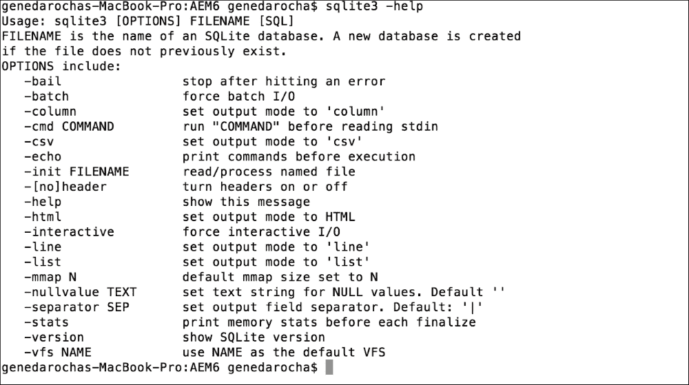
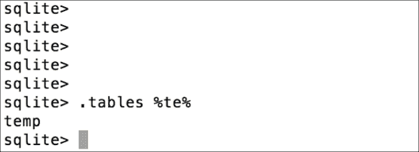

# 第三章：数据库管理

在本章中，我们将向您介绍 SQLite 数据库的管理，并让您了解这个关系型数据库系统的不同组件，这些组件最适合移动或平板设备。SQLite 是一个嵌入式 SQL 引擎，它简单地读取和写入普通磁盘文件，而不是有一个单独的服务器进程。它是为此目的而设计的，并且维护起来更容易。

除了是一个优秀的程序员数据库外，SQLite 还是一个易于管理和维护的数据库。管理这个数据库不需要任何配置或设置。它附带了一个标准的 **命令行界面**（**CLI**）客户端，可用于管理数据库（们）。

有许多与 SQLite 兼容的语言，这些语言更容易维护并添加新功能。

以下是一些 SQLite 的特性：

+   SQLite 是最容易学习的数据库之一，易于交互，并且能够从头开始构建新的数据库。

+   它能够将数据库引擎本身集成到代码中，这对代码开发、性能和接口是一个巨大的提升。

+   开始、学习、执行以及在实际操作中了解关系型数据库系统如何组合在一起，以及它是如何存储应用程序数据的，这些都非常容易。

在市场上，有各种各样的工具可以使 SQLite 的数据库管理更加容易使用，安装更加实用，并便于开发。在我们的案例中，仅将使用 **命令行程序**（**CLP**）。

这些是市场上的一些工具：

+   **RazorSQL**，位于 [`www.razorsql.com/features/sqlite_features.html`](http://www.razorsql.com/features/sqlite_features.html)，是一款在浏览器环境中运行的定制软件。它可以突出显示语法，并提供一个编辑器来编写和更新代码，一些可视化管理员工具以及 SQLite 独有的功能。

+   另一个工具是 **SQLite Maestro**，位于 [`www.sqlmaestro.com/products/sqlite/maestro/`](http://www.sqlmaestro.com/products/sqlite/maestro/)，这是一个针对数据库管理市场的优秀产品，旨在使用 SQLite 创建、更新和删除数据。例如，它包括数据库设计器、SQLite 语法检查、管理员工具和数据导出功能。

+   **Navicat** 是另一个 SQLite 数据库管理工具，位于 [`www.navicat.com/products/navicat-for-sqlite`](http://www.navicat.com/products/navicat-for-sqlite)。他们的产品包含一些优秀的可视化工具、数据库维护功能、报表和数据导出等功能。

CLP 实际上是一个包含 SQLite 引擎的程序。CLP 既可以作为命令行工具，也可以作为交互式外壳运行。命令行模式是**数据库管理员**（**DBAs**）可以使用它来为应用程序创建表、上传数据到骨架表以及修改信息以便进行开发、测试和发布的设施。要开始使用命令，在终端监视器中输入 `sqlite3`：


如果您输入 `sqlite3 <database name>`，系统将加载到命名的数据库中，并准备好进行工作。例如，您还可以输入 `sqlite3 –help`，如以下截图所示，这将概述作为帮助一部分可用的命令。如以下截图所示，有多种选项可以帮助 DBA 或用户按需完成任务。在 `sqlite3` 中，要退出提示符，请输入 `.exit` 以离开程序。在终端提示符 `$` 中，输入 `sqlite3 –help` 以获取命令列表，如此处所示：



前面的步骤是手动进行的，可以由数据库管理员使用。为了自动化数据库过程，Shell 脚本理想情况下可以使用该格式，这可以提高数据库性能。

# 创建数据库

首先，必须创建一个数据库。通过使用以下命令创建数据库，尽管数据库将被创建，但数据库中还没有实际存储任何内容。一旦创建，SQLite 数据库没有默认的存储位置。位置可能是您的家目录、工作目录或预先创建的数据库目录：

```swift
$ sqlite3 testdatabase.db

```

默认情况下，环境已经准备好，以便有效地为数据库对象，如前所述定义。SQLite 被设计为具有避免任何大小限制的独特策略。为了有一个易于适应设备内存并作为 32 位整数的策略是可行的，但这不是最佳选择。事实证明，当产品被推向极限并且可能利用安全漏洞时，这会引发问题。对象的默认设置很慷慨，对于大多数应用程序来说都是足够的。还有不同的设置语句，例如 `SQLITE_MAX_COLUMN`，它控制表、索引或视图中的最大列数。

只有在创建了表和索引之后，数据库的物理创建实际上才开始。这允许 DBA 在创建磁盘参数和分配之前更改不同的页面设置。此后，更改设置会更加困难。

## 创建表

要在新的数据库中创建表，请使用以下命令：


在运行上述命令创建数据库之后，执行`create table temp`语句以创建一个临时表。它有三个列，`id`是一个主键，其值会自动递增；`name`，是文本类型；以及`address`，也是文本类型。

## 插入数据

要将数据插入到新表中，请使用以下命令。这是一个简单的操作，将数据插入到左侧列出的表中，以及右侧相同格式类型的值和参数，或数据：


使用两个列的数据（`name`和`address`）将数据输入到`temp`表中。请注意，对于`id`字段不需要提供值，因为 SQLite 会内部提供，并且自动递增其值。

## 选择数据

要从新表中选择数据，请遵循以下命令。这是一个简单的操作，用于获取信息并在屏幕上显示：


从`temp`表中选择了所有列的数据，因此使用了字符`*`，否则可以指定一个列名，只检索该列数据。

## 创建索引

要为`temp`表创建索引，这将允许使用`id`字段更快地进行选择，并且有少量的开销，这可能会被性能提升所超过，请使用以下命令：


在`name`列中创建了一个名为`temp_idx`的索引，这将允许以最小的数据访问开销更快地访问。

## 导出数据

要从 SQLite 导出数据，使用`.dump`命令，如下所示截图。不需要任何参数，可以以这种方式导出整个数据库。如果添加了一个参数，如表名，则只导出其内容。默认情况下，`.dump`命令将输出到屏幕。如果您想将输出定向到文件系统，请使用`.output`语句加上一个空格，然后是`文件名`，如下所示截图。

使用这些命令后，在当前目录中创建了一个文件。要返回到屏幕上输出数据，请使用`.output stdout`命令，如下所示。

使用这些方法可以提供更多的灵活性、控制和更好的输出格式：


如前一个屏幕截图所示，输出到了`temp.sql`文件。执行了`.dump`命令，将所有数据库信息输出到`temp.sql`文件。要将输出返回到屏幕，请使用`.output stdout`命令。

# 查看数据库模式数据

SQLite 提供了一系列命令，作为命令集的一部分，以获取有关数据库内容的信息。例如，要获取表列表，使用`.table`命令。要查找特定的表名，使用一个`%`符号和文本作为模式来查找结果，例如，`.tables [pattern]`，如下面的截图所示。通过发出`.tables`命令并将其附加一个`%te%`文本，是请求 SQLite 列出其数据库中所有名称中包含单词`te`（在我们的案例中是`temp`）的表，并且显示正确：



## 索引数据

在以下示例之前，已经创建了一个`temp_idx`索引，要获取`temp`表的索引列表，在`sqlite3`提示符下输入`.indices temp`，这实际上是`.indices`命令后跟表名，如下所示：


使用前面的命令，可以看到`temp`表的索引。

## 模式数据

要查看数据库的模式，可以发出以下命令，`.schema`，但输入`.schema <table name>`命令以获取关于特定`name`数据库对象的详细信息。请参阅以下截图以获取更多信息：


前一个命令显示了从数据库的`temp`集合的表和索引的输出。下一个命令显示了整个数据库模式：


SQLite 主模式表显示了 SQLite 数据库上存在的表和索引。

# 备份数据库

备份 SQLite 数据库有几种方法。为了使其便携，请在 CLP 中使用`.dump`语句，它可以导出整个数据库和脚本到文件系统。以下是一个示例：


前面的语句显示了如何使用数据库名称调用 SQLite 并将输出管道传输到名为`temp.sql`的文件。

以下是将 SQLite 和备份交互式调用的另一种方法。

用户可以直接通过以下命令集导入数据：


以下命令将打开 SQLite 和`temp.db`数据库，并将`temp.sql`文件导入其中。在`temp.sql`文件中，将包含读取源文件并将数据导入数据库（现有或新版本）的脚本：


另一种方法是只需将`temp.db`文件复制到名为`temp.backup`的版本中，但上述方法更好且更便携，并且可能存在二进制兼容性问题，因为 SQLite 在向后兼容性方面并不享有很高的声誉。

# 数据库工具

SQLite 管理工具种类繁多，其中之一是 **SQL Browser** ([`sqlitebrowser.org/`](http://sqlitebrowser.org/))，它适用于不同的平台。数据库可以进行管理，表格可以导出或导入，查询可以创建、更新和执行。其他工具如下列出：

+   **RazorSQL**

+   **Navicat**

+   **SQL Maestro**

+   **SQL Browser**

+   **phpSQLiteAdmin**

+   **SQLiteManager**

+   **SQLite Expert**

另一个用于 SQLite 管理的先前或已废弃的项目是 **phpSQLiteAdmin**。该项目现已废弃，最后一次更新是在 2008 年。它可在 [`phpsqliteadmin.sourceforge.net/`](http://phpsqliteadmin.sourceforge.net/) 获取。phpSQLiteAdmin 是 SQLite 数据库管理的网络界面。它允许用户删除、创建和管理数据库，并查看数据库信息，如模式、表格、索引和文件元数据。市场上还有一个类似的项目，名为 **Bitbucket**（可在 [`bitbucket.org/phpliteadmin/public/`](https://bitbucket.org/phpliteadmin/public/) 获取）。

**SQLiteManager** 是一款可以管理数据库以创建、更新和导入或导出数据的产品；SQLiteManager 可在 [`www.sqlitemanager.org/`](http://www.sqlitemanager.org/) 获取。这是一个基于网络的 SQLite 管理工具。表格中的行可以管理，并且可以根据需要创建用户函数。再次强调，该项目和产品目前不活跃，自 2013 年以来没有更新。该产品现已迁移到 Bitbucket，不再作为 SQLiteManager 有效。然而，自 2013 年迁移到 Bitbucket 以来，没有更新。

此外，还有一个名为 SQLite Expert 的额外工具（可在 [`www.sqliteexpert.com/`](http://www.sqliteexpert.com/) 获取），它有个人版和专业版。例如，它内置了 **SQL 查询构建器**，提供了导入和导出数据的功能，以及数据编辑功能。

# 数据库文件信息

`sqlite_master` 视图概述了 SQLite 中所有数据库对象的详细信息。在 SQLite 中，数据库的最大大小为 2,147,483,646 页，每页 65,536 字节，或 140,737,488,224,256 字节（约 140 太字节），而 SQLite 数据库的最小大小是一个 512 字节的页面。查看哪些表格存在最好的方法是通过对主表执行 SQL 语句，如下面的命令集所示：


实际上，可以从 SQLite 网站下载 `sqlite3_analyzer` 程序。该程序执行许多功能，例如查询数据库文件，并以文本格式输出摘要，显示数据库结构、其环境、表格、索引、页面大小、条目、以字节为单位的存储、使用的页面、溢出页面和主页面上的未使用字节。

当分析数据库的资源、组件和结构时，可用的详细信息令人印象深刻且非常有用。

`sqlite3_analyzer` 程序也可以以多种方式使用，以利用从其使用中获得的统计数据。`sqlite3_analyzer` 是一个 TCL 脚本，可在 [`www.sqlite.org/src/artifact/8e50b217c56a6a08`](http://www.sqlite.org/src/artifact/8e50b217c56a6a08) 获取。

# 摘要

在本章中，你学习了如何管理和维护 SQLite 关系型数据库系统，它以简单的方式向你展示了如何管理应用程序的数据库。本章介绍了 SQLite 数据库的一些基本元素。它涵盖了创建表和查看构成模式的表的必要要素。这些主题足以让你掌握这个主题并精通基础知识。本章涵盖了基本元素，并为管理这个易于使用的移动数据库提供了帮助。本章还总结了与其他市场上的数据库相比，管理 SQLite 的简便性。你可以在网上找到更多用于 SQLite 管理的工具。还有许多其他命令，本章并未全部以示例形式展示。这些都是使用和管理 SQLite 的一些方法。本章向你展示了当你学习一些命令时，你可以做到什么，以及它如何帮助使用这个简单、移动的数据库。

在下一章中，你将学习 SQL 的所有基本要素。本章将概述如何正确地在移动数据库上使用 SQL。它将向你展示如何使用 SQLite 的 SQL 方法与其他数据库相比，以及使用 SQLite 学习 SQL 的简便性。
