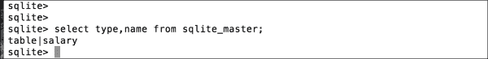

# 第四章 SQL 基本知识

在本章中，你将了解 SQL 的所有基本知识。它将概述 SQL 的主要可能性以及如何在 SQLite 上正确使用。SQL 是使用 SQLite 的基础，也是利用 SQL 优势的必要条件。它在许多方面都相关，因为它是数据通过、查询和显示的方式，使用变量。

我们将讨论如何使用“having”之类的子句来使用该语言。一旦你了解了 SQLite 中 SQL 的基本用法，这将使整个主题变得更容易。

在业界，SQL 也被发音为*sequel*，并且是使用这些命令和语法的默认数据检索标准。本章中的说明将使用易于理解和遵循的风格和格式。它利用了重放代码、重复它并牢记它的想法，以增强你的知识和经验。

你还将看到可用于排序、校对和按需排序信息的各种数据检索选项和技术。本章中展示的示例将提供易于遵循和有用的指令，使用高级 SQL 命令。结果将快速，甚至瞬间即可获得，可以反复练习以获得必要的知识。本章将包含如`customers`或`salary`之类的表格以及不同的触发器名称和 SQL 语句。

本章中的示例将符合 ANSI 标准，并且应该与 SQLite、Oracle、Ingres、SQL Server、MySQL、MS Access、Informix、Sybase 以及其他 ANSI SQL 兼容数据库一起工作。本章旨在提供关键信息，这将提高你的技能。它还将作为一个简单的复习和提醒，让你回忆起最初学习的内容。

首先，`SELECT`语句是通用命令中最容易的一个，但也是协议的核心之一。它允许系统内的数据以用户请求的格式和风格可见，前提是它是语法正确的。

在`SELECT`语句中存在许多子命令和子句，本章将讨论其中的一些。由于`SELECT`语句的重要性及其在数据选择方面的众多选项，它将成为本章的重点。作为一名开发者或数据库管理员，了解可能的选择总是有益的，这有助于编写高效的查询。本章将提供这方面的知识，并对专家来说，将是一个知识的更新。尽管 SQLite 命令在 Oracle 或 MySQL 中工作方式和外观相同，但实际上 SQLite 的一些命令是不同的。

让我们开始吧！

# 事务

数据库**事务**是一个包含多个操作的逻辑工作单元。根据定义，它将具有四个**ACID**属性：**原子性**、**一致性**、**隔离性**和**持久性**。

事务必须提供对执行工作的全面承诺感，或者是一种回滚而不完成工作的方式。它还必须保持每个事务与其他事务的独立和隔离，并确保事务完成，信息写入数据库。它还必须减少数据库的不一致性，并允许从任何故障中恢复的最佳和正确方式。

# 查询计划

当要执行查询时，数据库使用查询计划来构建数据路径，其中创建最佳和最有效的路由类型。如果有表连接、索引和表中的行数，则会准备使用不同算法的各种数学计算。当 SQL 存在问题，需要调试多个表连接和索引设置，以及遵循路径来解决数据或编程问题时，拥有执行计划是有用的。

除了纯文本格式的直接 SQL 语句外，还有一些语句将在 iOS 中使用，并封装在 Objective-C 或 Swift 等语言中。

当查询执行计划执行时，数据和信息仅用于调试，应作为指导使用。每个 SQLite 版本都将有不同的更新影响产品。计划的整体思想是概述 SQL 命令采取的策略路径。

需要使用一个名为**EXPLAIN**的关键字，或者是一个短语，即**EXPLAIN QUERY PLAN**，以获取表的详细信息。这些命令仅用于调试和分析。这些命令部分有文档记录，其行为并不总是 100%：


接下来，我们看看带有`salary`选择的 SQL 语句将是什么样子。使用`EXPLAIN QUERY PLAN`命令与`SELECT`语句一起，基本计划概述了表的名称及其顺序。通过有效地学习查询执行计划，你可以了解 SQLite 如何访问你的数据，并看到它是如何提交的：


`EXPLAIN QUERY PLAN`命令作为执行 SQL 查询的指导和计划。它将报告并提供与数据库索引如何有效使用来访问数据相关的信息。

**系统目录**也是所有表和索引的主列表位置。例如，`sqlite_master`表如下所示：



# SQL 基础

SQLite 还有一些其他用于 SQL 的功能，例如从列中查找最大的`id`，以及最后插入及其`id`，如下所示：


## 带子查询子句的插入

`INSERT`语句是用来向数据库中添加数据的。然而，迄今为止的示例只展示了来自固定信息或程序变量的数据。还有另一种插入数据的方法，即基于选择标准和数据/列匹配从另一个表插入。这是一种带有**子查询**子句的插入；请参见以下示例：

```swift
SQLite> Insert into Salary values (Select id, name, salary from salary_import where name='Smith');

SQLite> Select * from Salary where name like '%smith%';
```

格式有多种变体，如前例所示。SQL 是灵活的，有选择不同数据和在 ID 的最后行上进行计算的选择。

## 使用子查询子句更新

如前几章所述，`UPDATE`语句用于从程序变量或固定数据中更改表中的现有数据。然而，还有另一种方法可以从具有匹配和链接关系的源表更新数据到目标表，如下所示。`UPDATE`语句将修改多个列。`WHERE`子句将确定哪些列需要更新。这是最容易理解和使用的 SQL 命令之一：

```swift
SQLite> Update salary = 15000
Where name='John Smith';

SQLite> Select * from Salary where name like '%smith%';
```

## 使用子查询子句进行选择

如前几章所述，`SELECT`语句用于从数据库的核心检索并显示信息给用户。`SELECT`语句是一个非常流行且功能强大的命令，具有各种选项和选择来检索数据。**子查询**或**子查询**是原始 SQL 中的嵌套 SQL 片段，它嵌入在`WHERE`子句附近。子查询或子查询将仅用于检索与主选择查询通过特定列名链接的信息。

这些子查询子句可以用于`DELETE`、`INSERT`、`UPDATE`和`SELECT` SQL 命令中，例如使用`=`、`<`、`>`、`>=`、`<=`、`IN`或`BETWEEN`等运算符。子查询有一些规则适用，例如，子命令的`SELECT`子句中必须只有一个列，除非在主 SQL 语句中选择了多个列。

子查询查询必须使用括号作为其语法的一部分，以概述子查询本身。查询的主体部分可以使用`ORDER BY`语法，但不能在子查询中使用。如果使用这些类型的查询返回多行，则必须使用`IN`等运算符。只要不是`BETWEEN`运算符本身，`BETWEEN`词可以在子查询中使用：

```swift
sqlite> SELECT * FROM PERSONNEL WHERE ID IN (SELECT ID FROM SALARY WHERE SALARY > 15000);
```

# 数据完整性

**数据完整性**在维护表和数据关系定义及保护方面非常重要。数据完整性有四种类型：用户定义的、引用的、实体的和域的。

掌握数据处理、数据库设计、开发和管理的技能对于确保使用 SQLite 构建的应用程序性能良好，并保持无数据崩溃、数据损坏和安全问题至关重要。

当设置列的数据类型时，这就是一种数据完整性的形式。可以通过仅允许某些值来增强数据完整性。

当设计一种机制来通过唯一的元组或行标识符维护表中的主键时，这被称为实体完整性。

当例如两个表通过一个公共列数据类型链接时，发生引用完整性。引用完整性确保数据被清理并正确链接。

# 默认值

列的 **默认值** 非常有价值，因为它强制数据完整性并确保在数据库中输入了值。这也意味着某些 SQL 语句比其他语句更短。一个没有添加列的标准语句类型是 `id` 字段，其中定义了主键，当使用 `INSERT` 语句时，不需要 `id` 字段，如下所示。

DBA 可以创建列以在数据库中自动存储 `current_timestamp`，这对于日志记录和时间戳很有用。

```swift
sqlite> INSERT into salary (name, salary, bonus) values ('John Smith',15000,2000); sqlite> SELECT * FROM salary;

id            name         salary    bonus
-----       --------     ---------  --------
1           Peter Jones   10000      3000
2           Sam Smith     15000      1000
3           John Smith    15000      2000
```

## 约束检查

为了确保正确的数据输入到表中的列，必须施加某些规则，这些规则被称为约束。这些规则强制数据准确性，限制损坏，并提高并维护数据可靠性。

在表级别，它将应用于整个表，但在列级别，它将仅应用于一个特定的列级别。它们的使用方法如下所示：

+   `.UNIQUE` 约束将确保列数据信息不重复

+   `.PRIMARY` 键，在 SQLite 中，每个数据行在表中都有一个标识

+   `.NOT NULL` 确保没有列存储了 NULL 值

+   `DEFAULT` 将设置一个默认值，当未指定或输入值时

## 外键

当两个或多个表需要在公共列上链接在一起时，这被称为 **引用键** 或 **外键**。SQLite 支持关系完整性并支持外键约束，就像其他数据库一样。它通常由 DBA 设计，涉及一个列 ID，例如，以匹配第二或第三表上的 ID。

为了表现良好，表列和实际数据之间必须存在逻辑引用。SQLite 将使用外键作为创建表语句的一部分；以下是一个示例：

```swift
CREATE Table Salary (
id integer primary key,
name text,
salary
};
```

# 更新视图

**视图** 是一个命令，可以使用表的组合和连接来向用户或程序显示一组预定义的数据，如所需。实际上，它提供了数据的视图。您不能从视图中 `DELETE`、`UPDATE` 或 `INSERT`。

由于视图是用一个特定的名称定义的，该名称存储在数据库中，因此它可以有效地作为表引用，作为要操作的语句的一部分。

如果在 `create` 和 `view` 词语中存在如 `Temporary` 或 `Temp` 这样的关键字，那么该视图只能被那个数据库连接看到，并在连接关闭时被删除，因此得名 `temp/temporary`。

当创建视图时引用数据库名称，它将位于该特定数据库中。

# 索引使用

在创建了一个具有其列和数据类型的表之后，它几乎可以投入使用。数据链接的主要列已经完成，但根据数据库管理员（DBA）的定义，它还不完全准备好。相反，可以创建一个索引来加速 SQL 查询，并作为 SQLite 将用作快速获取信息方式的特殊查找表。

**索引**有一个数据指针，它将快速引用数据并将其返回，从而使得访问更快，通常没有太多开销。根据定义，索引确实有其自身的开销，但索引的开销被性能和效率的获得所掩盖。这对于移动应用程序可能很有用，因为它们资源有限且网络访问受限。

作为例子的数据库索引类似于书中的索引，你可以找到你想要的内容，因为你知道它是什么，只需打开书到正确的页面，在阅读索引之后。

索引在数据输入上较慢，但在`SELECT`查询上较快，无论是否有`WHERE`子句。一旦创建了索引，也可以将其删除，而不会影响表的核心数据。以下是一个简单的例子，展示了在`customer`表上创建了一个名为`table_index_name`的索引：

```swift
CREATE INDEX table_index_name ON customer;
```

第二个例子展示了如何创建一个索引来引用一个名为`salary`的列，该列在许多查询中被多次使用：

```swift
CREATE INDEX table_index_salary ON customer (salary);
```

在这里，一个索引将加速访问。在`customer`表上创建了一个名为`table_index_salary`的索引，它是在`salary`列上创建的。

也有被称为**组合索引**的索引，实际上是为了在数据库中索引多个列以获得进一步的性能提升，但也会在数据输入上产生开销。如下所示，创建了一个索引并将其链接到两个列：`salary`和`bonus`。与其有两个索引并带来更多开销问题，一个组合索引可能更好，因为它是一个索引，但引用了两个列：

```swift
CREATE INDEX table_index_salary ON customer (salary, bonus);
```

在创建索引时，数据库服务器还会创建隐式索引，这些索引是自动的。如果作为数据库管理员（DBA），你想查看它们，请使用以下示例：

```swift
sqlite> .indices customer;
```

# 触发器

**触发器**是使用 SQL 命令与数据库高效交互的有效方式。它们快速，并且嵌入在创建`trigger`命令中。

触发器由触发器名称、涉及到的表引用、时间事件（如之前或值更改之后）、操作类型（如插入、更新或删除）以及各种表和列组成，以完成操作。

语法必须正确，测试应确保更新和更改是正确的，以确保数据并发性和稳定性，没有损坏。

这个触发器被称为`update_customer_trigger`，它对`customers`表执行`UPDATE`查询。更新将影响`tel_no`列。因此，当前的电话列`tel_no`将被更新，其中它将等于新表中的值，以及其列`tel_no`（`tel_no = new.tel_no`），其中客户名称的链接（`customer_name`）等于`old.name`列。

更新的触发器必须使用表中的特定列，这些列是预定义的，与`insert`或`delete`列不同。

```swift
sqlite> select sql from sqlite_master where name='update_customer_trigger';

CREATE TRIGGER update_customer_trigger UPDATE OF tel_no ON customers    BEGIN     UPDATE orders SET tel_no = new.tel_no WHERE customer_name = old.name;   END
```

# 同步写入

**同步写入**是 SQL 引擎的一部分，它将确保根据事务原因和数据库工作方式，将数据更改写入磁盘区域。在 SQLite 的情况下，这些操作在不同的状态或设置下进行，例如`NORMAL`、`FULL`或`OFF`。出于性能原因，DBA 可以根据需要关闭 SQLite 的提交。

`OFF`设置快速执行任务，几乎没有减慢速度，最小化中断，并提高性能。然而，在数据库崩溃的情况下，数据完整性将保持良好，但在系统崩溃和断电的情况下，数据库本身损坏的可能性很大。虽然可以取得性能上的提升，但这也伴随着与此行动相关的风险。

`FULL`设置必须确保在继续之前，数据被正确且及时地保存到磁盘上。这种方法对性能不利，但是最健壮和最安全的。如果出现数据损坏或系统崩溃，用户可以确信不会发生数据库损坏。

`NORMAL`设置会定期减慢速度以保护数据并将事务提交到磁盘。数据库崩溃或断电可能会损坏数据库，但更严重的硬件错误可能更糟糕。

# 数据库锁定和死锁

当一个或多个操作或 SQL 语句与其他进程或操作同时竞争数据访问和表更新或操作时，就会发生**死锁**。由于它与事务一起工作，一个进程无法前进或完成，因为另一个进程或操作正在持有资源并等待，因此形成了死锁。

因此，在数据库中，一个进程可能会尝试更新某个记录，而另一个进程则希望更新同一行中的某些数据，或者是在事务发生时另一个表中的冲突。必须有一种形式的数据锁定机制来管理和减少冲突。可以在事务周围的代码中添加一个重试指示器，例如三个，如果发生死锁，它将重试，并在第三次尝试后回滚或给用户一个重试的机会。

死锁是多线程和多进程操作系统中的常见现象，这些系统正在执行各种任务，并试图以积极的结果完成。

以下示例展示了 SQL 事务最终会导致死锁的情况。在这种情况下，两个事务/会话都将处于死锁状态。**会话 2** 将尝试向数据库插入/写入并创建锁定以获取独占权限来保护，并确保它可以无问题地插入记录。**会话 1** 也尝试写入，这也导致了死锁情况。实际上，我们有一个**会话 1** 和**会话 2** 都不想失去访问或控制权，直到对方离开，这导致死锁继续，如下所示：

| 会话 1 | 会话 2 |
| --- | --- |
| `sqlite3>` | `sqlite3>` |
|   | `sqlite3>insert into temp(name,address) values('Gene','London');` |
| `sqlite3> select * from temp;` |   |
|   | `sqlite3> commit;` |
|   | `SQL 错误信息：数据库锁定` |
| `sqlite3> insert into temp(name,address) values('Gene','London');` |   |
| `SQL 错误信息：数据库锁定` |   |

# FMDB SQLite 包装器

除了使用标准的 SQL，Objective-C 编写的 FMDB SQLite 包装器，对于那些喜欢使用替代且更简单方式与 SQLite 交互的人来说，可能会有所帮助。

有关 FMDB 规范和代码示例的更多信息，请参阅 [`github.com/ccgus/fmdb`](https://github.com/ccgus/fm)。

FMDB 中有三个主要类：

+   **FMDatabase**：这是执行您的 SQL 语句的单个 SQLite 数据库。

+   **FMResultSet**：这将保存并显示从 `FMDatabase` 得到的输出和结果。

+   **FMDatabaseQueue**：如果您想在多个线程中执行查询和更新，这个类将使您能够更新和使用许多线程。

# 数据库创建和打开

数据库被定义并分配到位置和目录：

```swift
FMDatabase *db = [FMDatabase databaseWithPath:@"/tmp/atmp.db"];
```

要与数据库交互，您必须连接并打开它，如下所示：

```swift
if (![db open]) {     [db release];     return; }
```

# iOS 中的 SQL

要选择数据，可以使用 `executeQuery` 等方法返回 `FMResultSet` 对象（如果成功），或失败时返回 `0`。有如 `lastErrorMessage` 或 `lastErrorcode` 等方法可以用来确定查询是否成功或失败：

```swift
FMResultSet *s = [db executeQuery:@"SELECT * FROM aTable"]; while ([s next]) {     //retrieve values for each record }
```

对于多行，必须使用 `[FMResultSet next]` 来查看或读取查询返回的值，即使记录集只有一个，例如。

以下命令展示了如何使用 `FMResultSet` 来选择所需的多个查询：

```swift
FMResultSet *s = [db executeQuery:@"SELECT COUNT(*) FROM aTable"]; if ([s next]) {     int totalCount = [s intForColumnIndex:0]; }
```

`FrmresultSet` 为程序员提供了几种检索方法；以下是一些示例：

+   `intForColumn:`

+   `longForColumn:`

+   `longLongIntForColumn:`

上述一些方法默认将具有 `{type}ForColumnIndex:` 变体，它将用于根据行中列的位置而不是名称本身来获取数据。

之前使用 `FMDatabase` 的代码来自 GitHub，是这些类型操作的标准代码。它已被用于提高与 SQLite 交互的便捷性，而不是传统的标准方法。

# 摘要

在本章中，你学习了与 SQLite 数据库相关的 SQL 基础知识，以及构建 SQL 语句和与 SQLite 及 iOS 交互所需注意的事项和所需知识，作为基本入门。

在下一章中，你将了解暴露 C API 的所有内容，它在 iOS 中的影响和用途，以及它是作为 SQLite 一部分如何工作的。下一章还将提及 C API 是 SQLite 的核心，以及它的使用方式。
