# 第六章。使用 Swift 与 iOS 和 SQLite

在本章中，你将了解如何使用苹果公司新推出的编程语言**Swift**。这是一种由苹果公司创建的新语言，具有非常强大的功能来执行各种任务，并且现在已开源。苹果公司发布了它，并且它发展得如此迅速，以至于在接下来的几个月和几年里，它将成为使用苹果设备编码的事实标准。你将看到 Swift 如何与 iOS、Xcode 和 SQLite 协同工作。

自从 Swift 在 2014 年旧金山的 WWDC 上宣布以来，这已经是一次非凡的旅程。2015 年，苹果宣布 Swift 将开源。这种语言本身允许你轻松编写高级代码，甚至低级代码。它是 Python、C 和 Objective-C 等语言的集大成者，使其更快、更简单，并且可在多个平台上使用。

你能想象未来几年会发生什么吗？设计模式和技能正在快速发展，应用程序将使用新语言重写和部署。

我们将向您展示如何安装 Xcode 以使用 Swift 和任何 SQLite 库。我们将提供一些示例，说明如何使新语言与 SQLite 和 Xcode 协同工作。本章中提供的示例和信息将帮助您作为初学者掌握学习这种新语言并获得新技能。

# 基本要求

所有#Apple 开发都是在 Mac 上完成的。你需要以下内容：

+   一台运行 Maverick 或 Yosemite 操作系统的 MAC 电脑

+   Xcode 应用程序开发环境

+   对面向对象编程有良好的理解

+   对 Swift 语言有基本理解，请参阅 Swift 参考指南

### 注意

如需参考信息，您可以查看[`developer.apple.com/library/ios/navigation/#section=Resource%20Types&topic=Guides`](https://developer.apple.com/library/ios/navigation/#section=Resource%20Types&topic=Guides)上的*Apple Developer Guide*。

对学习和提升技能持有积极的态度非常重要。

# 使用 Swift 启动 Xcode 项目

Xcode 受到了发布修复和 Swift 语言的增强影响。因此，有时之前容易工作的代码现在需要一些编码更改，编译器才会满意。这对于新语言不断变化的代码库来说，是一直都会发生的事情。

首先打开 Xcode。最好的 Xcode 版本是最新版本，可在苹果 App Store 的[`developer.apple.com/xcode/download/`](https://developer.apple.com/xcode/download/)下载。安装 Xcode，设置完成后，启动 Xcode 并按照以下步骤操作：

1.  创建一个新的项目（*Cmd*+*Shift*+*N*）。

1.  在模板选择器中，确保**iOS** | **Application**被选中。选择**Single View Application**模板以开始过程：

1.  然后你会被提示添加项目名称，所以添加一个像`Test Swift Project`这样的名称。

1.  接下来，添加公司名称为`Voxstar Ltd`或你的公司名称。

1.  接下来，添加组织者标识符，在我们的例子中是`com.voxstar.testswiftproject`，这将标识你的应用程序名称，并且这就是它将被 Apple 识别的方式。

1.  接下来，对于计算机语言，选择 Swift 而不是 Objective-C，这是我们本章所使用的。

1.  对于设备，选择**iPhone**，同时确保未选择**使用 Core Data**选项。以下截图作为示例：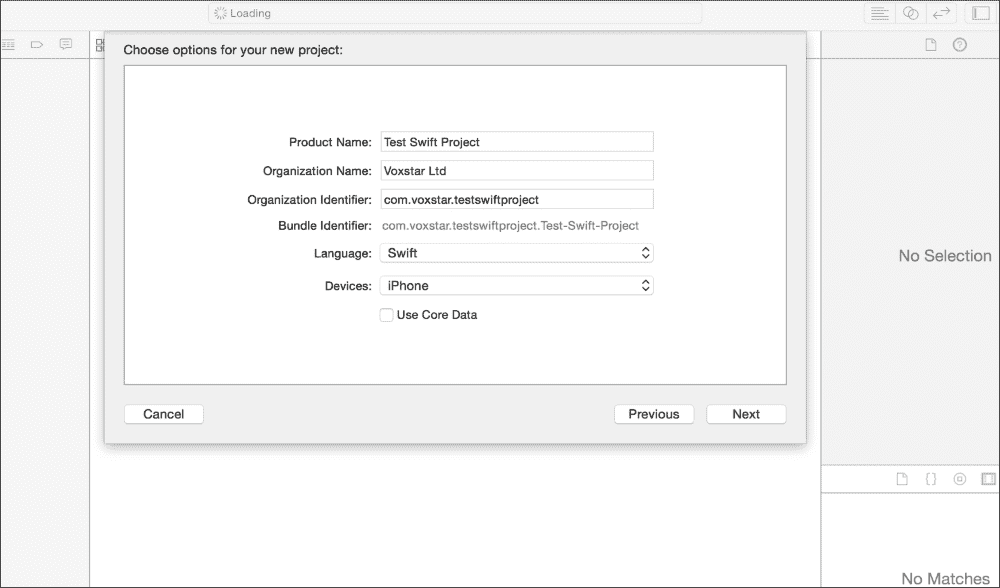

1.  点击**下一步**按钮继续此过程。之后，你必须存储项目文件的地址；我们建议你使用存储主`.swift`目录的位置，如下面的截图所示。对于本例，使用`Documents`目录，选择并点击**下一步**，将创建一个名为`Test Swift App`的新目录。以下截图显示了目录和项目信息：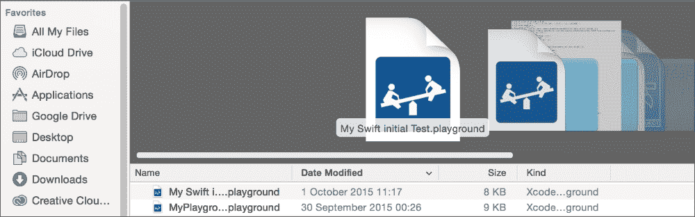

1.  一旦点击**创建**按钮，项目详情页面就会显示，如下面的截图所示。Xcode 使用一组标准文件、模板和组件作为其一部分：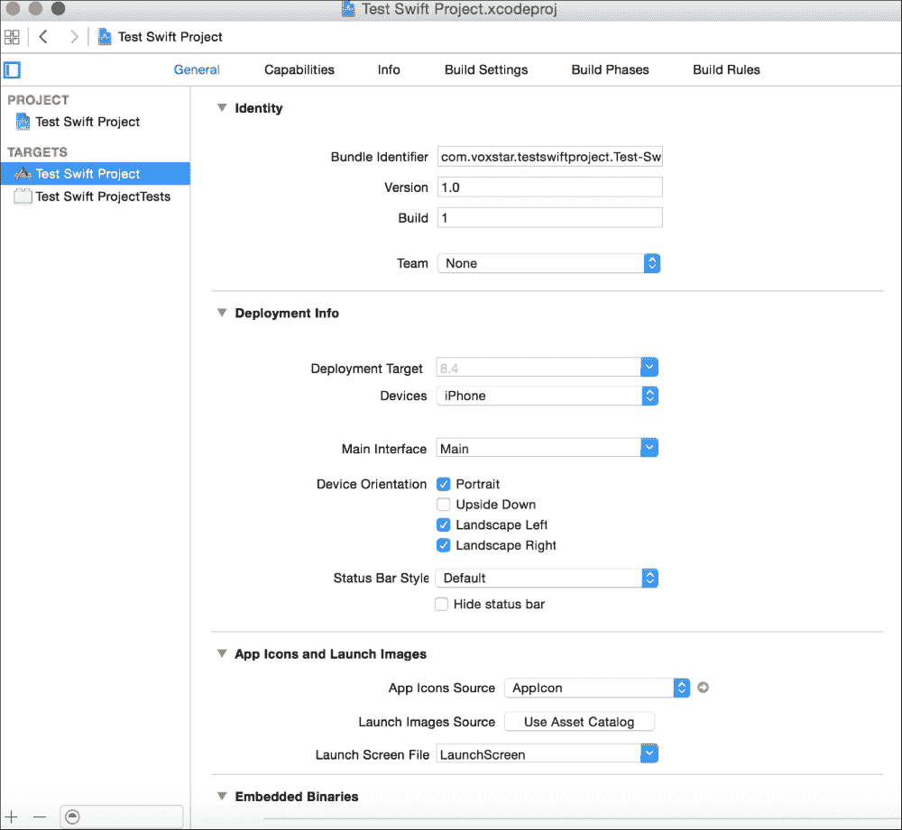

1.  要显示使用 iPhone 的标准应用程序的外观，请点击播放按钮，并观看默认屏幕和 iPhone 6 模拟器的输出：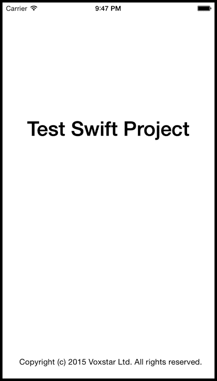

然而，Swift 应用程序的第一个主要入口点是`AppDelegate.swift`文件。此文件位于应用程序目录中。在应用程序目录下，将有一个以应用程序命名的目录，这就是`AppDelegate.swift`文件所在的位置。在 Xcode 中点击它以打开，你将找到一系列信息。这些信息将从使用你的姓名和公司详情作为设置部分的标准注释开始。

此后的主要信息是`import UIKit`语句。如果你之前使用过 Objective-C 进行开发，这个语句将非常明显、非常熟悉且易于理解。

UIKit 将提供管理并构建这些 iOS Swift 应用程序的基本基础设施和骨干。它将包含必要的用户界面和其他架构，甚至可以处理和与应用程序的其他部分进行交互。它还支持基于运动的事件处理和触摸事件处理。

它还将支持处理网页和文本内容的同时，提供 iCloud 支持的模式。它还将支持 Apple 推送通知服务。更多详细信息可以在开发者 Apple 网站上获得：


与 Objective-C 或其他标准编程语言不同，Swift 没有 `main` 函数或文件。相反，你只需在主 Swift 文件中提及 `@UIApplicationMain` 语句，所有相关组件都会被包含进来。这一行代码可能永远不需要更改，除非有重大更新或更改。

# 使用 SQLite 3 库

在开始编码之前，您必须为 SQLite 添加一个特定的库。在 Xcode 中，确保选择并可见 **通用** 选项卡。在页面底部，寻找 **链接的框架和库** 部分。查看并点击带有加号图标的图标，如下面的截图所示：

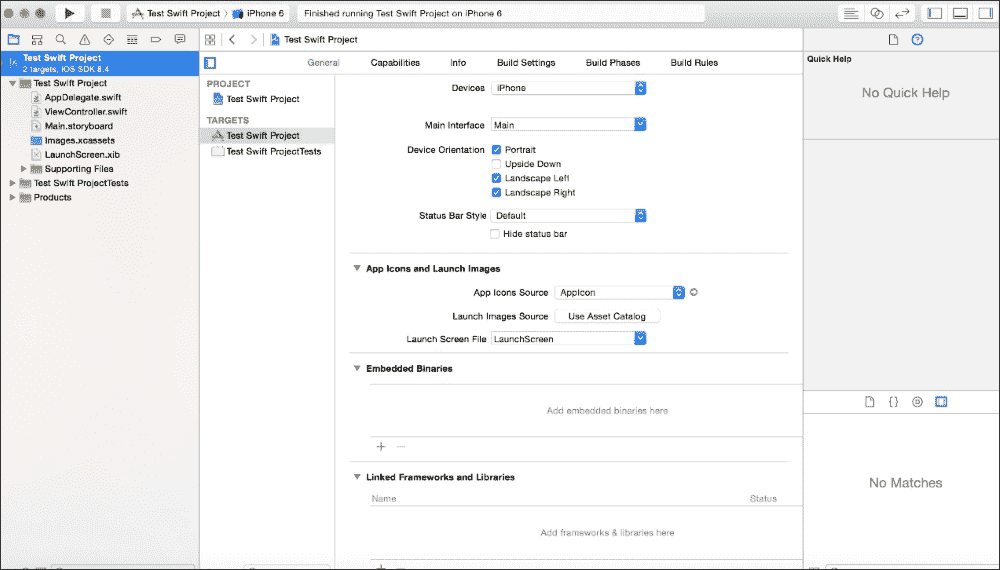

将会弹出一个模态窗口；请输入单词 `sqlite`，然后从信息列表中选择 **libsqlite3.dylib** 选项，如下面的截图所示：

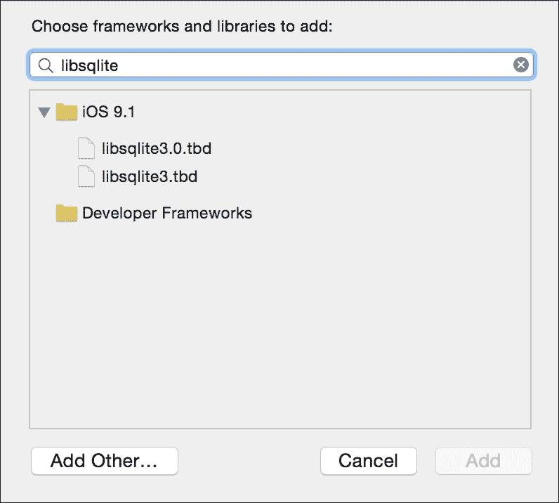

选择后，点击 **添加** 按钮继续。

作为本章的一部分，我们将使用 **FMDB** 和围绕 SQLite 的 Objective-C 包装器来展示使用 Swift 的数据库 SQLite。**FMDB** 代表 **Flying Meat Database**，它易于与 SQLite 交互，实际上可以节省时间和精力。例如，FMDB 将链接到一个 SQLite 数据库，并用于执行 SQL 查询。输出是 `FMResultsSet`，它显示了在 FMDB 上执行的查询结果。

### 注意

`FMDatabaseQueue` 类用于处理更新、查询和多重线程。

将使用 FMDB 方法在名为 `Mortgage` 的表上执行 `Insert`、`Select`、`Delete` 和 `Update` 的 SQL 命令。`Mortgage` 表将有一个 **名称** 字段和一个 **抵押卷号** 字段，用于账户详情，作为一个非常简单的例子。

以下截图是使用 Xcode 内部的视图控制器场景工具创建的基本屏幕布局的实际用户设计。这将概述并显示在按钮被点击时将遵循和执行的操作：

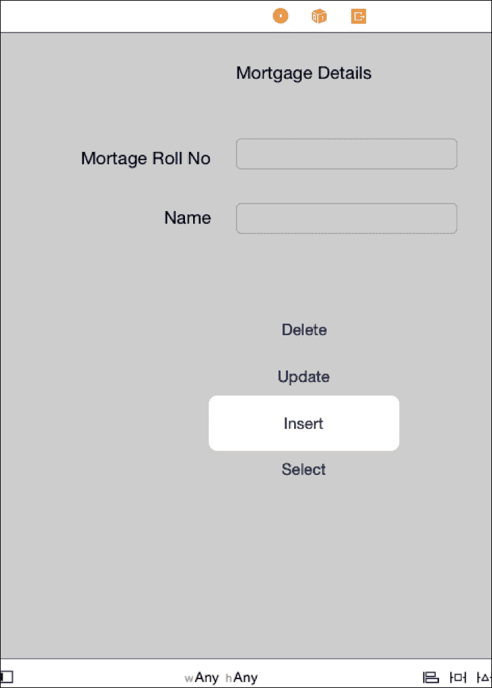

有许多工具可以管理 SQLite 数据库，其中之一是 Firefox 浏览器中的 **SQLite Manager Add-on**，用于管理数据库。该插件可以从 [`addons.mozilla.org/en-US/firefox/addon/sqlite-manager/`](https://addons.mozilla.org/en-US/firefox/addon/sqlite-manager/) 获取。

该插件产品为管理员提供以下一些功能：

+   管理您机器上的 SQLite 数据库

+   获取数据库对象的树形视图

+   同时还有一些易于管理且有用的对话框，例如触发器、视图和表

+   执行 SQL 查询的平台

+   以 UTF-8/UTF-16 格式导出表或视图

+   在 **执行** 选项卡中也可以执行多个 SQL 语句

打开 Firefox 并从上述链接安装扩展。以下截图显示了扩展的安装方式：

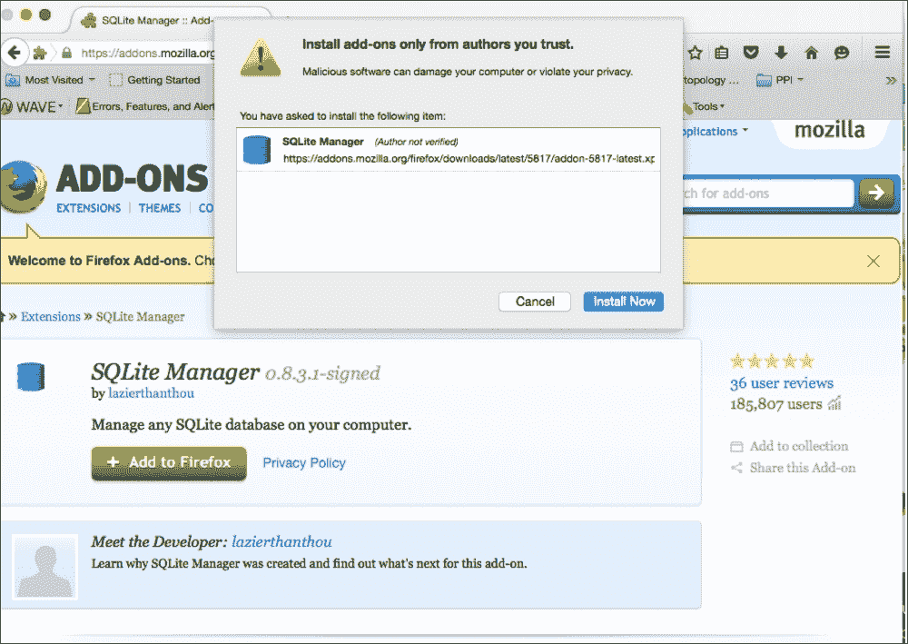

当你点击**立即安装**按钮时，插件将被安装。然后转到**工具** | **菜单选项**，你将找到**SQLite 管理器**。一旦点击该选项，就会出现以下屏幕：

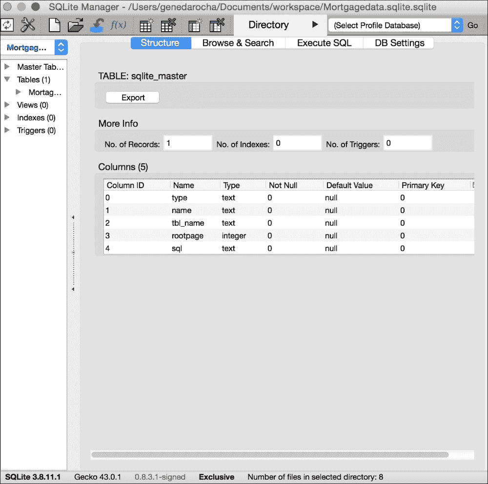

为了向系统中添加数据，必须创建数据库。

当你点击**立即安装**按钮时，插件将被安装。一旦转到**工具** | **菜单选项**，你将看到**SQLite 管理器**选项。当你点击该选项时，就会出现以下屏幕。

创建新的数据库并确保为这个小型测试应用程序使用 SQLite 创建一个表。在这个场景中，我们有一个名为 `Mortgagedata.sqlite` 的数据库，一个名为 `Mortgage_data` 的表，包含两个字段：`mortgage_rollno` 和 `mortgage_name`。

下一个截图显示了在 Firefox 中调用**SQL 管理器**的屏幕：

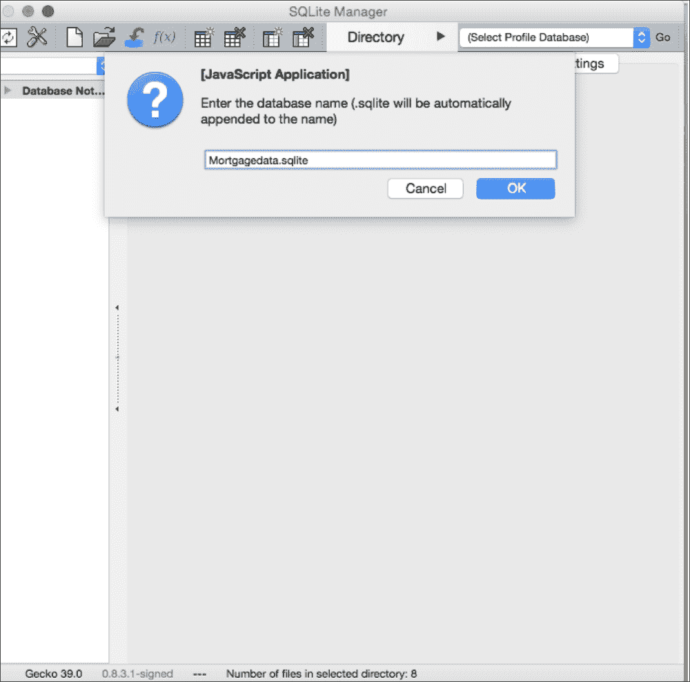

当你点击**SQL 管理器**选项来创建数据库时，会弹出一个窗口，用户在此输入数据库名称，如下截图所示：

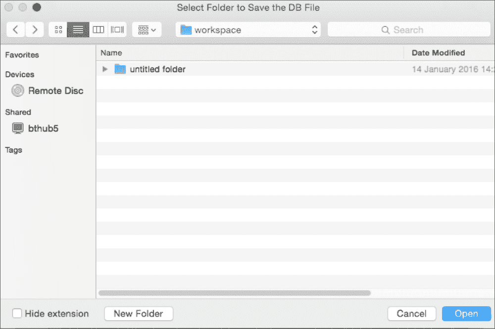

接下来，在数据库创建后，用户必须选择一个磁盘目录来存储数据库，如下截图所示：


接下来，需要创建一个表，如下截图所示，包含两行：

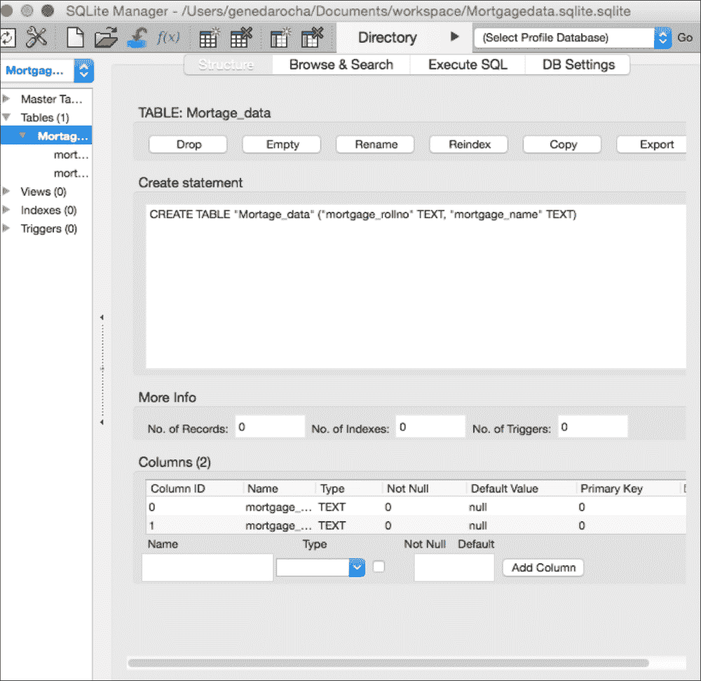

如前截图所示，这是在进一步工作之前表结构的样子。

接下来，需要创建一个类，这是一个 `NSObject` 的子类。将此类命名为 `Mortgage_data` 并根据此测试场景的要求设置其属性。这些属性将构成数据库模式以及你小型数据库和表的基础：

```swift
Class Mortgage_data: NSObject {
    Varmortgage_rollno: String = String()
    Varmortgage_name: String = String()
}
```

## 使用 FMDB

FMDB 是一个基于 SQLite 编写的 SQLite 库，用于简化数据库操作。

由于 FMDB 是在 Objective-C 中构建的，因此需要一个桥接头才能将其与简单应用程序链接起来。必须包含一个 `.h` 文件，即 `FMDatabase.h`。

这是为了确保 Objective-C 和 Swift 技术的链接能够产生我们想要的结果。接下来，我们需要在 SQLite 管理器中创建数据库并将其复制到正确的位置。

在以下代码中，我们展示了复制数据库的函数。在这个例子中，我们需要创建并使用一个名为 `copyFile` 的函数，该函数将文件复制到应用程序的文档目录。例如，`applicationDidFinishLaunch` 方法通过将数据库名称作为要求参数的一部分传递给 `AppDelegate` 来与 `AppDelegate` 一起工作。

请参阅以下类：

```swift
class func copyFile(fileName:NSString){
    var database_path:NSString=getPath(fileName)
    var MortgageManager=NSFileManager.defaultManager()
    if !MortageManager.fileExistsAtPath(database_path){
    var fromthePath:NSString= NSBundle.mainBundle().resourcePath.stringByAppendingPathComponent(fileName)
    MortgageManager.copyItemAtPath(fromPath,toPath:database_path, error: nil)
}
}
```

当使用 FMDB 与 SQLite 交互的方式时，创建了一个名为`ModelManager`的类作为`NSObject{}`的一部分，以便在其中驻留或插入各种功能。这是强制性的，并在下一个代码片段中展示。

在以下代码中，您将看到在数据库对象被复制之后，需要对其进行初始化，必须为 Swift 文件命名并添加到`ModelManager`中，并且必须在`class`块之外定义`ModelManager`类型的共享实例，如下所示：

```swift
let mortgage_instance=ModelManager()
```

然后，为 FMDB 设置数据库对象，即`FMDatabase`对象，并与数据库对象一起设置和重置，如下所示：

```swift
var database:FMDatabase?= nil
class var instance:ModelManager{
mortgage_instance.database=FMDatabase(path:Util.getPath("Mortgagedata.sqlite"))
var Mydatapath=Util.getPath("Mortgagedata.sqlite")
println("The Current Path is> : \(Mydatapath)")
return mortgage_instance
}
```

下一个步骤是使用以下命令查询数据库，即`insert`命令，作为一个示例，它被分配的值`Mortgage_Inserted`所包裹。其他类，如`ModelManager`，将添加`Mobile_data`方法。然后`ModelManager`方法尝试通过打开方法，即`FMDatabase`类，来打开`Mortgage`数据库。接着分配并使用`executeUpdate`方法作为`FMDatabase`类的一部分，以推送和传递 SQL 查询和输入参数。为了完成这一部分操作，使用`close`方法。以下代码展示了如何连接数据库：

```swift
func addMortageData(Mortage_Data:Mortgage_data)-> Bool {
        mortgage_instance.database!.open()
        let Mortage_Inserted= Mortgage_instance.database!.executeUpdate("INSERT INTO Mortgage_Data (mortgage_rollno, mortgage_name) VALUES (?, ?)",withArgumentsInArray:[Mortgage_data.mortgage_rollno,Mortgage_data.mortgage_name])
        mortgage_instance.database!.close()
        return isInserted
    }
```

`Insert Button`有一个动作方法；调用此方法通过`Mortage_data`类发送，该类包含`mortgage_rollno`和`mortgage_name`字段名，如下所示：

```swift
@IBAction func btnInsertClicked(sender: AnyObject) {
var mortgage_data: Mortgage_data = Mortgage_data()
Mortgage_data.mortgage_rollno = tmp_ Mortgage_data.mortgage_rollno.text
Mortgage_data.studentName = Mortgage_data.mortgage_name.text
var Mortgage_insert = ModelManager.instance.MortgageData(Mortgage)
if Mortgage_insert {
Util.invokeAlertMethod("", MortgageBody: " Data Inserted ", delegate: nil)
        } else {
Util.invokeAlertMethod("", MortgageBody: "Error in inserting data", delegate: nil)
        }

    Mortgage_data.tmp_rollno.text = ""
    Mortgage_data.tmp_name.text = ""
    Mortgage_data.tmp_rollno =.becomeFirstResponder()
}
```

FMDB 在互联网上得到了很好的文档记录并且很受欢迎。接下来，实际的 SQL 查询通过`executeUpdate`方法传递，这是`FMDatabase`类的一部分，并作为参数链接起来，作为参数的一部分：

```swift
func Mortgage_Updatedata(Mortage_data: Mortgage_Data) -> Bool {
    ModelManager.instance.database!.open()
    let Mortgage_Info_Updated {
 = sharedInstance.database!.executeUpdate("UPDATE Mortgage_data SET Mortgage_name=? WHERE Mortgage_rollno=?",withArgumentsInArray: [Mortgage_data.Name, Mortgage_data.rollno])
Mortgageinstance.database!.close()
return Mortgage_Info_Updated
}
```

以下代码展示了如何使用`btnUpdateClicked`函数以及相关字段和文本信息调用`@IBAction`函数，以根据名为`btnUpdateClicked`的按钮点击执行更新操作：

```swift
@IBActionfuncMortgage_UpdateClicked(sender:AnyObject){
    var Mortgage_data:Mortgage_data=Mortgage_data()
    Mortgage_data.mortgage_rollno =tmp_mortgage_rollno.text
    Mortgage_data.mortgage_name=tmp_mortgage_name.text

    var Mortgage_Data:Mortgage_data=Mortgage_data()
    var tmp_roll_no: String ="mortgage_rollno"
    var tmp_name: String ="mortgage_name"

var Mortgage_Info_Updated = ModelManager.instance.updateStudentData(Mortgage_data)
if Mortgage_Info_Updated {
Util.invokeAlertMethod("", strBody: "Mortgage Record has been updated ", delegate: nil)
} else {
Util.invokeAlertMethod("", strBody: "Error in updating the Mortgage record", delegate: nil)
}

    Mortgage_data.tmp_rollno.text=""
    Mortgage_data.tmp_name.text=""
    Mortgage_data.tmp_rollno=.becomeFirstResponder()
}
```

要执行`delete`操作，使用`DeleteMortgateData`方法。首先，使用`FMDatabase`类作为之前使用的方式打开数据库。之后，再次使用`executeUpdate`方法，并通过参数传递 SQL `delete`查询，通过调用`FMDatabase`类中定义的`close`方法关闭数据库。此操作的详细信息如下：

```swift
func deleteStudentData(Mortgage_data:Mortgage_Data)-> Bool {
    Mortgageinstance.database!.open()
let Mortgage_isDeleted_var= Mortgageinstance.database!.executeUpdate("DELETE FROM Mortgage_data WHERE Mortgage_data_rollno=?",withArgumentsInArray:[Mortgagedata.name])
sharedInstance.database!.close()
return Mortgage_isDeleted
}
```

如前所述，使用相同的`ModelManager`方法进行 SQL 操作：

```swift
@IBAction func btnDeleteClicked(sender:AnyObject){
var Mortgage_data:Mortgage_data=Mortgage_data()
    Mortgage_data.mortgage_rollno =tmp_mortgage_rollno.text
Mortgage_data.mortgage_name=tmp_mortgage_name.text

var isDeleted_var=ModelManager.instance.deleteStudentData(studentInfo)
if isDeleted_var{
Util.invokeAlertMethod("",strBody:"Record Deleted", delegate: nil)
}else{
Util.invokeAlertMethod("",strBody:"Error- On Deleting Record", delegate: nil)
}
    Mortgage_data.tmp_rollno.text=""
    Mortgage_data.tmp_name.text=""
    Mortgage_data.tmp_rollno=.becomeFirstResponder()
}
```

下一个操作是`SelectMortgageData`操作，它将被添加到`ModelManager`方法中。这将使用`FMDatabase`类中的`open`方法打开数据库。然后是使用`FMDatabase`类的`executeQuery`方法，它接受输入的 SQL 查询：

```swift
func SelectMortgageData (){
    Mortgageinstance.database!.open()
var mortgage_resultSet:FMResultSet!= Mortgageinstance.database!.executeQuery("SELECT * FROM Mortgage_data",withArgumentsInArray: nil)
        var tmp_roll_no: String ="mortgage_rollno"
        var tmp_name: String ="mortgage_name"
if resultSet{
while mortgage_resultSet.next(){
    println("roll no data is : \(mortgage_resultSet.stringForColumn(tmp_roll_no))")
    println("name data is : \(mortgage_resultSet.stringForColumn(tmp_name))"
}
}Mortgageinstance.database!.close()
}
```

以下方法是从上一个动作中调用的：

```swift
@IBAction func btnDisplayRecordClicked(sender:AnyObject){
    ModelManager.instance.MortgageData()
    }
```

使用 Firefox 查看 SQLite 方案，如图所示。打开 Firefox，在**工具**菜单下，调用**SQLite Manager**。点击**Mortgage Manager**表，您可以看到表的结构，如图所示：

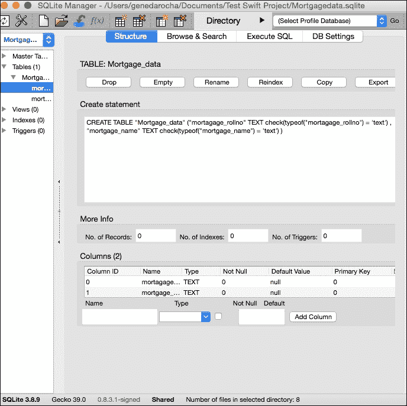

使用 FMDB 的另一种方法是直接在 Swift 编程语言中使用，如下面的代码所示。在设置 Xcode 与 Swift 时，您将被提示输入桥接组件以将它们链接起来，但可以按照以下描述完成。

代码被添加到设置`IBAction`的地方。这个方法将需要使用`SaveMortgageData`动作方法，该方法将打开数据库，从数据字段中获取文本/信息，构建一个 SQL 数据库，并执行语句。一旦操作完成，数据库将被关闭。然后文本字段将被初始化，准备接收下一个输入。因此，使用默认模板的`IBAction`方法需要按照以下方式修改：

```swift
@IBAction func SaveMortgageData(sender: AnyObject) {
let Mortgage_data_save = FMDatabase(path: Database_path as String)

if Mortgage_data_save.open() {

let insertdata = "INSERT INTO Mortgage_data (mortgage_rollno, mortgage_name) VALUES ('\(tmp_mortgage_rollno.text)', '\(tmp_mortgage_name.text)')"

let mortgage_result = Mortgage_data_save.executeUpdate(insertdata, 
            withArgumentsInArray: nil)

        if !mortgage_result {
Msg_info.text = "Error inserting Mortgage Details"
println("Error: \(Mortgage_data_save.Mortgage_ErrorMessage())")
        } else {
Msg_info.text = "Mortgage Details inserted to system"
tmp_mortgage_rollno.text = ""
tmp_mortgage_name.text = ""}
    } else {
println("Error: \(Mortgage_data_save.Mortgage_ErrorMessage())")
    }
}
```

在使用此创建过程和方法创建了一个使用 Swift 和 SQLite 的应用程序之后，您可以看到基本组件和`SQLite 3`库已成功添加到新项目中。

# 摘要

在本章中，您快速了解了 Xcode 如何与 Swift 协同工作。本章向您展示了一些示例和想法，并介绍了应用开发环境 Xcode。我们使用了 FMDB 类和方法来访问数据库并执行各种命令。这里有一些关于 Swift 如何与 iOS 协同工作的基本但直观的示例。苹果公司编写这门语言是为了成为未来 20 年内所有开发者的下一个发展飞跃。它也已经成为开源语言。

在下一章中，您将了解到如何使用 Xcode 与 PhoneGap 和 HTML5 协同工作，以及 SQL 语句在 HTML5 中的使用，通过 PhoneGap 编译，并作为应用运行。
