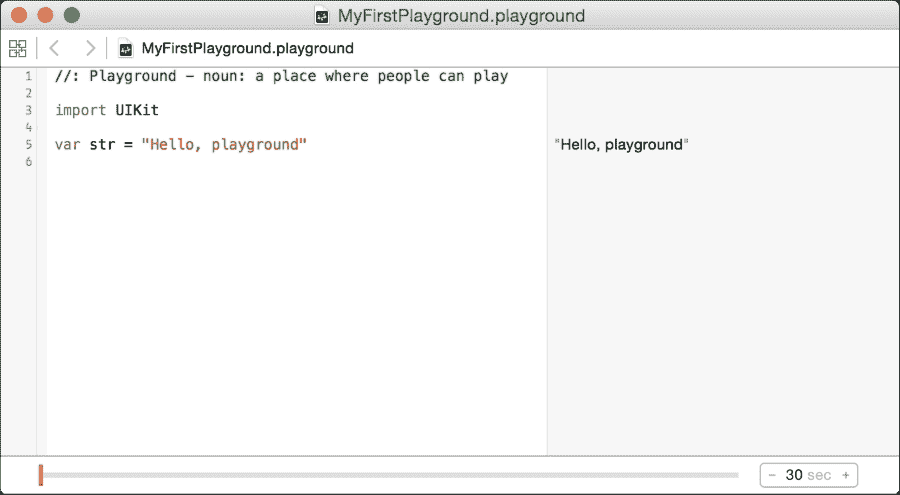
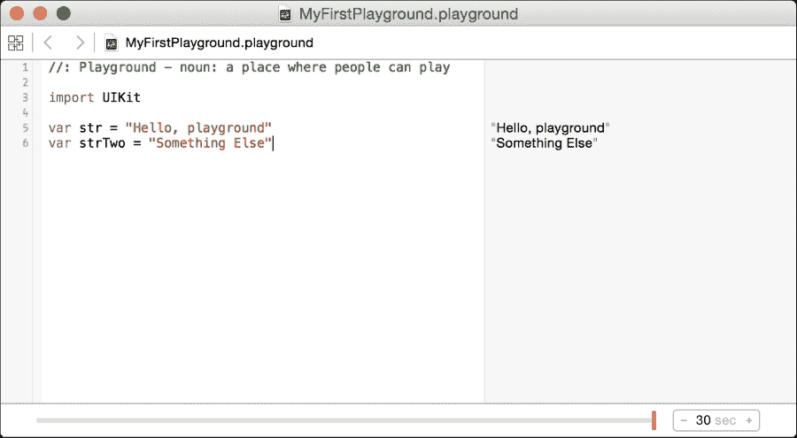

# 第一章. 介绍 Swift

你通过阅读这本书想要达到什么目标？学习 Swift 可以很有趣，但对我们大多数人来说，我们试图实现的目标更大。我们想要创造一些东西，想要追求一份职业，或者可能完全是其他事情。无论那个目标是什么，我鼓励你在阅读这本书时牢记它。如果你能始终将其与你的目标联系起来，那么从这本书或其他任何资源中学习都会更容易。

在此之前，在我们深入学习 Swift 之前，我们必须了解它到底是什么，以及它将如何帮助我们实现目标。我们还需要采取有效的学习技巧，并提前尝尝即将到来的滋味。为了做到这一切，我们将在本章中涵盖以下主题：

+   确定本书的学习目标

+   设置开发环境

+   运行我们的第一个 Swift 代码

+   理解游乐场

+   使用本书学习

# 确定本书的学习目标

Swift 是由苹果公司开发的一种编程语言，主要是为了让开发者能够继续推动他们平台的进步。这是他们试图使 iOS、OS X、watchOS 和 tvOS 应用程序开发更加现代化、安全、强大的尝试。

然而，苹果公司也将 Swift 作为开源软件发布，并开始努力为 Linux 添加支持，目的是使 Swift 更加完善，并使其成为无处不在的通用编程语言。一些开发者已经开始使用它来创建命令行脚本，作为现有脚本语言（如 Python 或 Ruby）的替代品或补充，许多人迫不及待地想要能够将他们的一些应用程序代码与 Web 后端代码共享。至少目前，苹果公司的优先事项是使其成为最好的语言，以促进应用程序的开发。然而，最重要的是要记住，现代应用程序开发几乎总是需要将多个平台整合到单一用户体验中。如果一种语言能够弥合这些差距，并且编写起来既愉快又安全、高效，我们将更容易制作出令人惊叹的产品。Swift 正在朝着实现这一目标迈进。

现在，重要的是要注意，学习 Swift 只是开发的第一步。为了为设备开发，你必须学习设备制造商提供的编程语言和框架。掌握一种编程语言是提高使用框架和最终构建应用程序技能的基础。

开发软件就像制作一张桌子。你可以学习木工的基础知识，并用几块木头钉在一起制作一个功能性的桌子，但你所能做的非常有限，因为你缺乏高级木工技能。如果你想制作一张真正优秀的桌子，你需要离开桌子，首先专注于提升你的技能集。你使用工具的能力越强，你能够创造更高级、更高品质家具的可能性就越大。同样，在 Swift 的知识非常有限的情况下，你可以从网上找到的代码开始拼凑一个功能性的应用程序。然而，要真正做出一些伟大的东西，你必须投入时间和精力来完善你的技能集。你学习的每一个语言特性或技术都会为你打开更多应用程序的可能性。

话虽如此，大多数开发者都是被创造事物和解决问题的热情所驱动。当我们能够将我们的热情转化为真正改善自己和周围世界时，我们学得最好。我们不想陷入学习语言细节的困境中，而这些细节没有任何实际用途。

这本书的目标是培养你的技能和信心，让你充满热情地投入到创建引人入胜、可维护和优雅的 Swift 应用程序中。为了做到这一点，我们将以实用的方式介绍 Swift 的语法和特性。你将构建一个丰富的工具集，同时看到这个工具集在实际世界中的应用。所以，无需多言，让我们直接进入设置我们的开发环境。

# 设置开发环境

为了使用 Swift，你需要运行 OS X，这是所有 Mac 电脑都预装的操作系统。你唯一需要的软件叫做 **Xcode**（版本 7 及以上）。这是苹果提供的环境，它促进了其平台上的开发。你可以从 Mac App Store 免费下载 Xcode，网址为 [www.appstore.com/mac/Xcode](http://www.appstore.com/mac/Xcode)。

下载并安装后，你可以打开应用程序，它将安装苹果开发者工具组件的其余部分。就这么简单！我们现在准备好运行我们的第一个 Swift 代码了。

# 运行我们的第一个 Swift 代码

我们将首先创建一个新的 Swift playground。正如其名所示，playground 是一个你可以玩转代码的地方。在 Xcode 打开的情况下，从菜单栏中选择 **文件** | **新建** | **Playground…**，如图所示：


将其命名为 `MyFirstPlayground`，保持平台为 **iOS**，并保存到你希望的位置。

一旦创建，一个包含一些已预填充代码的 playground 窗口将出现：



你已经运行了你的第一个 Swift 代码。在 Xcode 中，每次你做出更改时，都会运行你的代码，并在屏幕右侧的侧边栏中显示代码结果。

让我们分析一下这段代码做了什么。第一行是一个注释，在运行时会被忽略。它可以在代码中添加额外的信息。在 Swift 中，有两种类型的注释：单行和多行。单行注释，如前面所述，总是以 `//` 开头。您也可以通过用 `/*` 和 `*/` 包围它们来写跨多行的注释。例如：

```swift
/*
   This is a multi-line comment
   that takes up more than one line
   of code
*/
```

如前一个截图所示，第二行 `import UIKit` 导入了一个名为 UIKit 的框架。UIKit 是苹果为 iOS 开发提供的框架的名称。对于这个例子，我们实际上并没有使用 UIKit 框架，所以可以安全地完全删除这一行代码。

最后，在最后一行，代码定义了一个名为 `str` 的变量，并将其分配给文本 `"Hello, playground"`。在结果侧边栏中，紧邻这一行，您可以看到 `"Hello, playground"` 确实被存储在变量中。随着您的代码变得越来越复杂，这将变得非常有用，可以帮助您跟踪和监视代码的运行状态。每次您对代码进行更改时，结果都会更新，显示更改的结果。

如果您熟悉其他编程语言，许多语言都需要某种类型的行终止符。在 Swift 中，您不需要这样的东西。

Xcode 游乐场的另一个优点是它们会在您输入时显示错误。让我们向游乐场添加第三行：

```swift
  var str = "Something Else"
```

独立来看，这是一段完全有效的 Swift 代码。它将文本 `"Something Else"` 存储到一个名为 `str` 的新变量中。然而，当我们将其添加到游乐场中时，我们会看到一行旁边的红色感叹号形式的错误。如果您点击感叹号，将会显示完整的错误信息：


这一行被高亮显示为红色，并显示 **'str' 的无效重新声明** 错误。这是因为您不能声明两个具有完全相同名称的不同变量。此外，注意右侧的结果变成了灰色而不是黑色。这表明显示的结果不是来自最新的代码，而是来自上一次成功的代码运行。由于错误，代码无法成功运行以创建新的结果。如果我们将第二个变量更改为 `strTwo`，错误就会消失：

### 小贴士

**下载示例代码**

您可以从 [`www.packtpub.com`](http://www.packtpub.com) 的账户下载本书的示例代码文件。如果您在其他地方购买了这本书，您可以访问 [`www.packtpub.com/support`](http://www.packtpub.com/support) 并注册，以便将文件直接通过电子邮件发送给您。

您可以通过以下步骤下载代码文件：

+   使用您的电子邮件地址和密码登录或注册我们的网站。

+   将鼠标指针悬停在顶部的“支持”选项卡上。

+   点击“代码下载与勘误”。

+   在搜索框中输入书籍名称。

+   选择你想要下载代码文件的书籍。

+   从下拉菜单中选择你购买这本书的地方。

+   点击代码下载。

一旦文件下载完成，请确保使用最新版本解压缩或提取文件夹：

+   WinRAR/7-Zip（适用于 Windows）

+   Zipeg/iZip/UnRarX（适用于 Mac）

+   7-Zip/PeaZip（适用于 Linux）



现在结果再次以黑色显示，我们可以看到它们已经根据最新的代码进行了更新。特别是如果你有其他编程环境的经验，游乐场的反应性可能会让你感到惊讶。让我们揭开盖子，更好地了解正在发生的事情以及 Swift 是如何工作的。

# 理解游乐场

游乐场并不是真正的程序。虽然它像程序一样执行代码，但在开发环境之外并不真正有用。在我们理解游乐场为我们做了什么之前，我们首先必须了解 Swift 是如何工作的。

Swift 是一种编译型语言，这意味着 Swift 代码要运行，必须首先转换成计算机可以实际执行的形式。执行这种转换的工具称为**编译器**。编译器实际上是一个程序，也是定义编程语言的一种方式。

Swift 编译器将 Swift 代码作为输入，如果它可以正确解析和理解代码，就会输出机器代码。苹果开发了 Swift 编译器，以便根据一系列规则理解代码。这些规则定义了 Swift 编程语言，这些规则就是我们所说的学习 Swift 时试图学习的。

一旦生成机器代码，Xcode 可以将机器代码封装在应用程序中，用户可以运行。然而，我们在游乐场中运行 Swift 代码，所以显然构建应用程序并不是运行代码的唯一方式；这里还有其他的事情在进行。

每次你对游乐场进行更改时，它都会自动尝试编译你的代码。如果成功，它不会将机器代码封装在应用程序中以供稍后运行，而是立即运行代码并显示结果。如果你必须自己完成这个过程，你首先必须自觉地决定将代码构建到应用程序中，然后在你想测试某些内容时运行它。这将是一种巨大的时间浪费；特别是，如果你编写了一个错误，直到你决定真正运行它时才被发现。你越快看到代码更改的结果，你开发代码的速度就越快，你犯的错误就越少。

现在，我们将所有代码都在游乐场中开发，因为它是一个出色的学习环境。游乐场甚至比我们迄今为止看到的更强大，随着我们深入探索 Swift 语言，我们将看到这一点。

我们几乎准备好进入学习 Swift 的核心内容了，但在那之前，让我们花一点时间确保你能最大限度地利用这本书。

# 使用这本书学习

这本书的学习过程非常贴近 playgrounds 背后的哲学。如果你能围绕我们讨论的代码和想法进行探索，你将能从这本书中获得最大收益。不要只是被动地阅读，匆匆浏览代码，而是将代码放入 playground 中，观察它是如何真正工作的。修改代码，尝试破坏它，尝试扩展它，这样你会学到更多。如果你有问题，不要默认去查找答案，而是亲自尝试。

在其核心，编程是一种创造性的练习。是的，它需要你具备逻辑思考问题的能力，但十有八九并没有*正确的方式*，也没有正确的答案。技术是由那些不愿满足于既定解决方案、不满足于遵循固定指令集、想要突破边界的人推动的。随着我们学习 Swift 的进程，通过不让这本书和 Swift 仅停留在表面价值，让这本书为你所用。

# 概述

我们已经有一个良好的开端。我们已经了解了 Swift 是一种主要设计用于应用开发的编程语言，这通常包括多个不同的平台。我们已经运行了我们的第一个代码，并了解了一些关于计算机如何间接运行它的知识——首先将其编译成它理解的形式。最重要的是，我们已经了解到，通过设定目标并随着阅读探索概念，你将在这本书中学到最多。那么，让我们开始吧！

接下来，我们将开始分解 Swift 的基础知识，然后将它们组合起来制作我们的第一个程序。
