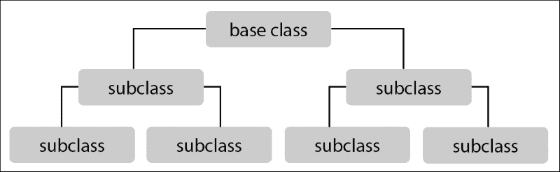
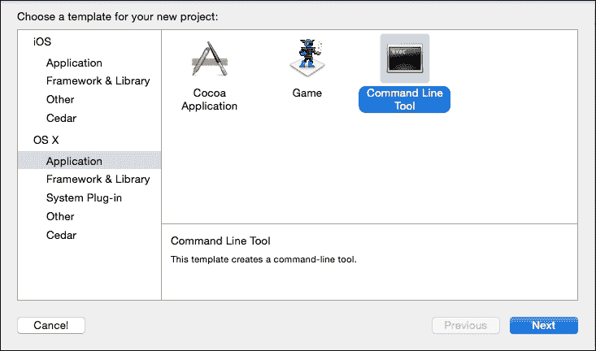
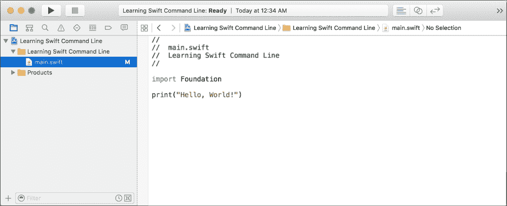
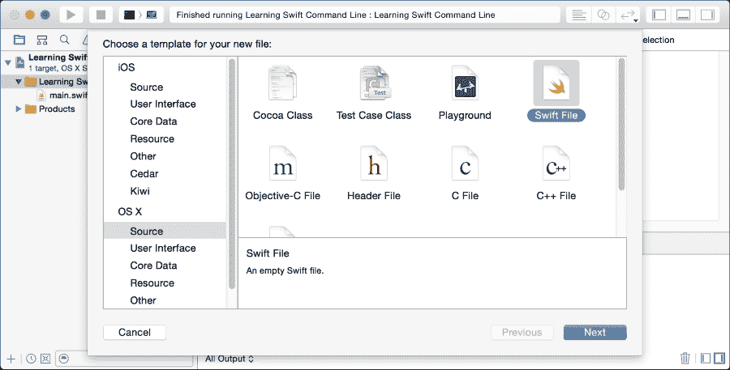

# 第三章. 一点一滴 – 类型、范围和项目

在第二章中，我们开发了一个非常简单的程序，帮助组织派对。尽管我们以逻辑方式分离了代码的部分，但所有内容都写在单个文件中，我们的函数都聚集在一起。随着项目的复杂性增加，这种组织代码的方式是不可持续的。同样，我们使用函数在代码中分离逻辑组件，我们也需要能够分离函数和数据逻辑组件。为此，我们可以在不同的文件中定义代码，我们还可以创建包含自定义数据和功能的自己的类型。这些类型通常被称为**对象**，作为编程技术**面向对象编程**的一部分。在本章中，我们将涵盖以下内容：

+   结构体

+   类和继承

+   枚举

+   项目

+   扩展

+   范围

+   访问控制

# 结构体

我们可以将数据和功能组合成一个逻辑单元或对象的最基本方法就是定义一个名为**结构**的东西。本质上，结构是一组命名的数据和函数。实际上，我们已经看到了几个不同的结构，因为我们之前看到的字符串、数组和字典等所有类型都是结构。现在我们将学习如何创建自己的结构。

## 类型与实例

让我们直接定义第一个结构来表示联系人：

```swift
struct Contact {
    var firstName: String = "First"
    var lastName: String = "Last"
}
```

在这里，我们通过使用`struct`关键字、一个名称以及包含其中的代码的大括号（`{}`）创建了一个结构。就像函数一样，结构中的所有内容都是在它的大括号内定义的。然而，结构中的代码并不是直接运行的，它全部是定义结构本身的一部分。将结构视为未来行为的规范，而不是要运行的代码，就像蓝图是建造房子的规范一样。

在这里，我们为第一个和最后一个名字定义了两个变量。这段代码并没有创建任何实际的变量，也没有记住任何数据。就像函数一样，这段代码只有在其他代码使用它时才会真正被使用。就像字符串一样，我们必须定义这个类型的新变量或常量。然而，在过去，我们总是使用像`Sarah`或`10`这样的字面量。有了我们自己的结构，我们将不得不*初始化*自己的*实例*，这就像根据规范建造房子一样。

实例是类型的特定实现。这可能是在我们创建一个`String`变量并将其赋值为`Sarah`时。我们已经创建了一个具有值`Sarah`的`String`变量的实例。字符串本身不是数据的一部分；它仅仅定义了包含数据的 String 实例的性质。

初始化是创建新实例的正式名称。我们这样初始化一个新的`Contact`：

```swift
let someone = Contact()
```

你可能已经注意到这看起来很像调用一个函数，这是因为它确实非常相似。每个类型都必须至少有一个特殊函数，称为**初始化器**。正如其名所示，这是一个初始化类型新实例的函数。所有初始化器都是以它们的类型命名的，它们可以有也可以没有参数，就像函数一样。在我们的例子中，我们没有提供任何参数，所以第一个和最后一个名字将保留我们在规范中提供的默认值：`First`和`Last`。

你可以在游乐场中通过点击该行右侧的**Contact**旁边的加号来看到这一点。这将在该行之后插入一个结果面板，显示`firstName`和`lastName`的值。我们刚刚初始化了我们的第一个自定义类型！

如果我们定义一个不提供默认值的第二个接触结构，它会改变我们调用初始化器的方式。因为没有默认值，所以在初始化它时必须提供值：

```swift
struct Contact2 {
    var firstName: String
    var lastName: String
}

let someone2 = Contact2(firstName: "Sarah", lastName: "Smith")
```

再次，这看起来就像调用一个函数，而这个函数恰好是以我们定义的类型命名的。现在，`someone2`是`Contact2`的一个实例，`firstName`等于`Sarah`，`lastName`等于`Smith`。

## 属性

这两个变量，`firstName`和`lastName`，被称为**成员变量**，如果我们将它们改为常量，那么它们就被称为**成员常量**。这是因为它们是与类型的特定实例相关联的信息片段。你可以在任何结构实例上访问成员常量和变量：

```swift
print("\(someone.firstName) \(someone.lastName)")
```

这与**静态常量**形成对比。我们可以在类型的定义中添加以下行来向我们的类型添加一个静态常量：

```swift
struct Contact {
    static let UnitedStatesPhonePrefix = "+1" // "First Last"
}
```

注意在常量声明之前的`static`关键字。静态常量可以直接从类型中访问，并且与任何实例无关：

```swift
print(Contact.UnitedStatesPhonePrefix) // "+1"
```

注意，我们有时会像这样向现有代码中添加代码。如果你在游乐场中跟随，你应该已经向现有的`Contact`结构添加了`static let`行。

成员和静态常量和变量都属于**属性**这一类别。属性只是与实例或类型相关联的信息片段。这有助于加强每个类型都是对象的观念。例如，一个球是一个具有许多属性的对象，包括其半径、颜色和弹性。我们可以通过创建一个具有所有这些属性的球结构，以面向对象的方式在代码中表示一个球：

```swift
struct Ball {
    var radius: Double
    var color: String
    var elasticity: Double
}
```

注意，这个`Ball`类型没有为其属性定义默认值。如果在声明中没有提供默认值，则在初始化该类型的实例时需要提供。这意味着该类型没有空初始化器可用。如果你尝试使用它，你会得到一个错误：

```swift
Ball() // Missing argument for parameter 'radius' in call
```

就像普通变量和常量一样，所有属性一旦初始化就必须有一个值。

## 成员和静态方法

就像你可以在结构体内部定义常量和变量一样，你也可以定义 **成员** 和静态函数。这些函数被称为 **方法**，以区分它们与任何类型都不相关的全局函数。你以与函数类似的方式声明成员方法，但你在类型声明内部这样做，如下所示：

```swift
struct Contact {
    var firstName: String = "First"
    var lastName: String = "Last"

    func printFullName() {
        print("\(self.firstName) \(self.lastName)")
    }
}
```

成员方法始终作用于它们定义的类型的具体实例。要在方法内部访问该实例，你使用 `self` 关键字。`Self` 在行为上与任何其他变量类似，你可以访问其上的属性和方法。前面的代码打印了 `firstName` 和 `lastName` 属性。你以与调用任何其他类型上的方法相同的方式调用此方法：

```swift
someone.printFullName()
```

在一个普通的结构体方法中，`self` 是常量，这意味着你不能修改其任何属性。如果你尝试这样做，你会得到一个像这样的错误：

```swift
struct Ball {
    var radius: Double
    var color: String
    var elasticity: Double

    func growByAmount(amount: Double) {
        // Error: Left side of mutating operator
        // isn't mutable: 'self' is immutable
        self.radius += amount
    }
}
```

为了让一个方法能够修改 `self`，它必须被声明为 **可变方法**，使用 `mutating` 关键字：

```swift
mutating func growByAmount(amount: Double) {
    self.radius += amount
}
```

我们可以定义适用于类型的静态属性，但我们也可以使用 `static` 关键字定义在类型上操作 **静态方法**。我们可以在我们的 `Contact` 结构体中添加一个打印可用电话前缀的静态方法，如下所示：

```swift
struct Contact {
    static let UnitedStatesPhonePrefix = "+1"

    static func printAvailablePhonePrefixes() {
        print(self.UnitedStatesPhonePrefix)
    }
}

Contact.printAvailablePhonePrefixes() // "+1"
```

在静态方法中，`self` 指的是类型而不是类型的实例。在前面的代码中，我们通过 `self` 使用了 `UnitedStatesPhonePrefix` 静态属性，而不是写出类型名称。

在静态和实例方法中，Swift 允许你为了简洁而无需使用 `self` 就可以访问属性。`self` 简单地隐含：

```swift
func printFullName() {
    print("\(firstName) \(lastName)")
}

static func printAvailablePhonePrefixes() {
    print(UnitedStatesPhonePrefix)
}
```

然而，如果你在方法中创建了一个同名变量，你必须使用 `self` 来区分你想要的是哪一个：

```swift
func printFirstName() {
    let firstName = "Fake"
    print("\(self.firstName) \(firstName)") // "First Fake"
}
```

我建议避免 Swift 的这个特性。我想让你知道这一点，这样你在查看别人的代码时不会感到困惑，但我感觉总是使用 `self` 可以大大提高你代码的可读性。`self` 使得变量与实例相关联而不是仅在函数中定义变得一目了然。如果你添加了创建变量来隐藏成员变量的代码，你也可能会创建错误。例如，如果你在前面代码中的 `printFullName` 方法中引入了 `firstName` 变量，而没有意识到你后来在代码中使用 `firstName` 来访问成员变量，那么你将创建一个错误。而不是访问成员变量，后面的代码将开始只访问局部变量。

## 计算属性

到目前为止，似乎属性被用来存储信息，而方法被用来执行计算。虽然这通常是正确的，但 Swift 有一个名为**计算属性**的功能。这些属性在每次访问时都会被计算。为此，你定义一个属性，然后提供一个名为**getter**的方法，该方法返回计算值，如下所示：

```swift
struct Ball {
    var radius: Double
    var diameter: Double {
        get {
            return self.radius * 2
        }
    }
}

var ball = Ball(radius: 2)
print(ball.diameter) // 4.0
```

这是一种避免存储可能与其他数据冲突的数据的绝佳方法。如果 `diameter` 只是另一个属性，那么它可能与 `radius` 不同。每次你更改半径时，你都必须记得更改直径。使用计算属性消除了这种担忧。

你甚至可以提供一个名为**setter**的第二个函数，允许你像普通属性一样为这个属性赋值：

```swift
var diameter: Double {
    get {
        return self.radius * 2
    }
    set {
        self.radius = diameter / 2
    }
}

var ball = Ball(radius: 2)
ball.diameter = 16
print(ball.radius) // 8.0
```

如果你提供了一个 setter，那么你也必须显式地提供一个 getter。如果不这样做，Swift 允许你省略 `get` 语法：

```swift
var volume: Double {
    return self.radius * self.radius * self.radius * 4/3 * 4.13
}
```

这提供了一种简洁定义只读计算属性的好方法。

## 对属性更改做出反应

在属性更改时执行操作是很常见的。实现这一目标的一种方法是通过定义一个具有执行必要操作的 setter 的计算属性。然而，Swift 提供了一种更好的方法。你可以在任何存储属性上定义一个 `willSet` 函数或 `didSet` 函数。`WillSet` 在属性更改之前被调用，并提供了变量 `newValue`。`didSet` 在属性更改之后被调用，并提供了变量 `oldValue`，如下所示：

```swift
var radius: Double {
    willSet {
        print("changing from \(self.radius) to \(newValue)")
    }
    didSet {
        print("changed from \(oldValue) to \(self.radius)")
    }
}
```

使用 `didSet` 和 `willSet` 与多个属性时，请注意避免创建无限循环。例如，如果你尝试使用这种技术来保持 `diameter` 和 `radius` 的同步，而不是使用计算属性，它看起来会是这样：

```swift
struct Ball {
    var radius: Double {
        didSet {
            self.diameter = self.radius * 2
        }
    }
    var diameter: Double {
        didSet {
            self.radius = self.diameter /  2
        }
    }
}
```

在这个场景中，如果你设置了 `radius`，它将触发 `diameter` 的更改，这又触发 `radius` 的另一个更改，然后无限循环继续下去。

## 下标

你可能也已经意识到，我们过去与结构体交互的另一种方式。我们使用方括号 (`[]`) 既可以访问数组也可以访问字典中的元素。这些被称为**下标**，我们也可以在我们的自定义类型上使用它们。它们的语法与我们之前看到的计算属性类似，只是你定义它更像是带有参数和返回类型的方法，如下所示：

```swift
struct MovieAssignment {
    var movies: [String:String]

    subscript(invitee: String) -> String? {
        get {
            return self.movies[invitee]
        }

        set {
            self.movies[invitee] = newValue
        }
    }
}
```

你在方括号中声明你想要用作下标方法参数的参数。下标函数的返回类型是当用于访问值时将返回的类型。它也是任何分配给下标的值的类型：

```swift
var assignment = MovieAssignment(movies: [:])
assignment["Sarah"] = "Modern Family"
print(assignment["Sarah"]) // "Modern Family"
```

你可能已经注意到了返回类型中的问号（`?`）。这被称为**可选类型**，我们将在下一章中进一步讨论。现在，你只需要知道，这是在通过键访问字典时返回的类型，因为并非每个可能的键都有一个值。

就像计算属性一样，你可以定义一个只读的下标，而不使用`get`语法：

```swift
struct MovieAssignment {
    var movies: [String:String]

    subscript(invitee: String) -> String? {
        return self.movies[invitee]
    }
}
```

如果你在`subscript`声明中添加了额外的参数，`subscript`可以接受任意数量的参数。使用下标时，你将使用逗号在方括号中分隔每个参数，如下所示：

```swift
struct MovieAssignment {
    subscript(param1: String, param2: Int) -> Int {
        return 0
    }
}

print(assignment["Sarah", 2])
```

下标是一个缩短代码的好方法，但你应该始终小心，避免为了简洁而牺牲清晰度。编写清晰的代码是在过于冗长和不够简洁之间取得平衡。如果你的代码太短，将很难理解，因为含义会变得模糊。有一个名为`movieForInvitee:`的方法比使用下标要好得多。然而，如果你的所有代码都太长，周围会有太多的噪音，这样你会在某种程度上失去清晰度。谨慎使用下标，并且只有在它们基于你创建的结构类型对其他程序员来说直观时才使用。

## 自定义初始化

如果你对你提供的默认初始化器不满意，你可以定义自己的。这是通过使用`init`关键字来完成的，如下所示：

```swift
init(contact: Contact) {
    self.firstName = contact.firstName
    self.lastName = contact.lastName
}
```

就像方法一样，初始化器可以接受任意数量的参数，包括没有任何参数。然而，初始化器还有一些其他限制。一条规则是，每个成员变量和常量都必须在初始化器的末尾有一个值。如果我们从初始化器中省略了`lastName`的值，我们会得到如下错误：

```swift
struct Contact4 {
    var firstName: String
    var lastName: String

    init(contact: Contact4) {
        self.firstName = contact.firstName
    }// Error: Return from initializer without
     // initializing all stored properties
}
```

注意，这段代码没有为`firstName`和`lastName`提供默认值。如果我们将其添加回来，我们就不再得到错误，因为此时提供了一个值：

```swift
struct Contact4 {
    var firstName: String
    var lastName: String = "Last"

    init(contact: Contact4) {
        self.firstName = contact.firstName
    }
}
```

一旦你提供了自己的初始化器，Swift 就不再提供任何默认的初始化器。在先前的例子中，`Contact`就不能再通过`firstName`和`lastName`参数进行初始化了。如果我们想要两者都有，我们必须添加自己的初始化器版本，如下所示：

```swift
struct Contact3 {
    var firstName: String
    var lastName: String

    init(contact: Contact3) {
        self.firstName = contact.firstName
        self.lastName = contact.lastName
    }

    init(firstName: String, lastName: String) {
        self.firstName = firstName
        self.lastName = lastName
    }
}
var sarah = Contact3(firstName: "Sarah", lastName: "Smith")
var sarahCopy = Contact3(contact: sarah)
var other = Contact3(firstName: "First", lastName: "Last")
```

在初始化器中设置初始值的另一个选项是调用不同的初始化器：

```swift
init(contact: Contact4) {
    self.init(
        firstName: sarah.firstName,
        lastName: sarah.lastName
    )
}
```

这是一种在多个初始化器中减少重复代码的绝佳工具。然而，在使用这个工具时，你必须遵循一个额外的规则。你不能在调用其他初始化器之前访问`self`：

```swift
init(contact: Contact4) {
    self.print()
    // Use of 'self' in delegating initializer
    // before self.init is called
    self.init(
        firstName: contact.firstName,
        lastName: contact.lastName
     )
}
```

这是一个很好的例子，说明了为什么存在这样的要求。如果我们调用`print`在调用其他初始化器之前，`firstName`和`lastName`将没有值。在这种情况下会打印什么？相反，你只能在调用其他初始化器之后访问`self`，如下所示：

```swift
init(contact: Contact4) {
    self.init(
        firstName: contact.firstName,
        lastName: contact.lastName
    )
    self.print()
}
```

这保证了在调用任何方法之前，所有属性都有一个有效的值。

你可能已经注意到初始化器在参数命名上遵循不同的模式。默认情况下，初始化器要求所有参数都有一个标签。然而，请记住，这只是一个默认行为。你可以通过提供内部和外部名称或使用下划线(`_`)作为外部名称来更改行为。

结构体是编程中一种非常强大的工具。它是我们作为程序员可以用来抽象更复杂概念的重要方式。正如我们在第二章中讨论的，*构成要素 – 变量、集合和流程控制*，这是我们提高使用计算机能力的方式。其他人可以为我们提供这些抽象，以理解我们尚未理解的概念，或者在不需要从头开始的情况下节省我们的时间。我们也可以为自己使用这些抽象，以便更好地理解应用中正在进行的整体逻辑。这将大大提高我们代码的可靠性。结构体使我们的代码对他人和我们自己来说都更容易理解。

然而，结构体在一点上受到限制，它们不提供一种很好的方式来表达类型之间的父子关系。例如，狗和猫都是动物，并且有很多共同的属性和行为。如果我们只需要实现一次这些共同属性将会很棒。然后我们可以将这些类型分成不同的物种。为此，Swift 有一个不同的类型系统，称为**类**。

# 类

类可以做到结构体所能做到的一切，除了类可以使用一种称为**继承**的东西。类可以从另一个类继承功能，然后扩展或定制其行为。让我们直接进入一些代码。

## 从另一个类继承

首先，让我们定义一个可以稍后继承的名为`Building`的类：

```swift
class Building {
    let squareFootage: Int

    init(squareFootage: Int) {
        self.squareFootage = squareFootage
    }
}
var aBuilding = Building(squareFootage: 1000)
```

预计之下，类是通过使用`class`关键字而不是`struct`来定义的。否则，类看起来与结构体极为相似。然而，我们也可以看到一点不同。在使用结构体时，我们之前创建的初始化器就不再必要了，因为它已经被自动创建。而在类中，除非所有属性都有默认值，否则初始化器不会自动创建。

现在，让我们看看如何从这个构建类中继承：

```swift
class House: Building {
    let numberOfBedrooms: Int
    let numberOfBathrooms: Double

    init(
        squareFootage: Int,
        numberOfBedrooms: Int,
        numberOfBathrooms: Double
        )
    {
        self.numberOfBedrooms = numberOfBedrooms
        self.numberOfBathrooms = numberOfBathrooms

        super.init(squareFootage: squareFootage)
    }
}
```

在这里，我们创建了一个新的名为`House`的类，它继承自我们的`Building`类。这通过类声明中的冒号(`:`)后跟`Building`来表示。正式来说，我们会说`House`是`Building`的**子类**，而`Building`是`House`的**超类**。

如果我们初始化一个`House`类型的变量，我们就可以访问`House`和`Building`的属性，如下所示：

```swift
var aHouse = House(
    squareFootage: 800,
    numberOfBedrooms: 2,
    numberOfBathrooms: 1
)
print(aHouse.squareFootage)
print(aHouse.numberOfBedrooms)
```

这是使类强大的起点之一。如果我们需要定义十种不同的建筑类型，我们不必为每一种都添加一个单独的`squareFootage`属性。这同样适用于属性和方法。

除了简单的**超类**和**子类**关系之外，我们还可以定义一个完整的类层次结构，包括子类的子类、子类的子类的子类，依此类推。通常，将类层次结构想象成一个倒置的树是有帮助的：



树的主干是最顶层的超类，每个子类都是从这个主干上分离出来的一个分支。最顶层的超类通常被称为基类，因为它为所有其他类提供了基础。

## 初始化

由于类的层次性，它们的初始化器规则更为复杂。以下是一些附加规则：

+   子类中的所有初始化器都必须调用其超类的初始化器

+   子类的所有属性必须在调用超类初始化器之前初始化

第二条规则使我们能够在调用初始化器之前使用`self`。然而，你不能出于任何其他原因使用`self`，除了初始化其属性。

你可能已经注意到了我们在`house`初始化器中使用了关键字`super`。`super`用于引用当前实例，就像它是其超类一样。这就是我们调用超类初始化器的方式。当我们进一步探索继承时，我们将看到`super`的更多用法。

继承也创建了以下四种类型的初始化器，如下所示：

+   覆盖初始化器

+   必需初始化器

+   指定初始化器

+   便利初始化器

### 覆盖初始化器

**覆盖初始化器**用于替换超类中的初始化器：

```swift
class House: Building {
    let numberOfBedrooms: Int
    let numberOfBathrooms: Double

    override init(squareFootage: Int) {
        self.numberOfBedrooms = 0
        self.numberOfBathrooms = 0
        super.init(squareFootage: squareFootage)
    }
}
```

在`Building`中已经存在一个只接受`squareFootage`作为参数的初始化器。这个初始化器将替换那个初始化器，所以如果你尝试仅使用`squareFootage`来初始化`House`，这个初始化器将被调用。然后，它将调用`Building`版本的初始化器，因为我们通过`super.init`调用来请求它。

如果你想使用超类初始化器来初始化子类，这种能力尤为重要。默认情况下，如果你在子类中没有指定新的初始化器，它将继承其超类中的所有初始化器。然而，一旦你在子类中声明了一个初始化器，它就会隐藏所有超类的初始化器。通过使用覆盖初始化器，你可以再次暴露超类版本的初始化器。

### 必需初始化器

**必需初始化器**是超类的一种初始化器。如果你将一个初始化器标记为必需，它将强制所有子类也定义该初始化器。例如，我们可以使`Building`初始化器成为必需的，如下所示：

```swift
class Building {
    let squareFootage: Int

    required init(squareFootage: Int) {
        self.squareFootage = squareFootage
    }
}
```

然后，如果我们自己在`House`中实现了自己的初始化器，我们就会得到如下错误：

```swift
class House: Building {
    let numberOfBedrooms: Int
    let numberOfBathrooms: Double

    init(
        squareFootage: Int,
        numberOfBedrooms: Int,
        numberOfBathrooms: Double
        )
    {
        self.numberOfBedrooms = numberOfBedrooms
        self.numberOfBathrooms = numberOfBathrooms

        super.init(squareFootage: squareFootage)
    }

    // 'required' initializer 'init(squareFootage:)' must be
    // provided by subclass of 'Building'
}
```

这次，在声明这个初始化器时，我们重复使用`required`关键字而不是使用`override`：

```swift
required init(squareFootage: Int) {
    self.numberOfBedrooms = 0
    self.numberOfBathrooms = 0
    super.init(squareFootage: squareFootage)
}
```

当你的超类有多个执行不同操作的初始化器时，这是一个重要的工具。例如，你可以有一个初始化器从数据文件创建你的类的实例，另一个初始化器从代码设置其属性。本质上，你有两条初始化路径，你可以使用必需的初始化器确保所有子类都考虑了这两条路径。子类仍然应该能够从文件和代码中初始化。将超类的两个初始化器都标记为必需确保了这一点。

### 指定和便利初始化器

要讨论**指定初始化器**，我们首先必须谈谈**便利初始化器**。我们最初开始使用的正常初始化器实际上被称为指定初始化器。这意味着它们是初始化类的核心方式。你还可以创建便利初始化器，正如其名所示，它们是为了便利而存在的，并不是初始化类的核心方式。

所有便利初始化器都必须调用一个指定初始化器，并且它们没有像指定初始化器那样手动初始化属性的能力。例如，我们可以在我们的`Building`类上定义一个便利初始化器，它接受另一个建筑并创建一个副本：

```swift
class Building {
    // ...

    convenience init(otherBuilding: Building) {
        self.init(squareFootage: otherBuilding.squareFootage)
    }
}
var aBuilding = Building(squareFootage: 1000)
var defaultBuilding = Building(otherBuilding: aBuilding)
```

现在，作为一个便利，你可以使用现有建筑的属性创建一个新的建筑。关于便利初始化器的另一条规则是，它们不能被子类使用。如果你尝试这样做，你会得到一个像这样的错误：

```swift
class House: Building {

    // ...

    init() {
        self.numberOfBedrooms = 0
        self.numberOfBathrooms = 0
        super.init() // Missing argument for parameter 'squareFootage' in call
    }
}
```

这正是便利初始化器存在的主要原因之一。理想情况下，每个类应该只有一个指定初始化器。你拥有的指定初始化器越少，维护你的类层次结构就越容易。这是因为你经常会添加额外的属性和其他需要初始化的东西。每次你添加这样的东西时，你都必须确保每个指定初始化器都正确且一致地设置好。使用便利初始化器而不是指定初始化器可以确保一切的一致性，因为它们必须调用一个指定初始化器，而该初始化器反过来又必须正确设置一切。基本上，你希望尽可能通过最少的指定初始化器进行所有初始化。

通常，你的指定初始化器是具有最多参数的，可能包含所有可能的参数。这样，你就可以从所有其他初始化器中调用它，并将它们标记为便利初始化器。

## 重写方法和计算属性

就像初始化器一样，子类可以**重写**方法和计算属性。然而，对这些操作需要更加小心。编译器提供的保护较少。

### 方法

虽然可能，但覆盖方法调用其超类实现并不是强制性的。例如，让我们给我们的`Building`和`House`类添加清理方法：

```swift
class Building {
    // ...

    func clean() {
        print(
            "Scrub \(self.squareFootage) square feet of floors"
        )
    }
}

class House: Building {
    // ...

    override func clean() {
        print("Make \(self.numberOfBedrooms) beds")
        print("Clean \(self.numberOfBathrooms) bathrooms")
    }
}
```

在我们的`Building`超类中，我们唯一需要清理的是地板。然而，在我们的`House`子类中，我们还需要整理床铺和清洁浴室。如上所示实现，当我们调用`House`上的`clean`时，它不会清理地板，因为我们已经在`House`的`clean`方法中覆盖了这种行为。在这种情况下，我们还需要让`Building`超类执行任何必要的清理，因此我们必须调用超类版本，如下所示：

```swift
override func clean() {
    super.clean()

    print("Make \(self.numberOfBedrooms) beds")
    print("Clean \(self.numberOfBathrooms) bathrooms")
}
```

现在，在基于房屋定义进行任何清理之前，它将首先基于建筑定义进行清理。你可以通过改变调用超类版本的位置来控制事情发生的顺序。

这是一个需要覆盖方法的绝佳例子。我们可以在超类中提供通用功能，这些功能可以在每个子类中扩展，而不是在多个类中重写相同的功能。

### 计算属性

再次使用`override`关键字覆盖计算属性也是有用的：

```swift
class Building {
    // ...

    var estimatedEnergyCost: Int {
        return squareFootage / 10
    }
}

class House: Building {
    // ...

    override var estimatedEnergyCost: Int {
        return 100 + super.estimatedEnergyCost
    }
}
```

在我们的`Building`超类中，我们已经提供了一个基于每 1000 平方英尺 100 美元的能源成本估算。这个估算仍然适用于房屋，但与有人住在建筑中相关的额外成本。因此，我们必须重写`estimatedEnergyCost`计算属性，以返回`Building`的计算结果加上 100 美元。

再次强调，使用覆盖的计算属性的父类版本不是必需的。子类可以完全不同的实现，不考虑其超类中实现的内容，或者它可以利用其超类的实现。

## 类型转换

我们已经讨论了类如何在类型层次结构之间共享功能。使类强大的另一个原因是它们允许代码以更通用的方式与多个类型交互。任何子类都可以在将其视为其超类的代码中使用。例如，我们可能想编写一个函数来计算建筑数组总面积。对于这个函数，我们不在乎它是哪种具体的建筑类型，我们只需要访问在超类中定义的`squareFootage`属性。我们可以定义我们的函数接受一个建筑数组，而实际的数组可以包含`House`实例：

```swift
func totalSquareFootageOfBuildings(buildings: [Building]) -> Int {
    var sum = 0
    for building in buildings {
        sum += building.squareFootage
    }
    return sum
}

var buildings = [
    House(squareFootage: 1000),
    Building(squareFootage: 1200),
    House(squareFootage: 900)
]
print(totalSquareFootageOfBuildings(buildings)) // 3100
```

尽管这个函数认为我们正在处理`Building`类型的类，但程序将执行`House`的`squareFootage`实现。如果我们还创建了一个`Building`的办公室子类，那么该子类的实例也将包含在数组中，并具有自己的实现。

我们还可以将子类的实例分配给定义为其超类之一的变量：

```swift
var someBuilding: Building = House(squareFootage: 1000)
```

这为我们提供了一种比使用结构时更强大的抽象工具。例如，让我们考虑一个假设的图像类层次结构。我们可能有一个名为`Image`的基类，以及用于不同编码类型的子类，如`JPGImage`和`PNGImage`。有子类是很好的，因为我们能够干净地支持多种类型的图像，但一旦图像被加载，我们就不再需要关心图像保存的编码类型。任何其他想要操作或显示图像的类都可以使用一个定义良好的图像超类来这样做；图像的编码已被从其余代码中抽象出来。这不仅创造了更容易理解的代码，而且也使得维护变得更加容易。如果我们需要添加另一个图像编码，如**GIF**，我们可以创建另一个子类，所有现有的操作和显示代码都可以通过不修改该代码来获得 GIF 支持。

实际上存在两种不同的转型类型。到目前为止，我们只看到了称为**向上转型**的转型类型。可以预见，另一种转型类型被称为**向下转型**。

### 向上转型

我们到目前为止所看到的方法被称为向上转型，因为我们通过将子类视为其超类来向上遍历我们之前可视化的类树。之前，我们通过将子类实例赋值给定义为其超类的变量来进行向上转型。我们也可以使用`as`运算符来做同样的事情，如下所示：

```swift
var someBuilding2 = House(squareFootage: 1000) as Building
```

关于应该使用哪种方法，这实际上是一种个人偏好。

### 向下转型

向下转型意味着我们将超类视为其子类之一。

当使用其超类声明的函数或将其赋值给具有其超类类型的变量时，向上转型可以隐式进行，但向下转型必须显式进行。这是因为向上转型不会因为其继承性质而失败，但向下转型可能会失败。你可以始终将子类视为其超类，但你不能保证超类实际上是其特定的子类之一。你只能向下转型那些实际上是该类或其子类实例的实例。

我们可以通过使用`as!`运算符来强制向下转型，如下所示：

```swift
var house = someBuilding as! House
print(house.numberOfBathrooms)
```

`as!`运算符中添加了感叹号，因为它是一种可能会失败的操作。感叹号充当警告，确保你意识到它可能会失败。例如，如果`someBuilding`实际上不是`House`，则强制向下转型失败时，程序会崩溃，如下所示：

```swift
var anotherHouse = aBuilding as! House // Execution was interrupted
```

使用特殊`if`语句中的`as?`运算符进行向下转型是一种更安全的方法，这种`if`语句被称为可选绑定。我们将在下一章详细讨论这个问题，但到目前为止，你只需记住语法：

```swift
if let house = someBuilding as? House {
    // someBuilding is of type House
    print(house.numberOfBathrooms)
}
else {
    print("someBuilding is not a house")
}
```

这段代码仅在建筑物的类型为`House`时打印出`numberOfBathrooms`。`House`常量被用作`someBuilding`的临时视图，其类型明确设置为`House`。有了这个临时视图，你可以像访问`House`一样访问`someBuilding`，而不是仅仅访问`Building`。

# 枚举

到目前为止，我们已经涵盖了 Swift 中三种分类中的两种：结构和类。第三种分类被称为**枚举**。枚举用于为实例定义一组相关值。例如，如果我们想要值表示三种原色之一，枚举是一个很好的工具。

## 基本声明

枚举由**案例**组成，就像`switch`一样，它使用`enum`关键字而不是`struct`或`class`。一个用于原色的枚举应该看起来像这样：

```swift
enum PrimaryColor {
    case Red
    case Green
    case Blue
}
```

然后，你可以定义一个具有这种类型的变量，并给它分配一个案例：

```swift
var color = PrimaryColor.Green
```

注意，要使用其中一个值，我们必须使用类型的名称后跟一个点（`.`），然后是具体的案例。如果变量的类型可以被推断出来，甚至可以省略枚举名称，只需从点开始：

```swift
var color = PrimaryColor.Green
color = .Red
```

在将`.Red`赋值的过程中，编译器已经知道`color`变量是`PrimaryColor`类型，因此不需要我们再次指定。这是一种使代码更简洁的好方法，但请确保你不会牺牲可读性。如果你省略了类型名称，代码的上下文应该仍然很明显。

## 测试枚举值

枚举实例可以像任何其他类型一样测试特定的值，使用相等运算符（`==`）：

```swift
if color == PrimaryColor.Red {
}
else if color == .Blue {
}
```

注意，在第二个`if`语句中，当检查`color`是否为蓝色时，代码利用了类型推断，并没有麻烦地指定`PrimaryColor`。

这种比较方法对于一两个可能的值来说是熟悉且有用的。然而，对于不同值的枚举测试，有更好的方法。你不需要使用`if`语句，而是可以使用`switch`。考虑到枚举是由案例组成的，而`switch`测试的是案例，这是一个逻辑上的解决方案：

```swift
switch color {
    case .Red:
        print("color is red")
    case .Green:
        print("color is green")
    case .Blue:
        print("color is blue")
}
```

这对于所有与`switch`本身相同的原因都是很好的。事实上，`switch`与枚举配合得更好，因为枚举的可能值总是有限的，而其他基本类型则不是。你可能记得，`switch`要求你必须为每个可能的值有一个案例。这意味着，如果你没有为枚举的每个案例提供测试案例，编译器将产生错误。这通常是一种很好的保护措施，这就是为什么我建议在大多数情况下使用`switch`而不是简单的`if`语句。如果你在枚举中添加了额外的案例，那么在代码中任何没有考虑这个新案例的地方都会产生错误，这样你可以确保你已经处理了它。

## 原始值

枚举类型非常出色，因为它们能够存储基于 Swift 基本类型（如字符串、整数和双精度浮点数）之外的信息。有许多像我们的颜色示例这样的抽象概念，它们与基本类型根本无关。然而，你通常希望每个枚举情况都有一个**原始值**，它属于另一种类型。例如，如果我们想表示美国货币中的所有硬币及其货币价值，我们可以使我们的枚举具有一个整型原始值类型，如下所示：

```swift
enum USCoins: Int {
    case Quarter = 25
    case Dime = 10
    case Nickel = 5
    case Penny = 1
}
```

原始值类型是以与类中指定继承相同的方式指定的，然后每个情况都单独分配了该类型的特定值。

你可以通过使用`rawValue`属性在任何时候访问情况的原始值：

```swift
print("A Quarter is worth \(USCoins.Quarter.rawValue) cents.")
```

请记住，枚举只能具有可以用文字如`10`或`String`定义的原始值类型。你不能定义一个具有自定义类型的枚举，该类型作为其原始值。

## 关联值

原始值非常适合当你枚举中的每个情况都与相同类型的值相关联，并且其值永远不会改变时。然而，也存在每种情况都有不同值与之相关联，并且这些值对于枚举的每个实例都不同的情况。你可能甚至想要一个具有多个相关值的案例。为此，我们使用枚举的一个功能，称为**关联值**。

你可以指定零个或多个类型，这些类型可以与每个情况单独关联关联值。然后，在创建枚举实例时，你可以给出任何你想要的值，如下所示：

```swift
enum Height {
    case Imperial(feet: Int, inches: Double)
    case Metric(meters: Double)
    case Other(String)
}
var height1 = Height.Imperial(feet: 6, inches: 2)
var height2 = Height.Metric(meters: 1.72)
var height3 = Height.Other("1.9 × 10-16 light years")
```

在这里，我们定义了一个枚举来存储使用各种测量系统的高度测量值。有一个英制系统的情况，它使用英尺和英寸，还有一个公制系统的情况，它只有米。这两个情况都有其关联值的标签，类似于元组。最后一个情况是为了说明，如果你不想提供标签，你不必提供。它只需一个字符串。

与具有关联值的枚举进行比较和访问值比常规枚举要复杂一些。我们不能再使用等号运算符（`==`）。相反，我们必须始终使用一个情况。在情况内部，有几种处理关联值的方法。最简单的方法是访问特定的关联值。为此，你可以将其分配给一个临时变量：

```swift
switch height1 {
    case .Imperial(let feet, var inches):
        print("\(feet)ft \(inches)in")
    case let .Metric(meters):
        print("\(meters) meters")
    case var .Other(text):
        print(text)
}
```

在英制情况下，前面的代码将`feet`赋值给一个临时常量，将`inches`赋值给一个临时变量。这些名称与关联值使用的标签相匹配，但这不是必需的。公制情况表明，如果你想让所有临时值都是常量，你可以在枚举情况之前声明`let`。无论有多少关联值，`let`只需要写一次，而不是每个值都写一次。另一种情况与公制情况相同，只是它创建了一个临时变量而不是一个常量。

如果你想要为关联值的条件创建单独的情况，你可以使用我们在上一章中看到的`where`语法：

```swift
switch height1 {
    case .Imperial(let feet, var inches) where feet > 1:
        print("\(feet)ft \(inches)in")
    case let .Metric(meters) where meters > 0.3:
        print("\(meters) meters")
    case var .Other(text):
        print(text)
    default:
        print("Too Small")
}
```

注意，我们不得不添加一个默认情况，因为我们对其他情况的限制不再详尽无遗。

最后，如果你实际上不关心关联值，你可以使用下划线（`_`）来忽略它，如下所示：

```swift
switch height1 {
    case .Imperial(_, _):
        print("Imperial")
    case .Metric(_):
        print("Metric")
    case .Other(_):
        print("Other")
}
```

这表明，与枚举一起，开关甚至比我们之前看到的更有力量。

现在你已经了解了如何使用关联值，你可能已经注意到它们可以改变枚举的概念性质。没有关联值时，枚举代表了一组抽象和恒定的可能值。具有关联值的枚举则不同，因为具有相同情况的两个实例不一定相等；每个情况可能有不同的关联值。这意味着枚举的概念性质实际上是一系列查看特定类型信息的方式。这不是一个具体的规则，但它很常见，并且能更好地帮助你理解枚举可以最好地表示的不同类型的信息。这也有助于使你自己的枚举更易于理解。每个情况理论上都可以通过关联值代表与其它情况完全无关的概念，但那应该是一个信号，表明枚举可能不是完成那个特定工作的最佳工具。

## 方法与属性

枚举实际上与结构非常相似。与结构一样，枚举可以有方法和属性。为了改进`Height`枚举，我们可以添加方法来访问我们想要的任何测量系统中的高度。作为一个例子，让我们实现一个`meters`方法，如下所示：

```swift
enum Distance {
    case Imperial(feet: Int, inches: Double)
    case Metric(meters: Double)

    func meters() -> Double {
        switch self {
            case let .Imperial(feet, inches):
                return Double(feet)*0.3048+inches*0.3048/12
            case let .Metric(meters):
                return meters
        }
    }
}
var distance1 = Distance.Imperial(feet: 6, inches: 2)
distance1.meters() // 1.8796
```

在这个方法中，我们开启了`self`，它告诉我们这个实例是用哪个单位创建的。如果它在米，我们就可以直接返回，但如果它在英尺和英寸，我们必须进行转换。作为一个练习，我建议你尝试实现一个`feetAndInches`方法，它返回一个包含两个值的元组。最大的挑战在于使用正确的类型处理数学运算。你不能用不匹配的类型进行数学运算。如果你需要将一个数字类型转换为另一个类型，你可以通过初始化一个副本来实现，就像上面的代码所示：`Double(feet)`。与之前讨论的类型转换不同，这个过程只是创建了一个新的`feet`变量副本，现在它是`Double`而不是`Int`。这之所以可能，是因为`Double`类型恰好定义了一个可以接受`Int`的初始化器。大多数数字类型都可以用其他任何类型进行初始化。

现在，你对我们可以如何在一个文件中组织 Swift 代码以使代码更易于理解和维护的所有不同方式有了很好的了解。现在是时候讨论我们如何将代码分离到多个文件中，以进一步提高代码质量。

# 项目

如果我们想要摆脱使用单个文件进行开发，我们就需要远离游乐场，创建我们的第一个项目。为了简化项目，我们将创建一个**命令行工具**。这是一个没有图形界面的程序。作为一个练习，我们将重新开发来自第二章，“基础知识 – 变量、集合和流程控制”，负责管理派对邀请人的示例程序。我们将在第十一章，“一个全新的世界 – 开发应用程序”中开发一个具有图形界面的应用程序。

## 设置命令行 Xcode 项目

要创建一个新的命令行工具项目，打开 Xcode，从顶部菜单栏中选择**文件** | **新建** | **项目…**。一个窗口将出现，允许你选择项目的模板。你应该从**OS X** | **应用程序**菜单中选择**命令行工具**：



从那里，点击**下一步**，然后给项目起一个像`Learning Swift Command Line`这样的名字。任何**组织名称**和**标识符**都可以。最后，确保从**语言**下拉菜单中选择**Swift**，然后再次点击**下一步**。现在，将项目保存在你可以找到的地方，然后点击**创建**。

Xcode 将然后向你展示项目开发窗口。在左侧选择`main.swift`文件，你应该能看到 Xcode 为你生成的`Hello, World!`代码：



这应该感觉和游乐场很相似，只是我们不能再看到右侧代码的输出。在一个像这样的常规项目中，代码不会自动为你运行。当你编写代码时，代码仍然会被分析错误，但每次你想测试它时，你必须自己运行它。要运行代码，你可以点击工具栏上的运行按钮，它看起来像一个播放按钮。

程序将构建并运行。一旦运行，Xcode 将在底部显示控制台，你将看到文本`Hello, World!`，这是运行此程序的结果。这与我们在游乐场中看到的是同一个控制台。

与游乐场不同，我们在左侧有项目导航器。这是我们组织所有用于使应用程序工作的源文件的地方。

## 创建和使用外部文件

现在我们已经成功创建了我们命令行项目，让我们创建我们的第一个新文件。为每个你创建的类型创建一个单独的文件是很常见的。让我们首先创建一个用于`invitee`类的文件。我们希望将文件添加到与`main.swift`文件相同的文件组中，所以点击那个组。然后，你可以点击窗口左下角的加号（**+**）并选择**New File**。从那个窗口，选择**OS X** | **Source** | **Swift File**并点击**Next**：



新文件将被放置在进入对话框之前选择的任何文件夹中。你可以随时拖动文件以按你想要的方式组织它。这个文件的好位置是`main.swift`旁边。将你的新文件命名为`Invitee.swift`并点击**Create**。让我们向这个文件添加一个简单的`Invitee`结构。我们希望`Invitee`有一个名字，并且能够邀请他们参加聚会，无论是否有表演：

```swift
// Invitee.swift
struct Invitee {
    let name: String

    func askToBringShowFromGenre(genre: ShowGenre) {
        print("\(self.name), bring a \(genre.name) show")
        print("\(genre.example) is a great \(genre.name)")
    }

    func askToBringThemselves() {
        print("\(self.name), just bring yourself")
    }
}
```

这是一个非常简单的类型，不需要继承，所以没有理由使用类。请注意，继承并不是使用类的唯一原因，正如我们将在后面的章节中看到的那样，但就目前而言，结构对我们来说将工作得很好。此代码提供了简单、命名良好的方法来打印出两种邀请类型。

我们已经使用了我们尚未创建的结构，称为`ShowGenre`。我们预计它将有一个`name`和`example`属性。现在让我们实现这个结构。创建一个名为`ShowGenre.swift`的新文件，并将以下代码添加到其中：

```swift
// ShowGenre.swift
struct ShowGenre {
    let name: String
    let example: String
}
```

这是一个更简单的结构。这只是在使用元组的基础上进行的小改进，因为它提供了一个名称而不是仅仅属性，并且它还让我们能够更精细地控制什么是常量或不是。可能看起来为这个而创建整个文件是浪费的，但这对未来的可维护性来说是非常好的。因为它在一个命名良好的文件中，所以更容易找到这个结构，我们可能以后还想向它添加更多代码。

代码设计中的一个重要原则被称为**关注点分离**。其理念是每个文件和每个类型都应该有一个清晰且定义良好的关注点。你应该避免有两个文件或类型负责同一件事，并且希望它清楚地表明每个文件和类型存在的原因。

## 与其他文件中的代码交互

现在我们已经有了基本的数据结构，我们可以为我们的受邀者列表使用一个更智能的容器。这个列表包含了为随机受邀者分配流派逻辑。让我们先定义一些属性来构建这个结构：

```swift
// InviteList.swift
struct InviteList {
    var invited: [Invitee] = []
    var pendingInvitees: [Invitee]

    init(invitees: [Invitee]) {
        srand(UInt32(clock()))
        self.pendingInvitees = invitees
    }
}
```

我们可以不用存储一个包含受邀者和待邀请受邀者的单一列表，而是可以将它们存储在两个单独的数组中。这使得选择待邀请受邀者变得容易得多。此代码还提供了一个自定义初始化器，因此我们只需要从其他类提供受邀者列表，无需担心它是否是待邀请受邀者的列表。我们本可以使用默认初始化器，但参数将被命名为`pendingInvitees`。我们还为随机数生成器设置了种子，以供以后使用。

注意，我们不需要在初始化器中为`invited`提供一个值，因为我们已经给它赋予了默认值一个空数组。

注意，我们在这个代码中自由地使用了`Invitee`结构。Swift 会自动从同一项目中的其他文件中查找代码，并允许你使用它。与其他文件中的代码交互就像那样简单。

现在，让我们添加一个辅助函数，将受邀者从`pendingInvitee`列表移动到`invited`列表：

```swift
// InviteList.swift
struct InviteList {

    // ...

    // Move invitee from pendingInvitees to invited
    //
    // Must be mutating because we are changing the contents of
    // our array properties
    mutating func invitedPendingInviteeAtIndex(index: Int) {
        // Removing an item from an array returns that item
        let invitee = self.pendingInvitees.removeAtIndex(index)
        self.invited.append(invitee)
    }
}
```

这使得我们的其他方法更简洁、更容易理解。我们首先想要允许的是随机邀请一个受邀者，然后要求他们从一个特定的`genre`中带来一场表演：

```swift
// InviteList.swift
struct InviteList {

    // ...

    // Must be mutating because it calls another mutating method
    mutating func askRandomInviteeToBringGenre(genre: ShowGenre) {
        if self.pendingInvitees.count > 0 {
            let randomIndex = Int(rand()) % self.pendingInvitees.count
            let invitee = self.pendingInvitees[randomIndex]
            invitee.askToBringShowFromGenre(genre)
            self.invitedPendingInviteeAtIndex(randomIndex)
        }
    }
}
```

随机选择受邀者的过程比我们之前的实现更简洁。我们可以创建一个介于`0`和待邀请受邀者数量之间的随机数，而不是不得不不断尝试随机受邀者，直到找到一个尚未被邀请的。然而，在我们能够选择那个随机数之前，我们必须确保待邀请受邀者的数量大于零。如果没有任何剩余的受邀者，我们将在`Int(rand()) % self.pendingInvitees.count`中将随机数除以`0`，这会导致崩溃。它还有一个额外的好处，即允许我们处理流派数量多于受邀者数量的场景。

最后，我们希望能够邀请其他人只带来他们自己：

```swift
// InviteList.swift
struct InviteList {

    // ...

    // Must be mutating because it calls another mutating method
    mutating func inviteeRemainingInvitees() {
        while self.pendingInvitees.count > 0 {
            let invitee = self.pendingInvitees[0]
            invitee.askToBringThemselves()
            self.invitedPendingInviteeAtIndex(0)
        }
    }
}
```

在这里，我们只是反复邀请并从`pendingInvitees`数组中移除第一个待邀请受邀者，直到没有剩余的为止。

我们现在有了所有的自定义类型，可以回到`main.swift`文件来完成程序的逻辑。要切换回来，你只需在项目导航器（左侧的文件列表）中再次点击文件即可。在这里，我们只想创建我们的受邀者名单和包含示例节目的流派列表。然后，我们可以遍历我们的流派，并要求我们的受邀者名单进行邀请：

```swift
var inviteeList = InviteList(invitees: [
    Invitee(name: "Sarah"),
    Invitee(name: "Jamison"),
    Invitee(name: "Marcos"),
    Invitee(name: "Roana"),
    Invitee(name: "Neena"),
])

let genres = [
    ShowGenre(name: "Comedy", example: "Modern Family"),
    ShowGenre(name: "Drama", example: "Breaking Bad"),
    ShowGenre(name: "Variety", example: "The Colbert Report"),
]

for genre in genres {
    inviteeList.askRandomInviteeToBringGenre(genre)
}
inviteeList.inviteeRemainingInvitees()
```

这就是我们的完整程序。你现在可以通过点击**运行**按钮来运行程序并检查输出。你刚刚完成了你的第一个真正的 Swift 项目！

## 文件组织和导航

随着你的项目变大，仅仅有一个单一的文件列表可能会变得很繁琐。将你的文件组织到文件夹中可以帮助你区分它们在你的应用中扮演的角色。在项目导航器中，文件夹被称为组。你可以通过选择你想要添加新组的组，然后转到**文件** | **新建** | **组**来创建一个新的组。确切地如何分组你的文件并不十分重要；重要的是你应该能够想出一个相对简单且合理的系统。如果你在做这件事时遇到困难，你应该考虑如何改进你拆分代码的方式。如果你在分类文件时遇到困难，那么你的代码可能并不是以可维护的方式拆分的。

我建议使用大量的文件和组来更好地分离你的代码。然而，这样做的一个缺点是项目导航器可能会很快填满，变得难以导航。在 Xcode 中快速导航到文件的一个很好的技巧是使用键盘快捷键*Command* + *Shift* + *O*。这会显示快速打开搜索。在这里，你可以开始输入你想要打开的文件名，Xcode 会显示所有匹配的文件。使用箭头键上下导航，并按*Enter*键打开文件。

# 扩展

到目前为止，我们必须在单个文件中定义我们的整个自定义类型。然而，有时将我们的自定义类型的一部分分离到不同的文件中，或者甚至在同一文件中，有时是有用的。为了实现这一点，Swift 提供了一个名为扩展的功能。扩展允许我们从任何地方向现有类型添加额外的功能。

此功能仅限于额外的函数和额外的计算属性：

```swift
extension Building {
    var report: String {
        return "This building is \(self.squareFootage) sq ft"
    }

    func isLargerThanOtherBuilding(building: Building) -> Bool {
        return self.squareFootage > building.squareFootage
    }
}
```

注意，为了定义一个扩展，我们使用`extension`关键字，后跟我们要扩展的类型。扩展也可以用于现有的类、结构体或枚举，即使是 Swift 中定义的，如 String。让我们给 String 添加一个扩展，允许我们重复字符串任意次数：

```swift
extension String {
    func repeatNTimes(nTimes: Int) -> String {
        var output = ""
        for _ in 0..<nTimes {
            output += self
        }
        return output
    }
}
"-".repeatNTimes(4) // ----
```

这只是一个简单的想法，但扩展内置类型通常非常有用。

现在我们已经对可用于组织代码的工具有了良好的概述，是时候讨论编程中的一个重要概念，即**作用域**了。

# 作用域

作用域是关于哪些代码可以访问哪些其他代码片段。Swift 使这相对容易理解，因为所有作用域都是由大括号(`{}`)定义的。本质上，大括号内的代码只能访问同一大括号内的其他代码。

## 作用域的定义

为了说明作用域，让我们看看一些简单的代码：

```swift
var outer = "Hello"
if outer == "Hello" {
    var inner = "World"
    print(outer)
    print(inner)
}
print(outer)
print(inner) // Error: Use of unresolved identifier 'inner'
```

如你所见，`outer`可以从`if`语句的内外访问。然而，由于`inner`是在`if`语句的大括号中定义的，因此它不能从大括号外访问。这对于结构体、类、循环、函数以及任何涉及大括号的任何其他结构都是正确的。所有不在大括号中的内容都被认为是**全局作用域**的一部分，这意味着任何东西都可以访问它。

## 嵌套类型

有时，自己控制作用域是有用的。为此，你可以在其他类型内定义类型：

```swift
class OuterClass {
    struct InnerStruct {
    }
}
```

在这种情况下，`InnerStruct`只能直接从`OuterClass`内部访问。然而，这提供了一个对于其他控制结构（如`if`语句和循环）不存在的特殊场景。如果全局作用域的代码想要访问`InnerStruct`，它只能通过它直接可以访问的`OuterClass`来这样做，如下所示：

```swift
var inner = OuterClass.InnerStruct()
```

这对于更好地分割你的代码很有用，同时也可以很好地隐藏对其他代码无用的代码。随着你在更大的项目中编程，你将越来越多地依赖 Xcode 的自动完成功能。在大型的代码库中，自动完成提供了很多选项，将类型嵌套到其他类型中是减少自动完成列表中不必要的杂乱的好方法。

# 访问控制

Swift 提供了一套工具，可以帮助控制其他代码可以访问哪些代码，称为**访问控制**。实际上，所有代码都被赋予了三个级别的访问控制：

+   **私有**：只能在同一文件内访问

+   **内部**：只能在同一模块或应用内访问

+   **公共**：任何导入模块的代码都可以访问

在我们进一步讨论之前，你应该完全理解模块是什么。本书的范围不涉及实现模块，但模块是一组可以在其他模块和应用程序中使用的代码。到目前为止，我们已经使用了 Apple 提供的`Foundation`模块。模块是当你使用`import`关键字时使用的任何东西。

默认情况下，所有代码都被定义为内部级别。这意味着你的程序中的任何给定代码片段都可以访问任何其他文件中定义的代码片段，只要它遵循我们之前讨论的作用域规则。

如前所述，被声明为私有的代码只能从同一文件中访问。这是一种更好的方法来保护外部代码不看到你不希望它看到的代码。你可以通过在它之前写上`private`关键字来声明任何变量或类型为私有，如下所示：

```swift
private var mySecretString = "Hello World"
private struct MyPrivateStruct {
    private var privateProperty: String
    private func privateMethod() {
    }
}
```

注意，访问控制独立于花括号作用域。它是建立在作用域之上的。所有现有的作用域规则都适用，访问控制作为额外的过滤器。

这是一种改进抽象概念的绝佳方式。你的代码外部视图越简单，理解和使用你的抽象就越容易。你应该把每个文件和每个类型都看作是一个小的抽象。在任何抽象中，你希望外部世界尽可能少地了解其内部工作原理。你应该始终牢记你希望你的抽象如何被使用，并隐藏任何不服务于该目的的代码。这是因为随着代码不同部分之间的墙壁倒塌，代码变得越来越难以理解和维护。你最终会得到一团像意大利面一样的代码。就像很难找到一根面条的起点和终点一样，具有许多相互依赖和代码组件之间最小障碍的代码很难理解。提供过多关于其内部工作原理的知识或访问权限的抽象通常被称为**泄漏抽象**。

公共代码的定义方式相同，只是你会使用`public`关键字而不是`private`。然而，由于我们不会研究设计自己的模块，这对我们来说并不有用。了解它的存在对未来的学习是有益的，但默认的**内部**访问级别对我们应用来说已经足够了。

# 摘要

这是一章非常密集的内容。我们覆盖了大量的内容。我们深入探讨了使用结构、类和枚举定义我们自己的自定义类型。结构非常适合简单类型，而类非常适合需要相关类型层次的结构类型。枚举提供了一种将相关事物分组在一起的方法，并通过关联值表达更抽象的概念。

我们也创建了我们的第一个项目，该项目利用多个源文件提高了我们代码库的可维护性，尤其是在规模较大的情况下。扩展可以在这些文件之间以及文件内部使用，以向现有类型添加额外功能，包括那些不是由我们定义的类型。

最后，我们很好地理解了作用域是什么以及我们如何控制它以获得优势，尤其是在访问控制的有力帮助下，这为我们提供了对代码可以与其他代码交互的更精细的过滤器。

现在你已经走得很远了，你正朝着成为一名优秀的 Swift 程序员迈进。我强烈建议你稍作休息，并尝试到目前为止所学到的所有内容。我们只剩下几个概念需要学习，直到我们拥有创建优秀应用所需的所有工具。

一旦你准备好继续前进，我们就可以讨论**可选参数**了，我已经暗示过了。可选参数有些复杂，但它们是有效使用 Swift 语言的一个不可或缺的部分。在下一章中，我们将深入探讨它们是什么，以及如何以最有效的方式利用它们。
