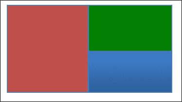
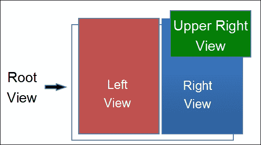
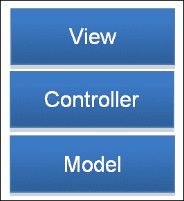

# 第九章. 以 Swift 方式编写代码 – 设计模式和技巧

除非你是计算机科学的尖端人物，否则你编写的软件将更多地关注用户体验和可维护性，而不是任何特定的先进编程语言。随着你编写越来越多的这类软件，你将看到许多模式出现，特别是如果你专注于可读性和可维护性，正如我们大多数人应该做的那样。然而，我们不必自己想出所有这些模式；多年来，人们一直在编程，并提出了许多模式，这些模式可以从一种语言很好地转移到另一种语言。

我们把这些模式称为**设计模式**。设计模式是一个庞大的主题，有无数本书籍、教程和其他资源。我们花费我们整个职业生涯来练习、塑造和完善这些模式在实践中的应用。我们给每个模式起一个名字，这样我们就可以与同行程序员进行更流畅的对话，并在我们自己的脑海中更好地组织它们。

在本章中，我们将探讨一些最常见的设计模式，特别是那些对理解苹果框架很重要的模式。当你开始在使用他人代码时识别模式时，你将更容易理解和利用那段代码。这也有助于你自己编写更好的代码。我们将关注每个模式背后的高层次思想，然后是如何在 Swift 中实现它们。然后我们将超越经典的设计模式，看看 Swift 的一些高级特性，这些特性允许我们编写特别干净的代码。

为了做到这一切，我们将在本章中涵盖以下主题：

+   什么是设计模式？

+   行为型模式

+   结构型模式

+   创建型模式

+   有效使用关联值

+   将系统类型扩展以减少代码

+   懒加载属性

# 什么是设计模式？

在我们深入研究具体模式之前，让我们先深入了解一下什么是设计模式。正如你可能已经理解的，编写一个甚至只做简单事情的程序有无数种方式。设计模式是为了解决反复出现和常见问题的一种解决方案。这些问题通常是如此普遍，以至于即使你没有故意使用模式，你也几乎肯定在不经意间使用了其中的一种或多种模式；尤其是如果你在使用第三方代码。

为了更好地评估设计模式的使用，我们将查看三个高级度量：**耦合度**、**内聚度**和**复杂性**。

耦合度是指单个代码组件对其他组件的依赖程度。我们希望减少代码中的耦合度，以便所有代码组件尽可能独立地运行。我们希望能够单独查看它们，并理解每个组件，而无需对整个系统有全面的理解。低耦合还允许我们在不影响其他代码的情况下对单个组件进行更改。

聚合性是指不同代码组件之间如何很好地结合在一起。我们希望代码组件能够独立操作，但它们仍然应以一种连贯且易于理解的方式与其他组件结合。这意味着为了实现低耦合和高聚合，我们希望代码组件被设计成只有一个目的，并且与其他代码的接口很小。这适用于我们代码的每个层面，从我们的应用程序的不同部分如何结合，到函数之间如何相互交互。

这两种度量都对我们的最终度量：复杂度，有很高的影响。复杂度基本上就是理解代码的难度，尤其是在添加新功能或修复错误等实际事情上。通过实现低耦合和高聚合，我们通常会编写更少的复杂代码。然而，如果将这些原则推向极端，有时实际上会导致更大的复杂度。有时最简单的解决方案是最快和最有效的，因为我们不希望在我们能够十倍更快地实现近乎完美的解决方案时，陷入设计完美解决方案的困境。我们大多数人都不可能在不限预算的情况下编码。

与拥有一个单一的巨大列表不同，设计模式通常根据它们的使用方式组织成三个主要类别：**行为**、**结构**和**创建**。

# 行为模式

行为模式是描述对象之间如何相互通信的模式。换句话说，这是如何一个对象将信息发送给另一个对象，即使信息只是某个事件已经发生。它们通过提供一种更分离的通信机制来帮助降低代码的耦合度，允许一个对象向另一个对象发送信息，同时尽可能少地了解另一个对象。任何类型对代码库中其他类型的了解越少，它对这些类型的依赖就越少。这些行为模式还通过提供简单易懂的方式来发送信息，从而帮助提高聚合性。

这往往是在做某事，比如打电话给你的姐姐让她去问你的妈妈再问你的爷爷他生日想要什么，和能够直接问你爷爷因为他与你有一个良好的沟通渠道之间的区别。一般来说，我们希望保持直接的沟通渠道畅通，但有时与较少的人互动实际上是一种更好的设计，只要我们不过度依赖其他组件。行为模式可以帮助我们做到这一点。

## 迭代器

我们将要讨论的第一个行为模式被称为**迭代器模式**。我们之所以从这一模式开始，是因为我们实际上已经在第六章 *让 Swift 为你工作 – 协议和泛型*中使用了这种模式。迭代器模式的思想是提供一种方法，可以独立于容器内部元素表示方式来遍历容器的内容。

正如我们所见，Swift 通过`GeneratorType`和`SequenceType`协议为我们提供了这种模式的基础。它甚至为它的数组和字典容器实现了这些协议。即使我们不知道数组或字典内部元素是如何存储的，我们仍然能够遍历它们包含的每个值。苹果可以轻松地更改它们内部元素的存储方式，而这根本不会影响我们遍历容器的方式。这显示了我们的代码与容器实现之间的高度解耦。

如果你记得，我们甚至能够为无限斐波那契序列创建一个生成器：

```swift
struct FibonacciGenerator: GeneratorType {
    typealias Element = Int

    var values = (0, 1)

    mutating func next() -> Element? {
        self.values = (
            self.values.1,
            self.values.0 + self.values.1
        )
        return self.values.0
    }
}
```

"容器"甚至不存储任何元素，但我们仍然可以像它存储了元素一样遍历它们。

迭代器模式是了解我们如何在现实世界中使用设计模式的一个很好的介绍。遍历列表是一个如此常见的问题，以至于苹果直接将其构建到 Swift 中。

## 观察者

我们将要讨论的另一种行为模式被称为**观察者模式**。这种模式的基本思想是，有一个对象被设计成允许其他对象在发生某些事件时被通知。

### 回调

在 Swift 中，实现这一点最简单的方法是在你想要被观察的对象上提供一个闭包属性，并在该对象想要通知其观察者时调用该闭包。该属性将是可选的，这样任何其他对象都可以设置它们的闭包到这个属性上：

```swift
class ATM {
    var onCashWithdrawn: ((amount: Double) -> ())?

    func withdrawCash(amount: Double) {
        // other work

        // Notify observer if any
        if let callback = self.onCashWithdrawn {
            callback(amount: amount)
        }
    }
}
```

在这里，我们有一个代表允许取款的 ATM 的类。它提供了一个每次取款时都会被调用的闭包属性`onCashWithdrawn`。这种类型的闭包属性通常被称为**回调**。通过其名称清楚地表明其目的是一个好主意。我个人选择以“on”这个词作为所有基于事件回调的命名前缀。

现在，任何对象都可以定义自己的闭包在回调上，并在取款时被通知：

```swift
class RecordKeeper {
    var transactions = [Double]()

    func watchATM(atm: ATM) {
        atm.onCashWithdrawn = { [weak self] amount in
            self?.transactions.append(amount)
        }
    }
}
```

在这种情况下，`ATM`被视为可观察对象，而`RecordKeeper`是观察者。`ATM`类型与可能记录其交易过程的任何过程完全断开连接。记录机制可以改变，而无需对`ATM`进行任何更改。只要新的`ATM`实现仍然在取款时调用`onCashWithDrawn`，`ATM`就可以更改，而无需对`RecordKeeper`进行任何更改。

然而，`RecordKeeper` 需要传递一个 `ATM` 实例以建立此连接。同时，一次也只有一个观察者。如果我们需要允许多个观察者，我们可以提供回调函数数组，但这可能会使移除观察者变得更加困难。解决这两个问题的方案是使用通知中心来实现观察者模式。

### 通知中心

通知中心是一个管理其他类型事件的中心对象。我们可以为 ATM 提款实现一个通知中心：

```swift
class ATMWithdrawalNotificationCenter {
    typealias Callback = (amount: Double) -> ()
    private var observers: [String:Callback] = [:]

    func trigger(amount: Double) {
        for (_, callback) in self.observers {
            callback(amount: amount)
        }
    }

    func addObserverForKey(key: String, callback: Callback) {
        self.observers[key] = callback
    }

    func removeObserverForKey(key: String) {
        self.observers[key] = nil
    }
}
```

在这个实现中，任何对象都可以通过传递一个唯一的键和回调给 `addObserverForKey:callback:` 方法来开始观察。它不需要对 `ATM` 实例有任何引用。观察者也可以通过传递相同的唯一键给 `removeObserverForKey:` 来被移除。在任何时候，任何对象都可以通过调用 `trigger:` 方法来触发通知，所有注册的观察者都将被通知。

如果你真的想通过高级协议和泛型来挑战自己，你可以尝试实现一个完全通用的通知中心，它可以同时存储和触发多个事件。在 Swift 中，理想的通知中心应该允许任何对象触发任意事件，以及任何对象观察任意事件，只要它们知道这些事件。通知中心不需要了解任何特定事件。它还应允许事件包含任何类型的数据。

# 结构型模式

**结构型模式**是描述对象之间如何相互关联以共同实现一个共同目标的模式。它们通过建议一种简单明了的方式来将问题分解为相关部分，帮助我们降低耦合度，并通过为我们提供一种预定义的方式，让这些组件能够相互配合，从而帮助我们提高内聚度。

这就像一个运动队为场上的每个人定义特定的角色，以便他们能够作为一个整体更好地一起比赛。

## 组合

我们将要研究的第一个结构型模式被称为**组合模式**。这种模式的概念是，你可以有一个单一的对象，它可以被分解成一组与自身类似的对象。这就像许多大型公司的组织结构。它们将拥有由更小的团队组成的团队，这些小团队再由更小的团队组成。每个子团队负责一小部分工作，然后他们一起负责公司更大的部分。

### 层次结构

计算机最终用像素数据网格来表示屏幕上的内容。然而，并不是每个程序都需要关心每个单独的像素。相反，大多数程序员使用操作系统提供的框架，在更高的层面上操作屏幕上的内容。一个图形程序通常被赋予一个或多个窗口来绘制，而不是在窗口内绘制像素；程序通常会设置一系列“视图”。一个视图将具有许多不同的属性，但最重要的是它有一个位置、大小和背景颜色。

我们可以用一个大的视图列表构建整个窗口，但程序员已经设计了一种使用组合模式来使整个过程更加直观的方法。一个视图实际上可以包含其他视图，这些视图通常被称为子视图。从这个意义上说，你可以将任何视图视为子视图的树。如果你查看树的根，你会看到一个将在窗口上显示的完整图像。然而，你可以查看树中的任何分支或叶子，并看到该视图的较小部分。这与将一个大团队作为一个整体看待与在更大团队中看待一个小团队是一样的。在这整个过程中，树根的视图和树叶的视图之间没有区别，除了根有更多的子视图。

让我们看看我们自己的`View`类的实现：

```swift
class View {
    var color: (red: Float, green: Float, blue: Float)
        = (1, 1, 1) // white
    var position: (x: Float, y: Float) = (0, 0)
    var size: (width: Float, height: Float)
    var subviews = [View]()

    init(size: (width: Float, height: Float)) {
        self.size = size
    }
}
```

这是一个相当简单的类，但通过添加`subviews`属性，它是一个额外的视图数组，我们使用组合模式使这个类变得非常强大。你可以想象一个几乎无限的视图层次结构，所有这些视图都包含在一个单一父视图内。这个单一视图可以被传递给其他类，以绘制整个视图层次结构。

例如，让我们设置一个视图，其中左侧为红色，右上角为绿色，右下角为蓝色：



要使用我们的类生成此内容，我们可以编写类似的代码：

```swift
let rootView = View(size: (width: 100, height: 100))

let leftView = View(size: (width: rootView.size.width / 2, height: rootView.size.height))
leftView.color = (red: 1, green: 0, blue: 0)
rootView.subviews.append(leftView)

let rightView = View(size: (width: rootView.size.width / 2, height: rootView.size.height))
rightView.color = (red: 0, green: 0, blue: 1)
rightView.position = (x: rootView.size.width / 2, y: 0)
rootView.subviews.append(rightView)

let upperRightView = View(size: (width: rightView.size.width, height: rootView.size.height / 2))
upperRightView.color = (red: 0, green: 1, blue: 0)
rightView.subviews.append(upperRightView)
```

在这个实现中，我们实际上有一个由`leftView`定义的红色左侧和一个由`rightView`定义的蓝色右侧。右上角是绿色而不是蓝色，是因为我们将`upperRightView`作为子视图添加到`rightView`中，并且只使其高度为二分之一。这意味着我们的视图层次结构看起来类似于以下图像：



重要的是要注意，`upperRightView`的位置被保留为*0, 0*。这是因为所有子视图的位置总是相对于它们最近的父视图。这使得我们可以在不影响任何子视图的情况下从层次结构中提取任何视图；在`rootView`内绘制`rightView`将看起来与它单独绘制时完全一样。

你也可以设置单独的对象来管理主视图的不同部分的 内容。例如，要创建一个像 Xcode 这样的程序，我们可能有一个对象管理左侧的文件列表内容，另一个对象管理所选文件的显示。显然，Xcode 比这要复杂得多，但它给了我们一个想法，即我们可以如何使用相对简单的概念构建极其强大和复杂的软件。

然而，你可能已经注意到了我们视图类的一个潜在问题。如果我们将其自己的子视图层次结构添加到某个地方，会发生什么？这很可能会在代码的另一个部分试图绘制视图时导致无限循环。作为对你的一项挑战，尝试更新我们的`View`类以防止这种情况发生。我建议你首先将`subviews`设为私有，并提供添加和删除子视图的方法。你可能还希望添加一个可选的`superview`属性，它将引用父视图。

### 相对于子类化

如你所见，组合模式非常适合任何可以将对象分解成与其完全相同的片段的情况。这对于看似无限的视图层次结构非常理想，但它也是子类化的一个很好的替代方案。子类化实际上是耦合最紧密的形式。子类极其依赖于其超类。对超类的任何更改几乎肯定会影响所有子类。我们经常可以使用组合模式作为子类化的一个松散耦合的替代方案。

例如，让我们探讨表示一个句子的概念。看待这个问题的一种方式是将句子视为一种特殊的字符串。任何这样的专门化通常都会引导我们创建一个子类；毕竟，子类是其超类的一种专门化。因此，我们可以创建一个`Sentence`子类，它是`String`的子类。这将非常棒，因为我们可以使用我们的句子类构建字符串，然后将它们传递给期望接收普通字符串的方法。

然而，这个方法存在一个重要的障碍：我们没有控制`String`代码，甚至更糟糕的是，我们甚至无法查看代码，所以我们甚至不知道字符是如何存储的。这意味着代码可以在我们不知情的情况下被苹果的更新所更改。即使我们有知识，这也可能引起维护上的麻烦。

一个更好的解决方案是使用组合模式并实现一个包含字符串的`Sentence`类型：

```swift
struct Sentence {
    var words: [String]

    enum Type: String {
        case Statement = "."
        case Question = "?"
        case Exclamation = "!"
    }

    var type: Type
}
```

在这里，我们能够用各种词汇给句子的各个部分赋予更有意义的名称，并设置了一个`Type`枚举，允许我们使用不同的结束标点符号。作为一个便利性，我们甚至可以添加一个计算属性`string`，这样我们就可以将句子用作普通字符串：

```swift
struct Sentence {
    // ..

    var string: String {
        return self.words.joinWithSeparator(" ")
            + self.type.rawValue
    }
}

let sentence = Sentence(words: [
    "This", "is",
    "a", "sentence"
], type: .Statement)
print(sentence.string) // "This is a sentence."
```

在这种情况下，这是一个比子类化更好的替代方案。

## 委托

苹果框架中最常用的设计模式之一被称为**委托模式**。其背后的理念是设置一个对象，以便让另一个对象处理其部分责任。换句话说，一个对象将部分责任委托给另一个对象。这就像经理雇佣员工来完成经理自己无法或不想亲自完成的工作。

作为更技术性的例子，在 iOS 中，苹果提供了一个名为`UITableView`的用户界面类。正如其名所示，这个类为我们提供了一个绘制元素列表的简单方法。单独的`UITableView`不足以创建界面。它需要数据来显示，并且需要能够处理各种用户交互，如点击、重新排序、删除等。

一种本能的想法是创建自己的`UITableView`子类，比如`PeopleTableView`。这是一个不错的选择，直到你记得我们讨论过子类化实际上是两个对象之间最强的耦合类型。为了正确地子类化`UITableView`，你必须非常熟悉超类的工作方式。这在你甚至不允许查看超类代码的情况下尤其困难。

另一个选项是在表格视图中设置数据，并使用观察者模式来处理用户交互。这比子类化选项更好，但大多数你想要显示的数据都不是静态的，因此更新表格视图会变得繁琐。同时，实现一个可以轻松用于其他显示信息列表方式的对象也会很困难。

因此，苹果的做法是，在`UITableView`上创建了两个不同的属性：`delegate`和`dataSource`。这些属性的存在是为了让我们能够分配自己的对象来处理表格的各种责任。数据源主要负责提供表格中要显示的信息，而委托的责任是处理用户交互。当然，如果这些对象可以是任何类型，表格视图实际上无法与它们交互。另外，如果这些对象是特定类型，我们仍然会遇到相同的子类化问题。因此，它们被定义为分别实现`UITableViewDelegate`和`UITableViewDataSource`协议。

这些协议仅定义了允许表格视图正确运行所需的方法。这意味着`delegate`和`dataSource`属性可以是任何类型，只要它们实现了必要的方法。例如，数据源必须实现的一个关键方法是`tableView:numberOfRowsInSection:`。这个方法为表格视图提供了一个整数，表示它想要了解的分区。它要求返回一个整数，表示引用分区中的行数。这是数据源必须实现的多达多个方法之一，但它让你了解表格视图不再需要确定它包含的数据。它只是要求数据源来解决这个问题。

这提供了一种非常松散耦合的方式来实现特定的表格视图，并且这种相同的模式在编程世界的各个角落都被重复使用。你会对苹果公司如何使用其表格视图感到惊讶，它对第三方开发者造成的痛苦非常小。如果你真的想要的话，表格视图可以非常优化地处理成千上万行数据。自 iOS 的第一个开发者工具包以来，表格也发生了很大的变化，但这些协议很少改变，除非是为了添加额外的功能。

## 模型视图控制器

**模型视图控制器**是最高级别和最抽象的设计模式之一。它的变体在大量软件中普遍存在，尤其是在苹果的框架中。它实际上可以被认为是苹果所有代码设计的基石，因此也是大多数第三方开发者设计自己代码的基础。模型视图控制器的核心概念是将所有类型分成三个类别，通常被称为层：**模型**、**视图**和**控制器**。

模型层是为所有表示和操作数据的类型设计的。这一层是软件能够为用户提供的真正基础，因此它也常被称为业务逻辑。例如，地址簿应用中的模型层将包含代表联系人、群组等的类型。它还将包含创建、删除、修改和存储这些类型的逻辑。

视图层是所有参与软件显示和交互的类型。它包括表格、文本视图和按钮等类型。本质上，这一层负责向用户显示信息，并提供用户如何与您的应用程序交互的便利性。地址簿应用中的视图将包括显示的联系人、群组和联系人信息列表。

最外层，控制器层，主要是模型层和视图层之间的粘合代码。它将根据模型层中的数据指示视图显示什么内容，并根据视图层传来的交互触发正确的业务逻辑。在我们的通讯录示例中，控制器层会将视图中的某个元素，比如添加联系人的按钮，连接到模型中定义的创建新联系人的逻辑。它还会将屏幕上的表格视图连接到模型中的联系人列表。

在模型视图控制器理想的实现中，没有任何模型类型应该知道视图类型的存在，也没有任何视图类型应该知道模型类型的存在。通常，模型视图控制器被形象地比作一块蛋糕：



用户看到并与之交互的是蛋糕的顶部，每一层只与其相邻的层进行通信。这意味着视图层和模型层之间的所有通信都应该通过控制器层进行。同时，控制器层应该相对轻量级，因为模型层在应用逻辑方面承担着繁重的任务，而视图层在屏幕绘制和接受用户输入方面承担着繁重的任务。

这种设计模式的主要好处之一是它提供了一种逻辑上和一致的方式来分解许多软件组件。这极大地提高了你与其它开发者共享代码和理解他们代码的能力。当尝试理解一个之前未曾见过的庞大代码库时，它为每个人提供了一个参考框架。类的命名也给了开发者关于类型在整体系统中扮演什么角色的强烈提示。iOS 中几乎每个视图类都包含“view”这个词：`UITableView`、`UIView`、`UICollectionViewCell`等。同样，苹果提供的控制器层类大多数都包含“controller”这个词：`UIViewController`、`UITableViewController`、`MFMailComposeViewController`等。模型层主要留给第三方开发者，除了基本的数据类型，因为苹果不太可能在你软件的业务逻辑方面提供太多帮助。然而，即使在第三方开发者中，这些类通常都是以它们所表示或操作的数据命名的名词：Person、AddressBook、Publisher 等等。

模型视图控制器的另一个巨大好处是大多数组件将非常易于重用。你应该能够轻松地重用视图，就像你可以使用表格视图来显示几乎任何类型的数据，而不需要改变表格视图类型一样；你也应该能够以许多不同的方式显示类似通讯录这样的内容，而不需要改变通讯录类型。

尽管这个模式很有用，但它也非常难以坚持。你可能会在整个开发生涯中不断进化你对如何有效地将问题分解为这些层级的感知。通常，为每一层创建显式的文件夹会有所帮助，迫使你将每种类型放入仅一个类别中。你也可能会发现自己创建了一个臃肿的控制器层，尤其是在 iOS 中，因为将业务逻辑放在那里通常很方便。比其他任何设计模式，模型视图控制器可能是最需要努力追求但很少能完美实现的东西。

# 创建型模式

我们将要讨论的最后一种设计模式称为**创建型模式**。这些模式与新对象的初始化有关。起初，对象的初始化可能看起来很简单，并不是一个特别重要的地方来应用设计模式。毕竟，我们已经有初始化器了。然而，在特定情况下，创建型模式可以非常有帮助。

## 单例/共享实例

我们将要讨论的第一种设计模式是**单例模式**和**共享实例模式**。我们将它们一起讨论，因为它们非常相似。首先，我们将讨论共享实例，因为它是单例模式的较不严格形式。

共享实例模式的想法是提供你类的一个实例供代码的其他部分使用。让我们通过 Swift 中的一个快速示例来看看这一点：

```swift
class AddressBook {
    static let sharedInstance = AddressBook()

    func logContacts() {
        // ...
    }
}
```

在这里，我们有一个简单的地址簿类，但我们提供了一个静态常量`sharedInstance`，任何其他代码都可以使用它，而无需创建自己的实例。这是一种非常方便的方式，允许原本分离的代码进行协作。你不需要在代码中传递相同实例的引用，任何代码都可以通过类本身直接引用共享实例：

```swift
AddressBook.sharedInstance.logContacts()
```

现在，单例模式的不同之处在于，你会以这种方式编写代码，以至于甚至不可能创建你类的一个第二个实例。尽管我们之前的地址簿类提供了一个共享实例，但没有任何东西可以阻止某人使用正常的初始化器创建自己的实例。我们可以相当容易地将我们的地址簿类改为单例而不是共享实例，如下所示：

```swift
class AddressBook {
    static let singleton = AddressBook()

    private init() {}

    func logContacts() {
        // ...
    }
}

AddressBook.singelton.logContacts()
```

除了更改静态常量的名称外，与这段代码的唯一区别在于我们将初始化器声明为私有。这使得文件外的代码无法使用初始化器，因此，文件外的代码也无法创建新的实例。

单例模式在多个实例的同一类将导致问题时非常出色。这对于代表有限物理资源的类尤为重要，但它也可以是一种简化类的途径，这样就可以以更困难和不必要的方式实现多个实例。例如，实际上并没有太多理由确保应用程序中始终只有一个地址簿。也许用户会想要有两个地址簿：一个用于商业，一个用于个人。只要它们从不同的文件中工作，它们应该能够独立操作。但在你的应用程序中，你可能知道将始终只有一个地址簿，并且它总是由一个文件驱动。与其要求你的代码使用特定的文件路径创建地址簿，并且处理多个实例读取和写入同一文件的风险，你还可以使用上面的单例版本，并将文件路径固定。

事实上，单例模式和共享实例模式非常方便，以至于许多开发者过度使用它们。因此，让我们讨论一下这些模式的缺点。能够从任何地方访问一个实例是很方便的，但当这样做变得容易时，也容易在对象上创建一个非常复杂的依赖网络。这与我们试图实现的低耦合原则相悖。想象一下，当你有 20 段不同的代码都直接使用它时，试图更改单例类是多么困难。

使用这些模式也可能创建隐藏的依赖。通常，根据它必须初始化的内容，可以很清楚地了解实例的依赖关系，但单例或共享实例并没有传递给初始化器，因此它通常会被忽视作为依赖。尽管将对象传递给初始化器有一些初始的额外开销，但它通常会减少耦合，并保持对类型之间交互的更清晰的认识。底线是，就像任何其他模式一样，仔细思考每个单例和共享实例模式的使用，并确保它是完成工作的最佳工具。

## 抽象工厂

我们在这里将要讨论的最后一个模式被称为**抽象工厂**。它基于一个更简单的模式，即**工厂模式**。工厂模式的想法是，你为创建其他对象实现一个对象，就像你为组装汽车创建一个工厂一样。当初始化一个类型非常复杂或你想创建许多相似的对象时，工厂模式非常出色。让我们看看第二种场景。如果我们正在创建一个双打乒乓球游戏，并且在游戏中有一些场景需要添加特定玩家需要保持比赛进行的多余球，球类可能看起来像这样：

```swift
struct Ball {
    let color: String
    let owningPlayer: Int
}
```

每次我们需要一个新的球时，我们都可以为其分配一个新的颜色和拥有者。或者，我们可以为每个玩家创建一个单独的球工厂：

```swift
struct BallFactory {
    let color: String
    let owningPlayer: Int

    func createNewBall() -> Ball {
        return Ball(
            color: self.color,
            owningPlayer: self.owningPlayer
        )
    }
}

let player1Factory = BallFactory(
    color: "Red", owningPlayer: 1
)
let player2Factory = BallFactory(
    color: "Green", owningPlayer: 1
)

let ball1 = player1Factory.createNewBall()
```

现在，我们可以将这个工厂传递给任何负责处理球创建事件的物体，这样该物体就不再负责确定球的颜色或任何其他我们可能想要的属性。这对于减少该物体所承担的责任数量非常有用，同时也使得代码在未来添加额外的球属性时非常灵活，而无需更改球创建事件对象。

抽象工厂是一种特殊的工厂形式，其中工厂创建的实例可能是单个其他类的一个或多个子类的实例。一个很好的例子是图像创建工厂。正如我们在第三章中讨论的，“一次一件——类型、作用域和项目”，计算机有无数种方式来表示图像。在第三章中，我们假设有一个名为“Image”的超类，它将为每种图像类型有一个子类。这将帮助我们很容易地编写处理任何类型图像的类，因为它们总是与图像超类一起工作。同样，我们可以创建一个图像工厂，这将几乎消除外部类型了解不同类型图像的任何需要。我们可以设计一个抽象工厂，它接受任何图像的路径，将其加载到适当的子类中，并简单地将其作为图像超类返回。现在，加载图像的代码和使用图像的代码都不需要知道它们正在处理什么类型的图像。不同图像表示的复杂性都被抽象到工厂和图像类层次结构中。这对于使我们的代码更容易理解且更易于维护是一个巨大的优势。

# 有效使用关联值

良好的编程不仅仅是关于如何编写有效代码的宏大、普遍概念。最优秀的程序员知道如何发挥手中工具的优势。现在，我们将从观察编程设计的核心原则转向使用 Swift 的强大功能来增强代码的一些具体细节。

我们将首先探讨如何有效地使用枚举的关联值。关联值是 Swift 的一个相当独特的特性，因此它们开辟了一些相当有趣的可能性。

## 替换类层次结构

我们已经在第三章中看到，我们可以使用带有关联值的枚举来表示像距离这样的测量值在多个测量系统中的表示：

```swift
enum Height {
    case Imperial(feet: Int, Inches: Double)
    case Metric(meters: Double)
    case Other(String)
}
```

我们可以将这个用例概括为使用枚举来简化简单的类层次结构。而不是枚举，我们本可以创建一个高度超类或协议，并为每个测量系统创建子类。然而，这将是一个更复杂的解决方案，我们会失去使用值类型而不是引用类型的好处。枚举解决方案也非常紧凑，使得它一目了然，而不是需要分析多个不同类如何结合在一起。

让我们看看一个更复杂的例子。假设我们想要创建一个健身应用，并希望能够跟踪多种类型的锻炼。有时人们锻炼是为了完成一定数量的各种动作的重复；而有时他们只是想要锻炼一定的时间。我们可以为这个目的创建一个类层次结构，但使用关联值的枚举效果很好：

```swift
enum Workout {
    case ForTime(seconds: Int)
    case ForReps(movements: [(name: String, reps: Int)])
}
```

现在，当我们想要创建一个锻炼时，我们只需要定义与我们感兴趣的锻炼类型相关的值，而无需使用任何类。

## 简洁地表示状态

枚举与关联值另一个很好的用途是表示某物的状态。这个最简单的例子将是一个结果枚举，它可以在发生错误时包含一个值或错误描述：

```swift
enum NumberResult {
    case Success(value: Int)
    case Failure(reason: String)
}
```

这允许我们编写一个可能会失败并给出失败原因的函数：

```swift
func divide(first: Int, by second: Int) -> NumberResult {
    guard second != 0 else {
        return .Failure(reason: "Cannot divide by zero")
    }
    return .Success(value: first / second)
}
```

这是对正常错误处理的替代方案，并且对于将失败情况视为与成功情况类似而不是罕见异常的情况的函数来说是有意义的。

一个稍微复杂一些的想法是使用枚举来表示一个将在一段时间内经过各种阶段的过程，通常称为状态机。我们可以为下载过程编写一个枚举：

```swift
enum DownloadState {
    case Pending
    case InProgress(percentComplete: Float)
    case Complete(data: String)
}
```

在下载进行过程中，我们可以访问其完成程度，一旦完成，我们可以访问下载的数据。这些信息仅在适用时才可访问。这个枚举还将使确保我们的下载始终处于合理且明确定义的状态变得更加容易。例如，下载可能已完成但数据尚未处理的中立状态是不可能的。如果我们想要表示一个额外的处理步骤，我们可以轻松地添加另一个情况，并且从那时起，将清楚地知道下载将经过那个额外的状态。

# 扩展系统类型以减少代码

另一个我们在第三章中简要介绍过的强大功能，即*一次处理一个部分 – 类型、作用域和项目*，是扩展现有类型的能力。我们了解到，我们可以向字符串类型添加一个扩展，使我们能够多次重复字符串。让我们看看这个功能的更实际的应用案例，并讨论它在改进我们的代码方面的好处。

也许我们正在创建一个成绩跟踪程序，我们将打印出大量的百分比。表示百分比的一个很好的方式是使用介于零和一之间的浮点数。浮点数非常适合表示百分比，因为我们可以使用内置的数学函数，并且它们可以表示非常细粒度的数字。使用浮点数表示百分比时需要克服的障碍是打印它。如果我们简单地打印出值，它很可能不是我们想要的方式。人们更喜欢百分比以 100 为基数，并在其后加上百分号。

最坏的情况是，我们每次需要打印百分比时都要写一些东西，比如 `print("\(myPercent * 100)%")`。这并不灵活；如果我们想调整所有百分比输出以具有前导空格，使其打印为右对齐，我们不得不逐个更改每个打印语句。相反，我们可以编写自己的函数，比如 `printPercentage`。这将允许我们在很多地方共享相同的代码。

这是个不错的步骤，但我们可以利用 Swift 扩展系统类型的能力做得更好。如果我们有一个名为 `printPercentage` 的任意函数，我们将很难记住它的存在，其他开发者也可能很难在最初发现它。如果我们可以轻松地从浮点数本身获取可打印版本，那就好多了。我们可以通过向 `Float` 添加扩展来实现这一点：

```swift
extension Float {
    var percentString: String {
        return "\(self * 100)%"
    }
}
let myPercent: Float = 0.32
print(myPercent.percentString) // 32.0%
```

现在，我们可以使用自动完成功能来帮助我们记住为浮点数定义了哪些格式。随着时间的推移，你可能会积累一些像这样的有用且通用的扩展，它们因为独立于你其他特定程序的代码而极具可重用性。以这种方式编写这些代码使得将它们引入新程序变得非常容易，从而大大加快了每个新项目的启动速度。

然而，你确实需要小心，不要创建太多的扩展。对于更复杂的情况，通常更合适的是使用组合模式。例如，我们可以将其编写为一个可以与 `Float` 构造的 `Percent` 类型：

```swift
struct Percent: CustomStringConvertible {
    let value: Float

    var description: String {
        return "\(self.value * 100)%"
    }
}
print(Percent(value: 0.3))
```

在这种情况下，可能不需要创建自己的类，但你至少应该考虑如何在未来扩展百分比的概念。

# 懒加载属性

我们尚未讨论的一个特性是懒加载属性的概念。将属性标记为懒加载允许 Swift 在首次访问时才初始化它。这至少在几个重要方面可能很有用。

## 避免不必要的内存使用

使用懒加载属性最明显的方式是避免不必要的内存使用。让我们先来看一个非常简单的例子：

```swift
struct MyType {
    lazy var largeString = "Some String"
}
let instance = MyType()
```

尽管我们在前面的代码中创建了一个新的`MyType`实例，但直到我们尝试访问它之前，`largeString`并未被设置。如果我们有一个可能不是每个实例都需要的大变量，这很好。在访问之前，它不会占用任何内存。

## 避免不必要的处理

我们还可以通过使用闭包来计算值进一步扩展这个懒属性的想法：

```swift
class Directory {
    lazy var subFolders: [Directory] = {
        var loaded = [Directory]()
        // Load subfolders into 'loaded'
        return loaded
    }()
}
```

在这里，我们实际上是在使用一个自我评估的闭包。我们通过在闭包的末尾添加开闭括号来实现这一点。通过这样做，我们将`subFolders`属性分配给执行闭包的结果；因为它是一个延迟属性，所以闭包只有在第一次访问`subFolders`属性时才会执行。就像可以帮我们避免占用不必要的内存的普通延迟属性一样，这项技术允许我们在不需要时避免运行耗时的操作。

## 将逻辑本地化到相关属性

要实现上述目标，除了使用懒属性外，我们还可以使用可选属性，并在需要时简单地分配这些值。这是一个可行的解决方案，特别是如果我们唯一的目的是减少不必要的内存使用或处理。然而，懒属性解决方案还有另一个巨大的好处。它通过将计算属性值的逻辑直接连接到其定义，产生了更易读的代码。如果我们只是有一个可选属性，它必须在初始化器或其他方法中初始化。在查看属性时，不会立即清楚其值是什么，以及何时设置，如果会设置的话。

当你的代码库规模和年龄增长时，这是一个至关重要的优势。即使代码库是你的，也很容易在其中迷失方向。你可以从一条逻辑到另一条逻辑画出越多的直线，当你后来回到代码库时，找到你想要的逻辑就会越容易。

# 摘要

在短时间内，我们覆盖了许多非常大的设计概念。我们查看了许多特定的设计模式，这些模式通过减少对象之间的依赖性来降低我们代码的复杂性，通常称为低耦合，并增加了这些对象协同工作的简单性，通常称为高内聚。

我们了解到，存在三种关注解决不同类型问题的设计模式。行为模式有助于对象之间更好地进行通信，结构模式促进将复杂结构分解成更小、更简单的部分，而创建模式则帮助初始化新对象。

我们还探讨了 Swift 的一些非常具体的特性以及它们如何帮助我们实现与设计模式相似的目标。我们看到了如何使用带关联值的枚举来简化我们的类型系统并更好地表示状态；我们使用扩展来减少对系统类型的代码量，并使用惰性属性编写更高效、更易于理解的代码。

正如我一开始所说的，设计模式是一个巨大的主题，而且不是你能够迅速掌握的，如果真的能掌握的话。弄清楚如何最好地使用特定语言的功能也是一个巨大的主题。我强烈建议你在开始开发大型软件并希望找到使其更简单的方法时，将本章作为参考。我也强烈鼓励你研究更多模式，并尝试自己实现它们。每个设计模式都是你工具箱中的另一个工具。你拥有的工具越多，你对每个工具的经验越丰富，你就越能选择适合正确工作的正确工具。这就是编程的艺术。

现在我们已经准备好进入下一章，在这一章中，我们将回顾过去，研究 Objective-C，以便我们能够利用针对 Objective-C 的丰富资源，这些资源对我们作为 Swift 开发者来说仍然非常相关。
