# 第十一章. 一个全新的世界 - 开发应用

到目前为止，我们几乎完全专注于学习 Swift 而不是学习它所设计的平台。这是因为学习一个新的平台与学习一门语言完全不同。学习一门编程语言就像学习一门口语的基本语法。不同口语之间的语法通常表达相似的概念，但具体词汇往往更加多样化，即使有时可以辨认出来。学习一门编程语言就是学习如何连接你希望的平台的具体词汇。本章将介绍 iOS 框架的一些词汇。

我们将通过开发一个简单的相机应用的过程来实现这一点。在这个过程中，我们将学习一些开始任何其他类型 iOS 应用所需的最关键词汇，许多概念也适用于 OS X 开发。具体来说，我们将涵盖：

+   构想应用

+   设置应用项目

+   配置用户界面

+   运行应用

+   暂时保存照片

+   填充我们的照片网格

+   重构以尊重模型-视图-控制器

+   永久保存照片

# 构想应用

在我们甚至打开 Xcode 之前，我们应该对我们计划开发的内容有一个很好的认识。我们想知道我们将需要哪些基本数据来表示，以及用户界面将是什么样的。我们目前不需要每个屏幕的像素完美设计，但我们应该有一个很好的应用流程和我们要在第一个版本中包含的功能的想法。

## 功能

正如我们已经讨论过的，我们将开发一个基本的相机应用。这给我们留下了一个非常明确的特征列表，我们希望在第一个版本中拥有：

+   拍摄照片

+   查看已拍摄照片的相册

+   标记照片

+   删除照片

这些是相机应用高度关键的功能。显然，我们没有任何区别化的功能可以使这个应用比其他现有应用更有价值，但这足以学习制作 iOS 应用最关键的部分。

## 界面

现在我们有了功能列表，我们可以构思应用的基本流程，也称为线框图。我们应用的第一屏将是一个相册，展示用户已经拍摄的所有图片。屏幕上会有一个按钮，允许他们拍摄新图片。它还将具有激活编辑模式的能力，在那里他们可以删除照片或更改标签：

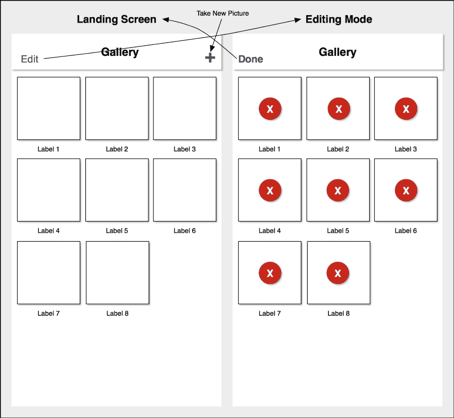

此界面将允许我们利用稍后将要详细探讨的内置拍照界面。此界面还将允许我们使其灵活地适应所有不同的手机和平板屏幕。这看起来可能很简单，但有许多组件必须组合在一起才能使这个应用工作。另一方面，一旦你对不同的组件有了良好的理解，它将再次开始看起来很简单。

## 数据

现在我们大致了解了应用需要如何为用户工作，我们可以至少提出一个关于数据存储的高层次概念。在这种情况下，我们仅仅有一个带有不同标签的图像的扁平列表。我们存储这些文件的最简单方式是在本地文件系统中，每个图像以用户选择的标签命名。在这个系统中需要注意的唯一一点是我们将不得不找到一种方法来允许两个具有相同确切标签的不同图像。当我们着手实现时，我们将更详细地解决这个问题。

# 设置应用项目

现在我们已经完成了应用的概念化，我们准备开始编码。在 第三章，*一次一件——类型、作用域和项目* 中，我们创建了一个命令行项目。这次，我们将创建一个 iOS 应用。再次在 Xcode 中导航到 **文件** | **新建** | **项目…**。当窗口出现时，从 **iOS** | **应用** 菜单中选择 **单视图应用**：

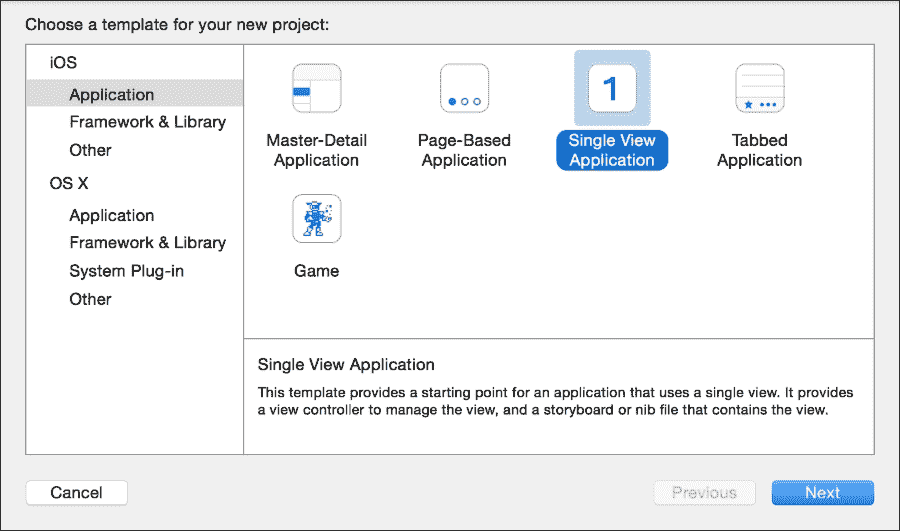

从那里，点击 **下一步**，然后给项目命名为 `LearningCamera`。任何 **组织名称** 和 **标识符** 都可以。最后，确保从语言下拉菜单中选择 **Swift**，从 **设备** 下拉菜单中选择 **通用**。现在再次选择 **下一步** 并创建项目。

Xcode 将向你展示一个项目开发窗口，它看起来与命令行项目略有不同：

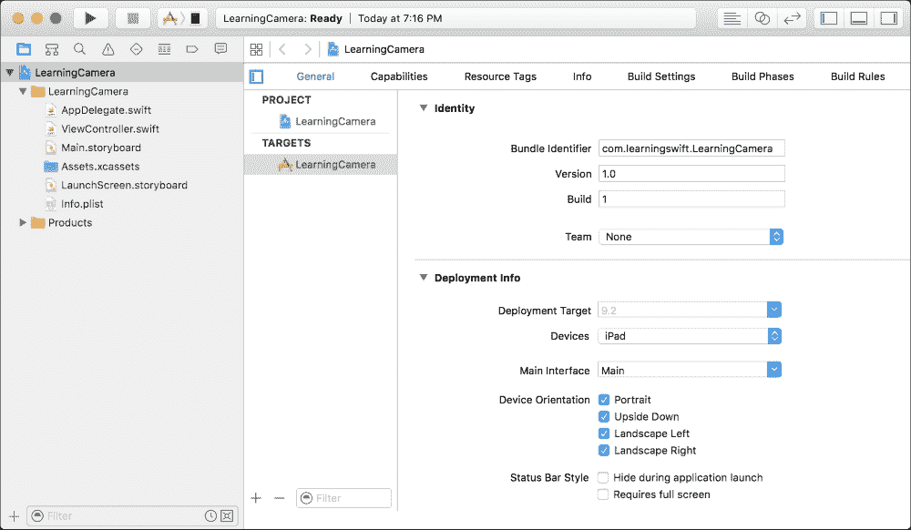

这个默认屏幕允许我们配置应用的各种属性，包括版本号、目标设备等。就我们的目的而言，所有默认设置都很好。当你决定将应用提交到应用商店时，这个屏幕将变得非常重要。

Xcode 也为我们创建了一些不同的文件和文件夹。我们将仅在 `LearningCamera` 文件夹中工作。`LearningCameraTests` 文件夹用于自动化测试；这是一个极好的想法，但超出了本书的范围。最后一个文件夹是 `Products` 文件夹，你不需要对其进行更改。

在`LearningCamera`文件夹中，我们有几个重要的文件。第一个文件是`AppDelegate.swift`，它是应用的入口点。它有一个为你创建的类，称为`AppDelegate`，该类在应用生命周期中的不同点调用了一些方法。我们不需要修改这个文件来完成我们的目的，但它在许多应用中是一个重要的文件。

第二个文件是`ViewController.swift`。这个文件包含一个`UIViewController`子类，用于管理应用默认视图与业务逻辑之间的交互。我们将在那里做很多工作。

第三个文件是`Main.storyboard`。这个文件包含我们视图的界面设计。目前，它只有一个由`ViewController`管理的视图。我们将在稍后使用这个文件来添加和配置我们的视觉组件。

第四个文件是`Assets.xcassets`。这是一个用于存放我们希望在应用中显示的所有图像的容器。你制作的几乎每个应用都会至少有一个图像，所以这也是一个非常重要的文件。

最后，最后一个文件是`LaunchScreen.storyboard`。这个文件让我们可以管理应用启动时的显示。这是生产应用的一个极其重要的部分，因为这是用户每次启动应用时看到的第一件事；一个精心设计的启动过程可以产生巨大的影响。然而，我们不需要对这个文件做任何事情来完成我们的学习目的。

# 配置用户界面

现在我们已经在项目中找到了方向，让我们开始配置我们应用的用户界面。正如我们之前讨论的，这是在`Main.storyboard`文件中完成的。当我们选择该文件时，我们会看到一个图形编辑工具，通常被称为**界面构建器**：

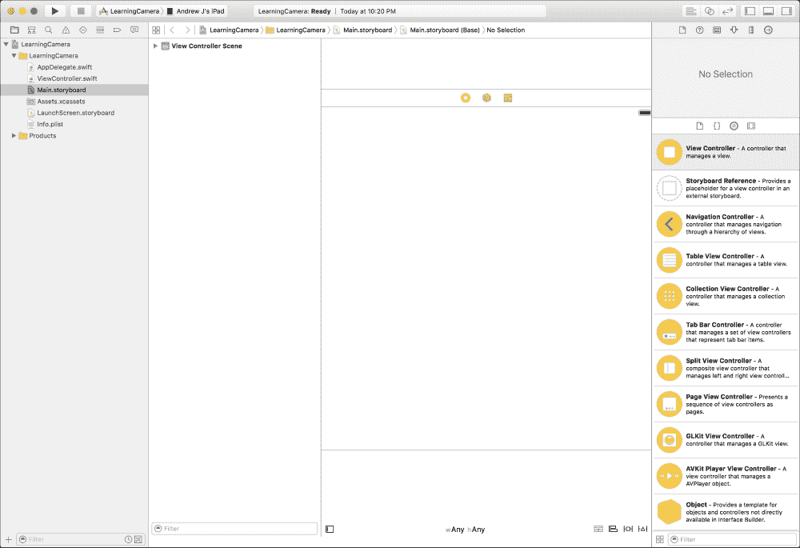

在中间，有一个由`ViewController`实例控制的主要视图。这是一个空白画布，我们可以添加我们想要的任何界面元素。

我们首先想做的事情是添加我们线框中沿顶部的那条栏。这个栏被称为**导航栏**，我们可以直接添加它，因为它是我们库中的一个元素。然而，如果我们使用**导航控制器**，框架将为我们处理许多复杂问题。导航控制器是一个包含其他视图控制器的视图控制器。具体来说，它会在顶部添加一个导航栏，并允许我们在未来将其推送到子视图控制器上。这个控制器在许多应用中创建了一个视图从右侧推入的动画。例如，当你选择邮件应用中的电子邮件时，它会动画显示电子邮件的内容；这使用了导航控制器。我们不需要在这个应用中推送任何视图控制器，但为未来做好准备是好的，这也是在顶部获得导航栏的更优方式。

沿着右侧，我们有一个元素库，我们可以将其拖拽到画布上，让我们先找到**导航控制器**。从库中将它拖拽到左侧的面板中，其中列出了**视图控制器场景**。这将向列表中添加两个新的视图控制器：

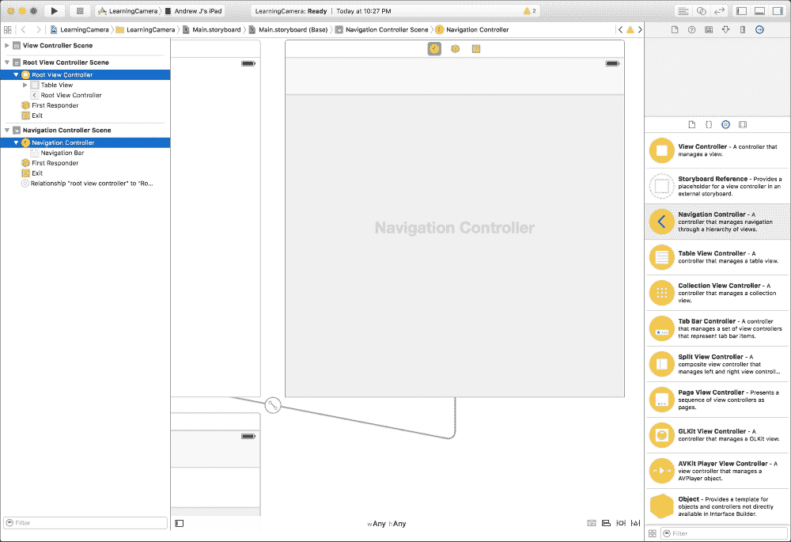

我们不希望有新的**根视图控制器**，只保留**视图控制器场景**，所以让我们将其删除。为此，点击带有黄色图标的**根视图控制器**并按下*删除*键。接下来，我们希望将**视图控制器场景**设置为根视图控制器。根视图控制器是在**导航控制器**内首先显示的控制器。为此，右键点击带有黄色图标的**导航控制器**并将其拖拽到下面的带有黄色图标的**视图控制器**上。**视图控制器**将被高亮显示为蓝色：

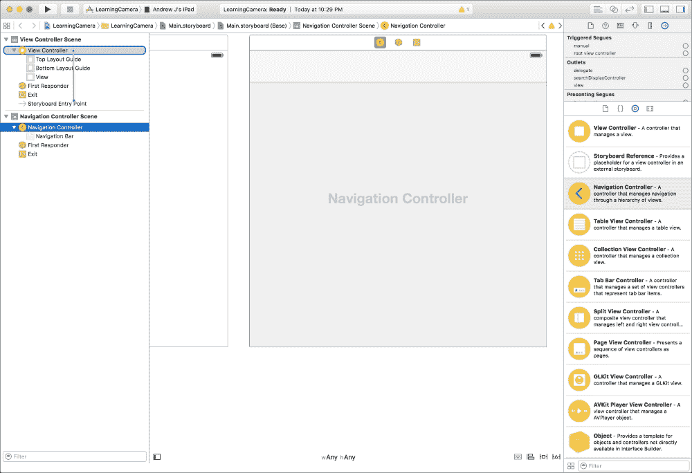

释放鼠标右键后，会出现一个菜单，你应该点击**根视图控制器**。最后，我们希望将导航控制器设置为应用中首先出现的视图控制器。选择带有黄色图标的**导航控制器**，从主菜单中选择**视图** | **实用工具** | **显示属性检查器**，然后向下滚动并勾选**是否为初始视图控制器**复选框。请注意，你可以随意拖拽屏幕上的视图控制器，但请确保使文件更容易导航。

现在我们已经准备好自定义我们的主视图。为了聚焦视图，从左侧的面板中选择**视图控制器**。现在双击标题，将其更改为`Gallery`：

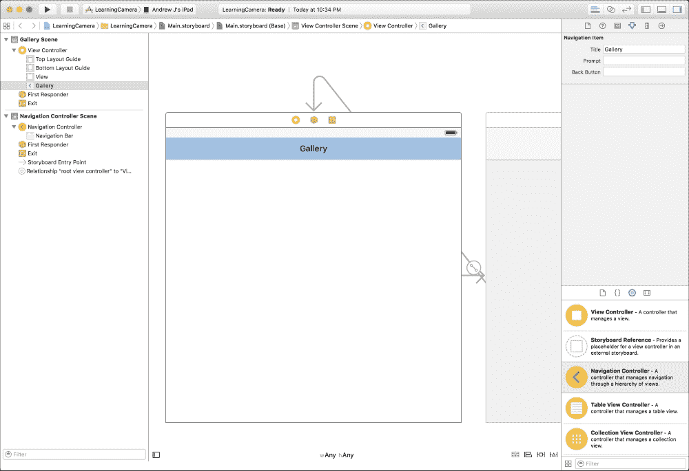

接下来，我们希望将“拍照”按钮添加到我们的导航栏中。工具栏中的所有按钮都称为**栏按钮项**。在库中找到它们，然后将它拖拽到工具栏的右侧（当你靠近时，可以放置它的位置会变为蓝色）。默认情况下，按钮会显示为**Item**，但我们希望它是一个添加按钮。一个选项是将文本更改为加号符号，但有一个更好的选项。添加按钮后，你应该能在左侧的主视图的层次结构中看到它。在那里，你会看到带有新按钮项的导航栏嵌套在**Gallery**标题下。如果你在层次结构中选择该项，你将在屏幕右侧看到一些关于该项目的配置选项。我们希望将系统项更改为**添加**：

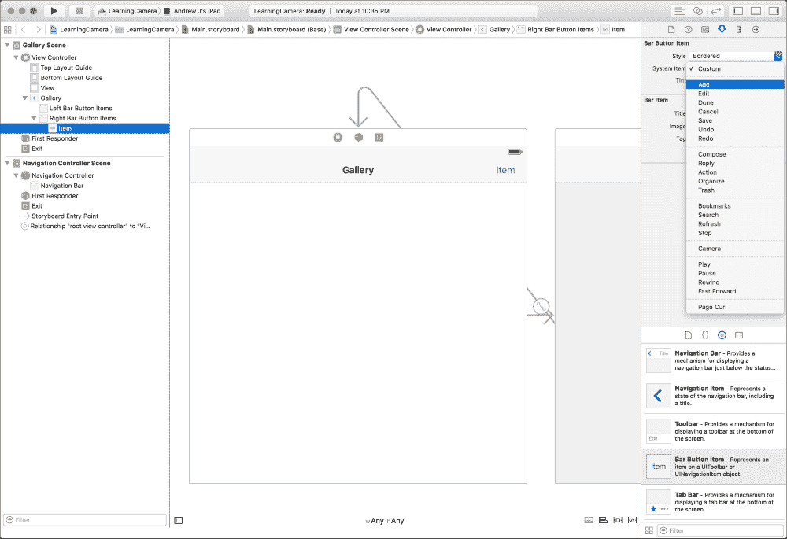

现在，你可以用**编辑**标识符对导航栏的左侧做同样的操作。

最后，我们需要添加照片画廊。为此，我们将从库中使用**集合视图**。将其拖到视图的中心。集合视图由一定数量的单元格组成，这些单元格以网格形式排列。每个单元格都是模板单元格的副本，并且可以在代码中配置以显示特定数据。当您拖动集合视图时，它还为您创建了一个模板单元格。我们很快将配置它。

首先，我们需要定义集合视图大小的规则。这将使界面能够很好地适应每个不同的屏幕尺寸。我们用来做这个的工具称为**自动布局**。点击集合视图，然后点击屏幕右下角的**固定**图标：

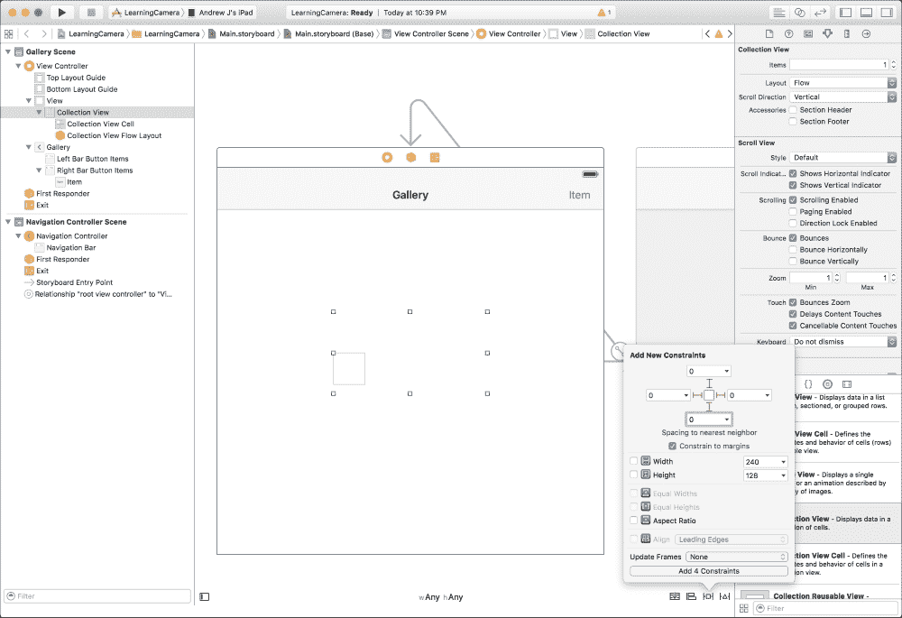

将此窗口配置为与前面的截图匹配。点击每个四条支柱，使它们突出显示为红色，取消选中**限制于边距**，并将每个测量值更改为零。配置完成后，点击**添加 4 个约束**。这将导致出现一些黄色线条，指示视图的放置与我们刚刚创建的规则不一致。我们可以自己调整视图的大小以使其匹配，或者让 Xcode 为我们做：屏幕左侧的**画廊场景**旁边将出现一个黄色图标。点击它，您将获得一个列表，其中包含放置不当的视图。在那里，您可以点击黄色三角形，然后点击**修复错位**。我们还想将背景改为白色而不是黑色。选择集合视图，然后在**属性检查器**中将**背景**更改为白色。

在此屏幕上我们需要配置的最后一件事情是**集合视图单元格**。这是集合视图左上角的一个框。我们需要更改大小并添加一个图像和一个标签；让我们先从更改大小开始。如果尚未选中，请点击**集合视图**，然后从主菜单导航到**视图** | **实用工具** | **显示大小检查器**。将**单元格大小**更改为宽度为`110`点，高度为`150`点。

现在，我们可以将我们的图片拖入。在库中，这被称为**图像视图**。将其拖入单元格中，然后在**大小检查器**中更改高度和宽度为`110`和**x**和**y**为`0`。接下来，我们想要将一个**标签**拖到图像视图下方。一旦放置好，我们想要配置单元格内的放置规则。

首先，选择**图像视图**。我们必须使其全宽并附加到单元格的顶部，因此再次选择固定图标并按以下方式配置：

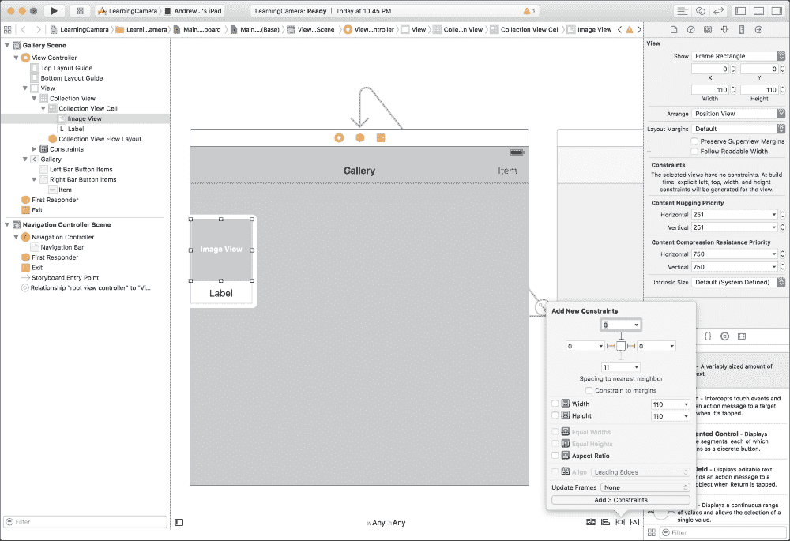

它被固定在左侧、顶部和右侧，没有约束到边距，所有三个测量值都为零。点击**添加 3 个约束**，我们就可以为标签定义规则了。我们希望标签能够全宽并且垂直居中。标签会自动居中文本，因此我们希望标签足够高，以便在文本上下方有合理的边距。点击标签并按照以下方式配置它：

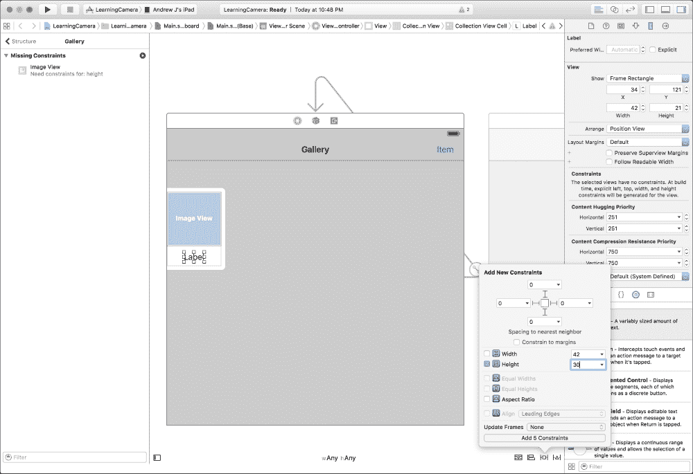

它在所有方向上都被固定，没有约束到边距，所有测量值都为零。它还通过勾选**高度**复选框被约束为 30 点高。点击**添加 5 个约束**，然后从左侧菜单让 Xcode 再次为您调整大小。同时，确保在属性检查器中选择居中对齐，并将字体大小减少到`12`。

# 运行应用

现在我们已经配置了大部分界面，而没有写任何代码。我们可以运行应用来查看它的样子。为此，首先从顶部栏的菜单中选择您想要运行它的模拟器。然后您可以点击运行按钮，即带有黑色三角形的按钮。这将打开一个新的模拟器窗口，运行您的应用：

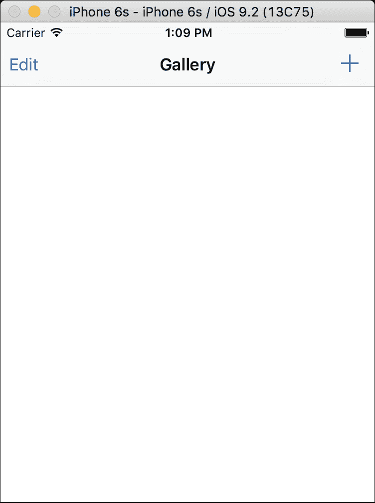

您可以通过**硬件**菜单旋转虚拟设备，以查看旋转时的效果，并且可以在不同的模拟器上尝试运行它。我们迄今为止已经配置了视图，使其能够适应任何屏幕尺寸。

# 允许拍照

现在我们准备进入编程环节。首先我们需要允许用户进行拍照操作。为了实现这一点，我们需要编写一些代码，每次用户点击添加按钮时都会执行这些代码。我们通过将添加按钮的触发动作连接到视图控制器上的一个方法来实现这一点。通常，我们通过右键拖动从按钮到代码来建立连接；然而，如果我们不能同时看到界面和代码，我们就无法这样做。最简单的方法是显示**辅助编辑器**。您可以通过导航到**视图** | **辅助编辑器** | **显示辅助编辑器**来做到这一点。同时，确保它被配置为自动，通过点击编辑器顶部的栏位：

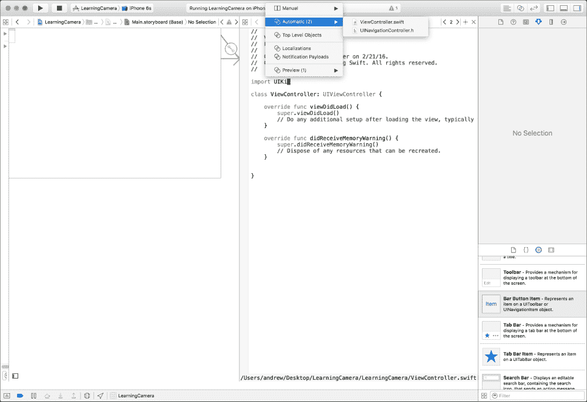

此模式会导致第二个视图自动更改为最合适的文件，根据您在左侧选择的文件。在这种情况下，因为我们正在处理视图控制器的界面，所以它显示的是视图控制器的代码。

我们的视图控制器代码最初生成了两个方法。`viewDidLoad`在视图控制器视图加载时被调用。大多数时候，这发生在视图控制器即将第一次显示时。`didReceiveMemoryWarning`在系统开始运行内存不足时被调用。这为你提供了一个机会，通过删除任何不必要的项目来帮助系统找到更多内存。

我们想从按钮到一个新方法创建一个连接。你可以通过在添加按钮上右键单击并拖动到`didReceiveMemoryWarning`方法下方来完成此操作：

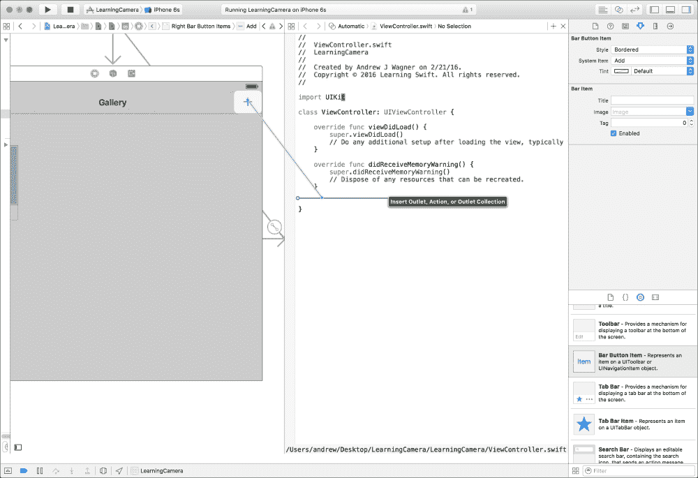

当你释放鼠标右键时，会出现一个小窗口。在那里你应该从**连接**菜单中选择**操作**，并输入`didTapTakePhotoButton`。当你点击**连接**时，Xcode 会为你创建一个新的方法并将其连接到按钮。你知道它已经连接，因为方法左侧有一个填充的灰色圆圈。现在，每次用户点击按钮时，这个方法都会被执行。请注意，这个方法在其开头有`@IBAction`。这是连接到界面元素的任何方法都需要的东西。

我们希望这个方法向用户提供一个拍照的界面。苹果为我们提供了一个名为`UIImagePickerController`的类，这使得这非常简单。我们只需要创建一个`UIImagePickerController`实例，将其配置为允许拍照，并将其呈现到屏幕上。代码看起来是这样的：

```swift
@IBAction func didTapTakePhotoButton(sender: AnyObject) {
    let imagePicker = UIImagePickerController()
    if UIImagePickerController.isSourceTypeAvailable(.Camera) {
        imagePicker.sourceType = .Camera
    }
    self.presentViewController(
        imagePicker,
        animated: true,
        completion: nil
    )
}
```

让我们分解这段代码。在第一行，我们创建了一个图片选择器。在第二行，我们通过使用`UIImagePickerController`的`isSourceTypeAvailable:`类方法来检查当前设备是否有摄像头。如果摄像头源可用，我们在第三行将其设置为图片选择器的源类型。否则，默认情况下，图片选择器允许用户从他们的照片库中选择图片。由于模拟器不支持拍照，所以在模拟应用时，你会看到一个图片选择器而不是摄像头。最后，最后一行要求我们的视图控制器通过在屏幕上动画显示来呈现我们的图片选择器。`presentViewController:animated:completion:`是`UIViewController`类实现的一个方法，它是我们的`ViewController`的父类，这使得我们能够轻松地呈现新的视图控制器。如果你运行应用并点击添加按钮，你会被要求允许访问照片，然后它会显示图片选择器。你可以点击右上角的**取消**按钮，图片选择器控制器将被关闭。然而，如果你选择了一张照片，什么也不会发生。

我们需要编写一些代码来处理照片的选择。为了使这成为可能，图像选择器可以有一个代理，当选择图像时接收方法调用。我们将使我们的视图控制器成为图像选择器的代理并实现其协议。首先，我们必须在我们的操作方法中添加一行，将我们的视图控制器分配为图像选择器的代理。在调用显示图像选择器之前添加此行：

```swift
imagePicker.delegate = self
```

当我们这样做时，我们会得到一个编译器错误，说我们无法进行这个赋值，因为我们的视图控制器没有实现必要的协议。让我们来改变一下。我喜欢在每个文件中实现每个协议作为一个单独的扩展，以便更好地分离代码。我们需要根据错误实现`UIImagePickerControllerDelegate`和`UINavigationControllerDelegate`。在这两个协议中，对我们来说唯一重要的方法是当选择图像时被调用的方法。这让我们有了以下代码：

```swift
extension ViewController: UINavigationControllerDelegate {}

extension ViewController: UIImagePickerControllerDelegate {
    func imagePickerController(
        picker: UIImagePickerController,
        didFinishPickingImage image: UIImage!,
        editingInfo: [NSObject : AnyObject]!
        )
    {
        self.dismissViewControllerAnimated(true, completion: nil)
    }
}
```

我们对`UINavigationControllerDelegate`代理的实现是空的，但我们有一个简单的`imagePickerController:picker:didFinishPickingImage:editingInfo:`方法的实现。这就是我们将添加我们的处理代码的地方，但现在，我们只是关闭显示的视图控制器，将用户返回到上一个屏幕。这个方法并不强迫我们指定我们要关闭的视图控制器，因为视图控制器已经知道它正在显示哪个视图控制器。现在，如果你运行应用程序并选择一张照片，你将返回到上一个屏幕，但不会发生其他任何事情。为了使照片发生有意义的事情，我们必须放置大量的其他代码。我们必须保存图片并实现我们的视图控制器，以便在集合视图中显示图片。

# 临时保存照片

首先，我们只关心在内存中临时存储我们的图片。为此，我们可以将一个图像数组添加为视图控制器的一个属性：

```swift
class ViewController: UIViewController {

    var photos = [UIImage]()

    // ...
}
```

正如我们在图像选择器代理方法中看到的，UIKit 提供了一个可以表示图像的类`UIImage`。我们的`photos`属性可以存储这些实例的数组。这意味着当我们收到回调时，我们的第一步是向我们的属性添加新的图像：

```swift
    func imagePickerController(
        picker: UIImagePickerController,
        didFinishPickingImage image: UIImage!,
        editingInfo: [NSObject : AnyObject]!
        )
    {
        self.photos.append(image)
        self.dismissViewControllerAnimated(true, completion: nil)
    }
```

现在每次用户拍摄或选择一张新照片，我们都会将其添加到我们的列表中，该列表存储所有图像在内存中。然而，这还不够，我们还想为每张照片要求一个标签。

为了支持这个功能，让我们创建一个新的结构体叫做 `Photo`，它包含一个图像和标签属性。在这个阶段，我会通过在 `LearningCamera` 文件夹上右键点击并选择 **New Group** 来创建三个组：Model、View 和 Controller。我会将 `ViewController.swift` 移动到 **Controller** 组中，然后通过在 **Model** 组上右键点击并选择 **New File…** 来创建一个新的 `Photo.swift` 文件。一个简单的 **Swift File** 就可以了。

你应该在那个文件中定义你的照片结构：

```swift
import UIKit

struct Photo {
    let image: UIImage
    let label: String
}
```

我们必须导入 UIKit，因为它是定义 `UIImage` 的地方。我们的结构体的其余部分都很直接，因为它只定义了我们想要的两个属性。默认初始化器现在就足够了。

现在，我们可以回到我们的 `ViewController.swift` 文件，并将我们的 `photos` 属性更新为 `Photo` 类型而不是 `UIImage`：

```swift
var images = [Photo]()
```

这现在给我们带来了一个新的问题。我们如何请求用户为图像提供标签？让我们在一个标准的提示框中这样做。为了显示提示框，UIKit 有一个名为 `UIAlertController` 的类。为了使用它，我们可能需要重新设计我们的函数。UIKit 不允许你从同一个视图控制器在同一时间显示多个视图控制器。这意味着我们必须先关闭照片选择器，等待其完成后再显示我们的提示框：

```swift
self.dismissViewControllerAnimated(true) {
    // Ask User for Label

    let alertController = UIAlertController(
        title: "Photo Label",
        message: "How would you like to label your photo?",
        preferredStyle: .Alert
    )

    alertController.addTextFieldWithConfigurationHandler()
    {
        textField in
        let saveAction = UIAlertAction(
            title: "Save",
            style: .Default
            ) { action in
            let label = textField.text ?? ""
            let photo = Photo(image: image, label: label)
            self.photos.append(photo)
        }
        alertController.addAction(saveAction)
    }

    self.presentViewController(
        alertController,
        animated: true,
        completion: nil
     )
}
```

让我们分解这段代码，因为它有些复杂。首先，我们使用了尾随闭包语法来调用 `dismissViewControllerAnimated:completion:` 方法。这个闭包在视图控制器完成动画离开屏幕后被调用。

接下来，我们创建了一个带有标题、消息和 `Alert` 样式的提示框控制器。在我们能够显示提示框之前，我们必须使用一个文本框和一个保存操作来配置它。我们首先添加文本框，并在 `addTextFieldWithConfigurationHandler:` 上再次使用尾随闭包。这个闭包被调用以给我们机会配置文本框。我们接受默认设置，但我们将想要知道在保存时文本框中的文本，这样我们就可以在这个提示框中直接创建保存操作，从而避免以后获取其引用的麻烦。

提示框的每个操作都必须是 `UIAlertAction` 类型。在这种情况下，我们创建了一个标题为 `Save` 并具有默认样式的操作。`UIAlertAction` 构造函数的最后一个参数是一个闭包，当用户选择该操作时会被调用。同样，我们使用了尾随闭包语法。

在那个回调内部，我们从文本框中获取文本，并使用它以及我们的图像来创建一个新的 `Photo` 实例，并将其添加到我们的 `photos` 数组中。

最后，我们必须将我们的保存操作添加到提示框控制器中，然后显示提示框控制器。

现在如果你运行应用程序，它会在选择照片后要求你为每个照片提供一个标签，但它看起来仍然没有显示出来，因为我们还没有显示保存的照片。这是我们下一个任务。

# 填充我们的照片网格

现在我们正在维护一个照片列表，我们需要在集合视图中显示它。集合视图通过提供实现其 `UICollectionViewDataSource` 协议的数据源来填充。最常见的事情可能是让视图控制器成为数据源。我们可以通过重新打开 `Main.storyboard` 并 *控制* 拖动从集合视图到视图控制器来实现这一点：

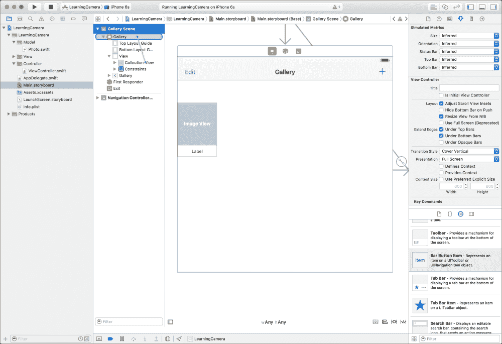

当你松开鼠标时，从菜单中选择 **dataSource**。之后，我们只需要实现数据源协议。我们需要实现的两个方法是 `collectionView:numberOfItemsInSection:` 和 `collectionView:cellForItemAtIndexPath:`。前者允许我们指定应该显示多少个单元格，后者允许我们为列表中的特定索引自定义每个单元格。我们很容易返回我们想要的单元格数量：

```swift
extension ViewController: UICollectionViewDataSource {
    func collectionView(
        collectionView: UICollectionView,
        numberOfItemsInSection section: Int
        ) -> Int
    {
        return self.photos.count
    }
}
```

我们只需要返回我们 `photos` 属性中的元素数量。

配置单元格需要更多的准备工作。首先，我们需要创建自己的单元格子类，以便可以引用在故事板中创建的图像和标签。所有集合视图单元格都必须是 `UICollectionViewCell` 的子类。让我们称它为 `PhotoCollectionViewCell` 并在 **View** 组中为它创建一个新文件。就像我们需要从故事板到我们的代码中建立点击添加按钮的连接一样，我们还需要为图像和标签建立连接。然而，这是一种不同类型的连接。这种类型的连接不是动作，而被称为输出，它将对象作为属性添加到视图控制器中。我们可以使用与动作相同的点击和拖动技术，但这次我们将自己提前设置代码：

```swift
import UIKit

class PhotoCollectionViewCell: UICollectionViewCell {
    @IBOutlet var imageView: UIImageView!
    @IBOutlet var label: UILabel!
}
```

在这里，我们指定了两个属性，每个属性都有一个前缀 `@IBOutlet`。这个前缀允许我们在 Interface Builder 中建立连接，就像我们处理数据源时做的那样。这两种类型都被定义为隐式解包的可选类型，因为这些连接在实例初始化时无法设置。相反，它们在加载视图时建立连接。

现在我们已经设置了环境，我们可以回到故事板并建立连接。目前这个单元格仍然只是一个通用单元格的类型，所以首先我们需要将其更改为我们的类。在左侧视图层次结构中找到单元格，并点击它。选择**视图** | **实用工具** | **显示识别检查器**。在这个检查器中，我们可以在类字段中输入`PhotoCollectionViewCell`来设置单元格的类。现在，如果你导航到**视图** | **实用工具** | **显示连接检查器**，你会看到我们的两个输出列在可能连接中列出。点击并从**imageView**旁边的空心灰色圆圈拖动到单元格中的图像视图：

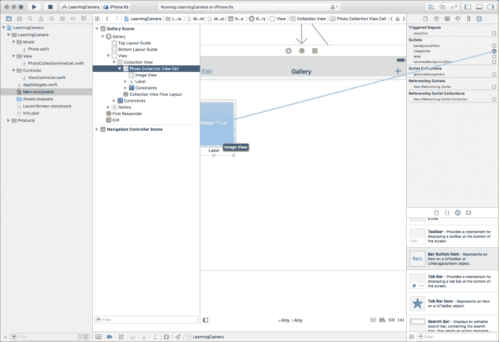

一旦你松开鼠标，连接就会建立。用同样的方法对之前创建的**标签**连接进行操作。我们还需要为我们的单元格设置一个重用标识符，这样我们就可以在代码中引用这个模板。你可以通过返回属性检查器并在**标识符**文本字段中输入`DefaultCell`来完成此操作：

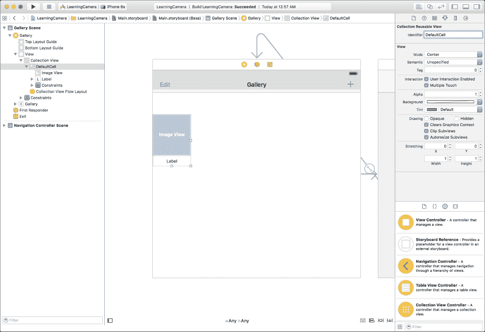

我们还需要在视图控制器内部获取集合视图的引用。这是因为每次保存照片时，我们都需要要求集合视图添加一个单元格。你可以通过编写代码或通过右键单击并从集合视图拖动到代码来实现这一点。无论如何，你应该在视图控制器上得到一个类似这样的属性：

```swift
class ViewController: UIViewController {
    @IBOutlet var collectionView: UICollectionView!

    // ... 
}
```

然后，我们就准备好实现剩余的数据源方法：

```swift
extension ViewController: UICollectionViewDataSource {
    // ...

    func collectionView(
        collectionView: UICollectionView,
        cellForItemAtIndexPath indexPath: NSIndexPath
        ) -> UICollectionViewCell
    {
        let cell = collectionView
            .dequeueReusableCellWithReuseIdentifier(
            "DefaultCell",
            forIndexPath: indexPath
            ) as! PhotoCollectionViewCell

        let photo = self.photos[indexPath.item]
        cell.imageView.image = photo.image
        cell.label.text = photo.label

        return cell
    }
}
```

这个实现的第 一行要求集合视图提供一个带有我们的`DefaultCell`标识符的单元格。为了完全理解这一点，我们需要稍微了解一些集合视图的工作原理。集合视图被设计成可以处理几乎任何数量的单元格。我们可能想要一次性显示成千上万的单元格，但一次在内存中拥有成千上万的单元格是不可能的。相反，集合视图会自动重用已经滚动出屏幕的单元格以节省内存。我们无法知道从这个调用中获取的单元格是新的还是重用的，所以我们必须始终假设它正在被重用。这意味着在这个方法中对单元格所做的任何配置，都必须在每次调用时重置，否则，一些旧配置可能仍然存在。我们通过将结果转换为我们的`PhotoCollectionViewCell`类来结束这个调用，这样我们就可以正确地配置我们的子视图。

我们的第二行是从我们的列表中获取正确的照片。`indexPath`变量上的`item`属性是我们用来配置单元格的照片的索引。任何时候，都可以用零到我们之前数据源方法返回的数字之间的任何索引调用此方法。这意味着在我们的情况下，它将始终是`photos`数组中的数字，因此可以安全地假设索引在其范围内。

接下来的两行根据照片设置图像和标签，最后，最后一行返回该单元格，以便集合视图可以显示它。

在这一点上，如果你运行了应用程序并添加了一张照片，你仍然什么也看不到，因为当向照片数组添加元素时，集合视图不会自动重新加载数据。这是因为`collectionView:numberOfItemsInSection:`方法是一个回调。回调只有在其他代码启动它时才会被调用。此方法在集合视图首次加载时调用一次，但我们必须手动请求它再次调用。最简单的方法是在我们向列表添加照片时在集合视图上调用`reloadData`。这会导致所有数据和单元格再次加载。然而，这看起来并不好，因为单元格会突然出现。相反，我们希望使用`insertItemsAtIndexPaths`方法。当正确使用时，这将导致单元格以动画方式出现在屏幕上。使用此方法时需要记住的重要事情是，你必须在`collectionView:numberOfItemsInSection:`返回插入后的更新数量之后调用它。这意味着我们必须在我们已经将照片添加到我们的属性之后调用它：

```swift
let saveAction = UIAlertAction(
    title: "Save",
    style: .Default
    ) { action in
    let label = textField.text ?? ""
    let photo = Photo(image: image, label: label)
    self.photos.append(photo)

    let indexPath = NSIndexPath(
        forItem: self.photos.count - 1,
        inSection: 0
    )
    self.collectionView.insertItemsAtIndexPaths([indexPath])
}
```

这里的最后两行是新的。首先，我们为要插入新项的位置创建一个索引路径。索引路径由项和部分组成。我们所有的项都存在于单个部分中，因此我们可以将其始终设置为零。我们希望项的总数减一，因为我们刚刚将其添加到列表的末尾。最后一行只是调用接受索引路径数组作为参数的插入项方法。

现在，你可以运行你的应用程序，所有保存的照片都将显示在集合视图中。

# 重构以尊重模型-视图-控制器

我们已经在我们的应用程序的核心功能上取得了一些进展。然而，在我们继续前进之前，我们应该反思我们所编写的代码。最终，我们实际上并没有编写很多代码行，但它肯定可以改进。我们代码的最大缺点是我们将大量业务逻辑放在了视图控制器中。这不是我们不同模型、视图和控制器层之间的良好分离。让我们利用这个机会将此代码重构为单独的类型。

我们将创建一个名为 `PhotoStore` 的类，该类将负责存储我们的照片，并将实现数据源协议。这意味着将一些代码从我们的视图控制器中移出。

首先，我们将照片的属性移动到照片存储类中：

```swift
import UIKit

class PhotoStore: NSObject {
    var photos = [Photo]()
}
```

注意，这个新的照片存储类继承自 `NSObject`。这对于我们能够完全满足 `UICollectionViewDataSource` 协议是必要的，这是我们下一个任务。

我们可以将代码从我们的视图控制器简单地移动到这个类中，但我们不希望我们的模型直接处理我们的视图层。当前的实现创建并配置我们的集合视图单元格。让我们允许视图控制器仍然处理它，通过提供我们自己的回调，当我们需要给定照片的单元格时。为此，我们首先需要添加一个回调属性：

```swift
class PhotoStore: NSObject {
    var photos = [Photo]()
    var cellForPhoto:
        (Photo, NSIndexPath) -> UICollectionViewCell

    init(
        cellForPhoto: (Photo,NSIndexPath) -> UICollectionViewCell
        )
    {
        self.cellForPhoto = cellForPhoto

        super.init()
    }
}
```

我们现在需要提供一个初始化器，这样我们就可以获取回调函数。接下来，我们必须调整我们的数据源实现，并将它们放入这个新类中：

```swift
extension PhotoStore: UICollectionViewDataSource {
    func collectionView(
        collectionView: UICollectionView,
        numberOfItemsInSection section: Int
        ) -> Int
    {
        return self.photos.count
    }

    func collectionView(
        collectionView: UICollectionView,
        cellForItemAtIndexPath indexPath: NSIndexPath
        ) -> UICollectionViewCell
    {
        let photo = self.photos[indexPath.item]
        return self.cellForPhoto(photo, indexPath)
    }
}
```

`collectionView:numberOfItemsInSection:` 方法仍然可以只返回我们数组中的照片数量，但 `collectionView:cellForItemAtIndexPath:` 是通过回调来实现的，而不是创建一个单元格本身。

我们需要添加到这个类的第二件事是保存照片的能力。让我们添加一个方法来接受一个新的图像和标签，并返回应该添加的索引路径：

```swift
func saveNewPhotoWithImage(
    image: UIImage,
    labeled label: String
    ) -> NSIndexPath
{
    let photo = Photo(image: image, label: label)
    self.photos.append(photo)
    return NSIndexPath(
       forItem: self.photos.count - 1,
       inSection: 0
    )
}
```

这看起来与我们在视图控制器中编写的代码相同，但分离得更好。

现在我们的照片存储已经完成，我们只需更新我们的视图控制器以使用它而不是旧的实现。首先，让我们在 `ViewController` 中添加一个照片存储属性，它是一个隐式解包的可选值，这样我们就可以在视图加载后创建它：

```swift
    var photoStore: PhotoStore!
```

要在 `viewDidLoad` 中创建我们的照片存储，我们将调用照片存储初始化器，并传递一个可以创建单元格的闭包。为了清晰起见，我们将定义这个闭包为一个单独的方法：

```swift
func createCellForPhoto(
    photo: Photo,
    indexPath: NSIndexPath
    ) -> UICollectionViewCell
{
    let cell = self.collectionView
        .dequeueReusableCellWithReuseIdentifier(
        "DefaultCell",
        forIndexPath: indexPath
        ) as! PhotoCollectionViewCell

    cell.imageView.image = photo.image
    cell.label.text = photo.label

    return cell
}
```

这个方法看起来几乎与我们的旧 `collectionView:cellForItemAtIndexPath:` 实现相同；唯一的区别是我们已经有一个对正确照片的引用。

此方法允许我们的 `viewDidLoad` 实现非常简单。我们所需做的只是用对这个方法的引用初始化照片存储，并使其成为集合视图的数据源：

```swift
override func viewDidLoad() {
    super.viewDidLoad()
    self.photoStore = PhotoStore(
        cellForPhoto: self.createCellForPhoto
    )
    self.collectionView.dataSource = self.photoStore
}
```

最后，我们只需更新保存操作以使用照片存储：

```swift
let saveAction = UIAlertAction(
    title: "Save",
    style: .Default
    ) { action in
    let label = textField.text ?? ""
    let indexPath = self.photoStore.saveNewPhotoWithImage(
        image,
        labeled: label
    )
    self.collectionView.insertItemsAtIndexPaths([indexPath])
}
```

你可以再次运行应用程序，它将像以前一样操作，但现在我们的代码是模块化的，这将使未来的任何更改都更容易。

# 永久保存照片

我们的应用程序在保存图片方面工作得相当不错，但一旦应用程序退出，所有照片都会丢失。我们需要添加一种永久保存照片的方法。我们对代码的重构使我们现在主要在模型层工作。

在编写任何代码之前，我们必须决定我们将如何永久存储照片。我们可以选择多种方式来保存照片，但其中一种最简单的方式是将它们保存到文件系统中，这是我们构思阶段所设想的方式。每个应用程序都提供了一个文档目录，作为正常备份的一部分，操作系统会自动备份。我们可以将照片存储在那里，以用户提供的标签命名的文件命名。为了避免任何与重复标签相关的问题，即我们会有多份同名文件，我们可以将每个文件嵌套在以保存照片的时间命名的子目录中。时间戳总是唯一的，因为我们永远不会在完全相同的时间保存两张照片。

现在我们已经决定了这一点，我们可以开始更新我们的照片存储代码。首先，我们希望有一个简单的方法来使用一致的目录进行保存。我们可以通过添加一个名为 `getSaveDirectory` 的方法来实现这一点。这个方法可以是私有的，并且按照惯例，我喜欢将私有代码分组在私有扩展中：

```swift
private extension PhotoStore {
    func getSaveDirectory() throws -> NSURL {
        let fileManager = NSFileManager.defaultManager()
        return try fileManager.URLForDirectory(
            .DocumentDirectory,
            inDomain: .UserDomainMask,
            appropriateForURL: nil,
            create: true
        )
    }
}
```

这段代码首先从名为 `NSFileManager` 的苹果提供类中获取表示文档目录的 URL。你可能注意到 `NSFileManager` 有一个共享实例，可以通过 `defaultManager` 类方法访问。然后我们调用 `URLForDirectory` 方法，给它提供信息表明我们想要当前用户的文档目录，并返回结果。请注意，这个方法可能会抛出错误，所以我们标记了自己的方法为抛出错误，并且不允许任何错误传播。

现在我们可以继续将所有添加的图片保存到磁盘上。我们需要完成的事情有很多。首先，我们需要获取当前的时间戳。我们可以通过创建一个 `NSDate` 实例，请求时间戳，并使用字符串插值将其转换为字符串来完成：

```swift
let timeStamp = "\(NSDate().timeIntervalSince1970)"
```

`NSDate` 实例可以代表任何日期上的任何时间。默认情况下，所有 `NSDate` 实例都是创建来表示当前时间的。

接下来，我们想要将这个路径附加到我们的保存目录上，以获取我们将要保存文件的路径。为此，我们可以使用 `NSURL` 的 `URLByAppendingPathComponent:` 方法：

```swift
let fullDirectory = directory.URLByAppendingPathComponent(
    timestamp
    )
```

这将确保如果还没有添加，正确的路径斜杠会被添加。现在我们需要确保在尝试将文件保存到该目录之前，这个目录已经存在。这是通过 `NSFileManager` 上的一个方法来完成的：

```swift
NSFileManager.defaultManager().createDirectoryAtURL(
    fullDirectory,
    withIntermediateDirectories: true,
    attributes: nil
)
```

如果有错误，这个方法可能会抛出异常，我们稍后会需要处理它。如果目录已经存在，这仍然被视为成功。一旦我们确信目录已经创建，我们就会想要创建一个指向特定文件的路径，使用标签文本：

```swift
let fileName = "\(self.label).jpg"
let filePath = fullDirectory
    .URLByAppendingPathComponent(fileName)
```

在这里，我们使用了字符串插值来给文件名添加 `.jpg` 扩展名。

最重要的是，我们需要将我们的图像转换为可以保存到文件中的数据。为此，UIKit 提供了一个名为`UIImageJPEGRepresentation`的函数，它接受`UIImage`并返回一个`NSData`实例：

```swift
let data = UIImageJPEGRepresentation(self.image, 1)
```

第二个参数是一个介于零和一之间的值，表示我们想要的压缩质量。在这种情况下，我们希望以全质量保存文件，所以我们使用 1。然后它返回一个可选数据实例，因此我们需要处理它返回 nil 的情况。

最后，我们需要将数据保存到我们创建的文件路径：

```swift
data.writeToURL(filePath, atomically: true)
```

在`NSData`上的这种方法简单来说就是接收一个文件路径和一个布尔值，表示我们是否希望在覆盖任何现有文件之前将其写入临时位置。它还会根据是否成功返回`true`或`false`。与目录创建不同，如果文件已存在，这将失败。然而，由于我们使用的是当前时间戳，这应该永远不会成为问题。

让我们将所有这些逻辑组合到我们的照片结构上的一个方法中，我们可以稍后使用它将其保存到磁盘，如果发生错误则抛出错误：

```swift
struct Photo {
    // ...

    enum Error: String, ErrorType {
        case CouldntGetImageData = "Couldn't get data from image"
        case CouldntWriteImageData = "Couldn't write image data"
    }

    func saveToDirectory(directory: NSURL) throws {
        let timeStamp = "\(NSDate().timeIntervalSince1970)"
        let fullDirectory = directory
            .URLByAppendingPathComponent(timeStamp)
        try NSFileManager.defaultManager().createDirectoryAtURL(
            fullDirectory,
            withIntermediateDirectories: true,
            attributes: nil
        )
        let fileName = "\(self.label).jpg"
        let filePath = fullDirectory
            .URLByAppendingPathComponent(fileName)
        if let data = UIImageJPEGRepresentation(self.image, 1) {
            if !data.writeToURL(filePath, atomically: true) {
                throw Error.CouldntWriteImageData
            }
        }
        else {
            throw Error.CouldntGetImageData
        }
    }
}
```

首先，我们定义一个嵌套枚举来表示我们的可能错误。然后我们定义一个方法来接受应该保存的根级目录。我们允许目录创建的任何错误传播。如果数据返回 nil 或`writeToURL:automatically:`方法失败，我们还需要抛出我们的错误。

现在，我们需要更新我们的`saveNewPhotoWithImage:labeled:`方法，以使用`saveToDirectory:`方法。最终，如果在保存照片时抛出错误，我们希望向用户显示一些内容。这意味着这个方法只需要传播错误，因为模型不应该向用户显示内容。这导致以下代码：

```swift
func saveNewPhotoWithImage(
    image: UIImage,
    labeled label: String
    ) throws -> NSIndexPath
{
    let photo = Photo(image: image, label: label)
    try photo.saveToDirectory(self.getSaveDirectory())
    self.photos.append(photo)
    return NSIndexPath(
        forItem: self.photos.count - 1,
        inSection: 0
    )
}
```

如果保存到目录失败，我们将跳过方法的其余部分，这样我们就不会将其添加到我们的照片列表中。这意味着我们需要更新调用它的视图控制器代码以处理错误。首先，让我们添加一个方法，使其能够轻松地显示一个带有给定标题和消息的错误：

```swift
func displayErrorWithTitle(title: String?, message: String) {
    let alert = UIAlertController(
        title: title,
        message: message,
        preferredStyle: .Alert
    )
    alert.addAction(UIAlertAction(
        title: "OK",
        style: .Default,
        handler: nil
    ))
    self.presentViewController(
        alert,
        animated: true,
        completion: nil
    )
}
```

这个方法很简单。它只是创建一个带有 OK 按钮的警报，然后显示它。接下来，我们可以添加一个函数来显示我们预期会遇到的任何类型的错误。它将接受一个弹出警报的标题，这样我们就可以为产生它的场景定制显示的错误：

```swift
func displayError(error: ErrorType, withTitle: String) {
    switch error {
    case let error as NSError:
        self.displayErrorWithTitle(
            title,
            message: error.localizedDescription
        )
    case let error as Photo.Error:
        self.displayErrorWithTitle(
            title,
            message: error.rawValue
        )
    default:
        self.displayErrorWithTitle(
            title,
            message: "Unknown Error"
        )
    }
}
```

我们期望的是来自 Apple API 的内置错误类型`NSError`，或者我们在我们的照片类型中定义的错误类型。Apple 错误的本地化描述属性仅创建设备当前配置的区域的描述。我们还通过仅将其报告为未知错误来处理任何其他错误场景。

我还会将我们的保存操作创建提取到一个单独的方法中，这样当我们添加 do-catch 块时，就不会使事情过于复杂。这将会非常类似于我们之前的代码，但我们将在 `saveNewPhotoWithImage:labeled:` 的调用周围包裹一个 do-catch 块，并在抛出的任何错误上调用我们的错误处理方法：

```swift
func createSaveActionWithTextField(
    textField: UITextField,
    andImage image: UIImage
    ) -> UIAlertAction
{
    return UIAlertAction(
        title: "Save",
        style: .Default
        ) { action in
        do {
            let indexPath = try self.photoStore
               .saveNewPhotoWithImage(
                image,
                labeled: textField.text ?? ""
                )
            self.collectionView.insertItemsAtIndexPaths([indexPath]
            )
        }
        catch let error {
            self.displayError(
                error,
                withTitle: "Error Saving Photo"
            )
        }
    }
}
```

这就剩下我们需要更新 `imagePickerController:didFinishPickingImage:editingInfo:` 方法，以便使用我们新的保存操作创建方法：

```swift
// ..

alertController.addTextFieldWithConfigurationHandler()
{
    textField in
    let saveAction = self.createSaveActionWithTextField(
        textField,
        andImage: image
    )
    alertController.addAction(saveAction)
}

// ..
```

这完成了永久存储我们照片的第一部分。我们现在正在将图像保存到磁盘，但如果我们从磁盘上根本不加载它们，那就毫无意义。

要从磁盘加载图像，我们可以使用 `UIImage` 的 `contentsOfFile:` 初始化器，它返回一个可选的图像：

```swift
let image = UIImage(contentsOfFile: filePath.relativePath!)
```

要将我们的文件路径 URL 转换为字符串，这是初始化器所要求的，我们可以使用相对路径属性。

我们可以通过删除文件扩展名并获取路径的最后一个组件来获取照片的标签：

```swift
let label = filePath.URLByDeletingPathExtension?
    .lastPathComponent ?? ""
```

现在，我们可以将这个逻辑组合到我们的 `Photo` 结构体的初始化器中。为此，我们还需要创建一个简单的初始化器，它接受图像和标签，这样我们的其他代码在使用默认初始化器时仍然可以正常工作：

```swift
init(image: UIImage, label: String) {
    self.image = image
    self.label = label
}

init?(filePath: NSURL) {
    if let image = UIImage(
        contentsOfFile: filePath.relativePath!
        )
    {
        let label = filePath.URLByDeletingPathExtension?
            .lastPathComponent ?? ""
        self.init(image: image, label: label)
    }
    else {
        return nil
    }
}
```

最后，我们需要让图片存储库遍历文档目录中的文件，并对每个文件调用此初始化器。要遍历一个目录，`NSFileManager` 有一个 `enumeratorAtFilePath:` 方法。它返回一个具有 `nextObject` 方法的枚举器实例。每次调用它时，它都会返回原始目录内的下一个文件或目录。请注意，这将遍历它找到的每个子目录的所有子项。这是我们在第九章中看到的迭代器模式的一个很好的例子，*以 Swift 方式编写代码 – 设计模式和技术*。我们可以使用 `fileAttributes` 属性来确定当前对象是否是文件。所有这些都让我们能够编写一个像这样的 `loadPhotos` 方法：

```swift
func loadPhotos() throws {
    self.photos.removeAll(keepCapacity: true)

    let fileManager = NSFileManager.defaultManager()
    let saveDirectory = try self.getSaveDirectory()
    let enumerator = fileManager.enumeratorAtPath(
        saveDirectory.relativePath!
    )
    while let file = enumerator?.nextObject() as? String {
        let fileType = enumerator!.fileAttributes![NSFileType]
            as! String
        if fileType == NSFileTypeRegular {
            let fullPath = saveDirectory
                .URLByAppendingPathComponent(file)
            if let photo = Photo(filePath: fullPath) {
                self.photos.append(photo)
            }
        }
    }
}
```

在这个方法中，我们首先删除所有现有的照片。这是为了防止在照片已经存在时调用此方法。接下来，我们从保存目录创建一个枚举器。然后，我们使用一个 while 循环来继续获取每个下一个对象，直到没有剩余的对象。在循环内部，我们检查我们刚刚获取的对象是否实际上是一个文件。如果是，并且我们使用完整路径成功创建了照片，我们就将照片添加到我们的照片数组中。

最后，我们只需确保在适当的时间调用此方法来加载照片。考虑到我们希望能够在显示错误给用户之前完成这一操作，这是一个很好的时机。由于视图控制器有一个在视图加载后立即调用的方法，因此还有一个名为 `viewWillAppear:` 的方法，每次视图即将出现时都会被调用。在这里，我们可以加载照片，并使用我们的 `displayError:withTitle:` 方法向用户显示任何错误：

```swift
override func viewWillAppear(animated: Bool) {
    super.viewWillAppear(animated)

    do {
        try self.photoStore.loadPhotos()
        self.collectionView.reloadData()
    }
    catch let error {
        self.displayError(
            error,
            withTitle: "Error Loading Photos"
        )
    }
}
```

现在如果你运行应用程序，保存一些照片，然后退出，当你再次运行它时，之前保存的照片将仍然存在。我们已经完成了保存照片的功能！

# 摘要

这个应用程序远远不是我们可以上架的那种，但它让你对构建 iOS 应用程序的感觉有了很好的初步了解。我们已经介绍了如何构思一个应用程序，然后如何将其变为现实。我们知道如何在故事板中配置界面，如何运行它，我们还深入探讨了将照片临时和永久保存到磁盘以及在我们自己的自定义界面中显示这些照片的实用细节。我们甚至通过确保我们的代码尽可能遵循模型-视图-控制器设计模式来练习编写高质量代码。

尽管我们已经覆盖了很多内容，但这显然不足以立即编写任何其他 iOS 应用程序。关键是要了解应用程序开发过程是什么样的，并开始在一个 iOS 应用程序项目中感到更加自在。所有开发者都会花费大量时间在文档和互联网上搜索如何在任何特定平台上完成特定任务。关键在于能够从互联网或书籍中找到解决方案，确定最适合你用例的最佳方案，并将它们有效地集成到自己的代码中。随着时间的推移，你将能够独立完成更多任务，而无需查阅资料，但随着框架和平台的不断变化，这始终将是你的开发周期的一部分。

考虑到这一点，我现在挑战你完成我们构思的功能列表。找出如何删除图片，并添加你想要的任何其他功能、可用性调整或视觉调整。正如我之前所说，应用程序开发是一个全新的世界去探索。即使在这个简单的应用程序中，你也可以调整很多东西；所有这些都将帮助你学习很多。

在我们的最后一章中，我们将探讨你可以从这里开始，成为你所能成为的最佳 Swift 开发者。
