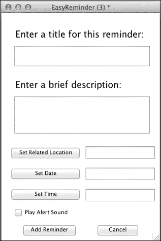

# 第六章. 制作提醒应用

*自我提醒…*

*待办事项、闹钟、生日提醒、笔记、购物清单，等等。应该有一个应用来保存所有保存列表的应用！在撰写这本书的时候，已经有超过 8000 个 iOS 应用是列表、计划或闹钟。或许，还有空间再增加一个…*

探索所有现有的提醒应用可能需要大量的研究和资金。大多数应用都会有你永远不会使用的许多功能，以及至少一个缺失的必要功能。如果你很幸运，一些应用组合可能能够完成你想要的提醒功能。然而，不要忘记你可以使用 LiveCode 并创建自己的提醒应用！

在本章中，我们将：

+   讨论一下“提醒”的含义

+   创建一些时间测量实用函数

+   定义一个数据结构来存储关于活动的信息

+   利用移动设备的“通知”

+   创建一个灵活的提醒应用

# 不同类型的提醒

这里是一些你可能称之为“提醒”的东西的列表：

+   购物清单

+   圣诞礼物清单

+   待办事项列表

+   闹钟

+   计时器

+   生日提醒

现在，有没有一种方法可以描述所有这些事情？嗯，可能会有些冗长，但提醒可以被描述为自动出现或在你查找时显示的通知消息或声音。它用于让你知道已经过去了一定时间，某个时刻已经到来，或者一个未完成的任务尚未完成。

看起来有点冗长。这样分解可以帮助我们看到提醒应用需要具备哪些功能。在深入探讨之前，让我们将这个定义与前面的例子进行对比：

**购物清单**：在这种情况下，你需要寻找提醒。尽管，我们可以设置它在你靠近商店时自动显示！除此之外，这实际上是一个尚未完成的任务。

**圣诞礼物清单**：这和购物清单差不多，但它可以使用一个定时消息来告诉你还有多少天可以购买圣诞礼物给你的亲人。

**待办事项列表**：再次强调，这仅仅是一个尚未完成的任务列表。

**闹钟**：这会给你一个通知，表明时间已经到达。

**计时器**：这是关于一定时间已经过去的通知，这可以用于烹饪伙伴应用中可能用到的此类事件的序列。

**生日提醒**：这显示了是否已经达到某个特定时刻。实际上，你希望设置提醒，以便在事件实际发生之前通知你。

至少作为一个起点，我们可以使用这个定义来指导我们概述应用需要具备的能力。

# 通知的时间安排

使用 LiveCode 可以创建的移动通知将在您请求发送的那一刻发送。奇怪的是，这个值是基于 1970 年 1 月 1 日午夜以来的秒数，具体来说，部分位于伦敦！嗯，它是以伦敦的一个地区命名的，称为格林威治。

**格林威治标准时间**，通常简称为**GMT**，已被用作测量时间的标准。它已被**UTC**（**协调世界时**）所取代，但无论如何，它至少代表格林威治所在时区的确切当前时间。我们其他人会从这个值中加上或减去一些时间。

为了适应地球围绕太阳转动的天数或四分之一天数的精确数，日历每四年调整一天，但不是在 100 年边界上，除非每 400 年（例如，2000 年是闰年）。这些调整仍然不足以保持时钟准确！时钟每年会慢大约 0.6 秒，因此会添加“闰秒”来补偿。理论上，闰秒可以用来减去一秒，但到目前为止，这还没有必要，因为它们只被用来添加一秒。

这一切都不会影响自 1970 年 1 月 1 日午夜以来的秒数，但这确实意味着使用您自己的算术将 LiveCode 的**秒**转换为时间和日期不会得到正确的时间。然而，它仍然用作通知的基础。这个值通常被称为 Unix 时间。

虽然如果您提前 25 秒发送生日祝福信息也不是很重要！不用担心，我们将计算通知时间的方式会处理这种异常。

## 日期和时间选择器

如前所述，移动通知使用自 1970 年 1 月 1 日午夜以来的秒数，并且不会添加自那时以来的 25 秒或闰秒。当我们向用户展示日期和时间选择器时，用户所做的选择将返回为实际当前或未来的时间。我们稍后会进行调整。

# 行动时间 - 创建日期和时间选择器

让我们再做一个测试堆栈，我们将使用它来尝试一些日期和时间选择器：

1.  创建一个新的 Mainstack，命名为`ReminderFunctions`，并保存堆栈。

1.  添加两个字段和两个新的按钮。

1.  命名一个字段为`dateinseconds`，另一个为`timeinseconds`。

1.  将按钮命名为`Pick Date`和`Pick Time`。

1.  将**选择日期**按钮的脚本设置为以下内容：

    ```java
    on mouseUp
      mobilePickDate date
      put the result into tDate
      convert tDate to seconds
      put tDate into field "dateinseconds"
    end mouseUp
    ```

1.  将**选择时间**按钮的脚本设置为以下内容：

    ```java
    on mouseUp
      mobilePickDate "time"
      put the result into tTime
      convert tTime to seconds
      put tTime into field timeinseconds
    end mouseUp
    ```

1.  设置独立应用程序设置，以便您可以在 iOS 或 Android 上进行测试。

1.  选择您的**测试目标**（在以下步骤中，您可以看到在这种情况下选择了 iPhone 模拟器）并执行**测试**。

1.  点击**选择日期**按钮。

1.  选择`2012 年 12 月 25 日`并点击**完成**。

1.  从 1970 年 1 月 1 日午夜到 2012 年圣诞节午夜的总秒数将显示在您创建的第一个字段中。

1.  点击**选择时间**按钮，将时间设置为`凌晨 1 点`。以下图像显示了 iOS 和 Android 模拟器上选择器的外观不同：

1.  点击**完成**，您将在右侧字段中看到从 1970 年 1 月 1 日午夜到您进行此测试当天凌晨 1 点的秒数。

## *刚才发生了什么？*

我们刚刚创建了两个简单的脚本，这些脚本调用原生的日期或时间选择器，并将结果转换为秒，然后在字段中显示它们。值得注意的是，对于选择时间的情况，它不会返回当前天的秒数，即自 1970 年 1 月 1 日午夜以来的所有秒数。为了设置特定日期特定时间的提醒时间，我们必须进行一些算术运算。我们将在本章的*制作提醒应用*部分稍后进行介绍。

## 快速测验 – OA（奇数缩写！）

您可能已经注意到，“协调世界时”的缩写是 UTC 而不是 CUT。为什么是这样？

1.  CUT 是一个过于常见的词。

1.  为了不冒犯法国人。

1.  缩写委员会成员是阅读障碍者。

答案：2

法国可能没有积极反对，但确实，UTC 的缩写是为了不与英语版本的短语具体匹配。它也与 UT0、UT1 等其他缩写很好地结合在一起。

# 在哪里？

在移动提醒应用中，我们可以做些在纸笔版提醒中永远无法做到的事情；我们可以根据您检查提醒时的位置来展示提醒列表！为了使用位置，您需要知道您现在在哪里以及您的位置与与提醒相关的地方有多远。

在撰写本书时，LiveCode 没有直接拉入地图的能力，以便您可以选择除您现在所在位置之外的其他位置。因此，我们将在这种限制下工作。

### 注意

话虽如此，有一个名为`mergMK`的外部工具（更多信息，请参阅[`mergext.com`](http://mergext.com)），它可以与 7.0 之前的 iOS 版本一起使用，并且在撰写本书时正在更新。您还可以使用文章中描述的 HTML 和 JavaScript 的组合，该文章位于[`stackoverflow.com/questions/25629786/fetch-data-from-html-file-in-livecode`](http://stackoverflow.com/questions/25629786/fetch-data-from-html-file-in-livecode)。然而，这些都不在本初学者的书籍范围之内。

在读取移动设备传感器时的一般技术是开始跟踪一个给定的传感器，检测何时发生变化，并停止跟踪该传感器。您可以在开始和停止跟踪命令之间的任何时间从传感器读取数据。您还可以指定您想要的报告的详细程度以及是否需要精确读取。位置的精确读取将决定是否使用了 GPS。使用 GPS 的优点是您可以获得更高的精度（假设当时信号清晰），缺点是它消耗更多的电量，并且没有 GPS 的设备无法使用此功能。当使用位置作为提醒的一部分时，我们主要关心的是您是否在家、办公室，或者可能在超市。因此，我们将使用不太精确的读取，GPS 的读取可能会过度。

# 是时候动手实践了——尝试原生位置跟踪

在本章的后面部分，我们将添加一个功能，允许应用程序用户添加一组收藏位置。目前，我们只是尝试基本功能。位置服务在模拟器中不起作用；您必须在真实设备上尝试此操作：

1.  使用前一步骤中的测试架栈，添加一个 `Get Location` 按钮和一个 `location` 字段。确保 `location` 字段与卡片窗口一样宽；它将显示三个长数字。

1.  将按钮的脚本设置为以下内容：

    ```java
    on mouseUp
      mobileStartTrackingSensor "location", true
      put mobileSensorReading("location", false) into field "location"
      mobileStopTrackingSensor "location"
    end mouseUp
    ```

1.  第二行中的 `true` 值定义了一个 *松散* 的值，表示我们不需要 GPS 的精度。第三行中的 `false` 值表示我们不需要返回详细的信息。

1.  前往 **独立应用程序设置** 并选择您的目标设备为 **iOS** 或 **Android**。

1.  对于 iOS，设置 **显示名称**、**内部应用程序 ID** 和 **配置文件**。选择您的设备和 SDK 版本）：

1.  此外，在 iOS 的 **要求和限制** 部分中，选择 **位置服务** 和 **GPS** 作为所需服务。在应用中，当 iOS 提示时，您也必须接受位置服务。

1.  对于 Android，设置 **标签**、**标识符** 和 **最低 Android 版本** 字段：

1.  此外，在 Android 设置的 **应用程序权限** 部分，确保您已请求获取 **粗略位置** 权限：

1.  选择 **保存独立应用程序** 并将应用安装到您的设备上。如果您需要关于如何操作的提醒，请参考 第二章，*LiveCode Mobile 入门*。

1.  在应用中，尝试点击**选择日期**和**选择时间**按钮，看看它们如何弹出原生控件，然后点击**获取位置**按钮。三个长数字应该出现在`location`字段中：

## *刚才发生了什么？*

如你所见，读取位置所需的代码非常少！如果这是一个跟踪应用，你需要保持跟踪开启，并拥有响应位置变化消息的功能，但对我们这个应用来说，我们只需要知道你在查看提醒列表时的位置。

位置字段中显示的数字是设备的纬度、经度和海拔。然而，我们将如何使用这些数字…？

## 计算地球上两点之间的距离

计划是使你的应用能够根据你现在的位置对提醒列表进行排序。假设你真的经常使用这个应用，并且有几十个提醒。你创建的关于购买面包的提醒可能位于列表底部，但如果你已经为那个提醒分配了超市的位置，当你在外面超市时排序列表应该会将购物清单项目带到顶部。

面对像这样的问题时，你将如何知道地球上两点之间的距离；Google 是你找到答案的好起点！只需进行很少的研究和时间就能找到：

[`www.movable-type.co.uk/scripts/latlong.html`](http://www.movable-type.co.uk/scripts/latlong.html)

这个网址上的文章讨论了计算这个值的原始公式，然后展示了一个 JavaScript 函数。如果你发现将方程转换为 LiveCode 处理程序很困难，你应该能够逐行将 JavaScript 转换为 LiveCode 的等效代码。

目前无需输入此代码，我们稍后会将其集成；然而，如果你想试一试，请将这些行放入堆栈脚本中：

```java
function distance lat1,lon1,lat2,lon2
  put 6371 into r
  put toRad((lat2-lat1)) into dLat
  put toRad((lon2-lon1)) into dLon
  put toRad(lat1) into lat1
  put toRad(lat2) into lat2
  put sin(dLat/2) * sin(dLat/2) + sin(dLon/2)*sin(dLon/2) * cos(lat1)*cos(lat2) into a
  put 2*atan2(sqrt(a),sqrt(1-a)) into c
  put r*c into d
  return d
end distance

function toRad pAngle
  return pAngle/180*PI
end toRad
```

在消息框中尝试以下操作：

```java
put distance(40,-74,51,0)
```

如下截图所示：


如前一个截图所示，你应该看到一个值为**5645.48065**。这两个位置位于纽约和伦敦附近，这个值将是地球表面上两点之间的距离（千米）。

## 快速问答 - 我的公寓在几楼？

查看截图（时间标记为“下午 6:53”，在之前的截图之前），考虑到我住的建筑离海平面不高，我住在哪一层？

1.  40 楼

1.  地下 73 楼

1.  11 楼

1.  我无家可归

答案：3

来自位置传感器的数字以纬度、经度和海拔高度返回。这将使设备当时的海拔高度约为 37.5 米，这太低了，不可能是 40 层。截图中有足够的信息让您知道它是在何时何地拍摄的！

# 提醒中需要的信息

我们已经知道了如何设置提醒通知的时间和时间，并且我们能够根据我们所在的位置对提醒进行排序。然而，提醒本身需要哪些具体信息？

如果这是一个生日提醒应用，你只需要询问人的名字和他们生日日期。如果是一个购物清单应用，你需要物品的名称和数量。对于计时器，你需要询问事件名称并设置事件的时间。

然而，我们在这里尝试制作一个完全灵活的提醒应用；用户可以以他们希望的方式描述项目。因此，我们只需要求用户提供标题和简要描述。我们还需要提供设置日期、时间、相关位置以及是否播放警报声音的选项。

另一件需要考虑的事情是；我们将把提醒列表的信息存储在哪里？在制作第四章中的 WebScraper 应用时，我们在“使用远程数据和媒体”中选择了将主应用程序堆栈复制到文档文件夹中，然后跳转到该堆栈的副本。这使得能够保存对堆栈的更改。提醒应用是一个更简单的情况；我们只是试图存储一些文本字符串来定义每个提醒，而使用这个应用直接写入文本文件会更简单。

我们希望允许用户创建位置列表，以便将提醒与该位置关联。而不是编写不同的文本文件，我们将每个条目中的第一条信息作为该条目的功能。目前，只有两个功能，即`位置`和`提醒`。以下是一个文本文件可能看起来像的示例：

```java
Location  Home  40.692636  -73.978376
Location  Office  40.745194  -73.985199
Reminder  Packt  Ask for more time!  1334548800  Home  false
Reminder  Boss  Buy lunch	1334592000  Office  true
```

每行中的项目之间有一个制表符，它将被用来分隔条目的各个部分。位置的格式如下：

+   功能：`位置`

+   位置标题

+   纬度

+   经度

对于提醒来说：

1.  功能：`提醒`

1.  标题

1.  简要描述

1.  自 1970 年 1 月 1 日午夜以来的通知时间（以秒为单位）

1.  与此提醒关联的位置

1.  是否播放警报声音（`true`或`false`）

# 制作提醒应用

好的，基础工作已经足够了！让我们开始制作提醒应用。我们不会在添加功能的同时添加任何脚本，而是首先制作创建应用**GUI**（**图形用户界面**）所需的各个卡片，然后再回去添加脚本。

## 布局卡片

我们将使堆栈的第一个卡片成为一个您可以查看当前提醒、按时间或位置排序以及添加新提醒和位置的地方。然后，我们将创建第二个卡片来输入位置详情，以及第三个卡片来输入新提醒的详情。

# 行动时间 – 创建提醒应用屏幕

这里显示的步骤将使用标准的 LiveCode 字段和按钮，但请随意使您的版本更具吸引力！

1.  创建一个新的 Mainstack，将其命名为 `EasyReminder` 并保存。其他名称，如 `Simple Reminders` 可能更具体，但如果您使用的是较旧的 iPhone，名称可能会太长。

1.  将卡片大小设置为您的设备大小。本节中显示的截图是基于较旧的 iPhone 大小的堆栈。

1.  前往 **独立应用程序设置** 并以我们在测试 **位置** 功能时相同的方式设置值。

1.  将第一个卡片的名称设置为 `home`。

1.  创建一个 **按时间排序** 按钮、一个 **按位置排序** 按钮、一个名为 `reminders` 的字段、另一个名为 `data` 的字段，以及两个名为 `Create Reminder…` 和 `Create Location…` 的按钮。

1.  添加一个名为 `Delete Location or Reminder` 的按钮。

1.  确保这两个字段都勾选了 **锁定文本** 和 **不换行** 复选框。

1.  您现在应该有一个看起来像以下截图的屏幕：

1.  创建一张新卡片，并将其命名为 `location`。

1.  添加一个字段并设置其内容为：`输入此位置的纬度和经度`。

1.  添加两个名为 `latitude` 和 `longitude` 的输入字段。

1.  创建一个名为 `Set to Current Location` 的按钮。

    ### 小贴士

    **避免拼写错误**

    虽然我们为您提供了一个手动输入位置的字段，但如果可能的话，请使用 **设置为当前位置** 按钮，或者至少在您当前的位置使用它，以查看所需的格式。

1.  添加另一个指示字段，内容为：`为此位置输入名称：`。

1.  添加一个名为 `location name` 的第三个输入字段。请注意，在屏幕较小的旧手机上，此字段位置需要靠近屏幕顶部，以免被键盘弹出窗口覆盖。

1.  最后，添加一个名为 `Add Location` 和 `Cancel` 的按钮。

1.  对于这张卡片，所有三个字段都需要取消勾选 **锁定文本** 复选框。

1.  此卡片应看起来像以下截图：

1.  创建第三个卡片并将其命名为 `reminder`。

1.  添加两个指示字段，内容分别为：`为此提醒输入标题：` 和 `输入简要描述：`。

1.  创建两个名为 `title` 的输入字段。

1.  创建三个按钮，分别命名为 `Set Related Location`、`Set Date` 和 `Set Time`。

1.  在这些按钮旁边添加三个字段，这些字段将用于向用户显示他们所做的选择已发生。将字段命名为 `location field`、`date field` 和 `time field`。

1.  创建一个名为 `Play Alert Sound` 的复选框按钮。

1.  最后，创建两个名为 `Add Reminder` 和 `Cancel` 的按钮。

1.  将所有这些元素排列成以下截图所示的样子：

## *发生了什么？*

我们已经为应用功能制作了所有必要的屏幕。这是简单的一步。只需等待你看到将要进行的输入量！

## 栈级别脚本

前面有一大段代码。逐个功能描述会让我们四处跳跃，这可能会在某些情况下增加现有脚本的复杂性，我们很容易在这种情况中迷失方向。所以，我们不会那样做，而是每次查看一个卡片的代码，以及进入栈脚本的处理器。这主要在 *开始行动* 部分展示，主要是为了给你提供休息的机会！现在，我们不再拖延，直接展示栈脚本…

# 开始行动 - 添加栈级别函数

对于这个应用，我们将在卡片本身的按钮中放置一些逻辑，但这仍然留下了一大堆需要放入栈脚本中的内容。为了减少压力，我们将一次展示一个或两个函数，并在接下来的步骤中解释任何有趣之处：

1.  打开栈脚本。

1.  输入以下处理程序：

    ```java
    on openstack
      if the platform is "iphone" then iPhoneSetKeyboardReturnKey "done"
      readdata
      showdata
    end openstack

    on returnInField
      focus on nothing
    end returnInField
    ```

    ### 注意

    Android 操作系统的键盘通常有一个专门的按钮用于关闭键盘。在 iOS 上，情况并非如此，因为原本应该放置 *Return* 键的按钮可能显示一个特殊词，例如 *发送* 或 *完成*。不幸的是，我们正在输入能够接受回车字符的字段。为了解决这个问题，我们将回车按钮设置为显示 *完成*，这样当按下该按钮时，用户就会期待键盘消失。我们还将捕获 `returnInField` 消息，并利用它来实际关闭键盘。

1.  接下来，输入将读取和写入设备文档文件夹中提醒列表文本文件的函数：

    ```java
    on writedata
      global gReminderData
      put specialFolderPath("documents") & "/reminders.txt" into tRemindersPath
      if gReminderData is empty then put "no entries yet" into gReminderData
      open file tRemindersPath
      write gReminderData to file tRemindersPath
      close file tRemindersPath
      clearnotifiers
      setupnotifiers
    end writedata

    on readdata
      global gReminderData
      put specialFolderPath("documents") & "/reminders.txt" into tRemindersPath
      if there is a file tRemindersPath then
         open file tRemindersPath
         read from file tRemindersPath until eof
         close file tRemindersPath
         put it into gReminderData
      else
         open file tRemindersPath
         write "no entries yet" to file tRemindersPath
         close file tRemindersPath
         put "no entries yet" into gReminderData
      end if
    end readdata
    ```

    ### 注意

    这两个函数正在使用 LiveCode 直接读取和写入文本文件的能力。请注意，`specialFolderPath` 正在被用来帮助确定文件将保存的位置。即使在桌面机器上进行测试，这也同样有效。LiveCode 字典显示了所有特殊文件夹路径的完整列表，包括许多不适用于移动应用的情况。

1.  你可以将以下 `showdata` 函数放入主卡片脚本中，但将其放在栈级别可以使其靠近与之相关的其他函数。现在就输入它：

    ```java
    on showdata
      global gReminderData
      go card "home"
      put empty into field "reminders"
      put gReminderData into field "data"
      if gReminderData = "no entries yet" then
        exit showdata
      end if
      set the itemdelimiter to tab
      put 1 into tLineNumber
      repeat with a = 1 to the number of lines in gReminderData
        put line a of gReminderData into tEntry
        if item 1 of tEntry = "Reminder" then
          put item 2 of tEntry into tTitle
          put item 3 of tEntry into tDescription
          put item 4 of tEntry into tNotificationTime
          convert tNotificationTime from seconds to abbreviated time and long date
          put item 5 of tEntry into tLocationName
          put tTitle & ":" && tDescription && tNotificationTime && tLocationName into line tLineNumber of field "reminders"
          add 1 to tLineNumber
        end if
      end repeat
    end showdata
    ```

    ### 注意

    如果你还记得之前的示例文本文件，`showdata`函数会取每一行，并将制表符分隔的项拆分成信息块以呈现给用户。一个巧妙的技巧是将通知时间，即一个长秒数，转换为可读形式，显示通知的日期和时间。`data`字段用于显示已保存的原始数据。在最终应用程序中，你不会显示这个，但检查提醒信息是否正确是很有用的。

1.  Stack 脚本中的最后几个函数用于设置通知本身：

    ```java
    on clearnotifiers
      mobileCancelAllLocalNotifications
    end clearnotifiers

    on setupnotifiers
      global gReminderData
      if gReminderData = "no entries yet" then exit setupnotifiers
      set the itemdelimiter to tab
      repeat with a = 1 to the number of lines in gReminderData
        put line a of gReminderData into tEntryDetails
        if item 1 of tEntryDetails = "Reminder" then
          put item 2 of tEntryDetails && "-" && item 3 of tEntryDetails into alertBody
          put "OK" into alertButtonMessage
          put tEntryDetails into alertPayload
          put item 4 of tEntryDetails into alertTime
          put item 6 of tEntryDetails into playSound
          mobileCreateLocalNotification alertBody, alertButtonMessage, alertPayload, alertTime, playSound
        end if
      end repeat
    end setupnotifiers

    on localNotificationReceived pMsg
      answer "Local Notification:" && pMsg
    end localNotificationReceived
    ```

    ### 注意

    许多使用通知的移动应用永远不会清除它们。一般来说，可能不需要清除。一旦它们过去，它们就会永远消失！好吧，并不总是这样。有时，你会在通知到来之前进入一个应用，然后完成任务，但随后会因你已完成的任务而受到通知的打扰！在我们的应用中，我们会清除所有到期的通知，并重新创建整个列表。这样，你删除的任何内容都不会在以后回来困扰你。为了帮助调试，`alertPayload`会被填充整个提醒条目，并在通知到来时显示给你。

## *刚才发生了什么？*

除了让你的手指得到很好的预热外，你还输入了所有读取和写入提醒数据以及创建和接收通知消息的函数。

## 主页卡片脚本

我们不会在卡片级别中放入任何脚本；它们可以仅位于各种按钮内部。从第一张卡片上的按钮开始。

# 行动时间 - 使主页卡片按钮工作

**按位置排序**按钮的脚本相当有特色。你应该期待那个！首先，我们将从**按时间排序**按钮开始：

1.  编辑第一张卡片上**按时间排序**按钮的脚本。

1.  输入以下简短的处理器：

    ```java
    on mouseUp
      global gReminderData
      set the itemdelimiter to tab
      sort gReminderData numeric by item 4 of each
      showdata
      writedata
    end mouseUp
    ```

    ### 注意

    LiveCode 的排序命令功能强大，在前面的例子中，它是根据通知秒数值对提醒列表进行排序。一旦行排序完成，列表就会为用户重新创建，并且文本文件将被重写。

1.  在心理上做好准备，然后编辑**按位置排序**按钮的脚本。

1.  输入以下所有代码行：

    ```java
    on mouseUp
      global gReminderData
      mobileStartTrackingSensor "location", true
      put mobileSensorReading("location", false) into tLocation
      mobileStopTrackingSensor "location"
      set the itemdelimiter to comma
      put item 1 of tLocation into tLat
      put item 2 of tLocation into tLong
      set the itemdelimiter to tab
      sort gReminderData numeric by getdistance(tLat,tLong,item 5 of each)
      showdata
      writedata
    end mouseUp

    function getdistance pLat,pLong,pLocName
      if pLocName is empty then return 1000000
      global gReminderData
      put empty into tLat
      put empty into tLong
      repeat with a = 1 to the number of lines in gReminderData
        if item 1 of tEntryDetails = "Location" then
          if item 2 of tEntryDetails = pLocName then
            put item 3 of tEntryDetails into tLat
            put item 4 of tEntryDetails into tLong
          end if
        end if
      end repeat
      if tLat is empty then return 1000000000
      return distance(tLat,tLong,pLat,pLong)
    end getdistance

    function distance lat1,lon1,lat2,lon2
      put 6371 into r
      put toRad((lat2-lat1)) into dLat
      put toRad((lon2-lon1)) into dLon
      put toRad(lat1) into lat1
      put toRad(lat2) into lat2
      put sin(dLat/2) * sin(dLat/2) + sin(dLon/2)*sin(dLon/2) * cos(lat1)*cos(lat2) into a
      put 2*atan2(sqrt(a),sqrt(1-a)) into c
      put r*c into d
      return d
    end distance

    function toRad pAngle
      return pAngle/180*PI
    end toRad
    ```

    ### 注意

    `mouseUp`处理器的第一部分只是获取你的当前位置。`distance`和`toRad`函数是我们之前看过的相同函数。魔法在于排序行使用一个函数来确定排序顺序。通过将你与每个提醒关联的位置传递给`getdistance`函数，可以遍历位置列表以找到匹配项，然后使用该位置的纬度和经度来测量与当前位置的距离。这个距离随后被排序命令用来决定行的顺序。

1.  为了短暂的放松，编辑**创建提醒…**按钮的脚本，并设置为以下内容：

    ```java
    on mouseUp
      go to card "reminder"
    end mouseUp
    ```

1.  同样，将**创建位置…**按钮的脚本设置为以下内容：

    ```java
    on mouseUp
      go to card "location"
    end mouseUp
    ```

1.  对于这张卡片的最后一个脚本，编辑**删除位置或提醒**按钮的脚本，并输入以下内容：

    ```java
    on mouseUp
      global gReminderData
      mobilePick gReminderData,1,"checkmark","cancelDone","picker"
      put the result into tItemsToDelete
      if tItemsToDelete = "0" then exit mouseUp
      set the itemdelimiter to comma
      repeat with a = the number of items in tItemsToDelete down to 1
        delete line (item a of tItemsToDelete) of gReminderData
      end repeat
      if gReminderData is empty then put "no entries yet" into gReminderData
      showdata
      writedata
    end mouseUp
    ```

### 注意

删除处理程序使用`mobilePick`和一组特定的参数。一个有趣的参数是`checkmark`。请求这种类型的选择器会在 iPad 或 Android 上显示带有复选框的列表。这将使您能够一次性选择多个条目进行删除。因此，重复循环会遍历您选择的每个项目。

## *发生了什么？*

如果一切顺利，您现在应该已经理解了按位置排序的功能！至少您可以看到，如果所有这些代码都放在一个地方，Stack 脚本会多么困难。让我们继续到下一张卡片…

## 创建位置卡片

接下来，我们将创建当用户在第一张卡片上触摸**创建一个位置…**按钮时显示的卡片。

# 行动时间 – 使位置卡片生效

位置卡片中有三个字段，用于纬度、经度和位置的标题。用户可以手动输入详细信息，但如果他们恰好在相关位置，那里有一个按钮可以抓取位置并自动填写数字。以下步骤将指导您使位置卡片生效：

1.  编辑**设置为当前位置**按钮的脚本，并输入以下代码行：

    ```java
    on mouseUp
      mobileStartTrackingSensor "location", true
      put mobileSensorReading("location", false) into tLocation
      mobileStopTrackingSensor "location"
      set the itemdelimiter to comma
      if the number of items in tLocation = 3 then
        put item 1 of tLocation into field "latitude"
        put item 2 of tLocation into field "longitude"
      end if
    end mouseUp
    ```

1.  这里没有什么太复杂的；我们只是捕获了位置，并将纬度和经度条目存储在两个字段中。

1.  编辑**取消**按钮的脚本，并将其更改为以下简单的脚本：

    ```java
    on mouseUp
      go to card "home"
    end mouseUp
    ```

1.  对于这张卡片最后的条目，编辑**添加位置**按钮的脚本，并输入以下代码：

    ```java
    on mouseUp
      global gReminderData
      if field "location name" is empty then
        answer "Please enter a name for this location."
        exit mouseUp
      end if
      if field "latitude" is empty or field "longitude" is empty then
        answer "Please enter location values, or press the 'Set to Current Location' button."
        exit mouseUp
      end if
      put "Location" & tab & field "location name" & tab & field "latitude" & tab & field "longitude" into tLocationDetails
      if gReminderData = "no entries yet" then
        put tLocationDetails into gReminderData
      else
        put return & tLocationDetails after gReminderData
      end if
      go to card "home"
      showdata
      writedata
    end mouseUp
    ```

    大多数处理程序只是检查用户是否输入了所需的信息。

## *发生了什么？*

这里发生的事情比第一张卡片上发生的事情要少得多！然而，它同样重要。现在，我们有一种方法可以让用户为创建的提醒设置一个位置。这就是我们现在要去的方向…

## 提醒输入表单

最后这张卡片本质上是一个输入表单；我们只想询问用户提醒是为了什么。尽管如此，它也有一些棘手的地方和一两个较长的函数来处理这些问题。

# 行动时间 – 输入提醒信息

提醒卡片很好地利用了选择器。用户几乎不需要输入，因为他们会从我们提供的列表中选择一个条目，所以信息中不太可能出现任何错误！按照以下步骤输入提醒的信息：

1.  编辑**设置相关位置**按钮的脚本，并输入以下代码行：

    ```java
    on mouseUp
      global gReminderData
      put empty into tLocations
      set the itemdelimiter to tab
      put 1 into tLineNumber
      repeat with a = 1 to the number of lines in gReminderData
        if item 1 of line a of gReminderData = "Location" then
          put item 2 to 4 of line a of gReminderData into line tLineNumber of tLocations
          add 1 to tLineNumber
        end if
      end repeat
      if tLocations is empty then
        answer "You need to add a location."
      else
        mobilePick tLocations,1
        put the result into tChosenLocation
        if tChosenLocation >0 then
          put item 1 of line tChosenLocation of tLocations into field "location field"
        end if
      end if
    end mouseUp
    ```

    ### 注意

    我们将提醒数据中每行的第一个单词设置为位置或提醒。这里是我们可以利用的一个地方。一旦我们提取出“位置”行，在选择器中呈现它们就很容易了。

1.  编辑**设置日期**按钮的脚本，并将其更改为以下易于理解的脚本：

    ```java
    on mouseUp
      mobilePickDate "date"
      put the result into tDate
      convert tDate to seconds
      put tDate into field "date field"
    end mouseUp
    ```

1.  将**设置时间**按钮的脚本设置为以下内容，这几乎是一个完全相同的脚本：

    ```java
    on mouseUp
      mobilePickDate "time"
      put the result into tTime
      convert tTime to seconds
      put tTime into field "time field"
    end mouseUp
    ```

1.  **取消**按钮的脚本与这里给出的位置卡片上的脚本相同：

    ```java
    on mouseUp
      go to card "home"
    end mouseUp
    ```

1.  最后，但同样重要的是，**添加提醒**按钮的脚本做了所有艰苦的工作：

    ```java
    on mouseUp
      global gReminderData
      if field "title" is empty or field "description" is empty then
        answer "Please enter both a title and a description."
        exit mouseUp
      end if
      put "false" into tDoAlert
      if the hilite of button "Play Alert Sound" then put "true" into tDoAlert
      put field "date field" into tDateValue
      put field "time field" into tTimeValue
      convert tTimeValue from seconds to short date
      convert tTimeValue to seconds
      put field "time field" - tTimeValue into tTimeValue
      add tTimeValue to tDateValue
      put "Reminder" & tab & field "title" & tab & field "description" into tReminderDetails
      put tReminderDetails & tab & tDateValue & tab & field "location field" & tab into tReminderDetails
      put tReminderDetails & tab & tDoAlert into tReminderDetails
      if gReminderData = "no entries yet" then
        put tReminderDetails into gReminderData
      else
        put return & tReminderDetails after gReminderData
      end if
      go to card "home"
      showdata
      writedata
    end mouseUp
    ```

    ### 注意

    上述脚本的大部分只是将不同的信息片段组合成一个带有制表符分隔的提醒条目。然而，其中也有一些有趣的算术操作。在本章的开头，我们探讨了 Unix 时间与实际时间在每年 0.6 秒的速率上的差异。如果你想设置五年后的早上 8 点的提醒，你不能直接使用设置时间按钮给出的值，因为那是指今天的早上 8 点。你也不能使用设置日期给出的值，因为那将是午夜。所以，通过将时间值转换为短日期格式，然后再转换回秒格式，你可以找出当前天午夜时的 Unix 时间。从设置时间给出的值中减去这个值，你就可以知道自午夜以来经过的秒数，无论 Unix 时间落后多少。将这个值加到设置日期给出的值上，将给出通知发生的精确 Unix 时间（秒）。在 iOS 中，有一个选择器类型允许你同时设置日期和时间，但由于 Android 上没有这个功能，我们使用了适用于两者的方法。

## *刚才发生了什么？*

呼吁！我们终于到达了终点！尝试在你的设备上运行应用。如果你的手指不太麻木的话！说实话，你可以打赌它第一次可能不会工作，但如果它足够好，能够在第一张卡片的数据字段中显示原始文本，那么希望你能追踪到代码中的任何错误。你还可以在你的电脑上的堆栈中输入一些测试数据，至少测试不需要特定设备功能的函数。

## 勇敢的尝试者——流畅的过渡

真的，如果你已经成功通过并输入了所有这些代码，使得应用开始工作，那么你已经是一个英雄了！然而，请阅读 iOS 和 Android 发布说明中关于 LiveCode 的*视觉效果支持*的部分。检查你是否可以在进入和离开不同卡片时实现一些典型的移动操作系统过渡效果。

# 摘要

这一章比预期的要激动人心得多！提醒应用绝对没有愤怒的小鸟那么令人印象深刻，但利用移动设备的地理位置功能使其变得稍微新颖一些。在这个过程中，我们介绍了读取和写入特殊文档文件夹中的数据以及使用选择器来处理简单的列表、日期和时间的方法。我们还展示了如何读取设备的当前位置以及如何设置本地通知事件。

在最好的情况下，你可以在几小时或几天内制作出一个移动应用，但在你能够将应用提交到各个应用商店之前，还有很多事情要做。这听起来像是下一章的好主题！
