# 第七章 部署到您的设备

*不要把所有东西都留给自己！*

*LiveCode 等工具可以完全用于个人生产力应用，并且它每天可以节省大量时间，从而完全值得。然而，为什么不让大家都能从您的创作中受益呢！*

到目前为止，我们已经创建了几个小型的测试平台应用和一些内容较为丰富的应用。然而，在所有情况下，我们只是测试了位于模拟器或个人设备中的应用程序。现在是时候将这个应用推广给更多人进行初步的 beta 测试，以便我们随后可以将其上传到不同的应用商店。

在本章中，我们将：

+   检查所有与创建移动应用程序过程相关的独立应用程序设置选项

+   创建应用的构建版本以便发送给 beta 测试者

+   测试服务替代方案

+   构建应用的最终分发版本

+   回顾如何将应用上传到 iOS 应用商店、Google Play、Amazon 应用商店和三星应用商店

### 注意

在为 App Store 创建 iOS 应用时，有一些阶段应该在 Mac 上执行；这里描述的所有 iOS 步骤都应该使用 Mac 来遵循。Android 步骤可以应用于 Mac 或 Windows。请注意，本章更像是参考而不是实际操作指南。当您有一个几乎完成并准备提交给应用商店的应用程序，如果在任何点上遇到困难，希望您能回忆起在本章中某处阅读过关于该问题的内容！

# 独立应用程序设置

我们现在已经调整了设置几次，但我们只做了测试应用所需的最小改动。这里有很多选项需要在您的应用准备在应用商店销售之前填写。我们将简要介绍其他独立应用程序部分，然后深入探讨 Android 和 iOS 部分。

## **常规**部分

独立设置中的**常规**部分主要用于控制要包含在桌面独立应用程序中的 LiveCode 功能。这些选项不能应用于移动应用程序，但在**常规**部分中，您可以设置应用程序文件的名称和构建文件夹：

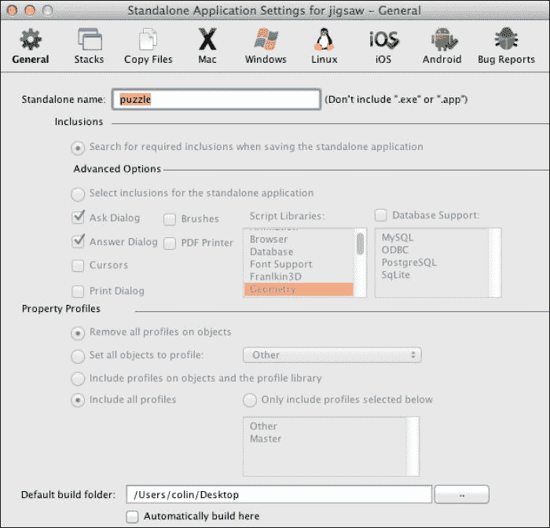

## **堆栈**部分

**堆栈**部分将显示您项目中已包含的堆栈列表。这当然包括当前的 Mainstack 以及您可能之前使用过的插件添加的堆栈。如您所见，所有选项都是灰色的。

## **复制文件**部分

**复制文件**部分用于添加应用需要使用的额外文件和文件夹。这些是只读文件；如果您需要可更改的文件，您仍然可以包含这些文件，然后将文件的副本写入特殊的`Documents`文件夹。以下是包含图像和声音文件夹的对话框外观。这些文件夹与 LC 应用所在的文件夹相同：

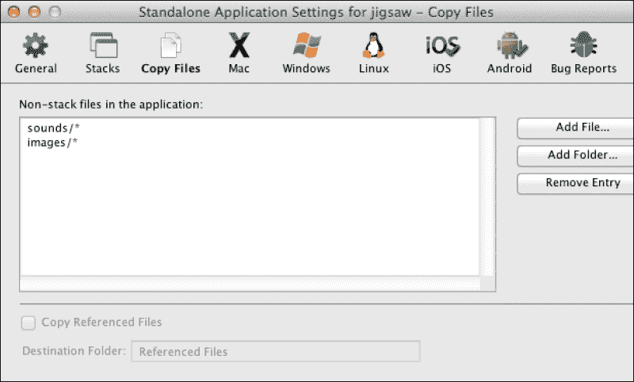

## iOS 部分

在制作 iOS 和 Android 应用时，**Mac**、**Windows**、**Linux**、**Web** 和 **错误报告** 部分不使用，所以现在，我们将逐步仔细查看 **iOS** 部分…

### 构建部分

**构建部分** 设置确定应用将在哪些 iOS 设备上运行以及应使用哪个最低 iOS 版本。在决定选择什么时，有些事情很明显，而有些则不那么明显。如果你制作的应用确实需要一个大的工作区域，那么在 iPod 或 iPhone 屏幕上可能不太成功。如果它是一个针对手持设备使用的轻量级工具，可能你不需要有一个 iPad 版本。你可以从本部分选择 **iPod**、**iPhone** 和 **iPad**，或者只选择 **iPod 和 iPhone**，甚至只选择 **iPad**。

你选择的最低 iOS 版本可能取决于你之前使用的特定功能。你不想用户购买你的应用后，发现某些功能在较旧的 iOS 版本下无法正常工作。你可能需要设置并保留一些设备用于测试，以便在这些设备上使用旧版本的操作系统，从而确保你的设置是正确的。此外，Xcode 允许你下载各种版本的模拟器，在 LiveCode 中，你可以选择特定的版本进行测试。

你现在可以始终将这些选项保留在较低值，在你听到你的测试者如何与该应用互动后，再做出决定。

这里是设置中的 **构建部分** 以及你可以选择的菜单：

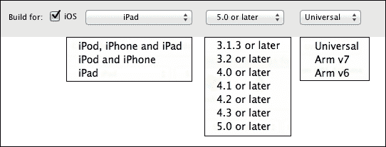

### 基本应用设置

我们已经使用了一些这些设置几次。以下是完整的选项集：

+   **显示名称**：这是将在实际设备上的图标下显示的名称。

+   **版本**：这是将在应用的 iTunes 描述中出现的版本号。

+   **内部应用 ID**：这是在开发或分发配置文件时可以在 iOS 开发者门户中使用的应用 ID。

+   **配置文件**：这是与该应用匹配的配置文件。

+   **外部命令文件**：这是一组你可能已在应用中使用过的可选外部命令文件。

你应该尝试不同的显示名称，看看它在不同设备上的外观如何。iOS 会截断名称长度，在文本中间放置省略号，名称长度有一个限制。对于 iPhone，这个限制大约是 11 或 12 个字符。

确保你提交的应用更新版本号晚于现有应用的版本号很重要。从 1.0.0 开始是有意义的；只是记得在更新时增加数字。如果你忘记了，你会在上传到 App Store 的过程中发现失败！一般来说，应用商店要求更新版本晚于被替换的版本。

在开发目的上，您可以使用包含通配符的内部应用程序 ID 的配置文件。当您提交应用程序到 iOS 应用商店时，请确保配置文件是分发配置文件，并且它使用的 App ID 与**内部 App ID**完全匹配。同时，请确保 ID 与商店中的任何其他应用程序都不同。请注意，ID，如您的开发者账户页面所示，在其开头将显示额外的数字，例如，`31415926.com.yourname.yourappname`。匹配的**内部 App ID**将是`com.yourname.yourappname`。

在这个示例截图中，选择了开发配置文件，并且没有使用外部命令：

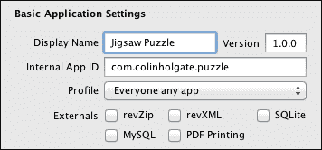

### 图标

您可以为 iOS 和 iTunes 要求的每种设备类型选择不同的图标。图标部分很简单；您点击**…**按钮，然后从您的文件系统中选择文件。LiveCode 可以为您创建各种尺寸的图标，但这并不是一个选项！就其价值而言，您可能有自己的理由为每种情况显示不同的图标。例如，您可以为 Retina 显示屏创建一个图标，其中包含比非 Retina 显示屏更多的细节。既然您没有选择，那就享受这种灵活性带来的便利吧！

注意以下截图中的**预渲染图标**复选框。在这里，您可以选择创建一个与设备上显示的图标完全相同的图标。您还可以创建一个没有阴影的方形图标，让系统通过高亮效果使其看起来像按钮。看看您自己的设备上的各种应用；您会发现有些人乐于使用苹果的斜面高亮外观，而有些人则更喜欢自己动手。**预渲染图标**功能允许您自己动手。在这个截图中，您可以看到所有已选择的设备类型的图标，包括 iPad Retina，并且它们是预渲染的：

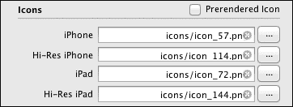

在这种情况下，`icons/`文件夹与应用程序在同一文件夹中，因此您不需要包含完整路径。`icons/`条目也包含在**复制文件**部分中。

苹果 iOS 7+图标和图像尺寸的良好参考资料可在以下网址找到：

[`developer.apple.com/library/ios/documentation/UserExperience/Conceptual/MobileHIG/IconMatrix.html`](https://developer.apple.com/library/ios/documentation/UserExperience/Conceptual/MobileHIG/IconMatrix.html)

此图表不包括旧尺寸 57 和 72，这些尺寸适用于较旧的 iPhone 和 iPad。

### 图标工具

有许多工具可以帮助您创建 Mac 应用商店中所有可用的图标尺寸。在我最后一次检查时，搜索`icon ios`的结果大约有 40 个图标。我使用的一个免费工具是**Icon Set Creator**，它可在以下网址找到

[`itunes.apple.com/us/app/icon-set-creator/id939343785?mt=12`](https://itunes.apple.com/us/app/icon-set-creator/id939343785?mt=12)

### 启动画面

从第一代 iPhone 开始，iOS 就有在用户触摸应用图标时立即加载并显示启动画面的能力。这让他们在应用加载时有所观看。那些日子里只需要一个默认图像和一个名为`Default.png`的名称。当 iPad 出现时，就需要更多的启动画面。至少，您需要一个更高分辨率的默认图像，但您还需要为横向设置自定义图像，根据主页按钮是在左侧还是右侧，可能需要不同的横向图像。

LiveCode 不提供访问该级别的灵活性，但一个应用需要两种变体有不同的横向是非常罕见的；通常只需要一个即可。对于颠倒的纵向变体，常规的默认纵向图像也可以使用。

Retina 显示屏有自己设置启动画面的条目，并且按照惯例，这些文件名将包含`@2x`。

启动画面的哪些选项被启用取决于下一节中描述的朝向选项。在此屏幕截图中，**横向**选项被灰色显示，因为应用被设置为**纵向**。在此处，还选定了正确的尺寸**横向**图像文件，供您参考：

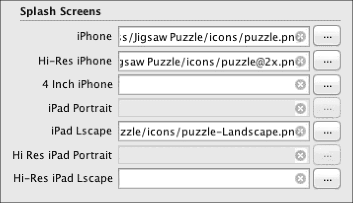

您可能会注意到这里没有 iPhone 的纵向或横向选项。这是因为`Default.png`同时用于这两种情况。如果您的应用仅支持横向，那么请设计为横向的启动画面，但将图像顺时针旋转 90 度以创建 320 x 480 或 640 x 960 的`Default.png`或`Default@2x.png`图像。列表中的一个重要条目是用于 iPhone 5 的**4 英寸 iPhone**条目。这里不使用`Default.png`文件名，因为只要不包含空格，图像文件名可以是任何名称。

### 朝向选项

如前所述，您可以为您的应用指定支持的朝向。如果应用仅用于 iPod 和 iPhone，那么您只能设置初始朝向。选项包括**纵向**、**颠倒纵向**、**横向左**和**横向右**。如果应用在 iPad 上使用，那么您还可以设置应用使用时支持的朝向。您所做的选择将影响哪些图标可以被导入。所有朝向都通过一个下拉菜单和四个复选框来设置：

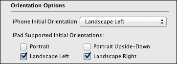

### 自定义 URL 方案

有时候在使用 iOS 设备时，你会在网页中触摸一个 URL，突然你会发现自己在邮件中或查看 App Store 中的页面。这是通过自定义 URL 方案实现的。在 App Store 的情况下，链接以`itms-apps://`开头，iOS 知道该链接应该在 App Store 应用中打开。你可以用你的应用做同样的事情。通过设置类似的自定义字符串，你可以让 iOS 在用户触摸 URL 中以相同字符串开头的链接时打开你的应用。更多信息可以在[`lessons.runrev.com/m/4069/l/58672-using-custom-url-schemes`](http://lessons.runrev.com/m/4069/l/58672-using-custom-url-schemes)的教程中找到。

字符串的值通过一个简单的文本输入字段输入，如下所示：

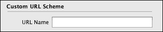

### 要求和限制

之前，我们讨论了如何设置设备、处理器指令集和 iOS 版本，这是确保用户能够使用你应用中的功能的一种方法。**要求和限制**选项让你可以非常详细地指定你的设备应该具备的能力。至少，如果你有一个涉及拍照的应用，那么设备中有一个摄像头是必要的！如果是一个视频聊天应用，那么设备中有一个前置摄像头是有意义的。我们在上一章中制作的通知应用应该选择**位置服务**选项，以确保按距离排序的功能正常工作。以下是需要设置的要求和限制的完整列表：

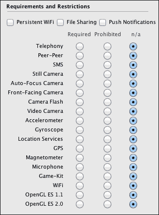

### 状态栏

iOS 设置中的最后一个选项控制状态栏是否可见以及它应该具有默认状态栏外观还是黑色外观。对于黑色外观，你可以设置它应该是完全不透明的还是半透明的：

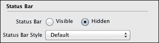

## Android

如你所见，需要为 Android 设置的选择项比 iOS 少。这并不是因为 Android 更简单，而是因为 LiveCode 几乎暴露了 iOS 的所有可能设置，包括你很可能不需要的大量设置。iOS 还有 Android 中没有的启动画面变化。

在 Android 世界中，有一些设置是你必须设置的，特别是**权限**设置。iOS 确实会要求用户在使用某些功能时给予权限，但不是在你应用调用该功能时。你可能见过要求“**Fancy App 想要知道你的位置**”的对话框。另一方面，Android 会在应用安装时请求使用这些功能的权限。

让我们看看 Android 的选项...

### 基本应用设置

在 Android OS 中，一些 iOS 选项被赋予了不同的名称。而不是**显示名称**，使用**标签**，**内部应用 ID**被称为**标识符**，并且没有配置文件，但在 Android 中有一个**签名密钥**。本质上，它们与 iOS 中的选项相同。

**图标**被设置为基本设置的一部分，因为只需要一个图标，所以我们不需要一组选项。对于这个图标，您需要选择一个 512 x 512 像素大小的图像版本，LiveCode 会为您生成其他尺寸。

Android 应用没有像 iOS 那样的启动画面，但 LiveCode 可以提供一个启动画面，它将在应用加载后用户看到的第一个屏幕上显示。

您可以选择应用安装的位置，有**仅内部存储**、**允许外部存储**和**优先外部存储**的选项。这里所指的外部存储是指大多数 Android 设备都有的 SD 内存。Android 用户要么不在乎应用安装在哪里，要么非常执着于将其存储在 SD 内存中！您可以选择**允许外部存储**并预期很多人会这样做，或者您可以选择**优先外部存储**，知道只有少数人会更改选项以强制安装到内部存储。总的来说，使用优先外部存储设置可以减少对人们的困扰。

在 Android 中，应用内购买和推送通知的处理方式与 iOS 不同。如果您想使用应用内购买，请查看 RunRev 在线课程以及`developer.android.com`上的信息。苹果、谷歌、亚马逊和三星的课程位于[`lessons.runrev.com/m/4069`](http://lessons.runrev.com/m/4069)。

关于应用内计费的开发者信息可以在以下链接找到：

[`developer.android.com/guide/market/billing/billing_overview.html`](http://developer.android.com/guide/market/billing/billing_overview.html)

与 iOS 一样，Android OS 可以接收外部命令，并且也有自定义 URL 方案。iOS 中没有的一个功能是能够设置用于任务栏的图标。

下面是如何展示基本**应用设置**选项的：

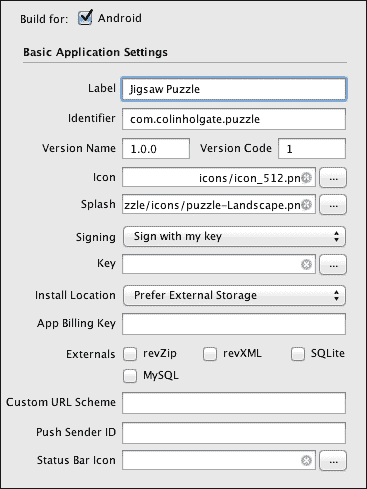

### 需求和限制

在这个选项集中，您可以设置**最低 Android 操作系统**版本，并设置所需的硬件功能。在 iOS 中，单选按钮的列有不同的名称。而不是声明一个功能是必需的或禁止的，按钮会说明该功能是必需的还是使用的。这成为 Android 用户能够阅读的信息，并且可能在他们是否选择购买您的应用中发挥作用。因此，尽量选择适用于您应用的任何选项。

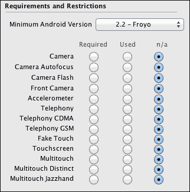

### 应用权限

当 iOS 应用使用某些功能，例如你的位置时，首次使用该功能时会弹出一个警告对话框。在 Android 上，任何此类功能都会在应用安装过程中列出，并且用户一次性授予所有功能的权限。

这里是你可以选择的权限列表：

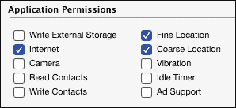

### 用户界面选项

**用户** **界面** **选项** 执行与 iOS 中的方向和状态栏选项相同的功能。如果你正在提交一个横屏的 iPad 应用，你必须支持两种横屏变体。Android 应用商店没有这样的要求，因此选项要简单得多。你只需选择初始方向应该是 **纵向** 还是 **横向**，以及状态栏应该是 **可见** 还是 **隐藏**：

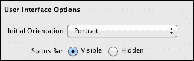

# 为 Beta 测试者构建应用

你可能在整个开发过程中已经将测试版本发送给了朋友和同事，但即使你没有，随着你接近必须上传应用到应用商店的时间，这样做变得更加重要。Beta 测试者可以告诉你关于技术和非技术问题。信用部分有错别字吗？图标看起来好吗？安装体验中有任何奇怪的地方吗？当然，应用在众多设备和操作系统上是否按预期工作？

将应用制作并发送给测试者的过程在 Android 和 iOS 上有所不同。实际上，在 Android 上做这件事非常简单！让我们首先看看 Android 的做法。

## 将 Android 应用发送给测试者

当点击 Android 的 **另存为独立应用程序…** 选项时，你会创建一个 *APK* 文件。你可以通过电子邮件将此文件发送给你的测试者，他们可以在他们的设备上执行所谓的“侧载”操作。在 第二章 中，我们看到了如何连接 Android 设备进行测试可能会多么棘手，这可能会超出一些测试者的技术能力。

幸运的是，有一个更简单的方法来做这件事。将 APK 文件上传到某个地方。它可以是 Dropbox 共享位置、Google Drive，或者可能是你办公室的服务器。无论你需要做什么，只要你能得到一个包含文件链接的 URL。现在，将这个 URL 通过电子邮件发送给你的测试者，确保他们可以在他们的设备上阅读。然后，只需点击电子邮件中的链接一次，你就可以开始下载和安装你的应用。

在 Android 设备设置中有一个开发部分，测试者可能需要访问以启用允许以这种方式安装应用的特性，但进行此更改非常简单。

## 准备 iOS 应用以便在他人设备上运行

对于 iOS 来说，事情并不那么简单！首先，您需要为每位测试者的设备添加唯一的设备 ID（UDID）到您的 iOS 开发者账户中。您的测试者可以通过将设备连接到他们的电脑并在 iTunes 中查看其信息来获取该数字。当您查看**摘要**部分时，您将看到相应设备的序列号。点击该数字将使其变为一个更长的数字，即所需的 UDID。一旦该数字显示出来，您可以使用键盘快捷键将其复制到剪贴板（Mac 上的*command* + *C*，Windows 上的*Ctrl* + *C*）。让您的测试者执行这些操作，然后将数字粘贴到发给您的电子邮件中。您必须确保获取正确的数字，因为它将消耗您 iOS 开发者账户中分配的 100 个设备中的一个。

前往[`developer.apple.com/account/ios/device/deviceList.action`](https://developer.apple.com/account/ios/device/deviceList.action)以将设备添加到您的账户中。点击您姓名下方位置的正下方的**+**按钮，您就可以将设备添加到您的账户中：

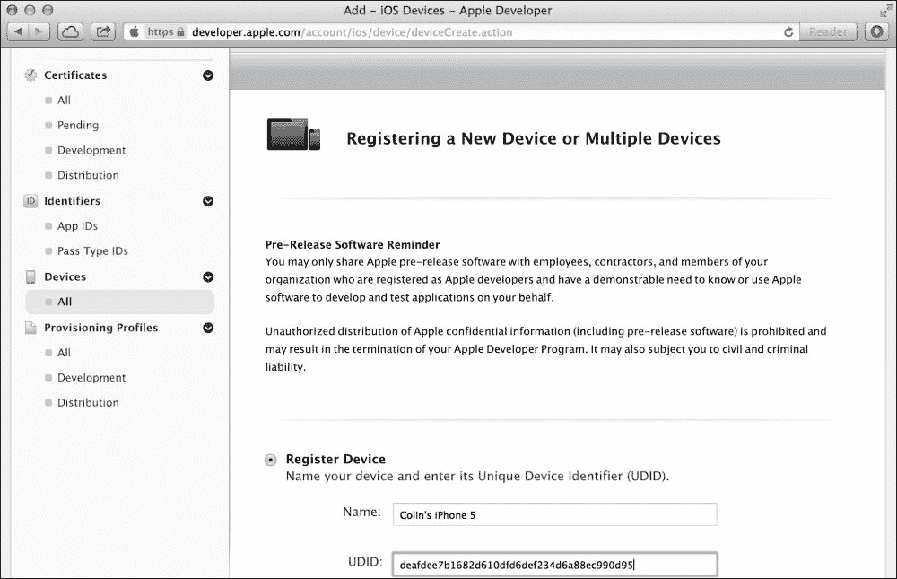

接下来，转到**配置文件**部分，创建一个新的**开发**配置文件或选择一个现有的配置文件并点击**编辑**按钮。在选择了 App ID 和签名证书后，您将看到与您的账户关联的设备列表。您可以选择任何组合的设备与该配置文件一起使用。在这个屏幕截图中，您会看到测试设备池非常短：

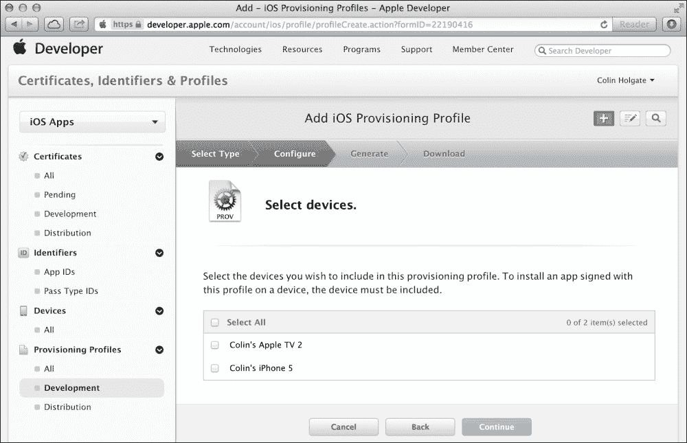

点击**生成**按钮，几分钟后，您将能够点击**下载**按钮来下载文件。

下载新的配置文件并将其添加到 Xcode 中（双击下载的文件）。在 LiveCode 中打开您的应用的主栈，转到**独立应用程序设置…**/**iOS**，并确保从**配置文件**菜单中选择配置文件。再次点击**另存为独立应用程序…**选项，以确保新设备被应用所识别。

到现在为止，您将有一个“APP”文件，这是 iOS 对 Android 的“APK”文件的等价物。与 Android 一样，您可以随附此文件和配置文件通过电子邮件发送给您的测试者，并让测试者将它们“侧载”到他们的设备上。在这种情况下，这并不是一个很难的任务，因为测试者可以使用 iTunes 来完成同样的操作。如果您选择这条路，让您的测试者将“APP”和配置文件拖放到 iTunes 的**库**中，连接设备，查看**应用**标签页，确保新应用被选中，然后执行**同步**。然而，您可以大大简化用户的使用，就像 Android 用户一样简单。

## 使用 iOS 的"over the air"安装程序

自从 iOS 4.0 以来，我们就可以从网页中的链接安装应用程序了。不过，创建使其工作的文件结构有点棘手，但幸运的是，至少有几种工具你可以购买来简化这个过程。

### AirLaunch

HyperActive Software 开发了一个 LiveCode 插件，可以将你的"APP"文件转换为"over the air"安装所需的文件结构。你只需要在一个对话框中填写所需的信息：

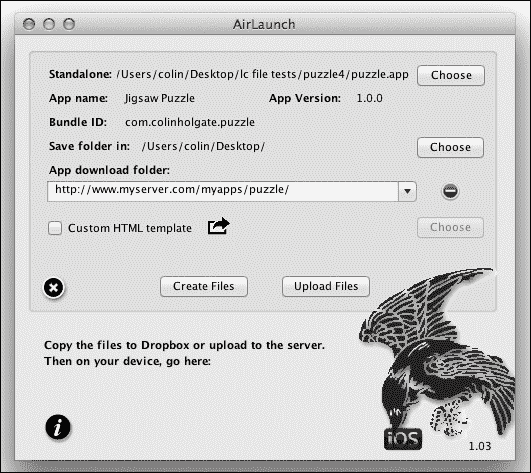

选择"APP"文件后，你只需要输入文件夹在线时的 URL，然后点击**创建文件**按钮。在线应用程序的 URL 链接将在窗口底部确认。点击 URL 以复制它，然后通过电子邮件发送给你的测试人员。当他们在自己的设备上访问网页时，将有一个单独的链接可以触摸，iOS 将提示你批准安装应用程序。如果你查看主页上的下一个可用位置，你会看到它正在安装，或者如果你不够快，它已经安装了。

### 注意

有关 AirLaunch 的更多信息，请参阅：

[`www.hyperactivesw.com/airlaunch/index.html`](http://www.hyperactivesw.com/airlaunch/index.html)

注意，苹果要求使用一个安全的服务器才能实现这一功能，并且 URL 必须以 HTTPS 开头。最简单的来源是使用 Dropbox 公共文件夹，尽管如果你是在 2012 年 10 月 4 日之后注册的 Dropbox，你需要将其设置为安全。有关更多信息，请参阅 AirLaunch 常见问题解答：

[`hyperactivesw.com/airlaunch/airlaunchtips.html`](http://hyperactivesw.com/airlaunch/airlaunchtips.html)

### 提示

**AirLaunch 开发中的工作流程**

AirLaunch 可以作为 LiveCode 插件安装，并在创建应用程序的独立版本后立即运行。你可以在 iOS 设备上保存安装网页，并点击它以启动安装程序。这种方法在开发过程中测试应用程序比连接电缆并将应用程序拖入 Xcode 要容易得多。

### BetaBuilder

你可以在 Mac App Store 中找到 BetaBuilder：

[`itunes.apple.com/us/app/betabuilder-for-ios-apps/id415348946?mt=12`](http://itunes.apple.com/us/app/betabuilder-for-ios-apps/id415348946?mt=12)

它并不是专门为 LiveCode 设计的，它支持"IPA"文件而不是"APP"文件。将 LiveCode APP 文件转换为 IPA 文件的一个简单方法是将 APP 文件拖入 iTunes，并右键单击库中的应用程序选择"显示在 Finder 中"。这将显示可以拖入 BetaBuilder 窗口的 IPA 文件。

这个过程与 AirLaunch 的过程非常相似，其中你选择要使用的文件，输入在线文件夹的 URL，程序为你生成文件。同样，这一切都在一个对话框窗口中完成：

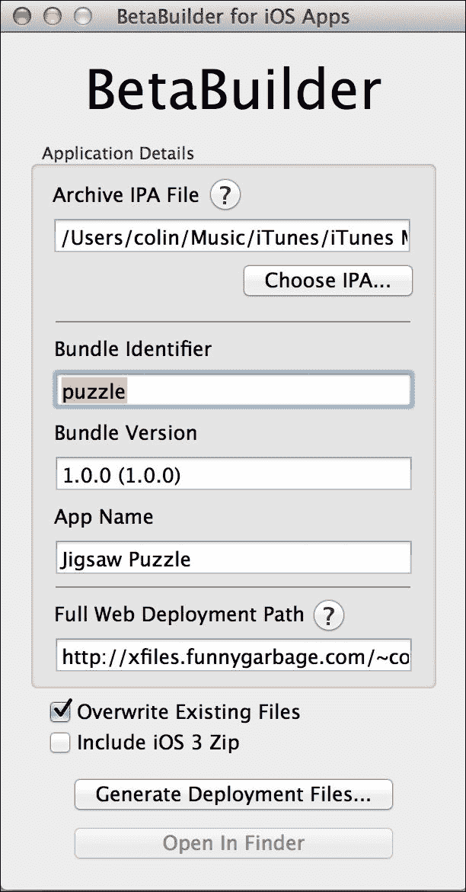

这两款产品创建的文件与以下 Dropbox 公共文件夹中所示类似：

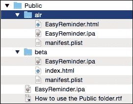

这两款产品都让测试者的生活变得简单。AirLaunch 作为一个插件，可以在 LiveCode 中运行，而 LiveCode 你很可能已经打开了，并且可以直接与 LiveCode 创建的 APP 文件进行工作。BetaBuilder 是一个独立的 Mac 应用程序，需要你使用其他 Mac 应用程序将文件传输到你的服务器。AirTouch 内置了 FTP，以简化你的工作流程。

BetaBuilder 的主要优势是它极其便宜！它还生成一个比 AirLaunch 更详细的信息网页，AirLaunch 只显示一个带有应用名称的简单链接。然而，AirLaunch 允许你导出模板并编辑或将其集成到你的网站上。

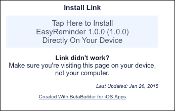

### TestFlight

在我撰写这本书的第一版时，有一个名为 TestFlight 的服务，其工作方式类似于 AirLaunch 和 Beta Builder。2014 年，苹果收购了 TestFlight 并将其与用于向苹果 App Store 提交应用的**iTunes Connect**（**iTC**）合并。TestFlight 不仅仅是你向几个测试者发送个人应用所需的东西，但在处理可能发送给多达 1000 个测试者的应用时是必需的。一个重大变化是，你还需要一个分发配置文件和证书才能开始本章中进一步描述的提交过程。

TestFlight 有两个测试级别：**内部**和**外部**。内部测试是针对你的开发团队成员的。你可以使用 iTC 的**用户和角色**部分添加最多 25 个内部测试者，并分配给他们**技术**角色。他们将收到一封电子邮件邀请，并需要激活一个 iTC 账户。当你开始测试你的应用时，他们会收到另一封电子邮件通知，并需要在运行 iOS 8 或更高版本的设备上下载 TestFlight 应用。然后 TestFlight 应用会安装你的应用以进行测试。测试只持续 30 天，除非你更新它并提交新版本。TestFlight 应用还可以用于错误报告和反馈。

外部测试与此类似，但需要在测试开始前进行 Beta App Review，并必须遵守完整的 App Store Review Guidelines。对于包含重大更改的新版本的应用，需要进行审查。一次可以测试多达 10 个应用，无论是内部还是外部。你可以通过提供他们的电子邮件地址列表并检查你是否得到了他们的批准来添加最多 1000 个外部测试者。发布后，测试将以与内部测试者相同的方式进行。在撰写这本书的时候，一个测试者不能同时出现在内部和外部列表中。有关更多信息，请参阅[`developer.apple.com/testflight/`](https://developer.apple.com/testflight/)。

### 注意

**缺少推送通知权限**

在 2015 年初，当您向 iTC 提交应用程序时，您会收到这封电子邮件警告信息：“您的应用程序似乎包含用于注册 Apple **推送通知**服务的 API，但应用程序签名的**权限**不包括 "aps-environment" **权限**。”这是 LC 中的一个问题，不会影响任何东西。Apple 的推送通知服务是内置在 LC 引擎中的，如果不用它，LC 不会费心将其删除。这在 RunRev 质量系统中的错误报告 10979 中有记录。[`quality.runrev.com/process_bug.cgi`](http://quality.runrev.com/process_bug.cgi)。

## 使用“空中”安装程序进行 Android 安装

在使用 Android 模拟器或直接连接进行测试时，应该足以学习 LiveCode 开发，但现实世界要复杂得多。在过去的几年里，出现了多种测试替代方案，以帮助您在其他 Android 设备上测试您的应用程序。由于有众多 Android 设备，这确实是必需的。在最后一次统计中，Google Play 商店列出了 8614 个，而且现在当您阅读这篇文章时，肯定还有更多被列出。在亚马逊、三星和其他地方也有 Android 操作系统的变体。希望通过 Google 测试资源进行测试能够满足您的需求。

### Google 测试

Google 也在他们的 Google Play 商店内置了测试功能。与 Apple 的 iTC 和 TestFlight 类似；对于 Google 来说，您需要准备您的商店列表并上传您的 APK，就像您发布它时一样。为了向测试者分发，您需要创建并选择一个测试者可以加入的 Google Group 或 Google+ Community。Google 有 alpha 和 beta 测试，这与 Apple 的内部和外部测试类似。测试通知电子邮件会发送给测试者，其中包含 Google Play 测试部分的链接。因为您的测试者不能在 Google Play 上为 alpha/beta 应用程序留下公开评论，所以让它们知道在哪里可以提供反馈（电子邮件地址、网站等）是个好主意。更多详细信息可以在以下找到：

[`support.google.com/googleplay/android-developer/answer/3131213?hl=en`](https://support.google.com/googleplay/android-developer/answer/3131213?hl=en)

### 亚马逊测试

亚马逊有一个名为 **Live App Testing** 的工具，允许开发者通过亚马逊应用商店进行应用程序的公测。开发者可以通过电子邮件邀请最多 500 名特定用户测试应用程序。除此之外，**A/B 测试服务**允许在应用程序内进行实验，尝试与不同用户群体的不同 UI 交互。据说它还支持 iOS，但需要开发 LiveCode 外部特定的 API。

更多信息请参考：

[`developer.amazon.com/public/community/post/TxCVSAM1IG7NX2/Launch-Better-Apps-Announcing-Live-App-Testing`](https://developer.amazon.com/public/community/post/TxCVSAM1IG7NX2/Launch-Better-Apps-Announcing-Live-App-Testing)

### 三星测试

为了方便测试应用，三星开发了**远程测试实验室（RTL）**设施。这些实验室包含真实设备，允许开发者上传和测试他们的应用。要使用这些设备，你需要下载并运行一个 Java 小程序，该小程序将你的 APK 连接到三星实验室中的实时设备，并提供一个与该设备交互的界面。这可能在将来有一些潜在的应用，但这里包括它以供可能的调查。有关三星测试的更多信息，请参阅[`developer.samsung.com/remotetestlab/rtlAboutRTL.action`](http://developer.samsung.com/remotetestlab/rtlAboutRTL.action)。

### 小贴士

之前的测试替代方案是与 iOS 和 Android 设备制造商相关的主要替代方案。由于苹果收购了**TestFlight**，其他几个跨平台测试解决方案已经填补了空缺。在互联网上快速搜索显示**HockeyApp**、**Crashlytics**、**Ubertesters**、**TestFairy**和其他一些可能有潜力的解决方案。

# 创建应用商店提交文件

为了制作一个可以提交到应用商店的应用版本，你需要克服的最大障碍是获取一个分发证书。对于 Android 来说，这个过程更快，但确实需要在命令行中输入一些文本，如果你使用的是 Windows 而不是 Mac，那么会有一些细微的差别。iOS 的过程有很多步骤，但至少它们不涉及输入难以理解的命令。我们首先来看 Android。

## 查找和使用 Android Keytool 应用程序

当你添加 Java 开发工具包时，安装的一个工具是用来创建“密钥库”文件的，这是一个自签名的证书。这个工具就是用来创建你分发 Android 应用所需的证书。

在 Mac 上，你不需要寻找这个应用程序，你只需在终端中输入命令，你就能找到这个工具。在 Windows 上，你首先需要导航到 Keytool 所在文件夹。在做到这一步之前，你必须首先以管理员身份打开命令行。

在 Windows 上，CMD 应用程序位于`C:\Windows\System32\`。在 Windows 资源管理器中转到该目录，右键单击文件，并选择**以管理员身份运行**。Keytool 应用程序将在 Java JDK 目录的 bin 文件夹中。一旦你到达命令提示符，更改目录以到达该位置，这将是类似于`C:\Program Files\Java\jdkx.x.x_xx\bin\`的路径，其中`jdkx.x.x_xx`部分实际上是已安装的 JDK 版本。你应该能够通过以下类似命令到达那里，其中 cd 是用于更改目录的命令：

```java
C:\> cd \Program Files\Java\jdk1.7.0_01\bin\

```

在 Mac 上，你会使用位于`/Application/Utilites`的终端。只需打开终端，你就能立即使用 Keytool 应用程序。

在任何情况下，您现在将输入一条相对简短的命令行，然后回答出现的各种问题。为了更好地理解正在发生的事情，请访问：

[`developer.android.com/guide/publishing/app-signing.html`](http://developer.android.com/guide/publishing/app-signing.html)

对于我们的目的，我们只需输入正确的命令，一切应该都会顺利，即使我们不理解我们输入了什么！

这是您需要输入的行，将密钥库和别名名称更改为与您希望用于此证书的名称匹配：

```java
keytool -genkey -v -keystore my-release-key.keystore
-alias alias_name -keyalg RSA -keysize 2048 -validity 10000

```

当您按下 Enter 或 Return 键时，您将开始看到一系列问题，这些问题从您希望用于密钥库的密码开始。后续问题将询问您的全名、公司、城市和国家详情。这是一组可以编码到具有独特性和足够准确信息以供用户决定是否信任证书的密钥库中的数据。

当工具完成时，您将拥有 LiveCode 所需的密钥库文件。在 Mac 上它将很容易在您的家目录中找到，而在 Windows 上则可能隐藏在 JDK bin 文件夹中。

前往 Mainstack 的**独立应用程序设置**的**基本应用程序设置**，然后从密钥条目导航到文件。一旦选择，此部分将看起来像这样：

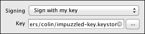

如果您已经选择了图标、启动画面以及要求和权限，您应该能够构建一个可以上传到应用商店的 APK 文件版本。

## 为 iOS 创建分发证书

如前所述，获取 iOS 分发证书不需要涉及命令行输入，但涉及许多步骤。获取证书的第一站是 iOS 开发者门户，以确保您已经为这个特定的应用程序设置了一个专门的 App ID 和配置文件。

以下截图展示了为即将命名的名为`EasyReminder`的应用程序获取证书和配置文件的步骤，这是我们之前制作的通知应用程序。

在门户的**App IDs**部分，有一个**+**按钮，它将新的 App ID 添加到您的账户中，并要求为该 ID 提供一个名称。在这里，您可以看到 ID 被命名为**EasyReminder**和一个包标识符`com.gerdeen.easyreminder`。这需要与 LiveCode 中设置的**内部 App ID**相匹配。如果您**不是**多个开发团队的成员，您将不会看到以下截图中显示的 App ID 前缀：

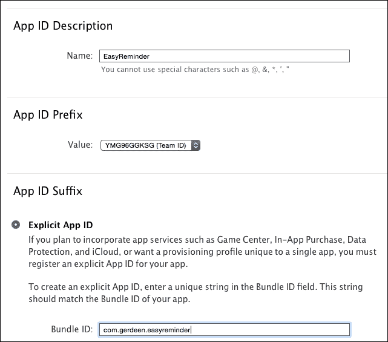

现在有了 App ID，它可以在**配置**部分设置一个分发配置文件。如果您还没有创建分发证书，您将看到一个按钮告诉您创建一个。点击该按钮将向您提出一个问题，询问您想要创建哪种类型的证书：

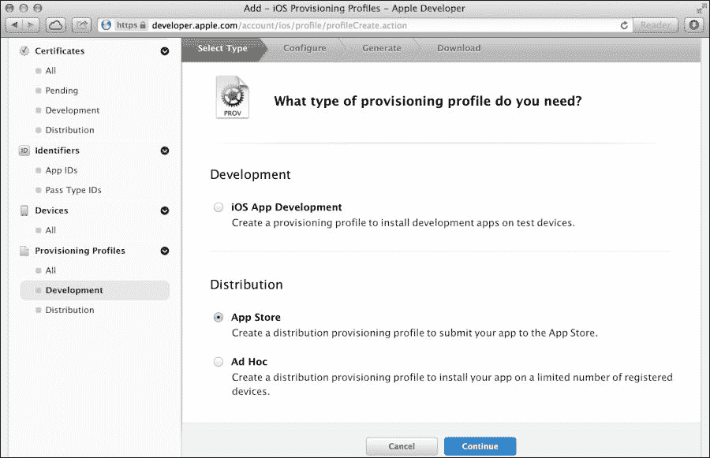

点击**继续**按钮会带你去一个长描述，说明你必须如何向证书颁发机构提出请求以及如何上传 Keychain Access 生成的文件。当你遇到这种情况时，请仔细遵循以下截图所示的步骤：

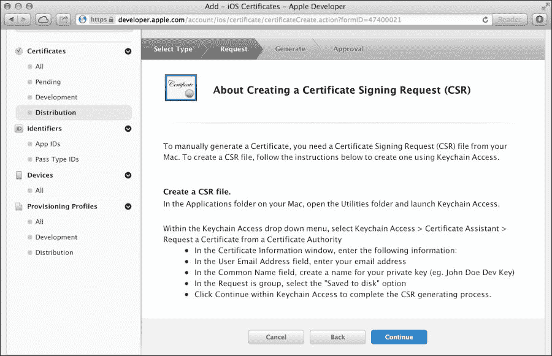

在上传证书请求文件后，你将能够创建一个使用专用 App ID 和分发证书的分发配置文件。最后的条目将看起来像这样，你可以使用**下载**按钮来获取本地副本的配置文件：

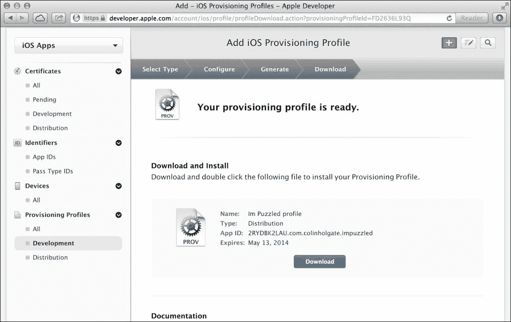

你现在有了 LiveCode 需要的文件，但你不需要在 LiveCode 设置中选择它。相反，你双击该文件，它将使用 Xcode 自动安装。一旦它在 Xcode 中，你就可以从 LiveCode 的**基本应用程序设置**中的**配置文件**菜单中选择它：

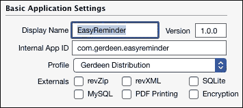

与 Android 一样，确保添加图标、启动画面、设置要求等，你将能够保存一个准备好的 APP 文件，上传到 iOS 应用商店。

# 上传到应用商店

每个应用商店都会指导你如何上传新应用，并且涉及到的步骤相当多！可能需要另一本书来展示你必须浏览的所有截图。在这里展示这些截图不会非常有价值，主要是因为它们的数量庞大，而且流程会不时发生变化。例如，谷歌将他们的服务名称从 Android Market 更改为 Google Play。

每个商店要求的内容之间有一些相似之处，所以我们将看看在前往商店之前你可能需要做哪些准备。当你准备好上传时，你需要从以下页面开始为相应的应用商店进行操作：

+   iTunes Connect: [`itunesconnect.apple.com`](https://itunesconnect.apple.com)

+   Google Play: [`play.google.com/apps/publish/`](https://play.google.com/apps/publish/)

+   Amazon Appstore: [`developer.amazon.com/home.html`](https://developer.amazon.com/home.html)

+   Samsung Apps: [`seller.samsungapps.com/`](https://seller.samsungapps.com/)

## 相似之处

所有三个应用商店都会要求你描述应用的功能、评分信息、价格、支持网站或电子邮件地址以及分类信息。如果你要设置除了免费以外的价格，你必须设置一个商户账户。在苹果的情况下，你必须提供一个支持网页地址。谷歌只要求提供联系信息，而亚马逊将支持作为可选项。所有三个都要求截图，并允许你上传演示视频。

## 不同之处

Apple 要求提供大量信息，但这些信息分布在多个屏幕上。当你输入数据时，你需要截图和其他你尚未收集的信息。你可以 **保存** 你已经输入的内容，稍后再回来。确保在点击 **提交审核** 之前正确无误，因为 Apple 不允许在没有上传应用新版本的情况下更改信息。

实际应用文件的上传由 Xcode 集成开发工具包中的 Application Loader 工具处理。要从 Xcode 开发者工具包访问 Application Loader，请选择菜单 **Xcode** | **打开开发者工具** | **Application Loader**。你还可以按照 iTunes Connect 支持文档中所述，在你的应用程序文件夹中下载它：

[`itunesconnect.apple.com/docs/UsingApplicationLoader.pdf`](https://itunesconnect.apple.com/docs/UsingApplicationLoader.pdf)

Google 要求提供大量信息，但这些信息都在他们的开发者控制台中。有部分用于上传 **APK** 文件，用于完成 **商店列表**、**定价与分发**以及其他操作。如果你将价格设置为免费，请注意你不能更改它，并且它将立即永久性地被标记为免费应用。要更改它，你需要创建一个新的应用，使用新的包名并设置新应用的价格。

Amazon 要求提供的信息与 Apple 和 Google 大致相同。你可以通过简单地将其拖到他们的开发者网页上来检查你的应用是否与 Amazon 兼容。他们进行快速兼容性测试，然后在 Android Nexus 7 和他们的 Fire 手机和平板电脑上进行更多测试。你可以直接从测试结果页面开始提交你的应用，但那时你需要建立一个开发者账户并提供之前相同的信息。

Samsung Apps 是一个专为三星手机定制的应用商店。它是开发者和三星手机用户关注的焦点。不实际注册，很难了解该商店对非三星设备的工作细节。如需更多信息，请参阅[`www.pivoteast.com/guide-how-to-register-and-submit-apps-to-samsung-apps/`](http://www.pivoteast.com/guide-how-to-register-and-submit-apps-to-samsung-apps/)上的文章。

## 核心内容

提交过程几乎是开发移动应用中最有压力的部分！它让你对自己的其他阶段感到更加安心；也许那些阶段并没有那么糟糕…

希望你有一个合作伙伴，可以成为你的第二双眼睛，帮助你理解所有问题，以免错过将来会困扰你的重要信息。

# 摘要

我不知道你们的情况如何，但我是筋疲力尽了！移动应用开发业务可能会让人感到压倒性。即使是行政方面的事情也可能相当复杂。在本章中，我们介绍了一些不太程序化的任务，例如检查独立应用程序设置中的所有选项，通过命令行和繁琐的程序来获得应用程序认证，以及心理上准备将我们的应用程序提交到应用商店。

就利用 LiveCode 堆栈中的移动功能并将其转化为真正的移动应用而言，我们已经走到了尽头。接下来，我们将探讨一些 LiveCode 的附加组件，这些组件将使您能够使用更多的移动功能。
