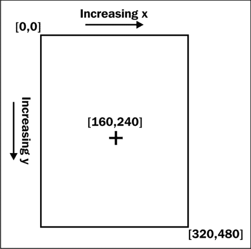
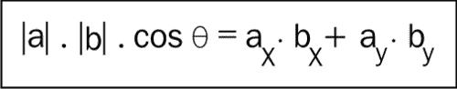
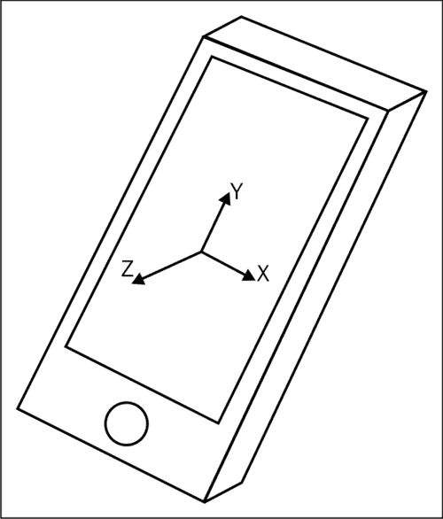
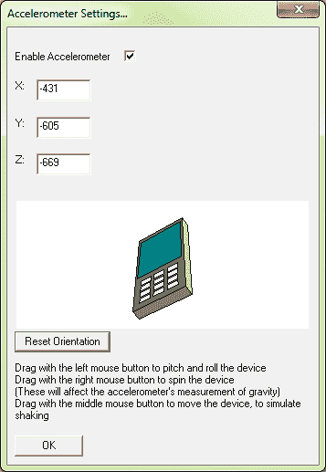

# 第三章。用户输入

如果用户无法控制发生的事件，那么一款视频游戏将不会很有趣去玩，所以在本章中，我们将探讨使用 Marmalade 可以通过哪些方式增加程序的交互性。到本章结束时，你将知道如何检测以下类型的输入：

+   键盘按键

+   触摸屏和指针输入

+   检测如滑动和捏合等手势

+   使用加速度计改变设备方向

# 检测关键输入

我们将从最简单的玩家输入方法开始我们的旅程——按键，我们通过使用 s3eKeyboard API 来检测按键。为了在我们的代码中使用这些函数，我们只需要包含 `s3eKeyboard.h` 文件。

虽然触摸屏现在可能是与许多现代设备交互的主要方法，但了解如何检测按键仍然很有价值。特别是，Android 设备具有旨在用于快速访问菜单和程序导航的按键。这些按键通常甚至不是物理按钮，只是触摸屏底部的区域，但它们仍然被报告为按键。

在 Windows 模拟器中调试代码时，按键检测也非常有用，因为 Marmalade 允许完全访问您的计算机键盘。这使得通过按键触发调试功能变得非常容易。

s3eKeyboard API 允许我们通过按键状态或字符输入来检测键盘输入。它还提供了允许我们确定我们运行的设备具有哪些键盘支持的功能。

## 键信息的初始化和更新

有一个名为 `s3eKeyboardGetInt` 的函数，可以让我们找出我们的设备具有哪种类型的键盘。如果我们想的话，我们可以使用这些信息为我们的程序提供不同的输入方法。例如，在一个高分榜上输入用户名时，如果设备具有全字母键盘，用户可以直接输入他们的名字，但如果设备没有全键盘，则可能回退到使用箭头键循环字符的方法。

`s3eKeyboardGetInt` 函数调用需要一个来自 `s3eKeyboardProperty` 枚举的单个参数，并返回一个整数值。以下表格提供了可用属性的具体信息：

| 属性名称 | 描述 |
| --- | --- |
| `S3E_KEYBOARD_HAS_NUMPAD` | 如果设备具有数字键盘，则返回 `1`，否则返回 `0`。 |
| `S3E_KEYBOARD_HAS_ALPHA` | 如果设备具有字母键盘，则返回 `1`，否则返回 `0`。 |
| `S3E_KEYBOARD_HAS_DIRECTION` | 如果设备具有方向控制（上、下、左、右以及**选择**或**确定**按钮），则返回 `1`，否则返回 `0`。 |
| `S3E_KEYBOARD_NUMPAD_ORIENTATION` | 如果设备有数字键盘，则此属性将返回键盘相对于用户持握设备的方式（如果可能检测到）的朝向。 |
| `S3E_KEYBOARD_GET_CHAR` | 如果设备支持字符码输入方法，则返回`1`；如果不支持，则返回`0`。 |

此表中的最终值也可以与函数`s3eKeyboardSetInt`一起使用，在 Android 和 iOS 设备上显示和隐藏虚拟键盘，这将允许我们在这些类型的设备上使用字符码输入方法。以下函数调用将显示虚拟键盘：

```swift
s3eKeyboardSetInt(S3E_KEYBOARD_GET_CHAR, 1);
```

要隐藏虚拟键盘，请传入`0`而不是`1`。

由于此功能仅限于 Android 和 iOS，且无法确定在运行时是否支持该功能，如果您打算支持广泛的设备，则此方法可能最好避免。

为了让我们的程序持续接收按键更新的信息，我们必须在代码中调用函数`s3eKeyboardUpdate`，每次游戏帧调用一次。s3eKeyboard API 维护自己的内部缓存，用于当前按键状态，该缓存在调用此函数时更新；因此，如果我们不频繁调用`s3eKeyboardUpdate`，我们可能会错过按键事件。

## 检测按键状态

对于大多数街机风格的游戏，最有用的按键检测方法是可以发现设备上任何按键的上或下状态。s3eKeyboard API 提供了两种方法，我们可以通过轮询当前按键状态和注册回调函数来实现这一点。

### 使用轮询检测按键状态变化

我们将从最简单的方法开始，即轮询按键的当前状态。这可能是最简单的方法，但就游戏编程而言，在大多数情况下，这也是最佳方法，因为我们通常只想知道按键是否当前被按下或释放，以便我们可以相应地更新我们的游戏状态。

要检测设备上任何按键的当前状态，我们调用`s3eKeyboardGetState`，该函数从`s3eKey`枚举中取值（查看`s3eKeyboard.h`文件以获取完整列表，但您通常可以很容易地猜测枚举的名称——例如，`s3eKeyUp`是向上箭头键，`s3eKey4`是数字*4*键，等等）以识别我们感兴趣的按键。该函数返回一个整数值，它是一个表示该按键当前状态的位掩码。通过执行位与操作，可以检测以下按键状态：

| 位掩码名称 | 描述 |
| --- | --- |
| `S3E_KEY_STATE_DOWN` | 按键当前被按下。 |
| `S3E_KEY_STATE_PRESSED` | 在上一次调用`s3eKeyboardUpdate`时，按键从释放变为按下。 |
| `S3E_KEY_STATE_RELEASED` | 在上一次调用`s3eKeyboardUpdate`时，按键从按下变为释放。 |

如果函数返回的值是零，则可以假设该键当前处于上位置（即，没有被按下）并且也没有刚刚被释放。

以下代码片段展示了我们如何检测数字 *3* 键是否刚刚被按下：

```swift
if ((s3eKeyboardGetState(s3eKey3) & S3E_KEY_STATE_PRESSED) != 0)
{
  // Number 3 key has just been pressed!
}
```

### 使用回调检测键状态变化

使用回调函数，我们也可以随时得知按键被按下或释放。许多程序员更喜欢回调，因为它们迫使我们编写更小、更易于管理的函数，这通常会产生更简洁、可重用的解决方案。从表面上看，轮询方法可能更容易，但很容易导致代码库中散布着键状态检查逻辑，遍布多个源文件。使用回调方法通常会确保键处理代码以更结构化的方式实现。

要设置一个检测键状态变化的回调函数，我们使用 `s3eKeyboardRegister` 函数。我们向这个函数提供枚举值 `S3E_KEYBOARD_KEY_EVENT` 以标识我们设置的回调类型，一个指向将作为回调的函数的指针，以及一个 void 指针，可以用来向回调函数传递我们自己的自定义数据。

当按键被按下或释放时，我们将指定的函数将被调用。回调函数传递一个指向 `s3eKeyboardEvent` 结构的指针，该结构详细说明了按键或释放事件，并且还提供了我们在注册回调时指定的自定义数据指针。

当我们不再希望接收键状态通知时，我们可以调用 `s3eKeyboardUnRegister` 来禁用回调机制。我们只需传递 `S3E_KEYBOARD_KEY_EVENT` 枚举和指向我们回调方法的指针，以停止回调的发生。

这里有一个代码片段，用于说明我们如何检测数字 *3* 键的状态变化：

```swift
// Callback function that will receive key state notifications
int32 KeyStateCallback(s3eKeyboardEvent* apKeyEvent,
                       void* apUserData)
{
  if (apKeyEvent->m_Key == s3eKey3)
  {
    if (apKeyEvent->m_Pressed)
    {
      // Number 3 key has just been pressed
    }
    else
    {
      // Number 3 key has just been released
    }
  }
}

// We use this to register the callback function…
s3eKeyboardRegister(S3E_KEYBOARD_KEY_EVENT,
                    (s3eCallback) KeyStateCallback, NULL);

// …and this to cancel notifications
s3eKeyboardUnRegister(S3E_KEYBOARD_KEY_EVENT,
                      (s3eCallback) KeyStateCallback);
```

要使用的按键检测方法实际上取决于项目需求和个人偏好。由于调用 `s3eKeyboardUpdate` 会为我们缓存每个键的状态，如果我们需要在任何时间检测多个键的当前状态，轮询方法可能最佳。如果我们只想立即响应按键，而不太关心键的状态跟踪，回调方法可能更好。

## 检测字符代码输入

s3eKeyboard API 还提供了从键盘读取字符代码的支持。使用这种方法，我们不会收到按键或释放的通知。相反，我们收到一系列字符代码，这些代码会自动考虑任何特殊修饰键；因此，如果用户先按下 *Shift* 键，然后按下 *A* 键，最后释放这两个键，我们只会收到大写字母 A 的字符代码。

由于这不是一种即时通知的形式，而且现在越来越少设备具有可按的物理按键，这种方法对于大多数游戏来说可能不太有用。

并非所有设备都支持这种输入方法，因此你应该使用`调用 s3eKeyboardGetInt(S3E_KEYBOARD_GET_CHAR)`来确定它是否可以使用。

尽管为了完整性，让我们看看我们如何可以通过轮询或回调来接收字符代码。

### 使用轮询检测字符代码输入

要确定生成字符代码的键是否被按下，我们只需调用以下函数：

```swift
s3eWChar lCharCode = s3eKeyboardGetChar();
```

`s3eWChar`类型只是标准 C++类型`wchar_t`的另一种类型定义，是一种宽字符。虽然此类型的大小可能不同，但在 Marmalade 中假定它是一个 16 位值。当按键被按下时，其字符代码将被添加到队列的末尾。调用此函数将返回队列前面的字符，或者如果队列为空，则返回`S3E_WEOF`。我们通常在循环中调用此函数，以尝试保持队列为空，避免丢失按键。

返回的字符代码将取决于你正在运行的设备，但在大多数情况下，标准字母表 A 到 Z、数字和标点符号将是 ASCII 代码，只是存储在一个 16 位值中。

### 使用回调检测字符代码输入

使用接收字符代码的回调方法与接收按键状态变化的回调方法采用相同的方法。

我们再次使用`s3eKeyboardRegister`和`s3eKeyboardUnRegister`来开始和停止通知的发生，但我们使用枚举值`S3E_KEYBOARD_CHAR_EVENT`来指示我们想要接收的是字符代码事件。

我们提供的回调函数现在将接收到一个指向`s3eKeyboardCharEvent`结构的指针，该结构包含一个名为`m_Char`的单个成员，其类型为`s3eWChar`。此成员将包含用户生成的字符代码。

### 注意

如果你在具有物理键盘的设备上运行，字符代码输入才真正推荐使用，因为在使用触摸屏设备的虚拟键盘时，许多按键可能无法被可靠地检测到，尤其是在输入正常 ASCII 字符集之外的字符时（例如，中文或日文输入）。

## 输入字符串

我们已经看到如何使用`s3eKeyboard`功能来读取字符代码，但如果我们想要允许用户输入字符串，并且我们不在乎我们的程序放弃自己的用户界面而选择标准模式字符串输入对话框，那么我们有一个可用的快捷方式。

`s3eOSReadString` API 使得字符串输入变得非常简单；但实际上并非每个平台都支持它。为了使用此 API，我们需要包含文件`s3eOSReadString.h`，然后调用`函数 s3eOSReadStringAvailable`来查看是否可以使用字符串输入功能。

如果我们能够使用 API，那么我们就有两个函数可供使用。第一个是`s3eOSReadStringUTF8`，它将显示一个字符串输入对话框，并以`const char`指针的形式返回 UTF-8 编码的字符串。第二个方法是`s3eOSReadStringUTF8WithDefault`，它允许我们指定一个 UTF-8 字符串，当对话框出现时，将使用此字符串填充字符串对话框。

### 注意

UTF-8 是一种广泛使用的字符格式，它允许完全的多语言字符支持。当内存问题最为关键时，它经常被使用，因为单字节字符，如标准 ASCII 字符集，仍然可以用一个字节表示。ASCII 集之外的字符（例如，日文汉字）使用两个、三个或更多字节的信息进行编码。UTF-8 的一个大优点是，您仍然可以使用空终止字符串，因为可以保证零字节永远不会成为有效字符代码的一部分。

这两个函数在其他方面的工作方式相同。它们都返回用户输入的字符串的指针（API 将负责释放此内存），或者在用户取消对话框时返回 NULL。

它们还都接受一个可选的最后一个参数，可以自定义字符串输入对话框的布局。如果省略参数或传递零值，则不应用任何限制。以下表格显示了可以使用的其他值：

| 值 | 描述 |
| --- | --- |
| `S3E_OSREADSTRING_FLAG_EMAIL` | 表示我们期望输入一个电子邮件地址。 |
| `S3E_OSREADSTRING_FLAG_NUMBER` | 表示我们期望输入一个数值。 |
| `S3E_OSREADSTRING_FLAG_PASSWORD` | 表示应用程序将使用操作系统方法输入密码，可能隐藏输入时的字符。 |
| `S3E_OSREADSTRING_FLAG_URL` | 表示我们期望输入一个 URL。 |

当在应用程序中使用这些函数时，用户可能输入我们无法处理或显示的字符；这一点应予以注意，因为通用的字符串输入并不总是最佳选择（例如，您可能无法使用游戏字体显示所有可能的字符！）。

使用此 API 也可能破坏游戏的视觉效果，因为其超级炫酷的用户界面突然被单调乏味的系统对话框覆盖或替换。

这些原因，加上它并非所有平台都支持的事实，可能意味着实现我们自己的游戏内字符串输入例程是一个更好的决定。尽管如此，如果只是为了调试目的，了解这个 API 仍然是有用的。

# 检测触摸屏和指针输入

现在发布的设备中，没有多少不配备触摸屏。大多数新设备都将其作为主要输入方法，并且几乎完全放弃了物理按钮。

在 Marmalade 中，我们使用**s3ePointer** API 检测触摸屏事件，我必须承认，对于处理触摸屏输入的 API 来说，这个名字可能不是最明显的。为了在我们的程序中使用此 API，我们只需包含`s3ePointer.h`文件。

这种略微奇怪的命名原因是，当这个 API 最初开发时，触摸屏并不常见。相反，一些设备有类似摇杆式的凸起，能够将指针在屏幕上移动，就像电脑上的鼠标一样。

由于触摸屏输入主要关注屏幕坐标，并且不太可能有一种设备同时具有触摸屏和指针输入，Marmalade SDK 只是简单地调整了现有的 s3ePointer API 以适应触摸屏，因为你的手指或笔实际上就是一个指针。

为了本章的目的，当我们谈论一个位置被“指向”时，我们指的是屏幕上的光标被移动到该位置，或者触摸屏在该位置有接触。位置总是以相对于屏幕左上角的像素位置返回，如下面的图示所示，它显示了在具有竖屏 HVGA 屏幕尺寸的设备上可以期待的内容，例如非视网膜显示屏的 iPhone：



在接下来的章节中，我们将学习如何发现我们正在运行的设备上可用的功能，以及如何处理单点和多点触摸屏。

## 确定可用的指针功能

我们使用`s3ePointerGetInt`函数来确定我们正在运行的硬件的特性。我们传入以下表格中的一个值，然后我们可以使用结果相应地调整我们的输入方法。

| 属性 | 描述 |
| --- | --- |
| `S3E_POINTER_AVAILABLE` | 如果我们可以在设备上使用 s3ePointer API，则返回`1`，否则返回`0`。 |
| `S3E_POINTER_HIDE_CURSOR` | 如果系统在屏幕上显示某种类似鼠标指针的光标，此属性将返回 1，如果指针当前可见，否则返回`0`。此属性也可以在`s3ePointerSetInt`函数中使用来显示和隐藏光标。 |
| `S3E_POINTER_TYPE` | 这将返回我们可用的指针类型。有关更多信息，请参阅下一小节。 |
| `S3E_POINTER_STYLUS_TYPE` | 这将返回我们设备使用的笔的类型。有关更多信息，请参阅下一小节。 |
| `S3E_POINTER_MULTI_TOUCH_AVAILABLE` | 如果设备支持多点触摸（能够在触摸屏上同时检测多个触摸），将返回值`1`。单点触摸设备将返回`0`。 |

对于大多数游戏代码，通常首先使用 `S3E_POINTER_AVAILABLE` 属性来查看我们是否有指针能力可用，并使用 `S3E_POINTER_MULTI_TOUCH_AVAILABLE` 属性来适当地配置我们的输入方法。

### 确定指针输入类型

当向 `s3ePointerGetInt` 传递属性类型 `S3E_POINTER_TYPE` 时，返回值是来自 `s3ePointerType` 枚举中的一个值。

| 返回值 | 描述 |
| --- | --- |
| `S3E_POINTER_TYPE_INVALID` | 无效请求。最可能的原因是 s3ePointer API 在此设备上不可用。 |
| `S3E_POINTER_TYPE_MOUSE` | 指针输入来自具有屏幕光标以指示位置的设备。光标可能由鼠标或其他输入设备，如游戏手柄控制。 |
| `S3E_POINTER_TYPE_STYLUS` | 指针输入来自基于笔输入的方法，很可能是某种触摸屏。 |

在大多数情况下，这种区别通常并不重要，但如果您需要跟踪指针的移动，它可能是有意义的。

使用鼠标时，我们的代码会在指针在屏幕上移动时接收事件，无论鼠标按钮是否被按下。在触摸屏上，我们显然只有在屏幕被触摸时才会接收到移动事件。

### 注意

这在模拟器上运行时尤为明显，因为只要鼠标指针在模拟器窗口的边界内移动，我们就会接收到指针事件。

### 确定笔输入类型

如果我们使用 `s3ePointerGetInt` 与属性 `S3E_POINTER_TYPE` 并得到返回类型 `S3E_POINTER_TYPE_STYLUS`，我们可以通过再次调用 `s3ePointerGetInt` 并使用属性 `S3E_POINTER_STYLUS_TYPE` 来进一步调查我们将使用哪种类型的笔。可能的返回值如下表所示：

| 返回值 | 描述 |
| --- | --- |
| `S3E_STYLUS_TYPE_INVALID` | 调用无效；最可能的原因是我们没有在使用笔的硬件上运行。 |
| `S3E_STYLUS_TYPE_STYLUS` | 输入是通过用笔触摸输入表面来进行的。 |
| `S3E_STYLUS_TYPE_FINGER` | 输入是通过用手指触摸输入表面来进行的。 |

这可能不是我们需要担心的大部分情况中的区别，但了解这一点可能对游戏在用手指进行输入时更加宽容是有用的，因为笔的接触面积要小得多，因此应该允许更精确的输入。

## 更新当前指针输入状态

为了使 s3ePointer API 与当前的触摸屏输入保持最新，有必要在每一帧中调用一次 `s3ePointerUpdate` 函数。这将更新 s3ePointer API 内维护的当前指针状态缓存。

## 检测单点触控输入

如果我们的设备上提供了 s3ePointer API，我们就有保证能够检测并响应用户触摸屏幕、移动他们的笔或手指，或者移动屏幕上的光标并按下某种选择按钮。

即使我们的硬件支持多点触摸，如果我们的游戏不需要知道多个同时触摸点，我们仍然可以利用单点触摸输入。这可能使得编写我们的游戏代码变得稍微简单一些，因为我们不需要担心用户界面上的两个按钮同时被按下的这类问题。

就像键输入一样，我们可以选择使用轮询或回调方法。

### 使用轮询检测单点触摸输入

我们可以通过使用 `s3ePointerGetX` 和 `s3ePointerGetY` 函数来确定当前被指向的屏幕上的位置（无论是屏幕上的光标还是屏幕上的触摸），这两个函数将返回当前指向的水平像素位置和垂直像素位置。

在触摸屏的情况下，如果用户当前没有进行输入，这些函数返回的当前位置将是用户最后已知的位置。在触摸之前，默认值将是 (0,0)——屏幕的左上角。

要确定当前是否有输入正在进行，我们可以使用 `s3ePointerGetState` 函数，它从一个 `s3ePointerButton` 枚举元素中获取一个元素，并返回一个 `s3ePointerState` 枚举的值。以下表格显示了组成 `s3ePointerButton` 枚举的值：

| 值 | 描述 |
| --- | --- |
| `S3E_POINTER_BUTTON_SELECT` | 返回左鼠标按钮或触摸屏点击的状态。 |
| `S3E_POINTER_BUTTON_LEFTMOUSE` | `S3E_POINTER_BUTTON_SELECT` 的一个备选名称，如果您还需要检测其他鼠标按钮，可能会更愿意使用它。 |
| `S3E_POINTER_BUTTON_RIGHTMOUSE` | 返回右鼠标按钮的状态。 |
| `S3E_POINTER_BUTTON_MIDDLEMOUSE` | 返回中鼠标按钮的状态。 |
| `S3E_POINTER_BUTTON_MOUSEWHEELUP` | 用于确定用户是否向上滚动鼠标滚轮。 |
| `S3E_POINTER_BUTTON_MOUSEWHEELDOWN` | 用于确定用户是否向下滚动鼠标滚轮。 |

下一个表格显示了 `s3ePointerState` 枚举的成员，它们指示请求的指针按钮或触摸屏点击的当前状态：

| 值 | 描述 |
| --- | --- |
| `S3E_POINTER_STATE_UP` | 按钮没有被按下或当前没有与触摸屏建立接触。 |
| `S3E_POINTER_STATE_DOWN` | 按钮正在被按下或与触摸屏建立了接触。 |
| `S3E_POINTER_STATE_PRESSED` | 按钮或触摸屏刚刚被按下。 |
| `S3E_POINTER_STATE_RELEASED` | 按钮或触摸屏刚刚被释放。 |
| `S3E_POINTER_STATE_UNKNOWN` | 当前按钮的状态未知。例如，请求了中间鼠标按钮的状态，但在硬件上没有中间鼠标按钮。 |

通过这些信息，我们现在能够跟踪指针或触摸屏位置，并确定用户何时触摸或释放触摸屏或按下鼠标按钮。

### 使用回调检测单个触摸输入

使用基于回调的系统跟踪指针事件也是可能的。对于单点触摸输入，我们可以为两种事件类型注册回调函数；这些是按钮和移动事件。

我们可以通过调用`s3ePointerRegister`函数开始接收指针事件，并且可以通过调用`s3ePointerUnRegister`函数停止它们。这两个函数都接受一个值来标识我们关心的事件类型，以及一个指向回调函数的指针。

在注册回调函数时，我们还可以提供一个指向我们自己的自定义数据结构的指针，该数据结构将在事件发生时传递给回调函数。

以下代码片段显示了我们可以如何注册一个回调函数，该函数将在触摸屏或鼠标按钮被按下或释放时执行：

```swift
// Callback function that will receive pointer button notifications
int32 ButtonEventCallback(s3ePointerEvent* apButtonEvent,
                          void* apUserData)
{
  if (apButtonEvent->m_Button == S3E_POINTER_BUTTON_SELECT)
  {
    if (apButtonEvent->m_Pressed)
    {
      // Left mouse button or touch screen pressed
    }
    else
    {
      // Left mouse button or touch screen released
    }
  }
  return 0;
}

// We use this to register the callback function…
s3ePointerRegister(S3E_POINTER_BUTTON_EVENT,
                   (s3eCallback) ButtonEventCallback, NULL);

// …and this to cancel notifications
s3ePointerUnRegister(S3E_POINTER_BUTTON_EVENT,
                     (s3eCallback) ButtonEventCallback);
```

按钮事件回调的第一个参数是一个指向`s3ePointerEvent`结构的指针，该结构包含四个成员。被按下的按钮存储在一个名为`m_Button`的成员中，其类型为`s3ePointerButton`（有关此枚举类型的更多详细信息，请参阅本章前面的*使用轮询检测单个触摸输入*部分）。

如果按钮被释放，则`m_Pressed`成员将为`0`，如果被按下，则为`1`。您可能期望这将是`bool`类型而不是整数，但事实并非如此，因为这是一个基于 C 的 API，而不是基于 C++的，并且`bool`不是标准 C 语言的一部分。

我们还可以通过使用结构的`m_x`和`m_y`成员来发现事件发生的屏幕位置。

我们还可以注册一个回调，当用户执行指针移动操作时，它会通知我们。我们再次使用`s3ePointerRegister`/`s3ePointerUnRegister`函数，但这次使用`S3E_POINTER_MOTION_EVENT`作为回调类型。

我们注册的回调函数将传递一个指向`s3ePointerMotionEvent`结构的指针，该结构仅包含`m_x`和`m_y`成员，这些成员包含当前被指向的屏幕坐标。

## 检测多点触摸输入

一款支持多点触控的显示屏使我们能够同时检测屏幕上的多个触摸点。每次触摸屏幕时，设备的操作系统都会为该触摸点分配一个 ID 号码。当用户在屏幕上移动手指时，与该 ID 号码关联的坐标将会更新，直到用户将手指从屏幕上移开，此时该触摸将变为不活跃状态，ID 号码也变得无效。

虽然 Marmalade 提供了基于轮询的多点触控事件处理方法，但回调方法可能是更好的选择，因为它会导致代码更加优雅，并且效率略高。

### 使用轮询检测多点触控输入

Marmalade 提供了一组函数，允许多点触控检测。函数 `s3ePointerGetTouchState`、`s3ePointerGetTouchX` 和 `s3ePointerGetTouchY` 与单点触控函数 `s3ePointerGetState`、`s3ePointerGetX` 和 `s3ePointerGetY` 相当，但多点触控版本接受一个单一参数——触摸 ID 号。

s3ePointer API 还声明了一个预处理定义 `S3E_POINTER_TOUCH_MAX`，它表示触摸 ID 号可能的最大值（加一！）。当用户触摸和释放显示时，触摸 ID 号将被重用。这一点非常重要。

以下代码片段展示了循环，它将允许我们处理当前活跃的触摸点：

```swift
for (uint32 i = 0; i < S3E_POINTER_TOUCH_MAX; i++)
{
  // Find position of this touch id.  Position is only valid if the
  // state for the touch ID is not S3E_POINTER_STATE_UNKNOWN or
  // S3E_POINTER_STATE_UP
  int32 x = s3ePointerGetTouchX(i);
  int32 y = s3ePointerGetTouchY(i);

  switch(s3ePointerGetTouchState(i))
  {
    case S3E_POINTER_STATE_RELEASED:
     // User just released the screen at x,y
     break;
    case S3E_POINTER_STATE_DOWN:
     // User just pressed or moved their finger to x,y
     // We need to know if we've already been tracking this
     // touch ID to tell whether this is a new press or a move
     break;
    default:
     // This touch ID is not currently active
     break;
  }
}
```

这种方法最大的问题是 Marmalade 从未向我们发送一个明确的通知，表明一个触摸事件刚刚发生。`s3ePointerGetTouchState` 函数永远不会返回 `S3E_POINTER_STATE_PRESSED`，因此我们需要在处理 `S3E_POINTER_STATE_DOWN` 时跟踪迄今为止所有已看到的活跃触摸 ID。如果看到一个新触摸 ID，我们就检测到了刚刚按下的条件。

虽然这段代码可以工作，但我希望你会觉得我们即将考虑的基于回调的方法会带来一个稍微更优雅的解决方案。

### 使用回调的多点触控输入

与轮询方法一样，使用回调的多点触控检测几乎与单点触控回调方法完全相同。我们仍然使用 `s3ePointerRegister` 和 `s3ePointerUnRegister` 来开始和停止事件发送到我们的代码，但这次我们使用 `S3E_POINTER_TOUCH_EVENT` 来接收用户按下或释放屏幕的通知，以及使用 `S3E_POINTER_TOUCH_MOTION_EVENT` 来找出用户何时在屏幕上拖动手指。

注册到 `S3E_POINTER_TOUCH_EVENT` 的回调函数将接收到一个指向 `s3ePointerTouchEvent` 结构体的指针。这个结构体包含了事件发生的屏幕坐标（`m_x` 和 `m_y` 成员），屏幕是否被触摸或释放（`m_Pressed` 成员，如果屏幕被触摸，则设置为 `1`），最重要的是，这个触摸事件的 ID 号（`m_TouchID` 成员），我们可以使用它来跟踪用户在显示上移动手指时的触摸情况。

`S3E_POINTER_TOUCH_MOTION_EVENT` 回调将接收一个指向 `s3ePointerTouchMotionEvent` 结构体的指针。这个结构体包含了被更新的触摸事件的 ID 号以及新的屏幕坐标值。这些结构体成员的名称与 `s3ePointerTouchEvent` 结构体中对应的成员名称相同。

Marmalade 并没有提供调整触摸事件频率的方法。相反，它实际上完全依赖于底层操作系统代码调度这些事件的多频繁。

希望你能看出基于回调的方法比轮询方法更为整洁。首先，我们可以告别轮询方法中用于检测所有当前活动触摸点的真正讨厌的循环。

其次，通过仔细的编码，我们可以使用相同的代码路径来处理单点和多点触摸输入。如果我们首先为多点触摸输入编写代码，那么让单点触摸工作就简单地将一个假的触摸 ID 添加到传入的单点触摸事件中，并将它们传递到多点触摸代码中。

## 识别手势输入

触摸屏的出现给移动设备带来了与向我们的程序输入相关的一系列新术语。多年来，我们一直使用鼠标，点击和拖动来与程序交互，而现在随着触摸屏的出现，我们很快就习惯了滑动和捏合的概念。

这些交互方法被称为**手势**，并且用户已经习惯了它们，现在如果你的应用程序没有按照他们的预期响应，他们可能会很快对你的应用程序感到沮丧。

不幸的是，Marmalade 并不提供检测这些手势的支持，因此我们不得不自己编写代码来实现。以下章节旨在提供一些指导，说明如何轻松地检测滑动和捏合手势。

### 检测滑动手势

当用户触摸屏幕，然后快速滑动触摸点并在释放屏幕之前将其移动到屏幕上时，就会发生滑动。

要检测滑动，我们首先必须跟踪用户触摸屏幕的屏幕坐标和触摸发生的时间。当这个触摸事件因为用户释放屏幕而结束时，我们首先检查它持续了多长时间。如果持续时间不长（比如说不到四分之一秒），我们检查起点和终点之间的距离。如果这个距离足够大（可能是一百像素的长度，或者屏幕显示尺寸的一部分），那么我们就检测到了滑动。

通常我们只想对特定方向上的滑动做出响应。我们可以通过点积来确定这一点，其公式如下所示：



点积是通过将两个向量的 x 和 y 分量相乘并将结果相加来计算的，或者通过将两个向量的长度相乘，然后乘以两个向量之间角度的余弦值来计算。

要检查用户的滑动是否在特定方向，我们首先将滑动方向转换为单位向量，然后将它与期望滑动方向的单位向量进行点积。通过使用单位向量，我们将前一个图中左侧的公式简化为两个向量之间角度的余弦值，因此现在很容易看出我们的滑动是否沿着期望的方向。

如果点积值非常接近 1，那么我们的两个方向向量几乎是平行的，因为*cos(0°) = 1*，我们已经检测到沿所需方向的滑动。同样，如果点积接近-1，我们检测到沿相反方向的滑动，因为*cos(180°) = -1*。

### 检测捏合手势

捏合手势只能在具有多点触控显示的设备上使用，因为它们需要两个同时存在的触摸点。捏合手势通常用于允许放大和缩小，是通过在屏幕上放置两个手指然后移动它们靠近或分开来实现的。这最容易被拇指和食指完成。

在代码中检测捏合手势实际上相当简单。一旦我们在屏幕上检测到两个触摸点，我们就计算从一个点到另一个点的向量，并找到这个向量的距离。这个距离被存储为初始距离，并将表示无缩放。

当用户在屏幕上移动手指时，我们只需不断计算两个触摸点之间的新距离，然后将这个距离除以原始距离。这个计算的结果是缩放比例因子。如果用户将手指靠在一起，缩放因子将小于 1；如果他们分开手指，缩放值将大于 1。

用户从显示中移除至少一个手指后，捏合手势才算完成。

# 检测加速度计输入

本章我们将考虑的最后一个输入方法是**加速度计**，它允许我们检测用户当前持握设备时的方向。加速度计是一种可以测量作用于设备的力的传感器，无论是静态力，如重力，还是由在设备周围挥动产生的动态力。

大多数设备将有三只加速度计垂直排列，如下面的图所示。这种配置使我们能够确切地发现用户在任何时候如何持握设备，因此为我们提供了控制游戏的方法。



前一个图中箭头的方向表示加速度将产生正值的方向。这意味着如果你将设备水平放置，显示向上，在你面前倾斜，则 x 轴加速度计将产生正值；如果你将它远离你，则 y 轴将产生正值；将设备垂直向上移动将产生 z 轴的正值。

Marmalade SDK 通过`s3eAccelerometer` API 为我们提供了访问设备加速度计的权限，我们可以在代码中通过包含`s3eAccelerometer.h`文件来使用它。

## 开始和停止加速度计输入

在尝试在我们的程序中使用加速度计之前，我们必须首先检查我们的设备上是否提供了加速度计输入。如果支持可用，那么我们可以开始接收加速度计输入。我们通过以下检查来完成：

```swift
if (s3eAccelerometerGetInt(S3E_ACCELEROMETER_AVAILABLE) != 0)
{
  // Accelerometer is available!  Start receiving input.
  s3eAccelerometerStart();
}
```

当我们完成使用加速度计时，我们只需调用`s3eAccelerometerStop`，我们就不会再收到进一步的输入。

### 注意

在移动设备上，确保我们只在实际使用时启用硬件的部分是一种良好的做法，因为这有助于节省电池电量。在加速度计的情况下，功耗可能非常小，以至于可以忽略不计，但这是移动游戏编程中始终值得牢记的领域。

## 读取加速度计输入

查找当前的加速度计输入值非常简单。Marmalade 提供了三个函数，这些函数返回每个轴的当前加速度计值。这些函数分别称为`s3eAccelerometerGetX`、`s3eAccelerometerGetY`和`s3eAccelerometerGetZ`。不出所料，它们返回指定轴的加速度计当前值。

这些函数返回的值使用 1000（尽管我们应该使用方便的定义`S3E_ACCELEROMETER_1G`以避免代码中的魔法数字！）来表示相当于正常地球重力的加速度。

当对设备进行尖锐、快速的运动时，作用在设备上的力将大于正常重力。在这种情况下，由加速度计值形成的向量的大小将大于`S3E_ACCELEROMETER_1G`。这可以是一种检测用户是否在摇晃设备的有效方法。

如果设备在桌面上水平放置，我们应该为 X 和 Y 轴返回`0`的值，为 z 轴返回`-1000`，因为重力是向下的！当我们旋转设备时，返回的值将形成一个向量，显示重力作用的方向，然后我们可以使用这个向量来确定设备的方向。

通过一些三角函数，我们可以计算出围绕 x 轴（向前/向后）和 Y 轴（左/右）的尖端角度。X 轴周围的角可以通过计算 Y 加速度计值除以 Z 值的反正切得到。

Y 轴周围的角稍微有点复杂。首先，我们必须找到加速度计向量在 YZ 平面上的投影长度，然后我们可以找到 X 加速度计值除以投影长度的反正切。

如果这一切听起来像太多的可怕数学，以下代码片段为我们完成了所有工作。注意，当使用 `IwGeomAtan2` 函数计算绕 x 轴的旋转时，我们会对 Y-和 Z-加速度计值取反，以获得更可用的结果范围，当设备水平时返回 0 度，当倾斜远离用户时返回增加的值。

```swift
iwangle xAngle = IwGeomAtan2(-accY, -accZ);
int32 lYZProjection = (int32) sqrtf((float) ((accY * accY) +
                                             (accZ * accZ)));
iwangle yAngle = IwGeomAtan2(accX, lYZProjection);
```

## 平滑加速度计输入

当使用加速度计作为输入时，我们会遇到的一个问题是它返回的值往往有点“跳跃”。即使是最稳定的手也无法将设备保持静止足够长的时间，以便从加速度计获得稳定的值。这可能导致你的游戏在你不想的时候注册动作。

解决这个问题的常见方法是通过将当前读数与之前的读数相结合来平滑加速度计值。以下代码展示了最简单的方法：

```swift
int32 accX = 0, accY = 0, accZ = 0;
int32 lSmoothFactor = IW_GEOM_ONE / 4;
// The following loop shows how we generate the smoothed accelerometer
// inputs.  In a real application the code within the loop would be called once
// per game frame.
while (TRUE)
{
  int32 deltaX = s3eAccelerometerGetX() - accX;
  int32 deltaY = s3eAccelerometerGetY() - accY;
  int32 deltaZ = s3eAccelerometerGetZ() - accZ;
  accX += IW_FIXED_MUL(lSmoothFactor, deltaX);
  accY += IW_FIXED_MUL(lSmoothFactor, deltaY);
  accZ += IW_FIXED_MUL(lSmoothFactor, deltaZ);
}
```

变量 `accX`、`accY` 和 `accZ` 是我们将用于程序输入的平滑加速度计值。`lSmoothFactor` 值决定了我们将应用多少平滑到输入中。如果它设置为 `IW_GEOM_ONE`，则不会应用任何平滑，结果将直接来自加速度计。

平滑因子值越低，生成的输入值抖动越小，但这将以增加输入的延迟为代价。延迟的程度取决于平滑代码执行的频率，这又取决于你游戏的帧率。

确定平滑因子的合适值实际上只是试错的过程。你只需要不断调整值，直到达到满意的结果。

### 注意

`IW_FIXED_MUL` 是 Marmalade 提供的一个有用的函数，用于执行定点乘法，其中 `IW_GEOM_ONE`（4096）相当于一。它将两个参数相乘，然后将结果移回正确的范围。

## 在 Windows 模拟器上测试加速度计输入

由于计算机通常不提供任何类型的加速度计输入，因此在 Windows 模拟器中测试这种输入形式似乎是不可能的。幸运的是，Marmalade 为我们提供了一种方法来实现这一点。

在模拟器中运行应用程序时，选择菜单项 **配置** | **加速度计…**，将显示一个显示小型 3D 表示的移动设备的窗口：



通过点击并拖动这个虚拟设备，我们可以改变输入到模拟器的加速度计值。对于玩游戏来说有点棘手，但通常足够了，因此你可以至少测试那些仅依赖于加速度计输入的应用程序。

窗口还提供了一些编辑框，显示当你围绕 3D 设备旋转时加速度计输入的当前值。如果你需要输入精确值，也可以使用这些编辑框。

# 示例代码

本章的代码包包含三个项目，展示了我们在本章中学到的内容。

## 手势项目

该项目通过显示用户指向的屏幕坐标来演示 s3ePointer API 的使用。如果有多点触控显示屏可用，它将显示多个触摸点。

该项目还演示了一种检测滑动和捏合的简单方法，以及如何使用相同的手势检测代码与单点和多点触控显示屏一起使用。

## Slide 项目

Slide 项目展示了如何使用 s3eAccelerometer API 读取当前的加速度计值，对它们应用平滑算法，并生成围绕 X 轴和 Y 轴的倾斜角度。

它还通过允许你通过倾斜设备来在屏幕上移动一个小红盒子，展示了一些更类似游戏的功能。

## 滑雪项目

在本章中，我们的滑雪游戏变得互动起来，允许你左右旋转滑雪者，让他穿越屏幕并影响滚动速度。滑雪者可以通过按键、触摸屏或加速度计输入来控制。

我们还通过添加一个标题屏幕模式来获得更多的游戏流程，该模式允许选择输入方法，以及一个游戏结束模式，当玩家进入游戏世界边缘的树木时触发。

下面的章节突出了项目中添加的一些新类。

### 玩家旋转

玩家旋转是通过包含多个不同的动画帧来实现的，每个帧都显示了玩家以不同的旋转角度。这使得它很容易插入我们现有的`GameObject`代码中，该代码期望绘制一个未旋转的方形图像。

虽然这个解决方案非常简单，但可能不是最佳选择。我们本可以扩展`GameObject`以支持旋转图像，这样既可以节省内存（我们就不需要存储所有额外的动画帧），还可以产生更平滑的旋转效果，因为滑雪者目前以 10 度旋转的增量在帧之间移动。

### ModeTitle 和 ModeGameOver 类

这些类实现了游戏的标题屏幕和游戏结束模式。这些是为了使项目看起来更像一个游戏而添加的，尽管它们看起来非常基础。

更重要的是，这些类展示了我们如何通过使它们活跃和可见来在游戏模式之间切换。特别注意的是`ModeGameOver`类，它阻止了正常游戏模式的更新，但仍然允许它渲染，这样我们就可以看到游戏世界以及游戏结束的消息。

### 摄像机类

为了在世界上指定一个观察点，项目已添加了 `Camera` 类。在渲染时，我们现在使用相机位置作为屏幕上的原点位置。因此，当我们移动相机时，整个屏幕显示将相对于它移动。这使得在不更新游戏世界中所有对象的 x 坐标的情况下实现水平滚动效果成为可能。

进行这种更改的另一个原因是，在下一章将游戏升级为使用 3D 模型时，会使我们的生活更加轻松，因为这与 3D 图形的渲染方式更接近。

### 输入管理类

项目中还添加了三个新的单例类，以使访问按键、触摸屏和加速度计输入更加整洁。它们分别称为 `KeyManager`、`TouchManager` 和 `AccelerometerManager`。

这些类将 Marmalade 提供的功能封装到一个更简单的接口中，这使得我们的游戏代码更容易阅读。这也意味着我们可以在以后更改输入而无需更改游戏代码。例如，`KeyManager` 类提供了指示左或右箭头键是否被按住的方法。如果我们想要重新映射这些键或提供其他可能的键，我们可以在 `KeyManager` 代码中这样做，而我们的游戏代码将正常工作。

### SkierController 类

为了在 `Skier` 类和各个输入管理器之间添加一层抽象，添加了 `SkierController` 类。这个类提供了一个“转向”值，它是一个从 -`IW_GEOM_ONE` 到 +`IW_GEOM_ONE` 的整数，表示用户尝试向左（负值）或向右（正值）转向的程度。`Skier` 类可以直接使用这个值来旋转滑雪者，而无需考虑这个值是如何得到的。

在内部，`SkierController` 类使用标题屏幕上选择的输入方法生成转向值。

对于键盘输入，左右箭头键在每个帧中稍微修改当前的转向值。

触摸屏输入使用玩家在屏幕上的水平位置来生成值；因此，当玩家触摸屏幕的左侧时为 -1，当他们触摸右侧时为 +1。

最后，加速度计输入只是将 x 轴加速度计值缩放到所需的范围内。

# 摘要

在本章中，我们介绍了如何通过检测按键和触摸屏点击以及使用现代移动设备的加速度计来使我们的程序具有交互性。我们还看到了如何在此基础上构建基本功能以检测滑动和捏合手势。

在下一章中，我们将通过展示如何使用 Marmalade 在我们的游戏中渲染 3D 图形来回到更图形化的内容。
