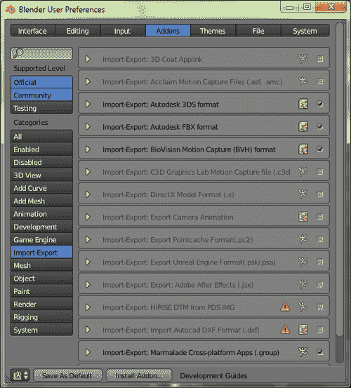

# 第四章 3D 图形渲染

普通智能手机内部的图形硬件现在能够渲染出令人惊讶的高质量 3D 图形，这对于一个足够小可以放入口袋的设备来说是非常了不起的。

Marmalade SDK 使得在你的游戏中使用 3D 图形变得极其简单，正如我们在本章接下来的主题中将要了解的那样：

+   3D 图形渲染的基本原理——投影、裁剪、光照等

+   完全通过代码创建和渲染一个简单的 3D 模型

+   从建模软件中导出 3D 模型数据

+   将导出的 3D 模型加载到内存中并渲染它们

# 3D 图形快速入门

在我们开始编写渲染代码之前，让我们简要地了解一下如何实现 3D 渲染的基本原理。如果你已经很好地掌握了 3D 渲染技术，那么你可以自由地跳过这一部分。

## 描述 3D 模型

在计算机图形学中，一个对象的 3D 表示通常被称为**模型**。当我们为视频游戏构建一个三维模型时，我们创建了一组定义模型形状的三角形。我们也可以使用四边形来简化建模过程，但在渲染时这些最终会被转换成两个三角形。

因此，3D 模型的最简单表示仅仅是一个大列表的顶点，这些顶点定义了渲染模型所需的三角形，但我们经常指定大量额外的信息，以便我们可以精确控制模型在屏幕上的显示方式。

### 指定模型的顶点流

每个 3D 模型都有一个**旋转中心**，也称为**原点**，这是模型围绕其旋转和缩放的点。在 3D 建模软件中，这个点可以放置在你想要的位置，但在游戏中为了简化数学计算，我们通常将点（0，0，0）视为旋转中心。

模型中的每个三角形都是由三个顶点定义的，每个顶点由一个 x、y 和 z 组件组成，这些组件声明了顶点在所谓的**模型空间**（有时也称为**对象空间**）中的位置。这仅仅意味着每个顶点的组件相对于模型的旋转中心。

下图展示了一个立方体的示例。旋转中心位于立方体的中心，因此是模型空间的原点。角点使用正负值，但每个组件的绝对值都是**100**，这使得立方体的边长为 200 单位。为了清晰起见，立方体的三个正面也显示了它们是如何由两个三角形构建而成的。


为了向 Marmalade 提供立方体的顶点，我们只需使用 Marmalade 的三分量浮点指针向量类`CIwFVec3`来提供一个顶点数组。与 2D 渲染一样，我们已经看到这被称为顶点流，只不过这次流由三个分量向量组成。

### 指定模型的索引流

你会注意到，在前面的图中，立方体的角已经被标注了一个数字以及它们在模型空间中的坐标。如果我们回顾一下我们在 2D 图形中的工作，我们会记得 Marmalade 通过接受一个顶点流作为输入以及一个定义这些顶点应如何处理的顺序的索引流来渲染多边形。

当渲染 3D 图形时，同样的方法也适用。我们将索引流指定为一个无符号 16 位整数数组（`uint16`），这决定了从流中读取顶点的顺序，以便进行渲染。

使用索引流的一个优点是，我们可以潜在地多次引用同一个点，而无需在顶点流中重复它，从而节省一些内存。由于索引流只是告诉 GPU 它必须按照什么顺序处理顶点、颜色、UV 和法线流中包含的数据，因此它可以是我们想要的任意长度或短。索引流甚至不需要引用其他流的每个元素，这意味着我们可以潜在地创建一组可以由多个不同的索引流引用的流。

索引流的另一个优点是，我们可以使用它们来加速渲染。你会记得我们使用`IwGxDrawPrims`函数调用来渲染 2D 多边形。要渲染 3D 多边形，我们使用完全相同的调用。对这个函数的每次调用都会导致渲染引擎必须执行一些初始化，因此如果我们能找到一种方法来最小化我们必须做出的绘制调用次数，我们就可以更快地渲染游戏世界。

我们可以通过在多边形渲染列表中插入退化多边形来实现这一点。一个**退化多边形**是指绘制时不会修改任何像素的多边形，这是通过确保构成多边形的所有顶点都位于同一直线上来实现的。大多数图形硬件足够聪明，能够识别退化多边形，并且不会浪费时间尝试渲染它。

例如，假设我们正在渲染一些三角形带。我们可以通过调用`IwGxDrawPrims`两次来渲染它们，或者我们可以用一些退化多边形将两个带子连接起来，并通过一次调用`IwGxDrawPrims`来渲染它们。我们可以继续这样做，将我们想要的任意数量的三角形带连接起来。

我们如何指定退化三角形？以下图示中显示的最简单方法是复制第一条带的第一点以及第二条带的第一点。这产生了四个退化三角形（A3A4A4、A4A4B0、A4B0B0、B0B0B1），但比多次绘制调用更可取。以下图示中的虚线显示了连接条带的额外退化三角形（这些三角形会塌陷形成一条线！）：


### 指定模型的颜色、UV 和法向量流

就像 2D 渲染一样，我们还可以提供许多其他流类型，使渲染的多边形看起来更有趣。我们可以以与二维渲染相同的方式提供颜色和纹理 UV 流，但我们还可以指定一种称为**法向量流**的第三种流类型。

在 3D 数学中，**法向量**被定义为垂直于两个其他非平行向量的向量，换句话说，就是指向多边形面向方向的向量。以下图示说明了这一点：


为什么法向量流有用？嗯，它允许我们模拟光线对我们 3D 模型的影响。通过为我们的模型每个顶点提供一个**单位法向量**（即指向多边形法线方向的向量，长度为一单位），我们可以计算从该顶点反射的光量，并相应地调整渲染的颜色。

3D 模型的实时光照可能是一个耗时的工作，所以在编写游戏时，我们尽量在可能的情况下避免这样做，以加快渲染速度。如果我们不想对 3D 模型进行光照，就没有必要指定法向量流；因此，通过不光照模型，我们也能节省内存。

在指定这些额外流时，有几个要点需要注意。

首先，Marmalade 期望提供的颜色、UV 和法向量的数量与提供的顶点数量相匹配。虽然你可以指定不同长度的流，但这通常会导致断言被触发，并且在渲染时可能会产生意外的结果。

其次，也许最重要的是，这些额外的流可能需要我们在顶点流中添加额外的顶点副本，因为我们只能提供一个索引流。

以一个立方体为例，其中每个顶点都是立方体三个不同面的角点。由于每个面指向不同的方向，我们需要将每个顶点重复三次，以便在索引流中引用，同时包含三个不同的法向量。


当顶点的 UV 或颜色跨越它所形成的每个多边形时，我们也会遇到相同的问题。

对于我们遇到的每种不同的颜色、UV 和法线组合，我们需要提供每个顶点的额外副本，因此也需要额外的颜色、UV 和法线值，以确保所有流长度相同。

## 执行 3D 到 2D 投影

当我们将我们的 3D 世界渲染到显示设备上时，我们必须以某种方式将我们的 3D 模型顶点数据转换为 2D 屏幕坐标，然后我们才能绘制任何东西。这个过程被称为**投影**，通常使用矩阵数学在坐标系之间转换顶点，直到我们得到屏幕坐标，使得构成 3D 模型的三角形可以在屏幕上渲染。


以下部分提供了将点投影到屏幕上的步骤概述，以确保你熟悉涉及的关键概念。本书不涉及 3D 图形数学的详细解释，因此预期你会熟悉矩阵是什么，以及几何操作如旋转、缩放和平移。

### 理解 3D 图形中的矩阵

回想一下学校数学课程，你可能会记得矩阵被描述为在尝试对向量执行旋转、平移和缩放等操作时是一个有用的工具。

我个人对学习矩阵的记忆是，当时它们似乎有点神奇。这里有一个数字网格，可以用来执行一系列非常有用的几何操作，更重要的是，你可以通过相乘几个矩阵来一次执行多个操作。这个概念本身是合理的，但涉及到的数字太多，看起来有点令人困惑。

在 3D 几何中，我们通常使用一个 4x4 矩阵，其中左上角的 3x3 数字网格代表矩阵的旋转和缩放部分，而底部第一行的前三个数字代表所需的平移。

虽然翻译部分对我来说完全合理，但矩阵中的 3x3 旋转和缩放部分是我从未真正掌握的部分，直到我发现矩阵的这一部分实际上代表的是 x、y 和 z 轴的大小和方向。

看一下以下图像，它显示了 4x4 矩阵的**单位矩阵**。这意味着矩阵中的每个元素都是`0`，除了从左上角到底右角的对角线上的元素，它们都是`1`：


注意到顶行前三个数字是（1，0，0），这恰好是一个沿着 x 轴的单位向量。同样，第二行是（0，1，0），它代表一个沿着 y 轴的单位向量，而第三行（0，0，1）是一个沿着 z 轴的单位向量。

一旦我意识到这一点，创建矩阵以执行不同类型的几何操作就变得更为明显。

想要围绕 y 轴旋转？只需计算出 x 轴和 z 轴需要位于的方向向量，并将这些向量放入矩阵的相关部分。同样，缩放操作只是意味着我们为每个要缩放的轴提供一个非单位大小的向量。

一些人在阅读这篇文档时可能会想“这很明显”，但如果这能帮助至少一个人更好地理解如何理解矩阵数学，我的工作就完成了！

### 坐标系之间的转换

当我们讨论 3D 模型在数据表示中的表示时，我们提到模型的顶点位于模型空间中。因此，为了使用这些顶点进行渲染，我们必须将这些模型空间顶点转换为屏幕坐标。

这个过程的第一个步骤是使用**模型矩阵**将顶点从模型空间转换为**世界空间**。模型中的每个顶点都乘以模型矩阵，这将首先旋转和缩放顶点，使模型正确定位，然后平移每个点，使模型的重心现在位于矩阵中提供的平移位置。

现在我们所有的顶点都正确地定位在我们的虚拟世界中，下一步是将它们转换为**视图空间**，这是由我们的视点的位置和方向定义的坐标系，由于显而易见的原因，通常被称为我们的相机。我们通过提供另一个称为**视图矩阵**（如果你更喜欢，也可以称为**相机矩阵**）的矩阵来完成这项工作，这个矩阵将旋转、缩放和转换世界空间顶点，使它们现在相对于我们的相机视图。

现在顶点已经位于视图空间中，最后的操作是将顶点转换为 2D 屏幕坐标。我们有两种方法来做这件事，这包括**正射投影**或**透视投影**。

正射投影将视图空间坐标仅缩放并平移每个顶点的 x 和 y 分量，将它们放置到屏幕上。顶点的 z 分量在计算实际屏幕坐标时不起作用，但它用于确定多边形的绘制顺序，因为它用作深度值。

然而，在大多数情况下，我们使用透视投影。同样，每个视图空间顶点的 x 和 y 分量用于生成 x 和 y 屏幕坐标，但这次它们被顶点的 z 分量除以，这会使远离物体的物体看起来更小。

这些分量还乘以一个称为**透视乘数**的常数。这个值实际上是视图平面距离相机的距离。视图平面是包含屏幕显示矩形区域的平面。

通常，当我们思考相机视图时，更方便的是考虑**视野**，即我们观察锥体的水平角度。以下图示显示了如何将这个角度转换为正确的透视乘数值：


投影透视的下一部分是将投影点进行转换。通常我们希望位于相机正前方的点显示在屏幕中心，因此我们会将屏幕宽度的一半加到 x 分量上，将屏幕高度的一半加到 y 分量上。可以指定不同的偏移位置，这在我们需要在游戏用户界面中显示 3D 模型时特别有用。假设你想要在屏幕右上角绘制一个玩家刚刚捡起的可收集对象的 3D 模型。指定这个屏幕位置的偏移比尝试计算相对于相机位置的 3D 空间中的位置要容易得多，这个位置等同于所需的屏幕区域。

### 裁剪平面

我们已经讨论了视图平面作为包含最终屏幕显示的平面，但还有一些其他平面用于帮助加速渲染并避免一些奇怪的图形错误发生。

首先，我们有**远裁剪平面**和**近裁剪平面**，它们与视图平面平行。我们通过提供这些平面与相机视点的垂直距离来告诉 Marmalade 这些平面应该位于何处。

远裁剪平面阻止距离相机太远的多边形被渲染，而近裁剪平面，不出所料，阻止距离相机太近的多边形被渲染。近裁剪平面尤其重要，因为我们如果不使用它，就会开始看到位于相机后面的模型在屏幕上被渲染。

你通常应该尽量使远裁剪平面和近裁剪平面尽可能靠近，因为这些值也用于计算深度缓冲区值。如果平面相隔太远，你可能会开始遇到被称为**闪烁**或**Z 冲突**的渲染问题。这些问题可能发生在深度缓冲区值分辨率不足时，导致远距离多边形渲染时边缘参差不齐，或者更糟糕的是，当它们或相机移动时，会随机穿透彼此。以下图像显示了尝试渲染两个重叠的共面多边形时可能发生的另一种 Z 冲突示例：


还有四个名为左、右、上和下的裁剪平面。这些是通过相机位置和屏幕显示区域在视平面上的左、右、上或下边界的平面。它们共同形成一个金字塔形体积，从相机发出，定义了 3D 空间中可见的部分，因此可以出现在屏幕上。

Marmalade 自动为我们管理裁剪平面，它们非常有用，因为它们允许我们快速拒绝整个模型提交渲染，如果该模型完全在屏幕之外。离屏检查是通过我们正在渲染的模型的边界球体来执行的，这只是一个以模型的重心为中心，包含模型所有顶点的球体。边界球体可以快速与所有六个裁剪平面进行测试，如果边界球体完全在裁剪体积之外，则可以跳过该模型。

## 光照

为了完成我们的 3D 入门，让我们快速看一下实时光照是如何实现的。我们不会过多关注其数学原理，因为 Marmalade 主要为我们处理这些，所以我们将只解释我们可以利用的不同类型的光照。

我们将要讨论的每种光照类型都可以随时启用或禁用。禁用不同的光照类型可以缩短渲染时间。

### 发光光照

Marmalade 提供的最简单类型的光照是**发光光照**，它只是渲染多边形自然具有的颜色量。发光光照颜色由设置在渲染多边形时的`CIwMaterial`实例提供。

发光光照对于想要用单一纯色绘制多边形很有用，但通常我们希望有更多的灵活性，因此我们可能会设置一个颜色流，或者使用其他光照形式之一。

### 环境光照

**环境光照**为我们场景中的背景光水平提供光源，例如可能由太阳提供的光。

没有环境光照，任何不是直接面向光源的多边形将几乎没有光照，因此会显得是黑色的。通常这不是非常理想，因此我们可以使用环境光照为我们的多边形提供一个基本的颜色和亮度水平。

在 Marmalade 中，我们将全局环境光照项设置为 RGB 颜色。在渲染时使用的`CIwMaterial`实例也具有一个与环境光照结合的环境光照值。如果材质的环境光照设置为亮白色，多边形将以全局环境光照的全部量进行渲染。

如果全局环境光照被禁用，则直接使用材质的环境颜色来控制渲染多边形的颜色。这提供了一种在渲染时轻松调整模型亮度和暗度的简单方法。

### 漫反射光照

为了使用**漫射照明**，我们的模型数据必须提供一个法线流。漫射光由颜色和光指向的方向组成。光的方向向量通过点积运算与模型中每个顶点的法线向量相结合。

点积运算的结果乘以全局漫射照明颜色和当前的`CIwMaterial`漫射颜色或颜色流中的 RGB 值（如果提供了的话）。这将产生用于将多边形渲染到屏幕上的最终颜色值。

### 镜面照明

与漫射照明一样，**镜面照明**只能在我们提供了法线流的情况下工作。它还需要指定漫射光，因为它依赖于漫射光的方向。

这种类型的照明使我们能够通过使模型在面向漫射光的方向上暂时变亮，使其看起来更亮。

我们可以为`CIwMaterial`指定全局和镜面光颜色，并且材料还提供了一个**镜面功率**的设置。此值允许我们缩小镜面照明的响应。数值越高，顶点法线必须几乎与照明方向平行，镜面照明才会生效。

# 使用 IwGx 渲染 3D 图形

记得我们在第二章“资源管理和二维图形渲染”中查看二维图形渲染时，我说我们将使用 IwGx，因为它会使过渡到渲染三维图形变得容易得多。现在是时候看看我的说法是否正确了！

在本节中，我们将探讨如何实现“Hello World”程序的 3D 等效——一个旋转的立方体。

## 为 3D 渲染准备 IwGx

与二维渲染一样，我们首先需要做的事情是通过调用`IwGxInit`初始化 IwGx API，当然，我们应在程序结束时调用`IwGxTerminate`。

当 IwGx 准备就绪后，我们接下来需要设置投影。我们将使用透视投影，因此我们需要能够指定我们想要使用的透视乘数值。执行此操作的代码如下：

```swift
IwGxSetPerspMul((float) IwGxGetScreenWidth() * 0.5f);
```

这行代码设置了透视乘数，以提供 90 度的视野。请参阅本章前面的*坐标系统转换*部分，了解更多关于如何计算所需的透视乘数值的信息。

接下来，我们必须设置远裁剪面和近裁剪面的距离。为了我们的演示目的，我们将近平面设置为`10`，远平面设置为`1000`；这些值设置如下：

```swift
IwGxSetFarZNearZ(1000.0f, 10.0f);
```

这些值在视图空间单位中，可以设置为任何大于零的值（远值应大于近值！）以适应我们游戏的需求。通常，远裁剪距离是最重要的，因为它需要设置得足够远，以便我们的世界能够满意地渲染，但又不能太远，以免帧率下降，因为我们渲染了太多的内容。

### 注意

你可能想知道为什么这些数字被写成 `10.0f` 而不是只是 10 或 10.0？原因是确保编译器将这些值视为单精度 `float` 值。后两种形式都将被解释为 `double`，这可能导致从 `double` 到 `float` 的耗时转换。

## 设置照明信息

为了让我们的旋转立方体看起来更有吸引力，我们将设置一些光源，以便当立方体旋转时，其表面颜色相应地改变。Marmalade 提供的照明支持可能看起来有点有限，但通常足以满足大多数移动游戏的需求。

Marmalade 只允许我们定义一个环境光和一个漫反射光。让我们首先设置全局环境光照值。

我们首先调用的第一个函数是 `IwGxSetLightType`，它接受一个 ID 数字来标识我们想要修改的光，以及一个描述我们指定光类型的定义。这个 API 可能被选择是为了让 Marmalade 能够轻松地支持更多的光源，但到目前为止，ID 数字只能是零或一，光类型必须是 `IW_GX_LIGHT_AMBIENT`、`IW_GX_LIGHT_DIFFUSE` 或 `IW_GX_LIGHT_UNUSED` 之一。后者值可以用来禁用光源。

在处理完光类型后，我们使用函数调用 `IwGxSetLightCol` 来设置光的颜色。这个函数有两个版本。两者都接受我们想要修改的光的 ID，但光的 RGB 颜色可以是三个 `uint8` 值（红色、绿色和蓝色），或者可以提供一个指向 `CIwColour` 实例的指针。

以下代码将 ID 为零的光源设置为具有中等灰色颜色的环境光：

```swift
IwGxSetLightType(0, IW_GX_LIGHT_AMBIENT);
IwGxSetLightCol(0, 128, 128, 128);
```

现在我们来创建一个具有漫反射光和镜面高光的光源。为此，我们需要两个额外的函数，`IwGxSetLightSpecularCol` 用于设置镜面高光的颜色，以及 `IwGxSetLightDirn` 用于设置光的方向。方向是以世界空间坐标为单位指定的单位向量。以下是一些示例代码：

```swift
CIwFVec3 lLightDir(1000.0f, 0.0f, 1000.0f);
lLightDir.Normalise();

IwGxSetLightType(1, IW_GX_LIGHT_DIFFUSE);
IwGxSetLightCol(1, 128, 128, 128);
IwGxSetLightSpecularCol(1, 200, 200, 200, 255);
IwGxSetLightDirn(1, &lLightDir);
```

这段代码片段设置了 ID 为 1 的光源，使其成为一个具有中等灰色强度和更亮灰色镜面高光的漫反射光。光源指向世界坐标系的 x 和 z 轴之间的 45 度角。

我们的光源现在已经初始化完成，所以剩下的就是通知 Marmalade 我们要打开它们！为此，我们有多个函数可供选择。我们可以使用`IwGxLightingOn`和`IwGxLightingOff`来启用或禁用所有已初始化的光源，或者我们可以独立地启用照明模型的每个部分。以下示例代码禁用了发射性照明，但启用了环境、漫反射和镜面照明：

```swift
IwGxLightingAmbient(true);
IwGxLightingDiffuse(true);
IwGxLightingEmissive(false);
IwGxLightingSpecular(true);
```

由于我们使用的是镜面照明，还有一件事要做。用于渲染我们的多边形的材质必须指定一个镜面颜色和功率。材质的镜面颜色用于调制全局镜面颜色，而功率值表示顶点法线必须接近光方向的程度，以便启动镜面高光。功率值是一个`uint8`值，只有非常低的值（即小于 8）才能在渲染效果中产生明显的差异。以下是说明这一点的代码：

```swift
CIwMaterial* lpMaterial = new CIwMaterial;
lpMaterial->SetColSpecular(255, 255, 255);
lpMaterial->SetSpecularPower(3);
```

### 注意

之前的例子只是利用了 Marmalade 的内置照明模型，因为它易于使用，并且对于大多数需求来说效果足够好。然而，我们完全没有必要使用这个照明模型，因为我们没有任何阻止我们使用我们想要的任何照明算法来生成自己的颜色流。或者，我们也可以使用 OpenGL ES 2.0 着色器，尽管关于这个特定主题的讨论超出了本书的范围。

## 立方体的模型数据

我们将渲染一个带有每个面不同颜色的光照立方体，因此我们需要提供顶点、颜色和法线的数据流，以及一个索引流来显示这些数据应该如何被渲染引擎解释。由于在这个例子中我们没有使用纹理，因此不需要提供 UV 流。

我们还希望我们的绘图尽可能高效，因此我们的目标是只用一次`IwGxDrawPrims`调用来绘制整个立方体。要做到这一点，我们需要每个顶点有三个副本（每个顶点所属的每个面一个），这样我们就可以为它分配不同的颜色和法线，我们还需要在我们的索引流中指定一些退化三角形，以便将所有面连接成一个大的三角形带。

让我们从顶点流开始。我们分配一个`CIwFVec3`数组，并用顶点数据初始化它。立方体的中心点将是正中心，因此所有顶点坐标将具有相同的幅度。

```swift
const uint32 lVertexCount = 24;
CIwFVec3* v = new CIwFVec3[lVertexCount];
v[0].x = 100.0f;    v[0].y = -100.0f;  v[0].z = -100.0f;
v[1].x = -100.0f;   v[1].y = -100.0f;  v[1].z = -100.0f;
v[2].x = 100.0f;    v[2].y = 100.0f;   v[2].z = -100.0f;
v[3].x = -100.0f;   v[3].y = 100.0f;   v[3].z = -100.0f;
v[4].x = 100.0f;    v[4].y = -100.0f;   v[4].z = 100.0f;
v[5].x = 100.0f;    v[5].y = -100.0f;   v[5].z = -100.0f;
v[6].x = 100.0f;    v[6].y = 100.0f;    v[6].z = 100.0f;
v[7].x = 100.0f;    v[7].y = 100.0f;    v[7].z = -100.0f;
v[8].x = 100.0f;    v[8].y = -100.0f;   v[8].z = 100.0f;
v[9].x = 100.0f;    v[9].y = 100.0f;    v[9].z = 100.0f;
v[10].x = -100.0f;  v[10].y = -100.0f;  v[10].z = 100.0f;
v[11].x = -100.0f;  v[11].y = 100.0f;   v[11].z = 100.0f;
v[12].x = -100.0f;  v[12].y = -100.0f;  v[12].z = 100.0f;
v[13].x = -100.0f;  v[13].y = 100.0f;   v[13].z = 100.0f;
v[14].x = -100.0f;  v[14].y = -100.0f;  v[14].z = -100.0f;
v[15].x = -100.0f;  v[15].y = 100.0f;   v[15].z = -100.0f;
v[16].x = -100.0f;  v[16].y = 100.0f;   v[16].z = -100.0f;
v[17].x = -100.0f;  v[17].y = 100.0f;   v[17].z = 100.0f;
v[18].x = 100.0f;   v[18].y = 100.0f;   v[18].z = -100.0f;
v[19].x = 100.0f;   v[19].y = 100.0f;   v[19].z = 100.0f;
v[20].x = -100.0f;  v[20].y = -100.0f;  v[20].z = -100.0f;
v[21].x = -100.0f;  v[21].y = -100.0f;  v[21].z = 100.0f;
v[22].x = 100.0f;   v[22].y = -100.0f;  v[22].z = -100.0f;
v[23].x = 100.0f;   v[23].y = -100.0f;  v[23].z = 100.0f;
```

顶点是按面顺序排列的，所以前四个顶点形成立方体的前面，接下来的四个形成右手面，依此类推。你可以自由地指定顺序，因为最终是索引流将决定单个三角形的渲染方式。

现在我们将创建法线流。在 Marmalade 中，法线也被指定为`CIwFVec3`实例，并且它们应该具有单位长度。这意味着向量的模长应该是一。下面是一个执行此任务的代码片段：

```swift
CIwFVec3* n = new CIwFVec3[lVertexCount];
n[0].x = 0.0f;      n[0].y = 0.0f;    n[0].z = -1.0f;
n[1].x = 0.0f;      n[1].y = 0.0f;    n[1].z = -1.0f;
n[2].x = 0.0f;      n[2].y = 0.0f;    n[2].z = -1.0f;
n[3].x = 0.0f;      n[3].y = 0.0f;    n[3].z = -1.0f;
n[4].x = 1.0f;      n[4].y = 0.0f;    n[4].z = 0.0f;
n[5].x = 1.0f;      n[5].y = 0.0f;    n[5].z = 0.0f;
n[6].x = 1.0f;      n[6].y = 0.0f;    n[6].z = 0.0f;
n[7].x = 1.0f;      n[7].y = 0.0f;    n[7].z = 0.0f;
n[8].x = 0.0f;      n[8].y = 0.0f;    n[8].z = 1.0f;
n[9].x = 0.0f;      n[9].y = 0.0f;    n[9].z = 1.0f;
n[10].x = 0.0f;     n[10].y = 0.0f;   n[10].z = 1.0f;
n[11].x = 0.0f;     n[11].y = 0.0f;   n[11].z = 1.0f;
n[12].x = -1.0f;    n[12].y = 0.0f;   n[12].z = 0.0f;
n[13].x = -1.0f;    n[13].y = 0.0f;    n[13].z = 0.0f;
n[14].x = -1.0f;    n[14].y = 0.0f;    n[14].z = 0.0f;
n[15].x = -1.0f;    n[15].y = 0.0f;    n[15].z = 0.0f;
n[16].x = 0.0f;     n[16].y = 1.0f;    n[16].z = 0.0f;
n[17].x = 0.0f;     n[17].y = 1.0f;    n[17].z = 0.0f;
n[18].x = 0.0f;     n[18].y = 1.0f;    n[18].z = 0.0f;
n[19].x = 0.0f;     n[19].y = 1.0f;    n[19].z = 0.0f;
n[20].x = 0.0f;     n[20].y = -1.0f;   n[20].z = 0.0f;
n[21].x = 0.0f;     n[21].y = -1.0f;   n[21].z = 0.0f;
n[22].x = 0.0f;     n[22].y = -1.0f;   n[22].z = 0.0f;
n[23].x = 0.0f;     n[23].y = -1.0f;   n[23].z = 0.0f;
```

现在我们需要一个颜色流。就像在 2D 渲染中一样，这需要一个`CIwColour`实例的数组。下面是代码片段！

```swift
CIwColour* c = new CIwColour[lVertexCount];
c[0].Set(255, 0, 0, 255);
c[1].Set(255, 0, 0, 255);
c[2].Set(255, 0, 0, 255);
c[3].Set(255, 0, 0, 255);
c[4].Set(255, 255, 0, 255);
c[5].Set(255, 255, 0, 255);
c[6].Set(255, 255, 0, 255);
c[7].Set(255, 255, 0, 255);
c[8].Set(0, 255, 0, 255);
c[9].Set(0, 255, 0, 255);
c[10].Set(0, 255, 0, 255);
c[11].Set(0, 255, 0, 255);
c[12].Set(0, 0, 255, 255);
c[13].Set(0, 0, 255, 255);
c[14].Set(0, 0, 255, 255);
c[15].Set(0, 0, 255, 255);
c[16].Set(0, 255, 255, 255);
c[17].Set(0, 255, 255, 255);
c[18].Set(0, 255, 255, 255);
c[19].Set(0, 255, 255, 255);
c[20].Set(255, 128, 0, 255);
c[21].Set(255, 128, 0, 255);
c[22].Set(255, 128, 0, 255);
c[23].Set(255, 128, 0, 255);
```

最后，是创建索引流的时候了。同样，就像在 2D 渲染中一样，这只是一个`uint16`值的数组，它指示了流中元素应该被访问的顺序。下面是代码：

```swift
const uint32 lIndexCount = 34;
uint16* i = new uint16[lIndexCount];

// Front face (red)
i[0] = 0;  i[1] = 1;  i[2] = 2;  i[3] = 3;
// Degenerate
i[4] = 3;  i[5] = 7;
// Right face (yellow)
i[6] = 7;  i[7] = 6;  i[8] = 5;  i[9] = 4;
// Degenerate
i[10] = 4;  i[11] = 9;
// Back face (green)
i[12] = 9;  i[13] = 11;  i[14] = 8;  i[15] = 10;
// Degenerate
i[16] = 10;  i[17] = 12;
// Left face (blue)
i[18] = 12;  i[19] = 13;  i[20] = 14;  i[21] = 15;
// Degenerate
i[22] = 15;  i[23] = 16;
// Bottom face (cyan)
i[24] = 16;  i[25] = 17;  i[26] = 18;  i[27] = 19;
// Degenerate
i[28] = 19;  i[29] = 23;
// Top face (orange)
i[30] = 23;  i[31] = 21;  i[32] = 22;  i[33] = 20;
```

注意，流中的前四个值定义了立方体的第一个完整面。接下来的两个值形成一个退化三角形，它允许我们将第一个面与第二个面连接起来，而实际上并不渲染任何内容。正如我们在本章前面看到的，将两个三角形带连接起来的最简单方法是将第一个带的最后一个索引重复，并以它的第一个索引的两个副本开始下一个带。这种模式一直持续到我们绘制了立方体的最后一个面。

规定顶点的顺序是最重要的考虑因素，因为我们必须确保我们得到正确的裁剪模式。对于背面裁剪（即远离相机的面不会被渲染），我们需要第一个指定的三角形顶点的顺序为逆时针。

由于我们使用三角形带，顶点的顺序实际上在逆时针和顺时针之间交替。通常我们不必太担心这一点，因为带中顶点的自然顺序会处理它，但当你尝试将包含奇数个顶点的三角形带连接起来时，这可能会引起问题。

### 注意

将三角形带与退化三角形连接的一般规则是，具有奇数个点的带需要反转下一个带中点的顺序。例如，如果你的第一个三角形带包含奇数个点，下一个带的第一个三角形需要按顺时针而不是逆时针顺序指定；否则它将不会被正确裁剪。

## 视图矩阵

在渲染 3D 图形时，我们需要能够提供我们想要从哪个位置和方向查看游戏世界的信息。我们通过提供视图或相机矩阵来实现这一点；在 Marmalade 中，可以使用`CIwFMat`类的实例来完成。

`CIwFMat` 类使用一个 3 x 3 的 `float` 数组来表示旋转部分，以及 `CIwFVec3` 来表示平移部分，来表示一个 4 x 4 矩阵。4 x 4 矩阵的其余元素（即最右侧的数字列）被固定为与单位矩阵相同（从列的顶部到底部依次为 0, 0, 0, 和 1）。这些值对正常的 3D 变换没有任何影响；因此，通过省略它们，我们可以节省内存，并且可以通过不执行这些矩阵部分的乘法来使矩阵乘法代码稍微更高效。

是时候创建一个合适的视图矩阵了。为了我们旋转立方体的目的，如果我们能够指定摄像机的位置，然后计算矩阵的正确旋转来查看我们的立方体，那将很好。幸运的是，矩阵类有一个名为 `LookAt` 的方法，这使得这变得容易实现：

```swift
CIwFMat vm;
vm.t.x = 0.0f;  vm.t.y = 0.0f;  vm.t.z = -400.0f;
vm.LookAt(vm.t, CIwFVec3::g_Zero, CIwFVec3::g_AxisY);
```

之前的代码声明了一个新的 `CIwMat` 实例，并将其平移设置为 (0, 0, -400)。然后我们调用 `LookAt` 方法，该方法传递我们想要放置摄像机的位置，我们想要它朝向的空间中的点，以及垂直向上的单位向量。

Marmalade 在 3D 渲染时的默认坐标系中，x 轴的正方向从屏幕的左侧到右侧运行，而 z 轴的正方向进入屏幕。然而，正 y 轴的方向是从屏幕顶部到底部，这可能不是你最初预期的。我们习惯于将地面以上的高度视为正数，但在 Marmalade 中，它将是负数。

一旦我们有了视图矩阵，我们就可以使用一个指向矩阵的 `const` 指针调用函数 `IwGxSetViewMatrix`。

## 模型矩阵

模型矩阵用于在世界上定位我们的 3D 模型，并允许它按需旋转或缩放。与视图矩阵一样，可以使用 `CIwFMat` 实例指定模型矩阵。

对于我们的旋转立方体，我们将创建一个矩阵，使立方体围绕 x 和 y 轴旋转。我们通过创建两个矩阵来实现这一点，一个用于 x 轴旋转，另一个用于 y 轴旋转，然后将它们相乘。我们将立方体定位在世界的原点。

```swift
CIwFMat lModelMatrix;
lModelMatrix.SetRotY(lRotationY);
CIwFMat lRotX;
lRotX.SetRotX(lRotationX);
lModelMatrix.PreMult(lRotX);
```

显示的代码声明了两个 `CIwFMat` 实例，并使用 `SetRotY` 和 `SetRotX` 方法生成围绕 y 和 x 轴的旋转矩阵。旋转角度由两个变量 `lRotationY` 和 `lRotationX` 提供，这两个变量都是 `float` 类型，表示旋转的角度（以弧度为单位）。如果我们增加这两个变量的值，每次主游戏循环迭代，它将改变立方体的方向，使其在渲染时看起来在旋转。

### 注意

在使用矩阵类的 `SetRotX`、`SetRotY` 和 `SetRotZ` 方法时要小心。这些方法接受两个额外的 `bool` 参数，允许将矩阵的平移部分以及矩阵 3x3 旋转部分中未使用的任何元素置零。这两个参数默认为 `true`；因此，特别是如果你在调用这些方法之前在矩阵中设置了平移，除非你指定第二个参数为 `false`，否则它将会丢失。

一旦我们有了两个旋转矩阵，我们就可以使用 `PreMult` 方法将它们相乘以生成最终的模型矩阵。矩阵相乘的顺序非常重要，因为最终的旋转将取决于使用的顺序。Marmalade 提供了 `PreMult` 和 `PostMult` 方法，使我们能够确定调用矩阵是乘法中的第一个矩阵还是第二个。

当我们准备好模型矩阵后，只需调用 `IwGxSetModelMatrix` 函数来用于渲染。

## 模型渲染

所有艰苦的工作现在都完成了，我们最终可以提交我们的立方体进行渲染。以下代码将提交所有流，我们的立方体将被渲染。希望你会看到它与我们用于 2D 渲染的代码是多么接近：

```swift
IwGxSetColClear(128, 190, 220, 255);
IwGxClear();

IwGxSetMaterial(lpMaterial);
IwGxSetVertStreamModelSpace(v, lVertexCount);
IwGxSetNormStream(n, lVertexCount);
IwGxSetColStream(c);
IwGxDrawPrims(IW_GX_TRI_STRIP, i, lIndexCount)

IwGxFlush();
IwGxSwapBuffers();
```

# 使用 3D 建模包创建模型数据

我们已经看到了如何在代码中创建立方体的数据流，坦白说它并不美观！即使是像立方体这样简单的形状也需要如此多的数据，以至于我们很难跟踪所有这些数据，几乎不可能创建一个更复杂的 3D 形状。

幸运的是，有一个更简单的方法。我们可以使用 3D 建模包来创建、着色和纹理 3D 模型，并将所有所需数据导出为 Marmalade 可以加载和使用的格式。

## Marmalade 3D 导出插件

Marmalade 随带提供了用于大多数专业游戏开发工作室中使用的两个建模包——Maya 和 3DS Max 的导出插件。以下各节中的详细信息同样适用于这两个建模包的导出插件。

### 安装插件

当你安装主 SDK 时，导出插件会被安装到你的电脑上，但它们不会自动安装到建模包中以供使用。为了使用导出插件，我们必须使用 **Marmalade Launch Pad** 程序来设置，如下步骤所示：

1.  启动 **Marmalade LaunchPad** 程序。在 Windows 上，它可以在 **开始** 菜单中的 **Marmalade** 文件夹内找到。你应该会看到一个窗口出现，其中包含一个标签页视图。

1.  点击标签页上标记为 **安装导出插件** 的选项。以下屏幕应显示：

1.  使用此屏幕上的选项卡选择您想要安装的 3D 建模软件版本。您必须选择您软件的正确版本，以及它是 32 位还是 64 位安装。Maya 7.0 和 3DS Max 8.0 是最早支持的版本。旧版本的导出器包含在标记为**Maya 32bit Legacy**和**Max 32bit legacy**的选项卡中。

1.  点击所需建模软件版本旁边的**安装…**按钮，导出器将被安装。Windows 用户账户控制可能会首先弹出一个请求，以确保您想要继续，所以只需在此对话框中点击**是**按钮。

### 导出模型

安装插件后，启动您的 3D 建模软件并创建或加载您想要导出的模型。由于这是一本编程书籍，我们不会详细介绍如何创建 3D 模型。

### 注意

如果您是从事编程工作且对如何使用 3D 建模软件毫无头绪，请不要感到难过。多年来，我见过一些真正糟糕的“程序员艺术”作品；所以，将这种知识的缺乏视为一件好事，并让真正的艺术家参与到您游戏的艺术作品中来。您会为您的决定感到高兴的！

假设您有一个准备导出的 3D 模型，让我们启动 Marmalade 导出器插件。导出器窗口本身如图所示：


导出器窗口的显示方式取决于您使用的建模软件。

+   在 Maya 中，您可以通过使用菜单选项**Marmalade Tools** | **Marmalade Studio: Maya Exporter**或从**Marmalade Studio**标签中的图标来访问导出器。

+   在 3DS Max 中，可以通过点击**实用工具**选项卡，然后点击**Marmalade Studio Exporter**按钮来打开导出器部分。在展开部分中，还有一个标记为**Marmalade Studio Exporter**的按钮，它将显示导出器窗口。

导出器窗口现在应该显示在屏幕上，如您所见，有许多可用的选项。现在我们可以不用大多数这些选项，所以我们只会介绍我们需要用来导出非动画 3D 模型的那些选项。

我们需要设置的第一件事是**当前项目**字段。导出器维护一个项目列表，在其最简单的层面上，这是一个快速选择导出模型文件将创建的目录的方法。

由于我们尚未创建导出器项目，让我们通过点击标记为**设置项目**的按钮来创建一个。以下对话框将出现：


要创建一个新项目，请点击对话框底部的**添加…**按钮，您将被提示输入项目的名称。一旦您接受名称，项目将出现在**项目：**列表中。

点击**浏览…**按钮，定位到我们的代码项目中的`data`目录。所有资源文件都需要位于我们的代码项目的`data`目录中；这将使得将模型文件导出到正确的位置变得容易得多。

目前我们将忽略此对话框中的其他设置，因为它们超出了本章的范围；因此，点击**确定**按钮返回主导出窗口，此时应该在新创建的项目在**当前项目**下拉列表中选中，并且我们在**项目数据目录**字段中设置的`data`目录。

设置好项目后，我们现在可以按照以下步骤导出模型：

1.  首先定位到**导出类型**字段。此字段旁边有一个带有大于符号的按钮。点击此按钮，从出现的弹出菜单中选择**模型**。**导出类型**字段应更改为**场景（模型**）。

1.  现在看看第一组标记为**启用导出**的复选框。我们只需要勾选**几何形状**和**导出组**选项来导出正确的文件集。

1.  下一个标记为**导出标志**的复选框组。我们不需要勾选任何这些设置。

1.  现在我们到达了**资产名称**字段。这个字段指定了导出器生成各种输出文件时将使用的基准文件名。

1.  **保存位置**字段允许提供相对于**项目数据目录**字段的目录路径。所有生成的文件都将创建在这个目录中，如果该目录不存在，它将被创建。

1.  **缩放因子**允许我们提供一个数值缩放因子，该因子将应用于每个导出顶点的 x、y 和 z 分量。这使得艺术家可以使用熟悉的单位（如建模包中的米）来创建他们的模型，然后将这些单位转换为不同的比例用于游戏，例如我们程序员类型所喜爱的“2 的幂”这样的常用比例。然而，请注意，确保所有参与项目的艺术家使用相同的单位和缩放因子至关重要，否则在尝试让所有这些模型在游戏中正确协同工作时会遇到真正的问题！

1.  接下来，我们可以通过标签为**导出**的下拉列表选择导出当前场景中的所有内容、仅选定的对象，或仅可见对象。

1.  **变换类型**下拉框让我们选择导出的顶点是在模型空间还是世界空间中。在大多数情况下，当我们导出单个模型时，我们会选择**局部**选项（这也是模型空间的一种说法！）。

1.  我们可能感兴趣的最后设置是**纹理目录**字段。这个字段允许指定一个目录，模型上要使用的任何纹理都将从这个目录导出。它可以是绝对路径，也可以是相对于**项目数据目录**的相对路径。

1.  这就完成了我们目前需要关注的全部字段。接下来要做的就是点击 **导出**！按钮，这将生成必要的文件，并显示一个窗口，列出导出过程中创建的所有文件。

## Blender 插件

毫无疑问，Maya 和 3DS Max 都是出色的产品，但它们的价格也相当昂贵。不幸的是，Marmalade 似乎依赖于使用这两个重量级软件包之一。

承认，Marmalade 也附带了一个用于 **Collada** 的转换器，这是一种创建用于在不同软件包之间交换 3D 模型的文件格式。然而，我犹豫是否推荐这种方法，因为在撰写本文时，Marmalade 附带的 Collada 转换器已知存在一些问题，尤其是在导出动画时。

幸运的是，有一个更便宜的替代方案。有一个名为 Blender 的 3D 建模软件包，可以免费下载和使用；然而，Blender 团队总是乐于接受捐赠以持续改进产品，所以如果您觉得它有用，请考虑帮助他们。

Marmalade SDK 并不自带对 Blender 的支持，但幸亏有 Benoit Muller 的努力，有一个相当酷的导出插件，它能很好地替代 3DS Max 和 Maya 的导出器。

### 安装 Blender 和导出插件

如果您还没有安装 Blender，请访问 Blender 网站，下载一个副本。URL 如下：

[`www.blender.org/`](http://www.blender.org/)

安装 Blender 只需执行下载的安装程序并遵循屏幕上的说明。

安装 Blender 后，我们现在需要获取导出插件，该插件可以在以下 URL 中找到：

[`wiki.blender.org/index.php/Extensions:2.6/Py/Scripts/Import-Export/Marmalade_Exporter`](http://wiki.blender.org/index.php/Extensions:2.6/Py/Scripts/Import-Export/Marmalade_Exporter)

该插件是一个 Python 脚本，可以使用以下步骤安装到 Blender 中：

1.  将下载的插件文件 `io_export_marmalade.py` 复制到 Blender 插件目录中。在 Windows 上，这通常类似于 `C:\Program Files\Blender Foundation\Blender\2.63\scripts\addons`。

1.  启动 Blender 并转到 **文件** | **用户首选项…**。

1.  点击首选项窗口顶部的 **插件** 选项卡。

1.  在窗口左侧的 **类别** 列表中，点击 **导入-导出**。您应该看到一个类似于以下图所示的屏幕：

1.  找到 **导入-导出：Marmalade 跨平台应用 (.group**) 条目，并点击其右侧的复选框以启用插件。

### 导出模型

要使用 Blender 导出器导出 3D 模型，请按照以下步骤操作：

1.  在 Blender 中创建或加载您希望导出的模型。

1.  转到**文件** | **导出** | **Marmalade 跨平台应用(.group)**。主 3D 视图将被文件名请求器替换。窗口的左下角应包含导出选项，并看起来像以下图像：

1.  首先使用文件请求器选择要导出数据文件的位置。屏幕顶部有两个文本编辑框；最上面的用于保存目录，下面的指定了导出时想要使用的文件名。这个文件名应该是 GROUP 文件，因此其扩展名始终是`.group`。

1.  在导出设置中，首先使用**导出**下拉列表选择是要导出所选模型还是当前场景中的所有模型。

1.  **合并**选项控制当场景中有多个模型要导出时会发生什么。默认选项**无**将每个模型单独导出，其坐标在模型空间中，这是我们目前需要的选项。其他两个选项允许将多个模型合并为一个大的多边形网格或作为多个单独的网格导出，所有顶点都指定在世界空间坐标中。

1.  **缩放百分比**值允许模型顶点进行放大或缩小，以便艺术家可以使用 Blender 中最方便的测量单位来构建模型，同时仍然允许导出的模型具有顶点缩放到一组可能对游戏更有用的单位。

1.  **翻转法线**复选框将反转所有导出法线的方向。通常情况下可以不勾选，但有时可以用来修复被错误照明且法线指向错误方向的模型。

1.  **应用** **修改器**复选框会在创建导出数据之前评估 Blender 中应用于模型的任何网格修改器。默认情况下是关闭的。

1.  如果模型已应用顶点颜色，则只有在选择**导出顶点颜色**复选框时才会导出。

1.  下一个复选框，**导出材质颜色**，确定在导出过程中创建的材质是否带有其定义的颜色导出。

1.  如果您的模型中有纹理映射的多边形，则应勾选**导出纹理和 UVs**复选框。

1.  由于 Marmalade 需要访问用于模型纹理化的任何图像，因此可以选择**复制纹理文件**复选框以确保图像文件也被复制到导出目录中。

1.  剩余的设置大多与导出动画有关，因此现在可以忽略它们；然而，值得提及的是**详细**复选框，它将导出过程的信息记录到 Blender 的控制台窗口中。这可能会帮助您解决导出过程不按预期工作时的模型问题。

1.  当所有设置都完成后，点击位于 Blender 窗口右上角的**导出 Marmalade**按钮。或者，如果您想取消导出过程，导出按钮下方有一个**取消**按钮。

# Marmalade 3D 模型数据文件格式

我们已经看到了如何从建模软件包中导出 3D 模型数据，但我们还没有查看作为导出过程一部分生成的文件。

虽然我们可能不需要手动修改这些文件，但了解一些关于它们的信息是有用的，因为它可以帮助我们发现为什么模型没有像预期的那样导出。

让我们看看与我们在本章早期代码中创建的类似立方体模型将生成的文件。

## GROUP 文件

生成的第一个文件是一个 GROUP 文件，它将在导出设置中指定的目录中创建。GROUP 文件包含导出的单个模型文件（称为**GEO 文件**）的列表。以下是示例立方体模型的 GROUP 文件可能的样子：

```swift
// Source file: C:/Work/MarmaladeBook/Maya/Cube.mb
// Exported By: Sean on 05/30/12 16:30:55

CIwResGroup
{
  name "Cube"
  "./models/Cube.geo"
}
```

导出器有帮助地包括了用于导出的源建模软件包文件的名称，以及导出时间和导出者信息。

然后它只是声明了一个新的`CIwResGroup`实例，其名称基于导出时指定的资产名称。资源组由需要加载的 GEO 文件列表填充。

## MTL 文件

当我们处理 2D 图形时，我们已经手动创建了一个 MTL 文件，所以它应该已经很熟悉了。以下是对于立方体的文件可能的样子：

```swift
// Source file: C:/Work/MarmaladeBook/Maya/Cube.mb
CIwMaterial
{
  name "Cube/phong1"
  colAmbient {127,127,127}
  colDiffuse {127,127,127}
  colSpecular {255,255,255}
  specularPower 3
}
```

同样，导出器包括了用于生成 MTL 文件的源建模软件包文件的名称。在此文件中定义的`CIwMaterial`实例都是从建模软件包中使用的材料生成的，因此艺术家可以在他们最喜欢的建模工具中轻松更改颜色和其他材料属性。

导出器在指定的导出目录中创建一个名为`models`的子目录，并将 MTL 文件写入此目录。

## GEO 文件

要导出的最重要的文件类型是 GEO 文件，因为这个文件实际上包含了描述我们的 3D 模型所需的所有数据。与所有 Marmalade 资源一样，此文件是 ITX 文件格式的另一种用途。

GEO 文件通过一个名为`CIwResHandlerGEO`的资源处理类进行处理。这个类负责从 GEO 文件中加载所有数据并将其提交给一个名为`CIwModelBuilder`的单例类。这个类处理模型数据并生成用于快速渲染的数据优化版本，然后将其序列化到文件中。

`CIwModelBuilder`类仅在调试构建中可用，因此您只能通过加载引用 GEO 文件的 GROUP 文件的序列化版本来在发布构建中加载模型数据。

导出器将以与 MTL 文件相同的方式将 GEO 文件写入模型的子目录中。

### 注意

你可能已经注意到，之前显示的 GROUP 文件只引用了 GEO 文件，而没有引用 MTL 文件。GEO 资源处理程序会自动处理 MTL 文件的加载，通过检查是否存在与 GEO 文件具有相同基本名称的 MTL 文件。

让我们来看看我们的立方体模型的 GEO 文件的内部结构。

```swift
// Source file: C:/Work/MarmaladeBook/Maya/Cube.mb
CIwModel
{
  name "Cube"
  CMesh
  {
    name "Cube"
    scale 100.0
    CVerts
    {
      numVerts 8
      v {-100,-100,100}
      v {100,-100,100}
      v {-100,100,100}
      v {100,100,100}
      v {-100,100,-100}
      v {100,100,-100}
      v {-100,-100,-100}
      v {100,-100,-100}
    }
    CVertNorms
    {
      numVertNorms 6
      vn {0,0,1}
      vn {0,1,0}
      vn {0,0,-1}
      vn {0,-1,0}
      vn {1,0,0}
      vn {-1,0,0}
    }
    CVertCols
    {
      numVertCols 6
      col {1,0,0,1}
      col {0,1,1,1}
      col {0,0,1,1}
      col {1,1,0,1}
      col {1,0.50000,0,1}
      col {0,1,0,1}
    }
    CSurface
    {
      material "phong1"
      CQuads
      {
        numQuads 6
        q {2,0,-1,-1,0} {3,0,-1,-1,0} {1,0,-1,-1,0}
{0,0,-1,-1,0}
        q {4,1,-1,-1,4} {5,1,-1,-1,4} {3,1,-1,-1,4}
{2,1,-1,-1,4}
        q {6,2,-1,-1,5} {7,2,-1,-1,5} {5,2,-1,-1,5}
{4,2,-1,-1,5}
        q {0,3,-1,-1,1} {1,3,-1,-1,1} {7,3,-1,-1,1}
{6,3,-1,-1,1}
        q {3,4,-1,-1,3} {5,4,-1,-1,3} {7,4,-1,-1,3}
{1,4,-1,-1,3}
        q {4,5,-1,-1,2} {2,5,-1,-1,2} {0,5,-1,-1,2}
{6,5,-1,-1,2}
      }
    }
  }
}
```

再次，导出器将在开始定义`CIwModel`实例之前包含一个注释，引用源建模包文件。`CIwModel`是 Marmalade 用来表示完整 3D 模型数据集合的类。

首先给`CIwModel`实例起一个名字。这个名字实际上来自建模包中给出的模型名称，并且是我们代码中访问模型时使用的名称，因此对于艺术家来说，合理命名是很重要的。

接下来声明一个`CMesh`实例，这是一个将所有各种模型数据组合在一起的类。这个类以及我们即将看到的包含在其内的所有其他类，仅用于模型构建器内部。一旦模型被处理，这些类将不再存在于内存中，因此我们无法在代码中使用它们来访问原始模型数据。

用于导出顶点数据的`scale`值首先列在`CMesh`实例中，随后是声明各种模型数据类型的类。在立方体示例中，我们可以看到`CVerts`、`CVertNorms`和`CVertCols`，它们分别只是包含顶点、法线和颜色数据的大列表。还有一个类似的类`CUVs`，它用于提供纹理信息。

接下来我们看到一个名为`CSurface`的类。这个类为模型提供多边形信息，并且对于模型中使用的每种材质都会存在一个实例。使用的材质首先被指定，然后是多边形信息。`CQuads`实例用于提供使用该材质的所有四边形多边形的列表，而`CTris`实例列出三角形多边形。

多边形通过为多边形中的每个顶点提供一组数据来定义。多边形以一组五个数字的形式提供，这些数字是文件中之前指定的数据块的索引，并按以下顺序出现：

```swift
{Vertex index, Normal index, UV 0 index, UV 1 index, Color index}
```

由于材质可以指定两个将在渲染时混合在一起的纹理，因此存在两个 UV 值。每个纹理都可以有自己的 UV 流。

一旦所有这些数据都被加载，模型构建类将分析它们并创建一个针对实时渲染目的远更优化的数据版本。

# 加载和渲染导出的 3D 模型

好的，现在我们已经导出了模型数据，那么我们如何将其加载到我们的程序中并进行渲染呢？实际上，这出奇地简单，接下来的几节将会展示这一点。

## 将 IwGraphics API 添加到项目中

Marmalade 的 3D 模型渲染代码是 IwGraphics API 的一部分，因此在我们能够绘制任何东西之前，我们需要将这个库添加到我们的项目中。这是通过在 MKB 文件的 `subprojects` 部分添加 `iwgraphics` 来实现的。

我们需要在程序的开始处添加对 `IwGraphicsInit` 的调用，并在结束时添加 `IwGraphicsTerminate`。这个 API 依赖于 IwGx 和 IwResManager，因此我们必须在调用 IwGraphics 之前调用这两个 API 的初始化函数。

## 加载和访问导出的 3D 模型

你可能已经猜到了，这几乎是微不足道的简单。导出器生成了一个 GROUP 文件，所以我们只需要将其加载到内存中，然后从资源组中提取模型。以下是一段执行此操作的代码块：

```swift
CIwResGroup* lpCubeGroup = IwGetResManager()->
LoadGroup("Cube/Cube.group");
CIwModel* lpCube = static_cast<CIwModel*>(lpCubeGroup->
GetResNamed("Cube", "CIwModel"));
```

或者，如果你不想保留资源组实例的指针，你可以这样做：

```swift
CIwModel* lpCube = static_cast<CIwModel*>(IwGetResManager()->
GetResNamed("Cube", "CIwModel"));
```

就这样。模型现在已加载到内存中，并准备好渲染。

## 渲染导出的 3D 模型

现在是时候在屏幕上渲染模型了，这同样非常简单。我们只需要使用 `IwGxSetViewMatrix` 和 `IwGxSetModelMatrix` 设置我们的视图和模型矩阵，然后执行以下操作：

```swift
lpCube->Render();
```

变量 `lpCube` 是指向我们从上一节资源管理器中检索到的 `CIwModel` 实例的指针。

实际上，`Render` 方法可以接受两个可选参数。第一个参数是一个 `bool` 值，它告诉 Marmalade 检查模型的边界球体是否与裁剪平面相交，以确定它是否实际上需要被渲染。此参数默认为 `true`，因此默认情况下会进行此检查。边界球体是由模型构建器代码自动为我们生成的。

第二个参数是标志字段。除了一个与 2D 屏幕旋转有关（我说“有关”是因为我在尝试时并没有发现它做了很多）的标志之外，其他标志仅在与包含法线数据的动画 3D 模型处理时相关，所以我们现在不必担心这些。

## 释放 3D 模型数据

由于我们的 3D 模型数据已经使用资源组系统加载到内存中，我们可以利用相同的销毁组机制来释放不再需要的模型数据。作为一个回顾，如果我们有一个指向包含 3D 数据的 `CIwResGroup` 的指针，我们只需做以下操作：

```swift
IwGetResManager()->DestroyGroup(lpCubeGroup);
```

或者，我们可以通过按名称销毁它来从内存中释放一个组，如下所示：

```swift
IwGetResManager()->DestroyGroup("Cube");
```

# 示例代码

这里有一些关于本章附带示例项目的详细信息。

## The Cube project

这是本章讨论的第一个旋转立方体项目的完整示例，其中我们在代码中生成模型数据，并使用 `IwGxDrawPrims` 将其提交给 IwGx 进行渲染。请参见以下截图：


## Cube2 项目

这个项目几乎与上一个项目完全相同，只是将立方体的模型数据从 3D 建模软件导出为 GEO 文件。

## 滑雪项目

对于本章，滑雪游戏告别了其旧的位图图形，转而迎来了一些新的 3D 模型。以下图中可以看到带有新 3D 外观的游戏截图：


以下几节描述了本章游戏代码的一些其他更有趣的更改。

### 迁移到 3D

第一步是将所有位置和速度信息从二维向量更改为三维向量，这意味着将`CIwVec2`实例更改为`CIwFVec3`，并确保向量的额外分量被初始化。

由于我们倾向于将 y 轴视为地面以上的高度，所以在游戏中 y 分量也被用来表示高度。然而，由于滑雪者和树木都粘在了地面上，这意味着所有位置向量的 y 分量始终为零。

因此，游戏沿着 z 轴滚动树木，并将摄像机放置在空中并朝向滑雪者。这仍然提供了树木向上移动屏幕的效果。

第二步是去除所有旧的 2D 纹理，并用 3D 模型替换它们。由于`GameObject`类处理所有渲染，所以只需将这个类更改为使用`CIwModel`实例而不是`CIwMaterial`实例。子类随后只需提供一个指向模型的指针而不是指向材质的指针。

`GameObject`类还添加了一个 y 轴旋转。这用于旋转滑雪者模型，这比我们之前的方法运动更加平滑。

树木也使用了旋转功能。游戏只包含一个树模型，但通过在随机角度旋转它，可以在不增加更多游戏资源的情况下使游戏看起来更加有趣。

### 添加碰撞检测系统

代码现在具有一个非常简单的碰撞检测系统。`GameObject`类现在允许设置碰撞半径，然后用于执行球体相交测试。

`ModeGame::Update`方法现在遍历游戏世界中的每个游戏对象（目前当然是树木），并找出它距离滑雪者的距离。如果距离小于滑雪者和另一个游戏对象的碰撞半径之和，则发生了碰撞。

因此，为了处理这些碰撞，在`GameObject`类中添加了一个名为`OnCollide`的虚方法。子对象可以重写这个类，并在与另一个对象发生碰撞时相应地做出反应。`Skier`类实现了这个方法，因此每当滑雪者与树木碰撞时，游戏就结束了。

# 摘要

我们现在知道如何渲染由代码生成或从 3D 建模软件导出的 3D 图形。我们最终使用哪种方法取决于我们想要做什么。

如果是在游戏角色或场景中进行渲染，那么导出模型路径无疑是最好的选择；但通过代码创建自己的多边形数据是一种更好、更高效的方法来创建如粒子系统等效果，因为它更容易将大量单独的多边形批量合并成一个单独的绘制调用。

我们还学会了如何从三个不同的建模软件——Maya、3DS Max 和 Blender——导出 3D 模型数据，并将这些导出的数据加载到我们的程序中并对其进行渲染。

我们将暂时继续使用 3D 渲染，因为下一章全部是关于使我们的模型动画化的内容。
