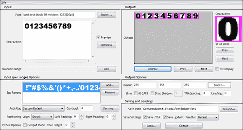

# 第六章：实现字体、用户界面和本地化

现在我们有了创建充满动画角色的 3D 世界的知识，我们真的需要开始思考如何改善我们向玩家展示的用户界面的外观。

在本章中，我们将涵盖以下内容：

+   创建可用于 Marmalade 项目的字体

+   文本的绘制和格式化

+   讨论实现您游戏用户界面的方法

+   将您的游戏本地化为多种语言

# 实现字体

改善我们游戏外观的第一步是告别调试字体，用一些更时尚的东西来替换它。Marmalade SDK 附带了一个名为 IwGxFont 的 API，专门用于字体渲染，让我们好好利用它。

## 将 IwGxFont API 添加到项目中

到现在为止，我敢肯定您一定能猜到这是如何完成的。没错，只需在 MKB 文件的子项目部分添加`iwgxfont`，然后调用`IwGxFontInit`来初始化 API，并在关闭时调用`IwGxFontTerminate`来释放它。

如此 API 的名称所暗示的，它需要 IwGx 才能工作。我们还需要 IwResManager，以便将字体数据加载到内存中，因此 IwGxFont 的初始化调用必须在初始化这两个模块之后进行，如下面的代码片段所示：

```swift
IwGxInit();
IwResManagerInit();
IwGxFontInit();
```

## 创建字体资源

我们需要做的第一件事是创建一个描述我们想要使用的字体的`CIwGxFont`资源。这很容易做到，多亏了作为 Marmalade SDK 一部分安装的**Marmalade Studio - Font Builder**实用程序。以下图片显示了该程序运行时的截图：



IwGxFont API 通过使用包含所有需要渲染的字符图像的大位图的片段来逐个绘制字符来渲染文本。生成位图本身相当简单，可以使用任何艺术包完成，但我们需要以某种方式指定位图的哪一部分代表哪个字符。这就是 IwGxFont 和字体构建实用程序对我们有所帮助的地方。

生成字体资源需要以下基本步骤：

1.  启动**Marmalade Studio - Font Builder**实用程序。您可以在**Marmalade** | **x.x** | **Tools**下找到它的 Windows 开始按钮菜单快捷方式，其中**x.x**代表您安装的 Marmalade SDK 的版本号。

1.  在标记为**输入**的左上角面板中，首先点击**选择…**按钮以显示字体选择对话框。选择所需的字体、大小和样式，然后点击**确定**。您可以选择任何已安装的 Windows 字体，无论是可缩放的 TrueType 字体还是固定大小的位图字体。

1.  **字符**文本框允许您指定您在字体中需要的字符列表。默认选择覆盖了大多数欧洲语言，但您可以添加或删除您想要的任意数量的字符。显然，字符越少越好，因为它将减少生成的位图大小，从而占用更少的内存。您还可以通过使用**文件** | **加载字符映射**来加载文本文件来填充此文本框。此时，**字符**文本框将包含文本文件中出现的每个唯一字符，不包括格式化字符，如制表符或换行符。

1.  接下来是标记为**输出选项**的部分，您可以使用数字输入框或单击**选择…**按钮来选择字体颜色，该按钮将显示颜色选择对话框。建议您将颜色设置为默认的亮白色，因为文本颜色可以在运行时轻松设置。

1.  此处还有一些其他设置，允许您调整字体的外观。有复选框可以强制所有字符为大写，并启用向字体添加阴影的功能。如果此复选框被勾选，则有一个文本框允许指定阴影的像素偏移量。

1.  接下来，查看右上角的**输出**面板。在这里，我们可以看到生成的字体字符的预览。只需单击**重绘**按钮，稍后字符将出现在视图区域。然后，您可以使用两组**上一页**和**下一页**按钮来循环查看每个字符。

1.  我们几乎准备好导出字体了；但在我们能够这样做之前，我们需要指定字体文件要创建的位置，这可以在**保存和加载**面板中完成。单击**浏览…**按钮以显示文件选择器以选择所需的目录或直接将其输入到**保存路径**文本框中。此文件名的最后一部分是用于导出字体数据的基文件名。

1.  要创建字体文件，请确保勾选了标记为**保存 .TGA**和**保存 .gxfont**的两个复选框，然后单击**创建**按钮。

在这次演示中，我们还没有探索一些选项，因为在大多数情况下，您不需要担心它们。特别是，我们完全跳过了标记为**输入（按范围）选项**的面板。

此面板提供了对字体特征的控制，例如字距，这是字体字符之间的偏移量。有时，字距调整可以使某些字符组合更靠近。例如，考虑大写字母 A 和 V。这些字符的形状意味着您可能希望将它们稍微靠近一些，以便在它们并排显示时提供更自然的外观。

您还可以声明字符子范围，这允许您将不同的全局设置应用于某些字符范围。您可以使用此功能使用完全不同的字符大小，甚至为不同的字符范围使用完全不同的源字体。如果我们想创建一个包含标准 ASCII 集字符和另一种语言字符的字体，这尤其有用。我们用于 ASCII 字符的字体可能不包含其他语言的字符，因此我们可以创建一个子范围，允许我们为这些字符选择一个完全不同的字体。

## GXFONT 文件格式

字体构建器实用程序创建两种类型的文件来定义字体资源。其中第一种是实际的字体位图，它以 Targa 文件格式导出，这是一种通常通过文件扩展名`.tga`识别的图像文件格式。

导出的第二个文件是一个**GXFONT 文件**，它既允许字体被重新加载到字体构建器中进行进一步编辑，也是将字体加载到我们自己的程序中的方式。

以下是一个示例 GXFONT 文件，它包含仅使用标准 Windows 字体 Arial Black 以 20 磅绘制的数字字符：

```swift
//Temp file created by AS Font Builder (User: Sean At: 06/29/12 18:00:06)
//Command Line:
//: -fontdesc "0;-27;0;0;0;900;0;0;0;0;3;2;1;34;Arial Black" 0 4 0 -pad 0 0 
//: -col #FFFFFF -shadow 0 -spacing 4 -force16 0

CIwGxFont
{
  utf8 1
  image numbers.tga
  charmap "0123456789"
}
```

如您所见，这是相当直观的。文件开头的注释主要用于字体构建器实用程序了解创建字体时使用的设置，因此如果您想稍后编辑字体，应保留这些值。

### 注意

我们可以在字体构建器实用程序中稍后编辑字体，方法是使用**文件** | **加载字体**或按**加载…**按钮。将出现一个文件请求器，允许我们选择要编辑的 GXFONT 文件。

我们真正感兴趣的 GXFONT 文件部分是`CIwGxFont`实例的定义。这里我们看到的三项参数表明，与该字体一起使用的字符编码应该是 UTF-8，要使用的位图图像称为`numbers.tga`，而字体中包含的字符是从零到九的数字。

### 注意

默认情况下，选择 UTF-8 字符编码，因为这个格式通常提供了文本字符串最紧凑的内存表示，至少就欧洲语言而言。

如果我们在字体构建器实用程序中指定了任何其他字体设置，例如字符子范围或字距调整信息，这也会在文件顶部的注释和`CIwGxFont`结构中表示。不过，这里我们不会涉及这一点，因为字体构建器会为我们处理所有困难的工作。

## 加载和访问字体资源

与我们看到的所有资源类型一样，我们通过将对其的引用添加到 GROUP 文件中，使用资源管理器加载 GROUP 文件，然后搜索字体资源来将字体资源加载到我们的程序中。

为了完整性，这里是一个代码片段，展示如何做到这一点：

```swift
CIwResGroup* lpResGroup = IwGetResManager()->
LoadGroup("fonts/fonts.group");
CIwGxFont* lpSmallFont = static_cast<CIwGxFont*>(IwGetResManager()->
GetResNamed("small", "CIwGxFont"));
```

## 使用字体资源绘制文本

加载了字体资源并获取了其指针后，我们可以开始使用它来在屏幕上绘制一些文本。首先，我们将探讨绘制文本字符串的基本方法，然后我们将看看如何对文本进行对齐、更改其大小，以及如何使绘制过程更加优化。

### 在屏幕上绘制文本

当我们查看如何创建字体资源时，提到可以为字体选择颜色。建议选择白色，这样我们就可以在运行时将文本颜色更改为我们想要的任何颜色。我们通过调制字体位图与所选颜色来更改字体的颜色，因此如果字体位图不是白色，这将不会产生预期的颜色变化。

我们将在稍后看到如何更改字体颜色，但为了使字体着色工作，首先必须提到 IwGxFont 的一个特性。

### 注意

当尝试在运行时重新着色字体时，我们必须确保使用函数调用 `IwGxLightingEmissive(true)` 启用发射光照。IwGxFont 通过使用发射光照组件来影响字体的颜色，如果它被禁用，则不会应用此颜色。

在处理完关于光照的注意事项后，渲染文本的第一步是指出我们想要使用哪个字体来绘制它。这是通过将相关 `CIwGxFont` 实例的指针传递到函数 `IwGxFontSetFont` 中来完成的。

接下来，我们可以使用 `IwGxFontSetCol` 设置我们想要使用的颜色。这个函数有两个版本，一个接受对 `const CIwColour` 实例的引用，另一个接受颜色值作为 uint32 值。当使用后者时，请注意颜色是按 ABGR 格式指定的——即，最高有效字节是 alpha，然后是蓝色、绿色和红色在最低有效字节中。

现在，我们需要指定文本在屏幕上的位置，这通过定义一个矩形区域来完成，其中文本应该出现。这是通过使用包含矩形左上角的 x 和 y 值以及宽度和高度值的 `CIwRect` 实例来指定的。我们使用的函数调用是 `IwGxFontSetRect`。

使用 `IwGxFontDrawText` 函数现在可以绘制文本。第一个参数是要打印的文本字符串，指定为一个 `const CIwChar` 指针。`CIwChar` 只是标准 C `char` 类型的 `typedef` 类型。

文本的默认编码为 UTF-8。对于由 ASCII 集合中的字符组成的文本，这意味着我们根本不需要对文本数据进行任何操作。

该函数还接受第二个参数，即要绘制的文本的长度。其默认参数值为 `-1`，表示应绘制整个字符串。任何其他值将绘制指定的字符数。如果你想要实现许多游戏中常见的系统，其中文本逐个字符出现在屏幕上，这将非常有用。

将所有这些结合起来，以下是一个示例，它在屏幕上以黄色绘制“Hello World”：

```swift
IwGxLightingEmissve(true);
IwGxFontSetFont(lpSmallFont);
IwGxFontSetCol(0xFF00FFFF);
IwGxFontSetRect(CIwRect(0, 0,IwGxGetScreenWidth(), 100));
IwGxFontDrawText("Hello World");
```

### 文本换行和调整

想知道为什么我们为文本指定了一个矩形区域而不是仅仅一个屏幕位置吗？原因是这样，IwGxFont 可以为我们自动换行和调整文本。

### 注意

虽然 Marmalade 允许我们在代码中包含换行符以强制在文本中换行，但它不提供对其他格式化字符（如制表符或退格符）的支持。最好让 Marmalade 自动换行文本，而不是手动在文本中插入换行符，因为如果我们更改字体大小或矩形绘制区域的尺寸，我们就不必以任何方式更改文本本身。

渲染文本时的默认行为是在文本行超出使用 `IwGxFontSetRect` 设置的矩形区域边界时进行换行。我们可以使用 `IwGxFontSetFlags` 函数来改变这种行为，该函数可以组合以下值进行 OR 操作：

| 值 | 定义 |
| --- | --- |
| `IW_GX_FONT_DEFAULT_F     ` | 使用默认字体设置。 |
| `IW_GX_FONT_NOWRAP_F` | 不在矩形边界的边缘换行。 |
| `IW_GX_FONT_NOWORDWRAP_F` | 不对文本执行完整的单词换行。 |
| `IW_GX_FONT_ONELINE_F` | 只渲染单行文本。渲染在遇到换行符 (`'\n'`) 时停止。 |
| `IW_GX_FONT_NUMBER_ALIGN_F` | 强制所有数字以相同的宽度显示。 |
| `IW_GX_FONT_UNDERLINE_F` | 以带下划线的方式绘制文本。 |
| `IW_GX_FONT_ITALIC_F` | 以斜体形式绘制文本。 |
| `IW_GX_FONT_RIGHTTOLEFT_F` | 从右到左绘制字符。对于阿拉伯语等语言很有用。 |
| `IW_GX_FONT_NOWORDSPLIT_F` | 在单词末尾换行。一个单词可以跨越矩形边界的末尾，但下一个单词将开始在新的一行上。 |

可以使用 `IwGxFontClearFlags` 再次清除标志。

我们还可以使用 `IwGxFontSetAlignmentHor` 函数指定文本是否在矩形边界区域内左对齐、右对齐或居中，该函数接受以下值之一：

| 值 | 定义 |
| --- | --- |
| `IW_GX_FONT_ALIGN_LEFT` | 将文本对齐到边界框的左侧。 |
| `IW_GX_FONT_ALIGN_CENTRE` | 在边界框中水平居中文本。 |
| `IW_GX_FONT_ALIGN_RIGHT` | 将文本对齐到边界框的右侧边缘。 |
| `IW_GX_FONT_ALIGN_PARAGRAPH` | 根据设备的本地化设置执行左对齐或右对齐。 |

我们也可以使用 `IwGxFontSelAlignmentVer` 和以下这些值之一来进行类似的垂直对齐：

| 值 | 定义 |
| --- | --- |
| `IW_GX_FONT_ALIGN_TOP` | 绘制文本，使文本的顶部行触及边界框的顶部。 |
| `IW_GX_FONT_ALIGN_MIDDLE` | 在边界框中垂直居中文本。 |
| `IW_GX_FONT_ALIGN_BOTTOM` | 绘制文本，使最后一行的底部触及边界框的底部。 |

### 在运行时更改字体大小

有时我们希望能够通过改变文本大小来使文本动起来。例如，在射击游戏中，击杀敌人所获得的分数可能会出现在敌人的位置，然后逐渐变大并淡出。

函数`IwGxFontSetScale`使我们能够做到这一点。它接受两个参数，因此字体可以按不同的量进行缩放，包括水平和垂直。缩放因子以定点值的形式传递，其中`IW_GEOM_ONE`表示缩放因子为`1`，因此不改变大小。

IwGxFont 通过为文本中的每个字符渲染一个矩形多边形来绘制文本，并将字体图像的相关部分映射到它上面。通过指定缩放因子，我们可以改变用于渲染单个字符的多边形的大小，但如果缩放因子过大（例如，超过字体原始大小的两倍），则可能会得到较差的结果。

### 通过准备文本优化绘制

文本渲染的一个问题是在进行对齐、换行等操作时，需要逐个字符地格式化文本，以查看下一个字符是否跨越了矩形边界框区域。

如果我们需要绘制一段固定文本，例如说明屏幕，我们可以通过一次准备文本用于渲染并使用一些缓存数据来绘制它，从而避免在每一帧都计算格式化信息。

要做到这一点，我们使用函数`IwGxFontPrepareText`。这个函数接受一个指向`CIwGxFontPreparedData`类实例的引用，要准备的文本字符串，以及可选地，我们想要考虑的字符串中的字符数。如果省略此参数，则处理整个字符串。

在文本准备完成后，我们可以使用`IwGxFontDrawText`函数的另一个版本来绘制它。这个版本接受一个指向`CIwGxFontPreparedData`实例的引用，以及两个可选参数，分别指示从准备数据中绘制的第一个字符和要绘制的字符数。以下是一个代码示例：

```swift
CIwGxFontPreparedData lFontData;
IwGxFontSetRect(CIwRect(100, 100, 200, 100));
IwGxFontPrepareText(lFontData, "This is the text to be prepared!");
IwGxFontDrawText(lFontData);
```

注意，文本将在屏幕上绘制在`IwGxFontSetRect`调用中设置的格式化矩形所指示的位置。

# 实现用户界面

每个游戏都需要某种类型用户界面，即使只是一个可以按下以开始新游戏的按钮。在本节中，我们将探讨如何为您的游戏实现用户界面。

## IwUI API

Marmalade SDK 附带了一个名为 IwUI 的 API，它允许我们为我们的项目创建由按钮、标签和其他常见控件组成用户界面。

此 API 功能丰富，不仅允许创建游戏界面，还可以为更严肃的应用程序创建界面。Marmalade 曾经附带一个名为 Marmalade Studio UI Builder 的工具，但遗憾的是，这不再是 SDK 支持的一部分。然而，仍然可以通过安装 Marmalade 的旧版本（v5.2.x 系列中的一个版本可能最好）或从[`github.com/marmalade/UI-Builder`](https://github.com/marmalade/UI-Builder)下载其源代码来访问此工具。

也可以在不使用 UI 创建工具的情况下使用 IwUI，通过手动构建描述我们界面布局的 ITX 文件来实现。这些布局文件可能会变得相当冗长，因此难以维护，所以 Marmalade Studio UI Builder 使得编辑布局变得更加容易管理。

Marmalade 文档中提到，从 SDK 中删除 UI Builder 的原因是为了允许使用一个标准化的 UI 标记系统，该系统被许多其他第三方工具支持。在撰写本书时，尚未就这一形式的具体内容做出进一步公告。

毫无疑问，IwUI API 将在可预见的未来仍然是 Marmalade 的一部分。然而，我们不会在本书中深入探讨 API 本身，因为它似乎很可能很快会有一个新的 UI 系统加入 Marmalade。如果您对 IwUI 能做什么感兴趣，请查看 Marmalade 文档和随 SDK 提供的众多示例代码。

## IwNUI API

Marmalade 提供了一个名为 IwNUI 的第二个用户界面 API。"N"代表 Native，因为这个 API 允许您使用应用程序运行的平台的标准 UI 控件来构建用户界面。

这听起来像是一个好主意，但主要的缺点是它只支持 iOS 和 Android。所有其他平台将使用使用之前提到的 IwUI API 实现的默认样式。

无论如何，大多数游戏倾向于实现符合游戏风格的 UI，这通常意味着我们不想使用标准的操作系统用户界面控件，但如果您想开发实用程序或其他应用程序类型，IwNUI 是一个不错的选择。

## 实现我们自己的用户界面解决方案

由于我们在用户界面实现上实际上是从零开始的，让我们考虑一下我们如何创建自己的解决方案。

以下部分强调了在开发用户界面代码时需要注意的一些问题。本章附带的示例项目实现了一个用户界面库，试图考虑以下大部分内容。

### 使用通用方法

当处理用户界面代码时，真正值得花时间开发尽可能通用的解决方案。虽然实现游戏的界面前端在编码上并不特别困难，但很容易发现自己为每个项目从头开始编写 UI 代码。

通过投资于一种通用方法，你可以快速为所有项目构建一个功能性的 UI。前端菜单系统实际上往往只是一个按钮和标签的集合；那么为什么需要多次编写这段代码呢？实现这些类型的控件一次，然后当你需要为游戏创建定制控件时，你可以有更多的时间来创建。

建议你通过创建一个单独的子项目来实现你的 UI 代码，因为这将有助于确保你的解决方案尽可能通用和自包含。

### 注意

Marmalade 使我们能够通过使用 SDK 用于包含其组件部分的相同系统来轻松创建自己的库模块。只需创建一个包含库中所有源文件的 MKB 文件，但保存时使用`.mkf`扩展名而不是`.mkb`。然后，你可以通过将 MKF 文件的名称（不包括扩展名）添加到主项目 MKB 文件的`subprojects`部分来引用此模块。库模块目录应放置在与主项目目录相同的位置，以便在从 MKB 文件创建项目时可以找到它们。

### 充分利用类继承

一个良好的类层次结构可以使实现你的 UI 体验变得更加愉快，并且查看现有系统是如何构建的非常值得。

大多数现代 UI 实现通常从基类开始，所有其他控件类型都由此派生，在本章的讨论中，我们将称之为**元素**。元素将负责诸如控件定位和内部命名等问题，以便可以标准化 UI 事件的处理。

当实现代表元素的类时，我们应该利用虚拟方法，这些方法可以被子类覆盖以改变默认行为。至少这通常意味着我们应该有可以调用的方法来更新和渲染控件。

另一个非常有用的概念是**框架**，它能够将多个元素组合在一起，以便可以同时移动、启用或隐藏它们。

当更新或渲染用户界面时，框架负责决定是否更新或渲染其包含的子元素。

框架内所有元素的定位和大小也应相对于框架本身的定位和大小来计算。

实现了代表元素和框架的类之后，可以非常简单地实现大多数常见的 UI 控件。以下是一些示例来说明这一点：

+   **标签**控件简单地显示屏幕上的文本行。它可以派生自元素类，在其最简单的情况下，我们只需要定义存储要绘制的文本的成员变量，以及一些字体和颜色信息。然后我们可以重写虚拟渲染方法，以便在元素类指示的位置绘制文本。

+   **位图**控件与标签非常相似，但显示的是图像而不是文本。我们只需要存储指向我们想要绘制的图像的指针（可能是一个 `CIwTexture` 或 `CIwMaterial` 指针），然后实现渲染方法来在屏幕上绘制它。

+   **按钮**控件可以派生自框架。大多数 UI 系统允许在按钮上显示图像或文本字符串（或两者），因此我们可以通过将标签或位图控件添加到框架内包含的元素列表中来实现这一点。

+   **滑块**控件也可以以框架为基础，并可以包括两个位图控件，一个用于滑块的背景，另一个用于选择旋钮。如果你想要显示滑块的当前位置作为数值，也可以包括一个标签。

希望这能给你一个想法，即通过一点初步规划，实现各种用户界面控件实际上变得非常容易。

### 实现数据驱动系统

在良好的类层次结构到位之后，下一步是确保你的 UI 可以轻松地从配置数据文件中创建。虽然完全有可能在代码中创建所有控件，但这很难维护，最重要的是，这只能由程序员编辑。

允许你的 UI 从数据文件中构建意味着你的团队的其他成员可以帮助设计 UI。拥有数据文件格式也使得开发用户界面布局工具变得更加容易，如果你想让这个过程对人们来说更容易使用的话。

我们已经看到如何使用 ITX 文件格式在运行时从文件中构建我们自己的自定义类，因此将这种方法应用于我们的 UI 代码是有意义的（如果你想要刷新对这个问题的记忆，请回顾第二章，*资源管理和 2D 图形渲染*）。没有必要编写比必需的更多代码！

### 响应用户输入事件

游戏的用户界面必须解决两个主要问题。第一个是向玩家传达信息，我们已经在前面讨论了如何做到这一点。第二个是响应用户输入。

正如本书前面所讨论的，现代移动设备提供了许多让玩家与游戏互动的方式。你支持哪一种取决于你试图针对的设备，但最流行的选择无疑是触摸屏。按下屏幕按钮只是与应用程序互动的一种非常自然的方式，所以几乎可以肯定你最终会支持你的 UI 中的触摸屏。

显然，并非所有控件都需要响应触摸。例如，标签不太可能执行任何操作，因此提供一种机制来指示哪些控件应该响应触摸，哪些不应该是有意义的。

虽然我们可以在检测到元素类边界区域内触摸时被调用的元素类中添加一些虚拟方法，但这可能不是最好的解决方案，因为它开始使元素类变得有些杂乱。

我们真的希望以某种方式封装这种功能，一个好的方法是通过使用事件系统。这样一个系统通过拥有一个中心事件管理器来实现，其唯一任务是接收来自代码一部分的事件消息，并将这些消息传递给任何已向事件管理器注册自身以通知特定事件的类实例。

为了实现这样一个系统，我们可以引入两个新的基类。一个事件类，它是所有事件消息类型的基类，以及一个`EventHandler`类，它包含一个名为`Execute`的单个虚拟方法，该方法将被调用来响应事件。

在最基本层面上，事件类将只包含一个成员，用作特定类型事件的唯一标识符，例如，枚举类型。我们可以通过从事件派生它们并添加任何我们可能想要与消息一起传递的信息的成员来声明我们自己的事件类型。例如，触摸屏事件可能包含触摸发生的屏幕坐标。

任何想要响应特定事件的类都可以从`EventHandler`类派生，并为虚拟方法提供一个实现。当创建一个类的新的实例时，它会通过传递事件的唯一标识符和指向自身（转换为`EventHandler`指针）的指针到事件处理器来注册对任何事件的兴趣。

现在，每当发生事件时，我们都会创建一个相关事件类型的实例，用关于该事件的信息填充其成员，并将其传递给事件管理器。事件管理器会将事件的唯一标识符与其已注册实例列表进行比较，然后调用任何已注册实例的`EventHandler`的`Execute`方法，这些实例希望被通知刚刚发生的事件类型。事件消息将被传递到实例的`Execute`方法中，以便其数据可以相应地被处理。

### 屏幕分辨率和方向

很可能你的游戏会在具有不同屏幕分辨率和宽高比的多个不同设备上运行，这可能会使得创建一个看起来不错的用户界面变得非常繁琐。

因此，提供一种非常灵活的方式来指定 UI 控件的位置和大小是非常重要的。

当指定控件屏幕坐标、宽度和高度时，考虑允许使用精确的像素大小以及包含框架宽度和高度的比率。

当使用比率定义大小时，允许控件适应特定的宽高比也是一个很好的做法。能够确保控件具有特定的宽高比使得保持任何子控件的统一布局变得容易得多，这在绘制最终会显得拉伸的位图图像时尤为重要。当将控件固定到特定的宽高比时，您将希望能够指示是宽度还是高度应该改变以保持控件的正确形状。

能够相对彼此布局控件也是一个非常有用的能力。实现这一目标的一种方法是通过指定一个控件应该通过向另一个控件的位置添加偏移量来获取其位置。

当用户旋转设备且屏幕在纵向和横幅模式之间切换时，这可能会打乱工作流程。对于大多数游戏，我们希望忽略屏幕方向的变化，因为大多数游戏设计为在纵向或横幅模式下进行，而不是两者都进行。

通过将`DispFixRot`设置添加到应用程序的 ICF 文件中，可以简单地忽略屏幕方向的变化，如下所示：

```swift
[S3E]
DispFixRot=Landscape
```

此设置可以采用以下值：

| 值 | 描述 |
| --- | --- |
| `Free` | 当用户旋转设备时，屏幕将旋转。如果未使用`DispFixRot`，则这是默认值。 |
| `Portrait` | 屏幕将始终保持在纵向模式，但可以在设备以任何可能的纵向方向持有时旋转。由于手机可以倒置持有，因此很容易忽略存在两种可能的纵向方向这一事实！ |
| `Landscape` | 屏幕将始终保持在横幅模式，但可以在设备以任何可能的横幅方向持有时旋转。再次提醒，根据您从正常纵向位置旋转手机的方向，存在两种可能的横幅方向。 |
| `FixedPortrait` | 屏幕将固定在设备的默认纵向方向，并且不会旋转。 |
| `FixedLandscape` | 屏幕将固定在设备的默认横幅方向，并且不会旋转。 |

如果我们选择支持屏幕方向的变化，我们需要一种方法来检测方向是否已更改。我们可以通过设置以下回调函数来实现：

```swift
// This is the callback function
int32 OnOrientationChanged(s3eSurfaceOrientation* apOrientation,
void* apUserData)
{
  if (apOrientation->m_OrientationChanged)
  {
    if (apOrientation->m_Width > apOrientation->m_Height)
    {
      // Switch to landscape
    }
    else
    {
      // Switch to portrait
    }
  }
  return 0;
}

// Call this somewhere in our set up code
s3eSurfaceRegister(S3E_SURFACE_SCREENSIZE, (s3eCallback)
   OnOrientationChanged, NULL);
```

如果你支持你的游戏中的纵向和横向模式，强烈建议你为每个方向定义你控件的具体布局，并在设备旋转时在这些布局之间切换。尝试用一个布局来适应两种方向是可能的，但往往在两种方向上都会产生令人失望的结果，所以通过为每个方向提供自定义布局，最大限度地利用可用的屏幕空间。

### 添加模板功能

一致性是用户界面设计的重要组成部分。我们期望类似类型的控件看起来相同。如果它们看起来不一样，设计就会开始显得杂乱无章，不够专业。因此，能够提供一种方法来一次性定义我们 UI 的某些方面是非常有用的，**模板**定义正允许我们做到这一点。

实现模板的一个相对简单的方法是将一个 UI 控件设置复制到另一个控件。我们可以创建一个实际上永远不会显示的控件，但会作为其他控件的模板。在创建新控件时，我们可以从模板复制所有成员设置，然后继续修改设置，以便控件显示我们需要的任何内容。

实现这一点的其中一种方法是在元素类中添加一个虚拟方法，该方法提供了一个指向模板控件的指针。每个类都可以覆盖此方法，根据模板中包含的值设置其成员变量。通过在父类中调用虚拟方法，我们可以从模板复制所有成员变量设置，直到基元素类。

# 本地化你的项目

随着技术的进步，世界似乎变得越来越小，你的游戏可能会在全球各地的设备上被玩。因此，考虑本地化你的游戏，以便全球玩家都能用他们自己的语言体验你的游戏，是非常值得的。

虽然支持所有已知语言是不切实际的，但现在许多畅销游戏至少提供了对**EFIGS**语言（英语、法语、意大利语、德语和西班牙语）的支持，你通常还可以将葡萄牙语、俄语、波兰语、日语、韩语以及简体中文和繁体中文添加到列表中。

支持除你自己的母语之外的其他语言是非常值得的，因为玩家更愿意玩他们能阅读和理解的游戏，而不是那些他们无法理解的游戏。

无论你是否决定支持其他语言，按照我即将描述的方式实现你的游戏文本仍然有好处，因为它允许你将所有文本从源代码中移除并集中在一个地方，这使得更改文本变得容易得多。

## 创建文本电子表格

在您的游戏中本地化文本的第一步是使用像 Microsoft Excel 或 OpenOffice Calc 这样的程序创建一个包含所有游戏文本的电子表格。通过使用电子表格，很容易添加或插入新的文本字符串，并且电子表格的列可以用来为要支持的语言提供字符串的翻译。以下截图显示了这样一个电子表格的示例：


在这个电子表格中，第一列用作文本标识字段。这只是一个字符串，我们可以在源代码和数据文件中使用它来表示特定的文本字符串。

第一行用于指示电子表格中每一列代表的语言。在示例中，我们使用了标准的两位字母 ISO 国家代码来表示支持的语言，即英语（EN）和法语（FR）。

电子表格的其余部分就是我们要在游戏中显示的实际文本。

## 将文本放入游戏

现在我们将游戏文本放入电子表格中，如何在游戏代码中访问它？答案是处理电子表格，使其格式易于我们加载并在游戏代码中使用。

### 逗号分隔值文件

一个选择是将文本作为**逗号分隔值**（**CSV**）文件从我们的电子表格程序中导出。这是一个简单的纯文本格式，将数据库的每一行输出为文件中的单独一行，每个单元格的内容由逗号分隔。

这种方法的麻烦在于它可能会出错。如果您的字符串文本中有一个逗号，可能会对输出造成混乱，因为逗号已经被用来表示一个字符串的结束和下一个字符串的开始。通常通过在每个字符串周围加上引号来解决这个问题，但如果字符串本身需要包含引号，这可能会引起更多问题！

记住，IwGxFont 默认期望以 UTF-8 格式提供文本。如果您支持像日语或韩语这样的语言，这变得非常重要，并且一些电子表格程序不支持以 UTF-8 格式导出 CSV 文件。

### 使用 Python 脚本处理

从电子表格中提取文本并将其放入我们的游戏中的更好方法是将其处理成简单的数据文件，这样就可以轻松地将其加载到我们的游戏中。为了演示这一点，我们将使用 Python 脚本语言。

Python 可能对代码布局有相当奇怪的方法（您的代码的作用域级别是通过缩进来表示的，而不是使用大括号等符号来表示代码段的开始和结束），但不可否认的是，它在处理这类任务方面非常出色。

您可以从以下 URL 获取 Python 的安装程序：

[`www.python.org/download/`](http://www.python.org/download/)

我们将采用直接访问文本电子表格中的数据的方法。如果我们以 Excel 97 格式（文件扩展名`.xls`，大多数电子表格程序都支持）保存电子表格，那么有一个名为`xlrd`的优秀的 Python 库可以在此处下载：

[`pypi.python.org/pypi/xlrd/`](http://pypi.python.org/pypi/xlrd/)

首先安装 Python，然后安装`xlrd`库。确保 Python 可执行文件可以被轻松找到是一个好主意，可以将 Python 安装目录添加到你的路径环境变量中。检查 Python 目录是否已经在你的路径变量中的一种简单方法是打开一个命令提示符窗口，并输入`path`来显示当前将被搜索的目录列表。

为了说明使用 Python 和 xlrd 从电子表格文件中访问数据是多么简单，以下脚本将打开一个电子表格文件并输出它包含的所有行和列：

```swift
import xlrd

lXLS = xlrd.open_workbook("StringList.xls")
lSheet = lXLS.sheet_by_index(0)
for lRow in range(lSheet.nrows):
  lCells = lSheet.row_values(lRow, 0, lSheet.ncols)
  print lCells
```

即使你以前从未见过 Python 脚本，这也应该相当容易理解，但这里有一个简要的解释。

`import xlrd`行与 C/C++中的`#include`指令等效。它只是声明我们想要使用`xlrd`库。

接下来，我们通过调用`xlrd.open_workbook`方法打开电子表格文件，传递我们想要使用的电子表格的文件名。这返回一个由`xlrd`定义的 Python 类的实例，代表电子表格文件。请注意，Python 是一种弱类型语言，不需要声明变量的类型。

我们在电子表格对象上调用`sheet_by_index`方法来检索电子表格的第一个工作表。这会产生另一个代表工作表的 Python 对象。

然后，我们进入一个`for`循环，使`lRow`变量在`0`和电子表格中填充的行数之间迭代。在循环中，我们使用工作表对象通过`row_values`方法一次访问整个行的电子表格单元格。

Python 有一个内置的列表类型，这就是我们用来一次性访问行上所有单元格的原因。`lCells`变量将包含一个列表，其元素是行中的每个单元格。

最后，我们使用 Python 的`print`命令将整个列表显示到标准输出。在 Python 中，你可以使用`print`来显示几乎任何类型，包括列表，并以人类可读的形式显示。

伴随本章的 UI 示例项目包括一个 Python 脚本，该脚本将接受电子表格作为输入，并将其转换为电子表格中包含的每种语言的简单数据文件。

数据文件列出了文件中的字符串数量，接着是文本标识符字段（电子表格的第一列）生成的哈希值以及字符串本身。编写 C++代码将此文件加载到内存中相当简单。

### 注意

在这里使用哈希函数意味着两个字符串可能最终得到相同的哈希值，导致字符串表中发生冲突，这意味着可能会返回错误的字符串。在实践中，一个好的哈希函数意味着这种情况几乎不会发生，但如果开始返回错误的字符串，这可能是原因之一。纠正这种问题的最简单方法就是只是重命名冲突中的一个文本标识符！

要访问特定的文本字符串，我们在代码中使用标识符字段。从标识符字段生成一个哈希值，然后在字符串数据列表中搜索该哈希值。如果找到匹配项，则返回相应的文本字符串；否则，可以引发断言并返回默认的文本字符串。默认文本可以是“缺失字符串！”这样的内容，这使得追踪诸如在代码中标识符字段错误或字符串在文本数据文件中应该存在却不存在等问题变得更容易。

### 选择运行时使用的正确语言

现在我们有能力为我们的游戏提供多种语言的文本字符串，但我们如何决定实际使用哪种语言呢？一种方法当然是在我们游戏的启动期间实现一个语言选择屏幕，然后根据用户的输入加载相关的字符串表。然而，我们还有更好的方法可用。

s3eDevice API 允许我们找出我们正在运行的设备上当前使用的语言。只需在游戏代码的启动部分插入以下代码行：

```swift
int32 lLanguage = s3eDeviceGetInt(S3E_DEVICE_LANGUAGE);
```

返回值将是`s3eDeviceLanguage`枚举的一个成员，例如`S3E_DEVICE_LANGUAGE_ENGLISH`或`S3E_DEVICE_LANGUAGE_GERMAN`。所有可能的语言代码的完整列表可以在`s3eDevice.h`中找到。

通过这个调用确定的语种类型，我们可以然后加载正确的字符串表，并且用户将神奇地看到他们自己的语言版本的游戏，当然前提是你已经支持它！

# 示例代码

与本章相关的有三个示例项目，将在以下各节中描述。

## 字体项目

第一个示例项目演示了 IwGxFont API 的使用，可以在下面的屏幕截图中看到。此示例演示了如何在项目中使用多个字体，准备打印文本，以及调整字体的大小：


## UI 项目

UI 示例实现了一个遵循本章前面讨论的如何实现 UI 代码的用户界面库。它还提供了一个完整的本地化库，包括一个可以将 XLS 电子表格转换为单独的语言数据文件的 Python 脚本。脚本还为每种语言生成一个文件，详细说明所有字符串使用的字符。这在生成用于显示文本的字体资源时非常有用。

UI 和本地化库已作为 Marmalade 子项目（称为 GUI 和 `Localise`）实现，这使得它们在其他项目中重用变得非常容易。如果你觉得它们有用，请随意在你自己的项目中使用它们。

文本字符串包含在 `data/text` 目录中的一个 XLS 文件中。已包含英语和法语字符串，尽管对于任何法语读者来说，如果这些字符串不是 100% 正确，我们表示歉意，因为它们是使用在线翻译引擎生成的。

在 Windows 模拟器中，你可以看到使用提供的两种语言文件运行的程序。程序运行时，转到**配置** | **设备…**。在出现的对话框中，有一个标记为**报告的设备语言**的下拉框。在此列表中选择**英语**或**法语**，然后点击**确定**按钮。退出程序并再次运行，将使用所选语言。

此示例动作的截图如下：


## 滑雪项目

最后，我们来到了我们不断发展的**滑雪！**游戏，现在由于为 UI 示例创建的 GUI 和 `Localise` 模块，它拥有一个简单但看起来更好的用户界面。以下截图显示了新的主菜单屏幕：


# 摘要

在本章中，我们看到了如何使用 IwGxFont API 将任何样式和大小的字体添加到我们的项目中。我们还学习了如何使用 Marmalade Studio 字体构建器将 TrueType 字体转换为位图字体，这些字体可以被 IwGxFont 加载。

我们还讨论了如何实现我们自己的用户界面库，以及我们如何通过添加对多种语言的支持来本地化我们的游戏。

在下一章中，我们将探讨如何通过添加音效和音乐来停止我们的游戏成为无声事件。我们还将简要地看看如何添加视频文件播放。
