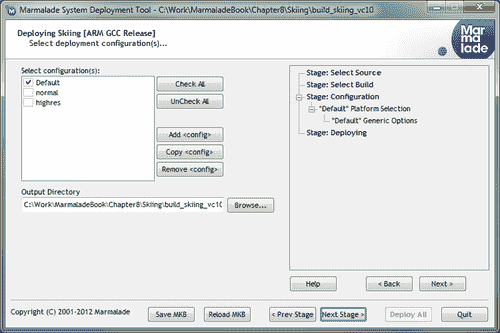

# 第八章。支持广泛的设备

真的很棒，Marmalade SDK 允许我们针对如此多的不同设备和平台。然而，为了完全优化您的应用程序以适应所有这些不同的设备类型，需要一定的关注和意识。

在本章中，我们将涵盖以下主题：

+   在尝试支持广泛不同设备时需要警惕的一些内容的概述

+   对我们在本书第一章中遇到的 ICF 文件系统的更深入探讨

+   使用 Marmalade 的内置系统允许使用多个不同的数据集，并以不同的方式处理这些数据集（例如，允许指定设备上使用的最终纹理格式）

+   配置部署系统以创建不同类型的构建

+   使用 Derbh 归档器减小安装包中资源的大小

# 适应广泛的设备类型

移动操作系统，如 iOS 或 Android，能够在广泛不同的设备上运行。在我们讨论 Marmalade 如何使我们轻松针对多种设备类型之前，我们首先强调在开发游戏时应注意的一些事项，以确保它在尽可能多的不同设备上看起来和运行得最好。

Marmalade 还附带了一份白皮书，涵盖了在开发旨在在多个设备规范上运行的游戏时需要注意的一些事项。您可以在 Marmalade 文档的**白皮书** | **设备无关代码**部分找到它。

## 处理不同的屏幕分辨率

不同设备之间最明显的一个差异可能是屏幕分辨率。以 iOS 为例，你可能需要支持从低端 320 x 480 到两个不同的 iPhone Retina 屏幕分辨率（640 x 960 和 640 x 1136）以及 iPad 的 1024 x 768，一直到最新 iPad 的疯狂分辨率 2048 x 1536（你很难找到能够显示该分辨率的 PC 显示器！）。

我们已经在第六章中提到了这个主题，*实现字体、用户界面和本地化*，当时我们讨论了实现用户界面的最佳方式。我们永远不应该将游戏硬编码为在固定屏幕分辨率下运行，因为这将在以后将其移植到其他屏幕分辨率时变得更加困难。

我们应该查询 Marmalade 的屏幕尺寸，然后使用这些值来定位和调整我们想要绘制的所有内容的位置和大小，无论是通过使用屏幕大小的百分比，通过将对象固定在屏幕边缘，还是确实使用你自己的选择的其他方法。我们可以如下找到屏幕宽度和高度：

```swift
uint32 lScreenWidth = IwGxGetScreenWidth();
uint32 lScreenHeight = IwGxGetScreenHeight();
```

这些函数也会自动处理设备方向。当玩家旋转设备时，返回的值会改变，除非我们使用`DispFixRot` ICF 文件设置禁用了此功能（稍后我们将详细介绍此设置）。

## 使用不同资源针对不同屏幕分辨率

使用屏幕尺寸来定位和调整我们想要绘制的元素大小效果很好，但这确实会导致另一个问题。我们可能会发现，如果屏幕上的图像需要被放大到很大尺寸，它们开始看起来模糊或块状。

同样，在低分辨率下表现良好的字体，当在更高分辨率的设备上使用时可能变得难以阅读，因为它们太小了。虽然我们可以在渲染时对字体应用缩放，但一个更美观的解决方案是使用在更大点大小创建的不同版本的字体。

幸运的是，正如我们将在本章后面看到的那样，Marmalade 为这个问题提供了一个非常易于使用的解决方案，允许我们提供用于针对不同屏幕分辨率的替代资源集。

## 检查设备功能

当针对大量不同设备时，还需要警惕的另一件事是，某些设备可能不支持某些 Marmalade SDK 功能。

一些设备可能具有多点触控显示屏，而另一些设备可能只有单点触控或根本没有触摸屏。一些设备可能没有加速度计输入或键盘。因此，确保我们调用各种 Marmalade 函数来查询这些和其他功能是否可用以及提供了哪些功能，这样我们就可以为用户提供适合他们设备的选项，这是一个好主意。

# 使用 ICF 文件设置配置您的游戏

如果你回想起本书第一章中的“Hello World”项目，你会记得我们使用 ICF 文件来根据代码在哪个平台上执行来显示不同的欢迎信息。如果你已经忘记了所有这些是如何工作的，不要担心，我们很快就会再次介绍。

当我们试图针对尽可能多的不同设备时，这个功能证明极其有用，因为内置的参数允许我们为包括内存使用、OpenGL ES 图形性能、启动画面等在内的各种事物应用不同的设置。

## 内置 ICF 设置

ICF 文件设置被分配给一个由方括号中放置的章节名称定义的章节标识符。当指定一个 ICF 设置的值时，你必须确保它出现在正确的章节标识符之后，否则在运行时将找不到它，并且会引发断言。以下是一个示例：

```swift
[S3E]
MemSize=10000000
SysAppVersion="1.0.0"
```

由于 ICF 设置太多，无法在本书中全部涵盖，因此我们将查看一些更实用的设置。如果您想查看完整列表，请查阅 Marmalade 文档，通过访问 **Marmalade** | **Marmalade 开发工具参考** | **ICF 文件设置**。|

下表显示了控制 Marmalade 在其最低级别的几个设置。这些设置的标识符为 `[S3E]`：

| 设置 | 值类型 | 描述 |
| --- | --- | --- |
| `MemSize` | 整数 | 可供应用程序使用的内存堆大小，以字节为单位。实际上，Marmalade 应用程序可以有最多十个内存堆可用，因此还有 `MemSize0` 到 `MemSize9` 等设置，这些设置允许声明这些堆的大小。`MemSize0` 实际上等同于使用 `MemSize`。有关内存堆的更多信息，请参阅 Marmalade 文档中的 s3eMemory API。 |
| `MemSizeDebug` | 整数 | 当执行 Windows 调试构建时，调试内存堆的大小，以字节为单位。这是一个用于在资源构建过程中处理 3D 模型和将纹理转换为不同格式的特殊内存块。 |
| `SysAppVersion` | 字符串 | 允许应用程序访问其版本号。虽然此值可以在 ICF 文件中设置，但也可以使用 MKB 部署的 `version` 设置来设置。 |
| `SysGlesVersion` | 整数 | 识别应用程序是否应尝试初始化 OpenGL ES 1.x 或 2.x 接口。只能指定主版本号（即 1 或 2）。 |
| `SysStackSize` | 整数 | 程序可用的堆栈大小，以字节为单位。例如，当应用程序需要额外的堆栈空间（由于高度递归的算法）时，这很有用。 |
| `SplashScreenFile` | 字符串 | 在应用程序加载期间显示的图像文件的名称。文件名相对于 `data` 目录。 |
| `SplashScreenBkR` `,``SplashScreenBkG` , and`SplashScreenBkB` | 字节 | 一个从 `0` 到 `255` 的值，用于指定启动画面背景颜色的红色、绿色和蓝色分量值。这是在显示指定的启动画面图像之前用于清除屏幕的颜色，假设图像小于屏幕尺寸。 |
| `SplashScreenWidth` 和 `SplashScreenHeight` | 整数 | 启动画面图像应该绘制的宽度和高度。如果小于屏幕尺寸，图像将居中显示。 |
| `AudioAllowBackground` | `0` 或 `1` | 当设置为 `1` 时，允许用户可能已启动的任何音频轨道（例如，通过 iOS 设备上的 iPod 应用程序）在我们应用程序启动时继续播放。 |
| `DispFixRot` | 字符串 | 允许屏幕锁定到特定方向，而不是在用户旋转设备时旋转。可以设置为以下值之一：`Free`、`Portrait`、`Landscape`、`FixedPortrait` 或 `FixedLandscape`。`Free` 设置允许任何设备方向，而 `FixedPortrait` 和 `FixedLandscape` 将屏幕方向锁定到默认的纵向或横向比例，这在使用加速度计控制游戏时防止不希望的屏幕旋转非常重要！ |

以下表格列出了用于更改 OpenGL ES 初始化的一些有用参数。这些设置必须在 `[GL]` 部分标识符之后发生：

| 设置 | 值类型 | 描述 |
| --- | --- | --- |
| `AlphaInFrameBuffer` | `0` 或 `1` | 当设置为 `1` 时，此设置表示帧缓冲区也包括目标 alpha 通道。 |
| `EGL_RED_SIZE`、`EGL_GREEN_SIZE`、`EGL_BLUE_SIZE`、`EGL_ALPHA_SIZE` | 整数 | 指示在帧缓冲区中存储红色、绿色、蓝色和 alpha 通道时使用的位数。为了获得最佳的渲染质量，所有这些设置通常都应设置为 `8`，从而产生 RGBA8888 显示。大多数硬件也可以支持 RGBA5551 和 RGB565 等格式，这将使用更少的视频内存，并且可能在牺牲视觉质量的情况下渲染得更快。 |
| `EGL_DEPTH_SIZE` | 整数 | 用于深度缓冲区的位数。有效值是 `16`、`24` 和 `32`，其中 `32` 提供最高的精度，因此在渲染时最不可能发生 Z 缓冲区冲突，但代价是渲染速度较慢和内存使用量较大。 |

我们将以一些与资源管理相关的设置结束，这些设置我们将在本章后面更深入地探讨。它们已被包含在此处以便于参考。这些设置位于 ICF 部分 `[RESMANAGER]`：

| 设置 | 值类型 | 描述 |
| --- | --- | --- |
| `ResBuild` | `0` 或 `1` | 当设置为 `1` 时，Windows 调试构建将通过解析原始 GROUP 文件并加载源模型、纹理和其他资源来加载资源。一旦数据被处理，它将以二进制格式保存到 `data-ram` 目录。如果此设置设置为 `0`，则不会加载源资产，并且将直接加载任何现有的二进制格式数据。这可以在游戏数据没有更改时加快测试速度。 |
| `ResBuildStyle` | 字符串 | 指定在 Windows 调试构建处理原始源资产时使用的资源构建样式。正如我们将在本章后面学到的那样，此参数允许我们提供不同集合的资源，以适应不同能力的设备。 |

## 定义新的 ICF 设置

ICF 文件最好的事情之一是我们能够通过创建自己的自定义设置来利用它们。为了定义新的设置，我们只需要将它们添加到 `app.config.txt` 文件中，当我们使用 MKB 文件创建新项目时，该文件会自动为我们生成。

当定义新的设置时，我们还可以提供一个文本字符串来解释这个设置的作用。虽然这个描述实际上并不被 Marmalade SDK 使用或需要，但它是一种很好的记录设置预期功能的方法！

### 注意

然而，将所有设置的说明添加到 `app.config.txt` 文件中是非常重要的，因为它将防止应用程序在执行时生成大量的断言。在 Windows 调试构建中，Marmalade 检查在执行开始时加载 ICF 文件以及每次我们尝试从自己的代码中访问设置时是否已声明 ICF 设置。

我们也可以通过在 `app.config.txt` 文件中列出方括号中的节名称，然后跟上新设置的定义来定义我们自己的节标识符。以下是一个说明如何创建新的节标识符和设置的示例：

```swift
[GAME_DEBUG]
SkipToLevel      Skip to a level at game start

[GAME]
FrameRate        The frame rate we want the game to run at
MaximumHealth      Amount of energy the player has at game start
```

在创建库模块时，定义自己的节标识符可以非常有用，例如在 第六章 中创建的 GUI 和 `Localise` 模块，*实现字体、用户界面和本地化*。创建模块时的唯一区别是 `app.config.txt` 文件将更改为 `modulename.config.txt`，并且它应该位于模块主目录中的 `docs` 子目录中。例如，如果我们想向 GUI 模块添加自己的设置，我们会创建一个名为 `GUI\docs` 的目录，列出设置的文件将被称为 `GUI.config.txt`。

## 在代码中访问 ICF 设置

如果没有某种方式访问它们，仅仅能够在 ICF 文件中提供设置几乎没有任何用处。这就是 s3eConfig API 发挥作用的地方，我们可以通过只包含 `s3eConfig.h` 头文件来使用它。

我们将要查看的第一个函数是 `s3eConfigGetString`，它接受我们想要访问的节标识符和设置名称，以及一个指向 `char` 数组的指针，该数组将在函数完成后用于返回设置的值。由于 `app.icf` 文件实际上不过是一个 ASCII 文本文件，这个函数所做的只是返回指定 ICF 设置等于号后面的文本字符串。

传递给 `s3eConfigGetString` 的 `char` 数组应该至少有 `S3E_CONFIG_STRING_MAX` 的长度，因为这是该函数可以返回的最大字符串大小。如果请求的设置在 ICF 文件中找不到，则此缓冲区将不会改变，这非常有用，因为它允许我们在代码中为参数设置默认值。

```swift
// Set default first level
char lLevelName[S3E_CONFIG_STRING_MAX];
strcpy(lLevelName, "level1");

s3eConfigGetString("GAME_DEBUG", "SkipToLevel", &lLevelName);
// lLevelName will still contain "level1" if the SkipToLevel setting 
// could not be found in the ICF file
```

很频繁地，我们可能需要指定 ICF 设置，这只需要一个数值。为了使我们更容易做到这一点，Marmalade 提供了另一个名为 `s3eConfigGetInt` 的函数，它不是指向一个 `char` 数组的指针，而是指向一个 `int` 变量的指针。

此函数将读取 ICF 文件中的设置字符串，然后尝试将其转换为整数值。如果失败（例如，字符串包含非数字字符或超出 `int` 的范围）或设置在 ICF 文件中不存在，则不会更改变量的当前值，从而允许在代码中指定默认值。

如果设置值可以检索到，这两个函数都将返回 `S3E_RESULT_SUCCESS`，如果存在问题，则返回 `S3E_RESULT_ERROR`。函数 `s3eConfigGetError` 将通过返回以下值之一让我们发现问题：

| 值 | 描述 |
| --- | --- |
| `S3E_CONFIG_ERR_NONE` | 没有发生错误。 |
| `S3E_CONFIG_ERR_PARAM` | `s3eConfigGetInt` 或 `s3eConfigGetString` 的一个参数无效。例如，传递了一个 `NULL` 值。 |
| `S3E_CONFIG_ERR_NOT_FOUND` | 请求的 ICF 设置找不到。 |
| `S3E_CONFIG_ERR_PARSE` | 在使用 `s3eConfigGetInt` 将 ICF 设置值转换为整数值时出现了问题。 |

## 通过平台和设备限制 ICF 设置

当针对大量不同的设备时，我们想要根据应用程序运行的设备执行不同的事情，这种情况并不少见。

ICF 文件系统通过允许我们根据设备的操作系统甚至根据单个设备类型提供不同的参数值，使处理这一点变得非常容易。

首先，我们可以在平台范围内提供不同的设置。"Hello World" 项目来自 第一章，*Marmalade 入门*，已经展示了这一点，但为了回顾，我们使用 `OS` 条件将设置限制在特定的操作系统上。这最好通过一个示例来说明：

```swift
[GAME]
FrameRate=20

{OS=BADA}
FrameRate=15

{OS=IPHONE}
FrameRate=30
{}
```

此示例为 `FrameRate` 设置设置了默认值 `20`。然后，它将此值覆盖为 Bada 设备的 `15` 和 iOS 设备的 `30`。请注意，出于历史原因，值 `IPHONE` 指的是所有 iOS 设备（所有版本的 iPad 和 iPod touch 以及所有 iPhone）。

### 注意

早期示例以开闭大括号结束。这会将此点之后所做的所有设置返回为全局设置，适用于所有设备和平台。

还可以创建仅适用于特定平台上的特定设备子集的设置。这是通过使用 `ID` 条件来完成的，它首先指定平台类型，然后有一个以逗号分隔的设备标识符列表，该设置应应用于这些标识符。以下是一个示例：

```swift
[GAME]
FrameRate=30

{ID=ANDROID "HTC Hero", "T-Mobile G1"}
FrameRate=20
{}
```

在这里，我们为`FrameRate`设置设置默认值`30`，然后如果游戏运行在列出的任何 Android 设备上，则将值限制为`20`。仅当设备名称包含空格时才需要引号。

想要知道如何发现设备名称？通常它是设备的名称，但并不总是如此。发现特定设备名称的最简单方法是为该设备创建一个简短的测试程序，调用`s3eDeviceGetString`函数，如下所示：

```swift
const char* lpDeviceID = s3eDeviceGetString(S3E_DEVICE_ID);
```

### 注意

`s3eDeviceGetString`函数及其兄弟函数`s3eDeviceGetInt`允许我们确定运行在设备上的大量信息，包括操作系统、处理器类型、电话号码、当前语言设置等等。请参阅`s3eDevice.h`头文件或 Marmalade 文档以获取更多详细信息。

# 创建多个资源集

由于 Marmalade 允许我们针对如此多的不同设备，因此限制自己仅使用其中的一部分，仅仅因为我们的图形分辨率过高或过低，或者某些设备内存较少，因此无法处理大量高分辨率纹理，这似乎有些遗憾。

我们可能还会遇到另一个问题，即不同的设备支持不同的音频或视频剪辑文件格式。为了提高渲染速度和内存使用效率，我们还可以考虑使用硬件纹理压缩，当然，这取决于特定设备所使用的图形处理器的类型。

Marmalade 提供了一些解决方案来解决这个问题。第一种，更全局的方法是利用**构建风格**，它允许我们在加载 GROUP 文件时加载不同的资源文件集，并指定要应用的硬件纹理压缩类型。

构建风格通过**资源模板**的概念得到增强，这允许我们更精细地控制资源的配置。资源模板可以用来影响纹理的最终格式，或者修改 3D 模型以用于游戏中的方式，以及其他方面。

## 使用构建风格

Marmalade 附带了一些内置的构建风格，允许我们为移动设备上使用的所有常见 GPU 格式构建资源。以下表格显示了可用的构建风格：

| 构建风格 | 描述 |
| --- | --- |
| `sw` | 为与 Marmalade 的遗留软件渲染器一起使用而优化的构建资源。以这种方式构建的资源不能使用硬件加速进行渲染。此格式现在仅在我们使用 MKB 文件中的`IW_USE_LEGACY_MODULES`定义以使软件渲染器可用时才有用。 |
| `gles1` | 不使用任何形式的纹理压缩构建资源。如果没有指定构建风格，这是默认设置。 |
| `gles1-pvrtc` | 与 `gles1` 相同，但在图像上使用 PVRTC 格式进行纹理压缩，这种压缩类型效果良好。通常这仅仅意味着没有 alpha 通道的图像，因为 PVRTC 在这种纹理上通常表现不佳。 |
| `gles-atitc` | 与 `gles1` 相同，但在可能的情况下使用 ATITC 纹理压缩格式。 |
| `gles1-dxt` | 与 `gles1` 相同，但在可能的情况下使用 DXT 格式进行纹理压缩。 |
| `gles2-etc` | 适用于使用 OpenGL ES 2.x 并支持 ETC 纹理压缩格式的设备。 |

如果默认的构建样式不足以满足需求，我们也可以定义自己的自定义构建样式。为此，我们在 `data` 目录中创建一个名为 `resbuildstyles.itx` 的文件。当在调用 `IwResManagerInit` 时初始化资源管理器时，该文件会自动被加载，并包含一个或多个 `CIwResBuildStyle` 类的实例。

为了声明一个构建样式实例，我们必须给它一个名称，以便它可以被选中使用，一个可选的目录列表，资源文件可以驻留在其中，以及一个指示此构建样式针对的平台。请注意，在构建样式的案例中，平台并不指代任何特定的操作系统；相反，它指的是样式针对的 GPU 类型，这在很大程度上意味着将要使用的硬件纹理压缩类型。

这里是一个用于以下部分讨论的 `resbuildstyles.itx` 文件示例：

```swift
CIwResBuildStyle
{
  name             "default"
  platform         "GLES1"
}
CIwResBuildStyle
{
  name             "pvrtc"
  addReadPrefix    "data-pvrtc"
  platform         "IMG_MBX"
}
CIwResBuildStyle
{
  name             "atitc"
  addReadPrefix    "data-atitc"
  platform         "ATI_IMAGEON"
}
```

### 添加额外的资源目录

`addReadPrefix` 参数允许我们在尝试加载任何类型的文件时添加一个新的搜索路径。指定一个目录名称；这必须是项目 `data` 目录下的一个子目录。如果您想添加多个额外的搜索目录，只需包含更多的 `addReadPrefix` 条目。

每当我们尝试打开一个文件时，Marmalade 会首先按照指定的顺序在由构建样式指定的额外目录列表中查找。如果请求的文件在这些目录中的任何一个中找到，它将从那里加载；否则，资源管理器将回退到在 `data` 目录中查找。

### 支持的构建样式平台

`CIwResBuildStyle` 实例的 `platform` 字段可以取以下值之一：

| 平台值 | 描述 |
| --- | --- |
| `SW` | 为与 Marmalade 的传统软件渲染器一起使用而优化的构建资源。再次强调，我们必须在我们的 MKB 中使用 `IW_USE_LEGACY_MODULES` 定义才能使用此功能。 |
| `GLES1` | 如果未指定，这是默认选项，并构建可以使用 OpenGL ES 高效渲染的资源。 |
| `IMG_MBX` | 与 `GLES1` 相同，但在图像上使用 PVRTC 格式进行纹理压缩，这种压缩类型效果良好。 |
| `IMG_MBX_VGP` | 目前与 `IMG_MBX` 相同。 |
| `ATI_IMAGEON` | 与 `GLES1` 相同，但在可能的情况下使用 ATITC 格式进行纹理压缩。 |
| `NVIDIA_GOFORCE` | 目前与`GLES1`执行相同。 |
| `ARM_MALI` | 目前与`GLES1`执行相同。 |

虽然平台标识符使得为不同类型的 GPU 创建资源变得容易，但也可以更具体地指定要使用的纹理压缩类型。这可以通过指定平台为`GLES1`并添加`textureFormat`设置来实现。例如，前面示例中的`atitc`条目可以写成以下形式：

```swift
CIwResBuildStyle
{
  name             "atitc"
  addReadPrefix    "data-atitc"
  platform         "GLES1"
  textureFormat    "ATITC"
}
```

可以使用以下值作为`textureFormat`参数：

| 值 | 描述 |
| --- | --- |
| `PVRTC_2` | 使用 2 位 PVR 纹理压缩。通常不推荐使用，因为它往往会产生低质量的结果。可以在具有 Imagination 生产的芯片组的设备上使用，例如 iOS 设备。 |
| `PVRTC_4` | 使用 4 位 PVR 纹理压缩。这种类型通常对没有 alpha 通道的纹理产生良好的结果，但在压缩透明纹理时可能会相当差。默认情况下，Marmalade 不会对任何具有 alpha 组件的源纹理执行此类型压缩。这种压缩类型由使用 Imagination GPU 的设备支持，例如 iOS 设备。 |
| `ATITC` | 将使用 ATI 压缩纹理。自动在无 alpha 通道的纹理上使用 4 位压缩，或在具有透明度的纹理上使用 8 位压缩。支持在许多 Android 设备中使用的 ATI/Qualcomm 芯片组。 |
| `ETC` | 使用 4 位爱立信纹理压缩对没有 alpha 通道的纹理进行压缩。透明纹理无法压缩。支持在 ATI/Qualcomm 芯片组和大多数支持 OpenGL ES 2.x 的芯片组上使用。 |
| `DXT1`,`DXT3`, 和`DXT5` | `DXT1`压缩是一种用于非透明纹理的 4 位格式。`DXT3`是一种允许压缩透明纹理的 8 位格式。`DXT5`是另一种具有更好的 alpha 通道渐变支持的 8 位格式。如果指定了`DXT3`或`DXT5`，并且遇到不透明纹理，Marmalade 将自动使用`DXT1`压缩。在 NVIDIA Tegra2 芯片组设备上可用。 |

### 指定要使用的构建样式

在声明了构建样式之后，我们现在只需让 Marmalade 知道在加载资源时要使用哪个。最简单的方法是使用`ResBuildStyle` ICF 设置，我们通过在 ICF 文件中添加以下内容来实现：

```swift
[RESMANAGER]
ResBuildStyle=pvrtc
```

我们还可以在运行时切换构建样式，因为资源管理器为我们提供了设置和获取当前构建样式的功能。以下代码片段说明了这一点：

```swift
// Discover the currently selected build style
CIwStringL lCurrentStyle = IwGetResManager()->
   GetBuildStyleCurrName();

// To change to a different build style
IwGetResManager()->SetBuildStyle("atitc");
```

然而，请注意，虽然切换构建样式很容易，但这种行为仅在 Windows 调试构建中受支持。当我们为设备创建发布构建时，我们通常会只为该设备类型提供所需的资源，以减少安装包的大小。我们将在本章后面讨论如何实现这一点。

## 使用资源模板

构建样式允许我们在全局层面上对游戏资源进行处理做出决策；但有时我们希望有更精细的控制，以便以不同的方式处理不同类型的资源。

这就是资源模板发挥作用的地方。简单来说，资源模板允许我们更改在处理纹理、材质、3D 模型、动画和 GROUP 文件时应用的默认设置。

资源模板可以在一个 ITX 文件中定义，我们在尝试加载任何资源之前会解析这个文件。由于这些模板仅在 Windows 调试构建中需要，所以如果我们不会构建资源，我们不需要加载这个文件。

Marmalade 提供了一个方便的宏定义，`IW_BUILD_RESOURCES`，它仅在 Windows 调试构建中定义。使用这个宏定义，我们可以通过排除任何资源处理代码来减小编译代码的大小。例如，如果我们的资源模板定义包含在一个名为 `restemplates.itx` 的文件中，我们可以使用以下代码片段来加载该文件：

```swift
#ifdef IW_BUILD_RESOURCES
IwGetTextParserITX()->ParseFile("restemplates.itx");
#endif
```

以下代码提供了一个 `restemplates.itx` 文件可能的样子。我们将在接下来的章节中更详细地讨论不同的资源模板类型；但请注意，每种类型都有一个名为 `default` 的模板被定义。这样，如果我们想恢复正常的加载行为，就可以这样做。

```swift
CIwResTemplateImage
{
  name        "default"

  formatHW    FORMAT_UNDEFINED
  formatSW    FORMAT_UNDEFINED
}

CIwResTemplateImage
{
  name        "rgba4444_nomipmap"

  formatHW    RGBA_4444
  mipMapping  false
}

CIwResTemplateMTL
{
  name        "default"
}

CIwResTemplateMTL
{
  name         "clamped_unfiltered"
  clampUV      true
  filtering    false
}
```

一旦定义了资源模板，就可以通过在 GROUP 文件中使用 `useTemplate` 参数从内部调用它。此参数接受资源模板的类型和名称，搜索它，如果找到，则将模板中定义的任何设置应用于从那时起加载的任何类型的资源。以下是一个示例：

```swift
CIwResGroup
{
  name "images"

  useTemplate "image" "rgba4444_nomipmap"
  useTemplate "mtl" "clamped_unfiltered"

  "./materials.mtl"

  useTemplate "image" "default"
  useTemplate "mtl" "default"
}
```

### 定义材质模板

材质资源模板通过 `CIwResTemplateMTL` 类的实例声明，并用于为在模板使用期间创建的所有 `CIwMaterial` 实例提供一个起始配置。

我们可以在材质模板中指定任何可以应用于从 ITX 文件处理时的 `CIwMaterial` 实例的参数。在以下表中，列出了一些对模板有用的参数，但完整的列表请参阅 Marmalade 文档中的 `CIwMaterial`。

| 参数 | 描述 |
| --- | --- |
| `colAmbient`、`colDiffuse`、`colEmissive` 和 `colSpecular` | 允许为环境、漫反射、发射和镜面反射照明组件指定默认的 RGBA 颜色。例如：`colAmbient { 255, 255, 255, 255 }`。 |
| `cullMode` | 指定材质使用的背面剔除方法。可以是 `BACK`、`FRONT` 或 `NONE` 之一。 |
| `alphaMode` | 指定默认的不透明度模式。可以是 `NONE`、`ADD`、`SUB`、`HALF` 或 `BLEND` 之一。 |
| `blendMode` | 指定绘制时使用的混合类型。可能的值有 `MODULATE`、`MODULATE_2X`、`MODULATE_4X`、`DECAL`、`ADD`、`REPLACE` 和 `BLEND`。 |
| `alphaTest` | 指定绘制像素时使用的 alpha 测试类型。由一个测试类型后跟一个 alpha 值组成。有效的测试类型有 `DISABLED`、`NEVER`、`LESS`、`EQUAL`、`LEQUAL`、`GREATER`、`GEQUAL`、`NOTEQUAL` 和 `ALWAYS`。例如：`alphaTest GEQUAL 128`。 |
| `zDepthOfs` 和 `zDepthOfsHW` | 允许在渲染时将偏移量添加到顶点的 z 分量，以强制绘制前后。这对于绘制发光效果非常有用，可以强制它们出现在 3D 模型之后或之前。`zDepthOfs` 用于软件渲染器，而 `zDepthOfsHW` 用于使用 OpenGL ES 进行渲染。 |
| `filtering` | 设置为 `true` 以在渲染时使用双线性过滤。 |
| `clampUV` | 如果设置为 `true`，则 UV 坐标将在纹理的边界内夹紧。这有助于避免在渲染纹理边缘时由双线性过滤引起的问题，因为双线性过滤将尝试在图像的左和右或上和下之间的 texel 之间进行混合，因为它假定纹理可以被平铺。 |

### 定义图像模板

我们还可以使用资源模板系统来指定我们希望图像如何处理，这包括指定使用的纹理格式。为了定义图像的资源模板，我们必须声明一个 `CIwResTemplateImage` 实例，可以使用以下参数进行配置：

| 参数 | 描述 |
| --- | --- |
| `formatSW` 和 `formatHW` | 将任何图像转换为请求的格式。此参数的两个版本允许为软件渲染器定义一个格式，并为 OpenGL ES 渲染定义另一个格式。有关纹理格式的完整列表，请参阅 Marmalade 文档中的 `CIwImage` 类，但请注意，其中一些格式仅适用于软件或硬件渲染。例如，OpenGL ES 不支持任何基于调色板的格式，而软件渲染器不支持压缩格式，如 PVRTC 或 ATITC。 |
| `compressForDiskSpace` | 当设置为 `true` 时，使用 `formatSW` 和 `formatHW` 参数转换纹理时，如果转换后的二进制版本 GROUP 文件（在内存大小上）小于原始格式的图像，则只存储转换后的版本。默认为 `false`。 |
| `mipMapping` | 当设置为 `true` 时，图像将自动生成米柏图。对于将形成 UI 一部分的图像，将其设置为 `false` 可能非常有用，因为这些图像通常希望以原生大小绘制，而米柏图将不再需要。 |
| `allowLowQualityCompression` | 如果使用硬件压缩格式，当结果纹理可能质量较低时，例如在使用具有 alpha 通道的图像上使用 PVRTC 时，Marmalade 不会使用请求的压缩。将此参数设置为 `true` 允许您强制 Marmalade 执行请求的压缩。 |
| `ignoreImages` | 如果设置为 `true`，将忽略图像，并使用 2 x 2 的棋盘纹理代替。这在调试时可以加快加载时间。 |

### 定义模型模板

当从 GEO 文件加载 3D 模型时，我们可以使用 `CIwResTemplateGEO` 资源模板的一个实例来控制模型的处理方式。许多可用的选项允许我们在知道特定模型将在某些条件下使用时提高渲染性能；例如，它将仅使用 OpenGL ES 进行渲染，或者它可能已经导出带有法线，因为模型将永远不会启用光照进行渲染。

下表显示了一些更有用的设置，但还有很多其他设置，因此请查阅 Marmalade 文档中的 `CIwResTemplateGEO` 以获取更多详细信息：

| 参数 | 描述 |
| --- | --- |
| `scale` | 允许指定一个浮点值，该值将用于缩放模型的全部顶点。这在允许使用建模软件中的一个比例创建 3D 模型并在游戏中以不同的比例使用时很有用。 |
| `buildCols`、`buildNorms`、`buildUVs` 和 `buildUV1s` | 如果设置为 `true`，处理后的模型数据将包括顶点颜色、法线和 UV 信息（假设在导出的模型中存在）。这在游戏中对模型不需要光照或纹理时可以节省内存。 |
| `triStrip` | 如果设置为 `true`，模型将准备使用三角形带进行渲染。默认值为 `false`，这将导致生成三角形列表。仅在模型正在为使用 OpenGL ES 进行渲染而准备时生效。 |
| `calculateNorms` | 如果设置为 `true`，模型构建器将尝试为光照目的生成顶点法线。如果源模型由于任何原因导出时没有法线，则很有用。 |
| `chunked` | 如果设置为 `true`，模型将被细分为更小的 "chunk" 以使用二进制空间划分进行渲染。这在渲染比屏幕尺寸大的模型时很有用，因为它允许忽略模型中不在屏幕上的整个部分。 |
| `maxPrimsPerChunk` | 与 `chunked` 参数一起使用，用于指定模型每个 chunk 应包含的最大多边形数量。 |

### 定义动画模板

`CIwResTemplateANIM` 类允许在处理过程中调整 ANIM 文件数据。它只提供了一两个选项，如下表所示：

| 参数 | 描述 |
| --- | --- |
| `zeroMotionTolerance` | 允许指定一个浮点值，该值将用于过滤任何关键帧数据的平移部分。在动画模型时，艺术家可能会不小心将一些微小的动作包含到骨骼位置中，这会导致输出数据集更大。此值允许忽略达到指定值以内的动作，这意味着可能需要输出的关键帧更少。 |
| `transformPrecision` | 另一个浮点值，用于指定动画时的精度。默认值是 `4.0`，这意味着动画数学计算是在世界空间分辨率的四倍下进行的。如果您有一个包含许多微妙动作的动画，您可能需要考虑增加此值，以防止这些动作丢失。 |

### 定义 GROUP 文件模板

最后，有一个 `CIwResTemplateGROUP` 类，用于创建**纹理图集**。纹理图集简单地说就是一组较小的纹理，这些纹理被排列在一个更大的纹理中。这可以提高渲染速度，因为渲染时需要的纹理交换更少。

在这本书中，我们不会详细探讨纹理图集，所以如果您想了解更多信息，请查看 Marmalade 文档页面中的 `CIwResTemplateGROUP` 类。

## 生成资源的二进制版本

在这本书的之前部分，我们已经看到有关 Marmalade 生成我们资源二进制版本的引用，这些二进制版本通常比源资产更小，加载速度更快。

到目前为止，我们对此有点轻描淡写，但现在我们知道了构建样式，值得仔细看看。

每当我们加载 GROUP 文件时，资源二进制版本会自动为我们生成，前提是我们将 ICF 设置 `ResBuild` 设置为 `1`，并且正在运行游戏的 Windows 调试构建。这些文件以 `.group.bin` 文件扩展名写入到名为 `data-ram` 的目录中，该目录位于我们的源资产所在的常规 `data` 目录旁边。

如果我们在任何项目的 `data-ram` 目录中查看，我们会发现另一组子目录，这些子目录包含我们资源的二进制版本。这些子目录对应于我们在构建样式中指定的额外前缀目录。

当 `.group.bin` 文件被写入时，它们将始终写入由当前活动构建样式指定的前缀目录，无论源文件是从标准 `data` 目录还是从额外前缀目录读取的。

从 `data` 目录到相对目录路径也会在输出目录中创建，当写入文件的二进制版本时。

这使得我们可以非常容易地将不同的资源集部署到不同的平台，因为我们只需要包含 `data-ram` 的子目录之一中的所有 `.group.bin` 文件。

让我们用一个简单的例子来说明这一点。假设我们有一个名为`data/images/images.group`的文件，它加载了多个纹理。如果没有指定构建样式，默认是 Marmalade 定义的`GLES1`样式，它指定了一个名为`data-gles1`的前缀目录。文件的二进制版本将被写入文件路径`data-ram/data-gles1/images/images.group.bin`。

如果我们现在再次运行程序，选择`pvrtc`构建样式（如本章前面关于构建样式的部分所述），图像将被转换为 PVRTC 格式，并写入文件路径`data-ram/data-pvrtc/images/images.group.bin`。

事实上，Marmalade 不仅会输出 GROUP 文件的二进制版本，还会创建一些其他文件，这些文件在调试过程中可能很有用。在这本书中，我们不会详细讨论这些文件，但如果你在处理某些资源时遇到问题，你可能需要查看这些文件。特别是，有一个扩展名为`.group.bin.txt`的文件，它详细说明了在处理特定 GROUP 文件时遇到的所有类。

### 注意

这种方法有一个缺点，那就是你必须加载游戏中引用的每一个 GROUP 文件，以便生成它们的所有二进制版本。如果你的游戏有大量关卡，并且每个关卡都有一个 GROUP 文件，这尤其可能成为一个问题。解决这个问题的好方法是为你的游戏创建一个特殊模式，它可以接受一个包含所有必需 GROUP 文件的列表（以及它们之间可能存在的任何依赖关系），然后依次加载每个文件以生成二进制版本。

# 使用 Derbh 归档程序压缩资源

游戏资源很快就会变得非常大，所以如果我们能以某种方式压缩这些文件，使它们在安装包中占用的空间更少，那就太好了，尤其是如果安装包的最大大小有限制的话。

Marmalade 提供了类似 Derbh 归档这样的功能，这与你可能熟悉的 ZIP 等压缩系统非常相似。Derbh 支持多种压缩算法，包括标准的 LZMA 以及它自己的专有算法，通过同时操作多个文件，可以实现更好的压缩效果。

Marmalade SDK 提供了一个 API，允许我们以与提供单个未压缩文件一样容易的方式加载压缩文件。还提供了一个名为 DZip 的命令行实用程序，用于最初生成归档。

## 创建 Derbh 归档

要创建 Derbh 归档，我们首先必须创建一个**DZip 配置文件**（**DCL**）。这个文件被传递给 DZip 实用程序，以指定源文件以及它们应该如何被压缩。以下是一个简单的 DCL 文件示例，它来自本章的滑雪示例项目：

```swift
archive data-ram\data-gles1\skiing.dz
basedir data
basedir data-ram\data-gles1

file text\EN.str 0 dz
file models.group.bin 0 dz
file flag\flag.group.bin 0 dz
file rock\rock.group.bin 0 dz
file skier\skierskiing.group.bin 0 dz
file sound\sound.group.bin 0 dz
file tree\tree.group.bin 0 dz
file ui\ui.group.bin 0 dz
```

第一行使用`archive`关键字来指定要创建的 Derbh 存档的名称，通常会给它一个`.dz`扩展名。可以通过简单地添加更多的`archive`条目来一次创建多个存档。

`basedir`关键字允许我们指定一个目录，用于搜索将构成存档的文件。在先前的例子中，我们指定了`data`和`data-ram\data-gles1`目录。

接下来，我们使用`file`关键字列出所有将被添加到存档中的文件。第一个参数是要包含的文件名，它应该是相对于由`basedir`关键字指定的目录的相对路径。之后是一个数字和一个压缩类型。这个数字指的是文件应该添加到哪个存档中，其中零是指 DCL 文件中指定的第一个存档。

有多种压缩类型可供选择，尽管请注意，并非所有这些类型实际上都会压缩源文件！如果我们愿意，可以为每个文件使用不同的压缩类型。以下表格显示了可用的类型：

| 类型 | 描述 |
| --- | --- |
| `lzma` | 使用 lzma 压缩，通常提供最佳的压缩比，并且具有合理的解压速度。 |
| `dz` | Marmalade 的自身压缩格式，提供了良好的压缩比和解压速度。 |
| `zlib` | 使用 zlib 压缩，提供了不太理想的压缩比，但具有非常好的解压速度。 |
| `zero` | 将添加一个与文件大小相同的零块到存档中。可以用于调试目的，例如，如果我们需要检测损坏的文件。 |
| `copy` | 文件以未压缩的形式包含在存档中。对于已经压缩的文件类型，这可以产生比尝试压缩文件更小的存档最终文件大小。 |

构建了 DCL 文件后，我们可以使用 DZip 实用程序来构建存档文件。这个实用程序可以在 Marmalade SDK 安装目录中的`tools\dzip\dzip.exe`文件中找到。

要创建存档，只需将 DCL 文件的名称传递给 DZip 实用程序，确保您在可以找到`archive`和`basedir`条目的目录中运行命令。

## 在代码中使用 Derbh 存档

创建了 Derbh 存档后，在游戏中使用它就变得非常简单。首先，我们需要通过在 MKB 文件中将`derbh`添加到`subprojects`列表中来添加对 Derbh API 的支持。我们还需要包含`derbh.h`文件，以便访问 API 函数。

要使用我们的存档文件，我们只需要添加一个对函数`dzArchiveAttach`的调用，该函数接受单个参数——Derbh 存档本身的文件名。从那时起，任何打开文件的调用都将首先检查它是否存在于 Derbh 存档中，如果存在，数据将在我们尝试从文件中读取时自动解压并返回。这真的非常简单！

我们还可以通过简单地调用每个我们希望使用的存档的 `dzArchiveAttach` 来一次附加多个存档。

如果请求的文件不在存档中，Marmalade 将会查找 `data` 和 `data-ram` 目录。

如果我们出于任何原因想要停止使用 Derbh 存档，我们可以通过调用 `dzArchiveDetach` 来移除最后附加的存档，或者我们可以使用 `dzArchiveDetachNamed` 函数指定要分离的存档。

### 注意

重要的是要注意，只有从应用程序代码中加载的文件才能从附加的 Derbh 存档中访问。如果你试图使用 s3eAudio 播放音乐轨道或使用 s3eVideo 播放视频剪辑，这些文件必须作为单独的文件存在，因为它们是通过操作系统原生方法加载的，显然将无法访问 Derbh 文件的内容。

## 自动 Derbh 方法

对于大多数项目来说，实际上还有一种更简单的方法来利用 Derbh 存档，这不需要我们创建 DCL 文件或自己构建 Derbh 文件。我们甚至不需要在我们的代码中附加存档！要使用此功能，我们只需要将以下内容添加到我们的 MKB 文件 `deployments` 部分即可（我们将在稍后更详细地介绍 MKB 文件的这一部分）。

```swift
deployments
{
  auto-derbh
}
```

在此基础上，Marmalade 部署工具将自动从 MKB 文件 `assets` 部分的相关文件中构建一个 Derbh 存档（再次提醒，`assets` 部分将在稍后讨论），并在我们的应用程序代码开始执行之前将其附加。

### 注意

如果你部署的文件需要在安装后由你的代码修改，请小心使用自动 Derbh 功能。一旦文件包含在存档中，你将无法修改该文件，因此你需要在应用程序第一次运行时在新的位置创建任何此类文件的副本。

# 创建不同的部署类型

现在是时候更深入地了解 Marmalade 如何处理部署过程了。如果你一直在跟踪示例代码，你可能想知道我们是如何制作包含所有必要资源文件以便运行的部署包的。或者，如果我们正在创建多个资源集，我们在创建安装包时如何选择与我们的代码配对的哪一个？

我们还需要一种方法来包含图标和标题，这些图标和标题将用于在设备上安装我们的应用程序时表示我们的应用程序。

所有这些魔法都在 MKB 文件中发生，接下来的部分旨在解释你确切需要做什么。

## 指定图标、应用程序名称和其他详细信息

MKB 文件的 `deployments` 部分是我们可以设置所有将应用于我们应用程序最终安装包的属性的地方。有大量的部署选项可以指定，其中一些适用于所有支持的平台，而另一些则是特定于操作系统的。

以下表格列出了几个更直接有用的属性，但你应该查阅 Marmalade 文档中的 **Marmalade | Marmalade 开发工具参考 | MKB 文件设置 | 部署选项**，以获取完整详情。

| 属性 | 描述 |
| --- | --- |
| `assets` | 指定在部署中使用的资产组。这将在以下部分中详细解释。 |
| `name` | 指定部署的名称。此名称将用于安装目录、可执行文件和安装包文件的名称。如果没有指定此值，则将使用 MKB 文件的文件名。 |
| `caption` | 这是用于识别设备上已安装的应用程序的名字——例如，出现在程序图标下方的文本。如果没有指定标题，则将使用 `name` 值。 |
| `app-icf` | 允许指定一个替代文件，而不是默认的 `app.icf` 文件。 |
| `version` | 指定应用程序的版本号。它应以 `major.minor.revision` 的形式提供。 |
| `version-major`,`version-minor`, 和 `version-revision` | 指定版本号的另一种方式。每个属性后应跟一个数字，代表版本号的相应部分。 |
| `iphone-icon`,`iphone-icon-ipad`,`iphone-icon-high-res`, 和 `iphone-icon-ipad-high-res` | 设置用于 iOS 部署的图标。这些设置指定了一个图标文件的名称，该文件具有合适的格式和尺寸，用作指定的图标类型。 |
| `android-icon`,`android-icon-hdpi`, 和 `android-icon-ldpi` | 设置用于 Android 部署的图标文件名。 |
| `bada-icon` | 指定用于 Bada 部署的图标文件。 |

如你所见，大多数平台都有指定图标文件的选项，实际上还有更多针对特定平台的属性，用于指定诸如应用程序签名密钥等信息。

你应该查看 Marmalade 文档中提到的上述页面，以获取更多关于此方面的详细信息，因为没有这些信息，你将无法生成用于提交的最终部署包。

## 指定资产列表

我们需要一种方式来列出所有必须包含在部署包中的资源文件，以便我们的游戏可以运行。Marmalade 允许我们通过 MKB 文件的 `assets` 部分来实现这一点。以下是本章 Skiing 项目的示例：

```swift
assets
{
  [common]
  (data)
  sound/music.mp3

  [normal]
  <include common>
  (data-ram/data-gles1)
  skiing.dz

  [highres]
  <include common>
  (data-ram/data-highres)
  skiing.dz
}
```

这个小示例演示了在 `assets` 部分中大部分可用的功能。首先，你会注意到使用方括号创建资产命名单元组。在示例中，我们有名为 `common`、`normal` 和 `highres` 的资产组。

正常的括号用于指定一个目录，相对于包含 MKB 文件的目录，需要包含在部署包中的文件可以位于该目录。然后是文件本身。在资产组中可以有任意数量的这些文件块。

在资产组中指定目录和文件时需要记住的重要事项是，括号中的目录成为设备上应用程序安装目录的根路径。让我们通过查看一个示例来阐述这一点。

首先，我们有 `common` 资产组，它指定名为 `sound/music.mp3` 的文件可以在 `data` 目录中找到。当安装在设备上时，`music.mp3` 文件将被写入应用程序安装目录下的一个名为 `sound` 的子目录中。

现在让我们考虑名为 `normal` 的资产组。在这里，文件的路径完全被括号包围，只指定了文件名，`skiing.dz`。这将导致 `skiing.dz` 文件被写入应用程序的安装目录中。

示例中展示了资产部分的最后一个特性，即能够在另一个资产组中包含一个资产组。这是通过使用 `include` 关键字来完成的，该关键字用尖括号括起来，并包含要包含的资产组的名称。

通过查看示例，我们可以看到 `normal` 和 `highres` 资产组都包括了 `common` 资产组。

## 创建和使用部署类型

我们现在可以查看为不同设备创建不同的配置。MKB 文件的 `deployments` 部分还允许我们通过指定方括号中的名称来创建不同的部署类型。在此之后所做的所有设置将仅适用于该部署类型。可以通过在定义部署类型之前使用方括号来指定设置，以将设置应用于所有部署类型。

可以通过在方括号后的名称后跟一个平台标识符或用引号分隔的平台列表来限制部署类型到一组特定的移动平台。

在本文撰写时，Marmalade 支持的所有平台的全列表如下表所示：

| 平台 | 备注 |
| --- | --- |
| `android` | 指定 Android 操作系统。 |
| `iphone` | 任何基于 iOS 的设备——iPhone、iPod touch 或 iPad。 |
| `bada` | 针对三星 Bada 平台。 |
| `lgtv` | 指定 LG 智能电视系统。 |
| `playbook` | 用于针对 Blackberry Playbook 平板。 |
| `symbian9` | 构建在 Symbian 9 S60 或 Symbian ³ 设备上运行的应用程序。 |
| `webos` | 针对 webOS 平台，最知名的设备是现已停产的 HP TouchPad。 |
| `winmobile` | 允许支持 Windows Mobile 6 设备。注意，Marmalade 无法针对 Windows Phone 7 进行目标定位。 |
| `win32` | 用于 x86 Windows 构建版本。 |
| `osx` | 用于 x86 Apple Mac 构建（当使用 Marmalade 的 Mac 版本时）。 |

在部署类型中指定平台列表不是强制性的。如果没有给出列表，则假定任何平台都是有效的目标。

一旦指定了部署类型，任何属性都将仅适用于该部署类型。这对于我们来说非常有用，因为我们能够指定不同的资源集。通过使用 `assets` 属性，我们可以指定我们希望在最终部署包中包含的资产组。以下 `deployments` 部分的示例取自本章的滑雪项目。

```swift
deployments
{
  name="SkiingC8"
  caption="SkiingC8"

  [normal]
  assets=normal

  [highres]
  assets=highres
}
```

要为特定的部署类型创建安装包，我们只需遵循本书第一章（ch01.html "第一章. Marmalade 入门"）中提供的相同部署说明来启动 **Marmalade 系统部署工具**。此应用程序的第二页允许我们通过点击复选框来选择我们想要创建的部署类型，如下面的截图所示：



此页面允许你通过 **添加 <config>**、**复制 <config>** 和 **删除 <config>** 按钮创建和修改部署类型，但我个人更喜欢在 MKB 文件中手动指定它们。使用这些按钮会相应地修改 MKB 文件。

一旦你完成了部署工具的所有页面并制作了部署包，它们可以在 `build_projectname_vcxx\deployments` 文件夹中找到，其中 `projectname` 是 MKB 文件的名字，`vcxx` 指的是你用于开发的 Microsoft Visual C++ 版本。

# 示例代码

本章附带两个示例项目，它们将在以下部分中描述。

## 构建样式项目

这是一个非常简单的示例，展示了构建样式、资源模板和部署类型的用法。它基于第二章的 Graphics2D 示例，*资源管理和 2D 图形渲染*。

`resbuildstyles.itx` 文件定义了一个名为 `highres` 的构建样式，该样式指定了一个名为 `data-highres` 的前缀目录。如果你查看 `data` 目录，你会看到 `data\images\textures\marmalade.png` 中的橘皮果图像的 jar 文件大小为 256 x 256 像素。还添加了一个新的 `highres` 构建样式的目录，其中包含该图像的 512 x 512 版本。此文件名为 `data\data-highres\images\textures\marmalade.png`。

如果你现在查看 `app.icf` 文件，你会看到新的条目 `ResBuildStyle=highres`。如果你用这一行运行程序，将会加载 512 x 512 版本的图像。取消注释或删除此行，将加载 256 x 256 像素的图像。

`restemplates.itx` 文件显示了一个简单的资源模板示例，该模板将强制图像转换为 RGBA4444 格式，并禁用 mipmap。此资源模板在 `data\images\images.group` 文件中使用，以减小 `images.group.bin` 文件的大小，因为不需要在其中存储 mipmap 图像。

最后，`BuildStyles.mkb` 文件声明了两个名为 `normal` 和 `highres` 的部署类型。当使用 **Marmalade 系统部署工具** 制作安装包时，我们可以选择这两个选项之一来包含低分辨率或高分辨率图像。请注意，部署工具还将列出默认部署类型，因为这总是由部署工具自动定义。使用默认类型将不会包含任何资源，因此不会在设备上工作。

## 滑雪项目

对于本章，滑雪项目已被更新以使用构建样式、资源模板和部署类型。它还利用 Derbh 存档来减小安装包的大小。

在这种情况下，构建样式系统已被用于允许在屏幕分辨率更高的设备上使用更大的字体。`data\data-highres\ui\fonts` 目录包含字体文件 `skiing.gxfont` 和 `skiing.tga` 的替代版本，当在 `app.icf` 文件中选择 `highres` 构建样式时，这些版本将被加载。

由于我们使用了基于设备屏幕尺寸来调整控件大小的方法，因此不需要对任何 UI 布局配置进行更改。我们只需要一个稍微大一点的字体来更好地填充更大的屏幕区域。

为了使部署更容易并减小安装包的整体内存大小，还使用了 Derbh API。如果您查看根项目目录，您将看到两个名为 `skiing.dcl` 和 `skiing-highres.dcl` 的新文件。这些文件列出了游戏所需的所有资源，并用作 DZip 工具的输入以创建存档文件。还包含了一个名为 `MakeDerbh.bat` 的批处理文件，以演示 DZip 工具的使用。

注意，Derbh 存档显然不能在生成各种 `.group.bin` 文件之前创建。为了做到这一点，您需要运行游戏两次，一次是在 `app.icf` 文件中将 `ResBuildStyle=highres` 设置设置为高分辨率，再次是将此行注释掉。

两个 DCL 文件在 `data-ram\data-gles1` 和 `data-ram\data-highres` 目录内创建目标存档，但两者都生成一个名为 `skiing.dz` 的存档。`Skiing.mkb` 文件中的部署类型包括此文件的相关版本，因此我们的代码与部署类型无关。在程序开始时，我们只需使用 `dzArchiveAttach` 函数附加 `skiing.dz` 存档，以便访问正确的资源文件。

# 摘要

在本章中，我们学习了 Marmalade 如何简化我们组织资源文件的方式，以便我们可以为不同规格的设备创建它们的多个版本。我们只需要提供必须不同的资源替代版本，例如更高分辨率的纹理。任何常见的文件，如配置和 GROUP 文件，通常可以保持不变。

我们还介绍了资源模板的使用，这使我们能够更精细地控制资源在游戏中的使用方式（例如，指定要使用的特定类型的纹理压缩）以及我们如何创建包含相同核心代码但不同资源文件的不同的部署类型。

最后，我们还研究了 Derbh API，它允许我们压缩资源文件以节省安装包中的空间。

在下一章中，我们将探讨如何利用社交媒体让我们的玩家与他们的 Facebook 朋友分享有关我们游戏的信息。
