# 第一章：现代 Android 开发技能入门

Android **操作系统**（**OS**）是移动设备中最受欢迎的平台之一，全球有众多用户。该操作系统用于汽车和可穿戴设备，如智能手表、电视和手机，这使得 Android 开发者的市场相当广泛。因此，新开发者需要学习如何利用新的**现代 Android 开发**（**MAD**）技能来构建 Android 应用程序。

自从 2008 年推出并在第一个**集成开发环境**（**IDE**）Eclipse 和 NetBeans 中使用以来，Android 已经取得了长足的进步。如今，Android Studio 是 Android 开发的推荐 IDE，与之前相比，当 Java 是首选语言时，Kotlin 现在是首选语言。

Android Studio 包括对 Kotlin、Java、C++和其他编程语言的支持，这使得这个 IDE 适合具有不同技能集的开发者。

因此，通过本章的食谱，您将在本章结束时安装 Android Studio，使用 Jetpack Compose 构建您的第一个 Android 应用程序，并学习一些 Kotlin 语法，利用 Android 开发的优选语言。此外，本介绍将为您理解对 MAD 至关重要的高级材料打下基础。

在本章中，我们将介绍以下食谱：

+   使用变量和惯用用法用 Kotlin 编写您的第一个程序

+   使用 Android Studio 创建一个“Hello, Android Community”应用程序

+   在 Android Studio 中设置您的模拟器

+   在 Jetpack Compose 中创建一个按钮

+   利用`gradlew`命令在 Android Studio 中清理和运行您的项目

+   理解 Android 项目结构

+   在 Android Studio 中进行调试和日志记录

# 技术要求

成功运行 Android IDE 和模拟器可能对您的计算机来说是一项艰巨的任务。您可能听说过这样一个笑话：运行 Android Studio 的机器在冬天可以用作暖气。好吧，这确实有一定的真实性，因此您的计算机应该具备以下规格，以确保您的系统能够应对 IDE 的需求：

+   安装 64 位 Microsoft Windows、macOS 或 Linux，并配备稳定的互联网连接。本书中的食谱是在 macOS 上开发的。您也可以使用 Windows 或 Linux 笔记本电脑，因为使用它们之间没有区别。

+   对于 Windows 和 Linux 用户，您可以点击此链接安装 Android Studio：[`developer.android.com/studio/install`](https://developer.android.com/studio/install)。

+   至少需要 8 GB 的 RAM 或更多。

+   Android Studio、Android **软件开发工具包**（**SDK**）和 Android 模拟器至少需要 8 GB 的可用磁盘空间。

+   建议的最低屏幕分辨率为 1280 x 800。

+   您可以从[`developer.android.com/studio`](https://developer.android.com/studio)下载 Android Studio。

本章的完整源代码可在 GitHub 上找到：[`github.com/PacktPublishing/Modern-Android-13-Development-Cookbook/tree/main/chapter_one`](https://github.com/PacktPublishing/Modern-Android-13-Development-Cookbook/tree/main/chapter_one)

# 使用变量和惯用法编写你的第一个 Kotlin 程序

**Kotlin** 是 Android 开发的推荐语言；你仍然可以使用 Java 作为你的首选语言，因为许多遗留应用程序仍然严重依赖于 Java。然而，在这本书中，我们将使用 Kotlin，如果你是第一次使用 Kotlin 语言构建 Android 应用程序，Kotlin 组织有优秀的资源可以帮助你开始，包括免费的练习练习和自我定速评估，称为 **Kotlin Koans** ([`play.kotlinlang.org/koans/overview`](https://play.kotlinlang.org/koans/overview))。

此外，你可以使用 Kotlin 语言进行多平台开发，使用 **Kotlin Multiplatform Mobile** （**KMM**），其中你可以在 iOS 和 Android 应用程序之间共享标准代码，仅在必要时编写特定平台的代码。KMM 目前处于 Alpha 版本。

## 准备工作

在这个菜谱中，你可以使用在线 Kotlin 游乐场 ([`play.kotlinlang.org/`](https://play.kotlinlang.org/)) 来运行你的代码，或者在 Android Studio IDE 中运行代码。或者，如果你计划使用 Koans 进行更多 Kotlin 练习，你可以下载并使用 IntelliJ IDEA IDE。

## 如何做...

在这个菜谱中，我们将探索并修改一个我们将用 Kotlin 编写的简单程序；你可以将程序视为我们给计算机或移动设备下达的指令，以执行我们给它们的动作。例如，我们将在程序中创建一个问候语，稍后编写一个不同的程序。

对于这个菜谱，你可以选择 Android Studio 或免费的在线 IDE，因为我们将会涉及到一些 Kotlin 功能：

1.  如果你第一次使用 Kotlin 在线游乐场，你会看到如下截图，其中有一个 `println` 语句显示 `Hello, world`，但为了我们的示例，我们将这个问候语改为 *Hello, Android Community*，并运行代码。

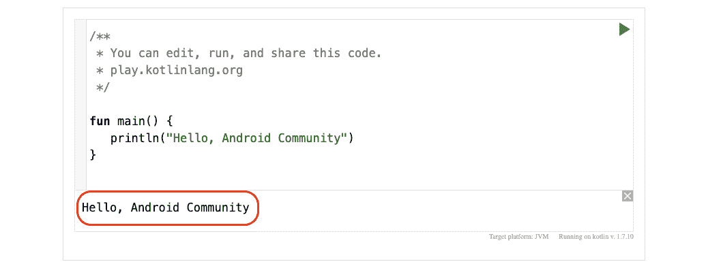

图 1.1 – 在线 Kotlin 编辑器

1.  让我们看看另一个例子；一个在面试中常用的流行算法问题——反转字符串。例如，你有一个字符串 `Community`，我们想要反转这个字符串，以便输出将是 `ytinummoC`。解决这个问题有几种方法，但我们将使用 Kotlin 的惯用方式来解决它。

1.  在你的 IDE 的游乐场或 Kotlin 游乐场中输入以下代码：

    ```java
    fun main() {
    ```

    ```java
        val stringToBeReversed = "Community"
    ```

    ```java
        println(reverseString(stringToBeReversed))
    ```

    ```java
    }
    ```

    ```java
    fun reverseString(stringToReverse: String): String {
    ```

    ```java
        return stringToReverse.reversed()
    ```

    ```java
    }
    ```

## 它是如何工作的...

在 Kotlin 中提到，通过利用默认参数值和仅设置需要更改的参数，有独特的方法可以使你的代码更干净、更精确、更简单。

`fun`是 Kotlin 编程语言中的一个词汇，代表*函数*，Kotlin 中的函数是执行特定任务的程序的一部分。我们第一个例子中的函数名是`main()`，在我们的`main()`函数中，我们没有任何输入。通常，函数有名字，这样我们就能在代码库复杂时区分它们。

此外，在 Java 中，函数类似于方法。函数名有两个括号和大括号，以及`println`，它告诉系统打印一行文本。

如果你曾经使用过 Java，你可能会注意到 Kotlin 编程语言与 Java 非常相似。然而，开发者们现在都在谈论 Kotlin 语言对开发者来说是多么的出色，因为它提供了更丰富的语法和复杂的类型系统，并且处理了 Java 多年来一直存在的空指针问题。为了充分利用 Kotlin 语言的力量并编写更简洁的代码，了解 Kotlin 惯用表达式可能会有所帮助。Kotlin 惯用表达式是经常使用的集合，有助于操作数据并使 Android 开发者的体验更加轻松。

在我们的第二个例子中，我们有两个函数，`main()`和`reverseString()`。`main()`没有输入，但`reverseString()`确实接收一个字符串输入。你也会注意到我们使用了`val`，这是 Kotlin 中用来指代只能设置为单个值的不可变值的独特词汇，与`var`相对，`var`是可变的变量，意味着它可以被重新赋值。

我们创建了一个`val stringToBeReversed`，它是一个字符串，并将其命名为`"Community"`，然后在`main()`函数内部调用`println`，并将我们想要在`reverseString()`函数中打印的文本传递进去。此外，在这个例子中，我们的`reverseString`函数从字符串对象接收一个`string`参数，然后返回一个字符串类型。

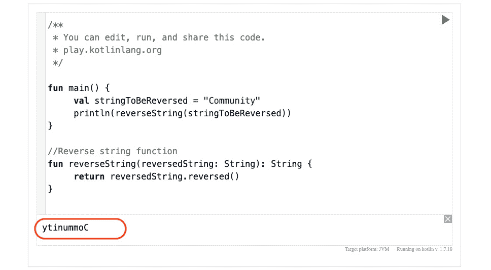

图 1.2 – Kotlin playground 上的反转字符串

还有更多东西要学习，而且公平地说，我们在本食谱中涵盖的内容只是 Kotlin 惯用表达式所能做到的一小部分。本食谱旨在介绍我们可能在后续章节中触及或使用的一些概念，但不会深入探讨，因为我们将后续章节中更多地探索 Kotlin。因此，现在了解 Kotlin 惯用表达式及其重要性是很好的。

## 参考资料还有

对 Kotlin 语法和常用用例的更好理解对你的日常工作至关重要，因此请查看以下资源：

+   JetBrains Academy 在这里提供了一个很棒的免费 Kotlin 基础课程：[`hyperskill.org/tracks/18`](https://hyperskill.org/tracks/18)。

+   Kotlin 文档也是一个很好的资源，可以随时查阅：[`kotlinlang.org/docs/home.html`](https://kotlinlang.org/docs/home.html)。

# 使用 Android Studio 创建 Hello, Android Community 应用程序

现在我们已经安装了 Android Studio，我们将创建我们的第一个 Android 应用程序。此外，我们将使用 Compose – 提前说明一下，在这个菜谱中，我们不会深入探讨 Compose，因为我们有一个专门的章节关于 Compose，即 *第二章*，*使用声明性 UI 创建屏幕并探索 Compose 原则*。

## 准备工作

在开始之前，了解你的 Android 项目所在位置对于保持一致性很有帮助。默认情况下，Android Studio 在你的家目录中创建一个名为 `AndroidStudioProjects` 的包，在这里你可以找到你创建的所有项目。

如果你想要更改它，你也可以决定文件夹应该放在哪里。此外，确保你使用的是 Android Studio 的最新版本以利用所有优秀功能。要了解最新的 Android 版本，你可以使用以下链接：[`developer.android.com/studio/releases`](https://developer.android.com/studio/releases)。

## 如何操作...

在 Android Studio IDE 中，一个项目模板是一个包含创建应用程序所需所有部分的 Android 应用程序，它帮助你开始并设置。

因此，一步一步地，我们将创建我们的第一个 Android 应用程序并在模拟器上运行它：

1.  通过点击你坞栏中的 Android Studio 图标或你存储 Android Studio 的位置来启动 Android Studio。

1.  你将看到一个欢迎的 Android Studio 窗口打开，你可以点击 **New Project**。或者，你也可以转到 **文件** 并点击 **New Project**。

1.  选择 **Empty Compose Activity** 并点击 **Next**。

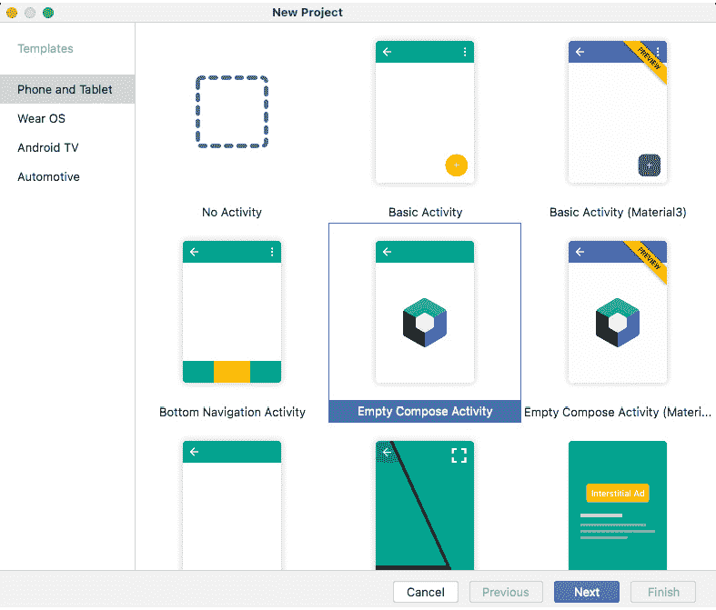

图 1.3 – 创建空的 Compose 活动

1.  一旦加载了空的 Compose 活动屏幕 (*图 1.4*), 你将看到包括 `Android Community` 在内的字段，其他设置保持不变。你还会注意到默认语言是 **Kotlin**。

关于 **最小 SDK 版本**，我们的目标是 **API 21: Android 5.0 (Lollipop**)，这表示你的应用可以运行的最小 Android 版本，在我们的案例中，大约是 98.8% 的设备。你也可以点击下拉菜单来了解更多关于最小 SDK 的信息。

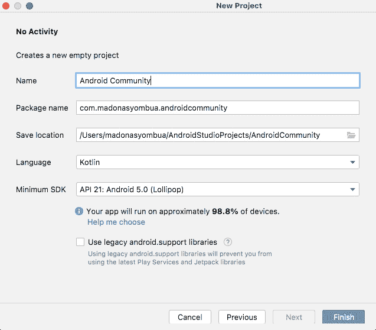

图 1.4 – 命名你的空 Compose 活动

点击 **Finish** 并等待 Gradle 同步。

1.  继续探索包，您将注意到一个扩展 `ComponentActivity()` 的 `MainActivity` 类，而 `ComponentActivity()` 又扩展了 `Activity()`；在内部，我们有一个 `fun onCreate`，这是从 `ComponentActivity` 继承而来的。您还会看到一个 `setContent{}`，这是一个用于设置可组合函数内容的函数。`setContent{}` 函数接受一个包含应显示的 UI 元素的 lambda 表达式，在我们的情况下，它持有我们应用程序的主题。在 `Greeting()` 函数中，我们将更改提供的内容，并添加我们自己的问候语 `"Hello, Android Community"` 并运行，这样我们就创建了第一个 `Greeting`：

    ```java
    class MainActivity : ComponentActivity() {
    ```

    ```java
        override fun onCreate(savedInstanceState: Bundle?)
    ```

    ```java
        {
    ```

    ```java
            super.onCreate(savedInstanceState)
    ```

    ```java
            setContent {
    ```

    ```java
                AndroidCommunityTheme {
    ```

    ```java
                    Surface(
    ```

    ```java
                        modifier = Modifier.fillMaxSize(),
    ```

    ```java
                        color =
    ```

    ```java
                        MaterialTheme.colors.background
    ```

    ```java
                    ) {
    ```

    ```java
                        Greeting("Hello, Android
    ```

    ```java
                                  Community")
    ```

    ```java
                    }
    ```

    ```java
                }
    ```

    ```java
            }
    ```

    ```java
        }
    ```

    ```java
    }
    ```

1.  让我们继续修改 `Greeting()` 函数，并将 `name` 参数分配给文本：

    ```java
    @Composable
    ```

    ```java
    fun Greeting(name: String) {
    ```

    ```java
        Text(
    ```

    ```java
            text = name
    ```

    ```java
        )
    ```

    ```java
    }
    ```

此外，您也可以直接将 `"Hello, Android Community"` 传递给默认实现，这将产生相同的用户界面。

1.  就像在 XML 视图中一样，您可以使用 `@Preview(showBackground = true)` 在不运行模拟器中的应用程序的情况下轻松查看您正在构建的 UI，所以如果它不可用，我们就将其添加到我们的代码中。默认情况下，项目附带一个包含 `Preview()` 模板的模板：

    ```java
    @Preview(showBackground = true)
    ```

    ```java
    @Composable
    ```

    ```java
    fun DefaultPreview() {
    ```

    ```java
    }
    ```

1.  最后，当您运行应用程序时，您应该有一个类似于 *图 1**.5* 的屏幕。在接下来的食谱中，我们将查看如何逐步设置您的模拟器，所以请不用担心这一点。

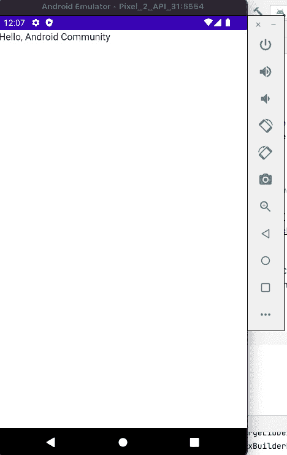

图 1.5 – 显示“Hello, Android Community”的屏幕

## 它是如何工作的…

使用 Jetpack Compose 创建视图的关键好处是，由于您使用相同的语言（Kotlin）编写整个代码库，因此可以加快开发速度，并且更容易进行测试。您还可以创建可重用的组件，并根据您的需求进行自定义。

因此，确保降低错误发生的可能性，并且不需要使用 XML 编写视图，因为这是繁琐且麻烦的。`onCreate()` 函数被认为是 Android 应用程序的入口点。此外，我们使用 `modifier` 函数来添加行为并装饰可组合项。我们将在下一章中更多地讨论 `modifier` 和 `Surface` 函数可以做什么。

# 在 Android Studio 中设置您的模拟器

Android Studio 是一个可靠且成熟的集成开发环境。因此，自 2014 年以来，Android Studio 一直是开发 Android 应用程序的首选 IDE。当然，您仍然可以使用其他 IDE，但 Android Studio 的优势是您不需要单独安装 Android SDK。

## 准备工作

您需要完成之前的食谱，才能跟随本食谱进行操作，因为我们将会设置我们的模拟器来运行我们刚刚创建的项目。

## 如何操作…

本章旨在对初学者友好，并在您通过食谱进行工作时，帮助您顺利过渡到更高级的 Android。

让我们按照以下步骤进行，看看您如何设置模拟器并在*使用 Android Studio 创建 Hello, Android Community App*菜谱中运行您的项目：

1.  导航到**工具** | **设备管理器**。一旦设备管理器就绪，您有两个选项：**虚拟**或**物理**。**虚拟**意味着您将使用模拟器，而**物理**意味着您将启用您的 Android 手机以调试 Android 应用程序。就我们的目的而言，我们将选择**虚拟**。

1.  点击**创建设备**，将弹出**虚拟设备配置**屏幕。

1.  选择**手机**。您会注意到 Android Studio 还有其他类别，例如**电视**、**Wear OS**、**平板电脑**和**汽车**。现在我们先使用**手机**，在未来的章节中，我们将尝试使用**Wear OS**。点击**下一步**。

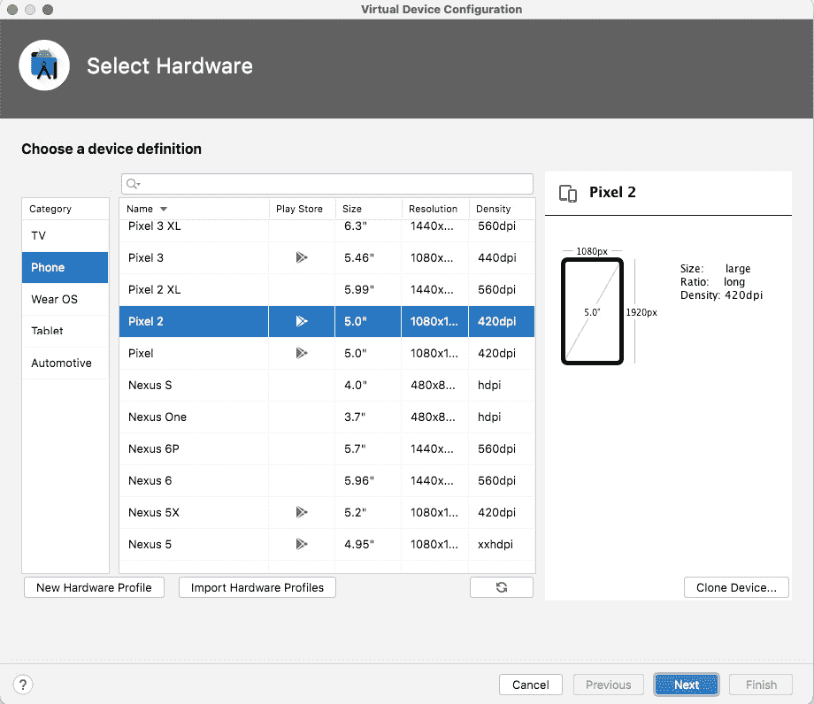

图 1.6 – 选择虚拟设备

1.  在**图 1**.7 中，您将看到一个**推荐系统镜像**的列表。您可以选择任何一个或使用默认的，在我们的案例中是**S**，针对 Android 12，尽管您可能想使用最新的 API，**33**，然后点击**下一步**。

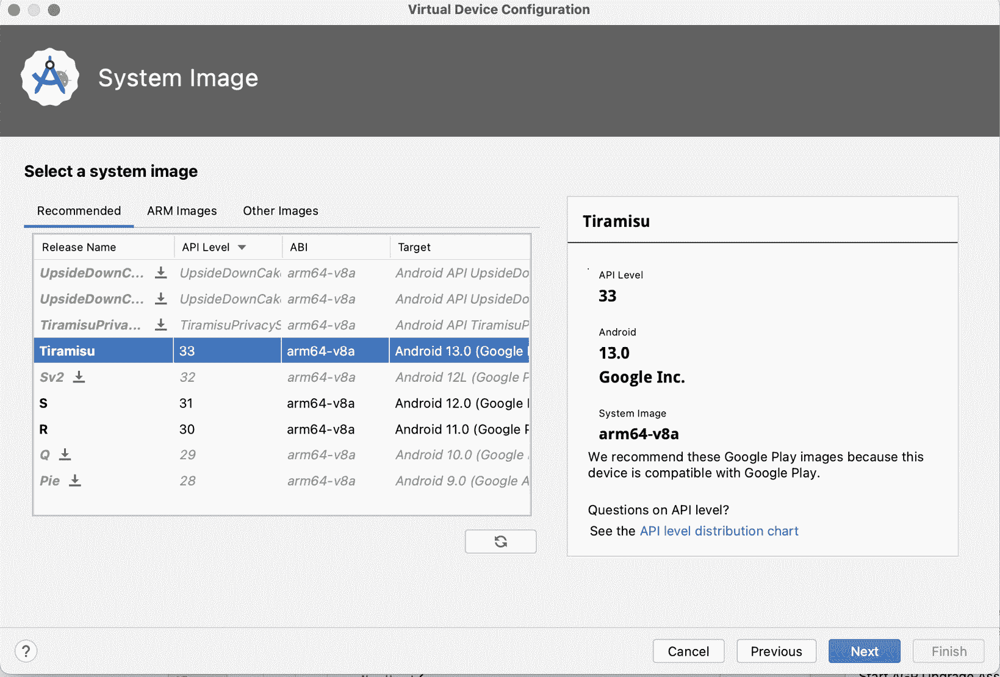

图 1.7 – 选择系统镜像

1.  您现在将到达**Android 虚拟设备**（**AVD**）屏幕，您可以命名您的虚拟设备。您可以输入一个名称或直接保留默认值，**Pixel 2 API 31**，然后点击**完成**。

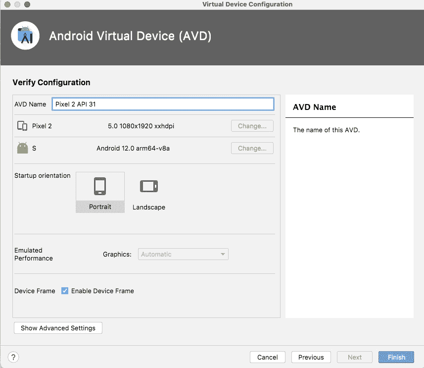

图 1.8 – 设置 AVD 的最后步骤

1.  通过运行它来测试您的虚拟设备，并确保它按预期工作。一旦您在模拟器上运行应用程序，您应该会看到类似于*图 1**.9 的内容。

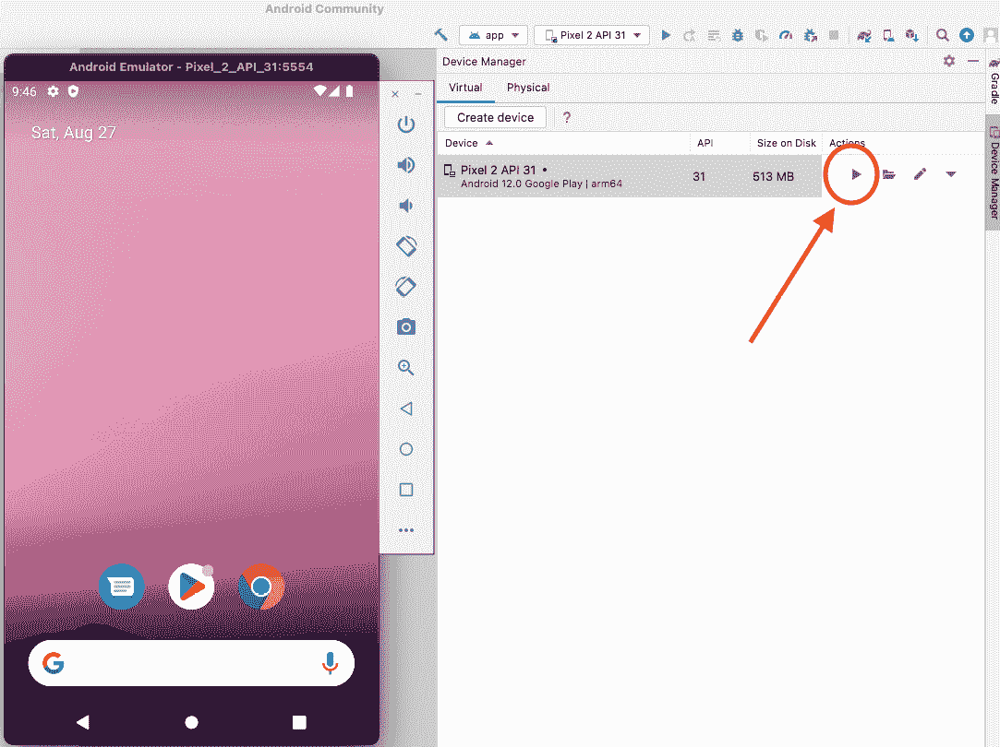

图 1.9 – 运行模拟器的设备管理器部分

重要提示

要创建物理测试设备，您必须进入您的 Android 手机的**设置**，选择**关于手机** | **软件信息** | **构建号**，并在释放按钮的同时按住，直到您看到**您现在离成为开发者只有四步之遥**。一旦计数完成，您将看到一个通知说**开发者选项已成功启用**。现在您只需要使用**通用串行总线**（**USB**）并切换 USB 调试。最后，您将看到您的物理手机已准备好进行测试。

## 它是如何工作的…

测试并确保您的应用程序显示预期的结果非常重要。这就是为什么 Android Studio 使用模拟器来帮助开发者确保他们的应用程序在标准设备上运行的方式。此外，Android 手机自带开发者选项，方便开发者使用，这使得支持不同数量的 Android 设备变得更加容易，也有助于在模拟器中重现难以找到的 bug。

# 在 Jetpack Compose 中创建按钮

我们必须注意，我们无法在一个菜谱中涵盖所有视图；我们有一个专门用于学习更多关于 Jetpack Compose 的章节，所以在我们创建的项目中，我们只是尝试为我们的项目创建两个额外的视图。

## 准备工作

打开**Android 社区**项目，因为这是我们将在本菜谱中构建的项目。

## 如何做到这一点...

让我们从在 Compose 中实现一个简单的按钮开始：

1.  让我们继续组织我们的代码，并通过添加`Column()`来使文本居中。这应该添加到`setContent{}`函数中：

    ```java
    Column(
    ```

    ```java
        modifier = Modifier
    ```

    ```java
            .fillMaxSize()
    ```

    ```java
            .wrapContentSize(Alignment.Center),
    ```

    ```java
        horizontalAlignment = Alignment.CenterHorizontally
    ```

    ```java
    ) {
    ```

    ```java
        Greeting("Hello, Android Community")
    ```

    ```java
      }
    ```

    ```java
    }
    ```

1.  现在，创建一个函数并命名为`SampleButton`；在这个例子中，我们将不传递任何内容。然而，我们将有一个`RowScope{}`，它定义了适用于我们按钮的`modifier`函数，并且我们将给我们的按钮起一个名字：`click me`。

1.  在 Compose 中，当你创建一个按钮时，你可以设置其形状、图标和高度，检查它是否启用，检查其内容等等。你可以通过在`Button()`组件上命令点击来检查如何自定义你的按钮：

    ```java
    @Composable
    ```

    ```java
    fun SampleButton() {
    ```

    ```java
        Button(
    ```

    ```java
            onClick = { /*TODO*/ },
    ```

    ```java
            modifier = Modifier
    ```

    ```java
                .fillMaxWidth()
    ```

    ```java
                .padding(24.dp),
    ```

    ```java
            shape = RoundedCornerShape(20.dp),
    ```

    ```java
            border = BorderStroke(2.dp, Color.Blue),
    ```

    ```java
            colors = ButtonDefaults.buttonColors(
    ```

    ```java
                contentColor = Color.Gray,
    ```

    ```java
                backgroundColor = Color.White
    ```

    ```java
            )
    ```

    ```java
        ) {
    ```

    ```java
            Text(
    ```

    ```java
                text = stringResource(id =
    ```

    ```java
                           R.string.click_me),
    ```

    ```java
                fontSize = 14.sp,
    ```

    ```java
                modifier = Modifier.padding(horizontal =
    ```

    ```java
                               30.dp, vertical = 6.dp)
    ```

    ```java
            )
    ```

    ```java
        }
    ```

    ```java
    }
    ```

在我们的`SampleButton`中，`onClick`没有任何操作；我们的按钮具有最大填充宽度的修饰符，24 **密度无关像素**（**dp**）的内边距，以及半径为 20 dp 的圆角。

我们还设置了按钮的颜色，并添加了`click me`作为文本。我们将字体大小设置为 14 **缩放无关像素**（**sp**），因为这有助于确保文本将很好地适应屏幕和用户的偏好。

1.  此外，点击右上角的**Split**来预览你的屏幕元素，或者你可以点击**设计**部分来查看整个屏幕而不显示代码。


图 1.10 – 在 Android Studio 中查看代码和设计

1.  最后，让我们调用我们的`SampleButton`函数，其中包含`Greeting`函数，并运行应用程序：

    ```java
    Column(
    ```

    ```java
        modifier = Modifier
    ```

    ```java
            .fillMaxSize()
    ```

    ```java
            .wrapContentSize(Alignment.Center),
    ```

    ```java
        horizontalAlignment = Alignment.CenterHorizontally
    ```

    ```java
    ) {
    ```

    ```java
        Greeting("Hello, Android Community")
    ```

    ```java
        SampleButton()
    ```

    ```java
    }
    ```

1.  编译并运行程序；你的应用应该看起来类似于*图 1.11*。

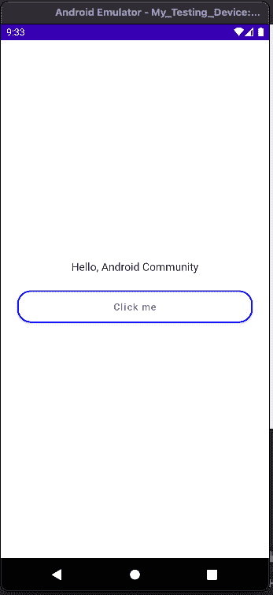

图 1.11 – 展示文本和按钮的屏幕截图

## 它是如何工作的...

一个 Composable 应用程序由多个 composable 函数组成，这些函数是带有`@Composable`注解的正常函数。正如 Google 文档所解释的，这个注解告诉 Compose 为更新和维护你的 UI 提供特殊支持。Compose 还允许你将代码结构化为小型可维护的块，你可以在任何给定点进行调整和重用。

## 还有更多...

由于很难在一个菜谱中涵盖所有视图，我们将在*第二章*中工作更多视图，*使用声明性 UI 创建屏幕并探索 Compose 原则*，探索最佳实践，并测试我们的 composable 视图。

# 利用 gradlew 命令在 Android Studio 中清理和运行你的项目

`gradlew` 命令是一个功能强大的 Gradle 包装器，具有出色的使用效果。然而，在 Android Studio 中，你不需要安装它，因为它是一个包含在项目中的脚本。

## 准备工作

然而，目前我们不会查看所有 Gradle 命令，而是使用最流行的命令来清理、构建、提供信息、调试，并在运行应用程序时扫描项目以查找任何问题。只要你在正确的目录中，你就可以在笔记本电脑的终端中运行这些命令，或者使用 Android Studio 提供的终端。

## 如何做…

按照以下步骤检查并确认 Gradle 是否按预期工作：

1.  你可以通过简单地运行 `./gradlew` 来检查版本。

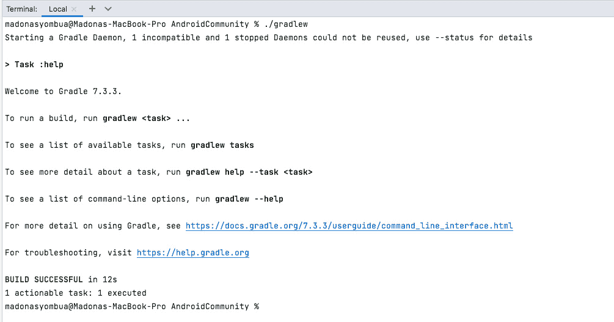

图 1.12 – gradlew 版本

1.  要构建和清理你的项目，你可以运行 `./gradlew clean` 和 `./gradlew build` 命令。如果你的项目有任何问题，构建将失败，你可以调查错误。此外，在 Android 中，你始终可以不使用 Gradle 命令运行你的项目，只需利用 IDE 的运行和清理选项。我们将在 *第十二章* 中深入讨论这个主题，*Android Studio 开发技巧和窍门帮助你*。

1.  以下是一些更有用的 `gradlew` 命令；例如，当你的构建失败并且你想知道出了什么问题，使用这些命令进行调查或点击错误消息（见 *图 1*.13*）：

    +   使用 `--stacktrace` 选项运行以获取堆栈跟踪

    +   使用 `--info` 或 `--debug` 选项运行以获取更多日志输出

    +   使用 `--scan` 运行以获取全面洞察

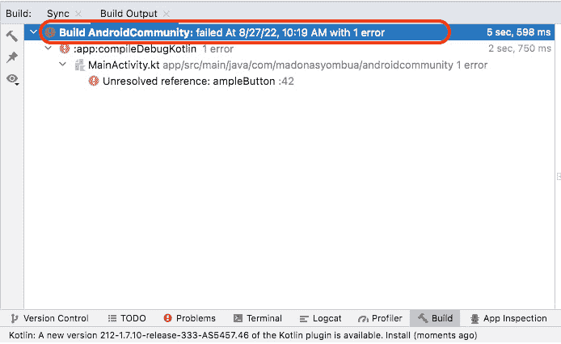

图 1.13 – 构建错误输出

## 它是如何工作的

Gradle 是一种通用构建工具，在 Android 开发中证明非常强大。此外，你可以创建和发布自定义插件来封装你的约定和构建功能。Gradle 的优点包括增量构建工作，适用于测试执行、编译以及构建系统中发生的任何其他任务。

## 相关内容

更多关于 Gradle 及其功能的介绍，请参阅：[`gradle.org/`](https://gradle.org/).

# 理解 Android 项目结构

如果你第一次查看 Android 项目文件夹，你可能想知道在哪里添加你的代码以及包的含义。这个菜谱将带你了解每个文件夹包含的内容以及代码放在哪里。

## 准备工作

如果你打开你的项目，你会注意到许多文件夹。你的 Android 项目中的主要文件夹如下所示：

+   `manifest` 文件夹

+   `java` 文件夹 (`test`/`androidTest`)

+   `Res` `资源` 文件夹

+   `Gradle 脚本`

## 如何做…

让我们边学习边导航每个文件夹，了解存储在哪里，为什么：

1.  在 *图 1*.14 中，你可以看到 **包** 下拉菜单；点击它，将弹出一个包含 **项目**、**包**、**项目文件** 等的窗口。

1.  你可以选择使用 Android 标志，通过下拉菜单旁边的 `Project` 高亮部分来查看你的项目。当你应用程序中有许多模块并且想要添加特定代码时，项目视图是最好的。请随意点击这些部分，看看它们包含的内容。


图 1.14 – Android Studio 项目结构

1.  `manifest` 文件夹是 Android 应用的真相来源；它包含 `AndroidManifest.xml` 文件。点击文件内部，你会注意到你有一个意图启动器，它会在你的模拟器上启动 Android 应用程序。

1.  此外，版本号通常在 Gradle 中设置，然后合并到 `manifest` 文件中，在 manifest 文件中我们添加所有需要的权限。你还会注意到包名、元数据、数据提取规则、主题和图标；如果你有一个独特的图标，你可以在这里添加一个。

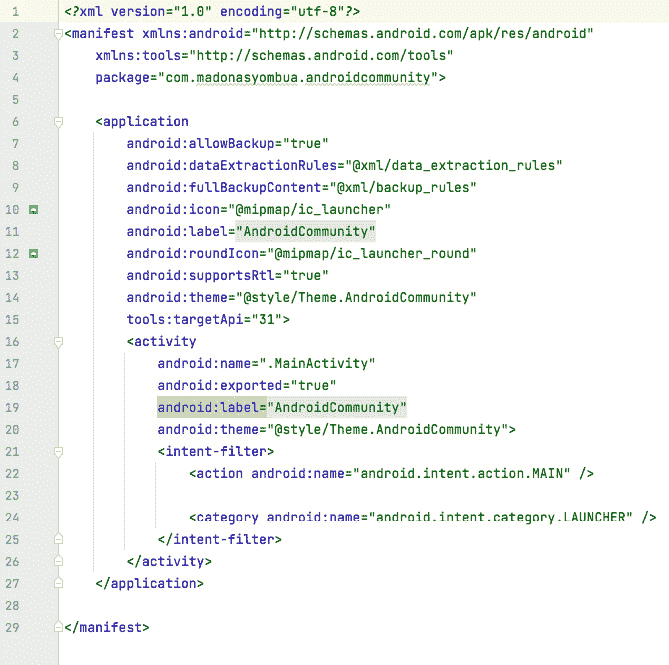

图 1.15 – Android Studio 项目结构 manifest 文件

重要提示

使你的图标适应性强是添加图标到应用程序中的新流行方式。自适应图标在 MAD 中根据个别用户的主题显示不同。请参阅 [`developer.android.com/develop/ui/views/launch/icon_design_adaptive`](https://developer.android.com/develop/ui/views/launch/icon_design_adaptive)。

1.  `java` 文件夹包含我们在构建 Android 应用程序时创建的所有 Kotlin (`.kt`) 和 Java (`.java`) 文件。例如，在 *图 1**.16* 中，我们有一个包含 **(androidTest)** 和 **(test)** 的包，这就是我们添加测试的地方。点击所有文件夹，看看它们包含的内容。

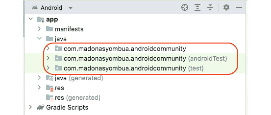

图 1.16 – Android Studio 项目结构 Java 文件夹

1.  在 `androidTest` 文件夹中，我们编写我们的 UI 测试以测试 UI 功能，在测试文件夹中，我们编写我们的单元测试。单元测试测试我们代码的小部分，以确保所需的行为符合预期。**测试驱动开发** (**TDD**) 在应用程序开发期间非常出色且有价值。一些公司遵循这个规则，但一些公司并不强制执行。然而，这是一个很好的技能，因为始终测试你的代码是一种良好的实践。

`res` 文件夹包含 XML 布局、UI 字符串、可绘制图像和 Mipmap 图标。另一方面，`values` 文件夹包含许多有用的 XML 文件，如 `dimensions`、`colors` 和 `themes`。点击 `res` 文件夹以熟悉其中的内容，因为我们将在下一章中使用它。

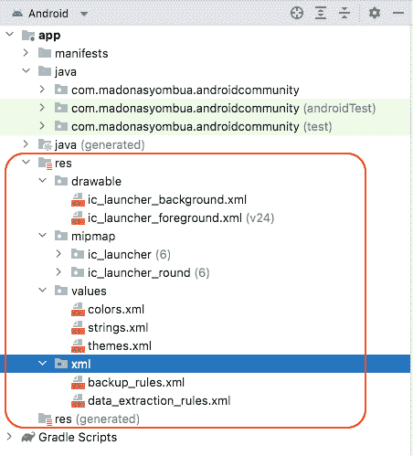

图 1.17 – Android Studio 项目结构 res 文件夹

重要提示

除非你从头开始构建一个新项目，否则许多应用程序仍然使用 XML 布局，开发者现在选择使用 Jetpack Compose 作为一项进步来开发新屏幕。因此，你可能需要维护或了解如何用 XML 编写视图。

1.  最后，在 `Gradle Scripts` 中，你会看到定义我们可以应用于我们的模块的构建配置的文件。例如，在 `build.gradle(Project: AndroidCommunity)` 中，你会看到一个顶层文件，你可以在这里添加适用于所有子项目模块的配置选项。

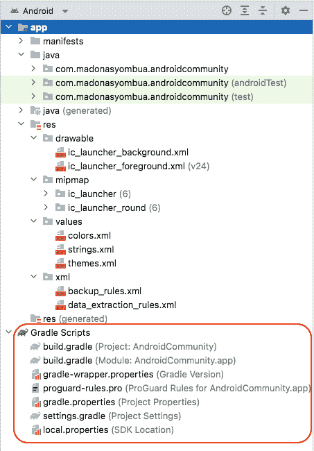

图 1.18 – Android Studio 项目结构中的 Gradle 脚本

## 它是如何工作的…

在 Android Studio 中，对于初学者来说，不知道文件在哪里以及什么是重要的可能会令人不知所措。因此，有一个逐步指南说明在哪里添加你的测试或代码，并理解 Android 项目结构是至关重要的。此外，在复杂的项目中，你可能会发现不同的模块；因此，理解项目结构是有帮助的。在 Android Studio 中，一个模块是一组源文件和构建设置，它允许你将项目划分为具有特定目的的独立实体。

# Android Studio 中的调试和日志记录

调试和日志记录在 Android 开发中至关重要，你可以编写在 Logcat 中出现的日志消息，以帮助你找到代码中的问题或验证代码在应该执行时是否执行。

我们将在这里介绍这个主题，但说我们将在一个菜谱中涵盖所有内容是不公平的；因此，我们将更多地介绍调试和日志记录，在 *第十二章*，*Android Studio 开发技巧与窍门* 中。

## 准备工作

让我们用一个例子来理解日志记录。以下日志方法按优先级从高到低列出。它们在记录网络错误、成功调用和其他错误时是合适的：

+   `Log.e()`: 日志错误

+   `Log.w()`: 日志警告

+   `Log.i()`: 日志信息

+   `Log.d()`: 调试显示对开发者的关键消息，最常用的日志

+   `Log.v()`: 详细

一个好的做法是将每个日志与一个 `TAG` 相关联，以便快速识别 Logcat 中的错误消息。一个“`TAG`”是指可以分配给 Android 应用程序中的 View 或其他 UI 元素的一个文本标签。在 Android 中使用 **标签** 的主要目的是提供一种方法，将附加信息或元数据与 UI 元素关联起来。

## 如何做…

让我们继续在我们的小型项目中添加日志消息：

1.  我们将创建一个调试日志，然后运行应用程序：

    ```java
    Log.d(TAG, "asdf Testing call")
    ```

在 `asdf` 中查看，看你是否能找到消息。

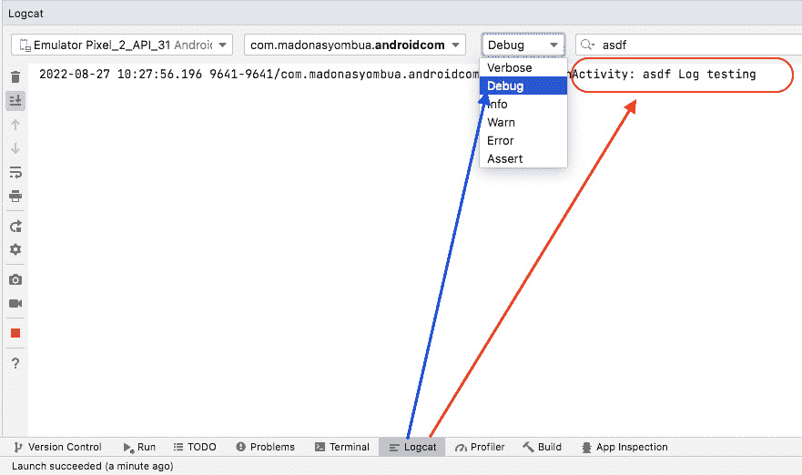

图 1.19 – Android Logcat

你会注意到日志中有一个类名，我们的 `TAG` (`MainActivity`)，以及显示的日志消息；请参见 *图 1**.19* 中的右箭头。

1.  左箭头显示了提到的日志类型，通过下拉菜单，你可以快速查看基于特定规格的消息。

## 它是如何工作的…

**调试**是指在类中设置断点、减慢模拟器速度，并尝试找出代码中的问题。如果，例如，你在代码中遇到竞态条件，或者你的代码在某些设备上工作而在其他设备上不工作，调试功能就非常强大。

此外，为了利用调试功能，你首先需要将调试器附加到模拟器上，然后以**调试**模式运行。另一方面，**日志记录**可以帮助你记录在遇到问题时可能对你有帮助的信息。有时，调试可能会很具挑战性，但将日志放置在代码中需要的位置可能会非常有帮助。

一个实际案例是当你从 API 加载数据时；你可能希望在出现网络错误时记录它，以通知你如果网络调用失败会发生什么。因此，使用断点进行调试可能会帮助你放慢评估值的过程，由于我们在这个章节中没有构建很多内容，我们可以在后面的章节中通过不同的食谱重新审视这个主题。

## 参见

Timber 是一个具有小型、可扩展 API 的日志记录器，它提供了在 Android 标准`Log`类之上的实用功能，许多开发者用它来进行日志记录。有关 Timber 的更多信息，请参阅[`github.com/JakeWharton/timber`](https://github.com/JakeWharton/timber)。
