# 第三章：在 Jetpack Compose 和使用 Hilt 中处理 UI 状态

所有 Android 应用程序都向用户显示状态，这有助于通知用户结果是什么以及何时发生。Android 应用程序中的 **状态**是任何随时间变化的价值，一个很好的例子是在出现错误时显示消息的 toast。在本章中，读者将学习如何使用新的 Jetpack 库更好地处理 UI 状态。

有一句老话说，权力越大，责任越大，管理任何可组合组件的状态需要与使用较旧的构建 Android 视图的方式（或许多人称之为命令式方式）截然不同的方法。这意味着 Jetpack 的库 Compose 完全不同于 XML 布局。

在 XML **视图系统**中处理 UI 状态非常简单。这个过程包括设置视图的属性以反映当前状态——也就是说，根据需要显示或隐藏视图。例如，当从 API 加载数据时，你可以隐藏加载视图，显示内容视图，并用所需的视图填充它。

然而，在 Compose 中，一旦应用程序绘制了可组合组件，就无法更改该组件。但是，你可以通过更改每个可组合组件接收到的状态来更改传递给每个可组合组件的值。因此，在学习如何更好地管理构建健壮的 Android 应用程序的状态时，这将非常有用。

在本章中，我们将介绍以下食谱：

+   使用 Jetpack Hilt 实现 **依赖注入**（**DI**）

+   实现 `ViewModel` 类并在 Compose 中理解状态

+   在现有的基于 XML 布局的项目中实现 Compose

+   理解和处理 Jetpack Compose 中的重组

+   为你的 Compose 视图编写 UI 测试

+   为你的 `ViewModel` 类编写测试

# 技术要求

本章的完整源代码可以在[`github.com/PacktPublishing/Modern-Android-13-Development-Cookbook/tree/main/chapter_three`](https://github.com/PacktPublishing/Modern-Android-13-Development-Cookbook/tree/main/chapter_three)找到。

# 使用 Jetpack Hilt 实现依赖注入

在面向对象编程中，依赖注入至关重要。有些人使用它，有些人出于自己的原因而选择不使用它。然而，依赖注入是一种设计对象的方式，其中它们从其他代码片段接收对象实例，而不是内部构建它们。

如果你了解 SOLID 原则，你知道它们的主要目标是使软件设计更容易维护、阅读、测试和构建。此外，依赖注入帮助我们遵循一些 SOLID 原则。依赖倒置原则允许代码库容易地通过添加新的功能进行扩展和扩展，并提高了可重用性。在现代 Android 开发中，依赖注入是必不可少的，我们将在本食谱中实现它。

在 Android 中，你可以使用不同类型的库来进行依赖注入，例如 Koin、Dagger 和 Hilt；Hilt 利用 Dagger 的力量，并从编译时正确性、良好的运行时性能、Android Studio 支持以及可扩展性中受益。对于这个菜谱，我们将使用 Hilt，它为我们的项目中每个 Android 类提供容器，并自动管理它们的生命周期。

## 准备工作

就像在之前的菜谱中一样，我们将使用之前菜谱中使用的项目来添加依赖注入。

## 如何做到这一点...

Hilt 使用 Java 特性；确保你的项目在 `app/build.gradle` 中，并且你有以下编译选项：

```kt
android {
    ...
    compileOptions {
        sourceCompatibility JavaVersion.VERSION_11
        targetCompatibility JavaVersion.VERSION_11
    }
}
```

这已经自动添加了，但请确保你检查一下，以防万一。让我们开始吧：

1.  首先，我们必须将 `Hilt-android-gradle-plugin` 插件添加到我们项目的根文件 `build.gradle(Project:SampleLogin)` 中：

    ```kt
    plugins {
    ```

    ```kt
        id 'com.google.dagger.Hilt.android' version '2.44'
    ```

    ```kt
    apply false
    ```

    ```kt
    }
    ```

1.  然后，在我们的 `app/build.gradle` 文件中添加以下依赖项，并同步项目。它应该没有问题地运行：

    ```kt
    plugins {
    ```

    ```kt
        id 'kotlin-kapt'
    ```

    ```kt
        id 'dagger.Hilt.android.plugin'
    ```

    ```kt
    }
    ```

    ```kt
    dependencies {
    ```

    ```kt
        implementation "com.google.dagger:Hilt-
    ```

    ```kt
            android:2.44"
    ```

    ```kt
        kapt "com.google.dagger:Hilt-compiler:2.44"
    ```

    ```kt
    }
    ```

1.  现在，让我们继续添加 `Application` 类。所有使用 Hilt 的应用程序都必须有一个被 `@HiltAndroidApp` 注解的 `Application` 类，并且我们需要调用在 `Manifest` 中创建的 `Application` 类：

    ```kt
    @HiltAndroidApp
    ```

    ```kt
    class LoginApp : Application()
    ```

1.  在我们的 `Manifest` 文件夹中，让我们添加 `LoginApp`：

    ```kt
    <application
    ```

    ```kt
        android:name=".LoginApp"
    ```

    ```kt
      ...
    ```

1.  现在我们已经完成了设置，我们需要通过给我们的类添加所需的注解来开始使用 Hilt。在 `MainActivity.kt` 中，我们需要添加 `@AndroidEntryPoint` 注解：

    ```kt
    @AndroidEntryPoint
    ```

    ```kt
    class MainActivity : ComponentActivity() {
    ```

    ```kt
      ...
    ```

1.  让我们运行 `./gradlew :app:dependencies` 命令，看看我们做了什么，我们会看到类似于 *图 3**.1* 的内容。

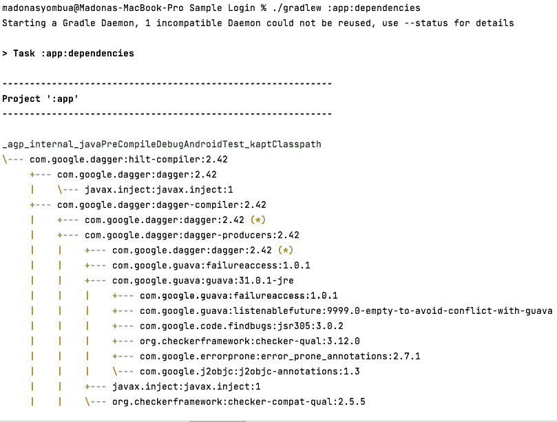

图 3.1 – Dagger Hilt 依赖关系树

你也可以在 Android Studio 中查看依赖关系。这需要点击右侧的 **Gradle** 选项卡，然后选择 **展开:yourmodule** | **Tasks** | **android**。然后，最后，双击 **androidDependencies** 来运行它。

最后，编译并运行项目；它应该能够成功运行。

## 它是如何工作的...

`@HiltAndroidApp` 触发 Hilt 的代码生成，包括我们的应用程序的基础类，它充当应用程序级别的依赖项容器。`@AndroidEntryPoint` 注解向被注解的 Android 类添加 DI 容器。当使用 Hilt 时，生成的 Hilt 组件附加到 Application 对象的生命周期，并提供其依赖项。Hilt 目前支持以下 Android 类：

+   被注解为 `@HiltViewModel` 的 `ViewModel`

+   被注解为 `@HiltAndroidApp` 的 `Application`

+   `Activity`

+   `Fragment`

+   `View`

+   `Service`

+   `BroadcastReceiver`

我们将在 Hilt 中稍后使用其他必要的注解，例如 `@Module` 注解、`@InstallIn` 和 `@Provides`。`@Module` 注解意味着你可以添加绑定类型的类，这些类型不能在构造函数中注入。`@InstallIn` 指示哪个 Hilt 生成的 DI 容器（或单例组件）必须在代码模块绑定中可用。

最后，`@Provides` 将一个不能通过构造函数注入的类型绑定。它的返回类型是绑定类型，它可以接受依赖参数，并且每次需要实例时，如果类型没有被作用域限制，函数体就会执行。

# 实现 ViewModel 类和了解 Compose 中的状态

在 Android 中，`ViewModel` 是一个负责有意识地管理与 UI 相关的数据生命周期的类。社区中也有许多关于开发人员是否应该在 Compose 中使用 `ViewModel` 的争论。然而，谷歌的高级 Android 开发者关系工程师 Manuel Vivo 表示：

*“如果它们的优点适用于您的应用程序，我会包括它们。如果您自己处理所有配置更改并且不使用 Navigation Compose，则无需使用它们。否则，使用 ViewModels 而不是重新发明轮子。”*

*“另一方面，关于为什么不应该使用 ViewModels 的争论基于这样一个论点：在纯 Compose 中，由于 Compose 处理配置更改，您的 Composable 函数引用 ViewModel 是不必要的。”*

您还可以参考 Jim Sproch 的这条推文：[`twitter.com/JimSproch/status/1397169679647444993`](https://twitter.com/JimSproch/status/1397169679647444993)。

注意

您可以在以下位置找到有关使用 ViewModel 的好处更多信息：[`developer.android.com/jetpack/compose/state#viewmodels-source-of-truth`](https://developer.android.com/jetpack/compose/state#viewmodels-source-of-truth)。

这意味着在 Jetpack Compose 中，使用 `ViewModel` 来处理应用程序的状态将是一个个人选择的问题。目前 Android 推荐的架构模式是 **模型-视图-视图-模型**（**MVVM**），许多应用程序都在使用它。

Jetpack Compose 使用单向数据流设计模式；这意味着数据或状态只向下流动，而事件向上流动。因此，清楚地了解我们如何利用单向模式，尽可能多地使用 `ViewModel` 类使我们的代码更易于阅读、维护和测试，将是有帮助的。

此外，`ViewModel` 适用于为您的应用程序提供访问业务逻辑、准备屏幕上展示的数据以及使您的代码可测试的能力。

## 准备工作

在这个菜谱中，我们将使用一个预构建的骨架 `SampleLogin` 项目，您可以从 *技术要求* 部分下载它。我们将在这个菜谱中使用 Hilt，因为项目使用了 Hilt，但我们将在一个后续菜谱中解释 Hilt。

## 如何做到这一点…

现在，您将创建一个 `ViewModel` 类并修改 `LoginContent` Kotlin 文件中的大部分代码：

1.  为了使我们的类和文件保持良好的组织结构，让我们首先创建一个包来存放我们的 UI 和视图模型。导航到主 `Package` 文件夹，右键单击以打开提示，然后向下到 **Package**，将出现一个带有包名的对话框。

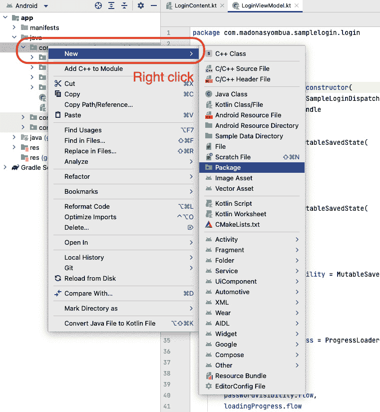

图 3.2 – 如何创建一个包

1.  将包命名为`Login`；在`LoginContent`文件中添加新的类，`LoginViewModel`。接下来创建一个`ViewModel`类：

    ```kt
    class LoginViewModel {...}
    ```

1.  现在我们已经创建了`LoginViewModel`类，我们需要添加`HiltViewModel`的 DI 注解并确保我们扩展了`ViewModel`类：

    ```kt
    @HiltViewModel
    ```

    ```kt
    class LoginViewModel @Inject constructor(
    ```

    ```kt
    ): ViewModel(){. . .}
    ```

1.  在我们的`ViewModel`构造函数中，我们需要添加`stateHandle: SavedStateHandle`，这将帮助我们维护和从保存的状态中检索对象。这些值即使在系统杀死进程后仍然持续存在，并且可以通过相同的对象保持可用：

    ```kt
    @HiltViewModel
    ```

    ```kt
    class LoginViewModel @Inject constructor(
    ```

    ```kt
        stateHandle: SavedStateHandle
    ```

    ```kt
    ) : ViewModel() {...}
    ```

1.  在我们构建`ViewModel`之前，让我们继续创建一个数据类，`AuthenticationState()`。这个类在我们的测试中非常有用，因为我们需要能够测试大多数验证案例。一个`View`状态类，加上拥有单一事实来源，有许多优点，并且是**模型-视图-意图**（**MVI**）的原则之一：

    ```kt
    data class AuthenticationState(
    ```

    ```kt
        val userName: String = "",
    ```

    ```kt
        val password: String = "",
    ```

    ```kt
        val loading: Boolean = false,
    ```

    ```kt
        var togglePasswordVisibility: Boolean = true
    ```

    ```kt
    ) {
    ```

    ```kt
        companion object {
    ```

    ```kt
            val EMPTY_STATE = AuthenticationState()
    ```

    ```kt
        }
    ```

    ```kt
    }
    ```

1.  现在，让我们继续创建一个辅助类，`MutableSavedState<T>()`，它将接受`savedStateHandle`、一个键和一个默认值。这个类充当`MutableStateFlow()`，但保存数据和值，并在应用程序死亡时通过`SavedStateHandle`检索它们：

    ```kt
    class MutableSavedState<T>(
    ```

    ```kt
        private val savedStateHandle: SavedStateHandle,
    ```

    ```kt
        private val key: String,
    ```

    ```kt
        defValue: T,
    ```

    ```kt
    ) {
    ```

    ```kt
     . . .
    ```

    ```kt
    }
    ```

1.  现在，让我们继续创建当用户在我们的`LoginViewModel`中输入用户名和密码时将被调用的回调：

    ```kt
    private val username = MutableSavedState(
    ```

    ```kt
        stateHandle,
    ```

    ```kt
        "UserName",
    ```

    ```kt
        defValue = ""
    ```

    ```kt
    )
    ```

    ```kt
    fun userNameChanged(userName: String){
    ```

    ```kt
        username.value = userName
    ```

    ```kt
    }
    ```

1.  接下来，对密码和密码切换可见性执行相同的操作。

1.  现在，我们需要创建一个`combineFlows`辅助类。在 Kotlin 中，你可以组合超过两个流程；协程`flow`是一种按顺序发出多个值的类型，与返回单个值的`suspend`函数相反。有关如何组合流程的更多详细信息，请参阅`combine(flow1, flow2, flow3, flow4) {t1, t2, t3, t4 -> resultMapper}.stateIn(scope)`：

    ```kt
    fun <T1, T2, T3, T4, T5, T6, R> combine(
    ```

    ```kt
        flow: Flow<T1>,
    ```

    ```kt
        flow2: Flow<T2>,
    ```

    ```kt
        flow3: Flow<T3>,
    ```

    ```kt
        flow4: Flow<T4>,
    ```

    ```kt
        flow5: Flow<T5>,
    ```

    ```kt
        flow6: Flow<T6>,
    ```

    ```kt
        transform: suspend (T1, T2, T3, T4, T5, T6) -> R
    ```

    ```kt
    ): Flow<R> = combine(
    ```

    ```kt
            combine(flow, flow2, flow3, ::Triple),
    ```

    ```kt
            combine(flow4, flow5, flow6, ::Triple)
    ```

    ```kt
    ) { t1, t2 ->
    ```

    ```kt
        transform(
    ```

    ```kt
            t1.first,
    ```

    ```kt
            t1.second,
    ```

    ```kt
            t1.third,
    ```

    ```kt
            t2.first,
    ```

    ```kt
            t2.second,
    ```

    ```kt
            t2.third
    ```

    ```kt
        )
    ```

    ```kt
    }
    ```

更多信息请参阅此处 – [`stackoverflow.com/questions/67939183/kotlin-combine-more-than-2-flows`](https://stackoverflow.com/questions/67939183/kotlin-combine-more-than-2-flows)：

```kt
val state = combineFlows(
    username.flow,
    password.flow,
    passwordVisibilityToggle.flow,
    loadingProgress.flow
) { username, password, passwordToggle, isLoading ->
    AuthenticationState(
        userName = username,
        password = password,
        togglePasswordVisibility = passwordToggle,
        loading = isLoading
    )
}.stateIn(. . .)
```

1.  现在，让我们继续创建我们的协程辅助类，命名为`SampleLoginDispatchers()`；它将帮助我们测试代码并确保我们的代码易于阅读。此外，我们使用协程调度器，这些调度器有助于确定相应的协程应该使用哪个线程进行执行：

    ```kt
    .stateIn(
    ```

    ```kt
       coroutineScope = viewModelScope + dispatchers.main,
    ```

    ```kt
       initialValue = AuthenticationState.EMPTY_STATE
    ```

    ```kt
    )
    ```

`SharedFlow`表示一个只读状态，具有单个可更新的数据值，它向其收集器发出任何更新。另一方面，状态流程是一个热流程，因为它的活动实例的存在独立于收集器的存在。

1.  Android 中的`SharingStarted`协程流程操作符用于在多个收集器之间共享流程的执行。它通常用于创建一个“热”流程，这意味着流程一旦创建就开始发出数据，并且数据被所有活跃的流程收集器共享。这些可以是连续的相同命令的发射，并且没有任何效果：

    ```kt
    fun <T> Flow<T>.stateIn(
    ```

    ```kt
        coroutineScope: CoroutineScope,
    ```

    ```kt
        initialValue: T
    ```

    ```kt
    ): StateFlow<T> = stateIn(
    ```

    ```kt
        scope = coroutineScope,
    ```

    ```kt
        started = SharingStarted.WhileSubscribed(5000),
    ```

    ```kt
        initialValue = initialValue
    ```

    ```kt
    )
    ```

1.  有四种类型的分发器。在我们的例子中，我们只会使用三种。此外，你可以注入单个分发器，而不需要类，因此这可以基于个人偏好。看看四种类型分发器是如何工作的：

    ```kt
    class SampleLoginDispatchers(
    ```

    ```kt
        val default: CoroutineDispatcher,
    ```

    ```kt
        val main: CoroutineDispatcher,
    ```

    ```kt
        val io: CoroutineDispatcher
    ```

    ```kt
    ) {
    ```

    ```kt
        companion object {
    ```

    ```kt
            fun createTestDispatchers(coroutineDispatcher:
    ```

    ```kt
            CoroutineDispatcher): SampleLoginDispatchers {
    ```

    ```kt
                return SampleLoginDispatchers(
    ```

    ```kt
                    default = coroutineDispatcher,
    ```

    ```kt
                    main = coroutineDispatcher,
    ```

    ```kt
                    io = coroutineDispatcher
    ```

    ```kt
                )
    ```

    ```kt
            }
    ```

    ```kt
        }
    ```

    ```kt
    }
    ```

现在我们已经创建了我们的辅助类，我们必须通过依赖注入（DI）提供分发器。我们有一个专门针对 Hilt 的整个食谱，所以我们将探讨其中的概念以及注解在 Hilt 食谱中的含义。

1.  创建一个新的包，并将其命名为 `di`。在这个包中，创建一个新的对象，并将其命名为 `AppModule`；我们将通过依赖图将我们的分发器提供给 `ViewModel` 构造函数：

    ```kt
    @Module
    ```

    ```kt
    @InstallIn(SingletonComponent::class)
    ```

    ```kt
    object AppModule {
    ```

    ```kt
        @Provides
    ```

    ```kt
        fun provideSlimeDispatchers():
    ```

    ```kt
        SampleLoginDispatchers {
    ```

    ```kt
            return SampleLoginDispatchers(
    ```

    ```kt
            default = Dispatchers.Default,
    ```

    ```kt
            main = Dispatchers.Main,
    ```

    ```kt
            io = Dispatchers.IO
    ```

    ```kt
            )
    ```

    ```kt
        }
    ```

    ```kt
    }
    ```

1.  我们现在需要前往 `LoginContent` 并修改代码——也就是说，通过添加与我们的 `ViewModel` 对应的回调，并且每当我们有视图——例如，`UserNameField()`——我们将使用回调。请参阅示例代码：

    ```kt
    @Composable
    ```

    ```kt
    fun LoginContent(
    ```

    ```kt
        modifier: Modifier = Modifier,
    ```

    ```kt
        uiState: AuthenticationState,
    ```

    ```kt
        onUsernameUpdated: (String) -> Unit,
    ```

    ```kt
        onPasswordUpdated: (String) -> Unit,
    ```

    ```kt
        onLogin: () -> Unit,
    ```

    ```kt
        passwordToggleVisibility: (Boolean) -> Unit
    ```

    ```kt
    ){
    ```

    ```kt
    . . .
    ```

    ```kt
    UserNameField(authState = uiState, onValueChanged =
    ```

    ```kt
    onUsernameUpdated)
    ```

    ```kt
    PasswordInputField(
    ```

    ```kt
        text = stringResource(id = R.string.password),
    ```

    ```kt
        authState = uiState,
    ```

    ```kt
        onValueChanged = onPasswordUpdated,
    ```

    ```kt
        passwordToggleVisibility =
    ```

    ```kt
            passwordToggleVisibility
    ```

    ```kt
    )
    ```

    ```kt
    LoginButton(
    ```

    ```kt
        text = stringResource(id = R.string.sign_in),
    ```

    ```kt
        enabled = if (uiState.isValidForm()) {
    ```

    ```kt
            !uiState.loading
    ```

    ```kt
        } else {
    ```

    ```kt
            false
    ```

    ```kt
        },
    ```

    ```kt
        onLoginClicked = {
    ```

    ```kt
            onLogin.invoke()
    ```

    ```kt
        },
    ```

    ```kt
        isLoading = uiState.loading
    ```

    ```kt
    ). . .}
    ```

1.  现在，在我们的 `LoginContentScreen` 组合函数中，我们将传递我们的 `LoginViewModel`：

    ```kt
    @Composable
    ```

    ```kt
    fun LoginContentScreen(
    ```

    ```kt
        loginViewModel: LoginViewModel,
    ```

    ```kt
        onRegisterNavigateTo: () -> Unit
    ```

    ```kt
    ) {
    ```

    ```kt
        val viewState by
    ```

    ```kt
            loginViewModel.state.collectAsState()
    ```

    ```kt
        LoginContent(
    ```

    ```kt
            uiState = viewState,
    ```

    ```kt
            onUsernameUpdated =
    ```

    ```kt
                loginViewModel::userNameChanged,
    ```

    ```kt
             onPasswordUpdated =
    ```

    ```kt
                loginViewModel::passwordChanged,
    ```

    ```kt
             onLogin = loginViewModel::login,
    ```

    ```kt
             passwordToggleVisibility =
    ```

    ```kt
                 loginViewModel::passwordVisibility,
    ```

    ```kt
             onRegister = onRegisterNavigateTo
    ```

    ```kt
        )
    ```

    ```kt
    }
    ```

1.  最后，在 `MainActivity` 中，我们现在可以继续调用 `LoginContentScreen`，传入我们的 `ViewModel`，并指定当用户点击 `onRegister` 时我们想要执行的操作：

    ```kt
    LoginContentScreen(loginViewModel = HiltViewModel(), onRegisterNavigateTo = {. . .}
    ```

1.  对于整个代码，请确保查看 *技术要求* 部分的链接。


图 3.3 – 输入特殊字符 ! 时显示的错误状态

## 它是如何工作的…

Jetpack Compose 使用单向数据流设计模式。这意味着数据或状态只向下流动，而事件向上流动，如图 *图 3**.4* 所示。


图 3.4 – 单向数据流

也就是说，组合函数接收状态并在屏幕上显示它。另一方面，事件可以导致状态需要更新，这些事件可以来自组合函数或应用程序的任何其他部分。此外，无论谁处理状态，在我们的例子中是 `ViewModel`，都会接收事件并为我们调整状态。

我们还使用协程，它们不过是轻量级的线程，它们帮助我们轻松处理同步和异步编程。此外，协程允许执行被挂起并在稍后恢复。主要优点是它们轻量级、内置取消支持、内存泄漏的可能性较低，并且 Jetpack 库提供了协程支持。

有四种类型的分发器：

+   `Main` 分发器在主线程中执行，这通常用于当你的应用程序需要在协程中执行一些 UI 操作时。这是因为 UI 只能从主线程更改。主线程的另一个名称是 UI 线程。

+   `IO`分发器在 I/O 线程中启动协程；在编程中，I/O 简单意味着输入和输出。这也用于执行所有数据工作，例如网络、从数据库读取或写入。你可以简单地说，从 I/O 操作中获取数据是在 I/O 线程中完成的。

+   `Default`分发器从默认状态开始。如果你的应用程序计划进行复杂的长运行计算，这可能会阻塞 UI/main 线程并使你的 UI 冻结或导致`GlobalScope`，你可以通过简单地调用`GlobalScope.launch{...}`来使用它。

+   如其名所示，`Unconfined`是一个不受任何特定线程限制的分发器。这会将分发器执行到当前调用帧中，并允许协程恢复相应函数使用的任何线程。

## 参见…

本章涵盖了大量的内容，承认仅仅这个简单的菜谱无法完全解释`ViewModel`是公平的。要了解更多信息，请参阅以下链接：[`developer.android.com/topic/libraries/architecture/viewmodel`](https://developer.android.com/topic/libraries/architecture/viewmodel)。

# 在基于现有 XML 布局的项目中实现 Compose

由于 Compose 是一个新的 UI 框架，许多代码库仍然严重依赖于 XML 布局。然而，许多公司正在选择使用 Compose 构建新的屏幕，这是通过利用现有的 XML 布局并添加使用`ComposeView` XML 标签的独特视图来实现的。这个菜谱将探讨如何将 Compose 视图添加到 XML 布局中。

## 准备工作

在这个菜谱中，我们可以创建一个新的项目，或者选择使用一个不严重依赖 Compose 的现有项目。我们将尝试显示`GreetingDialog`并使用 XML 布局来展示我们如何在 XML 布局中使用`ComposeView`标签。如果你已经有了一个项目，你不需要设置这个；你可以跳到前面*如何做* *它…*部分中的*步骤 4*。

## 如何做…

现在我们来探索如何利用现有的 XML 布局与 Compose 结合使用：

1.  让我们先创建一个新的项目或使用一个现有的项目；如果你创建了一个不是 Compose 的新活动，你可以使用`EmptyActivity`，并给它任何名字。

1.  如果你已经设置了一个项目，你可以跳过这一步。如果你选择创建一个新的项目，你将会有`MainActivity`，由于这是创建视图的老方法，你会在`resource`文件夹中注意到一个包含`Hello world`的 TextView 的 XML 布局。我们可以继续删除它，因为我们不会使用它。

1.  如果你已经有一个准备好的项目，你可以在任何你想要的屏幕上启动`GreetingDialog`。此外，如果你选择创建一个按钮而不是对话框，这也是可以的，因为目的是展示我们如何使用 Jetpack Compose 中的 XML 标签。

1.  现在，让我们继续在`activity_main.xml`中添加一个 XML 标签，并给我们的 Compose 视图一个`id`值。第一次添加`ComposeView`时，如果你还需要添加依赖项，你会看到一个错误消息。继续点击**在 android.compose.ui:ui 上添加依赖项**，项目将同步，如图*图 3**.5*所示。

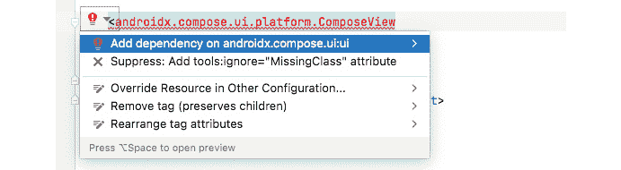

图 3.5 – XML 中的 Compose 视图

1.  一旦你同步了你的项目，错误就会消失，你应该能够在`MainActivity`或你想使用`ComposeView`的地方使用这个视图：

    ```kt
    <androidx.Compose.ui.platform.ComposeView
    ```

    ```kt
        android:id="@+id/alert_dialog"
    ```

    ```kt
        android:layout_width="match_parent"
    ```

    ```kt
        android:layout_height="match_parent"/>
    ```

1.  让我们也在`build.gradle(Module:app)`中添加`viewBinding`，这样我们就可以在`MainActivity`中轻松访问我们的视图。如果你已经设置了`viewBinding`，你可以跳过这部分：

    ```kt
    buildFeatures{
    ```

    ```kt
        viewBinding true
    ```

    ```kt
    }
    ```

1.  一旦我们同步了项目，我们就可以在`MainActivity`中通过绑定访问`ComposeView`。此外，它将有一个`setContent{}`方法，你可以设置所有你的可组合元素并将其包裹在主题中：

    ```kt
    class MainActivity : AppCompatActivity() {
    ```

    ```kt
        private lateinit var activityBinding:
    ```

    ```kt
        ActivityMainBinding
    ```

    ```kt
        override fun onCreate(savedInstanceState: Bundle?)
    ```

    ```kt
        {
    ```

    ```kt
            super.onCreate(savedInstanceState)
    ```

    ```kt
            activityBinding =
    ```

    ```kt
               ActivityMainBinding.inflate(layoutInflater)
    ```

    ```kt
            setContentView(activityBinding.root)
    ```

    ```kt
            activityBinding.alertDialog.setContent {
    ```

    ```kt
                GreetingAlertDialog()
    ```

    ```kt
            }
    ```

    ```kt
        }
    ```

    ```kt
    }
    ```

1.  我们的`GreetingAlertDialog()`将包含一个`AlertDialog()`可组合元素、一个标题和文本，它将我们的消息作为一个简单的文本元素提供。标题将说`Hello`，因为这是一个问候，消息将是`Hello，感谢您成为 Android 社区的一员`。你可以根据需要自定义它：

    ```kt
    @Composable
    ```

    ```kt
    fun SimpleAlertDialog() {
    ```

    ```kt
        AlertDialog(
    ```

    ```kt
            onDismissRequest = { },
    ```

    ```kt
            confirmButton = {
    ```

    ```kt
                TextButton(onClick = {})
    ```

    ```kt
                { Text(text = "OK") }
    ```

    ```kt
            },
    ```

    ```kt
            dismissButton = {
    ```

    ```kt
                TextButton(onClick = {})
    ```

    ```kt
                { Text(text = "OK") }
    ```

    ```kt
            },
    ```

    ```kt
            title = { Text(text = "Hello") },
    ```

    ```kt
            text = { Text(text = "Hello, and thank you for
    ```

    ```kt
            being part of the Android community") }
    ```

    ```kt
        )
    ```

    ```kt
    }
    ```

1.  要创建 Compose 组件，你需要在你的 gradle app 中添加 Compose Material Design 依赖项。根据你的应用程序支持的情况，你可以利用 Compose Material 3 组件，这是 Material Design 的下一个进化版本，并带有更新的主题。

1.  你可以轻松地自定义动态颜色等功能。我们将在*第十一章*中探讨 Material 3，*GUI Alerts – What’s New in Menus, Dialog, Toast, Snackbars, and More in Modern Android Development*。因此，目前，由于我使用的应用程序尚未迁移到 Material 3，我将使用这个导入 – `implementation "androidx.Compose.material:material:1.x.x"`。在这里，你可以使用任何适合你需要的导入。

1.  你还可以创建一个继承自`AbstractComposeView`的自定义视图：

    ```kt
    class ComposeAlertDialogComponent @JvmOverloads constructor(
    ```

    ```kt
        context: Context,
    ```

    ```kt
        attrs: AttributeSet? = null,
    ```

    ```kt
        defStyle: Int = 0
    ```

    ```kt
    ) : AbstractComposeView(context, attrs, defStyle) {
    ```

    ```kt
            @Composable
    ```

    ```kt
        override fun Content() {
    ```

    ```kt
            GreetingAlertDialog()
    ```

    ```kt
        }
    ```

    ```kt
    }
    ```

1.  最后，当你运行你的应用程序时，你应该有一个包含标题和文本的对话框；*图 3**.6*显示了一个来自已存在的项目的对话框，所以这肯定会根据你采取的步骤而有所不同：


图 3.6 – XML 中的对话框 Compose 视图

## 它是如何工作的…

首先，我们膨胀了在布局`资源`文件夹中定义的 XML 布局。然后，使用绑定，我们通过创建的 XML ID 获取`ComposeView`，设置最适合我们宿主视图的 Compose 策略，并调用`setContent`来使用 Compose。在你的活动中，为了能够创建任何基于 Compose 的屏幕，你必须确保调用`setContent{}`方法并传递你创建的任何可组合函数。

要进一步探索 `setContent` 方法，它被写成 `ComponentActivity` 的扩展函数，并期望一个 Composable 函数作为最后一个参数。还有更好的方法来展示 `setContent{}` 的工作原理，以便将 Composable 树集成到你的 Android 应用程序中。

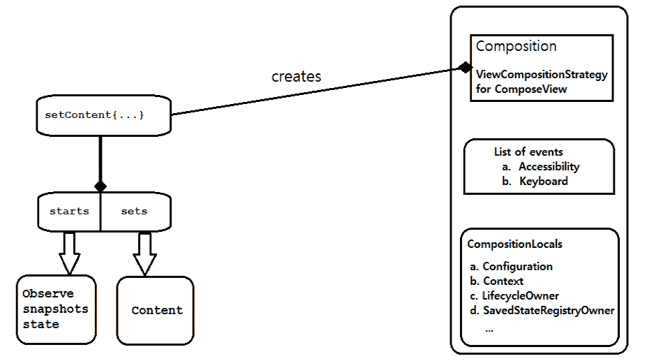

图 3.7 – 当你调用 setContent{} 时发生的情况

`ViewCompositionStrategy` 帮助确定何时销毁组合；因此，Compose UI 视图如 `ComposeView` 和 `AbstractComposeView` 使用 `ViewCompositonStrategy`，这有助于定义此行为。

你可以通过以下链接了解更多关于互操作 API 的信息：[`developer.android.com/jetpack/compose/interop/interop-apis#composition-strategy`](https://developer.android.com/jetpack/compose/interop/interop-apis#composition-strategy)。

# 理解和处理 Jetpack Compose 中的重组

Jetpack Compose 仍然非常新，许多公司开始使用它。此外，谷歌通过为开发者提供大量文档来帮助他们接受这个新的 UI 工具包，做得非常出色。然而，尽管有所有这些文档，仍有一个概念需要澄清。那就是重组。

没错，所有新的软件都有其优点和缺点，随着越来越多的人开始使用它，更多的人开始提供反馈——因此，需要更多的改进。在 Compose 中，重组涉及在输入变化时再次调用你的 Composable。或者你可以将其视为组合结构和关系发生变化时。

除非其参数发生变化，我们希望在大多数用例中避免重新调用可组合函数。因此，在这个菜谱中，我们探讨重组是如何发生的，以及你如何在应用程序中调试和解决任何重组问题。

## 如何做到这一点…

由于我们的视图系统很简单，我们将检查在我们的 `Login` 项目中是否有任何重组：

1.  我们可以看看一个简单的例子以及重组是如何发生的：

    ```kt
    @Composable
    ```

    ```kt
    fun UserDetails(
    ```

    ```kt
        name: String,
    ```

    ```kt
        gender: String,
    ```

    ```kt
    ) {
    ```

    ```kt
        Box() {
    ```

    ```kt
            Text(name)
    ```

    ```kt
            Spacer()
    ```

    ```kt
            Text(gender)
    ```

    ```kt
        }}
    ```

在我们的示例中，当 `name` 发生变化时，`Text` 函数将重新组合，而不是当 `gender` 发生变化时。此外，只有当 `gender` 发生变化时，`gender:String` 输入值才会重新组合。

1.  你也可以启动并使用 `LoginContent` 来查看我们是否有任何重组。

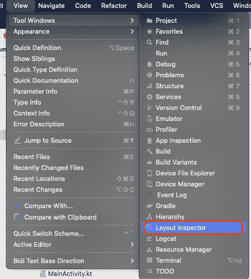

图 3.8 – 布局检查器

1.  一旦你启动 **布局检查器**，你需要确保你的模拟器已连接到它。

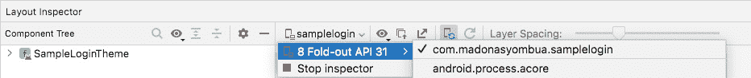

图 3.9 – 连接检查器

1.  前往并展开 `SampleLoginTheme` 入口，你会注意到我们的当前视图系统并不复杂。正如你所见，**布局检查器**没有显示任何重组计数。

也就是说，如果我们的应用程序有任何重组计数，它们将显示在 **布局检查器** 中。

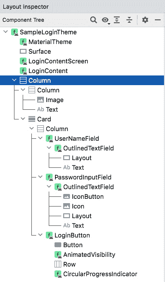

图 3.10 – 组件树

1.  最后，正如你所看到的，我们的应用程序没有发生任何重新组合，但检查你的应用程序以了解可能引起重新组合的原因并修复它总是有益的。

重要提示

使用副作用可能会导致你的应用程序的用户在应用程序中遇到奇怪且不可预测的行为。此外，副作用是指对应用程序其余部分可见的任何更改。例如，向共享对象的属性写入、在`ViewModel`中更新可观察对象以及更新共享首选项都是危险的副作用。

## 它是如何工作的…

为了适应性，Compose 会跳过`lambda`调用或任何没有对其输入进行更改的子函数。这种更好的资源处理方式是有意义的，因为在 Compose 中，动画和其他 UI 元素可以在每一帧中触发重新组合。

我们可以深入探讨并使用图表来展示 Jetpack 组合生命周期的运作方式。简而言之，可组合函数的生命周期由三个重要事件定义：

+   被组合

+   是否重新组合或不会重新组合

+   不再被组合

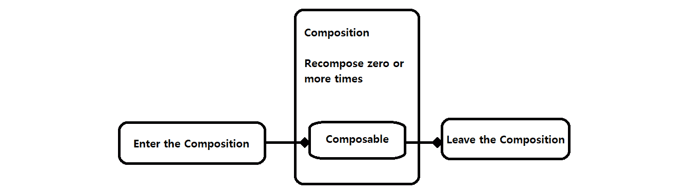

图 3.11 – 可组合的组成生命周期

要理解 Compose 的工作原理，了解构成 Compose 架构层的元素是有益的。Jetpack Compose 架构层的高级概述包括**Material**、**Foundation**、**UI**和**Runtime**方面。

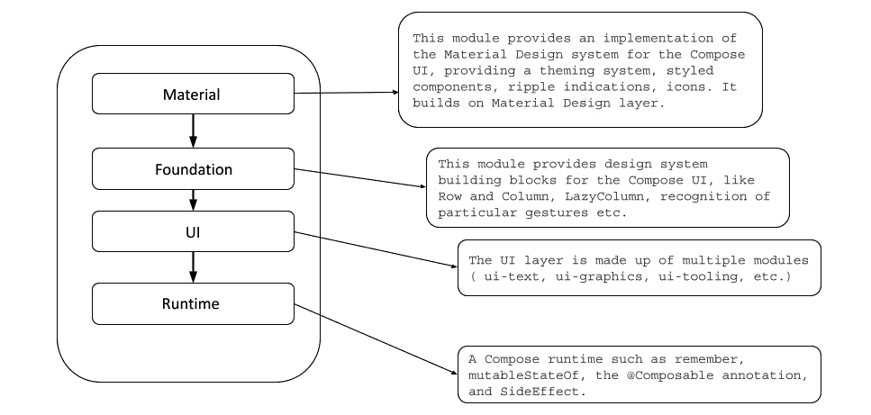

图 3.12 – 显示 Jetpack Compose 架构层的图解

在**Material**中，此模块实现了 Compose UI 的 Material Design 系统。

此外，它提供了一个主题系统、样式化组件以及更多。`Row`、`Column`等。**UI**层由多个模块组成，这些模块实现了 UI 工具包的基本原理。

## 参见

Compose 团队正在推出 Jetpack Compose Composition Tracing，这是第一个 alpha 版本，将帮助开发者轻松追踪他们的组合；你可以在这里了解更多信息：

+   [`medium.com/androiddevelopers/jetpack-Compose-composition-tracing-9ec2b3aea535`](https://medium.com/androiddevelopers/jetpack-Compose-composition-tracing-9ec2b3aea535)

+   [`developer.android.com/jetpack/compose/lifecycle`](https://developer.android.com/jetpack/compose/lifecycle)

# 为你的 Compose 视图编写 UI 测试

在开发 Android 应用程序时，测试你的代码是至关重要的，尤其是如果你的应用程序拥有许多用户。此外，当你为你的代码编写测试时，你基本上是在验证 Android 应用程序的功能、行为、正确性和多功能性。Android 中最受欢迎的 UI 测试工具是 Espresso、UI Automator、Calabash 和 Detox。

然而，在这本书中，我们将使用 Espresso。Espresso 最显著的优点如下：

+   设置起来很容易

+   它具有高度稳定的测试周期

+   它支持 JUnit 4

+   它专为 Android UI 测试制作

+   它适合编写黑盒测试

+   它还支持测试应用程序之外的活动

## 准备工作

你需要完成之前的食谱才能跟随这个食谱。

## 如何操作…

就像本章中的其他食谱一样，我们将使用我们在*第一章*“现代 Android 开发技能入门”中创建的新项目：

1.  让我们继续导航到我们的项目文件夹中的`androidTest`包。

1.  首先，在`androidTest`包中创建一个新类，命名为`LoginContentTest.kt`。在 Jetpack Compose 中，测试变得更加容易，我们需要为我们的视图提供唯一的标签。

1.  因此，对于这一步，让我们回到我们的主包（`com.name.SampleLogin`）并创建一个新的包，命名为`util`。在`util`内部，让我们创建一个新的类，命名为`TestTags`，它将是一个对象。在这里，我们将有另一个对象，命名为`LoginContent`，并创建我们可以调用在视图中的常量值：

    ```kt
    object TestTags {
    ```

    ```kt
        object LoginContent {
    ```

    ```kt
            const val SIGN_IN_BUTTON = "sign_in_button"
    ```

    ```kt
            const val LOGO_IMAGE = "logo_image_button"
    ```

    ```kt
            const val ANDROID_TEXT = "community_text"
    ```

    ```kt
            const val USERNAME_FIELD = "username_fields"
    ```

    ```kt
            const val PASSWORD_FIELD = "password_fields"
    ```

    ```kt
        }
    ```

    ```kt
    }
    ```

1.  现在我们已经创建了测试标签，让我们回到我们的`LoginContent`并添加它们到`Modifier()`中的所有视图中，这样在测试时，使用我们添加的测试标签来识别视图会更容易。请看以下代码片段：

    ```kt
    Image(
    ```

    ```kt
        modifier = modifier.testTag(LOGO_IMAGE),
    ```

    ```kt
        painter = painterResource(id =
    ```

    ```kt
            R.drawable.ic_launcher_foreground),
    ```

    ```kt
        contentDescription = "Logo"
    ```

    ```kt
    )
    ```

1.  在我们的`LoginContentTest`类内部，现在让我们继续设置我们的测试环境。我们需要创建`@get:Rule`，它注解引用规则或返回规则的字段。在规则下，让我们创建`ComposeRuleTest`并初始化它：

    ```kt
    @get:Rule
    ```

    ```kt
    val ComposeRuleTest = createAndroidComposeRule<MainActivity>()
    ```

1.  添加以下函数以帮助我们设置内容。我们应该在我们的`Test`注解函数中调用此函数：

    ```kt
    private fun initCompose() {
    ```

    ```kt
        ComposeRuleTest.activity.setContent {
    ```

    ```kt
            SampleLoginTheme {
    ```

    ```kt
                LoginContent()
    ```

    ```kt
            }
    ```

    ```kt
        }
    ```

    ```kt
    }
    ```

1.  最后，让我们继续添加我们的第一个测试。对于我们将要编写的测试，我们将验证视图是否以我们预期的样子显示在屏幕上：

    ```kt
    @Test
    ```

    ```kt
    fun assertSignInButtonIsDisplayed(){
    ```

    ```kt
        initCompose()
    ```

    ```kt
        ComposeRuleTest.onNodeWithTag(SIGN_IN_BUTTON,
    ```

    ```kt
        true).assertIsDisplayed()
    ```

    ```kt
    }
    ```

    ```kt
    @Test
    ```

    ```kt
    fun assertUserInputFieldIsDisplayed(){
    ```

    ```kt
        initCompose()
    ```

    ```kt
        ComposeRuleTest.onNodeWithTag(USERNAME_FIELD,
    ```

    ```kt
        true).assertIsDisplayed()
    ```

    ```kt
    }
    ```

1.  `SIGN_IN_BUTTON`和`USERNAME_FIELD`是从我们创建的测试标签导入的，并且目前只被一个视图（登录按钮）使用。

1.  开始运行测试，将弹出一个对话框显示运行过程；如果成功，测试将通过。在我们的情况下，测试应该通过。

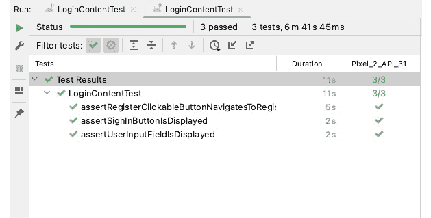

图 3.13 – 显示通过测试的截图

重要提示

对于这些测试，你不需要添加任何依赖项；我们所需的一切都已经为我们准备好了。

## 它是如何工作的…

当访问活动时，我们使用`createAndroidComposeRule<>()`。测试并确保你的应用程序显示预期的结果是非常重要的。这就是为什么 Android Studio 使用模拟器来帮助开发者测试他们的代码，以确保他们的应用程序在标准设备上运行。

此外，Android 手机自带开发者选项，方便开发者使用，这使得 Android 支持的不同设备数量更多，并有助于在模拟器中重现难以发现的 bug。

当我们测试我们的 Compose 代码时，通过在开发过程的早期阶段捕捉错误来提高我们应用的质量。在本章中，我们讨论了创建更多视图来展示 Jetpack Compose 的工作方式；此外，我们的测试用例需要处理用户操作，因为我们尚未实现。

在不同的环境中，我们可以编写更关键的测试来确认预期的操作，我们将在后面的章节中这样做。此外，Compose 提供了用于查找元素、验证它们的属性和执行用户操作的测试 API。此外，它们还包括时间操作等高级功能。

在编写测试时显式调用 `@Test` 注解非常重要，因为这个注解告诉 JUnit，附加到其上的函数将作为一个 `Test` 函数运行。此外，Compose 中的 UI 测试使用 `.onNodeWithTag`。

UI 部分或元素可以是从单个 Composable 到全屏的任何内容。如果您尝试访问错误的节点，与 UI 层级一起生成的语义树将会抱怨。

## 还有更多...

还有其他测试工具，如下所示：

+   **Espresso Test Recorder** 为开发者提供了一种更快、更直观的方式来测试他们应用中日常的用户输入行为和视觉元素。

+   **App Crawler** 无疑采用了一种更加不干预的方法来帮助您测试用户操作，而无需维护或编写任何代码。使用这个工具，您可以轻松配置输入，例如输入您的用户名和密码凭据。

+   **Monkey** 是一个命令行设备，它通过向设备或模拟器实例发送随机的用户验证/输入或点击操作来对您的应用进行压力测试。

要了解更多关于测试和 Compose 中的语义的信息，请阅读以下内容：[`developer.android.com/jetpack/compose/semantics`](https://developer.android.com/jetpack/compose/semantics)。

# 为您的 ViewModels 编写测试

与 **模型-视图-控制器** (**MVC**) 和 **模型-视图-呈现器** (**MVP**) 不同，MVVM 由于其单向数据和依赖关系流，在现代 Android 开发中是首选的设计模式。此外，它使得单元测试变得更加容易，正如您将在本配方中看到的那样。

## 准备工作

我们将使用我们之前的配方，*在 Compose 中实现 ViewModel 并理解状态*，来测试我们的逻辑和状态变化。

## 如何操作...

在这个配方中，我们将编写单元测试来验证我们的身份验证状态变化，因为这是我们迄今为止实现的内容：

1.  首先在 `test` 包中创建一个 `LoginViewModelTest` 类：

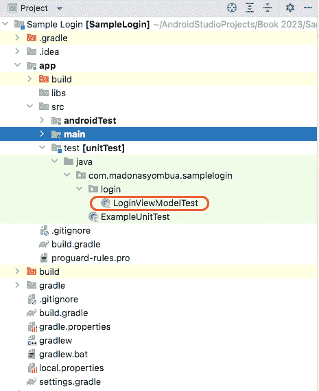

图 3.14 – 创建的单元测试

1.  我们将使用 `cashapp/turbine` 测试库来测试协程流程，以测试我们创建的流程。因此，您需要在 `build.gradle` 中包含处理代码片段：

    ```kt
    repositories {
    ```

    ```kt
      mavenCentral()
    ```

    ```kt
    }
    ```

    ```kt
    dependencies {
    ```

    ```kt
      testImplementation 'app.cash.turbine:turbine:0.x.x'
    ```

    ```kt
    }
    ```

1.  一旦创建了类，就可以设置 `@Before`，它将在每个测试之前运行：

    ```kt
    class LoginViewModelTest {
    ```

    ```kt
       private lateinit var loginViewModel: LoginViewModel
    ```

    ```kt
       @Before
    ```

    ```kt
       fun setUp(){
    ```

    ```kt
          loginViewModel = LoginViewModel(
    ```

    ```kt
             dispatchers =
    ```

    ```kt
             SampleLoginDispatchers.createTestDispatchers(
    ```

    ```kt
             UnconfinedTestDispatcher()),
    ```

    ```kt
             stateHandle = SavedStateHandle()
    ```

    ```kt
          )
    ```

    ```kt
       }
    ```

    ```kt
    }
    ```

1.  如您所见，我们使用了 `SampleLoginDispatchers.createTestDispatchers`。对于 `UnconfinedTestDispatcher`，您必须包含测试依赖项并导入，`import kotlinx.coroutines.test.UnconfinedTestDispatcher`。

1.  现在我们已经准备好了设置，让我们继续创建我们的测试，验证认证状态的变化：

    ```kt
    @Test
    ```

    ```kt
    fun `test authentication state changes`() = runTest {...}
    ```

1.  在我们的 `Test` 函数中，我们现在需要访问 `loginViewModel` 函数并将假值传递给参数：

    ```kt
    @Test
    ```

    ```kt
    fun `test authentication state changes`() = runTest {
    ```

    ```kt
        loginViewModel.userNameChanged("Madona")
    ```

    ```kt
        loginViewModel.passwordChanged("home")
    ```

    ```kt
        loginViewModel.passwordVisibility(true)
    ```

    ```kt
        loginViewModel.state.test {
    ```

    ```kt
            val stateChange = awaitItem()
    ```

    ```kt
            Truth.assertThat(stateChange).isEqualTo(
    ```

    ```kt
                AuthenticationState(
    ```

    ```kt
                    userName = "Madona",
    ```

    ```kt
                    password = "home",
    ```

    ```kt
                    togglePasswordVisibility = true
    ```

    ```kt
                )
    ```

    ```kt
            )
    ```

    ```kt
        }
    ```

    ```kt
    }
    ```

1.  最后，运行测试，它应该通过。

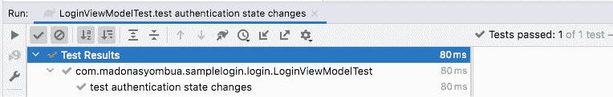

图 3.15 – 单元测试通过

## 它是如何工作的…

如前所述，MVVM 最显著的优势是能够编写可以快速测试的代码。此外，Android 的架构全部关于选择权衡。每种架构都有其优缺点；根据您公司的需求，您可能需要使用不同的架构。

我们创建 `lateint var loginViewModel` 来设置一个用于测试的类，这是因为要测试的逻辑在 `ViewModel` 中。

我们使用 `UnconfinedDispatcher`，它创建了一个 `Unconfined` 分发器的实例。这意味着它执行的任务不受任何特定线程的限制，形成一个事件循环。它与所有 `TestDispatcher` 实例不同之处在于它跳过了延迟。默认情况下，`runTest()` 提供了 `StandardTestDispatcher`，它不会立即执行子协程。

我们使用 `Truth` 进行断言，以帮助我们编写更易读的代码，`Truth` 的显著优势如下：

+   它将实际值对齐到左侧

+   它为我们提供了更详细的错误信息

+   它提供了更丰富的操作来帮助进行测试

还有其他替代方案，例如 Mockito、Mockk 等，但在这个部分，我们使用了 `Truth`。我们还使用了 Cashapp 的一个库，它帮助我们测试协程流程。您可以在[`github.com/cashapp/turbine`](https://github.com/cashapp/turbine)了解更多关于 `turbine` 库的信息。
