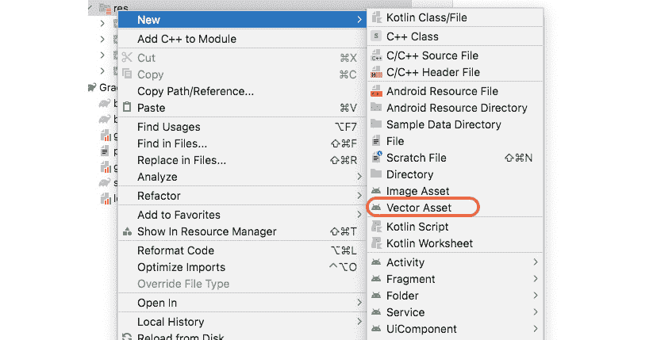
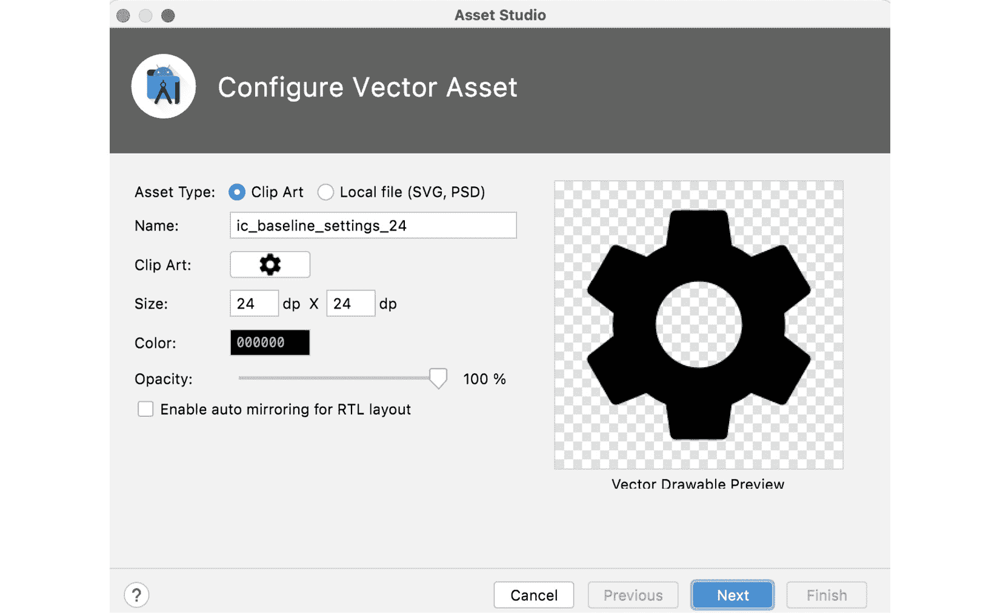
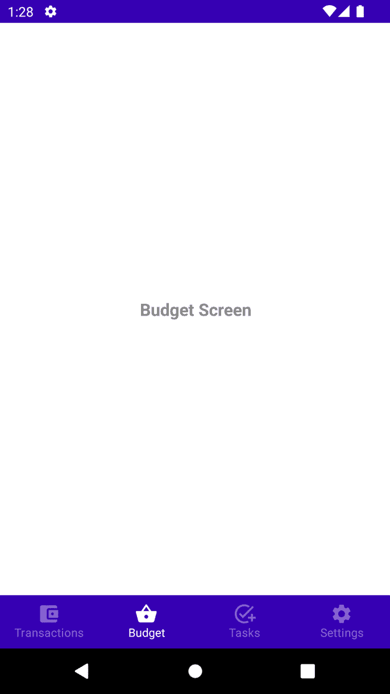
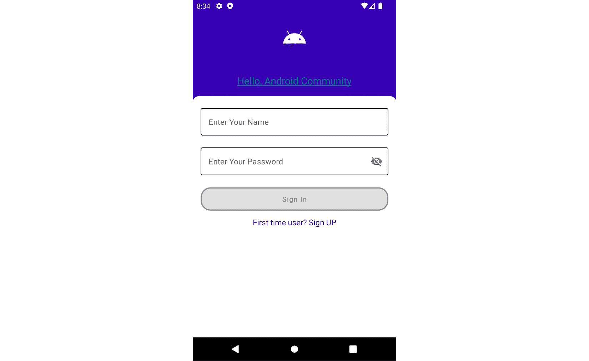
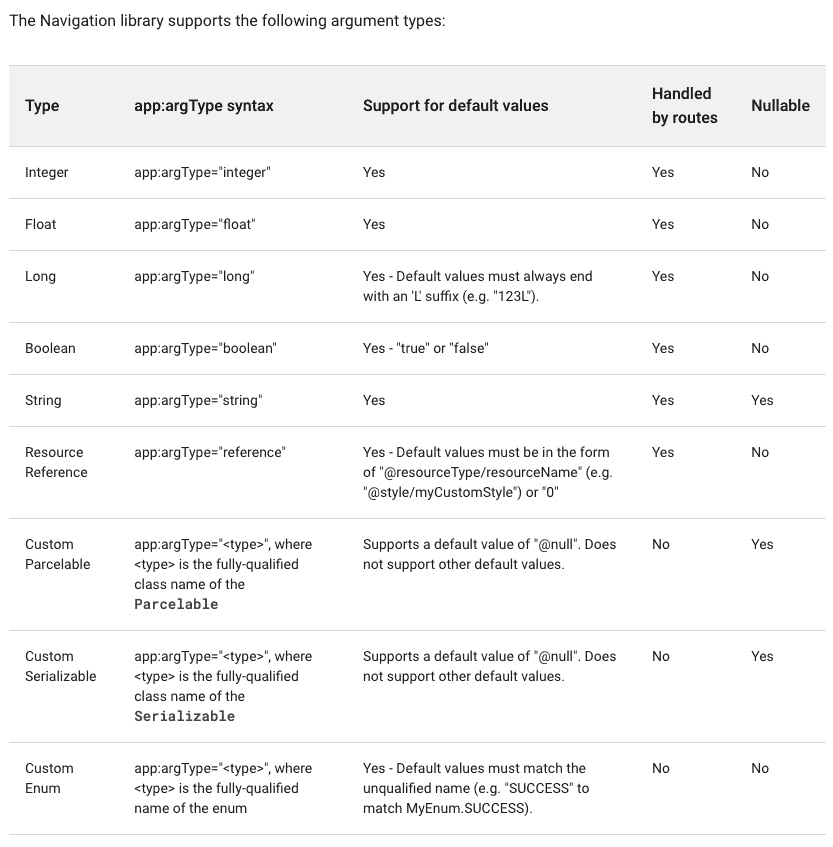
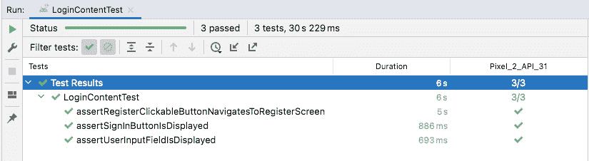

# 第四章：现代安卓开发中的导航

在安卓开发中，导航是允许安卓应用程序用户在应用程序的不同屏幕之间导航、返回的操作，这在移动生态系统中是非常关键的。

Jetpack 导航简化了屏幕之间的导航，在本章中，我们将学习如何通过简单的视图点击、通过导航参数以及更多方式实现导航。

本章将涵盖以下菜谱：

+   使用导航目的地实现底部导航栏

+   在 Compose 中导航到新屏幕

+   带参数进行导航

+   为目的地创建深链接

+   编写导航测试

# 技术要求

本章的完整源代码可以在 [`github.com/PacktPublishing/Modern-Android-13-Development-Cookbook/tree/main/chapter_four`](https://github.com/PacktPublishing/Modern-Android-13-Development-Cookbook/tree/main/chapter_four) 找到。

# 使用导航目的地实现底部导航栏

在安卓开发中，拥有底部导航栏是非常常见的；它有助于告知用户应用程序中有不同的部分。此外，其他应用程序选择包含一个包含个人资料和应用程序其他信息的导航抽屉活动。

一个很好的同时利用导航抽屉和底部导航的应用程序示例是 Twitter。此外，值得注意的是，一些公司更喜欢将顶部导航栏作为首选。此外，像 Google Play 商店这样的其他公司则同时使用底部和抽屉导航。

## 准备工作

使用你喜欢的编辑器或 Android Studio 创建一个新的安卓项目，或者你可以使用之前菜谱中的任何项目。

## 如何实现...

在这个菜谱中，我们将创建一个新的项目并命名为 `BottomNavigationBarSample`：

1.  在创建我们的新空 `Activity BottomNavigationBarSample` 项目后，我们首先将在 `build.gradle` 中添加所需的导航依赖项，然后同步项目：

    ```kt
    implementation 'android.navigation:navigation-compose:2.5.2'
    ```

1.  如前一个新项目所示，当你创建一个新项目时，它会附带一些代码，例如 `Greeting()` 函数；你可以继续删除这些代码。

1.  删除这些代码后，让我们继续在主包目录中创建一个 `sealed` 类，命名为 `Destination.kt`，我们将在这里定义我们的 `route` 字符串、`icon:` `Int` 和 `title: String` 用于底部导航项：

    ```kt
    sealed class Destination(val route: String, val icon: Int, val title: String) {...}
    ```

严格来说，我们可能不需要 `sealed` 类，但它是一种更优雅的导航实现方式。在 Kotlin 中，`sealed` 类代表一个受限的类层次结构，它提供了对继承的更多控制。或者，你可以将其视为一个类，其值可以从有限集合中选择一种类型，但不能有其他类型。

1.  在`sealed`类内部，现在让我们继续创建我们的目的地。对于我们的示例，我们将假设我们正在创建一个预算应用。因此，我们可以有的目的地是`Transactions`、`Budgets`、`Tasks`和`Settings`。关于如何获取图标，请参阅下一步；此外，你还需要导入它们。为了良好的实践，你可以提取`String`资源并将其保存到`String` XML 文件中。你可以尝试这个小练习：

    ```kt
    sealed class Destination(val route: String, val icon: Int, val title: String) {
    ```

    ```kt
        object Transaction : Destination(
    ```

    ```kt
            route = "transactions", icon =
    ```

    ```kt
                R.drawable.ic_baseline_wallet,
    ```

    ```kt
                title = "Transactions"
    ```

    ```kt
        )
    ```

    ```kt
        object Budgets : Destination(
    ```

    ```kt
            route = "budget", icon =
    ```

    ```kt
                R.drawable.ic_baseline_budget,
    ```

    ```kt
                title = "Budget"
    ```

    ```kt
        )
    ```

    ```kt
        object Tasks : Destination(route = "tasks", icon =
    ```

    ```kt
            R.drawable.ic_add_task, title = "Tasks")
    ```

    ```kt
        object Settings : Destination(
    ```

    ```kt
            route = "settings", icon =
    ```

    ```kt
                R.drawable.ic_settings,
    ```

    ```kt
                title = "Settings"
    ```

    ```kt
        )
    ```

    ```kt
        companion object {
    ```

    ```kt
            val toList = listOf(Transaction, Budgets,
    ```

    ```kt
            Tasks, Settings)
    ```

    ```kt
        }
    ```

    ```kt
    }
    ```

1.  对于图标，你可以通过点击资源文件夹（`res`），然后导航到**矢量资产** | **剪贴画**来轻松访问它们，这将启动并显示你可以使用的免费图标，如*图 4.1*所示。1*：



图 4.1 – 如何访问矢量资产

1.  你还可以上传 SVG 文件并通过**资产工作室**访问它。对于更多图标，你可以查看这个链接：[`fonts.google.com/icons`](https://fonts.google.com/icons)。



图 4.2 – 资产工作室

1.  现在，对于我们刚刚添加的目的地，让我们继续添加一些占位文本来验证，当我们导航时，我们确实在正确的屏幕上。创建一个新文件，并将其命名为`AppContent.kt`。在`AppContent`中，我们将添加我们的`Transaction`函数，这将是我们的主页，新用户第一次进入应用时将在这里；然后他们可以导航到其他屏幕：

    ```kt
    @Composable
    ```

    ```kt
    fun Transaction(){
    ```

    ```kt
        Column(
    ```

    ```kt
            modifier = Modifier
    ```

    ```kt
                .fillMaxSize()
    ```

    ```kt
                .wrapContentSize(Alignment.Center)
    ```

    ```kt
        ) {
    ```

    ```kt
        ...
    ```

    ```kt
        }
    ```

    ```kt
    }
    ```

1.  继续添加剩余的三个屏幕，`Task`、`Budget`和`Settings`，使用相同的可组合模式。

1.  我们现在需要创建一个可组合的底部导航栏，并告诉`Composable`函数如何响应用户点击，以及在选择之前选中的项目时如何恢复状态：

    ```kt
    @Composable
    ```

    ```kt
    fun BottomNavigationBar(navController: NavController, appItems: List<Destination>) {
    ```

    ```kt
        BottomNavigation(
    ```

    ```kt
            backgroundColor = colorResource(id =
    ```

    ```kt
                R.color.purple_700),
    ```

    ```kt
                contentColor = Color.White
    ```

    ```kt
        ) {
    ```

    ```kt
        ...
    ```

    ```kt
        }
    ```

    ```kt
    }
    ```

1.  现在，让我们转到`MainActivity`并创建`NavHost`以及几个可组合函数，`AppScreen()`、`AppNavigation()`和`BottomNavigationBar()`。每个导航控制器必须与一个单独的导航宿主可组合函数相关联，因为它将控制器与一个帮助指定可组合方向的导航图连接起来：

    ```kt
    @Composable
    ```

    ```kt
    fun AppNavigation(navController: NavHostController) {
    ```

    ```kt
        NavHost(navController, startDestination =
    ```

    ```kt
        Destination.Transaction.route) {
    ```

    ```kt
            composable(Destination.Transaction.route) {
    ```

    ```kt
                Transaction()
    ```

    ```kt
            }
    ```

    ```kt
            composable(Destination.Budgets.route) {
    ```

    ```kt
                Budget()
    ```

    ```kt
            }
    ```

    ```kt
            composable(Destination.Tasks.route) {
    ```

    ```kt
                Tasks()
    ```

    ```kt
            }
    ```

    ```kt
            composable(Destination.Settings.route) {
    ```

    ```kt
                Settings()
    ```

    ```kt
            }
    ```

    ```kt
        }
    ```

    ```kt
    }
    ```

1.  最后，让我们通过创建另一个可组合函数并命名为`AppScreen()`来将所有内容粘合在一起。我们将在`onCreate()`函数中的`setContent`中调用此函数：

    ```kt
    @Composable
    ```

    ```kt
    fun AppScreen() {
    ```

    ```kt
        val navController = rememberNavController()
    ```

    ```kt
        Scaffold(
    ```

    ```kt
            bottomBar = {
    ```

    ```kt
                BottomNavigationBar(navController =
    ```

    ```kt
                navController, appItems =
    ```

    ```kt
                Destination.toList) },
    ```

    ```kt
            content = { padding ->
    ```

    ```kt
                Box(modifier = Modifier.padding(padding))
    ```

    ```kt
                {
    ```

    ```kt
                    AppNavigation(navController =
    ```

    ```kt
                        navController)
    ```

    ```kt
                }
    ```

    ```kt
            }
    ```

    ```kt
        )
    ```

    ```kt
    }
    ```

1.  然后，在`setContent{}`中调用此创建的函数；导入应该是`import androidx.activity.compose.setContent`，根据事实，有时可能会导入错误的一个。运行应用程序。你会注意到一个带有四个标签的屏幕，当你选择一个标签时，选中的标签会被突出显示，如*图 4.3*所示：



图 4.3 – 底部导航栏

## 它是如何工作的…

在 Compose 中，导航有一个关键术语称为 **route**。键是一个定义通往你的 composable 路径的字符串。键基本上是真相的来源——或者你可以将其视为一个深链接，它带你到特定的目的地，每个目的地都应该有一个唯一的路由。

此外，每个目的地都应该由一个唯一的键路由组成。在我们的例子中，我们添加了图标和标题。如图 *图 4**.3* 所示，图标显示了底部导航包含的内容，标题描述了我们在那个确切时刻正在浏览的特定屏幕。此外，这些是可选的，并且仅在某些路由中需要。

`NavController()` 是我们导航组件的主要 API，它跟踪组成我们应用程序屏幕的 composables 的每个返回栈条目以及每个屏幕的状态。我们使用 `rememberNavController()` 创建了这个功能：正如我们在上一章中提到的，`remember`这个名字意味着记住值；在这个例子中，我们正在记住 `NavController`：

```kt
val navController = rememberNavController()
```

另一方面，`NavHost()` 需要之前通过 `rememberNavController()` 创建的 `NavController()` 以及我们图入口的目的地路由。此外，`rememberNavController()` 返回 `NavHostController`，它是 `NavController()` 的一个子类，它提供了一些 `NavHost` 所需的额外 API。

这与 Android 开发者在组合片段之前构建导航的方式非常相似。步骤包括创建一个带有 `menu` 项的底部导航菜单，如下面的代码块所示：

```kt
<?xml version="1.0" encoding="utf-8"?>
<menu >
    <item
        android:id="@+id/transaction_home"
        android:icon="@drawable/card"
        android:title="@string/transactions"/>
    <item
         android:id="@+id/budget_home"
         android:icon="@drawable/ic_shopping_basket_black_
             24dp"
         android:title="@string/budgets"
    />
...
</menu>
```

然后，我们在 `navigation` 包中创建另一个资源，该资源指向屏幕（片段）：

```kt
<?xml version="1.0" encoding="utf-8"?>
<navigation 
    app:startDestination="@+id/transaction_home">
    <fragment
        android:id="@+id/transaction_home"
        android:name="com.fragments.TransactionsFragment"
        android:label="@string/title_transcation"
        tools:layout="@layout/fragment_transactions" >
        <action
            android:id="@+id/action_transaction_home_to_
                budget_home"
            app:destination="@id/budget_home" />
    </fragment>
    <fragment
        android:id="@+id/budget_home"
        android:name="com.fragments.BudgetsFragment"
        android:label="@string/title_budget"
        tools:layout="@layout/fragment_budget" >
        <action
            android:id="@+id/action_budget_home_to_tasks_
                home"
            app:destination="@id/tasks_home" />
    </fragment>
</navigation>
```

# 在 Compose 中导航到新屏幕

我们将在登录页面上构建一个注册屏幕提示，用于注册我们应用程序的新用户。这是一个标准模式，因为我们需要保存用户的凭据，这样下次他们登录到我们的应用程序时，我们只需登录而无需再次注册。

## 准备工作

在开始这个之前，你应该已经完成了之前的食谱，*使用导航目的地实现底部导航栏*。

## 如何做到这一点...

在这个食谱中，我们需要使用我们的 `SampleLogin` 项目并添加一个新屏幕，用户在首次使用应用程序时可以导航到该屏幕。这在许多应用程序中是一个典型的用例：

1.  打开你的 `SampleLogin` 项目，创建一个新的 `sealed` 类，并将其命名为 `Destination`。为了确保我们保持良好的封装，将此类添加到 `util` 中。同样，就像底部栏一样，我们将有一个路由，但这次我们不需要任何图标或标题：

    ```kt
    sealed class Destination (val route: String){
    ```

    ```kt
        object Main: Destination("main_route")
    ```

    ```kt
        object LoginScreen: Destination("login_screen")
    ```

    ```kt
        object RegisterScreen:
    ```

    ```kt
            Destination("register_screen")
    ```

    ```kt
    }
    ```

1.  在创建目的地之后，我们现在需要在 `LoginContent` 中添加可点击文本，询问用户是否是首次使用应用程序。他们应该点击 `RegisterContent`。如果你需要参考任何步骤，可以通过查看 *技术要求* 部分来打开项目：

    ```kt
    @Composable
    ```

    ```kt
    fun LoginContent(
    ```

    ```kt
        ...
    ```

    ```kt
        onRegister: () -> Unit
    ```

    ```kt
    ) {
    ```

    ```kt
    ClickableText(
    ```

    ```kt
        modifier = Modifier.padding(top = 12.dp),
    ```

    ```kt
        text = AnnotatedString(stringResource(id =
    ```

    ```kt
            R.string.register)),
    ```

    ```kt
        onClick = { onRegister.invoke() },
    ```

    ```kt
        style = TextStyle(
    ```

    ```kt
           colorResource(id = R.color.purple_700),
    ```

    ```kt
           fontSize = 16.sp
    ```

    ```kt
        )
    ```

    ```kt
    )
    ```

1.  现在，当您点击 `ClickableText` 时，我们的可点击文本是指您可以点击的文本，它将帮助用户通过 **首次用户？注册** 导航到注册屏幕。一旦点击此按钮，它应该导航到不同的屏幕，用户现在可以注册，如图 *图 4.4* 所示：



图 4.4 – 新的注册屏幕

1.  对于 **注册** 屏幕，您可以在 *技术要求* 部分找到整个代码。我们将重用我们创建的用户输入字段，只需更改文本：

    ```kt
    @Composable
    ```

    ```kt
    fun PasswordInputField(
    ```

    ```kt
        text: String
    ```

    ```kt
    ) {
    ```

    ```kt
        OutlinedTextField(
    ```

    ```kt
            label = { Text(text = text) },
    ```

    ```kt
    ...
    ```

    ```kt
    }
    ```

1.  在 `MainActivity` 中，我们将有一个 `Navigation()` 函数，如下所示：

    ```kt
    @Composable
    ```

    ```kt
    fun Navigation(navController: NavHostController) {
    ```

    ```kt
        NavHost(navController, startDestination =
    ```

    ```kt
        Destination.LoginScreen.route) {
    ```

    ```kt
            composable(Destination.LoginScreen.route) {
    ```

    ```kt
                LoginContentScreen(loginViewModel =
    ```

    ```kt
                    hiltViewModel(),
    ```

    ```kt
                onRegisterNavigateTo = {
    ```

    ```kt
                    navController.navigate(
    ```

    ```kt
                        Destination.RegisterScreen.route)
    ```

    ```kt
                })
    ```

    ```kt
            }
    ```

    ```kt
            composable(Destination.RegisterScreen.route) {
    ```

    ```kt
                RegisterContentScreen(registerViewModel =
    ```

    ```kt
                    hiltViewModel())
    ```

    ```kt
            }
    ```

    ```kt
        }
    ```

    ```kt
    }
    ```

1.  在 `PasswordInputField` 中，我们将为每个输入项适当地命名以提高其可重用性：

    ```kt
    PasswordInputField(
    ```

    ```kt
        text = stringResource(id = R.string.password),
    ```

    ```kt
        authState = uiState,
    ```

    ```kt
        onValueChanged = onPasswordUpdated,
    ```

    ```kt
        passwordToggleVisibility =
    ```

    ```kt
            passwordToggleVisibility)
    ```

1.  此外，您还可以通过点击硬件 **返回** 按钮导航到上一个 **登录** 屏幕。

1.  最后，在 `setContent` 中，我们需要更新代码以适应新的导航：

    ```kt
    @AndroidEntryPoint
    ```

    ```kt
    class MainActivity : ComponentActivity() {
    ```

    ```kt
        override fun onCreate(savedInstanceState: Bundle?)
    ```

    ```kt
        {
    ```

    ```kt
            super.onCreate(savedInstanceState)
    ```

    ```kt
            setContent {
    ```

    ```kt
                SampleLoginTheme {
    ```

    ```kt
                    // A surface container using the
    ```

    ```kt
                       'background' color from the theme
    ```

    ```kt
                    Surface(
    ```

    ```kt
                        modifier = Modifier.fillMaxSize(),
    ```

    ```kt
                        color =
    ```

    ```kt
                           MaterialTheme.colors.background
    ```

    ```kt
                    ) {
    ```

    ```kt
                        val navController =
    ```

    ```kt
                            rememberNavController()
    ```

    ```kt
                        Navigation(navController =
    ```

    ```kt
                            navController)
    ```

    ```kt
                    }
    ```

    ```kt
                }
    ```

    ```kt
            }
    ```

    ```kt
        }
    ```

    ```kt
    }
    ```

运行代码并点击 **注册** 文本，您现在应该被带到新屏幕。

## 它是如何工作的…

您会注意到我们刚刚创建了一个不同的目的地入口点，其中 `ClickableText` 用于导航到新创建的屏幕。此外，为了在导航图中导航到组合目的地，您必须使用 `navController.navigate(Destination.RegisterScreen.route)`，如前所述，字符串表示目的地路由。

此外，`navigate()` 默认将我们的目的地添加到返回栈中，但如果我们需要修改行为，我们可以在 `navigate()` 调用中添加额外的导航选项来轻松做到这一点。

假设您想在导航时使用动画。在这种情况下，您可以通过使用 Accompanist 库轻松做到这一点 – [`github.com/google/accompanist`](https://github.com/google/accompanist) –该库提供了一组旨在补充 Jetpack Compose 的功能，这些功能主要是由开发人员所需的，并且目前尚未提供。

您可以使用 `enterTransition`，它明确指定了您导航到特定目的地时运行的动画，而 `exitTransition` 执行相反的操作：

```kt
AnimatedNavHost(
    modifier = Modifier
        .padding(padding),
    navController = navController,
    startDestination = Destination.LoginScreen.route,
    route = Destination.LoginScreen.route,
    enterTransition = { fadeIn(animationSpec = tween(2000)) },
    exitTransition = { fadeOut(animationSpec = tween(200))
    }
)
```

您还可以使用 `popEnterTransition`，它指定了在通过 `popBackStack()` 后目的地重新进入屏幕时运行的动画，或者 `popExitTransition`，它执行相反的操作。

重要提示

重要的是要注意，当您从您的组合函数中暴露事件给知道如何正确处理该逻辑的应用程序调用者时，这是一种良好的实践，这对于提升状态变得相关。此外，底层的导航完全是状态管理的。

## 参见

更多关于 `AnimatedNavHost` 的信息，您可以在此处找到：[`google.github.io/accompanist/navigation-animation/`](https://google.github.io/accompanist/navigation-animation/)。

# 带参数的导航

在 Android 开发中，在目的地之间传递数据非常重要。新的 Jetpack 导航允许开发者通过为目的地定义一个参数来将数据附加到导航操作。读者将学习如何使用参数在目的地之间传递数据。

一个好的用例是，比如说，你加载了一个 API 的数据，并希望显示更多关于你刚刚显示的数据的描述；你可以通过唯一的参数导航到下一个屏幕。

## 准备工作

我们将探讨最常见的面试项目要求，即从 API 获取数据，显示一个屏幕，并为额外分数添加一个额外的屏幕。

假设 API 是 GitHub API，你想显示所有组织。然后，你想要导航到另一个屏幕，查看每个公司拥有的仓库数量。

## 如何操作...

对于这个菜谱，我们将查看一个使用参数进行导航的例子，作为一个概念，因为除了创建传递给已构建项目的基参数之外，没有更多的事情要做——`SampleLogin`：

1.  让我们继续创建`SearchScreen`，这个屏幕将只包含一个搜索功能，`EditText`以及一个用于显示从 API 返回的数据的列：

    ```kt
    SearchScreen(
    ```

    ```kt
        viewModel = hiltViewModel(),
    ```

    ```kt
        navigateToRepositoryScreen = { orgName ->
    ```

    ```kt
            navController.navigate(
    ```

    ```kt
                Destination.BrowseRepositoryScreen.route +
    ```

    ```kt
                "/" + orgName
    ```

    ```kt
            )
    ```

    ```kt
        }
    ```

    ```kt
    )
    ```

1.  现在，当设置导航到`BrowseRepository`时，你需要添加以下代码。这段代码是为了从一个屏幕传递一个必需的数据参数到另一个屏幕，但同时也添加了传递可选参数的示例；默认值将帮助用户：

    ```kt
    composable(
    ```

    ```kt
        route = Destination.BrowseRepositoryScreen.route +
    ```

    ```kt
                "/{org_name}",
    ```

    ```kt
        arguments = listOf(navArgument("org_name") { type
    ```

    ```kt
            = NavType.StringType }),
    ```

    ```kt
        enterTransition = { scaleIn(tween(700)) },
    ```

    ```kt
        exitTransition = { scaleOut(tween(700)) },
    ```

    ```kt
    ) {
    ```

    ```kt
        BrowseRepositoryScreen(
    ```

    ```kt
            viewModel = hiltViewModel(),
    ```

    ```kt
        )
    ```

    ```kt
    }
    ```

我们还使用了`enter`和`exit`过渡动画。在这个菜谱中，我们刚刚触及了使用参数进行导航的概念，这个概念可以应用于许多项目。

## 它是如何工作的...

当你想向目的地传递一个可能需要的参数时，你需要明确将其附加到在初始化`navigate`函数调用时的路由上，就像你在下面的代码片段中看到的那样：

```kt
navController.navigate(Destination.BrowseScreen.route + "/" + orgName)
```

我们在我们的路由中添加了一个参数占位符，类似于我们在使用基础导航库时添加到深链接中的参数。

此外，还有一个导航库支持的列表；如果你有不同的用例，你可以查看此文档：[`developer.android.com/guide/navigation/navigation-pass-data#supported_argument_types`](https://developer.android.com/guide/navigation/navigation-pass-data#supported_argument_types)。



图 4.5 – 导航支持参数类型（来源：developers.android.com）

## 更多内容...

关于导航还有更多要学习的内容，如果你想更深入地了解如何使用参数进行导航、在导航时检索复杂数据以及添加额外的参数，你可以在这里了解更多：[`developer.android.com/jetpack/compose/navigation`](https://developer.android.com/jetpack/compose/navigation)。

# 为目的地创建深链接

在现代 Android 开发中，深链接非常重要。一个帮助你直接导航到应用中特定目的地的链接被称为`Navigation`组件，它让你可以创建两种类型的深链接：**显式**和**隐式**。

Compose 导航支持隐式深链接，这可以是你的 Composable 函数的一部分。也公平地说，使用 XML 布局处理这些并没有太大的区别。

## 准备工作

由于我们的应用中没有深链接用例，在这个菜谱中，我们将探讨如何通过学习如何实现隐式深链接来利用这些知识。

## 如何操作...

你可以使用统一资源定位符（**URI**）、intent 动作或多用途互联网邮件扩展（**MIME**）类型来匹配深链接。此外，你可以轻松指定多个匹配单个深链接的类型，但请记住，URI 参数比较始终优先，其次是 intent 动作，然后是 MIME 类型。

Compose 让开发者处理深链接变得更加容易。`composable`函数接受一个`NavDeepLinks`参数列表，这个列表可以通过`navDeepLink`方法轻松创建：

1.  我们将首先通过向我们的`AndroidManifest.xml`文件添加适当的 intent 过滤器来使深链接外部可用：

    ```kt
    <activity>
    ```

    ```kt
        <intent-filter>
    ```

    ```kt
          ...
    ```

    ```kt
          <data android:scheme="https"
    ```

    ```kt
          android:host="www.yourcompanieslink.com" />
    ```

    ```kt
        </intent-filter>
    ```

    ```kt
    </activity>
    ```

1.  现在在我们的`composable`函数中，我们可以使用`deepLinks`参数，指定`navDeepLink`列表，然后传递 URI 模式：

    ```kt
    val uri = "www.yourcompanieslink.com"
    ```

    ```kt
    composable(deepLinks = listOf(navDeepLink { uriPattern = "$uri/{id}" }))
    ```

    ```kt
    {...}
    ```

1.  请注意，当另一个应用触发深链接时，导航会自动将深链接链接到那个 composable。

许多应用在导航时仍然使用`launchMode`。这就是在以下代码片段中使用 Navigation Jetpack 组件时的情况：

```kt
override fun onNewIntent(intent: Intent) {
    super.onNewIntent(intent)
    navigationController.handleDeepLink(intent)
}
```

1.  最后，你还可以像使用任何其他`PendingIntent`一样使用`deepLinkPendingIntent`来在深链接目的地启动你的 Android 应用。

重要提示

当触发隐式深链接时，返回栈状态取决于隐式 intent 何时以`Intent.FLAG_ACTIVITY_NEW_TASK`启动。此外，如果设置了标志，则清除返回栈任务，然后用预期的深链接目的地替换。

## 它是如何工作的...

在 Android 开发中，深链接指的是应用的一个特定目的地。例如，当你调用深链接时，当用户点击指定的链接，链接会打开应用对应的指定目的地。

这指的是链接点击后打算引导到的位置。显式深链接是一个使用`PendingIntent`将用户带到应用中特定位置的单一实例。一个很好的用例是在使用通知或应用小部件时。

## 更多内容...

关于深链接还有很多东西可以学习；例如，如何创建显式深链接。你可以在[`developer.android.com/training/app-links/deep-linking`](https://developer.android.com/training/app-links/deep-linking)了解更多关于深链接的信息。

# 编写导航测试

现在我们为我们的 `SampleLogin` 项目创建了一个新的屏幕，我们需要修复损坏的测试并添加新的 UI 包测试。如果你还记得，在 *第三章*，*在 Jetpack Compose 中处理 UI 状态和使用 Hilt*，我们进行了单元测试而不是 UI 测试。这意味着在添加所有 `ViewModel` 实例后，我们的 UI 测试现在已损坏。在这个菜谱中，我们将修复失败的测试并添加一个导航测试。

## 准备工作

在这个菜谱中，你不需要创建任何新的项目；使用已经创建的项目，`SampleLogin`。

## 如何做…

你可以将这些概念应用到测试我们创建的底部导航栏。因此，我们不会为 `BottomNavigationBarSample` 项目编写测试。打开 `SampleLogin` 并导航到 `androidTest` 包。我们将在这里添加对新的 `RegisterScreen()` 可组合函数的测试，并修复损坏的测试：

1.  让我们打开 `LoginContentTest` 类。现在，让我们将 `LoginContent` 类移动到一个我们将创建的辅助类中，以帮助我们测试 UI 逻辑：

    ```kt
    @Composable
    ```

    ```kt
    fun contentLoginForTest(
    ```

    ```kt
        uiState: AuthenticationState =
    ```

    ```kt
        AuthenticationState(),
    ```

    ```kt
        onUsernameUpdated : (String) -> Unit = {},
    ```

    ```kt
        onPasswordUpdated :(String) -> Unit = {},
    ```

    ```kt
        onLogin : () -> Unit = {},
    ```

    ```kt
        passwordToggleVisibility: (Boolean) -> Unit = {},
    ```

    ```kt
        onRegisterNavigateTo: () -> Unit = {}
    ```

    ```kt
    ) {
    ```

    ```kt
        LoginContent(
    ```

    ```kt
            uiState = uiState,
    ```

    ```kt
            onUsernameUpdated = onUsernameUpdated,
    ```

    ```kt
            onPasswordUpdated = onPasswordUpdated,
    ```

    ```kt
            onLogin = onLogin,
    ```

    ```kt
            passwordToggleVisibility =
    ```

    ```kt
                passwordToggleVisibility,
    ```

    ```kt
            onRegister = onRegisterNavigateTo
    ```

    ```kt
        )
    ```

    ```kt
    }
    ```

1.  在 `LoginContentTest` 类内部，现在我们将 `LoginContent` 替换为在 `initCompose` 函数内部新创建的 `contentLoginForTest()` 函数：

    ```kt
    private fun initCompose() {
    ```

    ```kt
        composeRuleTest.activity.setContent {
    ```

    ```kt
            SampleLoginTheme {
    ```

    ```kt
                contentLoginForTest()
    ```

    ```kt
                launchRegisterScreenWithNavGraph()
    ```

    ```kt
            }
    ```

    ```kt
        }
    ```

    ```kt
    }
    ```

1.  现在我们已经修复了测试，我们现在可以为我们的新创建的可点击的 `TextView` 添加一个 `test` 标签：

    ```kt
    const val REGISTER_USER = "register_user"
    ```

1.  一旦完成，我们现在需要创建 `lateint var NavHostController`，以及一个 `launchRegisterScreenWithNavGraph` 函数来帮助我们设置导航：

    ```kt
    private fun launchRegisterScreenWithNavGraph() {
    ```

    ```kt
        composeRuleTest.activity.setContent {
    ```

    ```kt
            SampleLoginTheme {
    ```

    ```kt
                navController = rememberNavController()
    ```

    ```kt
                NavHost(
    ```

    ```kt
                    navController = navController,
    ```

    ```kt
                    startDestination =
    ```

    ```kt
                        Destination.LoginScreen.route
    ```

    ```kt
                ) {
    ```

    ```kt
                    composable(Destination.LoginScreen
    ```

    ```kt
                    .route) {
    ```

    ```kt
                    LoginContentScreen(
    ```

    ```kt
                    onRegisterNavigateTo = {
    ```

    ```kt
                        navController.navigate(
    ```

    ```kt
                            Destination.RegisterScreen
    ```

    ```kt
                            .route)
    ```

    ```kt
                    }, loginViewModel = hiltViewModel())
    ```

    ```kt
                    }
    ```

    ```kt
                    composable(
    ```

    ```kt
                        Destination.RegisterScreen
    ```

    ```kt
                        .route) {
    ```

    ```kt
                            RegisterContentScreen(
    ```

    ```kt
                                hiltViewModel())
    ```

    ```kt
                        }
    ```

    ```kt
                }
    ```

    ```kt
            }
    ```

    ```kt
        }
    ```

    ```kt
    }
    ```

你可以在 `initCompose` 函数内部或我们即将创建的新测试函数中调用创建的函数。

1.  现在，让我们创建一个测试函数，并将其命名为 `assertRegisterClickableButtonNavigatesToRegisterScreen()`。在这个测试用例中，我们将设置我们的路由，然后在正确的 `TextView` 被点击时使用 `assert`；我们将导航到正确的目的地：

    ```kt
    @Test
    ```

    ```kt
    fun assertRegisterClickableButtonNavigatesToRegisterScreen() {
    ```

    ```kt
        initCompose()
    ```

    ```kt
        composeRuleTest.onNodeWithTag(
    ```

    ```kt
            TestTags.LoginContent.REGISTER_USER)
    ```

    ```kt
                .performClick(
    ```

    ```kt
        )
    ```

    ```kt
        val route =
    ```

    ```kt
            navController.currentDestination?.route
    ```

    ```kt
        assert(route.equals(
    ```

    ```kt
            Destination.RegisterScreen.route))
    ```

    ```kt
    }
    ```

1.  最后，运行测试，UI 测试应该通过，如图 *图 4**.6* 所示：



图 4.6 – 测试通过

## 它是如何工作的…

我们创建了 `contentLoginForTest`，可以帮助我们验证导航。也就是说，当用户输入有效的用户名和密码时，他们可以导航到主屏幕。此外，我们还创建了 `launchRegisterScreenWithNavGraph()`，这是一个辅助函数，用于为我们的导航测试用例创建测试图。

如果你使用 `FragmentScenario`，这里有关于测试导航的极好提示，你可以在这里看到：[`developer.android.com/guide/navigation/navigation-testing`](https://developer.android.com/guide/navigation/navigation-testing)。
