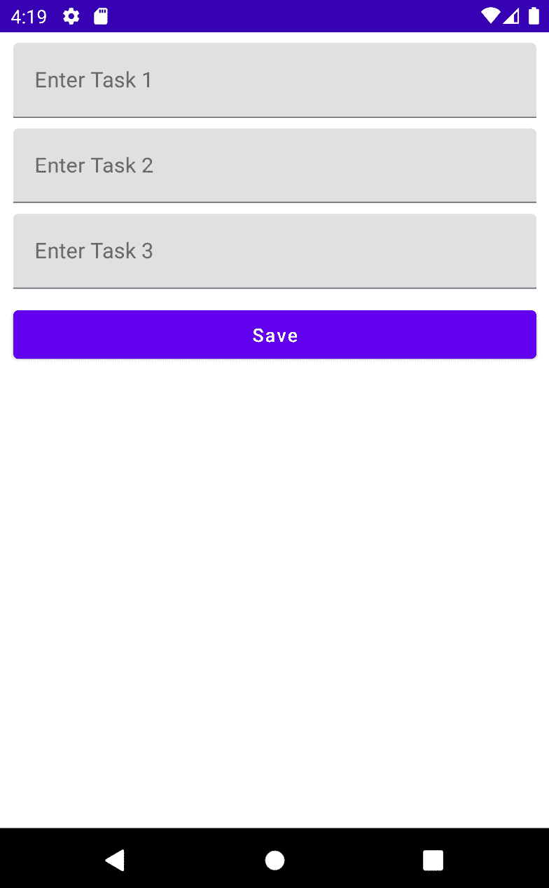
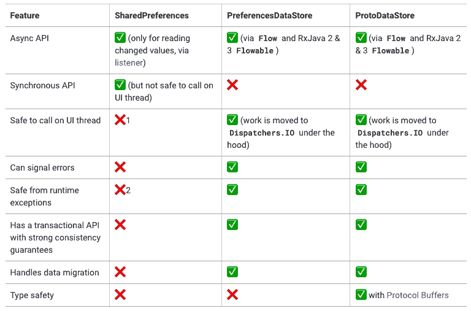
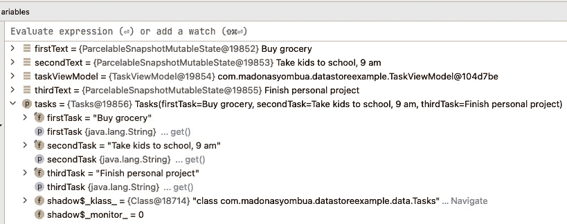
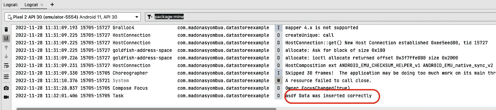
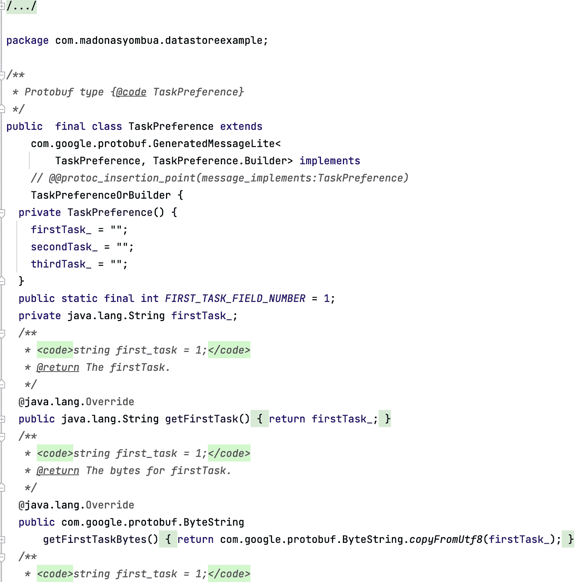
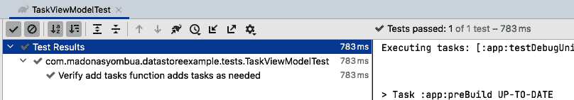

# 5

# 使用 DataStore 存储数据并进行测试

Modern Android Development 实践帮助 Android 开发者创建更好的应用程序。DataStore 是 Android Jetpack 库提供的数据存储解决方案。它允许开发者异步和具有一致性保证地存储键值对或复杂对象。数据在 Android 开发中至关重要，我们如何保存和持久化数据至关重要。在本章中，我们将探讨使用 DataStore 持久化我们的数据，并查看使用 DataStore 的最佳实践。

在本章中，我们将介绍以下内容：

+   实现 DataStore

+   将依赖注入添加到 DataStore

+   使用 Android Proto DataStore 与 DataStore

+   使用 DataStore 处理数据迁移

+   为我们的 DataStore 实例编写测试

# 技术要求

本章的完整源代码可以在 [`github.com/PacktPublishing/Modern-Android-13-Development-Cookbook/tree/main/chapter_five`](https://github.com/PacktPublishing/Modern-Android-13-Development-Cookbook/tree/main/chapter_five) 找到。

# 实现 DataStore

在构建移动应用程序时，确保您持久化数据对于实现平滑加载、减少网络问题或完全离线处理数据至关重要。在本例中，我们将探讨如何使用名为 DataStore 的 Modern Android Development Jetpack 库在 Android 应用程序中存储数据。

DataStore 是 Android 应用程序的数据存储解决方案，它允许您使用协议缓冲区存储键值对或任何类型对象。此外，DataStore 使用 Kotlin 协程和流来一致、事务和异步地存储数据。

如果您之前构建过 Android 应用程序，您可能已经使用了 `SharedPreferences`。新的 Preferences DataStore 旨在取代这种方法。也可以说，Preferences DataStore 利用 `SharedPreferences` 的力量，因为它们非常相似。此外，Google 的文档建议，如果您目前在项目中使用 `SharedPreferences` 存储数据，您应考虑迁移到最新的 DataStore 版本。

在 Android 中存储数据的另一种方式是使用 Room。这将在 *第六章*，*使用 Room 数据库和测试* 中介绍；现在，我们只需看看 DataStore。此外，需要注意的是，DataStore 适用于简单的或小型数据集，并且不支持部分更新或引用完整性。

## 如何操作…

让我们继续创建一个新的、空的 Compose 项目，并将其命名为 `DataStoreSample`。在我们的示例项目中，我们将创建一个任务条目应用程序，用户可以保存任务。我们将允许用户只保存三个任务，然后使用 DataStore 存储任务，并稍后记录数据以查看是否正确插入。另一个尝试的练习是在用户想要查看数据时显示数据：

1.  在我们新创建的项目中，让我们继续删除我们不需要的代码。在这种情况下，我们指的是所有空 Compose 项目中包含的 `Greeting(name: String)`。保留 Preview 函数，因为我们将会使用它来查看我们创建的屏幕。

1.  现在，让我们继续添加 DataStore 和同步项目的所需依赖项。注意，DataStore 库有针对 RxJava 2 和 3 的特定版本：

    ```kt
    dependencies {
    ```

    ```kt
    implementation "androidx.DataStore:DataStore-preferences:1.x.x"
    ```

    ```kt
    }
    ```

1.  创建一个新的包，并将其命名为 `data`。在 `data` 中，创建一个新的 Kotlin 数据类，并将其命名为 `Tasks`。

1.  让我们现在继续构建我们的数据类，并包含预期的输入字段：

    ```kt
    data class Tasks(
    ```

    ```kt
        val firstTask: String,
    ```

    ```kt
        val secondTask: String,
    ```

    ```kt
        val thirdTask: String
    ```

    ```kt
    )
    ```

1.  在同一个包内，让我们添加一个 `TaskDataSource` 枚举，因为我们将会重用这个项目来展示使用 Android Proto DataStore 的 *Using Android Proto DataStore versus* *DataStore* 菜单：

    ```kt
    enum class TaskDataSource {
    ```

    ```kt
        PREFERENCES_DATA_STORE
    ```

    ```kt
    }
    ```

1.  在我们的包内，让我们继续添加一个 `DataStoreManager` 接口。在我们的类中，我们将有一个 `saveTasks()` 函数来保存数据，以及一个 `getTasks()` 函数来帮助我们检索保存的数据。Kotlin 中的 `suspend` 函数简单地说是一个可以被暂停并在稍后恢复的函数。

此外，挂起函数可以执行长时间运行的操作并等待完成，而不会阻塞：

```kt
interface DataStoreManager {
    suspend fun saveTasks(tasks: Tasks)
    fun getTasks(): Flow<Tasks>
}
```

1.  接下来，我们需要实现我们的接口，所以让我们继续创建一个 `DataStoreManagerImpl` 类并实现 `DataStoreManager`。为了刷新你对 Flows 的了解，请参考 *第三章*，*在 Jetpack Compose 中处理 UI 状态以及使用 Hilt*：

    ```kt
    class DataStoreManagerImpl(): DataStoreManager {
    ```

    ```kt
        override suspend fun saveTasks(tasks: Tasks) {
    ```

    ```kt
            TODO("Not yet implemented")
    ```

    ```kt
        }
    ```

    ```kt
        override fun getTasks(): Flow<Tasks> {
    ```

    ```kt
            TODO("Not yet implemented")
    ```

    ```kt
        }
    ```

    ```kt
    }
    ```

1.  你会注意到，一旦我们实现了接口，我们将一个视图带到了函数中，但它显示 `TODO`，并且还没有实现任何内容。为了继续这一步，让我们继续添加 DataStore 并在我们的构造函数中传递 `Preference`。我们还需要为每个任务创建字符串偏好键：

    ```kt
    class DataStoreManagerImpl(
    ```

    ```kt
        private val tasksPreferenceStore:
    ```

    ```kt
            DataStore<Preferences>
    ```

    ```kt
    ) : DataStoreManager {
    ```

    ```kt
        private val FIRST_TASK =
    ```

    ```kt
            stringPreferencesKey("first_task")
    ```

    ```kt
        private val SECOND_TASK =
    ```

    ```kt
            stringPreferencesKey("second_task")
    ```

    ```kt
        private val THIRD_TASK =
    ```

    ```kt
            stringPreferencesKey("third_task")
    ```

    ```kt
        override suspend fun saveTasks(tasks: Tasks) {
    ```

    ```kt
            tasksPreferenceStore.edit {
    ```

    ```kt
            taskPreferenceStore ->
    ```

    ```kt
                taskPreferenceStore[FIRST_TASK] =
    ```

    ```kt
                    tasks.firstTask
    ```

    ```kt
                taskPreferenceStore[SECOND_TASK] =
    ```

    ```kt
                    tasks.secondTask
    ```

    ```kt
                taskPreferenceStore[THIRD_TASK] =
    ```

    ```kt
                    tasks.thirdTask
    ```

    ```kt
            }
    ```

    ```kt
        }
    ```

    ```kt
        override fun getTasks(): Flow<Tasks> {
    ```

    ```kt
            TODO("Not yet implemented")
    ```

    ```kt
        }
    ```

    ```kt
    }
    ```

1.  最后，让我们通过向 `getTasks` 函数添加功能来完成 `DataStore` 部分的实现：

    ```kt
    override fun getTasks(): Flow<Tasks> = tasksPreferenceStore.data.map { taskPreference ->
    ```

    ```kt
        Tasks(
    ```

    ```kt
            firstTask = taskPreference[FIRST_TASK] ?: "",
    ```

    ```kt
            secondTask = taskPreference[SECOND_TASK] ?:
    ```

    ```kt
            "",
    ```

    ```kt
            thirdTask = taskPreference[THIRD_TASK] ?: ""
    ```

    ```kt
        )
    ```

    ```kt
    }
    ```

1.  在我们的 `MainActivity` 类中，让我们继续创建一个简单的 UI：三个 `TextField` 和一个 **保存** 按钮。**保存** 按钮将保存我们的数据，并且我们可以在一切按预期工作后尝试记录数据。请参考本章的 *技术要求* 部分以获取 UI 代码。



图 5.1 – DataStore UI 示例

现在我们已经准备好了实现，在接下来的菜谱中，*将依赖注入添加到 DataStore*，我们将添加依赖注入并将一切粘合在一起。

## 它是如何工作的…

新的 Modern Android Development Jetpack 库 Preferences DataStore 的主要目标是替换 `SharedPreferences`。为了实现 Preferences DataStore，正如你在菜谱中看到的，我们使用一个接受 `Preference` 抽象类的 DataStore 接口，我们可以使用它来编辑和映射条目数据。此外，我们为键值对的关键部分创建键：

```kt
private val FIRST_TASK = stringPreferencesKey("first_task")
private val SECOND_TASK = stringPreferencesKey("second_task")
private val THIRD_TASK = stringPreferencesKey("third_task")
```

要将数据保存到 DataStore，我们使用 `edit()`，这是一个需要从 `CoroutineContext` 调用的挂起函数。与 `SharedPreferences` 相比，使用 Preferences DataStore 的一个关键区别是，DataStore 在 UI 线程上调用是安全的，因为它在底层使用 `dispatcher.IO`。

你也不需要使用 `apply{}` 或 `commit` 函数来保存更改，正如在 `SharedPreferences` 中所要求的。此外，它以事务方式处理数据更新。更多功能列在 *图 5.2* 中。



图 5.2 – 从 developers.android.com 选取的 Datastore 功能示例

还有更多东西要学习，并且公平地说，我们在本菜谱中涵盖的内容只是 DataStore 可以做到的一小部分。我们将在接下来的菜谱中介绍更多功能。

# 将依赖注入添加到 DataStore

依赖注入是软件工程中的一个重要设计模式，其在 Android 应用开发中的应用可以使代码更干净、更易于维护。当谈到 Android 中的 DataStore 时，它是在 Android Jetpack 中引入的现代数据存储解决方案，添加依赖注入可以带来几个好处：

+   通过使用依赖注入，你可以将创建 DataStore 实例的关注点与使用它的代码分离。这意味着你的业务逻辑代码不需要担心如何创建 DataStore 实例，而可以专注于它需要处理的数据。

+   依赖注入使得为你的应用编写单元测试变得更加容易。通过将模拟的 DataStore 实例注入到测试中，你可以确保测试不受 DataStore 实际状态的影响。

+   依赖注入可以帮助你将代码分解成更小、更易于管理的模块。这使得添加新功能或修改现有功能变得更加容易，而不会影响整个代码库。

+   通过使用依赖注入，你可以轻松地在不同的 DataStore 实现之间切换。这在测试不同类型的数据存储或从一种存储解决方案迁移到另一种存储解决方案时非常有用。

## 如何操作...

你需要完成前面的菜谱才能继续进行，通过执行以下步骤：

1.  打开你的项目并添加必要的 Hilt 依赖。如果你需要帮助设置它，请参阅 *第三章* 中的 *在 Jetpack Compose 中处理 UI 状态和使用 Hilt* 菜谱。

1.  接下来，让我们继续添加我们的 `@HiltAndroidApp` 类，并在我们的 `Manifest` 文件夹中添加 `.name =` `TaskApp: android:name=".TaskApp"`:

    ```kt
    @HiltAndroidApp
    ```

    ```kt
    class TaskApp : Application()
    ```

    ```kt
    <application
    ```

    ```kt
        android:allowBackup="true"
    ```

    ```kt
        android:name=".TaskApp"
    ```

    ```kt
        tools:targetApi="31">
    ```

    ```kt
    ...
    ```

1.  现在我们已经实现了依赖注入，让我们继续将 `@AndroidEntryPoint` 添加到 `MainActivity` 类中，并在 `DataStoreManagerImpl` 中添加 `@Inject constructor`。我们应该有类似以下代码片段的内容：

    ```kt
    class DataStoreManagerImpl @Inject constructor(
    ```

    ```kt
        private val tasksPreferenceStore:
    ```

    ```kt
        DataStore<Preferences>
    ```

    ```kt
    ) : DataStoreManager {
    ```

1.  现在，我们需要创建一个新的文件夹，并将其命名为`di`；这是我们放置`DataStoreModule`类的地方。我们创建一个名为`store_tasks`的文件来存储偏好值：

    ```kt
    @Module
    ```

    ```kt
    @InstallIn(SingletonComponent::class)
    ```

    ```kt
    class DataStoreModule {
    ```

    ```kt
        private val Context.tasksPreferenceStore :
    ```

    ```kt
        DataStore<Preferences> by
    ```

    ```kt
        preferencesDataStore(name = "store_tasks")
    ```

    ```kt
        @Singleton
    ```

    ```kt
        @Provides
    ```

    ```kt
        fun provideTasksPreferenceDataStore(
    ```

    ```kt
            @ApplicationContext context: Context
    ```

    ```kt
        ): DataStore<Preferences> =
    ```

    ```kt
           context.tasksPreferenceStore
    ```

    ```kt
    }
    ```

1.  我们还需要在`di`包内部为`DataStoreManagerModule`创建一个`abstract`类。为了减少使用手动依赖注入的样板代码，我们的应用程序也为需要它们的类提供了所需的依赖。你可以在*第三章*中了解更多信息，*处理 Jetpack Compose 中的 UI 状态*和*使用 Hilt*：

    ```kt
    @Module
    ```

    ```kt
    @InstallIn(SingletonComponent::class)
    ```

    ```kt
    abstract class DataStoreManagerModule {
    ```

    ```kt
        @Singleton
    ```

    ```kt
        @Binds
    ```

    ```kt
        abstract fun
    ```

    ```kt
            bindDataStoreRepository(DataStoreManagerImpl:
    ```

    ```kt
                DataStoreManagerImpl): DataStoreManager
    ```

    ```kt
    }
    ```

1.  现在让我们继续创建一个新的包，并将其命名为`service`：

    ```kt
    interface TaskService {
    ```

    ```kt
        fun getTasksFromPrefDataStore(): Flow<Tasks>
    ```

    ```kt
        suspend fun addTasks(tasks: Tasks)
    ```

    ```kt
    }
    ```

    ```kt
    class TaskServiceImpl @Inject constructor(
    ```

    ```kt
        private val DataStoreManager: DataStoreManager
    ```

    ```kt
    ) : TaskService {
    ```

    ```kt
        override fun getTasksFromPrefDataStore() =
    ```

    ```kt
                 DataStoreManager.getTasks()
    ```

    ```kt
        override suspend fun addTasks(tasks: Tasks) {
    ```

    ```kt
            DataStoreManager.saveTasks(tasks)
    ```

    ```kt
        }
    ```

    ```kt
    }
    ```

1.  让我们也确保我们有为新创建的服务所需的依赖：

    ```kt
        @Singleton
    ```

    ```kt
        @Binds
    ```

    ```kt
        abstract fun bindTaskService(taskServiceImpl:
    ```

    ```kt
        TaskServiceImpl): TaskService
    ```

    ```kt
    }
    ```

1.  现在我们已经完成了依赖注入和添加 DataStore 所需的所有功能，我们将继续添加一个`ViewModel`类，并在用户点击保存按钮时实现保存数据的函数：

    ```kt
    fun saveTaskData(tasks: Tasks) {
    ```

    ```kt
        viewModelScope.launch {
    ```

    ```kt
            Log.d("Task", "asdf Data was inserted
    ```

    ```kt
                   correctly")
    ```

    ```kt
            taskService.addTasks(tasks)
    ```

    ```kt
        }
    ```

    ```kt
    }
    ```

1.  在 Compose 视图中，在 Compose 保存按钮内部调用`saveTaskData`函数来保存我们的数据：

    ```kt
    TaskButton(onClick = {
    ```

    ```kt
        val tasks = Tasks(
    ```

    ```kt
            firstTask = firstText.value,
    ```

    ```kt
            secondTask = secondText.value,
    ```

    ```kt
            thirdTask = thirdText.value
    ```

    ```kt
        )
    ```

    ```kt
        taskViewModel.saveTaskData(tasks)},
    ```

    ```kt
        text = stringResource(id = R.string.save))
    ```

1.  最后，我们需要验证一切是否正常工作，即我们的 UI 和数据存储过程。我们可以通过在 TextFields 中输入数据并点击保存按钮来验证这一点，当记录消息时，它确认数据确实已保存。


图 5.3 – 任务条目

1.  如果你最初错过了，这个视图的代码可以在*技术要求*部分找到。现在，当你输入数据时，就像*图 5**.4*中那样，我们应该能够在 Logcat 中记录数据并验证我们的数据是否已正确插入。



图 5.4 – 通过调试进行任务条目

1.  如果一切正常，也应该在 Logcat 标签中显示一条日志消息。



图 5.5 – 表示数据正确插入的调试日志

## 它是如何工作的…

在这个菜谱中，我们选择使用依赖注入来为特定类提供所需的依赖。我们已经深入探讨了依赖注入是什么，所以我们将不再解释它，而是讨论我们创建的模块。

在我们的项目中，我们创建了`DataStoreManagerModule`和`DataStoreModule`，我们所做的一切只是提供所需的依赖。我们创建了一个名为`store_tasks`的文件，它帮助我们存储偏好值：

```kt
private val Context.tasksPreferenceStore : DataStore<Preferences> by preferencesDataStore(name = "store_tasks")
```

默认情况下，DataStore 使用协程并返回一个流值。根据文档，使用 DataStore 时需要记住的一些重要规则如下：

+   DataStore 在同一进程中为给定文件只需要一个实例。因此，我们永远不应该创建多个 DataStore 实例。

+   总是让通用的`DataStore`类型不可变，以减少不必要的难以追踪的错误。

+   你永远不应该在同一个文件中混合使用单进程 DataStore 和多进程 DataStore。

## 还有更多...

作为一项练习，你可以尝试添加另一个按钮，并在懒列或文本字段中显示保存的数据。

## 参见

关于 DataStore 还有更多要学习的内容，这个菜谱只为你概述了你可以用 DataStore 做什么。你可以通过点击以下链接了解更多信息：[`developer.android.com/topic/libraries/architecture/datastore`](https://developer.android.com/topic/libraries/architecture/datastore)。

# 使用 Android Proto DataStore 与 DataStore 的比较

*图 5.2* 展示了 `PreferencesDataStore`、`SharedPreferences` 和 `ProtoDataStore` 之间的区别。在这个菜谱中，我们将探讨我们如何使用 Proto DataStore。Proto DataStore 实现使用 DataStore 和 Protocol Buffers 将类型化对象持久化到磁盘。

Proto DataStore 与 Preferences DataStore 类似，但与 Preferences DataStore 不同，Proto 不使用键值对，只是在流程中返回生成的对象。文件类型和数据结构取决于 `.protoc` 文件的模式。

## 准备工作

我们将使用已经创建的项目来展示如何在 Android 中使用 Proto DataStore。我们还将使用已经创建的类，只是给函数不同的名字。

## 如何做到这一点...

1.  我们需要首先设置所需的依赖项，所以让我们继续在我们的 Gradle 应用级别文件中添加以下内容：

    ```kt
    implementation "androidx.DataStore:DataStore:1.x.x
    ```

    ```kt
    implementation "com.google.protobuf:protobuf-javalite:3.x.x"
    ```

1.  接下来，我们需要在 `build.gradle` 文件中的 `plugins` 添加 `protobuf`：

    ```kt
    plugins {
    ```

    ```kt
    ...
    ```

    ```kt
        id "com.google.protobuf" version "0.8.12"
    ```

    ```kt
    }
    ```

1.  我们需要在 `build.gradle` 文件中添加 `protobuf` 配置来完成设置：

    ```kt
    protobuf {
    ```

    ```kt
        protoc {
    ```

    ```kt
            artifact = "com.google.protobuf:protoc:3.11.0"
    ```

    ```kt
        }
    ```

    ```kt
        generateProtoTasks {
    ```

    ```kt
            all().each { task ->
    ```

    ```kt
                task.builtins {
    ```

    ```kt
                     java {
    ```

    ```kt
                         option 'lite'
    ```

    ```kt
                     }
    ```

    ```kt
                }
    ```

    ```kt
            }
    ```

    ```kt
        }
    ```

    ```kt
    }
    ```

1.  现在，在我们的 `package` 文件夹内，我们需要在 `app/src/main/` 下添加我们的 `proto` 文件，然后创建一个新的目录并命名为 `proto`。你现在应该在 `app/src/main/proto` 文件目录中看到以下内容：

    ```kt
    syntax = "proto3";
    ```

    ```kt
    option java_package =
    ```

    ```kt
        "com.madonasyombua.DataStoreexample";
    ```

    ```kt
    option java_multiple_files = true;
    ```

    ```kt
    message TaskPreference {
    ```

    ```kt
        string first_task = 1;
    ```

    ```kt
        string second_task = 2;
    ```

    ```kt
        string third_task = 3;
    ```

    ```kt
    }
    ```

设置起来有很多。现在我们可以开始添加代码来连接一切了。

1.  让我们修改可能需要 `ProtoDataStore` 的类。首先，让我们将 `PROTO_DATA_STORE` 添加到 `TaskDataSource` 枚举类中：

    ```kt
    enum class TaskDataSource {
    ```

    ```kt
        PREFERENCES_DATA_STORE,
    ```

    ```kt
        PROTO_DATA_STORE
    ```

    ```kt
    }
    ```

1.  在 `DataStoreManager` 中，让我们添加 `saveTaskToProtoStore()` 和 `getUserFromProtoStore()`，我们新的接口将看起来像这样：

    ```kt
    interface DataStoreManager {
    ```

    ```kt
        suspend fun saveTasks(tasks: Tasks)
    ```

    ```kt
        fun getTasks(): Flow<Tasks>
    ```

    ```kt
        suspend fun saveTasksToProtoStore(tasks: Tasks)
    ```

    ```kt
        fun getTasksFromProtoStore(): Flow<Tasks>
    ```

    ```kt
    }
    ```

1.  由于我们刚刚修改了我们的接口，我们还需要继续添加实现类的新功能。你也会注意到，一旦添加了函数，项目会抱怨：

    ```kt
    override suspend fun saveTasksToProtoStore(tasks: Tasks) {
    ```

    ```kt
        TODO("Not yet implemented")
    ```

    ```kt
    }
    ```

    ```kt
    override fun getTasksFromProtoStore(): Flow<Tasks> {
    ```

    ```kt
        TODO("Not yet implemented")
    ```

    ```kt
    }
    ```

1.  如推荐，我们需要定义一个实现 `Serializer<Type>` 的类，其中类型在 Proto 文件中定义。这个序列化类的目的是告诉 DataStore 如何读取和写入我们的数据类型。所以，让我们创建一个新的对象并命名为 `TaskSerializer()`：

    ```kt
    object TaskSerializer : Serializer<TaskPreference> {
    ```

    ```kt
        override val defaultValue: TaskPreference =
    ```

    ```kt
            TaskPreference.getDefaultInstance()
    ```

    ```kt
        override suspend fun readFrom(input: InputStream):
    ```

    ```kt
            TaskPreference{
    ```

    ```kt
                try {
    ```

    ```kt
                    return TaskPreference.parseFrom(input)
    ```

    ```kt
                } catch (exception:
    ```

    ```kt
                InvalidProtocolBufferException) {
    ```

    ```kt
                  throw CorruptionException("Cannot read
    ```

    ```kt
                  proto.", exception)
    ```

    ```kt
                }
    ```

    ```kt
        }
    ```

    ```kt
        override suspend fun writeTo(t: TaskPreference,
    ```

    ```kt
            output: OutputStream) = t.writeTo(output)
    ```

    ```kt
    }
    ```

1.  `TaskPreference` 类是自动生成的，你可以通过点击它直接访问它，但不能编辑它。除非你更改原始文件，否则自动生成的文件是不可编辑的。



图 5.6 – 展示自动生成的 TaskPreference 类的屏幕截图

1.  现在我们已经创建了我们的数据类型类，我们需要使用与 DataStore 一起使用的上下文创建一个 `taskProtoDataStore: DataStore<TaskPreference>`。因此，在 `DataStoreModule` 中，让我们继续添加以下代码：

    ```kt
    private val Context.taskProtoDataStore: DataStore<TaskPreference> by DataStore(
    ```

    ```kt
        fileName = "task.pd",
    ```

    ```kt
        serializer = TaskSerializer
    ```

    ```kt
    )
    ```

    ```kt
    @Singleton
    ```

    ```kt
    @Provides
    ```

    ```kt
    fun provideTasksProtoDataStore(
    ```

    ```kt
        @ApplicationContext context: Context
    ```

    ```kt
    ):DataStore<TaskPreference> = context.taskProtoDataStore
    ```

1.  现在，让我们回到 `DataStoreManagerImpl` 并着手实现我们尚未实现的函数：

    ```kt
    override suspend fun saveTasksToProtoStore(tasks: Tasks) {
    ```

    ```kt
        taskProtoDataStore.updateData { taskData ->
    ```

    ```kt
            taskData.toBuilder()
    ```

    ```kt
                .setFirstTask(tasks.firstTask)
    ```

    ```kt
                .setSecondTask(tasks.secondTask)
    ```

    ```kt
                .setThirdTask(tasks.thirdTask)
    ```

    ```kt
                .build()
    ```

    ```kt
        }
    ```

    ```kt
    }
    ```

    ```kt
    override fun getTasksFromProtoStore(): Flow<Tasks> =
    ```

    ```kt
        taskProtoDataStore.data.map { tasks ->
    ```

    ```kt
            Tasks(
    ```

    ```kt
                tasks.firstTask,
    ```

    ```kt
                tasks.secondTask,
    ```

    ```kt
                tasks.thirdTask
    ```

    ```kt
            )
    ```

1.  在 `TaskService` 中，我们还将继续添加 `getTasksFromProto` 和 `getTasks()`：

    ```kt
    interface TaskService {
    ```

    ```kt
        fun getTasksFromPrefDataStore() : Flow<Tasks>
    ```

    ```kt
        suspend fun addTasks(tasks: Tasks)
    ```

    ```kt
        fun getTasks(): Flow<Tasks>
    ```

    ```kt
        fun getTasksFromProtoDataStore(): Flow<Tasks>
    ```

    ```kt
    }
    ```

1.  当你实现一个接口时，首先被实现的类可能会显示编译错误，这会提示你将接口功能覆盖到类中。因此，在 `TaskServiceImpl` 类中，添加以下代码：

    ```kt
    class TaskServiceImpl @Inject constructor(
    ```

    ```kt
        private val DataStoreManager: DataStoreManager
    ```

    ```kt
    ) : TaskService {
    ```

    ```kt
        override fun getTasksFromPrefDataStore() =
    ```

    ```kt
            DataStoreManager.getTasks()
    ```

    ```kt
        override suspend fun addTasks(tasks: Tasks) {
    ```

    ```kt
            DataStoreManager.saveTasks(tasks)
    ```

    ```kt
            DataStoreManager.saveTasksToProtoStore(tasks)
    ```

    ```kt
        }
    ```

    ```kt
        override fun getTasks(): Flow<Tasks> =
    ```

    ```kt
            getTasksFromProtoDataStore()
    ```

    ```kt
        override fun getTasksFromProtoDataStore():
    ```

    ```kt
            Flow<Tasks> =
    ```

    ```kt
            DataStoreManager.getTasksFromProtoStore()
    ```

    ```kt
    }
    ```

最后，现在我们已经保存了所有数据，我们可以记录以确保数据在 UI 上符合预期；查看 *技术要求* 部分的链接，了解这是如何实现的。

重要提示

Apple M1 有一个与 proto 相关的问题。为此问题已打开一个工单；通过以下链接解决问题：[`github.com/grpc/grpc-java/issues/7690`](https://github.com/grpc/grpc-java/issues/7690)。希望它会在本书出版时得到修复。重要的是要注意，如果你使用 `DataStore-preferences-core` 仓库与 Proguard 一起使用，你必须手动将 Proguard 规则添加到你的规则文件中，以防止删除已经编写的字段。你还可以遵循相同的流程来记录并检查数据是否按预期插入。

## 它是如何工作的…

你可能已经注意到我们以实例的形式存储了我们的自定义数据类型。这正是 Proto DataStore 所做的；它以自定义数据类型的实例形式存储数据。实现需要我们使用协议缓冲区定义一个模式，但它提供了类型安全。

在 Android 的 Proto Datastore 库中，`Serializer<Type>` 接口将特定类型（`Type`）的对象转换为相应的协议缓冲区格式，反之亦然。此接口提供了将对象序列化为字节和将字节反序列化为对象的方法。

Android 中的协议缓冲区是一种语言和平台无关的可扩展机制，用于序列化您的结构化数据。协议缓冲区以二进制流的形式编码和解码您的数据，这种流非常轻量级。

在定义数据类或序列化模型类中的属性时，使用 `override val defaultValue`。它是 Kotlin 序列化库的一部分，该库通常用于将对象序列化和反序列化到不同的数据格式，如 JSON 或协议缓冲区。

我们通过从存储对象中公开流式 DataStore 数据并编写一个提供 `updateData()` 函数的 proto DataStore 来公开适当的属性，该函数以事务方式更新存储对象。

`updateData` 函数以我们数据类型的实例形式提供当前数据状态，并在原子读-写-修改操作中更新它。

## 参见

关于如何创建定义良好的模式还有很多东西可以学习。您可以在以下位置查看 protobuf 语言指南：[`developers.google.com/protocol-buffers/docs/proto3`](https://protobuf.dev/programming-guides/proto3/)。

# 使用 DataStore 处理数据迁移

如果你之前开发过 Android 应用程序，你可能使用过 `SharedPreferences`；现在的好消息是，现在有了迁移支持，你可以使用 `SharedPreferenceMigration` 从 `SharedPreferences` 迁移到 DataStore。与任何数据一样，我们总是会修改我们的数据集；例如，我们可能想要重命名我们的数据模型值或甚至更改它们的类型。

在这种情况下，我们需要进行 DataStore 到 DataStore 的迁移；这正是我们将在这个菜谱中工作的。这个过程与从 `SharedPreferences` 迁移非常相似；事实上，`SharedPreferencesMigration` 是 `DataMigration` 接口类的一个实现。

## 准备工作

由于我们刚刚创建了一个新的 `PreferenceDataStore`，我们不需要迁移它，但我们可以看看在需要时如何实现迁移。

## 如何实现…

在这个菜谱中，我们将探讨如何利用所学知识来帮助你处理需要迁移到 DataStore 的情况：

1.  让我们先看看帮助迁移的接口。以下代码部分展示了 `DataMigration` 接口，该接口由 `SharedPreferencesMigration` 实现：

    ```kt
    /* Copyright 2022 Google LLC.
    ```

    ```kt
       SPDX-License-Identifier: Apache-2.0 */
    ```

    ```kt
    public interface DataMigration<T> {
    ```

    ```kt
        public suspend fun shouldMigrate(currentData: T): Boolean
    ```

    ```kt
        public suspend fun migrate(currentData: T): T
    ```

    ```kt
            public suspend fun cleanUp()
    ```

    ```kt
    }
    ```

1.  在 `Tasks` 数据中，我们可能想要将条目更改为 `Int`；这意味着更改我们的数据类型之一。我们将想象这个场景，并尝试基于此创建一个迁移。我们可以从创建一个新的 `migrateOnePreferencesDataStore` 开始：

    ```kt
    private val Context.migrateOnePreferencesDataStore : DataStore<Preferences> by preferencesDataStore(
    ```

    ```kt
        name = "store_tasks"
    ```

    ```kt
    )
    ```

1.  现在，让我们继续实现 `DataMigration` 并覆盖其函数。您需要指定迁移是否应该发生的条件。迁移数据显示了如何将旧数据精确地转换为新数据。然后，一旦迁移完成，清理旧存储：

    ```kt
    private val Context.migrationTwoPreferencesDataStore by preferencesDataStore(
    ```

    ```kt
        name = NEW_DataStore,
    ```

    ```kt
        produceMigrations = { context ->
    ```

    ```kt
            listOf(object : DataMigration<Preferences> {
    ```

    ```kt
                override suspend fun
    ```

    ```kt
                    shouldMigrate(currentData:
    ```

    ```kt
                        Preferences) = true
    ```

    ```kt
                override suspend fun migrate(currentData:
    ```

    ```kt
                Preferences): Preferences {
    ```

    ```kt
                    val oldData = context
    ```

    ```kt
                        .migrateOnePreferencesDataStore
    ```

    ```kt
                            .data.first().asMap()
    ```

    ```kt
                    val currentMutablePrefs =
    ```

    ```kt
                        currentData.toMutablePreferences()
    ```

    ```kt
                    oldToNew(oldData, currentMutablePrefs)
    ```

    ```kt
                    return
    ```

    ```kt
                       currentMutablePrefs.toPreferences()
    ```

    ```kt
                }
    ```

    ```kt
                override suspend fun cleanUp() {
    ```

    ```kt
                    context.migrateOnePreferencesDataStore
    ```

    ```kt
                        .edit { it.clear() }
    ```

    ```kt
                }
    ```

    ```kt
            })
    ```

    ```kt
        }
    ```

    ```kt
    )
    ```

1.  最后，让我们创建 `oldToNew()` 函数，这是我们添加要迁移的数据的地方：

    ```kt
    private fun oldToNew(
    ```

    ```kt
        oldData: Map<Preferences.Key<*>, Any>,
    ```

    ```kt
        currentMutablePrefs: MutablePreferences
    ```

    ```kt
    ) {
    ```

    ```kt
        oldData.forEach { (key, value) ->
    ```

    ```kt
            when (value) {
    ```

    ```kt
                //migrate data types you wish to migrate
    ```

    ```kt
                ...
    ```

    ```kt
            }
    ```

    ```kt
        }
    ```

    ```kt
    }
    ```

## 它是如何工作的…

为了更好地理解 `DataMigration` 的工作原理，我们需要查看 `DataMigration` 接口中的函数。在我们的接口中，我们有三个函数，如下面的代码块所示：

```kt
    public suspend fun shouldMigrate(currentData: T):
        Boolean
    public suspend fun migrate(currentData: T): T
    public suspend fun cleanUp()
```

`shouldMigrate()` 函数，正如其名所示，用于确定是否需要执行迁移。例如，如果没有执行迁移，这意味着该函数将返回 `false`，则不会进行迁移或清理。此外，需要注意的是，每次我们调用我们的 DataStore 实例时，此函数都会被初始化。另一方面，`Migrate()` 函数执行迁移操作。

偶然情况下，如果操作失败或不符合预期，DataStore 将不会将任何数据提交到磁盘。此外，清理过程将不会发生，并且会抛出异常。最后，`cleanUp()`正如其名，只是清除之前数据存储中的任何旧数据。

# 为我们的 DataStore 实例编写测试

在 Android 开发中编写测试至关重要，在这个菜谱中，我们将为我们的 DataStore 实例编写一些测试。为了测试我们的 DataStore 实例或任何 DataStore 实例，我们首先需要设置 instrumentation 测试，因为我们将在实际的文件（DataStore）中进行读写操作，并且验证准确更新是至关重要的。

## 如何做到这一点…

我们将首先创建一个简单的单元测试来测试我们的视图模型函数：

1.  在我们的单元测试文件夹中，创建一个新的文件夹，命名为`test`，并在其中创建一个新的类，命名为`TaskViewModelTest`：

    ```kt
      class TaskViewModelTest {}
    ```

1.  接下来，我们需要添加一些测试依赖项：

    ```kt
    testImplementation "io.mockk:mockk:1.13.3"
    ```

    ```kt
    androidTestImplementation "io.mockk:mockk-android:1.13.3"
    ```

    ```kt
    testImplementation "org.jetbrains.kotlinx:kotlinx-coroutines-test:1.5.2"
    ```

1.  现在我们已经添加了所需的依赖项，让我们继续创建我们的模拟任务服务类，然后对其进行模拟，并在设置中初始化它：

    ```kt
    private lateinit var classToTest: TaskViewModel
    ```

    ```kt
    private val mockTaskService = mockk<TaskService>()
    ```

    ```kt
    private val dispatcher = TestCoroutineDispatcher()
    ```

    ```kt
    @Before
    ```

    ```kt
    fun setUp(){
    ```

    ```kt
        classToTest = TaskViewModel(mockTaskService)
    ```

    ```kt
    }
    ```

1.  由于我们使用协程，我们将在`@Before`注解中设置我们的分发器，并在`@After`注解中使用`Dispatchers.resetMain()`清除任何存储的数据。如果你在没有设置协程的情况下运行测试，它们将因错误而失败。使用`Main`分发器的模块初始化失败。对于测试，可以使用`kotlinx-coroutines-test`模块中的`Dispatchers.setMain`：

    ```kt
    @Before
    ```

    ```kt
    fun setUp(){
    ```

    ```kt
        classToTest = TaskViewModel(mockTaskService)
    ```

    ```kt
        Dispatchers.setMain(dispatcher)
    ```

    ```kt
    }
    ```

    ```kt
    @After
    ```

    ```kt
    fun tearDown() {
    ```

    ```kt
        Dispatchers.resetMain()
    ```

    ```kt
    }
    ```

1.  完成那之后，我们继续创建一个新的测试，命名为`Verify add tasks function adds tasks as needed`。在这个测试中，我们将创建一个`fakeTask`，将这些任务添加到`saveTaskData`中，并通过检查我们没有存储`null`来确保数据按预期插入：

    ```kt
    @Test
    ```

    ```kt
    fun  `Verify add tasks function adds tasks as needed`() = runBlocking {
    ```

    ```kt
        val fakeTasks = Tasks(
    ```

    ```kt
            firstTask = "finish school work",
    ```

    ```kt
            secondTask = "buy gifts for the holiday",
    ```

    ```kt
            thirdTask = "finish work"
    ```

    ```kt
        )
    ```

    ```kt
        val expected = classToTest.saveTaskData(fakeTasks)
    ```

    ```kt
        Assert.assertNotNull(expected)
    ```

    ```kt
    }
    ```

最后，当你运行单元测试时，它应该通过，你将看到一个绿色的勾号。



图 5.7 – 视图模型中的测试通过

## 它是如何工作的…

在 Android 中使用了不同的模拟库：`Mockito`、`Mockk`等。在这个菜谱中，我们使用了`Mockk`，这是一个用户友好的 Android 模拟库。`testImplementation "io.mockk:mockk:1.13.3"`用于单元测试，而`androidTestImplementation "io.mockk:mockk-android:1.13.3"`用于 UI 测试。

要测试 UI，我们需要遵循一个模式，创建一个包含默认值的测试 DataStore 实例。然后，我们创建测试主题，并验证从我们的函数中来的测试 DataStore 值是否与预期结果匹配。我们还需要使用`TestCoroutineDispatcher`：

```kt
private val coroutineDispatcher: TestCoroutineDispatcher =
    TestCoroutineDispatcher()
```

上述代码执行协程，默认情况下是立即执行的。这仅仅意味着所有计划无延迟运行的任务都会立即执行。我们也为我们的视图模型使用相同的协程。这也是因为 DataStore 基于 Kotlin 协程；因此，我们需要确保我们的测试有正确的设置。

## 参见

关于 DataStore 还有更多内容可以学习。我们无法在一章中涵盖所有内容。有关 DataStore（即偏好设置和 Proto）的更多信息，您可以查看此链接：[`developer.android.com/topic/libraries/architecture/datastore`](https://developer.android.com/topic/libraries/architecture/datastore)。
