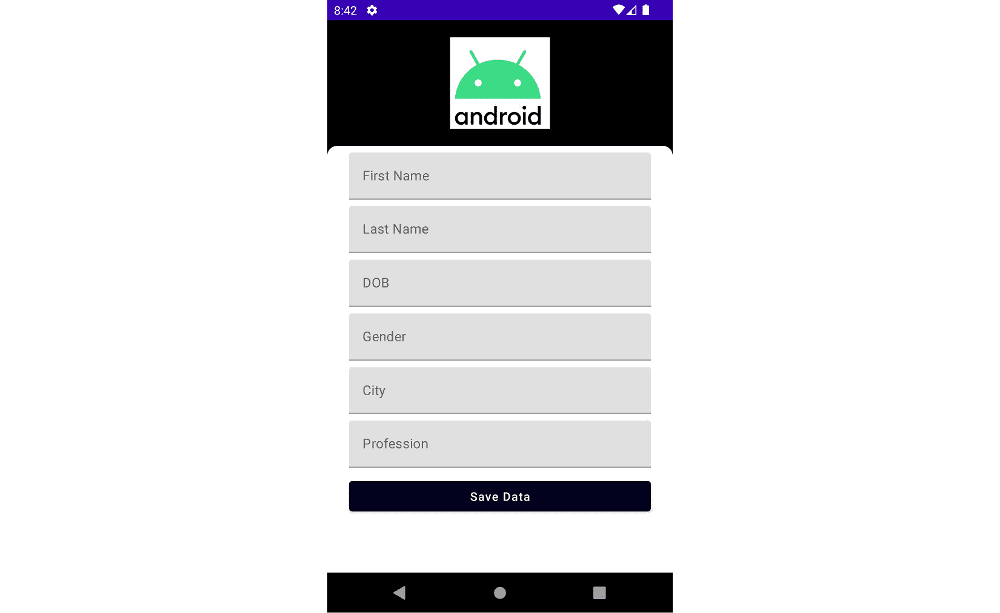
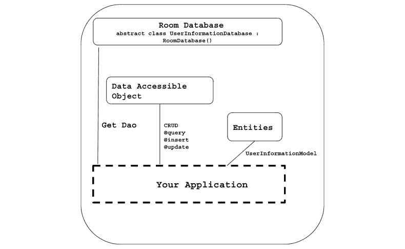
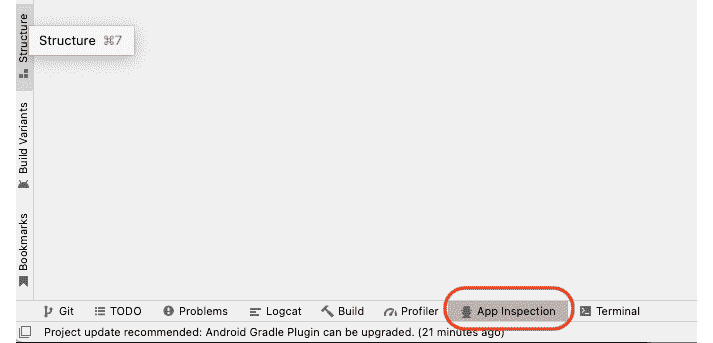
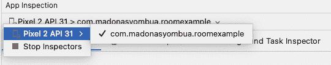
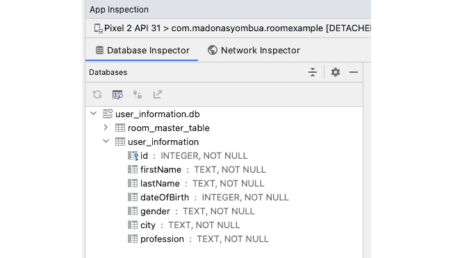
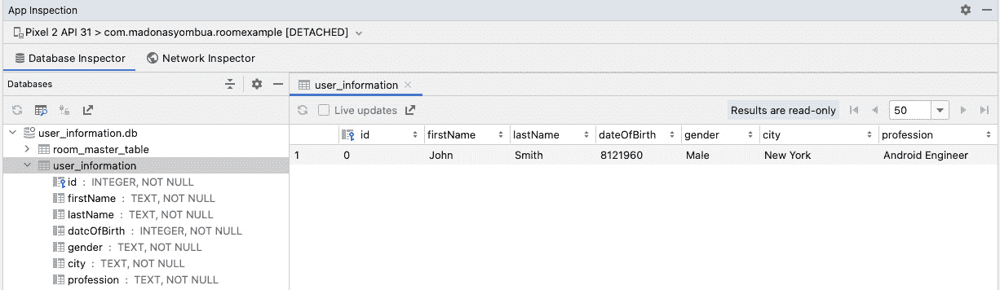
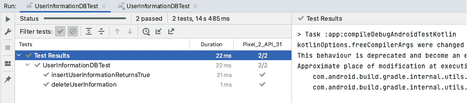

# 使用 Room 数据库和测试

Android 应用程序可以从本地存储数据中显著受益。Room 持久化库利用了 SQLite 的力量。特别是，Room 为 Android 开发者提供了卓越的好处。此外，Room 提供了离线支持，数据是本地存储的。在本章中，我们将学习如何实现 Room，一个 Jetpack 库。

在本章中，我们将介绍以下食谱：

+   在你的应用程序中实现 Room

+   在 Room 中实现依赖注入

+   支持多个实体

+   将现有的 SQL 数据库迁移到 Room

+   测试你的本地数据库

还需要提到的是，还有一些库与 Room 一起使用——例如，RxJava 和分页集成。在本章中，我们不会关注它们，而是专注于如何利用 Room 来构建现代 Android 应用。

# 技术要求

本章节的完整源代码可以在[`github.com/PacktPublishing/Modern-Android-13-Development-Cookbook/tree/main/chapter_six`](https://github.com/PacktPublishing/Modern-Android-13-Development-Cookbook/tree/main/chapter_six)找到。

# 在你的应用程序中实现 Room

Room 是一个用于 Android 数据持久化的对象关系映射库，是现代 Android 开发中推荐的数据持久化方案。此外，它易于使用、理解和维护，并利用了 `SQLiteDatabase` 的功能，同时也有助于减少许多开发者在使用 SQLite 时遇到的样板代码问题。编写测试也非常直接且易于理解。

Room 最显著的优势是它易于与其他架构组件集成，并为开发者提供运行时编译检查——也就是说，如果你在未迁移的情况下犯错或更改了模式，Room 会提出警告，这既实用又有助于减少崩溃。

## 如何操作…

让我们创建一个新的空 Compose 项目，并将其命名为 `RoomExample`。在我们的示例项目中，我们将创建一个用户表单输入；这是用户可以保存他们的名字、姓氏、出生日期、性别、居住的城市以及他们的职业的地方。

我们将在 Room 数据库中保存我们的用户数据，然后稍后检查我们插入的元素是否已保存在我们的数据库中，并在屏幕上显示数据：

1.  在我们新创建的项目中，让我们先删除不必要的 wanted 代码——即，所有空 Compose 项目都包含的 `Greeting(name: String)`，保留预览功能，因为我们将会用它来查看我们创建的屏幕。

1.  现在，让我们继续添加 Room 所需的依赖并同步项目。我们将在*第十二章*中介绍如何使用`buildSrc`进行依赖管理，*Android Studio 技巧和窍门，帮助你开发过程中*。你可以在[`developer.android.com/jetpack/androidx/releases/room`](https://developer.android.com/jetpack/androidx/releases/room)找到 Room 的最新版本；我们将添加`kapt`，代表**Kotlin Annotation Processing Tool**，以使我们能够使用 Java 注解处理器与 Kotlin 代码一起使用：

    ```kt
    dependencies {
    ```

    ```kt
    implementation "androidx.Room:Room-runtime:2.x.x"
    ```

    ```kt
    kapt "androidx.Room:Room-compiler:2.x.x"
    ```

    ```kt
    }
    ```

    ```kt
    //include kapt on your plugins
    ```

    ```kt
    plugins {
    ```

    ```kt
        id 'kotlin-kapt'
    ```

    ```kt
    }
    ```

1.  创建一个新的包并命名为`data`。在`data`内部创建一个新的 Kotlin 类并命名为`UserInformationModel()`。数据类用于仅保存数据——在我们的案例中，我们将从用户那里收集的数据类型将是名字、姓氏、出生日期等等。

1.  通过使用 Room，我们使用`@Entity`注解给我们的模型一个表名；因此，在我们的新创建的`UserInformation`类中，让我们继续添加`@Entity`注解并称我们的表为用户信息：

    ```kt
    @Entity(tableName = "user_information")
    ```

    ```kt
    data class UserInformationModel(
    ```

    ```kt
        val id: Int = 0,
    ```

    ```kt
        val firstName: String,
    ```

    ```kt
        val lastName: String,
    ```

    ```kt
        val dateOfBirth: Int,
    ```

    ```kt
        val gender: String,
    ```

    ```kt
        val city: String,
    ```

    ```kt
        val profession: String
    ```

    ```kt
    )
    ```

1.  接下来，就像所有数据库一样，我们需要为我们的数据库定义一个主键。因此，在我们的 ID 中，我们将添加`@PrimaryKey`注解来告诉 Room 这是我们主键，并且应该自动生成。如果你不希望自动生成，你可以将布尔值设置为`false`，但这可能不是一个好主意，因为可能会在数据库中引起冲突：

    ```kt
    @PrimaryKey(autoGenerate = true)
    ```

1.  现在，你应该有一个具有表名、主键和你的数据类型的实体：

    ```kt
    import androidx.Room.Entity
    ```

    ```kt
    import androidx.Room.PrimaryKey
    ```

    ```kt
    @Entity(tableName = "user_information")
    ```

    ```kt
    data class UserInformationModel(
    ```

    ```kt
        @PrimaryKey(autoGenerate = true)
    ```

    ```kt
        val id: Int = 0,
    ```

    ```kt
        ...
    ```

    ```kt
    )
    ```

在我们的数据包内部，让我们继续创建一个新的包并命名为`DAO`，代表`UserInformationDao`；这个接口将包含**创建**、**读取**、**更新**和**删除**（**CRUD**）功能——即**更新**、**插入**、**删除**和**查询**。

我们还必须在我们的接口上使用`@Dao`注解来告诉 Room 这是我们自己的 DAO。我们在更新和插入函数上使用`OnConflictStrategy.REPLACE`来帮助我们处理可能在我们数据库中遇到的冲突情况。在这种情况下，`OnConflictStrategy`意味着如果`Insert`有相同的 ID，它将用特定的 ID 替换该数据：

```kt
private const val DEFAULT_USER_ID = 0
@Dao
interface UserInformationDao {
    @Query("SELECT * FROM user_information")
    fun getUsersInformation():
        Flow<List<UserInformationModel>>
    @Query("SELECT * FROM user_information WHERE id =
        :userId")
    fun loadAllUserInformation(userId: Int =
        DEFAULT_USER_ID): Flow<UserInformationModel>
    @Insert(onConflict = OnConflictStrategy.REPLACE)
    suspend fun insertUserInformation(userInformation:
        UserInformationModel)
    @Update(onConflict = OnConflictStrategy.REPLACE)
    suspend fun updateUserInformation(userInformation:
        UserInformationModel)
    @Delete
    suspend fun deleteUserInformation(userInformation:
        UserInformationModel)
}
```

1.  现在我们有了实体和 DAO，我们最终将创建一个`Database`类，它扩展了`RoomDatabase()`。在这个类中，我们将使用`@Database`注解，传入我们创建的实体，即`UserInformation`实体，并给我们的数据库一个版本名称，目前是`one`。我们还将指定是否应该导出我们的数据库模式。所以，让我们继续创建`Database`抽象类：

    ```kt
    @Database(entities = [UserInformation::class], version = 1, exportSchema = false)
    ```

    ```kt
    abstract class UserInformationDatabase : RoomDatabase() {
    ```

    ```kt
        abstract fun userInformationDao():
    ```

    ```kt
            UserInformationDao
    ```

    ```kt
    }
    ```

1.  最后，我们已经设置了`Room`并准备好了。现在，我们需要添加依赖注入和用户界面；你可以在*技术要求*部分找到代码。此外，UI 在这个阶段相当基础；你可以将其作为一个挑战来改进，因为这个示例项目只是为了演示目的。



图 6.1 – 应用程序的 UI

## 它是如何工作的…

现代安卓开发 Room 库有三个重要的 Room 数据库组件：

+   实体

+   DAO

+   数据库

`Entity` 是数据库中的一个表。Room 为每个带有 `@Entity` 注解的类生成一个表；如果你之前使用过 Java，你可以把实体想象成 **普通的 Java 对象**（**POJO**）。实体类通常很小，不包含任何逻辑，只持有对象的数据类型。

将数据库中的表映射的一些重要注解是外键、索引、主键和表名。还有其他重要的注解，例如 `ColumnInfo`，它提供了列信息，以及 `Ignore`，如果使用它，你希望忽略的任何数据将不会被 Room 持久化。



图 6.2 – Room DAO

`@DAO` 定义了访问数据库的函数。把它想象成 CRUD；如果你在 Room 之前使用过 SQLite，这类似于使用游标对象。最后，`@Database` 包含数据库函数，并作为任何底层连接到我们应用程序关系数据的入口点。

如果需要使用这个功能，你可以用 `@Database` 进行注释，就像我们在数据库类中做的那样。此外，这个类扩展了 `RoomDatabase` 并包含了我们创建的实体列表。它还包含了一个我们创建的抽象方法，没有参数，并返回我们用 `@Dao` 注释的类。我们通过调用 `Room.databaseBuilder()` 来运行数据库。

# 在 Room 中实现依赖注入

与其他食谱一样，依赖注入至关重要，在这个食谱中，我们将介绍我们如何注入 `DatabaseModule` 并提供所需的 Room 数据库。

## 准备工作

为了能够一步一步地跟随这个食谱，你需要先了解 Hilt 的工作原理。

## 如何做…

打开 `RoomExample` 项目并添加 Hilt，这是我们用于依赖注入的库。在 *第三章*，*在 Jetpack Compose 中处理 UI 状态和使用 Hilt*，我们介绍了 Hilt，所以这里我们不会讨论它，但会展示你如何与 Room 一起使用它：

1.  打开你的项目并添加必要的 Hilt 依赖。参见 *第三章*，*在 Jetpack Compose 中处理 UI 状态和使用 Hilt*，如果你需要帮助设置 Hilt 或访问 [`dagger.dev/hilt/`](https://dagger.dev/hilt/)。

1.  接下来，让我们添加我们的 `@HiltAndroidApp` 类，并在 `Manifest` 文件夹中添加我们的 `HiltAndroidApp` 的名称，在我们的例子中，是 `UserInformation`：

    ```kt
    @HiltAndroidApp
    ```

    ```kt
    class UserInformation : Application()
    ```

    ```kt
    <application
    ```

    ```kt
        android:allowBackup="true"
    ```

    ```kt
        android:name=".UserInformation"
    ```

    ```kt
        tools:targetApi="33">
    ```

    ```kt
    ...
    ```

1.  现在我们有了依赖注入，让我们在 `MainActivity` 类中添加 `@AndroidEntryPoint`，并在我们的项目中创建一个新的包，命名为 `di`。在里面，我们将创建一个新的类，`DatabaseModule`，并添加我们的功能。

1.  在`DatabaseModule`中，让我们继续创建一个`provideDatabase()`函数，我们将返回`Room`对象，添加数据库名称，并确保我们构建了数据库：

    ```kt
    @Module
    ```

    ```kt
    @InstallIn(SingletonComponent::class)
    ```

    ```kt
    class DataBaseModule {
    ```

    ```kt
        @Singleton
    ```

    ```kt
        @Provides
    ```

    ```kt
        fun provideDatabase(@ApplicationContext context:
    ```

    ```kt
        Context): UserInformationDatabase {
    ```

    ```kt
            return Room.databaseBuilder(
    ```

    ```kt
                context,
    ```

    ```kt
                UserInformationDatabase::class.java,
    ```

    ```kt
                "user_information.db"
    ```

    ```kt
            ).build()
    ```

    ```kt
        }
    ```

    ```kt
        @Singleton
    ```

    ```kt
        @Provides
    ```

    ```kt
        fun provideUserInformationDao(
    ```

    ```kt
        userInformationDatabase: UserInformationDatabase):
    ```

    ```kt
        UserInformationDao {
    ```

    ```kt
            return
    ```

    ```kt
              userInformationDatabase.userInformationDao()
    ```

    ```kt
        }
    ```

    ```kt
    }
    ```

1.  现在我们已经设置了依赖注入数据库模块，我们现在可以开始添加服务，这些服务是帮助我们向数据库添加用户信息并从数据库获取用户信息的函数。因此，让我们继续创建一个新的包，名为`service`。在包内部，创建一个新的接口，`UserInfoService`，并添加上述两个函数：

    ```kt
    interface UserInfoService {
    ```

    ```kt
        fun getUserInformationFromDB():
    ```

    ```kt
            Flow<UserInformation>
    ```

    ```kt
        suspend fun addUserInformationInDB(
    ```

    ```kt
            userInformation: UserInformation)
    ```

    ```kt
    }
    ```

1.  由于`UserInfoService`是一个接口，我们需要在我们的`Impl`类中实现这些功能，因此现在让我们继续创建一个新的类，名为`UserInfoServiceImpl`，以及一个单例类，然后实现接口：

    ```kt
    @Singleton
    ```

    ```kt
    class UserInfoServiceImpl() : UserInfoService {
    ```

    ```kt
        override fun getUserInformationFromDB():
    ```

    ```kt
            Flow<UserInformation> {
    ```

    ```kt
                TODO("Not yet implemented")
    ```

    ```kt
        }
    ```

    ```kt
        override suspend fun addUserInformationInDB(
    ```

    ```kt
            userInformation: UserInformation) {
    ```

    ```kt
                TODO("Not yet implemented")
    ```

    ```kt
        }
    ```

    ```kt
    }
    ```

1.  我们需要注入构造函数并传递`UserInformationDao()`，因为我们将会使用插入函数来插入用户数据：

    ```kt
    class UserInfoServiceImpl @Inject constructor(
    ```

    ```kt
    private val userInformationDao: UserInformationDao
    ```

    ```kt
    ): UserInfoService
    ```

1.  现在，我们需要在我们的函数中添加代码，这些函数中有 TODO。让我们先看看用户信息。使用`userInformationDao`，我们将调用插入函数来告诉 Room 我们想要插入这条用户信息：

    ```kt
    override suspend fun addUserInformationInDB(
    ```

    ```kt
    userInformation: UserInformation) {
    ```

    ```kt
        userInformationDao.insertUserInformation(
    ```

    ```kt
            UserInformation(
    ```

    ```kt
                firstName = userInformation.firstName,
    ```

    ```kt
                lastName = userInformation.lastName,
    ```

    ```kt
                dateOfBirth = userInformation.dateOfBirth,
    ```

    ```kt
                gender = userInformation.gender,
    ```

    ```kt
                city = userInformation.city,
    ```

    ```kt
                profession = userInformation.profession
    ```

    ```kt
            )
    ```

    ```kt
        )
    ```

    ```kt
    }
    ```

1.  然后，我们需要从数据库中获取用户信息；这将可视化用户数据在屏幕上：

    ```kt
    override fun getUserInformationFromDB() =
    ```

    ```kt
        userInformationDao.getUsersInformation().filter {
    ```

    ```kt
            information -> information.isNotEmpty()
    ```

    ```kt
        }.flatMapConcat {
    ```

    ```kt
            userInformationDao.loadAllUserInformation()
    ```

    ```kt
                .map { userInfo ->
    ```

    ```kt
                    UserInfo(
    ```

    ```kt
                        id = userInfo.id,
    ```

    ```kt
                        firstName = userInfo.firstName,
    ```

    ```kt
                        lastName = userInfo.lastName,
    ```

    ```kt
                        dateOfBirth =
    ```

    ```kt
                            userInfo.dateOfBirth,
    ```

    ```kt
                        gender = userInfo.gender,
    ```

    ```kt
                        city = userInfo.city,
    ```

    ```kt
                        profession = userInfo.profession
    ```

    ```kt
                    )
    ```

    ```kt
                }
    ```

    ```kt
        }
    ```

1.  最后，我们需要确保通过依赖注入提供实现，因此现在让我们继续添加前面的代码，然后清理项目，运行它，并确保一切按预期工作：

    ```kt
    @Module
    ```

    ```kt
    @InstallIn(SingletonComponent::class)
    ```

    ```kt
    abstract class UserInfoServiceModule {
    ```

    ```kt
        @Singleton
    ```

    ```kt
        @Binds
    ```

    ```kt
        abstract fun bindUserService(
    ```

    ```kt
            userInfoServiceImpl: UserInfoServiceImpl):
    ```

    ```kt
                UserInfoService
    ```

    ```kt
    }
    ```

1.  一旦运行项目，你应该能够看到它无问题地启动。我们将继续在我们的`ViewModel`中添加一个函数来将数据插入我们的数据库；`ViewModel`将在我们创建的视图中使用：

    ```kt
    @HiltViewModel
    ```

    ```kt
    class UserInfoViewModel @Inject constructor(
    ```

    ```kt
        private val userInfoService: UserInfoService
    ```

    ```kt
    ) : ViewModel() {
    ```

    ```kt
        fun saveUserInformationData(userInfo: UserInfo) {
    ```

    ```kt
            viewModelScope.launch {
    ```

    ```kt
                userInfoService.addUserInformationInDB(
    ```

    ```kt
                    userInfo)
    ```

    ```kt
            }
    ```

    ```kt
        }
    ```

    ```kt
    }
    ```

1.  现在，我们可以检查数据库，看它是否正确创建。运行应用，一旦在 IDE 中准备就绪，点击**应用检查**，如图**图 6.3**所示。你应该能够打开数据库检查器。



图 6.3 – 应用检查

1.  一旦数据库检查器加载完毕，你应该能够选择当前运行的 Android 模拟器，如图**图 6.4**所示：



图 6.4 – 用于应用检查的选定应用

1.  在**图 6.5**中，你可以看到数据库检查器已打开，以及我们的数据库。



图 6.5 – 我们的 user_information 数据库

1.  在**图 6.6**中，你可以看到我们插入的数据被显示出来，这意味着我们的插入函数按预期工作。



图 6.6 – 我们的数据库

## 它是如何工作的…

在这个菜谱中，我们选择使用依赖注入来提供所需依赖给特定类。我们在前面的章节中深入介绍了依赖注入是什么，所以在这个菜谱中我们不再解释它，而是讨论我们创建的模块。

我们在 Hilt 中使用了 `@Singleton` 注解来指示 `provideDatabase`，它提供 Room 的实例，应在应用程序的生命周期内只创建一次，并且这个实例应该被所有依赖它的组件共享。此外，当您使用 `@Singleton` 注解一个类或绑定方法时，Hilt 确保只创建该类或对象的单个实例，并且所有需要该对象的组件都将接收到相同的实例。

重要的是要知道，当我们使用 Hilt 中的 `@Singleton` 时，它与软件设计中的 Singleton 模式并不相同，这可能会引起混淆。Hilt 的 `@Singleton` 只保证在特定组件层次结构上下文中创建一个类的单个实例。

在我们的项目中，我们创建了 `DatabaseModule()` 和 `UserInfoServiceModule()`。在 `DatabaseModule()` 类中，我们有两个函数，`provideDatabase` 和 `provideUserInformationDao`。第一个函数 `provideDatabase` 返回 `UserInformationDatabase` Room 实例，在那里我们可以创建数据库并构建它：

```kt
fun provideDatabase(@ApplicationContext context: Context): UserInformationDatabase {
    return Room
        .databaseBuilder(context,
            UserInformationDatabase::class.java,
            "user_information.db")
        .build()
}
```

在 `provideUserInformationDao` 中，我们在构造函数中传递 `UserInformationDatabase` 并返回 `UserInformationDao` 抽象类：

```kt
fun provideUserInformationDao(userInformationDatabase: UserInformationDatabase): UserInformationDao {
    return userInformationDatabase.userInformationDao()
}
```

重要提示

如果您在迁移时想要丢失现有数据，或者您的迁移路径缺失，您可以在创建数据库时使用 `.fallbackToDestructiveMigration()` 函数。

## 相关内容

在 Room 中还有更多东西要学习，这个配方只为您提供了一个关于您可以做什么的简要概述。您可以通过点击[`developer.android.com/reference/androidx/room/package-summary`](https://developer.android.com/reference/androidx/room/package-summary)中的链接来了解更多信息。

# 在 Room 中支持多个实体

在这个配方中，您将学习如何在 Room 中处理多个实体。这在您有一个需要不同数据输入的大项目时非常有用。我们可以一起工作的一个很好的例子是一个预算应用程序。

在 Room 中支持多个实体，您需要定义多个类来表示您的数据库表。每个类都应该有自己的注解和字段，这些字段对应于表中的列。例如，一个预算应用程序可能需要不同类型的模型，如下所示：

+   `BudgetData`

+   `ExpenseData`

+   `ExpenseItem`

因此，有时拥有多个实体是必要的，了解如何处理这一点会很有帮助。

## 准备工作

要跟随这个配方，您必须完成之前的配方。

## 如何操作 …

您可以使用您选择的任何项目来实现本配方中讨论的主题。此外，您还可以将此示例用于您现有的项目来实现该主题。

1.  在 `RoomExample` 中，您可以向应用程序添加更多功能并尝试添加更多实体，但在这个项目中，让我们继续展示如何在 Room 中处理多个实体。

1.  在本例中，我们将使用我们在前一章中介绍的示例预算应用程序，并且由于我们正在处理实体，这将更容易理解。让我们创建一个新的实体，并将其命名为`BudgetData`；预算数据类可能包含多个字段，例如`budgetName`、`budgetAmount`、`expenses`、`startDate`、`endDate`、`notify`、`currency`和`totalExpenses`；因此，我们的`BudgetData`数据类将看起来像这样：

    ```kt
    @Entity(tableName = "budgets")
    ```

    ```kt
    data class BudgetData(
    ```

    ```kt
        @PrimaryKey(autoGenerate = true)
    ```

    ```kt
        var id: Int = 0,
    ```

    ```kt
        var budgetName: String = "",
    ```

    ```kt
        var budgetAmount: Double = 0.0,
    ```

    ```kt
        var expenses: String = "",
    ```

    ```kt
        var startDate: String = "",
    ```

    ```kt
        var endDate: String = "",
    ```

    ```kt
        var notify: Int = 0,
    ```

    ```kt
        var currency: String = "",
    ```

    ```kt
        var totalExpenses: Double
    ```

    ```kt
    )
    ```

1.  让我们继续添加两个更多实体。首先，我们将添加`ExpenseData`，它可能包含以下字段和类型：

    ```kt
    @Entity(tableName = "expenses")
    ```

    ```kt
    data class ExpenseData(
    ```

    ```kt
        @PrimaryKey(autoGenerate = true)
    ```

    ```kt
        var id: Int = 0,
    ```

    ```kt
        var expenseName: String = "",
    ```

    ```kt
        var expenseType: String = "",
    ```

    ```kt
        var expenseAmount: Double = 0.0,
    ```

    ```kt
        @ColumnInfo(name = "updated_at")
    ```

    ```kt
        var expenseDate: String = "",
    ```

    ```kt
        var note: String = "",
    ```

    ```kt
        var currency: String = ""
    ```

    ```kt
    )
    ```

1.  然后，让我们添加`ExpenseItem`，它可能包含以下字段：

    ```kt
    @Entity(tableName = "items")
    ```

    ```kt
    Data class ExpenseItem(
    ```

    ```kt
        @PrimaryKey(autoGenerate = true)
    ```

    ```kt
        private var _id: Int
    ```

    ```kt
        val name: String
    ```

    ```kt
        var type: String?
    ```

    ```kt
        val imageContentId: Int
    ```

    ```kt
        val colorContentId: Int)
    ```

1.  如你所见，我们有三个实体；基于这些实体，你应该为每个实体创建不同的 DAO：

    ```kt
    abstract class AppDatabase : RoomDatabase() {
    ```

    ```kt
        abstract fun budgetDao(): BudgetDao
    ```

    ```kt
        abstract fun itemDao(): ItemDao
    ```

    ```kt
        abstract fun expenseDao(): ExpenseDao
    ```

    ```kt
    }
    ```

1.  在`AppDatabase`抽象类的顶部，我们将使用`@Database`注解并传递给所有我们的实体：

    ```kt
    @Database(
    ```

    ```kt
        entities = [ExpenseItem::class, BudgetData::class,
    ```

    ```kt
            ExpenseData::class],
    ```

    ```kt
        version = 1
    ```

    ```kt
    )
    ```

    ```kt
    @TypeConverters(DateConverter::class)
    ```

    ```kt
    abstract class AppDatabase : RoomDatabase() {
    ```

    ```kt
        abstract fun budgetDao(): BudgetDao
    ```

    ```kt
        abstract fun itemDao(): ItemDao
    ```

    ```kt
        abstract fun expenseDao(): ExpenseDao
    ```

    ```kt
    }
    ```

1.  你也可以使用嵌套对象；`@Embedded`注解包括实体内的嵌套或相关实体。它允许你通过在父实体中嵌入一个或多个相关实体来表示实体之间的关系：

    ```kt
    data class ExpenseItem(
    ```

    ```kt
    ...
    ```

    ```kt
        @Embedded val tasks: Tasks
    ```

    ```kt
      )
    ```

    ```kt
    data class Tasks(...)
    ```

在我们前面的例子中，我们在`ExpenseItem`实体的任务属性上使用了`@Embedded`注解。这告诉 Room 将`Tasks`数据类的字段包含在`ExpenseItem`表中，而不是为我们的`ExpenseItem`实体创建一个单独的表。

1.  然后，`Tasks`数据类可以包含`description`、`priority`、`updatedAt`和 ID：

    ```kt
    data class Tasks (
    ```

    ```kt
        @PrimaryKey(autoGenerate = true)
    ```

    ```kt
        var id = 0
    ```

    ```kt
        var description: String
    ```

    ```kt
        var priority: Int
    ```

    ```kt
        @ColumnInfo(name = "updated_at")
    ```

    ```kt
        var updatedAt: Date)
    ```

因此，表示`ExpenseItem`对象的表将包含具有新添加字段的附加列。

就这样；一旦你在数据库中声明了实体并将它们作为所需内容传递，你将在你的`Database`中支持多个实体。

重要提示

如果你的实体有多个相同类型的嵌套字段，你可以通过设置`Prefix`属性来保持每个列的唯一性；然后，Room 将在嵌套对象中的每个列名前添加提供的值。更多信息请参阅[`developer.android.com/`](https://developer.android.com/).

## 它是如何工作的...

根据 Room 的规则，你可以以三种不同的方式定义实体关系。

+   一对多关系或多对一关系

+   一对一关系

+   多对多关系

正如你所见，在一个类中使用实体使其易于管理和跟踪；因此，这对于 Android 工程师来说是一个极好的解决方案。一个值得注意的注解是`@Relation`，它指定了创建显示实体之间关系的对象的位置。

## 还有更多...

在 Room 中还有更多东西要学习——例如，定义对象之间的关系、编写异步数据可访问对象查询以及引用复杂数据。可以说，我们不可能在一章中涵盖所有内容，但我们可以提供一些指导，帮助您导航构建现代 Android 应用程序。有关 Room 的更多信息，请访问 [`developer.android.com/training/data-storage/room`](https://developer.android.com/training/data-storage/room)。

# 将现有的 SQL 数据库迁移到 room

如我们之前提到的，Room 确实利用了 SQLite 的力量，并且由于许多应用程序仍在使用遗留版本，您可能会发现一些应用程序仍在使用 SQL，并想知道如何迁移到 Room 并利用最新的 Room 功能。

在这个菜谱中，我们将通过逐步示例来介绍将现有的 SQL 数据库迁移到 Room。此外，Room 提供了一个抽象层来帮助处理 SQLite 迁移——也就是说，通过向开发者提供 `Migration` 类。

## 如何操作...

由于我们没有创建一个新的 SQLite 数据库示例，因为那不是必要的，我们将尝试使用一个虚拟的样本 SQLite 数据库来模拟场景，展示如何将现有的 SQLite 数据库迁移到 Room：

1.  由于我们将在现有的 SQLite 项目中添加 Room，您需要确保添加所需的依赖项。要设置此环境，请参考 *在您的应用程序中实现 Room* 菜谱。

1.  接下来，您需要继续创建一个新的 DAO 和实体，因为 Room 要求这样做。因此，在第一个 Room 菜谱的后续步骤中，您可以更新模型类为实体。这相当简单，因为您主要需要做的是用 `@Entity` 注解类，并使用 `@Database` 注解中的 `table` 属性来设置表名。

1.  您还必须为实体类添加 `@PrimaryKey` 和 `@ColumnInfo` 注解。以下是一个样本 SQLite 数据库：

    ```kt
    fun onCreate(db: SQLiteDatabase) {
    ```

    ```kt
        // Create a String that contains the SQL statement
    ```

    ```kt
           to create the items table
    ```

    ```kt
        val SQL_CREATE_ITEMS_TABLE =(
    ```

    ```kt
                "CREATE TABLE " + ItemsContract.ItemsEntry
    ```

    ```kt
                         .TABLE_NAME.toString() + " ("
    ```

    ```kt
                         + ItemsContract.ItemsEntry.
    ```

    ```kt
                         _Id.toString()
    ```

    ```kt
                         + " INTEGER PRIMARY KEY
    ```

    ```kt
                         AUTOINCREMENT, "
    ```

    ```kt
                         + ItemsContract.ItemsEntry
    ```

    ```kt
                         .COLUMN_ITEM_NAME.toString()
    ```

    ```kt
                         + " TEXT NOT NULL, "
    ```

    ```kt
                         + ItemsContract.ItemsEntry
    ```

    ```kt
                         .COLUMN_ITEM_TYPE.toString()
    ```

    ```kt
                         + " TEXT NOT NULL, "
    ```

    ```kt
                         + ItemsContract.ItemsEntry
    ```

    ```kt
                         .COLUMN_ITEM_LOGO.toString()
    ```

    ```kt
                         + " INTEGER NOT NULL DEFAULT 0, "
    ```

    ```kt
                         + ItemsContract.ItemsEntry
    ```

    ```kt
                         .COLUMN_ITEM_COLOR.toString()
    ```

    ```kt
                         + " INTEGER NOT NULL DEFAULT 0, "
    ```

    ```kt
                         + ItemsContract.ItemsEntry
    ```

    ```kt
                         .COLUMN_ITEM_CREATED_DATE
    ```

    ```kt
                         .toString() + " DATE NOT NULL
    ```

    ```kt
                         DEFAULT CURRENT_TIMESTAMP);")
    ```

    ```kt
        // Execute the SQL statement
    ```

    ```kt
        db.execSQL(SQL_CREATE_ITEMS_TABLE)
    ```

    ```kt
    }
    ```

然而，Room 简化了这个过程，我们不再需要创建 `Contracts`。在 Android 中，`Contracts` 是开发者定义并强制执行一组规则以访问应用程序中数据的方式。这些合约通常定义数据库表的结构和模式，以及其中数据的预期数据类型和格式。在 Android 的 SQLite 情况下，合约通常用于定义数据库的表和列，以及它们之间任何约束或关系。

1.  一旦我们创建了所有需要的实体和 DAO，我们就可以继续创建数据库。正如我们在 *在您的应用程序中实现 Room* 菜谱中看到的，我们可以在 `@Database` 注解中添加所有我们的实体，并且由于我们处于第一个 `(1)` 版本，我们可以将版本增加到 (`2`)：

    ```kt
    val MIGRATION_1_2 = object : Migration(1, 2) {
    ```

    ```kt
        override fun migrate(database:
    ```

    ```kt
        SupportSQLiteDatabase) {
    ```

    ```kt
            //alter items table
    ```

    ```kt
            database.execSQL("CREATE TABLE new_items (_id
    ```

    ```kt
                INTEGER PRIMARY KEY AUTOINCREMENT NOT
    ```

    ```kt
                NULL, name TEXT NOT NULL, type TEXT,
    ```

    ```kt
                imageContentId INTEGER NOT NULL,
    ```

    ```kt
                colorContentId INTEGER NOT NULL)")
    ```

    ```kt
            database.execSQL("INSERT INTO new_items
    ```

    ```kt
                (_id,name,type,imageContentId,
    ```

    ```kt
                colorContentId)Select_id,name,type,
    ```

    ```kt
                imageContentId, colorContentId FROM
    ```

    ```kt
                items")
    ```

    ```kt
            database.execSQL("DROP TABLE items")
    ```

    ```kt
            database.execSQL("ALTER TABLE new_items RENAME
    ```

    ```kt
                TO items")
    ```

    ```kt
        }
    ```

1.  然后，重要的是确保我们调用 `build()` 方法到 Room 数据库：

    ```kt
    Room.databaseBuilder(
    ```

    ```kt
        androidContext(),
    ```

    ```kt
        AppDatabase::class.java, "budget.db"
    ```

    ```kt
    )
    ```

    ```kt
        .addCallback(object : RoomDatabase.Callback() {
    ```

    ```kt
            override fun
    ```

    ```kt
            onCreate(db:SupportSQLiteDatabase){
    ```

    ```kt
                super.onCreate(db)
    ```

    ```kt
            }
    ```

    ```kt
        })
    ```

    ```kt
        .addMigrations(MIGRATION_1_2)
    ```

    ```kt
        .build()
    ```

1.  一旦你的数据层开始使用 Room，你可以正式用 DAO 调用替换所有的`Cursor`和`ContentValue`代码。在我们的`AppDatabase`类中，我们有我们的实体，并且我们的类扩展了`RoomDatabase()`：

    ```kt
    @Database(
    ```

    ```kt
        entities = [<List of entities>],
    ```

    ```kt
        version = 2
    ```

    ```kt
    )
    ```

    ```kt
    abstract class AppDatabase : RoomDatabase() {
    ```

    ```kt
        abstract fun itemDao(): ItemDao
    ```

    ```kt
    }
    ```

因为 Room 提供了运行时错误，如果发生任何错误，你将在 Logcat 中收到通知。

1.  公平地说，并不是所有内容都可以在一个菜谱中涵盖，因为 SQLite 确实需要很多代码来设置——例如，创建查询和处理游标——但 Room 有助于加快这些过程，这就是为什么它被强烈推荐。

## 它是如何工作的...

如前所述，迁移复杂的数据库可能会很繁琐，需要谨慎，因为它如果没有经过彻底测试就推送到生产环境，可能会影响用户。还强烈建议使用`RoomDatabase`暴露的`OpenHelper`，以实现数据库的更直接或最小更改。此外，值得一提的是，如果你有任何使用 SQLite 的遗留代码，它将用 Java 在高级别编写，因此需要与团队合作，找到更好的迁移解决方案。

在你的项目中，你必须更新扩展`SQLiteOpenHelper`的类。我们使用`SupportSQLiteDatabase`是因为我们需要更新获取可写和可读数据库的调用。这是一个更干净的数据库抽象类，用于插入和查询数据库。

重要提示

重要的一点是，迁移到一个具有许多表和复杂查询的复杂数据库可能会很复杂。然而，如果你的数据库具有少量表且没有复杂查询，迁移可以通过在功能分支中进行相对较小的增量更改快速完成。下载应用程序的数据库可能会有所帮助，你可以通过访问以下链接来完成：[`developer.android.com/training/data-storage/room/testing-db#command-line`](https://developer.android.com/training/data-storage/room/testing-db#command-line)。

# 测试你的本地数据库

到目前为止，我们已经确保在必要时为我们的项目编写测试。现在，我们需要继续编写`RoomExample`项目的测试，因为这是至关重要的，你可能在现实世界的场景中需要这样做。因此，在这个菜谱中，我们将查看编写数据库 CRUD 测试的逐步指南。

## 准备工作

你需要打开`RoomExample`项目来开始这个菜谱。

## 如何做到这一点...

让我们首先添加所有需要的 Room 测试依赖项，然后开始编写测试。对于 Hilt 测试设置，请参阅*技术要求*部分，在那里你可以找到所有所需的代码：

1.  你需要将以下内容添加到你的`build.gradle`中：

    ```kt
    androidTestImplementation "com.google.truth:truth:1.1.3"
    ```

    ```kt
    androidTestImplementation "android.arch.core:core-testing:1.1.1"
    ```

1.  在你已经在 Android 测试中添加了所需的依赖项之后，继续创建一个新的类，命名为`UserInformationDBTest`：

    ```kt
    class UserInformationDBTest {...}
    ```

1.  在我们能够设置`@Before`函数之前，我们需要创建两个`lateinit var`实例，我们将在`@Before`函数中初始化它们：

    ```kt
    private lateinit var database: UserInformationDatabase
    ```

    ```kt
    private lateinit var userInformationDao: UserInformationDao
    ```

1.  现在，让我们继续设置我们的 `@Before` 函数并创建我们的数据库，使用内存数据库进行测试目的：

    ```kt
    @Before
    ```

    ```kt
    fun databaseCreated() {
    ```

    ```kt
        database = Room.inMemoryDatabaseBuilder(
    ```

    ```kt
            ApplicationProvider.getApplicationContext(),
    ```

    ```kt
                UserInformationDatabase::class.java
    ```

    ```kt
        )
    ```

    ```kt
            .allowMainThreadQueries()
    ```

    ```kt
            .build()
    ```

    ```kt
        userInformationDao = database.userInformationDao()
    ```

    ```kt
    }
    ```

1.  由于我们是在内存中运行和创建数据库，所以在完成后我们需要关闭它；因此，在我们的 `@After` 调用中，我们需要在我们的数据库上调用 `close()`：

    ```kt
    @After
    ```

    ```kt
    fun closeDatabase() {
    ```

    ```kt
        database.close()
    ```

    ```kt
    }
    ```

1.  现在我们设置完成，我们将继续开始测试我们的 CRUD 操作——即插入、删除和更新。让我们先创建一个插入测试：

    ```kt
    @Test
    ```

    ```kt
    fun insertUserInformationReturnsTrue() = runBlocking {
    ```

    ```kt
        val userOne = UserInformationModel(
    ```

    ```kt
            id = 1,
    ```

    ```kt
            firstName = "Michelle",
    ```

    ```kt
            lastName = "Smith",
    ```

    ```kt
            dateOfBirth = 9121990,
    ```

    ```kt
            gender = "Male",
    ```

    ```kt
            city = "New york",
    ```

    ```kt
            profession = "Software Engineer"
    ```

    ```kt
        )
    ```

    ```kt
        userInformationDao.insertUserInformation(userOne)
    ```

    ```kt
        val latch = CountDownLatch(1)
    ```

    ```kt
        val job = async(Dispatchers.IO) {
    ```

    ```kt
            userInformationDao.getUsersInformation()
    ```

    ```kt
                .collect {
    ```

    ```kt
                    assertThat(it).contains(userOne)
    ```

    ```kt
                    latch.countDown()
    ```

    ```kt
                }
    ```

    ```kt
        }
    ```

    ```kt
        latch.await()
    ```

    ```kt
        job.cancelAndJoin()
    ```

    ```kt
    }
    ```

1.  最后，让我们添加 `delete` 函数，这样就可以暂时完成我们的 Room 测试：

    ```kt
    @Test
    ```

    ```kt
    fun deleteUserInformation() = runBlocking {
    ```

    ```kt
        val userOne = UserInformationModel(
    ```

    ```kt
            id = 1,
    ```

    ```kt
            firstName = "Michelle",
    ```

    ```kt
            lastName = "Smith",
    ```

    ```kt
            dateOfBirth = 9121990,
    ```

    ```kt
            gender = "Male",
    ```

    ```kt
            city = "New york",
    ```

    ```kt
            profession = "Software Engineer"
    ```

    ```kt
        )
    ```

    ```kt
        val userTwo = UserInformationModel(
    ```

    ```kt
            id = 2,
    ```

    ```kt
            firstName = "Mary",
    ```

    ```kt
            lastName = "Simba",
    ```

    ```kt
            dateOfBirth = 9121989,
    ```

    ```kt
            gender = "Female",
    ```

    ```kt
            city = "New york",
    ```

    ```kt
            profession = "Senior Android Engineer"
    ```

    ```kt
        )
    ```

    ```kt
        userInformationDao.insertUserInformation(userOne)
    ```

    ```kt
        userInformationDao.insertUserInformation(userTwo)
    ```

    ```kt
        userInformationDao.deleteUserInformation(userTwo)
    ```

    ```kt
        val latch = CountDownLatch(1)
    ```

    ```kt
        val job = async(Dispatchers.IO) {
    ```

    ```kt
            userInformationDao.loadAllUserInformation()
    ```

    ```kt
                .collect {
    ```

    ```kt
                    assertThat(it).doesNotContain(userTwo)
    ```

    ```kt
                    latch.countDown()
    ```

    ```kt
                }
    ```

    ```kt
        }
    ```

    ```kt
        latch.await()
    ```

    ```kt
        job.cancelAndJoin()
    ```

    ```kt
    }
    ```

1.  当你运行测试时，它们都应该通过，显示绿色的勾号：



图 6.7 – 我们的测试通过

## 它是如何工作的…

你可能已经注意到我们使用了 `Truth`，这是一个提供流畅和表达性 API 以在测试中编写断言的测试框架。它由 Google 开发，使用 `Truth` 的优点包括可读性、灵活性和清晰的错误消息。我们可以轻松地使用更接近自然语言的结构——例如，`isEqualTo` 和 `shouldBe`——这使得测试断言对我们开发者来说更加直观和易于阅读。

当使用框架时，你将获得一系列断言方法，允许你测试各种条件，包括相等性、顺序和包含。它还允许你定义自定义断言方法，这让你对测试行为有更多的控制。

`@Before` 注解确保我们的 `databaseCreated()` 函数在每个类之前执行。然后我们的函数使用 `Room.inMemoryDatabaseBuilder` 创建一个数据库，在 `@After` 调用中，我们将关闭数据库：

```kt
@After
fun closeDatabase() {
    database.close()
}
```

正如你可能看到的，我们的测试在 `AndroidTest` 中，因为我们是在主线程中启动 Room 并在完成后关闭它。测试类仅测试 DAO 函数——即 `Update`、`Insert`、`Delete` 和 `Query`。
