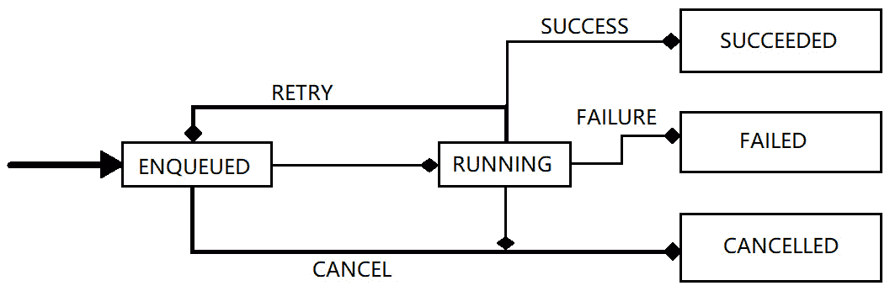
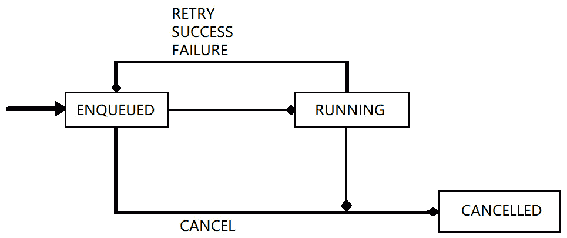
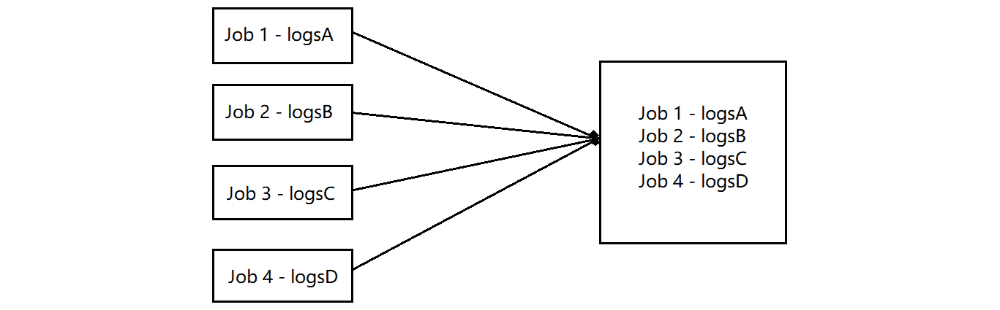
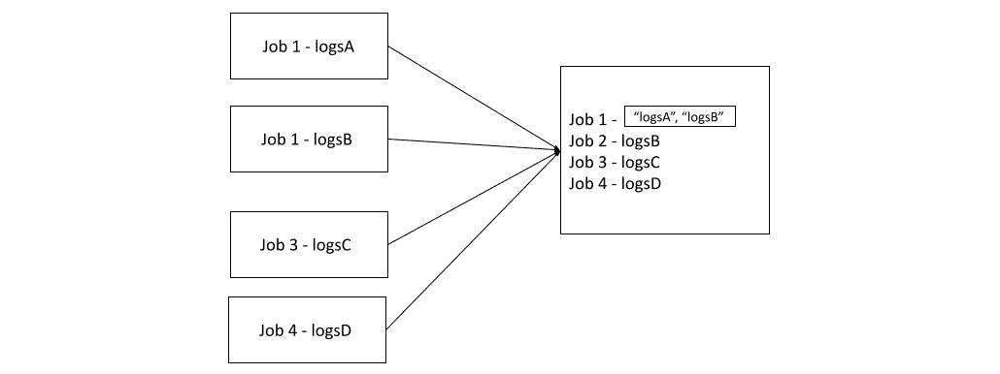

# 开始使用 WorkManager

在 Android 中，`WorkManager` 是 Google 作为 Android Jetpack 库的一部分引入的 API。它是一个强大且灵活的后台任务调度库，允许您在您的应用未运行或设备处于低功耗状态时执行可延迟的异步任务。

`WorkManager` 提供了一个统一的 API 来调度需要在特定时间或特定条件下执行的任务。它负责根据设备空闲状态、网络连接性和电池水平等因素高效地管理和运行任务。

此外，`WorkManager` 允许观察工作状态和链式创建。本章将探讨如何通过示例实现 `WorkManager`，并学习其工作原理及其用例。

在本章中，我们将介绍以下食谱：

+   理解 Jetpack `WorkManager` 库

+   理解 `WorkManager` 状态

+   理解 `WorkManager` 中的线程

+   理解链式和取消工作请求

+   实现从 Firebase `JobDispatcher` 迁移到新推荐 `WorkManager`

+   如何调试 `WorkManager`

+   测试 `Worker` 实现

# 技术要求

本章使用逐步示例，并不创建一个完整的项目。`WorkManager` 非常有用，但由于用例可能不同，利用示例来查看代码如何满足您的需求是学习编程中的一项优秀技能。

# 理解 Jetpack WorkManager 库

**WorkManager** 是最强大的 Jetpack 库之一，用于持久化工作。该 API 允许观察持久状态，并能够创建复杂的工作链。在构建 Android 应用程序时，可能需要您的数据持久化；如果您需要帮助刷新您的知识，可以参考*第六章*，*使用 Room 数据库* *和测试*。

`WorkManager` 是任何后台进程最推荐的 API，并且已知可以处理如图所示的独特类型的工作：

+   **立即执行**：正如其名所示，这些任务是必须立即完成或尽快完成的

+   **长时间运行**：运行时间较长的任务

+   **可延迟的**：可以重新安排的任务，可以分配不同的开始时间，也可以定期运行

您可以使用 `WorkManager` 的更多示例用例包括，例如，如果您的公司想要创建自定义通知、发送分析事件、上传图片、定期同步本地数据与网络，等等。此外，`WorkManager` 是首选的 API，并且强烈推荐，因为它取代了 Android 中所有之前的后台调度 API。

还有其他用于调度工作的 API。它们已被弃用，在这本书中，我们不会介绍它们，但会提及它们，因为您可能在处理遗留代码时遇到它们；它们如下：

+   Firebase Job Dispatcher

+   任务调度器

+   GCM `网络管理器`

+   `WorkManager`

## 准备工作

在这个菜谱中，我们将继续查看一个简单的示例，说明我们如何使用`WorkManager`创建自己的自定义通知。

如果您正在监听任何日志，您也可以使用相同的概念来发送应用程序的日志或报告分析。我们选择这个任务是因为向用户发送通知至关重要，而且大多数应用程序都会这样做，相比之下，上传图片的情况较少。此外，随着 Android 13 和新的 API，请求`android.permission.POST_NOTIFICATIONS`是强制性的。

## 如何操作…

对于这个菜谱，您不需要创建一个项目，因为可以在已经构建的项目中使用这些概念；相反，我们将查看示例，并带解释地走过这些示例：

1.  我们需要确保我们有所需的依赖项：

    ```kt
    implementation "androidx.work:work-runtime-ktx:
    ```

    ```kt
    version-number"
    ```

您可以通过查阅[`developer.android.com/jetpack/androidx/releases/work`](https://developer.android.com/jetpack/androidx/releases/work)上的文档来获取最新的**版本号**。

1.  让我们现在继续创建我们的通知通道。为此，谷歌提供了一个很好的指南，说明您如何在[`developer.android.com/develop/ui/views/notifications/channels`](https://developer.android.com/develop/ui/views/notifications/channels)创建一个，所以复制以下代码：

    ```kt
    private fun createCustomNotificationChannel() {
    ```

    ```kt
        if (Build.VERSION.SDK_INT >=
    ```

    ```kt
        Build.VERSION_CODES.O) {
    ```

    ```kt
            val name = getString(
    ```

    ```kt
                R.string.notification_channel)
    ```

    ```kt
            val notificationDescription = getString(
    ```

    ```kt
                R.string.notification_description)
    ```

    ```kt
            val importance =
    ```

    ```kt
                NotificationManager.IMPORTANCE_DEFAULT
    ```

    ```kt
            val channel = NotificationChannel(CHANNEL_ID,
    ```

    ```kt
            name, importance).apply {
    ```

    ```kt
    description = notificationDescription
    ```

    ```kt
            }
    ```

    ```kt
            // Register the channel with the system
    ```

    ```kt
            val notificationManager: NotificationManager =
    ```

    ```kt
                getSystemService(
    ```

    ```kt
                    Context.NOTIFICATION_SERVICE) as
    ```

    ```kt
                        NotificationManager
    ```

    ```kt
            notificationManager.createNotificationChannel(
    ```

    ```kt
                channel)
    ```

    ```kt
        }
    ```

    ```kt
    }
    ```

此外，请注意，创建不同的通道以区分通知类型是可能的。正如 Android 13 所推荐的那样，这使用户在不需要时更容易打开和关闭它们。例如，用户可能想了解您的应用程序正在销售的最新品牌，而不是您向用户发送有关现有品牌的旧信息。

1.  现在我们可以创建我们的`workManagerInstance`。让我们考虑一个场景，我们需要每 20 或 30 分钟从我们的服务器获取数据，并检查是否有通知可用。在这种情况下，我们可能会遇到一个问题，即用户不再使用我们的应用程序，这意味着应用程序将被置于后台，或者进程甚至可能被终止。

因此，问题变成了当应用程序被终止时我们如何获取数据？这就是`WorkManager`发挥作用的时候。

1.  我们现在可以创建`WorkManager`的一个实例：

    ```kt
    val workManagerInstance = WorkManager.getInstance(application.applicationContext)
    ```

1.  现在，我们需要继续设置约束：

    ```kt
    val ourConstraints = Constraints.Builder()
    ```

    ```kt
        .setRequiredNetworkType(NetworkType.CONNECTED)
    ```

    ```kt
        .setRequiresBatteryNotLow(false)
    ```

    ```kt
        .build()
    ```

1.  我们还需要设置要传递给工作者的数据；因此，我们将创建新的值数据，然后我们将字符串放入端点请求中：

    ```kt
    val data = Data.Builder()
    ```

    ```kt
    data.putString(ENDPOINT_REQUEST, endPoint)
    ```

1.  现在，我们可以继续创建我们的`PeriodicWorkRequestBuilder<GetDataWorker>`。在我们的工作中，我们将设置约束，设置我们的输入数据，并传递`GetDataWorker()`类型，我们将创建并构建它。此外，由于我们想要从服务器每 20 或 30 分钟获取数据，我们使用`PeriodicWorkRequestBuilder<Type>()`来达到这个目的：

    ```kt
    val job =
    ```

    ```kt
        PeriodicWorkRequestBuilder<GetDataWorker>(20,
    ```

    ```kt
            TimeUnit.MINUTES)
    ```

    ```kt
        .setConstraints(ourConstraints)
    ```

    ```kt
        .setInputData(data.build())
    ```

    ```kt
        .build()
    ```

1.  我们现在可以最终调用`workManagerInstance`并排队我们的工作：

    ```kt
    workManagerInstance
    ```

    ```kt
        .enqueue(work)
    ```

1.  我们现在可以继续构建我们的 `GetDataWorker()`。在这个类中，我们将扩展 `Worker` 类，这将覆盖 `doWork()` 函数。然而，在我们的情况下，我们不会扩展 `Worker` 类，而是扩展 `CoroutineWorker(context, workerParameters)`，这有助于我们收集数据流。我们还将使用 Hilt，因此我们将调用 `@HiltWorker`：

    ```kt
    @HiltWorker
    ```

    ```kt
    class GetDataWorker @AssistedInject constructor(
    ```

    ```kt
        @Assisted context: Context,
    ```

    ```kt
        @Assisted workerParameters: WorkerParameters,
    ```

    ```kt
        private val viewModel: NotificationViewModel
    ```

    ```kt
    ) : CoroutineWorker(context, workerParameters) {
    ```

    ```kt
        override suspend fun doWork(): Result {
    ```

    ```kt
            val ourEndPoint = inputData.getString(
    ```

    ```kt
                NotificationConstants.ENDPOINT_REQUEST)
    ```

    ```kt
            if (endPoint != null) {
    ```

    ```kt
                getData(endPoint)
    ```

    ```kt
            }
    ```

    ```kt
            val dataToOutput = Data.Builder()
    ```

    ```kt
                .putString(
    ```

    ```kt
                  NotificationConstants.NOTIFICATION_DATA,
    ```

    ```kt
                  "Data")
    ```

    ```kt
                .build()
    ```

    ```kt
            return Result.success(dataToOutput)
    ```

    ```kt
        }
    ```

在我们的情况下，我们返回 `success.` 在我们的 `getData()` 函数中，我们传递端点，我们可以假设我们的数据有两个或三个关键属性：ID、标题和描述。

1.  我们现在可以发送通知：

    ```kt
    val notificationIntent = Intent(this, NotifyUser::class.java).apply {
    ```

    ```kt
    flags = Intent.FLAG_ACTIVITY_NEW_TASK or
    ```

    ```kt
            Intent.FLAG_ACTIVITY_CLEAR_TASK
    ```

    ```kt
    }
    ```

    ```kt
    notificationIntent.putExtra(NOTIFICATION_EXTRA, true)
    ```

    ```kt
    notificationIntent.putExtra(NOTIFICATION_ID, notificationId)
    ```

    ```kt
    val notifyPendingIntent = PendingIntent.getActivity(
    ```

    ```kt
        this, 0, notificationIntent,
    ```

    ```kt
        PendingIntent.FLAG_UPDATE_CURRENT
    ```

    ```kt
    )
    ```

    ```kt
    val builder = NotificationCompat
    ```

    ```kt
        .Builder(context, Channel_ID_DEFAULT)
    ```

    ```kt
        .setSmallIcon(notificationImage)
    ```

    ```kt
        .setContentTitle(notificationTitle)
    ```

    ```kt
        .setContentText(notificationContent)
    ```

    ```kt
        .setPriority(NotificationCompat.PRIORITY_HIGH)
    ```

    ```kt
        .setContentIntent(notifyPendingIntent)
    ```

    ```kt
        .setAutoCancel(true)
    ```

    ```kt
    with(NotificationManagerCompat.from(context)) {
    ```

    ```kt
        notify(notificationId, builder.build())
    ```

    ```kt
    }
    ```

1.  我们还需要创建一个 `PendingIntent.getActivity()`，这意味着当点击通知时，用户将启动一个活动。为了实现这一点，我们可以在点击通知时调用 `getStringExtra(NotificationConstants.NOTIFICATION_ID)` 并在我们的意图中添加额外的数据。这需要在我们的活动中发生：

    ```kt
    private fun verifyIntent(intent: Intent?) {
    ```

    ```kt
        intent?.let {
    ```

    ```kt
        if (it.hasExtra(
    ```

    ```kt
               NotificationConstants.NOTIFICATION_EXTRA)){
    ```

    ```kt
               it.getStringExtra(
    ```

    ```kt
               NotificationConstants.NOTIFICATION_ID)
    ```

    ```kt
            }
    ```

    ```kt
        }
    ```

    ```kt
    }
    ```

1.  在我们的 `onResume()` 中，我们现在可以调用我们的 `verifyIntent()` 函数：

    ```kt
    override fun onResume() {
    ```

    ```kt
        super.onResume()
    ```

    ```kt
        verifyIntent(intent)
    ```

    ```kt
    }
    ```

就这样；我们使用了 `WorkManager()` 来自定义通知。

## 它是如何工作的…

当创建通知时，`importance` 参数有助于确定如何为任何给定通道中断用户，因此为什么应该在 `NotificationChannel` 构造函数中指定它。如果重要性高且设备运行 Android 5.0+，你将看到紧急通知，否则，它将只显示在状态栏上的图标。然而，重要的是要注意，所有通知，无论其重要性如何，都会出现在屏幕顶部的非中断性 UI 中。

`WorkManager` 这个词非常直接，因此从 API 中消除了歧义。当使用 `WorkManager` 时，`Work` 通过 `Worker` 类引用。此外，我们调用的 `doWork()` 函数在 `WorkManager()` 提供的后台线程中异步运行。

`doWork()` 函数返回一个 `Result{}`，这个结果可以是 `Success`、`Failure` 或 `Retry`。当我们返回成功的 `Result{}` 时，工作将完成并成功结束。`Failure`，正如其名所示，意味着工作失败，然后我们调用 `Retry`，以重试工作。

在我们的 `GetDataWorker()` 中，我们传递 `NotificationViewModel` 并使用 Hilt 将其注入到我们的工作器中。有时你可能会遇到冲突。好消息是，对于可能发生的任何冲突，都有四种处理选项的支持。

这种情况是当你安排独特的工作时独有的；告诉 `WorkManager` 当出现冲突时必须采取什么行动是有意义的。你可以通过使用现有的工作策略 `ExisitingWorkPolicy` 来轻松解决这个问题，它有 `REPLACE`、`KEEP APPEND` 和 `APPEND_OR_REPLACE` 选项。

如同其名，`Replace`会替换现有工作，而`Keep`会保留现有工作并忽略新工作。当您调用*Append*时，这会将新工作添加到现有工作，而`Append or Replace`则简单地不依赖于先决工作状态。

重要提示

`WorkManager`是一个单例，因此它只能初始化一次，即在您的应用或库中。此外，如果您正在使用任何具有自定义依赖项的工作者，那么您必须在自定义初始化时向配置提供`WorkerFactory()`。

## 还有更多...

我们在这里只能涵盖一些`WorkManager`步骤。Google 有一些很好的示例代码实验室，您可以跟随并了解如何使用`WorkManager`。

想了解更多关于`WorkManager`的信息，您可以点击这个链接：[`developer.android.com/guide/background/persistent`](https://developer.android.com/guide/background/persistent)。

# 理解 WorkManager 状态

在之前的菜谱**理解 Jetpack WorkManager 库**中，我们探讨了如何使用`WorkManager`。在那个菜谱中，您可能已经注意到`Work`会经历一系列状态变化，并且`doWork`函数返回一个结果。

在这个菜谱中，我们将深入探讨状态。

## 如何做到这一点...

我们将继续探讨如何将在这个菜谱中学到的概念应用到您已经构建的项目中的示例：

1.  您可能已经注意到我们之前提到过，我们有三种状态：`Success`、`Failure`和`Retry`。然而，`Work`状态有不同的处理类型；我们可以有一个一次性工作状态、周期性工作状态或阻塞状态：

    ```kt
    Result
    ```

    ```kt
        SUCCESS, FAILURE, RETRY
    ```

您可以通过点击结果并查看其编写方式来深入了解这个抽象类。

1.  在第一个菜谱**理解 Jetpack WorkManager 库**中，我们探讨了设置`WorkManager`的步骤。另一个很好的例子是下载文件。您可以重写`fun doWork()`并检查您的 URI 是否不等于 null，然后返回成功，否则失败：

    ```kt
    override suspend fun doWork(): Result {
    ```

    ```kt
        val file = inputData.getString(
    ```

    ```kt
            FileParameters.KEY_FILE_NAME) ?: ""
    ```

    ```kt
        if (file.isEmpty()){
    ```

    ```kt
            Result.failure()
    ```

    ```kt
        }
    ```

    ```kt
        val uri = getSavedFileUri(fileName = file,
    ```

    ```kt
            context = context)
    ```

    ```kt
        return if (uri != null){
    ```

    ```kt
            Result.success(workDataOf(
    ```

    ```kt
                FileParameters.KEY_FILE_URI to
    ```

    ```kt
                    uri.toString()))
    ```

    ```kt
        }else{
    ```

    ```kt
            Result.failure()
    ```

    ```kt
        }
    ```

    ```kt
    }
    ```

1.  在处理状态时，您可以轻松检查状态成功指定动作、未能执行动作以及当`WorkInfo.State`等于`RUNNING`时调用`running()`；请参阅以下代码片段：

    ```kt
    when (state) {
    ```

    ```kt
        WorkInfo.State.SUCCEEDED -> {
    ```

    ```kt
            success(
    ```

    ```kt
                //do something
    ```

    ```kt
            )
    ```

    ```kt
        }
    ```

    ```kt
        WorkInfo.State.FAILED -> {
    ```

    ```kt
            failed("Downloading failed!")
    ```

    ```kt
        }
    ```

    ```kt
        WorkInfo.State.RUNNING -> {
    ```

    ```kt
            running()
    ```

    ```kt
        }
    ```

    ```kt
        else -> {
    ```

    ```kt
            failed("Something went wrong")
    ```

    ```kt
        }
    ```

    ```kt
    }
    ```

1.  成功结果返回一个`ListenableWorker.Result`实例，用于指示工作已成功完成。

1.  对于提到的状态，您可以使用`enqueueUniqueWork()`，它用于一次性工作，或者使用`PeriodicWorkRequestBuilder`，它用于周期性工作。在我们的例子中，我们使用了`PeriodicWorkRequestBuilder<Type>`：

    ```kt
    WorkManager.enqueueUniqueWork()
    ```

    ```kt
    WorkManager.enqueueUniquePeriodicWork()
    ```

## 它是如何工作的...

我们总是以**Enqueued**状态开始我们的请求，对于一次性工作状态，这意味着一旦满足约束条件，工作就会立即运行。之后，我们进入**Running**状态，如果遇到**Success**，则工作完成。

如果在任何情况下，我们最终处于 *运行* 状态，但没有达到 *成功*，那么这意味着我们失败了。然后，我们将回到 *入队* 状态，因为我们需要重试。*图 7.1* 和 *图 7.2* 更好地解释了一次性工作和周期性工作状态的状态。

最后，如果我们的入队工作被取消，那么我们就将其移动到已取消状态。



图 7.1 – 一次性工作请求的工作方式

虽然前面的图像显示了一次性工作状态，但下面的图表描述了周期性工作状态。



图 7.2 – 周期性工作状态的工作方式

# 理解 WorkManager 中的线程处理

你可以将 `WorkManager` 想象为在后台线程中运行的任何进程。当我们使用 `Worker()`，并且 `WorkManager` 调用 `doWork()` 函数时，这个动作在后台线程中执行。具体来说，后台线程来自 `WorkManager` 配置中指定的 `Executor`。

你也可以为你的应用程序需求创建自己的自定义执行器，但如果这不是必需的，你可以使用现有的一个。这个菜谱将探讨 `Worker()` 中的线程处理以及如何创建自定义执行器。

## 准备工作

在这个菜谱中，因为我们将会查看示例，你可以通过阅读和查看它是否适用于你来进行跟随。

## 如何做到这一点...

让我们学习如何在 `WorkManager` 中进行线程处理：

1.  为了手动配置 `WorkManager`，你需要指定你的执行器。这可以通过调用 `WorkManager.initialize()`，然后传递上下文和配置构建器来完成：

    ```kt
    WorkManager.initialize(
    ```

    ```kt
        context,
    ```

    ```kt
        Configuration.Builder()
    ```

    ```kt
            .setExecutor(Executors.newFixedThreadPool(
    ```

    ```kt
                CONSTANT_THREAD_POOL_INT))
    ```

    ```kt
            .build())
    ```

1.  在先前的菜谱中，*理解 WorkManager 状态*，我们讨论了一个下载文件的使用案例。这些文件可以是 PDF、JPG、PNG 或甚至是 MP4 的形式。我们将查看一个下载内容 20 次的示例；你可以指定你希望内容下载的次数：

    ```kt
    class GetFiles(context: Context, params: WorkerParameters) : Worker(context, params) {
    ```

    ```kt
        override fun doWork(): ListenableWorker.Result {
    ```

    ```kt
            repeat(20) {
    ```

    ```kt
                try {
    ```

    ```kt
                    downloadSynchronously("Your Link")
    ```

    ```kt
                } catch (e: IOException) {
    ```

    ```kt
                    return
    ```

    ```kt
                        ListenableWorker.Result.failure()
    ```

    ```kt
                }
    ```

    ```kt
            }
    ```

    ```kt
            return ListenableWorker.Result.success()
    ```

    ```kt
        }
    ```

    ```kt
    }
    ```

1.  目前，如果我们没有处理 `Worker()` 被停止的情况，那么确保处理这种情况是一个好的做法，因为这是一个边缘情况。为了处理这种情况，我们需要重写 `Worker.onStopped()` 方法或在必要时调用 `Worker.isStopped` 以释放一些资源：

    ```kt
        override fun doWork(): ListenableWorker.Result {
    ```

    ```kt
            repeat(20) {
    ```

    ```kt
                if (isStopped) {
    ```

    ```kt
                    break
    ```

    ```kt
                }
    ```

    ```kt
                try {
    ```

    ```kt
                    downloadSynchronously("Your Link")
    ```

    ```kt
                } catch (e: IOException) {
    ```

    ```kt
                    return
    ```

    ```kt
                        ListenableWorker.Result.failure()
    ```

    ```kt
                }
    ```

    ```kt
            }
    ```

    ```kt
            return ListenableWorker.Result.success()
    ```

    ```kt
        }
    ```

1.  最后，当你停止工作线程时，结果将被完全忽略，直到你再次启动该过程。我们在先前的示例中使用了 `CoroutineWorker`，因为 `WorkManager` 提供了对协程的支持，因此我们在流中收集了数据。

重要提示

定制你的执行器需要手动初始化 `WorkManager`。

## 它是如何工作的...

在 `WorkManager` Jetpack 库中还有更多东西可以学习，并且公平地说，它不可能只通过几个菜谱就能全部涵盖。例如，在某些场景中，当提供自定义线程策略时，你应该使用 `ListenableWorker`。

`ListenableWorker` 是 Android Jetpack `WorkManager` 库中的一个类，它允许你以灵活和高效的方式执行后台工作。它是 `Worker` 类的子类，并添加了从其 `doWork()` 方法返回 `ListenableFuture` 的能力，这使得异步操作的处理更加容易。

通过使用 `ListenableWorker`，你可以创建一个返回 `ListenableFuture` 并注册当未来完成时将执行的回调的工人。这对于需要异步操作的任务，如网络请求或数据库操作，非常有用。

`Worker`、`CoroutineWorker` 和 `RxWorker` 都从这个特定的类派生。正如之前提到的，`Worker` 在后台线程中运行；`CoroutineWorker` 对于使用 Kotlin 的开发者来说非常推荐。`RxWorker` 在这里不会涉及，因为 Rx 本身是一个大主题，它针对的是在响应式编程中开发的用户。

## 参见

你的应用程序可能正在使用 Rx。在这种情况下，这里有关于 Rx 中线程工作方式以及如何使用 `RxWorker` 的详细信息。更多信息请参阅：[`developer.android.com/guide/background/persistent/threading/rxworker`](https://developer.android.com/guide/background/persistent/threading/rxworker)。

# 理解链式操作和取消工作请求

在 Android 开发中，确保你正确处理应用程序的生命周期至关重要。不用说，这也适用于所有后台工作，因为一个简单的错误可能导致应用程序耗尽用户的电池、内存泄漏，甚至导致应用程序崩溃或出现 **应用程序无响应** （**ANR**） 错误。这可能导致 Play 商店中的糟糕评价，这最终会影响你的业务，并为开发者带来压力。你如何确保这个问题得到妥善处理？

这可以通过确保在使用 `WorkManager` 时出现的所有冲突都得到适当的处理，或者保证我们在上一个菜谱中提到的策略得到良好的编码来实现。在这个菜谱中，我们将探讨链式操作和取消工作请求，以及如何正确处理长时间运行的工作。

假设你的项目需要按照特定的顺序运行操作；`WorkManager` 允许你入队并创建一个指定多个依赖任务的链，在这里你可以设置操作发生的顺序。

## 准备工作

在这个菜谱中，我们将查看一个示例，说明你如何链式操作你的工作；由于这是基于概念的，我们将查看示例并解释它是如何工作的。

## 如何做到这一点…

要使用 `WorkManager` 进行链式操作，请按照以下步骤进行：

1.  在我们的示例中，我们将假设我们有四个独特的并行运行的 `Worker` 任务。这些任务的输出将被传递给一个上传 `Worker`。然后，这些任务将被上传到我们的服务器，就像我们在 *Understanding the Jetpack WorkManager* *library* 菜单中看到的示例项目一样。

1.  我们将使用`WorkManager()`并传入我们的上下文；然后我们将调用`beginWith`并传递一个包含我们作业的列表：

    ```kt
    WorkManager.getInstance(context)
    ```

    ```kt
        .beginWith(listOf(job1, job2, job3, job4))
    ```

    ```kt
        .then(ourCache)
    ```

    ```kt
        .then(upload)
    ```

    ```kt
        .enqueue()
    ```

1.  为了能够维护或保留我们作业的所有输出，我们需要使用`ArrayCreatingInputMerger::class`：

    ```kt
    val ourCache: OneTimeWorkRequest = OneTimeWorkRequestBuilder<GetDataWorker>()
    ```

    ```kt
        .setInputMerger(ArrayCreatingInputMerger::class)
    ```

    ```kt
        .setConstraints(constraints)
    ```

    ```kt
        .build()
    ```

就这些了。肯定还有更多东西要学，但这已经达到了我们的目的。

## 它是如何工作的…

为了能够创建工作链，我们使用`WorkManager.beginWith(OneTimeWorkRequest)`或者使用`WorkManager.beginWith`并传递一个包含你指定的单次工作请求的列表。

`WorkManager.beginWith<List<OneTimeWorkRequest>>`操作返回一个`WorkContinuation`实例。

我们使用`WorkContinuation.enqueue()`函数将我们的`WorkContinuation`链入队列。`ArrayCreatingInputMerger`确保我们将每个键与一个数组配对。此外，`ArrayCreatingInputMerger`是 Android Jetpack `WorkManager`库中的一个类，它允许你将多个`ListenableWorker`实例的输入数据合并成一个数组。

此外，如果我们的键是`unique`，我们将得到一个只有一个元素的数组。*图 7.3*显示了输出：



图 7.3 – 数组创建输入合并器的工作原理

如果我们有任何冲突的键，那么我们的值将按*图 7.4*中的方式在我们的数组中分组。



图 7.4 – 键冲突和结果

通常情况下，工作链是顺序执行的。这取决于工作是否成功完成。你可能想知道当工作请求被添加到多个工作请求的队列中时会发生什么；就像一个常规队列一样，所有后续的工作都会暂时阻塞，直到第一个工作请求完成。把它想象成*先来先服务*。

## 参见

你可能想知道如何支持长时间运行的工作者；你可以在[`developer.android.com/guide/background/persistent/how-to/long-running`](https://developer.android.com/guide/background/persistent/how-to/long-running)了解更多信息。

# 实现从 Firebase JobDispatcher 到新推荐的工作管理器的迁移

在*理解 Jetpack WorkManager 库*的食谱中，我们讨论了用于安排和执行可延迟后台工作的其他库。Firebase `JobDispatcher`是其中之一。如果你使用过 Firebase `JobDispatcher`，你可能知道它使用`JobService()`子类作为其入口点。在这个食谱中，我们将探讨如何迁移到新推荐的`WorkManager`。

## 准备工作

我们将探讨如何从`JobService`迁移到`WorkerManager`。这可能适用于你的项目，也可能不适用。然而，由于`WorkManager`被高度推荐，我们都有一些遗留代码，所以这一点是必须涵盖的。然而，如果你的项目是新的，你可以跳过这个食谱。

## 如何做到这一点…

要将 Firebase `JobDispatcher`迁移到`WorkManager`，请按照以下步骤操作：

1.  首先，你需要添加所需的依赖项；为此，你可以参考*理解 Jetpack WorkManager* *库*配方。

1.  如果你已经在你的项目中有了 Firebase `JobDispatcher`，你可能会有以下代码片段类似的代码：

    ```kt
    class YourProjectJobService : JobService() {
    ```

    ```kt
        override fun onStartJob(job: JobParameters):
    ```

    ```kt
        Boolean {
    ```

    ```kt
            // perform some job
    ```

    ```kt
            return false
    ```

    ```kt
        }
    ```

    ```kt
        override fun onStopJob(job: JobParameters):
    ```

    ```kt
        Boolean {
    ```

    ```kt
            return false
    ```

    ```kt
        }
    ```

    ```kt
    }
    ```

1.  如果你的应用程序使用`JobServices()`，那么它将映射到`ListenableWorker`。然而，如果你的应用程序正在使用`SimpleJobService`，那么在这种情况下，你应该使用`Worker`：

    ```kt
    class YourWorker(context: Context, params: WorkerParameters) :
    ```

    ```kt
        ListenableWorker(context, params) {
    ```

    ```kt
        override fun startWork():
    ```

    ```kt
        ListenableFuture<ListenableWorker.Result> {
    ```

    ```kt
            TODO("Not yet implemented")
    ```

    ```kt
        }
    ```

    ```kt
        override fun onStopped() {
    ```

    ```kt
            TODO("Not yet implemented")
    ```

    ```kt
        }
    ```

    ```kt
    }
    ```

1.  如果你的项目使用`Job.Builder.setRecurring(true)`，在这种情况下，你应该将其更改为`WorkManager`提供的`PeriodicWorkRequest`类。你也可以指定你的标签、服务（如果作业是重复的）、触发窗口等：

    ```kt
    val job = dispatcher.newJobBuilder()
    ```

    ```kt
        ...
    ```

    ```kt
        .build()
    ```

1.  此外，为了能够实现我们的目标，我们需要输入数据，这些数据将作为我们`Worker`的输入数据，然后使用我们的输入数据和特定的约束来构建我们的`WorkRequest`。你可以参考*理解 Jetpack WorkManager 库*配方，并最终将工作请求入队。

最后，你可以创建一次性的或周期性的工作请求，并确保你处理任何边缘情况，例如取消工作。

## 它是如何工作的…

在 Firebase `JobDispatcher`中，`JobService.onStartJob()`，这是一个在`JobSccheduler`中的函数，以及`startWork()`在主线程上被调用。相比之下，在`WorkManager`中，`ListenableWorker`是基本的工作单元。在我们的例子中，`YourWorker`实现了`ListenableWorker`并返回一个`ListenableFuture`实例，这有助于在信号工作完成时使用。然而，你可以根据你的应用程序需求实现你的单线程策略。

在 Firebase 中，`FirebaseJobBuilder`使用`Job.Builder`作为作业元数据。相比之下，`WorkManager`使用`WorkRequest`来执行类似的角色。`WorkManager`通常通过利用`ContentProvider`来初始化自己。

# 如何调试 WorkManager

任何需要在后台工作并有时进行网络调用的操作都需要适当的异常处理。这是因为你不想让你的用户面临问题，并且缺乏异常处理可能会让你的团队或作为开发者的你感到困扰。

因此，了解如何调试`WorkManager`将非常有用，因为这是那些可能持续数日的问题之一。在这个配方中，我们将探讨如何调试`WorkManager`。

## 准备工作

要遵循这个配方，你必须完成本章中所有之前的配方。

## 如何操作…

你可能会遇到一个问题，即如果`WorkManager`不同步，它将不再运行。遵循这个配方来调试`WorkManager`：

1.  为了设置调试，我们首先需要在我们的`AndroidManifest.xml`文件中创建一个自定义初始化，即通过禁用`WorkManager`初始化器：

    ```kt
    <provider
    ```

    ```kt
        ...
    ```

    ```kt
        tools:node="remove"/>
    ```

1.  然后，我们继续在我们的应用程序类中设置一个最低日志级别以进行调试：

    ```kt
    class App() : Application(), Configuration.Provider {
    ```

    ```kt
        override fun getWorkManagerConfiguration() =
    ```

    ```kt
            Configuration.Builder()
    ```

    ```kt
                .setMinimumLoggingLevel(
    ```

    ```kt
                    android.util.Log.DEBUG)
    ```

    ```kt
                .build()
    ```

    ```kt
    }
    ```

一旦完成这些，我们就能轻松地看到带有前缀`WM-`的日志，这将使我们的调试工作更加直接，哇，我们可以更近一步地解决我们的问题。

## 它是如何工作的...

有时候，仅仅利用详尽的`WorkManager`日志来捕获任何异常可能很有帮助。此外，你可以启用日志记录并使用你自己的自定义初始化。这就是我们在食谱的第一步所做的事情。此外，当我们声明自己的自定义`WorkManager`配置时，我们的`WorkManager`将在我们调用`WorkManager.getInstance(context)`时初始化，而不是在应用启动时自然初始化。

# 测试工作实现

测试你的`Worker`实现至关重要，因为它有助于确保你的代码得到妥善处理，并且你的团队遵循编写优秀代码的正确指南。这将是一个集成测试，这意味着我们将把我们的代码添加到`androidTest`文件夹中。这个食谱将探讨如何为你的工作添加测试。

## 准备工作

要跟随这个食谱，你需要完成本章的所有先前食谱。

## 如何操作...

按照以下步骤开始测试`WorkManager`。我们将在本食谱中查看示例：

1.  首先，你需要在你的`build.gradle`文件中添加测试依赖：

    ```kt
    androidTestImplementation("androidx.work:work-testing:$work_version")
    ```

在未来 API 中某些内容发生变化的情况下，有一个稳定的版本你可以使用，你可以在通过以下链接的文档中找到它：[`developer.android.com/jetpack/androidx/releases/work`](https://developer.android.com/jetpack/androidx/releases/work)。

1.  我们需要设置由 Google 提供的`@Before`函数：

    ```kt
    @RunWith(AndroidJUnit4::class)
    ```

    ```kt
    class BasicInstrumentationTest {
    ```

    ```kt
        @Before
    ```

    ```kt
        fun setup() {
    ```

    ```kt
            val context =
    ```

    ```kt
                InstrumentationRegistry.getTargetContext()
    ```

    ```kt
            val config = Configuration.Builder()
    ```

    ```kt
                .setMinimumLoggingLevel(Log.DEBUG)
    ```

    ```kt
                .setExecutor(SynchronousExecutor())
    ```

    ```kt
                .build()
    ```

    ```kt
            // Initialize WorkManager for instrumentation
    ```

    ```kt
               tests.
    ```

    ```kt
            WorkManagerTestInitHelper.
    ```

    ```kt
                initializeTestWorkManager(context, config)
    ```

    ```kt
        }
    ```

    ```kt
    }
    ```

1.  现在我们已经设置了`WorkManager`，我们可以继续构建我们的测试：

    ```kt
    class GetDataWorker(context: Context, parameters: WorkerParameters) : Worker(context, parameters) {
    ```

    ```kt
        override fun doWork(): Result {
    ```

    ```kt
            return when(endpoint) {
    ```

    ```kt
                0 -> Result.failure()
    ```

    ```kt
                else -> Result.success(dataOutput)
    ```

    ```kt
            }
    ```

    ```kt
        }
    ```

    ```kt
    }
    ```

1.  你可以通过以下示例轻松测试和验证状态：

    ```kt
    @Test
    ```

    ```kt
    @Throws(Exception::class)
    ```

    ```kt
    fun testGetDataWorkerHasNoData() {
    ```

    ```kt
        ...
    ```

    ```kt
        val workInfo =
    ```

    ```kt
            workManager.getWorkInfoById(request.id).get()
    ```

    ```kt
        assertThat(workInfo.state,
    ```

    ```kt
            `is`(WorkInfo.State.FAILED))
    ```

    ```kt
    }
    ```

你可以添加更多测试，例如验证状态成功时或检查初始延迟；你还可以更进一步，测试约束条件等。

## 它是如何工作的...

我们使用的库为测试`Worker`提供了出色的支持。例如，我们通过库获得了`WorkManagerTestInitHelper`。此外，我们还有`SynchronousExecutor`，它通过确保同步编写测试变得容易，使我们的工作作为开发者变得更加容易。同时，处理多个线程、闩锁和锁的问题也得到了解决。

在我们的`testGetDataWorkerHasNoData`测试中，我们创建一个请求，然后将其入队并等待结果。我们稍后获取信息，然后断言当状态失败时，它应该失败。你也可以测试它成功的情况。

## 还有更多...

要测试不同变体的工作实现，你可以通过以下链接进行：[`developer.android.com/guide/background/testing/persistent/worker-impl`](https://developer.android.com/guide/background/testing/persistent/worker-impl)。
