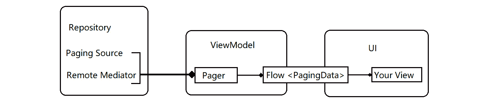
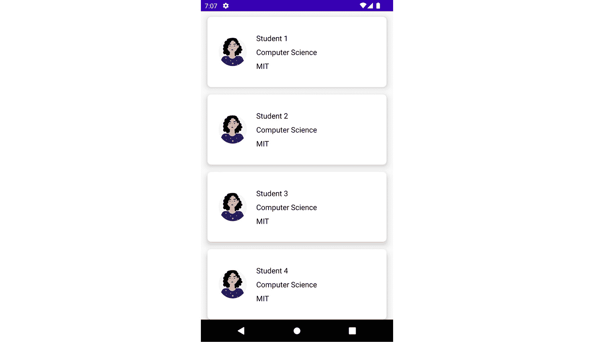
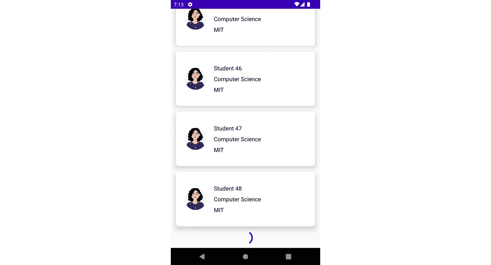
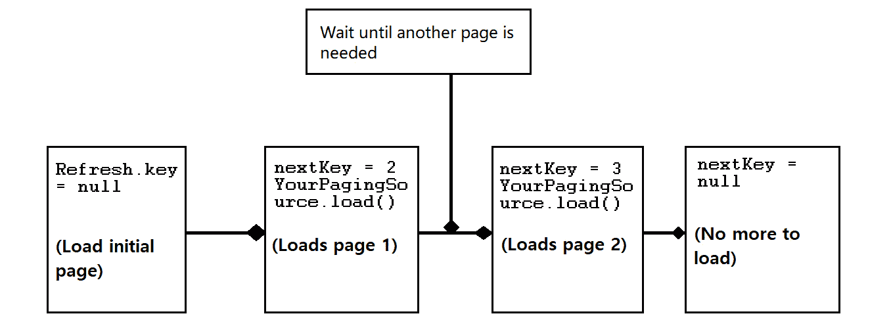

# 8

# 开始使用 Paging

在 Android 开发中，Paging 库帮助开发者从本地存储或通过网络从更大的数据集中加载数据页面。如果您的应用程序需要加载大量数据供人们阅读，这可能会很常见。例如，一个好的例子是 Twitter；您可能会注意到由于人们每天发送的许多推文，数据会刷新。

因此，在**现代 Android 开发**（**MAD**）中，Android 开发者可能希望在他们的应用程序中实现 Paging 库来帮助他们处理加载数据的此类情况。在本章中，您将学习如何在项目中利用 Paging 库。

在本章中，我们将介绍以下菜谱：

+   实现 Jetpack Paging 库

+   管理当前和加载状态

+   在 Jetpack Compose 中实现自定义分页

+   加载和显示分页数据

+   理解如何转换数据流

+   迁移到 Paging 3 并了解其优势

+   为您的 Paging Source 编写测试

# 技术要求

本章的完整源代码可以在[`github.com/PacktPublishing/Modern-Android-13-Development-Cookbook/tree/main/chapter_eight`](https://github.com/PacktPublishing/Modern-Android-13-Development-Cookbook/tree/main/chapter_eight)找到。您还需要为[`newsapi.org/`](https://newsapi.org/)获取一个 API 密钥。"NewsApi"是一个全球性的新闻 API。

# 实现 Jetpack Paging 库

Paging 库为开发者提供了令人难以置信的功能。如果您的代码库已经建立且规模庞大，开发者们已经创建了其他自定义方法来帮助他们高效地加载数据。Paging 的一个显著优势是其页面数据的内存缓存，这确保了您的应用程序在处理已分页数据时高效地使用系统资源。

此外，它还支持 Kotlin 协程流和 LiveData，并具有内置的去重功能，这确保了您的应用程序在处理已分页数据时高效地使用系统资源，这有助于节省电池。最后，Paging 库提供了错误处理支持，包括在刷新和重试数据时。

## 准备工作

在这个菜谱中，我们需要创建一个新的项目；如果您需要参考创建新项目的先前菜谱，您可以访问*第一章*，*现代 Android 开发技能入门*。

## 如何操作…

让我们继续创建一个新的空 Compose 项目，并将其命名为`PagingJetpackExample`。在我们的示例项目中，我们将使用免费的`NewsApi`向用户展示新闻。要开始，请查看这个链接[`newsapi.org/docs/get-started`](https://newsapi.org/docs/get-started)。同时，确保您为项目获取 API，因为这是本菜谱的要求。按照以下步骤开始：

1.  让我们继续添加以下必需的依赖项。此外，由于我们将进行网络调用，我们需要添加一个库来处理这个问题。关于正确的版本控制，请查看*技术要求*部分以获取代码和正确的版本。我们将提供`2.x.x`，这样你可以在升级或已经在你的项目中使用`Retrofit`和 Coil 时检查兼容性。Coil 是一个快速、轻量级且灵活的图像加载库。它旨在简化从各种来源（如网络、本地存储或内容提供者）加载图像并在 ImageView 或其他图像相关 UI 组件中显示图像的过程：

    ```kt
    //Retrofit
    ```

    ```kt
    implementation 'com.squareup.retrofit2:retrofit:2.x.x'
    ```

    ```kt
    implementation 'com.squareup.retrofit2:converter-gson:2.x.x'
    ```

    ```kt
    //Coil you can also use Glide in this case
    ```

    ```kt
    implementation 'com.google.accompanist:accompanist-coil:0.x.x'
    ```

    ```kt
    //Paging 3.0
    ```

    ```kt
    implementation 'Androidx.Paging:Paging-compose:1.x.x'
    ```

1.  在项目同步并准备就绪后，继续删除项目附带来的`Greeting`可组合函数。你应该只有你的主题，你的界面应该是空的。此外，对于这个食谱的**用户界面**（**UI**）部分，你可以从*技术要求*部分获取整个代码。

1.  此外，当使用 API 时，开发者往往会忘记在清单中添加`Android.permission.INTERNET`权限，所以现在让我们先做这件事，以免忘记：

    ```kt
    <uses-permission Android:name="Android.permission.INTERNET"/>
    ```

1.  现在，创建一个名为`data`的包；我们将把我们的模型和服务文件添加到这个包中。此外，确保你阅读了新闻 API 的**文档**部分，以了解 API 的工作原理：

    ```kt
    data class NewsArticle(
    ```

    ```kt
        val author: String,
    ```

    ```kt
        val content: String,val title: String ...)
    ```

1.  现在我们来创建我们的`NewsArticleResponse`数据类，我们将在`NewsApiService`接口中实现它。我们的 API 调用类型是`@GET()`，这意味着“获取”。关于`GET`的更详细解释可以在*如何工作*部分找到。我们的调用旨在返回一个包含`NewsArticleResponse`数据类形式的调用对象：

    ```kt
    data class NewsArticleResponse(
    ```

    ```kt
        val articles: List<NewsArticle>,
    ```

    ```kt
        val status: String,
    ```

    ```kt
        val totalResults: Int
    ```

    ```kt
    )
    ```

    ```kt
    interface NewsApiService{
    ```

    ```kt
        @GET("everything?q=apple&sortBy=popularity&apiKey=        ${YOURAPIKEY}&pageSize=20")
    ```

    ```kt
        suspend fun getNews(
    ```

    ```kt
            @Query("page") page: Int
    ```

    ```kt
        ): NewsArticleResponse
    ```

    ```kt
    }
    ```

1.  创建另一个名为`NewsArticlePagingSource()`的类；我们的类将使用`NewsApiService`作为输入参数。当通过 API 公开任何大型数据集时，我们需要提供一个机制来分页资源列表。为了实现它，我们需要传递分页键的类型和要加载数据的类型，在我们的例子中是`NewsArticle`：

    ```kt
    class NewsArticlePagingSource(
    ```

    ```kt
        private val newsApiService: NewsApiService,
    ```

    ```kt
    ): PagingSource<Int, NewsArticle>() {
    ```

    ```kt
    . . .
    ```

    ```kt
    }
    ```

1.  最后，让我们继续并重写由`PagingSource`和`load()`挂起函数提供的`getRefreshKey()`。我们将在*加载数据和显示分页数据*食谱中详细讨论`load()`和`PagingSource`挂起函数：

    ```kt
    class NewsArticlePagingSource(
    ```

    ```kt
        private val newsApiService: NewsApiService,
    ```

    ```kt
    ) : PagingSource<Int, NewsArticle>() {
    ```

    ```kt
        override fun getRefreshKey(state: PagingState<Int,
    ```

    ```kt
        NewsArticle>): Int? {
    ```

    ```kt
            return state.anchorPosition?.let {
    ```

    ```kt
            anchorPosition ->
    ```

    ```kt
                state.closestPageToPosition(
    ```

    ```kt
                    anchorPosition)?.prevKey?.plus(1)
    ```

    ```kt
                    ?: state.closestPageToPosition(
    ```

    ```kt
                        anchorPosition)?.nextKey?.minus(1)
    ```

    ```kt
            }
    ```

    ```kt
        }
    ```

    ```kt
        override suspend fun load(params:
    ```

    ```kt
        LoadParams<Int>): LoadResult<Int, NewsArticle> {
    ```

    ```kt
            return try {
    ```

    ```kt
                val page = params.key ?: 1
    ```

    ```kt
                val response = newsApiService.getNews(
    ```

    ```kt
                    page = page)
    ```

    ```kt
                LoadResult.Page(
    ```

    ```kt
                    data = response.articles,
    ```

    ```kt
                    prevKey = if (page == 1) null else
    ```

    ```kt
                        page.minus(1),
    ```

    ```kt
                    nextKey = if
    ```

    ```kt
                        (response.articles.isEmpty()) null
    ```

    ```kt
                            else page.plus(1),
    ```

    ```kt
                )
    ```

    ```kt
            } catch (e: Exception) {
    ```

    ```kt
                LoadResult.Error(e)
    ```

    ```kt
            }
    ```

    ```kt
        }
    ```

    ```kt
    }
    ```

1.  现在，让我们创建我们的仓库；仓库是一个将数据源（如网络服务或 Room 数据库）与应用程序的其他部分隔离的类。由于我们没有 Room 数据库，我们将使用网络服务数据：

    ```kt
    class NewsArticleRepository @Inject constructor(
    ```

    ```kt
        private val newsApiService: NewsApiService
    ```

    ```kt
    ) {
    ```

    ```kt
        fun getNewsArticle() = Pager(
    ```

    ```kt
            config = PagingConfig(
    ```

    ```kt
                pageSize = 20,
    ```

    ```kt
            ),
    ```

    ```kt
            PagingSourceFactory = {
    ```

    ```kt
                NewsArticlePagingSource(newsApiService)
    ```

    ```kt
            }
    ```

    ```kt
        ).flow
    ```

    ```kt
    }
    ```

1.  在我们的项目中，我们将使用 Hilt 进行依赖注入并构建所需模块。对于本节，你可以参考*第三章*中的步骤，*在 Jetpack Compose 中处理 UI 状态和使用 Hilt*，了解如何将 Hilt 添加到你的项目中以及如何创建所需的模块。此外，如果你遇到困难，可以通过 *技术要求* 部分访问整个代码：

    ```kt
    @Module
    ```

    ```kt
    @InstallIn(SingletonComponent::class)
    ```

    ```kt
    class RetrofitModule{
    ```

    ```kt
        @Singleton
    ```

    ```kt
        @Provides
    ```

    ```kt
        fun provideRetrofitInstance(): NewsApiService =
    ```

    ```kt
        Retrofit.Builder()
    ```

    ```kt
            .baseUrl(BASE_URL)
    ```

    ```kt
            .addConverterFactory(
    ```

    ```kt
                GsonConverterFactory.create())
    ```

    ```kt
            .build()
    ```

    ```kt
            .create(NewsApiService::class.java)
    ```

    ```kt
    }
    ```

1.  最后，在我们实现了我们的 `PagingSource` 之后，我们可以继续创建一个 `Pager`，这通常指的是我们的 ViewModel 中的 `ViewPager`，并指定我们的页面大小。这可以根据项目的需求或偏好进行选择。此外，当使用 Paging 3.0 时，我们不需要单独处理或转换任何数据以应对屏幕配置更改，因为这会自动为我们完成。

我们可以使用 `cachedIn(viewModelScope)` 简单地缓存我们的 API 结果。此外，为了通知 `PagingData` 的任何更改，你可以使用 `CombinedLoadState` 回调来处理加载状态：

```kt
@HiltViewModel
class NewsViewModel @Inject constructor(
    private val repository: NewsArticleRepository,
) : ViewModel() {
    fun getNewsArticle():
        Flow<PagingData<NewsArticle>> =
            repository.getNewsArticle().cachedIn(
                viewModelScope)
}
```

1.  最后，当你运行应用程序时，你应该看到一个类似于 *图 8**.1* 的显示，显示作者的名字、图像和内容。我们还将内容包装起来，因为此示例只是为了学习目的；你可以将其作为一个挑战来改进 UI 并显示更多细节：


图 8.1 – 使用 Paging 3 库加载的新闻文章

## 它是如何工作的...

在 Android 开发中，Retrofit 请求通常指的是使用 Retrofit 库进行的网络请求，Retrofit 是一个流行的 Android HTTP 客户端库。

这里是一些常见的 Retrofit 请求类型及其用法：

+   `GET`：此请求用于从服务器检索数据。它是 Android 应用中最常见的请求类型，通常用于检索数据以填充 UI 元素，如列表或网格。

+   `POST`：此请求用于向服务器提交数据。它通常用于在服务器上创建新的资源，如新的用户账户或新的帖子。

+   `PUT`：此请求用于更新服务器上的现有资源。它通常用于更新用户的账户信息或修改现有的帖子。

+   `DELETE`：此请求用于在服务器上删除资源。它通常用于删除用户账户或删除帖子。

+   `PATCH`：此请求部分更新服务器上的现有资源。当只需要更新资源的一小部分而不是使用 `PUT` 请求更新整个资源时，通常使用它。

在使用 Retrofit 请求时，开发者通常会定义一个接口来描述端点和请求参数。Retrofit 然后为该接口生成客户端实现，可用于进行实际的网络调用。

通过使用 Retrofit，开发者可以抽象出网络请求的许多底层细节，这使得从 Android 应用中与服务器通信变得更加容易和高效。有关 Retrofit 的示例，请查看以下链接 [`square.github.io/retrofit/`](https://square.github.io/retrofit/)。

分页库确保它遵循推荐的 Android 架构模式。此外，其组件包括`Repository`、`ViewModel`和`UI`层。以下图表显示了分页组件在每个层中的操作方式以及它们如何协同工作以加载和显示你的分页数据：



图 8.2 – 分页库架构

`Paging Source`组件是`Repository`层中的主要组件，如*图 8**.2 所示。该对象通常为每份数据声明一个源，并处理如何从该源重试数据。如果你注意到，这正是我们在示例中做的：

```kt
  class NewsArticleRepository @Inject constructor(
      private val newsApiService: NewsApiService
) { . . .
```

我们创建了一个包含 API 基本 URL 的 Retrofit `builder()`对象，该 URL 我们在`Constant`类中定义，`const val BASE_URL = "https://newsapi.org/v2/"`，我们使用`Gson`转换器来转换我们的 JSON API 响应。然后我们声明了`apiService`变量，我们将使用它将 Retrofit `builder()`对象与我们的接口连接并完成我们的 Retrofit 模块。

重要提示

由于其改进以及一些功能难以使用 Paging 2 处理，建议所有使用分页库的人迁移到 Paging 3。

# 管理当前和加载状态

分页库通过其加载状态对象向用户提供加载状态信息，该对象可以根据其当前的加载状态呈现不同的形式。例如，如果你有一个正在进行的加载操作，那么状态将是`LoadState.Loading`。

如果你有一个错误状态，那么状态将是`LoadState.Error`；最后，可能没有正在进行的加载操作，这种状态被称为`LoadState.NotLoading`。在本食谱中，我们将探讨不同的状态并了解它们；这里展示的示例也可以在以下链接中找到：[`developer.android.com/topic/libraries/architecture/paging/load-state`](https://developer.android.com/topic/libraries/architecture/paging/load-state)。在这个例子中，我们假设你的项目使用的是遗留代码，该代码利用 XML 作为视图系统。

## 准备工作

要跟随本食谱，你需要完成上一个食谱中的代码。你也可以跳过这一步，如果它在你项目中不是必需的。

## 如何做到这一点...

在本食谱中，我们不会创建一个新的项目，而是逐步查看我们如何使用监听器访问加载状态或使用适配器呈现加载状态。按照以下步骤操作以开始：

1.  当您想要访问状态时，将此信息传递给您的 UI。您可以使用 `PagingDataAdapter` 提供的 `addLoadStateListener` 函数的 `loadedStateFlow` 流轻松地做到这一点：

    ```kt
    lifecycleScope.launch {
    ```

    ```kt
        thePagingAdapter.loadStateFlow.collectLatest {
    ```

    ```kt
            loadStates ->
    ```

    ```kt
        progressBar.isVisible = loadStates.refresh is
    ```

    ```kt
            LoadState.Loading
    ```

    ```kt
        retry.isVisible = loadState.refresh !is
    ```

    ```kt
            LoadState.Loading
    ```

    ```kt
        errorMessage.isVisible = loadState.refresh is
    ```

    ```kt
            LoadState.Error
    ```

    ```kt
      }
    ```

    ```kt
    }
    ```

1.  对于我们的示例，我们不会查看 `addLoadStateListener` 函数，因为这与适配器类一起使用，并且由于新的 Jetpack Compose，这几乎不再执行，因为有更多的推动力去使用基于 Jetpack Compose 的 UI 应用程序。

1.  根据您应用程序的具体事件，过滤加载状态流可能是有意义的。这确保了您的应用程序 UI 在正确的时间更新，以避免问题。因此，使用协程，我们等待刷新加载状态更新：

    ```kt
    lifecycleScope.launchWhenCreated{
    ```

    ```kt
        yourAdapter.loadStateFlow
    ```

    ```kt
            .distinctUntilChangedBy { it.refresh }
    ```

    ```kt
            .filter { it.refresh is LoadState.NotLoading }
    ```

    ```kt
            .collect { binding.list.scrollToPosition(0) }
    ```

    ```kt
    }
    ```

## 它是如何工作的…

当从 `loadStateFlow` 和 `addLoadStateListener()` 获取更新时，这些更新保证是同步的，并且根据需要更新 UI。这仅仅意味着在 Android 的 Paging 3 库中，`LoadState.Error` 是一个表示在从 `PagingSource` 加载数据时发生错误的状态。

在 Android 的 Paging 3 库中，`LoadState.NotLoading` 是一个表示 `PagingDataAdapter` 当前没有加载数据，并且所有可用数据都已加载的状态。

当 `PagingDataAdapter` 首次创建时，它处于 `LoadState.NotLoading` 状态。这意味着尚未加载数据，适配器正在等待第一次加载发生。

在第一次加载之后，适配器可能会根据数据加载过程的当前状态转换到不同的加载状态。然而，一旦所有可用数据都已加载，适配器将转换回 `LoadState.NotLoading` 状态。

`LoadState.NotLoading` 可以用来通知 UI 数据加载过程已完成，并且除非用户启动刷新或其他操作，否则不会加载更多数据。

要处理此状态，您可以在 `PagingDataAdapter` 中注册对 `LoadState` 变化的监听器，并相应地更新 UI。例如，您可以向用户显示一条消息，表明所有数据已加载，或禁用任何“加载更多”按钮或手势。

## 更多内容...

您可以通过以下链接了解状态以及如何更好地处理分页：[`developer.android.com/topic/libraries/architecture/paging/load-state`](https://developer.android.com/topic/libraries/architecture/paging/load-state)。

# 在 Jetpack Compose 中实现自定义分页

Paging 库为开发者提供了令人难以置信的功能，但有时您会遇到挑战，不得不创建自定义分页。在章节的开头，我们讨论了复杂代码库中或创建分页的情况。

在这个示例中，我们将探讨如何通过一个简单的列表示例来实现这一点，以及您如何使用此示例在您的应用程序中创建自定义分页。

## 准备工作

在这个示例中，我们需要创建一个新的项目，并将其命名为 `CustomPagingExample`。

## 如何操作...

在我们的示例项目中，我们将尝试创建一个学生配置文件卡片，并使用自定义分页在 Jetpack Compose 中加载配置文件。

1.  对于这个菜谱，让我们继续添加 `lifecycle-ViewModel` 依赖项，因为我们将会用到它：

    ```kt
    implementation "Androidx.lifecycle:lifecycle-viewmodel-compose:2.x.x"
    ```

1.  让我们继续创建一个新的包并称其为 `data`。在我们的 `data` 包中，我们将添加我们将在卡片上显示的项目。目前，我们只将显示学生的 `姓名、学校` 和 `专业`：

    ```kt
    data class StudentProfile(
    ```

    ```kt
        val name: String,
    ```

    ```kt
        val school: String,
    ```

    ```kt
        val major: String
    ```

    ```kt
    )
    ```

1.  现在我们有了我们的 `data` 类，我们将继续构建我们的仓库，由于在我们的示例中我们没有使用 API，我们将使用我们的远程数据源，我们可以尝试加载，比如说，50 到 100 个配置文件。然后，在 `data` 中添加另一个类并称其为 `StudentRepository`：

    ```kt
    class StudentRepository {
    ```

    ```kt
        private val ourDataSource = (1..100).map {
    ```

    ```kt
            StudentProfile(
    ```

    ```kt
                name = "Student $it",
    ```

    ```kt
                school = "MIT $it",
    ```

    ```kt
                major = "Computer Science $it"
    ```

    ```kt
            )
    ```

    ```kt
        }
    ```

    ```kt
        suspend fun getStudents(page: Int, pageSize: Int):
    ```

    ```kt
        Result<List<StudentProfile>> {
    ```

    ```kt
            delay(timeMillis = 2000L) //the delay added is
    ```

    ```kt
                just to mimic a network connection.
    ```

    ```kt
            val start = page * pageSize
    ```

    ```kt
            return if (start + pageSize <=
    ```

    ```kt
            ourDataSource.size) {
    ```

    ```kt
                Result.success(
    ```

    ```kt
                    ourDataSource.slice(start until start
    ```

    ```kt
                        + pageSize)
    ```

    ```kt
                )
    ```

    ```kt
            } else Result.success(emptyList())
    ```

    ```kt
        }
    ```

    ```kt
    }
    ```

1.  既然我们已经创建了我们的仓库，让我们继续创建我们的自定义分页。我们将通过创建一个新的接口并称其为 `StudentPaginator` 来完成此操作：

    ```kt
    interface StudentPaginator<Key, Student> {
    ```

    ```kt
        suspend fun loadNextStudent()
    ```

    ```kt
        fun reset()
    ```

    ```kt
    }
    ```

1.  由于 `StudentPaginator` 是一个接口，我们必须创建一个类来实现我们刚刚创建的两个函数。现在，让我们继续创建 `StudentPaginatorImpl` 并实现我们的接口：

    ```kt
    class StudentPaginatorImpl<Key, Student>(
    ```

    ```kt
    ) : StudentPaginator<Key, Student> {
    ```

    ```kt
        override suspend fun loadNextStudent() {
    ```

    ```kt
            TODO("Not yet implemented")
    ```

    ```kt
        }
    ```

    ```kt
        override fun reset() {
    ```

    ```kt
            TODO("Not yet implemented")
    ```

    ```kt
        }
    ```

    ```kt
    }
    ```

1.  接下来，你需要处理 `StudentPaginator` 实现类中需要处理的内容。例如，在我们的构造函数中，我们需要创建一个键来监听 `load`、`request`、`error`、`success` 和 `next key`，然后在 `reset()` 函数中能够重置我们的分页。你可以在 *技术要求* 部分查看完整的代码。你可能也会注意到它看起来与本章第一个菜谱中的分页源很相似：

    ```kt
    class StudentPaginatorImpl<Key, Student>(
    ```

    ```kt
        private val key: Key,
    ```

    ```kt
        private inline val loadUpdated: (Boolean) -> Unit,
    ```

    ```kt
        private inline val request: suspend (nextKey: Key)
    ```

    ```kt
        ->
    ```

    ```kt
    . . .
    ```

    ```kt
    ) : StudentPaginator<Key, Student> {
    ```

    ```kt
        private var currentKey = key
    ```

    ```kt
        private var stateRequesting = false
    ```

    ```kt
        override suspend fun loadNextStudent() {
    ```

    ```kt
            if (stateRequesting) {
    ```

    ```kt
                return
    ```

    ```kt
            }
    ```

    ```kt
            stateRequesting = true
    ```

    ```kt
         . . .
    ```

    ```kt
        }
    ```

    ```kt
        override fun reset() {
    ```

    ```kt
            currentKey = key
    ```

    ```kt
        }
    ```

1.  让我们继续创建一个新的包并称其为 `uistate`。在 `uistate` 中，我们将创建一个新的数据类并称其为 `UIState` 以帮助我们处理 UI 状态：

    ```kt
    data class UIState(
    ```

    ```kt
        val page: Int = 0,
    ```

    ```kt
        val loading: Boolean = false,
    ```

    ```kt
        val studentProfile: List<StudentProfile> =
    ```

    ```kt
            emptyList(),
    ```

    ```kt
        val error: String? = null,
    ```

    ```kt
        val end: Boolean = false,
    ```

    ```kt
    )
    ```

1.  现在让我们继续并最终确定我们的 Kotlin 中的 `ViewModel` `init` 块，这是我们用于初始化的块。我们还创建了 `val ourPaginator`，并将其声明给 `StudentPaginatorImpl` 类，并使用我们用于 UI 的数据来处理输入：

    ```kt
    class StudentViewModel() : ViewModel() {
    ```

    ```kt
        var state by mutableStateOf(UIState())
    ```

    ```kt
        private val studentRepository =
    ```

    ```kt
            StudentRepository()
    ```

    ```kt
        init {
    ```

    ```kt
            loadStudentProfile()
    ```

    ```kt
        }
    ```

    ```kt
        private val ourPaginator = StudentPaginatorImpl(
    ```

    ```kt
            key = state.page,
    ```

    ```kt
            loadUpdated = { state = state.copy(loading =
    ```

    ```kt
                it) },
    ```

    ```kt
            request = { studentRepository.getStudents(it,
    ```

    ```kt
                24) },
    ```

    ```kt
            nextKey = { state.page + 1 },
    ```

    ```kt
            error = { state = state.copy(error =
    ```

    ```kt
                it?.localizedMessage) },
    ```

    ```kt
            success = { student, newKey ->
    ```

    ```kt
                state = state.copy(
    ```

    ```kt
                    studentProfile = state.studentProfile
    ```

    ```kt
                        + student,
    ```

    ```kt
                    page = newKey,
    ```

    ```kt
                    end = student.isEmpty()
    ```

    ```kt
                )
    ```

    ```kt
            }
    ```

    ```kt
        )
    ```

    ```kt
        fun loadStudentProfile(){
    ```

    ```kt
            viewModelScope.launch {
    ```

    ```kt
                ourPaginator.loadNextStudent()
    ```

    ```kt
            }
    ```

    ```kt
        }
    ```

    ```kt
    }
    ```

1.  最后，在我们的 `MainActivity` 类中，我们现在在我们的卡片上加载学生配置文件并在屏幕上显示它，如图 *图 8**.3* 所示。一个额外的巨大练习是尝试在示例项目中使用依赖注入来提高你的 Android 技能。你可以利用 *第三章*，*在 Jetpack Compose 中处理 UI 状态和使用 Hilt*，来添加依赖注入，并尝试为 `ViewModel` 类编写测试：



图 8.3 – 懒加载列上加载的数据

在 *图 8**.4* 中，当你向下滚动到 **学生 4** 等等时，你会看到一个进度加载符号，这在处理大量数据时可以非常出色：



图 8.4 – 加载数据

## 它是如何工作的…

一旦你得到一个列表，可能会遇到问题，并且通知单个项目可能很困难。然而，你可以轻松地实现分页；在我们的项目中，我们模拟了一个远程数据源，但请记住，你可以使用任何 API 来演示这个例子。

我们的主要关注点是`StudentPaginatorImpl`类——你会注意到我们传递了一个键、一个`loadUpdated`值和一个请求，这是一个返回我们的`Student`类型结果的挂起函数；我们还传递了`nextkey`，它告诉我们我们的位置。然后，在出现错误的情况下，我们有可抛出的错误和一个`suspend`值`success`，它提供了`success`结果：

```kt
class StudentPaginatorImpl<Key, Student>(
    private val key: Key,
    private inline val loadUpdated: (Boolean) -> Unit,
    private inline val request: suspend (nextKey: Key) ->
        Result<List<Student>>,
    private inline val nextKey: suspend (List<Student>) ->
        Key,
    private inline val error: suspend (Throwable?) -> Unit,
    private inline val success: suspend (items:
        List<Student>, newKey: Key) -> Unit
) : StudentPaginator<Key, Student> {
```

因此，当我们从`loadNextStudent()`接口重写我们的函数时，我们首先检查当前状态请求，并将初始值作为`false`返回，但在状态检查之后更新它。我们还确保通过将`currentKey`设置为`nextKey`来重置键。

```kt
currentKey = nextKey(studentProfiles)
success(studentProfiles, currentKey)
loadUpdated(false)
```

如果你需要自定义`LazyColumn`中的项目，这将变得很容易，确保你拥有优秀的列表。

`loadStudentProfile()`函数包含一个`viewModelScope.launch {...}`。在我们的应用程序中，为每个 ViewModel 定义了一个 ViewModel 作用域。此外，在这个作用域中启动的任何协程，如果 ViewModel 被清除，将会自动取消。

你可能想知道 ViewModel 是什么。为了帮助你刷新知识，你可以查看*第三章*，*在 Jetpack Compose 中处理 UI 状态以及使用 Hilt*。

# 加载和显示分页数据

在加载和显示分页数据时，有一些基本步骤需要考虑。此外，Paging 库为加载和显示大型、分页数据集提供了巨大的优势。你必须记住的一些步骤是确保首先定义数据源，如果需要，设置 Paging Source 流，等等。

在这个菜谱中，我们将探讨如何加载和显示分页数据。

## 如何做…

你需要完成*实现 Jetpack Paging 库*菜谱，才能跟随本菜谱的解释：

1.  你可能已经注意到在我们的第一个菜谱中，我们重写了`load()`方法，这是我们用来指示如何从对应的数据源检索分页数据的方法：

    ```kt
    override suspend fun load(params: LoadParams<Int>): LoadResult<Int, NewsArticle> {
    ```

    ```kt
        return try {
    ```

    ```kt
            val page = params.key ?: 1
    ```

    ```kt
            val response = newsApiService.getNews(page =
    ```

    ```kt
                page)
    ```

    ```kt
            LoadResult.Page(
    ```

    ```kt
                data = response.articles,
    ```

    ```kt
                prevKey = if (page == 1) null else
    ```

    ```kt
                    page.minus(1),
    ```

    ```kt
                nextKey = if (response.articles.isEmpty())
    ```

    ```kt
                    null else page.plus(1),
    ```

    ```kt
            )
    ```

    ```kt
        } catch (e: Exception) {
    ```

    ```kt
            LoadResult.Error(e)
    ```

    ```kt
        }
    ```

    ```kt
    }
    ```

1.  如果我们在重写`getRefreshKey()`时`val page = params.key ?: 1`未定义，我们则从页码`1`开始刷新；我们尝试从我们的上一个键或下一个键中找到锚定位置最近的页码。我们还需要确保我们处理可能存在的`null`值的情况：

    ```kt
    override fun getRefreshKey(state: PagingState<Int, NewsArticle>): Int? {
    ```

    ```kt
        return state.anchorPosition?.let { anchorPosition
    ```

    ```kt
            ->
    ```

    ```kt
            state.closestPageToPosition(anchorPosition)?
    ```

    ```kt
                .prevKey?.plus(1)
    ```

    ```kt
                ?: state.closestPageToPosition(
    ```

    ```kt
                    anchorPosition)?.nextKey?.minus(1)
    ```

    ```kt
        }
    ```

    ```kt
    }
    ```

## 它是如何工作的…

当使用 Paging 库时，你可以使用`anchorPosition`参数指定屏幕上要显示的第一个项目的位置。此外，`anchorPosition`是一个可选参数，你可以将其传递给用于显示分页数据的`PagingItems`可组合函数。`anchorPosition`参数用于指定在可组合函数首次渲染时屏幕上要显示的第一个项目的位置。

`LoadParams` 对象携带有关要执行加载数据操作的信息。此外，它知道要加载的键和要在 UI 上显示的项目数量。此外，为了更好地理解`load()`函数如何接收每个特定加载的键并更新它，请查看以下图表：



图 8.5 – load()如何使用和更新键

# 理解如何转换数据流

当编写任何处理分页的代码时，你需要了解你如何在将数据加载到用户时转换数据流。例如，你可能需要在将数据提供给 UI 之前过滤项目列表或甚至将项目转换为不同的类型。

因此，确保你直接将转换应用于流数据，可以使你的仓库和 UI 逻辑保持清晰分离。在本食谱中，我们将尝试了解我们如何转换数据流。

## 准备工作

要跟上进度，你必须熟悉分页库的主要用法；因此，请确保你已经阅读了本章之前的食谱。

## 如何做…

在这个食谱中，我们将执行以下步骤：

1.  探索我们如何应用基本转换。

1.  转换和过滤数据。

1.  在 UI 中处理分隔符并转换 UI 模型。

如果你已经在你的应用程序中使用分页，这个食谱对你有帮助。

1.  首先，我们需要将转换放在一个 `map{PagingData ->}` 内部。在 Kotlin 中，一个映射将给定的 lambda 函数应用于每个元素，并返回一个 lambda 结果的列表：

    ```kt
    yourPager.flow
    ```

    ```kt
        .map { PagingData ->
    ```

    ```kt
            // here is where the transformations are
    ```

    ```kt
               applied to the items in the paged data.
    ```

    ```kt
    }
    ```

1.  其次，当我们想要转换数据或过滤时，一旦我们访问到我们的 `PagingData` 对象，我们就可以在分页列表中的每个单独的项目上再次使用 `map()`。一个典型的用例是当你想要将数据库或网络层对象映射到可能在 UI 层特别使用的对象上：

    ```kt
    yourPager.flow
    ```

    ```kt
        .map { PagingData ->
    ```

    ```kt
            PagingData.map { sports -> SportsModel(sports)
    ```

    ```kt
            }
    ```

    ```kt
    }
    ```

1.  我们需要将过滤操作放在 `map` 内部，因为过滤应用于 `PagingData` 对象。然后一旦从我们的 `PagingData` 中过滤出数据，新的实例将被分页到 UI 层并显示：

    ```kt
    yourPager.flow
    ```

    ```kt
        .map { PagingData ->
    ```

    ```kt
            PagingData.filter { sports ->
    ```

    ```kt
                !sports.displayInUi }
    ```

    ```kt
    }
    ```

1.  最后，在处理 UI 中的分隔符或转换 UI 模型时，最重要的步骤是确保你做以下事情：

    1.  将 UI 模型转换为适应你的分隔符项。

    1.  在展示和加载数据之间动态转换数据并添加分隔符。

    1.  更新 UI 以更好地处理分隔符项。

## 它是如何工作的…

`PagingData` 被封装在一个响应式流中；这意味着在加载数据并显示给用户之前，你可以逐步将转换应用于数据。在复杂的应用程序中，转换数据流可能至关重要，提前处理这种情况可能会帮助确保你的应用程序更好地扩展，并有助于最小化数据增长复杂性。

## 相关内容

公平地说，这个菜谱不能涵盖您需要了解的所有关于转换数据流的信息。话虽如此，如果您遇到问题并想了解更多，您始终可以参考以下链接来了解如何处理 UI 中的分隔符以及更多内容：[`developer.android.com/topic/libraries/architecture/paging/v3-transform`](https://developer.android.com/topic/libraries/architecture/paging/v3-transform)。

# 迁移到分页 3 并了解其优势

您可能正在使用旧的分页版本，在这种情况下，可能是分页 2 或 1，并且您可能需要迁移以利用分页 3 提供的好处。分页 3 提供了增强的功能，并确保它解决了人们在使用分页 2 时遇到的最常见挑战。

在这个菜谱中，我们将探讨如何迁移到最新推荐的分页库。

## 准备工作

如果您的应用程序已经使用分页 3，那么您可以跳过这个菜谱；这个逐步迁移指南是为目前使用分页库旧版本的用户准备的。

## 如何操作…

从旧版本的分页库迁移可能看起来很复杂，因为每个应用程序都是独特的，复杂性可能不同。然而，在我们的例子中，我们将讨论一种低级别的迁移，因为我们的示例应用程序不需要任何迁移。

要执行从旧分页库的迁移，请按照以下步骤操作：

1.  第一步是替换刷新键，这是因为我们需要定义如何从加载数据的中间部分恢复刷新。我们将通过首先实现`getRefreshKey()`来完成这项工作，它使用`PagingState.anchorPosition`作为最近索引来映射正确的初始键：

    ```kt
    override fun getRefreshKey(PagingState: PagingState): String? {
    ```

    ```kt
        return PagingState.anchorPosition?.let { position
    ```

    ```kt
            ->
    ```

    ```kt
                PagingState.getClosestItemToPosition(
    ```

    ```kt
                    position)?.id
    ```

    ```kt
        }
    ```

    ```kt
    }
    ```

1.  接下来，我们需要确保我们替换位置数据源：

    ```kt
    override fun getRefreshKey(PagingState: PagingState): Int? {
    ```

    ```kt
        return PagingState.anchorPosition
    ```

    ```kt
    }
    ```

1.  如果您正在使用旧的分页库，分页数据使用`DataSource.map()`、`mapByPage`、`Factory.map()`和`Factory.mapByPage`。然而，在分页 3 中，所有这些都被应用为`PagingData`的操作符。

1.  最后，为了确保您从分页 2 的`PageList`迁移，您需要迁移到`PagingData`。最显著的变化是`PagedList.Config`不是`PagingConfig`。此外，`Pager()`暴露了一个带有其流的可观察的`Flow<PagingData>`：

    ```kt
    val yourFlow = Pager(
    ```

    ```kt
        PagingConfig(pageSize = 24)
    ```

    ```kt
    ) {
    ```

    ```kt
        YourPagingSource(yourBackend, yourQuery)
    ```

    ```kt
    }.flow
    ```

    ```kt
        .cachedIn(viewModelScope)
    ```

## 它是如何工作的…

为了确保您的迁移过程完整且成功，您必须确保从分页 2 迁移所有重要组件。这包括如果您的应用程序使用它，则必须迁移`DataSource`类、`PagedList`和`PagedListAdapter`。此外，一些分页 3 组件与其他版本兼容良好，这意味着它是向后兼容的。

在 Paging 3 中，对`PagingSource`最显著的变化是它将所有加载函数合并为一个，现在在`PagingSource`中称为`load()`。这确保了代码中没有冗余，因为加载逻辑通常与旧 API 相同。此外，Paging 3 中加载函数的参数现在使用`LoadParams`密封类，它为每种加载类型都有子类。

在 Paging 2 中使用的`PagedList`，当你迁移时，你可能会使用`PagingData`和`Pager`。当你开始从 Paging 3 使用`PagingData`时，你应该确保配置已从旧的`PagedList.Config`移动到`PagingConfig`。

# 为你的 Paging Source 编写测试

为你的实现编写测试至关重要。在这个食谱中，我们将为我们的`PagingSource`实现编写单元测试来测试我们的逻辑。一些可能值得编写的测试是检查新闻 Paging 加载失败的情况。

我们还可以测试成功状态等。你可以遵循这个模式为你的项目或用例编写测试。

## 准备工作

要逐步遵循这个食谱，你需要已经遵循了*实现 Jetpack Paging 库*的食谱，并且你需要使用`PagingJetpackExample`项目。

## 如何做到这一点…

打开`PagingJetpackExample`，并跟随这个项目添加单元测试：

1.  将以下测试库添加到你的`build.gradle`应用中：

    ```kt
    testImplementation 'org.assertj:assertj-core:3.x.x'
    ```

    ```kt
    testImplementation "org.mockito:mockito-core:3.x.x"
    ```

    ```kt
    testImplementation 'Androidx.arch.core:core-testing:2.x.x'
    ```

    ```kt
    testImplementation 'org.jetbrains.kotlinx:kotlinx-coroutines-test:1.x.x'
    ```

1.  添加依赖项后，在项目结构中`test`包中创建一个新的包，并将其命名为`data`。如果你需要帮助找到文件夹，可以参考*第一章*，*现代 Android 开发技能入门*中的*理解 Android 项目结构*食谱。

1.  创建一个测试类，并将其命名为`NewsArticlePagingSourceTest`。

1.  在类内部，让我们继续添加`Mock`来模拟我们的`ApiService`接口，并创建一个`lateinit var newsApiService`，我们将在`@Before`步骤中初始化它：

    ```kt
    @Mock
    ```

    ```kt
    private lateinit var newsApiService: NewsApiService
    ```

    ```kt
    lateinit var newsPagingSource: NewsArticlePagingSource
    ```

1.  现在，让我们继续创建我们的`@Before`，这样我们就可以运行我们的`CoroutineDispatchers`，它被所有标准构建器（如 async）和启动到我们的`@Before`步骤：

    ```kt
    @Before
    ```

    ```kt
    fun setup() {
    ```

    ```kt
        Dispatchers.setMain(testDispatcher)
    ```

    ```kt
        newsPagingSource =
    ```

    ```kt
            NewsArticlePagingSource(newsApiService)
    ```

    ```kt
    }
    ```

1.  我们需要编写的第一个测试是检查失败发生的情况。因此，让我们继续设置我们的测试。`403`响应是一个禁止状态码，表示服务器理解了你的请求但没有授权它：

    ```kt
    @Test
    ```

    ```kt
    fun `news article Paging Source load failure http error`() = runBlockingTest {
    ```

    ```kt
        //setup
    ```

    ```kt
        val error = HttpException(
    ```

    ```kt
            Response.error<ResponseBody>(
    ```

    ```kt
                403, "some content".toResponseBody(
    ```

    ```kt
                    "plain/text".toMediaTypeOrNull())
    ```

    ```kt
            )
    ```

    ```kt
        ) . . .
    ```

1.  为了继续我们的测试，我们需要使用`Mockito.doThrow(error)`：

    ```kt
    Mockito.doThrow(error)
    ```

    ```kt
        .`when`(newsApiService)
    ```

    ```kt
        .getNews(
    ```

    ```kt
            1
    ```

    ```kt
        ). . .
    ```

1.  然后，最后，我们触发`PagingSource.LoadResult.Error`并传入类型，然后断言：

    ```kt
    //assert
    ```

    ```kt
    assertEquals(
    ```

    ```kt
        expectedResult, newsPagingSource.load(
    ```

    ```kt
            PagingSource.LoadParams.Refresh(
    ```

    ```kt
                key = null,
    ```

    ```kt
                loadSize = 1,
    ```

    ```kt
                placeholdersEnabled = false
    ```

    ```kt
            )
    ```

    ```kt
        )
    ```

    ```kt
    )
    ```

1.  你可以添加两个额外的测试，然后添加`tearDown`来清理协程：

    ```kt
    @After
    ```

    ```kt
    fun tearDown() {
    ```

    ```kt
        testDispatcher.cleanupTestCoroutines()
    ```

    ```kt
    }
    ```

## 它是如何工作的…

我们在单元测试中使用`Mock`，其基本思想是基于测试对象可能依赖于其他复杂对象的观念。基于这一点，通过模拟对象，我们可以更容易地隔离我们想要的对象的行为，这确保了它具有与我们的真实对象相同的行为，从而使测试变得更容易：

```kt
@Mock
private lateinit var newsApiService: NewsApiService
```

我们的`lateinit var newsPagingSource: NewsArticlePagingSource`用于延迟初始化，我们是在`@``Before`函数中对其进行初始化的。
