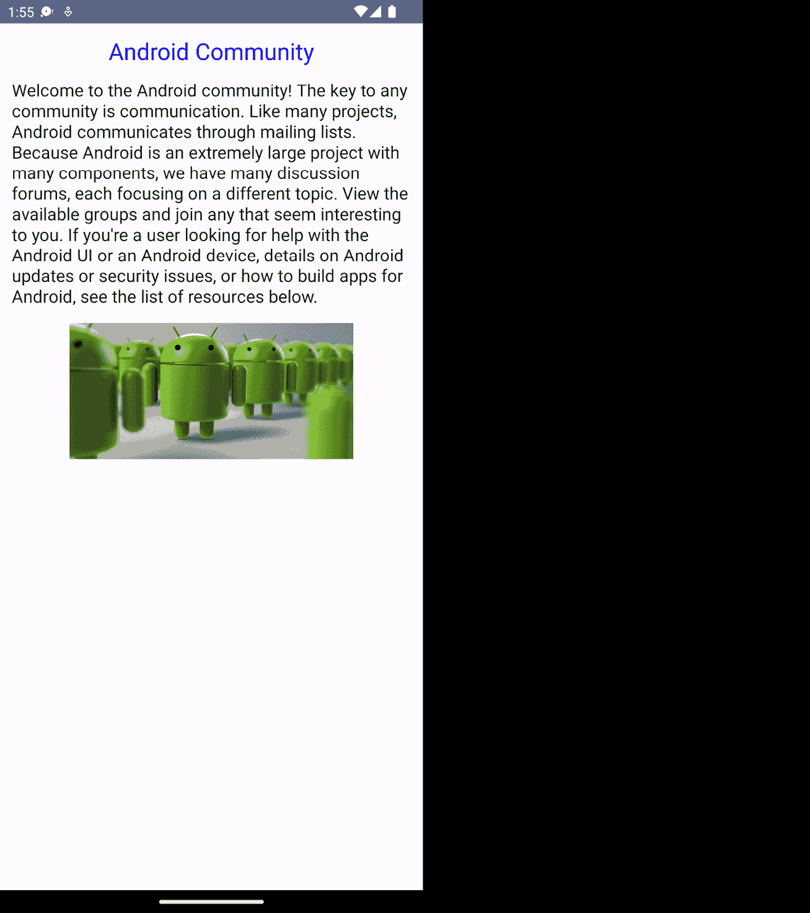

# 9

# 为大屏幕构建

我们现在都可以同意，我们生活在一个拥有可折叠手机的世界，这是一个我们从未预料到的技术，因为它们的需求和普及度在增长。十年前，如果你告诉一个开发者我们会有可折叠手机，没有人会相信它，因为屏幕复杂性和信息传输的不确定性。

然而，现在这些设备已经在我们身边了。由于其中一些设备运行在 Android 操作系统上，了解我们开发者将如何构建我们的应用程序以适应可折叠性，以及我们现在在市场上看到的 Android 平板电脑的数量至关重要。对大屏幕的支持现在似乎是强制性的，在本章中，我们将探讨在新的现代安卓开发中支持大屏幕。

在本章中，我们将介绍以下菜谱：

+   在现代安卓开发中构建自适应布局

+   使用`ConstraintLayouts`构建自适应布局

+   处理大屏幕配置更改和连续性

+   理解活动嵌入

+   在 Compose 中使用材质主题

+   在可折叠设备上测试你的应用程序

# 技术要求

本章的完整源代码可以在[`github.com/PacktPublishing/Modern-Android-13-Development-Cookbook/tree/main/chapter_nine`](https://github.com/PacktPublishing/Modern-Android-13-Development-Cookbook/tree/main/chapter_nine)找到。

# 在现代安卓开发中构建自适应布局

当你在现代安卓开发中构建应用程序的 UI 时，可以说你应该考虑确保应用程序能够响应不同的屏幕尺寸、方向和形态。最后，开发者现在可以移除横屏模式下的锁定。在这个菜谱中，我们将利用从前面的菜谱中学到的想法，为不同的屏幕尺寸和方向构建一个自适应的应用程序。

## 准备工作

我们将使用城市应用程序来创建旅行者档案，并且我们的屏幕应该能够根据不同的屏幕尺寸变化，并支持可折叠设备和平板电脑。要获取完整代码，请查看 *技术要求* 部分。

## 如何操作…

对于这个菜谱，我们将创建一个新的项目，这次，我们不会选择空的 Compose Activity 模板，而是选择空的 Compose Activity (`Material 3`)。`Material 3`旨在改善我们的应用程序在 Android 中的外观和感觉。它包括更新的主题、组件和出色的功能，例如使用动态颜色进行 Material You 个性化：

1.  让我们从创建一个空的 Compose Activity (`Material3`) 项目并命名为 `Traveller` 开始；请注意，你可以将你的项目命名为任何你想要的。


图 9.1 – 创建一个新的 Empty Compose Activity (Material3) 项目

复杂的应用程序使用响应式 UI，在大多数情况下，确保你为你的应用程序选择正确的导航类型很有用。Material 库为开发者提供了导航组件，例如底部导航、导航抽屉和导航轨道。你可以在 *技术* *要求* 部分获取这些组件的起始代码。

1.  添加以下依赖项，并检查项目的正确版本号，`1.1.0`：

    ```kt
    implementation "androidx.compose.material3:material3-window-size-class:1.1.0"
    ```

1.  当确保我们的代码具有适应性时，我们必须记住，响应式 UI 在手机旋转、折叠或展开时保留数据。最重要的是确保我们处理了姿势。我们将创建一个函数，`cityPosture`，它接受 `FoldingFeature` 作为输入并返回一个布尔值：

    ```kt
    @OptIn(ExperimentalContracts::class)
    ```

    ```kt
    fun cityPosture(foldFeature: FoldingFeature?): Boolean {
    ```

    ```kt
        contract { returns(true) implies (foldFeature !=
    ```

    ```kt
            null) }
    ```

    ```kt
        return foldFeature?.state ==
    ```

    ```kt
            FoldingFeature.State.HALF_OPENED &&
    ```

    ```kt
                foldFeature.orientation ==
    ```

    ```kt
                    FoldingFeature.Orientation.VERTICAL
    ```

    ```kt
    }
    ```

我们根据提供的三个状态处理状态。我们还用实验性类注释它，因为这个 API 仍然是实验性的，这意味着它将来可能会改变，并且不是很稳定。

1.  接下来，我们需要涵盖 `isSeparating`，它监听 `FLAT` *完全打开* 和 `isSeparating` 布尔值，这计算了是否应该考虑 `FoldingFeature`，将窗口分割成多个用户可以视为逻辑上独立的物理区域：

    ```kt
    @OptIn(ExperimentalContracts::class)
    ```

    ```kt
    fun separating(foldFeature: FoldingFeature?): Boolean {
    ```

    ```kt
        contract { returns(true) implies (foldFeature !=
    ```

    ```kt
            null) }
    ```

    ```kt
        return foldFeature?.state ==
    ```

    ```kt
            FoldingFeature.State.FLAT &&
    ```

    ```kt
                foldFeature.isSeparating
    ```

    ```kt
    }
    ```

1.  我们还将创建一个密封的接口，`DevicePosture`。这是一个 Jetpack Compose UI 组件，允许你检测设备的姿势或方向，例如设备是处于纵向还是横向模式：

    ```kt
    sealed interface DevicePosture {
    ```

    ```kt
        object NormalPosture : DevicePosture
    ```

    ```kt
        data class CityPosture(
    ```

    ```kt
            val hingePosition: Rect
    ```

    ```kt
        ) : DevicePosture
    ```

    ```kt
        data class Separating(
    ```

    ```kt
            val hingePosition: Rect,
    ```

    ```kt
            var orientation: FoldingFeature.Orientation
    ```

    ```kt
        ) : DevicePosture
    ```

    ```kt
    }
    ```

1.  在我们的 `MainActivity` 中，我们现在需要确保我们计算窗口大小：

    ```kt
    val windowSize = calculateWindowSizeClass(activity = this)
    ```

1.  然后，我们将通过创建 `postureStateFlow` 来确保我们处理所有尺寸，它将监听我们的 `DevicePosture`，并在 `cityPosture` 是折叠、展开或正常时采取行动：

    ```kt
    val postureStateFlow = WindowInfoTracker.getOrCreate(this).windowLayoutInfo(this)
    ```

    ```kt
    . . .
    ```

    ```kt
    when {
    ```

    ```kt
        cityPosture(foldingFeature) ->
    ```

    ```kt
          DevicePosture.CityPosture(foldingFeature.bounds)
    ```

    ```kt
        separating(foldingFeature) ->
    ```

    ```kt
          DevicePosture.Separating(foldingFeature.bounds,
    ```

    ```kt
            foldingFeature.orientation)
    ```

    ```kt
        else -> DevicePosture.NormalPosture
    ```

    ```kt
    }
    ```

    ```kt
        }
    ```

    ```kt
    . . .
    ```

    ```kt
        )
    ```

1.  现在，我们需要设置一个可折叠测试虚拟设备。如果你需要复习如何创建虚拟设备的第一章步骤，可以重复执行；否则，你应该继续创建一个可折叠设备。*图 9**.2* 中的箭头显示了如何控制可折叠屏幕。


图 9.2 – 可折叠控制

1.  然后，最后，当你运行应用程序时，你会看到它根据折叠和展开状态而变化，工作得很好。*图 9**.3* 显示了折叠状态。


图 9.3 – 折叠状态

1.  在 *图 9**.4* 中，你可以看到我们更改了底部导航，现在将导航抽屉设置为侧面以实现更直接的导航。应该承认，这个项目很庞大，所以我们不能涵盖代码的所有部分。确保利用上一章学到的 Compose 概念来处理这一部分。


图 9.4 – 全屏状态（未折叠）

注意，当你展开导航抽屉时，你可以看到所有项目，并且你应该能够轻松导航。


图 9.5 – 导航抽屉打开

你也可以在侧面板上看到一个更详细的 UI 视图，这有助于调试问题。


图 9.6 – 设备姿态

重要提示

该项目的代码库非常庞大，因此不能仅在一个菜谱中涵盖；你可以在*技术要求*部分找到完整的代码。

## 它是如何工作的……

我们在*第四章*中介绍了底部导航，*现代 Android 开发中的导航*。然而，在这一章中，我们使用它来展示如果你的应用安装在可折叠设备上，应用如何随着屏幕的变化而变化，这在现代 Android 开发中非常重要。

导航栏用于中等屏幕尺寸，而导航抽屉，就像在旧的应用程序编写方式中一样，用作侧抽屉，适用于大屏幕设备。`FoldFeature`是 Jetpack Compose 的一个内置 UI 组件，允许你在点击时创建折叠动画效果。

这里是使用`FoldFeature`在您的 Android 应用程序中的步骤。您还可以通过提供必要的参数来自定义`FoldFeature`：

+   `foldableState`：此状态控制`FoldFeature`的折叠和展开。你可以使用`rememberFoldState()`函数创建一个`FoldState`实例。

+   `foldedContent`：当`FoldFeature`折叠时，将显示内容。

+   `expandedContent`：当`FoldFeature`处于展开状态时，将显示此内容。

+   `foldingIcon`：这是将显示以指示`FoldFeature`折叠状态的图标。

可折叠设备能够处于各种状态和姿态。我们示例中使用的 Jetpack `WindowManager`库的`WindowLayoutInfo`类提供了以下详细信息。`state`有助于描述设备所处的折叠状态。当手机完全打开时，状态为`FLAT`或`HALF_OPENED`。我们还可以玩转`orientation`，这是铰链的朝向。

铰链可以是`HORIZONTAL`或`VERTICAL`。我们有`occlusionType`，当铰链隐藏部分显示屏时，此值为`FULL`。否则，值为`NONE`。最后，我们有`isSeparating`，当铰链创建两个逻辑显示时，该值有效。

# 使用 ConstraintLayout 构建自适应布局

Jetpack Compose，一个用于构建优秀 UI 的声明式 UI 工具包，非常适合实现和设计能够自动调整并适应不同屏幕尺寸的屏幕布局。

这在构建你的应用程序时可以考虑，因为你的应用程序被安装在可折叠设备上的可能性很高。此外，这可以从简单的布局调整到填充类似平板电脑的可折叠空间。

## 准备工作

您需要阅读前面的章节才能跟随这个菜谱。

## 如何做到这一点...

对于这个菜谱，我们将构建一个单独的可组合函数来向您展示如何在同一项目中使用`ConstraintLayout`，而不是创建一个新的：

1.  让我们继续打开`Traveller`。添加一个新的包，命名为`constraintllayoutexample`。在包内部，创建一个名为`ConstraintLayoutExample`的 Kotlin 文件，然后向项目中添加以下依赖项：

    ```kt
    implementation "Androidx.constraintlayout:constraintlayout-compose:1.x.x"
    ```

1.  在我们的示例中，我们将创建一个有趣的`AndroidCommunity()`，并使用`ConstraintLayout`创建`title`、`aboutCommunity`和`AndroidImage`引用：

    ```kt
    @Composable
    ```

    ```kt
    fun AndroidCommunity() {
    ```

    ```kt
        ConstraintLayout {
    ```

    ```kt
            val (title, aboutCommunity, AndroidImage) =
    ```

    ```kt
                createRefs()
    ```

    ```kt
     . . .
    ```

    ```kt
    }
    ```

1.  `createRefs()`，即*创建引用*，为我们的`ConstrainLayout`中的每个可组合组件创建一个引用。

1.  现在，让我们继续创建我们的标题文本`aboutCommunity`和`AndroidImage`：

    ```kt
    Text(
    ```

    ```kt
        text = stringResource(id =
    ```

    ```kt
            R.string.Android_community),
    ```

    ```kt
        modifier = Modifier.constrainAs(title) {
    ```

    ```kt
            top.linkTo(parent.top)
    ```

    ```kt
            start.linkTo(parent.start)
    ```

    ```kt
            end.linkTo(parent.end)
    ```

    ```kt
        }
    ```

    ```kt
            .padding(top = 12.dp),
    ```

    ```kt
        style = TextStyle(
    ```

    ```kt
            color = Color.Blue,
    ```

    ```kt
            fontSize = 24.sp
    ```

    ```kt
        )
    ```

    ```kt
    )
    ```

1.  我们的主题文本有一个具有约束定义的修饰符，如果您之前使用过 XML，您可能会注意到这正好与 XML 的工作方式相同。我们使用`constrainAs()`修饰符提供约束，在我们的情况下，它将引用作为参数，并允许我们在 lambda 体中指定其约束。此后，我们将使用`linkTo(...)`或其他方法指定约束，但在此情况下，我们将使用`linkTo(parent.top)`。

我们现在可以使用类似的方式将各个部分连接起来，此外，请确保您检查整个代码的*技术要求*部分：

```kt
Text(
    text = stringResource(id =
       R.string.about_community),
    modifier = Modifier.constrainAs(aboutCommunity) {
        top.linkTo(title.bottom)
        start.linkTo(parent.start)
        end.linkTo(parent.end)
        width = Dimension.fillToConstraints
    }
        .padding(top = 12.dp, start = 12.dp,
            end = 12.dp),
    style = TextStyle(
        fontSize = 18.sp
    )
)
```

1.  然后，我们构建图像：

    ```kt
    Image(
    ```

    ```kt
        painter = painterResource(id =
    ```

    ```kt
            R.drawable.Android),
    ```

    ```kt
        contentDescription = stringResource(id =
    ```

    ```kt
            R.string.Android_image),
    ```

    ```kt
        modifier = Modifier.constrainAs(AndroidImage) {
    ```

    ```kt
            top.linkTo(aboutCommunity.bottom,
    ```

    ```kt
                margin = 16.dp)
    ```

    ```kt
            centerHorizontallyTo(parent)
    ```

    ```kt
        }
    ```

    ```kt
    )
    ```

    ```kt
    . . .
    ```

1.  最后，要运行这段代码，您可以运行`@Preview`部分：

    ```kt
    @Preview(showBackground = true)
    ```

    ```kt
    @Composable
    ```

    ```kt
    fun ShowAndroidCommunity() {
    ```

    ```kt
        TravellerTheme() {
    ```

    ```kt
            AndroidCommunity()
    ```

    ```kt
        }
    ```

    ```kt
    }
    ```

1.  当您运行应用程序时，它应该能够很好地渲染和适应屏幕尺寸。例如，如果状态是全屏（这意味着未折叠），数据应显示在整个屏幕上（参见*图 9.7*）。


图 9.7 – 未折叠状态的全屏

1.  在*图 9.8*中，您可以看到当屏幕折叠时数据的版本以及它如何适应指定的尺寸。



图 9.8 – 折叠状态

## 它是如何工作的...

我们使用修饰符来调整组件之间的间距，并使用维度资源来定义图像和`aboutCommunity`之间的边距。我们的布局将根据屏幕尺寸调整，以在小屏幕和大屏幕上都看起来很好。

我们还使用`ConstraintLayout`，这是一个允许我们使用扁平视图层次结构创建复杂布局的布局管理器。它还内置了对响应式布局的支持，以创建不同屏幕尺寸和方向的布局。

`ConstraintLayout`的最佳用例包括以下内容：

+   当您想避免嵌套多个列和行时；这可以包括当您想将元素定位在屏幕上以方便代码可读性时

+   当您需要在使用定位时使用指南、链或障碍时利用它

我们在之前的章节中提到了修饰符，它们类似于 XML 布局中的属性。它们允许我们根据屏幕尺寸将不同的样式和行为应用到布局中的组件。您可以使用修饰符根据屏幕尺寸更改组件的大小、位置和其他属性。

在我们的示例中，我们使用动态填充和边距，您可以使用它们根据屏幕尺寸调整组件之间的间距。例如，您可以使用修饰符在较大屏幕上为组件添加更多填充。

这允许您创建响应式布局，根据屏幕尺寸进行调整。

# 处理大屏幕配置更改和连续性

安卓设备在其运行过程中会经历各种配置更改。其中一些最显著或标准的包括以下内容：

+   **屏幕方向更改**：这发生在用户旋转设备的屏幕时，触发配置更改。这是设备从纵向模式切换到横向模式或反之亦然的时候。

+   **屏幕尺寸更改**：这是当用户更改设备的屏幕尺寸时——例如，通过连接或断开外部显示，触发配置更改。

+   **语言或区域设置更改**：这是当用户更改设备的语言或区域设置时，触发配置更改。这可能会影响文本和日期的格式化，以及其他方面。

+   **主题更改**：这是当用户更改设备的主题时，触发配置更改。这可能会影响 UI 的外观。

+   **键盘可用性更改**：这是当用户将键盘连接或断开连接到设备时，触发配置更改。这可能会影响 UI 的布局，等等。

在这个菜谱中，我们将探讨如何利用这些知识来更好地处理处理可折叠设备时的屏幕尺寸变化。

## 准备工作

在第一个菜谱中，*在现代安卓开发中构建自适应布局*，我们讨论了不同的状态配置以及如何更好地处理它们。在这个菜谱中，我们将学习如何使用 Jetpack Compose 中已经提供的`rememberFoldableState`函数来处理可折叠设备上的屏幕变化。

## 如何做到这一点...

让我们使用已经创建的`Traveller`项目来进行这个示例；您不需要创建一个新的项目：

1.  要使用`rememberFoldableState`，我们需要将其导入到我们的项目中：

    ```kt
    import Androidx.window.layout.FoldableState
    ```

1.  然后，我们将创建一个新的`val/属性 foldableState`并将其初始化为我们的`rememberFoldableState`：

    ```kt
    val foldState = rememberFoldableState()
    ```

1.  使用`foldState`对象，我们可以获取有关可折叠设备的信息，使我们的应用程序能够响应正确的状态，并根据需要显示数据。可用的三种状态是`STATE_FLAT`、`STATE_HALF_OPENED`和`STATE_CLOSED`：

    ```kt
    when (foldState.state) {
    ```

    ```kt
        FoldableState.STATE_FLAT -> {
    ```

    ```kt
            // Our Device is flat (unfolded)do something
    ```

    ```kt
        }
    ```

    ```kt
        FoldableState.STATE_HALF_OPENED -> {
    ```

    ```kt
            //Our Device is partially folded. Do something
    ```

    ```kt
        }
    ```

    ```kt
        FoldableState.STATE_CLOSED -> {
    ```

    ```kt
            //Our Device is fully folded do something
    ```

    ```kt
        }
    ```

    ```kt
    }
    ```

1.  我们可以使用这些信息相应地调整我们的 UI，例如根据可折叠状态或指定位置显示或隐藏某些元素。此外，我们可以为设备折叠和展开时创建两个不同的布局：

    ```kt
    val isFolded = foldState.state == FoldableState.STATE_CLOSED
    ```

    ```kt
    if (isFolded) {
    ```

    ```kt
        // Create our layout for when the device is folded
    ```

    ```kt
    } else {
    ```

    ```kt
        // Create our layout for when the device is
    ```

    ```kt
           unfolded
    ```

    ```kt
    }
    ```

就这样；如果您有一个需要更好处理的复杂 UI 系统，这将有助于解决可折叠状态问题。

## 它是如何工作的...

在 Android Jetpack Compose 中处理重要的屏幕配置更改，尤其是在可折叠设备上，可能会很具挑战性。以下是一些可以帮助您使用配置 API 的技巧。它允许您获取有关设备屏幕配置的信息，例如屏幕大小、方向和可折叠状态。您可以使用这些信息相应地调整您的 UI。

Compose 的布局系统使得创建能够适应不同屏幕尺寸和宽高比的响应式 UI 变得容易。使用灵活的布局，如列和行，创建一个可以根据需要放大或缩小的 UI。

`rememberFoldableState`函数允许您获取有关设备可折叠状态的信息，并相应地调整您的 UI。例如，您可以使用此函数创建两个不同的布局，一个用于设备折叠时，一个用于设备展开时。

使用不同的屏幕配置测试您的应用也是确保其正常工作的关键。您可以使用 Android 模拟器或物理设备来测试您的应用。

# 理解活动嵌入

在 Jetpack Compose 中，活动嵌入指的是在活动上下文中包含一个可组合函数的过程。这允许您创建可以无缝集成到现有 Android 活动中的自定义视图。

要在活动中嵌入一个可组合函数，您可以使用活动的`setContent`方法。此方法接受一个可组合函数作为参数，该参数可用于定义活动的布局。

## 准备工作

您需要完成之前的食谱才能继续学习。

## 如何做到这一点...

让我们看看在活动中嵌入一个可组合函数的示例：

```kt
class MainActivity : AppCompatActivity() {
    override fun onCreate(savedInstanceState: Bundle?) {
        super.onCreate(savedInstanceState)
        setContent {
            MyCustomView()
        }
    }
}
@Composable
fun MyCustomView() {
    Text(text = "Hello, Android Community!")
}
```

在这个示例中，`setContent`方法将`MyCustomView`可组合函数嵌入到`MainActivity`中。当活动创建时，`MyCustomView`函数将被调用以生成活动的布局。

## 它是如何工作的...

`MyCustomView`函数被定义为使用`@Composable`注解的可组合函数。这允许函数被多次调用而不会产生任何副作用。在这种情况下，该函数仅显示一个带有文本`Hello, Android Community!`的`Text`可组合组件。

通过在活动中嵌入可组合函数，您可以创建可以轻松集成到您的 Android 应用中的自定义视图。这特别有用于创建可重用组件或自定义现有活动的布局。

# Compose 中的材料主题

Compose 中的**材料主题**是由 Google 引入的设计系统，它提供了设计用户界面的指南和原则。材料主题帮助设计师创建一致、易于使用且视觉上吸引人的界面。Jetpack Compose 中材料主题的一些关键特性包括以下内容：

+   `MaterialTheme` 可组合组件，允许你将调色板应用于整个应用程序。

+   `Typography` 可组合组件，允许你将字体样式应用于你的文本。

+   `Shape` 可组合组件，允许你将形状应用于你的组件。

+   `Icon` 可组合组件，允许你在应用程序中使用 Material 图标。

通过在 Jetpack Compose 中使用 Material 主题，你可以创建一致、易于使用且视觉上吸引人的界面。Jetpack Compose 中的 Material 主题可以帮助你专注于设计应用程序的功能，而设计系统则负责视觉细节。

## 准备工作

为了能够跟上，你需要完成之前的食谱。

## 如何操作…

许多应用程序仍然没有使用 `Material 3`，但如果你从头开始构建一个新应用程序，强烈建议你选择 `Material 3`。需要注意的是，当你创建一个项目时，`Material 3` 并不是预先安装的；这意味着你需要自行更新 Material 库到 `Material 3`。

让我们看看在 Android 应用程序中使用 Jetpack Compose 实现 `Material 3` 主题的一个例子：

1.  你需要在你的应用程序的 `build.gradle` 文件中添加所需的 `Material 3` 依赖项：

    ```kt
    implementation 'Androidx.compose.material3:material3:1.0.0-alpha14'
    ```

1.  然后，你需要声明你的应用程序主题：

    ```kt
    @Composable
    ```

    ```kt
    fun MyAppMaterialTheme(content: @Composable () -> Unit) {
    ```

    ```kt
        MaterialTheme(
    ```

    ```kt
            colorScheme = /**/,
    ```

    ```kt
            typography = /**/,
    ```

    ```kt
            shapes = /**/,
    ```

    ```kt
            content = content
    ```

    ```kt
        )
    ```

    ```kt
    }
    ```

1.  最后，你可以在整个应用程序中使用你的主题：

    ```kt
    @Composable
    ```

    ```kt
    fun MyApp() {
    ```

    ```kt
        MyAppMaterialTheme {}
    ```

    ```kt
    }
    ```

在这个例子中，我们使用了 `Material 3` 的颜色、字体和形状来创建一个一致且视觉上吸引人的界面。我们还使用了 `Material 3` 的图标来增强用户体验。最后，我们将应用程序的内容包裹在 `MyAppMaterialTheme` 可组合组件中，以应用 `Material` `3` 主题。

## 它是如何工作的…

这是 `Material 3` 在 Jetpack Compose 中的工作方式。`Material 3` 引入了新的和更新的组件，如 `AppBar`、`BottomNavigation` 和 `TabBar`，这些组件可以使用 `Androidx.compose.material3` 包在 Jetpack Compose 中使用。这些组件具有更新的设计和功能，并遵循 `Material` `3` 指南。

`Material 3` 还引入了一个新的主题系统，允许更多的自定义和灵活性——也就是说，在 Jetpack Compose 中，`Material 3` 主题可以通过 `MaterialTheme3` 可组合组件应用。这个可组合组件允许你自定义应用程序的颜色方案、字体和形状，并且它还提供了新的选项来自定义组件的凸起和阴影。

图标现在更加现代且易于访问，这对我们开发者来说是一个很大的加分项。最后，`Material 3` 引入了一个新的字体系统，为应用程序中的字体提供了更新的样式和指南。在 Jetpack Compose 中，`Material 3` 字体可以通过 `Material3Typography` 对象应用，该对象为你的文本提供了几个预定义的样式。

通过在 Jetpack Compose 中使用 `Material 3`，你可以创建遵循最新设计指南的现代且视觉上吸引人的界面。同时请注意，`Material 3` 组件、主题、图标和字体类型都可以一起使用，为你的应用创建一个统一和一致的设计系统。

## 相关内容…

材料设计有很多内容需要介绍，试图在单一菜谱中涵盖所有组件并不能真正公正地对待它们。要了解更多关于组件以及如何确保你的应用遵循材料设计指南，请在此处阅读更多：[`material.io/components`](https://material.io/components)。

# 在可折叠设备上测试你的应用

在可折叠设备上测试你的应用对于确保它们正确运行并提供了卓越的用户体验至关重要。在这个菜谱中，我们将探讨一些在 Jetpack Compose 中测试你的应用的提示。

## 准备工作

你需要完成之前的菜谱。你可以在 *技术* *要求* 部分访问整个代码。

## 如何实现…

这里有一些在可折叠设备上测试你的应用的提示：

+   **使用模拟器**：你可以使用 Android 模拟器来测试你的应用，而无需购买物理设备。模拟器提供了一系列可折叠设备配置，你可以使用它们来测试你的应用。

+   **使用真实设备**：在真实的可折叠设备上测试你的应用可以更准确地反映你的应用在这些设备上的工作情况。如果你可以访问到可折叠设备，强烈建议你在其上测试你的应用。

+   **测试不同的屏幕模式**：可折叠设备有不同的屏幕模式，如单屏、双屏和扩展屏幕。测试你的应用在不同屏幕模式下以确保它在所有模式下都能正确运行至关重要。

+   **测试不同屏幕尺寸**：可折叠设备有不同的尺寸，因此测试你的应用在不同屏幕尺寸上以确保它在所有设备上都能良好运行至关重要。

+   **测试应用过渡**：测试你的应用在不同屏幕模式之间的过渡可以帮助你识别应用布局或行为中可能存在的问题。确保测试所有过渡模式，如折叠、展开和铰链。

+   **使用自动化测试**：自动化测试可以帮助你更高效地在不同的屏幕尺寸、模式和方向上测试你的应用。你可以使用如 Espresso 或 UI Automator 等工具为你的应用编写自动化测试。

## 它是如何工作的…

总体而言，在可折叠设备上测试你的应用需要仔细考虑设备的独特特性和能力。通过遵循这些提示，你可以确保你的应用针对可折叠设备进行了优化，并提供了卓越的用户体验。
