# 使用 Jetpack Compose 实现你的第一个 Wear OS

**Wear OS**是由谷歌为智能手表和其他可穿戴设备开发的操作系统。有几个原因说明为什么在现代 Android 开发中创建 Wear OS 对于 Android 至关重要。首先，这意味着扩展 Android 生态系统；Wear OS 通过允许开发者创建可以通过智能手表或其他可穿戴设备访问的应用和服务来扩展 Android 生态系统。

这扩大了 Android 的覆盖范围，为开发者和用户创造了新的机会。此外，它还提供了与 Android 智能手机的无缝集成，使用户能够轻松地在他们的智能手表上访问通知、电话和其他信息，从而为用户提供了一种更方便、更高效的方式与您的应用程序互动。

让我们不要忘记，从中受益最显著的应用程序是健康和健身追踪应用，包括心率监测、步数追踪和锻炼追踪。这使用户能够跟踪他们的健身目标并保持动力去实现它们。最后，Wear OS 允许用户通过不同的表盘、应用程序和部件来定制他们的智能手表。这提供了一个个性化的体验，满足个人的需求和偏好。

可穿戴技术是一个快速发展的市场，随着技术的不断进步，Wear OS 有潜力成为可穿戴技术市场的主要参与者。Wear OS 仍然非常新，在本章中，我们将探讨一些简单的基本示例，因为许多 API 可能在将来发生变化。因此，了解它是如何工作的以及如何创建卡片、按钮和显示列表将是有帮助的。

在本章中，我们将涵盖以下菜谱：

+   在 Android Studio 中开始你的第一个 Wear OS

+   创建你的第一个按钮

+   实现一个可滚动的列表

+   在 Wear OS 中实现卡片（`TitleCard`和`AppCard`）

+   实现一个芯片和一个切换芯片

+   实现`ScalingLazyColumn`以展示你的内容

# 技术要求

本章的完整源代码可以在[`github.com/PacktPublishing/Modern-Android-13-Development-Cookbook/tree/main/chapter_ten`](https://github.com/PacktPublishing/Modern-Android-13-Development-Cookbook/tree/main/chapter_ten)找到。

# 在 Android Studio 中开始你的第一个 Wear OS

Android 操作系统在全球范围内被广泛使用，其中一种使用案例是 Wear OS（我们所说的“wear”指的是智能手表）。这对 Android 开发者来说是个好消息，因为这意味着更多的就业机会。此外，现在许多应用程序都需要支持 Wear OS，例如 Spotify、健身追踪应用、心率监测应用等，这预示着将出现更多的使用案例，并且公司将会采用为*Wear OS*构建，即使只是为了通知目的。因此，本章将探讨如何开始。

## 准备工作

在这个菜谱中，我们将探讨如何开始使用 Wear OS 以及如何设置你的虚拟手表测试环境。

## 如何做到这一点…

要在 Jetpack Compose 中创建您的第一个 Wear OS 项目，请按照以下步骤操作：

1.  首先，在 Android Studio 中创建一个新的 Android 项目，并确保您已安装最新版本的 Android Studio 和 Wear OS SDK。

1.  然后，按照创建您的第一个应用程序的流程，参考 *第一章*，“现代 Android 开发技能入门”，选择 **Wear OS** 而不是 **手机和平板**，如图 *图 10.1* 所示。

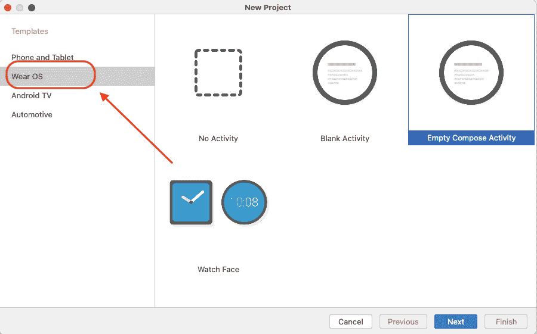

图 10.1 – 选择 Wear OS

1.  选择 `WearOSExample`。您会注意到它使用的是最小 SDK `API 30: Android` `11.0 (R)`。

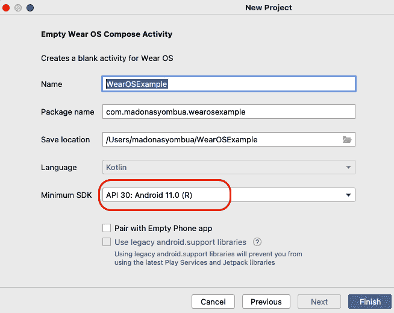

图 10.2 – 最小 SDK 版本

1.  点击 **完成**，您应该能够看到为您提供的示例代码模板。

1.  现在，让我们继续设置我们的虚拟 Wear OS 测试设备以运行提供的代码模板。导航到 **工具** | **设备管理器**，然后创建一个新设备。如果您在这个部分需要帮助，请参考 *第一章*，“现代 Android 开发技能入门”。

1.  现在，查看 *图 10.3* 以选择您的 Wear OS 虚拟测试设备。请注意，您也可以选择圆形、方形或矩形设备。我们将使用圆形。

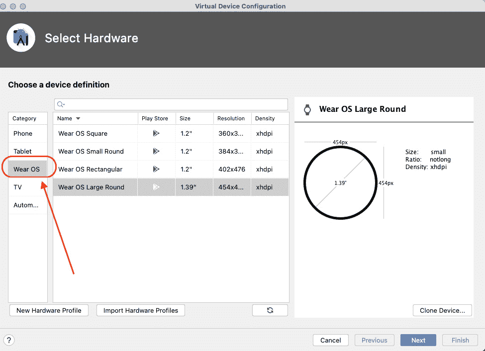

图 10.3 – 设置 Wear OS 虚拟设备

1.  点击 **下一步**，然后下载系统镜像 – 在我们的案例中，**R**，API 级别 30。

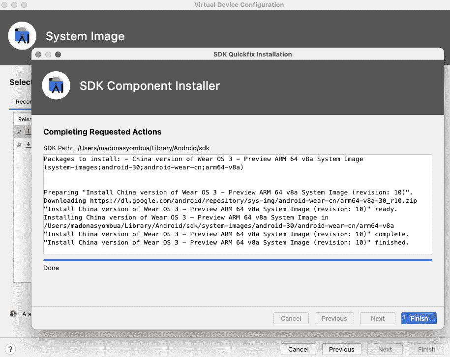

图 10.4 – 安装测试系统镜像

1.  然后，点击 **完成**，您应该有一个可用的 Wear OS 虚拟测试设备。

1.  现在，将 `Greeting()` 中的文本更改为代码模板中的 `"Hello, Android Community"` 并运行，您应该会有类似于 *图 10.5* 的结果。如果一切安装正确，您不应该有构建错误。

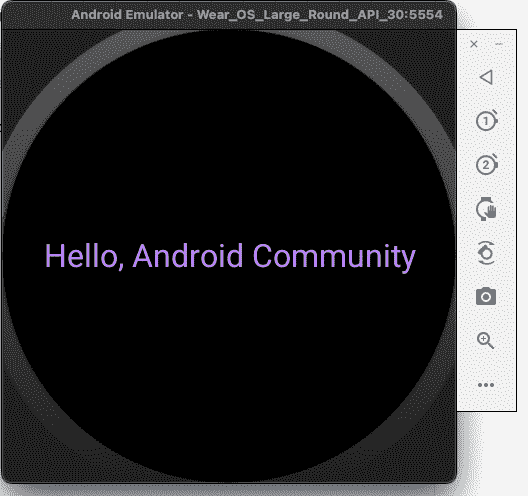

图 10.5 – 在 Wear OS 虚拟设备上显示问候语

1.  此外，确保您也更改了圆形字符串资源上的文本。

就这样，您已成功设置您的第一个 Wear OS，并且我们已经能够运行提供的 `Greeting()`。在接下来的配方中，我们将查看创建一个简单的按钮。

## 它是如何工作的…

您会注意到模板看起来与构建 Android 应用程序的方式完全一样，唯一的区别是使用的库。模板使用 Compose，这使得我们在开发中工作更加容易，因为我们将会使用我们在前几章中学到的大多数概念。

以下是比较，以帮助您了解 Wear OS 依赖项和标准依赖项之间的区别：

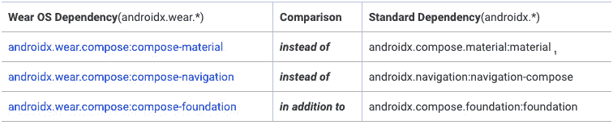

图 10.6 – 不同类型的依赖关系（来源：developer.android.com）

# 创建您的第一个按钮

在这个菜谱中，我们将创建 Wear OS 上的第一个按钮，以探索构建 Wear OS 的原则和最佳实践。

## 准备工作

您需要完成上一个菜谱，才能开始这个菜谱。我们将基于已经创建的 `WearOSExample` 项目进行构建。

## 如何实现...

要在 Jetpack Compose 中创建 Wear OS 上的第一个按钮，您可以按照以下步骤操作：

1.  使用已创建的项目，我们将添加一个新的按钮。让我们继续删除一些已提供的代码，`fun Greeting(greetingName: String)`：

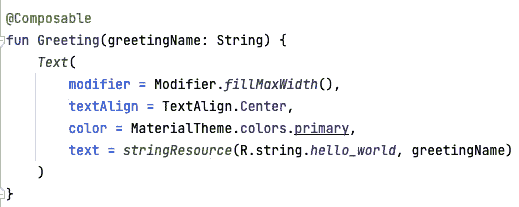

图 10.7 – 展示要删除内容的截图

1.  删除在 `WearOSExampleTheme` 中调用的 `Greeting()` 函数将引发错误；继续删除它。

1.  然后创建一个新的 `Composable` 函数来定义您的按钮。您可以使用 Jetpack Compose 提供的 `Button` 函数：

    ```kt
    @Composable
    ```

    ```kt
    fun SampleButton() {
    ```

    ```kt
        Button(
    ```

    ```kt
           onClick = { /* Handle button click */ },
    ```

    ```kt
           modifier = Modifier.fillMaxWidth()
    ```

    ```kt
        ) {
    ```

    ```kt
    Text("Click me")
    ```

    ```kt
        }
    ```

    ```kt
    }
    ```

1.  然后，在我们的 `WearApp()` 函数中调用新函数：

    ```kt
    @Composable
    ```

    ```kt
    fun WearApp() {
    ```

    ```kt
        WearOSExampleTheme {
    ```

    ```kt
            /* If you have enough items in your list, use
    ```

    ```kt
               [ScalingLazyColumn] which is an optimized
    ```

    ```kt
               version of LazyColumn for wear devices with
    ```

    ```kt
               some added features. For more information,
    ```

    ```kt
               see d.android.com/wear/compose./
    ```

    ```kt
            */
    ```

    ```kt
            Column(
    ```

    ```kt
                modifier = Modifier
    ```

    ```kt
                    .fillMaxSize()
    ```

    ```kt
                    .background(
    ```

    ```kt
                        MaterialTheme.colors.background),
    ```

    ```kt
                verticalArrangement = Arrangement.Center
    ```

    ```kt
            ) {
    ```

    ```kt
    SampleButton()
    ```

    ```kt
            }
    ```

    ```kt
        }
    ```

    ```kt
    }
    ```

1.  然后，在我们的活动中，使用按钮的 `Composable` 函数作为参数调用 `setContent` 方法：

    ```kt
    class MainActivity : ComponentActivity() {
    ```

    ```kt
        override fun onCreate(savedInstanceState: Bundle?)
    ```

    ```kt
        {
    ```

    ```kt
            super.onCreate(savedInstanceState)
    ```

    ```kt
            setContent {
    ```

    ```kt
    WearApp()
    ```

    ```kt
            }
    ```

    ```kt
    }
    ```

    ```kt
    }
    ```

1.  您还可以利用已提供的 `Preview` 函数来查看更改。您会注意到我们明确指定了设备，`@Preview(device = Devices.WEAR_OS_SMALL_ROUND, showSystemUi = true)`：

    ```kt
    @Preview(device = Devices.WEAR_OS_SMALL_ROUND, showSystemUi = true)
    ```

    ```kt
    @Composable
    ```

    ```kt
    fun DefaultPreview() {
    ```

    ```kt
        WearApp()
    ```

    ```kt
    }
    ```

1.  运行您的 Wear OS 应用，您应该在屏幕上看到您的按钮，如图 *图 10.8* 所示：


图 10.8 – Wear OS 中的按钮

1.  让我们看看另一个例子，这是一个带图标的按钮；这与第一个按钮非常相似，但在这个例子中，我们将只添加图标而不是文本。

1.  创建一个名为 `SampleButton2()` 的新函数，并添加以下代码：

    ```kt
    @Composable
    ```

    ```kt
    fun SampleButton2(
    ```

    ```kt
    ) {
    ```

    ```kt
        Row(
    ```

    ```kt
            modifier = Modifier
    ```

    ```kt
                .fillMaxWidth()
    ```

    ```kt
                .padding(bottom = 10.dp),
    ```

    ```kt
            horizontalArrangement = Arrangement.Center
    ```

    ```kt
        ) {
    ```

    ```kt
    Button(
    ```

    ```kt
                modifier = Modifier.size(
    ```

    ```kt
                    ButtonDefaults.LargeButtonSize),
    ```

    ```kt
                onClick = { /* Handle button click */ },
    ```

    ```kt
            ) {
    ```

    ```kt
    Icon(
    ```

    ```kt
                    imageVector =
    ```

    ```kt
                        Icons.Rounded.AccountBox,
    ```

    ```kt
                    contentDescription = stringResource(
    ```

    ```kt
                        id = R.string.account_box_icon),
    ```

    ```kt
                    modifier = Modifier
    ```

    ```kt
                        .size(24.dp)
    ```

    ```kt
                        .wrapContentSize(
    ```

    ```kt
                            align = Alignment.Center)
    ```

    ```kt
                )
    ```

    ```kt
            }
    ```

    ```kt
        }
    ```

    ```kt
    }
    ```

1.  最后，注释掉 `SampleButton`，添加 `SampleButton2`，并运行；您应该看到类似于 *图 10.9* 的内容：


图 10.9 – Wear OS 中的带图标的按钮

重要提示

需要注意的是，Wear OS 平台在设计和应用测试方面有一些独特的考虑因素，例如屏幕尺寸较小和需要优化电池寿命。在真实设备上测试您的应用对于确保它在 Wear OS 上按预期工作至关重要。

## 它是如何工作的...

根据您对 Compose 的先前知识，我们迄今为止所做的一切都应该看起来很熟悉。在我们的例子中，我们使用 Wear OS Compose 库中的 `SampleButton` 和 `WearOSExampleTheme` 来创建一个专门为 Wear OS 设备设计的按钮。

`SampleButton` 接收一个 `onClick` lambda，当按钮被点击时会被调用，以及一个设置按钮大小的修饰符，根据我们指定的内容，在我们的例子中，是一个简单的 `fillMaxWidth()`。

我们在列中使用`horizontalArrangement`来居中按钮，并使用`MaterialTheme`颜色来绘制背景。在 Wear OS 的情况下，谷歌建议使用默认的材料穿戴形状；这些形状已经针对非圆形和圆形设备进行了优化，这使得我们的工作作为开发者来说更容易。有关形状的更多信息，请参阅以下链接：[`developer.android.com/reference/kotlin/androidx/wear/compose/material/Shapes`](https://developer.android.com/reference/kotlin/androidx/wear/compose/material/Shapes)。

最后，我们使用`Text`可组合函数来显示按钮文本，这对于告诉用户按钮的预期用途至关重要。

# 实现可滚动列表

实现可滚动列表对于创建一个有效且用户友好的满足用户需求的 Android 应用至关重要。可滚动列表允许您在小型屏幕上显示大量信息，这在小型设备（如手表）上尤其有益。通过滚动列表，用户可以快速轻松地访问所有项目，而无需导航到不同的屏幕或页面。

用户在与列表交互时期望有一个平滑且响应灵敏的滚动体验。实现具有优化性能的可滚动列表可以帮助确保应用对用户来说感觉快速且响应灵敏。可滚动列表可以根据各种用例和设计要求进行定制。您可以调整列表的布局、外观和行为，以满足您应用的特定需求并提供独特的用户体验。在本食谱中，我们将探讨如何在 Wear OS 中实现可滚动列表。

## 准备工作

您需要完成上一个食谱才能开始这个食谱。我们将使用已经创建的`WearOSExample`项目来继续这一部分。

## 如何实现...

按照以下步骤使用 Jetpack Compose 在 Wear OS 中构建可滚动列表：

1.  在您的`MainActivity.kt`文件中，让我们创建一个新的`Composable`函数来包含您的可滚动列表。您可以将其命名为任何您喜欢的名称，但为了本例，我们将将其命名为`WearOSList`。

1.  另一个选项是创建一个新的包来更好地组织我们的代码，并将其命名为`components`。在`components`内部，创建一个新的 Kotlin 文件，并将其命名为`WearOsList`。

1.  在我们的`WearOSList`函数中，我们需要一个字符串列表作为示例；我们只需创建一些示例数据来展示一个例子：

    ```kt
    @Composable
    ```

    ```kt
    fun WearOSList(itemList: List<String>) {. . .}
    ```

1.  在我们的`WearOSList`函数内部，创建`ScalingLazyColumn`，它是针对 Wear OS 优化的。这将是我们的可滚动列表的容器。我们将在本章后面讨论`ScalingLazyColumn`：

    ```kt
    @Composable
    ```

    ```kt
    fun  WearOSList(itemList: List<String>) {
    ```

    ```kt
        ScalingLazyColumn() {
    ```

    ```kt
            // TODO: Add items to the list here
    ```

    ```kt
        }
    ```

    ```kt
    }
    ```

由于内容大小，构建 Wear OS 可能会具有挑战性，因此熟悉 Wear 的最佳实践是必要的。

1.  对于我们的项目，我们将创建一个新的`Composable`函数，命名为`WearOSListItem`，它将只有一个`text`，因为我们只是展示文本：

    ```kt
    @Composable
    ```

    ```kt
    fun WearOSListItem(item: String) {
    ```

    ```kt
        Text(text = item)
    ```

    ```kt
    }
    ```

1.  对于我们的数据，我们将创建一个虚拟列表，所以请继续在 `WearApp()` 函数中添加以下内容：

    ```kt
    val itemList = listOf(
    ```

    ```kt
        "Item 1",
    ```

    ```kt
        "Item 2",
    ```

    ```kt
        "Item 3",
    ```

    ```kt
        "Item 4",
    ```

    ```kt
        "Item 5",
    ```

    ```kt
        . . .
    ```

    ```kt
    )
    ```

1.  最后，注释掉我们创建的两个按钮，调用 `WearOSList`，传入 `itemList`，并运行应用程序：

    ```kt
    {
    ```

    ```kt
        // SampleButton()
    ```

    ```kt
        //SampleButton2()
    ```

    ```kt
        WearOSList(
    ```

    ```kt
            itemList = itemList,
    ```

    ```kt
            modifier = contentModifier
    ```

    ```kt
        )
    ```

    ```kt
    }
    ```

1.  您应该看到一个类似于 *图 10.10* 的列表：

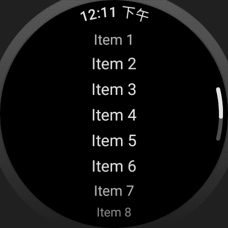

图 10.10 – 可滚动项目列表

## 它是如何工作的…

在此示例中，我们使用 Wear OS Compose 库中的 `WearOsList` 和 `WearOSExampleTheme` 来创建一个专为 Wear OS 设备设计的列表。

我们首先创建一个接受项目列表作为参数的 `WearOSList` 可组合函数。在 `ScalingLazyColumn` 内部，我们使用 `items` 函数遍历项目列表并为每个项目创建一个 `WearOSListItem`。

`WearOSListItem` 可组合函数有一个 `Composable` `text` 函数。

# 在 Wear OS 中实现卡片（TitleCard 和 AppCard）

当为 Wear OS 构建时，我们需要考虑两个重要的卡片：`AppCard` 和 `TitleCard`。卡片的一个良好用途是 **通知** 和 **智能回复**。如果您使用可穿戴设备，您可能知道这些是什么；如果您不使用可穿戴设备，您可以查找它们，但在这个菜谱中，我们也会探索示例。

此外，如果您创建通知卡片，您的目的是提供一个快速简便的方式查看和回复来自您应用的通知。当通知到达时，它将作为卡片出现在您的手表表面上，然后您可以滑动或点击以打开并与之交互。

对于智能回复卡片，此功能使用机器学习根据消息的上下文建议回复消息。这些卡片作为响应选项出现在通知中，允许您快速发送消息而无需手动输入。

通知和智能回复卡片都是必不可少的，因为它们提供了一种高效且简化的方式来管理通知和回复消息，而无需不断拿出手机。它们允许您在移动时保持连接，并让您在不打扰日常生活的情况下了解重要信息，这就是为什么 Wear OS 会一直存在，并且了解如何为其构建将非常有用。在这个菜谱中，我们将创建一个简单的卡片，并看看如何在 Wear OS 中处理导航。

## 准备工作

您必须完成之前的菜谱才能继续此菜谱。

## 如何做到这一点…

这是一个在 Wear OS 中使用 Jetpack Compose 创建卡片的示例。打开 `WearOSExample` 项目并跟随代码：

1.  在 `components` 包内，让我们创建一个新的 Kotlin 文件，并将其命名为 `MessageCardExample`。

1.  在 `MessageCardExample` 内部，创建一个新的可组合函数，命名为 `MessageCard`：

    ```kt
    @Composable
    ```

    ```kt
    fun MessageCard(){. . .}
    ```

1.  我们现在必须调用 `AppCard()`，因为这是我们想要的。`AppCard` 接受 `appName`、`time`、`title` 等，如图 *图 10.11* 所示。这意味着您可以根据需要自定义 `AppCard` `()`：

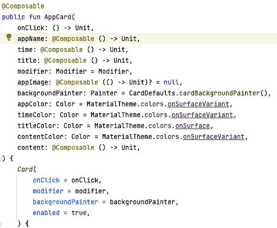

图 10.11 – AppCard 可组合函数

1.  这使得我们的工作更容易，作为开发者，我们知道在构建时需要什么，从而提高了开发者的生产力：

    ```kt
    @Composable
    ```

    ```kt
    fun MessageCard() {
    ```

    ```kt
        AppCard(
    ```

    ```kt
            onClick = { /*TODO*/ },
    ```

    ```kt
            appName = { /*TODO*/ },
    ```

    ```kt
            time = { /*TODO*/ },
    ```

    ```kt
            title = { /*TODO*/ }) {
    ```

    ```kt
            }
    ```

    ```kt
    }
    ```

1.  现在，让我们继续实现我们的 `AppCard()` 并向我们的用户发送消息。在我们的例子中，我们将硬编码数据，但如果你有一个端点，你可以拉取数据并按需显示：

    ```kt
    @Composable
    ```

    ```kt
    fun MessageCard() {
    ```

    ```kt
        AppCard(
    ```

    ```kt
            modifier = Modifier
    ```

    ```kt
                .fillMaxWidth()
    ```

    ```kt
                .padding(bottom = 8.dp),
    ```

    ```kt
            appImage = {
    ```

    ```kt
    Icon(
    ```

    ```kt
                    modifier = Modifier
    ```

    ```kt
                        .size(24.dp)
    ```

    ```kt
                        .wrapContentSize(
    ```

    ```kt
                            align = Alignment.Center),
    ```

    ```kt
                    imageVector = Icons.Rounded.Email,
    ```

    ```kt
                    contentDescription = stringResource(
    ```

    ```kt
                        id = R.string.message_icon)
    ```

    ```kt
                )
    ```

    ```kt
            },
    ```

    ```kt
            onClick = { /*Do something*/ },
    ```

    ```kt
            appName = {  stringResource(
    ```

    ```kt
                id = R.string.notification_message) },
    ```

    ```kt
           time = {  stringResource(id = R.string.time) },
    ```

    ```kt
           title = { stringResource(
    ```

    ```kt
               id = R.string.notification_owner) }) {
    ```

    ```kt
    Text(text = stringResource(
    ```

    ```kt
               id = R.string.hi_android))
    ```

    ```kt
           }
    ```

    ```kt
    }
    ```

1.  在 `MainActivity` 中，注释掉其他可组合函数，现在添加 `MessageCard()` 并运行它：


图 10.12 – 带通知的 AppCard

## 它是如何工作的……

`TitleCard` 和 `AppCard` 都用于在 Wear OS 上显示信息，但它们有不同的用途。在我们的例子中，我们使用 `AppCard()`，但正如你在 *图 10**.13* 中所看到的，`TitleCard()` 接收几个与 `AppCard()` 类似的输入：

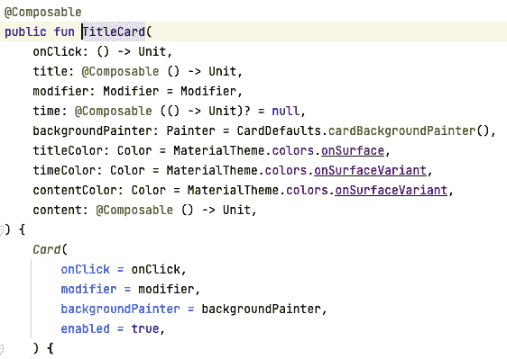

图 10.13 – TitleCard 输入

你可以使用 `TitleCard()` 来显示与当前上下文相关的信息，例如正在播放的歌曲名称或正在观看的电影标题。它通常显示在屏幕顶部，可以通过滑动来关闭。一个好的例子是 Spotify。

当使用 `AppCard()` 时，你可以显示当前运行的应用程序的信息，例如应用程序的名称和它所做简要描述，就像我们在示例中所做的那样。它通常显示在一个较小的卡片上，可以点击打开应用程序。这就是为什么它有 `onClick{/**TODO*/}`，这可以引导到更多信息。

当决定是否使用 `TitleCard()` 或 `AppCard()` 时，你应该考虑以下因素：

+   需要显示的信息量

+   信息与当前上下文的相关性

+   所期望的用户体验

如果你需要显示大量信息，`TitleCard()` 可能是一个更好的选择。如果你只需要显示少量信息，`AppCard()` 可能是一个更好的选择。如果你想显示的信息与当前上下文相关，`TitleCard()` 可能是一个更好的选择。如果你想显示的信息在一个可以点击打开应用程序的较小卡片上，`AppCard()` 可能是一个更好的选择。

# 实现芯片和切换芯片

在这个菜谱中，我们将探索重要的 Wear 组件；芯片和切换芯片都用于显示和交互数据。

**芯片**是一个可以用来显示文本、图标和其他信息的微小、矩形元素。它通常用来显示相关或具有共同主题的项目。

**切换芯片**是一个可以用来表示二进制值的组件。它通常用来表示诸如开/关、是/否或真/假等事物。

公平地说，你可以在你的常规应用中使用这些组件，我们将在 *第十一章* 中进一步探讨它们。在决定使用哪个组件时，你应该考虑以下因素：

+   你想要显示的数据类型

+   你想要启用的交互类型

+   你想要达到的外观和感觉

## 准备工作

我们将使用已经创建的项目来处理本节内容。

## 如何操作…

在这个菜谱中，我们将创建一个芯片和一个切换芯片。按照以下步骤操作：

1.  让我们继续构建我们的第一个芯片；在 `components` 包内，创建一个 Kotlin 文件，并将其命名为 `ChipExample.kt`。

1.  在文件内部，创建一个名为 `ChipWearExample()` 的可组合函数。

1.  现在，让我们调用 `Chip()` 可组合函数。你还可以使用 `Chip` 组件来显示动态信息。为此，你可以使用 `modifier` 属性来指定一个函数，该函数将被调用来更新芯片上显示的信息：

    ```kt
    @Composable
    ```

    ```kt
    fun ChipWearExample(){
    ```

    ```kt
        Chip(
    ```

    ```kt
            modifier = Modifier
    ```

    ```kt
                .fillMaxWidth()
    ```

    ```kt
                .padding(bottom = 8.dp),
    ```

    ```kt
            onClick = { /*TODO */ },
    ```

    ```kt
            label = {
    ```

    ```kt
    Text(
    ```

    ```kt
                    text = stringResource(
    ```

    ```kt
                        id = R.string.chip_detail),
    ```

    ```kt
                    maxLines = 1,
    ```

    ```kt
                    overflow = TextOverflow.Ellipsis
    ```

    ```kt
                )
    ```

    ```kt
            },
    ```

    ```kt
            icon = {
    ```

    ```kt
    Icon(
    ```

    ```kt
                    imageVector = Icons.Rounded.Phone,
    ```

    ```kt
                    contentDescription = stringResource(
    ```

    ```kt
                        id = R.string.phone),
    ```

    ```kt
                    modifier = Modifier
    ```

    ```kt
                        .size(24.dp)
    ```

    ```kt
                        .wrapContentSize(
    ```

    ```kt
                            align = Alignment.Center)
    ```

    ```kt
                )
    ```

    ```kt
            },
    ```

    ```kt
        )
    ```

    ```kt
    }
    ```

1.  在 `MainActivity` 中，先注释掉现有的 `Composable` 函数，添加 `ChipWearExample()`，然后运行应用：


图 10.14 – 带有消息的芯片

1.  现在，让我们创建一个切换芯片；在我们的 `component` 包内，创建一个 Kotlin 文件，并将其命名为 `ToggleChipExample`。

1.  在 `ToggleChipExample` 内部，创建一个名为 `ToggleChipWearExample()` 的 `Composable` 函数。我们将使用 `ToggleChip()` 组件：

    ```kt
    @Composable
    ```

    ```kt
    fun ToggleChipWearExample() {
    ```

    ```kt
        var isChecked by remember { mutableStateOf(true) }
    ```

    ```kt
    ToggleChip(
    ```

    ```kt
                modifier = Modifier
    ```

    ```kt
                    .fillMaxWidth()
    ```

    ```kt
                    .padding(bottom = 8.dp),
    ```

    ```kt
                checked = isChecked,
    ```

    ```kt
                toggleControl = {
    ```

    ```kt
    Switch(
    ```

    ```kt
                        checked = isChecked
    ```

    ```kt
                    )
    ```

    ```kt
                },
    ```

    ```kt
                onCheckedChange = {
    ```

    ```kt
    isChecked = it
    ```

    ```kt
                },
    ```

    ```kt
                label = {
    ```

    ```kt
    Text(
    ```

    ```kt
                        text = stringResource(
    ```

    ```kt
                            id = R.string.alert),
    ```

    ```kt
                        maxLines = 1,
    ```

    ```kt
                        overflow = TextOverflow.Ellipsis
    ```

    ```kt
                    )
    ```

    ```kt
                }
    ```

    ```kt
    )
    ```

    ```kt
    }
    ```

1.  最后，运行代码，你应该能够根据是否想要接收通知来切换芯片的开和关：


图 10.15 – 切换芯片

## 工作原理…

要在 Wear OS Jetpack Compose 中实现芯片，我们需要使用已经提供的 `Chip()` 组件。`Chip()` 组件是体育场形状的，具有最大高度设计，最多只能显示两行文本，可以用来显示文本、图标和其他信息。

你也可以使用 `Chip()` 组件来显示动态信息。为此，你可以使用 `modifier` 属性来指定一个函数，该函数将被调用来更新芯片上显示的信息。你可以查看 `Chip()` 组件以了解它接受哪些参数。

`ToggleChip()` 可组合函数接受多个参数；以下是一些重要的参数：

+   `checked`：一个表示切换芯片当前是否被选中的布尔值

+   `onCheckedChange`：一个当切换芯片的选中状态改变时将被调用的 lambda 函数

+   `modifier`：一个可选的修饰符，可以用来自定义切换芯片的外观或行为

+   `colors`：一个可选的 `ToggleChipColors` 对象，可以用来自定义切换芯片的颜色

我们使用`TextOverflow`来处理溢出的文本，因为我们处理的是小屏幕。查看*图 10.15*以获取关于`ToggleChip`接受哪些参数的更多详细信息：

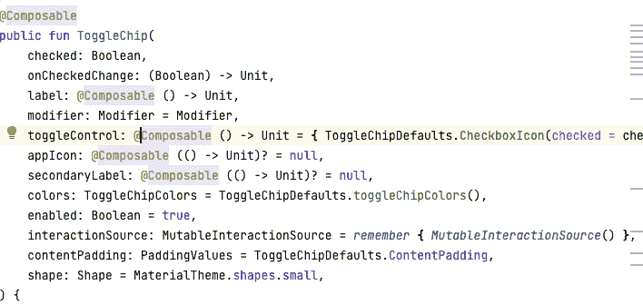

图 10.16 – ToggleChip 可组合函数接受的参数

# 将`ScalingLazyColumn`实现为展示您的内容

`ScalingLazyColumn`扩展了`LazyColumn`，在 Jetpack Compose 中非常强大。您可以将`ScalingLazyColumn`视为 Wear OS 中用于显示可垂直滚动的项目列表的组件。项目根据其在列表中的位置进行缩放和定位，整个列表可以通过拖动列表的顶部或底部进行滚动。

您可以使用它，例如，来显示组件列表；在我们的示例中，我们将使用它来显示我们在之前的食谱中创建的所有元素。您还会注意到我们在*实现可滚动列表*食谱中使用了它，在那里我们有一个列表并显示了项目。

## 准备工作

您需要完成之前的食谱才能继续进行本食谱。此外，在本食谱中，我们不会对创建的所有元素进行注释，而是将它们作为`ScalingLazyColumn`中的项目显示。

## 如何操作…

按照以下步骤构建您的第一个`ScalingLazyColumn`：

1.  在`MainActivity`中，您会注意到一条注释：

    ```kt
    /* If you have enough items in your list, use [ScalingLazyColumn] which is an optimized
    ```

    ```kt
    * version of LazyColumn for wear devices with some added features. For more information,
    ```

    ```kt
    * see d.android.com/wear/compose.
    ```

    ```kt
    */
    ```

评论呼吁开发者利用`ScalingLazyColumn`，这是`LazyColumn`针对 Wear OS 的优化版本。

1.  我们需要首先创建一个`scalingListState`值并将其初始化为`rememberScalingLazyListState()`：

    ```kt
    val scalingListState = rememberScalingLazyListState()
    ```

`rememberScalingLazyListState()`函数简单地按照其定义执行，即记住状态。

1.  现在，我们需要通过移除我们添加的修饰符并使用一个修饰符来处理所有视图来清理我们的 Composable 函数。让我们创建一个`contentModifier = Modifier`，以及一个用于我们的图标：

    ```kt
    val contentModifier =  Modifier
    ```

    ```kt
        .fillMaxWidth()
    ```

    ```kt
        .padding(bottom = 8.dp)
    ```

    ```kt
    val iconModifier =  Modifier
    ```

    ```kt
        .size(24.dp)
    ```

    ```kt
        .wrapContentSize(align = Alignment.Center)
    ```

1.  我们还需要创建一个`Scaffold()`，它实现了 Wear Material Design 的视觉布局结构。`Scaffold()`使用`modifier`、`vignette`、`positionIndicator`、`pageIndicator`、`timeText`和`content`。

1.  让我们继续构建我们的屏幕。在`Scaffold`中，我们将使用三个参数：`vignette`（这是一个全屏槽，用于在 scaffold 的内容上应用 vignette）、`positionIndicator`和`timeText`。查看*它如何工作…*部分以了解更多关于参数的信息：

    ```kt
    Scaffold(timeText = {} , vignette = {}, positionIndicator = {}) {. . .}
    ```

1.  对于`TimeText`，我们将调用`Modifier.scrollAway`并传递`scalingListState`：

    ```kt
    TimeText(modifier = Modifier.scrollAway(scalingListState))
    ```

1.  由于我们的项目样本只有一个屏幕，且可滚动，我们将尝试同时显示所有项目并始终保持。因此，在`vignette`中，我们将说位置将是`TopAndBottom`：

    ```kt
    Vignette(vignettePosition = VignettePosition.TopAndBottom)
    ```

1.  最后，在`positionIndicator`上，我们只需传递`scalingListState`：

    ```kt
    PositionIndicator( scalingLazyListState = scalingListState)
    ```

1.  现在，我们终于可以构建我们的 `ScalingLazyColumn()`。我们将使用 `fillMaxSize` 作为修饰符，并将 `autoCentering` 设置为零索引；然后对于 `state`，传递我们已创建的 `scalingListState`，在项目项中传递我们的组件：

    ```kt
    Scaffold(
    ```

    ```kt
        timeText = { TimeText(modifier =
    ```

    ```kt
            Modifier.scrollAway(scalingListState)) },
    ```

    ```kt
        vignette = { Vignette(vignettePosition =
    ```

    ```kt
            VignettePosition.TopAndBottom) },
    ```

    ```kt
        positionIndicator = {
    ```

    ```kt
    PositionIndicator(
    ```

    ```kt
                scalingLazyListState = scalingListState
    ```

    ```kt
            )
    ```

    ```kt
        }
    ```

    ```kt
    ) {
    ```

    ```kt
    ScalingLazyColumn(
    ```

    ```kt
            modifier = Modifier.fillMaxSize(),
    ```

    ```kt
            autoCentering = AutoCenteringParams(
    ```

    ```kt
                itemIndex = 0),
    ```

    ```kt
            state = scalingListState
    ```

    ```kt
        ){
    ```

    ```kt
    item { /*TODO*/ }
    ```

    ```kt
    item { /*TODO*/ }
    ```

    ```kt
    item { /*TODO*/ }
    ```

    ```kt
    item { /*TODO*/ }
    ```

    ```kt
        }
    ```

    ```kt
    }
    ```

1.  您可以在 *技术要求* 部分获取完整的代码。为了清理 `item{}` 中的部分代码，我们有以下内容：

    ```kt
    item { SampleButton(contentModifier) }
    ```

    ```kt
    item { SampleButton2(contentModifier, iconModifier) }
    ```

    ```kt
    item { MessageCard(contentModifier, iconModifier) }
    ```

    ```kt
    item { ChipWearExample(contentModifier, iconModifier) }
    ```

    ```kt
    item { ToggleChipWearExample(contentModifier) }
    ```

1.  最后，当您运行应用程序时，您应该能够看到所有显示的项目，并且能够平滑地滚动。


图 10.17 – Wear OS 上的我们的可组合元素

## 它是如何工作的…

Wear OS Jetpack Compose 是一个用于使用 Jetpack Compose 框架构建 Wear OS 应用的 UI 工具包。它旨在使开发者更容易、更高效地创建具有现代和响应式界面的可穿戴应用。正如之前提到的，名为 `Scaffold()` 的 `Composable` 函数有几个输入。在 *图 10**.18* 中，您将看到它们的意义以及为什么您可能想要使用它们：

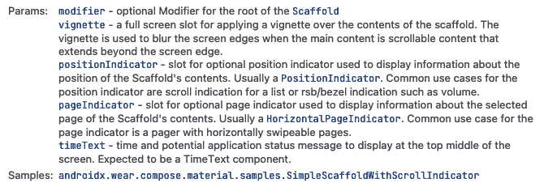

图 10.18 – Scaffold 函数参数

Wear OS 在 Jetpack Compose 中的某些显著优势是它提供了一套针对 Wear OS 设备独特特性优化的预构建 UI 组件。其中一个关键好处是它通过减少创建 UI 所需的样板代码量来简化开发过程。

它还提供了一致且灵活的 UI 设计语言，可以在不同的应用中使用。关于 Wear OS 还有更多可以学习的内容；此外，由于这是一项新技术，这里的一些概念可能会因为未来 API 的变化而改变或进步，但到目前为止，您可以通过以下链接了解更多信息：[`developer.android.com/wear`](https://developer.android.com/wear)。

重要提示

在 Wear OS 中还有更多可以构建的内容；例如，您可以构建一个瓷砖，并在瓷砖项被点击时执行操作。要了解更多关于如何创建您的第一个瓷砖的信息，请点击此链接：[`developer.android.com/codelabs/wear-tiles`](https://developer.android.com/codelabs/wear-tiles)。
