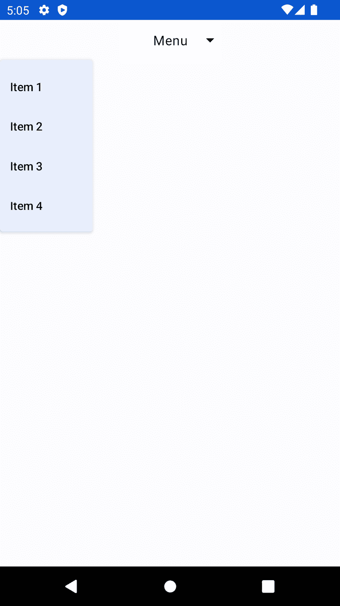
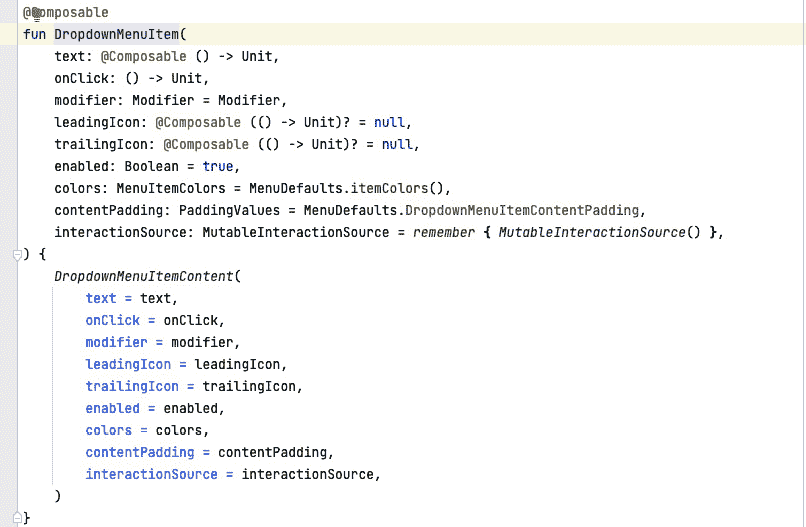
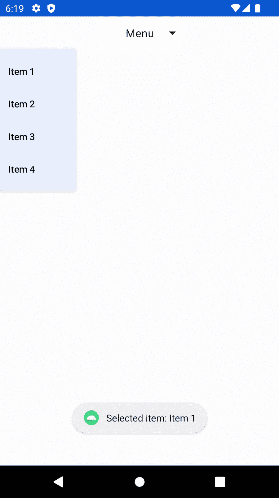
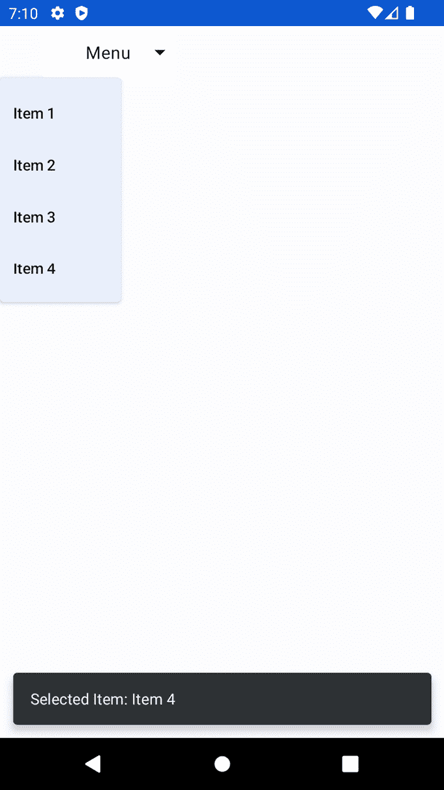
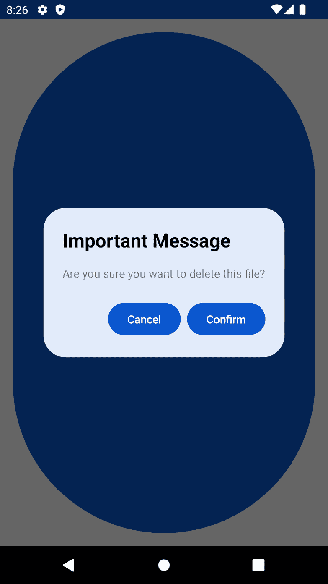
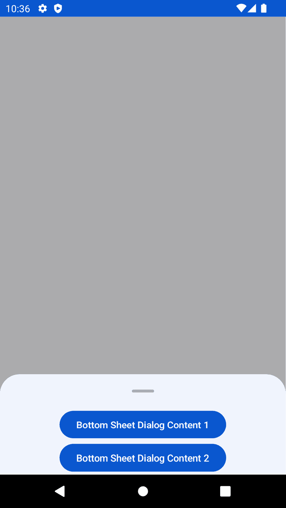
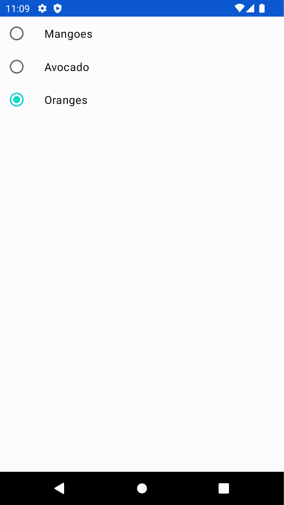
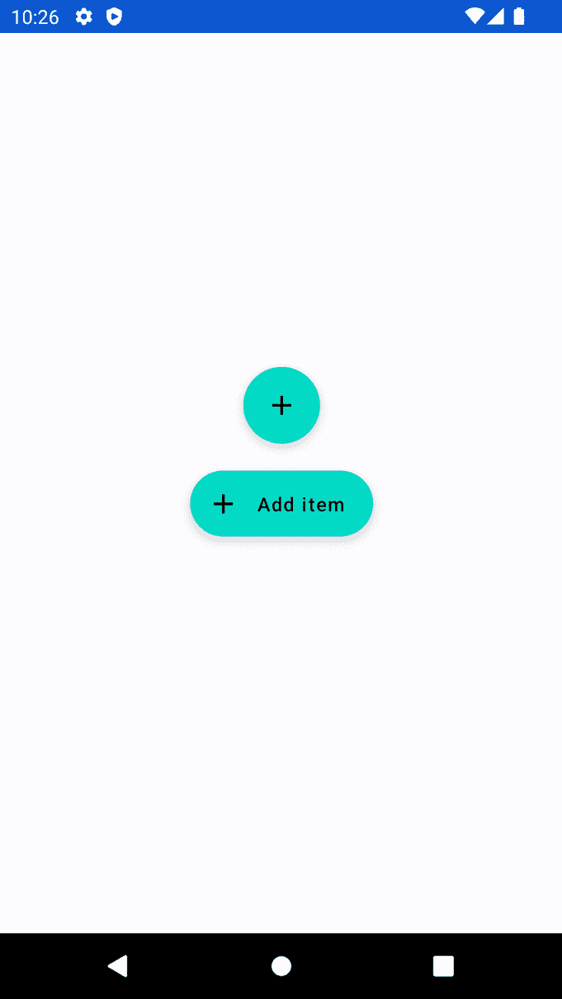

# GUI 警告 - 在现代安卓开发中菜单、对话框、Toast、Snackbar 等的新特性

**图形用户界面**（**GUI**）警告对用户至关重要，因为它们提供了关于程序或应用程序状态的临界信息，并帮助用户避免错误和做出明智的决定。警告可以在各种情况下触发，例如当发生错误、程序执行关键操作或当用户即将执行不可逆操作时。

GUI 警告的主要好处之一是它们为用户提供即时反馈。例如，如果用户在表单中输入了错误信息，警告可以迅速通知他们错误，允许他们在继续之前进行纠正。这有助于防止错误并在长期内节省时间。

图形用户界面（GUI）警告的另一个好处是它们可以帮助防止意外操作。例如，如果用户即将删除一个重要的文件，警告可以提醒他们这一行为的潜在后果，在继续之前给他们一个重新考虑的机会。本章将探讨在现代安卓开发中如何实现 GUI。

本章将涵盖以下内容：

+   在现代安卓开发中创建和显示菜单

+   实现 Toast/Snackbars 来提醒用户

+   创建一个警告对话框

+   创建一个`BottomSheet`对话框

+   创建一个单选按钮

+   创建**浮动操作按钮**（**FABs**）和扩展 FABs

# 技术要求

本章的完整源代码可以在[`github.com/PacktPublishing/Modern-Android-13-Development-Cookbook/tree/main/chapter_eleven`](https://github.com/PacktPublishing/Modern-Android-13-Development-Cookbook/tree/main/chapter_eleven)找到。

# 在现代安卓开发中创建和显示菜单

在安卓应用中创建菜单可以提供以下好处：

+   菜单可以帮助用户快速访问应用内的不同功能和特性。一个设计良好的菜单可以通过简化导航和使用应用来提升用户体验。

+   在应用的不同屏幕上保持一致的菜单可以帮助用户快速找到他们想要的内容，使应用看起来更加精致和专业。

+   菜单可以用来将相关的选项和功能分组在一个地方，减少需要许多按钮和选项的杂乱屏幕。

+   菜单也可以根据应用的具体需求进行定制，包括不同类型的菜单，如上下文菜单、弹出菜单和导航抽屉。

+   菜单的设计应考虑可访问性，使有障碍的用户更容易导航应用。

也就是说，在安卓应用中创建菜单可以提升用户体验，提供一致性，节省空间，并提高可访问性。

## 准备工作

对于本章，我们将创建一个新的 Material 3 项目，命名为`GUIAlerts`；这是我们将在其中添加本章所有 UI 组件的地方，你也可以利用这个项目来修改视图以满足你的需求。

## 如何实现…

按照以下步骤构建你的第一个汉堡菜单：

1.  在我们新创建的项目`GUIAlerts`中，让我们创建一个包组件，并在包内创建一个名为`MenuComponent.kt`的 Kotlin 文件。

1.  让我们在 Kotlin 文件中创建一个可组合函数`OurMenu`：

    ```kt
    @Composable
    ```

    ```kt
    fun OurMenu(){ }
    ```

1.  现在，让我们继续创建我们的菜单。为了我们的目的，我们只展示一些项目，当有人点击时，不会发生任何事情，因为我们不会实现`onClick`函数。首先，我们需要确保它不是以`expanded`开始的，这意味着用户需要点击来展开菜单，并且它将响应地变为`true`：

    ```kt
    @Composable
    ```

    ```kt
    fun OurMenu(){
    ```

    ```kt
    var expanded by remember { mutableStateOf(false) }
    ```

    ```kt
    val menuItems = listOf("Item 1", "Item 2", "Item 3",
    ```

    ```kt
    "Item 4") }
    ```

对于我们的菜单项，我们将只展示四个项目。

1.  接下来，我们必须创建一个`Box()`，将其对齐到中心，并响应修改器中的`expanded`状态。我们还需要添加一个图标`ArrowDropDown`，以通知用户他们可以点击，并且我们还有更多项目：

    ```kt
    Box(
    ```

    ```kt
        contentAlignment = Alignment.Center,
    ```

    ```kt
        modifier = Modifier
    ```

    ```kt
            .clickable { expanded = true }
    ```

    ```kt
    ) {
    ```

    ```kt
        Text(stringResource(id = R.string.menu))
    ```

    ```kt
        Icon(
    ```

    ```kt
            imageVector = Icons.Default.ArrowDropDown,
    ```

    ```kt
            contentDescription = stringResource(
    ```

    ```kt
                id = R.string.menu_drop_down),
    ```

    ```kt
            modifier = Modifier.align(Alignment.CenterEnd)
    ```

    ```kt
        )
    ```

    ```kt
    }
    ```

1.  最后，我们需要添加`DropDownMenu`，当点击图标时它会展开，我们将`onDismissRequest`设置为`false`；当用户请求关闭菜单时调用，例如，当轻触时。

1.  然后，我们将显示我们的项目在`DropdownMenuItem`函数上，以便当它被点击时执行操作。在我们的示例中，我们不做任何事情：

    ```kt
    DropdownMenu(
    ```

    ```kt
        expanded = expanded,
    ```

    ```kt
        onDismissRequest = { expanded = false }
    ```

    ```kt
    ) {
    ```

    ```kt
        menuItems.forEachIndexed { index, item ->
    ```

    ```kt
            DropdownMenuItem(text = { Text(item)},
    ```

    ```kt
                onClick = { /*TODO*/ })
    ```

    ```kt
        }
    ```

    ```kt
    }
    ```

1.  最后，当你运行应用程序时，你应该看到一个带有可点击项目的菜单下拉菜单。



图 11.1 – 下拉菜单

重要提示

你可以根据需要和风格自定义下拉菜单。

## 它是如何工作的…

在我们的示例中，我们首先声明一个可变状态变量`expanded`，用于跟踪菜单是否展开，以及另一个可变状态变量`selectedMenuItem`，用于跟踪当前选定的菜单项。

我们还定义了一个`menuItems`列表，这有助于我们知道菜单列表。

在我们的`Box`中，我们定义了一个`Column()`，它包含菜单标题、一个可点击的`Box`，用于显示选定的菜单项，以及一个`DropdownMenu`，当展开时显示菜单项。我们使用`Box`和`DropdownMenu`组件来定位菜单项相对于可点击的`Box`的位置。

`DropDownMenu`接受一些输入，正如你在*图 11.2*中看到的，这有助于你根据需要自定义下拉菜单。



图 11.2 – DropDownMenuItem 输入参数

最后，我们使用`DropdownMenuItem`组件来显示每个菜单项，并在点击菜单项时更新`selectedMenuItem`和`expanded`变量。

# 实现 Toast/Snackbar 来提醒用户

在 Android 开发中，Toast/Snackbar 是一种小型的弹出消息，通常出现在屏幕底部。它用于向用户提供简短的信息或反馈。这是一种在不打断用户工作流程的情况下向用户显示短消息的简单方式。

## 准备中

在本节中，我们将对我们在`DropMenuItem`中创建的项目做出反应，因此你必须遵循之前的食谱才能继续本食谱。

## 如何实现…

执行以下步骤以在点击项目时添加消息，告诉用户他们已选择特定项目：

1.  在 Android 中创建 Toast 非常简单；你可以简单地使用 Android SDK 提供的`Toast`类来完成。你可以通过调用`Toast`类的静态`makeText()`方法来创建一个新的`Toast`对象，并传递上下文、消息和 Toast 的持续时间。

1.  一旦创建了`Toast`对象，你可以调用`show()`方法来在屏幕上显示它：

    ```kt
    Toast.makeText(context, "Hello, Android!", Toast.LENGTH_SHORT).show();
    ```

1.  然而，在 Jetpack Compose 中，要显示 Toast，我们需要使用`coroutineScope`，但请注意，在所有情况下显示 Toast 并不一定需要协程，在我们的示例中，我们将使用`launch`函数来启动一个显示 Toast 消息的协程：

    ```kt
    val coroutineScope = rememberCoroutine()
    ```

    ```kt
    coroutineScope.launch {
    ```

    ```kt
        Toast.makeText(
    ```

    ```kt
            context,
    ```

    ```kt
            "Selected item: $item",
    ```

    ```kt
            Toast.LENGTH_SHORT
    ```

    ```kt
        ).show()
    ```

    ```kt
    }
    ```

1.  要连接`onClick()`，请参阅*技术要求*部分的代码以获取完整代码。最后，当你运行应用程序时，你应该看到一条包含所选项目作为消息的 Toast 消息。



图 11.3 – 显示的 Toast 消息

1.  在以下示例中，我们将使用 Snackbar 而不是 Toast：

    ```kt
    coroutineScope.launch {
    ```

    ```kt
        Toast.makeText(
    ```

    ```kt
            context,
    ```

    ```kt
            "Selected item: $item",
    ```

    ```kt
            Toast.LENGTH_SHORT
    ```

    ```kt
        ).show()
    ```

    ```kt
    }
    ```

在 Jetpack Compose 中，使用 Snackbar 的方式有多种；你可以用它与`Scaffold`一起使用，也可以不使用它。然而，建议使用带有`Scaffold`的 Snackbar。在我们的示例中，我们将使用`Scaffold`：

```kt
menuItems.forEachIndexed { index, item ->
    DropdownMenuItem(
        text = { Text(item) },
        onClick = {
            coroutineScope.launch {
                snackbarHostState.showSnackbar(
                    message = "Selected Item: $item"
                )
            }
        }
    )
}
```

1.  最后，当你运行应用程序时，你将看到一条包含所选项目文本和所选项目的 Snackbar。`Toast`和`Snackbar`都服务于相同的目的。



图 11.4 – 显示的 Snackbar 消息

## 它是如何工作的…

Toasts 和 Snackbars 是两种可以在 Android 应用程序中使用的通知消息类型，用于向用户显示短消息。

Toast 和 Snackbar 之间的主要区别如下：

+   Toast 消息通常在屏幕中央显示，而 Snackbar 消息通常在屏幕底部显示。

+   Toast 消息通常持续很短的时间，通常约为 2-3 秒，然后自动消失。Snackbar 消息通常显示更长时间，并且可以通过用户滑动或点击按钮来关闭。

+   Toast 消息是非交互式的，用户无法将其取消。另一方面，Snackbar 消息可以包含操作按钮，允许用户对消息做出特定响应。

+   Toast 消息通常是出现在小弹出窗口中的纯文本消息。另一方面，Snackbar 消息可以设计成包含图标、颜色和其他视觉元素，使其更具视觉吸引力和信息性。

我们修改了`DropdownMenuItem`组件的`onClick`回调，以启动一个显示`Toast`消息的协程，使用`Toast.makeText`函数。我们通过`LocalContext.current`传入当前上下文，它获取当前上下文函数和要显示在`Toast`消息中的文本作为字符串。您还应该指定`Toast`的持续时间，可以是`Short`或`Long`。

当使用`Snackbar`时，我们创建一个`SnackbarHostState`，并将其传递给我们的`Scaffold`。我们的可组合组件包括一个`snackbarHost`参数，指定在显示时显示 Snackbar 的函数。`SnackbarHost`函数接受两个参数：`snackbarData`，它包含 Snackbar 的消息和操作按钮，以及一个 lambda，指定如何创建`Snackbar`可组合组件。

在 Android 中，`Scaffold`是一个预构建的 UI 组件或布局，它为构建屏幕和 UI 组件提供了基本结构。术语**Scaffold**通常与模板或样板术语互换使用。

Scaffold 在 Android 应用程序开发框架（如 Flutter 或 Jetpack Compose）中很常见，用于为创建新屏幕或 UI 组件提供起点。

例如，Android 中的 Material Design 库提供了几个预构建的 scaffolds，用于常见的屏幕类型，如登录屏幕、设置屏幕或列表屏幕。这些 scaffolds 提供了一致的外观和感觉，并有助于确保应用程序遵循 Material Design 指南。

使用 scaffolds 可以通过提供构建屏幕和 UI 组件的起点来节省应用程序开发的时间和精力。然而，开发者也可以自定义和扩展 scaffolds 以满足他们应用程序的特定要求。

# 创建警告对话框

弹出警告对话框是 Android 应用程序 UI 的一个基本组件。它们用于向用户显示重要消息、通知和警告。使用弹出警告对话框在 Android 中至关重要的原因如下：

+   它们可以帮助突出显示用户需要知道的重要信息。例如，如果用户即将执行可能导致数据丢失或损坏的操作，应用程序可以在弹出警告对话框中显示警告消息，以确保用户知道后果。

+   它们可以用来获取用户对必要操作的确认，例如删除文件或购买某物。通过显示一个请求用户确认操作的消息，应用程序可以帮助防止意外或不受欢迎的操作。

+   它们可以用来向用户提供反馈，例如让他们知道一个操作是成功还是失败。例如，如果用户尝试保存一个已存在的文件，应用程序可以显示一个弹出警告对话框，告知用户问题并提供如何继续的建议。

+   它们可以通过提供精确且简洁的消息来帮助用户理解应用程序内部正在发生的事情，从而帮助提高应用程序的整体用户体验。

警告对话框是 Android 应用设计的重要组成部分。它们可以用来突出显示重要信息、获取用户确认、提供反馈，并改善整体用户体验。

## 准备工作

我们将继续使用同一个项目，所以请确保你已经完成了之前的菜谱。为了跟上，请确保你也获得了 *技术要求* 部分的代码。

## 如何做…

按照以下步骤创建一个警告对话框：

1.  让我们先创建一个 Kotlin 文件，并将其命名为 `AlertDialogDemo.kt`。

1.  在 `AlertDialogDemo` 中创建一个可组合函数，并命名为 `AlertDialogExample()`：

    ```kt
    @Composable
    ```

    ```kt
    fun AlertDialogExample() {...}
    ```

实现 `AlertDialog()` 有不同的方法；在我们的例子中，我们将创建一个按钮，点击该按钮将启动 `dialog()`。

1.  然后，我们必须向 `AlertDialog` 添加标题和文本属性。我们使用 `Text` 组件来定义标题和消息文本，并根据需要设置 `fontWeight` 和 `color` 属性：

    ```kt
    AlertDialog(
    ```

    ```kt
        onDismissRequest = { dialog.value = false },
    ```

    ```kt
        title = {
    ```

    ```kt
            Text(
    ```

    ```kt
                text = stringResource(
    ```

    ```kt
                    id = R.string.title_message),
    ```

    ```kt
                fontWeight = FontWeight.Bold,
    ```

    ```kt
                color = Color.Black
    ```

    ```kt
            )
    ```

    ```kt
        },
    ```

    ```kt
        text = {
    ```

    ```kt
            Text(
    ```

    ```kt
                text = stringResource(id = R.string.body),
    ```

    ```kt
                color = Color.Gray
    ```

    ```kt
            )
    ```

    ```kt
        },
    ```

    ```kt
        . . .
    ```

1.  然后，我们将向 `AlertDialog` 添加 `confirmButton` 和 `dismissButton` 属性。我们使用 `Button` 组件来定义按钮，并将 `onClick` 属性设置为 lambda 表达式，当按钮被点击时将执行适当的操作：

    ```kt
        confirmButton = {
    ```

    ```kt
            Button(
    ```

    ```kt
                onClick = {/*TODO*/ }
    ```

    ```kt
            ) {
    ```

    ```kt
                Text(text = stringResource(
    ```

    ```kt
                    id = R.string.ok))
    ```

    ```kt
            }
    ```

    ```kt
        },
    ```

    ```kt
        dismissButton = {
    ```

    ```kt
            Button(
    ```

    ```kt
                onClick = { dialog.value = false }
    ```

    ```kt
            ) {
    ```

    ```kt
                Text(text = stringResource(
    ```

    ```kt
                    id = R.string.cancel))
    ```

    ```kt
            }
    ```

    ```kt
        },
    ```

    ```kt
    )
    ```

    ```kt
    }
    ```

    ```kt
        . . .
    ```

1.  最后，当你运行应用程序时，你将看到一个带有标题、消息和两个操作调用（**确认**或**取消**）的对话框。



图 11.5 – 警告对话框

## 它是如何工作的…

在我们的例子中，我们首先创建一个名为 `openDialog` 的 `mutableStateOf` 变量，它具有一个布尔值，表示对话框是否应该显示。然后我们使用这个变量，通过一个 `if` 语句有条件地使用 `AlertDialog` 组件来渲染。

`AlertDialog` 组件有几个我们可以设置的属性，包括标题、文本、`confirmButton` 和 `dismissButton`。我们还可以使用 `backgroundColor` 和 `contentColor` 属性设置背景和内容颜色。

最后，我们添加一个 `Button` 组件，当点击时切换 `openDialog` 变量，导致对话框显示或隐藏。

# 创建底部对话框

底部对话框是 Android 中流行的设计模式，因为它们提供了一种简单且高效的方式来显示上下文信息或操作，而不会占用太多屏幕空间。在开发 Android 应用程序时，以下是为什么底部对话框被认为是好的选择的一些原因：

+   它们被设计为从屏幕底部滑动出来，占用最小的屏幕空间。这使得它们在显示补充信息或操作而不让用户感到压倒性时成为一个极好的选择。

+   它们通常用于提供与当前上下文相关的附加信息，例如针对当前视图的特定选项或设置。

+   由于底部面板对话框被设计为从屏幕底部滑动出来，它们给用户一种对交互的控制感。用户可以通过向下滑动对话框或点击对话框外部轻松地关闭对话框。

总体而言，底部面板对话框是一个极好的选择，因为它们提供了一种节省空间、上下文相关且用户友好的方式来向用户显示附加信息或操作。

## 准备工作

我们将继续使用相同的工程，所以请确保你已经完成了之前的食谱。

## 如何实现...

使用相同的工程，按照以下步骤构建你的第一个`BottomSheet`对话框：

1.  让我们从创建一个名为`BottomSheetDemo.kt`的 Kotlin 文件开始。

1.  在`BottomSheetDemo`内部创建一个可组合函数，并命名为`BottomSheetExample()`：

    ```kt
    @Composable
    ```

    ```kt
    fun BottomSheetExample() {...}
    ```

1.  由于我们正在使用 Material 3，我们将承认大多数 API 仍然是实验性的，这意味着很多东西都可能改变。让我们为我们的底部面板对话框创建状态：

    ```kt
    val bottomSheetState = rememberModalBottomSheetState(skipPartiallyExpanded = true)
    ```

`skipPartiallyExpanded`布尔值检查如果面板足够高，是否应该跳过部分展开状态。

1.  现在我们需要继续创建我们的`ModalBottomSheet()`，它接受几个参数；我们只需使用`onDismiss`和`sheetState`：

    ```kt
    ModalBottomSheet(
    ```

    ```kt
        onDismissRequest = { openBottomSheet = false },
    ```

    ```kt
        sheetState = bottomSheetState,
    ```

    ```kt
    ) {
    ```

    ```kt
        Column(Modifier.fillMaxWidth(),
    ```

    ```kt
            horizontalAlignment =
    ```

    ```kt
                Alignment.CenterHorizontally) {
    ```

    ```kt
            Button(
    ```

    ```kt
                onClick = {
    ```

    ```kt
                    coroutineScope.launch {
    ```

    ```kt
                        bottomSheetState.hide() }
    ```

    ```kt
                           .invokeOnCompletion {
    ```

    ```kt
                           if (
    ```

    ```kt
                               !bottomSheetState.isVisible
    ```

    ```kt
                           ) {
    ```

    ```kt
                               openBottomSheet = false
    ```

    ```kt
                           }
    ```

    ```kt
                    }
    ```

    ```kt
                }
    ```

    ```kt
            ) {
    ```

    ```kt
                Text(text = stringResource(
    ```

    ```kt
                    id = R.string.content))
    ```

    ```kt
        }
    ```

    ```kt
    . . .
    ```

1.  在“技术要求”部分之后，现在让我们继续实施两个按钮并获取整个代码。

1.  最后，运行应用，你将已经实现了你的底部面板对话框。注意你可能需要根据你的需求添加更多逻辑。



图 11.6 – 底部面板对话框

## 它是如何工作的...

在我们的例子中，`ModalBottomSheet`被用作移动端内联菜单或简单对话框的替代品，尤其是在提供长列表的操作项或项目需要更长的描述和图标时。

就像 Android 中的任何其他对话框一样，模态底部面板出现在应用内容之前。

## 还有更多...

通过访问以下链接了解更多关于底部面板对话框和可用实验性功能的信息：[`m3.material.io/components/bottom-sheets/overview`](https://m3.material.io/components/bottom-sheets/overview)。

# 创建单选按钮

在现代 Android 开发中，`RadioButton`的使用方式与传统 Android 开发中的使用方式相似。`RadioButton`允许用户从互斥选项列表中选择一个项目，这意味着一次只能选择一个选项。

在 Jetpack Compose 中，`RadioButton` 是 Material Design 库的一部分，可以通过导入 `Androidx.compose.Material.RadioButton` 包来使用。要创建一组 `RadioButton` 实例，你通常会使用 `RadioGroup` 组合组件，它也是 Material Design 库的一部分。

`RadioGroup` 组合组件接受一个选项列表作为输入，以及一个选中选项和一个当选中选项改变时被调用的回调。可以使用 `RadioButton` 组合组件创建单个 `RadioButton` 实例，并将其作为 `RadioGroup` 的子组件添加。

## 准备工作

在这个菜谱中，我们将继续使用相同的工程，所以请确保你已经完成了之前的菜谱。

## 如何实现...

使用相同的工程，按照以下步骤构建你的第一个 `RadioButton`：

1.  首先，创建一个 Kotlin 文件，并将其命名为 `RadioButtonDemo.kt`。

1.  在 `RadioButtonDemo` 中创建一个组合函数，并命名为 `RadioButtonExample()`：

    ```kt
    @Composable
    ```

    ```kt
    fun RadioButtonExample() {...}
    ```

1.  我们将开始创建一个选择列表，在我们的例子中，我们可以使用水果，然后跟踪选中的选择：

    ```kt
    val choices = listOf("Mangoes", "Avocado", "Oranges")
    ```

    ```kt
    var selectedOption by remember {
    ```

    ```kt
        mutableStateOf(choices[0]) }
    ```

1.  由于我们使用的是 Google 提供的 `RadioButton` 组合组件，根据你的需求，你可以按自己的喜好自定义 `RadioButton`：

    ```kt
    Row(
    ```

    ```kt
        Modifier.fillMaxWidth(),
    ```

    ```kt
        verticalAlignment = Alignment.CenterVertically
    ```

    ```kt
    ) {
    ```

    ```kt
        RadioButton(
    ```

    ```kt
            selected = selectedOption == option,
    ```

    ```kt
            onClick = { selectedOption = option }
    ```

    ```kt
        )
    ```

    ```kt
        Text(
    ```

    ```kt
            text = option,
    ```

    ```kt
            style = MaterialTheme.typography.body1,
    ```

    ```kt
            modifier = Modifier.padding(start = 6.dp)
    ```

    ```kt
        )
    ```

    ```kt
    }
    ```

1.  最后，当我们运行应用时，你应该能看到类似于 *图 11**.7* 的内容。



图 11.7 – 单选按钮

## 它是如何工作的...

在我们的例子中，我们创建了一个 `RadioButtonExample()` 组合组件，它显示了一组具有以下选择的 `RadioButton` 实例 – `芒果`、`鳄梨` 和 `橙子`。

使用 `remember` 组合组件将选中的选项存储在 `selectedOption` 变量中，以在重新组合之间保持状态。每个 `RadioButton` 都被包裹在一个 `Row(){...}` 中，包括选择文本，并且 `RadioButton` 的选中属性根据当前选项是否与选中选项匹配来设置。

当用户点击 `RadioButton` 时，`selectedOption` 变量会更新为新选中的选项。

# 创建 FAB/扩展 FAB

**FAB** 是一个圆形按钮，看起来像是在 Android 应用的 UI 上 *浮动*。它通常用来表示应用的主要操作，并放置在易于访问的可见位置。

扩展 FAB 是 Android 中 FAB 的一个变体，为用户提供更多选项和功能。扩展 FAB 是一个可以显示文本和图标的矩形按钮，在按下时展开成相关操作的菜单。

## 准备工作

在这个菜谱中，我们将继续使用相同的工程，所以请确保你已经完成了之前的菜谱。

## 如何实现...

使用相同的工程，按照以下步骤构建 FAB 和扩展 FAB：

1.  首先，创建一个 Kotlin 文件，并将其命名为 `ActionComponentsDemo.kt`。

1.  在 `ActionComponentsDemo` 中创建一个组合函数，并命名为 `ActionComponentsExample()`：

    ```kt
    @Composable
    ```

    ```kt
    fun RadioButtonExample() {...}
    ```

1.  在 `ActionComponentsDemo` 中创建一个组合器函数，并调用它 `ActionComponentsExample()`。

1.  我们将首先创建一个 FAB。`FloatingActionButton` 是一个圆形按钮，它浮在 UI 之上，通常用于触发应用中的主要操作。你可以在 Jetpack Compose 中使用 `FloatingActionButton` 创建一个 `FloatingActionButton` 组合器：

    ```kt
    FloatingActionButton(onClick = { /* do something */ }) {
    ```

    ```kt
        Icon(Icons.Default.Add, contentDescription =
    ```

    ```kt
            stringResource(id = R.string.add))
    ```

    ```kt
    }
    ```

`ExtendedFloatingActionButton` 是一个带有附加文本或图标的 `FloatingActionButton` 实例。它通常用于应用中的次要操作。

1.  在 Jetpack Compose 中创建 `ExtendedFloatingActionButton`，你可以使用 `ExtendedFloatingActionButton` 组合器。此代码使用文本标签 `"Add item"` 和一个加号图标创建它。`onClick` 参数指定当按钮被点击时执行的操作：

    ```kt
    ExtendedFloatingActionButton(
    ```

    ```kt
        text = { Text("Add item") },
    ```

    ```kt
        onClick = { /* do something */ },
    ```

    ```kt
        icon = {
    ```

    ```kt
            Icon(
    ```

    ```kt
                Icons.Default.Add,
    ```

    ```kt
                contentDescription = stringResource(
    ```

    ```kt
                    id = R.string.add)
    ```

    ```kt
            )
    ```

    ```kt
        }
    ```

    ```kt
    )
    ```

1.  当你运行应用时，你应该看到两个按钮，一个浮动按钮和一个扩展按钮：



图 11.8 – FAB 和扩展 FAB

## 它是如何工作的…

扩展 FAB 与 FAB 类似，但为文本和/或图标提供了额外的空间。它通常用于提供更多关于将要执行的操作的上下文或信息。例如，一个 **扩展浮动操作按钮** (**EFAB**) 可能会显示文本 **创建新预算** 并附带一个钢笔图标。

两个 FAB 和 EFAB 都是 Material Design 指南的一部分，并在 Jetpack Compose 中作为组件提供。

## 还有更多 …

要了解更多关于 Material 3 组件和指南的信息，请参阅以下链接：[`m3.Material.io/`](https://m3.Material.io/) 和 [`developer.android.com/reference/kotlin/androidx/compose/material3/package-summary`](https://developer.android.com/reference/kotlin/androidx/compose/material3/package-summary)。
