# 12

# Android Studio 开发技巧与窍门

作为一名 Android 开发者，编写代码不应只是最终目标；而是理解如何找到您应用程序中的问题，使用格式化技巧更快地导航代码库，以及其他技能都非常有用。

编程过程包括大量的协作。这可以是在同行代码审查、结对编程或调试问题。在这些情况下，如果您能够快速行动，例如在提交拉取请求之前调试或格式化代码，那就非常方便。在本章中，您将学习到许多优秀的 Git 和 Android Studio 技巧和窍门，以帮助您在日常开发中更加得心应手。

在本章中，我们将涵盖以下菜谱：

+   分析 Android 应用程序的重要性

+   快速的 Android 短路键来加速您的开发

+   您需要了解的 JetBrains Toolbox 和基本插件

+   调试您的代码

+   如何提取方法和方法参数

+   理解 Git 基础知识

# 技术要求

本章的完整源代码可以在 [`github.com/PacktPublishing/Modern-Android-13-Development-Cookbook`](https://github.com/PacktPublishing/Modern-Android-13-Development-Cookbook) 找到。

# 分析 Android 应用程序的重要性

在 Android 中，**分析**是指分析应用程序性能以识别其优势和劣势的过程。分析您的 Android 应用程序对于以下原因至关重要：

+   它帮助您识别性能瓶颈，如缓慢的代码、内存泄漏和过度的 CPU 使用。这些知识可以帮助您优化代码，使您的应用程序运行得更高效。

+   它有助于提升用户体验。性能不佳的应用程序可能导致用户沮丧和负面评价。通过分析您的应用程序并优化其性能，您可以提供更好的用户体验，从而提高用户参与度和正面评价。

+   它有助于节省时间和金钱。在问题变得复杂之前尽早修复性能问题要比后来尝试修复它们容易得多，也便宜得多。

因此，在本菜谱中，我们将探讨为什么分析您的 Android 应用程序是必要的，并查看最佳实践和技巧。

## 准备工作

对于这个菜谱，我们将探讨如何使用分析器来分析我们的 Android 应用程序。您不需要创建一个新的项目；您可以直接使用现有的项目来跟随操作。

## 如何操作...

按照以下步骤开始使用分析器：

1.  对于本章，我们使用的是 Android Studio Flamingo 2022.2.1 补丁 1。在您的 Android Studio 中，转到 **视图** | **工具窗口** | **分析器** 并点击分析器，它将启动。

注意

要查看任何活动，您需要启动您的模拟器。

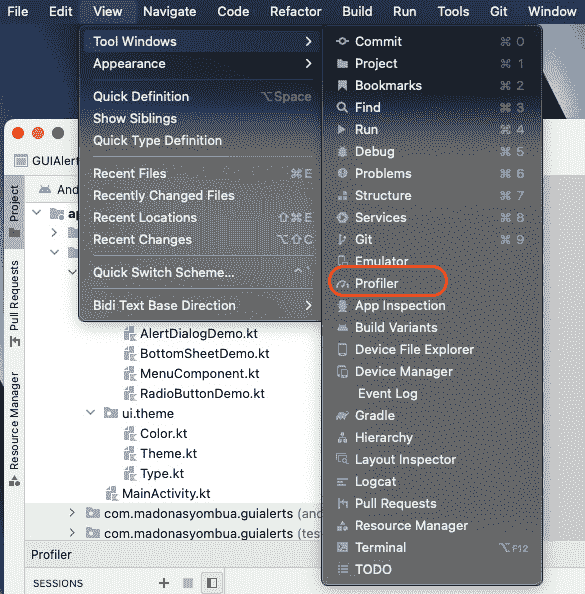

图 12.1 – Android Studio 中的分析器

1.  你还可以导航到底部菜单选项，靠近**App Inspection**；参见*图 12.2*中的绿色箭头，它指示你可以从另一个地方开始 Profiler。读箭头表示连接以可视化配置文件的模拟器。

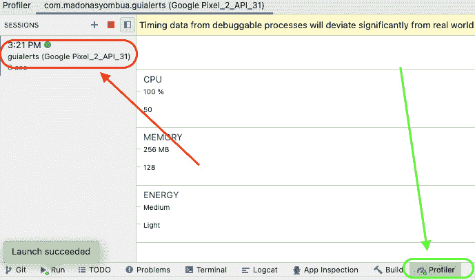

图 12.2 – 在 Android Studio 中启动 Profiler

1.  当你的 Profiler 开始运行时，这意味着它已连接到你的应用程序，你应该能看到**CPU**、**MEMORY**和**ENERGY**。根据你的应用程序资源，数据可能与你在*图 12.3*中看到的不同。

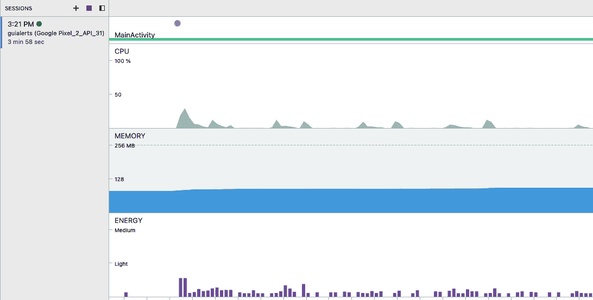

图 12.3 – Profiler 正在运行

1.  你可以做很多事情，例如简单地记录所有方法跟踪，查看你的资源是如何被利用的，以及分析火焰图。

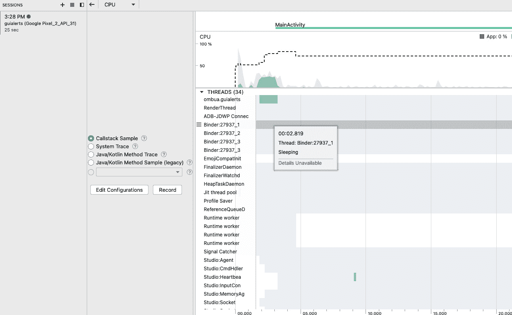

图 12.4 – 利用 Profiler 的不同方式

1.  CPU 火焰图是一种性能可视化类型，它显示了程序随时间执行的层次结构。它通常在图表顶部包含一个时间线，函数调用以垂直堆叠的矩形表示。

根据颜色，每个矩形的宽度代表函数调用的持续时间，矩形的颜色代表该函数的 CPU 使用情况。图表允许 Android 开发者快速识别占用最多 CPU 时间的函数，并有助于他们确定调试和优化性能的位置，如图*图 12.5*所示。


图 12.5 – CPU 火焰图

换句话说，应用程序堆是一个专门、固定、有限的内存池，分配给你的应用程序。

注意

如果你的应用程序达到堆容量并尝试分配任何额外内存，你将收到一个`OutOfMemoryError`消息。

1.  最后，内存泄漏是一种软件错误，其中程序或应用程序反复未能释放它不再需要的内存，或者你的垃圾收集器没有按预期工作。这可能导致程序随着时间的推移逐渐消耗越来越多的内存，最终导致性能下降或应用程序崩溃。

## 它是如何工作的...

如果应用程序响应缓慢、动画不流畅、经常冻结或消耗大量电力，则性能不佳。修复性能问题涉及识别应用程序未优化资源使用的地方，例如 CPU、内存、图形、网络或设备电池。

Android Studio 提供了几个工具来帮助开发者发现和可视化潜在问题：

+   CPU Profiler，它有助于跟踪运行时性能问题

+   内存 Profiler，它有助于跟踪任何内存分配

+   网络 Profiler，它监控网络流量使用

+   能量 Profiler，它跟踪能源使用，这可能导致电池耗尽

您可以通过查看图 12.6 来了解 Android 中的性能分析。


图 12.6 – 性能源模型（android.developer.com）

## 查看更多...

通过以下链接了解 `OutOfMemoryError` 的更多信息：[`developer.Android.com/reference/java/lang/OutOfMemoryError`](https://developer.Android.com/reference/java/lang/OutOfMemoryError)。您也可以通过此链接了解有关性能分析的信息：[`developer.android.com/studio/profile`](https://developer.android.com/studio/profile)。

# 快速 Android 快捷键，让您的开发更高效

快捷键可以帮助开发者通过使他们的工作更快更高效，让他们能够专注于编写代码和解决问题，而不是在菜单和工具栏中导航。快捷键可以帮助自动化重复性任务，如格式化代码、重命名变量或在不同文件之间导航，从而为开发者节省时间和精力，让他们有更多时间从事更有意义的工作。

此外，当开发者在不同工具和应用程序中使用相同的快捷键时，可以帮助保持他们工作流程的一致性，并减少因意外使用错误命令或工具而造成的错误风险。对于有残疾或身体限制的开发者来说，使用快捷键可能比使用鼠标或触摸板与软件交互更方便。

## 准备工作

这实际上不是一个食谱，而是一份有用的快捷键列表，我们将查看在笔记本电脑上使用最广泛的 Windows 和 Mac 快捷键。

## 如何做到这一点...

这里列出了一些在 Mac 和 Windows 操作系统上使用的 Android Studio 快捷键，可以帮助您加快工作流程：

+   这里有一些基本的导航快捷键：

    +   **打开类或文件**：*Ctrl* + *N*（Windows）或 *Cmd* + *O*（Mac）

    +   **在项目范围内查找文本**：*Ctrl* + *Shift* + *F*（Windows）或 *Cmd* + *Shift* + *F*（Mac）

    +   **打开最近文件弹出窗口**：*Ctrl* + *E*（Windows）或 *Cmd* + *E*（Mac）

    +   **搜索并执行任何操作或命令**：*Ctrl* + *Shift* + *A*（Windows）或 *Cmd* + *Shift* + *A*（Mac）

+   代码编辑快捷键：

    +   **代码补全建议**：*Ctrl* + 空格键（Windows 和 Mac）

    +   **完成当前语句**：*Ctrl* + *Shift* + *Enter*（Windows）或 *Cmd* + *Shift* + *Enter*（Mac）

    +   **复制当前行**：*Ctrl* + *D*（Windows）和 *Cmd* + *D*（Mac）

    +   **剪切当前行**：*Ctrl* + *X*（Windows）和 *Cmd* + *X*（Mac）

    +   **移动当前行上下**：*Ctrl* + *Shift* + 上/下箭头（Windows）或 *Cmd* + *Shift* + 上/下箭头（Mac）

+   重构快捷键：

    +   **从当前代码块提取方法**：*Ctrl* + *Alt* + *M*（Windows）和 *Cmd* + *Option* + *M*（Mac）

    +   **从当前代码块提取变量**：*Ctrl* + *Alt* + *V*（Windows）和 *Cmd* + *Option* + *V*（Mac）

    +   **从当前代码块中提取字段**：*Ctrl* + *Alt* + *F*（Windows）和 *Cmd* + *Option* + *F*（Mac）

    +   **重命名类、方法或变量**：*Shift* + *F6*（Windows）和 *Fn* + *Shift* + *F6*（Mac）

+   调试快捷键：

    +   **跳过到下一行代码**：*F8*（Windows 和 Mac）

    +   **进入当前代码行**：*F7*（Windows 和 Mac）

    +   **退出当前方法**：*Shift* + *F8*（Windows 和 Mac）

    +   **切换当前代码行的断点**：*Ctrl* + *F8*（Windows）或 *Cmd* + *F8*（Mac）

+   杂项快捷键：

    +   **运行应用**：*Ctrl* + *Shift* + *F10*（Windows）或 *Cmd* + *Shift* + *F10*（Mac）

    +   **调试应用**：*Ctrl* + *Shift* + *F9*（Windows）或 *Cmd* + *Shift* + *F9*（Mac）

重要提示

请注意，某些快捷键可能因您的具体键盘布局或操作系统首选项而有所不同。此外，请记住，Android Studio 还有更多快捷键可供使用，因此请务必探索键映射设置，以找到可以使您的开发工作流程更高效的额外快捷键。

## 它是如何工作的…

快捷键可以是寻求简化工作流程、提高生产力和减少开发过程中错误和重复性劳损风险的开发者的强大工具。

# 您需要了解的 JetBrains Toolbox 和基本插件

**JetBrains Toolbox** 是一种软件管理工具，允许开发者在计算机上管理和安装 JetBrains IDE 和相关工具。JetBrains 是一家软件公司，为各种编程语言（如 Java、Kotlin、Python、Ruby 和 JavaScript）提供强大的 IDE（特别是 IntelliJ）。换句话说，插件只是实现了插件接口的任何类。

下面是一些 JetBrains Toolbox 功能以及您应该尝试使用它的原因：

+   您可以从 Toolbox 轻松下载和安装任何 JetBrains IDE，并确保您的计算机上安装了 IDE 的最新版本。

+   Toolbox 会自动检查更新，并保持所有已安装的 JetBrains IDE 和插件最新，这意味着如果您的当前 Android Studio 不稳定，您可以回滚到更稳定的版本。

+   您可以从 Toolbox 管理您的 JetBrains 许可证并激活/停用它们。

+   Toolbox 提供了一种通过创建可共享链接与团队成员共享项目的方法。

+   Toolbox 与 JetBrains 服务（如 JetBrains 账户和 JetBrains Space）集成。

## 准备工作

这不是真正的食谱，而是一份有用的插件列表，我们将探讨一些对开发者有用的插件。

## 如何操作…

让我们来看看我们如何利用 Gradle 进行日常 Android 开发。

+   Gradle 是一种构建自动化工具，用于构建和部署 Android 应用。它可以帮助您管理依赖项、生成 APK 文件和运行测试。

+   ADB 插件为 **Android 调试桥**（**ADB**）提供了一个图形用户界面，ADB 是一种命令行工具，可以与 Android 设备或模拟器交互。

+   Live Templates 允许您快速插入常用代码片段。例如，您可以创建一个用于吐司消息的实时模板，然后只需输入快捷键并按 Tab 键即可插入代码。要创建实时模板，请转到 **Android Studio** | **设置** | **编辑器** | **实时模板**。

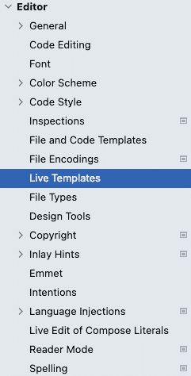

图 12.7 – 如何访问 Live Templates

+   Android Studio 的代码补全功能可以为您节省大量时间。当您键入时，Android Studio 将为您代码的完成建议提供可能的补全。使用 *Tab* 键接受建议。

+   调试器是查找和修复代码中错误的有力工具。您将在 *调试您的代码* 食谱中学习如何使用调试器逐步执行代码并查看每个步骤中发生的情况。

+   Android Studio 的布局编辑器允许您轻松创建和修改应用程序的用户界面。您可以使用布局编辑器将用户界面组件拖放到布局中，并轻松修改它们的属性。

+   资源管理器允许您轻松管理应用程序的资源，例如图像、字符串和颜色。您可以使用资源管理器添加和修改资源，并在代码中轻松引用它们。

+   Android Studio 支持各种插件，可以扩展其功能。您也可以轻松搜索插件以帮助您完成诸如生成代码或管理依赖项等任务。

+   LeakCanary 是一个内存泄漏检测库，可以帮助您识别和修复应用程序中的内存泄漏。这有助于开发者查找泄漏。

+   Firebase 是一套移动开发工具，可用于向您的应用程序添加功能，如身份验证、分析和云消息。当您作为独立开发者构建第一个项目时，您可以利用这一点。

## 工作原理…

您可以通过简单地转到 **AndroidStudio** | **设置** | **快捷键映射** 并使用下拉菜单查看可用的快捷键映射，如图 *图 12.8* 所示。

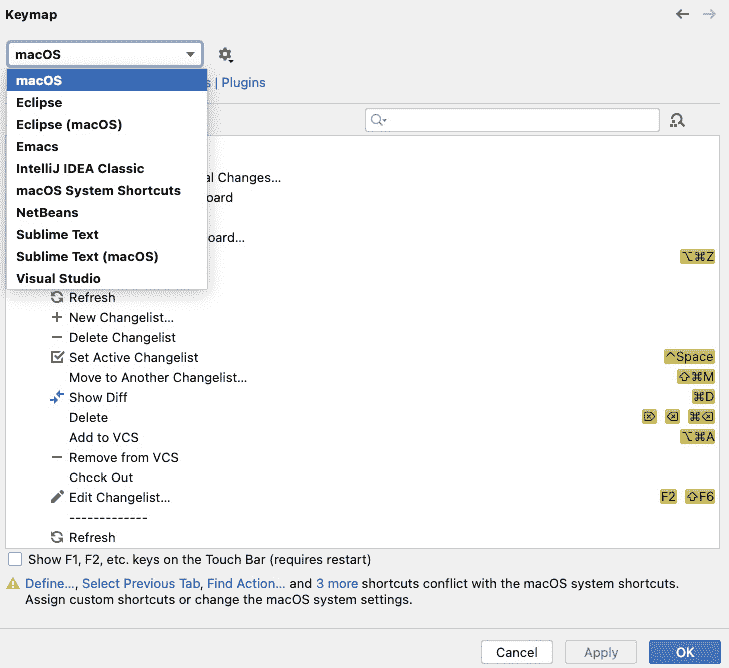

图 12.8 – 快捷键映射

重要提示

通过以下链接了解 Android Studio 的最新版本以及提供的功能：[`developer.android.com/studio/releases`](https://developer.android.com/studio/releases)。

# 调试您的代码

作为一名 Android 开发者，调试是软件开发过程中的一个重要部分，因为它有助于识别和修复代码中的错误。在调试时，您可以快速识别和修复可能导致应用程序崩溃、行为异常或产生不正确结果的代码错误或缺陷。

在本食谱中，我们将探讨如何轻松添加断点并调试您的代码。

## 准备工作

要开始使用此食谱，您需要打开一个项目并在您的模拟器上运行该项目。您不需要创建新项目，可以使用 `GUIAlert` 项目。

## 如何操作…

我们将尝试调试我们的代码，并确保当我们点击菜单中的项目时，我们选择了正确的项目。例如，如果我们选择项目 2，当我们评估该项目时，我们应该看到结果为`2`：

1.  首先，你需要确保你的应用正在运行；然后，点击*图 12.9*中显示的图标。


图 12.9 – 调试器图标

1.  当你点击*图 12.9*中显示的图标时，会出现一个弹出屏幕，这意味着你将把运行中的应用程序附加到调试器上。

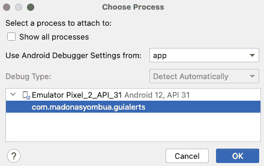

图 12.10 – 将调试器附加到包上的选项

1.  现在，回到代码库并添加断点。你通过点击你希望测试逻辑的行号所在的侧边栏来添加断点。

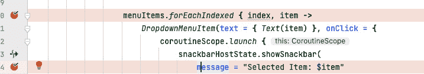

图 12.11 – 断点

1.  如果你点击项目时应用正在运行，比如选项 1，调试器将显示活动状态，这意味着我们在其上放置断点的行已被命中。然后，会出现一个带有控制按钮的弹出窗口。

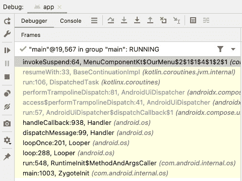

图 12.12 – 调试活动状态

1.  你可以使用左侧的绿色按钮来运行，红色方块按钮来停止。你也可以使用**Step Over**、**Step Into**、**Force Step Into**、**Step Out**、**Drop Frame**、**Run to Cursor**和**Evaluate Expression…**。在我们的例子中，我们将使用**Evaluate Expression…**。


图 12.13 – 调试按钮步骤

1.  有时，你可能会有额外的断点，这可能会减慢进程。在这种情况下，你可以使用*图 12.14*中用红色箭头指出的选项来查看所有断点。

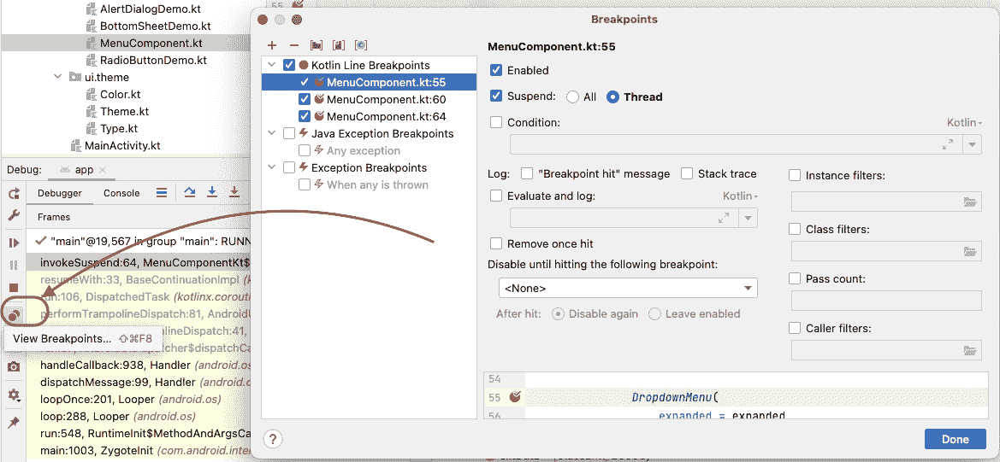

图 12.14 – 跟踪所有断点

1.  最后，当应用仍然处于调试模式时，打开`Item`。根据当前项，你应该看到显示的数字。

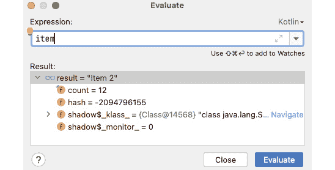

图 12.15 – 当我们评估断点时，当前选中的项

## 它是如何工作的…

Android Studio 为我们开发者提供了一个强大的调试器。要使用 Android Studio 调试应用程序，你首先需要在设备或模拟器上构建和部署应用程序，然后将调试器附加到运行进程。这也是一项需要学习和练习的技能。因此，了解你如何使用日志或断点来调试应用程序，这会很有帮助。

重要提示

关于调试，还有更多内容需要学习，需要多个菜谱来涵盖这个主题。点击此链接了解更多信息：[`developer.android.com/studio/debug`](https://developer.android.com/studio/debug)。

# 如何提取方法和方法参数

提取方法和方法参数可能会向您的代码中添加额外的导入。这是因为当您提取方法或参数时，之前在方法或参数内部的方法被移动到单独的方法中。如果这段代码依赖于尚未导入到您的代码中的其他类或方法，提取过程可能会自动添加必要的导入语句到您的文件中。

例如，假设您有一个包含执行某些计算并返回结果的 Kotlin 类的方法。此方法依赖于在另一个包中定义的辅助类，并且您仍然需要将此类导入到您的代码中。如果您决定将方法提取到同一或不同类中的特定方法，提取过程可能会添加一个`import`语句用于辅助类，以便提取方法内部的代码可以引用辅助类。

类似地，当您提取方法参数时，提取过程可能需要包括添加导入语句，以确保在参数类型中使用的任何类或接口都能正确解析。

## 准备工作

您不需要创建任何项目来遵循这个食谱。

## 如何操作…

要在 Android 中提取方法和方法参数，您可以按照以下步骤操作：

1.  打开您想要提取方法和参数的 Kotlin 文件。

1.  识别包含您想要提取的方法和参数的类。

1.  将您的光标放在类声明内部，然后右键单击以打开上下文菜单。

1.  从上下文菜单中选择**重构**选项，然后从子菜单中选择**提取**。

1.  在**提取**子菜单中，您将看到提取方法或参数的选项。选择与您想要提取的元素相匹配的选项。

1.  按照上下文中的**提取**向导中的提示来配置提取过程。您可能需要为提取的元素提供名称，指定元素的范围，或者根据您正在提取的元素配置其他设置。

1.  一旦在提取过程中配置完毕，点击**完成**以从您的代码中提取元素。

## 它是如何工作的…

在方法或参数提取期间添加导入是重构过程的正常部分，有助于确保您的代码保持良好的组织并易于维护。

# 理解 Git 基础知识

这个食谱旨在帮助任何可能偶然发现这本书的新开发者。**Git**是一个流行的版本控制系统，允许开发者管理和跟踪代码库的变化。

这里有一些基本概念需要理解：

+   **仓库**是一组文件和文件夹的集合，Git 正在跟踪这些文件和文件夹。它也被称为**repo**。这是最常见的术语。

+   **提交**是对仓库中更改的快照。每个提交都有一个唯一的标识符，包含有关更改的信息，例如作者、日期以及描述更改的消息。

+   **分支**是一个独立的开发线，允许开发者同时工作在不同的功能或项目的版本上。它就像是一个仓库的平行宇宙。

+   在开发过程中，**合并**你的工作指的是将一个分支的变化合并到另一个分支中。通常在功能完成并准备好集成到主分支时使用。

+   **拉取请求**是 GitHub 的一个功能，允许开发者提出对仓库的更改，并请求将这些更改合并到主分支。它包括更改的描述以及任何支持性文档或测试。

+   **克隆**是在你的本地机器上创建仓库的副本。

+   **推送**是将变化从你的本地机器发送到远程仓库的过程，例如 GitHub 或 GitLab。

+   **拉取**是从远程仓库下载变化到本地机器的过程。

通过理解这些基本概念，你可以有效地使用 Git 来管理你的代码库并与其他开发者协作。

## 准备工作

我们在这里不会遵循食谱，而是看看你可以利用哪些 Git 命令来使协作更简单。

## 如何操作…

这里是一些最常用的 Git 命令：

+   要在当前目录中初始化一个新的 Git 仓库，你可以简单地做以下操作：

    ```kt
    $ git init
    ```

+   当你想将更改添加到暂存区时，你可以简单地使用`git add`：

    ```kt
    $ git add file.txt
    ```

+   在向仓库提交更改时，只需使用以下命令：

    ```kt
    $ git commit -m "message"
    ```

+   最重要的是，当你开始协作时，能够克隆项目；你可以简单地运行以下命令：

    ```kt
    $ git clone git@github.com:PacktPublishing/Modern-Android-13-Development-Cookbook.git
    ```

+   当你想从远程仓库拉取变化到本地仓库时，只需使用以下命令：

    ```kt
    $ git pull origin main
    ```

+   你也可以使用以下命令将本地仓库的变化推送到远程仓库：

    ```kt
    $ git push origin main
    ```

+   使用`git branch`列出所有本地分支：

    ```kt
    $ git branch
    ```

+   以下命令切换到不同的分支：

    ```kt
    $ git checkout branch_name
    ```

+   使用以下命令检出新的分支：

    ```kt
    $ git checkout -b branch_name
    ```

+   使用以下命令将一个分支的变化合并到另一个分支中。注意，你也可以使用`rebase`；这取决于组织的偏好：

    ```kt
    $ git merge branch_name
    ```

这些只是最常用的 Git 命令中的一部分。还有很多其他的 Git 命令和选项可供选择，因此探索 Git 文档以了解更多信息是值得的。

## 它是如何工作的…

Git 是一个分布式版本控制系统，允许用户跟踪代码随时间的变化。以下是 Git 工作的高级概述。

Git 不仅仅存储你对代码所做的更改；它实际上存储了你在不同时间点的整个项目的快照。每个快照代表项目在特定时刻的状态。它以树状结构存储你的代码，每个项目快照由一个提交对象表示。

每个提交对象都指向它所代表的项目的快照以及它之前的提交对象。它还使用一个唯一的指针`HEAD`来跟踪当前分支和该分支上最近的提交。

当你提交一个新的更改时，Git 会更新 HEAD 指针以指向新的提交。此外，Git 中的每个提交都有一个唯一的哈希值，这是一个由字母和数字组成的 40 个字符的字符串。这个哈希值是根据提交的内容以及它所指向的任何先前提交的哈希值生成的。

由于 Git 将你的项目快照存储在本地计算机上，你可以离线工作，同时仍然可以向项目提交更改。当你准备好分享你的更改时，你可以将它们推送到远程仓库。

这些只是 Git 工作背后的几个关键概念。Git 是一个功能强大且灵活的工具，具有许多高级功能，因此值得了解更多关于它是如何工作的信息。
