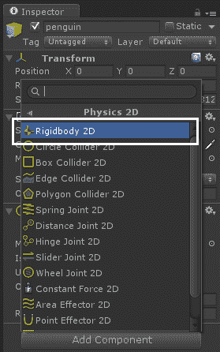

# 第一章：使用 Unity3D 进行 Android 游戏开发简介

在当今智能手机时代，这曾经是电脑时代，几乎地球上每个人都在手中拿着一部智能手机。2014 年售出了约 10 亿部 Android 手机，这对在 Android 上工作的开发者来说是一个庞大的受众。这些开发者投入努力创建高实用性应用，解决用户的问题或制作吸引人且有趣的游戏，让玩家在享受乐趣的同时消磨时间，并获得良好的互动体验。本书主要关注后者，即通过一个非常著名的游戏引擎 Unity3D 创建吸引人的有趣游戏。

本章包括以下主题。

+   Android 简介

+   Unity3D 和游戏引擎

+   Unity 游戏开发基础

+   空游戏项目的配置

+   开始启动活泼的企鹅游戏

+   将企鹅添加到游戏中

# Android 简介

Android 是一个基于 Linux 的操作系统，由谷歌公司根据 Apache 许可协议分发的开源软件。由于其开源性质，其他手机厂商开始在其新创建的手机上移植 Android 操作系统，这为消费者提供了一个非常多样化的智能手机市场。从 Android 的第一个版本开始，这个操作系统就达到了一个很好的成熟度水平，使其成为更可靠、更安全、更稳定的智能手机操作系统。接下来，让我们看看下一节中一些流行的 Android 版本。

# Android 版本

每年，随着每个新版本的推出，Android 的成熟度都在不断提高。每个版本都引入了从用户界面到定制、灵活性到安全性的新功能集合。在命名方面，这些版本基于糖果、巧克力和其他甜食的名称，如 Kitkat、Lollipop 和 Marshmallow，但这也使得 Android 对消费者和开发者来说更加易于理解。

一个有趣的事实是，Android 版本按字母顺序排列。从 *Apple Pie 1.0* 和 *Banana Bread 1.1* 开始，它通过完全一致的字母顺序一直发展到 *Nougat*，保持了传统的延续性。

下表突出了不同 Android 版本的主要功能及其 API 级别：

| **Android 版本** | **版本名称** | **主要功能** | **API 级别** | **发布月份** |
| --- | --- | --- | --- | --- |
| 1.0 G1 | Banana Bread | GPS、蓝牙、多任务处理、谷歌服务、Android 应用商店 | 2 | 2008 年 2 月 |
| 1.5 | Cupcake | 搜索框，改进的 Android 应用商店，相机，手势 | 3 | 2009 年 4 月 |
| 1.6 | Donut | 虚拟键盘，主屏幕小部件，文件夹 | 4 | 2009 年 9 月 |
| 2.0.x | Éclair | 多用户账户，Flash 支持，缩放功能，蓝牙 2.1 | 5、6 和 7 | 2009 年 10 月 |
| 2.2.x | Froyo | USB 热插拔，热点支持，Adobe Flash，语音拨号 | 8 | 2010 年 5 月 |
| 2.3.x | Gingerbread | 新的复制/粘贴、WebM、NFC、前置摄像头 | 9、10 | 2010 年 12 月 |
| 3.x | Honeycomb | 3D 图形、重新设计的用户界面、视频通话、蓝牙共享、3G、4G | 11、12 和 13 | 2011 年 2 月 |
| 4.0.x | Ice Cream Sandwich | 虚拟按钮、面部解锁、原生相机功能、面部识别、Android Beam、Wi-Fi Direct | 14 和 15 | 2011 年 10 月 |
| 4.1 - 4.3 | Jelly Bean | 可扩展的通知、Google Now | 16、17 和 18 | 2012 年 7 月 |
| 4.4 | KitKat | 主要设计界面更新、半透明状态栏、沉浸模式、无线打印 | 19 和 20 | 2013 年 10 月 |
| 5.0 | Lollipop | 使用 Material 重新设计的用户界面、锁屏通知、访客模式、省电模式 | 21 | 2014 年 10 月 |
| 6.0 | Marshmallow | 指纹安全支持、省电的 Doze 模式、应用待机模式、增强的应用权限 | 23 | 2015 年 10 月 5 日 |
| 7.0 | Nougat | 多窗口视图、VR 支持 | 24 和 25 | 2016 年 8 月 22 日 |

表 1.1：从安卓 Cupcake 到 Lollipop 的操作系统时代

该表仅显示了安卓操作系统开发商 Google Inc. 所做的更改。但由于安卓的开源特性，其他移动制造公司也对安卓进行了更改并引入了新的功能和修改。例如，三星开发了名为 TouchWiz 的定制触摸界面，而 HTC 开发了名为 HTC Sense 的定制用户界面。同样，索尼引入了名为 **TimeScape** 的定制用户界面。


图 1.1 2014 年发布的最新安卓手机

# Google Play - 安卓的市场商店

智能手机的出现使得市场商店的概念在软件技术中得以实现，这彻底改变了移动开发行业。在这一变革中，Google Play 在移动应用和游戏方面发挥了重要作用。Google Play 是智能手机上最大的市场商店，拥有超过 220 万个安卓应用、游戏、书籍、音乐、节目等。到目前为止，这些应用和游戏已被下载超过 500 亿次，这标志着 Google 在安卓仅 8 年的时间里取得的巨大里程碑。您可以在 [`play.google.com`](http://play.google.com) 查看 Google Play。

Google 音乐、Google 电影与电视、Google 书籍和 Google 杂志仅在少数国家提供。


图 1.2 安卓设备上的 Google Play

# Unity3D 和游戏引擎

**游戏引擎**是一个为视频游戏创建和开发而设计的软件框架。许多工具和框架可供游戏设计师和开发者使用，以便快速、轻松地编写游戏代码，而无需从头开始构建。随着时间的推移，游戏引擎变得更加成熟，对开发者来说更加容易使用，拥有功能丰富的环境。从 Android 的原生代码框架如 Unity、Unreal、Cocos2D-x、LibGDX 等开始，游戏引擎开始提供干净的用户界面和拖放功能，使游戏开发对开发者来说更加容易。这些引擎包括许多不同的工具，这些工具在用户界面、功能、移植等方面有所不同，但它们都有一个共同点；那就是它们最终都用于创建视频游戏。

我们将在本节中通过比较以下方面来讨论一些最受欢迎的游戏引擎：

+   用户界面和环境，比如学习和发展游戏有多容易。

+   特性和功能，比如游戏引擎能实现什么，能做什么，以及达到什么质量水平。

+   定价，比如是免费还是付费。

让我们更深入地探讨这个比较。

# Unreal Engine

Unreal Engine ([`www.unrealengine.com`](http://www.unrealengine.com)) 是由 Epic Games 开发的游戏引擎。它曾是 Epic Games 的内部游戏引擎，并于 1998 年在第一人称射击游戏 Unreal 中首次展示。Unreal Engine 主要用于创建第一人称或第三人称射击游戏，但在其他类型如潜行、MMORPGs 等方面也表现出相当高的质量。Unreal Engine 具有高度的可移植性和易于使用的界面特性，其中大部分逻辑和行为是用 C++语言编写的。

最新发布的 Unreal Engine 4 支持 Unity 支持的所有平台，包括 Windows、Xbox One、Windows RT、OS X、Linux、PlayStation 4、iOS、Android、Ouya 以及使用 WebGL 的浏览器。

Unreal Engine 4 于 2014 年 3 月发布，供公众使用。Unreal Engine 拥有良好的用户界面，导航控制非常精致且易于使用。Unreal Engine 提供了非常容易的流程和界面来创建第一人称射击游戏，并包含产生 AAA 质量游戏的功能，包括使用体素锥体追踪进行实时全局照明，消除预计算照明。

您可以下载该引擎，并用于从游戏开发、教育、建筑和可视化到 VR、电影和动画的各个方面。当您发布游戏或应用程序时，您需要在每个产品每个季度收入超过 3,000 美元后支付 5%的版税。由于 Unreal Engine 的学习曲线略高，因此它并不最适合新晋的游戏开发者：


图 1.3 Unreal Engine 4 界面

# Adobe Flash professional

Adobe Flash（以前称为 Macromedia Flash）([`www.adobe.com`](http://www.adobe.com)) 是一个用于创建矢量图形、动画、游戏和富互联网应用（RIAs）的多媒体和软件平台，这些应用可以在 Adobe Flash Player 中查看、播放和执行。Flash 广泛用于创建动画和网页浏览器中的广告，但近年来，由于 HTML5 框架的使用，其创建游戏的应用大幅减少。

曾经有一段时间，Adobe Flash 是最受欢迎的在线浏览器游戏引擎，并引发了一波独立游戏开发者为在线门户（如 Kongregate 和 Miniclip）制作游戏的浪潮。

Adobe Flash 包含非常易于使用的界面，可以创建令人惊叹且强大的动画，允许艺术家在编辑器中直接创建矢量艺术。它还支持 Adobe Illustrator 和 Adobe Photoshop 层，以便轻松集成矢量艺术和动画。Adobe Flash 允许开发者使用 Adobe AIR 框架将他们的游戏和动画从浏览器移植到桌面（Mac 和 Windows）、Android 和 iOS，但由于在终端设备上的性能较低，因此无法吸引到游戏开发者和艺术家的广泛关注。

Adobe Flash 提供了 30 天的免费试用，但一旦试用结束，你必须购买许可证，这与本节中讨论的其他引擎不同。


图 1.4 Adobe Flash CC 界面

# 游戏制作工作室

游戏制作工作室（最初命名为 Animo，后来更名为 Game Maker）是由 Mark Overmars 在 1999 年使用 Delphi 编程语言创建的一个事件驱动游戏创作系统。最初是为 2D 动画而创建的，它很快成为了一个非常强大且易于使用的拖放工具，用于创建 2D 游戏。

游戏制作工作室使用预定义的事件来创建游戏中的动作，这使得开发者可以非常容易地创建游戏，而无需具备编程和编码知识。该工具包含一个名为 **Game Maker 语言**（**GML**）的沙盒语言，允许开发者为其游戏定义自定义和更复杂的操作。

游戏制作工作室提供了一个干净且流畅的用户界面，让开发者可以在 Windows、macOS X、Ubuntu、HTML5、Android、iOS、Windows Phone 8 和 Tizen 上构建和部署他们的游戏。最新版本还引入了 Xbox One 和 PlayStation 部署。

Tizen 是一个开源操作系统（OS），适用于所有设备，包括手机、可穿戴设备、车载娱乐系统和电视。


图 1.5 游戏制作工作室界面

# Unity3D

Unity（[`unity3d.com`](http://unity3d.com)）是由 Unity Technologies 开发的跨平台游戏引擎。它在 2005 年苹果全球开发者大会上首次公开宣布，最初仅支持 Mac OS 的游戏开发，但自那时起已扩展到支持超过 15 个平台，包括桌面、移动和游戏机。它因其一键式跨多个平台（包括 BlackBerry 10、Windows Phone 10、Windows 10、OS X、Linux、Android、iOS、Unity Web Player（包括 Facebook）、Adobe Flash、PlayStation 3、PlayStation 4、PlayStation Vita、Xbox 360、Xbox One、Wii U 和 Wii）移植游戏的能力而闻名。

Unity 拥有一个出色的界面，让开发者从一开始就能非常高效地管理项目。它具有不错的拖放功能，以及用 C#和 Boo（JavaScript 的一种方言）编写的连接行为脚本，可以轻松地用视觉对象定义自定义逻辑和功能。Unity 已被证明对新开始游戏开发的开发者来说非常容易学习，现在越来越多的大型工作室也开始使用它，这也是有充分理由的。

Unity 是那些为 2D 和 3D 游戏提供支持而不让开发者感到麻烦和困惑的引擎之一。它拥有大量的在线教程、优秀的文档和一个非常有帮助的开发者社区。此外，Unity 还有资产商店，开发者可以在其中出售 Unity 的可重用组件，以减少其他开发者的开发时间和努力。您可以在[`assetstore.unity3d.com`](http://assetstore.unity3d.com)检查 Unity 资产商店。

Unity Plus 和 Pro 需要付费，而 Unity Personal 免费；它适用于年收入低于 10 万美元的个人或公司。更多信息，请访问 Unity 商店[`store.unity.com/`](https://store.unity.com/)：


图 1.6 Unity3D 引擎界面

# Unity3D 的特点

Unity 是一个强大的渲染引擎、直观的工具、2D 和 3D 游戏快速工作流程、一站式部署支持以及数千个免费和付费资产的游戏开发生态系统。其功能列表包括以下内容：

+   简便的工作流程，允许开发者在一个直观的编辑器工作空间中快速组装场景

+   质量上乘的游戏制作，例如 AAA 级视觉效果、高清音频和全速动作，屏幕上无任何故障

+   专为 2D 和 3D 游戏制作提供专用工具，并采用共享约定，使开发者易于使用

+   一个非常独特且灵活的动画系统，可以在极短的时间内创建自然动画

+   在所有开发者发布游戏的平台上，实现流畅的帧率和可靠的性能

+   一键式部署到所有平台，从桌面到浏览器到移动设备再到游戏机，只需几分钟

+   通过使用在庞大的资源库中可用的已创建的可重用资产，可以缩短开发时间

总结来说，与其他游戏引擎相比，Unity 对开发者友好，易于使用，对独立开发者免费，并且功能丰富的游戏引擎。在下一节中，我们将看到 Unity3D 的一些令人惊叹的功能。

# Unity 游戏开发基础

在深入研究 Unity3D 和游戏开发概念之前，让我们先看看 Unity 5.6 的一些基础知识。我们将了解 Unity 界面、菜单项、使用资产、创建场景和发布构建。

本节是所有对 Unity 几乎一无所知或完全没有知识的新开发者必须阅读的，他们希望通过 Unity 学习游戏开发的基础知识。如果你已经熟悉 Unity 的基础知识，你可以跳过这一节。

# Unity 编辑器界面

当你第一次启动 Unity 5.6 时，你将看到一个包含屏幕左侧、右侧和底部的几个面板的编辑器。这些面板无需担心。以下图片显示了首次启动时的编辑器界面：


图 1.7 Unity 5 首次启动时的编辑器界面

首先，花点时间熟悉编辑器，并对其有一个基本的了解。Unity 编辑器被划分为不同的小型面板和视图，可以拖动它们，从而根据开发者/设计师的需求定制工作区。Unity 5 提供了一些预构建的工作区布局模板，可以从屏幕右上角的**布局**下拉菜单中选择，如下截图所示：


图 1.8 Unity 5 编辑器布局

当前编辑器中显示的布局是默认布局。你可以选择这些布局，看看编辑器界面如何变化，以及不同的面板如何在每个布局中放置在不同的位置。本书使用 2x3 工作区布局进行游戏开发。

以下截图显示了带有视图和面板名称高亮的 2x3 工作区：


图 1.9 Unity 5 2x3 布局与视图和面板名称

如前一个截图所示，Unity 编辑器包含不同的视图和面板。每个面板和视图都有特定的用途，将在以下部分进行描述。

# 场景视图

场景视图是游戏开发的整个舞台，它包含了从微小的点到任何重型 3D 模型的游戏中所有资产。场景视图用于选择和定位环境、角色、敌人、玩家、摄像机以及所有可以放置在舞台上的其他对象。所有可以放置并在游戏中显示的对象统称为**GameObject**。场景视图允许开发者操纵游戏对象，例如选择、缩放、旋转、删除和移动。简单来说，场景视图是开发者和设计师的交互式沙盒。场景视图提供了一些控制，例如导航和变换。

# 变换工具

在 Unity 中开发游戏时，您将在场景中放置许多游戏对象，它们的定位、缩放和旋转，统称为变换，由变换工具管理。以下截图显示了变换工具：


图 1.10 变换工具

您可以从这个工具栏中选择任何选定的变换操作，并相应地更改游戏对象。以下图显示了在选择了变换工具时所选游戏对象上的 Gizmo：


图 1.11 变换工具的游戏对象上的 Gizmos

这些工具确实像它们的名称所暗示的那样执行相同的任务；移动用于平移，旋转用于旋转，缩放用于缩放。另一方面，矩形工具是在 Unity 4.3 中引入的，当时 Unity 获得了本地的 2D 支持和工具。这个工具仅用于 2D 精灵对象的位置、缩放和旋转。您也可以使用键盘快捷键选择这些工具。

# 场景视图导航

在上一节中，我们讨论了 GameObject 如何在场景中进行变换和导航。但 Unity 作为一个 3D 环境，它提供了一个简单的界面，使用鼠标和键盘快捷键从不同的角度、侧面和视角查看场景。您可以在场景视图的右上角观察到场景 Gizmo。这个 Gizmo 用于根据开发者的需求旋转视图。以下截图显示了场景的 Gizmo：


图 1.12 场景视图导航的 Scene Gizmo

场景的每个视图都是以透视或等距的形式显示的。在下一节中，我们还将讨论场景的另一种视图。

# 场景视图控制栏

控制栏位于场景视图的顶部，它为开发者提供了更多的控制，以便轻松导航场景和创建游戏。此栏包括启用/禁用 Gizmos、声音和选择视图模式等选项。此栏的重要部分是 2D 模式按钮，如下面的截图所示：


图 1.13 场景视图控制栏

2D 模式按钮是一个切换按钮；当开启时，它会禁用视图的 z 轴，并从 2D 视角显示游戏。在 Unity 中创建 2D 游戏时，这是一个高度使用的选项。在栏的右侧有一个用于搜索的文本框。这允许开发者从当前场景中搜索游戏对象，并使他们能够快速工作。

# 游戏视图

游戏视图是游戏在发布和部署到目标设备时的最终表现形式，它是从场景的相机渲染的。此视图与整个 Unity 工作区顶部的“播放模式”导航栏相连，如下截图所示：


图 1.14 播放模式栏

当在编辑器中玩游戏时，这个控制栏会变成蓝色。Unity 的一个非常有趣的功能是它允许开发者暂停正在运行的游戏和代码，开发者可以在运行时查看和更改属性、变换等，而无需重新编译整个游戏，以便快速工作流程。

# 游戏视图控制栏

与场景视图一样，游戏视图也在视图的顶部包括一个控制栏，如下图所示：


图 1.15 游戏视图控制栏

选项执行的动作正如其名称所暗示的那样。控制栏左侧的“自由纵横比”下拉菜单允许开发者选择任何特定的分辨率来测试他们的游戏。这些分辨率和下拉选项取决于所选平台。开发者还可以为他们的目标设备添加自定义分辨率和屏幕尺寸。Unity 还允许开发者指定纵横比，以便了解游戏将在具有相同纵横比的各种设备上如何运行。Unity 功能强大，可以轻松提供跨平台支持，使得开发者只需编写一次代码就能让他们的游戏在大多数类型的设备上运行得更好。

# 层级视图

层级视图是选择或处理场景中任何 GameObject 的第一个点。这包含当前场景中的所有游戏对象。这是一个树形结构，允许开发者轻松地在游戏对象上利用父级和子级概念。以下截图显示了一个简单的层级视图：


图 1.16 层级视图

# 项目浏览器面板

这看起来像是一个视图，但它被称为项目浏览器面板。这个面板是 Unity 中的一个嵌入式文件目录，包含游戏项目中包含的所有文件和文件夹。

下面的截图显示了一个简单的项目浏览器面板：


图 1.17 项目浏览器面板

面板左侧显示了一个层次目录，而面板的其余部分则是文件，或者如 Unity 中所称，这些被称为资源。Unity 使用不同的图标来区分这些文件类型。这些文件可以是精灵图像、纹理、模型文件、声音等等。您可以通过在搜索文本框中输入来搜索任何特定文件。在搜索框的右侧，有一些按钮控件，用于进一步筛选，例如动画文件、音频剪辑文件等。

项目浏览器面板的一个有趣之处在于，如果资源中不存在任何文件，Unity 会开始在 Unity Asset Store 中寻找它，并向您展示可用的免费和付费资源。

# 检查器面板

这是 Unity 开发中最重要的面板。Unity 以游戏对象和资源的形式构建游戏。这些游戏对象进一步包含变换、碰撞体、脚本和网格等组件。Unity 允许开发者通过检查器面板管理每个游戏对象的这些组件。

以下截图显示了一个游戏对象的简单检查器面板：


图 1.18 检查器面板

这些组件的类型各不相同，包括物理、网格、效果、音频和用户界面。这些组件可以通过从组件菜单中选择来添加到任何对象。以下截图显示了组件菜单：


图 1.19 组件菜单

在了解了 Unity 的一些基础知识之后，让我们继续进行开发者创建游戏时做的第一个任务；那就是创建一个空项目。接下来的一节中，我们将讨论 Unity 中空项目的配置。

# 空游戏项目的配置

当您开始一个新的游戏时，第一步是配置一个空游戏项目。对于 2D 游戏，创建空游戏并设置初始环境和相机管理有时可能是一个痛苦的过程。在本节中，我们将讨论如何为 2D 游戏配置空游戏项目。

如果您已经在 Unity 中制作过 2D 游戏，那么您可以跳过这一节，并使用下一节代码中的 Perky Penguin 的起始项目。

当您启动 Unity 5.6 时，它会显示一个项目向导，如下所示：


图 1.20 项目创建向导

Unity 在其最新版本 Unity 5.6 中拥有一个良好且流畅的用户界面。项目向导显示了所有最近的项目列表，包括它们的名称。最近的项目被突出显示，以便快速打开。在向导的右上角，有一些控件，用于从头创建新项目以及从任何目录打开任何特定项目。为了指导新开发者了解基本概念，"开始"选项卡提供了一个基本的视频教程。

点击右上角的“新建项目”按钮，创建新项目，您将看到一个如下对话框：


图 1.21 项目创建向导

有两个文本输入框，项目名称和位置。它们的名称是自解释的。您也会在向导中注意到 3D 和 2D，如下面的图所示：


图 1.22 项目类型选择切换

此切换允许您告诉 Unity 您的项目是 2D 还是 3D。虽然这不会在您工作期间以任何方式影响项目，但它会影响默认项目设置，以便更容易地工作流程。例如，在 3D 模式下，当您将任何图像资产导入项目时，Unity 将其视为纹理；而在 2D 模式下，Unity 将其视为 Sprite 类型。您也可以在项目创建后随时更改模式，不需要在项目创建时选择。默认情况下，Unity 将在 3D 模式下创建项目。

除了 2D/3D 模式外，您还会在项目创建向导的底部注意到“资产包...”按钮。Unity 的最好特性之一是资产支持。Unity 允许开发者通过 Unity Asset Store 创建、分发和销售可重用的插件和附加组件，这些插件和附加组件被称为 Unity Assets，Unity Asset Store 可在[`assetstore.unity3d.com`](http://assetstore.unity3d.com)找到。Unity 附带大量免费资产，帮助您在几分钟内完成一些事情。此按钮允许您选择要导入新项目的哪些资产，如下所示：


图 1.23 资产包对话框

您可以选择任何包或多个包，新项目将包含已导入的这些包。目前，您不需要导入任何包。您也可以在需要时再导入这些包。

因此，对于项目创建向导，我们已将我们的项目命名为“Perky Penguin”，并选择了 2D 模式。点击“创建项目”按钮，您将看到 Unity 界面，其中包含一个空场景和项目。

首步是确保您处于 2D 或 3D 模式。如果您选择了 2D 模式，那么您将在场景视图的控制栏上看到 2D 切换处于激活状态，如下面的截图所示：


图 1.24 场景视图中的控制栏

此外，您还需要检查编辑器设置，以确保项目处于 2D 模式。您可以通过从编辑菜单中选择项目设置中的“编辑器”选项来进入编辑器设置，如下面的图所示：


图 1.25 编辑器设置菜单

选择“编辑器”选项后，您将在检查器面板中看到设置。请确保默认行为模式中的模式设置为 2D，如下面的截图所示：


图 1.26 检查器面板中的编辑器设置

如果你想让 Unity 将图像解释为纹理并默认启用其他 3D 设置，你也可以将其更改为 3D 模式。最后，确保场景处于 2D 模式，你需要检查相机属性。你可能已经注意到了，在创建新项目时，在空场景中放置了一个相机游戏对象。

选择相机对象，你将在检查器面板中看到其属性，如下面的截图所示：


图 1.27 主相机设置

你会注意到它的位置将被设置为（0，0，-10），其投影设置将作为正交。

在 Unity 中，使用正交投影模式进行 2D 操作是一种良好的实践。

正交投影是将 3D 对象表示为 2D 的一种方法。正交视图在工程中常用作产生明确传达尺寸的对象规范的手段。例如，如果你正在查看一个包含建筑的较大场景，那么正交渲染可以清楚地测量建筑之间的距离及其相对大小。

因此，在确认项目处于 2D 模式后，让我们保存场景。Unity 项目包含一个根目录为 Assets，其中放置了项目中使用的所有资源。这些资源可以是场景、脚本、纹理、精灵、模型、预制件或材质。在 Unity 中没有传统或标准的方法来管理资源，每个开发者都有不同的方法。在这本书中，我们将遵循一种简单的资源管理方法。我们管理资源的方法是在`Assets`目录中为每种资源类型创建不同的文件夹。以下图显示了`Assets`文件夹中的目录结构：


图 1.28 Unity 中的资源目录

在 Assets 中创建文件夹后，让我们将配置好的相机保存为名为`PerkyPenguin_GameplayScene.unity`的空场景到 Scenes 目录中。场景文件具有`.unity`扩展名，这些文件包含用于相机、玩家、敌人、障碍物、环境、控制等的不同游戏对象。场景就像游戏中的不同关卡。任何游戏都可以有一个或多个场景，并且没有必要为每个关卡创建不同的场景。非常重要的一点是，游戏中所有的场景都应该添加到构建设置中，以便在最终包中部署。我们将在后面的章节中更详细地讨论部署问题。

保存场景后，我们只剩下最后一件事要完全配置一个空的游戏项目。那就是配置游戏视图，以便我们可以测试我们的游戏。由于这本书是关于 Android 游戏开发的，我们必须将我们的项目目标设置为 Android 设备。最初，默认的目标平台将被设置为 PC、iMac 和 Linux 独立。你可以在文件菜单中的构建设置中看到它，如下面的截图所示：


图 1.29 Unity 中的资源目录

您将看到一个包含所有可能的构建游戏平台和游戏中的所有场景的对话框，如图所示：


图 1.30 构建设置

从平台列表中选择安卓，然后点击切换平台按钮，项目将更改为安卓设备。在更改目标平台为安卓后，您可能不会注意到任何变化，但一个简单的方法是查看游戏视图中的分辨率列表。您可以通过在游戏视图的控制栏中点击自由宽高比来实现，如图所示：


图 1.31 安卓平台分辨率列表

为了创建一个能在所有安卓设备上运行的游戏，我们必须为视口实现选择一个主要的目标尺寸。我们选择了 1280x800 作为我们的目标设备在横屏模式下的尺寸。我们将在后面的章节中详细讨论跨分辨率的方法。

您也可以通过在分辨率列表中选择小加号按钮来添加自己的自定义分辨率。它将显示一个对话框，让您输入分辨率的尺寸，可以是像素或以名称表示的宽高比。窗口如图所示：


图 1.32 在游戏视图中添加自定义分辨率

最后，在将项目设置为 2D 模式并更改平台为安卓以及所需分辨率后，我们只剩下一个小任务，那就是根据我们的目标分辨率配置相机。从层级面板中选择主相机，并将相机组件中的尺寸更改为 3.2，如图所示：


图 1.33 相机尺寸

到目前为止，已经创建了一个 2D Unity 游戏项目，其中包括一个初始目录结构和包含 2D 配置相机的空场景。在下一节中，我们将讨论本章将创建的游戏以及如何从头开始创建任何游戏。

# Perky Penguin 游戏

本节将介绍我们将在本章和第二章“完成 Perky Penguin 2D 游戏”中创建的游戏。我们的游戏名称是**Perky Penguin**，它是一款基于 Jetpack Joyride 的游戏。本章的最终游戏如下所示：


图 1.34 Perky Penguin 游戏玩法

Perky Penguin 游戏灵感来源于 Jetpack Joyride 游戏。Jetpack Joyride 是由 Halfbrick Studios 开发的一款 2011 年的侧滚动无尽跑酷和动作视频游戏。它最初于 2011 年在 App Store 上为 iOS 设备发布，但后来被移植到包括 Facebook、安卓、Flash、PlayStation、BlackBerry 和 Windows Phone 在内的许多系统。

在开发期间，Jetpack Joyride 游戏被命名为**Machine Gun Jetpack**。

创建一个类似 Jetpack Joyride 的游戏的原因是为了教开发者如何从零开始创建 Unity 中的 2D 游戏的角度和方法。因为 Jetpack Joyride 游戏包含了几乎所有 2D 游戏都实现的基本功能，如侧滚动、视差滚动、精灵表、跳跃、随机障碍生成、敌人生成、敌人人工智能、粒子系统和动画。

# 活泼的企鹅游戏玩法

游戏特色是一只站在冰上的企鹅，非常酷（有意为之），因此被称为企鹅。为了在全球化石时代穿越冰原，她得到了一个绑在背上的喷气背包。游戏使用简单的单触控制系统来控制企鹅；当玩家在触摸屏上按下任何地方时，企鹅的喷气背包就会发射，企鹅升空，给人一种她正在飞行的感觉。当玩家松开手时，喷气背包关闭，企鹅落下。游戏以侧面视角持续进行，因此玩家不需要控制企鹅的速度。玩家只能通过打开和关闭喷气背包来控制企鹅的垂直移动。

游戏的目标是尽可能远地旅行，收集鱼币，并避开障碍物，如电击器、导弹和高强度激光束。

在下一节中，我们将开始开发活泼的企鹅游戏。我们将学习如何添加玩家，在我们的案例中，玩家是一只背部绑有喷气背包的企鹅。

# 添加企鹅

在本节中，我们将学习如何将我们的企鹅玩家添加到游戏中，以及我们如何通过编写脚本、应用物理和添加碰撞器来使她变得生动。

# 导入企鹅精灵

在我们做任何事情之前，我们需要一个玩家精灵或图像。对于我们的活泼的企鹅游戏，我们设计了一个企鹅精灵。以下图显示了包含在游戏玩家精灵中的企鹅：


图 1.35 企鹅精灵

要将图像导入 Unity，请在项目浏览器面板中的图形文件夹上右键单击，然后单击导入新资产...，如图以下截图所示：


图 1.36 在 Unity 中导入新资产

这些资产可以是 Unity 支持的所有内容，例如图像、音频文件、3D 模型、纹理、材质和脚本。

还可以通过将图像文件从资源管理器拖动到 Unity 的项目浏览器面板来导入资产。

Unity 以精美的预览显示了所有图像。在此必须指出，如果 Unity 处于 2D 模式，则 Unity 将图像显示为精灵；如果模式设置为 3D 模式，则显示为纹理。*图 1.36*显示了这两种情况。以下截图显示了作为精灵导入的图像，旁边的截图显示了作为纹理导入的图像：


图 1.37 作为精灵的图像（左）和作为纹理的图像（右）

如果企鹅图像被导入为纹理，那么就不用担心了。从项目浏览器面板中选择图像，并在检查器中将纹理类型更改为精灵，然后点击应用。如下面的图所示：


图 1.38 在检查器面板中更改图像纹理类型

# 创建企鹅游戏对象

在资产导入之后，在我们的例子中是一个企鹅图片，我们必须创建一个玩家游戏对象。通常，游戏对象是通过在层级中右键单击并选择创建空对象来创建的，如下面的图所示：


图 1.39 创建空游戏对象

但是，为了创建作为游戏对象的精灵，只需从项目浏览器面板将精灵拖动到层级或场景视图面板，就会创建一个名为图像文件的游戏对象，这里为 `penguin_fly.png`。如下面的图所示：


图 1.40 创建精灵游戏对象

现在是时候配置层级中的 penguin_fly 游戏对象以用于游戏了。现在选择 penguin_fly 对象，并在检查器面板中进行以下更改。

1.  将游戏对象的名字更改为 `penguin`。

1.  将位置值设置为 (0, 0, 0)。


1.  要在企鹅中添加碰撞器，请在检查器中点击添加组件，并从物理 2D 菜单中选择圆形碰撞器 2D，如下面的图所示。更多关于碰撞器的信息可以在这里阅读 [`docs.unity3d.com/ScriptReference/Collider.html`](https://docs.unity3d.com/ScriptReference/Collider.html)：


图 1.41 添加圆形碰撞器 2D

1.  将圆形碰撞器 2D 的半径值设置为 0.6。

1.  要使企鹅表现得像一个物理对象，我们必须添加刚体组件。要添加它，请在检查器面板中点击添加组件，并从物理 2D 中选择刚体 2D，如下面的图所示：



图 1.42 添加刚体 2D

1.  将固定角度复选框的状态设置为选中，以避免企鹅在下降或跳跃时因物理动力学而旋转。

下面的图显示了在企鹅游戏对象上执行的所有步骤：


图 1.43 企鹅检查器设置

从位置开始，我们为了测试目的将位置设置为 0。当我们把企鹅放在初始位置时，我们会稍后更改它。Sprite Renderer 组件已经添加到企鹅游戏对象中，因为企鹅游戏对象是通过从项目浏览器面板拖动精灵创建的。Sprite Renderer 允许任何游戏对象从任何精灵上显示图像。为了使任何游戏对象能够对物理碰撞做出反应并相互碰撞，游戏对象需要具有碰撞组件。我们在企鹅对象上添加了 Circle Collider 2D。你可以从列表中选择任何类型的碰撞体。但建议选择非常轻且填充整个碰撞区域的碰撞体。以下图显示了应用了不同碰撞体的企鹅：


图 1.44 带有不同碰撞体的企鹅

使用复杂的碰撞体，如 Polygon Collider 2D，会使物理引擎检测碰撞变得更加困难，这反过来又会导致性能损失。最后，为了在企鹅上应用重力，我们添加了 Rigid Body 2D 组件。Rigid Body 2D 允许任何游戏对象对重力、摩擦、物理运动学等做出反应。我们已经将 Rigid Body 2D 的 Fixed Angle 设置为开启状态。如果设置为关闭，那么企鹅也会因为风、摩擦、重力或任何其他作用在其上的力而旋转。因此，为了避免它在跳跃时旋转，我们将 Fixed Angle 设置为勾选状态。

有物理组件和 Physics2D 组件。这两个组件在功能上非常不同，用于非常不同的目的。在将物理组件应用于游戏对象时，你必须非常小心。

当你运行项目时，你会注意到企鹅会从屏幕上掉下来。这是因为重力将企鹅向下拉，使其离开屏幕。默认情况下为 1 的重力比例值决定了企鹅的重力。如果我们移除或禁用 Rigid Body 2D 组件，那么企鹅将永远不会移动。因此，必须注意，没有刚体，就不会对游戏对象应用任何力和碰撞。

# 在企鹅对象上添加脚本行为

在设置好企鹅对象上的物理组件和位置后，是时候定义一些企鹅的逻辑行为。游戏的要求是当玩家触摸屏幕时，让企鹅通过喷射背包飞行，当触摸停止时，企鹅将落下。这类逻辑是通过 Unity 中的脚本定义的。Unity 支持两种脚本：C#和 JavaScript。你可以使用任何这些脚本。甚至你可以在同一个项目中使用一些 C#文件和一些 JavaScript 文件。在这本书中，我们将通过 C#来完成所有的脚本编写。

1.  我们将首先在 Assets 文件夹中的 Scripts 文件夹上右键单击，并在创建菜单中选择 C# Script，如图所示来创建一个 C#脚本文件：


图 1.45 添加 C# 脚本

1.  让我们将这个脚本命名为 `PenguinController.cs`，当你打开它时，Unity 的默认代码编辑器 **Visual Studio** 将启动并打开新创建的脚本文件，如图所示。


图 1.46 MonoDevelop 中的 C# 脚本文件

1.  你可能会注意到这个文件中已经有一些代码。我们稍后会讨论这个问题。现在脚本已经创建，但这个脚本还没有链接或连接到我们的企鹅对象，甚至没有连接到游戏。为了将其应用于企鹅对象，选择企鹅游戏对象，在检查器面板中点击“添加组件”，然后从脚本菜单中选择 PenguinController.cs，如图所示：


图 1.47 在企鹅游戏对象上添加 C# 脚本

你也可以通过直接将脚本文件拖放到层次视图中的游戏对象上来将脚本应用于游戏对象。

现在，由于脚本已应用于企鹅游戏对象，让我们编写一些逻辑和代码来使企鹅飞翔。通过在 MonoDevelop 中双击它从项目浏览器面板打开 `PenguinController.cs` 文件。已经编写的代码看起来如下截图所示：


1.  `PenguinController` 类是从 `MonoBehaviour` 类继承而来的。任何要应用于场景中任何游戏对象的脚本都应该是一个 `MonoBehaviour` 类，这是通过从它继承类来实现的。`MonoBehaviour` 类为游戏对象提供了一些基本功能，例如其生命周期，如对象创建时、对象激活时、对象销毁时等。它还提供了一些功能，如交互，例如鼠标按下或鼠标抬起等。目前，我们只有两个方法 `Start()` 和 `Update()`。`Start()` 方法在游戏对象在运行时第一次在场景中激活时被调用，如果游戏对象被启用或激活，则 `Update()` 方法在每个帧上被调用。

你还可以通过安装 Visual Studio Unity Tools 并在项目中导入 UnityVS 打包来使用 Visual Studio 2012 与 Unity 进行 C# 脚本开发。

1.  现在，让我们开始编写企鹅的逻辑。我们将从在类中创建一个变量 `jetpackForce` 开始，如下所示：

```kt
        public float jetpackForce = 75.0f;

```

1.  我们将其初始浮点值设置为 75，f 字符是为了使其成为浮点字面量。关于 Unity 的一个有趣之处在于，任何类中的所有公共字段都会显示在游戏对象的检查器组件中，并且可以直接从编辑器中修改或更改，而无需打开代码文件。以下展示了检查器面板中的 `jetpackForce` 变量字段：


图 1.48 检查器面板中的 jetpackForce 字段

1.  接下来是将这个`jetpackForce`的值用作在触摸按下时施加在企鹅上的力。为了检测触摸，我们必须使用`Input.GetButton()`方法。但是，这个方法最好用在`MonoBehaviour`类的`Update()`或`FixedUpdate()`方法中。`FixedUpdate()`方法在每个固定帧被调用，而不是每个帧。这意味着如果游戏的 FPS 是 60，那么在 FixedUpdate 中，每秒这个函数将被调用 60 次。无论场景是否有变化。相比之下，`Regular Update ()`函数不会遵循 60fps 规则，并且会在场景有变化时更新。这应该用于处理 RigidBody。由于我们的企鹅是 RigidBody2D，所以使用`FixedUpdate()`方法比`Update()`方法更好。`PenguinController.cs`脚本不包含`FixedUpdate()`方法，所以现在让我们在这个类中添加以下代码：

```kt
        void FixedUpdate()
        {
            bool jetpackkActive = Input.GetButton ("Fire1);
            if (jetpackActive = true) {
                this.GetComponent<Rigidbody>().AddForce(new Vector2(0, 
                jetpackForce));
            }
        }

```

1.  这里没有什么困难。我们正在轮询 Fire1 按钮的输入，在 PC、Linux 或 MAC 构建中，这是一个左键点击，在 Android、iPhone 或其他触摸设备上则变为触摸操作。如果屏幕被触摸，那么`GetButton()`将返回 true 值，这反过来又允许脚本通过调用 RigidBody2D 组件的`AddForce()`方法，并传递`jetpackForce`值在 y 方向上施加力。

下面是整个`PenguinController.cs`文件的代码：


1.  现在，当你运行游戏时，企鹅将开始下落。在点击屏幕后，企鹅会稍微上升然后再开始下落。点击越频繁，企鹅上升得越高，它很容易在 2 或 3 次点击后离开屏幕。而且它下落得非常快。为了调整其速度，我们可以通过以下两种方式之一：要么从企鹅对象的 RigidBody2D 中减少重力比例，如图中左侧所示，要么在图中右侧的 Physics2D 设置中减少重力。


图 1.49 企鹅的重力比例（左侧）和 Physics2D 的重力（右侧）

我们将把 Physics2D 设置的重力值改为-15。你可以从 Edit - Project Settings - Physics2D 菜单中打开 Physics2D 设置。

现在运行游戏，你会注意到企鹅的下落速度比之前慢。在多次点击后，你可能会注意到企鹅离开了屏幕。在游戏中应该避免这种行为。因此，为了限制企鹅在屏幕边界内，我们将在游戏中添加地板和天花板。让我们看看在下一节中是如何实现的。

# 限制企鹅在屏幕边界内

添加地板和天花板是一个相对简单的工作。我们首先创建一个空对象。需要注意的是，我们在这个场景中并没有导入任何图像或精灵资源，因为我们只需要边界而不是这些资源的视觉表现。以下是创建我们的地板对象的方法。

+   通过选择 GameObject - 创建空对象菜单来创建一个空游戏对象。

+   在层次面板中选择新创建的空游戏对象。

+   将其重命名为`floor`。

+   将其位置设置为(0, -3.25, 0)。

+   将其缩放设置为(14.4, 1, 1)。

+   通过点击添加组件，并选择 Physics2D - Box Collider 2D 选项来添加 Box Collider 2D 组件。

现在你应该在屏幕底部看到一个绿色的矩形。这是地板的盒子碰撞体，当你运行游戏时，企鹅永远不会掉出屏幕，并且当与地板碰撞时会停止。

我们没有在地板对象上添加 Rigid Body 2D，因为我们不希望由于地板对象的静态特性而对其应用重力。

类似地，现在添加一个名为`ceiling`的顶棚游戏对象，其位置为(0, 3.25, 0)，其缩放为(14.4, 1, 1)。将 Rigid Body 2D 组件应用到顶棚对象上，现在运行项目。你会观察到企鹅现在永远不会离开屏幕，并且它被限制在屏幕的上下部分之间。

# 摘要

在本章中，我们学习了什么是 Android 以及它的不同版本。我们还学习了用于为 Android 设备创建游戏的多种游戏引擎，例如 Unity3D、Unreal Engine、Game Maker Studio 或 Adobe Flash。我们还学习了 Unity 的重要特性及其开发环境的基本知识。在学习了 Unity 游戏开发的基础之后，我们学习了为 2D 游戏配置任何空游戏项目的方法。然后，我们介绍了 Perky Penguin 游戏，该游戏在本章开始开发。在这一章中，添加了一只企鹅，并创建了其基本的飞行和下落功能。

在下一章中，我们将完成 Perky Penguin 游戏，并了解如何在 Unity 中开发粒子系统、动画、敌人等等。
