# 第二章：完成 Perky Penguin 2D 游戏

上一章主要介绍了对 Unity 和游戏开发感兴趣的新手开发者。由于本书专注于 Android 平台的游戏开发，因此上一章，也就是本书的第一章，介绍了 Android 平台、其不同版本以及其市场，即 Google Play。然后本章回顾了游戏引擎的概念，并通过与其他主要游戏引擎（如 Unreal、Adobe Flash 和 Game Maker Studio）的比较，突出了 Unity 3D。本章通过介绍 Unity 游戏开发的基础知识，如 Unity 的界面、其面板（如检查器面板、层次结构面板等），以及场景视图和游戏视图的概念，以及它们如何相互作用以及这些视图如何帮助开发者使创建游戏变得简单而有趣。

本章包括以下主题：

+   向游戏中添加粒子系统

+   摄像机管理

+   预制体和关卡管理

+   游戏中的激光和敌人

在为 Android 平台的游戏开发提供了足够的 Unity 游戏开发理论方面的信息之后，上一章从配置空游戏项目开始，这些项目对于 2D 游戏特别有用。配置空项目是任何游戏的第一个步骤，我们在第一章，*使用 Unity 3D 介绍 Android 游戏开发*中，以非常实用的方式进行了介绍，并且我们还介绍了一个名为**Perky Penguin**的 2D 游戏。以下是从上一章中截取的游戏截图：


图 2.1 Perky Penguin 游戏

我们学习了如何在 Unity 中添加玩家，例如企鹅，以及如何将碰撞体和物理效果应用于企鹅。Unity 还支持使用 C#或 JavaScript 语言进行脚本编写和编程，以定义自定义行为，例如让企鹅跳跃、在飞行时避免重力、在游戏过程中阻止企鹅离开屏幕等等。本章以一个包含跳跃企鹅的 Perky Penguin 游戏结束。

如果你已经熟悉 Unity 的 2D 概念或者已经创建了 2D 游戏，那么你可以跳过这一章，直接进入第三维度的学习。

在本章中，我们将通过学习 Unity 2D 的一些其他高级概念来完成 Penguin Perky 游戏，例如添加粒子效果、相机管理、创建关卡、使用 Unity 4.x 版本中引入的动画和控制器等。到目前为止，Perky Penguin 游戏有一个可以飞和在屏幕上跳跃的可爱企鹅，但它不能向前行走，也不能探索游戏世界。在这里需要注意的是企鹅是如何飞行的，而在现实生活中，企鹅是不会飞的。在我们的游戏中，企鹅得到了一个红色火箭，它给企鹅提供了短暂的火焰助推，使其能够飞行。在游戏中，这个助推是通过在 Android 设备的屏幕上轻触一次来实现的。

在下一节中，我们将开始制作我们的游戏，并通过添加粒子效果使游戏栩栩如生。

# 添加粒子系统

在我们深入探讨粒子系统的细节之前，让我们讨论一下这些系统究竟是什么以及它们是如何被使用的。让我们从讨论粒子系统是什么开始。

# 什么是粒子系统？

在任何 3D 复杂游戏中，角色、道具和环境元素大多以 3D 网格和模型的形式创建，而在 2D 游戏中，则使用精灵和图像来达到相同的目的。现在，无论这些对象是网格还是精灵，它们大多代表具有明确形状的实体。但任何游戏都包含其他实体，如流体、液体、烟雾、云、火焰、魔法球等。这些都是某种特殊类型的动画和对象，并且使用特殊类型的属性和行为来处理，在 Unity 中称为粒子系统。

下面的截图展示了在 Unity 中创建的一些有趣的魔法法术粒子系统：

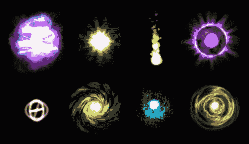

图 2.2：在 Unity 中创建的不同粒子效果或魔法法术

粒子是小型且简单的图像，甚至是网格，它们通过一个称为粒子系统的完整系统以大量显示和动画化。在任何粒子系统中，每个小粒子都扮演着微小的角色，整体上看起来像一些高度抛光的动画或效果。例如，下雪效果可以被视为一个粒子系统。单个雪花粒子如果单独动画化，不代表任何下雪，但如果这些单个雪花粒子以大量、随机速度、随机方向和随机大小进行动画化，所有这些粒子看起来就不会像某种图像动画；相反，它们将看起来像游戏中下雪的系统。这就是在 Unity 中使用粒子系统的关键优势——它允许以非常轻量和优化的方式批量操作重代码，从而产生非常美丽的游戏效果。

# 粒子系统的基础

在 Unity 中，粒子系统由所有粒子组成。开发者只需要管理粒子，其余的将由 Unity 处理。每个粒子都有预定的生命周期，通过各种变化，例如，任何雪落效果中的渐隐，或者烟雾效果中的放大和渐隐等。像所有其他物理游戏对象一样，这些粒子具有速度，可以在其生命周期内改变速度和方向，并且这些粒子可以受到环境物理动力学施加的力和重力的影响。

开发者的目标是管理和控制粒子的生命周期及其行为，例如，一个粒子会持续多少秒？它在其生命周期内会如何增长？它会放大还是不会？它在其生命周期内会逐渐消失吗？所有这些问题都由开发者回答，Unity 将授予他们一个以效果形式出现的令人惊叹的粒子系统。

粒子可以是简单的白色球体，也可以是具有高分辨率纹理和法线图的任何网格。

粒子系统的工作是从一个抽象的角度管理所有这些粒子。这个系统会告诉何时生成下一个粒子以及它应该在什么位置，以什么位置、旋转和缩放。例如，系统的发射形状应该是半球形、圆锥形还是简单的盒子？粒子的发射速率应该是多少，以及任何粒子效果应该持续多长时间来完成一个完整的循环？

# 为游戏创建火箭火焰粒子效果

因此，在掌握了 Unity 中粒子效果和粒子系统的一些基本知识后，让我们通过为我们的 Perky Penguin 游戏创建第一个粒子系统来将这些知识付诸实践。正如我们所知，企鹅背着一个火箭，玩家在屏幕上点击时，它可以让企鹅飞行并加速。现在，这个火箭在激活时将产生一个类似火焰的小效果。以下屏幕截图显示了火箭及其火焰效果作为这个小粒子系统练习的最终结果：

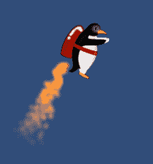

图 2.3：火箭火焰效果最终结果

如前一个屏幕截图所示，你可以观察到火焰是如何从火箭边缘开始，并且如何以渐隐效果缓慢消失，这与现实生活相似。现在，让我们在我们的上一章创建的`PerkyPenguin_PenguinMovement`项目中创建这个简单的粒子效果，该项目来自第一章，《使用 Unity 3D 的 Android 游戏开发入门》。

让我们从选择 GameObject | 粒子系统开始创建一个粒子系统对象，如图下所示：

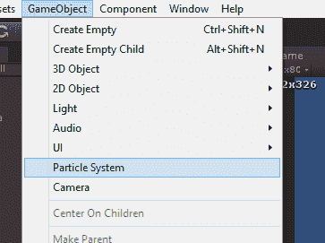

图 2.4 创建粒子系统 GameObject

这将在层次结构面板中立即添加一个名为粒子系统的游戏对象。但你可能在这里注意到一个奇怪的现象，即对象创建并选择后，场景视图中白色球体向外移动。下面的截图显示了场景视图中这些白色球体的简单示例：

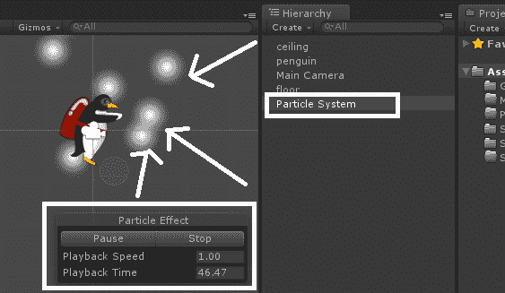

图 2.5 在 Unity 中选中的粒子系统 GameObject

你可以看到，当我们创建了一个粒子系统对象后，一个简单的白色球体粒子系统开始在场景中播放。场景中显示了一个小型控制面板，包括暂停、停止、播放速度和播放时间等控件。当你选择任何其他游戏对象或取消选择粒子系统游戏对象时，粒子系统会自动停止。

Unity 界面的一项特性是，开发者无需玩游戏就可以测试他们的粒子系统。这些可以直接在场景视图中进行检查。

此外，你应该注意所选粒子系统的检查器面板，并查看对象中的粒子系统组件如何显示许多不同的属性，如下面的截图所示：

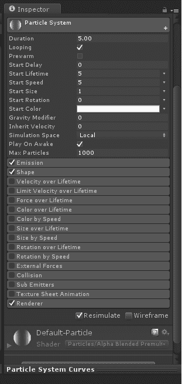

图 2.6 检查器面板中的粒子系统组件

值得注意的是，Unity 的粒子系统几乎所有的内容都包含在这个粒子系统组件中，这是一个包含大量属性的集合。通过调整和更改这些属性的值，可以将下雪转换为燃烧的火焰，或者将其转换为任何飞机游戏的爆炸效果，或者将其转换为任何地牢角色扮演游戏的魔法球或魔法咒语，等等。要了解这些，让我们继续通过以下步骤学习火箭火焰粒子系统：

+   为了使粒子系统始终位于火箭下方，它应该是企鹅对象的子对象。因此，将粒子系统对象拖动到层次结构面板中的企鹅游戏对象上，你将看到如下截图所示的内容：

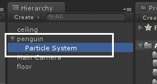

图 2.7 粒子系统 GameObject 作为企鹅对象的子对象

+   将粒子系统重命名为 rocketFire。

+   将其位置设置为(-0.62, -0.33, 0)以将其移动到火箭的喷嘴处。

+   将其旋转设置为(65, 270, 270)以设置粒子在火箭方向上的方向。

以下截图突出了在检查器面板上述步骤中提供的所有更改：

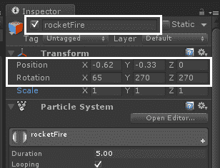

图 2.8 检查器面板中的 rocketFire 变换

仍然在检查器面板中，选择了 rocketFire 粒子系统对象，让我们更改粒子系统组件的值，为我们的企鹅火箭创建一种美丽的火焰效果。以下是需要遵循的步骤：

+   设置起始生命周期为 0.5

+   设置起始大小为 0.3

+   点击“起始颜色”，将红色设置为 255，绿色设置为 135，蓝色设置为 40，Alpha 设置为 255，这将使我们的白色粒子变为橙色

+   展开发射部分，将速率设置为 300

+   展开形状部分，将形状设置为圆锥形，角度设置为 12，半径设置为 0.1

+   将“随机方向”复选框设置为选中状态，以在火焰粒子中创建随机性

以下截图显示了粒子系统组件之前设置的设置，以及场景视图中企鹅下面的火箭火焰效果：

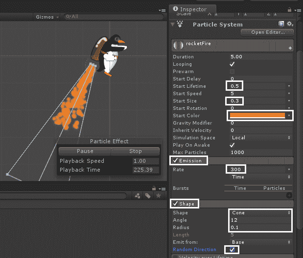

图 2.9 火箭火焰粒子系统

您可以观察到随机生成的白色球体以随机方向移动，并从企鹅背部绑定的火箭中变成了锥形火焰发射。我们所做的是在检查器面板中更改粒子系统组件的一些值。让我们简要看看这些属性实际上做什么：

+   **开始寿命**是发射时粒子的总寿命（以秒为单位）

+   **开始大小**是发射时粒子的初始大小

+   **开始颜色**是发射时粒子的初始颜色

+   **发射率**是每单位时间或移动距离发射的粒子数量

+   **形状**是发射体积的形状：选项有*球体*、*半球体*、*圆锥体*、*盒子*、*网格*、*圆形*和*边缘*

+   **角度**是圆锥在其顶点的角度（仅适用于圆锥）

+   **半径**是形状圆形部分的半径

+   **随机方向**启用意味着粒子的初始方向将被随机选择

您可以在 Unity 的官方手册或文档网站上找到更多这些属性及其用途的信息：[`docs.unity3d.com/Manual/ParticleSystemModules.html`](http://docs.unity3d.com/Manual/ParticleSystemModules.html)。

因此，我们的火箭火焰粒子系统已经准备好了。但在现实生活中，火焰永远不会瞬间结束，它总是随着时间的推移逐渐消失。我们也可以通过在粒子系统组件中启用“开始颜色”属性来添加这个特性。然后点击颜色框，选择右侧顶部的滑块，这是用于结束颜色的 alpha 值，并将其设置为 0。

整个设置在以下截图中显示：

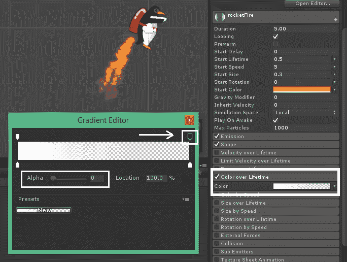

图 2.10 使用“颜色随时间变化”在火焰中添加渐变效果

如果您不确定“颜色随时间变化”在火焰效果中具体改变了什么，以下截图显示了带有和没有渐变效果的火焰粒子系统的差异：

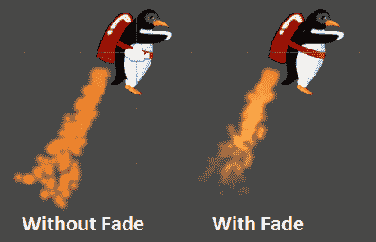

图 2.11 带有和没有渐变效果的火焰效果

到目前为止，我们有一个企鹅在屏幕上轻触时飞行的效果，它的火箭一直在爆炸出火焰。现在，是时候在游戏中添加一些环境来营造游戏的主题了。这个环境将让企鹅能够通过，而我们的游戏需要一个无尽的房间作为背景。但是，为了测试企鹅的行走，我们只会添加背景，而不添加任何无限移动的功能。

# 添加游戏级别的背景

没有背景或主题的游戏根本不是游戏。到目前为止，企鹅没有理由在游戏中行走、飞翔或使用它的火箭助推，因为它处于蓝色的虚空空间中。让我们把这个企鹅带到它真正属于的雪地和山丘世界中。为了生存全球变暖导致的融冰，它也可以使用它的火箭稍微飞一下。在本节中，我们将学习如何添加背景，以及在任何不使用 z-顺序的 2D 游戏中如何管理这些背景和精灵的顺序。

我们将首先为游戏的不同级别创建背景。这些背景可以用您喜欢的图形工具创建，例如 Adobe Photoshop 等。以下截图显示了为活泼企鹅游戏创建的背景：

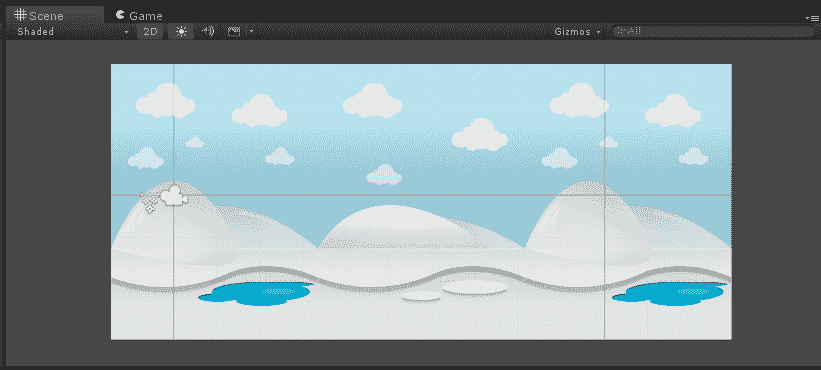

图 2.12 鹦鹉螺活泼游戏的背景

我们已经学习了如何在 Unity 中将图像作为精灵导入。对于背景，我们必须再次执行完全相同的程序。我们已经准备了两个名为 `bg_snow1.png` 和 `bg_snow2.png` 的可重复图像，并将这些图像导入到项目浏览器面板中资产目录的图形文件夹中。以下截图显示了包含背景图像的项目浏览器面板：

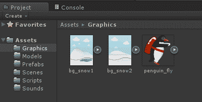

图 2.13 项目浏览器面板中的背景

必须注意的是，背景应该是可重复的，这样当这些图片放在一起时，它们应该合并并避免玩家识别出重复的顺序。以下截图显示了为鹦鹉螺活泼游戏设计的两个背景图片：

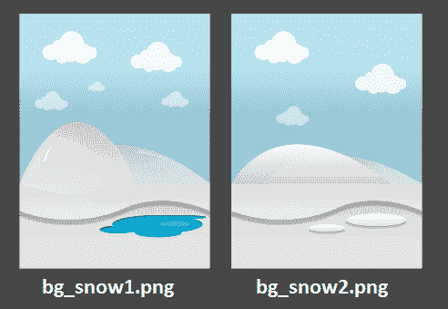

图 2.14 鹦鹉螺活泼游戏的背景图

您可以从图片中看到，如果我们将这些两张图片并排重复，将创建一个非常平滑的背景，它将永远重复。我们将在本章后面通过一些脚本实现这一点。现在，让我们设置游戏场景的背景。

在将 Assets 文件夹中的图形背景图像导入后，在层次结构面板中放置两个 `bg_snow1.png` 对象和一个 `bg_snow2.png` 对象。将第一个 `bg_snow1.png` 的位置设置为 (0, 0, 0)，然后 `bg_snow2.png` 的位置设置为 (4.8, 0, 0)，最后另一个 `bg_snow1.png` 的位置设置为 (9.6, 0, 0)，你将在场景中得到一个小背景。因此，现在你会观察到企鹅隐藏在这些背景之后。由于这是一个 2D 游戏，所以这里没有 z 轴的概念。我们可以设置 z 轴位置并前后移动精灵和图像，但对于 2D 游戏来说，这不是一个好的方法。Unity 为开发者提供了一个针对 2D 游戏优化的 2D 图像前后排序机制。这是通过排序图层来实现的。在层次结构面板中选择 `bg_snow1` 对象，并查看精灵渲染器组件中的检查器，你将看到一个排序图层选项，如下面的截图所示：

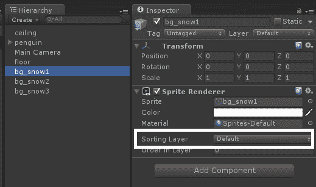

图 2.15 检查器面板中的精灵渲染器排序图层

初始时，您在 Unity 中导入的所有精灵都有一个默认排序图层。点击下拉菜单，你将看到项目中所有排序图层的列表。目前，我们只有一个名为默认的图层，还有一个添加排序图层...选项来添加新图层。点击添加排序图层...选项，如下面的截图所示：

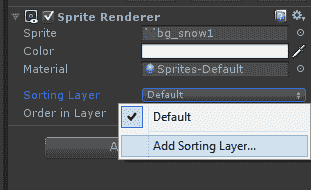

图 2.16 添加排序图层...选项

这将在检查器面板的位置打开一个新的标签和图层面板。按照解释的顺序添加四个图层，即背景、周围环境、对象和玩家。如下面的截图所示：

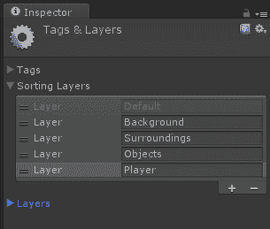

图 2.17 排序图层面板

您可以通过按住并拖动每个图层行左侧的两个线条图标来上下拖动这些图层。上下移动这些图层描述了图层的顺序。例如，当前默认图层是最低的图层，它将位于所有内容之后，而播放器图层将位于除播放器图层之外使用图层的所有内容之前。

排序图层和图层之间有很大的区别。排序图层仅用于排列 2D 游戏中的 2D 精灵，而图层不是用于排列目的。这是一个完全不同的概念，你必须在使用图层时小心，以避免图层和排序图层之间发生任何冲突。

目前，我们只需要玩家和背景排序图层；我们将在本章的后面使用其他图层。现在，在层次结构面板中选择企鹅游戏对象，并在精灵渲染器的排序图层选项中选择玩家图层，如下面的截图所示：

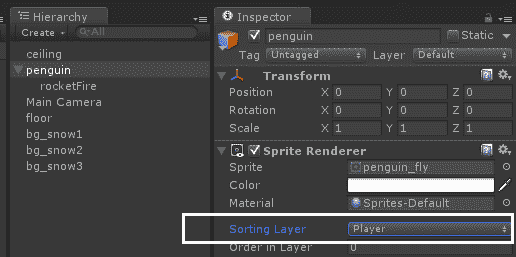

图 2.18 选择企鹅的排序图层

同样，选择场景中所有雪背景对象的背景层。现在你会观察到企鹅将位于这些雪背景之前。

# 摄像机管理

因此，现在我们有一个游戏，其中有一个可以飞行和跳跃的企鹅，带有火箭喷射粒子系统效果。此外，场景中还有一个基本的雪背景环境。在本节中，我们将了解如何使企鹅在无限生成的水平面上移动，以及摄像机将始终聚焦在企鹅上。

# 使企鹅向前移动

让我们先让我们的企鹅向前移动。为此，打开在第一章，“使用 Unity3D 开发 Android 游戏入门”中创建的文件`PenguinController.cs`。此文件位于 Assets 目录的 Scripts 文件夹中。在类中添加一个公共字段前进速度，如下面的代码所示：

```kt
    public float forwardMovementSpeed = 3.0f;

```

请记住，添加任何公共字段都会在脚本的游戏对象中添加一个属性，如下面截图中的 Inspector 面板所示：

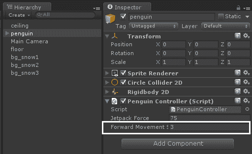

图 2.19 Inspector 面板中的前进移动速度字段

现在，为了以任何速度移动企鹅，我们必须在`Update()`或`FixedUpdate()`方法中更新企鹅的速度。由于我们正在使用`FixedUpdate()`方法来利用企鹅的物理行为，所以将此代码添加到`FixedUpdate()`方法的末尾：

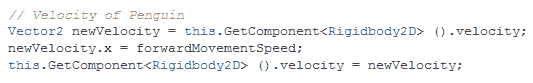

好吧，这段代码中没有太多新内容。由于我们通过喷气背包力量更新了企鹅的 y 位置，所以我们只更新了企鹅对象的 x 轴。看看我们是如何在每一帧上分配`forwardMovementSpeed`到企鹅游戏对象的速率。当你运行项目时，企鹅将开始向右移动，一分钟后，它将离开屏幕。我们的下一个任务是使摄像机跟随企鹅，这样企鹅就可以始终保持在屏幕上，永远不会超出摄像机的边界。

# 使摄像机跟随企鹅

企鹅游戏对象中的对象，如下面截图所示：

我们有很多方法可以使摄像机跟随企鹅。最简单的是将摄像机对象作为企鹅游戏对象的子对象，如下面截图所示：

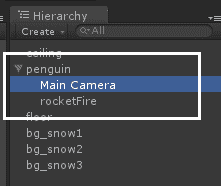

图 2.21 企鹅对象中的摄像机作为子对象

嗯，你可以这样做，但这个解决方案有一个问题。当企鹅跳跃或飞行时，摄像机也会上下移动。我们不需要这个在我们的游戏中。我们只需要摄像机水平移动，并持续向前移动，保持企鹅在边界内。所以，我们将通过在资产目录的脚本文件夹中创建另一个名为`CameraFollow.cs`的 C#脚本文件来实现这一点。现在，添加一个名为`targetObject`的公共`GameObject`字段。这个字段将告诉摄像机要跟随哪个对象。我们将在这个字段中保留企鹅游戏对象的引用。最后，为了使摄像机持续向前移动，我们将编写类似于企鹅向前移动的代码。这里唯一的区别是我们将代码放在`Update()`方法中而不是`FixedUpdate()`方法中。这样做的原因是`FixedUpdate()`应该在对象具有刚体和/或其他物理行为时使用。由于我们的摄像机与物理没有连接，我们可以通过在`Update()`方法中添加移动代码来实现这一点。以下是`CameraFollow.cs`文件的完整代码：

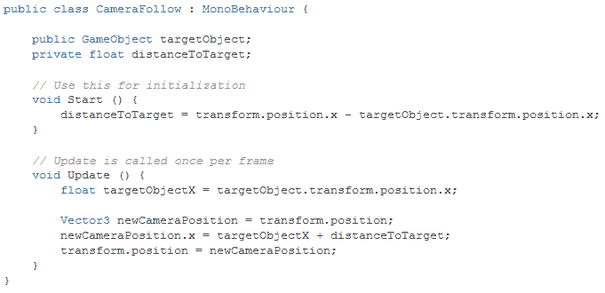

编写代码后，让我们将这个脚本放在摄像机对象上。在层次结构面板中选择主摄像机对象，然后在检查器中点击添加组件按钮，选择脚本 - CameraFollow.cs，如图以下截图所示：

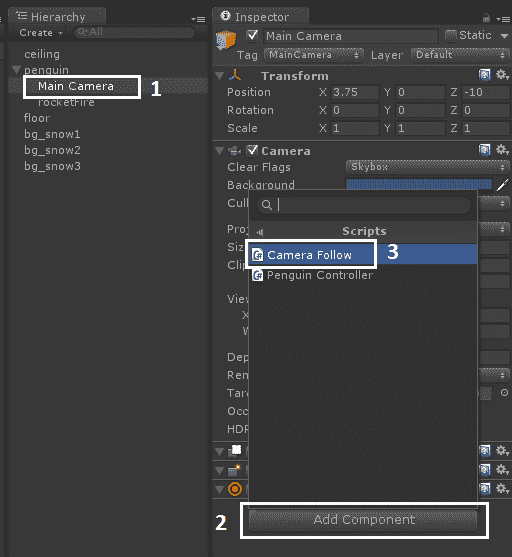

图 2.22 在摄像机上添加 CameraFollow.cs

你也可以通过简单地从项目浏览器面板中将脚本文件拖动到层次结构面板中的游戏对象上来对游戏对象应用脚本。

当你运行项目时，尽管摄像机在移动，你会在调试日志面板中看到一个错误，如图以下截图所示：

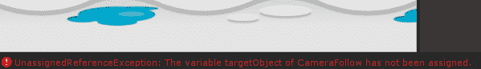

图 2.23 调试日志中的摄像机错误

问题在于`CameraFollow`脚本中的变量`targetObject`没有被分配任何值，我们在`Update()`方法中访问它。回想一下，我们需要在`targetObject`值中分配企鹅游戏对象，以便告诉摄像机要跟随的目标。你可以使用 Unity 的公共检查器功能，通过将企鹅对象直接拖动到检查器面板中的摄像机`targetObject`字段来分配企鹅对象，如图以下截图所示：

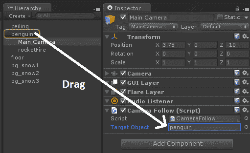

图 2.24 在目标对象中分配企鹅对象

现在运行游戏，你会看到摄像机永远不会让企鹅离开屏幕。然而，移动一段时间后，企鹅会开始下落，因为它的地板已经被留下，企鹅没有物理支撑来抵抗重力。为了解决这个问题并继续游戏，我们将在下一节中创建无限关卡。

# 预制件和关卡管理

没有一款游戏不包含至少一个级别。级别是让游戏感觉像是一种体验和冒险的原因。级别带有不同类型的难度，玩家开始感受到完成某事的成就感和奖励。因此，为了给我们的企鹅活泼游戏注入灵魂，让我们在我们的游戏中添加级别。但这里出现的问题是我们应该添加什么类型的级别到游戏中。由于游戏是无尽的，因此添加带有随机障碍和敌人的自动生成级别将非常合适。为了做到这一点，我们需要一个脚本，该脚本将负责生成随机环境和房间，并放置敌人和障碍物以平衡游戏难度。

Unity 为开发者提供了在运行时实例化游戏对象并在其中定义行为的机会，这些行为也可以在运行时定义。我们可以在运行时单独添加房间、级别、金币、敌人等等，但 Unity 提供了一个更好、更有组织的处理这些类型情况的方法来管理运行时可重复使用的元素。这是通过预制件对象实现的。让我们在下一节中讨论预制件。

# 预制件

根据 Unity 的文档，预制件是一种资产类型——一个存储在项目视图中的可重复使用的`GameObject`。预制件可以被插入到任意数量的场景中，每个场景可以多次插入。当你将预制件添加到场景中时，你创建了一个它的实例。所有预制件实例都与原始预制件链接，并且本质上都是它的克隆。无论你的项目中存在多少个实例，当你对预制件进行任何更改时，你将看到更改应用于所有实例。

以下截图显示了项目浏览器视图中的空预制件：

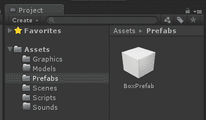

图 2.25 项目浏览器面板中的空 BoxPrefab

你会注意到在我们的资产目录中有一个名为“预制件”的文件夹。我们在配置项目时创建了此文件夹。我们将把游戏中使用的所有预制件存储在这个目录中。

预制件与游戏对象完全一样。它们可以有碰撞器、刚体、脚本、其他组件等等。预制件和游戏对象之间的唯一区别是预制件可以在运行时实例化并在运行时复制相同的行为，但游戏对象可以在运行时生成。

为了创建一个无尽级别，我们必须为我们的游戏创建一个小块级别的集合。这个块将在企鹅不断通过级别时在运行时不断地重复生成。让我们在下一节中创建这个小级别块，看看这个预制件理论是如何付诸实践的。

# 创建级别块预制件

级别块预制件将包含一个地面物体和一个天花板物体，以防止企鹅从屏幕边界外跑出去，并且它将有一个背景环境用于装饰和主题目的。

让我们从在层次结构中右键单击层次结构视图并单击创建空对象开始，如图以下截图所示：

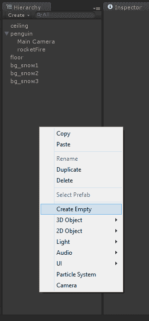

图 2.26 创建空 GameObject

现在，将所有必要的游戏对象作为此空游戏对象的子对象放入预制件中。目前，我们正在添加`snow_bg1`和`snow_bg2`背景，`floor`对象和`ceiling`对象。我们可以在任何时候更新它并添加新的对象和组件到预制件中。但您必须记住，这将更改所有现有的预制件对象，因此在更新预制件时必须小心。

所有这些对象都可以拖动到创建的空游戏对象上，使其成为子对象，然后将空游戏对象重命名为`level_block`。以下截图显示了`level_block`对象的游戏对象层次结构：

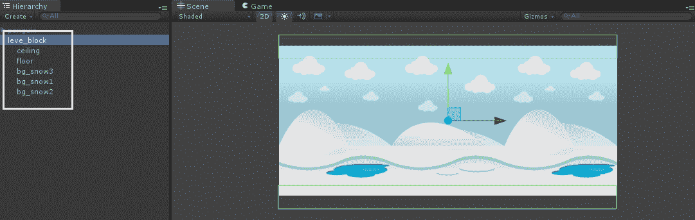

图 2.27 level_block 游戏对象

如果您用更多对象、装饰、环境等装饰了层级块，那么您也应该将它们添加到层级块空游戏对象中。

我们已经创建了一个层级块游戏对象。现在，是时候将其转换为预制件形式了。为此，在资产目录中的预制件文件夹上右键单击，并从菜单中选择创建 - 预制件，如图以下截图所示：

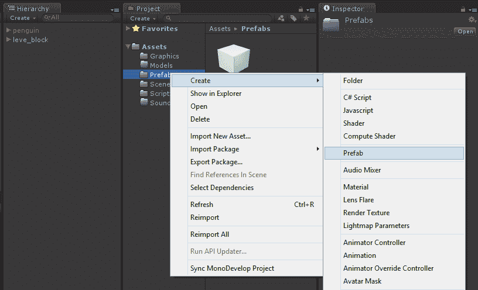

图 2.28 创建预制件

它将在预制件文件夹中创建一个空预制件。现在，将层级块游戏对象从层次结构视图拖动到创建的空预制件上，您的预制件就准备好了。以下截图显示了这一过程：

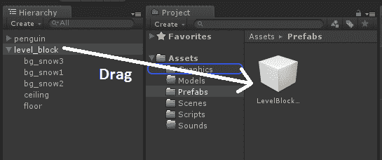

图 2.29 向预制件添加对象

预制件创建后，将在项目浏览器面板中显示游戏对象内容的小预览。您还会注意到其中有一个小箭头，它将探索放入预制件中的所有对象。以下截图显示了项目浏览器面板中层级块预制件的预览：

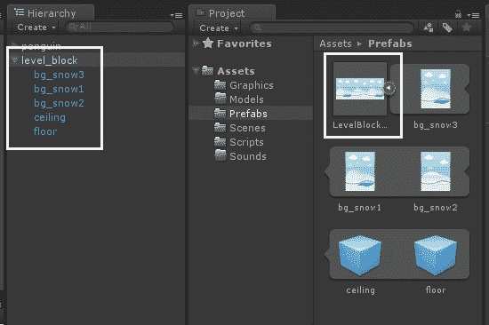

图 2.30 项目浏览器面板中的预制件

预制件可以在任何场景中使用。这些可以在整个项目中任何地方重复使用。

为了查看预制件在运行时的表现，只需将我们的层级块预制件对象拖入场景几次，在不同的位置，看看它在视图中是如何出现的。以下截图显示了几个放置在场景中的层级块：

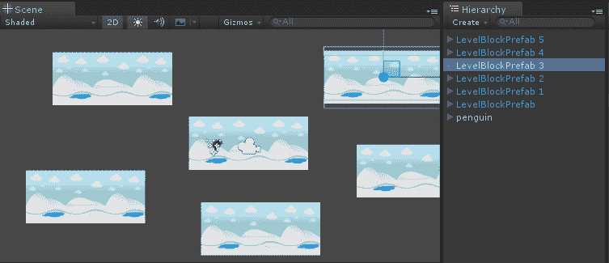

图 2.31 随机放置在场景中的层级块预制件

您可以观察到，无论何时我们将任何预制件拖入场景，它都会创建一个包含所有功能、子对象、行为、脚本等的整个块。这就是在 Unity 中使用预制件的主要优势。

我们的关卡方块预制件已经准备好了。现在我们必须告诉 Unity 在何时以及在什么位置创建方块。我们将通过将一个名为 `BlockGenerator.cs` 的脚本添加到企鹅对象中来实现这一点。让我们在下一节中解释这个生成器。

# 水平方块生成器概念

生成器脚本背后的理念非常简单。脚本有一个可以生成的关卡方块数组（目前我们只创建了一个方块），一个当前已生成的方块列表，以及两个额外的方法。一个方法检查是否需要添加另一个方块，另一个方法实际上添加一个方块。

为了检查是否需要添加方块，脚本将枚举所有现有房间并查看是否存在一个比屏幕宽度更远的房间，以确保玩家永远不会看到关卡结束。为了更清楚地理解这一点，让我们看看下面的截图：

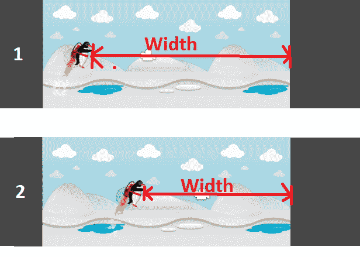

图 2.32 关卡方块生成器想法

您可以在场景 1 中看到，还有足够的空间或宽度来覆盖方块的一些距离。但在场景 2 中，空间不足，因为随着企鹅向前移动，空隙将开始出现。所以在我们看到任何空白空间之前，我们需要在当前方块旁边添加一个新的关卡方块，以确保玩家永远不会在那里看到任何空隙。该图仅试图阐明新方块将如何添加以及何时添加。以下截图显示了方块的一个示例生成和我们的企鹅前进状态：

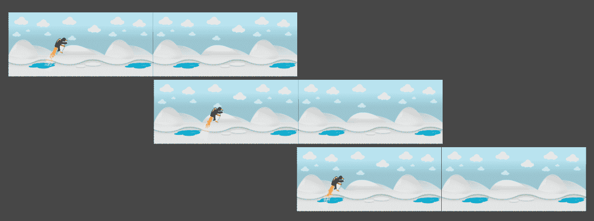

图 2.33 企鹅前进和关卡方块生成

您可以看到，随着企鹅不断前进，新的方块会不断地生成。一旦任何方块离开屏幕，它将被删除以优化内存使用并提高游戏性能。

现在让我们通过在下一节中编写 `BlockGenerator.cs` 代码来将整个场景付诸实施。

# BlockGenerator.cs 代码

让我们从在资产目录的脚本文件夹中创建一个名为 `BlockGenerator.cs` 的空 C# 脚本文件开始。然后将此脚本拖放到企鹅对象上以应用于企鹅。

任何游戏对象都可以应用多个脚本。对游戏对象上应用的脚本或组件没有限制。

通过在项目视图或检查器面板中双击 `BlockGenerator.cs` 在 `MonoDevelop` 中打开它。

如果您打算使用 `List<T>` 类，则必须添加 `System.Collections.Generic` 命名空间。

将以下字段变量添加到 `BlockGenerator` 类中：

```kt
    public GameObject[] availableBlocks;
    public List<GameObject> currentBlocks;
    private float screenWidthInPoints;

```

`availableBlocks`将包含脚本可以生成的 Prefab 数组。目前，我们只有一个 Prefab（`LevelBlockPrefab`）。但我们可以创建许多不同的方块类型并将它们全部添加到这个数组中，以便脚本可以随机选择要生成的方块类型。`currentBlocks`列表将存储实例化的方块，以便它可以检查最后一个方块在哪里结束以及是否需要添加更多方块。一旦方块在玩家角色后面，它也会将其移除。`screenWidthInPoints`变量只是用于缓存屏幕大小的点。

你可以在企鹅游戏对象的检查器视图中看到这些字段，如下面的截图所示：

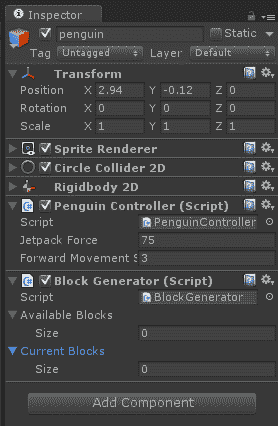

图 2.34 检查器中的方块生成器字段

现在，在`BlockGenerator.cs`文件的`Start()`方法中添加以下代码：

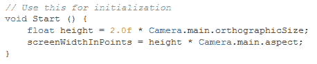

在这里，你计算屏幕的大小（以点为单位）。屏幕大小将用于确定是否需要生成新的方块，如前所述。

将以下`AddBlock()`方法添加到`BlockGenerator.cs`：

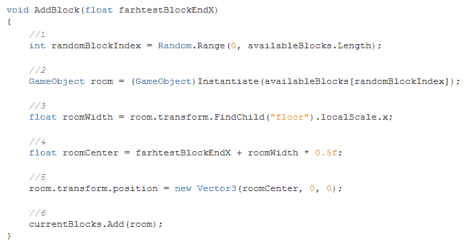

此方法使用`farthestBlockEndX`点添加一个新的方块，这是到目前为止关卡的最右端点。以下是此方法每一行的描述：

+   从方块类型（Prefab）的随机索引中选择。

+   使用上面提到的随机索引从可用方块数组中创建一个方块对象。

+   由于方块是空的，包含所有方块部分，你不能简单地取其大小。相反，你得到方块内部地板的大小，这等于方块宽度。

+   当你设置方块位置时，你设置其中心的位置，因此将方块宽度的一半加到关卡结束的位置上。这样可以得到你应该添加方块的位置，以便它紧接在最后一个方块之后开始。

+   这设置了方块的位置。你只需要更改 x 坐标，因为所有方块都具有相同的 y 坐标和等于零的 z 坐标。

+   最后，你将方块添加到当前方块列表中。它将在下一个方法中被清除，这就是为什么你需要维护这个列表的原因。

在`AddBlock()`方法之后，让我们深入了解`GenerateBlockIfRequired()`方法的细节：

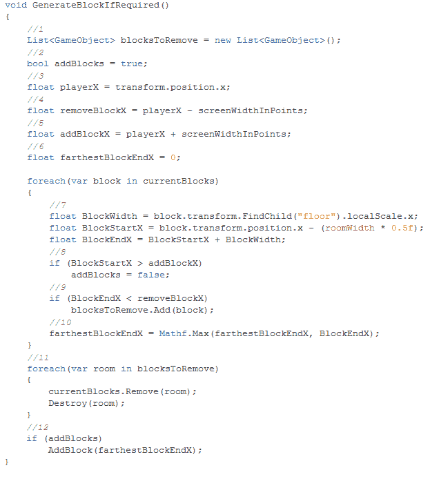

此方法是前一小节中解释的想法的实现：

1.  创建一个新的列表来存储需要移除的方块。由于在迭代列表时不能从中移除项目，因此需要单独的列表。

1.  这是一个标志，表示你是否需要添加更多方块。默认情况下，它被设置为 true，但大多数情况下它将在`foreach`内部设置为 false。

1.  保存玩家位置。

1.  这是方块应该被移除的点之后的位置。如果一个方块的位置在这个点（左侧）之后，它需要被移除。

1.  如果在`addBlockX`点之后没有方块，你需要添加一个方块，因为关卡结束的位置比屏幕宽度更近。

1.  在`farthestBlockEndX`中，你存储当前关卡结束的点。如果你需要添加一个新方块，你会使用这个变量，因为新方块应该从那个点开始，以使关卡无缝。

1.  在`foreach`中，你只需枚举当前方块。你使用地板来获取方块宽度并计算`BlockStartX`（方块开始的位置，方块的最左点）和`BlockEndX`（方块结束的位置，方块的最右点）。

1.  如果有一个方块在`addBlockX`之后开始，那么你现在不需要添加方块。然而，这里没有`break`指令，因为你仍然需要检查这个方块是否需要被移除。

1.  如果一个方块在`removeBlockX`点的左侧结束，那么它已经不在屏幕上了，需要被移除。

1.  在这里，你只需找到关卡的最右点。这将是目前关卡结束的点。它仅在需要添加方块时使用。

1.  这会移除标记为移除的方块。鼠标`GameObject`已经飞过了它们，因此它们在后面很远，所以你需要移除它们。

1.  如果此时`addBlocks`仍然是`true`，那么关卡结束就快了。如果它没有找到比屏幕宽度更远的方块开始，`addBlocks`将是`true`。这表明需要添加一个新的方块。

因此，在所有这些解释之后，让我们将我们的最终方法`FixedUpdate()`添加到`BlockGenerator.cs`文件中，如下所示：

```kt
    void FixedUpdate() 
    {
        GenerateBlockIfRequired(); 
    }

```

在`FixedUpdate()`中生成方块将继续定期确保玩家在游戏中不会遇到空白空间。现在，回到 Unity，在层级中选择*penguin* GameObject。在检查器中，找到`BlockGenerator`组件。将层级中的 LevelBlockPrefab 拖到当前方块列表中。然后打开项目浏览器中的 Prefab 文件夹，将 LevelBlockPrefab 从其中拖到可用方块中。以下截图显示了添加 Prefab 到列表后企鹅对象的`BlockGenerator`组件：

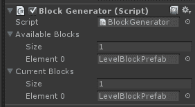

图 2.35 带有 Prefab 的方块生成器组件

现在运行项目，你会看到方块会持续生成。注意，当你飞行时，方块会在层级中不断出现和消失。为了增加更多乐趣，运行场景并切换到*场景视图*而不停止游戏。这样，你将看到方块是如何实时添加和移除的。

因此，在关卡生成后，让我们在下一节讨论如何在游戏中添加障碍物，如冰刺，使企鹅在通过关卡时更加小心。

# 添加冰刺到游戏中

飞越关卡的小企鹅看起来很棒，但游戏的核心是挑战和障碍。因此，本节将详细介绍可以添加到游戏中的障碍。我们将添加冰尖刺，这些尖刺将以与生成方块类似的方式随机生成。让我们首先创建冰尖刺。你需要为尖刺的开启和关闭状态准备两张图片。

以下截图显示了尖刺的开启和关闭状态：

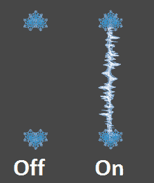

图 2.36 检查器面板中的方块生成器字段

将这些图片以 `spike_on.png` 和 `spike_off.png` 的名称导入 Unity，存放在 Assets 目录的 Graphics 文件夹中。然后我们必须为尖刺创建一个 Prefab。以下是步骤：

1.  在项目视图中，找到 `spike_on` 精灵，并将其拖到场景中。

1.  在层次结构中选择它，并将其重命名为 `spike`。

1.  将其排序层设置为 Objects*.*。

1.  添加一个 Box Collider 2D 组件。

1.  在 Box Collider 2D 组件中启用 Is Trigger 属性。

当启用 Is Trigger 属性时，碰撞器将触发碰撞事件，但将被物理引擎忽略。

1.  设置碰撞器的尺寸，*X* 为 *0.18*，*Y* 为 *3.1*。

1.  在 Scripts 文件夹中创建一个新的 C# 脚本，命名为 `SpikeScript.cs`，并将其附加到 `spike` 游戏对象上。

以下截图显示了创建尖刺 GameObject 的所有步骤：

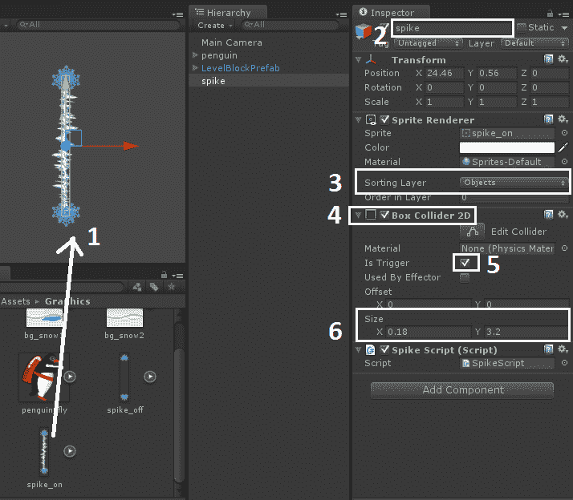

图 2.37 添加尖刺游戏对象

现在打开 `SpikeScript.cs` 文件，并在类中添加以下字段：

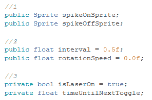

然后在 `Start()` 方法中添加以下代码：

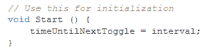

这将设置尖刺第一次切换状态的时间。然后，为了切换和旋转尖刺，添加 `FixedUpdate()` 并如下操作：

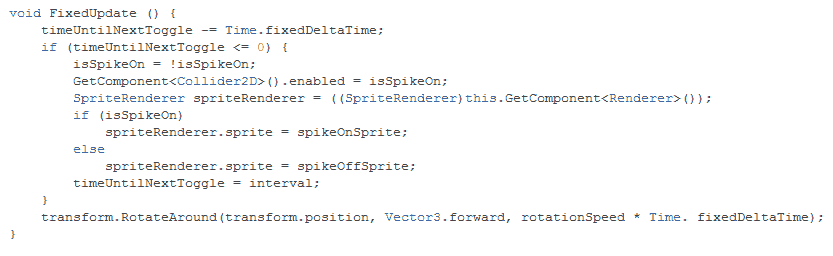

现在，在层次结构中选择 `spike`。从项目浏览器中将 `spike_on` 精灵拖到检查器视图中 `SpikeScript` 组件的 Spike On Sprite 属性。同样，也为 `spike_off` 精灵做同样操作。将旋转速度设置为 30，位置设置为 (2, 0.25, 0)。运行项目，你将得到一个旋转的尖刺，最终将尖刺游戏对象转换为 spikes 文件夹中的 SpikePrefab，就像我们在前面的章节中所做的那样。

以下截图显示了游戏中运行的尖刺：

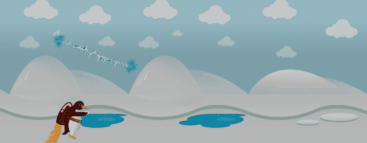

图 2.38 游戏中的尖刺

# 摘要

在本章中，我们继续开发我们的“活泼企鹅”游戏，并向其中添加了粒子系统。然后我们学习了如何管理摄像机，并在整个游戏中使摄像机跟随企鹅。然后我们处理 Prefab，并创建了一个关卡方块 Prefab，我们在游戏中通过代码生成，以制作一个无限关卡生成游戏。然后我们创建了一个尖刺 Prefab，为游戏中的企鹅创建一个随机生成并具有不同运行时速度旋转的障碍。

在下一章中，我们将把制作游戏的概念扩展到 3D，并介绍如何在 Unity 3D 中创建 3D 复杂游戏的流程和系统。
