# 第三章：为动作格斗游戏添加玩家角色

上一章涵盖了 Unity 中 2D 游戏开发的多项不同内容和概念，并遵循实用方法完成了一个名为活泼企鹅的简单 2D 游戏。章节继续了从第一章，《使用 Unity3D 开发 Android 游戏入门》开始的实践示例，并通过涵盖 2D 游戏的重要主题来完成。它从在 Unity 中添加粒子效果开始，然后详细解释了粒子系统的概念、粒子系统的基础以及如何在 Unity 中添加它们。然后我们继续讨论通过为游戏中的企鹅添加火箭火焰粒子系统来应用这些概念，并讨论了如发射、形状和颜色等属性。

在粒子系统之后，章节专注于创建游戏环境并添加背景。它解释了如何导入这些背景，以及如何在游戏中使它们可重复。还涵盖了排序层和标签的概念，章节接着讨论了相机管理以及如果相机始终聚焦于企鹅，企鹅将永远不会离开屏幕。

在这些常规主题之后，章节中讨论了一个非常有趣且实用的 Prefab 主题。在讨论 Prefab 的一些基本概念之后，游戏通过使用 Level Prefabs 得到了启发，这使得游戏能够在运行时重复背景并生成障碍物。这次讨论还包含了生成器概念及其代码实现。

最后，章节通过在游戏中添加障碍物和企鹅的基本碰撞检测来完成，这也引出了触发器概念，这在创建不可见碰撞体以检测游戏中某个位置的对象存在时非常有用。以下是在完成上一章后的游戏截图：

图 3.1 鹦鹉螺活泼游戏的一张快照

如果你感兴趣想要在 Unity 中创建任何 2D 游戏，那么这些内容在第一章，《使用 Unity3D 开发 Android 游戏入门》和第二章，《完成活泼企鹅 2D 游戏》中有更详细的介绍。

与前几章相比，本章是一个全新的层次。在本章中，我们将扩展我们对 Unity 的知识，将其应用于 3D 游戏开发，这对于新游戏开发者来说常常会变得非常复杂和棘手。直到 2D 游戏开发，开发者和程序员的关注点围绕图像、精灵和二维概念，忽略了摄像机的深度。那些在 Adobe Photoshop 或 Gimp 等图形工具上工作的新开发者证明在 2D 游戏开发方面非常出色，并能快速掌握概念，但 3D 变得非常困难，因为它需要掌握 Autodesk Maya、3D Studio Max 等高度使用的先进商业工具的专业知识。这些工具需要多年的实践和经验，这使得 3D 游戏开发对于新程序员来说非常难以学习。

本书的范围不包括涵盖所有主题，但我们将通过从头开始创建 3D 动作格斗游戏来学习基本概念及其用法。本章将从配置 3D 游戏项目、导入 3D 模型以及如何将这些模型上应用纹理和材质开始讲解。接下来，本章将介绍骨架的概念以及 Unity 提供哪些接口来简化骨架配置，例如人形骨架、通用骨架等。这个骨架概念将通过在 Unity 中导入和配置动作格斗游戏的玩家角色模型来在实践中得到实现。我们还将应用动画以允许基本角色移动。

现在，让我们将我们的话语付诸实践，开始学习 3D 游戏开发，以下部分将重点关注 Unity 中 3D 游戏项目的配置。

本章包括以下主题：

+   在 Unity 中为 3D 游戏配置项目

+   导入 3D 模型

+   应用纹理和材质

+   通用和人形骨架

+   配置人形角色

+   旧版和 Mecanim 动画系统

+   带有动画控制器的状态机

# 在 Unity 中配置 3D 游戏项目

在前几章中，我们学习了 2D 游戏，也学习了如何在 Unity 中创建和配置 2D 游戏项目。对于 3D 项目，流程几乎相同，只是需要做一些更改。让我们先启动 Unity 5，并使用它创建一个空项目。

如果你已经熟悉 3D 游戏项目的配置或者之前参与过任何 3D 游戏开发，你可以安全地跳过这一部分。当你启动 Unity 5 时，它会显示一个项目向导，如下面的截图所示：

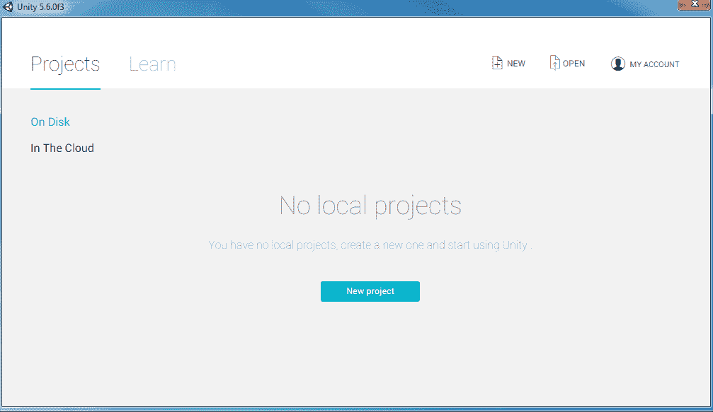

图 3.2 Unity 5 新项目向导

项目向导显示了一个包含所有最近项目及其名称的列表。最近的项目被突出显示以快速打开。在向导的右上角，有一些控制按钮，可以用来从头创建新项目或从任何目录打开任何特定的项目。让我们通过点击右上角的“新建项目”按钮开始创建一个新项目。您将看到一个对话框，如下面的屏幕截图所示：

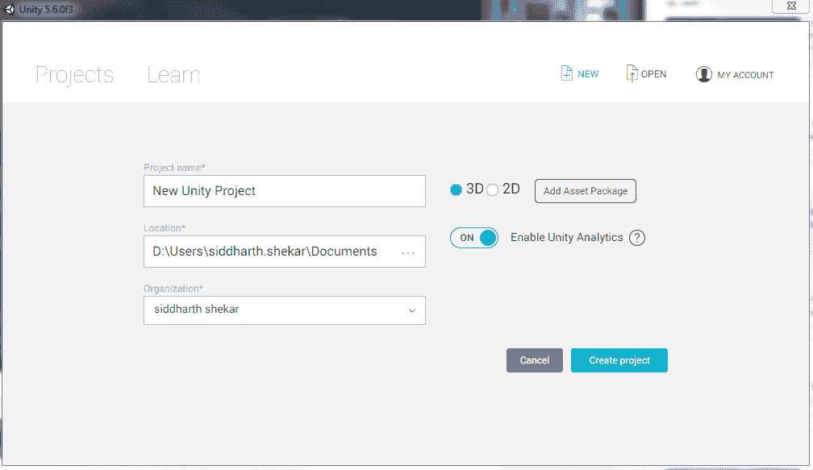

图 3.3 新建项目详情向导

输入项目名称并选择其路径位置。在这些文本输入下方，您将观察到两个选项的简单选择：2D 和 3D。由于我们正在创建一个 3D 游戏，我们将选择 3D。这在上面的屏幕截图中显示：

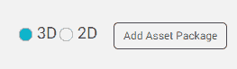

图 3.4 2D 和 3D 项目类型选择器

此切换选项允许您告诉 Unity 您的项目是 2D 还是 3D。尽管在处理项目时这不会以任何方式影响或改变项目，但它会影响默认的项目设置，以便更容易地工作流程。例如，在 3D 模式下，当您将任何图像资产导入到项目中时，Unity 会将其视为纹理；而在 2D 模式下，Unity 会将其视为精灵。您也可以稍后从项目设置中更改模式；在项目创建时选择不是必需的。默认情况下，Unity 会以 3D 模式创建项目。

现在，让我们将项目命名为 Free Fighter 并点击创建项目。这将导入一些预定义的资产并启动 Unity 界面编辑器。您可以看到，将创建一个包含两个游戏对象的空新场景，这两个对象位于层次面板中：主摄像机和方向光。我们现在不会讨论这些对象，但它们将在后续章节中涵盖，当我们管理游戏中的摄像机和灯光时。

在这个空白未保存的场景中，我们首先需要的是玩家角色的模型。让我们在下一节中一般性地讨论模型或模型。

# 导入 3D 模型

在我们深入探讨 3D 建模和 Unity3D 的精彩细节之前，让我们首先讨论一下什么是 3D 模型。在计算机图形学中，3D 建模是通过任何 3D 建模软件构建和开发任何物体三维（3D）表面的数学和视觉表示的过程。该过程的最终产品被称为**3D 模型**，或在本书的上下文中简称为模型。3D 模型有趣的地方在于它们是三维的，而任何计算机或笔记本电脑屏幕都是二维表面，因此将 3D 模型显示在二维屏幕的视野和边界内变成了一项棘手的工作。因此，使用 2D 图像的形式显示 3D 模型的过程被使用，这被称为**3D 渲染**。它包括 3D 软件工具，包括我们自己的 Unity3D。这个渲染过程使用灯光和相机将 3D 模型渲染成真实的样子，并在观众心中呈现它的图像。我们可以进一步探讨这个永无止境的主题和 3D 模型的讨论，但这远远超出了本书的范围。因此，我们将只讨论有助于在 Unity 中构建 3D 游戏的重要细节，即模型和建模工具。

3D 建模是开发任何物体三维表面的数学表示的过程。记住，3D 模型是任何游戏的主要资产。模型文件可能包含 3D 模型，例如任何角色、建筑、家具等。模型文件也可能包含可用于动画此模型或其他模型的动画数据。动画数据以一个或多个动画剪辑的形式导入。我们无法在 Unity 中创建 3D 模型，因为 Unity 是用于开发游戏的引擎，而不是用于创建 3D 模型。我们只能导入它们并在游戏中使用它们。市场上有很多 3D 建模软件包，而且它们每天都在不断改进。

在 Unity 中，导入网格可以通过两种主要类型的文件实现：**导出的 3D**文件格式和**专有 3D 应用程序**文件。让我们进一步描述导出的 3D 文件格式。Unity 可以读取`.fbx`、`.dae`、`.3DS`、`.dxf`和`.obj`。以下文本中描述了导出的 3D 文件格式的优缺点：

**优点**

+   只导出你需要的数据

+   可验证的数据（在 Unity 之前重新导入到 3D 包中）

+   通常文件较小

+   鼓励模块化方法；例如，用于碰撞类型或交互的不同组件

+   支持我们没有直接支持的专有格式的其他 3D 包

**缺点**

+   可能是原型设计和迭代过程中的较慢流程

+   更容易在源（工作文件）和游戏数据（例如，导出的 FBX）之间丢失版本跟踪

第二种类型的文件是专有 3D 应用程序文件，例如来自 3D Studio Max 或 Blender 的`.Max`和`.Blend`文件格式。Unity 也可以导入 Max、Maya、Blender、Cinema4D、Modo、Lightwave 和 Cheetah3D 文件。例如，MAX、MB、MA 等。专有 3D 应用程序文件的优缺点如下：

**优点：**

+   快速迭代过程（保存源文件，Unity 重新导入）

+   简单易用

**缺点：**

+   必须在所有使用 Unity 项目的机器上安装该软件的授权副本

+   文件可能会因为不必要的数据而变得臃肿

+   大文件可能会减慢 Unity 更新

+   验证较少，因此更难解决问题

# 3D 模型

3D 模型是使用几何原语（如三角形、线条、曲面等）集合构建的任何物理对象的表示。以下图显示了用于创建 3D 模型的一些基本原语：

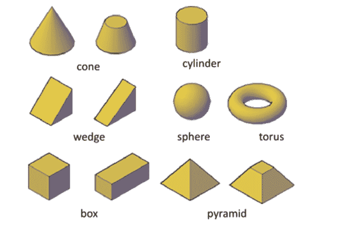

图 3.5 一些基本的 3D 建模原语

所有的 3D 模型和对象都是通过组装、修改、微调等操作这些基本形状和对象来创建的。为了更好地理解，请看以下图，它显示了在像 Photoshop 或 Gimp 这样的 2D 图形工具背后的场景中使用的 2D 原语：

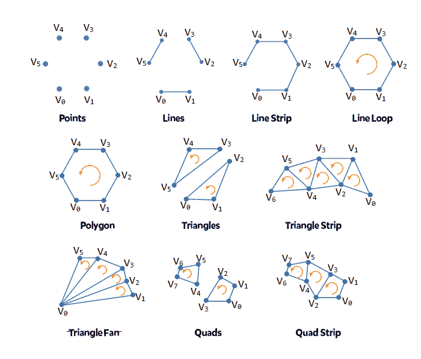

图 3.6 一些 2D 原语

# 建模工具

现在你已经对 3D 模型有了很好的理解，让我们继续讨论建模工具。这些 3D 模型是在非常先进且主要商业的工具中创建的，例如 Autodesk Maya、Autodesk 3D Studio Max、Blender 等。这些工具为建模者提供了各种选择和功能，以创建和动画 3D 模型，并以图像或视频电影的形式渲染它们，或者直接将它们导出为模型文件。

以下表格显示了某些 3D 建模工具及其使用许可类型：

| **工具名称** | **许可类型** |
| --- | --- |
| Autodesk Maya | 商业 |
| Autodesk 3D Studio Max | 商业 |
| Cinema 4D | 商业 |
| Cheetah 3D | 商业 |
| Blender | 公众 |

表 3.1 一些 3D 建模工具

Unity3D 不是一个高级建模工具，但它提供了一些基本原语和一些基本的建模功能。但是，为了在 Unity3D 中创建任何 3D 游戏或电影，你需要更详细的 3D 模型。因此，Unity3D 允许开发者和建模者导入大多数类型的 3D 模型文件，以便自定义、动画并在游戏中或电影中使用它们，同时也可以通过编程来实现。这个功能使 Unity3D 与其他 2D 或 3D 游戏引擎相比确实非常强大。在导入模型时，Unity3D 支持两种类型的文件：

1.  导出的 3D 文件格式，如`.fbx`、`.dae`、`.obj`。

1.  专有 3D 应用程序/工具文件或建模工具的原生文件，例如`.max`或`.mb`。

导出的文件通常体积较小，这些文件允许你在导出时选择你想要在 Unity3D 中使用的数据。Unity3D 推荐这些类型的模型用于游戏或电影，以便优化实时渲染和高性能。

后续的专有文件是 Maya 和 3D Studio Max 等工具的模型的原生源文件。这些文件的最大优势是它们允许在编辑时通过看似重新导入模型的方式快速迭代测试游戏/电影。但是，你需要在每个使用 Unity3D 和模型文件的计算机上拥有建模工具的授权副本。这些文件通常非常大，不建议在 Unity3D 中发布游戏或电影。

强烈建议在 Unity3D 中使用 FBX 文件，因为它允许直接在模型中嵌入动画和纹理。

# Unity3D 中导入 3D 模型

因此，在详细讨论了 3D 模型和建模工具之后，让我们深入了解如何在 Unity3D 中导入 3D 模型。如果我们用导入精灵、图像和声音的说法来说，它听起来与将任何 3D 模型文件放入项目的 `Assets` 文件夹相似，但实际上由于 Unity3D 导入过程中涉及到的许多概念和设置，它实际上变得复杂。

在本节中，我们将讨论如何在 Unity 中导入任何 3D 模型。现在，我们将导入一个简单的 FBX 类型的房屋模型到 Unity 中。FBX 类型代表 Filmbox 文件，主要用于 AutoCAD 的房屋、建筑、汽车和工程建模的 CAD/CAM 设计。主要的 3D 建模工具也提供了将模型导出为 `.fbx` 格式的选项。使用 FBX 文件的主要优势是它允许开发者选择在文件中导出哪种类型的数据。这些数据可以包括网格、网格动画、骨架或骨骼动画。我们使用了一个简单的房屋模型，如图所示，从可供公众使用的 **Free 3D Models** (**t3fm**) 网站下载：

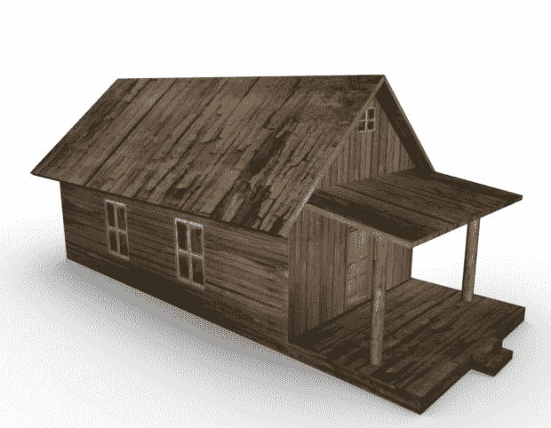

图 3.7 一座房屋模型

现在，首先在 Unity 中打开我们的 3D 自由战斗机项目，你将在项目面板中看到 Assets 文件夹。在 Assets 文件夹上右键单击，创建一个名为 `Models` 的新文件夹。将模型导入 Unity3D 的方法有很多。点击 Assets 菜单，选择 Import New Asset... 选项，然后选择 Farmhouse.fbx 文件，最后点击 Import 按钮。

整个过程如图所示：

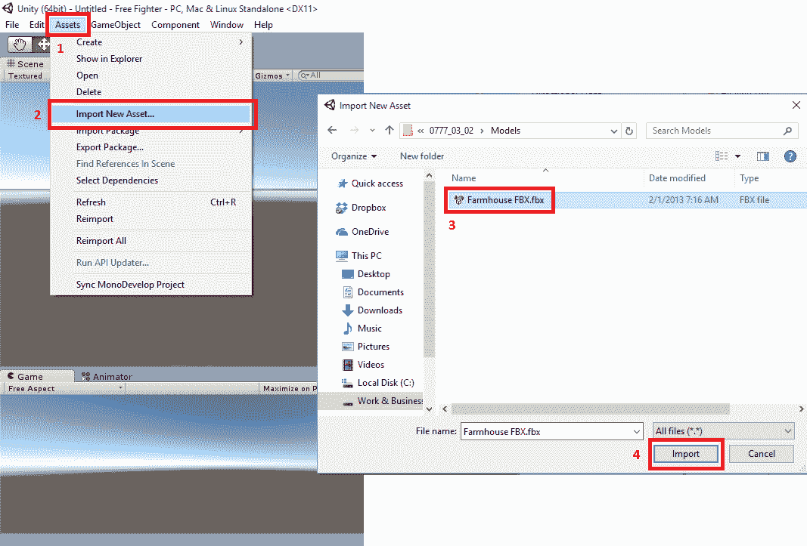

图 3.8 Unity3D 中导入 3D 模型

导入后，你会看到文件将被放置在 Models 文件夹中。但你也注意到了，在项目面板中，与模型文件一起自动创建了一个名为 Materials 的文件夹，如图所示：

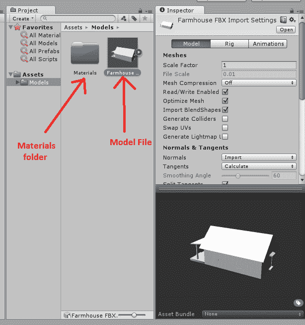

图 3.9 项目面板中的房屋模型

现在，模型已导入 Unity，可以在游戏中使用。你可以以与在 Unity3D 中添加图像和精灵类似的方式将其拖入场景。将其拖入场景后，你会注意到模型没有着色。它只是一个单色的白灰色模型，如下面的截图所示：

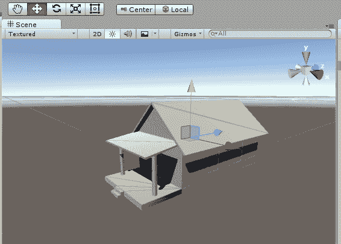

图 3.10 场景中的房屋模型

颜色消失的原因，在 Unity3D 中称为纹理和材质，是因为这个模型的.FBX 文件只包含场景中显示的模型网格。纹理和材质也独立于模型存在，也可以嵌入到模型文件本身中。将文件分开到 Unity3D 中是一种良好的实践。

将手动放置在`Assets`文件夹中的模型文件自动导入到 Unity3D 中。

模型文件可以包含任何 3D 模型，如任何角色、建筑或任何几何形状。我们已经在 Unity3D 中导入了一个农舍模型。在场景视图或层次结构面板中，导入的模型被放置为模型预制件的游戏对象，这是 Unity3D 在导入模型时自动创建的。这个游戏对象将包含所有模型数据，如网格、灯光等，作为其子对象。以下图显示了层次结构面板中的农舍模型游戏对象：

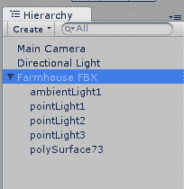

图 3.11 农舍模型预制对象层次结构

开发者在导入模型后经常会对涉及的不同问题感到困惑。一些模型在导入后变得非常小，或者一些模型在 Unity3D 中旋转方向相反。这都是关于模型设置的问题。由于这些模型是在其他工具（如 Maya3D）中创建的，缩放和场景设置的不同可能导致这些问题。

因此，为了更详细地自定义这些设置，Unity 提供了检查器面板中的模型属性，这有助于在使用场景中的模型之前设置模型的属性。当你选择`Assets`目录中的导入模型时，你将在检查器面板中看到一些其他设置，如下面的截图所示：

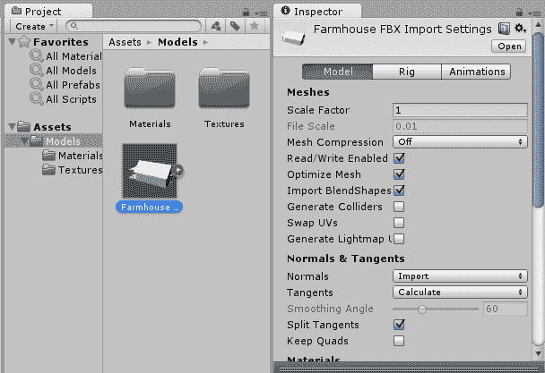

图 3.12 农舍模型设置

如前一个截图所示，模型文件包含三种在设置中以标签形式呈现的数据：模型、绑定和动画。模型标签包括与网格、材质和模型本身相关的所有数据。绑定标签和动画标签允许开发者设置模型的动画行为，无论是使用模型文件本身嵌入的动画，还是从 Unity3D 中的其他动画剪辑中设置。我们将在本章后面讨论这些细节。尽管模型标签本身有很多设置，但我们只讨论一些在 Unity3D 中导入 FBX 模型时通常使用的设置：

1.  **缩放**：此缩放因子用于消除 Unity3D 中的单位系统与创建模型时所使用的建模工具中的单位系统之间的间隙。Unity3D 通常将缩放因子的一个单位视为一米。因此，开发人员应相应地设置缩放因子。通常，这设置为 1。

1.  **生成碰撞体**：此复选框允许开发者为网格和模型自动生成碰撞检测的碰撞体。请注意，启用此复选框时，Unity3D 将创建网格碰撞体，这有时会导致非常重的处理，具体取决于网格本身。因此，如果您想自定义碰撞体，您可以在 Unity 中自定义，或者创建自己的网格碰撞体。

这两个设置将使模型处于良好状态。我们应该提醒自己，我们的模型仍然是单色的，我们还没有将其导入纹理和材质。因此，在下一节中，我们将讨论在模型对象上应用纹理和材质。

不同 3D 模型的默认缩放因子如下：`.fbx`, `.max,` `.jas`, `.c4d` = 0.01, `.mb`, `.ma`, `.lxo`, `.dxf`, `.blend`, `.dae` = 1, `.3ds` = 0.1。

# 导入 FBX 模型

FBX 是 Filmbox 的缩写。Unity 支持可以由许多流行的 3D 应用程序生成的 FBX 文件。请注意导出范围，例如网格、相机、灯光、动画装置等：

1.  应用程序通常允许您导出选定的对象或整个场景

1.  确保您只导出场景中需要使用的对象，可以通过导出选择的数据或从场景中移除不需要的数据来实现。

1.  良好的工作习惯通常意味着保留一个包含所有灯光、引导、控制装置等的工作文件，但只通过选择导出数据、使用导出预设或甚至自定义场景导出器来导出所需的数据。

参考以下图以确定 OBJ 和 FBX 之间的差异：

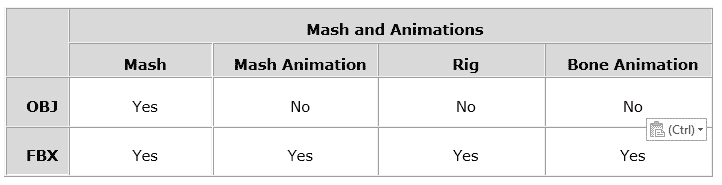

在 Unity 资产商店中，许多 3D 模型免费或付费提供，可以轻松地用于任何游戏。您还可以在互联网上找到许多网站，用户在那里出售或提供免版税 3D 模型（[`tf3dm.com`](http://tf3dm.com/)）

因此，我们在 3D Max 中建模了一个房子，并将其导出为 FBX 格式；记住，在那个模型中我们只有网格，然后在项目面板中右键单击，然后点击“导入新资产...”，然后浏览您的 FBX 模型路径并点击导入按钮。Unity 还提供了一个拖放功能，我们可以将 fbx 模型拖放到项目面板中。以下图显示了如何通过点击“导入新资产...”按钮将模型导入场景：

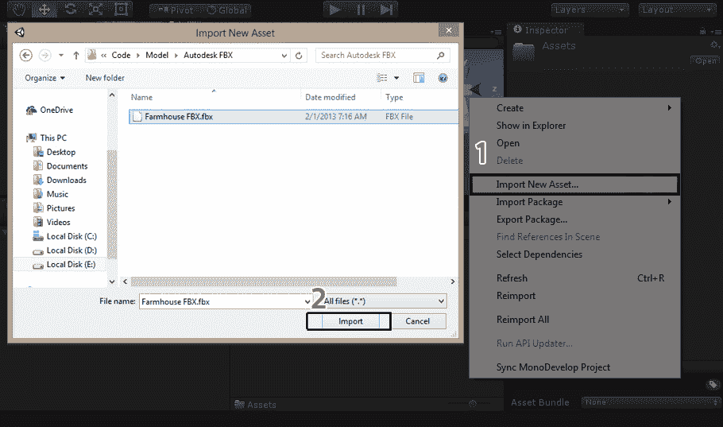

您可以在项目面板中看到 FBX 模型，这是以管理方式推进项目的更好方式，因此创建一个名为“模型”的空文件夹，然后在根目录中将其拖放到模型文件夹中。以下图显示了将 FBX 模型拖放到模型文件夹中的情况：

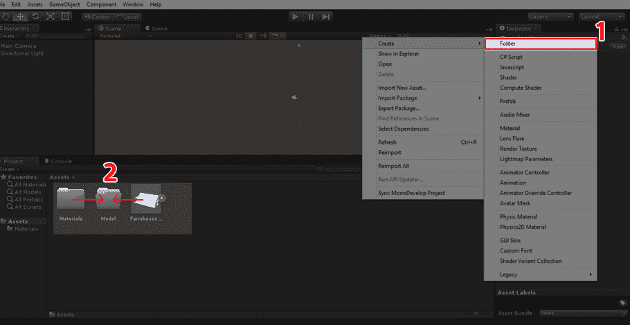

现在转到模型文件夹，将 Farmhouse FBX.fbx 文件拖动到层次面板中；如果显示的模型很小，这意味着模型的缩放比例很小，要增加模型缩放大小，请从项目面板中选择 Farmhouse FBX.fbx，你将在检查器面板中看到 3 个标签页，分别命名为模型、绑定和动画，我们现在专注于模型，模型默认被选中。在第一个文本框中，缩放因子，将值 1 改为你需要的任何值，比如 10，然后点击模型面板末尾的“应用”按钮。

考虑以下图示来说明模型缩放大小的增加：

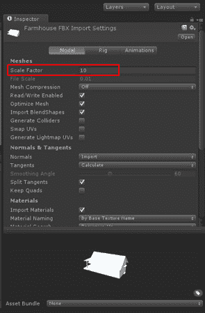

# 应用纹理和材质

当涉及到 3D 建模时，纹理和材质变得复杂，因为它们赋予了模型生命。3D 建模工具为建模者和设计师提供了相当多的灵活性，以便他们可以一起工作并创建令人惊叹的纹理，并将它们从简单的图像转换为 3D 工作模型。从图形和设计角度来看，有三种组件可以实体化模型：纹理、着色器和材质。Unity3D 提供了许多选项来自定义这三个部分，并允许开发者创建他们想要的模型外观。这三个组件以这种方式连接，使得开发者可以轻松地单独更改和修改每个组件，并实时看到它们对模型的影响。以下图示展示了这三个组件的连接：

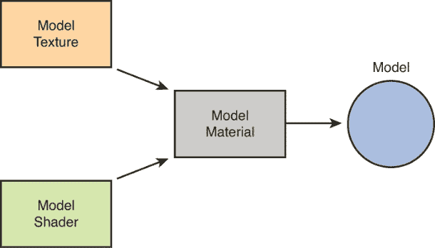

图 3.13 纹理、阴影和材质之间的连接

你可以在前面的图中看到纹理不是直接应用于模型。相反，它们应用于材质，然后材质再应用于模型。材质还添加了一些材质化属性，以便与场景中的灯光相互作用，使模型在计算机屏幕的二维世界中看起来像 3D。以下小节中我们将对每个组件进行详细说明。

# 纹理

通常，网格对象给出了模型形状的大致近似以及它将看起来如何，但定义形状本身并将其以观众视角的真实形式呈现的是纹理。纹理是包裹在模型网格表面的平面位图图像。最简单的例子就是想象它们是打印在任意 3D 模型上的图像，比如任何圆柱体、立方体或任何复杂模型，比如我们的农舍。

以下图示展示了这一场景：

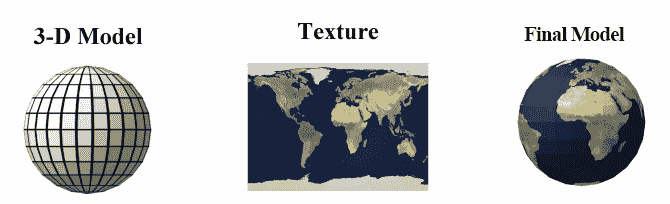

图 3.14 3D 模型上的纹理

# 纹理导入器

所有纹理都以图像形式存在于项目文件夹中。Unity 允许你更改纹理类型--在导入纹理后，你只需从项目面板中选择纹理，并在检查器中的最顶部进行修改。这允许你从源图像文件中选择你想要创建的纹理类型。以下图示显示了所有纹理类型：

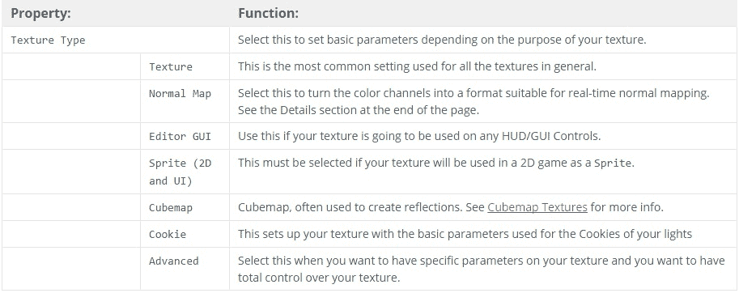

# 在着色器中应用纹理

你为对象使用的着色器对所需的纹理有特定的要求，但基本原理是你可以将任何图像文件放入你的项目中。如果它满足以下文本中指定的尺寸要求，它将被导入并优化。

将纹理放入着色器中有一系列步骤：

1.  在选择模型后，着色器将在检查器面板中可见。

1.  材质中包含纹理按钮，点击它以应用纹理。

1.  选择纹理，这样我们的 3D 模型就会被我们选择的纹理包裹。

这在以下图中表示：

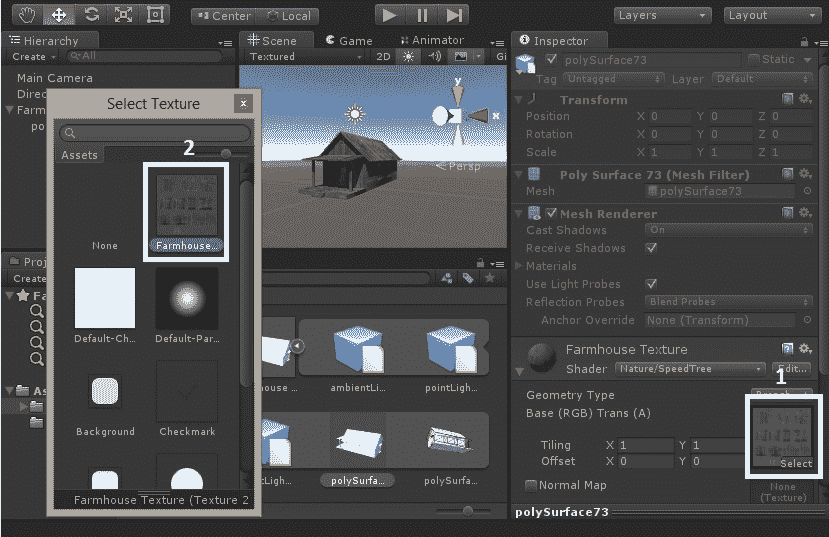

Unity 可以读取以下文件格式作为纹理：PSD、TIFF、JPG、TGA、PNG、GIF、BMP、IFF 和 PICT。应注意的是，Unity 可以导入多层的 PSD 和 TIFF 文件。

# 着色器

在计算机图形学中，着色器对于新手来说有点难以理解。纹理告诉观众 3D 模型对象表面和网格上绘制了什么，但着色器告诉如何绘制该纹理。正如我们之前在*图 3.13*中看到的，材质是纹理和着色器的混合物。材质包含属性和纹理，着色器告诉我们材质可以具有哪些属性和着色器。让我们通过一个例子来更好地理解这个概念。想象你有一块木头。这块木头的形状是 3D 模型的网格对象。颜色、木纹和其他可见元素是 3D 模型的纹理。现在，如果你把这块木头放入水中，它看起来会比原来的木头略有所不同。请注意，它仍然是相同的网格和相同的纹理，但放入水中时看起来会不同。这种可见性的差异是由 Unity3D 中的着色器定义的。在这个例子中，水就是着色器。我们将在本书的后面部分讨论如何在 Unity3D 中制作和应用这些着色器。

# 材质

简而言之，材质定义了在计算机图形中表面应该如何渲染。它不仅仅是一个纹理和着色器的容器。相反，它带有许多不同的属性，这些属性根据着色器本身而变化，并获取纹理的引用以进一步定义模型的最终可见性。以下图显示了两种不同着色器的材质差异：

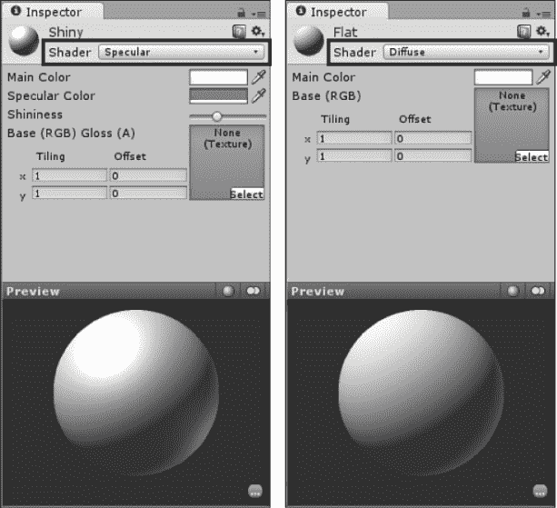

图 3.15 Unity 中不同着色器的材质

注意左侧材质中的微光。这是因为高光着色器，而右侧材质使用的是漫反射着色器。两者都有共同的属性，如颜色、基础纹理等。Unity 自带了许多内置的着色器，你也可以编写自己的自定义着色器来进一步润色和定义模型的视觉效果。

# 在农场模型上应用纹理

到目前为止，我们已经概述了纹理、着色器和材质，以及它们如何相互关联。但不要忘记，在我们的场景中有一个导入的农舍模型，它以白色和灰色阴影的形式出现。现在，我们必须在它上面应用纹理并为模型创建材质。Unity 提供了一个非常简单且方便的方法来在模型上应用纹理。

在`Assets`文件夹中创建一个名为`Textures`的新文件夹，并使用常规文件浏览器或通过将图像拖动到文件夹中在 Unity3D 中加载以下图示中的图像：

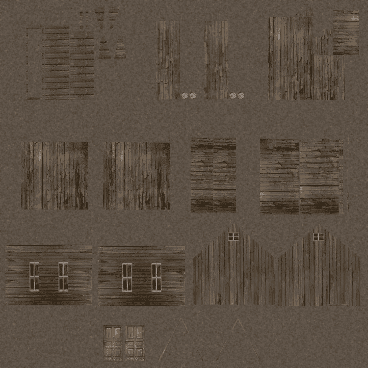

图 3.16 农舍模型纹理

一旦它被导入到`Assets`文件夹中，你必须将其应用到场景视图中放置的模型上。从`Assets`文件夹中拖动纹理并将其放置在场景视图中的模型上，Unity 将自动创建材质并为你完成渲染工作。然后你可以根据你的需求进一步自定义它。以下图示展示了在材质上应用纹理的过程：

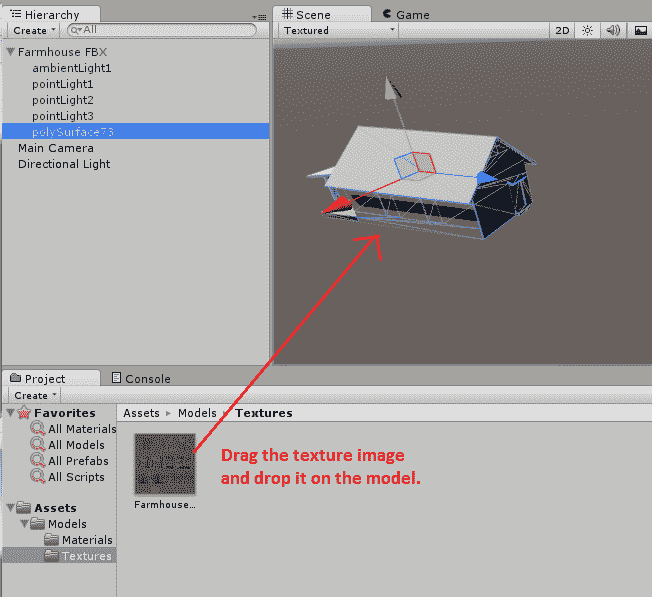

图 3.17 农舍模型纹理

在应用纹理后，你会观察到农舍将呈现为彩色形式，现在看起来更加逼真。以下图示展示了农舍模型在纹理前后以及其在检查器面板中的属性之间的简单比较：

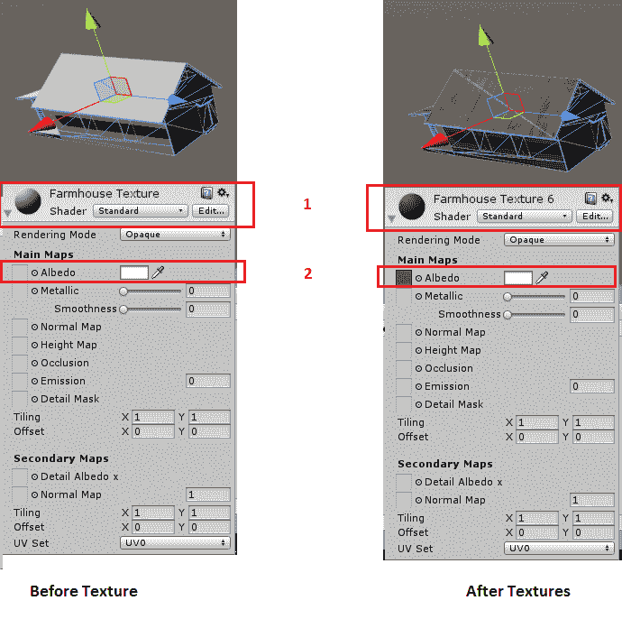

图 3.18 纹理前后对比

注意，在应用纹理之前，Unity3D 已经为模型应用了一个默认的农舍纹理，并使用了标准着色器，这使得它看起来是白色的。而纹理应用之后，Unity 会在纹理上放置一个编号的名称（在图中称为**Farmhouse Texture 6**）。参考前图中标签编号 1 处的着色器。你还可以注意到，Albedo 属性（如图中标签编号 2 所示）在之前是空的，但现在它被我们的纹理图像填充了。你还可以通过点击 Albedo 旁边的方形图标来应用纹理。这将打开一个`Assets`资源管理器面板的弹出窗口，通过该窗口你可以从资源中选择所需的纹理，并将其应用到模型上。

# 通用和人类机器人

虽然我们已经讨论了模型以及如何在 Unity3D 中导入这些模型，但我们还没有谈到这些模型应该是什么，或者游戏引擎更倾向于哪种类型的模型。一个模型可以包括从简单的带纹理的立方体到家具和住宅，再到生命角色和外星人，以及太空轨道和行星。在大多数情况下，游戏更注重交互式剧情，这涉及到许多角色（主要是人类），他们有着各种各样的情感和表情。Unity3D 作为一个非常容易学习和使用的游戏开发平台，承担了提供角色和人类支持的任务，并提供了一套高度灵活且功能齐全的工具，可以非常容易地处理、动画化和管理角色模型。

# 人形角色是什么？

正如“人形”这个词本身所清楚的那样，人形角色是基于人类的角色。不一定是人类，但应该基于人类的物理形状。猴子模型是人形模型的一个很好的例子。它可以是两足外星人等等。由于大多数游戏都包含人形模型，为了简化问题，Unity3D 为人形模型提供了良好的功能集。

从互联网上可以获取大量免费和付费的人形模型资源。或者，您可以使用 Poser、MakeHuman 或 Mixamo 等工具创建自己的人形模型。其中一些工具还提供了绑定和为模型添加皮肤的功能。

简单来说，绑定是指为任何 3D 模型添加骨骼并连接骨骼的过程。

您还可以从 Asset Store 获取许多免费和付费的各种各样的人形模型，如男性、女性、老角色、战士、格斗家、力量角色等。人形角色通常具有骨骼结构、皮肤肌肉和用于服装或衣物的纹理。骨骼结构或骨骼，在现实生活中被称为骨骼，是人形角色的关键部分。它允许我们使用相同的骨骼或称为**绑定**来重新定位和动画化其他人形角色。以下图示显示了一个简单的人形角色及其皮肤、绑定和肌肉：

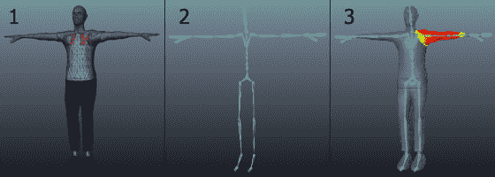

图 3.18 一个简单的人形角色，带有皮肤网格（左）、绑定（中）和肌肉（右）

应该注意的是，任何人形角色都将具有如图所示的结构。我们将在后面的章节中更详细地讨论绑定。现在，我们将讨论 Unity3D 为人类角色模型提供的工具类型以及它们的使用方法。我们将通过从 Unity Asset Store 导入一个免费的角色模型来学习这一点。

Unity Asset Store ([`assetstore.unity3d.com`](http://assetstore.unity3d.com)) 是 Unity3D 的一个在线市场，提供用于 Unity 游戏的资产和现成工具包、插件、扩展和代码，有免费和付费版本。

# 导入人形模型

让我们从学习如何将人形模型导入 Unity 开始。我们将从创建一个名为 Humanoid Character 的空项目开始。随着项目的成功构建和编译，我们就像往常一样打开一个空场景，得到了一个空项目。

现在，当涉及到建模格式时，人形模型并没有什么不同。人形模型是我们之前章节中讨论的简单模型文件类型，例如 FBX、MB、3DS 等。我们可以通过从文件资源管理器拖放文件到 Unity 中，或者通过使用菜单选项导入新资产...手动导入。在这个例子中，我们将使用 Unity Asset Store 中免费提供的模型。资产名称为 Raw Mocap Data for Mecanim，它包括由 Unity3D 开发的角色以及大量动画，如向前移动、向后移动、跳跃、匍匐前进等。可以在以下位置找到：[`www.assetstore.unity3d.com/en/#!/content/5330`](https://www.assetstore.unity3d.com/en/#!/content/5330)。将此 URL 粘贴到你的浏览器中，然后点击 Open in Unity 按钮，它将打开 Unity3D 并显示带有资产的 Asset Store 面板，如下截图所示：

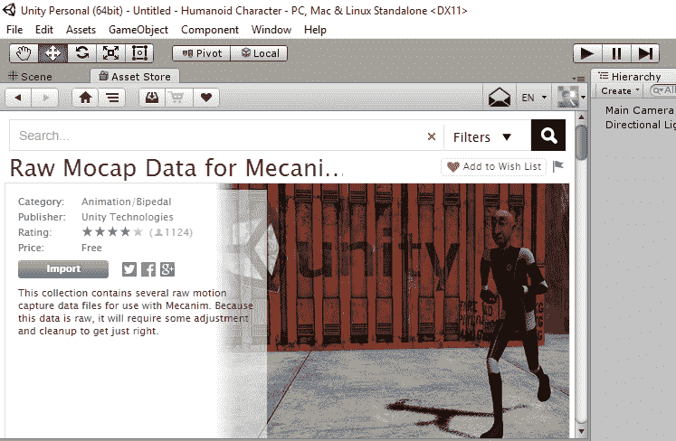

图 3.19 Unity3D 中的 Unity Asset Store 面板

现在，如果你已经将此资产下载到你的本地计算机上，那么它将显示导入按钮；否则，它将显示下载按钮。下载并将此资产导入到你的 Unity 项目中，它将显示一个包含所有要导入的文件列表的对话框面板。这是为了让开发者知道哪些文件是新的，哪些文件将被此资产包替换。如下截图所示：

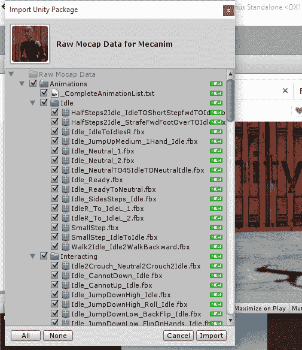

图 3.20 导入前的原始 Mocap 数据文件

我们有一个空项目，因此它显示了所有文件前面的 NEW 标签。现在，点击面板左下角的 All 按钮，然后点击 Import 按钮。这将花费一些时间来导入、解压缩并将所有资产导入到项目中。一旦完成，你会在`Assets`文件夹中注意到一个新的目录叫做 Raw Mocap Data。这就是所有文件和资产数据被放置的地方。如下图所示：

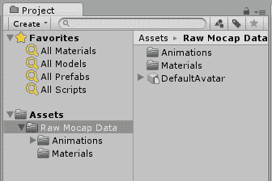

图 3.21 导入后原始 Mocap 数据文件放入 Assets 中

由于本节全部关于模型及其设置，我们现在暂时忽略动画目录。在原始 Mocap 数据目录中，你会看到一个名为 DefaultAvatar 的模型文件。从技术上讲，这是一个 FBX 文件，如果你在文件资源管理器中看到它，并且 FBX 文件是 Unity3D 中最受欢迎的模型文件。当你选择它时，你会在检查器面板中看到选中的设置标签页，以及一些预定义的导入选项，如下图所示：

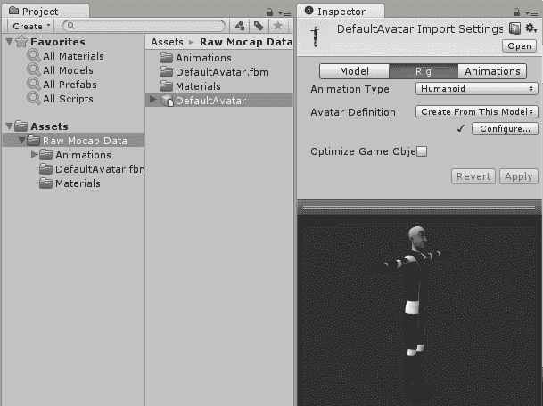

图 3.22 检查器中默认头像模型的导入设置

此模型包含许多材料，它们放置在“材料”目录中，并分配到角色上，显示其皮肤和服装，正如我们可以在前一个图中的小预览部分中看到的那样。还有一个包含动画列表文本文件的“动画”目录。我们将在后面的章节中讨论这些动画。

因此，让我们选择“骨架”选项卡，如果它还没有从检查器面板中选择，然后讨论那里的不同选项。你会注意到“动画类型”已经选为“人类”选项。当任何模型文件被导入 Unity 时，它会自动尝试通过将其骨架结构与预定义的人类结构进行比较来检测模型类型，并为它创建一个自动的化身。我们将在后面的章节中讨论这个预定义的人类骨骼结构。如果匹配成功，Unity 会将动画类型关联到人类；否则，它将其设置为通用。还有两个其他选项，即“无”和“旧版”。“无”选项允许 Unity 忽略整个骨架，让人类没有骨骼和动画。而“旧版”选项是处理人类角色的较老方法，现在已弃用，不推荐使用。你还可以手动更改模型的动画类型选项。通用类型选项用于告诉 Unity 该角色不是人类。例如，它可以是某种六足外星生物或任何马模型，或者任何奇怪的蜘蛛，或者任何静态的树，等等。

在“动画类型”下方，你会看到“化身定义”选项。基本上，当任何人类模型被导入 Unity 时，它会开始寻找该模型的化身。在 Unity 中，化身是一个简单的骨骼，它提供了一种控制模型网格、皮肤和材料以进行动画、移动等方法。如果模型已经正确设置骨架并且是人类，Unity 将自动从这个模型文件创建化身。我们还可以使用“从其他化身复制”选项从任何其他模型文件复制化身。复制选项将要求源化身，并将新的骨骼放入当前模型中。这就像将一个角色的骨架放入另一个角色的身体网格中。这是 Unity3D 的一个非常强大的功能，使得角色处理变得容易得多。

下一个选项是带有小勾选图标的“配置”按钮。这个图标告诉我们我们的模型是否可以使用。简单来说，Unity 试图从模型中自动创建一个虚拟形象，这个图标显示 Unity 是否能够完成这项任务。从动画类型中选择“无”选项，然后再次选择“人类”选项。现在你会在“配置”按钮前看到三个点符号。这表示模型尚未配置，虚拟形象也尚未创建。这意味着 Unity 尚未确认模型文件是否为人类。您可以点击“应用”，Unity 将尝试自动检测其人类特征并创建自动虚拟形象。如果模型是人类，则图标将更改为勾选图标；否则，它将变为叉号图标，表示模型配置不正确，不是人类。

下一个图显示了人类模型配置的所有不同状态：

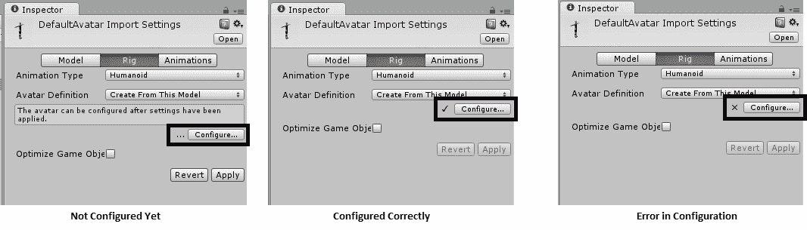

图 3.23 人类模型配置的不同状态

我们已经了解到 Unity 会自动尝试检测模型是否为人类，并尝试通过创建具有预定义人类绑定的自动虚拟形象来正确配置它。但是，我们仍然不知道 Unity 是如何做到这一点的，以及在进行 Unity 配置过程中可以做出哪些改进和定制。在下一节中，我们将讨论任何角色如何在 Unity 中配置为人类，以及自动虚拟形象创建是如何工作的。

# 配置人类模型虚拟形象

由于虚拟形象定义了 Unity 中人类模型的整体绑定和骨骼结构，因此确保其正确配置对于模型来说非常重要。我们不应该依赖于 Unity 自动创建虚拟形象的结果。无论是否带有勾选图标配置正确，还是带有叉号图标未配置，您都需要进入“配置虚拟形象”模式，亲自确保虚拟形象设置正确且适用于游戏。这是整个角色动画系统**MecAnim 系统**的一个重要要求，我们将在下一节中讨论。

现在，如图所示，点击“配置...”按钮。如果当前场景尚未保存，它将要求您保存当前场景，并打开一个新场景，如图下截图所示：

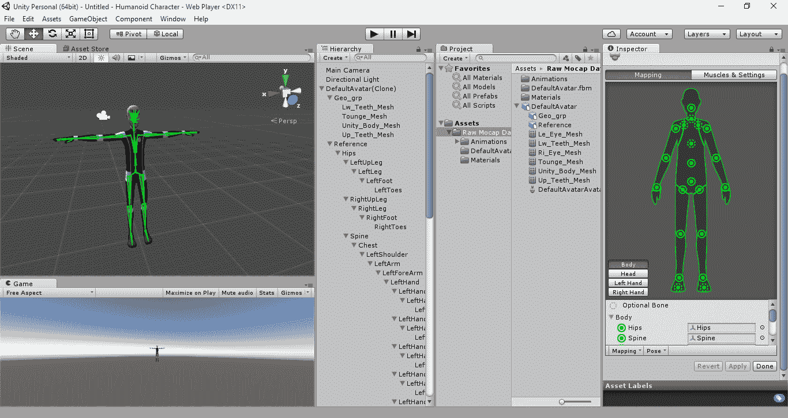

图 3.24 虚拟形象配置场景

您可以观察到，打开了一个新场景，我们的角色模型位于场景视图的中心。在检查器面板中，显示了一个 2D 人类角色，其体内有许多绿色圆圈，如图下所示：

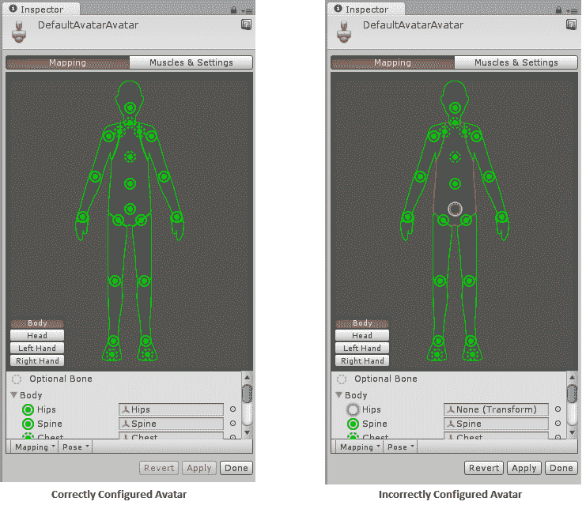

图 3.25 人类角色虚拟形象视图

此区域由两个标签页组成，映射和肌肉与设置，其中第一个已选中。在映射标签页中，有一个带有绿色实线和虚线圆圈的人体，圆圈映射了骨骼的游戏对象与人体关节，以便它能够那样表现。实线圆圈需要与任何骨骼游戏对象关联。即使单个必需的圆圈没有正确映射，角色配置也不会设置，并显示一个红色圆圈，如图 3.25 右侧所示。

为了提高找到匹配角色的机会，请以反映它们所代表的身体部位的方式命名你的骨骼，例如 LeftArm（左臂）、RightForearm（右前臂）等。

在检查器视图中，你还可以观察到垂直对齐的其他按钮：Body（身体）、Head（头部）、Left Hand（左手）和 Right Hand（右手）。正如在检查器中显示的那样，其他按钮显示人体其他部分以映射更多骨骼，为角色提供动画中使用的微小细节。这些在以下图中显示：

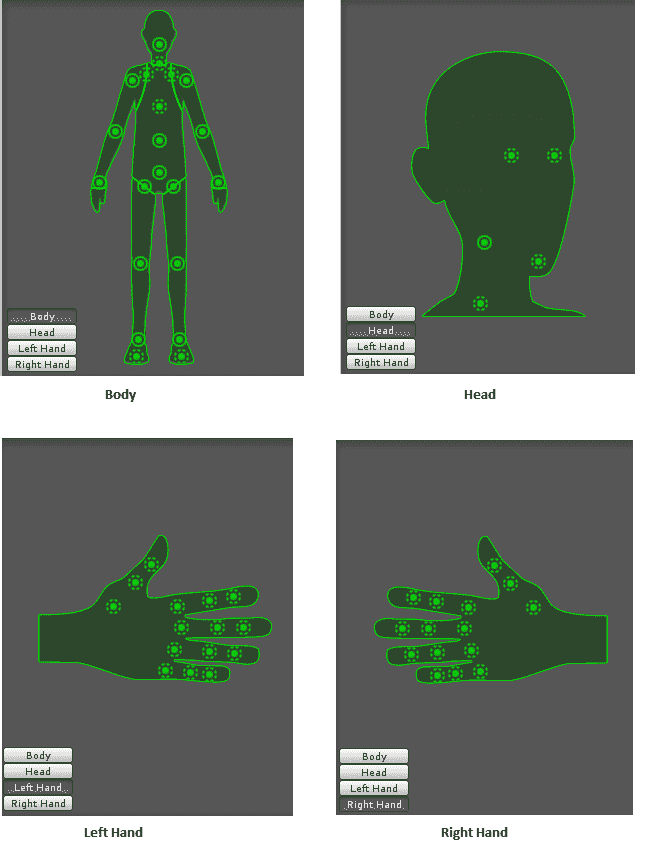

图 3.26 所有部分的角色映射

你可以看到，除了身体部分外，所有其他部分都只有可选骨骼。一般来说，Unity 覆盖了人体的所有骨骼。可选骨骼在 Unity 中自动映射和动画，但必需骨骼需要从模型中映射。如果在 Autodesk Maya、3D Studio Max 或任何其他 3D 建模工具中绑定角色时遗漏了任何骨骼，Unity 将在那里显示一个红色圆圈，这是开发者的责任，通过从层次结构面板中选择游戏对象并将其放置在检查器面板中骨骼列表下方来提供缺失的骨骼。

现在，如果你在场景视图中查看，可能会注意到我们的角色处于 T 形姿态。如果你的模型不是 T 形姿态，Unity 将在场景视图中打印消息来强制模型采用 T 形姿态。T 形姿态是 Unity 将正确骨骼与正确游戏对象映射的模型原点。你可以手动旋转骨骼的游戏对象以形成 T 形姿态，或者你可以通过在检查器面板底部选择“强制 T 形姿态”从姿态下拉菜单中自动完成，如图所示：

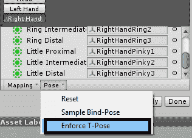

图 3.27 检查器面板中的强制 T 形姿态选项

一旦选择了该选项，如果所有骨骼都正确绑定并分配，模型对象将自动定位到 T 形姿态。此下拉菜单中的其他选项包括重置，它将重置所有骨骼并将角色配置设置为初始状态，以及采样绑定姿态，它将强制模型设置为导入模型时的相同姿态。

你可以通过在检查器面板中姿态下拉菜单旁边的映射下拉菜单中选择自动映射选项来重置整个映射并使用 Unity 的自动角色配置。

在您所做的任何更改之后，您可以点击“应用”或“还原”来应用或取消更改。一旦您完成了配置和角色，您可以点击“完成”按钮来关闭角色场景并导航回您原来的工作场景。

另一个选项卡“肌肉与设置”超出了本书的范围，但您可以继续尝试一下。它允许您验证所有骨骼与肌肉的关系，并且您还可以通过在其中定义范围来限制骨骼的运动，例如头部不能完全旋转。

现在，我们的模型已经导入，并且已经正确配置到人形角色上。是时候让它栩栩如生了，并添加一些行走、跑步、跳跃等动作动画。在本节中，我们将讨论 Unity 如何让我们管理动画并将它们应用到人形模型对象上。

# 使用 Unity 进行人形动画

动画是任何游戏的核心组件。没有它们，游戏只是一系列图片，用户将无法了解游戏中正在发生什么。我们已经在第二章“完成活泼企鹅 2D 游戏”中学习了动画，为了我们的 2D 游戏“活泼企鹅”，我们使用状态机和控制器来控制企鹅和激光的动画。但是，当涉及到 3D 时，管理和处理的事情会变得更加复杂。这种复杂性的原因取决于我们想在 Unity 中创建和管理的动画类型，但通常创建如行走循环或跑步循环这样的角色动画需要大量的努力，并且不能在 Unity 中完成。这些动画需要更多的细节，并且是在高级工具（如 Autodesk Maya、3D Studio Max 等）中开发的。在本节中，我们不会讨论这些动画是如何创建的，因为这超出了本书的范围，但我们将讨论如何将这些动画导入 Unity，并通过编程和状态机控制器进一步管理，以实现我们的游戏需求，为格斗游戏中的玩家角色进行动画处理。

Unity 的动画系统通过支持动画混合、混合、加法动画、循环动画、时间同步（如行走循环）、分层动画、基于速度、时间等因素的动画控制回放，以及基于物理的布娃娃支持，让您能够创建令人惊叹的动画角色。与之前的动画工具（如 Adobe Flash）相比，Unity 提供了扩展的图形用户界面，使事情变得更加简单。

# Legacy Animation System

在 Unity 4.x 版本发布之前，Unity 提供了一种更简单的动画系统，现在称为**Legacy Animation System**。为了保持向后兼容性，这个系统仍然可用。您可以在旧项目中使用遗留系统，而无需将其更新到新系统。但是，不建议在任何新项目中使用遗留系统。

我们不会深入探讨旧版动画系统的工作原理，因为它在 Unity 游戏中不是一个好的选择，但我们将讨论在 Unity 中使用旧版动画系统的基本概述。旧版动画系统基于以下步骤在 Unity 中创建和管理动画：

1.  您准备要动画化的游戏对象。例如，让我们以一个战斗角色为例。现在，为了在 Unity 中对其进行动画处理，您必须创建一个模型，对其进行绑定，添加纹理，然后将其导入 Unity。这一步骤由艺术家、3D 模型师和动画师完成。

1.  在导入模型后，您必须手动将其动画类型字段设置为 Legacy，因为 Unity 不会自动执行此操作，您需要在模型的检查器设置中的 Rig 选项卡中完成此操作。这如图所示：

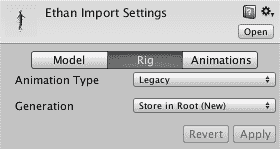

图 3.28 设置动画类型字段为 Legacy

1.  现在，您可以在动画选项卡中设置所有动画剪辑，如向前走、向后走、跑步、跳跃等，并设置这些剪辑的时间和速度。您可以通过裁剪和剪切动画剪辑中的帧、修改速度、创建循环或 Ping-Pong 序列等功能在这里自定义和编辑剪辑。

动画剪辑也可以使用 Autodesk Maya 或 3D Studio Max 等工具嵌入到模型文件中。此外，动画也可以是模型文件本身的独立文件。Unity3D 在这里显示模型文件设置中的动画选项卡中的嵌入动画。

1.  一旦所有动画剪辑都设置好并准备就绪，就到了创建控制器的时候了。旧版动画系统允许您使用 C#或 JavaScript 创建控制器，这将告诉 Unity 在何时播放哪个剪辑以及播放多长时间等。这个控制器基本上由游戏输入管理，例如，按空格键时，角色应该跳跃。

尽管这四个步骤没有详细解释如何使用旧版动画系统，但它足以让您了解在 Unity 中如何使用旧版系统。旧版系统在很大程度上依赖于脚本部分来管理动画，其控制器完全由开发者自己编程和编码。这使得与下一节将要讨论的新 Mecanim 动画系统相比，旧版系统更加复杂。

# Mecanim 动画系统

虽然 Unity 已经有一个现成的动画系统，并且开发者正在使用它，但 Unity3D 发布了一个全新的系统，从头开始创建和管理更复杂的动画，而且更加容易。该系统被称为 Mecanim 动画系统。以下是 Mecanim 动画系统的几个特点：

+   动画工作流程和设置的简便性

+   支持在 Unity 内部创建或外部导入的动画剪辑

+   可以将一个角色模型的动画重定向到另一个角色模型

+   用于管理和预览动画剪辑的可视化编程工具

+   层叠和遮罩功能

有可能您可能没有完全理解这些功能的一些内容。然而，无需担心，因为在本节中我们将详细讨论这些功能和系统。

我们将首先从上一节中的人形角色项目开始讨论 Mecanim。

在上一节中，我们导入了一个免费的角色以及许多动画剪辑。我们讨论了模型文件及其材质文件夹，然后我们还为它配置了一个人形头像。现在，我们将从那个人形头像设置继续，并使用 Mecanim 动画系统来为角色动画化。为此，首先我们必须查看我们从原始 Mocap 动画数据资产中获得了哪些类型的动画。在项目资源管理器面板中展开动画文件夹，然后再次展开“行走”文件夹以查看一些行走动画。

现在，从该文件夹中选择任何随机的动画剪辑，然后在检查器面板中您将看到一个带有小播放按钮的小预览窗口，该按钮可以暂停/播放动画剪辑。整个过程如下面的图所示：

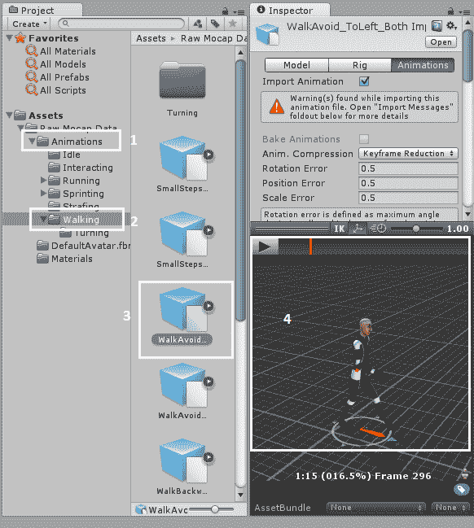

图 3.29 预览“行走”文件夹中的任何动画剪辑

这个预览窗口显示了动画剪辑，以便您更好地了解哪个动画更适合您的游戏需求。您还可以从其他文件夹播放更多动画。

这个动画预览系统仅在 Unity 4.0 版本引入后，Mecanim 中才可用。

Unity 的 Mecanim 动画系统基于**动画剪辑**的概念，它包含有关不同对象如何随时间移动、旋转或变换的信息。每个剪辑可以是对同一对象的独立、单独的录制。这些动画剪辑大多由 3D 动画师使用第三方工具（如 Autodesk Maya、3D Studio Max 或其他来源）创建。然后，可以使用这些工具将这些剪辑导出为单独的剪辑，或者也可以将它们嵌入到模型文件本身中。为了更好地理解这一点，请在项目面板中选择“原始 Mocap 数据”目录中的 DefaultAvatar.fbx，然后在检查器面板中选择动画选项卡。您将观察到导入动画的复选框已经被选中，下面有一个信息框告诉您模型文件不包含任何动画数据。这意味着模型文件本身没有嵌入任何动画剪辑。整个过程如下面的截图所示：

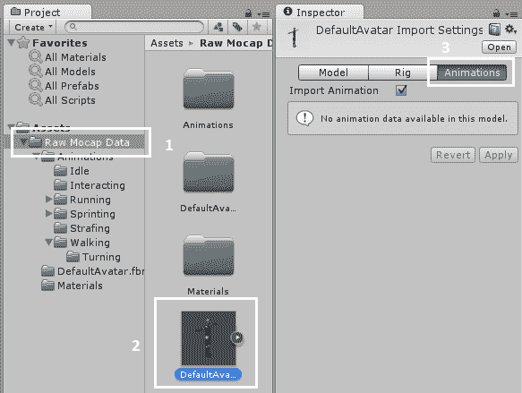

图 3.30 在模型中查看嵌入的动画数据

无论您是在模型中嵌入动画剪辑，还是单独导入动画剪辑（如本例所示），这些动画剪辑随后将被组织成一个类似于结构流程图的系统，称为**动画控制器**。这个动画控制器扮演着状态机的角色，负责跟踪哪个动画剪辑应该播放，何时停止播放动画剪辑等等。这是 Mecanim 系统最重要的功能之一，它将 Mecanim 系统与传统的动画系统区分开来，并为开发者提供了许多便利和控制。在传统的系统中，开发者通常使用 C# 或 JavaScript 编程语言编写整个动画控制器，但在 Mecanim 中，Unity3D 提供了一个可视化界面，可以创建整个控制器，无需一行代码，并具有许多内置功能。

任何简单的动画控制器都必须至少包含一个或两个动画剪辑。这些动画剪辑可以像任何门的开关动画或任何类人角色的前后走动动画那样简单。更高级的动画控制器可以包含数十个类人动画，用于角色的所有主要动作，如行走、跑步、跳跃、战斗等等。我们的游戏项目包含具有行走、跑步、跳跃、用手、腿和超级技能的角色。因此，我们单个角色的动画控制器非常详细且高级。在下一节中，我们将讨论如何创建动画控制器，并为我们的格斗游戏玩家角色创建一个简单的控制器。

# 为格斗游戏创建分层角色

在上一节中，我们讨论了 Unity 的动画系统；传统和 Mecanim。在本节中，我们不仅将讨论，还将实际创建格斗游戏玩家角色的动画控制器。我们将使用 Unity 提供的免费角色，该角色包含在原始 mocap 数据资产项目中。

首先，在场景视图中，我们需要一个类人角色。从项目面板中的原始 mocap 数据目录拖动 DefaultAvatar.fbx 预制体到层次结构面板，它将显示一个穿着黑色西装的 T-Posed 角色如图以下截图所示：

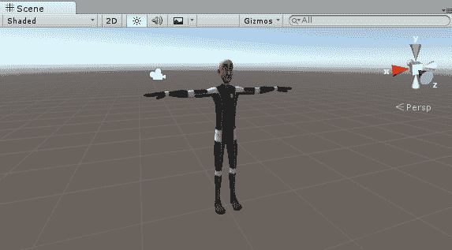

图 3.31 场景视图中的 T-Posed 角色

现在，在层次结构面板中选择 DefaultAvatar，并查看其检查器设置。在变换组件下方将添加一个新的组件，称为动画组件，如图以下截图所示：

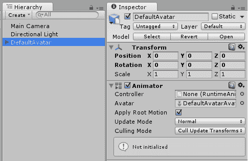

图 3.32 角色模型的动画组件

你可以观察到在组件中有一个信息提示，指出控制器尚未初始化。当任何类人角色首次放置到场景中时，Unity 会创建一个默认的运行时动画控制器并将其分配给该角色。我们也可以随时使用我们的自定义控制器来更改或修改其控制器。Animator 组件中包含多个属性，如前图所示。在继续前进之前，让我们讨论一下这些属性的细节：

1.  **控制器**属性用于设置 Animator 组件的动画控制器。这是最重要的属性，通过这个控制器，整个角色的动画在 Unity 中得以管理和处理。

1.  **Avatar**属性告诉 Unity3D 用于角色的绑定和 Avatar 配置。这与我们在之前章节中为类人角色设置的相同的 Avatar 配置相同。我们也可以为其他角色的 Animator 使用其他角色的 Avatar。这就是 Mecanim 动画之所以如此强大的原因，它允许开发者无需额外努力即可将他们的 Avatar 定义重新定位到其他角色上。

现在，随着 Avatar 属性已经设置为我们配置的 Avatar；让我们创建我们的第一个动画控制器。在 Assets 文件夹上右键单击，然后选择创建 | 动画控制器，并将其命名为 PlayerAnimController，如下面的截图所示：

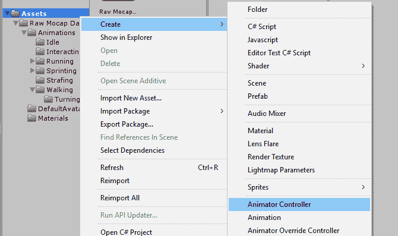

图 3.33 为玩家创建动画控制器

你会注意到在 Assets 目录的项目面板中会添加一个不同的文件。双击它，你将看到一个 Animator 窗口，显示一个类似于状态机的用户界面，如下面的截图所示：

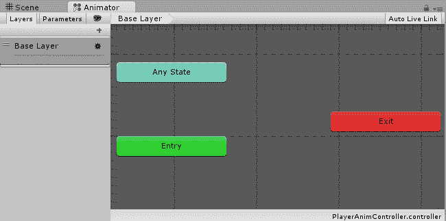

图 3.34 Unity3D 中的 Animator 面板

如您在此面板中所见，已添加了三个状态，分别称为任何状态、进入和退出。此面板的主要目的是组织所有动画剪辑，在这里称为**状态**，并使用类似于流程图的顺序、并行或更复杂的关系将它们连接起来。为了创建一个简单的状态机，我们至少需要在 Animator 面板中有一个动画状态。我们已经在项目资产中导入了很多动画；我们只需从那些动画中选择一些用于我们的简单动画控制器。

现在，在 Assets 中创建一个新的名为 Player Animations 的目录。我从我们的 Raw Mocap Data 文件夹中选择了四个动画剪辑，并将它们放置在我们的新文件夹中：

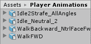

图 3.35 Player Animations 目录中的动画状态

一旦您的动画片段都设置在单个目录中，让我们更深入地探索这些动画。在项目面板中单击 Idle_Neutral_2 动画片段，然后在检查器中选择“Rig”选项卡。您会注意到动画类型设置为“Humanoid”，而头像定义设置为从另一个头像复制。您可能想知道另一个头像在哪里。您可以在“源”属性中选择这个其他头像，然后点击“应用”以保存更改。源属性设置为我们的配置头像定义，称为 DefaultAvatarAvatar，用于我们的角色模型。通过此属性，您可以选择任何其他头像的定义，并非常容易地将相同的动画片段重定向到多个角色上。这些属性如图所示：

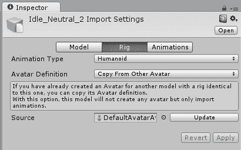

图 3.36 动画片段的“Rig”选项卡

我们项目中所有动画片段的“Rig”选项卡设置几乎完全相同。现在，选择“动画”选项卡以根据我们自己的项目需求自定义动画。部分“动画”选项卡如图所示：

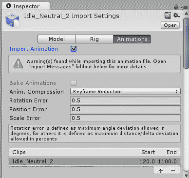

图 3.37 部分动画选项卡

如果您不想导入任何动画，只需关闭“导入动画”复选框，Unity 将忽略该片段的动画。其余的设置在此刻并不重要，我们将在本书的后面讨论它们。现在，最重要的设置是“片段”属性。这是创建整个动画时间线的位置。您可以观察动画帧的起始和结束值。您可以单击加号（+）来添加一个新的子动画，通过定义起始和结束帧，Unity 将把动画的这部分裁剪到单独的片段中。您可以在自己的面板上尝试这个功能，看看会发生什么。此外，您还可以观察到一个小的预览窗口，允许您播放和停止自定义动画。

目前，我们在“片段”列表中只有一个片段，并且默认选中。在“片段”属性下方，Unity 显示了此特定片段的更多详细信息，如图所示：

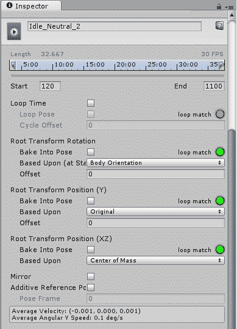

图 3.38 任何选定的子动画片段的更多属性

这里有很多选项。我们不会详细讨论所有这些，但我们将概述这个面板。有各种部分，如 Loop Time、Root Transform Rotation 等。这些部分定义了动画的特定部分。例如，Loop Time 定义了整个动画是否为循环动画。在每个部分之前，都有一个带有红色、黄色或绿色填充的颜色圆圈。这个圆圈告诉我们动画的循环匹配状态。红色表示它不是循环，黄色表示它有些循环但不是完美同步，绿色表示它是完美循环。这些属性允许开发者以非常详细的方式定义动画，以管理动画时角色的`Y`轴位置等。你可以改变开始和结束值，以查看动画在哪里是完美循环，所有绿色圆圈都相应地定制。

最后，在讨论了许多关于动画片段的细节和属性之后，让我们继续创建我们的简单动画控制器。从 Assets 目录中双击 PlayerAnimController 文件。它将显示 Animator 视图，其中包含我们之前讨论的三个状态。现在，按照以下步骤创建一个行走循环动画状态机：

1.  将 Idle_Neutral_2 动画片段从 Player Animations 目录拖动到 Animator 视图中。你会看到一个新添加的橙色矩形，其中包含动画片段的名称。这个矩形显示了该动画片段的状态。如下图所示：

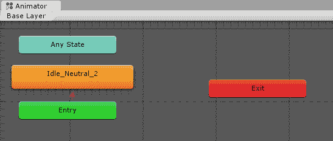

图 3.39 在 Animator 视图中添加的新动画

可以通过右键单击动画并从菜单中选择设置为默认层状态来将任何动画设置为默认动画。Unity 将改变其颜色为橙色。任何单个层中只能有一个默认状态。

现在，如果你玩游戏，你会看到场景中的角色没有进行动画。尽管我们已经将其默认动画状态设置为空闲动画，但角色仍然没有移动。这是因为我们只创建了 Animation Controller，但我们仍然需要将控制器与我们的角色关联：

+   要将我们的角色与新建的动画控制器关联，从 Hierarchy 面板中选择角色。现在，将我们的 PlayerAnimController 从 Assets 拖动到 Inspector 中 Animator 组件的 Controller 属性，如下图所示：

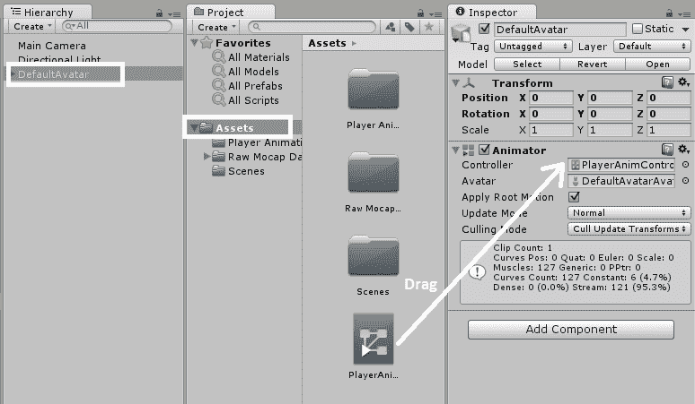

图 3.40 将动画控制器与角色关联

现在，玩游戏，你会看到角色正在跟随空闲动画。但是，一旦动画结束，它就会停止。我们希望在我们的情况下无限循环动画。

+   要设置动画循环，从玩家动画目录中选择 Idle_Neutral_2，然后在检查器设置中的动画标签页中。在剪辑下面，我们首先需要将动画设置为完美循环，并使所有圆圈变为绿色。所以，将起始值设置为 265，它将变为绿色。然后，切换 Loop Time 选项为开启，并点击应用。现在，播放游戏，你的角色将在动画结束后持续重复动画。此外，你将无法观察到动画的结束，因为在动画中创建了一个完美循环。这在上面的图中有所展示：

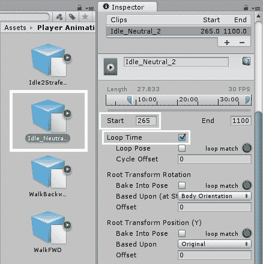

图 3.41 设置动画循环

+   现在让我们再添加一个名为 walk 的动画状态。就像我们之前做的那样，从资产拖动 WalkFWD 到动画器视图中。它将创建另一个矩形状态，这次是灰色。这个动画状态已经添加到控制器中，但还没有与动画器链接。要将此状态与我们的默认 Idle 状态链接，右键单击 Idle_Neutral_2 状态，并选择创建过渡。这将允许您从 Idle 状态创建一条到另一个状态的白色线条。现在，点击 WalkFWD 状态，将在 Idle 和 WalkFWD 状态之间绘制一条带有指向 WalkFWD 状态的箭头的线条。这在上面的图中有所展示：

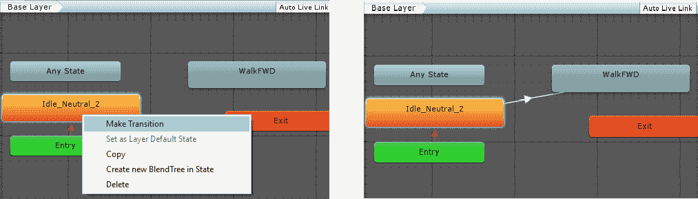

图 3.42 在两个状态之间创建过渡

现在，播放游戏，你会观察到一旦空闲动画完成，它将开始 WalkFWD 动画。在走动动画之后，它将停止。我们还可以从 WalkFWD 到 Idle_Nuetral_2 状态创建另一个过渡，这将使角色持续动画。一旦空闲动画完成，它将开始行走，一旦行走完成，它将回到空闲动画，这将持续运行，形成一个循环动画。

现在，是时候在动画器中添加一些控制了。在动画器面板的左侧，有两个标签页：图层和参数。点击参数标签页，然后点击加号（+）按钮来添加一个新的参数。它会显示一个下拉菜单，从中选择我们想要添加的参数类型。选择布尔值（Bool）并命名为 ShouldWalk。这在上面的截图中有展示：

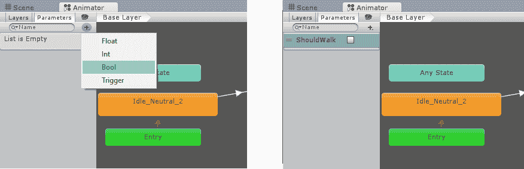

图 3.43 在动画器中添加新参数

现在，你将看到在参数列表中添加了一个新的参数。参数允许开发者根据它们的值来控制动画和状态流。此时，空闲动画完成后，走动动画会自动开始。现在，我们将这个 ShouldWalk 参数与动画器集成，以便如果 ShouldWalk 参数为真，则开始行走动画；否则，它将回到空闲状态：

要这样做，点击从空闲到行走的过渡箭头，并检查检查器面板。你会在那里看到各种设置。最后，你将看到一个条件的小视图。点击那里的加号(+)图标，并将 ShouldWalk 设置为 true。这如图所示：

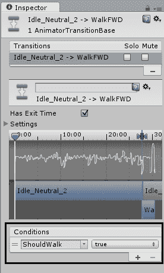

图 3.44 添加过渡条件

同样，现在为其他反向过渡重复相同的步骤，但这次将 ShouldWalk 值设置为 false。现在播放游戏，你会观察到角色不会进入行走动画，它将不断地重复相同的空闲动画。如果将 ShouldWalk 参数设置为`true`，它将播放行走动画。这可以通过代码非常容易地完成。

# 摘要

本章介绍了 3D 游戏的基本概念。我们讨论了任何 Unity 项目如何配置为 3D 游戏，以及如何在 Unity 中导入 3D 模型文件。我们还讨论了 3D 模型的材料和纹理。为了专注于我们的战斗动作游戏，我们讨论了人形模型或角色模型以及它们的导入方式。然后我们讨论了用于动画系统的人形模型的化身配置。Unity 提供两种类型的动画系统；旧的和 Mecanim。我们简要讨论了旧系统，因为它现在已经在 Unity 中弃用，随后对 Mecanim 动画系统进行了更详细的讨论。我们导入了一些动画，并努力创建了一个简单的动画控制器，以及一个简单的参数来控制动画的流程。

在下一章中，我们将从控制器开始，创建一个包含许多动画和参数的详细动画控制器，该控制器将用于玩家和敌人角色。然后我们将使用虚拟摇杆控制来控制玩家移动和动画，并简要讨论敌人角色背后的人工智能。
