# 第四章：带有 AI 的敌人角色

在上一章中，我们学习了如何将 3D 几何和纹理导入到项目中，设置角色并给角色添加动画。在这一章中，我们将运用这些知识，开始制作一个具有基本控制方案的动作游戏。

我们将首先导入玩家角色，并为不同的战斗动画设置所需的动画帧，如空闲、出拳、阻挡和被击中。我们还将使用动画控制器创建不同的状态。动画控制器让我们可以根据角色的行为来决定动画流程。

我们还将探讨游戏平衡以及如何公平对待玩家。如果游戏不公平，玩家会感到沮丧并退出游戏，并且不会向任何人推荐这款游戏。

我们将使用鼠标和键盘来实现控制，但在后面的章节中，我们将看到如何为手持设备实现触摸控制。

在本章结束时，我们将拥有一个基本的战斗系统，其中我们可以击打敌人，敌人会受到打击或阻挡我们的攻击。

本章包括以下主题：

+   导入玩家模型

+   使用动画控制器创建玩家

+   编写玩家控制脚本

+   添加敌人角色

+   敌人行为和 AI

+   完成战斗

# 导入玩家模型

首先，确保你创建一个新的 Unity 3D 项目。这不像我们之前创建的第一个项目，因为这个项目是一个 3D 项目，而不是 2D 项目。

一旦创建项目，你将在本章的资产中找到`Dude.FBX`文件，所以将文件拖放到 Unity 项目中：

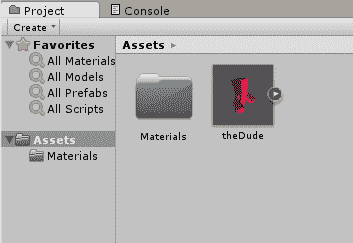

在你的情况下，模型将是灰色，而不是像这里显示的红色。要使其变红，双击`材质`文件夹。你会看到`01- Default`文件。当你选择它时，你会得到一个选项来更改物体的颜色。点击检查器面板中 Albedo 选项旁边的灰色方块，并选择红色来更改角色的颜色：

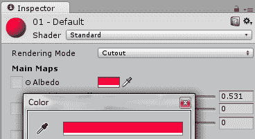

我们接下来需要做的是为游戏中所有的动画创建动画剪辑。点击项目“资产”文件夹中的 Dude 角色。现在查看检查器面板。在检查器面板中，你会看到三个标签页，分别称为模型、绑定和动画，如下面的截图所示。点击动画标签页：

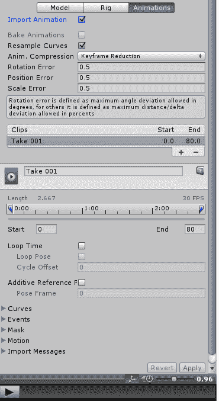

这显示了当前存在的所有动画剪辑。到目前为止，只有一个动画剪辑，名为`Take 001`，从第 0 帧开始，到第 80 帧结束。你甚至可以通过点击面板底部的播放按钮来预览动画。

你会看到`Take 001`包含了所有导入的动画，以及 FBX 文件，包括空闲、防御、出拳和被击中的动画。由于所有动画都在一个剪辑中，我们必须将动画拆分成单独的剪辑。

要做到这一点，首先我们需要提取从帧 0 到帧 29 的空闲剪辑。因此，我们将名称更改为空闲，并将动画剪辑的结束帧设置为 29，如下面的截图所示：

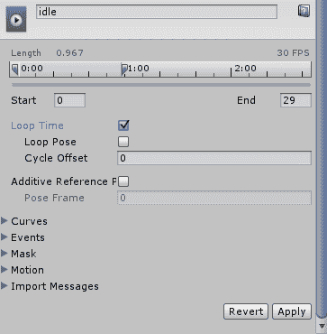

确保点击底部的应用按钮以使更改生效。

此外，请注意，循环时间复选框已被勾选。这是因为动画需要循环播放，如果我们不勾选此框，则动画将只播放一次并停止。

现在，让我们提取第二个动画剪辑，即“守卫”/“防御”动画。为此，在剪辑菜单中点击加号图标。这将创建一个默认动画，称为`Take 001`，如下面的截图所示：

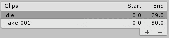

现在，再次选择“Take 001”剪辑，将其重命名为 defend，并将开始和结束时间更改为 32 和 49。点击循环时间，并在最后点击应用按钮：

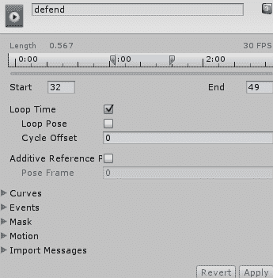

现在添加**打击**和**被击中**动画的动画剪辑。打击动画从 51 开始，到 60 结束，被击中动画从 71 开始，到 75 结束。

对于这些动画，不需要勾选循环时间选项，因为它们不需要循环。一旦你有了所有所需的动画，剪辑窗口应该看起来像下面的截图：

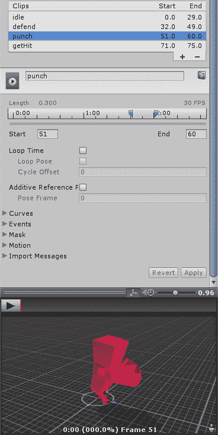

一旦我们完成了动画的提取，我们就可以为玩家角色创建动画控制器。

# 玩家动画控制器

要创建新的动画控制器，请在项目中的“资产”文件夹上右键单击，选择创建选项，然后从列表中选择动画控制器：

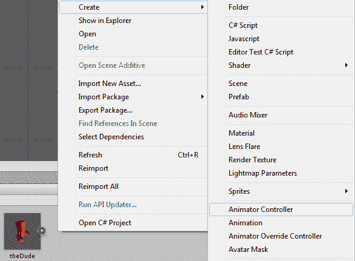

将文件重命名为 dudeAC，并双击它：

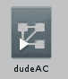

当你双击它时，将打开一个名为动画的新面板，如下面的截图所示：

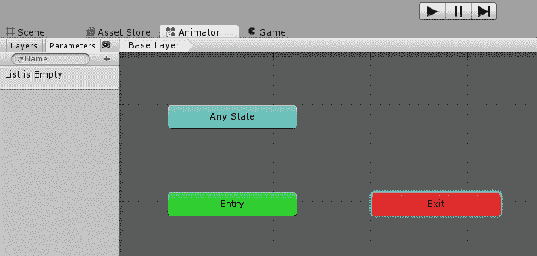

动画控制器基本上控制动画的流程。默认添加了三个状态；这些是入口、任何状态和退出：

+   入口状态指定在场景开始时播放哪个动画。因此，在大多数情况下，首先播放的是空闲动画。

+   任何状态指定无论之前播放的动画是什么，都需要执行哪个动画。

+   退出状态是在场景退出时播放的动画。

让我们设置玩家的状态，敌人的设置也将相同。

首先，我们将创建默认动画，以便当场景开始时，播放空闲动画。在动画器面板中，右键单击任何位置，从列表中选择创建状态选项，然后选择空选项，如下面的截图所示：

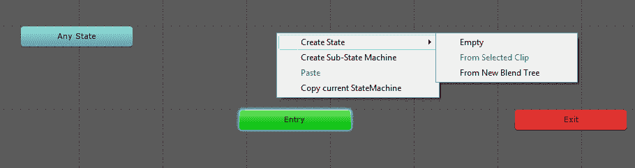

选择创建的新状态，并打开检查器面板。

接下来，我们需要从入口状态创建一个转换。右键单击它，将打开“创建转换”选项，因此点击此选项。从点击的状态开始出现一个箭头。现在点击我们需要转换到的状态。这将创建到该新状态的转换，如以下截图所示：

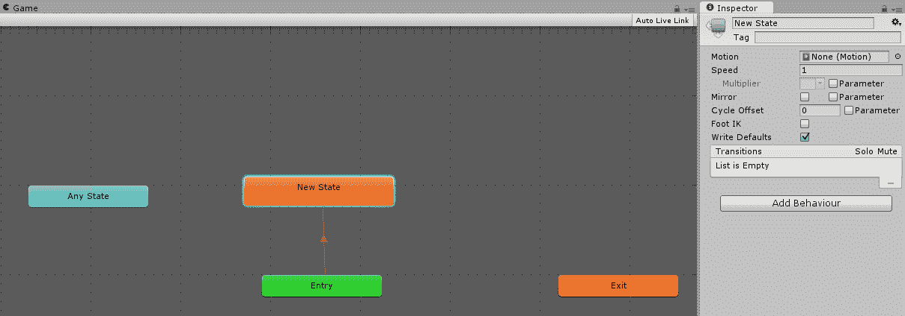

接下来，将新状态重命名为空闲。点击新状态，将状态重命名为 Idle，并通过选择它旁边的小圆圈将运动字段更改为空闲：

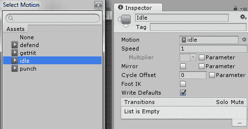

要测试控制器是否工作，将`theDude`角色拖放到层次结构中，并将其放置在相机垂直的位置，如图以下截图所示：

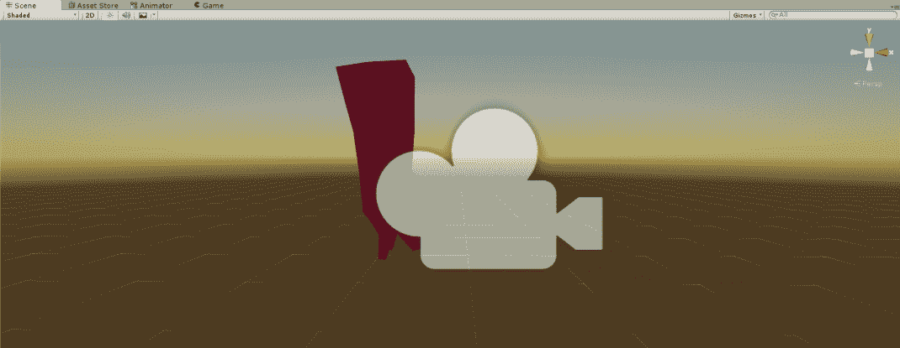

在场景中选择 Dude 角色，然后在检查器面板中，将动画控制器拖放到动画组件中的控制器字段，如图以下截图所示：

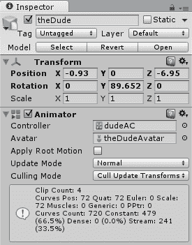

点击顶部的播放按钮，你应该会看到带有空闲动画的角色正在播放。现在我们已经确认它工作正常，我们可以进入动画控制器并添加游戏中所需的状态。

在任何状态状态下，我们应该能够拥有防御、拳头和被击中动画。如果玩家不处于这些状态中的任何一个，他应该回到空闲状态。

因此，在动画控制器中，添加三个状态，将相应的动画附加到运动中，并相应地更改每个状态的名字。在创建三个状态后，我们还需要在“任何状态”状态和这些状态之间进行转换，并且当每个状态完成时，它需要转换回空闲状态。

要从给定状态创建转换，右键单击它：将打开“创建转换”选项。点击它，从点击的状态开始出现一个箭头。接下来，点击我们想要转换到的状态。这将创建到该状态的转换。转换在以下图中显示：

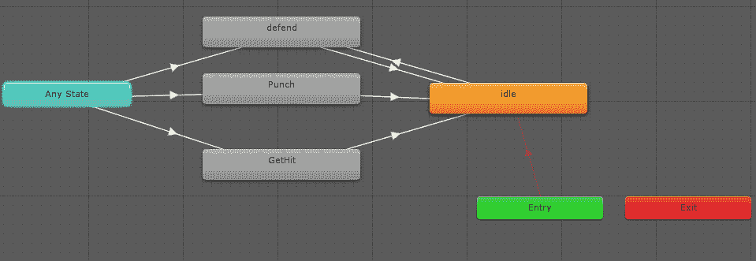

每个这样的转换都将通过脚本进行控制。为了触发每个状态，我们将使用布尔值或触发器来启用这些状态变化。

要创建这些参数，点击动画面板旁边的“参数”选项卡。

要创建一个新参数，点击搜索栏旁边的加号。你可以创建浮点数、整数、布尔值或触发器参数。

为了我们的目的，我们创建了一个布尔参数，称为 bIsDefending，以及两个触发器参数，称为 tGotHit 和 tIsPunching，如图以下截图所示：

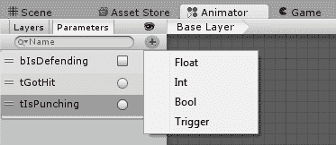

布尔值和触发器的区别在于，触发器一旦被激活就会将自己设置为 false，而布尔值必须通过程序设置`true`和`false`。

让我们看看它在当前游戏中的实现方式。首先，我们将设置打击和被击动画的过渡；然后我们将查看防御状态。选择从任何状态到打击的过渡箭头。

当箭头变成蓝色时，你知道已经选择了过渡。截图显示了默认状态的外观。我们在这里要做一些更改：

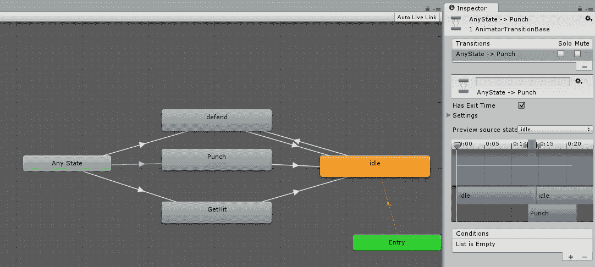

首先，我们希望这个过渡只在玩家正在打击时发生。所以，在条件选项卡中，按下加号并添加 tInPunching 条件。

第二点，取消勾选“具有退出时间”选项。如果勾选此选项，则过渡将仅在之前的动画播放完成后才会发生。我们不希望这样。我们希望玩家在点击打击按钮后立即开始播放打击动画。

第三点，也是最重要的一点，动画预览窗口显示了过渡过程中播放的动画。最初它显示动画将从零开始，播放空闲动画，然后过渡到打击动画。我们实际上只想让打击动画立即开始，并且我们只想在空闲动画和打击动画之间有一个过渡帧。

因此，我们将打击动画放回开始位置，并将开始和停止时间设置得非常小，如下截图所示：

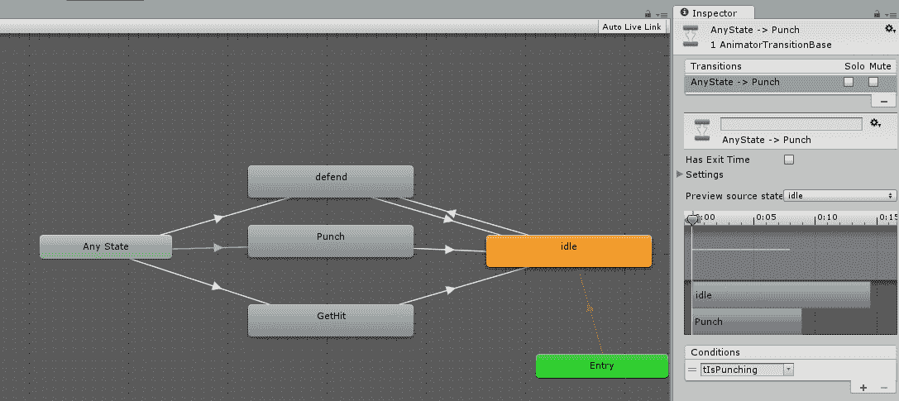

现在我们来看一下打击到空闲动画：

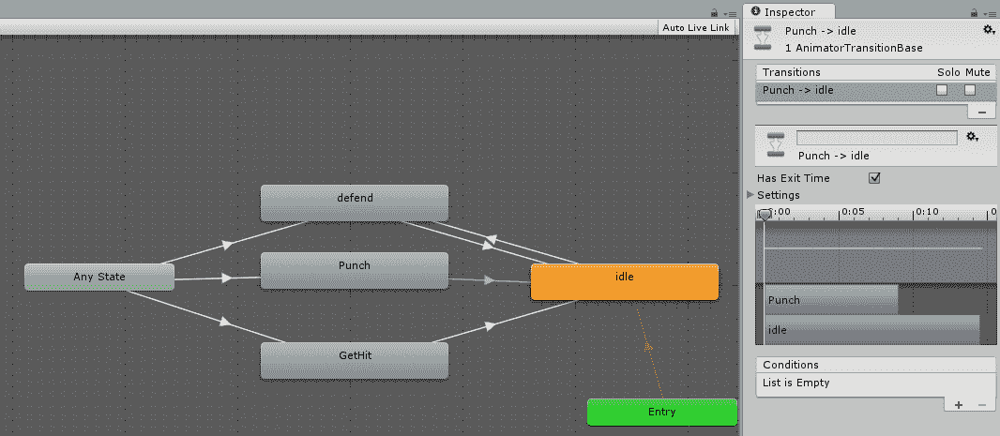

在这里，我们保持“具有退出时间”选项勾选，因为我们希望动画播放完毕后播放空闲动画。此外，空闲动画被拉回开始位置，动画播放时间也减少到一帧。

同样的操作也应用于从任何状态到 GetHit 的过渡，如下截图所示。但在这里，条件更改为 tGotHit：

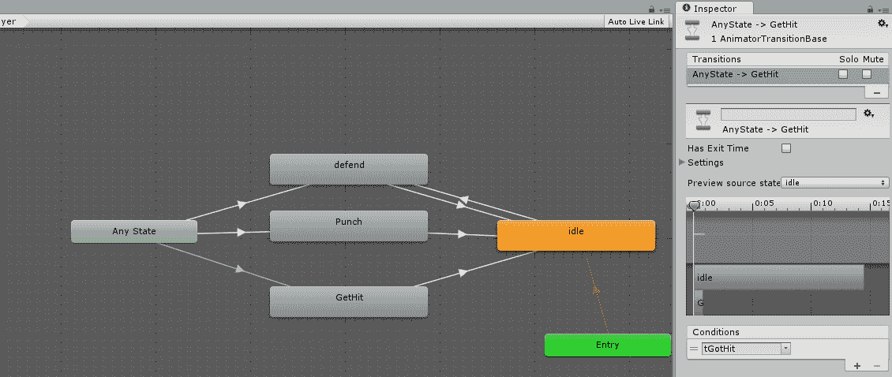

同样，从被击到空闲状态：

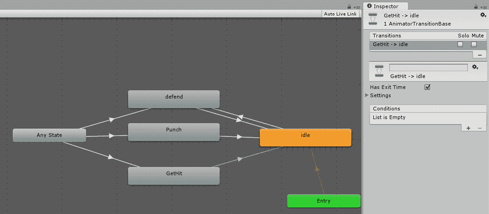

让我们看看如何从任何状态到防御状态，然后从防御状态到空闲状态的过渡。从任何状态到防御状态的过渡应更改为以下截图所示：

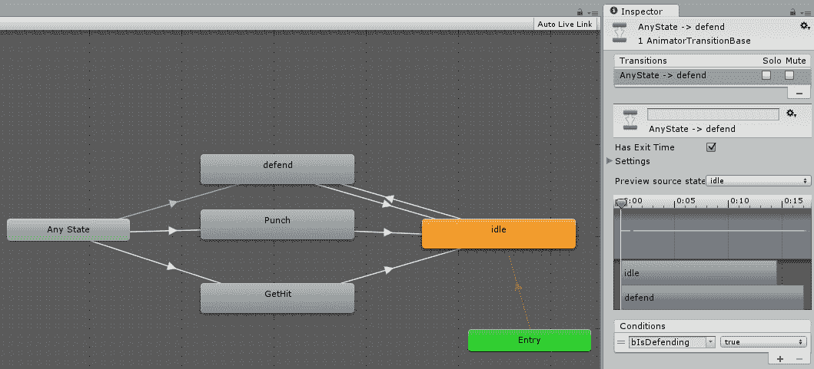

在这里，我们再次将防御动画拉回，并将播放时间更改为一帧。勾选“具有退出时间”选项，并将条件更改为 bIsDefending，设置为 true。对于从防御到空闲动画的过渡，我们将 bIsDefending 设置为 false，并像往常一样更改动画宽度：

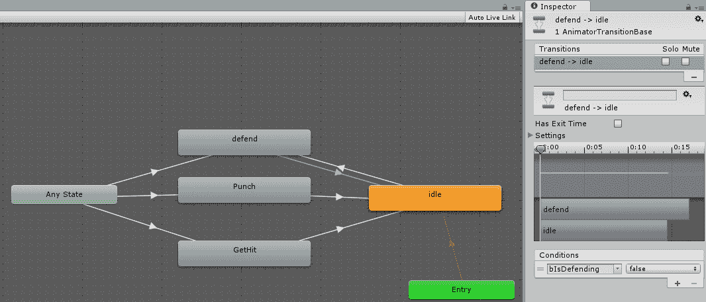

对于从空闲到防御的过渡，我们以与从任何状态到防御相同的方式进行，只是取消勾选“具有退出时间”复选框，如下截图所示：

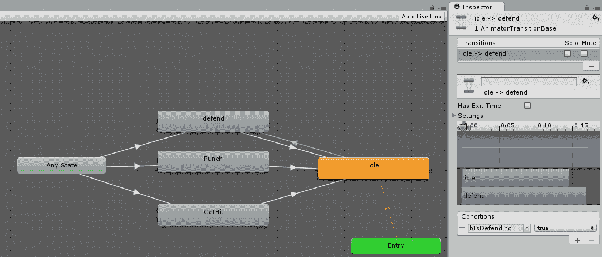

这样我们就完成了动画控制器。

# 编写玩家控制脚本

为了控制状态，我们需要将脚本附加到玩家上。我们将使用鼠标的左右键来控制玩家。左键点击用于攻击，右键点击用于防御。如果两者都没有点击，则播放空闲动画。

可以在编辑菜单的 Unity 项目设置选项下更改控制。从列表中选择输入选项，如下面的截图所示：

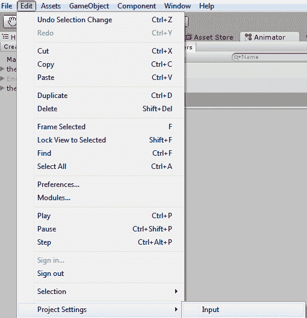

记住名称，因为在代码中引用时，我们将使用按钮的名称。所以，对于左键点击，我们将引用 Fire1。你可以在检查器面板中检查不同按钮的名称：

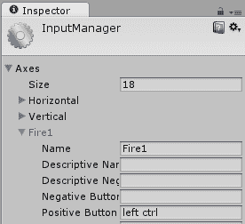

通过在资产文件夹选项中右键单击 | 创建 | C# 脚本来创建一个新的脚本，并将其命名为 `playerScript`。双击它，它应该在 Visual Studio 中打开。

将以下代码添加到脚本中：

```java
    using UnityEngine; 
    using System.Collections; 

    public class playerScript : MonoBehaviour { 
        private Animator anim; 

        // Use this for initialization 
        void Start () { 
            anim = GetComponent<Animator>(); 
        } // start 

        // Update is called once per frame 
        void Update () { 

            //Defending 
            if (Input.GetButtonDown("Fire2")){ 
                // Debug.Log("Jump pressed"); 
                anim.SetBool("bIsDefending", true); 
            } else if (Input.GetButtonUp("Fire2")) { 
                anim.SetBool("bIsDefending", false); 
            } 

            //Attacking 
            if (Input.GetButtonDown("Fire1")){ 
                anim.SetBool("bIsDefending", false); 
                anim.SetTrigger("tIsPunching"); 
                //Debug.Log("Fire pressed"); 
            } 
        } // update 
    } 

```

在顶部，我们创建一个 `private` 变量来获取动画器组件并将其存储在该变量中。

接下来，在 `start` 函数中，我们获取动画器组件并将其分配给 `anim`，否则我们每帧都要做这件事，这将非常耗时。

在 `Update` 函数中，我们首先检查防御状态。如果按下 `Fire 2` 按钮，即鼠标的右键，我们将 `bIsDefending` 设置为 `true`。`bIsDefending` 变量与我们定义在动画控制器选项中的参数相同。

如果按钮被释放，我们将 `bIsDefending` 变量设置为 `false`。

接下来，我们设置攻击状态。如果按下 `Fire1` 按钮，我们首先将防御设置为 `false`，然后将 `tIsPunching` 设置为 `true`。我们还进行调试注销，以便我们可以看到击打的特定代码。

为了查看这确实是否有效，我们必须将其附加到场景中的玩家角色上，并将其添加为组件：将代码拖动并添加到 `theDude` 角色上。现在，如果你查看检查器，你可以看到脚本已被添加：

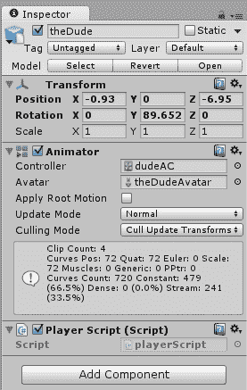

现在，如果你右键点击鼠标，玩家应该进行防御，如果你用鼠标左键点击，玩家应该进行击打。

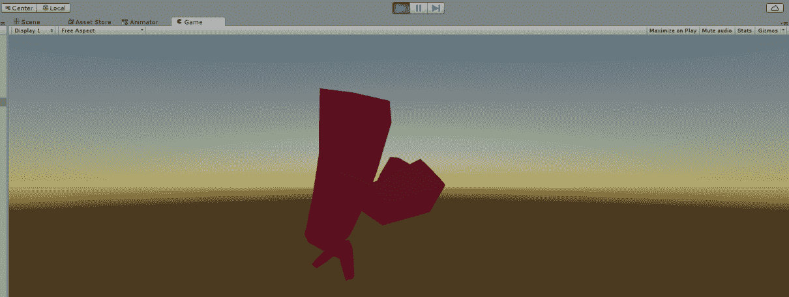

让我们给玩家一个敌人来击打。

# 添加敌人角色

就像我们将玩家拖入场景一样，将 `Assets` 中的 Dude 角色拖入 `Hierarchy`。在 `Hierarchy` 中将此角色重命名为敌人。这个家伙也会是红色，这不是我们想要的，所以我们将创建一个新的材料。

右键点击材料文件夹，然后选择创建 | 材料项目。将材料命名为 `Material`。将 Albedo 颜色控制旁边的颜色从默认值改为蓝色。

现在，将材料拖放到敌人角色上。同时放置并旋转角色，使其与玩家角色相对，如下面的截图所示：

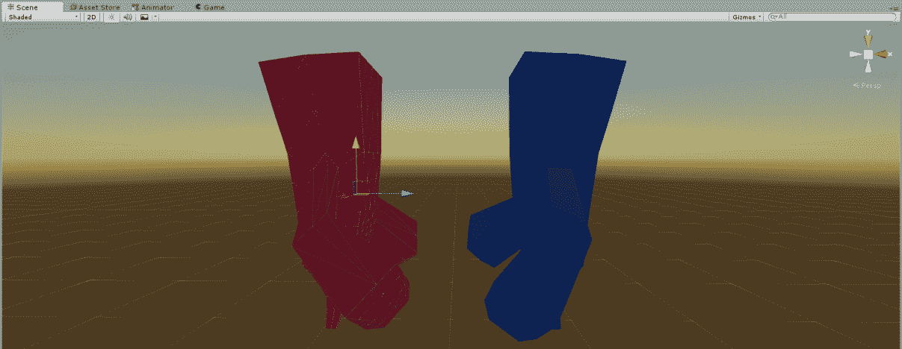

还需要将 dudeAC 动画控制器拖到敌人 Animator 组件的 Controller 组件中：

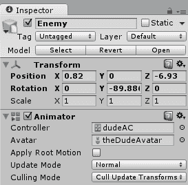

# 敌人行为和 AI

当你玩游戏时，敌人将开始于空闲动画。让我们给敌人角色添加一些行为。

通过创建一个模式来实现 AI，该模式将确定敌人下一次状态改变的时间，以及敌人将处于空闲、防御或攻击状态的时间段。

模式是一个数组，包含 20 个元素。当所有元素耗尽后，模式将被随机化，计数器再次设置为 0。

一些间隔持续 10 帧，而其他间隔持续长达 120 帧，即两秒钟。玩家必须判断并确保自己不被击中，并且必须在敌人杀死他之前击败 `enemy`。一旦我们通过代码，这会更有意义。

创建一个新的 C# 脚本并将其命名为 `enemy`。将以下脚本添加到代码中。

首先，我们初始化我们的变量：

```java
    using UnityEngine; 
    using System.Collections; 

    public class enemy : MonoBehaviour { 

    private Animator anim; 

    int myTick = 0; 
    int currentTick = 0; 
    int prevTick = 0; 
    int nextTick = 0; 
    int patternLength = 0; 
    int patterCount = 0; 

    int[] pattern = new[] {10, 10, 10,30, 60, 10, 40, 60, 120, 30, 
                           10, 10,10, 60, 60, 120, 30, 10, 10, 10}; 
    // Use this for initialization 

```

在 `Start` 函数中，我们获取 `Animator` 组件并设置模式，稍后我们将对其进行随机化：

```java
    void Start () { 

    anim = GetComponent<Animator>(); 
    anim.SetBool("bIsDefending", true); 

    Shuffle(pattern); 

    patternLength = pattern.Length; 
    nextTick = pattern[0]; 

    } // start 

```

在 `Update` 函数中，我们更新我们最初设置的值：

```java
    // Update is called once per frame 
    void Update () { 

        myTick++; 
        currentTick = myTick;        

        if (currentTick == prevTick + nextTick) { 
            int choice = Random.Range(1, 3); 

            switch (choice) { 

                //will punch 
                case 1: anim.SetBool("bIsDefending", false); 
                    anim.SetTrigger("tIsPunching"); 
                    break; 

                //will defend 
                case 2: anim.SetBool("bIsDefending", true); 
                    break; 

                //will be idle  
                case 3: anim.SetBool("bIsDefending", false); break; 
            } 

            prevTick = currentTick; 
            nextTick = pattern[patterCount]; 

            if ((patterCount + 1) >= pattern.Length){ 
                patterCount = 0; 
                Shuffle(pattern); 
            } 
            else { 
                patterCount++; 
            } 
        } 
    } // Update 

```

`Shuffle` 函数随机化我们创建的初始模式：

```java
    void Shuffle(int[] a){ 

        for (inti = a.Length - 1; i> 0; i--){ 
            int rnd = Random.Range(0, i); 
            int temp = a[i]; 
            a[i] = a[rnd]; 
            a[rnd] = temp; 
        } 

        for (inti = 0; i<a.Length; i++){ 
            Debug.Log(a[i]); 
        } 
     } // shuffle    

```

就像代码顶部的玩家一样，我们创建一个 `private` 变量来存储敌人 animator 变量。

我们还创建了一组名为 `myTick`、`currentTick`、`prevTick`、`nextTick`、`patternLength` 和 `patternCount` 的整数变量。

`myTick` 变量只是一个计数器，它不断递增。`CurrentTick` 和 `prevTick` 变量分别跟踪当前帧的 tick 和 `prevTick` 跟踪上一次动作发生的 tick。

`patternLength` 变量跟踪模式数组中的项目数量，而 `patternCount` 跟踪正在使用的当前模式编号。

模式是一个包含动作间隔的数组。

在 `Start` 函数中，我们获取 Animator 组件并将 `isDenfendingbool` 变量设置为 `true`，这样敌人一开始就会开始防御。我们打乱模式并将 `patternLength` 和 `nextTick` 赋值给模式的第一个元素。

接下来在 `Update` 函数中，我们首先递增 tick 并将 `myTick` 赋值给 `currentTick`。

然后我们检查是否是执行下一个动作的时间，通过检查 `currentTick` 是否等于上一个 tick 和 `nextTick` 的和。

如果它们相等，那么我们生成一个从 1 到 3 的随机数。根据返回值是 1、2 还是 3，将有一个 `switch` 语句，敌人将出拳、防御或保持空闲。

最后，我们将 `currentTick` 赋值给 `previousTick`，将 `nextTick` 赋值给下一个 `patternCount`。

我们还需要递增 `patternCount` 并检查 `patternCount` 变量的值是否超过了长度。如果超过了，那么我们需要将其重置。

因此，如果`patternCount++`的值大于或等于`patternLegth`的值，则将模式重置为零并打乱模式，否则我们只需递增`patterCount`。

最后，我们还有一个函数可以随机打乱模式，这样就不会重复。将此脚本组件添加到场景中的敌人对象，并观察他闲置、阻挡和出拳：

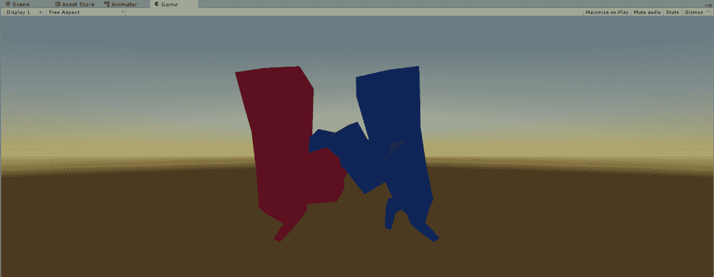

# 结束战斗

让我们让玩家通过改变玩家的行为来对敌人的攻击做出反应。在`playerScript`中添加以下代码行。在类顶部创建一个新的`public`变量，类型为`GameObject`，并将其命名为`enemy`：

```java
    public GameObject enemy; 

```

接下来，在`Update`函数的开始处，获取敌人的`Animator`组件：

```java
    Animator eAnim = enemy.GetComponent<Animator>(); 

```

接下来，在更新函数中的攻击函数之后，添加以下内容：

```java
    // Getting Hit 
    if (eAnim.GetBool("tIsPunching")){ 
        if (anim.GetBool("bIsDefending") == false){ 
            //Debug.Log("I got hit"); 
            anim.SetTrigger("tGotHit"); 
        } 
    }  

```

在这里，我们检查敌人是否在出拳。如果敌人正在出拳而玩家没有防守，那么我们将`gotHit`触发器设置为`true`。

将`theDude`角色拖放到如图所示的敌人脚本组件中：

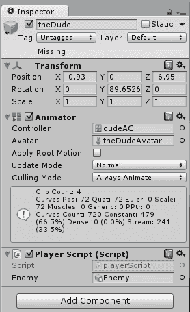

类似地，在敌人脚本中添加一个名为`player`的公共`GameObject`变量。

```java
    public GameObject player; 

```

在`Update`函数结束之前，添加以下内容。

```java
    Animator pAnim = player.GetComponent<Animator>(); 

    // Getting Hit 
    if (pAnim.GetBool("tIsPunching")) { 
        if (anim.GetBool("bIsDefending") == false) { 
            //Debug.Log("I got hit"); 
            anim.SetTrigger("tGotHit"); 
        } 
    } 

```

将玩家拖放到敌人脚本中的`GameObject`，当他不防守时受到攻击：

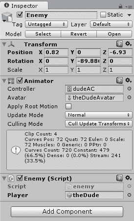

现在玩游戏，你会看到当敌人不防守时会被击中：

此外，到目前为止，玩家可以持续左键点击，英雄角色可以持续出拳。为了限制玩家可以出的拳数，请添加以下代码。

在顶部添加以下内容：

```java
    float totalTime = 0.0f; 
    float timeSinceLastHit = 0.0f; 
    float hitTimeInterval = 30.0f * .016f; 

```

在`Update`函数的开始处，增加时间：

```java
    totalTime += Time.deltaTime; 

```

攻击代码需要更改为：

```java
    // Attacking 
    if (totalTime>= timeSinceLastHit + hitTimeInterval){ 
        if (Input.GetButtonDown("Fire1")){ 
            anim.SetBool("bIsDefending", false); 
            anim.SetTrigger("tIsPunching"); 

            timeSinceLastHit = totalTime; 
            //Debug.Log("Fire pressed"); 
        } 
    } 

```

# 概述

在本章中，我们看到了如何导入 FBX 模型，导入动画，并为单个动画设置名称。我们创建了一个动画控制器和动画之间的转换。一旦创建了动画控制器，我们就使用代码来控制动画。

我们还创建了玩家控制，创建了一个非常基本的 AI，并使用随机化的模式来避免模式重复，用模式来控制 AI 行为。

现在我们有一个基本的工作框架，我们将对其进行改进，并在下一章中添加一个合适的游戏循环。
