# 游戏玩法、UI 和效果

在上一章中，我们创建了基本游戏玩法并确保触发了正确的动画，控制也到位。在本章中，我们将通过添加适当的游戏循环来完成游戏玩法，以便有开始、得分和游戏结束。

对于得分，我们最初将使用 debug 来记录玩家和 AI 的健康状态。稍后，我们将探讨 Unity 的**图形用户界面**（**GUI**）系统并为玩家和敌人添加健康指示器。

最后，我们还将探讨 Unity 的粒子系统以及我们可以操纵的不同参数，以获得游戏所需的粒子效果。

本章包括以下主题：

+   完成游戏玩法

+   理解 Unity GUI

+   添加健康和游戏结束条件的 GUI

+   粒子效果简介

+   创建烟花粒子效果

# 完成游戏玩法

为了追踪玩家和敌人的健康状态，我们需要变量来追踪他们各自的健康值以及他们能对彼此造成多少伤害。

为了做到这一点，打开`playerScript`并在类的顶部添加名为`health`和`damage`的变量。然后，将`health`变量的值设置为 100，将`damage`变量的值设置为 10。因此，玩家将以 100 的健康值开始，当他们击中敌人时，将对敌人造成 10 点的伤害：

```kt
    using UnityEngine; 
    using System.Collections; 
    public class playerScript : MonoBehaviour { 
        public int health = 100; 
        public int damage = 20; 

        private Animator anim; 
        // other code 
    } 

```

类似地，将`playerScript`类的相同代码添加到`enemyScipt`类中。由于我们希望公平，我们将敌人的健康值也设置为 100，并将他们能造成的伤害设置为 10。请确保使用`public`访问修饰符，因为只有这样我们才能在其他类中访问健康变量：

```kt
    public class enemyScript : MonoBehaviour { 

        public int health = 100; 
        public int damage = 10; 

        private Animator anim; 
        // other code    
    } 

```

现在，每当玩家/敌人受到攻击时，我们必须确保他们的健康值会因其他玩家/敌人能对他们造成的伤害量而减少。因此，在`Update`函数的章节中，当我们检查玩家或敌人是否被击中时，我们必须通过伤害量来减少健康值。

在`enemyScript`类中，为了检查敌人是否被击中，更改代码如下：

```kt
    GameObject player = GameObject.Find("theDude"); 
    Animator pAnim = player.GetComponent<Animator>(); 

    playerScript pScript = player.GetComponent<playerScript>(); 

    //Getting Hit 

    if (pAnim.GetBool("tIsPunching")){ 
        if (anim.GetBool("bEnemyIsDefending") == false) { 
            Debug.Log("enemy got hit"); 
            anim.SetTrigger("tEnemyGotHit"); 
            anim.SetBool("bEnemyIsDefending", true); 
 health -= pScript.damage; 
        } 
    }  

```

我们通过获取`gameobject`玩家和添加玩家脚本的`GetComponent`组件来获取对玩家脚本的访问权限。

一旦我们获得对脚本的访问权限，我们就可以获取玩家能造成的伤害量，并通过伤害量减少敌人的当前健康值。现在，转到`playerScript`，因为当玩家被敌人击中时，我们同样需要在玩家脚本中实现这一点：

```kt
    GameObject enemy = GameObject.Find("Enemy"); 

    Animator eAnim = enemy.GetComponent<Animator>(); 

    enemyScript eScript = enemy.GetComponent<enemyScript>(); 

    if (eScript.isPunching == true) { 
        if (anim.GetBool("bIsDefending") == false) { 
            Debug.Log("player got hit"); 
            anim.SetTrigger("tGotHit"); 
            health -= eScript.damage; 
        } 
    } 

```

在这里，我们将获取对敌人脚本的访问权限，以便我们可以获取与在敌人脚本中相同的方式获取敌人伤害。一旦我们获取了`damage`变量，我们将通过在敌人脚本中设置的伤害量减少玩家的健康值。现在，你可以运行游戏并执行`Debug.log`脚本。`Player Health`和`Enemy Health`实体似乎受到了影响，如下面的截图所示：

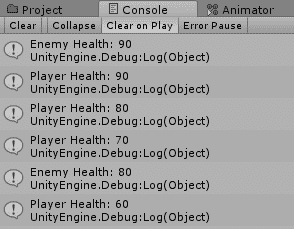

一旦我们计算出玩家和敌人的生命值，我们就可以设置游戏结束条件。一旦玩家的生命值或敌人的生命值小于或等于零，就是游戏结束。

游戏循环是由第三个脚本控制的。我们将把这个脚本称为`gameScript`。

这是一个非常简单的脚本，它能够访问`playerScript`和`enemyScript`，并检查玩家和敌人的生命值。一旦玩家或敌人的脚本中的任何一个小于零，它就会宣布游戏结束。

因此，我们将创建一个新的脚本，称为`gameScript`，并将以下代码行添加到脚本中：

```kt
    using System.Collections; 
    using System.Collections.Generic; 
    using UnityEngine; 

    public class gameScript : MonoBehaviour { 

        playerScript pScript; 
        enemyScript eScript; 
        public bool bGameover = false; 

        // Use this for initialization 
        void Start () { 

            GameObject player = GameObject.Find("theDude"); 
            pScript = player.GetComponent<playerScript>(); 

            GameObject enemy = GameObject.Find("Enemy"); 
            eScript = enemy.GetComponent<enemyScript>(); 
        } 

        // Update is called once per frame 
        void Update () { 
            if (!bGameover) { 

                int playerHealth = pScript.health; 
                int enemyHealth = eScript.health; 

                /* Debug.Log("PlayerHealth: " + playerHealth + "  
                EnemyHealth: " + enemyHealth); */ 

                if (playerHealth<= 0 || enemyHealth<= 0) { 
                    bGameover = true; 
                    Debug.Log(" +++++ GAMEOVER +++++"); 
                } 
            } 
        } 
    } 

```

在类的顶部，我们创建了三个变量。前两个是为了获取访问玩家和敌人脚本。第三个是一个公共布尔变量，用于设置游戏是否结束。由于游戏刚开始，还没有结束，我们在开始时将其设置为`false`。

在`Start`函数中，我们找到了玩家和敌人，并使用获取组件函数访问了各自的脚本。

然后，在`Update`函数中，我们首先检查游戏是否没有结束。如果没有结束，我们就获取玩家和敌人的生命值，并将其分别存储在名为`playerHealth`和`enemyHealth`的局部变量中。

我们接着检查玩家生命值或敌人生命值是否小于或等于 0。如果是这种情况，我们将`bGameover`布尔变量设置为`true`，并调用`Debug.log`，表示游戏结束。

现在，为了让脚本真正运行，它需要附加到场景中的某个对象上。这可能是一个虚拟对象或场景中的任何其他对象。幸运的是，我们有一个就坐在那里并且是场景一部分的相机。因此，我们将`gameScript`附加到相机作为一个组件。

一旦脚本附加到相机上，运行游戏并查看它是否达到游戏结束条件：

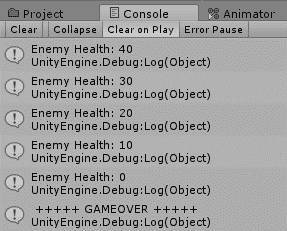

你现在会注意到，尽管游戏已经结束，敌人仍然在攻击玩家，而玩家仍然可以攻击敌人。我们不希望这样，因为这可能会导致游戏中出现一些不必要的错误。

因此，在玩家和敌人脚本中，我们需要访问`gameScript`类，并确保一旦游戏结束，就没有任何更新。在玩家的类中，我们将在类的顶部创建一个新的`GameObject`，名为`mainCamera`，如下面的代码所示：

```kt
    public class playerScript : MonoBehaviour { 

        public int health = 100; 
        public int damage = 20; 

        float totalTime = 0.0f; 
        float timeSinceLastHit = 0.0f; 
        float hitTimeInterval = 0.0f; 

        private Animator anim; 

 public GameObject mainCamera; 

        // other code 
    } 

```

在`Update`函数中，我们获取了相机的`gameScript`组件，然后无论`Update`函数中有什么，我们都将其放入一个`if`条件中，该条件将检查游戏是否结束。

如果游戏没有结束，那么`if`条件内的所有内容都将更新。否则，它将跳过并不会更新。以下是更新的`Update`函数（没有双关语的意思）：

```kt
    void Update () { 
        gameScript gScript = mainCamera.GetComponent<gameScript>(); 

        if (!gScript.bGameover) { 
            totalTime += Time.deltaTime; 

            //Getting Hit  
            GameObject enemy = GameObject.Find("Enemy"); 
            Animator eAnim = enemy.GetComponent<Animator>(); 
            enemyScript eScript = enemy.GetComponent<enemyScript>(); 

            if (eScript.isPunching == true) { 
                if (anim.GetBool("bIsDefending") == false) { 

                    //Debug.Log("player got hit"); 
                    anim.SetTrigger("tGotHit"); 

                    health -= eScript.damage; 
                    Debug.Log("Player Health: " + health); 
                } 
            } 
            // Defending 
            if (Input.GetButtonDown("Fire2")) { 
                //Debug.Log("Jump pressed"); 
                anim.SetBool("bIsDefending", true); 
            } 
            else if (Input.GetButtonUp("Fire2")) { 
                anim.SetBool("bIsDefending", false); 
            } 

            // Debug.Log("Delta time" + timeChangeInMillis); 
            // Attacking 
            if (totalTime>= timeSinceLastHit + hitTimeInterval) { 
                if (Input.GetButtonDown("Fire1")) {     
                    anim.SetBool("bIsDefending", false); 
                    anim.SetTrigger("tIsPunching"); 

                    timeSinceLastHit = totalTime; 
                    //Debug.Log("Fire pressed"); 
                } 
            } 
        } // check if gameover 
    } // update  

```

现在，我们还需要对敌人脚本执行类似的操作。以下是敌人类的更新代码：

```kt
    using UnityEngine; 
    using System.Collections; 

    public class enemyScript : MonoBehaviour { 

        public int health = 100; 
        public int damage = 10; 

        private Animator anim; 

        public GameObjectmainCamera; 

        // public GameObject player; 

        int myTick = 0; 
        int currentTick = 0; 
        int prevTick = 0; 
        int nextTick = 10; 
        int punchTick = 0; 

        public bool isPunching = false; 

        int[] pattern = new[] {120, 30, 180, 30, 60, 30, 40, 60, 180,  
                               30, 30, 30 ,120, 60, 60, 180, 30, 30,  
                               120, 30 }; 
        int patternCount = 0; 
        // Use this for initialization 

        void Start () { 
            anim = GetComponent<Animator>(); 
            anim.SetBool("bEnemyIsDefending", true); 

            Shuffle(pattern); 

            nextTick = pattern[0]; 
        } //start 

        // Update is called once per frame 
        void Update () { 

            punchTick--; 
            myTick++; 
            currentTick = myTick; 

            gameScript gScript = mainCamera.GetComponent<gameScript>(); 

            if (!gScript.bGameover) { 

                GameObject player = GameObject.Find("theDude"); 
                Animator pAnim = player.GetComponent<Animator>(); 
                playerScript pScript = player.GetComponent<playerScript>(); 

                //Getting Hit 
                if (pAnim.GetBool("tIsPunching")) { 
                    if (anim.GetBool("bEnemyIsDefending") == false) { 
                        // Debug.Log("enemy got hit"); 
                        anim.SetTrigger("tEnemyGotHit"); 
                        anim.SetBool("bEnemyIsDefending", true); 

                        health -= pScript.damage; 

                        Debug.Log("Enemy Health: " + health); 
                    } 
                } 

                if (currentTick == prevTick + nextTick) { 
                    int choice = Random.Range(1, 4); 
                    // Debug.Log("Choice" + choice); 

```

根据从 1 到 3 的随机数，我们将选择 AI 是出拳、防御还是闲置：

```kt
                switch (choice) 
                { 
                    //will punch 
                    case 1: 
                        anim.SetBool("bEnemyIsDefending", false); 
                        anim.SetTrigger("tEnemyIsPunching"); 
                        anim.SetBool("bEnemyIsDefending", true); 
                        isPunching = true; 
                        punchTick = 1; 
                        break; 

                    //will defend 
                    case 2: 
                        anim.SetBool("bEnemyIsDefending", true); 
                        break; 

                    //will be idle  
                    case 3:  
                        anim.SetBool("bEnemyIsDefending", false);  
                        break; 
                } 

                prevTick = currentTick; 
                nextTick = pattern[patterCount];//Random.Range(20, 300); 

                if ((patterCount + 1) >= pattern.Length) { 
                    patterCount = 0; 
                    Shuffle(pattern); 
                }  
                else { 
                    patterCount++; 
                } 
            } 

            if (punchTick<= 0) { 
                punchTick = 0; 
                isPunching = false; 
            } 
        } // check if gameover 
    } // Update 

```

`Shuffle`函数重新排列初始数组，以便我们得到一组不同的随机数：

```kt
    void Shuffle(int[] a) {  
        for (int i = a.Length - 1; i > 0; i--){ 
            int rnd = Random.Range(0, i); 
            int temp = a[i]; 

            a[i] = a[rnd]; 
            a[rnd] = temp; 
        } 

        for (int i = 0; i <a.Length; i++){ 
            // Debug.Log(a[i]); 
        } 

    } // shuffle 

```

# 理解 Unity uGUI

随着 Unity 的**uGUI**系统的引入，在 Unity 中设置 GUI 元素变得非常方便。我们将探讨 uGUI 的工作原理以及如何在场景中显示图像和文本。我们还将看到如何在下一个主题中动态更改文本，当我们实现玩家和敌人的健康值时。

Unity 中的所有 UI 元素都显示在 Unity 菜单中的 GameObject 下拉列表中，如下面的截图所示：

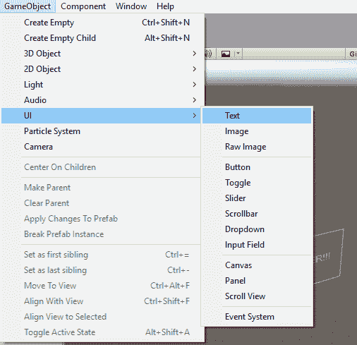

您可以创建三种基本 UI 元素：文本、图像和原始图像。

菜单中的 Text 选项是一个基本的文本元素，用于显示类似分数、健康、能量等的文本。因此，就像任何文本元素一样，您可以指定文本高度和字体，例如粗体或斜体。当您创建一个新的文本元素时，为每个添加的文本元素添加了 Canvas、Text 和 EventSystem 等选项：

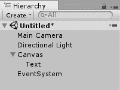

当创建一个新的文本 UI 元素时，它默认放置在中心，默认文本为“New Text”，如下面的截图所示：

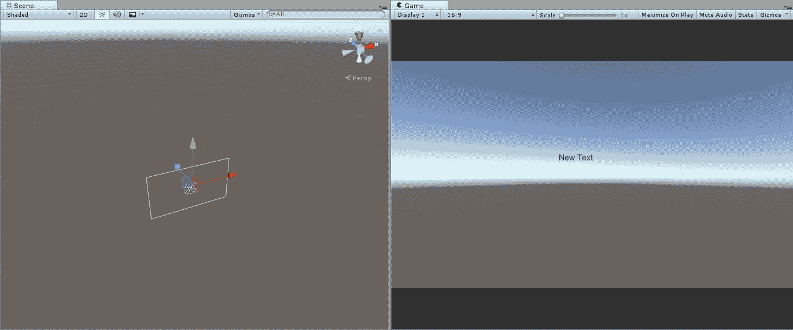

菜单中的 Canvas 选项表示文本组件在场景中的位置，并负责将文本渲染到场景中。也可以通过右键单击它直接向画布元素添加组件。您还可以向其中添加空游戏对象：

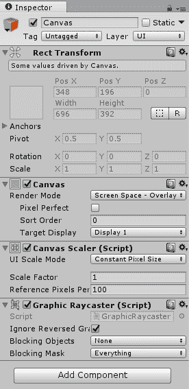

Canvas 由三个脚本组成：Canvas、Canvas Scalar 和 Graphics Ray Caster。

默认情况下，画布设置为 ScreenSpace Overlay。还有 ScreenSpace Camera 和 World Space 选项。在 ScreenSpace Overlay 中，文本将置于场景中的所有内容之上，无论摄像头是否聚焦。这在传统游戏中使用，其中 UI 需要位于游戏之上。

如果您想要根据所选的摄像头来使用不同的用户界面，您可以使用 ScreenSpace Camera，然后可以为不同的摄像头附加不同的用户界面。要在不同的用户界面之间导航，您需要在两个用户界面对应的摄像头之间来回切换。

在世界空间中，画布是根据世界位置放置的。因此，您可以在 3D 空间中放置按钮或文本，并相应地定位它们。您还可以移动、旋转和缩放文本。用户仍然能够导航和使用 UI 元素。这为放置 UI 元素提供了在 3D 空间中任意位置的绝对自由。

如果您希望文本对齐到像素网格，可以选择 Pixel Perfect 选项。Canvas Scalar 会根据分辨率放大或缩小文本。默认情况下，它设置为常量像素大小。您也可以将其设置为与屏幕大小成比例或常量物理大小。

Graphics RayCaster 脚本负责从键盘、鼠标或触摸获取输入。如果移除，UI 元素将不再接受鼠标点击和键盘事件。

讨论事件系统选项时，让我们看看事件系统组件。

还创建了一个 EventSystem。事件系统处理来自鼠标、键盘和控制器的事件。如果您想在某些事件在鼠标点击时触发，这里将指定：

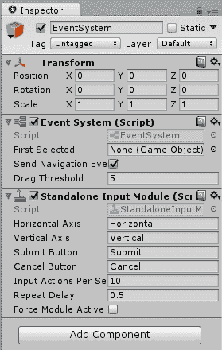

每次您创建一个新的 UI 组件和新的 Canvas 时，EventSystem 也会自动创建。选择文本，这样我们就可以详细查看组件：

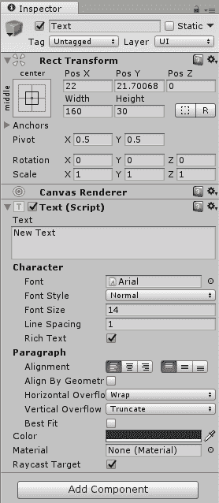

UI 游戏对象就像任何其他游戏对象一样，但与它们不同的是，它有一个`RectTransform`而不是常规变换，有一个 Canvas Renderer，并且还附加了一个文本（脚本）选项。

Rect Transform 由不同的属性组成。其中重要的是位置；

其他的是宽度和高度。这些取决于我们的锚点如何设置。默认情况下，Rect Transform 设置为居中和中心。您可以点击锚点选项来更改预设：

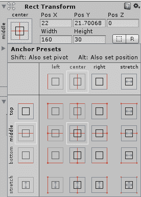

更改锚点预设也会影响场景中按钮或文本的 X 和 Y 位置。锚点也可以根据您的需求手动更改：

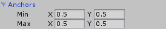

接下来，我们将讨论枢轴字段。枢轴是 UI 将围绕其旋转的位置。然后，还有旋转和缩放字段，它们与其他变换对象类似。

现在，让我们看看文本脚本。文本脚本有一个文本框。这就是您可以输入要在场景中显示的任何文本的地方。

之后，是角色部分。在这里，您可以更改角色的属性。您可以更改字体、字体样式--即如果您想要正常、粗体或斜体；字体大小--以及行间距。请注意，Unity 不允许您设置字符的水平间距。

段落部分允许您控制段落本身的位置、颜色和材质。您可以居中对齐段落，设置水平和垂直溢出，或设置为最佳拟合。

如果您添加一个图像 UI 元素，Canvas 和 EventSystem 会保持不变，但图像本身具有通常的 Rect Transform 和 Canvas Renderer 属性。代替文本（脚本），有一个图像（脚本）被添加：

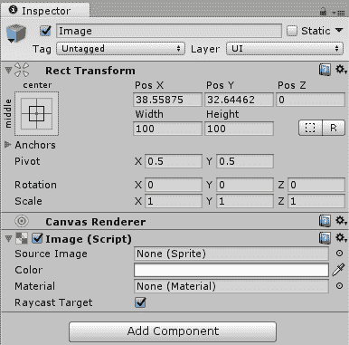

图像（脚本）包含较少的对象。我们有源图像选项，其中您可以指定要显示的图像。您还可以更改图像的颜色或材质。

在有了所有这些信息之后，让我们添加玩家和敌人文本，以及一个游戏结束文本覆盖层，该覆盖层将在游戏结束后出现。

# 添加健康和游戏结束的 GUI

在游戏场景中，添加三个文本并分别命名为`enemyHealthText`、`playerHealthText`和`gameOverText`。

敌人生命值文本（enemyHealthText）的位置，如以下截图所示，锚点位于中心，字体高度设置为 32。其余的设置为默认：

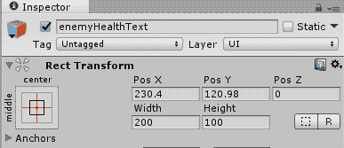

玩家生命值文本（playerHealthText）被设置在以下截图所示的位置，文本高度更改为 32：

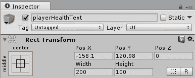

敌人的文本颜色已更改为蓝色，玩家的文本颜色为红色。游戏结束文本（gameoverText）被设置为画布的中间，文本高度设置为 75，颜色设置为漂亮的紫色，以便易于识别。

在文本字段中添加文本 GAME OVER!!!，如下截图所示：

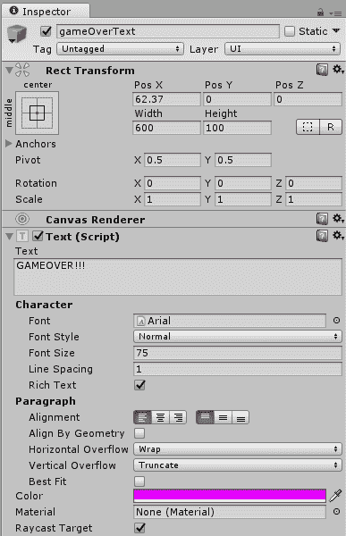

我们还没有看到的是如何通过代码控制文本。让我们看看接下来如何做到这一点。

在 gameScript 脚本中，添加三个类型为`Text`的公共变量，如下代码片段所示。这将保存从`Text` UI 元素创建的文本对象：

```kt
    public Text enemyTextInstance; 
    public Text playerTextInstance; 
    public Text gameOverText;  

```

你还需要在类的顶部添加 UI 命名空间，以便它能够正常工作，因此请在类的顶部添加以下行：

```kt
    using UnityEngine.UI; 

```

接下来，在`Update`函数中，在我们从敌人和玩家获取生命值之后，将值分配给新创建的文本变量，如下所示：

```kt
    int playerHealth = pScript.health; 
    int enemyHealth = eScript.health; 

    enemyTextInstance.text = "Health: " + enemyHealth.ToString(); 
    playerTextInstance.text = "Health: " + playerHealth.ToString(); 

```

在`MainCamera`上，其中附加了`gameScript`，确保你将敌人生命值文本（Text）、玩家生命值文本（Text）和游戏结束文本（Text）从层次结构拖放到脚本组件上，如下截图所示：

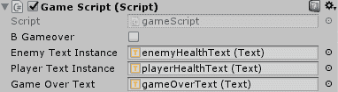

最后，为了确保游戏结束文本仅在游戏结束时出现，在 gameScript 的 start 函数中禁用`gameOverText`，如下代码所示：

```kt
    gameOverText.enabled = false; 

```

在`Update`函数中，一旦将`bGameover`布尔变量设置为`true`，启用`gameOverText`，如下代码所示：

```kt
    gameOverText.enabled = true; 

```

现在，如果你运行游戏，你会看到分数正在更新：

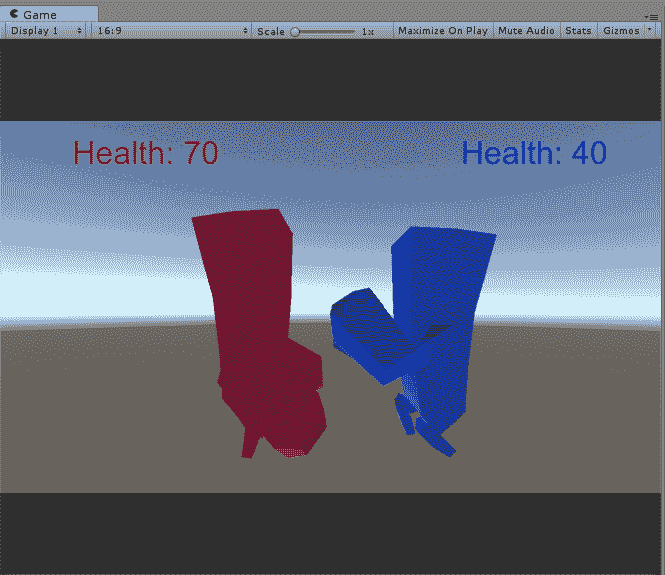

游戏结束后，你将看到游戏结束文本叠加：

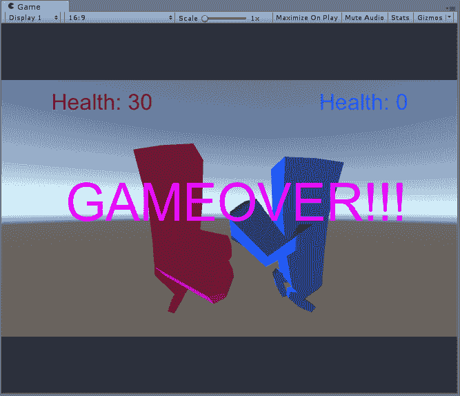

现在我们已经完成了游戏玩法，让我们使用粒子效果为场景添加一些效果。

# 粒子效果简介

粒子效果是游戏体验的重要组成部分；它们为游戏增添氛围，或让我们知道即将发生或正在发生某些特别的事情。我们以尘埃、云、雨的形式看到粒子，也在游戏结束时的庆祝活动中看到。它们可以真正地成为你计划制作的一切。为了我们游戏的目的，我们将在游戏结束时添加纸屑。

Unity 中的粒子系统也是一个游戏对象，因此要创建粒子系统，请转到 GameObject 菜单并选择粒子系统选项：

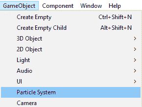

按下键盘上的 *F* 键以突出显示粒子系统选项，因为它可能是在远离主相机的地方创建的。在我的例子中，它是在 900，300 和 -26 处创建的。不用担心粒子的定位。当我们想要粒子在最后被生成时，我们将手动更改其位置。

一旦你放大粒子系统，你会看到一个圆锥形，并看到粒子从形状中出来。圆锥指定了发射器的形状，而白色的粒子是实际从粒子系统中发射出来的粒子。这由以下截图表示：

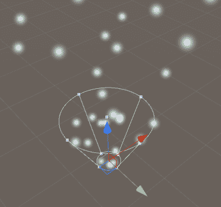

就像任何游戏对象一样，你也会看到三个箭头，这些箭头让你能够定位粒子系统。你还需要按下 *Q*、*W* 和 *E* 键来分别定位、旋转和缩放发射器的大小。

一旦你在层次结构中选择粒子系统，它将显示粒子在场景中是如何创建的。如果你选择其他对象或取消选择粒子系统，动画将停止。因此，如果你想预览粒子是如何创建的，那么请在层次结构中选择粒子系统以预览其效果。

让我们看看你可以在粒子系统的检查器面板中修改的一些重要参数：

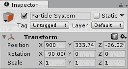

就像所有其他游戏对象一样，你可以定位、旋转和缩放粒子系统，第一组参数如下所示。这些参数控制粒子最初是如何创建的：

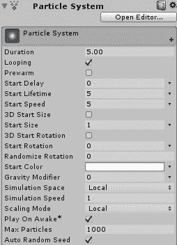

这里给出了所有参数的简要描述：

+   持续时间：此参数指定粒子最初创建的持续时间。默认情况下，它设置为 5 秒。目前，由于启用了循环，你不会看到任何区别。如果你禁用循环，那么如果你在层次结构中选择粒子系统，你会看到粒子发射 5 秒后停止。

+   循环：如果你不希望粒子持续生成，则应禁用此选项。因此，如果你想产生粒子爆发，请禁用循环。

+   预热：此参数在场景开始之前加载粒子，这样就不会看起来像粒子是在场景开始时生成的。例如，如果你有一个瀑布粒子系统，当场景加载时，它应该看起来像瀑布在场景加载之前就已经在运行了。如果瀑布是在场景加载后立即开始形成，那么它看起来就不太实际。

+   开始延迟：你可以使用此参数设置粒子在一段时间后形成。目前，粒子在你点击层次结构中的粒子系统后立即开始形成，但如果你想让粒子在点击粒子系统后一秒形成，那么你需要输入 `1.0`，粒子将在你点击粒子系统后一秒形成。

+   开始寿命：每个粒子持续一段时间后从场景中删除。默认情况下，粒子总是设置为在 5 秒后删除。如果您希望粒子在场景中持续更长时间，则可以更改此参数以满足您的需求。

+   开始速度：这是每个粒子的初始速度。默认情况下，这也设置为 5。

+   开始大小：这是粒子的初始大小。默认情况下，它设置为 1。这是在初始大小下创建的粒子对象。如果您创建了更大的粒子并希望将其大小减半，则输入 0.5。

+   开始旋转：如果您希望粒子以创建时的角度生成，则可以在此设置角度。

+   随机化旋转：如果您希望粒子以不同的角度创建，则可以在此指定角度。与开始旋转不同，开始旋转会创建所有粒子以相同的角度，而随机化旋转将为每个粒子创建不同的角度。

+   开始颜色：这指定了每个粒子创建时的初始颜色。默认情况下，它设置为白色。您可以通过单击白色条并指定颜色来更改颜色。

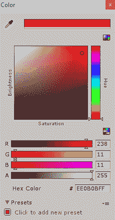

+   重力修改器：这启用了重力。默认情况下，值设置为 0，表示没有重力。如果您将值设置为 1，则已启用最大重力。您还可以将值设置为介于零和一之间的适当重力水平，以满足您的需求。

+   模拟空间：这指定了在每个粒子局部之后所做的所有更改；即，相对于单个粒子的原点。默认情况下，设置为局部。

+   模拟速度：这指定了模拟计算的速度。您可以加快或减慢模拟速度。这对于查看您的粒子系统成熟所需时间的行为非常有用。

+   缩放模式：将其设置为局部。这指定了缩放会影响每个粒子相对于粒子的原点，而不是发射器或世界的原点。

+   在场景开始时播放：粒子系统会在场景开始时立即激活。如果您不希望粒子在场景开始时立即启动，则需要取消选中此参数。

+   最大粒子数：这是场景中一次可以存在的最大粒子数。默认情况下，设置为 1,000。这应该尽可能保持最小，因为它会显着降低游戏性能，因为场景中的粒子越多，所需的渲染调用就越多，每个粒子的计算也越多。

+   自动随机：种子生成一个种子以自动随机化每个粒子的生成和移动。

下一个参数集是可选的，如果您想启用或禁用这些功能，则需要检查和取消选中：

+   发射量：这指定了每秒生成的粒子数量。时间速率选项设置为 10，意味着在 1 秒内生成 10 个粒子。如果您将其设置为 1，那么您将每秒看到 1 个粒子。距离速率选项仅在启用世界空间模拟时生效。在爆发模式中，您可以根据最初设置的持续时间创建粒子爆发。因此，在此处，当您点击加号图标时，它将每 5 秒生成 30 个粒子：

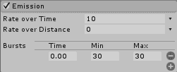

+   形状：这指定了粒子系统的形状。默认情况下，它设置为圆锥形。由于粒子系统的形状是圆锥形，您可以看到粒子从指定的形状中生成并向上移动。如果您想让粒子向所有方向扩散，则可以指定球体。您还可以选择盒子、网格、圆形和边缘。通过选择网格，您可以指定一个特定的网格，并让粒子从该指定的网格形状生成。

+   还有其他参数，例如角度、半径。

+   发射位置：这指定了粒子将从哪里生成，例如基础、基础壳体、体积和体积壳体。

+   您还可以随机化方向或对齐到特定方向：

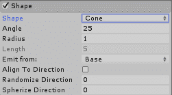

+   生命周期内速度：如果您想改变速度随时间变化，则可以在此处指定。如果没有指定，则速度将保持恒定，并且将与最初设置的速度相同。

+   生命周期内限制速度：这可以限制粒子的速度，使得一旦粒子在生命周期内达到特定的速度，它将被设置为该速度，或者随着时间的推移缓慢地降低到初始设置的速度。

+   继承速度：这根据发射器的速度来控制粒子的速度。发射器移动得越快，粒子就移动得越快。

+   生命周期内力：这设置了每个粒子在生命周期内的力。因此，如果这个值被设置，粒子将在一段时间内移动得更快。

+   生命周期内着色：每个粒子的颜色可以根据其生成的时间进行更改。

+   根据速度着色：每个粒子的颜色由粒子自身的速度指定。

类似地，我们还有大小和旋转，这些由它们在其生命周期中的阶段或移动速度控制：

+   外部力：您可以通过改变外部力的乘数来模拟对粒子施加的外部力，例如风的情况。

+   噪声：您还可以使用噪声生成随机性，这将使用类似 Perlin 噪声的纹理来创建粒子的随机运动和行为：

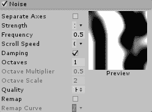

+   碰撞：到目前为止，粒子不会对场景中的其他对象做出反应，所以如果你在粒子前面放置一个对象，粒子就会穿过该对象。当你启用碰撞时，粒子会与对象碰撞而不是穿过它：

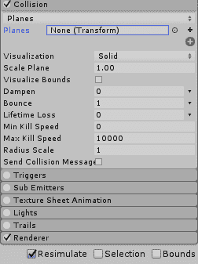

+   触发器：如果触发器选项设置被打开，粒子也可以用作触发器：

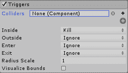

+   子发射器：当你启用子发射器选项时，每个粒子也可以发射对象。此外，每个粒子也会发射其他粒子。

+   纹理表动画：除了静态图像外，你还可以指定一个纹理表，以便每个粒子可以动画化，而不是显示静态图像：

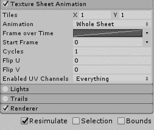

+   光源和尾迹：每个粒子也可以附加光源和尾迹，使场景更加引人注目和美观。

+   渲染器：这指定了许多参数，例如粒子本身的形状，是否需要是广告牌或网格。因此，在网格中，你可以指定 3D 对象，如盒子、球体、圆锥体，以及粒子的法向和材质。

你可以指定排序模式、最小和最大粒子大小、对齐和中心点。每个粒子以及接收阴影的投射都有光探针、反射光探针等：

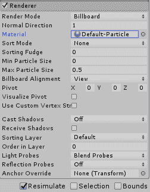

# 创建五彩纸屑粒子效果

对于五彩纸屑，我们像往常一样创建一个粒子系统。对于初始值，我们将位置保持在 0,0,-7.5。对于旋转和缩放值，我们保持默认设置。

我们将持续时间保持在 4，并取消选中“循环”选项，因为我们不希望五彩纸屑反复创建。起始延迟设置为 0。

起始速度设置为 5，3D 起始大小在`X`、`Y`和`Z`方向上设置为 0.25。3D 起始旋转选项被禁用。起始旋转和随机旋转设置为 0。

起始颜色设置为在两种颜色之间随机，红色和蓝色。重力乘数设置为 0.125，我们希望五彩纸屑在达到最大高度后开始下落。

其余的初始值都设置为默认值：

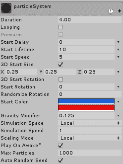

持续时间设置为 20，形状设置为圆锥形。

为了使五彩纸屑更加多彩，并且随时间改变颜色，将“生命周期中的颜色”更改为所需颜色。因此，根据需要更改它。颜色随速度参数也以类似方式更改。两者都设置为“在两个渐变之间随机”。

随时间变化的大小被更改，以便粒子的尺寸随时间变化。大小设置为曲线，这样粒子在生命周期开始时较小，然后在生命周期结束时变为全尺寸。

曲线的形状如下截图所示：

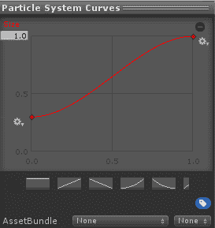

生命周期中的旋转和速度旋转选项设置为 45，这样粒子在创建后会在空中旋转一次：

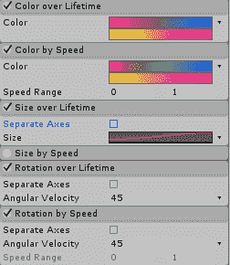

对于渲染器，我想将 3D 对象作为粒子，所以我选择了 Mesh，对于 Mesh，我通过点击底部的+号选择了 Cube、Cylinder 和 Sphere。其余的值保持默认：

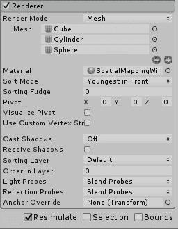

现在，我们的粒子系统已经创建。我们将在`Assets`文件夹中创建一个预制件对象，并将粒子系统拖放到其中，以便在游戏结束时实例化预制件。将预制件命名为 particleSystem。你会注意到，一旦将粒子系统拖放到预制件中，它就会变成蓝色，如下面的截图所示。现在，从层次结构中删除粒子系统：

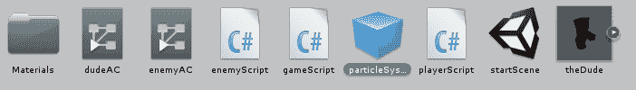

接下来在 gameScript 中，在顶部创建一个新的`GameObject`，命名为`particlePrefab`，并将变量设置为`public`，如下面的代码所示：

```kt
    public GameObject particlePrefab; 

```

在`Update`函数中，在将`gameover`布尔变量设置为实例化粒子预制件之后：

```kt
    if (playerHealth<= 0 || enemyHealth<= 0) { 
        bGameover = true; 
        gameOverText.enabled = true; 
 Instantiate(particlePrefab); 
        Debug.Log(" +++++ GAMEOVER +++++"); 
    } 

```

不要忘记将 particleSystem 预制件拖放到 MainCamera 附加的游戏脚本组件中的 Particle Prefab 上：

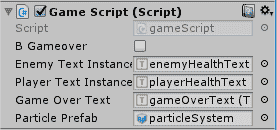

现在，当你运行游戏并且游戏结束时，你将有一个漂亮的纸屑粒子系统：

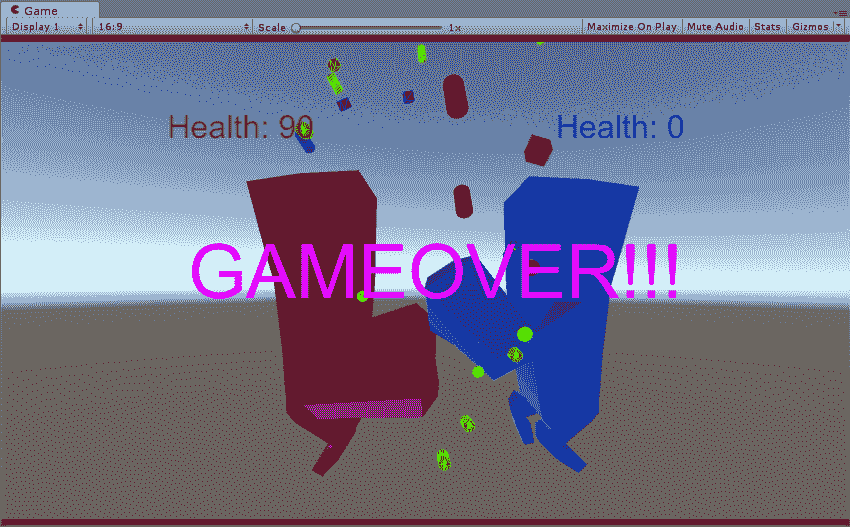

# 摘要

在本章中，我们学习了如何添加一个 GUI 元素来显示玩家和敌人的生命值，并且添加了游戏结束文本，以便我们知道游戏已经结束。我们还添加了一个非常基础的粒子系统，只是为了展示添加粒子的能力。你可以进入并更改粒子系统，看看还能做些什么。

游戏玩法已经结束，接下来我们可以看看如何将场景添加到游戏中，因此我们将创建一个主菜单场景，它将在游戏开始时显示。我们还将了解如何添加按钮，以便在点击播放按钮时，场景将切换到游戏玩法场景。
