# GameScene 和 SceneFlow

到目前为止，我们只处理了 startScene，但在本章中，我们将看到如何向游戏中添加其他场景，并且我们需要一个 MainMenu 场景，从这里我们可以进入其他场景，如选项或成就场景。

每个场景都将有特定的游戏对象和按钮，这将使我们能够更改设置或按钮，这些按钮可以带我们回到 MainMenu 场景。

MainMenu 场景还需要一个播放按钮，该按钮应链接到 startScene，而 startScene 负责启动游戏。

显然，我们可以根据游戏需求添加更多场景和菜单。

让我们先看看如何向 startScene 添加按钮，这样在游戏结束时我们就可以重新启动游戏。

本章包括以下主题：

+   按钮简介

+   组织项目文件夹结构

+   向 startScene 添加游戏重启按钮

+   向 startScene 添加暂停按钮

+   向 startScene 添加一个 MainMenu 按钮

+   创建一个 MainMenu 场景

+   添加一个选项场景

+   添加一个成就场景

# 向 startScene 添加按钮

在上一章中，我们学习了如何向场景中添加文本。然而，我们也可以向场景中添加按钮。按钮的创建过程与创建文本 UI 的过程相同。前往 GameObjects | UI | Button：

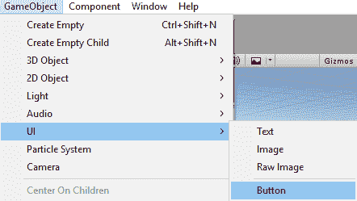

场景中将会创建一个按钮，如下面的截图所示：

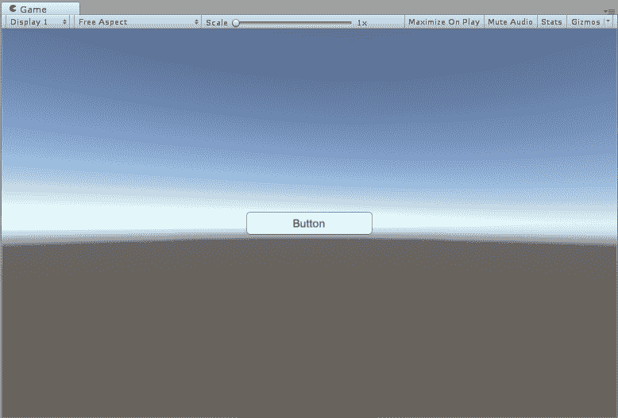

一个按钮将包含 Canvas、Button 和 Text 组件。如果你在一个已经存在 Canvas 组件的场景中创建按钮，它将直接使用当前 Canvas 并在其下方创建按钮。

我们有上一章中的 Canvas 组件。在 Hierarchy 窗口中点击按钮。

按钮包含 Rect Transform、Canvas Renderer、Image（脚本）和 Button（脚本）组件。我们已经遇到了 Rect Transform 和 Canvas Renderer：

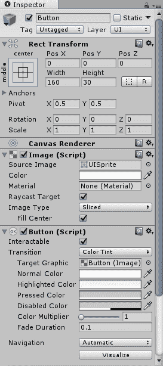

你可以在 Image（脚本）组件中指定按钮的图像。要设置图像，你需要导入一个图像并将其转换为 Sprite 类型。你只能在将图像分配给 Sprite 类型后将其分配给源图像。

+   颜色：你可以指定按钮颜色；否则，你可以将默认颜色设置为白色。

+   材质：如果你想要分配一个特定的纹理，可以在这里完成。

+   Raycast Target：这允许目标可点击。

+   图像类型：你可以使用原始图像，或者将其更改为平铺。

在按钮（脚本）部分的下一次，我们可以指定按钮在被点击后应该执行的操作。通过点击交互选项，我们指定按钮在被高亮、按下或禁用时将变为其他内容。

按钮被点击后改变的速度由 Fade Duration 参数指定。

文本（脚本）指定是否需要显示任何文本。如果文本是合适的，你可以在文本框中指定文本。否则，你可以将其留空。通常，最好有标准且易于理解的按钮：

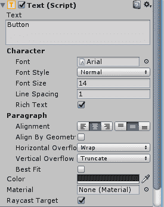

# 组织文件夹结构

在本章的`resources`文件夹中，你会看到一些按钮的图像。将按钮拖放到名为`buttons`的文件夹中。

这也是开始组织你的文件夹的好时机。为了方便和个人精神健康，最好将资产放入文件夹：


我已经创建了以下文件夹结构的文件夹：

+   3dAssets: 包含玩家 FBX，你也可以添加其他 3D 对象，如 3D 环境，和 3D 网格。

+   动画控制器：我已经在这里放置了动画控制器。当你有很多敌人时，你可能需要为每个敌人分别创建单独的动画控制器，因此最好也为每个控制器创建一个单独的控制器。

+   按钮：按钮的精灵可以放入这里。

+   字体：虽然 Arial 是一种美丽的字体，但你可能想要选择一个更适合你游戏的字体。因此，创建一个文件夹来存放这些字体。

+   材质：再次强调，更多的对象意味着更多的材质，因此要组织好！

+   预制体：将所有预制体放入单独的文件夹，以便更容易访问。

+   场景：场景是在创建游戏时最常访问的文件，因此将它们保存在单独的文件夹中以便于访问。

+   脚本：随着时间的推移，你可能需要为不同的事情编写很多脚本，因此也为这些创建单独的文件夹。

当你打开按钮文件夹时，它看起来如下截图所示：


按钮图像的右侧边缘都有一个小箭头。这是因为它们已经被转换为精灵类型。要将图像转换为精灵，请选择图像并在检查器面板中，将纹理类型字段更改为精灵（2D 和 UI）选项：

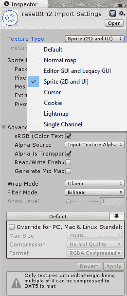

为按钮文件夹中的所有按钮执行相同的操作。

# 在 startScene 中添加游戏重启按钮

现在在 startScene 中创建一个新的按钮，并将其重命名为 resetBtn，如下截图所示：

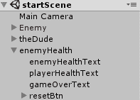

在检查器面板中，在源图像字段下，选择 resetBtn2 精灵类型：


将其余参数保持不变。你还会在检查器面板中看到重置按钮的预览以及其尺寸：

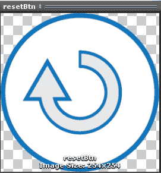

将按钮定位在 GAMEOVER!!!文本的正下方和右侧。通过这种方式，我们将使其对玩家的拇指可访问：

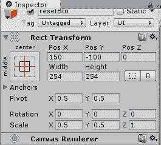

一旦定位，在游戏中应该看起来如下：

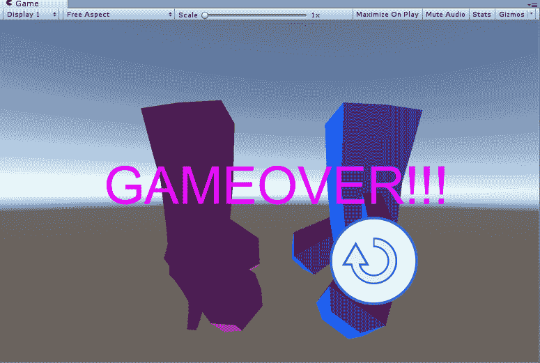

现在我们必须创建一个小脚本，以便当按钮被点击时，调用 startScene。为此，创建一个新的脚本，命名为 buttonClick，并将其保存在`Scripts`文件夹中。在脚本内部添加以下行：

```kt
    using System.Collections; 
    using System.Collections.Generic; 
    using UnityEngine; 
    using UnityEngine.SceneManagement; 

    public class buttonClick : MonoBehaviour { 
        public void onButtonClick(string level) { 
            SceneManager.LoadScene(level); 
        } 
    } 

```

`SceneManager.LoadScene`函数负责在 Unity 中加载场景。

当按钮被点击时，我们将选择`OnButtonClick`函数，然后传入要加载的场景名称，这个字符串将被传递给`LoadScene`函数，该函数将加载场景本身。

现在通过 GameObject| CreateEmpty 创建一个空的游戏对象。将其命名为 buttonClickGo。这个游戏对象在场景中的位置无关紧要。现在将`buttonClick`脚本添加到这个游戏对象中，如下截图所示：

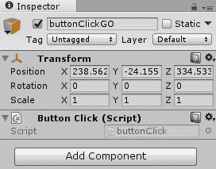

在层次结构中选择`resetBtn`。在按钮的检查器面板中，您将在 Button (Script)部分下方看到一个 On Click ()部分：


在第一个下拉菜单中，选择 Editor 和 Runtime 选项，以便在运行时可以在编辑器中调用该函数。

接下来，从下拉列表中选择 buttonClickGO 游戏对象，如下截图所示：

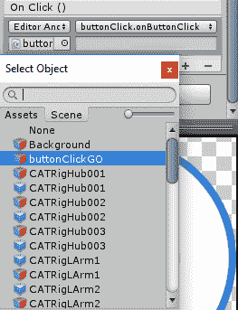

然后，从下拉列表中选择`buttonClick.onButtonClick`函数。这位于 ButtonClick | onButtonClick (string)：


现在，输入字符串作为将被调用的场景名称--在这种情况下，我们想要调用 startScene：


我们仍然需要在游戏结束前隐藏重置按钮。因此，在`gameScript`中创建一个公共的`Button`类型，命名为`resetButton`，如下所示：

```kt
    public Text enemyTextInstance; 
    public Text playerTextInstance; 
    public Text gameOverText; 
 public Button resetButton;

```

接下来，在`Start`函数中，我们将活动属性设置为`false`：

```kt
    void Start () {  
        GameObject player = GameObject.Find("theDude"); 
        pScript = player.GetComponent<playerScript>(); 

        GameObject enemy = GameObject.Find("Enemy"); 
        eScript = enemy.GetComponent<enemyScript>(); 
        gameOverText.enabled = false; 

        resetButton.gameObject.SetActive(false); 
    } 

```

这将确保重置按钮最初不可见。最后，一旦游戏结束，将`SetActive`函数再次设置为`true`：

```kt
    if (playerHealth <= 0 || enemyHealth <= 0) { 
        bGameover = true; 
        gameOverText.enabled = true; 
 resetButton.gameObject.SetActive(true); 

        Instantiate(particlePrefab); 
    }  

```

为了让 Unity 加载您想要的场景，您需要在构建设置选项中的 Scenes In Build 列表中添加它。因此，转到 File | Build Settings 并点击底部的 Add Open Scenes 按钮，如下截图所示：

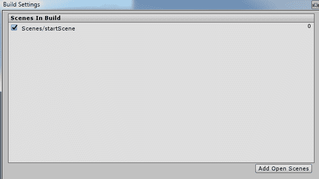

一旦场景被添加，关闭窗口。现在运行游戏，一旦游戏结束，您可以按重置按钮，游戏将重新开始。

# 在 startScene 中添加暂停按钮

由于我们处于 startScene，让我们添加另一种类型的按钮，称为*切换*按钮，用于暂停或恢复游戏。

前往 GameObject | UI 创建一个新的切换按钮。创建后，将其定位在游戏屏幕的右上角。将按钮重命名为 pauseBtn。

如同其他按钮和 UI 元素一样，它有一个 Rect Transform 部分，可以用来定位按钮：

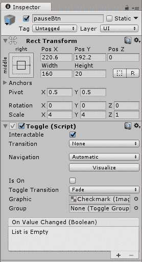

它还有一个 Toggle (Script)，可以设置为默认值。选择 Background 选项卡，以选择用于按钮的背景图像。

在背景下的图像（脚本）中，选择 pauseBtnOff 精灵类型作为背景图像：

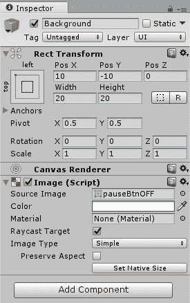

对于任何文本脚本，还有一个标签页，您可以将其留空，因为我们只会使用图像。

每次点击按钮时，它都会在暂停图像上创建一个勾选标记，以指定按钮已被切换。如果您再次点击它，它将恢复到正常图像。

现在，在`gameScript`文件中，我们创建一个名为`pauseButton`的公共变量，类型为`toggle`，并创建一个名为`bIsGamePaused`的`public`布尔变量，并将其初始化为`false`。我们将使用这个新创建的布尔变量来遍历玩家和 AI 更新循环。

因此，在`gameScript`中添加以下代码：

```kt
    public Text gameOverText; 
    public Button resetButton; 
 public Toggle pauseButton; public bool bIsGamePaused = false;

```

接下来，在`Update`函数中，将`bIsGamePaused`的值设置为`pauseButtons.isOn`变量的值。这将根据您是否点击了暂停按钮将值设置为`true`或`false`。

`Update`函数将如下所示：

```kt
    void Update () {     
        if (!bGameover) { 
 bIsGamePaused = pauseButton.isOn; 

            Debug.Log("isGamePaused: " + bIsGamePaused);        

            int playerHealth = pScript.health; 
            int enemyHealth = eScript.health; 

            // other code 
        } 
    } 

```

接下来，在`enemyScript`中，将`Update`函数括起来，并检查`bIsGamePaused`是否为`false`，方式与我们检查游戏是否结束类似：

```kt
    void Update () {    
        gameScript gScript = mainCamera.GetComponent<gameScript>(); 

        if (gScript.bGameover == false) 
        { 
            if (gScript.bIsGamePaused == false) 
            {
                punchTick--; 
                myTick++; 
                currentTick = myTick; 

                GameObject player = GameObject.Find("theDude"); 
                Animator pAnim = player.GetComponent<Animator>(); 
                playerScript pScript = player.GetComponent <playerScript>(); 

                // Other game code 
            } 
        } 
    } 

```

在`playerScript`中也进行相同的操作：

```kt
    void Update () { 
        gameScript gScript = mainCamera.GetComponent<gameScript>(); 

        if (gScript.bGameover == false) 
        { 
            if (gScript.bIsGamePaused == false) 
            { 
                totalTime += Time.deltaTime; 

                GameObject enemy = GameObject.Find("Enemy"); 
                Animator eAnim = enemy.GetComponent<Animator>(); 
                enemyScript eScript = enemy.GetComponent
                                      <enemyScript>(); 

                // other game code 
            } 
        } 
    } 

```

现在，当您运行游戏时，您可以通过轻触暂停按钮来暂停游戏。

在`mainCamera`中不要忘记将`toggleBtn`分配给`gameScript`脚本，因为它期望它与您附加`resetBtn`的方式相似：

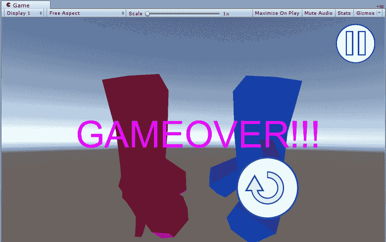

# 在`startScene`中添加主菜单按钮

我们将创建一个主菜单按钮，以便在选中时可以按下它进入`MainMenu`场景。为此，我们将创建一个新的按钮并将其命名为`mainMenuBtn`。将`mainMenuBtn`定位在屏幕中间的左侧。

还需要在图像（脚本）部分选择 homeBtn2 选项作为源图像；并将其余值设置为默认值：


与重置按钮一样，我们只能在游戏结束后显示主菜单按钮。因此，在`gameScript`中创建一个新的公共变量，名为`mainMenuButton`，如下所示：

```kt
    public Button resetButton; 
 public Button mainMenuButton; 
    public Toggle pauseButton; 

```

在`Start`函数中将`mainMenuButton`的激活状态设置为`false`：

```kt
    // Use this for initialization
    void Start () { 

        GameObject player = GameObject.Find("theDude"); 
        pScript = player.GetComponent<playerScript>(); 

        GameObject enemy = GameObject.Find("Enemy"); 
        eScript = enemy.GetComponent<enemyScript>(); 
        gameOverText.enabled = false; 

        resetButton.gameObject.SetActive(false); 
 mainMenuButton.gameObject.SetActive(false); 
    } 

```

当游戏结束时，将激活状态设置为`true`。

```kt
    if (playerHealth <= 0 || enemyHealth <= 0) { 
        bGameover = true; 

        gameOverText.enabled = true; 
        resetButton.gameObject.SetActive(true); 
 mainMenuButton.gameObject.SetActive(true); 

        Instantiate(particlePrefab); 
        Debug.Log(" +++++ GAMEOVER +++++"); 
    } 

```

接下来，在`mainMenu`按钮对象中，转到按钮（脚本）标签，并在`On Click ()`标签中设置，以便在按钮被点击时调用`mainMenuScene`：


现在，`mainMenuScene`尚未创建，因此我们将创建一个`mainMenuScene`。

# 创建`MainMenu`场景

在项目标签页中的场景文件夹中，右键单击并创建一个新场景：

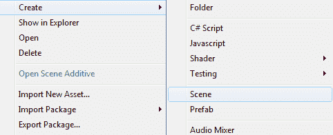

将场景命名为`mainMenuScene`。现在您将在项目的场景文件夹中有两个场景：

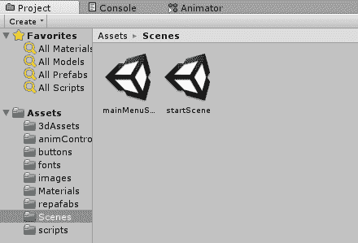

双击`mainMenuScene`场景并打开它。这是一个新的空场景，因此我们现在将开始填充这个场景。

首先，我们将添加一个背景图片。转到 GameObject-> UI 创建一个 Image。它将创建一个新的画布和一个图片。保留画布值设置为默认值。

接下来，将图片重命名为`bgImage`。选择`scenary-ipad`文件作为背景图片，并点击设置原生大小选项，以便图片被调整大小。

接下来，在 titleText 中，我们可以添加游戏名称，我们将称之为 PunchyPunch。在文本框中，将文本重命名为 PunchyPunch。将字体从 Arial 更改为也是一个好主意。在`Resources`文件夹的此章节中，你可以找到一个 duncecapbb 字体。将字体复制并粘贴到`Assets/fonts`文件夹中。在 Character 部分，在 Font 选项中，选择 duncecapbb_re 作为字体。

最后，更改颜色，使其成为浅蓝色色调：

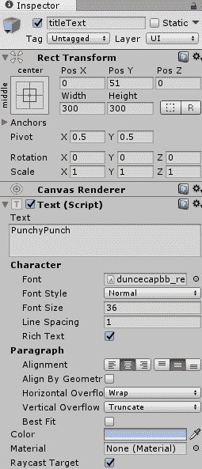

在这些添加之后，MainMenu 场景应该开始成形，看起来如下所示：


保存此场景。

接下来，为了确保在 startScene 中点击 mainMenuBtn 按钮时调用 mainMenuScene，我们必须将这些场景添加到构建设置中，因此通过进入文件并点击添加打开场景打开构建设置菜单：

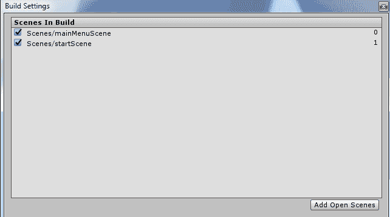

现在，打开 startScene 并点击播放按钮。一旦游戏结束，mainMenuBtn 按钮将出现。点击它，应该加载 MainMenu 场景。

现在，让我们向 mainScene 添加一个播放按钮，该按钮将调用 startScene。因此，再次打开 mainMenuScene。

前往 GameObject | UI 创建一个按钮。将此按钮命名为`playBtn`。它将在当前画布下创建。

将播放按钮放置在屏幕中心。在 Image (Script)中，对于 Source Image 字段，选择 playBtn_normal 选项。在 Button (Script)部分，选择 Sprite Swap 选项的 Transition type 字段。我们将交换图片以显示按钮被按下。

在目标图形字段中选择 platBtn (Image)；在突出显示精灵字段中选择 playBtn_normal；在按下精灵字段中选择 playBtn_pressed；在禁用精灵字段中选择 playBtn_normal（或者你也可以留空，因为我们永远不会禁用此按钮）：

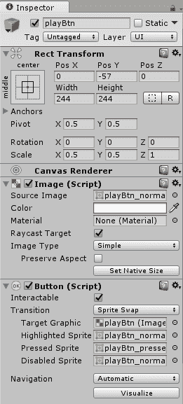

在添加播放按钮后，主菜单场景应该看起来如下所示：

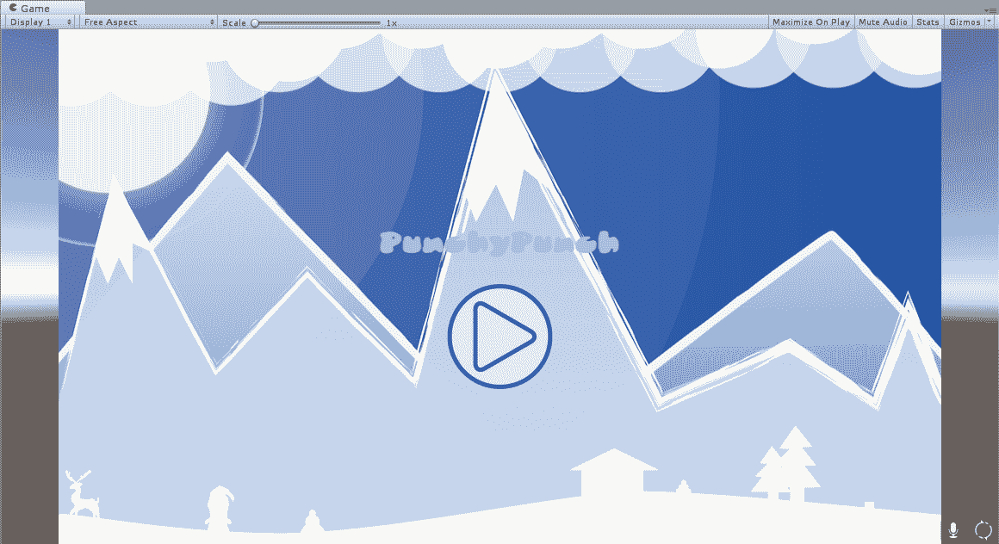

要使按钮交互式，我们必须创建一个空对象并将`buttonClick`脚本附加到它上。因此，创建一个空对象，命名为`buttonClickGO`，并将`buttonClick`脚本附加到它上。

现在，在`playBtn`游戏对象的 OnClick()部分，选择 buttonClickGO，调用`onButtonClick`函数，并将 startScene 变量传递给它：


现在，当你点击播放按钮时，它将通过加载 startScene 来加载游戏。

我还创建了一个名为*options*的另一个场景。**选项**场景将包含静音或降低游戏音量的功能。

为了做到这一点，需要在`MainMenu`场景中再添加一个按钮，因为这些场景只能从`MainMenu`场景访问。此外，我们还将添加一个按钮，用于打开成就窗口。按钮图片已提供在资源文件夹中，您可以使用这些图片并将它们放置在`MainMenu`场景的任何位置，如下面的截图所示：

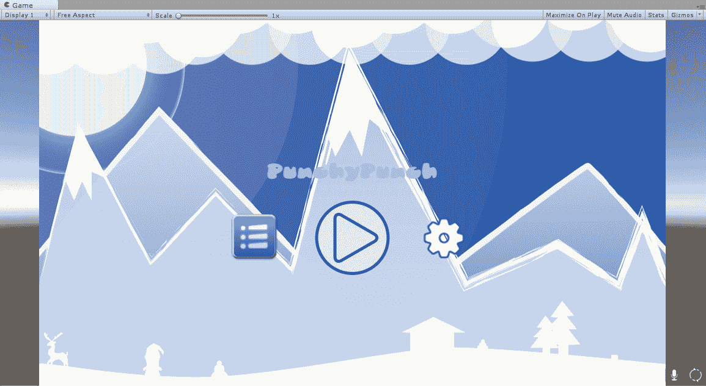

同样的`buttonClickGO`被使用，所以当点击任意一个按钮时，它将带您进入相应的场景。

显然，已经创建了一个场景，名为`optionsScene`。现在`Scenes`项目文件夹应该看起来如下：

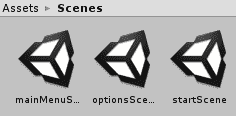

下面是选项场景。目前这里没有什么，但在下一章，当我们添加音频时，我们也将在这里创建一个静音按钮：


# 摘要

在本章中，我们学习了如何通过点击按钮来创建新场景并在场景之间进行切换...字面意义上！我们添加了按钮来启动游戏和在场景之间旅行。

在下一章中，我们将大量使用按钮，我们将看到如何添加成就、应用内购买和集成。几乎所有这些都将包括添加按钮。我们还将了解如何添加不同类型的按钮。
