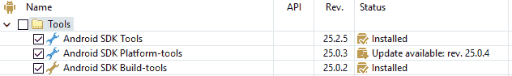
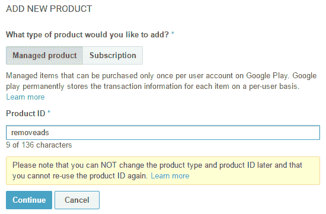
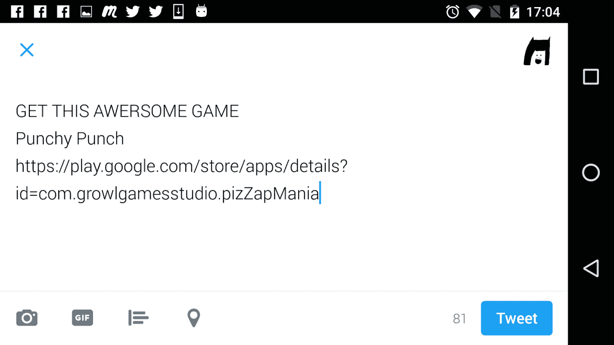

# 第七章：游戏统计数据、社交、内购和广告集成

由于我们已经完成了游戏玩法，现在我们可以看看如何在设备上运行应用程序。我们还介绍了已包含的 Unity Ads 和内购工具。我们还将包括游戏成就，最后，我们将看到如何上传 APK 到应用商店并发布游戏。

本章包括以下主题：

+   在设备/模拟器上运行应用程序

+   Android 开发者控制台

+   添加游戏成就

+   保存游戏统计数据

+   广告集成

+   内购购买

+   添加社交媒体集成

# 在设备/模拟器上运行应用程序

要在设备上运行应用程序，您必须获取 Android SDK 和 Java 开发工具包（JDK），并在 Unity 中设置 SDK 的位置。

让我们先下载 Android SDK。您可以从[`developer.android.com/studio/index.html`](https://developer.android.com/studio/index.html)下载 SDK。滚动到页面底部并下载命令行工具。您也可以下载 Android Studio，但仅当您打算使用 Android Studio 进行开发时，在这种情况下我们并不需要：


为您的操作系统下载它。在我的情况下，我将向您展示如何在 Windows 上操作。

下载完文件夹后，在`C:`驱动器上创建一个新的文件夹，命名为`AndroidSDK`，并将`Tools`文件夹复制进去。在`Tools`文件夹中，右键单击`Android.bat`文件，并以管理员身份运行。

您将看到一个如下所示的界面。在`Tools`文件夹下的包中，您需要通过选择相应的复选框来下载 Android SDK 工具、Android SDK 平台工具和 Android SDK 构建工具，如下所示：



在 Android SDK 版本中，选择运行在您手机上的版本。如果您有 Google Pixel，您可能运行的是 Android 7.1 或 7.0 版本。我有一部 Google Nexus 5 手机，它运行的是 Android 6.0 版本，因此我需要安装它。如果您运行的是较旧的 Android 版本，请检查您的设备需要哪个版本的 SDK：


接下来，您还需要在“额外”文件夹下安装一些东西，这些内容稍后无论如何都是必需的。您需要从列表中检查 Android 支持库、Google Play 服务、Google 仓库和 Google USB 驱动器选项，以连接您的设备并开始安装：


选择所有选项，接受条款，然后点击安装按钮以开始安装：

在安装过程中，我们还可以下载 JDK。要下载 JDK，请访问此链接 [`www.oracle.com/technetwork/java/javase/downloads/jdk8-downloads-2133151.html`](http://www.oracle.com/technetwork/java/javase/downloads/jdk8-downloads-2133151.html) 并下载适用于您的操作系统的版本。


没有必要下载演示和示例。一旦下载，就在默认位置安装它。

你还需要下载 Unity Android 模块。转到文件 | 构建设置，然后在平台部分选择 Android。它将显示*未加载 Android 模块*。点击打开下载页面。点击按钮后，下载应该开始，下载完成后，它应该位于`下载`文件夹中。你也可以从[`download.unity3d.com/download_unity/38b4efef76f0/TargetSupportInstaller/UnitySetup-Android-Support-for-Editor-5.5.0f3.exe`](http://download.unity3d.com/download_unity/38b4efef76f0/TargetSupportInstaller/UnitySetup-Android-Support-for-Editor-5.5.0f3.exe)下载。确保将版本号改为你当前运行的版本。下载完成后，打开 Unity 项目，然后双击 Android 模块以安装所需的包。

现在转到构建设置并选择 Android 平台，然后点击底部的切换平台按钮：


现在，我们必须在 Unity 中设置`AndroidSDK`文件夹和 JDK 的路径。转到编辑菜单，然后在外部工具选项下打开首选项，然后浏览到 SDK 和 JDK 的位置：


Android SDK 的位置在`C:/ AndroidSDK`，而对于 JDK，它位于`C:/Program Files/Java/jdk1.8.0_121`。

现在，我们必须准备 Android 设备，启用设备中的开发者选项模式，并启用 USB 调试。在设备上，转到设置和关于手机，底部你会找到构建号，连续点击七次。然后它会告诉你你现在是一名开发者了：


按下返回键进入开发者选项。启用 USB 调试和保持唤醒选项：


这样就完成了。现在你的设备已经准备好在设备上构建了。

# Android 开发者控制台

现在，为了测试/发布你的游戏或添加成就，你需要将你的应用到 Android 的开发者控制台上传。它有一个一次性费用为 25 美元。一旦支付，你可以发布和测试你想要的任何游戏/应用。

如果你准备好了 Gmail ID，前往[`play.google.com/apps/publish/signup/#`](https://play.google.com/apps/publish/signup/)注册为 Android 开发者。以下窗口将显示：


点击继续支付按钮并准备好你的信用卡。一旦支付完成，你将能够访问开发者控制台。恭喜！你现在是一名 Android 开发者了。

你将看到以下屏幕。我已经在 Android 商店有一些游戏和应用程序，所以你的现有应用程序将显示在这里：


当我们在这里时，让我们创建一个新的应用。点击右上角的+创建应用按钮：


在对话框中，指定游戏的语言和标题。接下来在标题和简短描述字段中指定详细信息，然后点击窗口右上角的保存草稿按钮：


接下来点击左侧的 APK 选项卡，因为我们需要上传 APK 来添加成就：


点击上传您的第一个生产 APK。现在我们必须将 APK 上传到页面：


让我们回到 Unity 并构建 APK，以便我们可以将其上传到开发者控制台。在 Unity 中，转到编辑 | 构建设置，然后点击 PlayerSettings 选项。

在 PlayerSettings 下，在 公司名称 和 产品名称 字段中输入详细信息。现在不用担心图标；我们稍后会添加它们。

在其他设置部分，添加一个捆绑标识符。这通常是公司网站的反序，后面跟着产品名称。添加版本号，为 1.0。捆绑版本代码可以是 1。最后添加应用程序可以支持的最低 Android API 级别。我选择了 Marshmallow，但数字越低越好，这样应用程序就可以被使用较老手机和较老 Android 版本的用户享受：


接下来在发布设置部分，我们需要创建一个新的密钥库。在密钥库密码字段中输入密码，并确认密码。现在点击浏览密钥库按钮，选择您想要存储密钥库的位置。请将其保存在安全的地方，因为您可能稍后需要此文件。

接下来在密钥部分，不要选择未签名的（调试）选项，而是点击它并选择创建新密钥选项：


接下来填写所需的详细信息：


创建一个别名，通常是产品的名称。为密钥创建一个密码，然后确认它。添加您的名字、姓氏、公司地址和公司名称、城市、州和位置国家。

现在选择别名并输入密钥的密码：


现在我们可以创建一个 APK 来上传。转到构建设置并点击构建。它将询问保存 APK 的位置，指定位置和名称。记住位置和名称：


现在回到开发者控制台。将 `build.apk` 文件拖放到“在此处放下您的 APK 文件”或选择文件的位置，或者选择文件。选择文件后，它将开始上传：


现在，如果您转到 ALL APPLICATIONS 页面，您将看到我们的 Punchypunch 应用程序列在列表中：


现在让我们添加一些成就。

# 在游戏中添加成就

在开发者控制台中，点击 GAME SERVICES 选项卡：


在右上角点击 + 添加新游戏。输入游戏名称和类型，然后点击屏幕底部的继续按钮：


点击“成就”标签页，然后点击“添加成就”标签页。您至少需要添加五个成就才能使其工作。


输入一个名称并添加简短描述。在我们的例子中，我将为用户玩游戏次数的成就添加成就。因此，对于第一次、第五次、第五十次、第一百次和第一千次玩游戏，我想要每次都弹出成就：


接下来，添加一个新成就以及以下所有成就：


点击底部的“获取资源”按钮，并在窗口中选择“安卓”标签。现在，复制所有数据：


接着转到“测试”标签页，点击“添加测试者”按钮。在此处输入您将用于登录设备的电子邮件地址：


现在，您已准备好在设备上测试成就。转到 Unity，转到“窗口”|“谷歌播放服务”|“设置”|“安卓设置...”：


在窗口中，让“保存常数的目录”字段设置为`Assets`文件夹。

在“常量类名组件”中输入详细信息，并将从“获取资源”标签页复制的代码粘贴到这里，然后点击屏幕底部的“设置”按钮：


现在当主菜单加载时，我们必须激活谷歌播放服务，并且每当达到一个成就时，我们必须发送一个通知告诉谷歌播放服务该成就已达成。

因此，在项目菜单中打开`MainMenu`场景。在`Project`/`Scripts`文件夹中创建一个名为`MainMenuScript`的新脚本。在脚本中，添加以下代码：

```java
    using System.Collections; 
    using System.Collections.Generic; 
    using UnityEngine; 

    using GooglePlayGames; 
    using UnityEngine.SocialPlatforms; 
    using GooglePlayGames.BasicApi; 

    using UnityEngine.UI; 

    public class mainMenuScript : MonoBehaviour 
    { 
        bool isUserAuthenticated = false; 

        // Use this for initialization 
        void Start(){ 
            PlayGamesPlatform.Activate(); 
            PlayGamesPlatform.DebugLogEnabled = true; 
        } 

        // Update is called once per frame 
        void Update() 
        { 
            if (!isUserAuthenticated){ 
                Social.localUser.Authenticate((bool success) => { 
                    if (success){ 
                        Debug.Log("You've successfully logged in"); 
                        isUserAuthenticated = true; 
                    } else { 
                        Debug.Log("Login failed for some reason"); 
                    } 
                }); 
            } 
        } 
    }  

```

在类顶部添加`GooglePlayGames`、`UnityEngine.SocialPlatform`和`System.Collections.Generic`命名空间。在类中创建一个名为`isUserAthenticated`的布尔值，并将其初始化为`false`。在`Update`函数中，我们将检查用户是否已登录谷歌播放服务；否则，我们将等待用户登录。

我们激活谷歌播放服务并启用调试模式。在`Update`函数中，我们检查用户是否已登录。如果用户已登录，我们将布尔变量更改为`true`，否则我们将注销并说明用户未登录。将此脚本作为组件附加到场景中的`MainCamera`组件。

现在，将您的设备连接到计算机，转到“构建设置”并按“构建和运行”。它将连接到谷歌播放服务，如下面的截图所示：


它将要求您使用电子邮件地址登录：


一旦您登录，它将显示欢迎信息：


现在为了在游戏结束条件下存储实际达成的成就信息，添加以下内容：

```java
if (playerHealth <= 0 || enemyHealth <= 0) { 
    bGameover = true; 

    gameOverText.enabled = true; 
    resetButton.gameObject.SetActive(true); 
    mainMenuButton.gameObject.SetActive(true); 

    Instantiate(particlePrefab); 
    gameplayCount++; 

    if (gameplayCount == 1){ 
        Social.ReportProgress (PunchyPunchAchievements. achievement_played_first_time, 100, (bool sucsess) => { }); 
    } else if (gameplayCount == 5) { 
        Social.ReportProgress (PunchyPunchAchievements. achievement_played_5_times, 100, (bool sucsess) => { }); 
    } else if (gameplayCount == 50) { 
        Social.ReportProgress (PunchyPunchAchievements. achievement_played_50_times, 100, (bool sucsess) => { }); 
    } else if (gameplayCount == 100) { 
        Social.ReportProgress (PunchyPunchAchievements. achievement_played_100_times, 100, (bool sucsess) => { }); 
    } else if (gameplayCount == 1000) {
        Social.ReportProgress (PunchyPunchAchievements. achievement_played_1000_times, 100,(bool sucsess) => { }); 
    } else {
        ...   
    } 
    Debug.Log(" +++++ GAMEOVER +++++"); 
} 

```

在类中添加一个名为`gameplayCount`的全局整数。当游戏结束时，此变量会增加。

根据`gameplayCount`变量的值，执行`if`语句并调用`Social.ProgressReport`函数。它接受三个参数。第一个是存储在创建的类中的成就名称，第二个是进度级别，在这种情况下，当成就完成 100%时我们将调用它，第三个是回调函数。

现在再次构建并运行游戏。现在当你完成游戏时，你将收到你第一次玩游戏的通知。

接下来，我们将打开成就窗口以查看所有成就。在`MainMenu`场景中，我们有一个创建的按钮来显示成就。

在`buttonClick`类中，创建一个名为`openAchievements`的新函数。它创建如下：

```java
    public void openAchievements() { 
        Social.localUser.Authenticate((bool success) => { 
            if (success){ 
                Debug.Log("You've successfully logged in"); 
                Social.ShowAchievementsUI(); 
            } else { 
                Debug.Log("Login failed for some reason"); 
            } 
        });    
    } 

```

`Social.showAchievementsUI()`函数打开成就窗口。现在在成就按钮点击时调用此函数：


再次构建并运行你的项目，然后在主菜单上点击成就按钮，成就窗口将弹出，如下所示：


但这里有一个小问题。游戏只在你玩游戏时记住所有信息；一旦你关闭游戏，它就会忘记信息。现在让我们看看如何将游戏信息存储在设备上。

# 保存游戏统计数据

保存游戏信息实际上非常简单。这种方法适用于所有设备。`PlayerPrefs`函数可以在系统中保存和加载玩家信息。你只需要传递一个键，你将保存和检索数据，以及一个你想要存储的值。

所以在你的`gameScript`中，当你增加`gameplayCount`变量的值并在其后添加以下代码时：

```java
    PlayerPrefs.SetInt("GameplayCount", gameplayCount); 

```

现在`gameplayCount`的值将被保存在`GameplayCount`键中。

要检索信息，你将使用`PlayerPrefs`的`GetInt`函数来获取存储在键中的值。因此，在你增加`gameplayCount`变量之前，添加以下代码：

```java
    int gameplayCount = PlayerPrefs.GetInt("GameplayCount"); 

```

现在系统存储在`GameplayCount`键中的值被检索并存储在一个名为`gameplayCount`的局部变量中。

你现在正在增加这个值，然后将新的值保存在系统中。现在系统将记住你玩游戏的次数。

为了方便起见，我在选项菜单中创建了一个按钮，使用它可以每次按下按钮时将`GameplayCount`键的值重置为`0`：


我还添加了一个主页按钮，这样我就可以回到主菜单。现在让我们看看如何添加广告集成。

# 广告集成

在 Unity 中，使用 Unity Ads 集成广告非常简单。在 Unity 中，转到“窗口”|“服务”，右侧将打开一个新标签页：


在“服务”标签页中，使用你在 Unity 注册时获得的 Unity 登录名和密码登录。

点击创建按钮。这将显示您可用的不同服务：


点击 SERVICES 选项卡：


在右上角翻转开关以启用它。如果游戏针对 13 岁以下的儿童，请点击复选框并点击继续按钮：


选择 Android 作为目标平台，并勾选启用测试模式选项，这样我们可以在发布游戏之前测试它。现在，在`gamescript`类中，在类顶部添加以下代码：

```java
    using UnityEngine.Advertisements;   

```

我们所需要做的就是在我们想要显示广告时调用`ShowAd`函数。我们不希望在玩家有成就时显示广告，因为我们也不希望在显示成就时每次调用`ShowAd`函数的`else`语句中显示广告：

```java
    if (gameplayCount == 1) { 
        Social.ReportProgress (PunchyPunchAchievements. 
        achievement_played_first_time, 100, (bool sucsess) => { }); 
    } 
    else if (gameplayCount == 5) { 
        Social.ReportProgress (PunchyPunchAchievements. 
        achievement_played_5_times, 100, (bool sucsess) => { }); 
    } 
    else if (gameplayCount == 50) { 
        Social.ReportProgress (PunchyPunchAchievements. 
        achievement_played_50_times, 100, (bool sucsess) => { }); 
    }
    else if (gameplayCount == 100) { 
        Social.ReportProgress (PunchyPunchAchievements. 
        achievement_played_100_times, 100, (bool sucsess) => { }); 
    } 
    else if (gameplayCount == 1000) { 
        Social.ReportProgress (PunchyPunchAchievements. 
        achievement_played_1000_times, 100, (bool sucsess) => { }); 
    } else { 
        if (gameplayCount % 3 == 0){ 
            ShowAd(); 
        } 
    }  

```

如果`gameplayCount`能被 3 整除，我们就调用显示广告函数。然后，所有的魔法都在`ShowAd`函数内部发生。

创建`ShowAd`函数如下：

```java
    public void ShowAd() 
    { 
        if (Advertisement.IsReady()) 
        { 
            Advertisement.Show("video", new ShowOptions() { 
                resultCallback = adViewResult}); 
        } 
    }  

```

有时广告可能暂时不可用，可能是在玩游戏或重新启动游戏时广告开始播放。我们不希望这样，所以我们首先检查是否有可显示的广告，因此我们调用`Advertisement.Isready`。

如果有准备好的广告，我们调用`Advertisement.Show`函数，并指定我们想要显示的广告类型，即视频。我们添加一个回调函数，它会告诉我们玩家在观看广告时做了什么，或者广告是否播放过。

因此添加一个名为`adViewResult`的新函数，如下所示：

```java
    public void adViewResult(ShowResult result) { 
        switch (result) { 
            case ShowResult.Finished: 
                Debug.Log(" Player viewed complete Ad"); break; 
            case ShowResult.Skipped: 
                Debug.Log(" Player Skipped Ad "); break; 
            case ShowResult.Failed: 
                Debug.Log("Problem showing Ad "); break;             
        } 
    } 

```

我们检查广告是否播放完毕、跳过或失败。在每种情况下，我们记录信息。构建并运行游戏。现在测试广告应按照我们的代码显示：


让我们看看如何添加应用内购买，这样如果玩家想要禁用广告，他们可以通过购买来禁用广告。

# 应用内购买

在 Unity 的`Services`选项卡中，点击`In-App Purchasing`组件：


再次翻转右上角的开关以启用 IN-APP PURCHASING：


点击导入按钮导入 IAP 库：


接下来，我们创建一个新的类来处理应用内购买；我们将把这个类称为`IAPManager`。

在这里添加以下代码。代码是从 Unity 示例网站复制的，它包含详细且带注释的代码，展示了每个函数的作用。代码可以从[`unity3d.com/learn/tutorials/topics/ads-analytics/integrating-unity-iap-your-game`](https://unity3d.com/learn/tutorials/topics/ads-analytics/integrating-unity-iap-your-game)访问：


代码已被修改以符合我们的目的。由于这是一段较长的代码，我添加了带编号的注释，稍后我会解释：

```java
    using System; 
    using System.Collections.Generic; 
    using UnityEngine; 
    using UnityEngine.Purchasing; 

    public class IAPManager : MonoBehaviour, IStoreListener 
    { 
        public static IAPManager instance { set; get; } 

        private static IStoreController m_StoreController;              
        private static IExtensionProvider m_StoreExtensionProvider;  

        public static string kRemoveAds = "removeads"; // 1 

        void Awake() { 
            instance = this; 
        } 

        void Start(){ 
            if (m_StoreController == null){ 
                InitializePurchasing(); 
            } 
        } 

        public void InitializePurchasing(){ 
            if (IsInitialized()){ 
                return; 
            } 
            var builder = ConfigurationBuilder.Instance (StandardPurchasingModule.Instance()); 
            builder.AddProduct(kRemoveAds, ProductType.Consumable);// 2 
            UnityPurchasing.Initialize(this, builder);  
        } 

        private bool IsInitialized(){ 
            return m_StoreController != null && m_StoreExtensionProvider != null; 
        } 

        public void BuyRemoveAds(){ 
            BuyProductID(kRemoveAds); 
        } //3 

        void BuyProductID(string productId){ 
            // If Purchasing has been initialized ... 
            if (IsInitialized()){ 
                Product product = m_StoreController. 
                products.WithID(productId); 

                if (product != null && product.availableToPurchase){ 
                    Debug.Log(string.Format("Purchasing product 
                    asychronously: '{0}'", product.definition.id)); 
                    m_StoreController.InitiatePurchase(product); 
                } 
                else { 
                    Debug.Log("BuyProductID: FAIL. Not purchasing product, either is not found or is not available for purchase"); 
                } 
            } else { 
                Debug.Log("BuyProductID FAIL. Not initialized."); 
            } 
        } 

        public void RestorePurchases() 
        { 
            // If Purchasing has not yet been set up ... 
            if (!IsInitialized()){ 
                Debug.Log("RestorePurchases FAIL. Not initialized."); 
                return; 
            } 

            if (Application.platform == RuntimePlatform.IPhonePlayer || 
                Application.platform == RuntimePlatform.OSXPlayer) { 

                Debug.Log("RestorePurchases started ..."); 
                var apple = m_StoreExtensionProvider. GetExtension<IAppleExtensions>(); 
                apple.RestoreTransactions((result) => { 

                Debug.Log("RestorePurchases continuing: " + result + ". If no further messages, no purchases available to restore."); 
            }); 
        } else { 
            Debug.Log("RestorePurchases FAIL. Not supported on this 
                       platform. Current = " + Application.platform); 
        } 
    } 

    // --- IStoreListener 
    public void OnInitialized (IStoreController controller, 
                               IExtensionProvider extensions) { 
        Debug.Log("OnInitialized: PASS"); 
        m_StoreController = controller; 
        m_StoreExtensionProvider = extensions; 
    } 
    public void OnInitializeFailed(InitializationFailureReason error){ 
        Debug.Log("OnInitializeFailed InitializationFailureReason:" + 
                   error); 
    } 

    public PurchaseProcessingResult ProcessPurchase (PurchaseEventArgs args) { 
        if (String.Equals(args.purchasedProduct.definition.id, kRemoveAds, StringComparison.Ordinal)){ 
            Debug.Log(string.Format("ProcessPurchase: PASS. Product: '{0}'", args.purchasedProduct.definition.id)); 

            PlayerPrefs.SetInt("noads", 1); //4 
            mainMenuScript.noAdsButton.gameObject.SetActive(false); 
        } else { 
            Debug.Log(string.Format("ProcessPurchase: FAIL. Unrecognized product: '{0}'", args.purchasedProduct.definition.id)); 
        } 
        return PurchaseProcessingResult.Complete; 
    } 

    public void OnPurchaseFailed(Product product, PurchaseFailureReason failureReason) { 
        Debug.Log(string.Format("OnPurchaseFailed: FAIL. Product: 
                                 '{0}', PurchaseFailureReason: {1}", 
                                  0 product.definition.storeSpecificId, 
                                  failureReason)); 
        } 
    } 

```

产品可以分为三种类型：消耗品、非消耗品和订阅：

+   消耗品只能使用一次，之后就不能再次购买了

+   非消耗品可以反复购买

+   订阅产品是基于订阅的，类似于 Netflix，你每个月都要支付费用。

在设置产品时，有四个关键步骤需要记住。它们在代码中注释为 1、2、3 和 4。

首先，我们设置一个字符串，它应该与我们设置在 Android 商店中的相同。

在初始化的 `Purchasing` 函数中，我们必须指定我们的产品，因为当商店建立时，产品需要存在。每次点击商店图标时都会建立商店。

构建器会将产品添加到商店中。在这里指定产品名称和产品类型：

```java
    builder.AddProduct(kRemoveAds, ProductType.Consumable); 

```

我们将创建自己的函数，当我们要购买产品时将被调用：

```java
    public void BuyRemoveAds() { 
        BuyProductID(kRemoveAds); 
    }  

```

这个实习生将调用 BuyProductID 函数，我们将传递产品名称，这将启动产品的购买。

最后，在初始化函数中，我们检查产品是否已购买。我们设置一个键，如果产品已购买，则不再显示无广告按钮：

```java
    if (String.Equals(args.purchasedProduct.definition.id, kRemoveAds, 
                      StringComparison.Ordinal)) { 
        Debug.Log(string.Format("ProcessPurchase: PASS. Product: 
        '{0}'", args.purchasedProduct.definition.id)); 

        PlayerPrefs.SetInt("noads", 1); //4 
        mainMenuScript.noAdsButton.gameObject.SetActive(false); 
    }

```

现在在 MainMenu 场景中，在右上角创建一个新按钮，并在 `buttonClick` 脚本中添加一个函数，该函数将调用 `IAPManager` 类中的 `BuyRemoveAds` 函数：

```java
    public void noAdsButton() { 
        IAPManager.instance.BuyRemoveAds(); 
    } 

```

还在 `mainMenu` 类中添加一个用于广告移除按钮的按钮对象，如果 `noads` 键等于 1，则禁用它。

`mainMenu` 脚本应如下所示：

```java
    using System.Collections; 
    using System.Collections.Generic; 
    using UnityEngine; 

    using GooglePlayGames; 
    using UnityEngine.SocialPlatforms; 
    using GooglePlayGames.BasicApi; 

    using UnityEngine.UI; 

    public class mainMenuScript : MonoBehaviour 
    { 
        bool isUserAuthenticated = false;  
        public static Button noAdsButton; 

        // Use this for initialization 
        void Start() 
        { 
            Debug.Log("[Application Launch] Awake"); 

            PlayGamesPlatform.Activate(); 
            PlayGamesPlatform.DebugLogEnabled = true; 

            int value = PlayerPrefs.GetInt("noads"); 
            if (value == 1) { 
                noAdsButton.gameObject.SetActive(false); 
            } 

        } 

        // Update is called once per frame 
        void Update() 
        { 
            if (!isUserAuthenticated) { 
                Social.localUser.Authenticate((bool success) => { 
                    if (success){ 
                        Debug.Log("You've successfully logged in"); 
                        isUserAuthenticated = true; 
                    } else { 
                        Debug.Log("Login failed for some reason"); 
                    } 
                }); 
            } 
        } 

```

我们必须做最后一件事。实际上，我们需要在开发者控制台中添加产品。转到所有应用 | PunchyPunch，然后在列表中点击“内购产品”选项。现在点击“+ 添加新产品”按钮：


在框中，选择“管理产品”选项，并在产品 ID 字段中添加 removeads。这与我们在 `IAPManager` 类中设置的字符串相同：



接下来，在标题和描述字段中分别添加标题和描述：


接下来，在底部点击“添加价格”按钮，并在默认价格字段中输入价格。在我的情况下是 INR，所以我将添加一个适当的值并点击“应用”按钮：


现在，应用程序将显示在“内购产品”中：


您现在可以构建和运行应用程序，但只有在应用程序发布后才能测试内购功能。所以我们将看看它在下一章是如何工作的。

# 添加社交媒体集成

首先，让我们设置一个 Facebook 分享集成。转到 [`developers.facebook.com/`](https://developers.facebook.com/)，这将打开 Facebook 开发者网站。使用您的 Facebook 登录名和密码登录：


点击顶部的“我的应用”框，并选择“添加新应用”选项：


在显示名称字段中输入游戏的名称。在类别列表中选择“页面应用”，并添加你的联系电子邮件地址。然后点击创建应用 ID 按钮。

在设置中，点击底部的+添加平台按钮并选择 Android。添加应用的包名，并在类名字段中添加，它也将以反向网站名结尾，以类名结尾。当我们创建 Unity 中的管理器时，必须确保类名与此匹配：


你还会得到一个应用 ID，复制此信息，因为这将需要。接下来在右上角，有一个名为 DOCs 的按钮，点击它，因为我们需要下载 Unity 的 Facebook SDK。从列表中选择 Unity SDK，SDK 将开始下载：


SDK 下载完成后，请确保你的当前 Unity 项目已打开，并导入该包：


选择所有复选框并点击导入按钮：


你会看到在你的项目中有一个新的 Facebook 选项卡，点击它并选择编辑设置选项：


在检查器类型中，应用程序名称（可选）和应用程序 ID[？]字段与 Facebook 开发者控制台上的显示一致：


接下来，创建一个名为`fbManager`的新类。在类中添加以下代码：

```java
    using System.Collections; 
    using System.Collections.Generic; 
    using UnityEngine; 

    using Facebook.Unity; 
    using System.Linq; 

    public class fbManager : MonoBehaviour 
    { 
        void Awake() { 
            if (!FB.IsInitialized) { 
                FB.Init(); 
            } else { 
                FB.ActivateApp(); 
            } 
        } 

        public void Share() { 
            if (FB.IsLoggedIn) 
            { 
                FB.ShareLink(contentTitle: "Growl Games Studio", 
                    contentURL: new System.Uri  
                    ("http://www.growlgamesstudio.com"), 
                    contentDescription: "Like and Share my page", 
                    callback: onShare);  
            } else { 
                // Debug.Log("User Cancelled Login"); 
                FB.LogInWithReadPermissions(null, callback: onLogin); 
            }         
        } 

        private void onLogin(ILoginResult result) { 
            if (result.Cancelled) 
            { 
                Debug.Log(" user cancelled login"); 
            } 
            else { 
                Share(); 
            } 
        } 

        private void onShare(IShareResult result) { 
            if (result.Cancelled || !string.IsNullOrEmpty 
               (result.Error)) 
            { 
                Debug.Log("sharelink error: " + result.Error); 
            } else if(!string.IsNullOrEmpty(result.PostId)) { 
                ... 
            } 
        } 
    } // class 

```

在`Awake`函数中，首先检查 Facebook SDK 是否已初始化。如果没有，则初始化它并激活应用程序。

`Share`函数是我们将在主菜单中点击 Facebook 按钮时调用的函数。

一旦点击按钮，函数将检查用户是否已登录。如果已登录，则使用`sharelink`函数创建帖子。我们传递内容标题、网站链接和描述。我们还提供了一个回调函数，用于检查帖子是否已创建。

如果用户未登录，则使用`loginWithPermissions`函数进行登录。我们还传递了一个回调函数，用于检查用户是否已登录。一旦用户登录，函数将调用分享函数。

在分享过程中，如果取消分享，`onShare`回调函数将指定是否存在错误，否则将发布一条消息。现在在`MainMenu`中创建一个新的按钮用于 Facebook 分享，并在按钮被点击时调用`Share`函数。

你还需要安装**OpenSSL**，因为它是 Facebook 的要求。从[`code.google.com/archive/p/openssl-for-windows/downloads`](https://code.google.com/archive/p/openssl-for-windows/downloads)下载并安装 OpenSSL。下载、解压并安装它。接下来，转到开始并搜索“环境变量”。打开它。

在“系统变量”部分，查找路径并点击编辑。

在“编辑环境变量”下，点击新建并输入 OpenSSL 二进制位置。点击确定。然后再次点击新建，并添加 JDK 二进制位置。点击确定并退出：


你可能会遇到构建错误，因为当你安装 Facebook SDK 时，可能存在较旧的`support-annotations-23.4.0.jar`和`support-v4-23.4.0.aar`库版本。你必须手动进入 Facebook Android 库文件夹并删除这些文件。所以前往该位置并删除文件：


现在构建并运行应用程序，然后点击你创建的主菜单上的 Facebook 按钮。一旦登录，你就可以在 Facebook 上发帖了：


接下来我们将查看 Twitter 分享。Twitter 分享非常简单。在`MainMenu`上再创建一个按钮来调用 Twitter 分享，并附加一个在按钮被点击时将被调用的函数。我在`buttonClick`类中创建了一个名为`openTwitter`的函数，如下所示：

```java
    public void openTwitter() {
        string appStoreLink = 
        "https://play.google.com/store/apps/details? 
        id=com.growlgamesstudio.pizZapMania"; 

        string twitterAddress = "http://twitter.com/intent/tweet"; 
        string descriptionParameter = "Punchy Punch"; 
        string message = "GET THIS AWERSOME GAME";//text string 

        Application.OpenURL(twitterAddress + "?text=" + 
            WWW.EscapeURL(message + "n" + descriptionParameter + "n" 
            + appStoreLink)); 
    }  

```

你将创建字符串来存储应用商店链接、Twitter 推文意图地址链接、描述和消息的值。然后你将调用`Application.OpenURL`并将信息作为字符串传递。

现在，当你构建应用程序并点击 Twitter 按钮时，你将能够分享一条推文：



# 摘要

在本章中，我们添加了声音和触摸输入，因为我们一直只使用鼠标点击。

我们还创建了一个开发者账户，并使应用程序本身准备就绪。我们看到了如何在设备上运行应用程序。我们还创建了商店中的应用程序，并将 APK 上传到商店。我们通过保存游戏游玩次数来添加成就。我们添加了内购和广告，以便我们可以使游戏货币化。在下一章中，我们最终将发布游戏。
