# 第八章：声音，收尾工作和发布

在本章中，我们将添加声音，并了解如何使同一应用程序在不同的 Android 设备分辨率上运行。我们将优化 APK，使其文件大小更小。然后，我们将通过添加图标来准备应用程序本身以供发布。我们还将通过添加图标和截图来准备应用商店本身，最后点击发布按钮，以便发布应用程序。

本章包括以下主题：

+   添加声音

+   处理多个分辨率

+   优化 APK 大小

+   准备发布

+   发布游戏

# 添加声音

为了添加声音，本章的`Resources`文件夹中包含了文件。总共有三个文件，其中两个是音效，一个是音乐文件。音效将用于游戏中。

当敌人或玩家被击中时，将播放打击声音。当玩家或敌人阻挡攻击时，将播放阻挡声音。`bgMusic`文件是在任何场景加载时要播放的背景音乐文件。将`Audio`文件夹拖入项目。

现在打开`MainMenu`场景。并将`bgMusic`文件拖入场景。看看检查器面板：

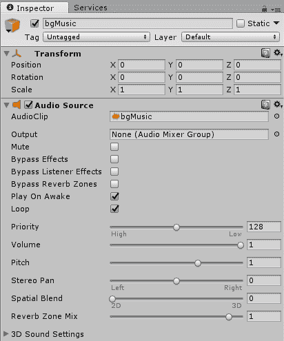

背景音乐的放置位置无关紧要，但如果你使用声音作为环境音，请确保设置声音源的位置。

默认情况下，已勾选“Play On Awake”选项，这正是我们想要的。然而，我们还想让音乐循环播放，所以请确保也勾选了“Loop”复选框。

如果你播放场景，你会自动听到声音播放。同样，对于游戏和选项场景也要这样做。让我们看看如何添加打击和阻挡音效。

每次我们点击按钮时，都给玩家提供音频反馈是个好主意，这样他们就知道按钮已被点击。

为了做到这一点，将打击音频效果也拖放到场景中。确保不要在效果上勾选任何选项，如“Play On Awake”，因为它会在场景开始时开始播放，而我们不希望这样：

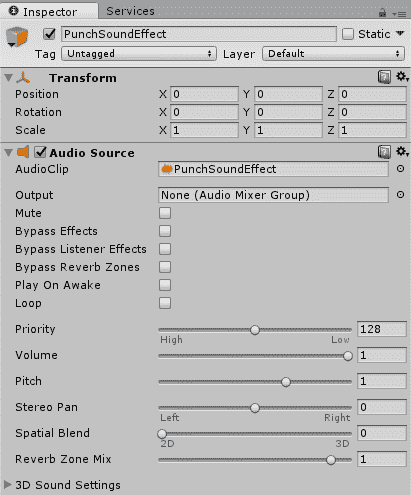

我们将通过脚本播放声音。打开`buttonClicks.cs`文件。在类的顶部创建一个名为`punchSound`的公共变量，其类型为`AudioSource`，如下面的代码所示：

```java
    public class buttonClick : MonoBehaviour {  
 public AudioSource punchSound; 
        public IAPManager iapManager; 

```

前往脚本附加的 GameObject，并将打击效果附加到打击音频源：

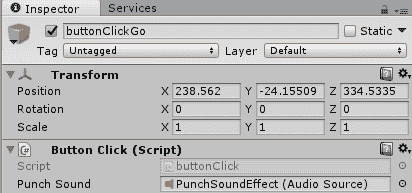

现在，你可以将音频源调用到你想播放的任何地方。假设，我们在`onButtonClick`类中调用函数，它加载一个新的场景：

```java
    punchSound.Play();

```

但是，如果你添加它，你将不会听到场景变化时的声音，甚至游戏场景加载时你也不会听到打击音效。因此，我们将对函数做一些修改。

我们将使用协程等待一段时间，然后加载场景，以便播放音效：

```java
    public void onButtonClick (string level){  
        punchSound.Play();  
 StartCoroutine (onSceneLoad(level)); 
    } 

    IEnumerator onSceneLoad (string sceneName) { 
 yield return new WaitForSeconds(0.5f); 
        SceneManager.LoadScene(sceneName); 
    }  

```

因此，在`onButtonClick`函数中，我们启动一个新的协程，并传入我们想要调用的函数。然后我们创建一个需要返回`IEnumerator`的函数。

然后，我们等待半秒钟，调用`SceneManager.LoadScene`函数，然后传入要加载的水平名称字符串。

这也可以在按下成就、Facebook 和 Twitter 按钮时对其他函数进行操作。我将把这个留给你，因为你会通过使用它来获得锻炼。这也需要在其他场景的其他按钮上做同样的事情。

现在，让我们看看如何在游戏过程中添加声音效果。在 startScene 中，将两个声音效果加载到场景中，并禁用两个文件的唤醒时播放。在 playerScript 中，为打击和阻挡声音效果添加公共变量：

```java
    float totalTime = 0.0f; 
    float timeSinceLastHit = 0.0f; 
    float hitTimeInterval = 30.0f * .016f; 

    float screenWidth = Screen.width; 

 public AudioSource punchSound; public AudioSource blockSound; 

```

在玩家脚本附加的 On the Dude 游戏对象上链接打击和阻挡声音：

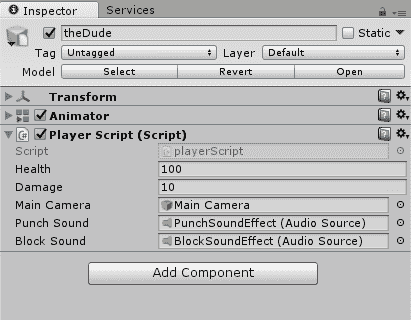

现在，每当玩家被击中时，我们必须播放打击声音效果，如果玩家正在阻挡，我们播放阻挡声音效果。因此，打开 playerScript，在检查敌人是否正在打击的地方，对代码进行以下更改：

```java
    if (eScript.isPunching == true) { 
        if (anim.GetBool("bIsDefending") == false) { 
            //Debug.Log("player got hit"); 
            anim.SetTrigger("tGotHit"); 
            health -= eScript.damage; 
            Debug.Log("Player Health: " + health); 

 punchSound.Play(); 
        } else { 
 blockSound.Play(); 
        } 
    }  

```

效果播放得如预期。让我们也为敌人做同样的事情，如下所示：

当你玩游戏时，你会发现声音效果播放得如预期。让我们也为敌人做同样的事情，如下所示：

```java
    if (pAnim.GetBool("tIsPunching")) {
        if (anim.GetBool("bEnemyIsDefending") == false) {
        // Debug.Log("enemy got hit");
        anim.SetTrigger("tEnemyGotHit");
        anim.SetBool("bEnemyIsDefending", true);         
        health -= pScript.damage;
        Debug.Log("Enemy Health: " + health);
        punchSound.Play();         
        } else {         
            blockSound.Play();
        }   
    }

```

# 处理多个分辨率

在 Unity 中处理多个分辨率非常简单。打开主菜单场景。在层次结构中选择 Canvas 组件：

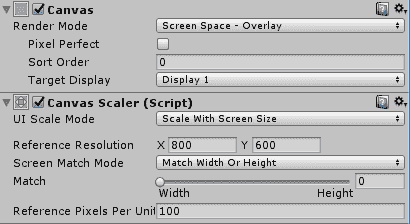

Canvas Scaler 组件负责根据屏幕的宽度和高度缩放 UI 画布。将 UI 缩放模式字段设置为与屏幕大小缩放。这将根据屏幕的宽度和高度缩放 UI 元素。

我们还提供了一个基于 UI 缩放的参考分辨率。这里它是 800x600。如果它能在那个分辨率下适应 UI，那么它肯定也能适应 16:9 的分辨率。

下一个参数是匹配参数。在这里，我们将宽度设置为匹配，然后高度将相应缩放。这将对其他场景中的所有画布都要进行同样的操作。一旦这样做，游戏应该能够根据屏幕分辨率缩放 UI。

# 优化 APK

要获取单个文件的大小，我们使用 Unity 中的控制台。点击控制台右上角的向下箭头，然后选择打开编辑器日志：

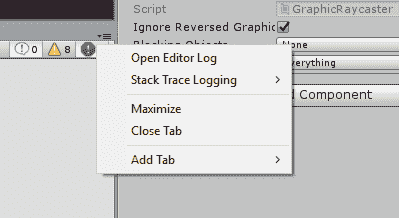

这将打开一个包含日志信息的文本文件。在文本文件中向下滚动，直到它显示单个文件的大小。如你所见，Unity 已经很好地完成了移除当前游戏中未使用的资产的工作。

它还分解了资产并显示了哪些资产对大小有贡献。在这里，我们可以看到`menuImage.jpg`、`ground.jpg`和`wall.jpg`图像的大小相当大：

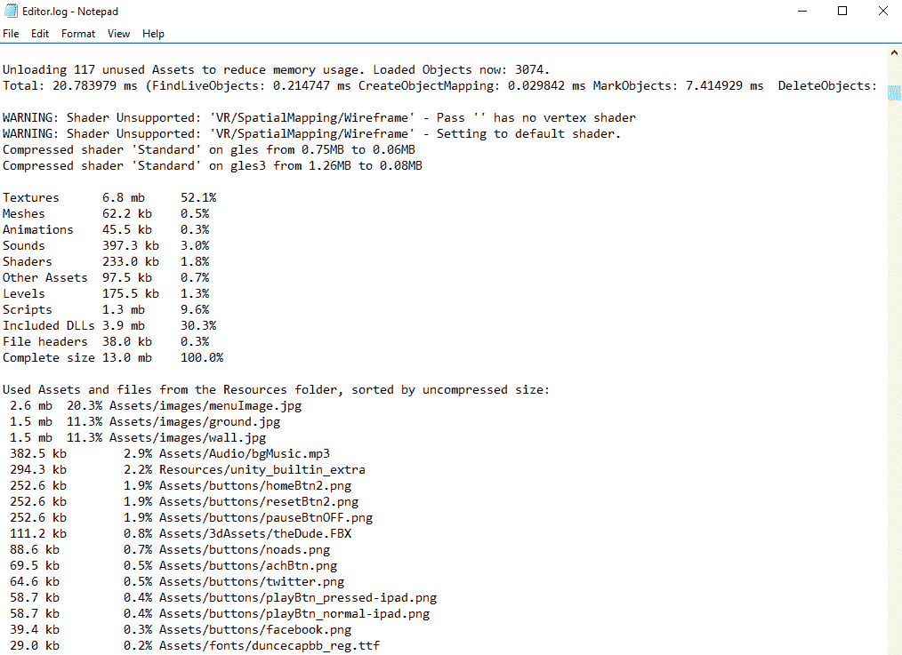

减小 JPEG 大小的一个流行工具是 **Paint.NET**；它是一个用于减小文件大小的免费应用程序。您可以从 [`www.getpaint.net/index.html`](http://www.getpaint.net/index.html) 下载此工具。

同样，对于 PNG 图片，您可以使用 **PNG Crush** 工具来减小图片大小。可以从 [`pmt.sourceforge.io/pngcrush`](https://pmt.sourceforge.io/pngcrush) 下载。

总体而言，建议尽可能使用矢量图形而不是位图图像，因为无论分辨率如何，图像质量都将清晰，并且还可以节省空间以进行优化。

# 准备发布构建

我们还没有做的事情之一是为应用添加图标。一旦您设计了应用图标，我们就会为不同的 Android 设备设置图标。

为了从单个图像创建不同大小的应用图标，我使用 [`makeappicon.com/`](http://makeappicon.com/) 网站。您只需将图标设计拖放到那里，它将生成不同大小的图标。您可以通过浏览到图标文件夹中的文件或将其拖放到网站上的链接来生成图标，然后可以将其通过电子邮件发送给您：

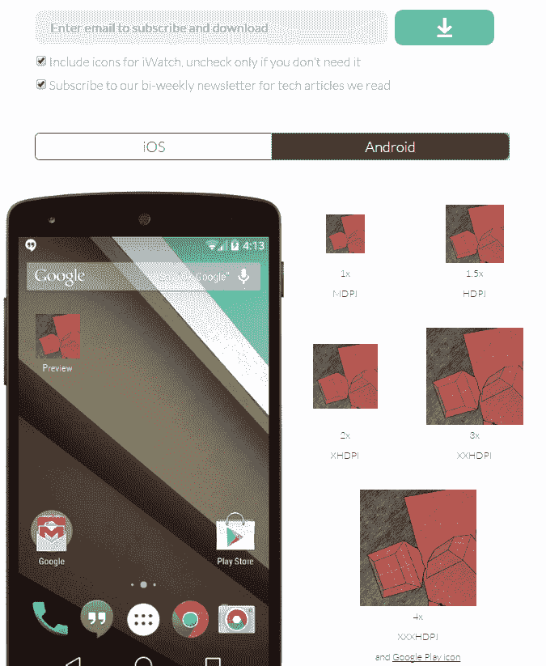

一旦收到文件，请下载并在“项目”文件夹中新建一个名为“图标”的新文件夹中解压缩它们。

在 Unity 中打开 PlayerSettings。在 PlayerSettings 下，您可以添加公司标志。确保您在“公司名称”和“产品名称”字段中添加详细信息。在“分辨率和展示”部分，将“默认方向”字段设置为 Landscape Left：

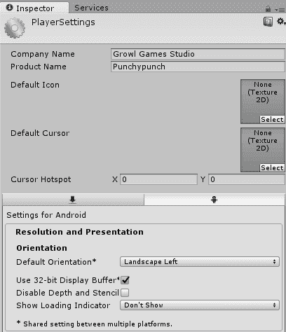

接下来，在图标组件下，勾选“为 Android 覆盖”选项并选择具有正确分辨率的图标：

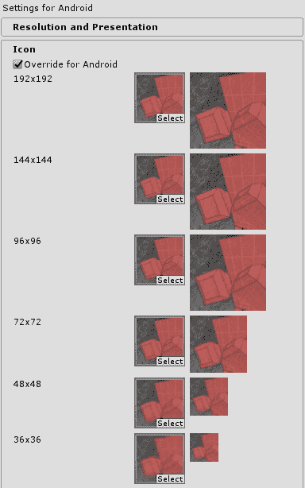

接下来是启动画面部分。如果您是 Unity 专业用户，则可以选择您选择的启动画面。否则，您可以将其留空。接下来，在“其他设置”字段中，确保您已添加正确的包名、版本和捆绑版本代码。

对于最小 API 级别，我选择了 4.0，因为我希望尽可能多地覆盖用户，但在设置最小 API 级别之前，请确保游戏在实际设备上运行良好。其余设置保持不变。

在发布设置中，选择您的密钥库并输入密码。选择密钥别名并在密钥库密码中输入密码：

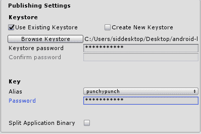

接下来，打开 Services 并选择 ADS 链接，取消选中“启用测试模式”选项以禁用测试：

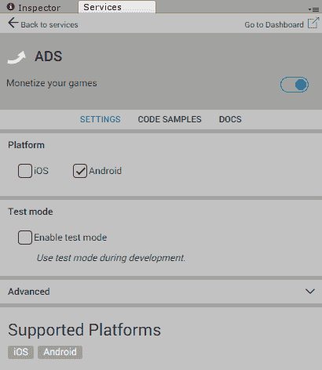

现在打开 Build Settings 并构建 APK 以上传到商店。

# 发布游戏

打开 Android 开发者控制台，选择“所有应用”，并选择您想要发布的应用。将新的 APK 上传到网站。

接下来，我们必须确保在发布游戏之前，所有部分都带有绿色的勾选标记：

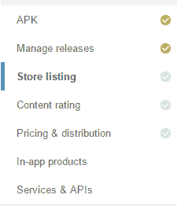

因此，选择商店列表链接，并填写标题、简短描述和完整描述字段：

+   标题字段将显示在应用商店中的游戏名称，所以请确保名称独特、吸引人且易于记忆。

+   简短描述也会在商店中显示。简短描述更像是游戏/asp 内容的预览。通常，您会在这里指定产品的独特卖点（USP），向读者说明您的游戏为何吸引人，以及与其他产品有何不同。您还会在这里指定游戏的类型，以便如果读者对这种类型感兴趣，他们可以进一步了解。一旦用户点击链接，就会显示完整的描述。

+   在完整描述字段中，您应该告诉读者游戏能提供什么。这包括功能、故事的简要总结和玩家的动机等内容。以下截图提供了一个简短的示例：

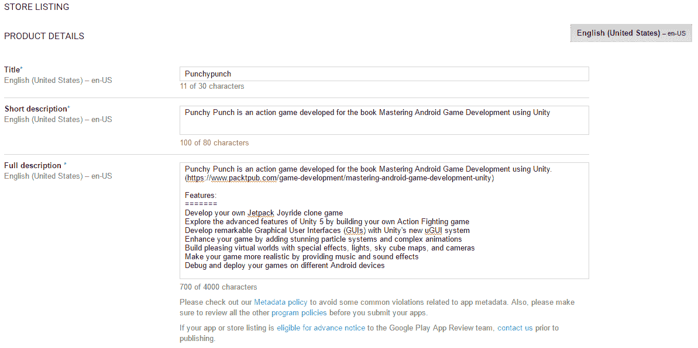

滚动到页面下方，我们需要提供图标、截图和功能图形。我真的很强调图标和截图选择对您游戏成功的重要性。

图标需要放在我们的优先列表之首，因为这是用户首次遇到应用时看到的第一件事。考虑到应用商店每天都有大量应用发布，这一点变得更加重要。在选择合适的图标时需要投入大量的思考和努力，这个图标能够概括您游戏的核心内容，同时足够独特，能够在数百万个应用图标中脱颖而出。

一旦用户对图标感兴趣并点击它，接下来会吸引他们注意的就是截图。至少需要上传三张截图。您可以上传更多。挑选并选择与完整描述中所述内容相匹配的截图。对于每个功能列表项，提供一张截图来告诉用户您提供的内容。

如果您针对的是平板电脑，请添加专门为平板电脑拍摄的截图。此外，如果您为 Android TV 和 Google Daydream 开发，也请添加相应的截图。

您还可以链接 YouTube 上的促销视频。请确保视频不超过 30 秒：

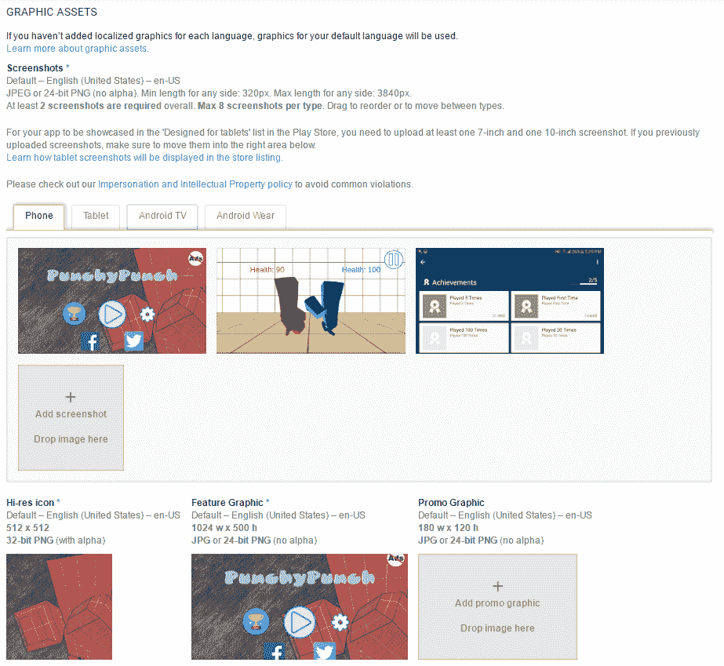

接下来，在分类部分填写详细信息。在这里，您将指定它是一个应用程序还是一个游戏，以及游戏类型。提供您的公司网站、电子邮件地址，并提交隐私政策。

如果您没有提交隐私政策，您可以在隐私政策部分取消选中复选框，表示您不是：

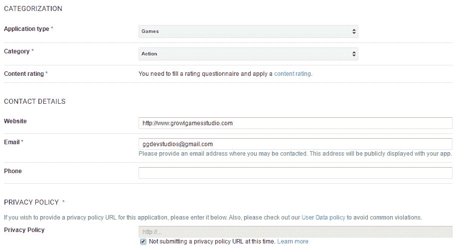

一旦所有信息都正确填写并令您满意，请点击页面右上角的保存草稿按钮。接下来，让我们继续到内容评级部分。

在这里，你将确保内容不包含冒犯性材料，并且产品的质量符合**国际年龄评级联盟**（**IARC**）的评级标准。IARC 是一个为特定应用或移动游戏分配评级的机构。点击“继续”按钮以继续。

请填写你的电子邮件地址，以便在游戏中遇到问题时，IARC 可以与你联系以进行澄清。接下来，选择应用类别，并在其中选择“游戏”。

在“游戏”类别下，你必须说明你的游戏不包含与暴力、恐惧、性、赌博、语言、管制物质、粗俗幽默和其他杂项相关的内容。对于所有项目，直到“粗俗幽默”，指定“否”选项，如下截图所示：

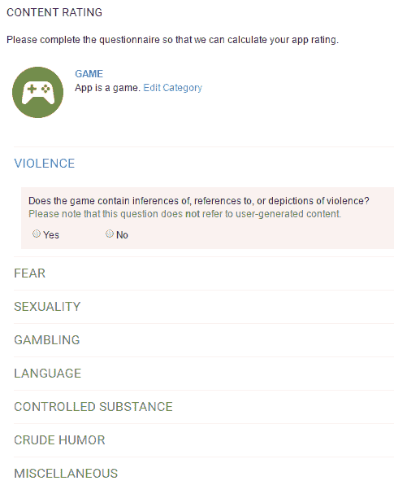

对于“杂项”类别，我们除了数字购买外，对所有项目指定“否”：

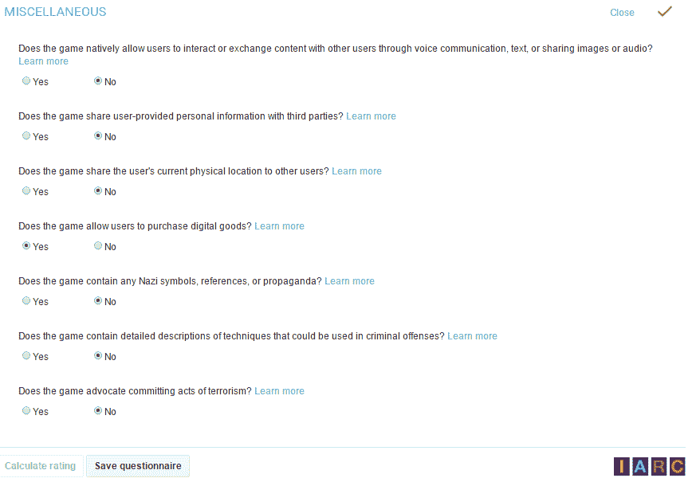

由于我们有内购功能，我们必须指定“是”。完成后，通过点击“保存问卷”选项来保存。接下来，点击“计算评分”标签，屏幕将显示以下内容：

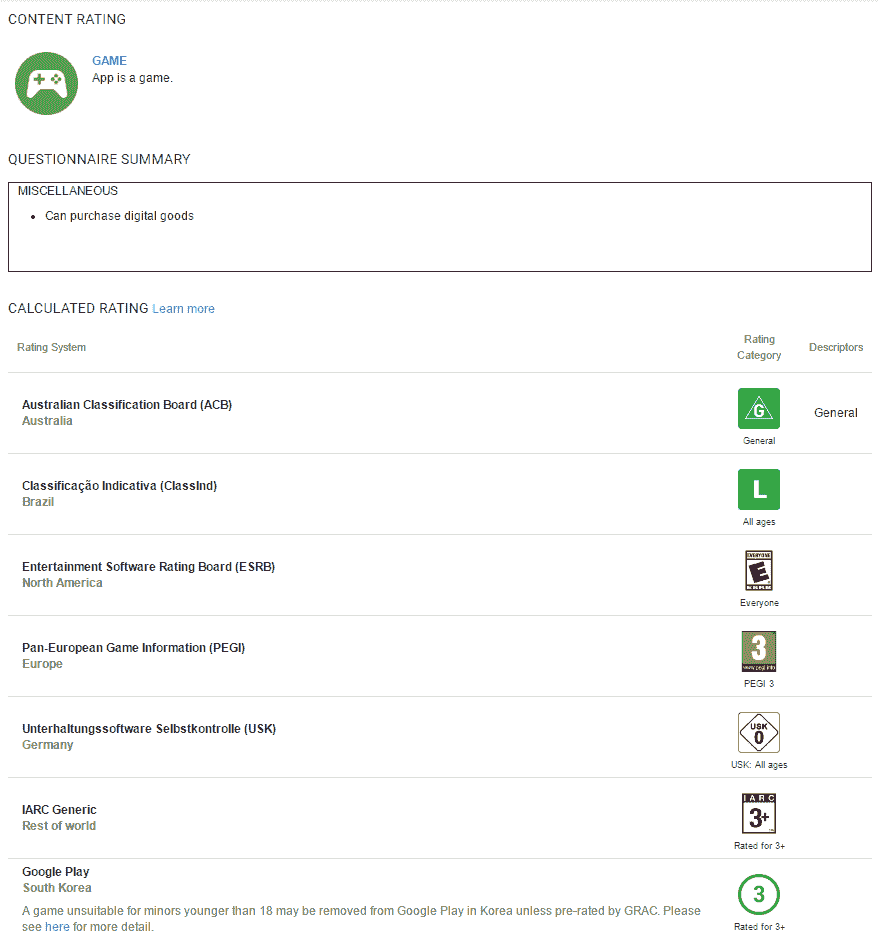

你将获得游戏的总结和评分。同样的信息也会通过提供的邮箱地址发送给你。

接下来，点击“应用评分”；你会看到你的评分已设置。点击“定价和分发”，你会看到以下窗口：

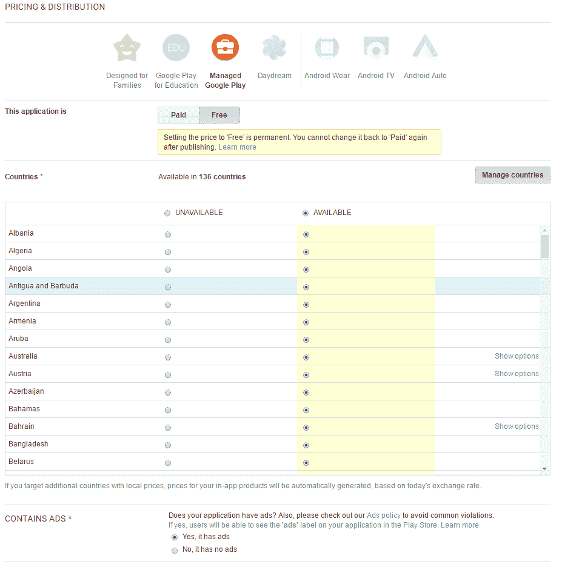

在这里，选择你希望应用是免费还是付费。如果你选择付费，则指定你希望销售应用的定价。

点击所有你希望游戏销售的国家的复选框。点击“可用”选项将选择列表中的所有国家。你可以取消选择你不想应用分发的国家。此外，在底部选择“包含广告”字段中的应用包含广告。

如果你批准应用在 Google Play Store 之外推广，并且应用符合 Android 内容指南和美国出口法律，请检查以下截图所示的“同意”清单：

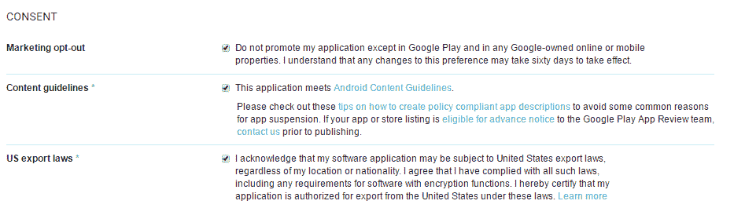

在屏幕右上角点击“保存草稿”按钮。我们已指定了内购产品、服务和 API，因此我们在这里不需要做任何事情。但我们必须转到游戏服务并发布成就。因此，转到游戏服务并选择应用。

在主页上的“显示名称”和“描述”字段中提供详细信息，并将图标和功能图形上传到这里：

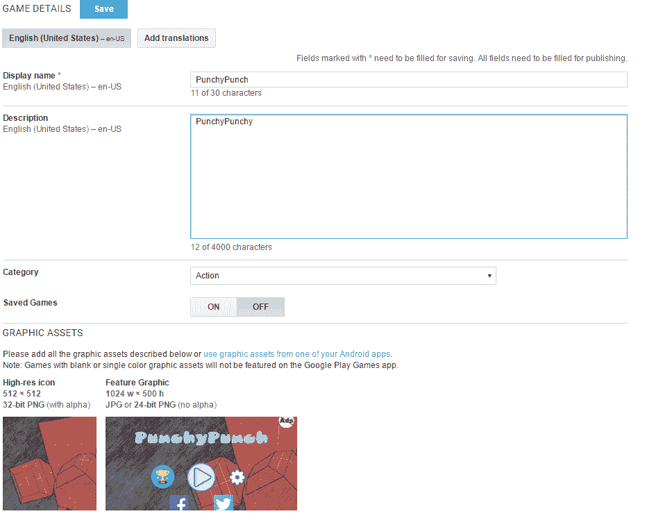

点击窗口左上角的“保存”按钮。接下来，转到“成就”标签，选择每个成就，并添加图标：

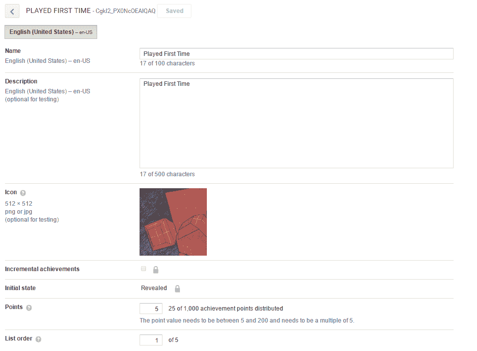

一旦为所有成就添加了图标，你将在右上角有发布游戏的选择。一旦发布，你的成就页面将如下所示：

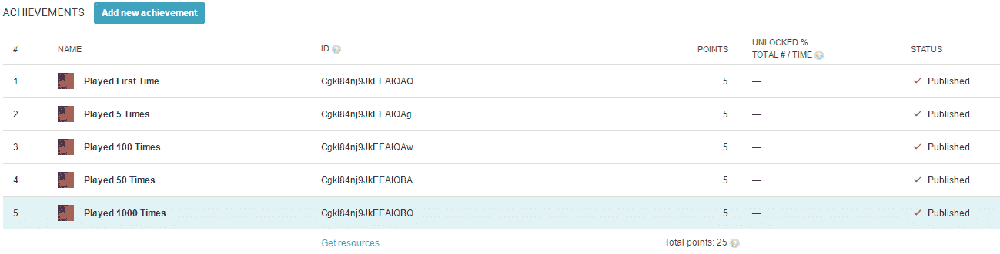

现在我们可以发布应用本身了。转到“所有应用”，选择“管理发布”。它将显示您有一个准备就绪的应用：

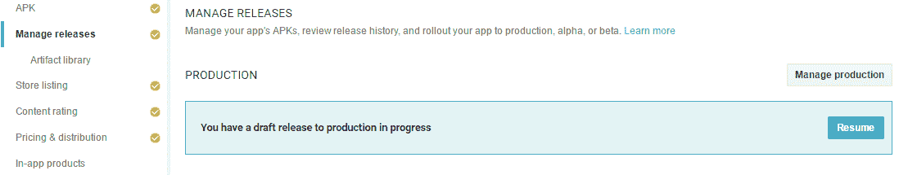

点击“恢复”按钮。在“发布名称”部分添加详细信息，并添加描述以显示本版本的更新内容：

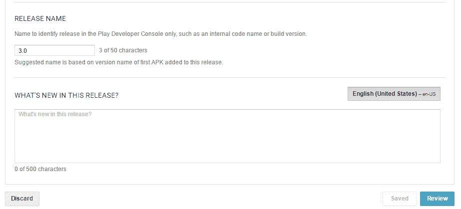

点击“审核”按钮，然后点击“开始部署到生产”。您将需要确认应用现在将在应用商店中可用：

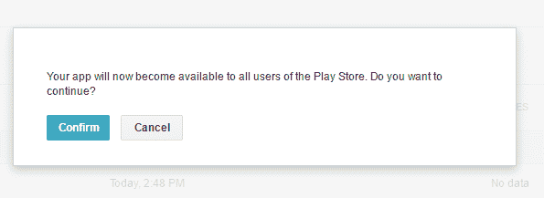

点击“确认”按钮，现在它将显示应用现在正在等待发布：

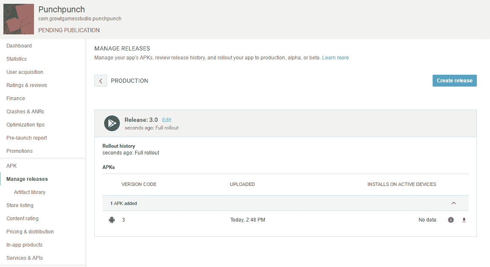

应用发布大约需要一个小时，在应用商店中正确可见大约需要三到四小时。所以，请耐心等待。一旦发布，您可以在社交媒体上分发链接，并告诉您的朋友下载和评分。

在 Facebook 上还有一件小事需要注意。我们必须登录到我们的开发者账户，并启用 Facebook 上的 PunchyPunch 应用。

前往 Facebook 开发者账户，选择该应用。现在转到“应用审核”标签页，在“使 Punchypunch 公开”选项下，翻转开关以使其公开。

现在应用是公开的，您的朋友可以分享您的游戏：

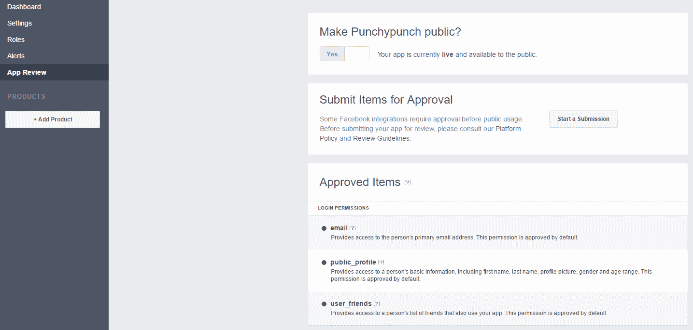

恭喜！您已经在 Unity 上成功开发了一个 Android 应用，并在 Google Play 商店发布了它。

# 摘要

在本章中，我们为游戏添加了声音，为发布准备应用，并对应用商店本身进行了更改。我们上传了最终构建版本，并将应用本身发布到商店。
