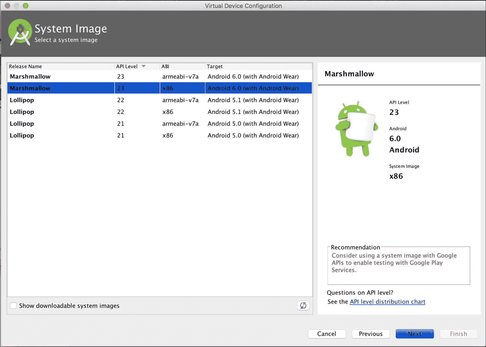

# 第二章  设置开发环境

|    | *"给我六个小时砍倒一棵树，我会花前四个小时磨斧头。" |    |
| --- | --- | --- |
|    | --*亚伯拉罕·林肯* |

在本章中，我们将讨论使用 Android Studio 设置开发环境所需的步骤、主题和过程。如果您已经使用 Android Studio 进行过 Android 应用程序开发，那么这里讨论的一些项目可能已经对您熟悉。然而，还有一些 Android Wear 平台特定的项目可能对您感兴趣。

# Android Studio

Android Studio **集成开发环境**（**IDE**）基于**IntelliJ IDEA**平台。如果您使用 IntelliJ IDEA 平台进行过 Java 开发，那么您在使用 Android Studio IDE 时会感到很自在。

Android Studio 平台捆绑了开发 Android 应用程序所需的所有必要工具和库。如果您是第一次在开发系统上设置 Android Studio，请确保在安装前满足所有要求。请参考 Android 开发者网站([`developer.android.com/sdk/index.html#Requirements`](http://developer.android.com/sdk/index.html#Requirements))以检查您选择的操作系统所需的项。

注意，您需要在机器上至少安装 JDK 版本 7，Android Studio 才能正常工作。您可以在终端窗口中输入以下命令来验证您的 JDK 版本：

如果您的系统不符合该要求，请使用您操作系统的特定方法进行升级。

# 安装

Android Studio 平台包括 Android Studio IDE、SDK 工具、Google API 库以及开发 Android 应用程序所需的系统镜像：

访问[`developer.android.com/sdk/index.html`](http://developer.android.com/sdk/index.html)页面下载适用于您对应操作系统的 Android Studio，并按照安装说明进行操作。

# Git 和 GitHub

Git 是一个广泛用于开源项目的分布式版本控制系统。在接下来的过程中，我们将使用 Git 进行示例代码和示例项目的开发。

确保您在终端窗口中输入以下命令，以便在您的系统上安装 Git：

如果您还没有安装，请访问[`git-scm.com/downloads`](https://git-scm.com/downloads)链接下载适用于您对应操作系统的 Git。

如果您正在使用 Mac OS El Capitan 或 Yosemite，或者使用 Ubuntu、Kubuntu 或 Mint 等 Linux 发行版，那么您可能已经安装了 Git。

GitHub ([`github.com`](http://github.com)) 是一个免费且流行的基于 Git 的开源项目托管服务。他们使得检查和贡献开源项目变得比以往任何时候都容易。如果您还没有账户，请注册 GitHub 以获取免费账户。

我们将使用 GitHub 来检查与 Android Wear 相关的各种示例项目，以及为本书开发的应用程序的示例代码。我们不需要成为 Android 应用程序开发的 Git 专家，但我们需要熟悉 Git 命令的基本用法，以便与项目一起工作。

Android Studio 默认集成了 Git 和 GitHub。它有助于从 Google 的 GitHub 存储库导入示例代码，并帮助您通过检查各种应用程序代码示例来学习。

# Gradle

Android 应用程序开发使用 Gradle ([`gradle.org/`](http://gradle.org/)) 作为构建系统。它用于构建、测试、运行和打包应用程序，以便运行和测试 Android 应用程序。

Gradle 是声明性的，并使用*约定优于配置*来设置和配置构建设置。它管理所有库依赖项，用于编译和构建代码工件。

幸运的是，Android Studio 抽象了大多数开发中需要的常见 Gradle 任务和操作。然而，在某些情况下，拥有一些额外的 Gradle 知识会非常有帮助。我们现在不会深入探讨 Gradle，我们将在旅途中根据需要讨论它。

# Android SDK 包

当您安装 Android Studio 时，它不包括开发所需的所有 Android SDK 包。Android SDK 将工具、平台和其他组件和库分成可以下载的包，您可以使用 Android SDK Manager 按需下载。在我们开始创建应用程序之前，我们需要将一些必需的包添加到 Android SDK 中。

从 Android Studio 启动 SDK Manager，**工具** | **Android** | **SDK Manager**：

让我们快速浏览一下前面截图中的几个项目。

如您所见，在我的机器上，Android SDK 的位置是`/opt/android-sdk`。根据您在 Android Studio 安装过程中选择的选项，它可能在您的机器上有所不同。需要注意的是，Android SDK 的安装位置与 Android Studio 的路径（`/Applications/Android\ Studio.app/`）不同。

这被认为是一种良好的实践，因为 Android SDK 的安装可能不会受到 Android Studio 的新安装或升级（反之亦然）的影响。

在**SDK 平台**选项卡中，选择一些最近的 Android SDK 版本，例如 Android 版本 6.0、5.1.1 和 5.0.1。

根据您计划在可穿戴应用程序中支持哪些 Android 版本，您可以选择其他较旧的 Android 版本。

在右下角检查 **显示包详细信息** 选项将显示为给定 Android SDK 版本安装的所有包：

为了安全起见，选择所有包。如你所注意到的，Android Wear ARM 和 Intel 系统镜像已包含在包选择中。

现在，当你点击 **SDK 工具** 选项卡时，*确保以下项目被选中*：

+   **Android SDK 构建工具**

+   **Android SDK 工具 24.4.1**（最新版本）

+   **Android SDK 平台工具**

+   **Android 支持仓库，版本 25**（最新版本）

+   **Android 支持库，版本 23.1.1**（最新版本）

+   **Google Play 服务，版本 29**（最新版本）

+   **Google 仓库，版本 24**（最新版本）

+   **Intel X86 模拟器加速器 (HAXM 安装程序)，版本 6.0.1**（最新版本）

+   **Android SDK 文档**（可选）

SDK 窗口将看起来如下：

不要在 **SDK 更新站点** 选项卡中更改任何内容。保持更新站点为默认配置。

点击 **确定** 按钮。下载和安装所选的所有组件和包将需要一些时间。

# Android 虚拟设备

**Android 虚拟设备**（**AVD**）将使我们能够使用 Android 模拟器测试代码。它允许我们选择和选择所需的 Android 系统目标版本和形态，以便进行测试。

从 **工具** | **Android** | **AVD 管理器** 启动 Android 虚拟设备管理器。

从 **AVD 管理器** 窗口，点击左下角的 **创建新虚拟设备** 按钮，进入下一屏幕并选择 **Wear** 类别：

选择 **Marshmallow** API 级别 **23 on x86**，并将其他所有设置保留为默认值，如下面的截图所示：

### 注意

注意，截至写作时，当前最新的 Android 版本是 API 级别 23 的 Marshmallow。在你阅读本章时，它可能不是最新版本。请随意选择当时可用的最新版本。此外，如果你想在早期 Android 版本中进行支持或测试，请在该屏幕上自由操作。

点击 **下一步** 按钮后，将出现配置窗口：

在成功选择虚拟设备后，你应该会在 **Android 虚拟设备** 列表中看到它，如下面的截图所示：

### 注意

虽然在开发期间使用真实的 Android Wear 设备不是必需的，但有时在真实的物理设备上开发可能更方便且更快。但为了这本书的目的，我们将主要介绍使用 Android 模拟器进行开发和测试。

# 让我们构建一个骨架应用程序

由于我们已经拥有了构建可穿戴应用所需的所有组件和配置，让我们构建一个骨骼应用并测试到目前为止我们所做的工作。

从 Android Studio 的**快速开始**菜单中，点击**导入 Android 代码示例**选项：

从**可穿戴**类别中选择**骨骼可穿戴应用**：

点击**下一步**并选择您首选的项目位置。

如您所见，骨骼项目是从 GitHub 上的谷歌样本代码库克隆的：

点击**完成**按钮将拉取源代码，Android Studio 将编译和构建代码，并使其准备就绪以执行。

以下截图表明 Gradle 构建已成功完成，没有错误。点击以下截图中的绿色播放按钮以运行配置：

当应用开始运行时，Android Studio 将提示我们选择部署目标。我们可以选择之前创建的模拟器并点击**确定**：

在代码编译并上传到模拟器后，骨骼应用的主活动将如以下所示启动：

点击**显示通知**标签将显示通知：

点击**开始计时器**标签将启动计时器并运行 5 秒，点击**完成活动**将关闭活动并将模拟器带回到主屏幕：

# 摘要

我们通过介绍安装说明、要求、SDK 工具、包和其他 Android Wear 开发所需的组件，讨论了设置 Android Studio 开发环境的涉及过程。

我们还检查了来自谷歌样本代码库的骨骼可穿戴应用的源代码，并在 Android 设备模拟器上成功运行和测试了它。

在下一章中，我们将从头开始构建一个真实的 Android Wear 应用，包括我们迄今为止创建的所有配置和设置。
