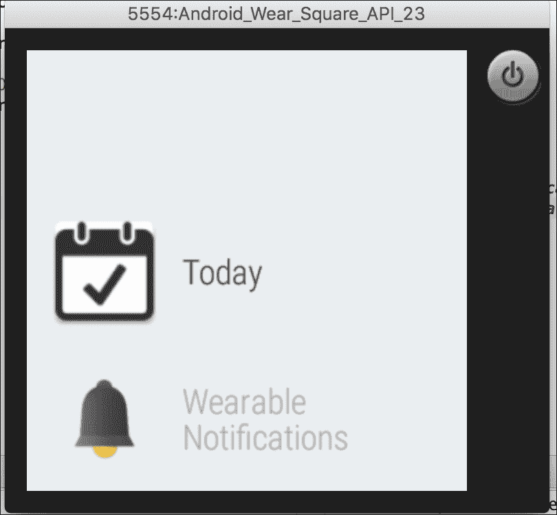
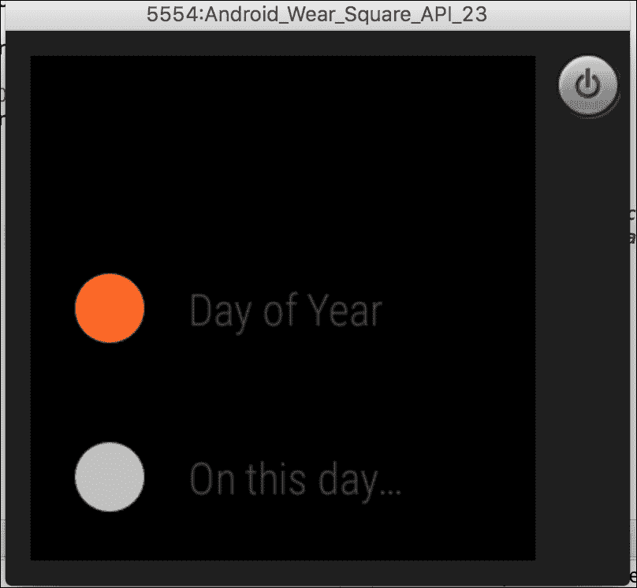
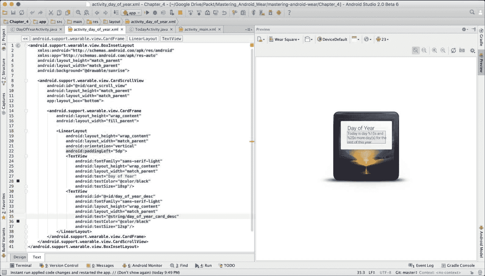
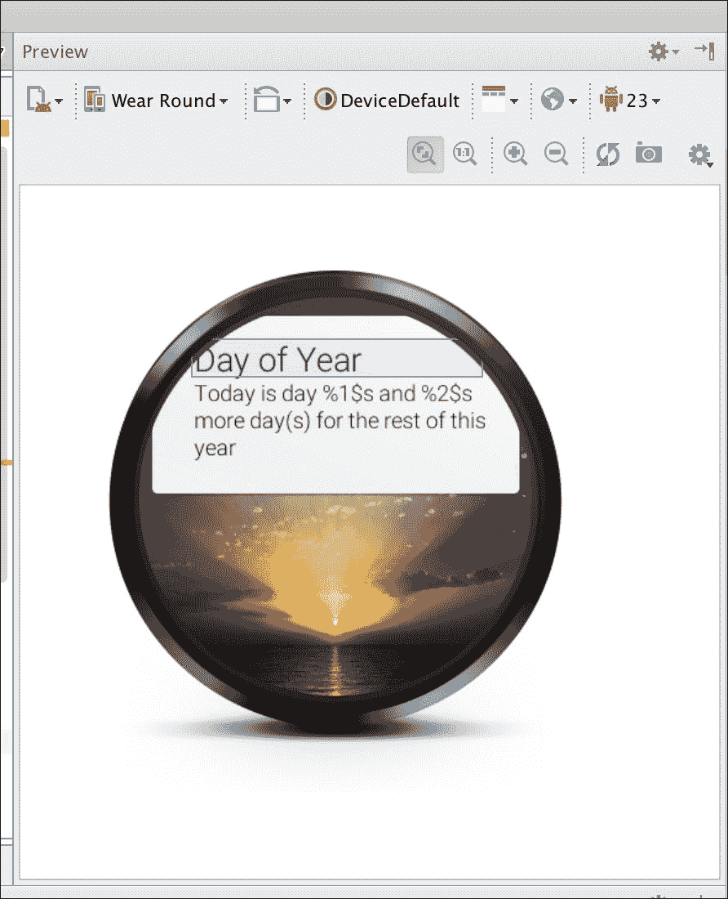
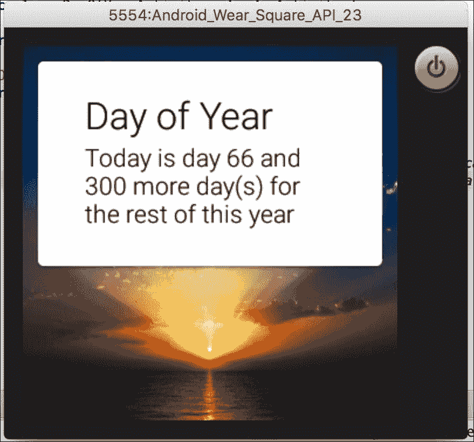

# 第四章：开发手表 UI

|   | *"要创造非凡的东西，你的心态必须始终如一地专注于细节。"* |   |
| --- | --- | --- |
|   | --*乔治·阿玛尼* |

在本章中，我们将扩展在前一章中开始使用的 Android Wear SDK 中可用的 UI 组件的`Today`应用。我们还将探讨使用自定义布局构建自定义 UI 组件，这些布局将适合手表的尺寸。

我们将随着在本书各章节中的学习，迭代和逐步开发`Today`应用。当相关时，我们将介绍 Android Wear SDKs 和 API 的各种概念和功能，并利用它们使这个应用尽可能功能丰富。

请注意，当我们完成这一章时，`Today`应用绝对不会完成。随着我们在后续章节中介绍更多 API 概念，它将得到改进。

### 注意

本章的代码可在 GitHub 上参考（[`github.com/siddii/mastering-android-wear/tree/master/Chapter_4`](https://github.com/siddii/mastering-android-wear/tree/master/Chapter_4)）。

为了简洁起见，仅包含所需的代码片段。鼓励读者从 GitHub 下载引用的代码，并在阅读章节时跟随进度。

# 可穿戴 UI

到现在为止，你可能已经意识到 Android Wear 手表不仅仅比其前辈（如手机和平板）体积更小。它有各种细微差别和特性，使得 Android Wear 手表与其他大屏幕设备不同。

首先，没有键盘输入，至少目前没有。这给为 Android Wear 平台设计应用带来了巨大的挑战。由于缺少键盘（物理或虚拟）数据输入，用户交互性非常有限。

此外，我们也没有其他所有 Android 设备都有的*通用*返回按钮。在 Android 平台上，返回按钮使得在应用内导航和切换应用变得容易得多。没有它，在应用内和之间导航将会困难得多。Android Wear 手表上的滑动手势就像返回按钮一样使用。

在我们开始编写 Android Wear 应用的 UI 组件和导航代码之前，如果你对 Android Wear 手表平台组件和导航流程不是很熟悉，现在花些时间在物理设备或模拟器上看看它们是如何工作的会是个不错的选择。探索各种内置应用，看看滑动手势和导航是如何工作的。

这里要记住的重要一点是，尽管 Android Wear 设备与手机和平板电脑的工作方式不同，但它运行的是每个设备上都可用的相同 Android 平台（操作系统）。然而，并非所有 UI 组件和小部件都适用于或与 Android Wear 平台相关。它将是一个组件的子集，在某些情况下，它将是手机和平板电脑上可用的简化版本。

# Android 清单文件

`Today`应用目前有两个活动。主活动称为`TodayActivity`，另一个是`DayOfYearActivity`，用于显示特定于年份的数据。

注意使用`uses-feature`标签，这使得它成为一个 Android Wear 手表应用：

```java
<?xml version="1.0" encoding="utf-8"?>

<manifest 
package="com.siddique.androidwear.today">     

  <uses-feature android:name="android.hardware.type.watch" />

  <application
    android:allowBackup="true"
    android:icon="@mipmap/ic_launcher"
    android:label="@string/app_name"
    android:supportsRtl="true"
    android:theme="@android:style/Theme.DeviceDefault">         

  <activity
    android:name=".TodayActivity"
    android:label="@string/app_name">             
    <intent-filter>                 
      <action android:name="android.intent.action.MAIN" />                   
      <category android:name="android.intent.category.LAUNCHER" />               
    </intent-filter>         
  </activity>         

  <activity
    android:name=".DayOfYearActivity"
    android:label="@string/day_of_year_card_title">         
  </activity>     
  </application> 
</manifest>
```

# TodayActivity 活动

让我们看看主活动中有哪些内容——`TodayActivity`。在`onCreate`方法中，我们将`activity_main.xml`布局设置为内容视图。并且我们有一个与`ListViewAdapter`类关联的`WearableListView`。

注意，`TodayActivity`活动还实现了`WearableListView`类的点击监听器，这就是为什么你会看到`onClick`处理方法紧挨着`onCreate`方法实现的原因*.*

到目前为止，`onClick`监听器方法只处理列表视图中的第一个项目。点击时会启动`DayOfYearActivity`，并且当传递默认的`Intent`包时：

```java
public class TodayActivity extends Activity implements WearableListView.ClickListener 
{
  private static final String *TAG* = TodayActivity.class.getName();

  @Override
  protected void onCreate(Bundle savedInstanceState)   
  {
    super.onCreate(savedInstanceState);   
    setContentView(R.layout.activity_main);
    WearableListView listView = (WearableListView) findViewById(R.id.action_list); 
    listView.setAdapter(new ListViewAdapter(this));  
    listView.setClickListener(this); 
  }

  @Override
  public void onClick(WearableListView.ViewHolder viewHolder) 
  { 
    Log.i(*TAG*, "Clicked list item" + viewHolder.getAdapterPosition());
    if (viewHolder.getAdapterPosition() == 0) 
    { 
      Intent intent = new Intent(this, DayOfYearActivity.class); 
      startActivity(intent); 
    } 
  }

  @Override
  public void onTopEmptyRegionClick() 
  {
    .. .
  }

  private static final class ListViewAdapter extends WearableListView.Adapter 
  {
    private final Context mContext;
    private final LayoutInflater mInflater;
    private String[] actions = null;
    private ListViewAdapter(Context context) 
    {
      mContext = context;
      mInflater = LayoutInflater.from(context);
      actions = mContext.getResources().getStringArray(R.array.*actions*); 
    }

    @Overridepublic 
    WearableListView.ViewHolder onCreateViewHolder(ViewGroup parent, int viewType) 
    {
      return new   
      WearableListView.ViewHolder(mInflater.inflate(R.layout.*list_item*, null)); 
    }

    @Overridepublic 
    void onBindViewHolder(WearableListView.ViewHolder holder, int position) 
    { 
      TextView view = (TextView) holder.itemView.findViewById(R.id.*name*);   
      view.setText(actions[position]); 
      holder.itemView.setTag(position); 
    }

    @Overridepublic 
    int getItemCount() 
    {
      return actions.length; 
    } 
  }
}
```

## `arrays.xml`文件中的操作

列表视图操作的字符串值在`arrays.xml`文件中声明*.* 随着我们对这个应用进行改进或添加功能，我们可以向此文件添加更多操作：

```java
<?xml version="1.0" encoding="utf-8"?>
<resources> 
  <string-array name="actions"> 
    <item>Day of Year</item> 
    <item>On this day...</item> 
  </string-array> 
</resources>
```

# 主活动布局文件

主活动布局文件`activity_main.xml`相当简单。它只包含在布局中定义的`WearableListView`组件。正如我们之前提到的，`WearableListView`组件是`ListView`方法的优化版本，适用于小屏幕设备。它处理滚动和过渡所需的所有滚动：

```java
<?xml version="1.0" encoding="utf-8"?><android.support.wearable.view.WearableListView

  android:id="@+id/action_list"
  android:layout_width="match_parent"
  android:layout_height="match_parent"
  android:scrollbars="none"
  android:dividerHeight="0dp"/>
```

当你使用 Android Wear 模拟器启动应用时，你应该看到带有自定义启动图标的列表中列出了应用，如下面的截图所示。请注意，各种设备分辨率的图标放置在`app/src/main/res/mipmap-*`文件夹中：



# WearableListItemLayout 组件

`WearableListView`组件用于在应用中显示可用的操作列表，而`WearableListItemLayout`组件用于对单个列表项中的组件进行样式或布局。

在这个特定的情况下，我们有`ImageView`和`TextView`标签*.* 注意`android:src="img/wl_circle"`行的使用。它本质上是一个位于`res/drawable/wl_circle.xml`目录中的可绘制文件。

`TextView`标签用于显示来自`arrays.xml`文件的单独操作字符串：

```java
<com.siddique.androidwear.today.WearableListItemLayout

android:gravity="center_vertical"
android:layout_width="match_parent"
android:layout_height="80dp">     

<ImageView
  android:id="@+id/circle"
  android:layout_height="25dp"
  android:layout_margin="16dp"
  android:layout_width="25dp"
  android:src="img/wl_circle"/>     

<TextView
  android:id="@+id/name"
  android:gravity="center_vertical|left"
  android:layout_width="wrap_content"
  android:layout_marginRight="16dp"
  android:layout_height="match_parent"
  android:fontFamily="sans-serif-condensed-light"
  android:lineSpacingExtra="-4sp"
  android:textColor="@color/text_color"
  android:textSize="16sp"/>

</com.siddique.androidwear.today.WearableListItemLayout>
```

这里是`WearableListItemLayout`类的实现。它基本上是`LinearLayout`类的一个扩展，包含一些针对`WearableListView`组件的`OnCenterProximityListener`组件的处理方法。花点时间理解当列表项滚动并带到中心位置时，组件的`colors`和`alpha`特性是如何更新的：

```java
package com.siddique.androidwear.today;

import android.content.Context;
import android.graphics.drawable.GradientDrawable;
import android.support.wearable.view.WearableListView;
import android.util.AttributeSet;
import android.widget.ImageView;
import android.widget.LinearLayout;
import android.widget.TextView;

public class WearableListItemLayout extends LinearLayoutimplements WearableListView.OnCenterProximityListener 
{
  private final float mFadedTextAlpha;private final int mFadedCircleColor;
  private final int mChosenCircleColor;
  private ImageView mCircle;
  private TextView mName;
  public WearableListItemLayout(Context context) 
  {
    this(context, null);     
  }

  public WearableListItemLayout(Context context, AttributeSet attrs)   
  {
    this(context, attrs, 0);     
  }

  public WearableListItemLayout(Context context, AttributeSet attrs, int defStyle) 
  {
    super(context, attrs, defStyle);
    mFadedTextAlpha = getResources().getInteger(R.integer.action_text_faded_alpha) / 10f;
    mFadedCircleColor = getResources().getColor(R.color.wl_gray);
    mChosenCircleColor = getResources().getColor(R.color.wl_orange);     
  }

  @Override
  protected void onFinishInflate() 
  {
    super.onFinishInflate();
    mCircle = (ImageView) findViewById(R.id.circle);
    mName = (TextView) findViewById(R.id.name);     
  }

  @Override
  public void onCenterPosition(boolean animate) 
  {
  mName.setAlpha(1f);         
  ((GradientDrawable)   mCircle.getDrawable()).setColor(mChosenCircleColor);     
  }

  @Override
  public void onNonCenterPosition(boolean animate) 
  {         
  ((GradientDrawable) mCircle.getDrawable()).setColor(mFadedCircleColor);mName.setAlpha(mFadedTextAlpha);     
  } 
}
```

这里是我们可以看到的操作列表的截图：



# DayOfYearActivity 类

`DayOfYearActivity`活动是一个非常简单的类，它使用 Java 的默认`java.util.Calendar`实例来计算已经过去了多少天以及到年底还有多少天：

```java
import android.app.Activity;
import android.os.Bundle;
import android.widget.TextView;
import java.util.Calendar;

public class DayOfYearActivity extends Activity 
{
  @Override
  protected void onCreate(Bundle savedInstanceState) 
  {
  super.onCreate(savedInstanceState);         
  setContentView(R.layout.activity_day_of_year);         
  Calendar calendar = Calendar.getInstance();         
  String dayOfYearDesc = getString(R.string.day_of_year_card_desc,                   
    calendar.get(Calendar.DAY_OF_YEAR),  
    calendar.getActualMaximum(Calendar.DAY_OF_YEAR) - 
    calendar.get(Calendar.DAY_OF_YEAR));         
  TextView desc = (TextView) findViewById(R.id.day_of_year_desc);         
  desc.setText(dayOfYearDesc);     
  } 
}
```

## activity_day_of_year.xml 文件

关于`BoxInsetLayout`组件的一个有趣之处在于，它是一个屏幕感知组件，将其子组件框在中心方形中。它是一个安全的组件，试图在方形或圆形屏幕上很好地适应：

```java
<android.support.wearable.view.BoxInsetLayout

  android:layout_height="match_parent"
  android:layout_width="match_parent"
  android:background="@drawable/sunrise">

  <android.support.wearable.view.CardScrollView
    android:id="@+id/card_scroll_view"
    andoid:layout_height="match_parent"
    android:layout_width="match_parent"
    app:layout_box="bottom">

    <android.support.wearable.view.CardFrame
       android:layout_height="wrap_content"
       android:layout_width="fill_parent">

      <LinearLayout
        android:layout_height="wrap_content"
        android:layout_width="match_parent"
        android:orientation="vertical"
        android:paddingLeft="5dp"> 

        <TextView
          android:fontFamily="sans-serif-light"
          android:layout_height="wrap_content"
          android:layout_width="match_parent"
          android:text="@string/day_of_year_card_title"
          android:textColor="@color/black"
          android:textSize="18sp"/> 

        <TextView
          android:id="@+id/day_of_year_desc"
          android:fontFamily="sans-serif-light"
          android:layout_height="wrap_content"
          android:layout_width="match_parent"
          android:text="@string/day_of_year_card_desc"
          android:textColor="@color/black"
          android:textSize="12sp"/> 
      </LinearLayout> 

    </android.support.wearable.view.CardFrame> 
  </android.support.wearable.view.CardScrollView> 
</android.support.wearable.view.BoxInsetLayout>
```

你可以在模拟器中看到以下操作：



### 注意

当我们构建布局组件时，预览它们在圆形和方形轮廓中看起来如何是个好主意。

看看以下截图，了解年度活动布局如何在圆形屏幕上显示。由于我们使用了`BoxInsetLayout`布局组件，它在方形和圆形屏幕上渲染得相当不错：



这里是`DayOfYearActivity`活动的实际操作。你可以向右滑动返回上一个活动，在这个例子中是主活动：



# 摘要

我们讨论了如何利用针对可穿戴设备的列表视图和布局。我们在`Today`应用中开发了一系列操作，并实现了列表项的操作。我们创建了一个动作处理器，从主活动启动活动以在`BoxInsetLayout`布局中显示组件。

这只是一个微小的用例，展示了我们如何利用 Android Wear UI 组件并根据我们的需求进行定制。我们无法讨论在示例应用中使用的所有文件。花些时间研究本章的示例代码。这将帮助你连接点，理解各个部分是如何组合在一起的。

我们现在可以进入 Wear 开发的高级主题。这是回顾 Android 平台上 UI 和布局组件如何一般性协同工作的好时机。
