# 第五章。数据同步

|    | *"我们需要另一个灵魂来依靠。" |    |
| --- | --- | --- |
|    | --*西尔维亚·普拉斯* |    |

在前一章中，我们向您介绍了创建独立可穿戴应用的过程。在本章中，我们介绍了伴侣手持应用的概念，以及为什么需要它。然后，我们向您介绍了将手持设备与 Android Wear 模拟器配对所需的步骤，以扩展您的可穿戴应用开发环境。

然后，我们将在前一章中开始的`Today`应用增强功能，使其能够显示*历史上的今天*，通过伴侣应用从公共内容页面获取内容。

### 注意

本章的代码示例可在 GitHub 上找到（[`github.com/siddii/mastering-android-wear/tree/master/Chapter_5`](https://github.com/siddii/mastering-android-wear/tree/master/Chapter_5)）。请参考实际代码进行操作。

# 究竟什么是伴侣应用？

可穿戴应用直接在可穿戴设备上运行，这样您就可以在设备本身上访问设备的硬件、活动和服务。由于规模较小以及需要高效管理处理能力和内存，可穿戴设备上可能执行的操作范围受到设计限制。此外，可穿戴设备不支持 Google Play 商店。此外，Android Wear 1.x 版本不允许直接从 Google Play 商店安装应用。

伴侣手持应用解决了这些问题，让我们能够在可穿戴设备上获得丰富的用户体验。需要记住的是，可穿戴应用是打包在伴侣手持应用中的。伴侣应用是发布到 Google Play 商店的内容，如以下图所示：

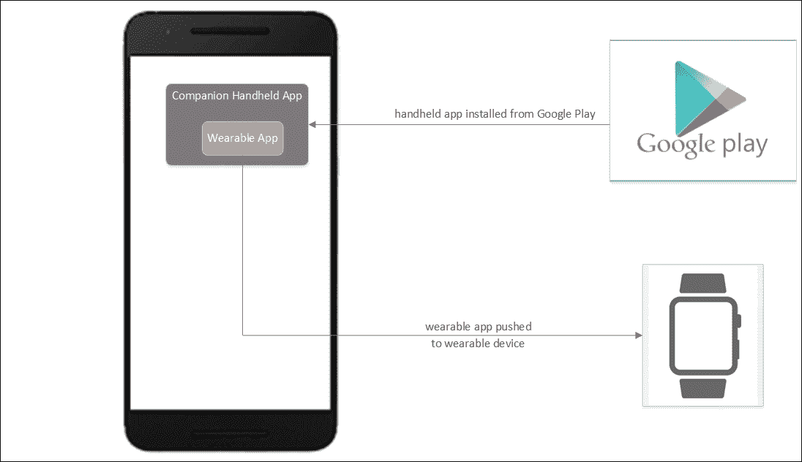

当用户将伴侣应用下载到手持设备时，其中的可穿戴应用会自动推送到所有已连接的可穿戴设备，如以下图所示：

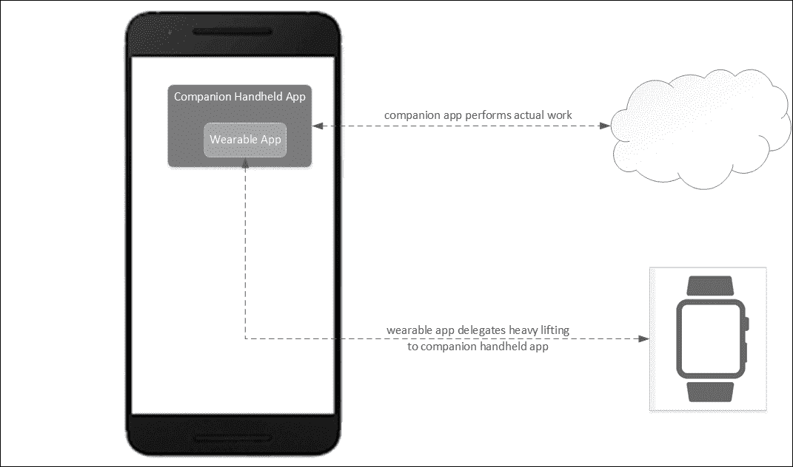

此外，在手持设备上运行的伴侣应用更适合执行应用执行网络操作、密集计算和其他资源密集型工作时所需的繁重工作。然后，伴侣应用将结果发送到可穿戴设备，从而传达其操作的结果。

在我们能够创建包含伴侣应用模块及其可穿戴应用模块的项目之前，我们需要设置我们的开发环境，以便我们可以在手持设备上与可穿戴设备一起工作。

### 小贴士

预计 Android Wear 2.0 将改变从 Google Play 商店打包和安装 Wear 应用的方式。Wear 1.x 中 Wear 应用的自动安装将被淘汰。相反，预计 Wear 2.0 应用将拥有完整的网络访问权限，并且它们的安装将完全独立于手持应用。Google 正在转向独立可穿戴应用作为首选的打包方法，但尚不清楚是否需要独立应用（没有自动安装选项）或者它们是否仅仅作为附加功能得到支持。

# 设置 Android Wear 虚拟设备

这些步骤发布在 Android 开发者网站上（[`developer.android.com/training/wearables/apps/creating.html`](https://developer.android.com/training/wearables/apps/creating.html)），在**创建和运行可穿戴应用**部分。这里重复并扩展了这些步骤以方便使用。

要设置 Android Wear 虚拟设备，在 Android Studio 中点击**工具**|**Android**|**AVD 管理器**，并执行以下步骤：

1.  点击**创建虚拟设备...**选项。

1.  在类别列表中点击**Wear**：

    1.  选择**Android Wear Square**或**Android Wear Round**。

    1.  点击**下一步**按钮。

    1.  选择一个发布名称（例如，KitKat Wear）。

    1.  点击**下一步**。

    1.  更改虚拟设备的任何偏好设置（可选）。

    1.  点击**完成**。

1.  启动模拟器：

    1.  选择您刚刚创建的虚拟设备。

    1.  点击绿色的播放按钮。

    1.  等待模拟器初始化并显示 Android Wear 主屏幕。

1.  将 Android 手持设备与可穿戴模拟器配对：

    1.  在您的手持设备上安装 Google 提供的 Android Wear 应用从 Google Play。

    1.  通过 USB 将手持设备连接到您的计算机。

    1.  将 AVD 的通信端口转发到已连接的手持设备（每次设备连接时都必须这样做）。如果在以下命令运行后我们没有看到任何错误，那么一切正常：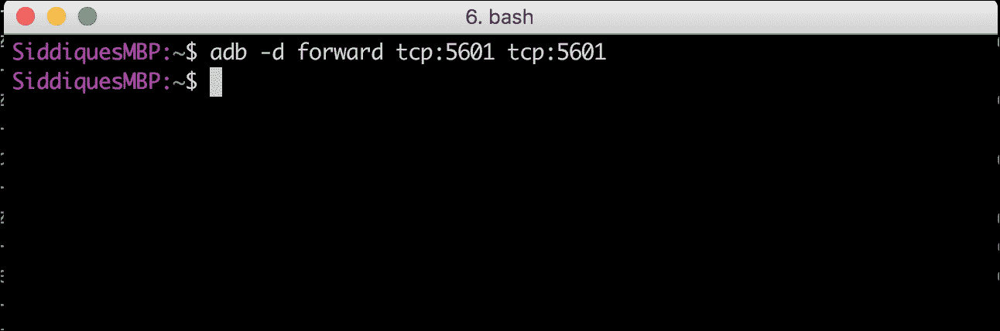

    1.  在您的手持设备上启动 Android Wear 应用并通过选择**连接模拟器**连接到模拟器，如图所示：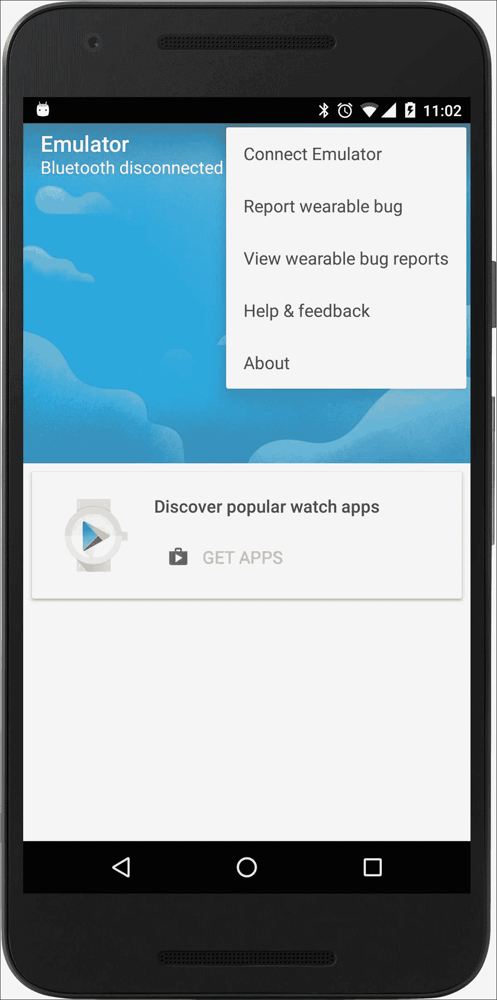

        以下图像展示了成功的连接：

        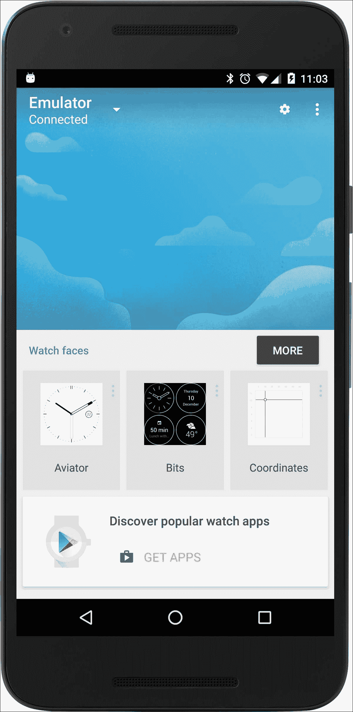

    1.  打开设置菜单并选择**尝试手表通知**：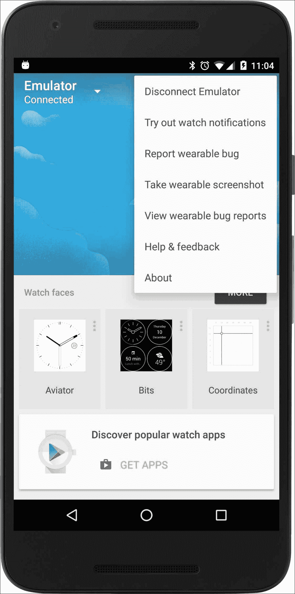

1.  从列表中选择**提醒（按时间）**选项：

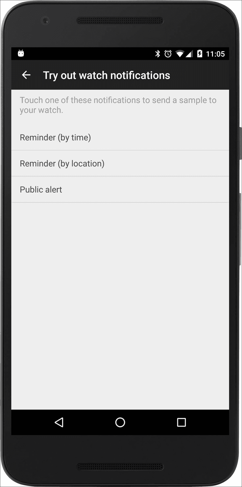

在可穿戴模拟器上出现以下屏幕：


# 回顾 Today 应用

现在我们有了在手持设备上与可穿戴设备工作的能力，让我们回顾一下在前一章中开发的`Today`应用。

那个简化的应用版本无疑帮助我们开始了，但对我们来说这还不够。为了更全面地体验可穿戴设备的功能，我们需要扩展我们的需求。因此，我们决定将本章的其余部分用于显著增强我们的 `Today` 应用。

我们将在稍后描述新应用的功能，但首先，让我们在 Android Studio 中创建一个新的项目——该项目包括一个可穿戴应用以及一个伴侣应用；并使用本章的示例代码进行设置。

我们认为从头开始可能会有所清新；这就是为什么我们的新应用仍然命名为 `Today`。请随意称它为任何你喜欢的名字：

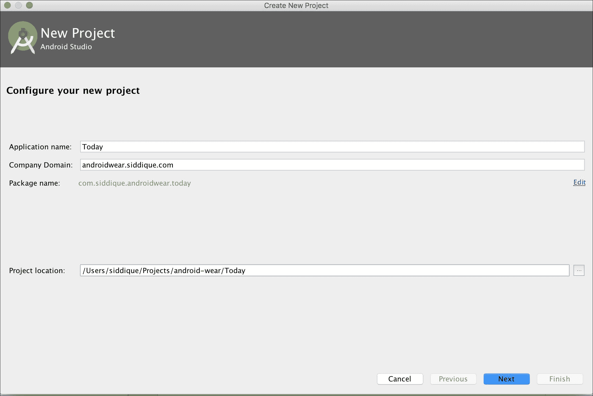

请确保选择以下截图所示的应用形式因素——**手机和平板**，以及 **Wear**：

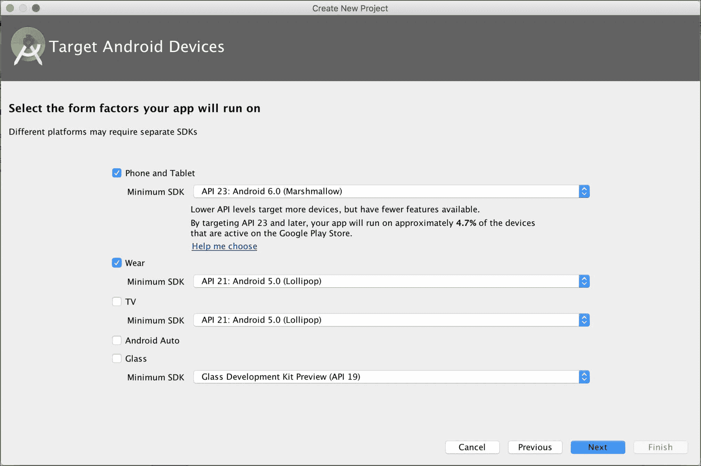

通过点击 **Empty Activity** 在 **Mobile** 模块中添加一个空活动：

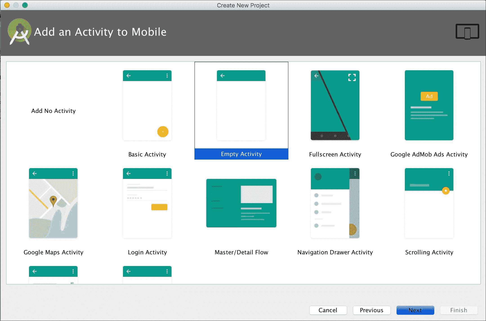

在以下屏幕中给你的活动起一个合适的名字：

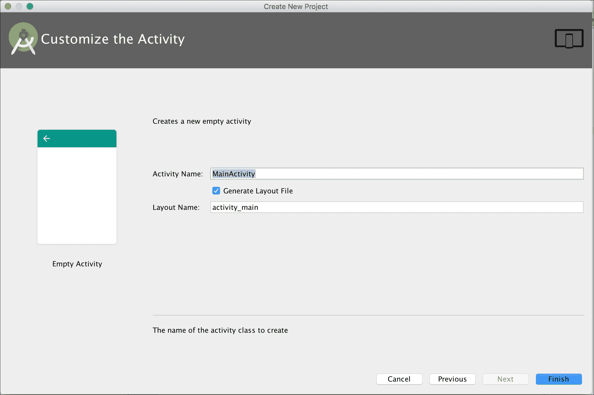

目前，请在 **Wear** 模块中选择 **Add No Activity** 选项，然后点击 **Finish**：

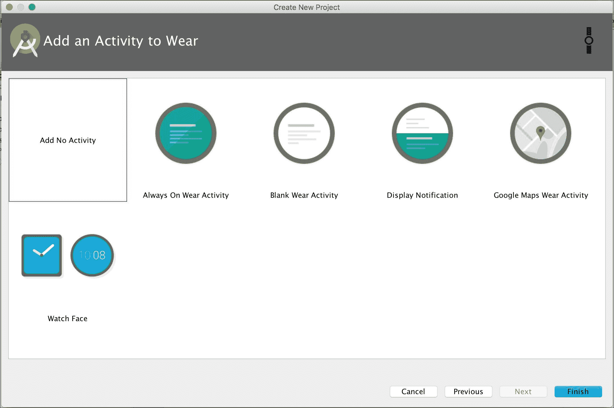

Android Studio 创建了以下截图所示的 **Wear** 和 **Mobile** 模块：

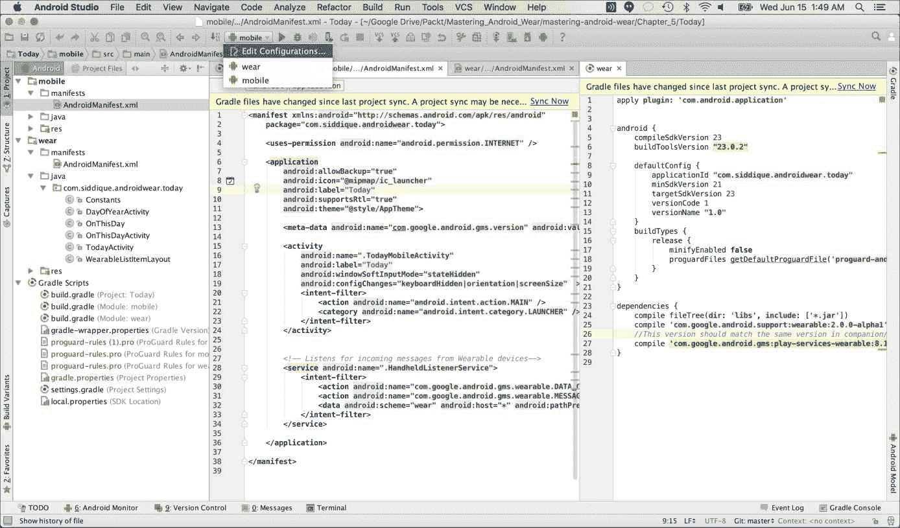

上述截图显示了我们的项目状态。请注意，Android Studio 为它们创建了两个模块——移动和可穿戴。它还为它们创建了 Gradle 脚本并添加了必要的依赖项。此外，还为这两个模块创建了 *run target* 配置。

我们将代码（即活动、资源、图标等）从第四章中创建的 `Today` 项目复制到这个新创建的项目中的可穿戴模块，然后扩展它以满足我们的扩展需求。现在是检查这些需求的好时机。

## 新 Today 应用的范围

我们都知道日期的重要性。谁不喜欢了解到他们的另一半与一个著名或更糟糕的是臭名昭著的明星共享生日呢？考虑到这一点，让我们让我们的 `Today` 应用不仅仅显示当前日期。让它从名为 *On This Day* 的公共内容源中获取内容（[`en.wikipedia.org/wiki/Special:FeedItem/onthisday/20160615000000/en`](https://en.wikipedia.org/wiki/Special:FeedItem/onthisday/20160615000000/en)），它分享一个或多个历史上重要事件/发生的周年纪念日，恰好与今天相符。

这似乎足够深入地咬进了可穿戴 API 栈，这将让我们能够在不过多增加复杂性的情况下研究可穿戴设备和其伴侣应用之间的交互。

在我们深入应用程序代码之前，我们有必要介绍一些概念、工具和 API 对象，这些对于我们的应用程序至关重要。本意是提供足够的信息，让您理解示例代码的核心部分。您随时可以返回并参考本章以及其中引用的文档。

## 可穿戴数据层 API

Google Play 服务包括一个可穿戴数据层 API ([`developer.android.com/training/wearables/data-layer/index.html`](https://developer.android.com/training/wearables/data-layer/index.html))，通过该 API，您的手持设备和可穿戴应用可以相互通信。

我们鼓励您研究位于前述页面的 Android 开发者网站上可穿戴数据层 API 文档，但 API 中的某些关键数据对象值得特别注意。

### MessageApi

此接口公开了可穿戴设备和手持设备相互发送消息的方法。发送到连接的网络节点（即配对设备）的消息将排队等待发送。重要的是要记住，由应用程序创建的消息仅对该应用程序是私有的，并且只能由运行在其他节点上的该应用程序访问。

### WearableListenerService

此类应由希望在后台运行时接收事件通知的应用程序扩展。事件包括收到消息、数据变化以及节点连接到或断开与 Android Wear 网络（即不断变化的可穿戴设备和它们可以连接到或与之交互的手持设备网络）的连接。

### DataListener

虽然`WearableListenerService`类在后台运行时通知应用程序，但`DataListener`接口在应用程序在前台运行时通知实现它的应用程序关于数据层事件。

### 云节点

除了所有用户的连接设备（节点）之外，Google 的服务器在网络中隐式地托管一个云节点。云节点的作用是在直接连接的设备之间同步数据。手持设备上应用程序状态的变化会推送到所有用户的可穿戴设备，反之亦然，如下面的图所示：

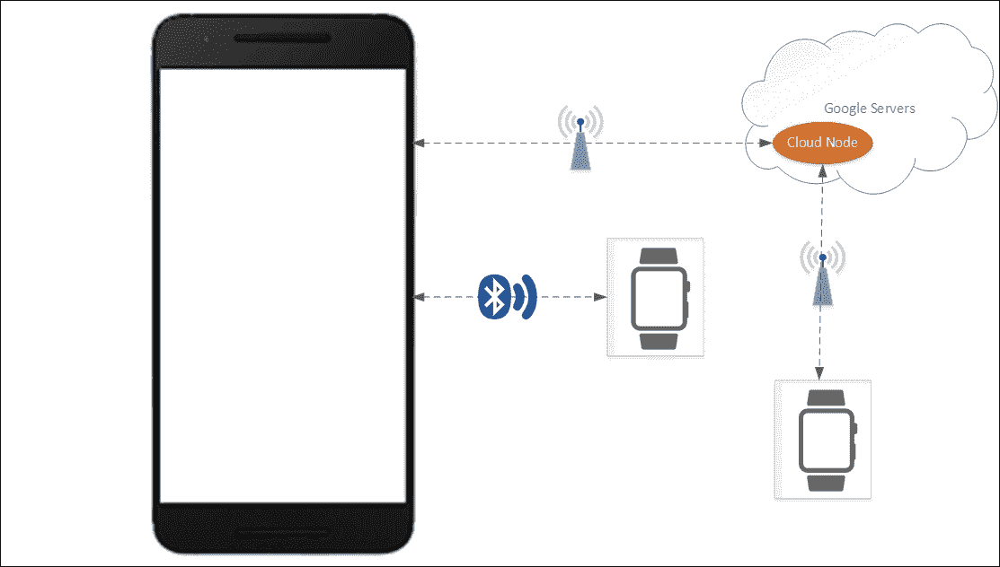

## GoogleApiClient 类

每次您想要连接到 Google Play 服务库中提供的 Google API 之一时，都需要创建`GoogleApiClient`类的实例。Google API 客户端为所有 Google Play 服务提供了一个共同的入口点，并管理用户设备与每个 Google 服务之间的网络连接。

我们使用此类让我们的移动设备连接到 Google Play 服务库中的可穿戴 API，以便访问连接的可穿戴设备。

## Volley 库

我们将使用 Volley 从维基百科获取 HTML 内容。你可以在开发者的网页上阅读有关这个 HTTP 库的所有信息（[`developer.android.com/training/volley/index.html`](https://developer.android.com/training/volley/index.html)）。

## JSoup 库

JSoup 库([`jsoup.org`](https://jsoup.org))将是我们首选的库来解析我们从维基百科拉取的 HTML 内容源。现在，让我们看看代码。

## 构建脚本

研究移动和伴随应用`build.gradle`文件中指定的依赖项。注意移动应用的`build.gradle`文件为`Volley`和`JSoup`库添加了额外的依赖项。记住，伴随应用必须承担繁重的工作：

```java
dependencies {     
  compile fileTree(dir: 'libs', include: ['*.jar'])     
  wearApp project(':wear')     
  testCompile 'junit:junit:4.12'
  compile 'com.android.support:appcompat-v7:23.4.0'
  compile 'com.google.android.support:wearable:2.0.0-alpha1'

  // This version should match the same version in wearable app
  compile 'com.google.android.gms:play-services-wearable:8.1.0'

  // Use volley to make HTTP requests
  compile 'com.android.volley:volley:1.0.0'

  // Use JSoup for parsing HTML data
  compile "org.jsoup:jsoup:1.8.1"
}
```

## 伴随应用的 Android 清单文件

请查看伴随应用的基本`TodayMobileActivity`和`HandheldListenerService`活动的`AndroidManifest.xml`文件：

```java
<manifest 
package="com.siddique.androidwear.today">     
  <uses-permission android:name="android.permission.INTERNET" />       
  <application
    android:allowBackup="true"
    android:icon="@mipmap/ic_launcher"
    android:label="@string/app_name"
    android:supportsRtl="true"
    android:theme="@style/AppTheme">         

  <meta-data 
    android:name="com.google.android.gms.version"   
    android:value="@integer/google_play_services_version" />         

  <activity
    android:name=".TodayMobileActivity"
    android:label="@string/app_name"
    android:windowSoftInputMode="stateHidden"
    android:configChanges="keyboardHidden|orientation|screenSize"  >             

    <intent-filter>                 
      <action android:name="android.intent.action.MAIN" />                    
      <category android:name="android.intent.category.LAUNCHER" />             
    </intent-filter>

  </activity>

<!— Listens for incoming messages from Wearable devices—>

  <service android:name=".HandheldListenerService">             
    <intent-filter>                 
      <action android:name="com.google.android.gms.wearable.DATA_CHANGED" />                 
      <action android:name="com.google.android.gms.wearable.MESSAGE_RECEIVED" />                 
      <data 
        android:scheme="wear" 
        android:host="*" 
        android:pathPrefix="/today" />             
    </intent-filter>         
  </service>     
  </application> 
</manifest>
```

## `TodayMobileActivity`类

`TodayMobileActivity`类目前是一个便利活动，旨在仅连接到与移动设备配对的任何现有可穿戴设备。我们将运行移动/伴随应用的目标在移动设备上：

```java
public class TodayMobileActivity extends Activity implements GoogleApiClient.ConnectionCallbacks,         GoogleApiClient.OnConnectionFailedListener 
{
  private GoogleApiClient mGoogleApiClient;
  public static final String TAG = TodayMobileActivity.class.getName();
  private int CONNECTION_TIME_OUT_MS = 15000;
  private TextView devicesConnectedTextView = null;
  @Override
  protected void onCreate(Bundle savedInstanceState) 
  {
    super.onCreate(savedInstanceState);         
    setContentView(R.layout.main);         
    Log.i(*TAG*, "Creating Google Api Client");
    mGoogleApiClient = new GoogleApiClient.Builder(this)                 
      .addApi(Wearable.*API*)                 
      .addConnectionCallbacks(this)                 
      .addOnConnectionFailedListener(this)                 
      .build();
    devicesConnectedTextView = (TextView) findViewById(R.id.devicesConnected);     
  }

  @Override
  protected void onStart() 
  {
    super.onStart();
    if (!mGoogleApiClient.isConnected()) 
    {
      mGoogleApiClient.connect();         
    }     
  }
  @Override
  public void onConnected(Bundle connectionHint) 
  {         
    Log.i(TAG, "Google Api Client Connected");
    new Thread(new Runnable() 
    {
      @Override
      public void run() 
      {
        mGoogleApiClient.blockingConnect(CONNECTION_TIME_OUT_MS, TimeUnit.MILLISECONDS);                 
        NodeApi.GetConnectedNodesResult result =                         Wearable.*NodeApi*.getConnectedNodes(mGoogleApiClient).await();
        final List<Node> nodes = result.getNodes();                 
        runOnUiThread(new Runnable() 
        {
        public void run() 
        {                         
          Log.i(*TAG*, "Connected devices = " + nodes.size());
        devicesConnectedTextView.setText(String.valueOf(nodes.size()));                     
        }                 
      });             
    }         
  }).
  start();     
  }      
  ...    
}
```

一旦我们成功连接到可穿戴设备，我们应该能够看到至少有一个设备已连接的确认，如下面的图所示：

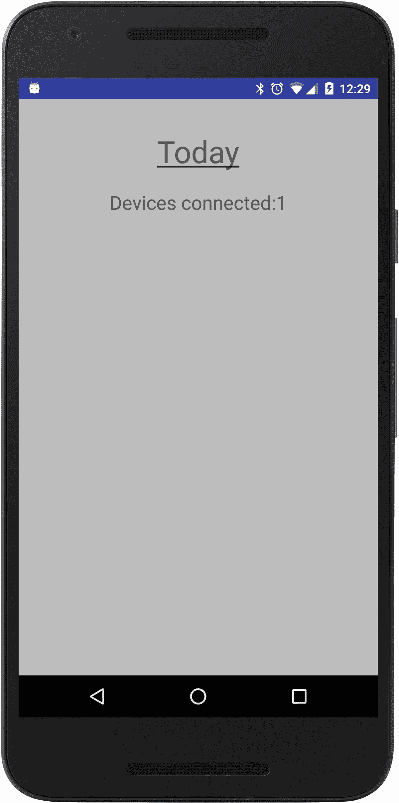

用户可以启动`TodayMobileActivity`类来查看设备是否已连接。如果显示的“设备连接”值不大于零，则表示移动设备未成功配对，这意味着它未连接到可穿戴设备或模拟器。我们将在未来的章节中扩展此活动。

## 可穿戴应用的 Android 清单文件

这里是带有三个菜单项活动（如`TodayActivity`、`DayOfYearActivity`和`OnThisDayActivity`活动）的`AndroidManifest.xml`文件的可穿戴应用：

```java
<manifest package="com.siddique.androidwear.today">     
  <uses-feature android:name="android.hardware.type.watch" />       
  <application
    android:allowBackup="true"
    android:icon="@mipmap/ic_launcher"
    android:label="@string/app_name"
    android:supportsRtl="true"
    android:theme="@android:style/Theme.DeviceDefault">

<!— We need this entry to use Google Play Services —>

  <meta-data 
    android:name="com.google.android.gms.version"   
    android:value="@integer/google_play_services_version" />         

  <activity
    android:name=".TodayActivity"
    android:label="@string/app_name">             
    <intent-filter>                 
      <action android:name="android.intent.action.MAIN" />                 
      <category android:name="android.intent.category.LAUNCHER" />             
    </intent-filter>         
  </activity>         

  <activity
    android:name=".DayOfYearActivity"
    android:label="@string/day_of_year_card_title" />         

  <activity
    android:name=".OnThisDayActivity"
    android:label="@string/on_this_day_title" />     
  </application> 
</manifest>
```

## `OnThisDayActivity`类

`OnThisDayActivity`类使用`GoogleApiClient` API 向移动设备（即伴随应用）发送消息，表示它需要从维基百科获取内容。

注意在此活动中定义的`onDataChanged`处理程序方法。`onDataChanged`方法是当伴随应用向可穿戴设备发送数据包时被处理的回调监听器：

```java
public class OnThisDayActivity extends Activity implementsDataApi.DataListener, GoogleApiClient.ConnectionCallbacks, GoogleApiClient.OnConnectionFailedListener 
{
  private GoogleApiClient mGoogleApiClient;private boolean mResolvingError;
  private static final String TAG = OnThisDayActivity.class.getName();
  private OnThisDay onThisDay = null;
  @Override
  protected void onCreate(Bundle savedInstanceState) 
  {
    super.onCreate(savedInstanceState);         
    setContentView(R.layout.activity_on_this_day);
    if (onThisDay == null) 
    {             
      Toast.makeText(this, "Fetching from Wikipedia...", Toast.LENGTH_LONG).show();
      mGoogleApiClient = new GoogleApiClient.Builder(this)                     
        .addApi(Wearable.API)                     
        .addConnectionCallbacks(this)                     
        .addOnConnectionFailedListener(this)                     
        .build();         
    } 
    else 
    {             
      showOnThisDay(onThisDay);         
    }     
  }
  @Override
  protected void onStart() 
  {
    super.onStart();
    if (!mResolvingError && onThisDay == null) 
    {             
      Log.i(TAG, "Connecting to Google Api Client");
      mGoogleApiClient.connect();
    } 
    else 
    {             
      showOnThisDay(onThisDay);         
    }     
  }
  @Override
  public void onConnected(Bundle connectionHint) 
  {         
    Log.i(TAG, "Connected to Data Api");         
    Wearable.DataApi.addListener(mGoogleApiClient, this);
*// send a message to the companion app that it needs to fetch data* 
    sendMessage(Constants.ON_THIS_DAY_REQUEST, "OnThisDay".getBytes());        
  }
  private void sendMessage(final String path, final byte[] data) 
  {         
    Log.i(TAG, "Sending message to path " + path);          
 Wearable.NodeApi.getConnectedNodes(mGoogleApiClient).setResultCallback (new ResultCallback<NodeApi.GetConnectedNodesResult>() 
    {
    @Override
    public void onResult(NodeApi.GetConnectedNodesResult nodes) 
    {
      for (Node node : nodes.getNodes()) 
      {                             
        Wearable.MessageApi.sendMessage(mGoogleApiClient, node.getId(), path, data);                         
      }                     
    }                 
  });     
}

@Override
public void onConnectionSuspended(int i) 
{         
  Log.i(TAG, "Connection Suspended");     
}

@Override
protected void onStop() 
{
  if (null != mGoogleApiClient && mGoogleApiClient.isConnected()) 
  {             
    Wearable.DataApi.removeListener(mGoogleApiClient, this);
    mGoogleApiClient.disconnect();         
  }
  super.onStop();     
}
@Override
public void onDataChanged(DataEventBuffer dataEvents) 
{         
  Log.i(TAG, "###### onDataChanged");
  for (DataEvent event : dataEvents) 
  {
  if (event.getType() == DataEvent.TYPE_CHANGED) 
  {                 
    DataItem dataItem = event.getDataItem();                 
    DataMap dataMap = DataMapItem.fromDataItem(dataItem).getDataMap();                 
    String heading = dataMap.get(Constants.ON_THIS_DAY_DATA_ITEM_HEADER);                 
    ArrayList<String> listItems = dataMap.get(Constants.ON_THIS_DAY_DATA_ITEM_CONTENT);
    onThisDay = new OnThisDay(heading, listItems);                 
    showOnThisDay(onThisDay);             
    }         
  }     
}
private void showOnThisDay(OnThisDay onThisDay) 
{         
  TextView heading = (TextView) findViewById(R.id.on_this_day_heading);         
  heading.setText(Html.fromHtml(onThisDay.getHeadingHtml()));         
  TextView content = (TextView) findViewById(R.id.on_this_day_content);         
  content.setText(Html.fromHtml(onThisDay.getListItemsHtml()));     
}

@Override
public void onConnectionFailed(@NonNull ConnectionResult connectionResult) 
{         
  Log.i(TAG, "Connection Failed " + connectionResult);
  mResolvingError = true;     
  } 
}
```

## `HandheldListenerService`类

`HandheldListenerService`类监听来自可穿戴设备的消息。当接收到消息时，`onMessageReceived`处理程序会检查该消息是否为内容请求，如果是，则调用辅助程序读取源并相应地解析响应：

```java
public class HandheldListenerService extends WearableListenerService implements GoogleApiClient.ConnectionCallbacks, GoogleApiClient.OnConnectionFailedListener 
{
  ...
  @Override
  public void onMessageReceived(MessageEvent messageEvent)   
  {
    super.onMessageReceived(messageEvent);     
    Log.i(TAG, "Message received" + messageEvent);
    if (Constants.ON_THIS_DAY_REQUEST.equals(messageEvent.getPath()))   
    {
      //read Today's content from Wikipedia
      getOnThisDayContentFromWikipedia();     
    } 
  }
  private void getOnThisDayContentFromWikipedia() 
  {
    // Instantiate the RequestQueue
    RequestQueue queue = Volley.newRequestQueue(this);     
    String url = "https://en.wikipedia.org/wiki/Special:FeedItem/onthisday/" + DATE_FORMAT.format(new Date()) + "000000/en";
    // Request a string response from the provided URL.
    StringRequest stringRequest = new StringRequest(Request.Method.GET, url,new Response.Listener<String>() 
    {
      @Override
      public void onResponse(String response) 
      {                     
        Log.i(TAG, "Wikipedia response  = " + response);                      
        Document doc = Jsoup.parse(response);                     
        Element heading = doc.select("h1").first();                     
        Log.i(TAG, "Heading node = " + heading);if (heading != null) 
        {
          Log.i(TAG, "Wikipedia page heading = " + heading);                          
          PutDataMapRequest dataMapRequest = PutDataMapRequest.create(Constants.ON_THIS_DAY_DATA_ITEM_HEADER);                         
          DataMap dataMap = dataMapRequest.getDataMap();
// We add a timestamp is to make this dataMap 'dirty'. This lets the wearable get updates
         dataMap.putLong(Constants.ON_THIS_DAY_TIMESTAMP, new Date().getTime());                          
         dataMap.putString(Constants.ON_THIS_DAY_DATA_ITEM_HEADER, heading.text());                         
         Element listNode = doc.select("ul").first();if (listNode != null) 
      {                             
        Elements itemNodes = listNode.select("li");int size = itemNodes.size();                             
        ArrayList<String> items = new ArrayList<String>();for (int i = 0; i < size; i++) 
       {                                   
         items.add(itemNodes.get(i).text());                             
       }                             
    dataMap.putStringArrayList(Constants.ON_THIS_DAY_DATA_ITEM_CONTENT, items);                         
    }                         
    Log.i(TAG, "Sending dataMap request ...");                         
    PendingResult<DataApi.DataItemResult> pendingResult = Wearable.DataApi.putDataItem(mGoogleApiClient,   dataMapRequest.asPutDataRequest());                         
    PendingResult.setResultCallback(new ResultCallback<DataApi.DataItemResult>() 
    {
      @Override
      public void onResult(final DataApi.DataItemResult result) 
      {
        if (result.getStatus().isSuccess()) 
        {                                     
         Log.d(TAG, "Data item set: " + result.getDataItem().getUri());                                      
        }                             
      }                         
    });                     
  }                 
}             
}, 
new Response.ErrorListener() 
{
  @Override
  public void onErrorResponse(VolleyError error) 
  {             
    Log.e(TAG, "Error reading online content = " + error);         
  }     
});
// Add the request to the RequestQueue.
queue.add(stringRequest); 
}
```

如你所见，这里提供的代码片段是不完整的，仅作为快速参考。我们鼓励你下载并尝试从 GitHub 获取最新的代码。

如果你将应用运行在你的可穿戴设备上，你将看到以下内容：


如您在前面的截图中所见，我们在使用手持设备的伴侣应用请求从维基百科获取“这一天”内容时显示了一个*Toast*消息：


注意，在我们的`activity_on_this_day` XML 布局中，我们将`TextView`布局嵌套在`ScrollView`布局中，这有效地允许我们滚动查看所有内容项。这引发了对可穿戴应用开发 UX 方面的讨论。我们当然可以利用更好的 UI 组件来完成我们刚才所做的。更多内容将在未来的章节中介绍。

# 消息未传达到您的穿戴应用？

这可能会让人感到沮丧，这就是我们提到它的原因。如果您看到任何同步问题，即消息未传达到您的穿戴应用，请检查您的 Google Play 服务模块版本是否在您的伴侣应用和可穿戴应用`AndroidManifest.xml`文件之间匹配。版本不匹配可能导致这种意外的行为，并让您浪费数小时进行无效的调试。考虑以下 Android Studio 窗口的截图：

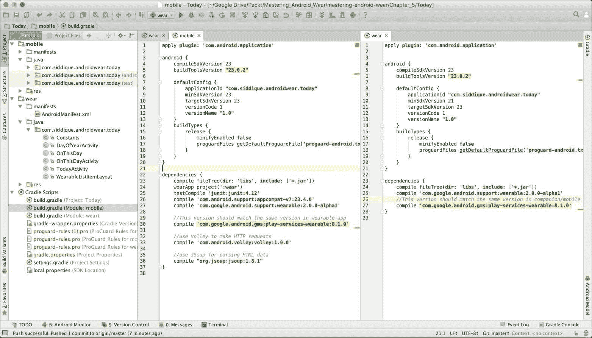

# 摘要

我们描述了需要伴侣手持应用的需求，并逐步介绍了创建 Android Wear 虚拟设备和将手持设备与其配对的过程。然后我们创建了一个新的`Today`应用，该应用通过伴侣应用从公共内容页获取内容，并将结果推送到可穿戴设备。

在下一章中，我们将介绍上下文感知通知和语音交互，这些功能为 Android Wear 提供了丰富的用户体验。
