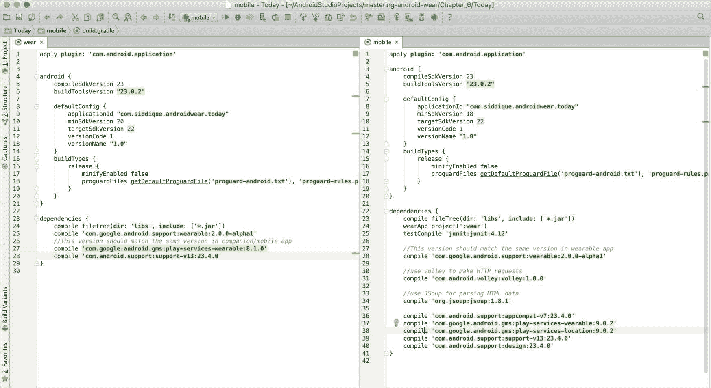
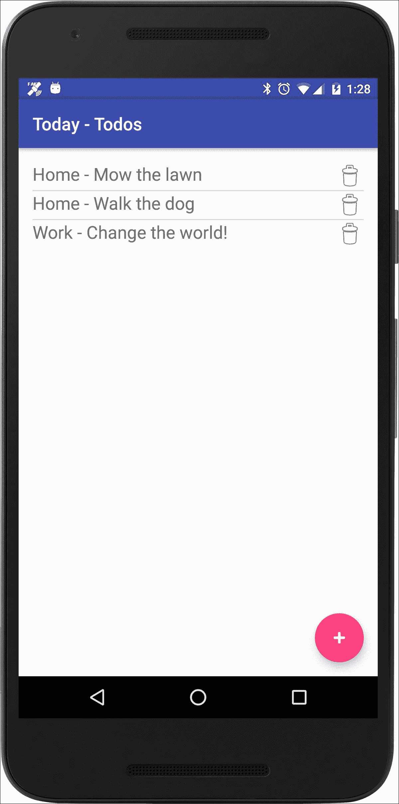
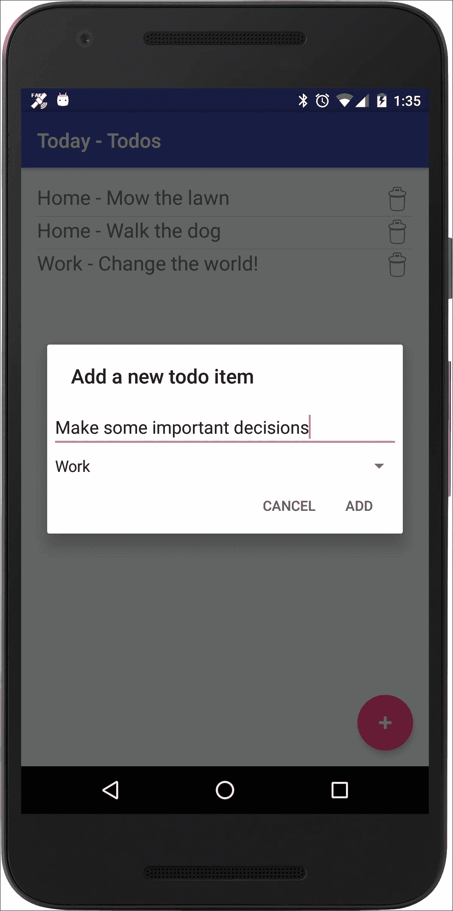
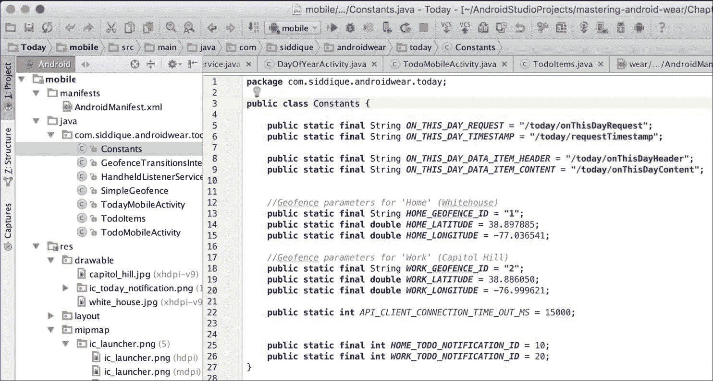
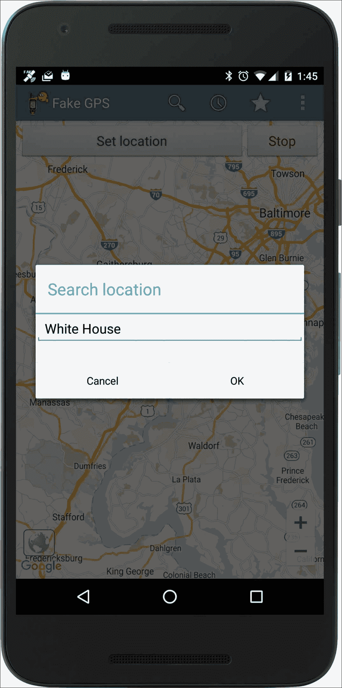
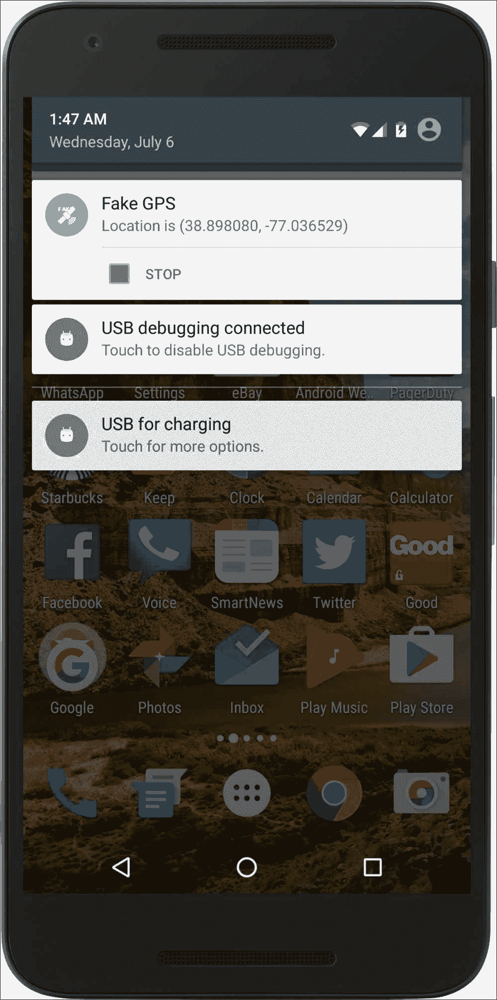
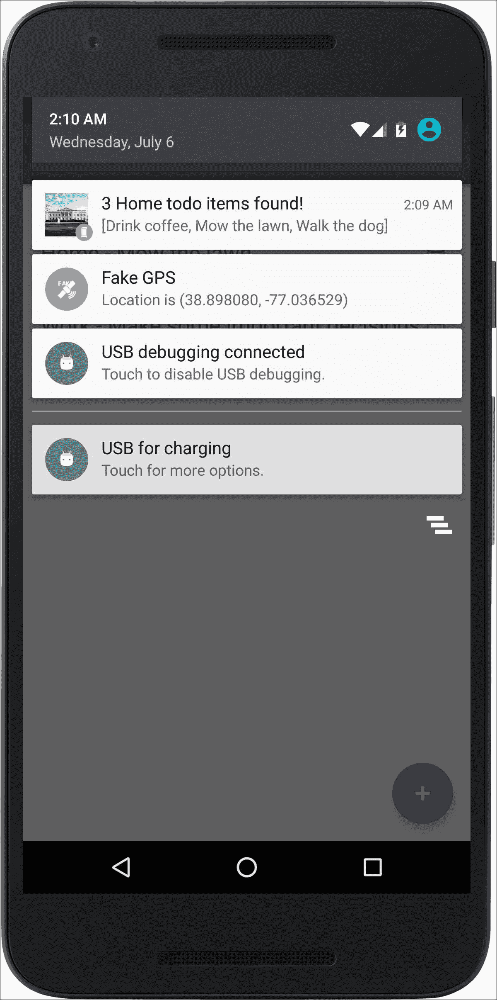
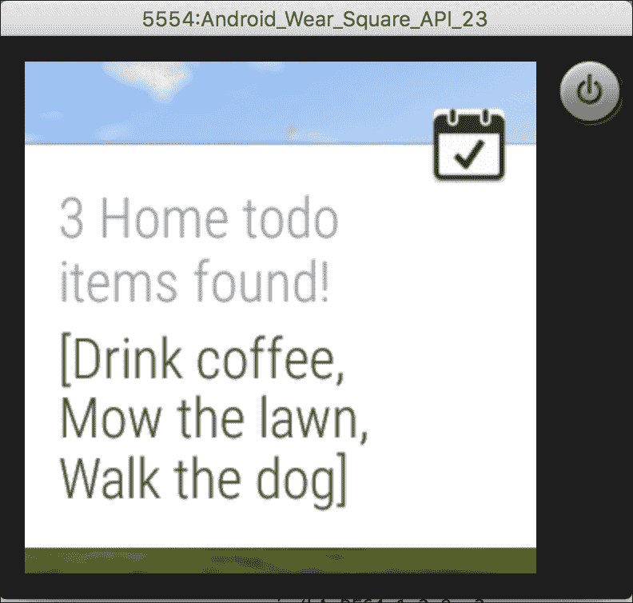
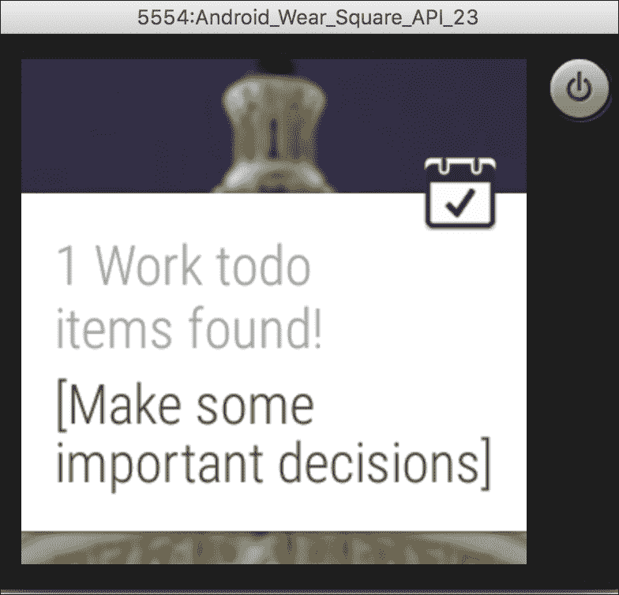

# 第六章. 上下文通知

|    | *"生活就是关于时机。" |    |
| --- | --- | --- |
|    | --*卡尔·刘易斯* |

在本章中，我们将讨论 Android Wear 中的通知。在快速比较可穿戴设备和手持设备中的通知之后，我们将继续扩展上一章中的“今日”应用，以演示 Android Wear 通知 API。

### 注意

本章的代码可在 GitHub 上参考（[`github.com/siddii/mastering-android-wear/tree/master/Chapter_6`](https://github.com/siddii/mastering-android-wear/tree/master/Chapter_6)）。为了简洁起见，仅包含所需的代码片段。鼓励读者从 GitHub 下载引用的代码，并在阅读章节时跟随。

# 接收通知

令人惊讶的是，可穿戴设备在向用户发送通知方面自然优于手持设备。使用手持设备时，你会听到蜂鸣声，你需要从钱包、口袋或你在最近一次 eBay 拍卖中抓到的任何选择皮套中取出你的设备。

但是，在智能手表上，事情相当不同。当你听到那个蜂鸣声时，你只需瞥一眼你的手腕。这种便利性是可穿戴设备技术的标志性特征。

而且不仅如此。借助语音交互，用户可以通过发出可识别的语音命令来对通知采取行动。当然，语音交互 API 早于 Wear API，并且在手持设备上已经使用了一段时间。但不可否认的是，它为可穿戴设备带来的巨大价值，与这种易于访问的特性完美契合。我们将在下一章中处理语音交互。

通知模型对可穿戴设备来说如此核心，以至于大多数教程通常将通知作为 Android Wear 的核心用例介绍；其他功能随后介绍。显然，我们在本书中选择了不同的处理方式。现在，我们来到了本书的一半，我们遇到了关于通知的第一次严肃讨论。

我们之所以这样做，是因为通知，无论它们多么重要或核心，仍然是应用程序的功能，因此是应用程序核心功能的次要部分。我们认为，在没有接触到 Android Wear 应用“筋骨”的情况下深入研究通知，是不切实际的。

你已经看到了“今日”应用的骨架，你已经增强了它以与配套手持应用一起工作。这是对 Wear API 的一些良好了解。现在，你准备好在此基础上构建知识。放心，如果你一直跟随着，你会发现通知 API 并不令人畏惧。

谈话到此为止；在我们看到示例应用中的实际操作之前，让我们先介绍 API 中的核心类。

## 通知 API 的核心类

这里是我们将在应用程序中使用的通知 API 的核心类。

### `NotificationCompat.Builder`

当您在可穿戴设备上处理通知时，您希望得到某种保证，即您的通知在智能手表显著缩小的比例上看起来是可接受的。这就是通知构建器类发挥作用的地方。这个类负责正确显示通知，无论它们出现在手持设备还是可穿戴设备上。

要使用通知构建器，您必须在您的`build.gradle`文件中添加以下行：

```java
compile "com.android.support:support-v4:20.0.+" 

```

然后，您需要从支持库中导入以下核心类：

```java
import android.support.v4.app.NotificationCompat; 
import android.support.v4.app.NotificationManagerCompat; 
import android.support.v4.app.NotificationCompat.WearableExtender; 

```

创建通知变成实例化`NotificationCompat.Builder`类并发布通知的问题，正如我们将在我们的示例应用程序中看到的那样。

### 通知中的操作按钮

`addAction`方法允许您向通知添加一个操作。只需将`PendingIntent`实例传递给`addAction`方法。虽然这个操作在手持设备上作为附加到通知的按钮出现，但在可穿戴设备上，当用户将通知向左滑动时，它将显示为一个大的按钮。点击操作将在手持设备上调用相关的意图。

### 仅适用于可穿戴设备的行为

如果您希望可穿戴设备上的操作与手持设备上的操作不同，请使用`NotificationCompat.WearableExtender`类上的`addAction`方法。这样做可以确保可穿戴设备不会显示添加到`NotificationCompat.Builder.addAction`类的操作。

### 交付

使用`NotificationManagerCompat` API 而不是`NotificationManager`来发送您的通知，如下所示。这确保了与旧平台的兼容性：

```java
// Get an instance of the NotificationManager service 
NotificationManagerCompat notificationManager = NotificationManagerCompat.from(mContext); 

// Issue the notification with notification manager 
notificationManager.notify(notificationId, notif); 

```

# 带有待办事项通知的 Today 应用程序

我们将增强我们的`Today`应用程序，添加一个允许用户添加待办事项并将它们与特定位置关联的活动，例如家或工作。这些位置提供了上下文，从而驱动通知。实际上，这使得我们的通知*具有上下文感知性*。

例如，如果系统检测到用户接近家位置，那么与`Home`类别关联的待办事项将通过通知 API 呈现给用户。

## 地理围栏

我们将使用`Geofencing` API 来确定位置，即上下文。本质上，这个 API 允许我们在一个坐标周围绘制一个半径已定的圆圈。实际上，纬度、经度和半径共同定义了一个*地理围栏*，即感兴趣坐标周围的圆形区域。进入和退出事件表示设备进入或退出地理围栏位置。可选的持续时间属性在设备进入并保持在地理围栏内时延迟触发该时间间隔的事件。

您可以通过访问[`developer.android.com/training/location/geofencing.html`](https://developer.android.com/training/location/geofencing.html)来详细了解`Geofencing` API。

## 模拟 GPS

首先要说明的是，在可穿戴设备模拟器上模拟位置/GPS 传感器行为并不容易，我们所有的示例代码都是这样做的。需要配备 GPS 的物理设备才能做到这一点。此外，即使我们能够访问一个完全功能的 GPS，我们也可能会遇到令人沮丧的场景来测试我们的应用程序——考虑需要物理移动到不同的位置以触发 GPS 传感器。

因此，为了演示上下文感知通知，我们需要一个 GPS 模拟服务，它允许我们使用我们的可穿戴设备模拟器以及物理手持设备，并且可以按需模拟不同的位置。

这就是 ByteRev 的 **FakeGPS** 应用程序发挥作用的地方 ([`play.google.com/store/apps/details?id=com.lexa.fakegps&hl=en`](https://play.google.com/store/apps/details?id=com.lexa.fakegps&hl=en))。

这个免费应用程序让我们能够模拟不同的位置，并有效地提供在物理设备上使用完全功能的 GPS 单元的等效体验。缺点是用户可能需要重新运行应用程序以模拟预期的行为。但这是为了灵活性而可以接受的权衡。

## 可穿戴和移动应用程序的 build.gradle 文件

移动手持应用程序的 build.gradle 文件应包含以下行以支持位置服务：

```java
compile 'com.google.android.gms:play-services-location:9.0.2' 

```

可穿戴和移动应用程序都应包含以下编译依赖项以支持通知：

```java
compile 'com.android.support:support-v13:23.4.0' 

```



## 手持应用程序的 Android 替换文件

注意权限授予允许应用程序访问精确位置，即纬度和经度坐标：

```java
<?xml version="1.0" encoding="utf-8"?> 
<manifest   
  package="com.siddique.androidwear.today"> 

  <uses-sdk  android:minSdkVersion = "18" android:targetSdkVersion="22"/> 

  <uses-permission  android:name = "android.permission.INTERNET"/> 

  <uses-permission  android:name="android.permission.ACCESS_FINE_LOCATION" /> 

<application 
  android:allowBackup="true" 
  android:icon="@mipmap/ic_launcher" 
  android:label="@string/app_name" 
  android:supportsRtl="true" 
  android:theme="@style/AppTheme"> 
  <meta-data 
    android:name="com.google.android.gms.version" 
    android:value="@integer/google_play_services_version" 
  /> 

  <activity 
    android:name=".TodayMobileActivity" 
    android:configChanges="keyboardHidden|orientation|screenSize" 
    android:label="@string/app_name" 
    android:windowSoftInputMode="stateHidden"> 
  </activity> 

<!— Listens for incoming messages from Wearable devices —> 
  <service android:name=".HandheldListenerService"> 
    <intent-filter> 

      <action  android:name="com.google.android.gms.wearable.DATA_CHANGED"/> 
      <action  android:name="com.google.android.gms.wearable.MESSAGE_RECEIVED"/> 

      data 
        android:host="*" 
        android:pathPrefix="/today" 
        android:scheme="wear" /> 
    </intent-filter> 
  </service> 

  <activity 
    android:name=".TodoMobileActivity" 
    android:label="@string/title_activity_todo_mobile" 
    android:theme="@style/AppTheme.NoActionBar"> 
    <intent-filter> 
      <action android:name="android.intent.action.MAIN" /> 

  <category android:name="android.intent.category.LAUNCHER" /> 
    </intent-filter> 
  </activity> 

  <service 
    android:name=".GeofenceTransitionsIntentService" 
    android:exported="false"> 
  </service> 
  </application> 
</manifest> 

```

我们添加了一个名为 `TodoMobileActivity` 的新活动，以便我们添加待办事项。由于我们需要访问 GPS 传感器，`ACCESS_FINE_LOCATION` 权限对于这个新活动是必要的。

`GeofenceTransitionsIntentService` 服务将响应位置的变化。

## `TodoMobileActivity` 类

`TodoMobileActivity` 类是一个简单的活动，向用户展示一个列表视图并允许添加待办事项。每个添加的项目可能与一组已知的地点（家庭或工作）相关联，每个地点都硬编码到一个 GPS 坐标：

```java
public class TodoMobileActivity extends AppCompatActivity implements GoogleApiClient.ConnectionCallbacks, GoogleApiClient.OnConnectionFailedListener 
{ 
  private ListView mTaskListView; 
  private ArrayAdapter<String> mAdapter; 

    public static final String TAG =  TodoMobileActivity.class.getName(); 
  private List<Geofence> geofenceList; 
  private PendingIntent mGeofencePendingIntent;   private GoogleApiClient mGoogleApiClient; 

  @Override 
  protected void onCreate(Bundle savedInstanceState) 
  { 
    super.onCreate(savedInstanceState); 
    setContentView(R.layout.activity_todo_mobile); 
    Toolbar toolbar = (Toolbar) findViewById(R.id.toolbar); 
    setSupportActionBar(toolbar); 

    mTaskListView = (ListView) findViewById(R.id.list_todo);     refreshItems(); 

    FloatingActionButton fab = (FloatingActionButton) findViewById(R.id.addTodo); 
    if (fab != null) { 
    fab.setOnClickListener(new View.OnClickListener() 
    { 
      @Override       public void onClick(View view) 
      { 
        LayoutInflater inflater = (LayoutInflater)  getSystemService(Context.LAYOUT_INFLATER_SERVICE); 
        final View addTodoItemView =  inflater.inflate(R.layout.add_todo_item, null); 

        final Spinner spinner = (Spinner)  addTodoItemView.findViewById(R.id.todoItemType); 
        ArrayAdapter<CharSequence> adapter =  ArrayAdapter.createFromResource(TodoMobileActivity.this,  R.array.todoItemTypes, android.R.layout.simple_spinner_item); 
        adapter.setDropDownViewResource( android.R.layout.simple_spinner_dropdown_item); 
        spinner.setAdapter(adapter); 

        AlertDialog dialog = new  AlertDialog.Builder(TodoMobileActivity.this) 
       .setTitle("Add a new todo item")        .setView(addTodoItemView)        .setPositiveButton("Add", new  DialogInterface.OnClickListener() 
        { 
          @Override 
          public void onClick(DialogInterface dialog, int which) 
          { 
            EditText taskEditText = (EditText)  addTodoItemView.findViewById(R.id.todoItem); 
            Log.i(TAG, "Todo Item = " + taskEditText.getText()); 

            Spinner todoItemTypeSpinner = (Spinner)  addTodoItemView.findViewById(R.id.todoItemType); 
            String todoItemType = (String)  todoItemTypeSpinner.getSelectedItem(); 
            Log.i(TAG, "Todo Item type = " + todoItemType); 

            String task = String.valueOf(taskEditText.getText()); 
            Set<String> todoItems =  TodoItems.readItems(TodoMobileActivity.this, todoItemType);             todoItems.add(task); 
            TodoItems.saveItems(TodoMobileActivity.this, todoItemType, todoItems); 
            refreshItems(); 
          } 
        }) 
        .setNegativeButton("Cancel", null) 
        .create(); 
         dialog.show(); 
      } 
    }); 
  } 

  if(null == mGoogleApiClient) 
  { 
    mGoogleApiClient = new GoogleApiClient.Builder(this) 
    .addApi(LocationServices.API) 
    .addConnectionCallbacks(this) 
    .addOnConnectionFailedListener(this) 
    .build(); 
     Log.i(TAG, "GoogleApiClient created"); 
  } 

  if(!mGoogleApiClient.isConnected()) 
  { 
    mGoogleApiClient.connect(); 
    Log.i(TAG, "Connecting to GoogleApiClient.."); 
  } 
} 

private void createGeofences() 
{ 
  Log.i(TAG, "Creating geo fences"); 
  geofenceList = new ArrayList<Geofence>(); 
  geofenceList.add(new SimpleGeofence( 
    Constants.HOME_GEOFENCE_ID, 
    Constants.HOME_LATITUDE, 
    Constants.HOME_LONGITUDE).toGeofence()); 

  geofenceList.add(new SimpleGeofence( 
    Constants.WORK_GEOFENCE_ID, 
    Constants.WORK_LATITUDE, 
    Constants.WORK_LONGITUDE).toGeofence()); 
} 

private void refreshItems() 
{ 
  ArrayList<String> taskList = new ArrayList<>(); 

  String[] todoItemTypes = 
getResources().getStringArray(R.array.todoItemTypes); 
  for (String todoItemType : todoItemTypes) 
  { 
    Set<String> todoItems = TodoItems.readItems(this, 
todoItemType); 
    for (String todoItem : todoItems) 
    { 
      taskList.add(todoItemType + " - " + todoItem); 
    } 
  } 

  if (mAdapter == null) { 
    mAdapter = new ArrayAdapter<>(this, 
    R.layout.item_todo, 
    R.id.task_title, 
    taskList); 
    mTaskListView.setAdapter(mAdapter);   } 
  else 
  { 
    mAdapter.clear(); 
    mAdapter.addAll(taskList); 
    mAdapter.notifyDataSetChanged(); 
  } 
} 

public void deleteTodoItem(View view) 
{ 
  View parent = (View) view.getParent(); 
  TextView textView = (TextView)  parent.findViewById(R.id.task_title); 

  String removingItem = (String) textView.getText(); 
  Log.i(TAG, "Removing Item = " + removingItem); 

  String[] todoItemTypes =  getResources().getStringArray(R.array.todoItemTypes); 
  TodoItems.removeItem(this, todoItemTypes, removingItem); 
  refreshItems(); 
} 

@Override public void onConnected(@Nullable Bundle bundle) 
{ 
  if(mGoogleApiClient != null) 
  { 
    mGeofencePendingIntent = getGeofenceTransitionPendingIntent(); 
    createGeofences(); 
    Log.i(TAG, "Adding geofences to API location services"); 
     LocationServices.GeofencingApi.addGeofences(mGoogleApiClient, geofenceList,mGeofencePendingIntent);   } 
} 

private PendingIntent getGeofenceTransitionPendingIntent() 
{ 
  Intent intent = new Intent(this,  GeofenceTransitionsIntentService.class); 
  return PendingIntent.getService(this, 0, intent,  PendingIntent.FLAG_UPDATE_CURRENT); 
} 

@Override public void onConnectionSuspended(int i) 
{ 
  Log.i(TAG, "onConnectionSuspended called"); 
} 

@Override public void onConnectionFailed(@NonNull ConnectionResult connectionResult) 
{ 
  Log.i(TAG, "onConnectionFailed called");   } 
} 

```

注意我们使用的 `SimpleGeofence` 类需要三个参数；它内部将半径设置为 50 米。有关更多实现细节，请参阅 GitHub 上的示例代码。

# 待办事项列表视图

下图展示了待办事项列表视图的外观。用户可以添加待办事项，并删除现有的项目。列表中的每个项目都会显示，包括其位置：



# 添加待办事项

下图显示了向 `Today-Todo` 应用程序添加新待办事项的示例输入：



## 模拟位置

您可能已经注意到我们选择定义了两个位置——家和办公室。现在，因为我们有很高的抱负，我们冒险为最有资格的个人构建这个应用，即美国总统。所以，这就是为什么家庭坐标对应于白宫，工作坐标对应于国会山（好吧，我们知道这是一个糟糕的例子。总统在白宫西翼的椭圆形办公室工作。但是，想象一下，如果“工作”和“家”有相同的坐标，我们的示例代码将有多么无意义？）。包含这些值的`Constants`文件如下所示：



## 使用模拟 GPS 应用模拟位置

启动模拟 GPS 应用，并按如下方式搜索位置“白宫”：



在您点击“设置位置”按钮后，模拟 GPS 将开始模拟我们设置的位置。注意前图中纬度和经度。看看它们与我们定义在`Constant`文件中的`Constants.HOME_LATITUDE`和`Constants.HOME_LONGITUDE`有多接近：



## 地理围栏转换 IntentService 类

您可能还记得我们之前提到的`TodoMobileActivity`活动，其中`GeofenceIntentService`类将在位置发生变化时被调用。`onHandleIntent`方法是我们放置代码以根据用户可能输入的`geofence`位置通知用户任何待办事项的地方：

```java
public class GeofenceTransitionsIntentService extends IntentService 
{ 
  private static final String TAG =  GeofenceTransitionsIntentService.class.getName(); 

  public GeofenceTransitionsIntentService() 
  { 
    super(GeofenceTransitionsIntentService.class.getSimpleName()); 
  } 

  @Override 
  public void onCreate() 
  { 
    super.onCreate(); 
  }  
  /* 
  *Handles incoming intents.* 
  * @param intent The Intent sent by Location Services. This Intent is provided to Location 
  *Services (inside a PendingIntent) when addGeofences() is called. 
  */ 
  @Override 
  protected void onHandleIntent(Intent intent) 
  { 
    Log.i(TAG, "Location changed " + intent); 
    GeofencingEvent geoFenceEvent =  GeofencingEvent.fromIntent(intent); 
    if (geoFenceEvent.hasError()) 
    { 
      int errorCode = geoFenceEvent.getErrorCode(); 
      Log.e(TAG, "Location Services error: " + errorCode); 
    } 
    else 
    { 
      int transitionType = geoFenceEvent.getGeofenceTransition(); 
     // Get an instance of the NotificationManager service 
     NotificationManagerCompat notificationManager =  NotificationManagerCompat.from(this); 

    Log.i(TAG, "Notifying home todo items"); 
    String triggeredGeoFenceId =  geoFenceEvent.getTriggeringGeofences().get(0) 
   .getRequestId(); 
    switch (triggeredGeoFenceId) 
    { 
      case Constants.HOME_GEOFENCE_ID: 
      if (Geofence.GEOFENCE_TRANSITION_ENTER == transitionType)  
      { 
        Log.i(TAG, "Notifying home todo items"); 
        notifyTodoItems(notificationManager, "Home", Constants.HOME_TODO_NOTIFICATION_ID, R.drawable.white_house); 
      } 
      break; 

      case Constants.WORK_GEOFENCE_ID: 
        if (Geofence.GEOFENCE_TRANSITION_ENTER == transitionType) 
        { 
          Log.i(TAG, "Notifying work todo items"); 
          notifyTodoItems(notificationManager, "Work", Constants.WORK_TODO_NOTIFICATION_ID, R.drawable.capitol_hill); 
        } 
        break; 
      } 
    } 
  } 

  private void notifyTodoItems(NotificationManagerCompat notificationManager, String todoItemType, int notificationId, int background) 
{ 
  Set<String> todoItems = TodoItems.readItems(this, todoItemType); 
  Intent viewIntent = new Intent(this, TodoMobileActivity.class); 
  PendingIntent viewPendingIntent =  PendingIntent.getActivity(this, 0, viewIntent,  PendingIntent.FLAG_UPDATE_CURRENT); 

  NotificationCompat.Builder notificationBuilder =  new NotificationCompat.Builder(this) 
  .setSmallIcon(R.drawable.ic_today_notification) 
  .setLargeIcon(BitmapFactory.decodeResource( 
  getResources(), background)) 
  .setContentTitle(todoItems.size() + " " + todoItemType + " todo  items found!")   .setContentText(todoItems.toString()    ) 
  .setContentIntent(viewPendingIntent); 

// Build the notification and issues it with notification manager. 
  notificationManager.notify(notificationId,  notificationBuilder.build()); 
  } 
} 

```

## 手持应用通知

下图显示了将模拟 GPS 应用设置为`Home`时的应用程序运行情况。请看手持设备上显示的与家庭位置相关的三个待办事项的通知：



## 可穿戴应用通知

下图显示了在可穿戴设备上显示的相同通知：



现在，如果我们更改模拟 GPS 应用中的位置为“国会山”并重新启动“今日-待办”应用，正如预期的那样，在可穿戴设备上我们得到了不同的通知，如下面的截图所示：



# 摘要

在本章中，我们将“今日”应用扩展以包含待办活动。我们使用这个扩展来演示使用“通知”API 实现的环境感知通知。通知在移动设备和可穿戴设备模拟器上显示。我们介绍了地理围栏的概念，并使用“地理围栏”API 以及一个模拟 GPS 应用来模拟我们的位置。
