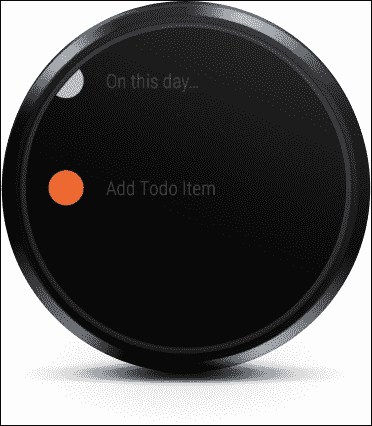
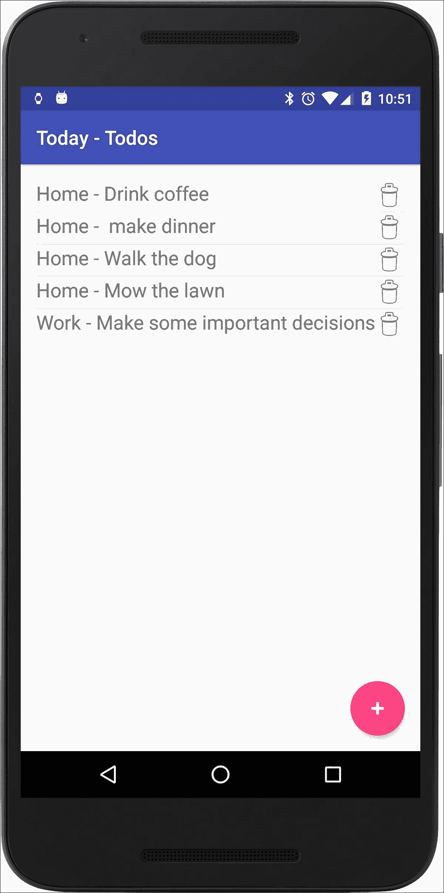
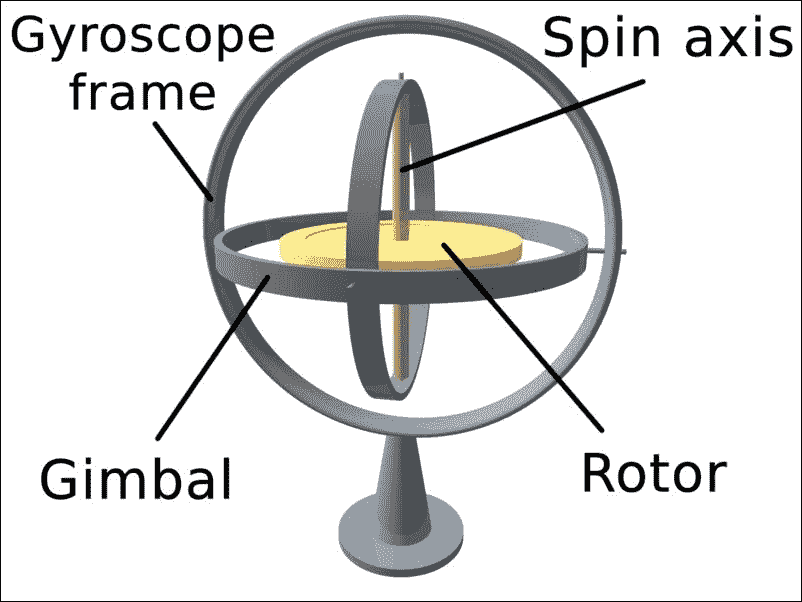
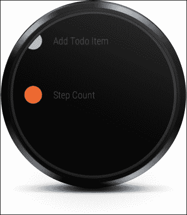

# 第七章. 语音交互、传感器和跟踪

|    | *"All I have is a voice."* |
| --- | --- |
|    | --*W. H. Auden* |

在本章中，我们介绍了 Wear API 提供的语音功能，并定义了与上一章中的`Today`应用交互的语音操作。我们还介绍了设备传感器，并讨论了如何使用它们来跟踪数据。

### 备注

本章的代码可在 GitHub 上参考([`github.com/siddii/mastering-android-wear/tree/master/Chapter_7`](https://github.com/siddii/mastering-android-wear/tree/master/Chapter_7))。为了简洁起见，只包括所需的代码片段。鼓励读者从 GitHub 下载引用的代码，并在阅读本章时跟随。

# 语音功能

如果你是在 80 年代度过你的青少年时期，那么你关于可穿戴设备语音交互的所有知识可能都来自这个人：


三十年过去了，你现在正迫不及待地想知道 Wear API 是否提供了系统提供的语音操作，让你能够召唤你的汽车。恐怕，目前还没有。完整的系统提供的语音操作列表将在下面的子节中展示。

### 备注

你可以访问 Android 开发者网站([`developer.android.com/training/wearables/apps/voice.html`](https://developer.android.com/training/wearables/apps/voice.html))，了解更多关于你的可穿戴应用语音功能的信息。

通过系统提供的语音操作，我们指的是内置在 Wear 平台中的语音操作，即开发者开箱即用的操作。

相比之下，术语应用提供的语音操作指的是特定于你的应用的那些操作。

## 系统提供的语音操作

系统提供的语音操作必须根据你想要启动的具体活动进行过滤。例如，记下自用笔记。

Wear 平台支持以下语音意图：

+   记笔记

+   打电话叫车/出租车

+   设置闹钟

+   设置计时器

+   开始/停止跑步

+   开始/停止骑行

+   开始计时器

+   开始/停止跑步

+   开始/停止锻炼

+   显示步数

+   显示心率

## 应用提供的语音操作

根据你的需求，系统提供的语音操作可能不够用。在这种情况下，你可以选择以注册手持设备上的启动器图标相同的方式为你的应用注册一个启动操作。

要使用语音操作启动`TodayActivity`，请指定一个标签属性，其文本值设置为在`Start`关键字之后所说的任何内容。在这个示例代码中，我们使用我们的应用名称作为标签属性。存在一个 intent-filter 标签可以识别语音操作`Start Today`并启动`TodayActivity`活动：

```java
<activity 
  android:name=".TodayActivity" 
  android:label="@string/app_name"> 
  <intent-filter> 
    <action android:name="android.intent.action.MAIN" /> 
    <category android:name="android.intent.category.LAUNCHER" /> 
  </intent-filter> 
</activity> 

```

# 新功能 - 通过语音命令添加待办事项

让我们准备好编写一些代码。在上一个章节中，我们增强了 `Today` 应用，使我们能够通过配对的便携式应用添加待办事项。然后，可穿戴设备根据配置的上下文显示通知。

现在，让我们通过添加语音交互来增加一些趣味。我们将使用可穿戴应用通过语音命令来记录待办事项。这将涉及扩展我们实现的有上下文感知通知功能，并能够使用语音输入添加待办事项。此外，我们将提供上下文以及待办事项。

例如，如果我们说“home make dinner”，我们的可穿戴应用将创建一个名为 *Make dinner* 的待办事项，并将其与 `Home` 上下文相关联。同样，如果我们说“work set up monthly review meeting”，应用将创建一个名为 *Set up monthly review meeting* 的待办事项，并将其与 `Work` 上下文相关联。

在我们逐步查看代码之前，有一些事情需要记住：

+   在撰写本文时，Android Wear 模拟器不支持语音输入。因此，我们选择使用物理可穿戴设备。

+   现在，如果您还记得，我们之前提到过，我们实际上并不需要物理设备来构建 Android Wear 应用。虽然这在很大程度上是正确的，但有些情况下模拟器无法模拟物理设备的行为，例如语音输入、运动感应等。在这些情况下，我们别无选择，只能获取物理设备以获得更完整的 Android Wear 开发体验。此外，如果您对 Android Wear 开发认真负责，您不妨考虑购买物理设备，因为它真的有助于加快您的开发速度。

+   重要的是要注意，尽管语音交互目前在 Android Wear 模拟器中不受支持，但 Google 可能会在未来提高对语音交互的支持。我们将密切关注这一点。

## 添加待办事项 - 可穿戴应用中的新操作

让我们开始吧。我们将要做的第一件事是将 `Add Todo Item` 操作添加到我们的 `arrays.xml` 文件中：

```java
<?xml version="1.0" encoding="utf-8"?> 
<resources> 
  <string-array name="actions"> 
    <item>Day of Year</item> 
    <item>On this day...</item> 
    <item>Add Todo Item</item> 
  </string-array> 
</resources> 

```

这个新配置的操作现在显示在我们的屏幕上，如下所示：



# 可穿戴应用中的 AddTodoItem 活动

我们为 `AddTodoItem` 活动的选择连接了处理程序：

```java
@Override 
public void onClick(WearableListView.ViewHolder viewHolder)  
{ 
  Log.i(TAG, "Clicked list item" +  viewHolder.getAdapterPosition()); 
  if (viewHolder.getAdapterPosition() == 0)  
  { 
    Intent intent = new Intent(this, DayOfYearActivity.class); 
    startActivity(intent); 
  }  
  else if (viewHolder.getAdapterPosition() == 1)  
  { 
    Intent intent = new Intent(this, OnThisDayActivity.class); 
    startActivity(intent); 
  }  
  else if (viewHolder.getAdapterPosition() == 2) 
  { 
    displaySpeechRecognizer(); 
  } 

//Create an intent that can start the Speech Recognizer activity 
private void displaySpeechRecognizer()  
{ 
  Intent intent = new  Intent(RecognizerIntent.ACTION_RECOGNIZE_SPEECH); 
  intent.putExtra(RecognizerIntent.EXTRA_LANGUAGE_MODEL, 
  RecognizerIntent.LANGUAGE_MODEL_FREE_FORM); 
  // Start the activity, the intent will be populated with the speech text 
  startActivityForResult(intent, Constants.SPEECH_REQUEST_CODE); 
} 

```

点击 **添加待办事项** 操作会产生以下效果：


# 处理语音输入

当语音识别器返回带有语音输入意图时，`onActivityResult` 方法回调被触发。注意我们如何提取语音文本，然后在语音命令以我们预定义的上下文之一（即 `home` 或 `work`）开始时调用 `GoogleApiClient` API：

```java
// This callback is invoked when the Speech Recognizer returns. 
// This is where you process the intent and extract the speech text from the intent. 
@Override 
protected void onActivityResult(int requestCode, int resultCode,  Intent data)  
{ 
  if (requestCode == Constants.SPEECH_REQUEST_CODE && resultCode  == RESULT_OK) 
  { 
    List<String> results = data.getStringArrayListExtra( RecognizerIntent.EXTRA_RESULTS); 
    spokenText = results.get(0); 
    // Do something with spokenText 
    Log.i(TAG, "Spoken Text = " + spokenText); 
    if (spokenText.startsWith("home") ||  spokenText.startsWith("work"))  
    { 
      Log.i(TAG, "Creating Google Api Client"); 
      mGoogleApiClient = new GoogleApiClient.Builder(this) 
      addApi(Wearable.API) 
      .addConnectionCallbacks(this) 
      .addOnConnectionFailedListener(this) 
      .build(); 
       mGoogleApiClient.connect(); 
    } 
  }  
  else  
  { 
    super.onActivityResult(requestCode, resultCode, data); 
  } 
} 

```

Android Wear 解析语音输入，并将语音文本作为确认显示，如下所示：


一旦`GoogleClient`连接成功，即`onConnected`处理程序被触发，我们将在排除上下文（`home`或`work`）之后提取`todoItem`文本，并使用`Wearable Data` API 将待办事项作为消息发送到手持应用：

```java
@Override 
public void onConnected(Bundle bundle) 
{ 
  Log.i(TAG, "Connected to Data Api"); 
  if(spokenText != null) 
  { 
    if (spokenText.startsWith("home")) 
    { 
      String todoItem = spokenText.substring("home".length()); 
      sendMessage(Constants.HOME_TODO_ITEM, todoItem.getBytes()); 
    } 
    else if(spokenText.startsWith("work"))  
    { 
      String todoItem = spokenText.substring("work".length()); 
      sendMessage(Constants.WORK_TODO_ITEM, todoItem.getBytes()); 
    } 
  } 
} 

private void sendMessage(final String path, final byte[] data)  
{ 
  Log.i(TAG, "Sending message to path " + path); 
  Wearable.NodeApi.getConnectedNodes(mGoogleApiClient).setResultCallback( 
  new ResultCallback<NodeApi.GetConnectedNodesResult>()  
  { 
    @Override 
    public void onResult(NodeApi.GetConnectedNodesResult nodes)  
    { 
      for (Node node : nodes.getNodes())  
      { 
        Wearable.MessageApi 
        sendMessage(mGoogleApiClient, node.getId(), path, data); 
        spokenText = null; 
      } 
    } 
  }); 
} 

```

# 手持应用

在手持应用上，我们实现`onMessageReceived`处理程序来处理从可穿戴设备接收到的消息。记住，手持应用是我们进行繁重工作的地方。在这种情况下，它是创建待办事项：

```java
@Override 
public void onMessageReceived(MessageEvent messageEvent) 
{ 
  super.onMessageReceived(messageEvent); 
  Log.i(TAG, "Message received" + messageEvent); 
  if(Constants.ON_THIS_DAY_REQUEST.equals(messageEvent.getPath())) 
  { 
    //read Today's content from Wikipedia 
    getOnThisDayContentFromWikipedia(); 
  }  
  else  
  { 
    String todo = new String(messageEvent.getData()); 
    if (Constants.HOME_TODO_ITEM.equals(messageEvent.getPath()))  
    { 
      Log.i(TAG, "Adding home todo item '" + todo + "'"); 
      TodoItems.addItem(this, "Home", todo); 
    }  
    else if (Constants.WORK_TODO_ITEM.equals(messageEvent.getPath()))  
    { 
      Log.i(TAG, "Adding work todo item '" + todo + "'"); 
      TodoItems.addItem(this, "Work", todo);     } 
  } 
} 

```

添加的待办事项在手持设备的`Today - Todos`应用中的待办事项列表中显示，如图所示：



# 运动传感器

运动传感器使我们能够通过空间监控设备的运动，例如旋转、摆动、摇晃或倾斜。这种运动可能与其直接环境相关，例如在汽车模拟中模仿方向盘时的情况。在这种情况下，我们监控其相对于自身参考系或运行在其上的应用程序的参考系的运动。

然而，这种运动也可能相对于设备周围的环境，即世界。后者的一个例子是从移动车辆内部确定绝对速度。设备可能在车辆内部是静止的，但它以与车辆本身相同的速度相对于地球移动。

安卓平台使我们能够通过一系列传感器监控设备的运动——一些是基于硬件的，例如陀螺仪和加速度计。其他是基于软件的，或者可能是基于硬件的，但依赖于其他硬件传感器。例如，旋转矢量传感器、重力传感器、显著运动传感器、步数计数传感器和步检测传感器。你可以在开发者网站上了解所有这些信息（[`developer.android.com/guide/topics/sensors/sensors_motion.html`](https://developer.android.com/guide/topics/sensors/sensors_motion.html)）。

在本节中，我们的关注点是简要介绍两个位于所有运动传感核心的硬件传感器：陀螺仪和加速度计。理解这些传感器背后的原理将使我们欣赏到贯穿所有运动传感器行为的物理学，并让我们对如何通过 API 间接使用这些传感器来解决我们的应用程序问题有一个直观的认识。

## 陀螺仪

陀螺仪在最基本层面上，是一个由轮子或圆盘组成，安装得使其能够绕轴自由旋转，而不会受到包围它的安装方向的任何影响的装置。

以下图像有助于我们更好地可视化其结构：



为了获得直观的理解，我们只需要消化这样一个事实：陀螺仪的特性仅在转子（盘）绕其轴旋转时才会显现。当盘不旋转时，设备不会表现出任何有用的特性。但是当旋转时，该轴的取向不受安装倾斜或旋转的影响。这与角动量守恒定律相符，本质上，这也是陀螺仪用于测量或保持方向的原因。

## 加速度计

加速度计是一种测量加速度的仪器，通常用于测量汽车、船舶、飞机或宇宙飞船的加速度，或涉及机器、建筑物或其他结构的振动。

加速度计在科学和工业的许多领域都有应用。例如，加速度计用于检测和监控旋转机械的振动。它们也被用于平板电脑和数码相机，以确保图像始终在屏幕上正确显示。

在可穿戴设备领域，加速度传感器测量作用于设备上的加速度，包括重力。一般来说，如果您正在监控设备运动，加速度计通常是一个不错的选择。它几乎在所有基于 Android 的手持设备和平板电脑上都有。它比其他运动传感器消耗的电量要少得多。

# 新功能 - 跟踪我们的步数

每个人都喜欢步数计数器。我们为什么不为我们的可穿戴设备构建一个呢？这里没有太多可说的，所以让我们直接进入代码。

## 添加待办事项 - 可穿戴应用中的新操作

我们在这里要做的第一件事是为可穿戴应用添加一个菜单项。让我们称它为“步数计数”。我们对`arrays.xml`文件的更改如下：

```java
<?xml version="1.0" encoding="utf-8"?> 
<resources> 
    <string-array name="actions"> 
        <item>Day of Year</item> 
        <item>On this day...</item> 
        <item>Add Todo Item</item> 
        <item>Step Count</item> 
    </string-array> 
</resources> 

```

现在您应该可以在可穿戴应用中看到这个操作，如图所示：



点击“步数计数”菜单项以启动相应的`StepCounterActivity`活动。该类的代码如下。注意该活动如何实现`SensorEventListener`类。我们使用`SensorManager`类在该活动的`onCreate`处理程序中连接正确的传感器类型。请注意，由于该活动实现了`SensorEventListener`类，您期望与之关联的其他处理程序：

```java
public class StepCounterActivity extends Activity implements SensorEventListener  
{ 
  private SensorManager mSensorManager; 
  private Sensor mSensor; 

  // Steps counted since the last reboot 
  private int mSteps = 0; 

  private static final String TAG =  StepCounterActivity.class.getName(); 

  @Override 
  protected void onCreate(Bundle savedInstanceState)  
  { 
    super.onCreate(savedInstanceState); 
    setContentView(R.layout.activity_daily_step_counter); 

    mSensorManager = (SensorManager) getSystemService(Context.SENSOR_SERVICE); 
    mSensor = mSensorManager.getDefaultSensor(Sensor.TYPE_STEP_COUNTER);   } 

  @Override 
  protected void onResume()  
  { 
    super.onResume(); 
    mSensorManager.registerListener(this, mSensor,  SensorManager.SENSOR_DELAY_NORMAL); 
    refreshStepCount(); 
  } 

  @Override 
  protected void onPause()  
  { 
    super.onPause(); 
    mSensorManager.unregisterListener(this); 
  } 

  @Override 
  public void onSensorChanged(SensorEvent event)  
  { 
    Log.i(TAG,"onSensorChanged - " + event.values[0]); 
    if(event.sensor.getType() == Sensor.TYPE_STEP_COUNTER)  
    { 
      Log.i(TAG,"Total step count: " + mSteps); 
      mSteps = (int) event.values[0]; 
      refreshStepCount(); 
    } 
  } 
  private void refreshStepCount()  
  { 
    TextView desc = (TextView)  findViewById(R.id.daily_step_count_desc); 
    desc.setText(getString(R.string.daily_step_count_desc,  mSteps)); 
  } 

  @Override 
  public void onAccuracyChanged(Sensor sensor, int accuracy)  
  { 
    Log.i(TAG,"onAccuracyChanged - " + sensor); 
  } 
} 

```

这就是我们的新活动在可穿戴设备上的外观：


如前述代码所示，我们在这里使用的传感器类型由`Sensor`类的`TYPE_STEP_COUNTER`常量表示。这种类型的传感器获取用户自上次可穿戴设备重启以来所走的步数。关于这种传感器类型，需要记住的重要一点是，应用程序需要保持注册状态，因为如果未激活，步数计数器不会跟踪步数。

我们选择这种基本类型的传感器，因为我们关注的重点是使用 API。请随意探索这里的`Sensor` API 类，以研究您可用的其他传感器。特别是，看看`TYPE_STEP_DETECTOR`传感器类型。这种传感器每次用户迈步时都会触发一个事件。与追踪一段时间内所迈步数的计步器不同，步数检测器非常适合在迈步的瞬间检测步数。

您也可以思考一下如何实现给定一天的计步器——这是一个留给有兴趣的读者去充分利用我们的`Today`应用的练习。

# 摘要

在本章中，我们展示了使用`Wear` API 创建应用提供的语音动作，以启动我们的`Today Todo`应用。我们还介绍了运动传感器概念，并检查了让我们可以利用这些传感器的 API 类。然后，我们将这些概念应用于增强我们的示例`Today`应用，通过一个简单的活动来跟踪用户所迈步数。
