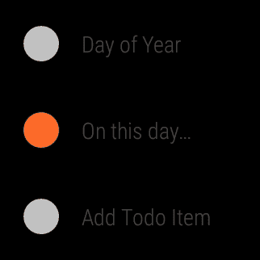

# 第八章 创建自定义 UI

|   | *"我说她没有脸，但这意味着她有一千张脸。"*                                                                                          |   |
| --- | --- | --- |
|   | --*C. S. Lewis* |

在本章中，我们将介绍对 Android Wear UI 空间至关重要的设计原则，并简要介绍一些常见的 Wear UI 模式。然后我们将扩展`OnThisDay`活动，以用户友好的格式展示信息流。

### 注意

本章伴随的代码可在 GitHub 上参考（[`github.com/siddii/mastering-android-wear/tree/master/Chapter_8`](https://github.com/siddii/mastering-android-wear/tree/master/Chapter_8)）。为了简洁起见，仅包含所需的代码片段。鼓励读者从 GitHub 下载引用的代码，并在阅读本章时跟随。

# Android Wear UI 设计

到现在为止，我们应该已经清楚，可穿戴应用并不总是可以遵循其手持设备对应的应用相同的 UI 模式。可穿戴设备具有显著较小的形态因素，与之交互对用户动作施加了更重的限制。因此，Android Wear 用户界面 API 在功能上分为*建议*函数和*需求*函数。

*建议* 函数体现在`Context`流中——以一种主动和提示的方式呈现的信息流。用户会看到一个信息卡片的垂直列表，可以滚动浏览，直到用户希望与特定的卡片交互。

*需求* 函数体现在提示卡隐喻中。提示卡可以通过说出“**OK Google**”来打开，或者，我们也可以通过轻触主屏幕的背景来打开它。每个语音命令激活一种语音意图，而这种意图又可以与多个应用程序相关联。

当用户面对意图时，他们将有选择他们希望激活该意图的应用程序的机会。应用程序可以通过添加/更新流卡片或启动另一个应用程序来响应。

# 常见 UI 模式

我们将简要介绍在 Android Wear 开发中最常实现的 UI 模式。

## 卡片

在上下文流中显示的卡片可以是标准通知、单操作卡片，或者是一个可展开的堆叠，将相关的通知分组在一起。在每种情况下，卡片右上角的位置都有一个图标，表示该卡片关联的应用程序。

在某些情况下，单个通知卡不足以满足需求，可能需要更多细节。从右向左滑动可以显示详细卡片，除了主要上下文流卡片之外。在卡片上从左向右滑动会导致它从上下文流中移除。

值得注意的是，在可穿戴设备上取消的通知也会因为配对设备之间共享的同步状态而在配对的手持设备上取消。

卡片可以可选地显示在详细卡片右侧的操作按钮。这些操作可以在可穿戴设备上运行。或者，它们可以委托给伴侣手持设备，或者它们可以导致全屏活动运行。

### 倒计时和确认

当用户点击显示在详细卡片右侧的操作按钮时，系统可以在操作完成后显示确认动画。

在某些情况下，可能希望给用户一个在操作执行之前中断操作的机会。解决这一问题的方法之一是在操作调用之前显示一个可定制的倒计时动画。

一些操作可能是关键性的，可能希望通过向用户显示确认步骤来突出显示这一点。然后用户必须确认他们执行该操作的意思。

作为开发者，我们应该始终权衡在可能的情况下将任何繁重的工作委托给伴侣手持设备的选项。如果对上下文流中卡片上调用的操作这样做，那么我们可以在用户点击操作按钮并在手持设备上启动相应的应用程序后，在可穿戴设备上显示动画。

还可以选择在卡片上执行操作。这些是在卡片本身上执行的操作。当只有一个可能的操作可以由点击执行时，这些操作是理想的。例如，显示在通知中的地址上的汽车图标只能表示方向，因此是一个很好的候选者，可以作为卡片上的操作。卡片上的操作在其目的上应该是明确的。

另一种选择（即当有多个可能的操作时）是通过详细卡片右侧的操作按钮调用它们。例如，在人的姓名的情况下，卡片上的操作是不明确的，因此单独的操作按钮会更好，例如，用于呼叫、电子邮件、显示详细信息等操作。

### 卡片堆叠

一些卡片可能相关，将它们分组在一起在堆叠中是有意义的。例如，为了显示新邮件通知，卡片堆叠可以将所有新邮件通知分组在一起。

用户可以点击卡片堆叠使其展开并显示堆叠中每张卡片的上边缘。进一步点击展开的卡片将在上下文流中的垂直列表中将其展开到完全展开状态。

当用户垂直滑动远离卡片堆叠时，堆叠中的所有卡片都会恢复到完全折叠状态，并且单个堆叠再次在上下文中显示。

### 2D 选择器

2D 选择器是一种灵活的 UI 模式，用于 Android Wear 应用。它允许我们根据需求构建一维卡片列表或二维卡片网格。

此外，可以设置滚动方向为水平或垂直。呈现给用户的数据分布在页面上，然后每一页对应一张卡片。

一种直观的展示方式是将包含（例如）搜索结果的垂直卡片列表显示给用户。垂直列表中的每个卡片都展示少量信息，并且可以通过水平滚动从它获取更多信息，以显示包含剩余信息页面的后续卡片。

通过向相关活动的布局中添加一个 `GridViewPager` 元素实例来实现 2D 选择器模式。然后，此页面必须为其设置一个 `GridPagerAdapter` 类型的适配器。

为了使事情更简单，一个扩展 `GridPageAdapter` 类的抽象类名为 `FragmentGridPageAdapter` 定义了您的适配器将需要的常见行为，因此您只需扩展 `FragmentGridPageAdapter` 类来实现您自己的适配器，以提供一组页面来填充 `GridViewPager` 元素。

在使用 2D 选择器演示时，我们必须确保我们优化它以获得速度。这可以通过保持卡片简单并最小化选择器中的卡片数量来实现。

当用户做出选择时，应该销毁 2D 选择器。用户还可以通过在第一张卡片上向下滑动或在最左侧的卡片上向右滑动来从 2D 选择器中退出。

## 选择列表

这是一个常见的模式，其中可能的选项以简单的可滚动列表的形式呈现。用户从列表中选择一个项目，从而触发一个动作。

Android Wear UI 库提供了一个针对可穿戴设备优化的列表实现，即 `WearableListView` 元素。要创建此类列表，您需要将 `WearableListView` 元素添加到您的活动布局定义中，然后将其适配器设置为您的自定义布局实现的实例。

# 再次访问 OnThisDay 活动

注意，我们最初在 第五章，*同步数据* 中实现的 `OnThisDayActivity` 活动使用了 `ScrollView` 方法内的 `TextView` 方法。让我们使用本章中介绍的一些简单 UI 模式来改进它。我们将故意保持此代码简单，以便您有机会掌握我们使用的新的 API 类。我们鼓励您构思用例并尝试更多有趣的模式，如 2D 选择器。

谈话已经足够。现在是时候编写一些代码了。我们现在准备好通过一个包含卡片并可以左右滑动的垂直列表来改进我们的初始 *On this day* 首页展示。每个卡片都可以通过从左到右的滑动来取消。

## OnThisDayActivity 活动

以下 `showOnThisDay` 方法创建并设置一个 `GridViewPager` 实例，该实例根据显示正确处理布局：

```java
private void showOnThisDay(OnThisDay onThisDay) 
{
  final Resources res = getResources();
  final GridViewPager pager = (GridViewPager) findViewById(R.id.pager); 
  pager.setOnApplyWindowInsetsListener(new   View.OnApplyWindowInsetsListener()  
  {
    @Override
    public WindowInsets onApplyWindowInsets(View v, WindowInsets insets) 
    {
      // Adjust page margins: 
      // A little extra horizontal spacing between pages looks a bit 
      // less crowded on a round display.

      final boolean round = insets.isRound();
      int rowMargin = res.getDimensionPixelOffset(R.dimen.page_row_margin);
      int colMargin = res.getDimensionPixelOffset(round ? R.dimen.page_column_margin_round : R.dimen.page_column_margin);
      pager.setPageMargins(rowMargin, colMargin);

      // GridViewPager relies on insets to properly handle 
      // layout for round displays. They must be explicitly 
      // applied since this listener has taken them over.

      pager.onApplyWindowInsets(insets);
      return insets; 
    } 
  }); 
  pager.setAdapter(new OnThisDayGridPagerAdapter(this,   getFragmentManager(), onThisDay)); 
  DotsPageIndicator dotsPageIndicator = (DotsPageIndicator) findViewById(R.id.page_indicator); 
  DotsPageIndicator.setPager(pager);
}
```

`DotsPageIndicator` 是 `GridViewPager` 类的一个页面指示器，它有助于根据当前行上的可用页面来识别当前页面。点代表页面；当前页面可以通过一个不同颜色和/或大小的点来区分。

## 活动布局

下面的活动布局显示了之前（在第五章（*Synchronizing Data*，第 5.5.1 节）中）我们有一个 `TextView` 方法在 `ScrollView` 方法内的声明：

```java
<android.support.wearable.view.BoxInsetLayout

  android:layout_width="match_parent"
  android:layout_height="match_parent"
  android:background="@color/yellow_orange">

  <FrameLayout 
    android:layout_width="match_parent"
    android:layout_height="match_parent" >

    <android.support.wearable.view.GridViewPager
      android:id="@+id/pager"
      android:layout_width="match_parent"
      android:layout_height="match_parent"
      android:keepScreenOn="true" />

    <android.support.wearable.view.DotsPageIndicator
      android:id="@+id/page_indicator"
      android:layout_width="wrap_content"
      android:layout_height="wrap_content"
      android:layout_gravity="center_horizontal|bottom"> 
    </android.support.wearable.view.DotsPageIndicator>
  </FrameLayout>
</android.support.wearable.view.BoxInsetLayout>
```

我们定义了一个名为 `OnThisDayGridPagerAdapter` 的类，它扩展了 `FragmentGridPagerAdapter` 类。这个类的实例被设置为 `GridViewPager` 元素的适配器属性。一个名为 `Row` 的私有内部类被用作 Fragment 对象的便利容器：

```java
public class OnThisDayGridPagerAdapter extends FragmentGridPagerAdapter 
{
  private final Context mContext;
  private OnThisDay onThisDay;
  private List<Row> mRows;
  private ColorDrawable mDefaultBg;
  private ColorDrawable mClearBg;
  public OnThisDayGridPagerAdapter(Context ctx, FragmentManager fm, OnThisDay onThisDay) 
  {
    super(fm);
    mContext = ctx;
    this.onThisDay = onThisDay;
    mRows = new ArrayList<OnThisDayGridPagerAdapter.Row>();
    ArrayList<String> listItems = onThisDay.getListItems();
    for (String listItem: listItems) 
    {
      mRows.add(new Row(cardFragment("On This Day - " + (listItems.indexOf(listItem) + 1), listItem))); 
    } 
  }
  private Fragment cardFragment(String title, String content) 
  { 
    Resources res = mContext.getResources(); 
    CardFragment fragment = CardFragment.create(title, content);
    // Add some extra bottom margin to leave room for the page indicator
    fragment.setCardMarginBottom( res.getDimensionPixelSize(R.dimen.card_margin_bottom));
    return fragment; 
  }
  /** A convenient container for a row of fragments. */
  private class Row 
  {
    final List<Fragment> columns = new ArrayList<Fragment>();
    public Row(Fragment... fragments) 
    {
      for (Fragment f : fragments) 
      { 
        add(f); 
      } 
    }
    public void add(Fragment f) 
    {
      columns.add(f); 
    }
    Fragment getColumn(int i) 
    {
      return columns.get(i); 
    }
    public int getColumnCount() 
    {
      return columns.size(); 
    } 
  }

  @Override
  public Fragment getFragment(int row, int col) 
  { 
    Row adapterRow = mRows.get(row);
    return adapterRow.getColumn(col); 
  }

  @Override
  public Drawable getBackgroundForRow(final int row) 
  {
    return mContext.getResources().getDrawable(R.drawable.page_background); 
  }

  @Override
  public int getRowCount() 
  {
    return mRows.size(); 
  }

  @Override
  public int getColumnCount(int rowNum) 
  {
    return mRows.get(rowNum).getColumnCount(); 
  }
}
```

我们运行应用程序并选择 **On this day…** 活动功能，如下面的截图所示：



现在从源结果中获取的每个项目都显示为一个可滚动的垂直列表中的卡片，如下面的截图所示：


您可以通过垂直滚动查看第二个示例：


# 摘要

在本章中，我们介绍了 Android Wear 设计原则，并调查了大多数可穿戴应用程序实现的常见 UI 模式。然后我们通过编写一些代码来使用 API，增强了来自第五章（*Synchronizing Data*，第 5.5.1 节）的 `Today` 应用程序的 **On this day...** 活动功能，使用了一个显示卡片列表并允许用户与之交互的 `GridViewPager` 组件。
